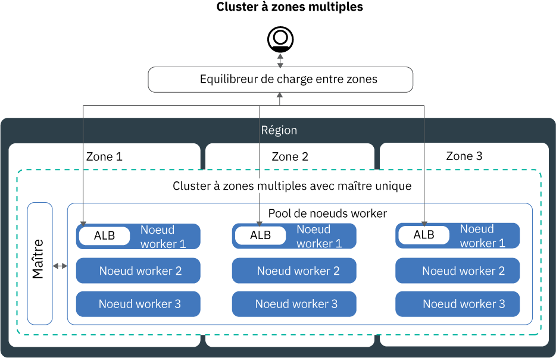

---

copyright:
  years: 2014, 2018
lastupdated: "2018-08-06"

---

{:new_window: target="_blank"}
{:shortdesc: .shortdesc}
{:screen: .screen}
{:pre: .pre}
{:table: .aria-labeledby="caption"}
{:codeblock: .codeblock}
{:tip: .tip}
{:download: .download}


# Configuration de clusters
{: #clusters}

Concevez la configuration de votre cluster Kubernetes pour un maximum de disponibilité des conteneurs et de capacité des clusters avec {{site.data.keyword.containerlong}}.
Vous démarrez ? Suivez le [tutoriel de création d'un cluster Kubernetes](cs_tutorials.html#cs_cluster_tutorial).
{:shortdesc}

## Création de clusters à zones multiples dans {{site.data.keyword.containershort_notm}}
{: #multizone}

Avec {{site.data.keyword.containerlong}}, vous avez la possibilité de créer des clusters à zones multiples. Vos utilisateurs risquent moins de rencontrer des indisponibilités lorsque vous répartissez vos applications entre plusieurs zones et noeuds worker en utilisant un pool de noeuds worker. Les fonctions intégrées, telles que l'équilibrage de charge et l'isolement, augmentent la résilience en cas de défaillance d'une zone avec des hôtes, des réseaux ou des applications. Si les ressources d'une zone sont indisponibles, les charges de travail de vos clusters seront opérationnelles dans les autres zones.
{: shortdesc}

### Attendez une minute ! Pourquoi cette discussion à propos des zones et des pools ? Qu'est-ce qui a changé ?
{: #mz_changed}

Les **zones**, appelées emplacements auparavant, sont des centres de données dans lesquels vous pouvez créer des ressources IBM Cloud.

Les clusters disposent désormais d'une fonction appelée **pool de noeuds worker**, qui est une collection de noeuds worker de même type, par exemple type de machine, UC et mémoire. Utilisez les nouvelles commandes `ibmcloud ks worker-pool` pour effectuer des modifications dans votre cluster, par exemple ajouter des zones ou des noeuds worker, ou mettre à jour des noeuds worker.

L'ancienne configuration de noeuds worker autonomes est prise en charge, mais elle est dépréciée. Veillez à [ajouter un pool de noeuds worker à votre cluster](cs_clusters.html#add_pool), puis [effectuer la migration pour utiliser des pools de noeuds worker](cs_cluster_update.html#standalone_to_workerpool) afin d'organiser vos noeuds worker au lieu d'utiliser des noeuds worker autonomes.

### Que dois-je savoir avant de démarrer ?
{: #general_reqs}

Avant d'aller plus loin, vous devez vous occuper de certains éléments d'administration pour assurer que vos clusters à zones multiples sont prêts pour les charges de travail.

<dl>
<dt>Réseaux locaux virtuels (VLAN) requis</dt>
  <dd><p>Lorsque vous ajoutez une zone dans un pool de noeuds worker, vous devez définir un VLAN privé et un VLAN public auxquels vos noeuds worker se connectent.</p><ul><li>Pour vérifier si vous disposez de VLAN existants utilisables dans cette zone, exécutez la commande `ibmcloud ks vlans <zone>`. Notez les ID des VLAN et utilisez-les lorsque vous ajoutez une zone dans un pool de noeuds worker. </li>
  <li>Si vous ne disposez pas de VLAN dans cette zone, un VLAN privé et un VLAN public sont automatiquement créés pour vous. Vous n'avez pas à les spécifier. </li></ul>
  </dd>
<dt>Activation du spanning VLAN ou VRF</dt>
  <dd><p>Vos noeuds worker doivent communiquer entre eux sur le réseau privé à travers les différentes zones. Vous disposez de deux options :</p>
  <ol><li>[Activer le spanning VLAN](/docs/infrastructure/vlans/vlan-spanning.html#vlan-spanning) dans le compte d'infrastructure IBM Cloud (SoftLayer). Pour activer le spanning VLAN, vous devez disposer des [droits Infrastructure](/docs/iam/infrastructureaccess.html#infrapermission) <strong>Réseau > Gérer spanning VLAN pour réseau</strong>, ou vous pouvez demander au propriétaire du compte de l'activer.</li>
  <li>Ou, utiliser un compte d'infrastructure IBM Cloud (SoftLayer) activé pour la fonction VRF (Virtual Router Function). Pour obtenir un compte VRF, contactez le support de l'infrastructure IBM Cloud (SoftLayer).</li></ol></dd>
<dt>Préparation des volumes persistants existants</dt>
  <dd><p>Les volumes persistants ne peuvent être utilisés que dans la zone où est située l'unité de stockage réelle. Pour éviter des erreurs d'application inattendues dans un cluster à zones multiples, vous devez appliquer des libellés de région et de zone aux volumes persistants existants. Ces libellés permettent au planificateur kube-scheduler de déterminer où planifier une application qui utilise le volume persistant. Exécutez la commande suivante et remplacez <code>&lt;mycluster&gt;</code> par le nom de votre cluster :</p>
  <pre class="pre"><code>bash <(curl -Ls https://raw.githubusercontent.com/IBM-Cloud/kube-samples/master/file-pv-labels/apply_pv_labels.sh) <mycluster></code></pre></dd>
<dt>Seuls les clusters à zone unique sont disponibles pour les instances {{site.data.keyword.Bluemix_dedicated_notm}}.</dt>
    <dd>Avec {{site.data.keyword.Bluemix_dedicated_notm}}, vous pouvez uniquement créer des [clusters à zone unique](cs_clusters.html#single_zone). La zone disponible a été prédéfinie lors de la configuration de l'environnement {{site.data.keyword.Bluemix_dedicated_notm}}. Par défaut, un cluster à zone unique est configuré avec un pool de noeuds worker nommé `default`. Ce pool regroupe des noeuds worker ayant la même configuration, par exemple le type de machine, que vous avez définie lors de la création du cluster. Vous pouvez ajouter d'autres noeuds worker à votre cluster en [redimensionnant un pool de noeuds worker existant](cs_clusters.html#resize_pool) ou en [ajoutant un nouveau pool de noeuds worker](cs_clusters.html#add_pool). Lorsque vous ajoutez un pool de noeuds worker, vous devez ajouter la zone disponible pour ce pool de sorte que les noeuds worker puissent se déployer dans cette zone. En revanche, vous ne pouvez pas ajouter d'autres zones à vos pools de noeuds worker.</dd>
</dl>

### Je suis prêt à créer un cluster à zones multiples. Par où commencer ?
{: #mz_gs}

Démarrez aujourd'hui dans la [console {{site.data.keyword.containershort_notm}}](https://console.bluemix.net/containers-kubernetes/clusters) en cliquant sur **Créer un cluster**.

Vous pouvez créer un cluster dans l'une des [villes à zones multiples](cs_regions.html#zones) :
* Dallas dans la région Sud des Etats-Unis : dal10, dal12, dal13
* Washington DC dans la région Est des Etats-Unis : wdc04, wdc06, wdc07
* Francfort dans la région Europe centrale : fra02, fra04, fra05
* Londres dans la région Sud du Royaume-Uni : lon02, lon04, lon06

**Ajoutez des zones à un cluster existant** :

Si vous disposez d'un cluster dans une ville à zones multiples, vous pouvez ajouter un pool de noeuds worker au cluster, puis ajouter une zone à ce pool en utilisant l'interface graphique ou l'interface de ligne de commande (CLI). Pour obtenir la liste complète des étapes, voir [Mise à jour des noeuds worker autonomes vers des pools de noeuds worker](cs_cluster_update.html#standalone_to_workerpool).

### Dorénavant, quelles sont les modifications apportées au niveau de la gestion de mes clusters ?
{: #mz_new_ways}

Avec l'introduction des pools de noeuds worker, vous pouvez utiliser un nouvel ensemble d'API et de commandes pour gérer votre cluster. Vous pouvez voir ces nouvelles commandes sur la [page de la documentation sur l'interface CLI](cs_cli_reference.html#cs_cli_reference) ou sur votre terminal, en exécutant la commande `ibmcloud ks help`.

Le tableau suivant compare l'ancienne et la nouvelle méthode pour quelques actions de gestion de cluster courantes.
<table summary="Le tableau présente la nouvelle manière d'exécuter des commandes pour les zones multiples. La lecture des lignes s'effectue de gauche à droite, avec la description dans la première colonne, l'ancienne méthode dans la deuxième colonne et la nouvelle méthode adaptée aux zones multiples dans la troisième colonne.">
<caption>Nouvelles méthodes pour les commandes de pool de noeuds worker à zones multiples.</caption>
  <thead>
  <th>Description</th>
  <th>Anciens noeuds worker autonomes</th>
  <th>Nouveaux pools de noeuds worker à zones multiples</th>
  </thead>
  <tbody>
    <tr>
    <td>Ajout de noeuds worker dans le cluster.</td>
    <td><strong>Déprécié</strong> : commande <code>ibmcloud ks worker-add</code> pour ajouter des noeuds worker autonomes.</td>
    <td><ul><li>Pour ajouter différents types de machine que votre pool existant, créez un nouveau pool de noeuds worker : [commande](cs_cli_reference.html#cs_worker_pool_create) <code>ibmcloud ks worker-pool-create</code>.</li>
    <li>Pour ajouter des noeuds worker à un pool existant, redimensionnez le nombre de noeuds par zone dans le pool : [commande](cs_cli_reference.html#cs_worker_pool_resize) <code>ibmcloud ks worker-pool-resize</code>.</li></ul></td>
    </tr>
    <tr>
    <td>Suppression de noeuds worker du cluster.</td>
    <td>Vous pouvez toujours utiliser la commande <code>ibmcloud ks worker-rm</code> pour supprimer un noeud worker problématique de votre cluster.</td>
    <td><ul><li>Si votre pool de noeuds worker n'est pas équilibré, par exemple après la suppression d'un noeud worker), rééquilibrez-le : [commande](cs_cli_reference.html#cs_rebalance) <code>ibmcloud ks worker-pool-rebalance</code>.</li>
    <li>Pour réduire le nombre de noeuds worker dans un pool, redimensionnez le nombre par zone (valeur maximale = 1) : [commande](cs_cli_reference.html#cs_worker_pool_resize) <code>ibmcloud ks worker-pool-resize</code>.</li></ul></td>
    </tr>
    <tr>
    <td>Utilisation d'un nouveau VLAN pour les noeuds worker.</td>
    <td><strong>Déprécié</strong> : ajoutez un nouveau noeud worker utilisant le nouveau VLAN privé ou public : <code>ibmcloud ks worker-add</code>.</td>
    <td>Définissez le pool de noeuds worker pour l'utilisation d'un autre VLAN public ou privé que celui qui était utilisé auparavant : [commande](cs_cli_reference.html#cs_zone_network_set) <code>ibmcloud ks zone-network-set</code>.</td>
    </tr>
  </tbody>
  </table>

### Comment en savoir plus sur les clusters à zones multiples ?
{: #learn_more}

La documentation complète a été mise à jour pour intégrer les zones multiples. En particulier, vous pouvez être intéressé par les rubriques suivantes qui ont connu des changements notables avec l'introduction des clusters à zones multiples :
* [Configuration de clusters à haute disponibilité](#ha_clusters)
* [Planification de déploiement d'applications à haute disponibilité](cs_app.html#highly_available_apps)
* [Exposition d'applications avec des services LoadBalancer pour les clusters à zones multiples](cs_loadbalancer.html#multi_zone_config)
* [Exposition d'applications avec Ingress](cs_ingress.html#ingress)
* Pour le stockage persistant à haute disponibilité, utilisez un service de cloud, tel que [{{site.data.keyword.cloudant_short_notm}}](/docs/services/Cloudant/getting-started.html#getting-started-with-cloudant) ou [{{site.data.keyword.cos_full_notm}}](/docs/services/cloud-object-storage/about-cos.html#about-ibm-cloud-object-storage).

## Configuration de clusters à haute disponibilité
{: #ha_clusters}
Concevez votre cluster standard de sorte à obtenir un maximum de disponibilité et de capacité pour votre application avec {{site.data.keyword.containerlong}}.

Vos utilisateurs risquent moins de rencontrer des indisponibilités lorsque vous répartissez votre configuration entre plusieurs noeuds worker, zones et clusters. Les fonctions intégrées, telles que l'équilibrage de charge et l'isolement, augmentent la résilience en cas de pannes d'hôtes, de réseaux ou d'applications.

Examinez ces configurations potentielles de cluster, classées par ordre croissant de disponibilité.


1. [Cluster à zone unique](#single_zone) avec plusieurs noeuds worker dans un pool de noeuds worker.
2. [Cluster à zones multiples](#multi_zone) qui répartit les noeuds worker sur plusieurs zones au sein d'une région.
3. [Plusieurs clusters](#multiple_clusters) configurés dans plusieurs zones ou régions connectés via un équilibreur de charge global.

### Cluster à zone unique
{: #single_zone}

Pour améliorer la disponibilité de votre application et permettre le basculement si un noeud worker n'est pas disponible dans votre cluster, ajoutez des noeuds worker supplémentaires dans votre cluster à zone unique.
{: shortdesc}


Par défaut, votre cluster à zone unique est configuré avec un pool de noeuds worker nommé `default`. Ce pool regroupe des noeuds worker ayant la même configuration, par exemple le type de machine, que vous avez définie lors de la création du cluster. Vous pouvez ajouter d'autres noeuds worker à votre cluster en [redimensionnant un pool de noeuds worker existant](#resize_pool) ou en [ajoutant un nouveau pool de noeuds worker](#add_pool). 

Lorsque vous ajoutez d'autres noeuds worker, les instances d'application peuvent être réparties sur plusieurs noeuds worker. En cas de défaillance d'un noeud worker, les instances d'application sur les noeuds worker disponibles continuent à s'exécuter. Kubernetes replanifie automatiquement les pods des noeuds worker indisponibles pour que les performances et la capacité de votre application soient assurées. Pour vérifier que vos pods sont répartis uniformément sur les noeuds worker, implémentez l'[affinité des pods](https://kubernetes.io/docs/concepts/configuration/assign-pod-node/#inter-pod-affinity-and-anti-affinity-beta-feature).

**Puis-je convertir mon cluster à zone unique en cluster à zones multiples ?**
C'est possible. Si votre cluster à zone unique figure dans une [métropole à zones multiples](cs_regions.html#zones), vous pouvez convertir le cluster à zone unique en cluster à zones multiples. Pour cela, [ajoutez une zone](#add_zone) dans le pool de noeuds worker de votre cluster. Si vous disposez de plusieurs pools de noeuds worker, ajoutez la zone à tous les pools, pour que les noeuds worker soient équilibrés dans tout le cluster.

**Dois-je utiliser des clusters à zones multiples ?**
Non. Vous pouvez créer autant de clusters à zone unique que vous le souhaitez. En effet, vous pouvez même préférer des clusters à zone unique pour une gestion simplifiée ou si votre cluster doit résider dans une [ville à zone unique](cs_regions.html#zones).

### Cluster à zones multiples
{: #multi_zone}

Pour protéger votre cluster en cas de défaillance d'une zone unique, vous pouvez répartir votre cluster sur plusieurs zones au sein d'une région.
{: shortdesc}



Vous pouvez ajouter des zones supplémentaires dans votre cluster pour répliquer les noeuds worker de votre pool de noeuds worker sur plusieurs zones au sein d'une région. Les clusters à zones multiples sont conçus pour planifier de manière uniforme les pods sur les noeuds worker et les zones afin d'assurer la disponibilité et la reprise en cas d'incident. Si les noeuds worker ne sont pas répartis uniformément sur les zones ou si la capacité est insuffisante dans l'une des zones, le planificateur de Kubernetes risque de ne pas parvenir à planifier tous les pods demandés. Par conséquent, les pods peuvent passer à l'état **En attente** jusqu'à ce que la capacité suffisante soit disponible. Si vous souhaitez modifier le comportement par défaut pour que le planificateur de Kubernetes répartisse les pods entre les zones avec une meilleure distribution, utilisez la [règle d'affinité de pods](https://kubernetes.io/docs/concepts/configuration/assign-pod-node/#inter-pod-affinity-and-anti-affinity-beta-feature) `preferredDuringSchedulingIgnoredDuringExecution`.

**Pourquoi dois-je avoir des noeuds worker répartis sur 3 zones ?** </br>
La répartition de vos charges de travail sur 3 zones permet d'assurer la haute disponibilité de votre application en cas d'indisponibilité d'une ou de deux zones, mais cela assure une configuration de cluster plus rentable. Mais pour quelle raison ? Voici un exemple.

Supposons que vous ayez besoin d'un noeud worker à 6 coeurs pour traiter la charge de travail de votre application. Voici les options à votre disposition pour rendre votre cluster encore plus disponible :

- **Dupliquer vos ressources dans une autre zone :** cette option vous laisse 2 noeuds worker, chacun avec 6 coeurs dans chaque zone, soit un total de 12 coeurs. </br>
- **Répartir les ressources sur 3 zones :** avec cette option, vous déployez 3 coeurs par zone, ce qui vous laisse une capacité totale de 9 coeurs. Pour gérer votre charge de travail, deux zones doivent être opérationnelles en même temps. Si l'une des zones est indisponible, les deux autres zones peuvent traiter votre charge de travail. Si deux zones sont indisponibles, il reste trois coeurs opérationnels pour traiter votre charge de travail. Le déploiement de 3 coeurs par zone signifie des machines plus petites et donc une réduction de coût pour vous.</br>

**Comment augmenter la disponibilité de mon maître Kubernetes ?** </br>
Un cluster à zones multiples est configuré avec un maître Kubernetes mis à disposition dans la même zone métropolitaine que les noeuds worker. Par exemple, si les noeuds worker se trouvent dans une ou plusieurs zones `dal10`, `dal12` ou `dal13`, le maître figure dans la métropole à zones multiples Dallas.

**Que se passe-t-il si le maître Kubernetes devient indisponible ?** </br>
Vous ne pouvez pas accéder ou modifier votre cluster lorsque le maître Kubernetes est indisponible. Cependant, les noeuds worker, les applications et les ressources que vous déployez ne sont pas modifiées et continuent à s'exécuter. Pour protéger votre cluster en cas de défaillance du maître ou dans les régions où les clusters à zones multiples ne sont pas disponibles, vous pouvez [configurer plusieurs clusters et les connecter avec un équilibreur de charge global](#multiple_clusters).

**Comment laisser les utilisateurs accéder à mon application à partir de l'Internet public ?**</br>
Vous pouvez exposer vos applications en utilisant un équilibreur de charge d'application (ALB) Ingress ou le service d'équilibreur de charge. Par défaut, les équilibreurs de charge d'application sont automatiquement créés et activés dans chaque zone de votre cluster. Un équilibreur de charge pour zones multiples (MZLB) est également automatiquement créé et activé pour votre cluster. L'équilibreur de charge MZLB effectue un diagnostic d'intégrité des équilibreurs de charge d'application dans chaque zone de votre cluster et conserve les résultats de recherche DNS mis à jour en fonction de ces diagnostics. Pour plus d'informations, voir [Services Ingress](cs_ingress.html#planning) à haute disponibilité.

Les services d'équilibreur de charge sont configurés dans une seule zone. Les demandes entrantes dans votre applications sont dirigées depuis cette zone vers toutes les instances d'application situées dans d'autres zones. Si cette zone devient indisponible, votre application risque d'être inaccessible sur Internet. Vous pouvez configurer des services d'équilibreur de charge supplémentaires dans d'autres zones pour tenir compte d'une défaillance de zone unique. Pour plus d'informations, voir [Services d'équilibreur de charge](cs_loadbalancer.html#multi_zone_config) à haute disponibilité.

**J'ai créé mon cluster à zones multiples. Pourquoi n'y a-t-il qu'une seule zone ? Comment ajouter ds zones à mon cluster ?**</br>
Si vous [créez votre cluster à zones multiples à l'aide de l'interface de ligne de commande](#clusters_cli), le cluster est créé, mais vous devez ajouter des zones au pool de noeuds worker pour finaliser le processus. Pour couvrir plusieurs zones, votre cluster doit figurer dans une [métropole à plusieurs zones](cs_regions.html#zones). Pour ajouter une zone à votre cluster et répartir les noeuds worker sur différentes zones, voir [Ajouter une zone dans votre cluster](#add_zone).

### Plusieurs clusters connectés avec un équilibreur de charge global
{: #multiple_clusters}

Pour protéger votre application en cas de défaillance du maître Kubernetes et pour les régions dans lesquelles les clusters à zones multiples ne sont pas disponibles, vous pouvez créer plusieurs clusters dans différentes zones au sein d'une région et les connecter avec un équilibreur de charge global.
{: shortdesc}


Pour équilibrer votre charge de travail sur plusieurs clusters, vous devez configurer un équilibreur de charge global et ajouter les adresses IP de vos équilibreurs de charge d'application (ALB) ou services d'équilibreur de charge dans votre domaine. En ajoutant ces adresses IP, vous pouvez acheminer le trafic entrant entre vos clusters. Pour que l'équilibreur de charge global détecte l'indisponibilité d'un de vos clusters, envisagez d'ajouter un diagnostic d'intégrité à base de commande ping pour toutes les adresses IP. Lorsque vous configurez ce diagnostic, votre fournisseur de DNS envoie régulièrement une commande ping pour tester les adresses IP que vous avez ajoutées dans votre domaine. Si une adresse IP devient indisponible, le trafic n'est plus adressé à cette adresse IP. Cependant, Kubernetes ne redémarre pas automatiquement les pods du cluster indisponible sur les noeuds worker des clusters disponibles. Pour que Kubernetes redémarre automatiquement les pods dans les clusters disponibles, envisagez la configuration d'un [cluster à zones multiples](#multi_zone).

**Pourquoi ai-je besoin de 3 clusters dans 3 zones ?** </br>
De la même manière que vous utilisez [3 zones dans un cluster à zones multiples](#multi_zone), vous pouvez apporter une disponibilité accrue à votre application en configurant 3 clusters sur différentes zones. Vous pouvez également réduire les coûts en achetant des machines plus petites pour traiter votre charge de travail.

**Et si je veux configurer plusieurs clusters dans différentes régions ?** </br>
Vous pouvez configurer plusieurs clusters dans différentes régions d'une géolocalisation (par exemple Sud des Etats-Unis et Est des Etats-Unis) ou entre plusieurs géolocalisations (par exemple Sud des Etats-Unis et Europe centrale). Ces deux types de configuration offrent le même niveau de disponibilité pour votre application, mais ajoute également une certaine complexité quand il s'agit de partage et de réplication de données. Dans la plupart des cas, rester dans la même géolocalisation est largement suffisant. Mais si vos utilisateurs sont répartis à travers le monde, il vaut mieux configurer un cluster là où se trouvent vos utilisateurs, pour qu'ils ne soient pas confrontés à de longs délais d'attente lorsqu'ils envoient une demande à votre application.

**Pour configurer un équilibreur de charge global pour plusieurs clusters :**

1. [Créez des clusters](cs_clusters.html#clusters) dans plusieurs zones ou régions.
2. Activez le [spanning VLAN](/docs/infrastructure/vlans/vlan-spanning.html#vlan-spanning) pour votre compte d'infrastructure IBM Cloud (SoftLayer) de sorte que vos noeuds worker puissent communiquer entre eux sur le réseau privé. Pour effectuer cette action, vous devez disposer des [droits Infrastructure](cs_users.html#infra_access) **Réseau > Gérer spanning VLAN pour réseau** ou vous pouvez demander au propriétaire du compte de l'activer. Comme alternative au spanning VLAN, vous pouvez utiliser une fonction VRF (Virtual Router Function) si elle est activée dans votre compte d'infrastructure IBM Cloud (SoftLayer).
3. Dans chaque cluster, exposez vos applications en utilisant un [équilibreur de charge d'application (ALB)](cs_ingress.html#ingress_expose_public) ou un [service d'équilibreur de charge](cs_loadbalancer.html#config).
4. Pour chaque cluster, répertoriez les adresses IP publiques pour vos équilibreurs de charge d'application et vos services d'équilibreur de charge.
   - Pour répertorier l'adresse IP de tous les équilibreurs de charge d'application publics présents dans votre cluster :
     ```
     ibmcloud ks albs --cluster <cluster_name_or_id>
     ```
     {: pre}

   - Pour répertorier l'adresse IP de votre service d'équilibreur de charge :
     ```
     kubectl describe service <myservice>
     ```
     {: pre}

     L'adresse IP de l'**équilibreur de charge Ingress** est l'adresse IP portable qui a été affectée à votre service d'équilibreur de charge.
4. Configurez un équilibreur de charge global en utilisant {{site.data.keyword.Bluemix_notm}} Internet Services (CIS) ou configurez votre propre équilibreur de charge global. 
    * Pour utiliser un équilibreur de charge global CIS :
        1. Configurez le service en suivant les étapes 1 à 4 dans [Initiation à {{site.data.keyword.Bluemix_notm}} Internet Services (CIS)](/docs/infrastructure/cis/getting-started.html#getting-started-with-ibm-cloud-internet-services-cis-).
            * Les étapes 1 à 3 vous guident pour mettre à disposition l'instance de service, ajouter votre domaine d'application et configurer vos serveurs de noms.
            * L'étape 4 vous guide dans la création d'enregistrements DNS. Créez un enregistrement DNS pour chaque adresse IP d'équilibreur de charge ou d'ALB que vous avez collectée. Ces enregistrements DNS mappent votre domaine d'application à l'ensemble des équilibreurs de charge d'application ou équilibreurs de charge de votre cluster et assurent que les demandes adressées à votre application sont transmises à vos clusters à tour de rôle.
        2. [Ajoutez des diagnostics d'intégrité](/docs/infrastructure/cis/glb-setup.html#add-a-health-check) pour les équilibreurs de charge ALB ou les équilibreurs de charge. Vous pouvez utiliser le même diagnostic d'intégrité pour les ALB et les équilibreurs de charge dans tous vos clusters ou créer des diagnostics d'intégrité spécifiques à utiliser pour des clusters particuliers.
        3. [Ajoutez un pool d'origines](/docs/infrastructure/cis/glb-setup.html#add-a-pool) pour chaque cluster en ajoutant les adresses IP de l'ALB ou de l'équilibreur de charge du cluster. Par exemple, si vous disposez de 3 clusters ayant chacun 2 équilibreurs de charge d'application (ALB), créez 3 pools d'origines ayant chacun deux adresses IP d'ALB. Ajoutez un diagnostic d'intégrité à chaque pool d'origines que vous créez.
        4. [Ajoutez un équilibreur de charge global](/docs/infrastructure/cis/glb-setup.html#set-up-and-configure-your-load-balancers).
    * Pour utiliser votre propre équilibreur de charge global :
        1. Configurez votre domaine pour acheminer le trafic entrant à votre équilibreur de charge ALB ou aux services d'équilibreur de charge en ajoutant les adresses IP de tous les ALB et services d'équilibreur de charge publics à votre domaine.
        2. Pour chaque adresse IP, activez un diagnostic d'intégrité à base de commande ping de sorte que votre fournisseur de DNS puisse détecter les adresses IP défectueuses. Si une adresse IP est défectueuse, le trafic n'est plus acheminé vers cette adresse IP.

## Planification de la configuration de noeud worker
{: #planning_worker_nodes}

Un cluster Kubernetes est composé de noeuds worker regroupés en pools de noeuds worker et est surveillé et géré de manière centralisée par le maître Kubernetes. Les administrateurs du cluster décident comment configurer le cluster de noeuds worker pour garantir que les utilisateurs du cluster disposent de toutes les ressources pour déployer et exécuter des applications dans le cluster.
{:shortdesc}

Lorsque vous créez un cluster standard, les noeuds worker ayant la même configuration sont commandés pour vous dans l'infrastructure IBM Cloud (SoftLayer) et ajoutés au pool de noeuds worker par défaut dans votre cluster. A chaque noeud worker sont affectés un ID de noeud worker unique et un nom de domaine qui ne doivent pas être modifiés après la création du cluster.

Vous pouvez opter entre des serveurs virtuels ou physiques (bare metal). En fonction du niveau d'isolement du matériel que vous sélectionnez, les noeuds worker virtuels peuvent être définis sous forme de noeuds partagés ou dédiés. Vous pouvez également décider si vos noeuds worker doivent se connecter à un VLAN public et à un VLAN privé, ou seulement à un VLAN privé. Chaque noeud worker est doté d'un type de machine spécifique qui détermine le nombre d'UC, la mémoire et l'espace disque disponibles pour les conteneurs déployés sur le noeud worker. Kubernetes limite le nombre maximal de noeuds worker dont vous pouvez disposer dans un cluster. Pour plus d'informations, voir la rubrique sur les [quotas de noeuds worker et de pods ](https://kubernetes.io/docs/setup/cluster-large/).

### Pools de noeuds worker
{: #worker_pools}

Tous les clusters sont configurés avec un pool de noeuds worker par défaut qui regroupe des noeuds worker ayant la même configuration, que vous avez définie lors de la création du cluster, par exemple le même type de machine. Si votre cluster est mis à disposition à partir de l'interface utilisateur, vous pouvez sélectionner plusieurs zones simultanément. Les clusters créés à partir de l'interface de ligne de commande (CLI) sont initialement mis à disposition avec un pool de noeuds worker dans une seule zone uniquement. Vous pouvez ajouter d'autres zones à votre pool de noeuds worker une fois le cluster mis à disposition pour répliquer les noeuds worker de manière uniforme entre les différentes zones. Par exemple, si vous ajoutez une seconde zone à un pool de noeuds worker constitué de 3 noeuds worker, ces 3 noeuds worker sont mis à disposition dans la seconde zone, ce qui vous permet de disposer d'un cluster avec au total 6 noeuds worker.

Pour activer la communication sur le réseau privé entre les noeuds worker situés dans différentes zones, vous devez activer la fonction [Spanning VLAN](/docs/infrastructure/vlans/vlan-spanning.html#vlan-spanning). Pour ajouter d'autres versions de types de machine à votre cluster, [créez un autre pool de noeuds worker](cs_cli_reference.html#cs_worker_pool_create).

### Matériel pour les noeuds worker
{: #shared_dedicated_node}

Lorsque vous créez un cluster standard dans {{site.data.keyword.Bluemix_notm}}, vous choisissez de mettre à disposition vos noeuds worker en tant que machines physiques (bare metal) ou en tant que machines virtuelles s'exécutant sur du matériel physique. Lorsque vous créez un cluster gratuit, votre noeud worker est automatiquement mis à disposition sous forme de noeud partagé virtuel dans le compte d'infrastructure IBM Cloud (SoftLayer).
{:shortdesc}


Consultez les informations suivantes pour déterminer le type de pools de noeuds worker de votre choix. Lors de la planification, envisagez un [seuil minimal limite de noeuds worker](#resource_limit_node) équivalent à 10 % de la capacité mémoire totale.

<dl>
<dt>Pourquoi utiliser des machines physiques (bare metal) ?</dt>
<dd><p><strong>Plus de ressources de calcul</strong> : vous pouvez mettre à disposition votre noeud worker en tant que serveur physique à service exclusif, également désigné par serveur bare metal. Bare metal vous permet d'accéder directement aux ressources physiques sur la machine, par exemple à la mémoire ou à l'UC. Cette configuration élimine l'hyperviseur de machine virtuelle qui alloue des ressources physiques aux machines virtuelles qui s'exécutent sur l'hôte. A la place, toutes les ressources d'une machine bare metal sont dédiées exclusivement au noeud worker, donc vous n'avez pas à vous soucier de "voisins gênants" partageant des ressources et responsables du ralentissement des performances. Les types de machine physique ont davantage de capacité de stockage local par rapport aux machines virtuelles et certaines disposent de disques RAID pour effectuer des sauvegardes de données locales.</p>
<p><strong>Facturation mensuelle</strong> : les serveurs bare metal sont plus chers que les serveurs virtuels et conviennent mieux aux applications à hautes performances qui nécessitent plus de ressources et de contrôle hôte. Les serveurs bare metal sont facturés au mois. Si vous annulez un serveur bare metal avant la fin du mois, vous êtes facturé jusqu'à la fin de ce mois. La commande et l'annulation de serveurs bare metal est un processus manuel qui s'effectue via votre compte d'infrastructure IBM Cloud (SoftLayer). Ce processus peut prendre plus d'un jour ouvrable.</p>
<p><strong>Option pour activer la fonction Calcul sécurisé</strong> : activez la fonction Calcul sécurisé pour vérifier que vos noeuds worker ne font pas l'objet de falsification. Si vous n'activez pas cette fonction lors de la création du cluster mais souhaitez le faire ultérieurement, vous pouvez utiliser la [commande](cs_cli_reference.html#cs_cluster_feature_enable) `ibmcloud ks feature-enable`. Après avoir activé cette fonction, vous ne pourrez plus la désactiver par la suite. Vous pouvez créer un nouveau cluster sans la fonction trust. Pour plus d'informations sur le mode de fonctionnement de la fonction de confiance (trust) lors du processus de démarrage du noeud, voir [{{site.data.keyword.containershort_notm}} avec calcul sécurisé](cs_secure.html#trusted_compute). La fonction de calcul sécurisé (Trusted Compute) est activée sur les clusters qui exécutent Kubernetes version 1.9 ou ultérieure et qui ont certains types de machine bare metal. Lorsque vous exécutez la [commande](cs_cli_reference.html#cs_machine_types) `ibmcloud ks machine-types <zone>`, vous pouvez voir les machines qui prennent en charge la fonction de confiance en examinant la zone **Trustable**. Par exemple, les versions GPU `mgXc` ne prennent pas en charge la fonction de calcul sécurisé.</p></dd>
<dt>Pourquoi utiliser des machines virtuelles ?</dt>
<dd><p>Avec des machines virtuelles, vous pouvez obtenir une plus grande flexibilité, des temps de mise à disposition plus rapides et plus de fonctions de mise à l'échelle automatique qu'avec des machines physiques (bare metal), à un coût plus avantageux. Vous pouvez utiliser des machines virtuelles pour la plupart des cas d'utilisation généraux, par exemple les environnements de test et de développement, les environnements de préproduction et de production, les microservices et les applications métier. Cependant, il y a un impact sur les performances. Si vous avez besoin de calcul haute performance pour des charges de travail qui consomment beaucoup de mémoire RAM, de données ou de processeur graphique (GPU), utilisez des machines bare metal.</p>
<p><strong>Choisir entre un service partagé ou exclusif</strong> : lorsque vous créez un cluster standard virtuel, vous devez décider si le matériel sous-jacent doit être partagé par plusieurs clients {{site.data.keyword.IBM_notm}} (service partagé) ou vous être dédié exclusivement (service exclusif).</p>
<p>Dans une configuration à service partagé, les ressources physiques (comme l'UC et la mémoire) sont partagées par toutes les machines virtuelles déployées sur le même matériel physique. Pour permettre à chaque machine virtuelle d'opérer indépendamment, un moniteur de machine virtuelle, également dénommé hyperviseur, segmente les ressources physiques en entités isolées et les alloue à une machine virtuelle en tant que ressources dédiées (isolement par hyperviseur).</p>
<p>Dans une configuration à service exclusif, toutes les ressources physiques vous sont dédiées en exclusivité. Vous pouvez déployer plusieurs noeuds worker en tant que machines virtuelles sur le même hôte physique. A l'instar de la configuration à service partagé, l'hyperviseur veille à ce que chaque noeud worker ait sa part des ressources physiques disponibles.</p>
<p>Les noeuds partagés sont généralement moins coûteux que les noeuds dédiés, car les coûts du matériel sous-jacent sont partagés entre plusieurs clients. Toutefois, lorsque vous choisissez entre noeuds partagés et noeud dédiés, vous devriez contacter votre service juridique pour déterminer le niveau d'isolement de l'infrastructure et de conformité requis par votre environnement d'application.</p>
<p><strong>Versions de machine virtuelle `u2c` ou `b2c`</strong> : ces machines utilisent le disque local au lieu du réseau SAN (Storage Area Networking) pour une plus grande fiabilité. Un réseau SAN procure, entre autres, une capacité de traitement plus élevée lors de la sérialisation des octets sur le disque local et réduit les risques de dégradation du système de fichiers en cas de défaillance du réseau. Ces types de machine contiennent un stockage sur disque local principal de 25 Go pour le système de fichiers du système d'exploitation et 100 Go de stockage sur disque local secondaire pour les données d'exécution de conteneur ou les données kubelet.</p>
<p><strong>Que se passe-t-il si je dispose de types de machine `u1c` ou `b1c` obsolètes ?</strong> Pour commencer à utiliser les types de machine `u2c` et `b2c`, [mettez à jour les types de machine en ajoutant des noeuds worker](cs_cluster_update.html#machine_type).</p></dd>
<dt>Entre quelles versions de machine virtuelle et physique ai-je le choix ?</dt>
<dd><p>De nombreuses versions ! Sélectionnez le type de machine correspondant le mieux à vos besoins. N'oubliez pas qu'un pool de noeuds worker est constitué de machines de même version. Si vous souhaitez avoir un mélange de types de machine dans votre cluster, créez des pool de noeuds worker distincts pour chaque version.</p>
<p>Les types de machine varient en fonction de la zone. Pour voir les types de machine disponibles dans votre zone, exécutez la commande `ibmcloud ks machine-types <zone_name>`.</p>
<p><table>
<caption>Types de machine physique (bare metal) et virtuelle disponibles dans {{site.data.keyword.containershort_notm}}.</caption>
<thead>
<th>Nom et cas d'utilisation</th>
<th>Coeurs/ Mémoire</th>
<th>Disque principal / secondaire</th>
<th>Vitesse réseau</th>
</thead>
<tbody>
<tr>
<td><strong>Virtuel, u2c.2x4</strong> : utilisez cette machine virtuelle de petite taille à des fins de test rapide, de démonstration de faisabilité et pour d'autres charges de travail légères.</td>
<td>2 / 4 Go</td>
<td>25 Go / 100 Go</td>
<td>1000 Mbit/s</td>
</tr>
<tr>
<td><strong>Virtuel, b2c.4x16</strong> : sélectionnez cette machine virtuelle équilibrée à des fins de test et de développement et pour d'autres charges de travail légères.</td>
<td>4 / 16 Go</td>
<td>25 Go / 100 Go</td>
<td>1000 Mbit/s</td>
</tr>
<tr>
<td><strong>Virtuel, b2c.16x64</strong> : sélectionnez cette machine virtuelle équilibrée pour les charges de travail de taille moyenne.</td></td>
<td>16 / 64 Go</td>
<td>25 Go / 100 Go</td>
<td>1000 Mbit/s</td>
</tr>
<tr>
<td><strong>Virtuel, b2c.32x128</strong> : sélectionnez cette machine virtuelle équilibrée pour les charges de travail de taille moyenne à élevée, par exemple une base de données et un site Web dynamique avec de nombreux utilisateurs simultanés.</td></td>
<td>32 / 128 Go</td>
<td>25 Go / 100 Go</td>
<td>1000 Mbit/s</td>
</tr>
<tr>
<td><strong>Virtuel, b2c.56x242</strong> : sélectionnez cette machine virtuelle équilibrée pour des charges de travail volumineuses, par exemple une base de données et plusieurs applications avec de nombreux utilisateurs simultanés.</td></td>
<td>56 / 242 Go</td>
<td>25 Go / 100 Go</td>
<td>1000 Mbit/s</td>
</tr>
<tr>
<td><strong>Bare metal à forte consommation de mémoire RAM, mr1c.28x512</strong> : augmentez au maximum la mémoire RAM disponible pour vos noeuds worker.</td>
<td>28 / 512 Go</td>
<td>SATA 2 To / SSD 960 Go</td>
<td>10000 Mbit/s</td>
</tr>
<tr>
<td><strong>Bare metal GPU, mg1c.16x128</strong> : choisissez ce type de machine pour des charges de travail nécessitant de nombreux calculs mathématiques, tels que le calcul hautes performances, l'apprentissage automatique ou les applications en 3D. Cette version comporte 1 carte physique Tesla K80 avec 2 unités de traitement graphiques (GPU) par carte pour un total de 2 GPU.</td>
<td>16 / 128 Go</td>
<td>SATA 2 To / SSD 960 Go</td>
<td>10000 Mbit/s</td>
</tr>
<tr>
<td><strong>Bare metal GPU, mg1c.28x256</strong> : choisissez ce type de machine pour des charges de travail nécessitant de nombreux calculs mathématiques, tels que le calcul hautes performances, l'apprentissage automatique ou les applications en 3D. Cette version possède 2 cartes physiques Tesla K80 avec 2 unités GPU par carte pour un total de 4 unités GPU.</td>
<td>28 / 256 Go</td>
<td>SATA 2 To / SSD 960 Go</td>
<td>10000 Mbit/s</td>
</tr>
<tr>
<td><strong>Bare metal à forte consommation de données, md1c.16x64.4x4tb</strong> : idéal pour une quantité substantielle de stockage sur disque local, y compris RAID, pour la sauvegarde de données stockées localement sur la machine. A utiliser pour les charges de travail de systèmes de fichiers répartis, de bases de données volumineuses ou d'analyse de big data.</td>
<td>16 / 64 Go</td>
<td>RAID1 2x2 To / RAID10 SATA 4x4 To</td>
<td>10000 Mbit/s</td>
</tr>
<tr>
<td><strong>Bare metal à forte consommation de données, md1c.28x512.4x4tb</strong> : idéal pour une quantité substantielle de stockage sur disque local, y compris RAID, pour la sauvegarde de données stockées localement sur la machine. A utiliser pour les charges de travail de systèmes de fichiers répartis, de bases de données volumineuses ou d'analyse de big data.</td>
<td>28 / 512 Go</td>
<td>RAID1 2x2 To / RAID10 SATA 4x4 To</td>
<td>10000 Mbit/s</td>
</tr>
<tr>
<td><strong>Bare metal équilibré, mb1c.4x32</strong> : à utiliser pour les charges de travail équilibrées qui nécessitent plus de ressources de calcul qu'en offrent les machines virtuelles.</td>
<td>4 / 32 Go</td>
<td>SATA 2 To / SATA 2 To</td>
<td>10000 Mbit/s</td>
</tr>
<tr>
<td><strong>Bare metal équilibré, mb1c.16x64</strong> : à utiliser pour les charges de travail équilibrées qui nécessitent plus de ressources de calcul qu'en offrent les machines virtuelles.</td>
<td>16 / 64 Go</td>
<td>SATA 2 To / SSD 960 Go</td>
<td>10000 Mbit/s</td>
</tr>
</tbody>
</table>
</p>
</dd>
</dl>


Vous pouvez déployer des clusters en utilisant l'[interface utilisateur de la console](#clusters_ui) ou l'[interface CLI](#clusters_cli).

### Connexion de réseau local virtuel (VLAN) pour noeuds worker
{: #worker_vlan_connection}

Lorsque vous créez un cluster, chaque cluster est automatiquement connecté à un réseau local virtuel depuis votre compte d'infrastructure IBM Cloud (SoftLayer).
{:shortdesc}

Un réseau local virtuel (VLAN) configure un groupe de noeuds worker et de pods comme s'ils étaient reliés physiquement au même câble.
* Le VLAN public comporte deux sous-réseaux fournis automatiquement. Le sous-réseau public principal détermine l'adresse IP publique affectée à un noeud worker lors de la création du cluster et le sous-réseau public portable fournit les adresses IP publiques pour les services de réseau d'Ingress et de l'équilibreur de charge.
* Le VLAN privé comporte également deux sous-réseaux fournis automatiquement. Le sous-réseau privé principal détermine l'adresse IP privée affectée à un noeud worker lors de la création du cluster et le sous-réseau privé portable fournit les adresses IP privées pour les services de réseau d'Ingress et de l'équilibreur de charge.

Dans le cas de clusters gratuits, lors de la création du cluster, les noeuds worker du cluster sont connectés par défaut à un réseau virtuel public et à un réseau privé virtuel dont IBM est le propriétaire.

Dans le cas de clusters standard, la première fois que vous créez un cluster dans une zone, un VLAN public et un VLAN privé sont automatiquement mis à votre disposition. Pour tous les autres clusters que vous créez dans cette zone, vous pouvez choisir les VLAN que vous voulez utiliser. Vous pouvez connecter vos noeuds worker à la fois à un réseau virtuel public et au réseau virtuel privé, ou seulement au réseau virtuel privé. Si vous désirez connecter vos noeuds worker uniquement à un VLAN privé, vous pouvez utiliser l'ID d'un VLAN existant ou [créer un VLAN privé](/docs/cli/reference/softlayer/index.html#sl_vlan_create) et utiliser l'ID lors de la création du cluster. Si les noeuds worker sont configurés uniquement avec un VLAN privé, vous devez configurer une autre solution pour la connectivité du réseau, par exemple un [dispositif de routeur virtuel (VRA)](cs_vpn.html#vyatta), afin que les noeuds worker puissent communiquer avec le maître.

**Remarque** : si vous disposez de plusieurs VLAN pour un cluster ou de plusieurs sous-réseaux  sur le même VLAN, vous devez activer la fonction Spanning VLAN pour que vos noeuds worker puissent communiquer entre eux sur le réseau privé. Pour obtenir les instructions correspondantes, voir [Activer ou désactiver le spanning VLAN](/docs/infrastructure/vlans/vlan-spanning.html#vlan-spanning).

### Limite de mémoire des noeuds worker
{: #resource_limit_node}

{{site.data.keyword.containershort_notm}} définit une limite de mémoire sur chaque noeud worker. Lorsque des pods qui s'exécutent sur le noeud worker dépassent cette limite de mémoire, ils sont supprimés. Dans Kubernetes, cette limite est appelée [seuil d’éviction immédiate](https://kubernetes.io/docs/tasks/administer-cluster/out-of-resource/#hard-eviction-thresholds).
{:shortdesc}

Si vos pods sont fréquemment supprimés, ajoutez des noeuds worker à votre cluster ou définissez des [limites de ressource](https://kubernetes.io/docs/concepts/configuration/manage-compute-resources-container/#resource-requests-and-limits-of-pod-and-container) sur vos pods.

**Chaque machine comporte un seuil minimal équivalent à 10 % de sa capacité mémoire totale**. Lorsque la quantité de mémoire disponible sur le noeud worker est inférieure au seuil minimal autorisé, Kubernetes retire immédiatement le pod. Le pod est replanifié sur un autre noeud worker disponible. Par exemple si vous disposez d'une machine virtuelle `b2c.4x16`, sa capacité mémoire totale est de 16 Go. Si la mémoire disponible est inférieure à 1600 Mo (10%), il est impossible de planifier de nouveaux pods sur ce noeud worker et ils sont alors replanifiés sur un autre noeud. S'il n'y a pas d'autre noeud worker disponible, les nouveaux pods restent non planifiés.

Pour vérifier la quantité de mémoire utilisée sur un noeud worker, exécutez [kubectl top node ](https://kubernetes.io/docs/reference/kubectl/overview/#top).

### Reprise automatique pour vos noeuds worker
`Docker`, `kubelet`, `kube-proxy` et `calico` sont des composants essentiels qui doivent être fonctionnels pour que le noeud worker Kubernetes soit en bonne santé. Avec le temps, ces composants peuvent connaître des défaillances et laisser votre noeud worker dans un état non opérationnel. Si les noeuds worker ne sont pas opérationnels, la capacité totale du cluster diminue et votre application peut devenir indisponible.

Vous pouvez [configurer des diagnostics d'intégrité pour votre noeud worker et activer la reprise automatique](cs_health.html#autorecovery). Si le système de reprise automatique détecte un mauvais état de santé d'un noeud worker d'après les vérifications configurées, il déclenche une mesure corrective (par exemple, un rechargement du système d'exploitation) sur le noeud worker. Pour plus d'informations sur le fonctionnement de la reprise automatique, consultez le [blogue Autorecovery ](https://www.ibm.com/blogs/bluemix/2017/12/autorecovery-utilizes-consistent-hashing-high-availability/).

<br />


## Création de clusters depuis l'interface graphique
{: #clusters_ui}

L'objectif du cluster Kubernetes est de définir un ensemble de ressources, de noeuds, de réseaux et de périphériques de stockage permettant d'assurer une haute disponibilité des applications. Avant de pouvoir déployer une application, vous devez créer un cluster et spécifier les définitions des noeuds worker dans ce cluster.
{:shortdesc}

**Avant de commencer**

Vous devez disposer d'un [compte {{site.data.keyword.Bluemix_notm}}](https://console.bluemix.net/registration/) de type Essai, Paiement à la carte ou Abonnement.

Pour personnaliser entièrement vos clusters avec, entre autres, l'isolement du matériel, la zone, la version d'API de votre choix, créez un cluster standard.
{: tip}

**Pour créer un cluster gratuit**

Vous pouvez utiliser votre premier cluster gratuit pour vous familiariser avec le mode de fonctionnement d'{{site.data.keyword.containershort_notm}}. Avec les clusters gratuits, vous pouvez faire connaissance avec la terminologie utilisée, exécuter un tutoriel et prendre vos repères avant de vous lancer dans les clusters standard de niveau production. Ne vous inquiétez pas, vous bénéficiez toujours d'un cluster gratuit que vous disposiez d'un compte de type Paiement à la carte ou Abonnement. **Remarque** : les clusters gratuits ont une durée de vie de 21 jours. A l'issue de cette période, le cluster arrive à expiration et il est supprimé ainsi que toutes les données qu'il contient. Les données supprimées ne sont pas sauvegardées par {{site.data.keyword.Bluemix_notm}} et ne peuvent pas être récupérées. Veillez à effectuer la sauvegarde des données importantes.

1. Dans le catalogue, sélectionnez **{{site.data.keyword.containershort_notm}}**.

2. Sélectionnez une région dans laquelle déployer votre cluster.

3. Sélectionnez le plan de cluster **Gratuit**.

4. Attribuez un nom à votre cluster. Le nom doit commencer par une lettre, peut contenir des lettres, des nombres et des tirets (-) et ne doit pas dépasser 35 caractères. Le nom du cluster et la région dans laquelle est déployé le cluster constituent le nom de domaine qualifié complet du sous-domaine Ingress. Pour garantir que ce sous-domaine est unique dans une région, le nom de cluster peut être tronqué et complété par une valeur aléatoire dans le nom de domaine Ingress.


5. Cliquez sur **Créer un cluster**. Par défaut un pool de noeuds worker contenant un noeud worker est créé. Vous pouvez voir la progression du déploiement du noeud worker dans l'onglet **Noeuds worker**. Une fois le déploiement terminé, vous pouvez voir si le cluster est prêt dans l'onglet **Vue d'ensemble**.

    Toute modification de l'ID unique ou du nom de domaine affecté lors de la création empêche le maître Kubernetes de gérer votre cluster.
    {: tip}

</br>

**Pour créer un cluster standard**

1. Dans le catalogue, sélectionnez **{{site.data.keyword.containershort_notm}}**.

2. Sélectionnez une région dans laquelle déployer votre cluster. Pour des performances optimales, sélectionnez la région la plus proche de vous. N'oubliez pas que si vous sélectionnez une zone à l'étranger, il se peut que vous ayez besoin d'une autorisation légale pour pouvoir stocker des données.

3. Sélectionnez le plan de cluster **Standard**. Avec un cluster standard, vous avez accès à des fonctions, par exemple plusieurs noeuds worker, pour bénéficier d'un environnement à haute disponibilité.

4. Entrez les détails de votre zone.

    1. Sélectionnez la disponibilité **Zone unique** ou **Zones multiples**. Dans un cluster à zones multiples, le noeud maître est déployé dans une zone compatible avec plusieurs zones et les ressources de votre cluster sont réparties sur plusieurs zones. Vos options peuvent être limitées par région.

    2. Sélectionnez les zones spécifiques dans lesquelles vous souhaitez héberger votre cluster. Vous devez sélectionner au moins 1 zone mais vous pouvez en sélectionner autant que vous voulez. Si vous sélectionnez plusieurs zones, les noeuds worker sont répartis sur les zones que vous avez choisies ce qui vous offre une plus grande disponibilité. Si vous vous contentez de sélectionner 1 zone, vous pouvez [ajouter des zones dans votre cluster](#add_zone) une fois qu'il a été créé.

    3. Sélectionnez un VLAN public (facultatif) et un VLAN privé (obligatoire) dans votre compte d'infrastructure IBM Cloud (SoftLayer). Les noeuds worker communiquent entre eux via le VLAN privé. Pour communiquer avec le maître Kubernetes, vous devez configurer la connectivité publique pour votre noeud worker. Si vous n'avez aucun VLAN public ou privé dans cette zone, n'indiquez rien. Un VLAN public et un VLAN privé sont automatiquement créés pour vous. Si vous disposez déjà de VLAN et que vous ne spécifiez pas de VLAN public, envisagez la configuration d'un pare-feu, par exemple un [dispositif de routeur virtuel](/docs/infrastructure/virtual-router-appliance/about.html#about). Vous pouvez utiliser le même VLAN pour plusieurs clusters. Pour activer la communication sur le réseau privé entre les noeuds worker situés dans différentes zones, vous devez activer la fonction [Spanning VLAN](/docs/infrastructure/vlans/vlan-spanning.html#vlan-spanning). **Remarque** : si les noeuds worker sont configurés uniquement avec un VLAN privé, vous devez configurer une autre solution pour la connectivité du réseau.

5. Configurez votre pool de noeuds worker par défaut. Les pools de noeuds worker sont des groupes de noeuds worker qui partagent la même configuration. Vous pouvez toujours ajouter d'autres pools de noeuds worker à votre cluster par la suite.

    1. Sélectionnez un type d'isolement matériel. Le type virtuel est facturé à l'heure et le type bare metal est facturé au mois.

        - **Virtuel - Dédié** : vos noeuds worker sont hébergés sur l'infrastructure réservée à votre compte. Vos ressources physiques sont complètement isolées.

        - **Virtuel - Partagé** : les ressources de l'infrastructure, telles que l'hyperviseur et le matériel physique, sont partagées par vous et d'autres clients IBM, mais vous êtes seul à accéder à chaque noeud worker. Bien que cette solution soit moins onéreuse et suffisante dans la plupart des cas, vérifiez cependant les consignes de votre entreprise relatives aux exigences en termes de performance et d'infrastructure.

        - **Bare Metal** : facturés au mois, les serveurs bare metal sont mis à disposition par interaction manuelle avec l'infrastructure IBM Cloud (SoftLayer) et cette opération peut prendre plus d'un jour ouvrable. La configuration bare metal convient le mieux aux applications à hautes performances qui nécessitent plus de ressources et de contrôle hôte. Pour les clusters qui exécutent Kubernetes version 1.9 ou ultérieure, vous pouvez également choisir d'activer la fonction [Calcul sécurisé](cs_secure.html#trusted_compute) pour vérifier que vos noeuds worker ne font pas l'objet de falsification. La fonction de calcul sécurisé (Trusted Compute) est disponible pour les types de machine bare metal sélectionnés. Par exemple, les versions GPU `mgXc` ne prennent pas en charge la fonction de calcul sécurisé. Si vous n'activez pas cette fonction lors de la création du cluster mais souhaitez le faire ultérieurement, vous pouvez utiliser la [commande](cs_cli_reference.html#cs_cluster_feature_enable) `ibmcloud ks feature-enable`. Après avoir activé cette fonction, vous ne pourrez plus la désactiver par la suite.

        Assurez-vous de vouloir mettre à disposition une machine bare metal. Comme elle est facturée au mois, si vous l'annulez immédiatement après l'avoir commandée par erreur, vous serez toujours redevable pour le mois complet.
        {:tip}

    2. Sélectionnez un type de machine. Le type de machine définit le nombre d'UC virtuelles, la mémoire et l'espace disque configurés dans chaque noeud worker et rendus disponibles aux conteneurs. Les types de machines virtuelles et bare metal disponibles varient en fonction de la zone de déploiement du cluster. Après avoir créé votre cluster, vous pouvez ajouter différents types de machine en ajoutant un noeud worker ou un pool de noeuds worker dans le cluster.

    3. Indiquez le nombre de noeuds worker dont vous avez besoin dans le cluster. Le nombre de noeuds worker que vous entrez est répliqué sur le nombre de zones que vous avez sélectionnées. Cela signifie que si vous disposez de 2 zones et que vous sélectionnez 3 noeuds worker, 6 noeuds sont mis à disposition et 3 noeuds résident dans chaque zone.

6. Attribuez un nom unique à votre cluster. **Remarque** : toute modification de l'ID unique ou du nom de domaine affecté lors de la création empêche le maître Kubernetes de gérer votre cluster.

7. Sélectionnez la version du serveur d'API Kubernetes pour le noeud maître du cluster.

8. Cliquez sur **Créer un cluster**. Un pool de noeuds worker est créé avec le nombre de noeuds worker que vous avez spécifié. Vous pouvez voir la progression du déploiement du noeud worker dans l'onglet **Noeuds worker**. Une fois le déploiement terminé, vous pouvez voir si le cluster est prêt dans l'onglet **Vue d'ensemble**.

**Etape suivante ?**

Une fois le cluster opérationnel, vous pouvez réaliser les tâches suivantes :

-   Répartir les noeuds worker sur plusieurs zones en [ajoutant une zone dans votre cluster](#add_zone).
-   [Installer les interfaces de ligne de commande pour commencer à utiliser votre cluster.](cs_cli_install.html#cs_cli_install)
-   [Déployer une application dans votre cluster.](cs_app.html#app_cli)
-   [Configurer votre propre registre privé dans {{site.data.keyword.Bluemix_notm}} pour stocker et partager des images Docker avec d'autres utilisateurs.](/docs/services/Registry/index.html)
- Si vous disposez de plusieurs VLAN pour un cluster ou de plusieurs sous-réseaux sur le même VLAN, vous devez [activer la fonction Spanning VLAN](/docs/infrastructure/vlans/vlan-spanning.html#vlan-spanning) pour que vos noeuds worker puissent communiquer entre eux sur le réseau privé.
- Si vous utilisez un pare-feu, vous devrez peut-être [ouvrir les ports requis](cs_firewall.html#firewall) afin d'utiliser les commandes `ibmcloud`, `kubectl` ou `calicotl` pour autoriser le trafic sortant de votre cluster ou le trafic entrant pour les services réseau.
-  Pour les clusters avec Kubernetes version 1.10 ou ultérieure : Contrôler qui peut créer des pods dans votre cluster avec les [politiques de sécurité de pod](cs_psp.html).

<br />


## Création de clusters depuis l'interface CLI
{: #clusters_cli}

L'objectif du cluster Kubernetes est de définir un ensemble de ressources, de noeuds, de réseaux et de périphériques de stockage permettant d'assurer une haute disponibilité des applications. Avant de pouvoir déployer une application, vous devez créer un cluster et spécifier les définitions des noeuds worker dans ce cluster.
{:shortdesc}

Avant de commencer :
- Vous devez disposer d'un [compte {{site.data.keyword.Bluemix_notm}}](https://console.bluemix.net/registration/) avec paiement à la carte ou abonnement, configuré pour [accéder au portefeuille d'infrastructure IBM Cloud (SoftLayer)](cs_troubleshoot_clusters.html#cs_credentials). Vous pouvez créer 1 cluster gratuit pour expérimenter certaines fonctionnalités pour une durée de 30 jours ou créer des clusters standard entièrement personnalisables avec l'isolement matériel de votre choix.
- [Vérifiez que vous disposez des droits minimum requis dans l'infrastructure IBM Cloud (SoftLayer) pour mettre à disposition un cluster standard](cs_users.html#infra_access).
- Installez l'interface de ligne de commande {{site.data.keyword.Bluemix_notm}} et le [plug-in {{site.data.keyword.containershort_notm}}](cs_cli_install.html#cs_cli_install).
- Si vous disposez de plusieurs VLAN pour un cluster ou de plusieurs sous-réseaux sur le même VLAN, vous devez [activer la fonction Spanning VLAN](/docs/infrastructure/vlans/vlan-spanning.html#vlan-spanning) pour que vos noeuds worker puissent communiquer entre eux sur le réseau privé.

Pour créer un cluster, procédez comme suit :

1.  Connectez-vous à l'interface de ligne de commande d'{{site.data.keyword.Bluemix_notm}}.

    1.  Connectez-vous et entrez vos données d'identification {{site.data.keyword.Bluemix_notm}} lorsque vous y êtes invité.

        ```
        ibmcloud login
        ```
        {: pre}

        **Remarque :** si vous possédez un ID fédéré, exécutez la commande `ibmcloud login --sso` pour vous connecter à l'interface de ligne de commande {{site.data.keyword.Bluemix_notm}}. Entrez votre nom d'utilisateur et utilisez l'URL mentionnée dans la sortie CLI pour extraire votre code d'accès à usage unique. Si la connexion échoue alors que vous omettez l'option `--sso` et aboutit en incluant l'option `--sso`, ceci indique que votre ID est fédéré.

    2. Si vous disposez de plusieurs comptes {{site.data.keyword.Bluemix_notm}}, sélectionnez le compte que vous voulez utiliser pour créer votre cluster Kubernetes.

    3.  Si vous désirez créer ou accéder à des clusters Kubernetes dans une région {{site.data.keyword.Bluemix_notm}} autre que celle que vous aviez sélectionnée auparavant, exécutez la commande `ibmcloud ks region-set`.

3.  Créez un cluster.

    1.  **Clusters standard** : examinez les zones disponibles. Les zones affichées dépendent de la région {{site.data.keyword.containershort_notm}} à laquelle vous êtes connecté.

        **Remarque** : pour étendre votre cluster sur plusieurs zones, vous devez le créer dans une [zone compatible avec plusieurs zones](cs_regions.html#zones).

        ```
        ibmcloud ks zones
        ```
        {: pre}

    2.  **Clusters standard** : sélectionnez une zone et examinez les types de machine disponibles dans cette zone. Le type de machine spécifie les hôtes de calcul virtuels ou physiques disponibles pour chaque noeud worker.

        -  Consultez la zone **Type de serveur** pour sélectionner des machines virtuelles ou physiques (bare metal).
        -  **Virtuel** : facturées à l'heure, les machines virtuelles sont mises à disposition sur du matériel partagé ou dédié.
        -  **Physique** : facturés au mois, les serveurs bare metal sont mis à disposition par interaction manuelle avec l'infrastructure IBM Cloud (SoftLayer) et cette opération peut prendre plus d'un jour ouvrable. La configuration bare metal convient le mieux aux applications à hautes performances qui nécessitent plus de ressources et de contrôle hôte.
        - **Machines physiques avec la fonction de calcul sécurisé** : pour les clusters bare metal qui exécutent Kubernetes version 1.9 ou ultérieure, vous pouvez également choisir d'activer la fonction [Calcul sécurisé](cs_secure.html#trusted_compute) pour vérifier que vos noeuds worker bare metal ne font pas l'objet de falsification. La fonction de calcul sécurisé (Trusted Compute) est disponible pour les types de machine bare metal sélectionnés. Par exemple, les versions GPU `mgXc` ne prennent pas en charge la fonction de calcul sécurisé. Si vous n'activez pas cette fonction lors de la création du cluster mais souhaitez le faire ultérieurement, vous pouvez utiliser la [commande](cs_cli_reference.html#cs_cluster_feature_enable) `ibmcloud ks feature-enable`. Après avoir activé cette fonction, vous ne pourrez plus la désactiver par la suite.
        -  **Types de machine** : pour décider du type de machine à déployer, examinez les combinaisons coeur/mémoire/stockage du [matériel disponible pour les noeuds worker](#shared_dedicated_node). Après avoir créé votre cluster, vous pouvez ajouter différents types de machine physique ou virtuelle en [ajoutant un pool de noeuds worker](#add_pool).

           Assurez-vous de vouloir mettre à disposition une machine bare metal. Comme elle est facturée au mois, si vous l'annulez immédiatement après l'avoir commandée par erreur, vous serez toujours redevable pour le mois complet.
           {:tip}

        ```
        ibmcloud ks machine-types <zone>
        ```
        {: pre}

    3.  **Clusters standard** : vérifiez s'il existe des réseaux VLAN publics et privés dans l'infrastructure IBM Cloud (SoftLayer) pour ce compte.

        ```
        ibmcloud ks vlans <zone>
        ```
        {: pre}

        ```
        ID        Name                Number   Type      Router  
        1519999   vlan   1355     private   bcr02a.dal10  
        1519898   vlan   1357     private   bcr02a.dal10 
        1518787   vlan   1252     public   fcr02a.dal10 
        1518888   vlan   1254     public    fcr02a.dal10
        ```
        {: screen}

        S'il existe déjà un réseau virtuel public et privé, notez les routeurs correspondants. Les routeurs de VLAN privé commencent toujours par <code>bcr</code> (routeur de back-end) et les routeurs de VLAN public par <code>fcr</code> (routeur de front-end). Lors de la création d'un cluster et de la spécification des VLAN publics et privés, le nombre et la combinaison de lettres après ces préfixes doivent correspondre. Dans l'exemple de sortie, n'importe quel VLAN privé peut être utilisé avec l'un des VLAN publics étant donné que les routeurs incluent tous `02a.dal10`.

        Vous devez connecter vos noeuds worker à un VLAN privé et vous pouvez éventuellement connecter vos noeuds worker à un VLAN public. **Remarque** : si les noeuds worker sont configurés uniquement avec un VLAN privé, vous devez configurer une autre solution pour la connectivité du réseau.

    4.  **Clusters gratuits et standard** : exécutez la commande `cluster-create`. Vous pouvez opter pour un cluster gratuit qui inclut un noeud worker configuré avec 2 UC virtuelles et 4 Go de mémoire qui sera supprimé automatiquement au bout de 30 jours. Lorsque vous créez un cluster standard, par défaut, les disques de noeud worker sont chiffrés, son matériel est partagé par plusieurs clients IBM et il est facturé par heures d'utilisation. </br>Exemple pour un cluster standard. Indiquez les options du cluster :

        ```
        ibmcloud ks cluster-create --zone dal10 --machine-type b2c.4x16 --hardware <shared_or_dedicated> --public-vlan <public_VLAN_ID> --private-vlan <private_VLAN_ID> --workers 3 --name <cluster_name> --kube-version <major.minor.patch> [--disable-disk-encrypt][--trusted]
        ```
        {: pre}

        Exemple pour un cluster gratuit. Indiquez le nom du cluster :

        ```
        ibmcloud ks cluster-create --name my_cluster
        ```
        {: pre}

        <table>
        <caption>Composantes de la commande cluster-create</caption>
        <thead>
        <th colspan=2> Description des composantes de cette commande</th>
        </thead>
        <tbody>
        <tr>
        <td><code>cluster-create</code></td>
        <td>Commande de création d'un cluster dans votre organisation {{site.data.keyword.Bluemix_notm}}.</td>
        </tr>
        <tr>
        <td><code>--zone <em>&lt;zone&gt;</em></code></td>
        <td>**Clusters standard** : remplacez <em>&lt;zone&gt;</em> par l'ID de la zone {{site.data.keyword.Bluemix_notm}} où vous souhaitez créer votre cluster. Les zones  disponibles dépendent de la région {{site.data.keyword.containershort_notm}} à laquelle vous êtes connecté.<br></br>**Remarque** : les noeuds worker du cluster sont déployés dans cette zone. Pour étendre votre cluster entre les différentes zones, vous devez créer le cluster dans une [zone compatible avec plusieurs zones](cs_regions.html#zones). Une fois le cluster créé, vous pouvez [ajouter une zone dans le cluster](#add_zone).</td>
        </tr>
        <tr>
        <td><code>--machine-type <em>&lt;machine_type&gt;</em></code></td>
        <td>**Clusters standard** : choisissez un type de machine. Vous pouvez déployer vos noeuds worker en tant que machines virtuelles sur du matériel partagé ou dédié ou en tant que machines physiques sur un serveur bare metal. Les types de machines virtuelles et physiques disponibles varient en fonction de la zone de déploiement du cluster. Pour plus d'informations, voir la documentation correspondant à la [commande](cs_cli_reference.html#cs_machine_types) `ibmcloud ks machine-type`.Dans le cas de clusters gratuits, vous n'avez pas besoin de définir le type de machine.</td>
        </tr>
        <tr>
        <td><code>--hardware <em>&lt;shared_or_dedicated&gt;</em></code></td>
        <td>**Clusters standard (virtuels uniquement)** : niveau d'isolation du matériel pour votre noeud worker. Utilisez dedicated pour que toutes les ressources physiques vous soient dédiées exclusivement ou shared pour permettre leur partage avec d'autres clients IBM. La valeur par défaut est shared. Cette valeur est facultative pour les clusters standard et n'est pas disponible pour les clusters gratuits.</td>
        </tr>
        <tr>
        <td><code>--public-vlan <em>&lt;public_vlan_id&gt;</em></code></td>
        <td><ul>
          <li>**Clusters gratuits** : vous n'avez pas besoin de définir de réseau local virtuel (VLAN) public. Votre cluster gratuit est automatiquement connecté à un VLAN public dont IBM est propriétaire.</li>
          <li>**Clusters standard** : si vous disposez déjà d'un VLAN public configuré dans votre compte d'infrastructure IBM Cloud (SoftLayer) pour cette zone, entrez l'ID du VLAN public. Si vous désirez connecter vos noeuds worker uniquement à un VLAN privé, n'indiquez pas cette option. **Remarque** : si les noeuds worker sont configurés uniquement avec un VLAN privé, vous devez configurer une autre solution pour la connectivité du réseau.<br/><br/>
          <strong>Remarque</strong> : les routeurs de VLAN privé commencent toujours par <code>bcr</code> (routeur de back-end) et les routeurs de VLAN public par <code>fcr</code> (routeur de front-end). Lors de la création d'un cluster et de la spécification des VLAN publics et privés, le nombre et la combinaison de lettres après ces préfixes doivent correspondre.</li>
        </ul></td>
        </tr>
        <tr>
        <td><code>--private-vlan <em>&lt;private_vlan_id&gt;</em></code></td>
        <td><ul><li>**Clusters gratuits** : vous n'avez pas besoin de définir de VLAN privé. Votre cluster gratuit est automatiquement connecté à un VLAN privé dont IBM est propriétaire.</li><li>**Clusters standard** : si vous disposez déjà d'un VLAN privé configuré dans votre compte d'infrastructure IBM Cloud (SoftLayer) pour cette zone, entrez l'ID du VLAN privé. Si vous ne disposez pas d'un VLAN privé dans votre compte, ne spécifiez pas cette option. {{site.data.keyword.containershort_notm}} crée automatiquement un VLAN privé pour vous.<br/><br/><strong>Remarque</strong> : les routeurs de VLAN privé commencent toujours par <code>bcr</code> (routeur de back-end) et les routeurs de VLAN public par <code>fcr</code> (routeur de front-end). Lors de la création d'un cluster et de la spécification des VLAN publics et privés, le nombre et la combinaison de lettres après ces préfixes doivent correspondre.</li></ul></td>
        </tr>
        <tr>
        <td><code>--name <em>&lt;name&gt;</em></code></td>
        <td>**Clusters gratuits et standard** : remplacez <em>&lt;name&gt;</em> par le nom de votre cluster. Le nom doit commencer par une lettre, peut contenir des lettres, des nombres et des tirets (-) et ne doit pas dépasser 35 caractères. Le nom du cluster et la région dans laquelle est déployé le cluster constituent le nom de domaine qualifié complet du sous-domaine Ingress. Pour garantir que ce sous-domaine est unique dans une région, le nom de cluster peut être tronqué et complété par une valeur aléatoire dans le nom de domaine Ingress.
</td>
        </tr>
        <tr>
        <td><code>--workers <em>&lt;number&gt;</em></code></td>
        <td>**Clusters standard** : nombre de noeuds worker à inclure dans le cluster. Si l'option <code>--workers</code> n'est pas spécifiée, 1 noeud worker est créé.</td>
        </tr>
        <tr>
          <td><code>--kube-version <em>&lt;major.minor.patch&gt;</em></code></td>
          <td>**Clusters standard** : version Kubernetes du noeud maître du cluster. Cette valeur est facultative. Lorsque la version n'est pas spécifiée, le cluster est créé avec la valeur par défaut des versions Kubernetes prises en charge. Pour voir les versions disponibles, exécutez la commande <code>ibmcloud ks kube-versions</code>.
</td>
        </tr>
        <tr>
        <td><code>--disable-disk-encrypt</code></td>
        <td>**Clusters gratuits et standard** : les noeuds worker proposent le chiffrement de disque par défaut. [En savoir plus](cs_secure.html#encrypted_disk). Incluez cette option si vous désirez désactiver le chiffrement.</td>
        </tr>
        <tr>
        <td><code>--trusted</code></td>
        <td>**Clusters bare metal standard** : activez la fonction [Calcul sécurisé](cs_secure.html#trusted_compute) pour vérifier que vos noeuds worker bare metal ne font pas l'objet de falsification. La fonction de calcul sécurisé (Trusted Compute) est disponible pour les types de machine bare metal sélectionnés. Par exemple, les versions GPU `mgXc` ne prennent pas en charge la fonction de calcul sécurisé. Si vous n'activez pas cette fonction lors de la création du cluster mais souhaitez le faire ultérieurement, vous pouvez utiliser la [commande](cs_cli_reference.html#cs_cluster_feature_enable) `ibmcloud ks feature-enable`. Après avoir activé cette fonction, vous ne pourrez plus la désactiver par la suite.</td>
        </tr>
        </tbody></table>

4.  Vérifiez que la création du cluster a été demandée.

    ```
    ibmcloud ks clusters
    ```
    {: pre}

    **Remarque :** pour les machines virtuelles, la commande des postes de noeud worker et la mise à disposition et la configuration du cluster dans votre compte peuvent prendre quelques minutes. Les machines physiques bare metal sont mises à disposition par interaction manuelle avec l'infrastructure IBM Cloud (SoftLayer) et cette opération peut prendre plus d'un jour ouvrable.

    Lorsque la mise à disposition de votre cluster est finalisée, le statut du cluster passe à **deployed**.

    ```
    Name         ID                                   State      Created          Workers   Zone   Version
    my_cluster   paf97e8843e29941b49c598f516de72101   deployed   20170201162433   1         mil01      1.10.5
    ```
    {: screen}

5.  Vérifiez le statut des noeuds worker.

    ```
    ibmcloud ks workers <cluster_name_or_ID>
    ```
    {: pre}

    Lorsque les noeuds worker sont prêts, l'état passe à **normal** et le statut indique **Ready**. Lorsque le statut du noeud indique **Ready**, vous pouvez accéder au cluster.

    **Remarque :** à chaque noeud worker sont affectés un ID de noeud worker unique et un nom de domaine qui ne doivent pas être modifiés manuellement après la création du cluster. La modification de l'ID ou du domaine empêcherait le maître Kubernetes de gérer votre cluster.

    ```
    ID                                                 Public IP       Private IP      Machine Type   State    Status   Zone   Version
    kube-mil01-paf97e8843e29941b49c598f516de72101-w1   169.xx.xxx.xxx  10.xxx.xx.xxx   free           normal   Ready    mil01      1.10.5
    ```
    {: screen}

6.  Définissez le cluster que vous avez créé comme contexte de cette session. Effectuez ces étapes de configuration à chaque fois que vous utilisez votre cluster.
    1.  Obtenez la commande permettant de définir la variable d'environnement et téléchargez les fichiers de configuration Kubernetes.

        ```
        ibmcloud ks cluster-config <cluster_name_or_ID>
        ```
        {: pre}

        Une fois les fichiers de configuration téléchargés, une commande s'affiche ; elle vous permet de définir le chemin vers le fichier de configuration Kubernetes local en tant que variable d'environnement.

        Exemple pour OS X :

        ```
        export KUBECONFIG=/Users/<user_name>/.bluemix/plugins/container-service/clusters/mycluster/kube-config-prod-dal10-mycluster.yml
        ```
        {: screen}

    2.  Copiez et collez la commande qui s'affiche sur votre terminal pour définir la variable d'environnement `KUBECONFIG`.
    3.  Vérifiez que la variable d'environnement `KUBECONFIG` est correctement définie.

        Exemple pour OS X :

        ```
        echo $KUBECONFIG
        ```
        {: pre}

        Sortie :

        ```
        /Users/<user_name>/.bluemix/plugins/container-service/clusters/mycluster/kube-config-prod-dal10-mycluster.yml

        ```
        {: screen}

7.  Lancez le tableau de bord Kubernetes via le port par défaut `8001`.
    1.  Affectez le numéro de port par défaut au proxy.

        ```
        kubectl proxy
        ```
        {: pre}

        ```
        Starting to serve on 127.0.0.1:8001
        ```
        {: screen}

    2.  Ouvrez l'URL suivante dans un navigateur Web pour accéder au tableau de bord Kubernetes.

        ```
        http://localhost:8001/ui
        ```
        {: codeblock}


**Etape suivante ?**

-   Répartir les noeuds worker sur plusieurs zones en [ajoutant une zone dans votre cluster](#add_zone).
-   [Déployer une application dans votre cluster.](cs_app.html#app_cli)
-   [Gérer votre cluster à l'aide de la ligne de commande `kubectl`. ](https://kubernetes.io/docs/reference/kubectl/overview/)
-   [Configurer votre propre registre privé dans {{site.data.keyword.Bluemix_notm}} pour stocker et partager des images Docker avec d'autres utilisateurs.](/docs/services/Registry/index.html)
- Si vous utilisez un pare-feu, vous devrez peut-être [ouvrir les ports requis](cs_firewall.html#firewall) afin d'utiliser les commandes `ibmcloud`, `kubectl` ou `calicotl` pour autoriser le trafic sortant de votre cluster ou le trafic entrant pour les services réseau.
-  Pour les clusters avec Kubernetes version 1.10 ou ultérieure : Contrôler qui peut créer des pods dans votre cluster avec les [politiques de sécurité de pod](cs_psp.html).

<br />


## Ajout de noeuds worker et de zones dans les clusters
{: #add_workers}

Afin d'augmenter la disponibilité de vos applications, vous pouvez ajouter des noeuds worker à une ou plusieurs zones déjà présentes dans votre cluster. Pour protéger vos applications en cas de défaillance d'une zone, vous pouvez ajouter des zones dans votre cluster.
{:shortdesc}

Lorsque vous créez un cluster, les noeuds worker sont mis à disposition dans un pool de noeuds worker. Après la création du cluster, vous pouvez ajouter d'autres noeuds worker à un pool en le redimensionnant ou en ajoutant d'autres pools de noeuds worker. Par défaut, le pool de noeuds worker est présent dans une zone. Les clusters disposant d'un pool de noeuds worker dans une seule zone sont appelés des clusters à zone unique. Lorsque vous ajoutez d'autres zones dans le cluster, le pool de noeuds worker est présent dans les différentes zones. Les clusters ayant un pool de noeuds worker réparti sur plusieurs zones sont appelés des clusters à zones multiples.

Si vous disposez d'un cluster à zones multiples, conservez les ressources des noeuds worker associés équilibrées. Assurez-vous que tous les pools de noeuds worker sont répartis sur les mêmes zones et ajoutez ou supprimez des noeuds worker en redimensionnant les pools au lieu d'ajouter des noeuds individuels.
{: tip}

Les sections suivantes illustrent comment :
  * [Ajouter des noeuds worker en redimensionnant un pool de noeuds worker existant dans votre cluster](#resize_pool)
  * [Ajouter des noeuds worker en ajoutant un pool de noeuds worker dans votre cluster](#add_pool)
  * [Ajouter une zone dans votre cluster et répliquer les noeuds worker de vos pools de noeuds worker dans plusieurs zones](#add_zone)
  * [Déprécié : Ajouter un noeud worker autonome dans un cluster](#standalone)


### Ajout de noeuds worker en redimensionnant un pool de noeuds worker existant
{: #resize_pool}

Vous pouvez ajouter ou réduire le nombre de noeuds worker présents dans votre cluster en redimensionnant un pool de noeuds worker existant, que ce pool figure dans une zone ou soit réparti sur plusieurs zones.
{: shortdesc}

Prenons l'exemple d'un cluster avec un pool de noeuds worker comportant trois noeuds worker par zone.
* S'il s'agit d'un cluster à zone unique présent dans la zone `dal10`, le pool de noeuds worker a trois noeuds worker dans `dal10`. Le cluster dispose d'un total de trois noeuds worker.
* S'il s'agit d'un cluster à zones multiples, présent dans les zones `dal10` et `dal12`, le pool de noeuds worker a trois noeuds dans `dal10` et trois autres dans `dal12`. Le cluster dispose d'un total de six noeuds worker.

Pour les pools de noeuds worker bare metal, n'oubliez pas que la facture est mensuelle. Si vous en augmentez ou en réduisez la taille, il y aura des répercussions sur les coûts mensuels.
{: tip}

Pour redimensionner le pool de noeuds worker, modifiez le nombre de noeuds worker déployés par le pool de noeuds worker dans chaque zone :

1. Récupérez le nom du pool de noeuds worker que vous souhaitez redimensionner.
    ```
    ibmcloud ks worker-pools --cluster <cluster_name_or_ID>
    ```
    {: pre}

2. Redimensionnez le pool de noeuds worker en indiquant le nombre de noeuds worker que vous voulez déployer dans chaque zone. La valeur minimale est 1.
    ```
    ibmcloud ks worker-pool-resize --cluster <cluster_name_or_ID> --worker-pool <pool_name>  --size-per-zone <number_of_workers_per_zone>
    ```
    {: pre}

3. Vérifiez que le pool de noeuds worker est redimensionné.
    ```
    ibmcloud ks workers <cluster_name_or_ID> --worker-pool <pool_name>
    ```
    {: pre}

    Exemple de sortie pour un pool de noeuds worker présents dans deux zones, `dal10` et `dal12` qui est redimensionné à deux noeuds worker par zone :
    ```
    ID                                                 Public IP        Private IP      Machine Type      State    Status  Zone    Version
    kube-dal10-crb20b637238ea471f8d4a8b881aae4962-w7   169.xx.xxx.xxx   10.xxx.xx.xxx   b2c.4x16          normal   Ready   dal10   1.8.6_1504
    kube-dal10-crb20b637238ea471f8d4a8b881aae4962-w8   169.xx.xxx.xxx   10.xxx.xx.xxx   b2c.4x16          normal   Ready   dal10   1.8.6_1504
    kube-dal12-crb20b637238ea471f8d4a8b881aae4962-w9   169.xx.xxx.xxx   10.xxx.xx.xxx   b2c.4x16          normal   Ready   dal12   1.8.6_1504
    kube-dal12-crb20b637238ea471f8d4a8b881aae4962-w10  169.xx.xxx.xxx   10.xxx.xx.xxx   b2c.4x16          normal   Ready   dal12   1.8.6_1504
    ```
    {: screen}

### Ajout de noeuds worker en créant un nouveau pool de noeuds worker
{: #add_pool}

Vous pouvez ajouter des noeuds worker dans votre cluster en créant un nouveau pool de noeuds worker.
{:shortdesc}

1. Répertoriez les zones disponibles et choisissez la zone dans laquelle vous souhaitez déployer les noeuds worker dans votre pool de noeuds worker. Si vous envisagez de répartir vos noeuds worker sur plusieurs zones, sélectionnez une [zone compatible avec plusieurs zones](cs_regions.html#zones).
   ```
   ibmcloud ks zones
   ```
   {: pre}

2. Pour chaque zone, répertoriez les VLAN publics et privés disponibles. Notez le VLAN privé et le VLAN public que vous souhaitez utiliser. Si vous ne disposez pas de VLAN privé ou public, ils sont automatiquement créés pour vous lorsque vous ajoutez une zone dans votre pool de noeuds worker.
   ```
   ibmcloud ks vlans <zone>
   ```
   {: pre}

3. Créez un pool de noeuds worker. Pour les options de type de machine, consultez la documentation relative à la [commande `machine-types`](cs_cli_reference.html#cs_machine_types).
   ```
   ibmcloud ks worker-pool-create --name <pool_name> --cluster <cluster_name_or_ID> --machine-type <machine_type> --size-per-zone <number_of_workers_per_zone>
   ```
   {: pre}

4. Vérifiez que le pool de noeuds worker est créé.
   ```
   ibmcloud ks worker-pools --cluster <cluster_name_or_ID>
   ```
   {: pre}

5. Par défaut, l'ajout d'un pool de noeuds worker crée un pool sans aucune zone. Pour déployer les noeuds worker dans une zone, vous devez ajouter des zones dans le pool de noeuds worker. Pour répartir vos noeuds worker sur plusieurs zones, répétez cette commande avec une autre zone compatible avec plusieurs zones.  
   ```
   ibmcloud ks zone-add --zone <zone> --cluster <cluster_name_or_ID> --worker-pools <pool_name> --private-vlan <private_VLAN_ID> --public-vlan <public_VLAN_ID>
   ```
   {: pre}

6. Vérifiez que les noeuds worker sont présents dans la zone que vous avez ajoutée.
   ```
   ibmcloud ks workers <cluster_name_or_ID> --worker-pool <pool_name>
   ```
   {: pre}

   Exemple de sortie :
   ```
   ID                                                 Public IP        Private IP      Machine Type      State    Status  Zone    Version
   kube-dal10-crb20b637238ea471f8d4a8b881aae4962-w7   169.xx.xxx.xxx   10.xxx.xx.xxx   b2c.4x16          normal   Ready   dal10   1.8.6_1504
   kube-dal10-crb20b637238ea471f8d4a8b881aae4962-w8   169.xx.xxx.xxx   10.xxx.xx.xxx   b2c.4x16          normal   Ready   dal10   1.8.6_1504
   ```
   {: screen}

### Ajout de noeuds worker en ajoutant une zone dans un pool de noeuds worker
{: #add_zone}

Vous pouvez étendre votre cluster sur plusieurs zones au sein d'une région en ajoutant une zone dans votre pool de noeuds worker.
{:shortdesc}

Lorsque vous ajoutez une zone dans un pool de noeuds worker, les noeuds worker définis dans votre pool de noeuds worker sont mis à disposition dans la nouvelle zone et pris en compte pour la planification des charges de travail à venir. {{site.data.keyword.containerlong_notm}} ajoute automatiquement le libellé `failure-domain.beta.kubernetes.io/region` pour la région et le libellé `failure-domain.beta.kubernetes.io/zone` pour la zone dans chaque noeud worker. Le planificateur de Kubernetes utilise ces libellés pour répartir les pods sur les zones situées dans la même région.

**Remarque** : si vous disposez de plusieurs pools de noeuds worker dans votre cluster, ajoutez la zone à tous ces pools de sorte que les noeuds worker soient répartis uniformément dans votre cluster.

Avant de commencer :
*  Pour ajouter une zone à votre pool de noeuds worker, ce pool doit se trouver dans une [zone compatible avec plusieurs zones](cs_regions.html#zones). Si ce n'est pas le cas, envisagez la [création d'un nouveau pool de noeuds worker](#add_pool).
*  Activez le [spanning VLAN](/docs/infrastructure/vlans/vlan-spanning.html#vlan-spanning) pour votre compte d'infrastructure IBM Cloud (SoftLayer) de sorte que vos noeuds worker puissent communiquer entre eux sur le réseau privé. Pour effectuer cette action, vous devez disposer des [droits Infrastructure](cs_users.html#infra_access) **Réseau > Gérer spanning VLAN pour réseau** ou vous pouvez demander au propriétaire du compte de l'activer. Comme alternative au spanning VLAN, vous pouvez utiliser une fonction VRF (Virtual Router Function) si elle est activée dans votre compte d'infrastructure IBM Cloud (SoftLayer).

Pour ajouter une zone avec des noeuds worker dans votre pool de noeuds worker :

1. Répertoriez les zones disponibles et sélectionnez la zone que vous souhaitez ajouter à votre pool de noeuds worker. La zone que vous choisissez doit être une zone compatible avec plusieurs zones.
   ```
   ibmcloud ks zones
   ```
   {: pre}

2. Répertoriez les VLAN disponibles dans cette zone. Si vous ne disposez pas de VLAN privé ou public, ils sont automatiquement créés pour vous lorsque vous ajoutez une zone dans votre pool de noeuds worker.
   ```
   ibmcloud ks vlans <zone>
   ```
   {: pre}

3. Répertoriez les pools de noeuds worker dans votre cluster et notez leurs noms.
   ```
   ibmcloud ks worker-pools --cluster <cluster_name_or_ID>
   ```
   {: pre}

4. Ajoutez la zone dans votre pool de noeuds worker. Si vous disposez de plusieurs pools de noeuds worker, ajoutez la zone à tous vos pools, pour que votre cluster soit équilibré dans toutes les zones. Remplacez `<pool1_id_or_name,pool2_id_or_name,...>` par les noms de tous vos pools de noeuds worker dans une liste séparée par des virgules. </br>**Remarque :** un VLAN privé et un VLAN public doivent exister avant d'ajouter une zone à plusieurs pools de noeuds worker. Si vous ne disposez pas de VLAN privé et public dans cette zone, ajoutez d'abord la zone à un pool de noeuds worker pour que ces VLAN soient créés pour vous. Ensuite, vous pouvez ajouter cette zone à d'autres pools de noeuds worker en spécifiant le VLAN privé et le VLAN public créés pour vous.

   Si vous souhaitez utiliser des VLAN différents pour des pools de noeuds worker différents, répétez cette commande pour chaque VLAN et les pools de noeuds worker correspondants associés. Les nouveaux noeuds worker sont ajoutés aux VLAN que vous spécifiez, mais les VLAN pour les noeuds worker existants restent inchangés.
   {: tip}
   ```
   ibmcloud ks zone-add --zone <zone> --cluster <cluster_name_or_ID> --worker-pools <pool1_name,pool2_name,...> --private-vlan <private_VLAN_ID> --public-vlan <public_VLAN_ID>
   ```
   {: pre}

5. Vérifiez que la zone est ajoutée dans votre cluster. Recherchez la zone ajoutée dans la zone **Worker zones** dans la sortie. Notez que le nombre total de noeuds worker dans la zone **Workers** a augmenté avec l'ajout de nouveaux noeuds worker dans la zone ajoutée.
    ```
    ibmcloud ks cluster-get <cluster_name_or_ID>
    ```
    {: pre}

    Exemple de sortie :
    ```
    Name:               mycluster
    ID:                 a20a637238aa471f8d4a8b881aaa4988
    State:              normal
    Created:            2018-04-19T01:49:22+0000
    Master zone:    us-south
    Worker zones:       dal10,dal12
    Master URL:         https://169.xx.xxx.xxx:21111
    Ingress subdomain:  ...
    Ingress secret:     ...
    Workers:            6
    Version:            1.8.6_1504
    ```
    {: screen}  

### Déprécié : Ajout de noeuds worker autonomes
{: #standalone}

Si vous disposez d'un cluster qui a été créé avant l'introduction des pools de noeuds worker, vous pouvez utiliser les commandes dépréciées pour ajouter des noeuds worker autonomes.
{: shortdesc}

**Remarque :** si vous disposez d'un cluster qui a été créé après l'introduction des pools de noeuds worker, vous ne pouvez pas ajouter des noeuds worker autonomes. A la place, vous pouvez [créer un pool de noeuds worker](#add_pool), [redimensionner un pool de noeuds worker existant](#resize_pool) ou [ajouter une zone dans un pool de noeuds worker](#add_zone) pour ajouter des noeuds worker dans votre cluster.

1. Répertoriez les zones disponibles et sélectionnez la zone dans laquelle vous souhaitez ajouter des noeuds worker. 
   ```
   ibmcloud ks zones
   ```
   {: pre}

2. Répertoriez les VLAN disponibles dans cette zone et notez leur ID. 
   ```
   ibmcloud ks vlans <zone>
   ```
   {: pre}

3. Répertoriez les types de machine disponibles dans cette zone. 
   ```
   ibmcloud ks machine-types <zone>
   ```
   {: pre}

4. Ajoutez des noeuds worker autonomes dans le cluster.
   ```
   ibmcloud ks worker-add --cluster <cluster_name_or_ID> --number <number_of_worker_nodes> --public-vlan <public_VLAN_ID> --private-vlan <private_VLAN_ID> --machine-type <machine_type> --hardware <shared_or_dedicated>
   ```
   {: pre}

5. Vérifiez que les noeuds worker ont été créés.
   ```
   ibmcloud ks workers <cluster_name_or_ID>
   ```
   {: pre}


## Affichage des états d'un cluster
{: #states}

Examinez l'état d'un cluster Kubernetes pour obtenir des informations sur la disponibilité et la capacité du cluster, et sur les problèmes qui se sont éventuellement produits.
{:shortdesc}

Pour afficher des informations sur un cluster particulier (notamment les zones, l'URL principale, le sous-domaine Ingress, la version, le propriétaire et le tableau de bord de surveillance), utilisez la [commande](cs_cli_reference.html#cs_cluster_get) `ibmcloud ks cluster-get <cluster_name_or_ID>`. Incluez l'indicateur `--showResources` pour afficher des ressources de cluster supplémentaires, telles que des modules complémentaires pour les pods de stockage ou des VLAN de sous-réseau pour des adresses IP publiques et privées.

Vous pouvez vérifier l'état actuel du cluster en exécutant la commande `ibmcloud ks clusters` et en accédant à la zone **State**. Pour identifier et résoudre les incidents liés à votre cluster et aux noeuds worker, voir [Traitement des incidents affectant les clusters](cs_troubleshoot.html#debug_clusters).

<table summary="Chaque ligne de tableau doit être lue de gauche à droite. L'état du cluster figure dans la première colonne et la description correspondante dans la seconde colonne.">
<caption>Etats du cluster</caption>
   <thead>
   <th>Etat du cluster</th>
   <th>Description</th>
   </thead>
   <tbody>
<tr>
   <td>Aborted</td>
   <td>La suppression du cluster est demandée par l'utilisateur avant le déploiement du maître Kubernetes. Une fois le cluster supprimé, le cluster est retiré de votre tableau de bord. Si votre cluster est bloqué dans cet état depuis un moment, ouvrez un [ticket de demande de service {{site.data.keyword.Bluemix_notm}}](cs_troubleshoot.html#ts_getting_help).</td>
   </tr>
 <tr>
     <td>Critical</td>
     <td>Le maître Kubernetes est inaccessible ou tous les noeuds worker du cluster sont arrêtés. </td>
    </tr>
   <tr>
     <td>Delete failed</td>
     <td>Le maître Kubernetes ou au moins un noeud worker n'ont pas pu être supprimés.  </td>
   </tr>
   <tr>
     <td>Deleted</td>
     <td>Le cluster a bien été supprimé mais n'est pas encore retiré de votre tableau de bord. Si votre cluster est bloqué dans cet état depuis un moment, ouvrez un [ticket de demande de service {{site.data.keyword.Bluemix_notm}}](cs_troubleshoot.html#ts_getting_help). </td>
   </tr>
   <tr>
   <td>Deleting</td>
   <td>Le cluster est en cours de suppression et son infrastructure est en cours de démantèlement. Vous ne pouvez pas accéder au cluster.  </td>
   </tr>
   <tr>
     <td>Deploy failed</td>
     <td>Le déploiement du maître Kubernetes n'a pas abouti. Vous ne pouvez pas résoudre cet état. Contactez le support IBM Cloud en ouvrant un [ticket de demande de service {{site.data.keyword.Bluemix_notm}}](cs_troubleshoot.html#ts_getting_help).</td>
   </tr>
     <tr>
       <td>Deploying</td>
       <td>Le maître Kubernetes n'est pas encore complètement déployé. Vous ne pouvez pas accéder à votre cluster. Patientez jusqu'à la fin du déploiement complet de votre cluster pour examiner l'état de santé de votre cluster.</td>
      </tr>
      <tr>
       <td>Normal</td>
       <td>Tous les noeuds worker d'un cluster sont opérationnels. Vous pouvez accéder au cluster et déployer les applications sur le cluster. Cet état est considéré comme bon et ne nécessite aucune action de votre part. **Remarque** : même si les noeuds worker peuvent être normaux, d'autres ressources d'infrastructure, telles que les [réseaux](cs_troubleshoot_network.html) et le [stockage](cs_troubleshoot_storage.html), peuvent continuer à exiger de l'attention.</td>
    </tr>
      <tr>
       <td>Pending</td>
       <td>Le maître Kubernetes est déployé. La mise à disposition des noeuds worker est en cours. Ces derniers ne sont pas encore disponibles dans le cluster. Vous pouvez accéder au cluster, mais vous ne pouvez pas déployer d'applications sur le cluster.  </td>
     </tr>
   <tr>
     <td>Requested</td>
     <td>Une demande de création du cluster et d'organisation de l'infrastructure du maître Kubernetes et des noeuds worker est envoyée. Lorsque le déploiement du cluster commence, l'état du cluster passe à <code>Deploying</code>. Si votre cluster est bloqué à l'état <code>Requested</code> depuis un moment, ouvrez un [ticket de demande de service {{site.data.keyword.Bluemix_notm}}](cs_troubleshoot.html#ts_getting_help). </td>
   </tr>
   <tr>
     <td>Updating</td>
     <td>Le serveur d'API Kubernetes qui s'exécute sur votre maître Kubernetes est en cours de mise à jour pour passer à une nouvelle version d'API Kubernetes. Pendant la mise à jour, vous ne pouvez ni accéder au cluster, ni le modifier. Les noeuds worker, les applications et les ressources que l'utilisateur a déployés ne sont pas modifiés et continuent à s'exécuter. Patientez jusqu'à la fin de la mise à jour pour examiner l'état de santé de votre cluster. </td>
   </tr>
    <tr>
       <td>Warning</td>
       <td>Au moins un noeud worker du cluster n'est pas disponible. Cela dit, les autres noeuds worker sont disponibles et peuvent prendre le relais pour la charge de travail. </td>
    </tr>
   </tbody>
 </table>


<br />


## Suppression de clusters
{: #remove}

Les clusters gratuits et standard créés avec un compte de type Paiement à la carte doivent être supprimés manuellement lorsqu'ils ne sont plus nécessaires afin qu'ils ne consomment plus de ressources.
{:shortdesc}

**Avertissement :**
  - Aucune sauvegarde de votre cluster ou de vos données n'est effectuée dans votre stockage persistant. La suppression d'un cluster ou d'un stockage persistant est définitive et irréversible.
  - Lorsque vous supprimez un cluster, vous supprimez également les sous-réseaux éventuels qui sont automatiquement fournis lorsque vous avez créé le cluster et que vous avez créés en exécutant la commande `ibmcloud ks cluster-subnet-create`. Cependant, si vous avez ajouté manuellement des sous-réseaux existants à votre cluster avec la commande `ibmcloud ks cluster-subnet-add`, ces sous-réseaux ne sont pas retirés de votre compte d'infrastructure IBM Cloud (SoftLayer) et vous pouvez les réutiliser dans d'autres clusters.

Avant de commencer :
* Notez l'ID de votre cluster. Vous en aurez besoin pour rechercher et retirer les ressources d'infrastructure IBM Cloud (SoftLayer) associées qui ne sont pas automatiquement supprimées avec votre cluster.
* Si vous souhaitez supprimer les données dans votre stockage persistant, [familiarisez-vous avec les options de suppression](cs_storage_remove.html#cleanup).

Pour supprimer un cluster :

-   Dans l'interface graphique {{site.data.keyword.Bluemix_notm}}
    1.  Sélectionnez votre cluster et cliquez sur **Supprimer** dans le menu **Plus d'actions...**.

-   Depuis l'interface CLI d'{{site.data.keyword.Bluemix_notm}}
    1.  Répertoriez les clusters disponibles.

        ```
        ibmcloud ks clusters
        ```
        {: pre}

    2.  Supprimez le cluster.

        ```
        ibmcloud ks cluster-rm <cluster_name_or_ID>
        ```
        {: pre}

    3.  Suivez les invites et indiquez si vous souhaitez supprimer des ressources de cluster, notamment des conteneurs, des pods, des services liés, du stockage persistant et des valeurs confidentielles.
      - **Stockage persistant** : un stockage persistant procure une haute disponibilité à vos données. Si vous avez créé une réservation de volume persistant via un [partage de fichiers existant](cs_storage_file.html#existing_file), vous ne pouvez pas supprimer ce dernier lorsque vous supprimez le cluster. Vous devez ultérieurement supprimer ce partage de fichiers manuellement de votre portefeuille d'infrastructure IBM Cloud (SoftLayer).

          **Remarque** : en raison du cycle de facturation mensuel, une réservation de volume persistant ne peut pas être supprimée le dernier jour du mois. Si vous supprimez la réservation de volume persistant le dernier jour du mois, la suppression reste en attente jusqu'au début du mois suivant.

Etapes suivantes :
- Lorsqu'il n'est plus répertorié dans la liste des clusters disponibles lorsque vous exécutez la commande `ibmcloud ks clusters`, vous pouvez réutiliser le nom d'un cluster supprimé.
- Si vous conservez les sous-réseaux, vous pouvez [les réutiliser dans un nouveau cluster](cs_subnets.html#custom) ou les supprimer manuellement de votre portefeuille d'infrastructure IBM Cloud (SoftLayer).
- Si vous conservez du stockage persistant, vous pouvez [supprimer votre stockage](cs_storage_remove.html#cleanup) par la suite dans le tableau de bord de l'infrastructure IBM Cloud (SoftLayer) de l'interface graphique d'{{site.data.keyword.Bluemix_notm}}.
