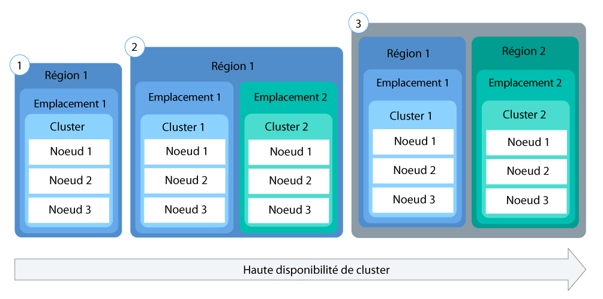

---

copyright:
  years: 2014, 2018
lastupdated: "2018-05-24"

---

{:new_window: target="_blank"}
{:shortdesc: .shortdesc}
{:screen: .screen}
{:pre: .pre}
{:table: .aria-labeledby="caption"}
{:codeblock: .codeblock}
{:tip: .tip}
{:download: .download}


# Configuration de clusters
{: #clusters}

Concevez la configuration de votre cluster Kubernetes pour une disponibilité et une capacité maximales des conteneurs avec {{site.data.keyword.containerlong}}.
{:shortdesc}


## Planification de la configuration d'un cluster
{: #planning_clusters}

Utilisez des clusters standard pour accroître la disponibilité des applications.
{:shortdesc}

Vos utilisateurs risquent moins de rencontrer des indisponibilités lorsque vous disséminez votre configuration entre plusieurs noeuds worker et clusters. Les fonctions intégrées, telles que l'équilibrage de charge et l'isolement, augmentent la résilience en cas de pannes d'hôtes, de réseaux ou d'applications.

Examinez ces configurations potentielles de cluster, classées par ordre croissant de disponibilité :



1.  Un seul cluster avec plusieurs noeuds worker
2.  Deux clusters s'exécutant dans des emplacements différents dans la même région, chacun avec plusieurs noeuds worker
3.  Deux clusters s'exécutant dans des régions différentes, chacun avec plusieurs noeuds worker


### Augmentation de la disponibilité de votre cluster

<dl>
  <dt>Diffusez les applications entre les noeuds worker</dt>
    <dd>Permettez aux développeurs de répartir leurs applications dans des conteneurs sur plusieurs noeuds worker par cluster. Une instance d'application dans chacun de trois noeuds worker permet une indisponibilité d'un noeud worker sans interrompre l'utilisation de l'application. Vous pouvez configurer le nombre de noeuds worker à inclure lorsque vous créez un cluster depuis l'[interface graphique {{site.data.keyword.Bluemix_notm}}](cs_clusters.html#clusters_ui) ou l'[interface de ligne de commande](cs_clusters.html#clusters_cli). Kubernetes limitant le nombre maximal de noeuds worker que vous pouvez avoir dans un cluster, gardez présent à l'esprit [les quotas de noeud worker et de pod ](https://kubernetes.io/docs/admin/cluster-large/).
    <pre class="codeblock"><code>bx cs cluster-create --location dal10 --workers 3 --public-vlan &lt;public_VLAN_ID&gt; --private-vlan &lt;private_VLAN_ID&gt; --machine-type &lt;u2c.2x4&gt; --name &lt;cluster_name_or_ID&gt;</code></pre></dd>
  <dt>Disséminez les applications entre les clusters</dt>
    <dd>Créez plusieurs clusters, chacun avec plusieurs noeuds worker. Si une indisponibilité affecte un cluster, les utilisateurs peuvent toujours accéder à une application également déployée dans un autre cluster.
      <p>Cluster 1 :</p>
        <pre class="codeblock"><code>bx cs cluster-create --location dal10 --workers 3 --public-vlan &lt;public_VLAN_ID&gt; --private-vlan &lt;private_VLAN_ID&gt; --machine-type &lt;u2c.2x4&gt; --name &lt;cluster_name_or_ID&gt;</code></pre>
      <p>Cluster 2 :</p>
        <pre class="codeblock"><code>bx cs cluster-create --location dal12 --workers 3 --public-vlan &lt;public_VLAN_ID&gt; --private-vlan &lt;private_VLAN_ID&gt; --machine-type &lt;u2c.2x4&gt; --name &lt;cluster_name_or_ID&gt;</code></pre></dd>
  <dt>Disséminez les applications entre des clusters dans des régions différentes</dt>
    <dd>Lorsque vous disséminez les applications entre clusters dans différentes régions, vous pouvez permettre un équilibrage de charge basé sur la région où est situé l'utilisateur. Si le cluster, un matériel, voire un emplacement complet dans une région tombe en  panne, le trafic est acheminé au conteneur déployé dans un autre emplacement.
      <p><strong>Important :</strong> après avoir configuré un domaine personnalisé, vous pouvez utiliser ces commandes pour créer les clusters.</p>
      <p>Emplacement 1 :</p>
        <pre class="codeblock"><code>bx cs cluster-create --location dal10 --workers 3 --public-vlan &lt;public_VLAN_ID&gt; --private-vlan &lt;private_VLAN_ID&gt; --machine-type &lt;u2c.2x4&gt; --name &lt;cluster_name_or_ID&gt;</code></pre>
      <p>Emplacement 2 :</p>
        <pre class="codeblock"><code>bx cs cluster-create --location ams03 --workers 3 --public-vlan &lt;public_VLAN_ID&gt; --private-vlan &lt;private_VLAN_ID&gt; --machine-type &lt;u2c.2x4&gt; --name &lt;cluster_name_or_ID&gt;</code></pre></dd>
</dl>

<br />


## Planification de la configuration de noeud worker
{: #planning_worker_nodes}

Un cluster Kubernetes est composé de noeuds worker et est surveillé et géré de manière centralisée par le maître Kubernetes. Les administrateurs du cluster décident comment configurer le cluster de noeuds worker pour garantir que les utilisateurs du cluster disposent de toutes les ressources pour déployer et exécuter des applications dans le cluster.
{:shortdesc}

Lorsque vous créez un cluster standard, les noeuds worker sont commandés pour vous dans l'infrastructure IBM Cloud (SoftLayer) et ajoutés au pool de noeuds worker par défaut dans votre cluster. A chaque noeud worker sont affectés un ID de noeud worker unique et un nom de domaine qui ne doivent pas être modifiés après la création du cluster.

Vous pouvez opter entre des serveurs virtuels ou physiques (bare metal). En fonction du niveau d'isolement du matériel que vous sélectionnez, les noeuds worker virtuels peuvent être définis sous forme de noeuds partagés ou dédiés. Vous pouvez également décider si vos noeuds worker doivent se connecter à un VLAN public et à un VLAN privé, ou seulement à un VLAN privé. Chaque noeud worker est doté d'un type de machine spécifique qui détermine le nombre d'UC, la mémoire et l'espace disque disponibles pour les conteneurs déployés sur le noeud worker. Kubernetes limite le nombre maximal de noeuds worker dont vous pouvez disposer dans un cluster. Pour plus d'informations, voir la rubrique sur les [quotas de noeud worker et de pod ](https://kubernetes.io/docs/admin/cluster-large/).


### Matériel pour les noeuds worker
{: #shared_dedicated_node}

Lorsque vous créez un cluster standard dans {{site.data.keyword.Bluemix_notm}}, vous choisissez de mettre à disposition vos noeuds worker en tant que machines physiques (bare metal) ou en tant que machines virtuelles s'exécutant sur du matériel physique. Lorsque vous créez un cluster gratuit, votre noeud worker est automatiquement mis à disposition sous forme de noeud partagé virtuel dans le compte d'infrastructure IBM Cloud (SoftLayer).
{:shortdesc}


Consultez les informations suivantes pour déterminer le type de pools de noeuds worker de votre choix. Lors de la planification, envisagez un [seuil minimal limite de noeuds worker](#resource_limit_node) équivalent à 10 % de la capacité mémoire totale.

<dl>
<dt>Pourquoi utiliser des machines physiques (bare metal) ?</dt>
<dd><p><strong>Plus de ressources de calcul</strong> : vous pouvez mettre à disposition votre noeud worker en tant que serveur physique à service exclusif, également désigné par serveur bare metal. Bare metal vous permet d'accéder directement aux ressources physiques sur la machine, par exemple à la mémoire ou à l'UC. Cette configuration élimine l'hyperviseur de machine virtuelle qui alloue des ressources physiques aux machines virtuelles qui s'exécutent sur l'hôte. A la place, toutes les ressources d'une machine bare metal sont dédiées exclusivement au noeud worker, donc vous n'avez pas à vous soucier de "voisins gênants" partageant des ressources et responsables du ralentissement des performances. Les types de machine physique ont davantage de capacité de stockage local par rapport aux machines virtuelles et certaines disposent de disques RAID pour effectuer des sauvegardes de données locales.</p>
<p><strong>Facturation mensuelle</strong> : les serveurs bare metal sont plus chers que les serveurs virtuels et conviennent mieux aux applications à hautes performances qui nécessitent plus de ressources et de contrôle hôte. Les serveurs bare metal sont facturés au mois. Si vous annulez un serveur bare metal avant la fin du mois, vous êtes facturé jusqu'à la fin de ce mois. La commande et l'annulation de serveurs bare metal est un processus manuel qui s'effectue via votre compte d'infrastructure IBM Cloud (SoftLayer). Ce processus peut prendre plus d'un jour ouvrable.</p>
<p><strong>Option pour activer la fonction Calcul sécurisé</strong> : activez la fonction Calcul sécurisé pour vérifier que vos noeuds worker ne font pas l'objet de falsification. Si vous n'activez pas cette fonction lors de la création du cluster mais souhaitez le faire ultérieurement, vous pouvez utiliser la [commande](cs_cli_reference.html#cs_cluster_feature_enable) `bx cs feature-enable`. Après avoir activé cette fonction, vous ne pourrez plus la désactiver par la suite. Vous pouvez créer un nouveau cluster sans la fonction trust. Pour plus d'informations sur le mode de fonctionnement de la fonction de confiance (trust) lors du processus de démarrage du noeud, voir [{{site.data.keyword.containershort_notm}} avec calcul sécurisé](cs_secure.html#trusted_compute). La fonction de calcul sécurisé (Trusted Compute) est activée sur les clusters qui exécutent Kubernetes version 1.9 ou ultérieure et qui ont certains types de machine bare metal. Lorsque vous exécutez la [commande](cs_cli_reference.html#cs_machine_types) `bx cs machine-types <location>`, vous pouvez voir les machines qui prennent en charge la fonction de confiance en examinant la zone **Trustable**. Par exemple, les versions GPU `mgXc` ne prennent pas en charge la fonction de calcul sécurisé.</p></dd>
<dt>Pourquoi utiliser des machines virtuelles ?</dt>
<dd><p>Avec des machines virtuelles, vous pouvez obtenir une plus grande flexibilité, des temps de mise à disposition plus rapides et plus de fonctions de mise à l'échelle automatique qu'avec des machines physiques (bare metal), à un coût plus avantageux. Vous pouvez utiliser des machines virtuelles pour la plupart des cas d'utilisation généraux, par exemple les environnements de test et de développement, les environnements de préproduction et de production, les microservices et les applications métier. Cependant, il y a un impact sur les performances. Si vous avez besoin de calcul haute performance pour des charges de travail qui consomment beaucoup de mémoire RAM, de données ou de processeur graphique (GPU), utilisez des machines bare metal.</p>
<p><strong>Choisir entre un service partagé ou exclusif</strong> : lorsque vous créez un cluster standard virtuel, vous devez décider si le matériel sous-jacent doit être partagé par plusieurs clients {{site.data.keyword.IBM_notm}} (service partagé) ou vous être dédié exclusivement (service exclusif). </p>
<p>Dans une configuration à service partagé, les ressources physiques (comme l'UC et la mémoire) sont partagées par toutes les machines virtuelles déployées sur le même matériel physique. Pour permettre à chaque machine virtuelle d'opérer indépendamment, un moniteur de machine virtuelle, également dénommé hyperviseur, segmente les ressources physiques en entités isolées et les alloue à une machine virtuelle en tant que ressources dédiées (isolement par hyperviseur).</p>
<p>Dans une configuration à service exclusif, toutes les ressources physiques vous sont dédiées en exclusivité. Vous pouvez déployer plusieurs noeuds worker en tant que machines virtuelles sur le même hôte physique. A l'instar de la configuration à service partagé, l'hyperviseur veille à ce que chaque noeud worker ait sa part des ressources physiques disponibles.</p>
<p>Les noeuds partagés sont généralement moins coûteux que les noeuds dédiés, car les coûts du matériel sous-jacent sont partagés entre plusieurs clients. Toutefois, lorsque vous choisissez entre noeuds partagés et noeud dédiés, vous devriez contacter votre service juridique pour déterminer le niveau d'isolement de l'infrastructure et de conformité requis par votre environnement d'application.</p>
<p><strong>Versions de machine virtuelle `u2c` ou `b2c`</strong> : ces machines utilisent le disque local au lieu du réseau SAN (Storage Area Networking) pour une plus grande fiabilité. Un réseau SAN procure, entre autres, une capacité de traitement plus élevée lors de la sérialisation des octets sur le disque local et réduit les risques de dégradation du système de fichiers en cas de défaillance du réseau. Ces types de machine contiennent un stockage sur disque local principal de 25 Go pour le système de fichiers du système d'exploitation et 100 Go de stockage sur disque local secondaire pour `/var/lib/docker`, répertoire dans lequel sont écrites toutes les données des conteneurs.</p>
<p><strong>Que se passe-t-il si je dispose de types de machine `u1c` ou `b1c` obsolètes ?</strong> Pour commencer à utiliser les types de machine `u2c` et `b2c`, [mettez à jour les types de machine en ajoutant des noeuds worker](cs_cluster_update.html#machine_type).</p></dd>
<dt>Entre quelles versions de machine virtuelle et physique ai-je le choix ?</dt>
<dd><p>De nombreuses versions ! Sélectionnez le type de machine correspondant le mieux à vos besoins. N'oubliez pas qu'un pool de noeuds worker est constitué de machines de même version. Si vous souhaitez avoir un mélange de types de machine dans votre cluster, créez des pool de noeuds worker distincts pour chaque version.</p>
<p>Les types de machine varient en fonction de la zone. Pour voir les types de machine disponibles dans votre zone, exécutez la commande `bx cs machine-types <zone_name>`.</p>
<p><table>
<caption>Types de machine physique (bare metal) et virtuelle disponibles dans {{site.data.keyword.containershort_notm}}.</caption>
<thead>
<th>Nom et cas d'utilisation</th>
<th>Coeurs/ Mémoire</th>
<th>Disque principal / secondaire</th>
<th>Vitesse réseau</th>
</thead>
<tbody>
<tr>
<td><strong>Virtuel, u2c.2x4</strong> : utilisez cette machine virtuelle de petite taille à des fins de test rapide, de démonstration de faisabilité et pour d'autres charges de travail légères.</td>
<td>2 / 4 Go</td>
<td>25 Go / 100 Go</td>
<td>1000 Mbit/s</td>
</tr>
<tr>
<td><strong>Virtuel, b2c.4x16</strong> : sélectionnez cette machine virtuelle équilibrée à des fins de test et de développement et pour d'autres charges de travail légères.</td>
<td>4 / 16 Go</td>
<td>25 Go / 100 Go</td>
<td>1000 Mbit/s</td>
</tr>
<tr>
<td><strong>Virtuel, b2c.16x64</strong> : sélectionnez cette machine virtuelle équilibrée pour les charges de travail de taille moyenne.</td></td>
<td>16 / 64 Go</td>
<td>25 Go / 100 Go</td>
<td>1000 Mbit/s</td>
</tr>
<tr>
<td><strong>Virtuel, b2c.32x128</strong> : sélectionnez cette machine virtuelle équilibrée pour les charges de travail de taille moyenne à élevée, par exemple une base de données et un site Web dynamique avec de nombreux utilisateurs simultanés.</td></td>
<td>32 / 128 Go</td>
<td>25 Go / 100 Go</td>
<td>1000 Mbit/s</td>
</tr>
<tr>
<td><strong>Virtuel, b2c.56x242</strong> : sélectionnez cette machine virtuelle équilibrée pour des charges de travail volumineuses, par exemple une base de données et plusieurs applications avec de nombreux utilisateurs simultanés.</td></td>
<td>56 / 242 Go</td>
<td>25 Go / 100 Go</td>
<td>1000 Mbit/s</td>
</tr>
<tr>
<td><strong>Bare metal à forte consommation de mémoire RAM, mr1c.28x512</strong> : augmentez au maximum la mémoire RAM disponible pour vos noeuds worker.</td>
<td>28 / 512 Go</td>
<td>SATA 2 To / SSD 960 Go</td>
<td>10000 Mbit/s</td>
</tr>
<tr>
<td><strong>Bare metal GPU, mg1c.16x128</strong> : Choisissez ce type de machine pour des charges de travail nécessitant de nombreux calculs mathématiques, tels que le calcul hautes performances, l'apprentissage automatique ou les applications en 3D. Cette version comporte 1 carte physique Tesla K80 avec 2 unités de traitement graphiques (GPU) par carte pour un total de 2 GPU.</td>
<td>16 / 128 Go</td>
<td>SATA 2 To / SSD 960 Go</td>
<td>10000 Mbit/s</td>
</tr>
<tr>
<td><strong>Bare metal GPU, mg1c.28x256</strong> : Choisissez ce type de machine pour des charges de travail nécessitant de nombreux calculs mathématiques, tels que le calcul hautes performances, l'apprentissage automatique ou les applications en 3D. Cette version possède 2 cartes physiques Tesla K80 avec 2 unités GPU par carte pour un total de 4 unités GPU.</td>
<td>28 / 256 Go</td>
<td>SATA 2 To / SSD 960 Go</td>
<td>10000 Mbit/s</td>
</tr>
<tr>
<td><strong>Bare metal à forte consommation de données, md1c.16x64.4x4tb</strong> : idéal pour une quantité substantielle de stockage sur disque local, y compris RAID, pour la sauvegarde de données stockées localement sur la machine. A utiliser pour les charges de travail de systèmes de fichiers répartis, de bases de données volumineuses ou d'analyse de big data.</td>
<td>16 / 64 Go</td>
<td>RAID1 2x2 To / RAID10 SATA 4x4 To</td>
<td>10000 Mbit/s</td>
</tr>
<tr>
<td><strong>Bare metal à forte consommation de données, md1c.28x512.4x4tb</strong> : idéal pour une quantité substantielle de stockage sur disque local, y compris RAID, pour la sauvegarde de données stockées localement sur la machine. A utiliser pour les charges de travail de systèmes de fichiers répartis, de bases de données volumineuses ou d'analyse de big data.</td>
<td>28 / 512 Go</td>
<td>RAID1 2x2 To / RAID10 SATA 4x4 To</td>
<td>10000 Mbit/s</td>
</tr>
<tr>
<td><strong>Bare metal équilibré, mb1c.4x32</strong> : A utiliser pour les charges de travail équilibrées qui nécessitent plus de ressources de calcul qu'en offrent les machines virtuelles.</td>
<td>4 / 32 Go</td>
<td>SATA 2 To / SATA 2 To</td>
<td>10000 Mbit/s</td>
</tr>
<tr>
<td><strong>Bare metal équilibré, mb1c.16x64</strong> : A utiliser pour les charges de travail équilibrées qui nécessitent plus de ressources de calcul qu'en offrent les machines virtuelles.</td>
<td>16 / 64 Go</td>
<td>SATA 2 To / SSD 960 Go</td>
<td>10000 Mbit/s</td>
</tr>
</tbody>
</table>
</p>
</dd>
</dl>


Vous pouvez déployer des clusters en utilisant l'[interface utilisateur de la console](#clusters_ui) ou l'[interface CLI](#clusters_cli).

### Connexion de réseau local virtuel (VLAN) pour noeuds worker
{: #worker_vlan_connection}

Lorsque vous créez un cluster, chaque cluster est automatiquement connecté à un réseau local virtuel depuis votre compte d'infrastructure IBM Cloud (SoftLayer).
{:shortdesc}

Un réseau local virtuel (VLAN) configure un groupe de noeuds worker et de pods comme s'ils étaient reliés physiquement au même câble.
* Le VLAN public comporte deux sous-réseaux fournis automatiquement. Le sous-réseau public principal détermine l'adresse IP publique affectée à un noeud worker lors de la création du cluster et le sous-réseau public portable fournit les adresses IP publiques pour les services de réseau d'Ingress et de l'équilibreur de charge.
* Le VLAN privé comporte également deux sous-réseaux fournis automatiquement. Le sous-réseau privé principal détermine l'adresse IP privée affectée à un noeud worker lors de la création du cluster et le sous-réseau privé portable fournit les adresses IP privées pour les services de réseau d'Ingress et de l'équilibreur de charge.

Dans le cas de clusters gratuits, les noeuds worker du cluster sont connectés lors de la création du cluster à un réseau virtuel public et à un réseau privé virtuel dont IBM est le propriétaire.

Dans le cas de clusters standard, la première fois que vous créez un cluster à un emplacement un VLAN public et un VLAN privé sont automatiquement mis à votre disposition. Pour tous les autres clusters que vous créez à cet emplacement, vous pouvez choisir les VLAN que vous voulez utiliser. Vous pouvez connecter vos noeuds worker à la fois à un réseau virtuel public et au réseau virtuel privé, ou seulement au réseau virtuel privé. Si vous désirez connecter vos noeuds worker uniquement à un VLAN privé, vous pouvez utiliser l'ID d'un VLAN existant ou [créer un VLAN privé](/docs/cli/reference/softlayer/index.html#sl_vlan_create) et utiliser l'ID lors de la création du cluster. Si les noeuds worker sont configurés uniquement avec un VLAN privé, vous devez configurer une autre solution pour la connectivité du réseau, par exemple un [dispositif de routeur virtuel (VRA)](cs_vpn.html#vyatta), afin que les noeuds worker puissent communiquer avec le maître. 

**Remarque** : si vous disposez de plusieurs VLAN pour un cluster ou de plusieurs sous-réseaux  sur le même VLAN, vous devez activer la fonction Spanning VLAN pour que vos noeuds worker puissent communiquer entre eux sur le réseau privé. Pour obtenir les instructions correspondantes, voir [Activer ou désactiver le spanning VLAN](/docs/infrastructure/vlans/vlan-spanning.html#enable-or-disable-vlan-spanning).

### Limite de mémoire des noeuds worker
{: #resource_limit_node}

{{site.data.keyword.containershort_notm}} définit une limite de mémoire sur chaque noeud worker. Lorsque des pods qui s'exécutent sur le noeud worker dépassent cette limite de mémoire, ils sont supprimés. Dans Kubernetes, cette limite est appelée [seuil d’éviction immédiate](https://kubernetes.io/docs/tasks/administer-cluster/out-of-resource/#hard-eviction-thresholds).
{:shortdesc}

Si vos pods sont fréquemment supprimés, ajoutez des noeuds worker à votre cluster ou définissez des [limites de ressource](https://kubernetes.io/docs/concepts/configuration/manage-compute-resources-container/#resource-requests-and-limits-of-pod-and-container) sur vos pods.

**Chaque machine comporte un seuil minimal équivalent à 10 % de sa capacité mémoire totale**. Lorsque la quantité de mémoire disponible sur le noeud worker est inférieure au seuil minimal autorisé, Kubernetes retire immédiatement le pod. Le pod est replanifié sur un autre noeud worker disponible. Par exemple si vous disposez d'une machine virtuelle `b2c.4x16`, sa capacité mémoire totale est de 16 Go. Si la mémoire disponible est inférieure à 1600 Mo (10%), il est impossible de planifier de nouveaux pods sur ce noeud worker et ils sont alors replanifiés sur un autre noeud. S'il n'y a pas d'autre noeud worker disponible, les nouveaux pods restent non planifiés.

Pour vérifier la quantité de mémoire utilisée sur un noeud worker, exécutez [kubectl top node ](https://kubernetes.io/docs/reference/kubectl/overview/#top).

### Reprise automatique pour vos noeuds worker
`Docker`, `kubelet`, `kube-proxy` et `calico` sont des composants essentiels qui doivent être fonctionnels pour que le noeud worker Kubernetes soit en bonne santé. Avec le temps, ces composants peuvent connaître des défaillances et laisser votre noeud worker dans un état non opérationnel. Si les noeuds worker ne sont pas opérationnels, la capacité totale du cluster diminue et votre application peut devenir indisponible.

Vous pouvez [configurer des diagnostics d'intégrité pour votre noeud worker et activer la reprise automatique](cs_health.html#autorecovery). Si le système de reprise automatique détecte un mauvais état de santé d'un noeud worker d'après les vérifications configurées, il déclenche une mesure corrective (par exemple, un rechargement du système d'exploitation) sur le noeud worker. Pour plus d'informations sur le fonctionnement de la reprise automatique, consultez le [blogue Autorecovery ](https://www.ibm.com/blogs/bluemix/2017/12/autorecovery-utilizes-consistent-hashing-high-availability/).

<br />


## Création de clusters depuis l'interface graphique
{: #clusters_ui}

L'objectif du cluster Kubernetes est de définir un ensemble de ressources, de noeuds, de réseaux et de périphériques de stockage permettant d'assurer une haute disponibilité des applications. Avant de pouvoir déployer une application, vous devez créer un cluster et spécifier les définitions des noeuds worker dans ce cluster.
{:shortdesc}


Avant de commencer, vous devez disposer d'un [compte {{site.data.keyword.Bluemix_notm}}](https://console.bluemix.net/registration/) avec paiement à la carte ou abonnement, configuré pour [accéder au portefeuille d'infrastructure IBM Cloud (SoftLayer)](cs_troubleshoot_clusters.html#cs_credentials). Pour tester quelques fonctionnalités, vous pouvez créer un cluster gratuit pour une durée de 21 jours. Vous ne pouvez disposer que d'un cluster gratuit à la fois.

Vous pouvez supprimer votre cluster gratuit à tout moment, mais au bout de 21 jours, un cluster gratuit et les données qu'il contient sont supprimés et ne peuvent pas être restaurés. Veillez à faire une sauvegarde de vos données.
{: tip}

Pour personnaliser entièrement vos clusters avec, entre autres, l'isolement du matériel, la zone, la version d'API de votre choix, créez un cluster standard.

Pour créer un cluster, procédez comme suit :

1. Dans le catalogue, sélectionnez **Cluster Kubernetes**.

2. Sélectionnez une région dans laquelle déployer votre cluster.

3. Sélectionnez un type de plan de cluster. Vous pouvez choisir entre **Gratuit** ou **Standard**. Avec un cluster standard, vous avez accès à des fonctions, par exemple plusieurs noeuds worker, pour bénéficier d'un environnement à haute disponibilité.

4. Configurez les détails de votre cluster. Suivez les étapes qui s'appliquent au type de cluster que vous créez.

    1. **Gratuit et standard** : attribuez un nom au cluster. Le nom doit commencer par une lettre, peut contenir des lettres, des nombres et des tirets (-) et ne doit pas dépasser 35 caractères. Le nom du cluster et la région dans laquelle est déployé le cluster constituent le nom de domaine qualifié complet du sous-domaine Ingress. Pour garantir que ce sous-domaine est unique dans une région, le nom de cluster peut être tronqué et complété par une valeur aléatoire dans le nom de domaine Ingress.
 
    2. **Standard** : sélectionnez l'emplacement dans lequel déployer votre cluster. Pour des performances optimales, sélectionnez l'emplacement physiquement le plus proche. N'oubliez pas si vous sélectionnez un emplacement hors de votre pays que vous aurez peut-être besoin d'une autorisation légale pour stocker physiquement des données à l'étranger.

    3. **Standard** : choisissez la version du serveur d'API Kubernetes pour le noeud maître du cluster.

    4. **Standard** : sélectionnez un type d'isolement matériel. Le type virtuel est facturé à l'heure et le type bare metal est facturé au mois.

        - **Virtuel - Dédié** : vos noeuds worker sont hébergés sur l'infrastructure réservée à votre compte. Vos ressources physiques sont complètement isolées.

        - **Virtuel - Partagé** : les ressource de l'infrastructure, telles que l'hyperviseur et le matériel physique, sont partagées par vous et d'autres clients IBM, mais vous êtes seul à accéder à chaque noeud worker. Bien que cette solution soit moins onéreuse et suffisante dans la plupart des cas, vérifiez cependant les consignes de votre entreprise relatives aux exigences en termes de performance et d'infrastructure.

        - **Bare Metal** : facturés au mois, les serveurs bare metal sont mis à disposition par interaction manuelle avec l'infrastructure IBM Cloud (SoftLayer) et cette opération peut prendre plus d'un jour ouvrable. La configuration bare metal convient le mieux aux applications à hautes performances qui nécessitent plus de ressources et de contrôle hôte.

        Assurez-vous de vouloir mettre à disposition une machine bare metal. Comme elle est facturée au mois, si vous l'annulez immédiatement après l'avoir commandée par erreur, vous serez toujours redevable pour le mois complet.
        {:tip}

    5.  **Standard** : sélectionnez un type de machine. Le type de machine définit le nombre d'UC virtuelles, la mémoire et l'espace disque configurés dans chaque noeud worker et rendus disponibles aux conteneurs. Les types de machines virtuelles et bare metal disponibles varient en fonction de l'emplacement de déploiement du cluster. Après avoir créé votre cluster, vous pouvez ajouter différents types de machine en ajoutant un noeud au cluster.

    6. **Standard** : indiquez le nombre de noeuds worker dont vous avez besoin dans le cluster.

    7. **Standard** : sélectionnez un réseau local virtuel (VLAN) public (facultatif) et un réseau local virtuel (VLAN) privé (obligatoire) à partir de votre compte d'infrastructure IBM Cloud (SoftLayer). Ces deux réseaux VLAN communiquent entre les noeuds worker mais le réseau VLAN public communique également avec le noeud maître Kubernetes géré par IBM. Vous pouvez utiliser le même VLAN pour plusieurs clusters.
        **Remarque** : si les noeuds worker sont configurés uniquement avec un VLAN privé, vous devez configurer une autre solution pour la connectivité du réseau. Pour plus d'informations, voir [Connexion de réseau local virtuel (VLAN) pour noeuds worker](cs_clusters.html#worker_vlan_connection).

    8. Par défaut, l'option **Chiffrer le disque local** est sélectionnée. Si vous décochez cette case, les données Docker de l'hôte ne sont pas chiffrées.


4. Cliquez sur **Créer un cluster**. Vous pouvez voir la progression du déploiement du noeud worker dans l'onglet **Noeuds worker**. Une fois le déploiement terminé, vous pouvez voir si le cluster est prêt dans l'onglet **Vue d'ensemble**.
    **Remarque :** à chaque noeud worker sont affectés un ID de noeud worker unique et un nom de domaine qui ne doivent pas être modifiés manuellement après la création du cluster. La modification de l'ID ou du domaine empêcherait le maître Kubernetes de gérer votre cluster.


**Etape suivante ?**

Une fois le cluster opérationnel, vous pouvez réaliser les tâches suivantes :


-   [Installer les interfaces de ligne de commande pour commencer à utiliser votre cluster.](cs_cli_install.html#cs_cli_install)
-   [Déployer une application dans votre cluster.](cs_app.html#app_cli)
-   [Configurer votre propre registre privé dans {{site.data.keyword.Bluemix_notm}} pour stocker et partager des images Docker avec d'autres utilisateurs.](/docs/services/Registry/index.html)
- Si vous disposez de plusieurs VLAN pour un cluster ou de plusieurs sous-réseaux sur le même VLAN, vous devez [activer la fonction Spanning VLAN](/docs/infrastructure/vlans/vlan-spanning.html#enable-or-disable-vlan-spanning) pour que vos noeuds worker puissent communiquer entre eux sur le réseau privé.
- Si vous utilisez un pare-feu, vous devrez peut-être [ouvrir les ports requis](cs_firewall.html#firewall) afin d'utiliser les commandes `bx`, `kubectl` ou `calicotl`, autoriser le trafic sortant de votre cluster ou le trafic entrant pour les services réseau.

<br />


## Création de clusters depuis l'interface CLI
{: #clusters_cli}

L'objectif du cluster Kubernetes est de définir un ensemble de ressources, de noeuds, de réseaux et de périphériques de stockage permettant d'assurer une haute disponibilité des applications. Avant de pouvoir déployer une application, vous devez créer un cluster et spécifier les définitions des noeuds worker dans ce cluster.
{:shortdesc}

Avant de commencer :
- Vous devez disposer d'un [compte {{site.data.keyword.Bluemix_notm}}](https://console.bluemix.net/registration/) avec paiement à la carte ou abonnement, configuré pour [accéder au portefeuille d'infrastructure IBM Cloud (SoftLayer)](cs_troubleshoot_clusters.html#cs_credentials). Vous pouvez créer 1 cluster gratuit pour expérimenter certaines fonctionnalités pour une durée de 21 jours ou créer des clusters standard entièrement personnalisables avec l'isolement matériel de votre choix.
- [Vérifiez que vous disposez des droits minimum requis dans l'infrastructure IBM Cloud (SoftLayer) pour mettre à disposition un cluster standard](cs_users.html#infra_access).

Pour créer un cluster, procédez comme suit :

1.  Installez l'interface de ligne de commande {{site.data.keyword.Bluemix_notm}} et le [plug-in {{site.data.keyword.containershort_notm}}](cs_cli_install.html#cs_cli_install).

2.  Connectez-vous à l'interface de ligne de commande {{site.data.keyword.Bluemix_notm}}. A l'invite, entrez vos données d'identification {{site.data.keyword.Bluemix_notm}}.

    ```
    bx login
    ```
    {: pre}

    **Remarque :** si vous possédez un ID fédéré, exécutez la commande `bx login --sso` pour vous connecter à l'interface de ligne de commande {{site.data.keyword.Bluemix_notm}}. Entrez votre nom d'utilisateur et utilisez l'URL mentionnée dans la sortie CLI pour extraire votre code d'accès à usage unique. Si la connexion échoue alors que vous omettez l'option `--sso` et aboutit en incluant l'option `--sso`, ceci indique que votre ID est fédéré.

3. Si vous disposez de plusieurs comptes {{site.data.keyword.Bluemix_notm}}, sélectionnez le compte que vous voulez utiliser pour créer votre cluster Kubernetes.

4.  Si vous désirez créer ou accéder à des clusters Kubernetes dans une région {{site.data.keyword.Bluemix_notm}} autre que celle que vous aviez sélectionnée auparavant, exécutez la commande `bx cs region-set`.

6.  Créez un cluster.

    1.  **Clusters standard** : examinez les emplacements disponibles. Les emplacements affichés dépendent de la région {{site.data.keyword.containershort_notm}} à laquelle vous êtes connecté.

        ```
        bx cs locations
        ```
        {: pre}
        
        La sortie de l'interface de ligne de commande correspond aux [emplacements de la région d'{{site.data.keyword.containerlong}}](cs_regions.html#locations).
        
    2.  **Clusters standard** : sélectionnez un emplacement et examinez les types de machine disponibles sur celui-ci. Le type de machine spécifie les hôtes de calcul virtuels ou physiques disponibles pour chaque noeud worker.

        -  Consultez la zone **Type de serveur** pour sélectionner des machines virtuelles ou physiques (bare metal).
        -  **Virtuel** : facturées à l'heure, les machines virtuelles sont mises à disposition sur du matériel partagé ou dédié.
        -  **Physique** : facturés au mois, les serveurs bare metal sont mis à disposition par interaction manuelle avec l'infrastructure IBM Cloud (SoftLayer) et cette opération peut prendre plus d'un jour ouvrable. La configuration bare metal convient le mieux aux applications à hautes performances qui nécessitent plus de ressources et de contrôle hôte.
        - **Machines physiques avec la fonction de calcul sécurisé** : pour les clusters bare metal qui exécutent Kubernetes version 1.9 ou ultérieure, vous pouvez également choisir d'activer la fonction [Calcul sécurisé](cs_secure.html#trusted_compute) pour vérifier que vos noeuds worker bare metal ne font pas l'objet de falsification. La fonction de calcul sécurisé (Trusted Compute) est disponible pour les types de machine bare metal sélectionnés. Par exemple, les versions GPU `mgXc` ne prennent pas en charge la fonction de calcul sécurisé. Si vous n'activez pas cette fonction lors de la création du cluster mais souhaitez le faire ultérieurement, vous pouvez utiliser la [commande](cs_cli_reference.html#cs_cluster_feature_enable) `bx cs feature-enable`. Après avoir activé cette fonction, vous ne pourrez plus la désactiver par la suite.
        -  **Types de machine** : pour décider du type de machine à déployer, examinez les combinaisons coeur/mémoire/stockage ou consultez la [documentation sur la commande](cs_cli_reference.html#cs_machine_types) `bx cs machine-types`. Après avoir créé votre cluster, vous pouvez ajouter différents types de machines physiques ou virtuelles en utilisant la [commande](cs_cli_reference.html#cs_worker_add) `bx cs worker-add`.

           Assurez-vous de vouloir mettre à disposition une machine bare metal. Comme elle est facturée au mois, si vous l'annulez immédiatement après l'avoir commandée par erreur, vous serez toujours redevable pour le mois complet.
           {:tip}

        ```
        bx cs machine-types <location>
        ```
        {: pre}

    3.  **Clusters standard** : vérifiez s'il existe des réseaux VLAN publics et privés dans l'infrastructure IBM Cloud (SoftLayer) pour ce compte.

        ```
        bx cs vlans <location>
        ```
        {: pre}

        ```
        ID        Name                Number   Type      Router  
        1519999   vlan   1355     private   bcr02a.dal10  
        1519898   vlan   1357     private   bcr02a.dal10 
        1518787   vlan   1252     public   fcr02a.dal10 
        1518888   vlan   1254     public    fcr02a.dal10
        ```
        {: screen}

        S'il existe déjà un réseau virtuel public et privé, notez les routeurs correspondants. Les routeurs de VLAN privé commencent toujours par <code>bcr</code> (routeur de back-end) et les routeurs de VLAN public par <code>fcr</code> (routeur de front-end). Lors de la création d'un cluster et de la spécification des VLAN publics et privés, le nombre et la combinaison de lettres après ces préfixes doivent correspondre. Dans l'exemple de sortie, n'importe quel VLAN privé peut être utilisé avec l'un des VLAN publics étant donné que les routeurs incluent tous `02a.dal10`.

        Vous devez connecter vos noeuds worker à un VLAN privé et vous pouvez éventuellement connecter vos noeuds worker à un VLAN public. **Remarque** : si les noeuds worker sont configurés uniquement avec un VLAN privé, vous devez configurer une autre solution pour la connectivité du réseau. Pour plus d'informations, voir [Connexion de réseau local virtuel (VLAN) pour noeuds worker](cs_clusters.html#worker_vlan_connection).

    4.  **Clusters gratuits et standard** : exécutez la commande `cluster-create`. Vous pouvez opter pour un cluster gratuit qui inclut un noeud worker configuré avec 2 UC virtuelles et 4 Go de mémoire qui sera supprimé automatiquement au bout de 21 jours. Lorsque vous créez un cluster standard, par défaut, les disques de noeud worker sont chiffrés, son matériel est partagé par plusieurs clients IBM et il est facturé par heures d'utilisation. </br>Exemple pour un cluster standard. Indiquez les options du cluster :

        ```
        bx cs cluster-create --location dal10 --machine-type u2c.2x4 --hardware <shared_or_dedicated> --public-vlan <public_VLAN_ID> --private-vlan <private_VLAN_ID> --workers 3 --name <cluster_name> --kube-version <major.minor.patch> [--disable-disk-encrypt][--trusted]
        ```
        {: pre}

        Exemple pour un cluster gratuit. Indiquez le nom du cluster :

        ```
        bx cs cluster-create --name my_cluster
        ```
        {: pre}

        <table>
        <caption>Composantes de la commande cluster-create</caption>
        <thead>
        <th colspan=2> Description des composantes de cette commande</th>
        </thead>
        <tbody>
        <tr>
        <td><code>cluster-create</code></td>
        <td>Commande de création d'un cluster dans votre organisation {{site.data.keyword.Bluemix_notm}}.</td>
        </tr>
        <tr>
        <td><code>--location <em>&lt;location&gt;</em></code></td>
        <td>**Clusters standard** : remplacez <em>&lt;location&gt;</em> par l'ID de l'emplacement {{site.data.keyword.Bluemix_notm}} où vous souhaitez créer votre cluster. Les [emplacements disponibles](cs_regions.html#locations) dépendent de la région {{site.data.keyword.containershort_notm}} à laquelle vous êtes connecté.</td>
        </tr>
        <tr>
        <td><code>--machine-type <em>&lt;machine_type&gt;</em></code></td>
        <td>**Clusters standard** : choisissez un type de machine. Vous pouvez déployer vos noeuds worker en tant que machines virtuelles sur du matériel partagé ou dédié ou en tant que machines physiques sur un serveur bare metal. Les types de machines virtuelles et physiques disponibles varient en fonction de l'emplacement de déploiement du cluster. Pour plus d'informations, voir la documentation correspondant à la [commande](cs_cli_reference.html#cs_machine_types) `bx cs machine-type`. Dans le cas de clusters gratuits, vous n'avez pas besoin de définir le type de machine.</td>
        </tr>
        <tr>
        <td><code>--hardware <em>&lt;shared_or_dedicated&gt;</em></code></td>
        <td>**Clusters standard (virtuels uniquement)** : niveau d'isolation du matériel pour votre noeud worker. Utilisez dedicated pour que toutes les ressources physiques vous soient dédiées exclusivement ou shared pour permettre leur partage avec d'autres clients IBM. La valeur par défaut est shared. Cette valeur est facultative pour les clusters standard et n'est pas disponible pour les clusters gratuits.</td>
        </tr>
        <tr>
        <td><code>--public-vlan <em>&lt;public_vlan_id&gt;</em></code></td>
        <td><ul>
          <li>**Clusters gratuits** : vous n'avez pas besoin de définir de réseau local virtuel (VLAN) public. Votre cluster gratuit est automatiquement connecté à un VLAN public dont IBM est propriétaire.</li>
          <li>**Clusters standard** : si vous disposez déjà d'un VLAN public configuré dans votre compte d'infrastructure IBM Cloud (SoftLayer) pour cet emplacement, entrez l'ID du VLAN public. Si vous désirez connecter vos noeuds worker uniquement à un VLAN privé, n'indiquez pas cette option. **Remarque** : si les noeuds worker sont configurés uniquement avec un VLAN privé, vous devez configurer une autre solution pour la connectivité du réseau. Pour plus d'informations, voir [Connexion de réseau local virtuel (VLAN) pour noeuds worker](cs_clusters.html#worker_vlan_connection).<br/><br/>
          <strong>Remarque</strong> : les routeurs de VLAN privé commencent toujours par <code>bcr</code> (routeur de back-end) et les routeurs de VLAN public par <code>fcr</code> (routeur de front-end). Lors de la création d'un cluster et de la spécification des VLAN publics et privés, le nombre et la combinaison de lettres après ces préfixes doivent correspondre.</li>
        </ul></td>
        </tr>
        <tr>
        <td><code>--private-vlan <em>&lt;private_vlan_id&gt;</em></code></td>
        <td><ul><li>**Clusters gratuits** : vous n'avez pas besoin de définir de VLAN privé. Votre cluster gratuit est automatiquement connecté à un VLAN privé dont IBM est propriétaire.</li><li>**Clusters standard** : si vous disposez déjà d'un VLAN privé configuré dans votre compte d'infrastructure IBM Cloud (SoftLayer) pour cet emplacement, entrez l'ID du VLAN privé. Si vous ne disposez pas d'un VLAN privé dans votre compte, ne spécifiez pas cette option. {{site.data.keyword.containershort_notm}} crée automatiquement un VLAN privé pour vous.<br/><br/><strong>Remarque</strong> : les routeurs de VLAN privé commencent toujours par <code>bcr</code> (routeur de back-end) et les routeurs de VLAN public par <code>fcr</code> (routeur de front-end). Lors de la création d'un cluster et de la spécification des VLAN publics et privés, le nombre et la combinaison de lettres après ces préfixes doivent correspondre.</li></ul></td>
        </tr>
        <tr>
        <td><code>--name <em>&lt;name&gt;</em></code></td>
        <td>**Clusters gratuits et standard** : remplacez <em>&lt;name&gt;</em> par le nom de votre cluster. Le nom doit commencer par une lettre, peut contenir des lettres, des nombres et des tirets (-) et ne doit pas dépasser 35 caractères. Le nom du cluster et la région dans laquelle est déployé le cluster constituent le nom de domaine qualifié complet du sous-domaine Ingress. Pour garantir que ce sous-domaine est unique dans une région, le nom de cluster peut être tronqué et complété par une valeur aléatoire dans le nom de domaine Ingress.
</td>
        </tr>
        <tr>
        <td><code>--workers <em>&lt;number&gt;</em></code></td>
        <td>**Clusters standard** : nombre de noeuds worker à inclure dans le cluster. Si l'option <code>--workers</code> n'est pas spécifiée, 1 noeud worker est créé.</td>
        </tr>
        <tr>
          <td><code>--kube-version <em>&lt;major.minor.patch&gt;</em></code></td>
          <td>**Clusters standard** : version Kubernetes du noeud maître du cluster. Cette valeur est facultative. Lorsque la version n'est pas spécifiée, le cluster est créé avec la valeur par défaut des versions Kubernetes prises en charge. Pour voir les versions disponibles, exécutez la commande <code>bx cs kube-versions</code>.
</td>
        </tr>
        <tr>
        <td><code>--disable-disk-encrypt</code></td>
        <td>**Clusters gratuits et standard** : les noeuds worker proposent le chiffrement de disque par défaut. [En savoir plus](cs_secure.html#encrypted_disks). Incluez cette option si vous désirez désactiver le chiffrement.</td>
        </tr>
        <tr>
        <td><code>--trusted</code></td>
        <td>**Clusters bare metal standard** : activez la fonction [Calcul sécurisé](cs_secure.html#trusted_compute) pour vérifier que vos noeuds worker bare metal ne font pas l'objet de falsification. La fonction de calcul sécurisé (Trusted Compute) est disponible pour les types de machine bare metal sélectionnés. Par exemple, les versions GPU `mgXc` ne prennent pas en charge la fonction de calcul sécurisé. Si vous n'activez pas cette fonction lors de la création du cluster mais souhaitez le faire ultérieurement, vous pouvez utiliser la [commande](cs_cli_reference.html#cs_cluster_feature_enable) `bx cs feature-enable`. Après avoir activé cette fonction, vous ne pourrez plus la désactiver par la suite.</td>
        </tr>
        </tbody></table>

7.  Vérifiez que la création du cluster a été demandée.

    ```
    bx cs clusters
    ```
    {: pre}

    **Remarque :** pour les machines virtuelles, la commande des postes de noeud worker et la mise à disposition et la configuration du cluster dans votre compte peuvent prendre quelques minutes. Les machines physiques bare metal sont mises à disposition par interaction manuelle avec l'infrastructure IBM Cloud (SoftLayer) et cette opération peut prendre plus d'un jour ouvrable.

    Lorsque la mise à disposition de votre cluster est finalisée, le statut du cluster passe à **deployed**.

    ```
    Name         ID                                   State      Created          Workers   Location   Version
    my_cluster   paf97e8843e29941b49c598f516de72101   deployed   20170201162433   1         mil01      1.9.7
    ```
    {: screen}

8.  Vérifiez le statut des noeuds worker.

    ```
    bx cs workers <cluster_name_or_ID>
    ```
    {: pre}

    Lorsque les noeuds worker sont prêts, l'état passe à **normal** et le statut indique **Ready**. Lorsque le statut du noeud indique **Ready**, vous pouvez accéder au cluster.

    **Remarque :** à chaque noeud worker sont affectés un ID de noeud worker unique et un nom de domaine qui ne doivent pas être modifiés manuellement après la création du cluster. La modification de l'ID ou du domaine empêcherait le maître Kubernetes de gérer votre cluster.

    ```
    ID                                                 Public IP       Private IP      Machine Type   State    Status   Location   Version
    kube-mil01-paf97e8843e29941b49c598f516de72101-w1   169.xx.xxx.xxx  10.xxx.xx.xxx   free           normal   Ready    mil01      1.9.7
    ```
    {: screen}

9. Définissez le cluster que vous avez créé comme contexte de cette session. Effectuez ces étapes de configuration à chaque fois que vous utilisez votre cluster.
    1.  Obtenez la commande permettant de définir la variable d'environnement et téléchargez les fichiers de configuration Kubernetes.

        ```
        bx cs cluster-config <cluster_name_or_ID>
        ```
        {: pre}

        Une fois les fichiers de configuration téléchargés, une commande s'affiche ; elle vous permet de définir le chemin vers le fichier de configuration Kubernetes local en tant que variable d'environnement.

        Exemple pour OS X :

        ```
        export KUBECONFIG=/Users/<user_name>/.bluemix/plugins/container-service/clusters/mycluster/kube-config-prod-dal10-mycluster.yml
        ```
        {: screen}

    2.  Copiez et collez la commande qui s'affiche sur votre terminal pour définir la variable d'environnement `KUBECONFIG`.
    3.  Vérifiez que la variable d'environnement `KUBECONFIG` est correctement définie.

        Exemple pour OS X :

        ```
        echo $KUBECONFIG
        ```
        {: pre}

        Sortie :

        ```
        /Users/<user_name>/.bluemix/plugins/container-service/clusters/mycluster/kube-config-prod-dal10-mycluster.yml

        ```
        {: screen}

10. Lancez le tableau de bord Kubernetes via le port par défaut `8001`.
    1.  Affectez le numéro de port par défaut au proxy.

        ```
        kubectl proxy
        ```
        {: pre}

        ```
        Starting to serve on 127.0.0.1:8001
        ```
        {: screen}

    2.  Ouvrez l'URL suivante dans un navigateur Web pour accéder au tableau de bord Kubernetes.

        ```
        http://localhost:8001/ui
        ```
        {: codeblock}


**Etape suivante ?**


-   [Déployer une application dans votre cluster.](cs_app.html#app_cli)
-   [Gérer votre cluster à l'aide de la ligne de commande `kubectl`. ](https://kubernetes.io/docs/reference/kubectl/overview/)
-   [Configurer votre propre registre privé dans {{site.data.keyword.Bluemix_notm}} pour stocker et partager des images Docker avec d'autres utilisateurs.](/docs/services/Registry/index.html)
- Si vous disposez de plusieurs VLAN pour un cluster ou de plusieurs sous-réseaux sur le même VLAN, vous devez [activer la fonction Spanning VLAN](/docs/infrastructure/vlans/vlan-spanning.html#enable-or-disable-vlan-spanning) pour que vos noeuds worker puissent communiquer entre eux sur le réseau privé.
- Si vous utilisez un pare-feu, vous devrez peut-être [ouvrir les ports requis](cs_firewall.html#firewall) afin d'utiliser les commandes `bx`, `kubectl` ou `calicotl`, autoriser le trafic sortant de votre cluster ou le trafic entrant pour les services réseau.

<br />


## Affichage des états d'un cluster
{: #states}

Examinez l'état d'un cluster Kubernetes pour obtenir des informations sur la disponibilité et la capacité du cluster, et sur les problèmes qui se sont éventuellement produits.
{:shortdesc}

Pour afficher des informations sur un cluster particulier (notamment l'emplacement, l'URL principale, le sous-domaine Ingress, la version, le propriétaire et le tableau de bord de surveillance), utilisez la [commande](cs_cli_reference.html#cs_cluster_get) `bx cs cluster-get <cluster_name_or_ID>`. Incluez l'indicateur `--showResources` pour afficher des ressources de cluster supplémentaires, telles que des modules complémentaires pour les pods de stockage ou des VLAN de sous-réseau pour des adresses IP publiques et privées.

Vous pouvez vérifier l'état actuel du cluster en exécutant la commande `bx cs clusters` et en accédant à la zone **State**. Pour identifier et résoudre les incidents liés à votre cluster et aux noeuds worker, voir [Traitement des incidents affectant les clusters](cs_troubleshoot.html#debug_clusters).

<table summary="Chaque ligne de tableau doit être lue de gauche à droite. L'état du cluster figure dans la première colonne et la description correspondante dans la seconde colonne.">
<caption>Etats du cluster</caption>
   <thead>
   <th>Etat du cluster</th>
   <th>Description</th>
   </thead>
   <tbody>
<tr>
   <td>Aborted</td>
   <td>La suppression du cluster est demandée par l'utilisateur avant le déploiement du maître Kubernetes. Une fois le cluster supprimé, le cluster est retiré de votre tableau de bord. Si votre cluster est bloqué dans cet état depuis un moment, ouvrez un [ticket de demande de service {{site.data.keyword.Bluemix_notm}}](cs_troubleshoot.html#ts_getting_help).</td>
   </tr>
 <tr>
     <td>Critical</td>
     <td>Le maître Kubernetes est inaccessible ou tous les noeuds worker du cluster sont arrêtés. </td>
    </tr>
   <tr>
     <td>Delete failed</td>
     <td>Le maître Kubernetes ou au moins un noeud worker n'ont pas pu être supprimés.  </td>
   </tr>
   <tr>
     <td>Deleted</td>
     <td>Le cluster a bien été supprimé mais n'est pas encore retiré de votre tableau de bord. Si votre cluster est bloqué dans cet état depuis un moment, ouvrez un [ticket de demande de service {{site.data.keyword.Bluemix_notm}}](cs_troubleshoot.html#ts_getting_help). </td>
   </tr>
   <tr>
   <td>Deleting</td>
   <td>Le cluster est en cours de suppression et son infrastructure est en cours de démantèlement. Vous ne pouvez pas accéder au cluster.  </td>
   </tr>
   <tr>
     <td>Deploy failed</td>
     <td>Le déploiement du maître Kubernetes n'a pas abouti. Vous ne pouvez pas résoudre cet état. Contactez le support IBM Cloud en ouvrant un [ticket de demande de service {{site.data.keyword.Bluemix_notm}}](cs_troubleshoot.html#ts_getting_help).</td>
   </tr>
     <tr>
       <td>Deploying</td>
       <td>Le maître Kubernetes n'est pas encore complètement déployé. Vous ne pouvez pas accéder à votre cluster. Patientez jusqu'à la fin du déploiement complet de votre cluster pour examiner l'état de santé de votre cluster.</td>
      </tr>
      <tr>
       <td>Normal</td>
       <td>Tous les noeuds worker d'un cluster sont opérationnels. Vous pouvez accéder au cluster et déployer les applications sur le cluster. Cet état est considéré comme bon et ne nécessite aucune action de votre part. **Remarque** : même si les noeuds worker peuvent être normaux, d'autres ressources d'infrastructure, telles que les [réseaux](cs_troubleshoot_network.html) et le [stockage](cs_troubleshoot_storage.html), peuvent continuer à exiger de l'attention.</td>
    </tr>
      <tr>
       <td>Pending</td>
       <td>Le maître Kubernetes est déployé. La mise à disposition des noeuds worker est en cours. Ces derniers ne sont pas encore disponibles dans le cluster. Vous pouvez accéder au cluster, mais vous ne pouvez pas déployer d'applications sur le cluster.  </td>
     </tr>
   <tr>
     <td>Requested</td>
     <td>Une demande de création du cluster et d'organisation de l'infrastructure du maître Kubernetes et des noeuds worker est envoyée. Lorsque le déploiement du cluster commence, l'état du cluster passe à <code>Deploying</code>. Si votre cluster est bloqué à l'état <code>Requested</code> depuis un moment, ouvrez un [ticket de demande de service {{site.data.keyword.Bluemix_notm}}](cs_troubleshoot.html#ts_getting_help). </td>
   </tr>
   <tr>
     <td>Updating</td>
     <td>Le serveur d'API Kubernetes qui s'exécute sur votre maître Kubernetes est en cours de mise à jour pour passer à une nouvelle version d'API Kubernetes. Pendant la mise à jour, vous ne pouvez ni accéder au cluster, ni le modifier. Les noeuds worker, les applications et les ressources que l'utilisateur a déployés ne sont pas modifiés et continuent à s'exécuter. Patientez jusqu'à la fin de la mise à jour pour examiner l'état de santé de votre cluster. </td>
   </tr>
    <tr>
       <td>Warning</td>
       <td>Au moins un noeud worker du cluster n'est pas disponible. Cela dit, les autres noeuds worker sont disponibles et peuvent prendre le relais pour la charge de travail. </td>
    </tr>
   </tbody>
 </table>


<br />


## Suppression de clusters
{: #remove}

Les clusters gratuits et standard créés avec un compte de type Paiement à la carte doivent être supprimés manuellement lorsqu'ils ne sont plus nécessaires afin qu'ils ne consomment plus de ressources.
{:shortdesc}

**Avertissement :**
  - Aucune sauvegarde de votre cluster ou de vos données n'est effectuée dans votre stockage persistant. La suppression d'un cluster ou d'un stockage persistant est définitive et irréversible.
  - Lorsque vous supprimez un cluster, vous supprimez également les sous-réseaux éventuels qui sont automatiquement fournis lorsque vous avez créé le cluster et que vous avez créé en exécutant la commande `bx cs cluster-subnet-create`. Cependant, si vous avez ajouté manuellement des sous-réseaux existants à votre cluster avec la commande `bx cs cluster-subnet-add`, ces sous-réseaux ne sont pas retirés de votre compte d'infrastructure IBM Cloud (SoftLayer) et vous pouvez les réutiliser dans d'autres clusters.

Avant de commencez, notez l'ID du cluster. Vous aurez besoin de l'ID du cluster pour rechercher et retirer les ressources d'infrastructure IBM Cloud (SoftLayer) associées qui ne sont pas automatiquement supprimées avec votre cluster, par exemple le stockage persistant.
{: tip}

Pour supprimer un cluster :

-   Dans l'interface graphique {{site.data.keyword.Bluemix_notm}}
    1.  Sélectionnez votre cluster et cliquez sur **Supprimer** dans le menu **Plus d'actions...**.

-   Depuis l'interface CLI d'{{site.data.keyword.Bluemix_notm}}
    1.  Répertoriez les clusters disponibles.

        ```
        bx cs clusters
        ```
        {: pre}

    2.  Supprimez le cluster.

        ```
        bx cs cluster-rm <cluster_name_or_ID>
        ```
        {: pre}

    3.  Suivez les invites et indiquez si vous souhaitez supprimer des ressources de cluster, notamment des conteneurs, des pods, des services liés, du stockage persistant et des valeurs confidentielles.
      - **Stockage persistant** : un stockage persistant procure une haute disponibilité à vos données. Si vous avez créé une réservation de volume persistant via un [partage de fichiers existant](cs_storage.html#existing), vous ne pouvez pas supprimer ce dernier lorsque vous supprimez le cluster. Vous devez ultérieurement supprimer ce partage de fichiers manuellement de votre portefeuille d'infrastructure IBM Cloud (SoftLayer).

          **Remarque** : en raison du cycle de facturation mensuel, une réservation de volume persistant ne peut pas être supprimée le dernier jour du mois. Si vous supprimez la réservation de volume persistant le dernier jour du mois, la suppression reste en attente jusqu'au début du mois suivant.

Etapes suivantes :
- Dès qu'il ne figure plus dans la liste des clusters disponibles lorsque vous exécutez la commande `bx cs clusters`, vous pouvez réutilisez le nom d'un cluster supprimé.
- Si vous conservez les sous-réseaux, vous pouvez [les réutiliser dans un nouveau cluster](cs_subnets.html#custom) ou les supprimer manuellement de votre portefeuille d'infrastructure IBM Cloud (SoftLayer).
- Si vous conservez du stockage persistant, vous pouvez le supprimer par la suite dans le tableau de bord de l'infrastructure IBM Cloud (SoftLayer) de l'interface graphique d'{{site.data.keyword.Bluemix_notm}}.
