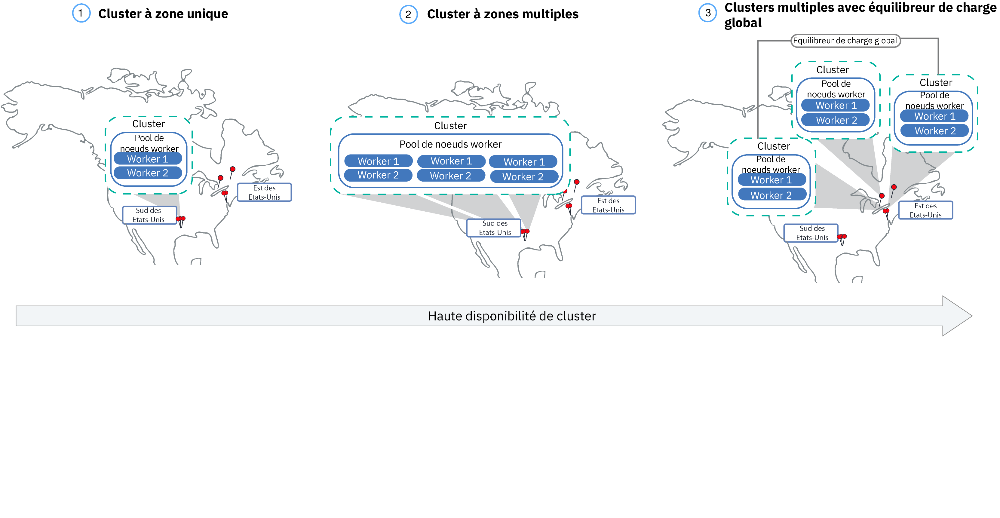

---

copyright:
  years: 2014, 2019
lastupdated: "2019-03-21"

keywords: kubernetes, iks, multi az, multi-az, szr, mzr

subcollection: containers

---

{:new_window: target="_blank"}
{:shortdesc: .shortdesc}
{:screen: .screen}
{:pre: .pre}
{:table: .aria-labeledby="caption"}
{:codeblock: .codeblock}
{:tip: .tip}
{:note: .note}
{:important: .important}
{:deprecated: .deprecated}
{:download: .download}


# Planification de votre cluster et configuration de noeuds worker
{: #plan_clusters}
Concevez votre cluster standard de sorte à obtenir un maximum de disponibilité et de capacité pour votre application avec {{site.data.keyword.containerlong}}.
{: shortdesc}

## Clusters à haute disponibilité
{: #ha_clusters}

Vos utilisateurs risquent moins de rencontrer des indisponibilités lorsque vous répartissez votre configuration entre plusieurs noeuds worker, zones et clusters. Les fonctions intégrées, telles que l'équilibrage de charge et l'isolement, augmentent la résilience en cas de pannes d'hôtes, de réseaux ou d'applications.
{: shortdesc}

Examinez ces configurations potentielles de cluster, classées par ordre croissant de disponibilité.



1. [Cluster à zone unique](#single_zone) avec plusieurs noeuds worker dans un pool de noeuds worker.
2. [Cluster à zones multiples](#multizone) qui répartit les noeuds worker sur plusieurs zones au sein d'une région.
3. [Plusieurs clusters](#multiple_clusters) configurés dans plusieurs zones ou régions connectés via un équilibreur de charge global.

## Cluster à zone unique
{: #single_zone}

Pour améliorer la disponibilité de votre application et permettre le basculement si un noeud worker n'est pas disponible dans votre cluster, ajoutez des noeuds worker supplémentaires dans votre cluster à zone unique.
{: shortdesc}


Par défaut, votre cluster à zone unique est configuré avec un pool de noeuds worker nommé `default`. Ce pool regroupe des noeuds worker ayant la même configuration, par exemple le type de machine, que vous avez définie lors de la création du cluster. Vous pouvez ajouter d'autres noeuds worker à votre cluster en [redimensionnant un pool de noeuds worker existant](/docs/containers?topic=containers-clusters#resize_pool) ou en [ajoutant un nouveau pool de noeuds worker](/docs/containers?topic=containers-clusters#add_pool).

Lorsque vous ajoutez d'autres noeuds worker, les instances d'application peuvent être réparties sur plusieurs noeuds worker. En cas de défaillance d'un noeud worker, les instances d'application sur les noeuds worker disponibles continuent à s'exécuter. Kubernetes replanifie automatiquement les pods des noeuds worker indisponibles pour que les performances et la capacité de votre application soient assurées. Pour vérifier que vos pods sont répartis uniformément sur les noeuds worker, implémentez l'[affinité des pods](https://kubernetes.io/docs/concepts/configuration/assign-pod-node/#inter-pod-affinity-and-anti-affinity-beta-feature).

**Puis-je convertir mon cluster à zone unique en cluster à zones multiples ?**</br>
Oui, à condition que le cluster se trouve dans l'une des [métropoles à zones multiples prises en charge](/docs/containers?topic=containers-regions-and-zones#zones). Voir [Mise à jour pour passer des noeuds worker autonomes aux pools de noeuds worker](/docs/containers?topic=containers-update#standalone_to_workerpool).


**Dois-je utiliser des clusters à zones multiples ?**</br>
Non. Vous pouvez créer autant de clusters à zone unique que vous le souhaitez. En effet, vous pouvez même préférer des clusters à zone unique pour une gestion simplifiée ou si votre cluster doit résider dans une [ville à zone unique](/docs/containers?topic=containers-regions-and-zones#zones).

**Puis-je disposer d'un maître à haute disponibilité dans une zone unique ?**</br>
Oui, avec les clusters exécutant Kubernetes version 1.10 ou ultérieure. Dans une zone unique, votre maître est hautement disponible et comprend des répliques sur des hôtes physiques distincts pour le serveur d'API Kubernetes, le composant etcd, le planificateur et le gestionnaire de contrôleurs afin de les protéger en cas d'indisponibilité due par exemple à une mise à jour du maître. Pour vous protéger en cas de défaillance d'une zone, vous pouvez :
* [Créer un cluster dans une zone compatible avec plusieurs zones](/docs/containers?topic=containers-plan_clusters#multizone), dans laquelle le maître est réparti entre plusieurs zones.
* [Créer plusieurs clusters](#multiple_clusters) et les connecter avec un équilibreur de charge global.

## Cluster à zones multiples
{: #multizone}

Avec {{site.data.keyword.containerlong}}, vous avez la possibilité de créer des clusters à zones multiples. Vos utilisateurs risquent moins de rencontrer des indisponibilités lorsque vous répartissez vos applications entre plusieurs zones et noeuds worker en utilisant un pool de noeuds worker. Les fonctions intégrées, telles que l'équilibrage de charge, augmentent la résilience en cas de défaillance potentielle d'une zone avec des hôtes, des réseaux ou des applications. Si les ressources d'une zone sont indisponibles, les charges de travail de vos clusters seront opérationnelles dans les autres zones. **Remarque** : seuls les clusters à zone unique sont disponibles pour les instances {{site.data.keyword.Bluemix_dedicated_notm}}.
{: shortdesc}

**Qu'est-ce qu'un pool de noeuds worker ?**</br>
Un pool de noeuds worker est une collection de noeuds worker de même type, par exemple type de machine, UC et mémoire. Lorsque vous créez un cluster, un pool de noeuds worker par défaut est automatiquement créé pour vous. Pour répartir les noeuds worker de votre pool entre plusieurs zones, ajouter des noeuds worker dans le pool ou mettre à jour des noeuds worker, vous pouvez utiliser les nouvelles commandes `ibmcloud ks worker-pool`.

**Puis-je continuer à utiliser des noeuds worker autonomes ?**</br>
L'ancienne configuration de noeuds worker autonomes est prise en charge, mais elle est dépréciée. Veillez à [ajouter un pool de noeuds worker à votre cluster](/docs/containers?topic=containers-clusters#add_pool), puis [utilisez des pools de noeuds worker](/docs/containers?topic=containers-update#standalone_to_workerpool) afin d'organiser vos noeuds worker au lieu d'utiliser des noeuds worker autonomes.

**Puis-je convertir mon cluster à zone unique en cluster à zones multiples ?**</br>
Oui, à condition que le cluster se trouve dans l'une des [métropoles à zones multiples prises en charge](/docs/containers?topic=containers-regions-and-zones#zones). Voir [Mise à jour pour passer des noeuds worker autonomes aux pools de noeuds worker](/docs/containers?topic=containers-update#standalone_to_workerpool).


### Pouvez-vous m'en dire davantage sur la configuration d'un cluster à zones multiples ?
{: #mz_setup}


Vous pouvez ajouter des zones supplémentaires dans votre cluster pour répliquer les noeuds worker de votre pool de noeuds worker sur plusieurs zones au sein d'une région. Les clusters à zones multiples sont conçus pour planifier de manière uniforme les pods sur les noeuds worker et les zones afin d'assurer la disponibilité et la reprise en cas d'incident. Si les noeuds worker ne sont pas répartis uniformément sur les zones ou si la capacité est insuffisante dans l'une des zones, le planificateur de Kubernetes risque de ne pas parvenir à planifier tous les pods demandés. Par conséquent, les pods peuvent passer à l'état **En attente** jusqu'à ce que la capacité suffisante soit disponible. Si vous souhaitez modifier le comportement par défaut pour que le planificateur de Kubernetes répartisse les pods entre les zones avec une meilleure distribution, utilisez la [règle d'affinité de pods](https://kubernetes.io/docs/concepts/configuration/assign-pod-node/#inter-pod-affinity-and-anti-affinity-beta-feature) `preferredDuringSchedulingIgnoredDuringExecution`.

**Pourquoi dois-je avoir des noeuds worker répartis sur 3 zones ?** </br>
La répartition de vos charges de travail sur 3 zones permet d'assurer la haute disponibilité de votre application en cas d'indisponibilité d'une ou de deux zones, tout en ayant une configuration de cluster plus rentable. Mais pour quelle raison ? Voici un exemple.

Supposons que vous ayez besoin d'un noeud worker à 6 coeurs pour traiter la charge de travail de votre application. Voici les options à votre disposition pour garantir une meilleure disponibilité de votre cluster :

- **Dupliquer vos ressources dans une autre zone :** cette option vous laisse 2 noeuds worker, chacun avec 6 coeurs dans chaque zone, soit un total de 12 coeurs. </br>
- **Répartir les ressources sur 3 zones :** avec cette option, vous déployez 3 coeurs par zone, ce qui vous laisse une capacité totale de 9 coeurs. Pour gérer votre charge de travail, deux zones doivent être opérationnelles en même temps. Si l'une des zones est indisponible, les deux autres zones peuvent traiter votre charge de travail. Si deux zones sont indisponibles, il reste trois coeurs opérationnels pour traiter votre charge de travail. Le déploiement de 3 coeurs par zone signifie des machines plus petites et donc une réduction de coût pour vous.</br>

**Comment est configuré le maître Kubernetes ?** </br>
Si vous créez un cluster à zones multiples en [sélectionnant des métropoles à zones multiples](/docs/containers?topic=containers-regions-and-zones#zones), un maître à haute disponibilité est automatiquement déployé et trois répliques sont réparties entre les zones de la métropole. Par exemple, si le cluster se trouve dans les zones `dal10`, `dal12` ou `dal13`, les répliques du maître Kubernetes sont réparties dans chaque zone de la métropole à zones multiples Dallas.

**Que se passe-t-il si le maître Kubernetes devient indisponible ?** </br>
Le [maître Kubernetes](/docs/containers?topic=containers-ibm-cloud-kubernetes-service-technology#architecture) est le composant principal qui permet de garder votre cluster opérationnel. Le maître stocke les ressources du cluster et leurs configurations dans la base de données etcd qui assure le bon fonctionnement de votre cluster. Le serveur d'API Kubernetes correspond au point d'entrée principal pour toutes les demandes de gestion de cluster des noeuds worker au maître, ou lorsque vous souhaitez interagir avec les ressources de votre cluster.<br><br>En cas de défaillance du maître, vos charges de travail continuent à s'exécuter sur les noeuds worker, mais vous ne pouvez pas utiliser des commandes `kubectl` pour gérer les ressources de votre cluster ou afficher l'état de santé du cluster tant que le serveur d'API Kubernetes dans le maître n'est pas opérationnel. Si un pod tombe en panne lors d'une indisponibilité du maître, le pod ne peut pas être replanifié tant que le noeud worker n'a pas rétabli le contact avec le serveur d'API Kubernetes.<br><br>Lors d'une indisponibilité du maître, vous pouvez toujours exécuter des commandes `ibmcloud ks` pour l'API {{site.data.keyword.containerlong_notm}} pour gérer vos ressources d'infrastructure, telles que les noeuds worker ou les réseaux locaux virtuels (VLAN). Si vous modifiez la configuration actuelle du cluster en ajoutant ou en retirant des noeuds worker dans le cluster, vos modifications ne sont pas appliquées tant que le maître n'est pas opérationnel.

Ne pas redémarrer ou réamorcer un noeud worker pendant la durée d'indisponibilité du maître. Cette action retire les pods de votre noeud worker. Comme le serveur d'API Kubernetes n'est pas disponible, les pods ne peuvent pas être replanifiés sur d'autres noeuds worker dans le cluster.
{: important}


Pour protéger votre cluster en cas de défaillance du maître ou dans les régions où les clusters à zones multiples ne sont pas disponibles, vous pouvez [configurer plusieurs clusters et les connecter avec un équilibreur de charge global](#multiple_clusters).

**Dois-je faire quelque chose pour que le maître puisse communiquer avec les noeuds worker entre les différentes zones ?**</br>
Oui. Si vous disposez de plusieurs VLAN pour un cluster, de plusieurs sous-réseaux sur le même VLAN ou d'un cluster à zones multiples, vous devez activer une fonction [VRF (Virtual Router Function)](/docs/infrastructure/direct-link?topic=direct-link-overview-of-virtual-routing-and-forwarding-vrf-on-ibm-cloud#customer-vrf-overview) pour votre compte d'infrastructure IBM Cloud (SoftLayer) pour que vos noeuds worker puissent communiquer entre eux sur le réseau privé. Pour activer la fonction VRF, [contactez le représentant de votre compte d'infrastructure IBM Cloud (SoftLayer)](/docs/infrastructure/direct-link?topic=direct-link-overview-of-virtual-routing-and-forwarding-vrf-on-ibm-cloud#how-you-can-initiate-the-conversion). Si vous ne parvenez pas à activer la fonction VRF ou si vous ne souhaitez pas le faire, activez la fonction [Spanning VLAN](/docs/infrastructure/vlans?topic=vlans-vlan-spanning#vlan-spanning). Pour effectuer cette action, vous devez disposer du [droit d'infrastructure](/docs/containers?topic=containers-users#infra_access) **Réseau > Gérer le spanning VLAN pour réseau**, ou vous pouvez demander au propriétaire du compte de l'activer. Pour vérifier si le spanning VLAN est déjà activé, utilisez la [commande](/docs/containers?topic=containers-cs_cli_reference#cs_vlan_spanning_get) `ibmcloud ks vlan-spanning-get`.

**Comment laisser les utilisateurs accéder à mon application à partir de l'Internet public ?**</br>
Vous pouvez exposer vos applications en utilisant un équilibreur de charge d'application (ALB) Ingress ou le service d'équilibreur de charge.

- **Equilibreur de charge d'application (ALB) :** par défaut, les équilibreurs de charge d'application sont automatiquement créés et activés dans chaque zone de votre cluster. Un équilibreur de charge pour zones multiples (MZLB) Cloudflare pour votre cluster est également automatiquement créé et déployé de sorte à obtenir 1 équilibreur de charge MZLB pour chaque région. L'équilibreur de charge MZLB place les adresses IP de vos équilibreurs de charge d'application (ALB) derrière le même nom d'hôte et active des diagnostics d'intégrité sur ces adresses IP pour déterminer si elles sont disponibles ou pas. Par exemple, si vous disposez de noeuds worker dans 3 zones dans la région Est des Etats-Unis, le nom d'hôte `yourcluster.us-east.containers.appdomain.cloud` comporte 3 adresses IP d'ALB. L'équilibreur de charge MZLB réalise des diagnostics d'intégrité de l'adresse IP d'ALB publique dans chaque zone d'une région et conserve les résultats de recherche DNS à jour en fonction de ces diagnostics. Pour plus d'informations, voir [Composants et architecture du service Ingress](/docs/containers?topic=containers-ingress#planning).

- **Services d'équilibreur de charge :** les services d'équilibreur de charge sont configurés dans une seule zone uniquement. Les demandes entrantes dans votre application sont dirigées depuis cette zone vers toutes les instances d'application situées dans d'autres zones. Si cette zone devient indisponible, votre application risque d'être inaccessible sur Internet. Vous pouvez configurer des services d'équilibreur de charge supplémentaires dans d'autres zones pour tenir compte d'une défaillance de zone unique. Pour plus d'informations, voir [Services d'équilibreur de charge](/docs/containers?topic=containers-loadbalancer#multi_zone_config) à haute disponibilité.

**Puis-je configurer du stockage persistant pour mon cluster à zones multiples ?**</br>
Pour le stockage persistant à haute disponibilité, utilisez un service de cloud, tel que [{{site.data.keyword.cloudant_short_notm}}](/docs/services/Cloudant?topic=cloudant-getting-started-with-cloudant#getting-started-with-cloudant) ou [{{site.data.keyword.cos_full_notm}}](/docs/services/cloud-object-storage?topic=cloud-object-storage-about-ibm-cloud-object-storage#about-ibm-cloud-object-storage). Vous pouvez également recourir à une solution de stockage défini par logiciel (SDS), telle que [Portworx](/docs/containers?topic=containers-portworx#portworx) qui utilise des [machines SDS](#sds). Pour plus d'informations, voir [Comparaison des options de stockage persistant pour les clusters à zones multiples](/docs/containers?topic=containers-storage_planning#persistent_storage_overview).

Le stockage de fichiers NFS et le stockage par blocs ne peuvent pas être partagés entre les zones. Les volumes persistants ne peuvent être utilisés que dans la zone où est située l'unité de stockage réelle. Si vous disposez de stockage de fichiers NFS ou de stockage par blocs dans votre cluster que vous souhaitez continuer à utiliser, vous devez appliquer des libellés de région et de zone aux volumes persistants existants. Ces libellés permettent au planificateur kube-scheduler de déterminer où planifier une application qui utilise le volume persistant. Exécutez la commande suivante et remplacez `<mycluster>` par le nom de votre cluster.

```
bash <(curl -Ls https://raw.githubusercontent.com/IBM-Cloud/kube-samples/master/file-pv-labels/apply_pv_labels.sh) <mycluster>
```
{: pre}

**J'ai créé mon cluster à zones multiples. Pourquoi n'y a-t-il qu'une seule zone ? Comment ajouter des zones à mon cluster ?**</br>
Si vous [créez votre cluster à zones multiples à l'aide de l'interface de ligne de commande](/docs/containers?topic=containers-clusters#clusters_cli), le cluster est créé, mais vous devez ajouter des zones au pool de noeuds worker pour finaliser le processus. Pour couvrir plusieurs zones, votre cluster doit figurer dans une [métropole à plusieurs zones](/docs/containers?topic=containers-regions-and-zones#zones). Pour ajouter une zone à votre cluster et répartir les noeuds worker sur différentes zones, voir [Ajouter une zone dans votre cluster](/docs/containers?topic=containers-clusters#add_zone).

### Quels sont les changements par rapport à la façon dont je gère mes clusters actuellement ?
{: #mz_new_ways}

Avec l'introduction des pools de noeuds worker, vous pouvez utiliser un nouvel ensemble d'API et de commandes pour gérer votre cluster. Vous pouvez voir ces nouvelles commandes sur la [page de la documentation sur l'interface CLI](/docs/containers?topic=containers-cs_cli_reference#cs_cli_reference) ou sur votre terminal, en exécutant la commande `ibmcloud ks help`.
{: shortdesc}

Le tableau suivant compare l'ancienne et la nouvelle méthode pour quelques actions de gestion de cluster courantes.
<table summary="Le tableau présente la nouvelle manière d'exécuter des commandes pour les zones multiples. La lecture des lignes s'effectue de gauche à droite, avec la description dans la première colonne, l'ancienne méthode dans la deuxième colonne et la nouvelle méthode adaptée aux zones multiples dans la troisième colonne.">
<caption>Nouvelles méthodes pour les commandes de pool de noeuds worker à zones multiples.</caption>
  <thead>
  <th>Description</th>
  <th>Anciens noeuds worker autonomes</th>
  <th>Nouveaux pools de noeuds worker à zones multiples</th>
  </thead>
  <tbody>
    <tr>
    <td>Ajout de noeuds worker dans le cluster.</td>
    <td><p class="deprecated"><code>ibmcloud ks worker-add</code> pour ajouter des noeuds worker autonomes.</p></td>
    <td><ul><li>Pour ajouter d'autres types de machine que votre pool existant, créez un nouveau pool de noeuds worker : [commande](/docs/containers?topic=containers-cs_cli_reference#cs_worker_pool_create) <code>ibmcloud ks worker-pool-create</code>.</li>
    <li>Pour ajouter des noeuds worker à un pool existant, redimensionnez le nombre de noeuds par zone dans le pool :  [commande](/docs/containers?topic=containers-cs_cli_reference#cs_worker_pool_resize) <code>ibmcloud ks worker-pool-resize</code>.</li></ul></td>
    </tr>
    <tr>
    <td>Suppression de noeuds worker du cluster.</td>
    <td>Vous pouvez toujours utiliser la commande <code>ibmcloud ks worker-rm</code> pour supprimer un noeud worker problématique de votre cluster.</td>
    <td><ul><li>Si votre pool de noeuds worker n'est pas équilibré, par exemple après la suppression d'un noeud worker, rééquilibrez-le : [commande](/docs/containers?topic=containers-cs_cli_reference#cs_rebalance) <code>ibmcloud ks worker-pool-rebalance</code>.</li>
    <li>Pour réduire le nombre de noeuds worker dans un pool, redimensionnez le nombre par zone (valeur minimale = 1) : [commande](/docs/containers?topic=containers-cs_cli_reference#cs_worker_pool_resize) <code>ibmcloud ks worker-pool-resize</code>.</li></ul></td>
    </tr>
    <tr>
    <td>Utilisation d'un nouveau VLAN pour les noeuds worker.</td>
    <td><p class="deprecated">Ajoutez un nouveau noeud worker utilisant le nouveau VLAN privé ou public : <code>ibmcloud ks worker-add</code>.</p></td>
    <td>Définissez le pool de noeuds worker pour l'utilisation d'un autre VLAN public ou privé que celui qu'il utilisait auparavant : [commande](/docs/containers?topic=containers-cs_cli_reference#cs_zone_network_set) <code>ibmcloud ks zone-network-set</code>.</td>
    </tr>
  </tbody>
  </table>

## Plusieurs clusters connectés avec un équilibreur de charge global
{: #multiple_clusters}

Pour protéger votre application en cas de défaillance du maître Kubernetes et pour les régions dans lesquelles les clusters à zones multiples ne sont pas disponibles, vous pouvez créer plusieurs clusters dans différentes zones au sein d'une région et les connecter avec un équilibreur de charge global.
{: shortdesc}


Pour équilibrer votre charge de travail sur plusieurs clusters, vous devez configurer un équilibreur de charge global et ajouter les adresses IP de vos équilibreurs de charge d'application (ALB) ou services d'équilibreur de charge dans votre domaine. En ajoutant ces adresses IP, vous pouvez acheminer le trafic entrant entre vos clusters. Pour que l'équilibreur de charge global détecte l'indisponibilité d'un de vos clusters, envisagez d'ajouter un diagnostic d'intégrité à base de commande ping pour toutes les adresses IP. Lorsque vous configurez ce diagnostic, votre fournisseur de DNS envoie régulièrement une commande ping pour tester les adresses IP que vous avez ajoutées dans votre domaine. Si une adresse IP devient indisponible, le trafic n'est plus adressé à cette adresse IP. Cependant, Kubernetes ne redémarre pas automatiquement les pods du cluster indisponible sur les noeuds worker des clusters disponibles. Pour que Kubernetes redémarre automatiquement les pods dans les clusters disponibles, envisagez la configuration d'un [cluster à zones multiples](#multizone).

**Pourquoi ai-je besoin de 3 clusters dans 3 zones ?** </br>
De la même manière que vous utilisez [3 zones dans un cluster à zones multiples](#multizone), vous pouvez apporter une disponibilité accrue à votre application en configurant 3 clusters sur différentes zones. Vous pouvez également réduire les coûts en achetant des machines plus petites pour traiter votre charge de travail.

**Et si je veux configurer plusieurs clusters dans différentes régions ?** </br>
Vous pouvez configurer plusieurs clusters dans différentes régions d'une géolocalisation (par exemple Sud des Etats-Unis et Est des Etats-Unis) ou entre plusieurs géolocalisations (par exemple Sud des Etats-Unis et Europe centrale). Ces deux types de configuration offrent le même niveau de disponibilité pour votre application, mais ajoutent également une certaine complexité quand il s'agit de partage et de réplication de données. Dans la plupart des cas, rester dans la même géolocalisation est largement suffisant. Mais si vos utilisateurs sont répartis à travers le monde, il vaut mieux configurer un cluster là où se trouvent vos utilisateurs, pour qu'ils ne soient pas confrontés à de longs délais d'attente lorsqu'ils envoient une demande à votre application.

**Pour configurer un équilibreur de charge global pour plusieurs clusters :**

1. [Créez des clusters](/docs/containers?topic=containers-clusters#clusters) dans plusieurs zones ou régions.
2. Si vous disposez de plusieurs VLAN pour un cluster, de plusieurs sous-réseaux sur le même VLAN ou d'un cluster à zones multiples, vous devez activer une fonction [VRF (Virtual Router Function)](/docs/infrastructure/direct-link?topic=direct-link-overview-of-virtual-routing-and-forwarding-vrf-on-ibm-cloud#customer-vrf-overview) pour votre compte d'infrastructure IBM Cloud (SoftLayer) pour que vos noeuds worker puissent communiquer entre eux sur le réseau privé. Pour activer la fonction VRF, [contactez le représentant de votre compte d'infrastructure IBM Cloud (SoftLayer)](/docs/infrastructure/direct-link?topic=direct-link-overview-of-virtual-routing-and-forwarding-vrf-on-ibm-cloud#how-you-can-initiate-the-conversion). Si vous ne parvenez pas à activer la fonction VRF ou si vous ne souhaitez pas le faire, activez la fonction [Spanning VLAN](/docs/infrastructure/vlans?topic=vlans-vlan-spanning#vlan-spanning). Pour effectuer cette action, vous devez disposer du [droit d'infrastructure](/docs/containers?topic=containers-users#infra_access) **Réseau > Gérer le spanning VLAN pour réseau**, ou vous pouvez demander au propriétaire du compte de l'activer. Pour vérifier si le spanning VLAN est déjà activé, utilisez la [commande](/docs/containers?topic=containers-cs_cli_reference#cs_vlan_spanning_get) `ibmcloud ks vlan-spanning-get`.
3. Dans chaque cluster, exposez vos applications en utilisant un [équilibreur de charge d'application (ALB)](/docs/containers?topic=containers-ingress#ingress_expose_public) ou un [service d'équilibreur de charge](/docs/containers?topic=containers-loadbalancer).
4. Pour chaque cluster, répertoriez les adresses IP publiques pour vos équilibreurs de charge d'application et vos services d'équilibreur de charge.
   - Pour répertorier l'adresse IP de tous les équilibreurs de charge d'application publics présents dans votre cluster :
     ```
     ibmcloud ks albs --cluster <cluster_name_or_id>
     ```
     {: pre}

   - Pour répertorier l'adresse IP de votre service d'équilibreur de charge :
     ```
     kubectl describe service <myservice>
     ```
     {: pre}

     L'adresse IP de l'**équilibreur de charge Ingress** est l'adresse IP portable qui a été affectée à votre service d'équilibreur de charge.

4.  Configurez un équilibreur de charge global en utilisant {{site.data.keyword.Bluemix_notm}} Internet Services (CIS) ou configurez votre propre équilibreur de charge global.

    **Pour utiliser un équilibreur de charge global CIS** :
    1.  Configurez le service en suivant les étapes 1 à 5 dans [Initiation à {{site.data.keyword.Bluemix_notm}} Internet Services (CIS)](/docs/infrastructure/cis?topic=cis-getting-started#getting-started). Ces étapes vous guident pour mettre à disposition l'instance de service, ajouter votre domaine d'application, configurer vos serveurs de noms et créer des enregistrements DNS. Créez un enregistrement DNS pour chaque adresse IP d'équilibreur de charge ou d'ALB que vous avez collectée. Ces enregistrements DNS mappent votre domaine d'application à l'ensemble des équilibreurs de charge d'application ou équilibreurs de charge de votre cluster et assurent que les demandes adressées à votre application sont transmises à vos clusters à tour de rôle.
    2. [Ajoutez des diagnostics d'intégrité](/docs/infrastructure/cis?topic=cis-set-up-and-configure-your-load-balancers#add-a-health-check) pour les équilibreurs de charge ALB ou les équilibreurs de charge. Vous pouvez utiliser le même diagnostic d'intégrité pour les ALB et les équilibreurs de charge dans tous vos clusters ou créer des diagnostics d'intégrité spécifiques à utiliser pour des clusters particuliers.
    3. [Ajoutez un pool d'origines](/docs/infrastructure/cis?topic=cis-set-up-and-configure-your-load-balancers#add-a-pool) pour chaque cluster en ajoutant les adresses IP de l'ALB ou de l'équilibreur de charge du cluster. Par exemple, si vous disposez de 3 clusters ayant chacun 2 équilibreurs de charge d'application (ALB), créez 3 pools d'origines ayant chacun deux adresses IP d'ALB. Ajoutez un diagnostic d'intégrité à chaque pool d'origines que vous créez.
    4. [Ajoutez un équilibreur de charge global](/docs/infrastructure/cis?topic=cis-set-up-and-configure-your-load-balancers#set-up-and-configure-your-load-balancers).

    **Pour utiliser votre propre équilibreur de charge global** :
    1. Configurez votre domaine pour acheminer le trafic entrant à votre équilibreur de charge ALB ou aux services d'équilibreur de charge en ajoutant les adresses IP de tous les ALB et services d'équilibreur de charge publics à votre domaine.
    2. Pour chaque adresse IP, activez un diagnostic d'intégrité à base de commande ping de sorte que votre fournisseur de DNS puisse détecter les adresses IP défectueuses. Si une adresse IP est défectueuse, le trafic n'est plus acheminé vers cette adresse IP.

## Clusters privés
{: #private_clusters}

Par défaut, {{site.data.keyword.containerlong_notm}} configure votre cluster avec accès à un VLAN privé et à un VLAN public. Le VLAN privé détermine l'adresse IP privée qui est affectée à chaque noeud worker, ce qui offre à chaque noeud worker une interface réseau privée. Le VLAN public permet aux noeuds worker de se connecter automatiquement au maître de manière sécurisée.
{: shortdesc}

Toutefois, vous pouvez souhaiter créer un cluster avec VLAN privé ou noeud final de service privé pour répondre aux exigences en matière de sécurité ou de conformité. Vos options de création de cluster privé dépendent du type de compte d'infrastructure IBM Cloud (SoftLayer) dont vous disposez et de la configuration de la paire de VLAN public et privé que vous envisagez. Pour plus d'informations sur chacune des configurations suivantes, voir [Planification réseau de votre cluster](/docs/containers?topic=containers-cs_network_ov).

Disposez-vous déjà d'un cluster que vous voulez rendre privé uniquement ? Pour voir comment vous pouvez ajouter des noeuds worker ou modifier des pools de noeuds worker existants avec de nouveaux VLAN, consultez la rubrique [Modification des connexions de VLAN de vos noeuds worker](/docs/containers?topic=containers-cs_network_cluster#change-vlans).
{: note}

**Compte avec VRF activé, maître Kubernetes privé, noeuds worker à la fois sur VLAN public et privé**</br>
Dans les clusters exécutant Kubernetes version 1.11 ou ultérieure, vous pouvez configurer le réseau de votre cluster pour utiliser des noeuds finaux de service public et privé. Après avoir activé le noeud final de service privé, le maître Kubernetes et vos noeuds worker communiquent toujours sur le VLAN privé via ce noeud final de service privé. Même si vous activez le noeud final de service public pour votre cluster, la communication entre le maître Kubernetes et les noeuds worker reste sur le VLAN privé. Après avoir activé le noeud final de service privé, vous ne pourrez plus le désactiver. Vous pouvez conserver le noeud final de service public pour l'accès sécurisé de votre maître Kubernetes sur Internet, par exemple pour exécuter des commandes `kubectl`, ou désactiver le noeud final de service public dans le cadre d'un cluster à noeud final de service privé uniquement.

**Compte avec ou sans VRF activé, maître Kubernetes et noeuds worker sur VLAN privé uniquement**</br>
Si vous avez configuré vos noeuds worker sur un VLAN privé uniquement, ces noeuds ne peuvent pas exposer automatiquement leurs services d'application sur le réseau public, et dans un compte où la fonction VRF n'est pas activée, ils ne peuvent pas non plus se connecter au maître. Vous devez configurer un dispositif de passerelle pour assurer la connectivité du réseau entre les noeuds worker et le maître.

Pour les comptes sans VRF : si vous créez le cluster avec des VLAN publics et privés, vous ne pourrez plus retirer les VLAN publics de ce cluster par la suite. Le retrait de tous les VLAN publics d'un cluster peut provoquer l'arrêt de plusieurs composants du cluster. Créez plutôt un nouveau cluster sans VLAN public à la place.
{: note}

**Compte sans VRF, maître Kubernetes et noeuds worker à la fois sur VLAN public et privé**</br>
Dans la plupart des cas, la configuration de votre cluster peut comporter des noeuds worker à la fois sur des VLAN public et privé. Vous pouvez ensuite verrouiller le cluster en bloquant le trafic du VLAN public avec des règles Calico et en limitant le trafic sur une sélection de noeuds de périphérie.

## Pools de noeuds worker et noeuds worker
{: #planning_worker_nodes}

Un cluster Kubernetes est composé de noeuds worker regroupés en pools de noeuds worker. Il est surveillé et géré de manière centralisée par le maître Kubernetes. Les administrateurs du cluster décident comment configurer le cluster des noeuds worker pour garantir que les utilisateurs du cluster disposent de toutes les ressources pour déployer et exécuter des applications dans le cluster.
{:shortdesc}

Lorsque vous créez un cluster standard, les noeuds worker ayant les mêmes spécifications de mémoire, UC et espace disque (version) sont commandés dans l'infrastructure IBM Cloud (SoftLayer) pour votre compte et ajoutés dans le pool de noeuds worker par défaut de votre cluster. A chaque noeud worker sont affectés un ID de noeud worker unique et un nom de domaine qui ne doivent pas être modifiés après la création du cluster. Vous pouvez opter entre des serveurs virtuels ou physiques (bare metal). En fonction du niveau d'isolement du matériel que vous sélectionnez, les noeuds worker virtuels peuvent être définis sous forme de noeuds partagés ou dédiés. Pour ajouter différentes versions à votre cluster, [créez un autre pool de noeuds worker](/docs/containers?topic=containers-cs_cli_reference#cs_worker_pool_create).

Kubernetes limite le nombre maximal de noeuds worker dont vous pouvez disposer dans un cluster. Pour plus d'informations, voir la rubrique sur les [quotas de noeuds worker et de pods ](https://kubernetes.io/docs/setup/cluster-large/).


Vous voulez vous assurer de toujours disposer d'une quantité suffisante de noeuds worker pour traiter votre charge de travail ? Découvrez le [programme de mise à l'échelle automatique de cluster (cluster autoscaler)](/docs/containers?topic=containers-ca#ca).
{: tip}

<br />


## Matériel disponible pour les noeuds worker
{: #shared_dedicated_node}

Lorsque vous créez un cluster standard dans {{site.data.keyword.Bluemix_notm}}, vous déterminez si vos pools de noeuds worker sont constitués de noeuds worker qui sont soit des machines physiques (bare metal) ou des machines virtuelles s'exécutant sur du matériel physique. Vous sélectionnez également la version du noeud worker ou une combinaison de mémoire, UC et autres spécifications machine, telles que le stockage sur disque.
{:shortdesc}


Si vous disposez de plusieurs versions de noeud worker, vous devez créer un pool de noeuds worker pour chaque version. Vous ne pouvez pas redimensionner des noeuds worker existants pour disposer de ressources différentes, comme de l'UC ou de la mémoire. Lorsque vous créez un cluster gratuit, votre noeud worker est automatiquement mis à disposition sous forme de noeud partagé virtuel dans le compte d'infrastructure IBM Cloud (SoftLayer). Dans les clusters standard, vous pouvez choisir le type de machine le mieux adapté à votre charge de travail. Lors de la planification, tenez compte des [réserves de ressources de noeud worker](#resource_limit_node) sur la capacité totale de mémoire et d'UC.

Vous pouvez déployer des clusters en utilisant l'[interface utilisateur de la console](/docs/containers?topic=containers-clusters#clusters_ui) ou l'[interface CLI](/docs/containers?topic=containers-clusters#clusters_cli).

Sélectionnez l'une des options suivantes pour décider du type de pool de noeuds worker que vous désirez.
* [Machines virtuelles](#vm)
* [Machines physiques (bare metal)](#bm)
* [Machines SDS (Software-Defined Storage)](#sds)

### Machines virtuelles
{: #vm}

Avec des machines virtuelles, vous pouvez obtenir une plus grande flexibilité, des temps de mise à disposition plus rapides et plus de fonctions de mise à l'échelle automatique qu'avec des machines physiques (bare metal), et ce, à un coût plus avantageux. Vous pouvez utiliser des machines virtuelles pour la plupart des cas d'utilisation généraux, par exemple les environnements de test et de développement, les environnements de préproduction et de production, les microservices et les applications métier. Cependant, il y a un impact sur les performances. Si vous avez besoin de calcul haute performance pour des charges de travail qui consomment beaucoup de mémoire RAM, de données ou de processeur graphique (GPU), utilisez des machines [bare metal](#bm).
{: shortdesc}

**Dois-je préférer du matériel partagé ou dédié ?**</br>
Lorsque vous créez un cluster virtuel standard, vous devez décider si vous souhaitez que le matériel sous-jacent soit partagé par plusieurs clients {{site.data.keyword.IBM_notm}} (service partagé) ou vous être dédié exclusivement (service exclusif).

* **Dans une configuration de matériel partagé à service partagé** : les ressources physiques (comme l'UC et la mémoire) sont partagées par toutes les machines virtuelles déployées sur le même matériel physique. Pour permettre à chaque machine virtuelle d'opérer indépendamment, un moniteur de machine virtuelle, également dénommé hyperviseur, segmente les ressources physiques en entités isolées et les alloue à une machine virtuelle en tant que ressources dédiées (isolement par hyperviseur).
* **Dans une configuration de matériel dédié à service exclusif** : toutes les ressources physiques vous sont exclusivement dédiées. Vous pouvez déployer plusieurs noeuds worker en tant que machines virtuelles sur le même hôte physique. A l'instar de la configuration à service partagé, l'hyperviseur veille à ce que chaque noeud worker ait sa part des ressources physiques disponibles.

Les noeuds partagés sont généralement moins coûteux que les noeuds dédiés, car les coûts du matériel sous-jacent sont partagés entre plusieurs clients. Toutefois, lorsque vous choisissez entre noeuds partagés et noeud dédiés, n'hésitez pas à contacter votre service juridique pour déterminer le niveau d'isolement de l'infrastructure et de conformité requis par votre environnement d'application.

Certaines versions sont disponibles uniquement pour un type de configuration de service. Par exemple, les machines virtuelles `m2c` sont disponibles uniquement avec une configuration de service partagé (`shared`).
{: note}

**Quelles sont les fonctions générales des machines virtuelles ?**</br>
Les machines virtuelles utilisent le disque local à la place d'un réseau SAN (Storage Area Network) pour plus de fiabilité. Un réseau SAN procure, entre autres, une capacité de traitement plus élevée lors de la sérialisation des octets sur le disque local et réduit les risques de dégradation du système de fichiers en cas de défaillance du réseau. Toutes les machines virtuelles sont fournies avec une vitesse réseau de 1000 Mbit/s, un stockage sur disque local principal de 25 Go pour le système de fichiers du système d'exploitation et 100 Go de stockage sur disque local secondaire pour les données d'exécution de conteneur ou le `kubelet`. Le stockage local sur le noeud worker est conçu pour un traitement à court terme uniquement et le disque principal et le disque secondaire sont effacés lorsque vous mettez à jour ou rechargez le noeud worker. Pour les solutions de stockage persistant, voir [Planification de stockage persistant à haute disponibilité](/docs/containers?topic=containers-storage_planning#storage_planning).

**Que se passe-t-il si je dispose de types de machine `u1c` ou `b1c` obsolètes ?**</br>
Pour commencer à utiliser les types de machine `u2c` et `b2c`, [mettez à jour les types de machine en ajoutant des noeuds worker](/docs/containers?topic=containers-update#machine_type).

**Quelles sont les versions de machine virtuelle disponibles ?**</br>
Les types de machine varient en fonction de la zone. Pour voir les types de machine disponibles dans votre zone, exécutez la commande `ibmcloud ks machine-types <zone>`. Par exemple, les machines virtuelles `m2c` sont uniquement disponible à Dallas (`dal10, dal12, dal13`). Vous pouvez également passer en revue les types de machine [bare metal](#bm) ou [SDS](#sds).

{: #vm-table}
<table>
<caption>Types de machine disponibles dans {{site.data.keyword.containerlong_notm}}.</caption>
<thead>
<th>Nom et cas d'utilisation</th>
<th>Coeurs/ Mémoire</th>
<th>Disque principal / secondaire</th>
<th>Vitesse réseau</th>
</thead>
<tbody>
<tr>
<td><strong>Virtuel, u2c.2x4</strong> : utilisez cette machine virtuelle de petite taille à des fins de test rapide, de démonstration de faisabilité et pour d'autres charges de travail légères.</td>
<td>2 / 4 Go</td>
<td>25 Go / 100 Go</td>
<td>1000 Mbit/s</td>
</tr>
<tr>
<td><strong>Virtuel, b2c.4x16</strong> : sélectionnez cette machine virtuelle équilibrée à des fins de test et de développement et pour d'autres charges de travail légères.</td>
<td>4 / 16 Go</td>
<td>25 Go / 100 Go</td>
<td>1000 Mbit/s</td>
</tr>
<tr>
<td><strong>Virtuel, b2c.16x64</strong> : sélectionnez cette machine virtuelle équilibrée pour les charges de travail de taille moyenne.</td></td>
<td>16 / 64 Go</td>
<td>25 Go / 100 Go</td>
<td>1000 Mbit/s</td>
</tr>
<tr>
<td><strong>Virtuel, b2c.32x128</strong> : sélectionnez cette machine virtuelle équilibrée pour les charges de travail de taille moyenne à élevée, par exemple une base de données et un site Web dynamique avec de nombreux utilisateurs simultanés.</td>
<td>32 / 128 Go</td>
<td>25 Go / 100 Go</td>
<td>1000 Mbit/s</td>
</tr>
<tr>
<td><strong>Virtuel, b2c.56x242</strong> : sélectionnez cette machine virtuelle équilibrée pour des charges de travail volumineuses, par exemple une base de données et plusieurs applications avec de nombreux utilisateurs simultanés.</td>
<td>56 / 242 Go</td>
<td>25 Go / 100 Go</td>
<td>1000 Mbit/s</td>
</tr>
<tr>
<td><strong>Virtuel, c2c.16x16</strong> : utilisez cette version lorsque vous souhaitez un juste équilibre entre les ressources de calcul du noeud worker pour les charges de travail légères.</td>
<td>16 / 16 Go</td>
<td>25 Go / 100 Go</td>
<td>1000 Mbit/s</td>
</tr><tr>
<td><strong>Virtuel, c2c.16x32</strong> : utilisez cette version lorsque vous souhaitez un rapport 1:2 entre les ressources d'UC et de mémoire du noeud worker pour les charges de travail légères ou de taille moyenne.</td>
<td>16 / 32 Go</td>
<td>25 Go / 100 Go</td>
<td>1000 Mbit/s</td>
</tr><tr>
<td><strong>Virtuel, c2c.32x32</strong> : utilisez cette version lorsque vous souhaitez un juste équilibre entre les ressources de calcul du noeud worker pour les charges de travail de taille moyenne.</td>
<td>32 / 32 Go</td>
<td>25 Go / 100 Go</td>
<td>1000 Mbit/s</td>
</tr><tr>
<td><strong>Virtuel, c2c.32x64</strong> : utilisez cette version lorsque vous souhaitez un rapport 1:2 entre les ressources d'UC et de mémoire du noeud worker pour les charges de travail de taille moyenne.</td>
<td>32 / 64 Go</td>
<td>25 Go / 100 Go</td>
<td>1000 Mbit/s</td>
</tr>
<tr>
<td><strong>Virtuel, m2c.8x64</strong> : utilisez cette version lorsque vous souhaitez un rapport 1:8 entre les ressources d'UC et de mémoire pour les charges de travail légères ou de taille moyenne qui nécessitent plus de mémoire comme par exemple des bases de données de type {{site.data.keyword.Db2_on_Cloud_short}}. Disponible uniquement à Dallas et en tant que service à matériel partagé (`--hardware shared`).</td>
<td>8 / 64 Go</td>
<td>25 Go / 100 Go</td>
<td>1000 Mbit/s</td>
</tr><tr>
<td><strong>Virtuel, m2c.16x128</strong> : utilisez cette version lorsque vous souhaitez un rapport 1:8 entre les ressources d'UC et de mémoire pour les charges de travail de taille moyenne qui nécessitent plus de mémoire comme par exemple des bases de données de type {{site.data.keyword.Db2_on_Cloud_short}}. Disponible uniquement à Dallas et en tant que service à matériel partagé (`--hardware shared`).</td>
<td>16 / 128 Go</td>
<td>25 Go / 100 Go</td>
<td>1000 Mbit/s</td>
</tr><tr>
<td><strong>Virtuel, m2c.30x240</strong> : utilisez cette version lorsque vous souhaitez un rapport 1:8 entre les ressources d'UC et de mémoire pour les charges de travail de taille moyenne à élevée qui nécessitent plus de mémoire comme par exemple des bases de données de type {{site.data.keyword.Db2_on_Cloud_short}}. Disponible uniquement à Dallas et en tant que service à matériel partagé (`--hardware shared`).</td>
<td>30 / 240 Go</td>
<td>25 Go / 100 Go</td>
<td>1000 Mbit/s</td>
</tr><tr>
<td><strong>Virtuel, m2c.48x384</strong> : utilisez cette version lorsque vous souhaitez un rapport 1:8 entre les ressources d'UC et de mémoire pour les charges de travail de taille moyenne à élevée qui nécessitent plus de mémoire comme par exemple des bases de données de type {{site.data.keyword.Db2_on_Cloud_short}}. Disponible uniquement à Dallas et en tant que service à matériel partagé (`--hardware shared`).</td>
<td>48 / 384 Go</td>
<td>25 Go / 100 Go</td>
<td>1000 Mbit/s</td>
</tr><tr>
<td><strong>Virtuel, m2c.56x448</strong> : utilisez cette version lorsque vous souhaitez un rapport 1:8 entre les ressources d'UC et de mémoire pour les charges de travail de grande taille qui nécessitent plus de mémoire comme par exemple des bases de données de type {{site.data.keyword.Db2_on_Cloud_short}}. Disponible uniquement à Dallas et en tant que service à matériel partagé (`--hardware shared`).</td>
<td>56 / 448 Go</td>
<td>25 Go / 100 Go</td>
<td>1000 Mbit/s</td>
</tr><tr>
<td><strong>Virtuel, m2c.64x512</strong> : utilisez cette version lorsque vous souhaitez un rapport 1:8 entre les ressources d'UC et de mémoire pour les charges de travail de grande taille qui nécessitent plus de mémoire comme par exemple des bases de données de type {{site.data.keyword.Db2_on_Cloud_short}}. Disponible uniquement à Dallas et en tant que service à matériel partagé (`--hardware shared`).</td>
<td>64 / 512 Go</td>
<td>25 Go / 100 Go</td>
<td>1000 Mbit/s</td>
</tr>
</tbody>
</table>

### Machines physiques (bare metal)
{: #bm}

Vous pouvez mettre à disposition votre noeud worker sous forme de serveur physique à service exclusif, également désigné par serveur bare metal.
{: shortdesc}

**En quoi une machine bare metal est-elle différente d'une machine virtuelle ?**</br>
Le type bare metal vous permet d'accéder directement aux ressources physiques sur la machine, par exemple à la mémoire ou à l'UC. Cette configuration élimine l'hyperviseur de machine virtuelle qui alloue des ressources physiques aux machines virtuelles qui s'exécutent sur l'hôte. A la place, toutes les ressources d'une machine bare metal sont dédiées exclusivement au noeud worker, donc vous n'avez pas à vous soucier de "voisins gênants" partageant des ressources et responsables du ralentissement des performances. Les types de machine physique ont davantage de capacité de stockage local par rapport aux machines virtuelles et certaines disposent de disques RAID pour augmenter la disponibilité des données. Le stockage local sur le noeud worker est conçu pour un traitement à court terme uniquement et le disque principal et le disque secondaire sont effacés lorsque vous mettez à jour ou rechargez le noeud worker. Pour les solutions de stockage persistant, voir [Planification de stockage persistant à haute disponibilité](/docs/containers?topic=containers-storage_planning#storage_planning).

**Hormis de meilleures spécifications en termes de performances, puis-je faire quelque chose avec une machine bare metal qui ne soit pas possible avec une machine virtuelle ?**</br>
Oui. Avec une machine bare metal, vous avez la possibilité d'activer la fonction Calcul sécurisé (Trusted Compute) pour vérifier que vos noeuds worker ne font pas l'objet de falsification. Si vous n'activez pas cette fonction lors de la création du cluster mais souhaitez le faire ultérieurement, vous pouvez utiliser la [commande](/docs/containers?topic=containers-cs_cli_reference#cs_cluster_feature_enable) `ibmcloud ks feature-enable`. Après avoir activé cette fonction, vous ne pourrez plus la désactiver par la suite. Vous pouvez créer un nouveau cluster sans la fonction trust. Pour plus d'informations sur le mode de fonctionnement de la fonction de confiance (trust) lors du processus de démarrage du noeud, voir [{{site.data.keyword.containerlong_notm}} avec calcul sécurisé](/docs/containers?topic=containers-security#trusted_compute). La fonction de calcul sécurisé (Trusted Compute) est disponible pour certains types de machine bare metal. Lorsque vous exécutez la [commande](/docs/containers?topic=containers-cs_cli_reference#cs_machine_types) `ibmcloud ks machine-types <zone>`, vous pouvez voir les machines qui prennent en charge la fonction de confiance en examinant la zone **Trustable**. Par exemple, les versions GPU `mgXc` ne prennent pas en charge la fonction de calcul sécurisé.

En plus de la fonction de calcul sécurisé, vous pouvez également tirer parti d'{{site.data.keyword.datashield_full}} (bêta). {{site.data.keyword.datashield_short}} est intégré à la technologie Intel® Software Guard Extensions (SGX) et Fortanix® pour que le code et les données de vos charges de travail de conteneur {{site.data.keyword.Bluemix_notm}} soient protégés lors de leur utilisation. Le code d'application et les données s'exécutent dans des enclaves d'UC fortifiées, qui correspondent à des zones de mémoire sécurisées sur le noeud worker qui protègent les aspects critiques de l'application, ce qui permet de conserver le code et les données confidentiels et inchangés. Si vous ou votre entreprise nécessitez la confidentialité des données conformément à votre politique interne, aux réglementations officielles ou aux exigences de conformité de votre secteur d'activité, cette solution peut vous aider à passer au cloud. Parmi les exemples de cas d'utilisation figurent les institutions financières et médicales ou les pays dont les réglementations officielles nécessitent des solutions cloud sur site.

**Bare metal, ça a l'air génial ! Qu'est-ce qui m'empêche de commander une machine de ce type dès maintenant ?**</br>
Les serveurs bare metal sont plus chers que les serveurs virtuels et conviennent mieux aux applications à hautes performances qui nécessitent plus de ressources et de contrôle hôte.

Les serveurs bare metal sont facturés au mois. Si vous annulez un serveur bare metal avant la fin du mois, vous êtes facturé jusqu'à la fin de ce mois. Après avoir commandé ou annulé un serveur bare metal, le processus est finalisé manuellement dans votre compte d'infrastructure IBM Cloud (SoftLayer). Par conséquent, son exécution peut prendre plus d'un jour ouvrable.
{: important}

**Quelles versions bare metal puis-je commander ?**</br>
Les types de machine varient en fonction de la zone. Pour voir les types de machine disponibles dans votre zone, exécutez la commande `ibmcloud ks machine-types <zone>`. Vous pouvez également passer en revue les types de machine [VM](#vm) ou [SDS](#sds).

Les machines bare metal sont optimisées pour différents cas d'utilisation, par exemple les charges de travail à forte consommation de mémoire RAM, de données ou de processeur graphique (GPU).

Choisissez un type de machine avec la configuration de stockage adaptée à votre charge de travail. Certaines versions comportent un mélange de configurations de stockage et de disques suivant. Par exemple, certaines versions peuvent comporter un disque principal SATA avec un disque secondaire SSD RAW.

* **SATA** : unité de stockage sur disque rotative magnétique souvent utilisée pour le disque principal du noeud worker qui stocke le système de fichiers du système d'exploitation.
* **SSD** : unité de stockage de type SSD (Solid State Drive) pour les données hautes performances.
* **RAW** : unité de stockage non formatée, dont la capacité totale peut être utilisée.
* **RAID** : unité de stockage comportant des données distribuées à des fins de redondance et de performances qui varie en fonction du niveau RAID. Ainsi, la capacité disque disponible à utiliser varie.


{: #bm-table}
<table>
<caption>Types de machine bare metal disponibles dans {{site.data.keyword.containerlong_notm}}.</caption>
<thead>
<th>Nom et cas d'utilisation</th>
<th>Coeurs/ Mémoire</th>
<th>Disque principal / secondaire</th>
<th>Vitesse réseau</th>
</thead>
<tbody>
<tr>
<td><strong>Bare metal à forte consommation de mémoire RAM, mr1c.28x512</strong> : augmentez au maximum la mémoire RAM disponible pour vos noeuds worker.</td>
<td>28 / 512 Go</td>
<td>SATA 2 To / SSD 960 Go</td>
<td>10000 Mbit/s</td>
</tr>
<tr>
<td><strong>Bare metal GPU, mg1c.16x128</strong> : choisissez ce type de machine pour des charges de travail nécessitant de nombreux calculs mathématiques, tels que le calcul hautes performances, l'apprentissage automatique ou les applications en 3D. Cette version comporte 1 carte physique Tesla K80 avec 2 unités de traitement graphiques (GPU) par carte pour un total de 2 GPU.</td>
<td>16 / 128 Go</td>
<td>SATA 2 To / SSD 960 Go</td>
<td>10000 Mbit/s</td>
</tr>
<tr>
<td><strong>Bare metal GPU, mg1c.28x256</strong> : choisissez ce type de machine pour des charges de travail nécessitant de nombreux calculs mathématiques, tels que le calcul hautes performances, l'apprentissage automatique ou les applications en 3D. Cette version possède 2 cartes physiques Tesla K80 avec 2 unités GPU par carte pour un total de 4 unités GPU.</td>
<td>28 / 256 Go</td>
<td>SATA 2 To / SSD 960 Go</td>
<td>10000 Mbit/s</td>
</tr>
<tr>
<td><strong>Bare metal à forte consommation de données, md1c.16x64.4x4tb</strong> : utilisez ce type pour une grande quantité de stockage sur disque local, avec notamment des disques RAID pour augmenter la disponibilité des données, pour des charges de travail de type systèmes de fichiers répartis, bases de données volumineuses et analyse de mégadonnées.</td>
<td>16 / 64 Go</td>
<td>RAID1 2x2 To / RAID10 SATA 4x4 To</td>
<td>10000 Mbit/s</td>
</tr>
<tr>
<td><strong>Bare metal à forte consommation de données, md1c.28x512.4x4tb</strong> : utilisez ce type pour une grande quantité de stockage sur disque local, avec notamment des disques RAID pour augmenter la disponibilité des données, pour des charges de travail de type systèmes de fichiers répartis, bases de données volumineuses et analyse de mégadonnées.</td>
<td>28 / 512 Go</td>
<td>RAID1 2x2 To / RAID10 SATA 4x4 To</td>
<td>10000 Mbit/s</td>
</tr>
<tr>
<td><strong>Bare metal équilibré, mb2c.4x32</strong> : à utiliser pour les charges de travail équilibrées qui nécessitent plus de ressources de calcul qu'en offrent les machines virtuelles. Cette version peut également être activée avec Intel® Software Guard Extensions (SGX) pour que vous puissiez utiliser <a href="/docs/services/data-shield?topic=data-shield-getting-started#getting-started" target="_blank">{{site.data.keyword.datashield_short}} (bêta)</a> pour chiffrer votre mémoire de données.</td>
<td>4 / 32 Go</td>
<td>SATA 2 To / SATA 2 To</td>
<td>10000 Mbit/s</td>
</tr>
<tr>
<td><strong>Bare metal équilibré, mb1c.16x64</strong> : à utiliser pour les charges de travail équilibrées qui nécessitent plus de ressources de calcul qu'en offrent les machines virtuelles.</td>
<td>16 / 64 Go</td>
<td>SATA 2 To / SSD 960 Go</td>
<td>10000 Mbit/s</td>
</tr>
<tr>
</tbody>
</table>

### Machines SDS (Software-Defined Storage)
{: #sds}

Les versions SDS (Software-Defined Storage) sont des machines physiques mises à disposition avec des disques RAW supplémentaires pour le stockage local physique. Contrairement aux disques locaux principaux et secondaires, les disques RAW ne sont pas effacés lors de la mise à jour ou du rechargement d'un noeud worker. Comme les données sont colocalisées avec le noeud de traitement, les machines SSD conviennent particulièrement aux charges de travail hautes performances.
{: shortdesc}

**Quand utiliser des versions SDS ?**</br>
En général, vous utilisez les machines SDS dans les cas suivants :
*  Si vous utilisez un module complémentaire SDS, tel que [Portworx](/docs/containers?topic=containers-portworx#portworx) dans le cluster, utilisez une machine SDS.
*  Si votre application est un objet [StatefulSet ](https://kubernetes.io/docs/concepts/workloads/controllers/statefulset/) qui nécessite un stockage local, vous pouvez utiliser des machines SDS et mettre à disposition des [volumes persistants locaux Kubernetes (bêta) ](https://kubernetes.io/blog/2018/04/13/local-persistent-volumes-beta/).
*  Vous disposez peut-être d'applications personnalisées qui nécessitent du stockage local brut supplémentaire.

Pour d'autres solutions de stockage, voir [Planification de stockage persistant à haute disponibilité](/docs/containers?topic=containers-storage_planning#storage_planning).

**Quelles versions SDS puis-je commander ?**</br>
Les types de machine varient en fonction de la zone. Pour voir les types de machine disponibles dans votre zone, exécutez la commande `ibmcloud ks machine-types <zone>`. Vous pouvez également passer en revue les types de machine [bare metal](#bm) ou [VM](#vm).

Choisissez un type de machine avec la configuration de stockage adaptée à votre charge de travail. Certaines versions comportent un mélange de configurations de stockage et de disques suivant. Par exemple, certaines versions peuvent comporter un disque principal SATA avec un disque secondaire SSD RAW.

* **SATA** : unité de stockage sur disque rotative magnétique souvent utilisée pour le disque principal du noeud worker qui stocke le système de fichiers du système d'exploitation.
* **SSD** : unité de stockage de type SSD (Solid State Drive) pour les données hautes performances.
* **RAW** : unité de stockage non formatée, dont la capacité totale peut être utilisée.
* **RAID** : unité de stockage comportant des données distribuées à des fins de redondance et de performances qui varie en fonction du niveau RAID. Ainsi, la capacité disque disponible à utiliser varie.


{: #sds-table}
<table>
<caption>Types de machine SDS disponibles dans {{site.data.keyword.containerlong_notm}}.</caption>
<thead>
<th>Nom et cas d'utilisation</th>
<th>Coeurs/ Mémoire</th>
<th>Disque principal / secondaire</th>
<th>Disques RAW supplémentaires</th>
<th>Vitesse réseau</th>
</thead>
<tbody>
<tr>
<td><strong>Bare metal avec SDS, ms2c.4x32.1.9tb.ssd</strong> : si vous avez besoin de stockage local supplémentaire à des fins de performances, utilisez cette version DH (disk-heavy) qui prend en charge SDS.</td>
<td>4 / 32 Go</td>
<td>SATA 2 To / SSD 960 Go</td>
<td>SSD RAW 1,9 To (chemin d'accès à l'unité : `/dev/sdc`)</td>
<td>10000 Mbit/s</td>
</tr>
<tr>
<td><strong>Bare metal avec SDS, ms2c.16x64.1.9tb.ssd</strong> : si vous avez besoin de stockage local supplémentaire à des fins de performances, utilisez cette version DH (disk-heavy) qui prend en charge SDS.</td>
<td>16 / 64 Go</td>
<td>SATA 2 To / SSD 960 Go</td>
<td>SSD RAW 1,9 To (chemin d'accès à l'unité : `/dev/sdc`)</td>
<td>10000 Mbit/s</td>
</tr>
<tr>
<td><strong>Bare metal avec SDS, ms2c.28x256.3.8tb.ssd</strong> : si vous avez besoin de stockage local supplémentaire à des fins de performances, utilisez cette version DH (disk-heavy) qui prend en charge SDS.</td>
<td>28 / 256 Go</td>
<td>SATA 2 To / SSD 1,9 To</td>
<td>SSD RAW 3,8 To (chemin d'accès à l'unité : `/dev/sdc`)</td>
<td>10000 Mbit/s</td>
</tr>
<tr>
<td><strong>Bare metal avec SDS, ms2c.28x512.4x3.8tb.ssd</strong> : si vous avez besoin de stockage local supplémentaire à des fins de performances, utilisez cette version DH (disk-heavy) qui prend en charge SDS.</td>
<td>28 / 512 Go</td>
<td>SATA 2 To / SSD 1,9 To</td>
<td>4 disques, SSD RAW 3,8 To (chemins d'accès à ces unités : `/dev/sdc`, `/dev/sdd`, `/dev/sde`, `/dev/sdf`)</td>
<td>10000 Mbit/s</td>
</tr>
</tbody>
</table>

## Réserves de ressources de noeud worker
{: #resource_limit_node}

{{site.data.keyword.containerlong_notm}} définit des réserves de ressources de calcul qui limitent les ressources de calcul disponibles sur chaque noeud worker. Les ressources de mémoire et d'UC réservées ne peuvent pas être utilisées par des pods sur le noeud worker et réduisent les ressources pouvant être allouées sur chaque noeud worker. Lorsque vous commencez à déployer des pods, si le noeud worker ne dispose pas de ressources suffisantes pouvant être allouées, le déploiement échoue. De plus, si les pods dépassent la limite de ressources du noeud worker, les pods sont expulsés. Dans Kubernetes, cette limite est appelée [seuil d’éviction immédiate](https://kubernetes.io/docs/tasks/administer-cluster/out-of-resource/#hard-eviction-thresholds).
{:shortdesc}

S'il y a moins d'UC ou de mémoire disponible que les réserves de noeud worker, Kubernetes commence à expulser les pods pour restaurer suffisamment de ressources de calcul. Les pods sont replanifiés sur un autre noeud worker, le cas échéant. Si vos pods sont expulsés fréquemment, ajoutez d'autres noeuds worker à votre cluster ou définissez des [limites de ressources ](https://kubernetes.io/docs/concepts/configuration/manage-compute-resources-container/#resource-requests-and-limits-of-pod-and-container) sur vos pods.

Les ressources réservées sur votre noeud worker dépendent de la quantité d'UC et de mémoire fournie avec votre noeud worker. {{site.data.keyword.containerlong_notm}} définit différents niveaux de mémoire et d'UC, comme indiqué dans les tableaux suivants. Si votre noeud worker est fourni avec des ressources de calcul à plusieurs niveaux, un pourcentage de vos ressources d'UC et de mémoire est réservé pour chaque niveau.

Pour passer en revue la quantité de ressources de calcul actuellement utilisée sur votre noeud worker, exécutez la commande [`kubectl top node` ](https://kubernetes.io/docs/reference/kubectl/overview/#top).
{: tip}

<table summary="Ce tableau présente les réserves de mémoire de noeud worker par niveau.">
<caption>Réserves de mémoire de noeud worker par niveau.</caption>
<thead>
<tr>
  <th>Niveau mémoire</th>
  <th>% ou quantité réservés</th>
  <th>Exemple pour un noeud worker `b2c.4x16` (16 Go)</th>
  <th>Exemple pour un noeud worker `mg1c.28x256` (256 Go)</th>
</tr>
</thead>
<tbody>
<tr>
  <td>16 premiers Go (0 à 16 Go)</td>
  <td>10 % de mémoire</td>
  <td>1,6 Go</td>
  <td>1,6 Go</td>
</tr>
<tr>
  <td>112 Go suivants (17 à 128 Go)</td>
  <td>6 % de mémoire</td>
  <td>N/A</td>
  <td>6,72 Go</td>
</tr>
<tr>
  <td>Go restants (129 Go et +)</td>
  <td>2 % de mémoire</td>
  <td>N/A</td>
  <td>2,54 Go</td>
</tr>
<tr>
  <td>Réserve supplémentaire pour les règles d'[éviction avec `kubelet` ](https://kubernetes.io/docs/tasks/administer-cluster/out-of-resource/)</td>
  <td>100 Mo</td>
  <td>100 Mo (montant fixe)</td>
  <td>100 Mo (montant fixe)</td>
</tr>
<tr>
  <td>**Total réservé**</td>
  <td>**(variable)**</td>
  <td>**1,7 Go sur un total de 16 Go**</td>
  <td>**10,96 Go sur un total de 256 Go**</td>
</tr>
</tbody>
</table>

<table summary="Ce tableau présente les réserves d'UC de noeud worker par niveau.">
<caption>Réserves d'UC de noeud worker par niveau.</caption>
<thead>
<tr>
  <th>Niveau UC</th>
  <th>% réservé</th>
  <th>Exemple pour un noeud worker `b2c.4x16` (4 coeurs)</th>
  <th>Exemple pour un noeud worker `mg1c.28x256` (28 coeurs)</th>
</tr>
</thead>
<tbody>
<tr>
  <td>Premier coeur (Coeur 1)</td>
  <td>6 % des coeurs</td>
  <td>0,06 coeur</td>
  <td>0,06 coeur</td>
</tr>
<tr>
  <td>2 coeurs suivants (coeurs 2 et 3)</td>
  <td>1 % des coeurs</td>
  <td>0,02 coeur</td>
  <td>0,02 coeur</td>
</tr>
<tr>
  <td>2 coeurs suivants (coeurs 4 et 5)</td>
  <td>0,5 % des coeurs</td>
  <td>0,005 coeur</td>
  <td>0,01 coeur</td>
</tr>
<tr>
  <td>Coeurs restants (6 coeurs et +)</td>
  <td>0,25 % des coeurs</td>
  <td>N/A</td>
  <td>0,0575 coeur</td>
</tr>
<tr>
  <td>**Total réservé**</td>
  <td>**(variable)**</td>
  <td>**0,085 coeur sur un total de 4 coeurs**</td>
  <td>**0,1475 coeur sur un total de 28 coeurs**</td>
</tr>
</tbody>
</table>

## Reprise automatique pour vos noeuds worker
{: #planning_autorecovery}

Des composants essentiels, tels que `containerd`, `kubelet`, `kube-proxy` et `calico`, doivent être fonctionnels pour assurer un noeud worker Kubernetes sain. Avec le temps, ces composants peuvent connaître des défaillances et laisser votre noeud worker dans un état non opérationnel. Si les noeuds worker ne sont pas opérationnels, la capacité totale du cluster diminue et votre application peut devenir indisponible.
{:shortdesc}

Vous pouvez [configurer des diagnostics d'intégrité pour votre noeud worker et activer la reprise automatique](/docs/containers?topic=containers-health#autorecovery). Si le système de reprise automatique détecte un mauvais état de santé d'un noeud worker d'après les vérifications configurées, il déclenche une mesure corrective (par exemple, un rechargement du système d'exploitation) sur le noeud worker. Pour plus d'informations sur le fonctionnement de la reprise automatique, consultez le [blogue Autorecovery ](https://www.ibm.com/blogs/bluemix/2017/12/autorecovery-utilizes-consistent-hashing-high-availability/).

<br />

