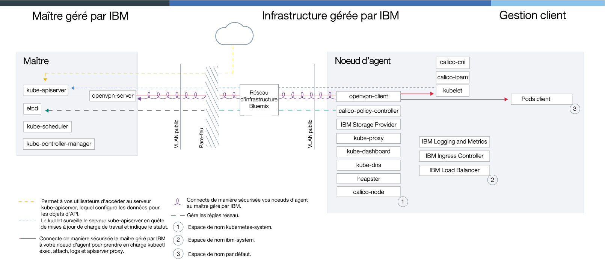

---

copyright:
  years: 2014, 2019
lastupdated: "2019-06-07"

keywords: kubernetes, iks

subcollection: containers

---

{:new_window: target="blank"}
{:shortdesc: .shortdesc}
{:screen: .screen}
{:pre: .pre}
{:table: .aria-labeledby="caption"}
{:codeblock: .codeblock}
{:tip: .tip}
{:note: .note}
{:important: .important}
{:deprecated: .deprecated}
{:download: .download}
{:preview: .preview}


# Déprécié : Cloud dédié
{: #dedicated}

{{site.data.keyword.containerlong}} dans {{site.data.keyword.Bluemix_dedicated_notm}} est déprécié. Vous ne pouvez créer de clusters dans un environnement {{site.data.keyword.Bluemix_dedicated_notm}}. Pour créer des clusters dans {{site.data.keyword.Bluemix_notm}} Public, voir [Initiation à {{site.data.keyword.containerlong_notm}}](/docs/containers?topic=containers-getting-started).
{: deprecated}

Si vous disposez d'un compte {{site.data.keyword.Bluemix_dedicated_notm}}, vous pouvez déployer des clusters Kubernetes dans un environnement de cloud dédié (`https://<my-dedicated-cloud-instance>.bluemix.net`) et vous connecter aux services {{site.data.keyword.Bluemix_notm}} présélectionnés qui s'exécutent également à cet emplacement.
{:shortdesc}

Si vous ne disposez pas d'un compte {{site.data.keyword.Bluemix_dedicated_notm}}, vous pouvez vous [initier à {{site.data.keyword.containerlong_notm}}](/docs/containers?topic=containers-getting-started) dans un compte {{site.data.keyword.Bluemix_notm}} public.

## A propos de l'environnement de cloud Dedicated
{: #dedicated_environment}

Avec un compte {{site.data.keyword.Bluemix_dedicated_notm}}, les ressources physiques disponibles sont dédiées exclusivement à votre cluster et ne sont pas partagées avec des clusters d'autres clients {{site.data.keyword.IBM_notm}}. Vous pouvez opter pour la mise en place d'un environnement {{site.data.keyword.Bluemix_dedicated_notm}} si vous voulez un isolement de votre cluster et que vous devez isoler les autres services {{site.data.keyword.Bluemix_notm}} que vous utilisez. Si vous ne disposez pas d'un compte Dedicated, vous pouvez [créer des clusters avec du matériel dédié dans un compte {{site.data.keyword.Bluemix_notm}} public](/docs/containers?topic=containers-clusters#clusters_ui).
{: shortdesc}

Avec la version {{site.data.keyword.Bluemix_dedicated_notm}}, vous pouvez créer des clusters depuis le catalogue dans la console Dedicated ou à l'aide de l'interface de ligne de commande d'{{site.data.keyword.containerlong_notm}}. Pour utiliser la console Dedicated, vous vous connectez simultanément à vos comptes Dedicated et public en utilisant votre IBMid. Vous pouvez utiliser cette double connexion pour accéder à vos clusters publics en utilisant votre console Dedicated. Pour utiliser l'interface de ligne de commande, vous vous connectez via votre noeud final Dedicated (`api.<my-dedicated-cloud-instance>.bluemix.net.`). Vous ciblez ensuite le noeud final d'API {{site.data.keyword.containerlong_notm}} de la région publique associée à l'environnement Dedicated.

Les différences les plus significatives entre {{site.data.keyword.Bluemix_notm}} Public et Dedicated sont les suivantes.

*   Dans {{site.data.keyword.Bluemix_dedicated_notm}}, {{site.data.keyword.IBM_notm}} est propriétaire et gère le compte d'infrastructure IBM Cloud (SoftLayer) dans lequel sont déployés les noeuds worker, les réseaux locaux virtuels (VLAN) et les sous-réseaux. Dans {{site.data.keyword.Bluemix_notm}} Public, c'est vous qui êtes propriétaire du compte d'infrastructure IBM Cloud (SoftLayer).
*   Dans {{site.data.keyword.Bluemix_dedicated_notm}}, les spécifications pour les VLAN et les sous-réseaux dans le compte d'infrastructure IBM Cloud (SoftLayer) géré par {{site.data.keyword.IBM_notm}} sont déterminées lorsque l'environnement Dedicated est activé. Dans {{site.data.keyword.Bluemix_notm}} Public, les spécifications pour les VLAN et les sous-réseaux sont déterminées lorsque le cluster est créé.

### Différences en matière de gestion de cluster entre les environnements de cloud
{: #dedicated_env_differences}

<table>
<caption>Différences en matière de gestion de cluster</caption>
<col width="20%">
<col width="40%">
<col width="40%">
 <thead>
 <th>Zone</th>
 <th>{{site.data.keyword.Bluemix_notm}} Public</th>
 <th>{{site.data.keyword.Bluemix_dedicated_notm}}</th>
 </thead>
 <tbody>
 <tr>
 <td>Création de cluster</td>
 <td>Créer un cluster gratuit ou un cluster standard.</td>
 <td>Créer un cluster standard.</td>
 </tr>
 <tr>
 <td>Matériel et propriété du cluster</td>
 <td>Dans les clusters standard, le matériel peut être partagé avec d'autres clients {{site.data.keyword.IBM_notm}} ou vous être dédié exclusivement. Vous êtes propriétaire et gérez les réseaux locaux virtuels (VLAN) publics et privés dans votre compte d'infrastructure IBM Cloud (SoftLayer).</td>
 <td>Dans les clusters sur {{site.data.keyword.Bluemix_dedicated_notm}}, le matériel est toujours dédié. Les réseaux locaux virtuels (VLAN) publics et privés disponibles pour la création du cluster sont prédéfinis lorsque l'environnement {{site.data.keyword.Bluemix_dedicated_notm}} est configuré et IBM en est propriétaire et les gère pour vous. La zone disponible lors de la création du cluster est également prédéfinie pour l'environnement {{site.data.keyword.Bluemix_notm}}.</td>
 </tr>
 <tr>
 <td>Mise en réseau de l'équilibreur de charge et d'Ingress</td>
 <td>Lors de la mise à disposition de clusters standard, les actions suivantes interviennent automatiquement.<ul><li>Un sous-réseau public portable et un sous-réseau portable privé sont liés à votre cluster et affectés à votre compte d'infrastructure IBM Cloud (SoftLayer). Des sous-réseaux supplémentaires peuvent être demandés via votre compte d'infrastructure IBM Cloud (SoftLayer).</li></li><li>Une adresse IP publique portable est utilisée pour un équilibreur de charge d'application (ALB) Ingress à haute disponibilité et une route publique est affectée au format <code>&lt;cluster_name&gt;.containers.appdomain.cloud</code>. Vous pouvez utiliser cette route pour exposer plusieurs applications au public. Une adresse IP privée portable est utilisée pour un équilibreur de charge ALB privé.</li><li>Quatre adresses IP publiques portables et quatre adresses IP privées portables sont affectées au cluster et peuvent être utilisées pour les services d'équilibreur de charge.</ul></td>
 <td>Lorsque vous créez votre compte Dedicated, vous aboutissez à une décision de connectivité quant à la manière d'exposer et d'accéder à vos services de cluster. Pour utiliser vos propres plages d'adresses IP d'entreprise (adresses IP gérées par l'utilisateur), vous devez les indiquer lorsque vous [configurez un environnement {{site.data.keyword.Bluemix_dedicated_notm}}](/docs/dedicated?topic=dedicated-dedicated#setupdedicated). <ul><li>Par défaut, aucun sous-réseau public portable n'est lié à des clusters que vous créez dans votre compte Dedicated. A la place, vous pouvez choisir le modèle de connectivité le mieux adapté à votre entreprise.</li><li>Après avoir créé le cluster, sélectionnez le type de sous-réseaux que vous désirez lier et utiliser avec votre cluster pour la connectivité Ingress ou avec l'équilibreur de charge.<ul><li>Pour les sous-réseaux portables publics ou privés, vous pouvez [ajouter des sous-réseaux aux clusters](/docs/containers?topic=containers-subnets#subnets)</li><li>Pour les adresses IP gérées par l'utilisateur que vous avez fournies à IBM lors de l'intégration à Dedicated, vous pouvez [ajouter aux clusters des sous-réseaux gérés par l'utilisateur](#dedicated_byoip_subnets).</li></ul></li><li>Après avoir lié un sous-réseau à votre cluster, l'équilibreur de charge ALB Ingress est créé. Une route Ingress publique n'est créée que si vous utilisez un sous-réseau public portable.</li></ul></td>
 </tr>
 <tr>
 <td>Mise en réseau de NodePort</td>
 <td>Vous pouvez exposer un port public sur votre noeud worker et utiliser l'adresse IP publique de ce noeud pour accès public au service dans le cluster.</td>
 <td>Toutes les adresses IP publiques des noeuds worker sont bloquées par un pare-feu. Toutefois, pour les services {{site.data.keyword.Bluemix_notm}} qui sont ajoutés au cluster, le service NodePort est accessible au moyen d'une adresse IP publique ou d'une adresse IP privée.</td>
 </tr>
 <tr>
 <td>Stockage persistant</td>
 <td>Utilisez [un provisionnement dynamique](/docs/containers?topic=containers-kube_concepts#dynamic_provisioning) ou un [provisionnement statique](/docs/containers?topic=containers-kube_concepts#static_provisioning) des volumes.</td>
 <td>Utilisez un [provisionnement dynamique](/docs/containers?topic=containers-kube_concepts#dynamic_provisioning) des volumes. [Ouvrez un cas de support](/docs/get-support?topic=get-support-getting-customer-support) pour demander une sauvegarde de vos volumes, une restauration de vos volumes et effectuer d'autres fonctions de stockage.</li></ul></td>
 </tr>
 <tr>
 <td>URL du registre d'images dans {{site.data.keyword.registryshort_notm}}</td>
 <td><ul><li>Sud et Est des Etats-Unis : <code>registry.ng bluemix.net</code></li><li>Sud du Royaume-Uni : <code>registry.eu-gb.bluemix.net</code></li><li>Europe centrale (Francfort) : <code>registry.eu-de.bluemix.net</code></li><li>Australie (Sydney) : <code>registry.au-syd.bluemix.net</code></li></ul></td>
 <td><ul><li>Pour les nouveaux espaces de nom, utilisez les mêmes registres basés sur la région que ceux définis pour {{site.data.keyword.Bluemix_notm}} public.</li><li>Pour les espaces de nom configurés pour les conteneurs uniques et évolutifs dans {{site.data.keyword.Bluemix_dedicated_notm}}, utilisez <code>registry.&lt;dedicated_domain&gt;</code></li></ul></td>
 </tr>
 <tr>
 <td>Accès au registre</td>
 <td>Voir les options dans [Utilisation de registres d'images privés et publics avec {{site.data.keyword.containerlong_notm}}](/docs/containers?topic=containers-images).</td>
 <td><ul><li>Pour les nouveaux espaces de nom, examinez les options dans [Utilisation de registres d'images privés et publics avec {{site.data.keyword.containerlong_notm}}](/docs/containers?topic=containers-images).</li><li>Pour les espaces de nom configurés pour des groupes uniques et évolutifs, [utilisez un jeton et créez une valeur confidentielle Kubernetes](#cs_dedicated_tokens) pour l'authentification.</li></ul></td>
 </tr>
 <tr>
 <td>Clusters à zones multiples</td>
 <td>Créez des [clusters à zones multiples](/docs/containers?topic=containers-ha_clusters#multizone) en ajoutant des zones supplémentaires dans vos pools de noeuds worker.</td>
 <td>Créez des [clusters à zone unique](/docs/containers?topic=containers-ha_clusters#single_zone). La zone disponible a été prédéfinie lors de la configuration de l'environnement {{site.data.keyword.Bluemix_dedicated_notm}}. Par défaut, un cluster à zone unique est configuré avec un pool de noeuds worker nommé `default`. Ce pool regroupe des noeuds worker ayant la même configuration, par exemple le type de machine, que vous avez définie lors de la création du cluster. Vous pouvez ajouter d'autres noeuds worker à votre cluster en [redimensionnant un pool de noeuds worker existant](/docs/containers?topic=containers-add_workers#resize_pool) ou en [ajoutant un nouveau pool de noeuds worker](/docs/containers?topic=containers-add_workers#add_pool). Lorsque vous ajoutez un pool de noeuds worker, vous devez ajouter la zone disponible pour ce pool de sorte que les noeuds worker puissent se déployer dans cette zone. En revanche, vous ne pouvez pas ajouter d'autres zones à vos pools de noeuds worker.</td>
 </tr>
</tbody></table>
{: caption="Comparaison des fonctions entre {{site.data.keyword.Bluemix_notm}} public et {{site.data.keyword.Bluemix_dedicated_notm}}" caption-side="top"}

<br />


### Architecture de service
{: #dedicated_ov_architecture}

Chaque noeud worker est configuré avec des ressources de calcul, des ressources réseau et un service de volume distincts.
{:shortdesc}

Des fonctions de sécurité intégrées fournissent l'isolement, les capacités de gestion des ressources et la conformité en matière de sécurité du noeud worker. Le noeud worker communique avec le maître par l'entremise de certificats TLS sécurisés et d'une connexion OpenVPN.


*Architecture Kubernetes et opération réseau dans {{site.data.keyword.Bluemix_dedicated_notm}}*



<br />


## Configuration d'{{site.data.keyword.containerlong_notm}} sur l'environnement Dedicated
{: #dedicated_setup}

Chaque environnement {{site.data.keyword.Bluemix_dedicated_notm}} dispose d'un compte d'entreprise public, dont est propriétaire le client, dans {{site.data.keyword.Bluemix_notm}}. Pour que les utilisateurs dans l'environnement Dedicated puissent créer des clusters, l'administrateur doit ajouter ces utilisateurs à un compte d'entreprise public.
{:shortdesc}

Avant de commencer :
  * [Configurez un environnement {{site.data.keyword.Bluemix_dedicated_notm}}](/docs/dedicated?topic=dedicated-dedicated#setupdedicated).
  * Si votre système local ou votre réseau d'entreprise contrôle des noeuds finaux sur l'Internet public en utilisant des proxys ou des pare-feux, vous devez [ouvrir les ports requis et les adresses IP dans votre pare-feu](/docs/containers?topic=containers-firewall#firewall).
  * [Téléchargement de l'interface de ligne de commande Cloud Foundry](https://github.com/cloudfoundry/cli/releases).

Pour permettre aux utilisateurs {{site.data.keyword.Bluemix_dedicated_notm}} d'accéder aux clusters :

1.  Le propriétaire de votre compte {{site.data.keyword.Bluemix_notm}} public doit générer une clé d'API.
    1.  Connectez-vous au noeud final pour votre instance {{site.data.keyword.Bluemix_dedicated_notm}}. Entrez les données d'identification {{site.data.keyword.Bluemix_notm}} pour le propriétaire du compte public et, à l'invite, sélectionnez votre compte.

        ```
        ibmcloud login -a api.<my-dedicated-cloud-instance>.<region>.bluemix.net
        ```
        {: pre}

        Si vous disposez d'un ID fédéré, utilisez la commande `ibmcloud login -a api.<my-dedicated-cloud-instance>.<region>.bluemix.net --sso` pour vous connecter à l'interface de ligne de commande {{site.data.keyword.Bluemix_notm}}. Entrez votre nom d'utilisateur et utilisez l'URL mentionnée dans la sortie de l'interface de ligne de commande pour extraire votre code d'accès à usage unique. Si la connexion échoue lorsque vous omettez l'option `--sso` et aboutit en incluant l'option `--sso`, ceci indique que votre ID est fédéré.
        {: tip}

    2.  Générez une clé d'API pour inviter des utilisateurs sur le compte public. Notez la valeur de la clé d'API, que l'administrateur du compte Dedicated doit utiliser à la prochaine étape.

        ```
        ibmcloud iam api-key-create <key_name> -d "Key to invite users to <dedicated_account_name>"
        ```
        {: pre}

    3.  Notez l'identificateur global unique (GUID) de l'organisation de compte public à laquelle vous désirez inviter des utilisateurs et que l'administrateur du compte Dedicated doit utiliser à la prochaine étape.

        ```
        ibmcloud account orgs
        ```
        {: pre}

2.  Le propriétaire de votre compte {{site.data.keyword.Bluemix_dedicated_notm}} peut inviter un ou plusieurs utilisateurs dans votre compte public.
    1.  Connectez-vous au noeud final pour votre instance {{site.data.keyword.Bluemix_dedicated_notm}}. Entrez les données d'identification {{site.data.keyword.Bluemix_notm}} pour le propriétaire du compte Dedicated et, à l'invite, sélectionnez votre compte.

        ```
        ibmcloud login -a api.<my-dedicated-cloud-instance>.<region>.bluemix.net
        ```
        {: pre}

        Si vous disposez d'un ID fédéré, utilisez la commande `ibmcloud login -a api.<my-dedicated-cloud-instance>.<region>.bluemix.net --sso` pour vous connecter à l'interface de ligne de commande {{site.data.keyword.Bluemix_notm}}. Entrez votre nom d'utilisateur et utilisez l'URL mentionnée dans la sortie de l'interface de ligne de commande pour extraire votre code d'accès à usage unique. Si la connexion échoue lorsque vous omettez l'option `--sso` et aboutit en incluant l'option `--sso`, ceci indique que votre ID est fédéré.
        {: tip}

    2.  Invitez les utilisateurs au compte public.
        * Pour inviter un utilisateur unique :

            ```
            ibmcloud cf bluemix-admin invite-users-to-public -userid=<user_email> -apikey=<public_API_key> -public_org_id=<public_org_ID>
            ```
            {: pre}

            Remplacez <em>&lt;user_IBMid&gt;</em> par l'adresse e-mail de l'utilisateur à inviter, <em>&lt;public_API_key&gt;</em> par la clé d'API générée à l'étape précédente et <em>&lt;public_org_ID&gt;</em> par l'identificateur global unique (GUID) de l'organisation du compte public. 

        * Pour inviter tous les utilisateurs actuels d'une organisation de compte Dedicated :

            ```
            ibmcloud cf bluemix-admin invite-users-to-public -organization=<dedicated_org_ID> -apikey=<public_API_key> -public_org_id=<public_org_ID>
            ```

            Remplacez <em>&lt;dedicated_org_ID&gt;</em> par l'ID d'organisation du compte Dedicated, <em>&lt;public_API_key&gt;</em> par la clé d'API générée à l'étape précédente et <em>&lt;public_org_ID&gt;</em> par l'identificateur global unique (GUID) de l'organisation du compte public. 

    3.  Si un IBMid existe pour un utilisateur, l'utilisateur est automatiquement ajouté à l'organisation spécifiée dans le compte public. Si l'utilisateur ne dispose pas d'un IBMid, une invitation lui est envoyée à son adresse électronique. Une fois que l'utilisateur accepte l'invitation, un IBMid est créé pour lui et cet utilisateur est ajouté dans l'organisation indiquée dans le compte public.

    4.  Vérifiez que les utilisateurs ont été ajoutés au compte.

        ```
        ibmcloud cf bluemix-admin invite-users-status -apikey=<public_API_key>
        ```
        {: pre}

        Les utilisateurs invités avec un IBMid existant ont le statut `ACTIVE`. Les utilisateurs invités qui n'ont pas d'IBMid ont le statut `PENDING` avant d'accepter l'invitation et le statut `ACTIVE` une fois qu'ils ont accepté l'invitation.

3.  Si un utilisateur a besoin d'autorisations de création de cluster, vous devez lui attribuer le rôle Administrateur.

    1.  Dans la barre de menu de la console publique, cliquez sur **Gérer > Sécurité > Identity and Access**, puis sur **Utilisateurs**.

    2.  Sur la ligne de l'utilisateur auquel affecter un accès, sélectionnez le menu **Actions**, puis cliquez sur **Affecter un accès**.

    3.  Sélectionnez **Affecter l'accès aux ressources**.

    4.  Dans la liste **Services**, sélectionnez **{{site.data.keyword.containerlong}}**.

    5.  Dans la liste **Région**, sélectionnez **Toutes les régions en cours** ou une région spécifique si vous y êtes invité.

    6. Sous **Sélectionner des rôles**, sélectionnez Administrateur.

    7. Cliquez sur **Affecter**.

4.  Les utilisateurs peuvent à présent se connecter au noeud final du compte Dedicated pour commencer à créer des clusters.

    1.  Connectez-vous au noeud final pour votre instance {{site.data.keyword.Bluemix_dedicated_notm}}. A l'invite, entrez votre IBMid.

        ```
        ibmcloud login -a api.<my-dedicated-cloud-instance>.<region>.bluemix.net
        ```
        {: pre}

        Si vous disposez d'un ID fédéré, utilisez la commande `ibmcloud login -a api.<my-dedicated-cloud-instance>.<region>.bluemix.net --sso` pour vous connecter à l'interface de ligne de commande {{site.data.keyword.Bluemix_notm}}. Entrez votre nom d'utilisateur et utilisez l'URL mentionnée dans la sortie de l'interface de ligne de commande pour extraire votre code d'accès à usage unique. Si la connexion échoue lorsque vous omettez l'option `--sso` et aboutit en incluant l'option `--sso`, ceci indique que votre ID est fédéré.
        {: tip}

    2.  Si vous vous connectez pour la première fois, à l'invite, soumettez votre ID utilisateur Dedicated et votre mot de passe. Votre compte Dedicated est authentifié et les comptes Dedicated et public sont liés entre eux. Après cette première connexion, chaque fois que vous vous connecterez par la suite, vous n'utiliserez que votre IBMid. Pour plus d'informations, voir [Connexion d'un ID dédié à votre IBMid public](/docs/iam?topic=iam-connect_dedicated_id#connect_dedicated_id).

        Vous devez vous connecter à la fois à votre compte Dedicated et à votre compte public pour créer des clusters. Si vous désirez vous connecter seulement à votre compte Dedicated, utilisez l'indicateur `--no-iam` lorsque vous vous connectez au noeud final Dedicated.
        {: note}

    3.  Pour créer ou accéder à des clusters dans l'environnement dédié, vous devez définir la région qui est associée à cet environnement. **Remarque** : vous ne pouvez pas créer des clusters dans d'autres groupes de ressources que `default`.

        ```
        ibmcloud ks region-set
        ```
        {: pre}

5.  Si vous désirez annuler le lien de votre compte, vous pouvez déconnecter votre IBMid de votre ID utilisateur Dedicated . Pour plus d'informations, voir [Déconnexion de votre ID dédié de l'IBMid public](/docs/iam?topic=iam-connect_dedicated_id#disconnect_id).

    ```
    ibmcloud iam dedicated-id-disconnect
    ```
    {: pre}

<br />


## Création de clusters
{: #dedicated_administering}

Concevez la configuration de votre cluster {{site.data.keyword.Bluemix_dedicated_notm}} en vue d'une disponibilité et d'une capacité maximale.
{:shortdesc}

### Création de clusters avec la console {{site.data.keyword.Bluemix_notm}}
{: #dedicated_creating_ui}

1. Ouvrez votre console Dedicated : `https://<my-dedicated-cloud-instance>.bluemix.net`.

2. Cochez la case indiquant de vous **connecter aussi à {{site.data.keyword.Bluemix_notm}} Public** et cliquez sur **Connexion**.

3. Suivez les invites pour vous connecter avec votre IBMid. S'il s'agit de votre toute première connexion à votre compte Dedicated, suivez les invites pour vous connecter à {{site.data.keyword.Bluemix_dedicated_notm}}.

4. Dans le catalogue, sélectionnez **Conteneurs** et cliquez sur **Cluster Kubernetes**.

5. Configurez les détails de votre cluster.

    1. Entrez un **nom de cluster**. Le nom doit commencer par une lettre, peut contenir des lettres, des nombres et des tirets (-) et ne doit pas dépasser 35 caractères. Utilisez un nom unique dans les régions. Le nom du cluster et la région dans laquelle est déployé le cluster constituent le nom de domaine qualifié complet du sous-domaine Ingress. Pour garantir que ce sous-domaine est unique dans une région, le nom de cluster peut être tronqué et complété par une valeur aléatoire dans le nom de domaine Ingress.

    2. Sélectionnez la **Zone** dans laquelle déployer votre cluster. La zone disponible a été prédéfinie lors de la configuration de l'environnement {{site.data.keyword.Bluemix_dedicated_notm}}.

    3. Sélectionnez la version du serveur d'API Kubernetes pour le noeud du maître cluster.

    4. Sélectionnez un type d'isolement matériel. Le type virtuel est facturé à l'heure et le type bare metal est facturé au mois.

        - **Virtuel - Dédié** : vos noeuds worker sont hébergés sur l'infrastructure réservée à votre compte. Vos ressources physiques sont complètement isolées.

        - **Bare Metal** : facturés au mois, les serveurs bare metal sont mis à disposition manuellement par l'infrastructure IBM Cloud (SoftLayer) après leur commande et cette opération peut prendre plus d'un jour ouvrable. La configuration bare metal convient le mieux aux applications à hautes performances qui nécessitent plus de ressources et de contrôle hôte. Pour certains types de machine, vous pouvez également choisir d'activer la fonction [Calcul sécurisé](/docs/containers?topic=containers-security#trusted_compute) pour vérifier que vos noeuds worker ne font pas l'objet de falsification. Si vous n'activez pas cette fonction lors de la création du cluster mais souhaitez le faire ultérieurement, vous pouvez utiliser la [commande](/docs/containers?topic=containers-cli-plugin-kubernetes-service-cli#cs_cluster_feature_enable) `ibmcloud ks feature-enable`. Après avoir activé cette fonction, vous ne pourrez plus la désactiver par la suite.

        Assurez-vous de vouloir mettre à disposition une machine bare metal. Comme elle est facturée au mois, si vous l'annulez immédiatement après l'avoir commandée par erreur, vous serez toujours redevable pour le mois complet.
        {:tip}

    5. Sélectionnez un **type de machine**. Le type de machine définit le nombre d'UC virtuelles, la mémoire et l'espace disque configurés dans chaque noeud worker et rendus disponibles aux conteneurs. Les types de machines virtuelles et bare metal disponibles varient en fonction de la zone de déploiement du cluster. Pour plus d'informations, voir la documentation de la [commande](/docs/containers?topic=containers-cli-plugin-kubernetes-service-cli#cs_machine_types) `ibmcloud ks machine-type`. Après avoir créé votre cluster, vous pouvez ajouter différents types de machine en ajoutant un noeud worker au cluster.

    6. Sélectionnez le **nombre de noeuds worker** dont vous avez besoin. Sélectionnez `3` pour assurer une haute disponibilité de votre cluster.

    7. Sélectionnez un **VLAN public** (facultatif) et un **VLAN privé** (obligatoire). Les VLAN public et privé sont prédéfinis lorsque l'environnement {{site.data.keyword.Bluemix_dedicated_notm}} est configuré. Ces deux réseaux VLAN communiquent entre les noeuds worker mais le réseau VLAN public communique également avec le noeud maître Kubernetes géré par IBM. Vous pouvez utiliser le même VLAN pour plusieurs clusters.
        Si les noeuds worker sont configurés uniquement avec un VLAN privé, vous devez permettre aux noeuds worker et au maître cluster de communiquer en [activant le noeud final de service privé](/docs/containers?topic=containers-cs_network_cluster#set-up-private-se) ou en [configurant un périphérique de passerelle](/docs/containers?topic=containers-plan_clusters#workeruser-master).
        {: note}

    8. Par défaut, l'option **Chiffrer le disque local** est sélectionnée. Si vous décochez cette case, les données de l'environnement d'exécution de conteneur de l'hôte ne sont pas chiffrées. [En savoir plus sur le chiffrement](/docs/containers?topic=containers-security#encrypted_disk).

6. Cliquez sur **Créer un cluster**. Vous pouvez voir la progression du déploiement du noeud worker dans l'onglet **Noeuds worker**. Une fois le déploiement terminé, vous pouvez voir si le cluster est prêt dans l'onglet **Présentation**.
    A chaque noeud worker sont affectés un ID de noeud worker unique et un nom de domaine qui ne doivent pas être modifiés manuellement après la création du cluster. La modification de l'ID ou du domaine empêcherait le maître Kubernetes de gérer votre cluster.
    {: important}

### Création de clusters depuis l'interface CLI
{: #dedicated_creating_cli}

1.  Installez l'interface CLI {{site.data.keyword.Bluemix_notm}} et le [plug-in {{site.data.keyword.containerlong_notm}}](/docs/containers?topic=containers-cs_cli_install#cs_cli_install).
2.  Connectez-vous au noeud final pour votre instance {{site.data.keyword.Bluemix_dedicated_notm}}. A l'invite, entrez vos données d'identification {{site.data.keyword.Bluemix_notm}} et sélectionnez votre compte.

    ```
    ibmcloud login -a api.<my-dedicated-cloud-instance>.<region>.bluemix.net
    ```
    {: pre}

    Si vous disposez d'un ID fédéré, utilisez la commande `ibmcloud login -a api.<my-dedicated-cloud-instance>.<region>.bluemix.net --sso` pour vous connecter à l'interface de ligne de commande {{site.data.keyword.Bluemix_notm}}. Entrez votre nom d'utilisateur et utilisez l'URL mentionnée dans la sortie de l'interface de ligne de commande pour extraire votre code d'accès à usage unique. Si la connexion échoue lorsque vous omettez l'option `--sso` et aboutit en incluant l'option `--sso`, ceci indique que votre ID est fédéré.
    {: tip}

3.  Ciblez un noeud final régional. Les noeuds finaux régionaux suivants sont pris en charge :
  * Dallas (Sud des Etats-Unis, us-south) : `https://us-south.containers.cloud.ibm.com`
  * Francfort (Centre de l'UE, eu-de) : `https://eu-de.containers.cloud.ibm.com`
  * Londres (Sud du Royaume-Uni, eu-gb) : `https://eu-gb.containers.cloud.ibm.com`
  * Sydney (Asie-Pacifique sud, au-syd) : `https://au-syd.containers.cloud.ibm.com`
  * Tokyo (Asie-Pacifique nord, jp-tok) : `https://jp-tok.containers.cloud.ibm.com`
  * Washington, D.C. (Est des Etats-Unis, us-east) : `https://us-east.containers.cloud.ibm.com`
  ```
  ibmcloud ks init --host <endpoint>
  ```
  {: pre}
  Vous ne pouvez pas utiliser le noeud final global `https://containers.cloud.ibm.com`. Vous devez cibler un noeud final régional pour créer ou gérer des clusters dans cette région.
  {: important}

4.  Créez un cluster avec la commande `cluster-create`. Lorsque vous créez un cluster standard, le matériel du noeud worker est facturé par heures d'utilisation.

    Exemple :

    ```
    ibmcloud ks cluster-create --zone <zone> --machine-type <machine_type> --name <cluster_name> --workers <number>
    ```
    {: pre}

    <table>
    <caption>Description des composantes de cette commande</caption>
    <thead>
    <th colspan=2> Description des composantes de cette commande</th>
    </thead>
    <tbody>
    <tr>
    <td><code>cluster-create</code></td>
    <td>Commande de création d'un cluster dans votre organisation {{site.data.keyword.Bluemix_notm}}.</td>
    </tr>
    <tr>
    <td><code>--zone <em>&lt;zone&gt;</em></code></td>
    <td>Entrez l'ID de la zone {{site.data.keyword.Bluemix_notm}} que votre environnement dédié est configuré pour utiliser.</td>
    </tr>
    <tr>
    <td><code>--machine-type <em>&lt;machine_type&gt;</em></code></td>
    <td>Entrez un type de machine. Vous pouvez déployer vos noeuds worker en tant que machines virtuelles sur du matériel dédié ou en tant que machines physiques sur un serveur bare metal. Les types de machines virtuelles et physiques disponibles varient en fonction de la zone de déploiement du cluster. Pour plus d'informations, voir la documentation de la [commande](/docs/containers?topic=containers-cli-plugin-kubernetes-service-cli#cs_machine_types) `ibmcloud ks machine-type`. </td>
    </tr>
    <tr>
    <td><code>--public-vlan <em>&lt;machine_type&gt;</em></code></td>
    <td>Entrez l'ID du VLAN public que votre environnement dédié est configuré pour utiliser. Si vous désirez connecter vos noeuds worker uniquement à un VLAN privé, n'indiquez pas cette option.<p class="note">Si les noeuds worker sont configurés uniquement avec un VLAN privé, vous devez permettre aux noeuds worker et au maître cluster de communiquer en [activant le noeud final de service privé](/docs/containers?topic=containers-cs_network_cluster#set-up-private-se) ou en [configurant un périphérique de passerelle](/docs/containers?topic=containers-plan_clusters#workeruser-master).</p></td>
    </tr>
    <tr>
    <td><code>--private-vlan <em>&lt;machine_type&gt;</em></code></td>
    <td>Entrez l'ID du VLAN privé que votre environnement dédié est configuré pour utiliser.</td>
    </tr>  
    <tr>
    <td><code>--name <em>&lt;name&gt;</em></code></td>
    <td>Entrez un nom pour votre cluster. Le nom doit commencer par une lettre, peut contenir des lettres, des nombres et des tirets (-) et ne doit pas dépasser 35 caractères. Utilisez un nom unique dans les régions. Le nom du cluster et la région dans laquelle est déployé le cluster constituent le nom de domaine qualifié complet du sous-domaine Ingress. Pour garantir que ce sous-domaine est unique dans une région, le nom de cluster peut être tronqué et complété par une valeur aléatoire dans le nom de domaine Ingress.
</td>
    </tr>
    <tr>
    <td><code>--workers <em>&lt;number&gt;</em></code></td>
    <td>Entrez le nombre de noeuds worker à inclure dans le cluster. Si l'option <code>--workers</code> n'est pas spécifiée, un noeud worker est créé.</td>
    </tr>
    <tr>
    <td><code>--kube-version <em>&lt;major.minor.patch&gt;</em></code></td>
    <td>Version Kubernetes du noeud du maître cluster. Cette valeur est facultative. Lorsque la version n'est pas spécifiée, le cluster est créé avec la valeur par défaut des versions Kubernetes prises en charge. Pour voir les versions disponibles, exécutez la commande <code>ibmcloud ks versions</code>.
</td>
    </tr>
    <tr>
    <td><code>--disable-disk-encrypt</code></td>
    <td>Par défaut, les noeuds worker disposent du [chiffrement de disque](/docs/containers?topic=containers-security#encrypted_disk) avec l'algorithme AES 256 bits. Incluez cette option si vous désirez désactiver le chiffrement.</td>
    </tr>
    <tr>
    <td><code>--trusted</code></td>
    <td>Activez la fonction [Calcul sécurisé](/docs/containers?topic=containers-security#trusted_compute) pour vérifier que vos noeuds worker bare metal ne font pas l'objet de falsification. Si vous n'activez pas cette fonction lors de la création du cluster mais souhaitez le faire ultérieurement, vous pouvez utiliser la [commande](/docs/containers?topic=containers-cli-plugin-kubernetes-service-cli#cs_cluster_feature_enable) `ibmcloud ks feature-enable`. Après avoir activé cette fonction, vous ne pourrez plus la désactiver par la suite.</td>
    </tr>
    </tbody></table>

5.  Vérifiez que la création du cluster a été demandée.

    ```
    ibmcloud ks clusters
    ```
    {: pre}

    * Pour les machines virtuelles, la commande des postes de noeud worker et la mise à disposition et la configuration du cluster dans votre compte peuvent prendre quelques minutes. Les machines physiques bare metal sont mises à disposition par interaction manuelle avec l'infrastructure IBM Cloud (SoftLayer) et cette opération peut prendre plus d'un jour ouvrable.
    * Si vous voyez s'afficher le message d'erreur suivant, [ouvrez un cas de support](/docs/get-support?topic=get-support-getting-customer-support).
        ```
        Exception liée à l'infrastructure {{site.data.keyword.Bluemix_notm}} : impossible de passer la commande. Les ressources derrière le routeur 'router_name' ne sont pas suffisantes pour satisfaire la demande pour les invités suivants : 'worker_id'.
        ```

    Lorsque la mise à disposition de votre cluster est terminée, le statut du cluster passe à **deployed**.
    

    ```
    Name         ID                                   State      Created          Workers    Zone      Version     Resource Group Name
    my_cluster   paf97e8843e29941b49c598f516de72101   deployed   20170201162433   1          mil01     1.13.6      Default
    ```
    {: screen}

6.  Vérifiez le statut des noeuds worker.

    ```
    ibmcloud ks workers --cluster <cluster_name_or_ID>
    ```
    {: pre}

    Lorsque les noeuds worker sont prêts, l'état passe à **normal** et le statut indique **Ready**. Lorsque le statut du noeud indique **Ready**, vous pouvez accéder au cluster.

    A chaque noeud worker sont affectés un ID de noeud worker unique et un nom de domaine qui ne doivent pas être modifiés manuellement après la création du cluster. La modification de l'ID ou du domaine empêcherait le maître Kubernetes de gérer votre cluster.
    {: important}

    ```
    ID                                                 Public IP       Private IP       Machine Type   State    Status   Zone   Version
    kube-mil01-paf97e8843e29941b49c598f516de72101-w1   169.xx.xxx.xxx  10.xxx.xx.xxx    free           normal   Ready    mil01      1.13.6
    ```
    {: screen}

7.  Définissez le cluster que vous avez créé comme contexte de cette session. Effectuez ces étapes de configuration à chaque fois que vous utilisez votre cluster.

    1.  Obtenez la commande permettant de définir la variable d'environnement et téléchargez les fichiers de configuration Kubernetes.

        ```
        ibmcloud ks cluster-config --cluster <cluster_name_or_ID>
        ```
        {: pre}

        Une fois les fichiers de configuration téléchargés, une commande s'affiche ; elle vous permet de définir le chemin vers le fichier de configuration Kubernetes local en tant que variable d'environnement.

        Exemple pour OS X :

        ```
        export KUBECONFIG=/Users/<user_name>/.bluemix/plugins/container-service/clusters/<cluster_name>/kube-config-prod-dal10-<cluster_name>.yml
        ```
        {: screen}

    2.  Copiez et collez la commande dans la sortie afin de définir la variable d'environnement `KUBECONFIG`.
    3.  Vérifiez que la variable d'environnement `KUBECONFIG` est correctement définie.

        Exemple pour OS X :

        ```
        echo $KUBECONFIG
        ```
        {: pre}

        Sortie :

        ```
        /Users/<user_name>/.bluemix/plugins/container-service/clusters/<cluster_name>/kube-config-prod-dal10-<cluster_name>.yml

        ```
        {: screen}

8.  Accédez à votre tableau de bord Kubernetes via le port par défaut (8001).
    1.  Définissez le proxy avec le numéro de port par défaut.

        ```
        kubectl proxy
        ```
        {: pre}

        ```
        Starting to serve on 127.0.0.1:8001
        ```
        {: screen}

    2.  Ouvrez l'URL suivante dans un navigateur Web pour accéder au tableau de bord Kubernetes.

        ```
        http://localhost:8001/ui
        ```
        {: codeblock}

### Ajout de noeuds worker
{: #add_workers_dedicated}

Avec {{site.data.keyword.Bluemix_dedicated_notm}}, vous pouvez uniquement créer des [clusters à zone unique](/docs/containers?topic=containers-ha_clusters#single_zone). Par défaut, un cluster à zone unique est configuré avec un pool de noeuds worker nommé `default`. Ce pool regroupe des noeuds worker ayant la même configuration, par exemple le type de machine, que vous avez définie lors de la création du cluster. Vous pouvez ajouter d'autres noeuds worker à votre cluster en [redimensionnant un pool de noeuds worker existant](/docs/containers?topic=containers-add_workers#resize_pool) ou en [ajoutant un nouveau pool de noeuds worker](/docs/containers?topic=containers-add_workers#add_pool). Lorsque vous ajoutez un pool de noeuds worker, vous devez ajouter la zone disponible pour ce pool de sorte que les noeuds worker puissent se déployer dans cette zone. En revanche, vous ne pouvez pas ajouter d'autres zones à vos pools de noeuds worker.
{: shortdesc}

### Utilisation de registres d'images privés et publics
{: #dedicated_images}

Découvrez comment [sécuriser vos informations personnelles](/docs/containers?topic=containers-security#pi) lorsque vous utilisez des images de conteneur.

Pour les nouveaux espaces de nom, examinez les options dans [Utilisation de registres d'images privés et publics avec {{site.data.keyword.containerlong_notm}}](/docs/containers?topic=containers-images). Pour les espaces de nom configurés pour des groupes uniques et évolutifs, [utilisez un jeton et créez une valeur confidentielle Kubernetes](#cs_dedicated_tokens) pour l'authentification.

### Ajout de sous-réseaux à des clusters
{: #dedicated_cluster_subnet}

Vous pouvez modifier le pool d'adresses IP publiques portables disponibles en ajoutant des sous-réseaux à votre cluster. Pour plus d'informations, voir [Ajout de sous-réseaux à des clusters](/docs/containers?topic=containers-subnets#subnets). Examinez les différences suivantes en cas d'ajout de sous-réseaux à des clusters dans la version Dedicated.
{: shortdesc}

#### Ajout à vos clusters Kubernetes de sous-réseaux et d'adresses IP supplémentaires gérés par l'utilisateur
{: #dedicated_byoip_subnets}

Vous pouvez ajouter un nombre supplémentaire de vos propres sous-réseaux depuis un réseau sur site, que vous désirez utiliser pour accéder à {{site.data.keyword.containerlong_notm}}. Vous pouvez ajouter des adresses IP de ces sous-réseaux à Ingress et aux services d'équilibreur de charge dans votre cluster Kubernetes. Les sous-réseaux gérés par l'utilisateur sont configurés de deux manières selon le format du sous-réseau que vous désirez utiliser.
{: shortdesc}

Conditions requises :
- Les sous-réseaux gérés par l'utilisateur peuvent être ajoutés uniquement à des réseaux locaux virtuels (VLAN) privés.
- La limite de longueur du préfixe de sous-réseau est /24 à /30. Par exemple, `203.0.113.0/24` indique 253 adresses IP privées utilisables, alors que `203.0.113.0/30` indique 1 adresse IP privée utilisable.
- La première adresse IP dans le sous-réseau doit être utilisée comme passerelle du sous-réseau.

Avant de commencer : Configurez le routage entrant et sortant du trafic réseau de votre entreprise afin d'utiliser le réseau {{site.data.keyword.Bluemix_dedicated_notm}} qui exploitera le sous-réseau géré par l'utilisateur.

1. Pour utiliser votre propre sous-réseau, [ouvrez un cas de support](/docs/get-support?topic=get-support-getting-customer-support) et fournissez la liste des routages de sous-réseaux CIDR que vous désirez utiliser. **Remarque **: la manière dont les ALB et les équilibreurs de charge sont gérés pour la connectivité sur site et la connectivité de compte interne diffère selon le format du CIDR de sous-réseau. Voir la dernière étape pour les différences de configuration.

2. Après qu'{{site.data.keyword.IBM_notm}} provisionne les sous-réseaux gérés par l'utilisateur, rendez le sous-réseau disponible pour votre cluster Kubernetes.

    ```
    ibmcloud ks cluster-user-subnet-add --cluster <cluster_name> --subnet-cidr <subnet_CIDR> --private-vlan <private_VLAN>
    ```
    {: pre}
    Remplacez <em>&lt;cluster_name&gt;</em> par le nom ou l'ID de votre cluster, <em>&lt;subnet_CIDR&gt;</em> par l'un des CIDR de sous-réseau indiqués dans le cas de support et <em>&lt;private_VLAN&gt;</em> par un ID de VLAN privé disponible. Pour obtenir l'ID d'un VLAN privé disponible, exécutez la commande `ibmcloud ks vlans`.

3. Vérifiez que les sous-réseaux ont été ajoutés à votre cluster. La zone **User-managed** pour les sous-réseaux fournis par l'utilisateur indique _`true`_.

    ```
    ibmcloud ks cluster-get --showResources <cluster_name>
    ```
    {: pre}

    ```
    Subnet VLANs
    VLAN ID   Subnet CIDR         Public       User-managed
    1555503   169.xx.xxx.xxx/24   true         false
    1555505   10.xxx.xx.xxx/24    false        false
    1555505   10.xxx.xx.xxx/24    false        true
    ```
    {: screen}

4. **Important** : si vous disposez de plusieurs VLAN pour un cluster, de plusieurs sous-réseaux sur le même VLAN ou d'un cluster à zones multiples, vous devez activer une fonction [VRF (Virtual Router Function)](/docs/infrastructure/direct-link?topic=direct-link-overview-of-virtual-routing-and-forwarding-vrf-on-ibm-cloud#overview-of-virtual-routing-and-forwarding-vrf-on-ibm-cloud) pour votre compte d'infrastructure IBM Cloud (SoftLayer) pour que vos noeuds worker puissent communiquer entre eux sur le réseau privé. Pour activer la fonction VRF, [contactez le représentant de votre compte d'infrastructure IBM Cloud (SoftLayer)](/docs/infrastructure/direct-link?topic=direct-link-overview-of-virtual-routing-and-forwarding-vrf-on-ibm-cloud#how-you-can-initiate-the-conversion). Si vous ne parvenez pas à activer la fonction VRF ou si vous ne souhaitez pas le faire, activez la fonction [Spanning VLAN](/docs/infrastructure/vlans?topic=vlans-vlan-spanning#vlan-spanning). Pour effectuer cette action, vous devez disposer du [droit d'infrastructure](/docs/containers?topic=containers-users#infra_access) **Réseau > Gérer le spanning VLAN pour réseau**, ou vous pouvez demander au propriétaire du compte de l'activer. Pour vérifier si le spanning VLAN est déjà activé, utilisez la [commande](/docs/containers?topic=containers-cli-plugin-kubernetes-service-cli#cs_vlan_spanning_get) `ibmcloud ks vlan-spanning-get --region <region>`. 

5. Pour configurer une connectivité sur site et de compte interne, sélectionnez entre les options suivantes :
  - Si vous avez sélectionné une plage d'adresses IP privées 10.x.x.x pour le sous-réseau, utilisez des adresses IP valides sur cette plage pour configurer la connectivité sur site et du compte interne avec Ingress et un équilibreur de charge. Pour plus d'informations, voir [Planification réseau avec des services NodePort, LoadBalancer ou Ingress](/docs/containers?topic=containers-cs_network_planning#external).
  - Si vous n'avez pas utilisé une plage d'adresses IP privées 10.x.x.x pour le sous-réseau, utilisez des adresses IP valides sur cette plage pour configurer une connectivité sur site avec Ingress et un équilibreur de charge. Pour plus d'informations, voir [Planification réseau avec des services NodePort, LoadBalancer ou Ingress](/docs/containers?topic=containers-cs_network_planning#external). Toutefois, vous devez utiliser un sous-réseau privé portable de l'infrastructure IBM Cloud (SoftLayer) pour configurer la connectivité de compte interne entre votre cluster et d'autres services basés Cloud Foundry. Vous pouvez créer un sous-réseau privé portable à l'aide de la commande [`ibmcloud ks cluster-subnet-add`](/docs/containers?topic=containers-cli-plugin-kubernetes-service-cli#cs_cluster_subnet_add). Pour ce scénario, votre cluster dispose à la fois d'un sous-réseau géré par l'utilisateur pour la connectivité sur site et d'un sous-réseau privé portable de l'infrastructure IBM Cloud (SoftLayer) pour connectivité de compte interne.

### Autres configurations de cluster
{: #dedicated_other}

Examinez les options suivantes pour d'autres configurations de cluster :
  * [Gestion de l'accès au cluster](/docs/containers?topic=containers-users#access_policies)
  * [Mise à jour du maître Kubernetes](/docs/containers?topic=containers-update#master)
  * [Mise à jour des noeuds worker](/docs/containers?topic=containers-update#worker_node)
  * [Configuration de la consignation de cluster](/docs/containers?topic=containers-health#logging). L'activation des journaux n'est pas prise en charge à partir du noeud final Dedicated. Vous devez vous connecter au noeud final {{site.data.keyword.cloud_notm}} public et cibler votre organisation et votre espace de nom publics pour activer l'acheminement des journaux.
  * [Configuration de la surveillance de cluster](/docs/containers?topic=containers-health#view_metrics). Un cluster `ibm-monitoring` existe dans chaque compte {{site.data.keyword.Bluemix_dedicated_notm}}. Cet environnement de cluster surveille en continu la santé du service {{site.data.keyword.containerlong_notm}} dans l'environnement Dedicated, en vérifiant la stabilité et la connectivité de l'environnement. Ne retirez-pas ce cluster de l'environnement.
  * [Suppression de clusters](/docs/containers?topic=containers-remove)

<br />


## Déploiement d'applications dans des clusters
{: #dedicated_apps}

Vous pouvez utiliser des techniques Kubernetes pour déployer des applications dans des clusters {{site.data.keyword.Bluemix_dedicated_notm}} et vous assurer que vos applications soient toujours opérationnelles.
{:shortdesc}

Pour déployer des applications dans des clusters, suivez les instructions de la rubrique [Déploiement d'applications dans des clusters {{site.data.keyword.Bluemix_notm}} publics](/docs/containers?topic=containers-app#app). Examinez les différences suivantes pour les clusters {{site.data.keyword.Bluemix_dedicated_notm}}.

Découvrez comment [sécuriser vos informations personnelles](/docs/containers?topic=containers-security#pi) lorsque vous utilisez des ressources Kubernetes.

### Autorisation d'accès public aux applications
{: #dedicated_apps_public}

Pour les environnements {{site.data.keyword.Bluemix_dedicated_notm}}, les adresses IP primaires publiques sont bloquées par un pare-feu. Pour rendre une application accessible au public, utilisez un [service d'équilibreur de charge](#dedicated_apps_public_load_balancer) ou [Ingress](#dedicated_apps_public_ingress) au lieu d'un service NodePort. Si vous avez besoin d'un accès à un service d'équilibreur de charge ou un service Ingress utilisant des adresses IP publiques portables, fournissez à IBM une liste blanche de pare-feu d'entreprise au moment de l'intégration du service.
{: shortdesc}

#### Configuration de l'accès public à une application à l'aide du type de service LoadBalancer
{: #dedicated_apps_public_load_balancer}

Si vous désirez utiliser des adresses IP publiques pour l'équilibreur de charge, vérifiez qu'une liste blanche de pare-feu d'entreprise a été fournie à IBM ou [ouvrez un cas de support](/docs/get-support?topic=get-support-getting-customer-support) pour configurer la liste blanche de pare-feu. Suivez ensuite les étapes décrites dans [Equilibrage de charge de base et DSR à l'aide d'équilibreurs de charge de réseau (NLB)](/docs/containers?topic=containers-loadbalancer).
{: shortdesc}

#### Configuration de l'accès public à une application à l'aide d'Ingress
{: #dedicated_apps_public_ingress}

Si vous désirez utiliser des adresses IP publiques pour l'équilibreur de charge ALB Ingress, vérifiez qu'une liste blanche de pare-feu d'entreprise a été fournie à IBM ou [ouvrez un cas de support](/docs/get-support?topic=get-support-getting-customer-support) pour configurer la liste blanche de pare-feu. Suivez ensuite les étapes de la rubrique [Exposition d'applications au public](/docs/containers?topic=containers-ingress#ingress_expose_public).
{: shortdesc}

### Création de stockage persistant
{: #dedicated_apps_volume_claim}

Pour examiner les options de création de stockage persistant, voir [Options de stockage de données persistant pour la haute disponibilité](/docs/containers?topic=containers-storage_planning#persistent_storage_overview). Pour demander une sauvegarde de vos volumes, une restauration à partir de vos volumes, une suppression de volumes ou la prise d'instantané régulière de votre stockage de fichiers, vous devez [ouvrir un cas de support](/docs/get-support?topic=get-support-getting-customer-support).
{: shortdesc}

Si vous choisissez de mettre à disposition du [stockage de fichiers](/docs/containers?topic=containers-file_storage#file_predefined_storageclass), sélectionnez des classes de stockage sans retain. Choisir des classes de stockage sans retain permet d'éviter d'avoir des instances de stockage persistant orphelines dans l'infrastructure IBM Cloud (SoftLayer) que vous ne pouvez supprimer qu'en ouvrant un cas de support.

## Création d'un jeton {{site.data.keyword.registryshort_notm}} pour un registre d'images {{site.data.keyword.Bluemix_dedicated_notm}}
{: #cs_dedicated_tokens}

Créez un jeton sans date d'expiration pour un registre d'images que vous utilisez pour des groupes de conteneurs uniques et évolutifs avec des clusters dans {{site.data.keyword.containerlong}}.
{:shortdesc}

1.  Extrayez un jeton de registre permanent pour la session actuelle. Ce jeton permet l'accès aux images dans l'espace de nom actuel.
    ```
    ibmcloud cr token-add --description "<description>" --non-expiring -q
    ```
    {: pre}

2.  Vérifiez la valeur confidentielle Kubernetes.

    ```
    kubectl describe secrets
    ```
    {: pre}

    Vous pouvez utiliser cette valeur confidentielle pour travailler dans {{site.data.keyword.containerlong}}.

3.  Créez la valeur confidentielle Kubernetes pour stocker votre information de jeton.

    ```
    kubectl --namespace <kubernetes_namespace> create secret docker-registry <secret_name>  --docker-server=<registry_url> --docker-username=token --docker-password=<token_value> --docker-email=<docker_email>
    ```
    {: pre}

    <table>
    <caption>Description des composantes de cette commande</caption>
    <thead>
    <th colspan=2> Description des composantes de cette commande</th>
    </thead>
    <tbody>
    <tr>
    <td><code>--namespace &lt;kubernetes_namespace&gt;</code></td>
    <td>Obligatoire. Espace de nom Kubernetes de votre cluster dans lequel vous désirez utiliser la valeur confidentielle et déployer des conteneurs. Exécutez la commande <code>kubectl get namespaces</code> pour répertorier tous les espaces de nom dans votre cluster.</td>
    </tr>
    <tr>
    <td><code>&lt;secret_name&gt;</code></td>
    <td>Obligatoire. Nom que vous désirez utiliser comme valeur confidentielle d'extraction d'image (imagePullSecret).</td>
    </tr>
    <tr>
    <td><code>--docker-server=&lt;registry_url&gt;</code></td>
    <td>Obligatoire. URL du registre d'images où votre espace de nom est configuré : <code>registry.&lt;dedicated_domain&gt;</code></li></ul></td>
    </tr>
    <tr>
    <td><code>--docker-username=token</code></td>
    <td>Obligatoire. Ne modifiez pas cette valeur.</td>
    </tr>
    <tr>
    <td><code>--docker-password=&lt;token_value&gt;</code></td>
    <td>Obligatoire. Valeur de votre jeton de registre extraite auparavant.</td>
    </tr>
    <tr>
    <td><code>--docker-email=&lt;docker-email&gt;</code></td>
    <td>Obligatoire. Si vous en avez une, entrez votre adresse e-mail Docker. Si vous n'en avez pas, indiquez une adresse e-mail fictive (par exemple, a@b.c). Cet e-mail est obligatoire pour créer une valeur confidentielle Kubernetes, mais n'est pas utilisé après la création.</td>
    </tr>
    </tbody></table>

4.  Créez un pod faisant référence à la valeur confidentielle d'extraction d'image.

    1.  Ouvrez l'éditeur de texte de votre choix et créez un script de configuration de pod nommé, par exemple, `mypod.yaml`.
    2.  Définissez le pod et la valeur confidentielle d'extraction d'image (imagePullSecret) que vous désirez utiliser pour accéder au registre. Pour utiliser une image privée d'un espace de nom :

        ```
        apiVersion: v1
        kind: Pod
        metadata:
          name: <pod_name>
        spec:
          containers:
            - name: <container_name>
              image: registry.<dedicated_domain>/<my_namespace>/<my_image>:<tag>
          imagePullSecrets:
            - name: <secret_name>
        ```
        {: codeblock}

        <table>
        <caption>Description des composants du fichier YAML</caption>
        <thead>
        <th colspan=2> Description des composants du fichier YAML</th>
        </thead>
        <tbody>
        <tr>
        <td><code>&lt;pod_name&gt;</code></td>
        <td>Nom du pod que vous désirez créer.</td>
        </tr>
        <tr>
        <td><code>&lt;container_name&gt;</code></td>
        <td>Nom du conteneur que vous désirez déployer dans votre cluster.</td>
        </tr>
        <tr>
        <td><code>&lt;my_namespace&gt;</code></td>
        <td>Espace de nom sous lequel votre image est stockée. Pour répertorier les espaces de nom disponibles, exécutez la commande `ibmcloud cr namespace-list`.</td>
        </tr>
        <td><code>&lt;my_image&gt;</code></td>
        <td>Nom de l'image que vous désirez utiliser. Pour répertorier les images disponibles dans un compte {{site.data.keyword.Bluemix_notm}}, exécutez la commande <code>ibmcloud cr image-list</code>.</td>
        </tr>
        <tr>
        <td><code>&lt;tag&gt;</code></td>
        <td>Version de l'image que vous désirez utiliser. Si aucune étiquette n'est spécifiée, celle correspondant à <strong>latest</strong> (la plus récente) est utilisée par défaut.</td>
        </tr>
        <tr>
        <td><code>&lt;secret_name&gt;</code></td>
        <td>Nom de la valeur confidentielle d'extraction d'image que vous avez créée précédemment.</td>
        </tr>
        </tbody></table>

    3.  Sauvegardez vos modifications.

    4.  Créez le déploiement dans votre cluster.

          ```
          kubectl apply -f mypod.yaml -n <namespace>
          ```
          {: pre}
