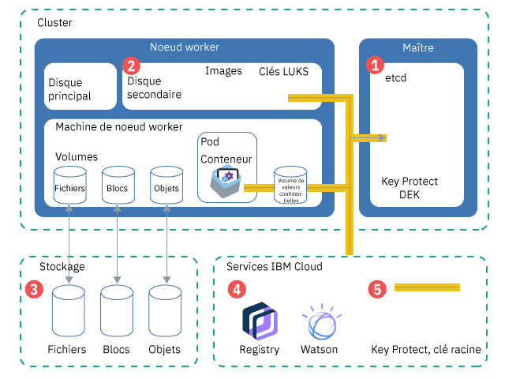

---

copyright:
  years: 2014, 2019
lastupdated: "2019-05-31"

keywords: kubernetes, iks

subcollection: containers

---

{:new_window: target="_blank"}
{:shortdesc: .shortdesc}
{:screen: .screen}
{:pre: .pre}
{:table: .aria-labeledby="caption"}
{:codeblock: .codeblock}
{:tip: .tip}
{:note: .note}
{:important: .important}
{:deprecated: .deprecated}
{:download: .download}
{:preview: .preview}


# Protection des informations sensibles dans votre cluster
{: #encryption}

Protégez les informations de cluster sensibles pour assurer l'intégrité des données et éviter d'exposer vos données à des utilisateurs non autorisés.
{: shortdesc}

Vous pouvez créer des données sensibles à différents niveaux dans votre cluster, chaque niveau nécessitant une protection adéquate.
- **Au niveau du cluster :** les données de configuration du cluster sont stockées dans le composant etcd de votre maître Kubernetes. Les données d'etcd sont stockées sur le disque local du maître Kubernetes et sauvegardées dans {{site.data.keyword.cos_full_notm}}. Les données sont chiffrées lors du transit vers {{site.data.keyword.cos_full_notm}} et au repos. Vous pouvez choisir d'activer le chiffrement de vos données etcd sur le disque local de votre maître Kubernetes en [activant le chiffrement {{site.data.keyword.keymanagementservicelong_notm}}](/docs/containers?topic=containers-encryption#encryption) pour votre cluster. Les données etcd des clusters exécutant une version antérieure de Kubernetes sont stockées sur un disque chiffré géré par IBM et sauvegardées quotidiennement.
- **Au niveau de l'application :** lorsque vous déployez votre application, ne stockez pas d'informations confidentielles, par exemple des données d'identification ou des clés, dans le fichier de configuration YAML, les éléments configmap ou les scripts. Utilisez à la place des [valeurs confidentielles (secrets) Kubernetes ](https://kubernetes.io/docs/concepts/configuration/secret/). Vous pouvez également [chiffrer les données dans des valeurs confidentielles Kubernetes](#keyprotect) pour empêcher des utilisateurs non autorisés d'accéder aux informations sensibles de cluster.

Pour plus d'informations sur la sécurisation de votre cluster, voir [Sécurité d'{{site.data.keyword.containerlong_notm}}](/docs/containers?topic=containers-security#security).



_Figure : Présentation du chiffrement des données dans un cluster_

1.  **etcd** : etcd est le composant du maître qui stocke les données de vos ressources Kubernetes, telles que des valeurs confidentielles (secret) et des fichiers `.yaml` de configuration d'objet. Les données d'etcd sont stockées sur le disque local du maître Kubernetes et sauvegardées dans {{site.data.keyword.cos_full_notm}}. Les données sont chiffrées lors du transit vers {{site.data.keyword.cos_full_notm}} et au repos. Vous pouvez choisir d'activer le chiffrement de vos données etcd sur le disque local de votre maître Kubernetes en [activant le chiffrement {{site.data.keyword.keymanagementservicelong_notm}}](#keyprotect) pour votre cluster. Les données etcd dans les clusters exécutant une version antérieure de Kubernetes sont stockées sur un disque chiffré géré par IBM et sauvegardées quotidiennement. Lorsque ces données sont envoyées à un pod, elles sont chiffrées avec TLS pour garantir leur protection et leur intégrité.
2.  **Disque secondaire du noeud worker** : le disque secondaire de votre noeud worker est l'emplacement de stockage du système de fichiers du conteneur et des images extraites localement. Le disque est chiffré avec AES 256 bits à l'aide d'une clé de chiffrement LUKS qui est unique au noeud worker et qui est stockée sous forme de valeur confidentielle (secret) dans etcd et dont la gestion est assurée par IBM. Lorsque vous rechargez ou mettez à jour vos noeuds worker, les clés LUKS font l'objet d'une rotation.
3.  **Stockage** : vous pouvez opter pour stocker les données en [configurant du stockage de fichiers, d'objets ou du stockage par blocs persistant](/docs/containers?topic=containers-storage_planning#persistent_storage_overview). Les instances de stockage de l'infrastructure IBM Cloud (SoftLayer) sauvegardent les données sur des disques chiffrés de sorte qu'elles soient chiffrées lorsqu'elles sont au repos. De plus, si vous choisissez du stockage d'objets, vos données en transit sont également chiffrées.
4.  **Services {{site.data.keyword.Bluemix_notm}} ** : vous pouvez [intégrer des services {{site.data.keyword.Bluemix_notm}} services](/docs/containers?topic=containers-service-binding#bind-services), tels que {{site.data.keyword.registryshort_notm}} ou {{site.data.keyword.watson}}, à votre cluster. Les données d'identification du service sont stockées dans une valeur confidentielle (secret) sauvegardée dans etcd, accessible à votre application en montant cette valeur sous forme de volume ou en la spécifiant sous forme de variable d'environnement dans [votre déploiement](/docs/containers?topic=containers-app#secret).
5.  **{{site.data.keyword.keymanagementserviceshort}}** : lorsque vous [activez {{site.data.keyword.keymanagementserviceshort}}](#keyprotect) dans votre cluster, une clé de chiffrement de données (DEK) encapsulée est stockée dans etcd. Cette clé DEK chiffre les valeurs confidentielles dans votre cluster, y compris les données d'identification du service et la clé LUKS. Comme la clé racine se trouve dans votre instance {{site.data.keyword.keymanagementserviceshort}}, vous contrôlez l'accès à vos données d'identification chiffrées. Les clés {{site.data.keyword.keymanagementserviceshort}} sont sécurisées par des modules de sécurité matérielle certifiés FIPS 140-2 niveau 2 qui assurent une protection contre le vol d'informations. Pour plus d'informations sur le mode de fonctionnement du chiffrement {{site.data.keyword.keymanagementserviceshort}}, voir [Chiffrement d'enveloppe](/docs/services/key-protect/concepts?topic=key-protect-envelope-encryption#envelope-encryption).

## Savoir quand utiliser des valeurs confidentielles
{: #secrets}

Les valeurs confidentielles Kubernetes permettent de stocker de manière sécurisée des informations sensibles, comme des noms d'utilisateurs, des mots de passe ou des clés. Si vos informations confidentielles doivent être chiffrées, [activez {{site.data.keyword.keymanagementserviceshort}}](#keyprotect) pour chiffrer les valeurs confidentielles. Pour plus d'informations sur ce que vous pouvez stocker dans les valeurs confidentielles, voir la [documentation de Kubernetes ](https://kubernetes.io/docs/concepts/configuration/secret/).
{:shortdesc}

Passez en revue les tâches suivantes qui nécessitent des valeurs confidentielles.

### Ajout de service dans un cluster
{: #secrets_service}

Lorsque vous liez un service à un cluster, vous n'avez pas besoin de créer une valeur confidentielle pour stocker les données d'identification de votre service. Elle est automatiquement créée pour vous. Pour plus d'informations, voir [Ajout de services {{site.data.keyword.Bluemix_notm}} à des clusters](/docs/containers?topic=containers-service-binding#bind-services).
{: shortdesc}

### Chiffrement du trafic vers vos applications avec des valeurs confidentielles TLS
{: #secrets_tls}

L'équilibreur de charge ALB équilibre la charge du trafic réseau HTTP vers les applications de votre cluster. Pour équilibrer la charge des connexions HTTPS entrantes, vous pouvez configurer l'équilibreur de charge ALB pour déchiffrer le trafic réseau et transférer la demande déchiffrée aux applications exposées dans votre cluster. Pour plus d'informations, voir la [documentation sur la configuration d'Ingress](/docs/containers?topic=containers-ingress#public_inside_3).
{: shortdesc}

De plus, si vous disposez d'applications qui nécessitent le protocole HTTPS et que le trafic soit toujours chiffré, vous pouvez utiliser des valeurs confidentielles d'authentification unidirectionnelle ou mutuelle avec l'annotation `ssl-services`. Pour plus d'informations, voir la [documentation sur les annotations d'Ingress](/docs/containers?topic=containers-ingress_annotation#ssl-services).

### Accès à votre registre avec des données d'identification stockées dans une valeur confidentielle (secret) d'extraction d'image Kubernetes
{: #imagepullsecret}

Lorsque vous créez un cluster, des valeurs confidentielles pour votre registre {{site.data.keyword.registrylong}} sont automatiquement créées pour vous dans l'espace de nom `default` de Kubernetes. Cependant, vous devez [créer votre propre valeur confidentielle d'extraction d'image pour votre cluster](/docs/containers?topic=containers-images#other) si vous envisagez de déployer un conteneur dans les situations suivantes.
* A partir d'une image dans votre registre {{site.data.keyword.registryshort_notm}} vers un autre espace de nom Kubernetes que `default`.
* A partir d'une image dans votre registre {{site.data.keyword.registryshort_notm}} stockée dans une autre région {{site.data.keyword.Bluemix_notm}} ou un autre compte {{site.data.keyword.Bluemix_notm}}.
* A partir d'une image stockée dans un registre privé externe.

<br />


## Chiffrement du disque local et des valeurs confidentielles du maître Kubernetes à l'aide de {{site.data.keyword.keymanagementserviceshort}} (bêta)
{: #keyprotect}

Vous pouvez protéger le composant etcd dans votre maître Kubernetes et vos valeurs confidentielles Kubernetes à l'aide d'[{{site.data.keyword.keymanagementservicefull}} ](/docs/services/key-protect?topic=key-protect-getting-started-tutorial) en tant que [fournisseur de service de gestion de clés (KMS)](https://kubernetes.io/docs/tasks/administer-cluster/kms-provider/) Kubernetes dans votre cluster. Le fournisseur KMS est une fonction alpha dans Kubernetes pour la version 1.11 qui propose l'intégration de {{site.data.keyword.keymanagementserviceshort}} sous forme de version bêta dans {{site.data.keyword.containerlong_notm}}.
{: shortdesc}

Par défaut, la configuration de votre cluster et des valeurs confidentielles Kubernetes sont stockées dans le composant etcd du maître Kubernetes géré par IBM. Vos noeuds worker disposent également de disques secondaires chiffrés au moyen de clés LUKS gérées par IBM qui sont stockées sous forme de valeurs confidentielles (secrets) dans etcd. Les données d'etcd sont stockées sur le disque local du maître Kubernetes et sauvegardées dans {{site.data.keyword.cos_full_notm}}. Les données sont chiffrées lors du transit vers {{site.data.keyword.cos_full_notm}} et au repos. Cependant, les données dans votre composant etcd sur le disque local de votre maître Kubernetes ne sont pas chiffrées automatiquement tant que vous n'avez pas activé le chiffrement {{site.data.keyword.keymanagementserviceshort}} pour votre cluster. Les données etcd des clusters exécutant une version antérieure de Kubernetes sont stockées sur un disque chiffré géré par IBM et sauvegardées quotidiennement.

Lorsque vous activez {{site.data.keyword.keymanagementserviceshort}} dans votre cluster, votre propre clé racine est utilisée pour chiffrer les données dans etcd, notamment les valeurs confidentielles LUKS. Votre contrôle sur les données sensibles est accru lorsque les valeurs confidentielles sont chiffrées avec votre clé racine. L'utilisation de votre propre chiffrement ajoute une couche de sécurité à vos données etcd et aux valeurs confidentielles Kubernetes, tout en vous offrant un contrôle plus granulaire sur les personnes pouvant accéder aux informations sensibles du cluster. S'il vous arrive d'avoir à retirer l'accès de manière irréversible à etcd ou à vos valeurs confidentielles, vous pouvez supprimer la clé racine.

Ne supprimez pas les clés racine dans votre instance {{site.data.keyword.keymanagementserviceshort}}. Ne supprimez pas les clés même si vous effectuez une rotation pour utiliser une nouvelle clé. Vous ne pouvez pas accéder ou retirer les données dans etcd ou les données des secrets dans votre cluster si vous supprimez une clé racine.
{: important}

Avant de commencer :
* [Connectez-vous à votre compte. Le cas échéant, ciblez le groupe de ressources approprié. Définissez le contexte pour votre cluster.](/docs/containers?topic=containers-cs_cli_install#cs_cli_configure)
* Vérifiez que votre cluster exécute Kubernetes version 1.11.3_1521 ou ultérieure en exécutant la commande `ibmcloud ks cluster-get --cluster <cluster_name_or_ID>` et en vérifiant la zone **Version**.
* Vérifiez que vous disposez du [rôle de plateforme {{site.data.keyword.Bluemix_notm}} IAM **Administrateur**](/docs/containers?topic=containers-users#platform) pour le cluster.
* Assurez-vous que la clé d'API définie pour la région dans laquelle se trouve votre cluster est autorisée à utiliser Key Protect. Pour connaître le propriétaire de la clé d'API dont les données d'identification sont stockées pour la région, exécutez la commande `ibmcloud ks api-key-info --cluster <cluster_name_or_ID>`.

Pour activer {{site.data.keyword.keymanagementserviceshort}} ou mettre à jour l'instance ou la clé racine qui a chiffré les données confidentielles dans le cluster :

1.  [Créez une instance {{site.data.keyword.keymanagementserviceshort}}](/docs/services/key-protect?topic=key-protect-provision#provision).

2.  Obtenez l'ID de l'instance de service.

    ```
    ibmcloud resource service-instance <kp_instance_name> | grep GUID
    ```
    {: pre}

3.  [Créez une clé racine](/docs/services/key-protect?topic=key-protect-create-root-keys#create-root-keys). Par défaut, la clé racine est créée sans date d'expiration.

    Vous avez besoin de définir une date d'expiration pour vous conformer à des règles de sécurité internes ? [Créez la clé racine en utilisant l'API](/docs/services/key-protect?topic=key-protect-create-root-keys#create-root-key-api) et incluez le paramètre `expirationDate`. **Important** : avant l'expiration de votre clé racine, vous devez répétez cette procédure pour mettre à jour votre cluster en vue de l'utilisation d'une nouvelle clé racine. Autrement, vous ne pourrez pas déchiffrer vos valeurs confidentielles.
    {: tip}

4.  Notez l'[**ID** de la clé racine](/docs/services/key-protect?topic=key-protect-view-keys#view-keys-gui).

5.  Obtenez le [noeud final {{site.data.keyword.keymanagementserviceshort}}](/docs/services/key-protect?topic=key-protect-regions#service-endpoints) de votre instance.

6.  Obtenez le nom du cluster pour lequel vous souhaitez activer {{site.data.keyword.keymanagementserviceshort}}.

    ```
    ibmcloud ks clusters
    ```
    {: pre}

7.  Activez {{site.data.keyword.keymanagementserviceshort}} dans votre cluster. Remplissez les indicateurs avec les informations que vous avez récupérées précédemment. Le processus d'activation peut prendre un certain temps.

    ```
    ibmcloud ks key-protect-enable --cluster <cluster_name_or_ID> --key-protect-url <kp_endpoint> --key-protect-instance <kp_instance_ID> --crk <kp_root_key_ID>
    ```
    {: pre}

8.  Lors de l'activation, vous risquez de ne pas pouvoir accéder au maître Kubernetes, par exemple pour mettre à jour la configuration des fichiers YAML correspondant aux déploiements. Dans la sortie de la commande suivante, vérifiez que le statut du maître (**Master Status**) est **Ready**.
    ```
    ibmcloud ks cluster-get --cluster <cluster_name_or_ID>
    ```
    {: pre}

    Exemple de sortie lorsque le processus d'activation est en cours :
    ```
    Name:                   <cluster_name>   
    ID:                     <cluster_ID>   
    ...
    Master Status:          Key Protect feature enablement in progress.  
    ```
    {: screen}

    Exemple de sortie lorsque le maître est prêt :
    ```
    Name:                   <cluster_name>   
    ID:                     <cluster_ID>   
    ...
    Master Status:          Ready (1 min ago)   
    ```
    {: screen}

    Une fois {{site.data.keyword.keymanagementserviceshort}} activé dans le cluster, les données dans `etcd`, les valeurs confidentielles existantes et les nouvelles valeurs confidentielles créées dans le cluster sont automatiquement chiffrées en utilisant votre clé racine {{site.data.keyword.keymanagementserviceshort}}.

9.  Facultatif : Vous pouvez faire tourner votre clé à tout moment en répétant ces étapes avec un nouvel ID de clé racine. La nouvelle clé racine est ajoutée à la configuration de cluster en même temps que la clé racine précédente de sorte que les données chiffrées existantes soient toujours protégées.

Ne supprimez pas les clés racine dans votre instance {{site.data.keyword.keymanagementserviceshort}}. Ne supprimez pas les clés même si vous effectuez une rotation pour utiliser une nouvelle clé. Vous ne pouvez pas accéder ou retirer les données dans etcd ou les données des secrets dans votre cluster si vous supprimez une clé racine.
{: important}


## Chiffrement de données à l'aide d'IBM Cloud Data Shield (bêta)
{: #datashield}

{{site.data.keyword.datashield_short}} est intégré à la technologie Intel® Software Guard Extensions (SGX) et Fortanix® pour que le code et les données de vos charges de travail de conteneur {{site.data.keyword.Bluemix_notm}} soient protégés lors de leur utilisation. Le code d'application et les données s'exécutent dans des enclaves d'UC fortifiées, qui correspondent à des zones de mémoire sécurisées sur le noeud worker qui protègent les aspects critiques de l'application, ce qui permet de conserver le code et les données confidentiels et inchangés.
{: shortdesc}

Lorsqu'il s'agit de protéger vos données, le chiffrement fait partie des solutions les plus populaires et efficaces. Mais les données doivent être chiffrées à chaque étape de leur cycle de vie. Elles passent par trois phases au cours de leur cycle de vie : données au repos, données en mouvement et données en cours d'utilisation. Les données au repos et en mouvement sont couramment utilisées pour protéger les données lorsqu'elles sont stockées et lorsqu'elles sont transférées. Pour renforcer cette protection, vous pouvez désormais chiffrer les données en cours d'utilisation.

Si vous ou votre entreprise nécessitez la confidentialité des données conformément à votre politique interne, aux réglementations officielles ou aux exigences de conformité de votre secteur d'activité, cette solution peut vous aider à passer au cloud. Parmi les exemples de solution figurent les institutions financières et médicales ou les pays dont les réglementations officielles nécessitent des solutions cloud sur site.

Pour commencer, mettez à disposition un cluster avec des noeuds worker bare metal avec SGX activé et le type de machine : mb2c.4x32, puis consultez [la documentation {{site.data.keyword.datashield_short}}](/docs/services/data-shield?topic=data-shield-getting-started#getting-started).
