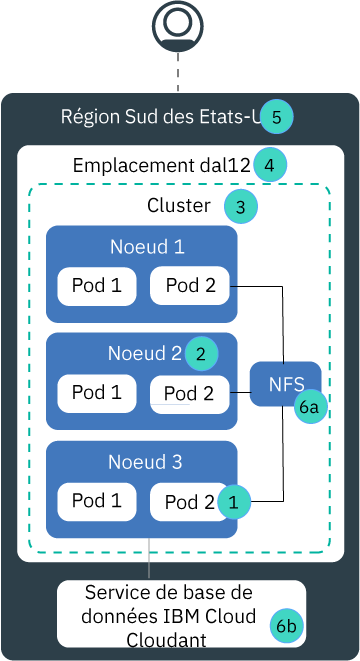

---

copyright:
  years: 2014, 2019
lastupdated: "2019-06-05"

keywords: kubernetes, iks, disaster recovery, dr, ha, hadr

subcollection: containers

---

{:new_window: target="_blank"}
{:shortdesc: .shortdesc}
{:screen: .screen}
{:pre: .pre}
{:table: .aria-labeledby="caption"}
{:codeblock: .codeblock}
{:tip: .tip}
{:note: .note}
{:important: .important}
{:deprecated: .deprecated}
{:download: .download}
{:preview: .preview}

# Haute disponibilité pour {{site.data.keyword.containerlong_notm}}
{: #ha}

Utilisez les fonctions intégrées de Kubernetes et {{site.data.keyword.containerlong}} pour accentuer la haute disponibilité de votre cluster et éviter l'indisponibilité de votre application en cas de défaillance d'un composant dans votre cluster.
{: shortdesc}

La haute disponibilité est une discipline fondamentale dans une infrastructure informatique pour maintenir vos applications opérationnelles même après une panne affectant une partie ou l'ensemble du site. L'objectif principal de la haute disponibilité est d'éliminer les points de défaillance potentiels au sein d'une infrastructure informatique. Par exemple, vous pouvez anticiper une panne système en ajoutant des modules de redondance et en configurant des mécanismes de basculement.

Vous pouvez obtenir la haute disponibilité à différents niveaux de votre infrastructure informatique et au sein des différents composants de votre cluster. Le niveau de disponibilité qui vous convient dépend de plusieurs facteurs, par exemple de vos besoins métier, des accords sur les niveaux de service (SLA) que vous avez contractés avec vos clients et de l'argent que vous comptez dépenser.

## Présentation des points de défaillance potentiels dans {{site.data.keyword.containerlong_notm}}
{: #fault_domains}

L'architecture et l'infrastructure d'{{site.data.keyword.containerlong_notm}} est conçue pour assurer la fiabilité, réduire les temps d'attente de traitement et favoriser la disponibilité maximale du service. Cependant, il peut y avoir des incidents. En fonction du service que vous hébergez dans {{site.data.keyword.Bluemix_notm}}, vous ne serez pas forcément en mesure de tolérer des incidents, même s'ils ne durent que quelques minutes.
{: shortdesc}

{{site.data.keyword.containerlong_notm}} fournit plusieurs approches pour accentuer la disponibilité de votre cluster en ajoutant des fonctions de redondance et d'anti-affinité. Examinez l'image suivante pour en savoir plus sur les points de défaillance potentiels et sur les moyens possibles de les éliminer.

<dl>
<dt> 1. Défaillance de pod et de conteneur.</dt>
  <dd>
De par leur conception, les conteneurs ont une durée de vie brève et ne sont pas à l'abri de défaillances inattendues. Par exemple, un conteneur ou un pod peuvent tomber en panne si une erreur est survenue dans votre application. Pour assurer la haute disponibilité de votre application, vous devez vérifier que vous disposez de suffisamment d'instances de cette application pour traiter la charge de travail et d'instances supplémentaires en cas de défaillance. Dans l'idéal, ces instances sont réparties sur plusieurs noeuds worker pour protéger votre application en cas de défaillance d'un noeud worker.

  
Voir [Déploiement d'applications à haute disponibilité](/docs/containers?topic=containers-app#highly_available_apps).
</dd>
<dt> 2. Défaillance de noeud worker.</dt>
  <dd>
Un noeud worker est une machine virtuelle qui s'exécute au niveau supérieur d'un matériel physique. Parmi les défaillances possibles d'un noeud worker figurent des pannes matérielles, par exemple des pannes de courant, de ventilation ou de réseau ainsi que des défaillances sur la machine virtuelle même. Vous pouvez anticiper la défaillance d'un noeud worker en configurant plusieurs noeuds worker dans votre cluster.

Il n'est pas garanti que les noeuds worker d'une zone figurent sur des hôtes de calcul physiques distincts. Par exemple, vous pouvez détenir un cluster avec 3 noeuds worker, mais ces 3 noeuds ont été créés sur le même hôte de calcul physique dans la zone IBM. Si cet hôte de calcul tombe en panne, tous vos noeuds worker sont hors service. Pour éviter cela, vous devez [configurer un cluster à zones multiples ou créer plusieurs clusters à zone unique](/docs/containers?topic=containers-ha_clusters#ha_clusters) dans différentes zones.

  
Voir [Création de clusters avec plusieurs noeuds worker](/docs/containers?topic=containers-cli-plugin-kubernetes-service-cli#cs_cluster_create).
</dd>
<dt> 3. Défaillance de cluster.</dt>
  <dd>
Le [maître Kubernetes](/docs/containers?topic=containers-ibm-cloud-kubernetes-service-technology#architecture) est le composant principal qui permet de garder votre cluster opérationnel. Le maître stocke les ressources du cluster et leurs configurations dans la base de données etcd qui assure le bon fonctionnement de votre cluster. Le serveur d'API Kubernetes correspond au point d'entrée principal pour toutes les demandes de gestion de cluster des noeuds worker au maître, ou lorsque vous souhaitez interagir avec les ressources de votre cluster.  En cas de défaillance du maître, vos charges de travail continuent à s'exécuter sur les noeuds worker, mais vous ne pouvez pas utiliser des commandes `kubectl` pour gérer les ressources de votre cluster ou afficher l'état de santé du cluster tant que le serveur d'API Kubernetes dans le maître n'est pas opérationnel. Si un pod tombe en panne lors d'une indisponibilité du maître, le pod ne peut pas être replanifié tant que le noeud worker n'a pas rétabli le contact avec le serveur d'API Kubernetes.  Lors d'une indisponibilité du maître, vous pouvez toujours exécuter des commandes `ibmcloud ks` pour l'API {{site.data.keyword.containerlong_notm}} pour gérer vos ressources d'infrastructure, telles que les noeuds worker ou les réseaux locaux virtuels (VLAN). Si vous modifiez la configuration actuelle du cluster en ajoutant ou en retirant des noeuds worker dans le cluster, vos modifications ne sont pas appliquées tant que le maître n'est pas opérationnel.

Ne pas redémarrer ou réamorcer un noeud worker pendant la durée d'indisponibilité du maître. Cette action retire les pods de votre noeud worker. Comme le serveur d'API Kubernetes n'est pas disponible, les pods ne peuvent pas être replanifiés sur d'autres noeuds worker dans le cluster.
{: important}
 Les maîtres cluster sont à haute disponibilité et comprennent des répliques sur des hôtes distincts pour votre serveur d'API Kubernetes, etcd, le planificateur et le gestionnaire de contrôleurs afin de les protéger en cas d'indisponibilité due par exemple à une mise à jour de maître.

Pour protéger votre maître cluster en cas de défaillance de zone : <ul><li>Créez un cluster dans une [agglomération à zones multiples](/docs/containers?topic=containers-regions-and-zones#zones), répartissant ainsi le maître sur plusieurs zones.</li><li>Configurez un deuxième cluster dans une autre zone.</li></ul>

  
Voir [Configuration de clusters à haute disponibilité](/docs/containers?topic=containers-ha_clusters#ha_clusters).
</dd>
<dt> 4. Défaillance de zone.</dt>
  <dd>
Une défaillance de zone affecte tous les hôtes de calcul physiques et le stockage NFS. Ces défaillances peuvent être des pannes de courant, de ventilation, de réseau ou de stockage ou être dues à des catastrophes naturelles, telles que des inondations, des tremblements de terre ou des ouragans. Pour vous protéger en cas de défaillance d'une zone, vous devez disposer de clusters dans deux zones différentes dont la charge est équilibrée au moyen d'un équilibreur de charge externe.

  
Voir [Configuration de clusters à haute disponibilité](/docs/containers?topic=containers-ha_clusters#ha_clusters).
</dd>    
<dt> 5. Défaillance de région.</dt>
  <dd>
Chaque région est configurée avec un équilibreur de charge à haute disponibilité accessible à partir du noeud final d'API spécifique à la région. L'équilibreur de charge achemine les demandes entrantes et sortantes aux clusters sur les différentes zones régionales. La probabilité d'une défaillance totale au niveau de la région est faible. Toutefois, pour prendre en compte cette défaillance, vous pouvez configurer plusieurs clusters dans différentes régions et les connecter entre eux au moyen d'un équilibreur de charge externe. Si l'ensemble d'une région échoue, le cluster situé dans l'autre région peut prendre le relais.

Un cluster présent dans plusieurs régions nécessite plusieurs ressources de cloud et, en fonction de votre application, peut s'avérer complexe et coûteux. Vérifiez si vous avez besoin d'une configuration sur plusieurs régions ou si vous pouvez tolérer une interruption de service potentielle. Si vous souhaitez configurer un cluster sur plusieurs régions, assurez-vous que votre application et les données peuvent être hébergées dans une autre région et que votre application peut traiter la réplication globale des données.

  
Voir [Configuration de clusters à haute disponibilité](/docs/containers?topic=containers-ha_clusters#ha_clusters).
</dd>   
<dt> 6a, 6b. Défaillance de stockage.</dt>
  <dd>
Dans une application avec état, les données jouent un rôle important pour maintenir votre application opérationnelle. Assurez-vous de la haute disponibilité de vos données pour pouvoir les récupérer suite à une défaillance éventuelle. Dans {{site.data.keyword.containerlong_notm}}, vous pouvez choisir parmi plusieurs options pour conserver vos données. Par exemple, vous pouvez mettre à disposition du stockage NFS en utilisant des volumes persistants Kubernetes natifs, ou stocker vos données en utilisant un service de base de données {{site.data.keyword.Bluemix_notm}}.

  
Voir [Planification de données à haute disponibilité](/docs/containers?topic=containers-storage_planning#persistent_storage_overview).
</dd>
</dl>
