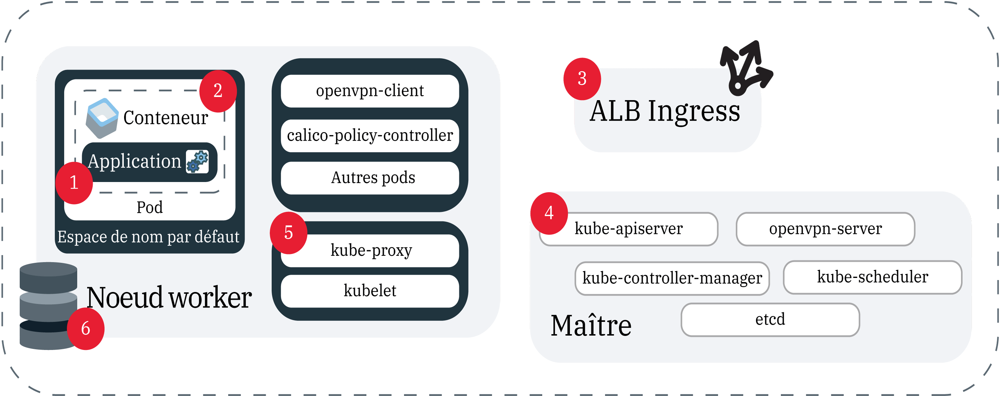

---

copyright:
  years: 2014, 2019
lastupdated: "2019-06-11"

keywords: kubernetes, iks, logmet, logs, metrics

subcollection: containers

---

{:new_window: target="_blank"}
{:shortdesc: .shortdesc}
{:screen: .screen}
{:pre: .pre}
{:table: .aria-labeledby="caption"}
{:codeblock: .codeblock}
{:tip: .tip}
{:note: .note}
{:important: .important}
{:deprecated: .deprecated}
{:download: .download}
{:preview: .preview}


# Consignation et surveillance
{: #health}

Configurez les fonctions de consignation et de surveillance dans {{site.data.keyword.containerlong}} pour vous aider à identifier et résoudre les incidents et améliorer l'état de santé et les performances de vos applications et clusters Kubernetes.
{: shortdesc}

La surveillance et la consignation en continu est essentielle à la détection des attaques sur votre cluster et au traitement des incidents lorsqu'ils se produisent. En exerçant la surveillance continue de votre cluster, vous êtes en mesure de mieux comprendre la capacité de votre cluster et la disponibilité des ressources disponibles dans votre application. Vous pouvez ainsi protéger vos applications et éviter leur indisponibilité. **Remarque** : pour configurer la consignation et la surveillance, vous devez utiliser un cluster standard dans {{site.data.keyword.containerlong_notm}}.

## Choix d'une solution de consignation
{: #logging_overview}

Par défaut, les journaux sont générés et écrits localement pour tous les composants de cluster {{site.data.keyword.containerlong_notm}} suivants : noeuds worker, conteneurs, applications, stockage persistant, équilibreur de charge d'application Ingress, API Kubernetes et l'espace de nom `kube-system`. Plusieurs solutions de consignation sont disponibles pour collecter, acheminer et afficher ces journaux.
{: shortdesc}

Vous pouvez choisir votre solution de consignation en fonction des composants de cluster dont vous avez besoin de collecter les journaux. Une application courante consiste à choisir un service de consignation que vous préférez en raison de ses fonctions d'analyse et d'interface, par exemple {{site.data.keyword.loganalysisfull}}, {{site.data.keyword.la_full}} ou un service tiers. Vous pouvez ensuite utiliser {{site.data.keyword.cloudaccesstrailfull}} pour effectuer l'audit d'activité des utilisateurs dans le cluster et une sauvegarde des journaux du maître cluster dans {{site.data.keyword.cos_full}}. **Remarque** : pour configurer la consignation, vous devez disposer d'un cluster Kubernetes standard.

<dl>

<dt>{{site.data.keyword.la_full_notm}}</dt>
<dd>Gérez les journaux des conteneurs de pod en déployant LogDNA en tant que service tiers dans votre cluster. Pour utiliser {{site.data.keyword.la_full_notm}}, vous devez déployer un agent de consignation sur tous les noeuds worker de votre cluster. Cet agent collecte les journaux avec l'extension `*.log` et les fichiers sans extension stockés dans le répertoire `/var/log` de votre pod à partir de tous les espaces de nom, y compris `kube-system`. L'agent achemine ensuite les journaux vers le service {{site.data.keyword.la_full_notm}}. Pour plus d'informations sur ce service, voir la [documentation {{site.data.keyword.la_full_notm}}](/docs/services/Log-Analysis-with-LogDNA?topic=LogDNA-about). Pour commencer, voir [Gestion des journaux de cluster Kubernetes avec {{site.data.keyword.loganalysisfull_notm}} et LogDNA](/docs/services/Log-Analysis-with-LogDNA/tutorials?topic=LogDNA-kube#kube).
</dd>

<dt>Fluentd avec {{site.data.keyword.loganalysisfull_notm}}</dt>
<dd><p class="deprecated">Auparavant, vous pouviez créer une configuration de consignation pour acheminer les journaux collectés par le composant de cluster Fluentd vers {{site.data.keyword.loganalysisfull_notm}}. A compter du 30 avril 2019, vous ne pourrez plus mettre à disposition de nouvelles instances {{site.data.keyword.loganalysisshort_notm}}, et toutes les instances de plan Lite seront supprimées. Les instances de plan Premium existantes sont prises en charge jusqu'au 30 septembre 2019. Pour continuer à collecter des journaux pour votre cluster, vous devez configurer {{site.data.keyword.la_full_notm}} ou modifier votre configuration pour acheminer les journaux collectés vers un serveur externe.
</p>
</dd>

<dt>Fluentd avec un serveur externe</dt>
<dd>Pour collecter, acheminer et afficher les journaux d'un composant de cluster, vous pouvez créer une configuration de consignation en utilisant Fluentd. Lorsque vous créez une configuration de consignation, le composant de cluster [Fluentd ](https://www.fluentd.org/) collecte les journaux à partir des chemins correspondant à une source spécifiée. Fluentd peut alors acheminer ces journaux vers un serveur externe qui accepte le protocole syslog. Pour commencer, voir [Description de l'acheminement des journaux de cluster et d'application vers syslog](#logging).
</dd>

<dt>{{site.data.keyword.cloudaccesstrailfull_notm}}</dt>
<dd>Pour surveiller l'activité d'administration des utilisateurs intervenant dans votre cluster, vous pouvez collecter et acheminer des journaux d'audit à {{site.data.keyword.cloudaccesstrailfull_notm}}. Les clusters génèrent deux types d'événements {{site.data.keyword.cloudaccesstrailshort}}.
<ul><li>Les événements de gestion de cluster sont automatiquement générés et acheminés vers {{site.data.keyword.cloudaccesstrailshort}}.</li>
<li>Les événements d'audit du serveur d'API Kubernetes sont automatiquement générés, mais vous devez [créer une configuration de consignation](#api_forward) pour que Fluentd puisse acheminer ces journaux à {{site.data.keyword.cloudaccesstrailshort}}.</li></ul>
Pour plus d'informations sur les types d'événement {{site.data.keyword.containerlong_notm}} dont vous pouvez assurer le suivi, voir [Evénements Activity Tracker](/docs/containers?topic=containers-at_events). Pour plus d'informations sur ce service, voir la documentation d'[Activity Tracker](/docs/services/cloud-activity-tracker?topic=cloud-activity-tracker-getting-started). <p class="note">Actuellement, {{site.data.keyword.containerlong_notm}} n'est pas configuré pour utiliser {{site.data.keyword.at_full}}. Pour gérer des événements de gestion de cluster et des journaux d'audit d'API Kubernetes, continuez d'utiliser {{site.data.keyword.cloudaccesstrailfull_notm}} avec LogAnalysis.
</p>
</dd>

<dt>{{site.data.keyword.cos_full_notm}}</dt>
<dd>Pour collecter, acheminer et afficher les journaux du maître Kubernetes de votre cluster, vous pouvez capturer un instantané de vos journaux de maître à n'importe quel moment à collecter dans le compartiment {{site.data.keyword.cos_full_notm}}. Cet instantané comprend tout ce qui est envoyé via le serveur d'API, par exemple la planification de pod, les déploiements ou les règles RBAC. Pour commencer, voir [Collecte des journaux du maître](#collect_master).</dd>

<dt>Services tiers</dt>
<dd>Si vous avez des exigences particulières, vous pouvez configurer votre propre solution de consignation. Consultez les services de consignation tiers que vous pouvez ajouter dans votre cluster indiqués dans la rubrique [Intégrations de consignation et de surveillance](/docs/containers?topic=containers-supported_integrations#health_services). Vous pouvez effectuer la collecte des journaux de conteneur à partir du chemin `/var/log/pods/`. </dd>

</dl>

<br />


## Acheminement des journaux de cluster et d'application vers {{site.data.keyword.la_full_notm}}
{: #logdna}

Gérez les journaux des conteneurs de pod en déployant LogDNA en tant que service tiers dans votre cluster.
{: shortdesc}

Pour utiliser {{site.data.keyword.la_full_notm}}, vous devez déployer un agent de consignation sur tous les noeuds worker de votre cluster. Cet agent collecte les journaux avec l'extension `*.log` et les fichiers sans extension stockés dans le répertoire `/var/log` de votre pod à partir de tous les espaces de nom, y compris `kube-system`. L'agent achemine ensuite les journaux vers le service {{site.data.keyword.la_full_notm}}. Pour plus d'informations sur ce service, voir la [documentation {{site.data.keyword.la_full_notm}}](/docs/services/Log-Analysis-with-LogDNA?topic=LogDNA-about). Pour commencer, voir [Gestion des journaux de cluster Kubernetes avec {{site.data.keyword.loganalysisfull_notm}} et LogDNA](/docs/services/Log-Analysis-with-LogDNA/tutorials?topic=LogDNA-kube#kube).

<br />


## Déprécié : Acheminement des journaux de cluster, d'application et d'audit d'API Kubernetes vers {{site.data.keyword.loganalysisfull_notm}}
{: #loga}

Auparavant, vous pouviez créer une configuration de consignation pour acheminer les journaux collectés par le composant de cluster Fluentd vers {{site.data.keyword.loganalysisfull_notm}}. À compter du 30 avril 2019, {{site.data.keyword.loganalysisfull_notm}} est déprécié. Vous ne pouvez plus mettre à disposition de nouvelles instances {{site.data.keyword.loganalysisshort_notm}}, et toutes les instances de plan Lite ont été supprimées. Les instances de plan Premium existantes sont prises en charge jusqu'au 30 septembre 2019.
{: deprecated}

Pour continuer à collecter des journaux pour votre cluster, vous pouvez utiliser l'une des deux méthodes suivantes :

* Configurez {{site.data.keyword.la_full_notm}}. Pour plus d'informations, voir [Passage à {{site.data.keyword.la_full_notm}}](/docs/services/CloudLogAnalysis?topic=cloudloganalysis-transition).
* [Modifiez votre configuration pour acheminer les journaux vers un serveur externe](#configuring).

Pour plus d'informations sur les instances {{site.data.keyword.loganalysisshort_notm}} existantes, voir la [documentation {{site.data.keyword.loganalysisshort_notm}}](/docs/services/CloudLogAnalysis?topic=cloudloganalysis-containers_kube_other_logs).

<br />


## Acheminement des journaux de cluster, d'application et d'audit d'API Kubernetes vers un serveur externe
{: #configuring}

Configurez l'acheminement de journaux pour des clusters standard {{site.data.keyword.containerlong_notm}} vers un serveur externe.
{: shortdesc}

### Compréhension de l'acheminement des journaux vers un serveur externe
{: #logging}

Par défaut, les journaux sont collectés par le module complémentaire [Fluentd ](https://www.fluentd.org/) dans votre cluster. Lorsque vous créez une configuration de consignation pour une source dans votre cluster, par exemple un conteneur, les journaux collectés par Fluentd à partir des chemins de cette source sont acheminés vers un serveur externe. Le trafic provenant de cette source destiné au service de consignation sur le port d'ingestion est chiffré.
{: shortdesc}

**Quelles sont les sources pour lesquelles je peux configurer l'acheminement des journaux ?**

Dans la figure suivante, vous pouvez voir l'emplacement des sources configurables pour la consignation.



1. `worker` : informations spécifiques à la configuration de l'infrastructure dont vous disposez pour votre noeud worker. Les journaux de noeud worker sont capturés dans syslog et contiennent les événements du système d'exploitation. Dans `auth.log` vous pouvez trouver des informations sur les demandes d'authentification effectuées auprès du système d'exploitation. </br>**Chemins** :
    * `/var/log/syslog`
    * `/var/log/auth.log`

2. `container` : informations consignées par un conteneur en cours d'exécution. </br>**Chemins** : toutes les données écrites dans `STDOUT` ou `STDERR`.

3. `application` : informations sur les événements qui se produisent au niveau de l'application. Il peut s'agir d'une notification signalant un événement, par exemple une connexion établie, un avertissement concernant le stockage ou d'autres opérations pouvant être effectuées au niveau de l'application. </br>**Chemins** : vous pouvez définir les chemins vers lesquels vos journaux sont acheminés. Toutefois, pour que les journaux soient envoyés, vous devez utiliser un chemin absolu dans votre configuration de consignation, autrement vos journaux ne pourront pas être lus. Si votre chemin est monté sur votre noeud worker, il peut avoir créé un lien symbolique. Exemple : si le chemin spécifié est `/usr/local/spark/work/app-0546/0/stderr` mais que les journaux sont acheminés vers `/usr/local/spark-1.0-hadoop-1.2/work/app-0546/0/stderr`, ils ne pourront pas être lus.

4. `storage` : informations sur le stockage persistant configuré dans votre cluster. Les journaux de stockage peuvent vous aider à configurer des tableaux de bord et des alertes pour identifier les problèmes, dans le cadre des éditions de production et pipeline DevOps. **Remarque** : les chemins `/var/log/kubelet.log` et `/var/log/syslog` contiennent également des journaux de stockage, mais les journaux de ces chemins sont collectés par les sources de journal `kubernetes` et `worker`. </br>**Chemins** :
    * `/var/log/ibmc-s3fs.log`
    * `/var/log/ibmc-block.log`

  **Pods** :
    * `portworx-***`
    * `ibmcloud-block-storage-attacher-***`
    * `ibmcloud-block-storage-driver-***`
    * `ibmcloud-block-storage-plugin-***`
    * `ibmcloud-object-storage-plugin-***`

5. `kubernetes` : informations de kubelet, kube-proxy et en provenance d'autres événements Kubernetes qui se produisent dans l'espace de nom kube-system du noeud worker. </br>**Chemins** :
    * `/var/log/kubelet.log`
    * `/var/log/kube-proxy.log`
    * `/var/log/event-exporter/1..log`

6. `kube-audit` : informations sur les actions associées au cluster qui sont envoyées au serveur d'API Kubernetes, notamment la date et l'heure, l'utilisateur et la ressource concernée.

7. `ingress` : informations relatives au trafic réseau entrant dans un cluster via l'équilibreur de charge d'application Ingress.</br>**Chemins**:
    * `/var/log/alb/ids/*.log`
    * `/var/log/alb/ids/*.err`
    * `/var/log/alb/customerlogs/*.log`
    * `/var/log/alb/customerlogs/*.err`

</br>

**Quelles sont les options de configuration à ma disposition ?**

Le tableau suivant présente les différentes options dont vous disposez lorsque vous configurez la consignation, ainsi que leur description.

<table>
<caption> Description des options de configuration de consignation</caption>
  <thead>
    <th>Option</th>
    <th>Description</th>
  </thead>
  <tbody>
    <tr>
      <td><code><em>&lt;cluster_name_or_ID&gt;</em></code></td>
      <td>Nom ou ID du cluster.</td>
    </tr>
    <tr>
      <td><code><em>--log_source</em></code></td>
      <td>Source depuis laquelle vous désirez acheminer les journaux. Valeurs admises : <code>container</code>, <code>application</code>, <code>worker</code>, <code>kubernetes</code>, <code>ingress</code>, <code>storage</code> et <code>kube-audit</code>. Cet argument prend en charge une liste séparée par des virgules répertoriant les sources de journal auxquelles appliquer la configuration. Si vous ne fournissez pas de source de journal, des configurations de consignation sont créées pour les sources de journal <code>container</code> et <code>ingress</code>.</td>
    </tr>
    <tr>
      <td><code><em>--type syslog</em></code></td>
      <td>La valeur <code>syslog</code> achemine vos journaux vers un serveur externe. </p>
      </dd></td>
    </tr>
    <tr>
      <td><code><em>--namespace</em></code></td>
      <td>Facultatif : espace de nom Kubernetes depuis lequel vous désirez acheminer des journaux. L'acheminement des journaux n'est pas pris en charge pour les espaces de nom Kubernetes <code>ibm-system</code> et <code>kube-system</code>. Cette valeur n'est valide que pour la source de journal <code>container</code>. Si vous n'indiquez pas d'espace de nom, tous les espaces de nom du cluster utilisent cette configuration.</td>
    </tr>
    <tr>
      <td><code><em>--hostname</em></code></td>
      <td><p>Pour {{site.data.keyword.loganalysisshort_notm}}, utilisez l'[URL d'ingestion](/docs/services/CloudLogAnalysis?topic=cloudloganalysis-log_ingestion#log_ingestion_urls). Si vous n'en indiquez pas, le noeud final de la région dans laquelle vous avez créé le cluster est utilisé.</p>
      <p>Pour syslog, indiquez le nom d'hôte ou l'adresse IP du service collecteur de journal.</p></td>
    </tr>
    <tr>
      <td><code><em>--port</em></code></td>
      <td>Port d'ingestion. Si vous n'en indiquez aucun, le port standard, <code>9091</code>, est utilisé.
      <p>Pour syslog, indiquez le port du serveur collecteur de journal. Si vous n'indiquez pas de port, le port standard <code>514</code> est utilisé.</td>
    </tr>
    <tr>
      <td><code><em>--app-containers</em></code></td>
      <td>Facultatif : pour acheminer les journaux à partir d'une application, vous pouvez indiquer le nom du conteneur contenant votre application. Vous pouvez spécifier plusieurs conteneurs en utilisant une liste séparée par des virgules. Si aucun conteneur n'est indiqué, les journaux sont acheminés à partir de tous les conteneurs contenant les chemins que vous avez fournis.</td>
    </tr>
    <tr>
      <td><code><em>--app-paths</em></code></td>
      <td>Chemin d'accès à un conteneur utilisé par les applications pour la consignation. Pour acheminer des journaux avec le type de source <code>application</code>, vous devez indiquer un chemin. Pour indiquer plusieurs chemins, utilisez une liste séparée par des virgules. Exemple : <code>/var/log/myApp1/*,/var/log/myApp2/*</code></td>
    </tr>
    <tr>
      <td><code><em>--syslog-protocol</em></code></td>
      <td>Lorsque le type de consignation est <code>syslog</code>, il s'agit du protocole de couche de transport. Vous pouvez utiliser les protocoles suivants : `udp`, `tls` ou `tcp`. Lors de l'acheminement vers un serveur rsyslog avec le protocole <code>udp</code>, les journaux dont la taille est supérieure à 1 ko sont tronqués.</td>
    </tr>
    <tr>
      <td><code><em>--ca-cert</em></code></td>
      <td>Obligatoire : lorsque le type de consignation est <code>syslog</code> et que le protocole est <code>tls</code>, nom de la valeur confidentielle (secret) Kubernetes qui contient le certificat de l'autorité de certification.</td>
    </tr>
    <tr>
      <td><code><em>--verify-mode</em></code></td>
      <td>Lorsque le type de consignation est <code>syslog</code> et que le protocole est <code>tls</code>, mode de vérification. Valeurs admises : <code>verify-peer</code> et la valeur par défaut <code>verify-none</code>.</td>
    </tr>
    <tr>
      <td><code><em>--skip-validation</em></code></td>
      <td>Facultatif : ignore la validation des noms d'organisation et d'espace lorsqu'ils sont spécifiés. Cette opération permet de réduire le temps de traitement, mais une configuration de consignation non valide ne acheminera pas correctement les journaux.</td>
    </tr>
  </tbody>
</table>

**Suis-je chargé de conserver Fluentd à jour ?**

Pour que des modifications puissent être apportées à vos configurations de consignation ou de filtrage, le module complémentaire de consignation Fluentd doit être au niveau de version le plus récent. Par défaut, les mises à jour automatiques de ce module sont activées. Pour désactiver les mises à jour automatiques, voir [Mise à jour de modules complémentaires de cluster : Fluentd pour la consignation](/docs/containers?topic=containers-update#logging-up).

**Puis-je acheminer certains journaux, mais pas d'autres, d'une source dans mon cluster ?**

Oui. Si vous avez, par exemple, un pod particulièrement bavard, vous éviterez d'allouer de l'espace de stockage aux journaux de ce pod, tout en autorisant l'acheminement de journaux d'autres pods. Pour empêcher l'acheminement des journaux d'un pod particulier, voir [Filtrage des journaux](#filter-logs).

<br />


### Acheminement des journaux de cluster et d'application
{: #enable-forwarding}

Créez une configuration pour la consignation de cluster et d'application. Vous pouvez faire la distinction entre les différentes options de consignation en utilisant des indicateurs.
{: shortdesc}

**Acheminement des journaux vers votre propre serveur via les protocoles `udp` ou `tcp`**

1. Vérifiez que vous disposez du [rôle de plateforme {{site.data.keyword.Bluemix_notm}} IAM **Editeur** ou **Administrateur**](/docs/containers?topic=containers-users#platform).

2. Pour le cluster où se trouve la source de journal : [connectez-vous à votre compte. Le cas échéant, ciblez le groupe de ressources approprié. Définissez le contexte pour votre cluster.](/docs/containers?topic=containers-cs_cli_install#cs_cli_configure)

3. Configurez un serveur qui accepte un protocole syslog de l'une des manières suivantes :
  * Configurez et gérez votre propre serveur ou confiez la gestion du serveur à un fournisseur. Dans ce cas, obtenez le noeud final de consignation du fournisseur de consignation.

  * Exécuter syslog à partir d'un conteneur. Par exemple, vous pouvez utiliser ce [fichier de déploiement .yaml ](https://github.com/IBM-Cloud/kube-samples/blob/master/deploy-apps-clusters/deploy-syslog-from-kube.yaml) pour extraire une image publique Docker qui exécute un conteneur dans votre cluster. L'image publie le port `514` sur l'adresse IP du cluster public et utilise cette adresse pour configurer l'hôte syslog.

  Vous pouvez voir vos journaux en tant que fichiers JSON valides en supprimant les préfixes syslog. Pour cela, ajoutez le code suivant au début de votre fichier <code>etc/rsyslog.conf</code> dans lequel s'exécute votre serveur rsyslog : <code>$template customFormat,"%msg%\n"</br>$ActionFileDefaultTemplate customFormat</code>
  {: tip}

4. Créez une configuration d'acheminement des journaux.
    ```
    ibmcloud ks logging-config-create --cluster <cluster_name_or_ID> --logsource <log_source> --namespace <kubernetes_namespace> --hostname <log_server_hostname_or_IP> --port <log_server_port> --type syslog --app-containers <containers> --app-paths <paths_to_logs> --syslog-protocol <protocol> --skip-validation
    ```
    {: pre}

</br></br>

**Acheminement des journaux vers votre propre serveur via le protocole `tls`**

Les étapes suivantes sont des instructions générales. Avant d'utiliser le conteneur dans un environnement de production, veillez à ce que toutes les exigences en matière de sécurité soient remplies.
{: tip}

1. Vérifiez que vous disposez des [rôles {{site.data.keyword.Bluemix_notm}} IAM](/docs/containers?topic=containers-users#platform) suivants :
    * Rôle de plateforme **Editeur** ou **Administrateur** pour le cluster
    * Rôle de service **Auteur** ou **Responsable** pour l'espace de nom `kube-system`

2. Pour le cluster où se trouve la source de journal : [connectez-vous à votre compte. Le cas échéant, ciblez le groupe de ressources approprié. Définissez le contexte pour votre cluster.](/docs/containers?topic=containers-cs_cli_install#cs_cli_configure)

3. Configurez un serveur qui accepte un protocole syslog de l'une des manières suivantes :
  * Configurez et gérez votre propre serveur ou confiez la gestion du serveur à un fournisseur. Dans ce cas, obtenez le noeud final de consignation du fournisseur de consignation.

  * Exécuter syslog à partir d'un conteneur. Par exemple, vous pouvez utiliser ce [fichier de déploiement .yaml ](https://github.com/IBM-Cloud/kube-samples/blob/master/deploy-apps-clusters/deploy-syslog-from-kube.yaml) pour extraire une image publique Docker qui exécute un conteneur dans votre cluster. L'image publie le port `514` sur l'adresse IP du cluster public et utilise cette adresse pour configurer l'hôte syslog. Vous devez injecter les certificats de l'autorité de certification et les certificats côté serveur appropriés et mettre à jour le fichier `syslog.conf` pour activer `tls` sur votre serveur.

4. Sauvegardez le certificat de l'autorité de certification dans un fichier nommé `ca-cert`. Ce nom précis doit être utilisé.

5. Créez une valeur confidentielle (secret) dans l'espace de nom `kube-system` pour le fichier `ca-cert`. Lorsque vous créez la configuration de consignation, utilisez le nom de cette valeur confidentielle pour l'indicateur `--ca-cert`.
    ```
    kubectl -n kube-system create secret generic --from-file=ca-cert
    ```
    {: pre}

6. Créez une configuration d'acheminement des journaux.
    ```
    ibmcloud ks logging-config-create --cluster <cluster name or id> --logsource <log source> --type syslog --syslog-protocol tls --hostname <ip address of syslog server> --port <port for syslog server, 514 is default> --ca-cert <secret name> --verify-mode <defaults to verify-none>
    ```
    {: pre}

### Acheminement des journaux d'audit d'API Kubernetes
{: #audit_enable}

Pour effectuer un audit des événements qui transitent par votre serveur d'API Kubernetes, vous pouvez créer une configuration afin d'acheminer des événements vers votre serveur externe.
{: shortdesc}

Pour plus d'informations sur les journaux d'audit Kubernetes, reportez-vous à la <a href="https://kubernetes.io/docs/tasks/debug-application-cluster/audit/" target="blank">rubrique consacrée à l'audit </a> dans la documentation Kubernetes.

* Actuellement, une règle d'audit par défaut est utilisée pour tous les clusters avec cette configuration de consignation.
* Les filtres ne sont pas pris en charge actuellement.
* Il ne peut y avoir qu'une seule configuration `kube-audit` par cluster, mais vous pouvez acheminer les journaux à {{site.data.keyword.cloudaccesstrailshort}} et à un serveur externe en créant une configuration de consignation et un webhook.
* Vous devez disposer du [rôle de plateforme {{site.data.keyword.Bluemix_notm}} IAM **Administrateur**](/docs/containers?topic=containers-users#platform) pour le cluster.

**Avant de commencer**

1. Configurez un serveur de consignation distant auquel vous pourrez acheminer les journaux. Vous pouvez, par exemple, [utiliser Logstash avec Kubernetes ](https://kubernetes.io/docs/tasks/debug-application-cluster/audit/#use-logstash-to-collect-and-distribute-audit-events-from-webhook-backend) afin de collecter des événements d'audit.

2. Pour le cluster depuis lequel vous souhaitez collecter les journaux d'audit du serveur d'API : [connectez-vous à votre compte. Le cas échéant, ciblez le groupe de ressources approprié. Définissez le contexte pour votre cluster.](/docs/containers?topic=containers-cs_cli_install#cs_cli_configure)

Pour acheminer des journaux d'audit d'API Kubernetes, procédez comme suit :

1. Configurez le webhook. Si vous ne soumettez pas d'informations dans les indicateurs, une configuration par défaut est utilisée.

    ```
    ibmcloud ks apiserver-config-set audit-webhook <cluster_name_or_ID> --remoteServer <server_URL_or_IP> --caCert <CA_cert_path> --clientCert <client_cert_path> --clientKey <client_key_path>
    ```
    {: pre}

  <table>
  <caption>Description des composantes de cette commande</caption>
    <thead>
      <th colspan=2> Description des composantes de cette commande</th>
    </thead>
    <tbody>
      <tr>
        <td><code><em>&lt;cluster_name_or_ID&gt;</em></code></td>
        <td>Nom ou ID du cluster.</td>
      </tr>
      <tr>
        <td><code><em>&lt;server_URL_or_IP&gt;</em></code></td>
        <td>URL ou adresse IP du service de consignation distant auquel vous souhaitez envoyer les journaux. Les certificats sont ignorés si vous fournissez une URL de serveur non sécurisée.</td>
      </tr>
      <tr>
        <td><code><em>&lt;CA_cert_path&gt;</em></code></td>
        <td>Chemin de fichier du certificat de l'autorité de certification utilisé pour vérifier le service de consignation distant.</td>
      </tr>
      <tr>
        <td><code><em>&lt;client_cert_path&gt;</em></code></td>
        <td>Chemin de fichier du certificat client utilisé pour l'authentification auprès du service de consignation distant.</td>
      </tr>
      <tr>
        <td><code><em>&lt;client_key_path&gt;</em></code></td>
        <td>Chemin de fichier de la clé du client correspondant utilisée pour la connexion au service de consignation distant.</td>
      </tr>
    </tbody>
  </table>

2. Vérifiez que l'acheminement des journaux a été activé en affichant l'URL du service de consignation distant.

    ```
    ibmcloud ks apiserver-config-get audit-webhook <cluster_name_or_ID>
    ```
    {: pre}

    Exemple de sortie :
    ```
    OK
    Server:			https://8.8.8.8
    ```
    {: screen}

3. Appliquez la mise à jour de la configuration en redémarrant le maître Kubernetes.

    ```
    ibmcloud ks apiserver-refresh --cluster <cluster_name_or_ID>
    ```
    {: pre}

4. Facultatif : si vous voulez arrêter l'acheminement des journaux d'audit, vous pouvez désactiver votre configuration.
    1. Pour le cluster depuis lequel vous souhaitez arrêter la collecte des journaux d'audit du serveur d'API : [connectez-vous à votre compte. Le cas échéant, ciblez le groupe de ressources approprié. Définissez le contexte pour votre cluster.](/docs/containers?topic=containers-cs_cli_install#cs_cli_configure)
    2. Désactivez la configuration de back end du webhook pour le serveur d'API du cluster.

        ```
        ibmcloud ks apiserver-config-unset audit-webhook <cluster_name_or_ID>
        ```
        {: pre}

    3. Appliquez la mise à jour de la configuration en redémarrant le maître Kubernetes.

        ```
        ibmcloud ks apiserver-refresh --cluster <cluster_name_or_ID>
        ```
        {: pre}

### Filtrage des journaux qui sont acheminés
{: #filter-logs}

Vous pouvez déterminer les journaux que vous allez acheminer en filtrant des journaux spécifiques sur une période donnée. Vous pouvez faire la distinction entre les différentes options de filtrage en utilisant des indicateurs.
{: shortdesc}

<table>
<caption>Description des options de filtrage des journaux</caption>
  <thead>
    <th colspan=2> Description des options de filtrage des journaux</th>
  </thead>
  <tbody>
    <tr>
      <td>&lt;cluster_name_or_ID&gt;</td>
      <td>Obligatoire : nom ou ID du cluster dont vous souhaitez filtrer les journaux.</td>
    </tr>
    <tr>
      <td><code>&lt;log_type&gt;</code></td>
      <td>Type des journaux auquel vous voulez appliquer le filtre. Les types <code>all</code>, <code>container</code> et <code>host</code> sont actuellement pris en charge.</td>
    </tr>
    <tr>
      <td><code>&lt;configs&gt;</code></td>
      <td>Facultatif : liste séparée par des virgules contenant les ID de vos configurations de consignation. Si cette liste n'est pas fournie, le filtre s'applique à toutes les configurations de consignation du cluster qui sont transmises au filtre. Vous pouvez afficher les configurations de journal qui correspondent au filtre en utilisant l'option <code>--show-matching-configs</code>.</td>
    </tr>
    <tr>
      <td><code>&lt;kubernetes_namespace&gt;</code></td>
      <td>Facultatif : espace de nom Kubernetes depuis lequel vous désirez acheminer des journaux. Cet indicateur s'applique uniquement lorsque vous utilisez le type de journal <code>container</code>.</td>
    </tr>
    <tr>
      <td><code>&lt;container_name&gt;</code></td>
      <td>Facultatif : nom du conteneur depuis lequel vous voulez filtrer les journaux.</td>
    </tr>
    <tr>
      <td><code>&lt;logging_level&gt;</code></td>
      <td>Facultatif : filtre les journaux dont le niveau est inférieur ou égal au niveau spécifié. Les valeurs admises, par ordre canonique, sont : <code>fatal</code>, <code>error</code>, <code>warn/warning</code>, <code>info</code>, <code>debug</code> et <code>trace</code>. Par exemple, si vous avez filtré les journaux au niveau <code>info</code>, les niveaux <code>debug</code> et <code>trace</code> sont également filtrés. **Remarque** : vous pouvez utiliser cet indicateur uniquement si les messages de journal sont au format JSON et contiennent une zone de niveau. Pour afficher vos messages au format JSON, ajoutez l'indicateur <code>--json</code> dans la commande.</td>
    </tr>
    <tr>
      <td><code>&lt;message&gt;</code></td>
      <td>Facultatif : filtre les journaux qui contiennent un message particulier écrit sous forme d'expression régulière.</td>
    </tr>
    <tr>
      <td><code>&lt;filter_ID&gt;</code></td>
      <td>Facultatif : ID du filtre de journal.</td>
    </tr>
    <tr>
      <td><code>--show-matching-configs</code></td>
      <td>Facultatif : affiche les configurations de consignation concernant chaque filtre.</td>
    </tr>
    <tr>
      <td><code>--all</code></td>
      <td>Facultatif : supprime tous vos filtres d'acheminement de journaux.</td>
    </tr>
  </tbody>
</table>

1. Créez un filtre de consignation.
  ```
  ibmcloud ks logging-filter-create --cluster <cluster_name_or_ID> --type <log_type> --logging-configs <configs> --namespace <kubernetes_namespace> --container <container_name> --level <logging_level> --regex-message <message>
  ```
  {: pre}

2. Affichez le filtre de journal que vous avez créé.

  ```
  ibmcloud ks logging-filter-get --cluster <cluster_name_or_ID> --id <filter_ID> --show-matching-configs
  ```
  {: pre}

3. Mettez à jour le filtre de journal que vous avez créé.
  ```
  ibmcloud ks logging-filter-update --cluster <cluster_name_or_ID> --id <filter_ID> --type <server_type> --logging-configs <configs> --namespace <kubernetes_namespace --container <container_name> --level <logging_level> --regex-message <message>
  ```
  {: pre}

4. Supprimez un filtre de journal que vous avez créé.

  ```
  ibmcloud ks logging-filter-rm --cluster <cluster_name_or_ID> --id <filter_ID> [--all]
  ```
  {: pre}

### Vérification, mise à jour et suppression de l'acheminement des journaux
{: #verifying-log-forwarding}

**Vérification**</br>
Vous pouvez vérifier si votre configuration est définie correctement de l'une des deux manières suivantes :

* Pour répertorier toutes les configurations de consignation dans un cluster :
  ```
  ibmcloud ks logging-config-get --cluster <cluster_name_or_ID>
  ```
  {: pre}

* Pour répertorier les configurations de consignation d'un seul type de source de journal :
  ```
  ibmcloud ks logging-config-get --cluster <cluster_name_or_ID> --logsource <source>
  ```
  {: pre}

**Mise à jour**</br>
Vous pouvez mettre à jour une configuration de consignation que vous avez déjà créée :
```
ibmcloud ks logging-config-update --cluster <cluster_name_or_ID> --id <log_config_id> --namespace <namespace> --type <server_type> --syslog-protocol <protocol> --logsource <source> --hostname <hostname_or_ingestion_URL> --port <port> --space <cluster_space> --org <cluster_org> --app-containers <containers> --app-paths <paths_to_logs>
```
{: pre}

**Suppression**</br>
Vous pouvez arrêter l'acheminement des journaux en supprimant une ou toutes les configurations de consignation d'un cluster :

* Pour supprimer une configuration de consignation :
  ```
  ibmcloud ks logging-config-rm --cluster <cluster_name_or_ID> --id <log_config_ID>
  ```
  {: pre}

* Pour supprimer toutes les configurations de consignation : 
  ```
  ibmcloud ks logging-config-rm --cluster <my_cluster> --all
  ```
  {: pre}

<br />


## Acheminement des journaux d'audit Kubernetes vers {{site.data.keyword.cloudaccesstrailfull_notm}} 
{: #api_forward}

Kubernetes effectue automatiquement l'audit des événements qui transitent par votre serveur d'API Kubernetes. Vous pouvez acheminer des événements vers {{site.data.keyword.cloudaccesstrailfull_notm}}.
{: shortdesc}

Pour plus d'informations sur les journaux d'audit Kubernetes, reportez-vous à la <a href="https://kubernetes.io/docs/tasks/debug-application-cluster/audit/" target="blank">rubrique consacrée à l'audit </a> dans la documentation Kubernetes.

* Actuellement, une règle d'audit par défaut est utilisée pour tous les clusters avec cette configuration de consignation.
* Les filtres ne sont pas pris en charge actuellement.
* Il ne peut y avoir qu'une seule configuration `kube-audit` par cluster, mais vous pouvez acheminer les journaux à {{site.data.keyword.cloudaccesstrailshort}} et à un serveur externe en créant une configuration de consignation et un webhook.
* Vous devez disposer du [rôle de plateforme {{site.data.keyword.Bluemix_notm}} IAM **Administrateur**](/docs/containers?topic=containers-users#platform) pour le cluster.

Actuellement, {{site.data.keyword.containerlong_notm}} n'est pas configuré pour utiliser {{site.data.keyword.at_full}}. Pour gérer des journaux d'audit d'API Kubernetes, continuez d'utiliser {{site.data.keyword.cloudaccesstrailfull_notm}} avec LogAnalysis.
{: note}

**Avant de commencer**

1. Vérifiez les droits. Si vous avez indiqué un espace lors de la création du cluster, le propriétaire du compte et le propriétaire de la clé {{site.data.keyword.containerlong_notm}} doivent disposer des droits Responsable, Développeur ou Auditeur dans cet espace.

2. Pour le cluster depuis lequel vous souhaitez collecter les journaux d'audit du serveur d'API : [connectez-vous à votre compte. Le cas échéant, ciblez le groupe de ressources approprié. Définissez le contexte pour votre cluster.](/docs/containers?topic=containers-cs_cli_install#cs_cli_configure)

**Acheminement des journaux**

1. Créez une configuration de consignation.

    ```
    ibmcloud ks logging-config-create --cluster <cluster_name_or_ID> --logsource kube-audit --space <cluster_space> --org <cluster_org> --hostname <ingestion_URL> --type ibm
    ```
    {: pre}

    Exemple de commande et de sortie :

    ```
    ibmcloud ks logging-config-create --cluster myCluster --logsource kube-audit
    Creating logging configuration for kube-audit logs in cluster myCluster...
    OK
    Id                                     Source      Namespace   Host                                   Port     Org    Space   Server Type   Protocol  Application Containers   Paths
    14ca6a0c-5bc8-499a-b1bd-cedcf40ab850   kube-audit    -         ingest-au-syd.logging.bluemix.net✣    9091✣     -       -         ibm          -              -                  -

    ✣ Indicates the default endpoint for the {{site.data.keyword.loganalysisshort_notm}} service.

    ```
    {: screen}

    <table>
    <caption>Description des composantes de cette commande</caption>
      <thead>
        <th colspan=2> Description des composantes de cette commande</th>
      </thead>
      <tbody>
        <tr>
          <td><code><em>&lt;cluster_name_or_ID&gt;</em></code></td>
          <td>Nom ou ID du cluster.</td>
        </tr>
        <tr>
          <td><code><em>&lt;ingestion_URL&gt;</em></code></td>
          <td>Noeud final vers lequel vous voulez acheminer les journaux. Si vous n'indiquez pas d'[URL d'ingestion](/docs/services/CloudLogAnalysis?topic=cloudloganalysis-log_ingestion#log_ingestion_urls), le noeud final de la région dans laquelle vous avez créé le cluster est utilisé.</td>
        </tr>
        <tr>
          <td><code><em>&lt;cluster_space&gt;</em></code></td>
          <td>Facultatif : nom de l'espace Cloud Foundry auquel envoyer les journaux. Lors de l'acheminement des journaux vers {{site.data.keyword.loganalysisshort_notm}}, l'espace et l'organisation sont indiqués dans le point d'ingestion. Si vous n'indiquez aucun espace, les journaux sont envoyés au niveau du compte.</td>
        </tr>
        <tr>
          <td><code><em>&lt;cluster_org&gt;</em></code></td>
          <td>Nom de l'organisation Cloud Foundry où réside l'espace. Cette valeur est obligatoire si vous avez spécifié un espace.</td>
        </tr>
      </tbody>
    </table>

2. Affichez la configuration de consignation de votre cluster pour vérifier qu'elle a été implémentée comme vous l'avez prévu.

    ```
    ibmcloud ks logging-config-get --cluster <cluster_name_or_ID>
    ```
    {: pre}

    Exemple de commande et de sortie :
    ```
    ibmcloud ks logging-config-get --cluster myCluster
    Retrieving cluster myCluster logging configurations...
    OK
    Id                                     Source        Namespace   Host                                 Port    Org   Space   Server Type  Protocol  Application Containers   Paths
    a550d2ba-6a02-4d4d-83ef-68f7a113325c   container     *           ingest-au-syd.logging.bluemix.net✣  9091✣   -     -         ibm           -          -              -
    14ca6a0c-5bc8-499a-b1bd-cedcf40ab850   kube-audit    -           ingest-au-syd.logging.bluemix.net✣  9091✣   -     -         ibm           -          -              -       
    ```
    {: screen}

3. Pour afficher les événements d'audit d'API Kubernetes que vous acheminez :
  1. Connectez-vous à votre compte {{site.data.keyword.Bluemix_notm}}.
  2. Dans le catalogue, mettez à disposition une instance du service {{site.data.keyword.cloudaccesstrailshort}} dans le même compte que votre instance {{site.data.keyword.containerlong_notm}}.
  3. Dans l'onglet **Gérer** du tableau de bord {{site.data.keyword.cloudaccesstrailshort}}, sélectionnez le compte ou le domaine d'espace.
    * **Journaux du compte** : les événements de gestion de cluster et d'audit de serveur d'API Kubernetes sont disponibles dans le **domaine du compte** pour la région {{site.data.keyword.Bluemix_notm}} où ces événements sont générés.
    * **Journaux d'espace** : si vous avez indiqué un espace lorsque vous avez configuré votre configuration de consignation à l'étape 2, ces événements sont disponibles dans le **domaine d'espace** associé à l'espace Cloud Foundry dans lequel le service {{site.data.keyword.cloudaccesstrailshort}} est mis à disposition.
  4. Cliquez sur **Afficher dans Kibana**.
  5. Définissez la période pour laquelle vous désirez consulter les journaux. La valeur par défaut est 24 heures.
  6. Pour affiner votre recherche, vous pouvez cliquer sur l'icône d'édition du paramètre `ActivityTracker_Account_Search_in_24h` et ajouter des zones dans la colonne **Zones disponibles**.

  Pour laisser d'autres utilisateurs afficher les événements liés aux espaces et aux comptes, voir [octroi de droits pour afficher les événements de compte](/docs/services/cloud-activity-tracker/how-to?topic=cloud-activity-tracker-grant_permissions#grant_permissions).
  {: tip}

<br />


## Collecte de journaux maître dans un compartiment {{site.data.keyword.cos_full_notm}}
{: #collect_master}

Avec {{site.data.keyword.containerlong_notm}}, vous pouvez capturer un instantané de vos journaux de maître à n'importe quel moment à collecter dans le compartiment {{site.data.keyword.cos_full_notm}}. Cet instantané comprend tout ce qui est envoyé via le serveur d'API, par exemple la planification de pod, les déploiements ou les règles RBAC.
{: shortdesc}

Comme les journaux de serveur d'API Kubernetes sont automatiquement transmis, ils sont également automatiquement supprimés pour faire de la place aux nouveaux journaux qui arrivent. En conservant un instantané pris à un moment particulier dans le temps, vous pouvez mieux identifier et résoudre les incidents, examiner les différences d'utilisation et rechercher des modèles pour pouvoir obtenir des applications mieux sécurisées.

**Avant de commencer**

* [Mettez à disposition une instance ](/docs/services/cloud-object-storage/basics?topic=cloud-object-storage-gs-dev) d'{{site.data.keyword.cos_short}} dans le catalogue {{site.data.keyword.Bluemix_notm}}.
* Vérifiez que vous disposez du [rôle de plateforme {{site.data.keyword.Bluemix_notm}} IAM **Administrateur**](/docs/containers?topic=containers-users#platform) pour le cluster.

**Création d'un instantané**

1. Créez un compartiment Object Storage via la console {{site.data.keyword.Bluemix_notm}} en suivant [ce tutoriel de mise en route](/docs/services/cloud-object-storage?topic=cloud-object-storage-getting-started#gs-create-buckets).

2. Générez des [données d'identification de service HMAC](/docs/services/cloud-object-storage/iam?topic=cloud-object-storage-service-credentials) dans le compartiment que vous avez créé.
  1. Dans l'onglet **Données d'identification pour le service** du tableau de bord {{site.data.keyword.cos_short}}, cliquez sur **Nouvelles données d'identification**.
  2. Attribuez le rôle de service `Writer` aux données d'identification HMAC.
  3. Dans la zone **Ajouter des paramètres de configuration en ligne**, indiquez `{"HMAC":true}`.

3. A l'aide de l'interface de ligne de commande, faites une demande d'instantané de vos journaux de maître.

  ```
  ibmcloud ks logging-collect --cluster <cluster name or ID> --cos-bucket <COS_bucket_name> --cos-endpoint <location_of_COS_bucket> --hmac-key-id <HMAC_access_key_ID> --hmac-key <HMAC_access_key>
  ```
  {: pre}

  <table>
  <caption>Description des composantes de cette commande</caption>
    <thead>
      <th colspan=2> Description des composantes de cette commande</th>
    </thead>
    <tbody>
      <tr>
        <td><code>--cluster <em>&lt;cluster_name_or_ID&gt;</em></code></td>
        <td>Nom ou ID du cluster.</td>
      </tr>
      <tr>
        <td><code>--cos-bucket <em>&lt;COS_bucket_name&gt;</em></code></td>
        <td>Nom du compartiment {{site.data.keyword.cos_short}} dans lequel vous souhaitez stocker vos journaux.</td>
      </tr>
      <tr>
        <td><code>--cos-endpoint <em>&lt;location_of_COS_bucket&gt;</em></code></td>
        <td>Noeud final {{site.data.keyword.cos_short}} de centre de données régional, inter-régional ou unique pour le compartiment dans lequel vous stockez vos journaux. Pour connaître les noeuds finaux disponibles, voir [Noeuds finaux et emplacements de stockage](/docs/services/cloud-object-storage/basics?topic=cloud-object-storage-endpoints) dans la documentation {{site.data.keyword.cos_short}} documentation.</td>
      </tr>
      <tr>
        <td><code>--hmac-key-id <em>&lt;HMAC_access_key_ID&gt;</em></code></td>
        <td>ID unique de vos données d'identification HMAC pour votre instance {{site.data.keyword.cos_short}}. </td>
      </tr>
      <tr>
        <td><code>--hmac-key <em>&lt;HMAC_access_key&gt;</em></code></td>
        <td>Clé HMAC pour votre instance {{site.data.keyword.cos_short}}.</td>
      </tr>
    </tbody>
  </table>

  Exemple de commande et de réponse :

  ```
  ibmcloud ks logging-collect --cluster mycluster --cos-bucket mybucket --cos-endpoint s3-api.us-geo.objectstorage.softlayer.net --hmac-key-id e2e7f5c9fo0144563c418dlhi3545m86 --hmac-key c485b9b9fo4376722f692b63743e65e1705301ab051em96j
  There is no specified log type. The default master will be used.
  Submitting log collection request for master logs for cluster mycluster...
  OK
  The log collection request was successfully submitted. To view the status of the request run ibmcloud ks logging-collect-status mycluster.
  ```
  {: screen}

4. Vérifiez le statut de votre demande. La création de l'instantané peut prendre un peu de temps, mais vous pouvez vérifier si l'exécution de votre demande est en train d'aboutir ou non. Vous pouvez obtenir le nom du fichier contenant les journaux de votre maître dans la réponse et utiliser la console {{site.data.keyword.Bluemix_notm}} pour télécharger le fichier.

  ```
  ibmcloud ks logging-collect-status --cluster <cluster_name_or_ID>
  ```
  {: pre}

  Exemple de sortie :

  ```
  ibmcloud ks logging-collect-status --cluster mycluster
  Getting the status of the last log collection request for cluster mycluster...
  OK
  State     Start Time             Error   Log URLs
  success   2018-09-18 16:49 PDT   - s3-api.us-geo.objectstorage.softlayer.net/mybucket/master-0-0862ae70a9ae6c19845ba3pc0a2a6o56-1297318756.tgz
  s3-api.us-geo.objectstorage.softlayer.net/mybucket/master-1-0862ae70a9ae6c19845ba3pc0a2a6o56-1297318756.tgz
  s3-api.us-geo.objectstorage.softlayer.net/mybucket/master-2-0862ae70a9ae6c19845ba3pc0a2a6o56-1297318756.tgz
  ```
  {: screen}

<br />


## Choix d'une solution de surveillance
{: #view_metrics}

Des métriques vous aident à surveiller l'état de santé et les performances de vos clusters. Vous pouvez utiliser les fonctions standard de Kubernetes et de l'environnement d'exécution de conteneur pour surveiller l'état de santé de vos clusters et de vos applications. **Remarque** : la surveillance n'est prise en charge que pour les clusters standard.
{:shortdesc}

**Mon cluster fait-il l'objet d'une surveillance par IBM ?**

Tous les maîtres Kubernetes sont surveillés en continu par IBM. {{site.data.keyword.containerlong_notm}} analyse automatiquement tous les noeuds sur lesquels est déployé le maître Kubernetes pour rechercher les vulnérabilités détectées dans Kubernetes et les correctifs de sécurité spécifiques au système d'exploitation. Si des vulnérabilités sont détectées, {{site.data.keyword.containerlong_notm}} applique automatiquement les correctifs appropriés et résout les vulnérabilités pour l'utilisateur. Vous êtes chargé de surveiller et d'analyser les journaux pour les autres composants de votre cluster.

Pour éviter tout conflit lorsque vous utilisez les services de métriques, assurez-vous que les clusters dans les groupes de ressources et les régions ont des noms uniques.
{: tip}

<dl>
  <dt>{{site.data.keyword.mon_full_notm}}</dt>
    <dd>Gagnez en visibilité opérationnelle sur les performances et l'état de santé de vos applications en déployant Sysdig en tant que service tiers sur vos noeuds worker pour acheminer des métriques à {{site.data.keyword.monitoringlong}}. Pour plus d'informations, voir [Analyzing metrics for an app that is deployed in a Kubernetes cluster](/docs/services/Monitoring-with-Sysdig/tutorials?topic=Sysdig-kubernetes_cluster#kubernetes_cluster).</dd>

  <dt>Tableau de bord Kubernetes</dt>
    <dd>Le tableau de bord Kubernetes est une interface Web d'administration dans laquelle vous pouvez examiner l'état de santé de vos noeuds worker, rechercher des ressources Kubernetes, déployer des applications conteneurisées et résoudre les incidents liés aux applications avec les informations de consignation et de surveillance. Pour plus d'informations sur l'accès à votre tableau de bord Kubernetes, voir [Lancement du tableau de bord Kubernetes pour {{site.data.keyword.containerlong_notm}}](/docs/containers?topic=containers-app#cli_dashboard).</dd>

  <dt>Déprécié : Tableau de bord Métriques sur la page de présentation de cluster de la console {{site.data.keyword.Bluemix_notm}} et sortie de la commande <code>ibmcloud ks cluster-get</code></dt>
    <dd>{{site.data.keyword.containerlong_notm}} fournit des informations sur l'état de santé et la capacité de votre cluster et sur l'utilisation de vos ressources de cluster. Vous pouvez utiliser cette console pour étendre votre cluster, gérer votre stockage persistant et ajouter des fonctionnalités supplémentaires à votre cluster via une liaison de service {{site.data.keyword.Bluemix_notm}}. Pour afficher des métriques, accédez au tableau de bord **Kubernetes** > **Clusters**, sélectionnez un cluster, puis cliquez sur le lien **Métriques**.
  <p class="deprecated">Le lien vers le tableau de bord Métriques sur la page de présentation de cluster de la console {{site.data.keyword.Bluemix_notm}} et dans la sortie de la commande `ibmcloud ks cluster-get` est déprécié. Les clusters qui sont créés après le 3 mai 2019 ne sont pas créés avec le lien vers le tableau de bord Métriques. Les clusters créés le 3 mai ou avant cette date comportent le lien vers le tableau de bord Métriques. </p></dd>

  <dt>{{site.data.keyword.monitoringlong_notm}}</dt>
    <dd><p>Les métriques des clusters standard se trouvent dans le compte {{site.data.keyword.Bluemix_notm}} connecté lorsque vous avez créé le cluster Kubernetes. Si vous avez spécifié un espace {{site.data.keyword.Bluemix_notm}} lorsque vous avez créé le cluster, les métriques se trouvent dans cet espace. Les métriques de conteneur sont collectées automatiquement pour tous les conteneurs déployés dans un cluster. Ces métriques sont envoyées et mises à disposition via Grafana. Pour plus d'informations sur les métriques, voir [Surveillance d'{{site.data.keyword.containerlong_notm}}](/docs/services/cloud-monitoring/containers?topic=cloud-monitoring-monitoring_bmx_containers_ov#monitoring_bmx_containers_ov).</p>
    <p>Pour accéder au tableau de bord Grafana, utilisez l'une des URL suivantes et sélectionnez le compte ou l'espace {{site.data.keyword.Bluemix_notm}} dans lequel vous avez créé le cluster.</p>
    <table summary="La première ligne du tableau est répartie sur deux colonnes. La lecture des autres lignes s'effectue de gauche à droite, avec la zone du serveur dans la première colonne et les adresses IP correspondantes dans la deuxième.">
      <caption>Adresses IP à ouvrir pour gérer le trafic</caption>
            <thead>
            <th>Région {{site.data.keyword.containerlong_notm}}</th>
            <th>Adresse de surveillance</th>
            <th>Sous-réseaux de surveillance</th>
            </thead>
          <tbody>
            <tr>
             <td>Europe centrale</td>
             <td><code>metrics.eu-de.bluemix.net</code></td>
             <td><code>158.177.65.80/30</code></td>
            </tr>
            <tr>
             <td>Sud du Royaume-Uni</td>
             <td><code>metrics.eu-gb.bluemix.net</code></td>
             <td><code>169.50.196.136/29</code></td>
            </tr>
            <tr>
              <td>Est des Etats-Unis, Sud des Etats-Unis, Asie-Pacifique nord et Asie-Pacifique sud</td>
              <td><code>metrics.ng.bluemix.net</code></td>
              <td><code>169.47.204.128/29</code></td>
             </tr>
            </tbody>
          </table> </dd>
</dl>

### Autres outils de surveillance de l'état de santé
{: #health_tools}

Vous pouvez configurer d'autres outils pour disposer de capacités de surveillance supplémentaires.
<dl>
  <dt>Prometheus</dt>
    <dd>Prometheus est un outil open source de surveillance, de consignation et d'alerte conçu pour Kubernetes. Cet outil extrait des informations détaillées sur le cluster, les noeuds worker et l'état de santé du déploiement à partir des informations de consignation de Kubernetes. Pour plus d'informations sur la configuration, voir les [instructions CoreOS ](https://github.com/coreos/prometheus-operator/tree/master/contrib/kube-prometheus).</dd>
</dl>

<br />


## Affichage des états d'un cluster
{: #states}

Examinez l'état d'un cluster Kubernetes pour obtenir des informations sur la disponibilité et la capacité du cluster, et sur les problèmes qui peuvent se produire.
{:shortdesc}

Pour afficher des informations sur un cluster particulier (notamment les zones, les URL de noeud final de service, le sous-domaine Ingress, la version et le propriétaire), utilisez la [commande](/docs/containers?topic=containers-cli-plugin-kubernetes-service-cli#cs_cluster_get) `ibmcloud ks cluster-get <cluster_name_or_ID>`. Incluez l'indicateur `--showResources` pour afficher des ressources de cluster supplémentaires, telles que des modules complémentaires pour les pods de stockage ou des VLAN de sous-réseau pour des adresses IP publiques et privées.

Vous pouvez passer en revue des informations concernant tout le cluster, le maître géré par IBM et vos noeuds worker. Pour identifier et résoudre les incidents liés à votre cluster et aux noeuds worker, voir [Traitement des incidents affectant les clusters](/docs/containers?topic=containers-cs_troubleshoot#debug_clusters).

### Etats du cluster
{: #states_cluster}

Vous pouvez vérifier l'état actuel du cluster en exécutant la commande `ibmcloud ks clusters` et en accédant à la zone **State**. 
{: shortdesc}

<table summary="Chaque ligne de tableau doit être lue de gauche à droite. L'état du cluster figure dans la première colonne et la description correspondante dans la seconde colonne.">
<caption>Etats du cluster</caption>
   <thead>
   <th>Etat du cluster</th>
   <th>Description</th>
   </thead>
   <tbody>
<tr>
   <td>`Aborted`</td>
   <td>La suppression du cluster est demandée par l'utilisateur avant le déploiement du maître Kubernetes. Une fois supprimé, le cluster est retiré de votre tableau de bord. Si votre cluster est bloqué dans cet état depuis longtemps, ouvrez un [cas de support {{site.data.keyword.Bluemix_notm}}](/docs/containers?topic=containers-cs_troubleshoot#ts_getting_help).</td>
   </tr>
 <tr>
     <td>`Critical`</td>
     <td>Le maître Kubernetes est inaccessible ou tous les noeuds worker du cluster sont arrêtés. </td>
    </tr>
   <tr>
     <td>`Delete failed`</td>
     <td>Le maître Kubernetes ou au moins un noeud worker n'ont pas pu être supprimés.  </td>
   </tr>
   <tr>
     <td>`Deleted`</td>
     <td>Le cluster a bien été supprimé mais n'est pas encore retiré de votre tableau de bord. Si votre cluster est bloqué dans cet état depuis longtemps, ouvrez un [cas de support {{site.data.keyword.Bluemix_notm}}](/docs/containers?topic=containers-cs_troubleshoot#ts_getting_help). </td>
   </tr>
   <tr>
   <td>`Deleting`</td>
   <td>Le cluster est en cours de suppression et son infrastructure est en cours de démantèlement. Vous ne pouvez pas accéder au cluster.  </td>
   </tr>
   <tr>
     <td>`Deploy failed`</td>
     <td>Le déploiement du maître Kubernetes n'a pas abouti. Vous ne pouvez pas résoudre cet état. Contactez le support IBM Cloud en ouvrant un [cas de support {{site.data.keyword.Bluemix_notm}}](/docs/containers?topic=containers-cs_troubleshoot#ts_getting_help).</td>
   </tr>
     <tr>
       <td>`Deploying`</td>
       <td>Le maître Kubernetes n'est pas encore complètement déployé. Vous ne pouvez pas accéder à votre cluster. Patientez jusqu'à la fin du déploiement complet de votre cluster pour examiner l'état de santé de votre cluster.</td>
      </tr>
      <tr>
       <td>`Normal`</td>
       <td>Tous les noeuds worker d'un cluster sont opérationnels. Vous pouvez accéder au cluster et déployer les applications sur le cluster. Cet état est considéré comme bon et ne nécessite aucune action de votre part.<p class="note">Même si les noeuds worker peuvent être normaux, d'autres ressources d'infrastructure, telles que les [réseaux](/docs/containers?topic=containers-cs_troubleshoot_network) et le [stockage](/docs/containers?topic=containers-cs_troubleshoot_storage), peuvent continuer à exiger de l'attention. Si vous venez de créer le cluster, certaines parties du cluster qui sont utilisées par d'autres services, telles que les secrets ou les secrets d'extraction d'image Ingress, sont peut-être toujours en cours de traitement.</p></td>
    </tr>
      <tr>
       <td>`Pending`</td>
       <td>Le maître Kubernetes est déployé. La mise à disposition des noeuds worker est en cours. Ces derniers ne sont pas encore disponibles dans le cluster. Vous pouvez accéder au cluster, mais vous ne pouvez pas déployer d'applications sur le cluster.  </td>
     </tr>
   <tr>
     <td>`Requested`</td>
     <td>Une demande de création du cluster et d'organisation de l'infrastructure du maître Kubernetes et des noeuds worker est envoyée. Lorsque le déploiement du cluster commence, l'état du cluster passe à <code>Deploying</code>. Si votre cluster est bloqué à l'état <code>Requested</code> depuis longtemps, ouvrez un [cas de support {{site.data.keyword.Bluemix_notm}}](/docs/containers?topic=containers-cs_troubleshoot#ts_getting_help). </td>
   </tr>
   <tr>
     <td>`Updating`</td>
     <td>Le serveur d'API Kubernetes qui s'exécute sur votre maître Kubernetes est en cours de mise à jour pour passer à une nouvelle version d'API Kubernetes. Pendant la mise à jour, vous ne pouvez ni accéder au cluster, ni le modifier. Les noeuds worker, les applications et les ressources que l'utilisateur a déployés ne sont pas modifiés et continuent à s'exécuter. Patientez jusqu'à la fin de la mise à jour pour examiner l'état de santé de votre cluster. </td>
   </tr>
   <tr>
    <td>`Unsupported`</td>
    <td>La [version de Kubernetes](/docs/containers?topic=containers-cs_versions#cs_versions) exécutée par le cluster n'est plus prise en charge. L'état de santé de votre cluster ne fait plus l'objet d'une surveillance ou d'une génération de rapports active. De plus, vous ne pouvez pas ajouter ou recharger des noeuds worker. Pour continuer à recevoir des mises à jour de sécurité importantes et le support, vous devez mettre à jour votre cluster. Passez en revue les [actions de préparation à la mise à jour de version](/docs/containers?topic=containers-cs_versions#prep-up), puis [mettez à jour votre cluster](/docs/containers?topic=containers-update#update) vers une version Kubernetes mise à jour. <br><br><p class="note">Les clusters dont la version est antérieure d'au moins trois niveaux à la plus ancienne version prise en charge ne peuvent pas être mis à jour. Pour éviter cela, vous pouvez mettre à jour le cluster vers une version de Kubernetes antérieure à trois niveaux par rapport à la version actuelle, par exemple en passant de la version 1.12 à 1.14. De plus, si votre cluster exécute la version 1.5, 1.7, ou 1.8, la version est trop éloignée pour qu'une mise à jour soit possible. A la place, vous devez [créer un cluster](/docs/containers?topic=containers-clusters#clusters) et [déployer vos applications](/docs/containers?topic=containers-app#app) vers le cluster.</p></td>
   </tr>
    <tr>
       <td>`Warning`</td>
       <td>Au moins un noeud worker du cluster n'est pas disponible. Cela dit, les autres noeuds worker sont disponibles et peuvent prendre le relais pour la charge de travail. </td>
    </tr>
   </tbody>
 </table>


### Etats du maître
{: #states_master}

{{site.data.keyword.containerlong_notm}} inclut un maître géré par IBM avec des répliques hautement disponibles, des mises à jour de correctif de sécurité automatiquement appliquées et l'automatisation implémentée pour permettre une reprise en cas d'incident. Vous pouvez vérifier l'intégrité, le statut et l'état du maître cluster en exécutant la commande `ibmcloud ks cluster-get --cluster <cluster_name_or_ID>`.
{: shortdesc} 

**Santé du maître**<br>
La zone **Santé du maître** reflète l'état des composants du maître et vous informe si un événement nécessite votre attention. Cette zone peut afficher l'une des valeurs suivantes : 
*   `erreur` : le maître n'est pas opérationnel. IBM est automatiquement averti et prend les mesures nécessaires pour résoudre ce problème. Vous pouvez continuer à surveiller la santé jusqu'à ce que le maître passe à l'état `normal`.
*   `normal` : le maître est opérationnel et sain. Aucune action n'est requise.
*   `non disponible` : le maître peut ne pas être accessible, ce qui signifie que certaines actions comme le redimensionnement d'un pool de noeuds worker sont temporairement indisponibles. IBM est automatiquement averti et prend les mesures nécessaires pour résoudre ce problème. Vous pouvez continuer à surveiller la santé jusqu'à ce que le maître passe à l'état `normal`. 
*   `non pris en charge` : le maître exécute une version de Kubernetes qui n'est pas prise en charge. Vous devez [mettre à jour votre cluster](/docs/containers?topic=containers-update) pour que le maître repasse à l'état de santé `normal`. 

**Statut et état du maître**<br>
La zone **Statut du maître** fournit des détails sur l'opération en cours d'exécution à partir de l'état du maître. Le statut inclut un horodatage indiquant depuis combien de temps le maître est dans le même état, par exemple, `Prêt (Il y a 1 mois)`. La zone **Etat du maître** reflète le cycle de vie des opérations possibles qui peuvent être effectuées sur le maître, par exemple, le déploiement, la mise à jour et la suppression. Chaque état est décrit dans le tableau suivant :

<table summary="La lecture de chacune des lignes de ce tableau s'effectue de gauche à droite, avec l'état du maître dans la première colonne et une description dans la seconde colonne.">
<caption>Etats de maître</caption>
   <thead>
   <th>Etat du maître</th>
   <th>Description</th>
   </thead>
   <tbody>
<tr>
   <td>`déployé`</td>
   <td>Le déploiement du maître a abouti. Vérifiez le statut pour vous assurer que le maître est à l'état `Prêt` ou déterminer si une mise à jour est disponible.</td>
   </tr>
 <tr>
     <td>`déploiement en cours`</td>
     <td>Le maître est en cours de déploiement. Attendez que le maître passe à `déployé` avant de gérer votre cluster, par exemple en ajoutant des noeuds worker.</td>
    </tr>
   <tr>
     <td>`échec du déploiement`</td>
     <td>Le déploiement du maître a échoué. Le support IBM a été averti et s'emploie à résoudre le problème. Consultez la zone **Statut du maître** pour obtenir plus d'informations ou attendez que le maître passe à l'état `déployé`.</td>
   </tr>
   <tr>
   <td>`suppression`</td>
   <td>Le maître est en cours de suppression car vous avez supprimé le cluster. Vous ne pouvez pas annuler une suppression. Une fois le cluster supprimé, vous ne pouvez plus vérifier l'état du maître car le cluster a été entièrement retiré. </td>
   </tr>
     <tr>
       <td>`échec de la suppression`</td>
       <td>La suppression du maître a échoué. Le support IBM a été averti et s'emploie à résoudre le problème. Vous ne pouvez pas résoudre le problème en tentant de supprimer à nouveau le cluster. A la place, vérifiez la zone **Statut du maître** pour obtenir plus d'informations ou attendez que le cluster soit supprimé. </td>
      </tr>
      <tr>
       <td>`mise à jour`</td>
       <td>Le maître est en train de mettre à jour sa version Kubernetes. La mise à jour peut être une mise à jour de correctif qui s'applique automatiquement ou une version principale ou secondaire que vous avez appliquée en mettant à jour le cluster. Durant la mise à jour, votre maître hautement disponible peut continuer de traiter les demandes et vos charges de travail d'application et vos noeuds worker continuent de s'exécuter. Lorsque la mise à jour du maître est terminée, vous pouvez [mettre à jour vos noeuds worker](/docs/containers?topic=containers-update#worker_node). <br><br>
       Si la mise à jour échoue, le maître repasse à l'état `déployé` et continue à exécuter la version précédente. Le support IBM a été averti et s'emploie à résoudre le problème. Vous pouvez vérifier si la mise à jour a échoué en consultant la zone **Statut du maître** .</td>
    </tr>
   </tbody>
 </table>


### Etats du noeud worker
{: #states_workers}

Vous pouvez vérifier l'état actuel du noeud worker en exécutant la commande `ibmcloud ks workers --cluster <cluster_name_or_ID` et en accédant aux zones **Etat** et **Statut**.
{: shortdesc}

<table summary="Chaque ligne de tableau doit être lue de gauche à droite. L'état du cluster figure dans la première colonne et la description correspondante dans la seconde colonne.">
<caption>Etats du noeud worker</caption>
  <thead>
  <th>Etat du noeud worker</th>
  <th>Description</th>
  </thead>
  <tbody>
<tr>
    <td>`Critical`</td>
    <td>Un noeud worker peut passer à l'état critique (Critical) pour de nombreuses raisons : <ul><li>Vous avez lancé un réamorçage de votre noeud worker sans avoir exécuté les commandes cordon et drain sur votre noeud worker. Le réamorçage d'un noeud worker peut entraîner des altérations de données dans <code>containerd</code>, <code>kubelet</code>, <code>kube-proxy</code> et <code>calico</code>. </li>
    <li>Les pods qui sont déployés sur votre noeud worker n'utilisent pas de limites de ressources de [mémoire ](https://kubernetes.io/docs/tasks/configure-pod-container/assign-memory-resource/) et d'[UC ](https://kubernetes.io/docs/tasks/configure-pod-container/assign-cpu-resource/). Sans limite de ressources, les pods peuvent consommer toutes les ressources disponibles, sans en laisser pour l'exécution d'autres pods sur ce noeud worker. Cette sursollicitation de charge de travail entraîne l'échec du noeud worker. </li>
    <li><code>containerd</code>, <code>kubelet</code> ou <code>calico</code> sont passés dans un état irrémédiable après avoir exécuté des centaines ou des milliers de conteneurs à la longue. </li>
    <li>Vous avez configuré un dispositif de routeur virtuel (VRA) pour votre noeud worker qui n'est plus opérationnel et a interrompu la communication entre votre noeud worker et le maître Kubernetes. </li><li> Des problèmes réseau dans {{site.data.keyword.containerlong_notm}} ou dans l'infrastructure IBM Cloud (SoftLayer) qui entraînent une coupure de communication entre votre noeud worker et le maître Kubernetes.</li>
    <li>La capacité de votre noeud worker a été dépassée. Vérifiez l'état (<strong>Status</strong>) du noeud worker pour voir s'il indique un espace disque insuffisant (<strong>Out of disk</strong>) ou une mémoire insuffisante (<strong>Out of memory</strong>). Si votre noeud worker n'a plus de capacité disponible, envisagez de réduire la charge de travail sur ce noeud ou ajoutez un noeud worker à votre cluster pour mieux équilibrer la charge de travail.</li>
    <li>Le périphérique est hors tension dans la [liste de ressources de la console {{site.data.keyword.Bluemix_notm}} ](https://cloud.ibm.com/resources). Ouvrez la liste de ressources et recherchez l'ID de votre noeud worker dans la liste **Périphériques**. Dans le menu Actions, cliquez sur **Mettre sous tension**.</li></ul>
    Dans de nombreux cas, [recharger](/docs/containers?topic=containers-cli-plugin-kubernetes-service-cli#cs_worker_reload) votre noeud worker peut résoudre le problème. Lorsque vous rechargez votre noeud worker, la [version de correctif](/docs/containers?topic=containers-cs_versions#version_types) la plus récente est appliquée à votre noeud worker. La version principale et secondaire reste inchangée. Avant de recharger votre noeud worker, assurez-vous d'effectuer les opérations cordon et drain sur le noeud pour garantir l'interruption en douceur des pods existants et leur replanification sur les noeuds worker restants. </br></br> Si le rechargement du noeud worker ne résout pas le problème, passez à l'étape suivante pour poursuivre l'identification et la résolution des problèmes de votre noeud worker. </br></br><strong>Astuce :</strong> vous pouvez [configurer des diagnostics d'intégrité de votre noeud worker et activer la reprise automatique](/docs/containers?topic=containers-health#autorecovery). Si le système de reprise automatique détecte un mauvais état de santé d'un noeud worker d'après les vérifications configurées, il déclenche une mesure corrective (par exemple, un rechargement du système d'exploitation) sur le noeud worker. Pour plus d'informations sur le fonctionnement de la reprise automatique, consultez le [blogue Autorecovery ](https://www.ibm.com/blogs/bluemix/2017/12/autorecovery-utilizes-consistent-hashing-high-availability/).
    </td>
   </tr>
   <tr>
   <td>`Deployed`</td>
   <td>Les mises à jour sont déployées correctement sur votre noeud worker. Une fois les mises à jour déployées, {{site.data.keyword.containerlong_notm}} lance un diagnostic d'intégrité sur le noeud worker. Lorsque le diagnostic est concluant, le noeud worker passe à l'état <code>Normal</code>. Les noeuds worker à l'état <code>Deployed</code> sont en principe prêts à recevoir des charges de travail. Vous pouvez le vérifier en exécutant la commande <code>kubectl get nodes</code> et en confirmant que l'état indique bien <code>Normal</code>. </td>
   </tr>
    <tr>
      <td>`Deploying`</td>
      <td>Lorsque vous mettez à jour la version Kubernetes de votre noeud worker, le noeud est redéployé pour installer les mises à jour. Si vous rechargez ou réamorcez votre noeud worker, celui-ci est redéployé pour installer automatiquement la dernière version de correctif. Si votre noeud worker est bloqué dans cet état depuis longtemps, passez à l'étape suivante pour voir s'il y a eu un problème lors du déploiement. </td>
   </tr>
      <tr>
      <td>`Normal`</td>
      <td>Votre noeud worker est entièrement mis à disposition et il est prêt à être utilisé dans le cluster. Cet état est considéré comme bon et ne nécessite aucune action de l'utilisateur. **Remarque** : même si les noeuds worker peuvent être normaux, d'autres ressources d'infrastructure, telles que les [réseaux](/docs/containers?topic=containers-cs_troubleshoot_network) et le [stockage](/docs/containers?topic=containers-cs_troubleshoot_storage), peuvent continuer à exiger de l'attention.</td>
   </tr>
 <tr>
      <td>`Provisioning`</td>
      <td>La mise à disposition de votre noeud worker est en cours. Ce dernier n'est pas encore disponible dans le cluster. Vous pouvez surveiller le processus de mise à disposition dans la colonne <strong>Status</strong> de la sortie générée par l'interface de ligne de commande. Si votre noeud worker est bloqué dans cet état depuis longtemps, passez à l'étape suivante pour voir s'il y a eu un problème lors de la mise à disposition.</td>
    </tr>
    <tr>
      <td>`Provision_failed`</td>
      <td>Votre noeud worker n'a pas pu être mis à disposition. Passez à l'étape suivante pour rechercher les détails relatifs à cet échec.</td>
    </tr>
 <tr>
      <td>`Reloading`</td>
      <td>Le rechargement de votre noeud worker est en cours. Ce dernier n'est pas disponible dans le cluster. Vous pouvez surveiller le processus de rechargement dans la colonne <strong>Status</strong> de la sortie générée par l'interface de ligne de commande. Si votre noeud worker est bloqué dans cet état depuis longtemps, passez à l'étape suivante pour voir s'il y a eu un problème lors du rechargement.</td>
     </tr>
     <tr>
      <td>`Reloading_failed `</td>
      <td>Votre noeud worker n'a pas pu être rechargé. Passez à l'étape suivante pour rechercher les détails relatifs à cet échec.</td>
    </tr>
    <tr>
      <td>`Reload_pending `</td>
      <td>Une demande de rechargement ou une demande de mise à jour de la version Kubernetes de votre noeud worker a été envoyée. Lors du rechargement du noeud worker, l'état passe à <code>Reloading</code>. </td>
    </tr>
    <tr>
     <td>`Unknown`</td>
     <td>Le maître Kubernetes est inaccessible pour l'une des raisons suivantes :<ul><li>Vous avez demandé une mise à jour de votre maître Kubernetes. L'état du noeud worker ne peut pas être extrait lors de la mise à jour. Si le noeud worker reste dans cet état sur une période prolongée même une fois que la mise à jour du maître Kubernetes a abouti, essayez de [recharger](/docs/containers?topic=containers-cli-plugin-kubernetes-service-cli#cs_worker_reload) le noeud worker.</li><li>Peut-être possédez-vous un autre pare-feu qui protège vos noeuds worker ou avez-vous récemment modifié vos paramètres de pare-feu. {{site.data.keyword.containerlong_notm}} requiert que certaines adresses IP et certains ports soient ouverts pour permettre la communication entre le noeud worker et le maître Kubernetes et inversement. Pour plus d'informations, voir [Pare-feu empêchant la connexion des noeuds worker](/docs/containers?topic=containers-cs_troubleshoot_clusters#cs_firewall).</li><li>Le maître Kubernetes est arrêté. Contactez le support {{site.data.keyword.Bluemix_notm}} en ouvrant un [cas de support {{site.data.keyword.Bluemix_notm}}e](/docs/containers?topic=containers-cs_troubleshoot#ts_getting_help).</li></ul></td>
</tr>
   <tr>
      <td>`Warning`</td>
      <td>Votre noeud worker est sur le point d'atteindre la limite en termes de mémoire ou d'espace disque. Vous pouvez réduire la charge de travail sur votre noeud worker ou ajouter un noeud worker à votre cluster pour contribuer à l'équilibrage de la charge de travail.</td>
</tr>
  </tbody>
</table>


## Configuration de la surveillance de l'état de santé des noeuds worker avec le système de reprise automatique
{: #autorecovery}

Le système de reprise automatique effectue diverses vérifications pour obtenir l'état de santé des noeuds worker. Si le système de reprise automatique détecte un mauvais état de santé d'un noeud worker d'après les vérifications configurées, il déclenche une mesure corrective (par exemple, un rechargement du système d'exploitation) sur le noeud worker. Un seul noeud worker à la fois fait l'objet d'une mesure corrective. La mesure corrective doit réussir sur le noeud worker pour que d'autre noeuds worker bénéficient d'une mesure corrective. Pour plus d'informations, reportez-vous à cet [article de blogue sur la reprise automatique ](https://www.ibm.com/blogs/bluemix/2017/12/autorecovery-utilizes-consistent-hashing-high-availability/).
{: shortdesc}

Le système de reprise automatique nécessite qu'au moins un noeud worker soit sain pour fonctionner correctement. Configurez le système de reprise automatique avec des vérifications actives uniquement dans les clusters contenant au moins deux noeuds worker.
{: note}

Avant de commencer :
- Vérifiez que vous disposez des [rôles {{site.data.keyword.Bluemix_notm}} IAM](/docs/containers?topic=containers-users#platform) suivants :
    - Rôle de plateforme **Administrateur** pour le cluster
    - Rôle de service **Auteur** ou **Responsable** pour l'espace de nom `kube-system`
- [Connectez-vous à votre compte. Le cas échéant, ciblez le groupe de ressources approprié. Définissez le contexte pour votre cluster.](/docs/containers?topic=containers-cs_cli_install#cs_cli_configure)

Pour configurer la reprise automatique :

1.  [Suivez les instructions](/docs/containers?topic=containers-helm#public_helm_install) d'installation du client Helm sur votre machine locale, installez le serveur Helm (Tiller) avec un compte de service et ajoutez le référentiel Helm {{site.data.keyword.Bluemix_notm}}.

2.  Vérifiez que Tiller est installé avec un compte de service.
    ```
    kubectl get serviceaccount -n kube-system | grep tiller
    ```
    {: pre}

    Exemple de sortie :
    ```
    NAME                                 SECRETS   AGE
    tiller                               1         2m
    ```
    {: screen}

3. Créez un fichier de mappe de configuration (ConfigMap) qui définit vos vérifications au format JSON. Par exemple, le fichier YAML suivant définit trois vérifications : une vérification HTTP et deux vérifications de serveur d'API Kubernetes. Consultez les tableaux indiqués à la suite de l'exemple de fichier YAML pour obtenir des informations sur les trois types de vérification et des informations sur les différents composants de la vérification.
</br>
   **Astuce :** définissez chaque vérification sous forme de clé unique dans la section `data` de la mappe de configuration.

   ```
   kind: ConfigMap
   apiVersion: v1
   metadata:
     name: ibm-worker-recovery-checks
     namespace: kube-system
   data:
     checknode.json: |
       {
         "Check":"KUBEAPI",
          "Resource":"NODE",
          "FailureThreshold":3,
          "CorrectiveAction":"RELOAD",
          "CooloffSeconds":1800,
          "IntervalSeconds":180,
          "TimeoutSeconds":10,
          "Enabled":true
        }
      checkpod.json: |
        {
         "Check":"KUBEAPI",
         "Resource":"POD",
         "PodFailureThresholdPercent":50,
         "FailureThreshold":3,
         "CorrectiveAction":"RELOAD",
         "CooloffSeconds":1800,
         "IntervalSeconds":180,
         "TimeoutSeconds":10,
         "Enabled":true
       }
     checkhttp.json: |
       {
         "Check":"HTTP",
         "FailureThreshold":3,
         "CorrectiveAction":"REBOOT",
         "CooloffSeconds":1800,
         "IntervalSeconds":180,
         "TimeoutSeconds":10,
         "Port":80,
         "ExpectedStatus":200,
         "Route":"/myhealth",
         "Enabled":false
       }
   ```
   {:codeblock}

   <table summary="Description des composants de configmap">
   <caption>Description des composants de configmap</caption>
   <thead>
   <th colspan=2>Description des composants de configmap</th>
   </thead>
   <tbody>
   <tr>
   <td><code>name</code></td>
   <td>Le nom de configuration <code>ibm-worker-recovery-checks</code> est une constante et ne peut pas être modifié.</td>
   </tr>
   <tr>
   <td><code>namespace</code></td>
   <td>L'espace de nom <code>kube-system</code> est une constante et ne peut pas être modifié.</td>
   </tr>
   <tr>
   <td><code>checknode.json</code></td>
   <td>Définit une vérification de noeud d'API Kubernetes pour s'assurer que chaque noeud worker est à l'état <code>Ready</code> (Prêt). La vérification d'un noeud worker spécifique compte comme un échec si ce noeud n'est pas à l'état <code>Ready</code>. La vérification dans l'exemple YAML s'exécute toutes les 3 minutes. Si elle échoue à trois reprises, le noeud worker est rechargé. Cette action est équivalente à l'exécution de la commande <code>ibmcloud ks worker-reload</code>.<br></br>La vérification de noeud est activée tant que vous n'affectez pas à la zone <b>Enabled</b> la valeur <code>false</code> ou tant que vous ne supprimez pas la vérification.</td>
   </tr>
   <tr>
   <td><code>checkpod.json</code></td>
   <td>
   Définit une vérification de pod d'API Kubernetes qui vérifie le pourcentage total de pods avec l'état <code>NotReady</code> sur un noeud worker par rapport à tous les pods affectés à ce noeud. La vérification d'un noeud worker spécifique compte comme un échec si le pourcentage total de pods à l'état <code>NotReady</code> est supérieur à la valeur définie pour <code>PodFailureThresholdPercent</code>. La vérification dans l'exemple YAML s'exécute toutes les 3 minutes. Si elle échoue à trois reprises, le noeud worker est rechargé. Cette action est équivalente à l'exécution de la commande <code>ibmcloud ks worker-reload</code>. Par exemple, le pourcentage du seuil d'échecs des pods (<code>PodFailureThresholdPercent</code>) par défaut est 50 %. Si le pourcentage de pods à l'état <code>NotReady</code> est supérieur à 50 % trois fois de suite, le noeud worker est rechargé. <br>Par défaut, les pods de tous les espaces de nom sont vérifiés. Pour limiter la vérification aux pods d'un espace de nom spécifié, ajoutez à la vérification la zone <code>Namespace</code>. La vérification de pod est activée tant que vous n'affectez pas à la zone <b>Enabled</b> la valeur <code>false</code> ou tant que vous ne supprimez pas la vérification.
   </td>
   </tr>
   <tr>
   <td><code>checkhttp.json</code></td>
   <td>Définit une vérification HTTP qui s'assure qu'un serveur HTTP qui s'exécute sur votre noeud worker est sain. Pour utiliser cette vérification, vous devez déployer un serveur HTTP sur tous les noeuds worker de votre cluster à l'aide d'un [ensemble de démons (DaemonSet) ](https://kubernetes.io/docs/concepts/workloads/controllers/daemonset/). Vous devez implémenter un diagnostic d'intégrité accessible dans le chemin <code>/myhealth</code> pouvant vérifier si votre serveur HTTP est sain. Vous pouvez définir d'autres chemins en modifiant le paramètre <code>Route</code>. Si le serveur HTTP est sain, vous devez renvoyer le code réponse HTTP qui est défini dans le paramètre <code>ExpectedStatus</code>. Le serveur HTTP doit être configuré pour être à l'écoute sur l'adresse IP privée du noeud worker. Pour identifier cette adresse, exécutez la commande <code>kubectl get nodes</code>.<br></br>
   Par exemple, considérez deux noeuds dans un cluster avec les adresses IP privées 10.10.10.1 et 10.10.10.2. Dans cet exemple, deux routes sont vérifiées à la recherche d'un code réponse HTTP 200 : <code>http://10.10.10.1:80/myhealth</code> et <code>http://10.10.10.2:80/myhealth</code>.
   La vérification dans l'exemple YAML s'exécute toutes les 3 minutes. Si elle échoue à trois reprises, le noeud worker est réamorcé. Cette action est équivalente à l'exécution de la commande <code>ibmcloud ks worker-reboot</code>.<br></br>La vérification HTTP est désactivée jusqu'à ce que vous affectiez à la zone <b>Enabled</b> la valeur <code>true</code>.</td>
   </tr>
   </tbody>
   </table>

   <table summary="Description des composants individuels des vérifications">
   <caption>Description des composants individuels des vérifications</caption>
   <thead>
   <th colspan=2>Description des composants individuels des vérifications </th>
   </thead>
   <tbody>
   <tr>
   <td><code>Check</code></td>
   <td>Indiquez le type de vérification que le système de reprise automatique doit effectuer. <ul><li><code>HTTP</code> : La reprise automatique appelle les serveurs HTTP qui s'exécutent sur chaque noeud afin de déterminer si les noeuds s'exécutent correctement.</li><li><code>KUBEAPI</code> : La reprise automatique appelle le serveur d'API Kubernetes et lit les données d'état de santé renvoyées par les noeuds worker.</li></ul></td>
   </tr>
   <tr>
   <td><code>Resource</code></td>
   <td>Lorsque le type de vérification est <code>KUBEAPI</code>, entrez le type de ressource que le système de reprise automatique doit vérifier. Valeurs admises : <code>NODE</code> ou <code>POD</code>.</td>
   </tr>
   <tr>
   <td><code>FailureThreshold</code></td>
   <td>Indiquez le seuil du nombre d'échecs de vérification consécutifs. Lorsque ce seuil est atteint, le système de reprise automatique déclenche la mesure corrective spécifiée. Par exemple, si la valeur de seuil est 3 et qu'une vérification configurée de la reprise automatique échoue trois fois consécutivement, le système de reprise automatique déclenche la mesure corrective associée à la vérification.</td>
   </tr>
   <tr>
   <td><code>PodFailureThresholdPercent</code></td>
   <td>Lorsque le type de ressource est <code>POD</code>, indiquez le seuil du pourcentage de pods sur un noeud worker pouvant présenter l'état [<strong><code>NotReady </code></strong> ](https://kubernetes.io/docs/tasks/configure-pod-container/configure-liveness-readiness-probes/#define-readiness-probes). Ce pourcentage se base sur le nombre total de pods planifiés d'un noeud worker. Lorsqu'une vérification détermine que le pourcentage de pods ayant un mauvais état de santé est supérieur au seuil spécifié, la vérification compte comme un échec.</td>
   </tr>
   <tr>
   <td><code>CorrectiveAction</code></td>
   <td>Indiquez l'action à exécuter lorsque le seuil d'échec est atteint. Une mesure corrective ne s'exécute que si aucun autre noeud worker ne fait l'objet d'une réparation et si le noeud worker traité n'est pas hors fonction en raison d'une action précédente. <ul><li><code>REBOOT</code> : Réamorce le noeud worker.</li><li><code>RELOAD</code> : Recharge toutes les configurations requises pour le noeud worker à partir d'un système d'exploitation propre.</li></ul></td>
   </tr>
   <tr>
   <td><code>CooloffSeconds</code></td>
   <td>Indiquez le délai d'attente en secondes avant que la reprise automatique lance une autre mesure corrective pour un noeud qui a déjà fait l'objet d'une mesure corrective. Ce délai d'attente commence au moment où la mesure corrective est émise.</td>
   </tr>
   <tr>
   <td><code>IntervalSeconds</code></td>
   <td>Indiquez l'intervalle en secondes entre chaque vérification. Par exemple, avec la valeur 180, la reprise automatique exécute une vérification sur chaque noeud toutes les 3 minutes.</td>
   </tr>
   <tr>
   <td><code>TimeoutSeconds</code></td>
   <td>Indiquez le nombre de secondes que prend un appel de vérification à la base de données avant que la reprise automatique mette fin à l'opération d'appel. La valeur de <code>TimeoutSeconds</code> doit être inférieure à la valeur de <code>IntervalSeconds</code>.</td>
   </tr>
   <tr>
   <td><code>Port</code></td>
   <td>Lorsque le type de vérification est <code>HTTP</code>, indiquez le port auquel le serveur HTTP doit se lier sur les noeuds worker. Ce port doit être exposé sur l'adresse IP de chaque noeud worker du cluster. La reprise automatique a besoin d'un numéro de port constant sur tous les noeuds pour vérifier les serveurs. Utilisez des [ensembles de démons ](https://kubernetes.io/docs/concepts/workloads/controllers/daemonset/) lorsque vous déployez un serveur personnalisé dans un cluster.</td>
   </tr>
   <tr>
   <td><code>ExpectedStatus</code></td>
   <td>Lorsque le type de vérification est <code>HTTP</code>, indiquez le statut du serveur HTTP que la vérification doit renvoyer. Par exemple, la valeur 200 indique que vous escomptez une réponse <code>OK</code> du serveur.</td>
   </tr>
   <tr>
   <td><code>Route</code></td>
   <td>Lorsque le type de vérification est <code>HTTP</code>, indiquez le chemin demandé au serveur HTTP. Cette valeur correspond généralement au chemin des métriques du serveur qui s'exécute sur tous les noeuds worker.</td>
   </tr>
   <tr>
   <td><code>Enabled</code></td>
   <td>Entrez <code>true</code> pour activer la vérification ou <code>false</code> pour la désactiver.</td>
   </tr>
   <tr>
   <td><code>Namespace</code></td>
   <td> Facultatif : pour que le fichier <code>checkpod.json</code> se limite uniquement aux pods d'un seul espace de nom, ajoutez la zone <code>Namespace</code> et entrez l'espace de nom.</td>
   </tr>
   </tbody>
   </table>

4. Créez la mappe de configuration dans votre cluster.
    ```
    kubectl apply -f ibm-worker-recovery-checks.yaml
    ```
    {: pre}

5. Vérifiez que vous avez créé la mappe de configuration nommée `ibm-worker-recovery-checks` dans l'espace de nom `kube-system` avec les vérifications appropriées.
    ```
    kubectl -n kube-system get cm ibm-worker-recovery-checks -o yaml
    ```
    {: pre}

6. Déployez le système de reprise automatique sur votre cluster en installant la charte Helm `ibm-worker-recovery`.
    ```
    helm install --name ibm-worker-recovery iks-charts/ibm-worker-recovery  --namespace kube-system
    ```
    {: pre}

7. Au bout de quelques minutes, vous pouvez vérifier la section `Events` dans la sortie de la commande suivante pour visualiser l'activité sur le déploiement du système de reprise automatique.
    ```
    kubectl -n kube-system describe deployment ibm-worker-recovery
    ```
    {: pre}

8. Si vous ne voyez pas d'activité sur le déploiement de la reprise automatique, vous pouvez vérifier le déploiement Helm en exécutant les tests inclus dans la définition de la charte de reprise automatique.
    ```
    helm test ibm-worker-recovery
    ```
    {: pre}
