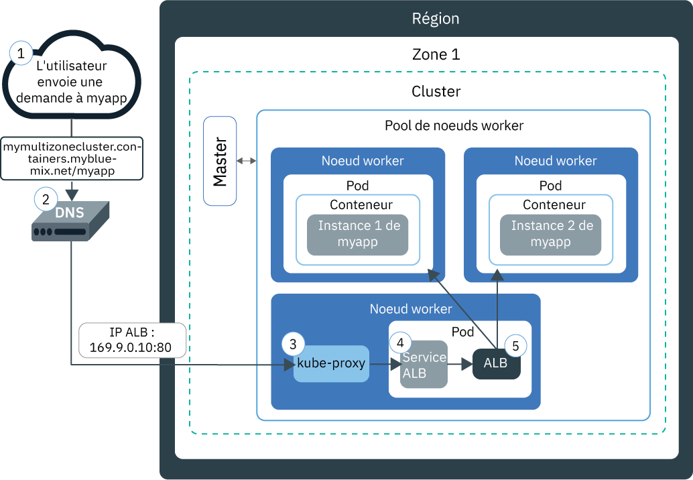
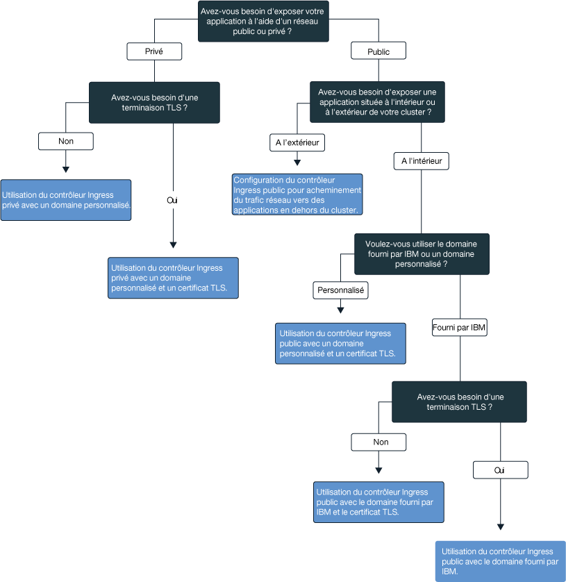

---

copyright:
  years: 2014, 2018
lastupdated: "2018-03-16"

---

{:new_window: target="_blank"}
{:shortdesc: .shortdesc}
{:screen: .screen}
{:pre: .pre}
{:table: .aria-labeledby="caption"}
{:codeblock: .codeblock}
{:tip: .tip}
{:download: .download}


# Configuration de services Ingress
{: #ingress}

Vous pouvez exposer plusieurs applications dans votre cluster Kubernetes en créant des ressources Ingress gérées par l'équilibreur de charge d'application (ALB) fourni par IBM dans {{site.data.keyword.containerlong}}.
{:shortdesc}

## Planification réseau avec les services Ingress
{: #planning}

Avec Ingress, vous pouvez exposer plusieurs services dans votre cluster et les rendre accessibles au public via un point d'entrée public unique.
{:shortdesc}

Au lieu de créer un service d'équilibreur de charge pour chaque application que vous désirez exposer au public, Ingress fournit une route publique unique pour acheminer les demandes publiques vers les applications situées à l'intérieur et à l'extérieur de votre cluster d'après leurs chemins d'accès individuels. Ingress est constitué de deux composants principaux : l'équilibreur de charge d'application et la ressource Ingress.

L'équilibreur de charge d'application (ALB) est un équilibreur de charge externe qui est à l'écoute des demandes de service HTTP ou HTTPS, TCP ou UDP entrantes et transmet les demandes au pod d'application approprié. Lorsque vous créez un cluster standard, {{site.data.keyword.containershort_notm}} crée automatiquement un équilibreur ALB à haute disponibilité pour votre cluster et lui affecte une route publique unique. La route publique est liée à une adresse IP publique portable allouée à votre compte d'infrastructure IBM Cloud (SoftLayer) lors de la création du cluster. Un équilibreur de charge ALB privé par défaut est également créé automatiquement, mais n'est pas activé automatiquement. 

Pour exposer une application via Ingress, vous devez créer un service Kubernetes pour votre application et enregistrer ce service auprès de l'équilibreur de charge ALB en définissant une ressource Ingress. La ressource Ingress spécifie le chemin qui est ajouté à la route publique pour composer une URL unique pour l'application exposée (par exemple, `mycluster.us-south.containers.mybluemix.net/myapp`). 

Le diagramme suivant montre comment Ingress achemine la communication vers une application depuis Internet :



1. Un utilisateur envoie une demande à votre application en accédant à l'URL de votre application. Il s'agit de l'URL publique de votre application exposée à laquelle est ajouté le chemin d'accès à la ressource Ingress, par exemple `mycluster.us-south.containers.mybluemix.net/myapp`.

2. Un service système DNS qui fait office d'équilibreur de charge global résout l'URL avec l'adresse IP publique portable de l'équilibreur de charge d'application (ALB) public par défaut dans le cluster.

3. `kube-proxy` achemine la demande vers le service ALB Kubernetes correspondant à l'application.

4. Le service Kubernetes achemine la demande à l'équilibreur de charge ALB.

5. L'équilibreur de charge ALB vérifie s'il existe une règle de routage pour le chemin `myapp` dans le cluster. Si une règle correspondante est trouvée, la demande est transmise en fonction des règles que vous avez définies dans la ressource Ingress au pod sur lequel est déployée l'application. Si plusieurs instances sont déployées dans le cluster, l'équilibreur de charge ALB équilibre les demandes entre les pods d'application.


**Remarque :** Ingress n'est disponible que pour les clusters standard et nécessite au moins deux noeuds worker dans le cluster pour garantir une haute disponibilité et l'application régulière de mises à jour. La configuration d'Ingress nécessite une [règle d'accès administrateur](cs_users.html#access_policies). Vérifiez votre [règle d'accès actuelle](cs_users.html#infra_access).

Pour sélectionner la configuration optimale pour Ingress, vous pouvez suivre l'arbre de décisions suivant :


<map name="ingress_map" id="ingress_map">
<area href="/docs/containers/cs_ingress.html#private_ingress_no_tls" alt="Exposition privée d'applications à l'aide d'un domaine personnalisé sans TLS" shape="rect" coords="25, 246, 187, 294"/>
<area href="/docs/containers/cs_ingress.html#private_ingress_tls" alt="Exposition privée d'applications à l'aide d'un domaine personnalisé avec TLS" shape="rect" coords="161, 337, 309, 385"/>
<area href="/docs/containers/cs_ingress.html#external_endpoint" alt="Exposition publique d'applications résidant hors de votre cluster à l'aide du domaine fourni par IBM en utilisant TLS" shape="rect" coords="313, 229, 466, 282"/>
<area href="/docs/containers/cs_ingress.html#custom_domain_cert" alt="Exposition publique d'applications à l'aide d'un domaine personnalisé avec TLS" shape="rect" coords="365, 415, 518, 468"/>
<area href="/docs/containers/cs_ingress.html#ibm_domain" alt="Exposition publique d'applications à l'aide du domaine fourni par IBM sans utiliser TLS" shape="rect" coords="414, 629, 569, 679"/>
<area href="/docs/containers/cs_ingress.html#ibm_domain_cert" alt="Exposition publique d'applications à l'aide du domaine fourni par IBM en utilisant TLS" shape="rect" coords="563, 711, 716, 764"/>
</map>

<br />


## Exposition d'applications au public
{: #ingress_expose_public}

Lorsque vous créez un cluster standard, un équilibreur de charge d'application (ALB) fourni par IBM est automatiquement activé et une adresse IP publique portable et une route publique lui sont affectées.
{:shortdesc}

Chaque application exposée au public via Ingress se voit affecter un chemin unique, lequel est rajouté à la route publique, de sorte que vous pouvez utiliser une URL unique pour accès public à votre application dans le cluster. Pour exposer votre application au public, vous pouvez configurer Ingress pour les scénarios suivants.

-   [Exposition d'applications au public à l'aide du domaine fourni par IBM sans utiliser TLS](#ibm_domain)
-   [Exposition d'applications au public à l'aide du domaine fourni par IBM en utilisant TLS](#ibm_domain_cert)
-   [Exposition d'applications au public à l'aide d'un domaine personnalisé en utilisant TLS](#custom_domain_cert)
-   [Exposition au public d'applications résidant hors de votre cluster à l'aide du domaine fourni par IBM ou d'un domaine personnalisé et en utilisant TLS](#external_endpoint)

### Exposition d'applications au public à l'aide du domaine fourni par IBM sans TLS
{: #ibm_domain}

Vous pouvez configurer l'équilibreur de charge ALB pour opérer sur le trafic réseau HTTP entrant vers les applications dans votre cluster et utiliser le domaine fourni par IBM pour accéder à vos applications depuis Internet.
{:shortdesc}

Avant de commencer :

-   Si ce n'est déjà fait, [créez un cluster standard](cs_clusters.html#clusters_ui).
-   [Ciblez avec votre interface CLI](cs_cli_install.html#cs_cli_configure) votre cluster pour exécuter des commandes `kubectl`.

Pour exposer une application à l'aide du domaine fourni par IBM :

1.  [Déployez votre application sur le cluster](cs_app.html#app_cli). Lorsque vous déployez l'application sur le cluster, un ou plusieurs pods sont créés pour vous et exécutent votre application dans un conteneur. Prenez soin d'ajouter un libellé à votre déploiement dans la section "metadata" de votre fichier de configuration. Ce libellé est nécessaire pour identifier tous les pods où s'exécute votre application afin de pouvoir les inclure dans l'équilibrage de charge Ingress.
2.  Créez un service Kubernetes pour l'application à exposer. L'équilibreur de charge ALB ne peut inclure votre application dans l'équilibrage de charge Ingress que si votre application est exposée via un service Kubernetes dans le cluster.
    1.  Ouvrez l'éditeur de votre choix et créez un fichier de configuration de service nommé, par exemple, `myservice.yaml`.
    2.  Définissez un service pour l'application que vous désirez exposer au public.

        ```
        apiVersion: v1
        kind: Service
        metadata:
          name: <myservice>
        spec:
          selector:
            <selectorkey>: <selectorvalue>
          ports:
           - protocol: TCP
             port: 8080
        ```
        {: codeblock}

        <table>
        <caption>Description des composants du fichier du service ALB</caption>
        <thead>
        <th colspan=2> Description des composants du fichier YAML</th>
        </thead>
        <tbody>
        <tr>
        <td><code>name</code></td>
        <td>Remplacez <em>&lt;myservice&gt;</em> par le nom de votre service ALB.</td>
        </tr>
        <tr>
        <td><code>selector</code></td>
        <td>Entrez la paire clé de libellé (<em>&lt;selectorkey&gt;</em>) et valeur (<em>&lt;selectorvalue&gt;</em>) que vous désirez utiliser pour cibler les pods dans lesquels s'exécute votre application. Par exemple, si vous utilisez le sélecteur suivant : <code>app: code</code>, tous les pods dont les métadonnées comportent ce libellé sont inclus dans l'équilibrage de charge. Entrez le même libellé que celui utilisé lorsque vous avez déployé votre application dans le cluster. </td>
         </tr>
         <tr>
         <td><code>port</code></td>
         <td>Port sur lequel le service est à l'écoute.</td>
         </tr>
         </tbody></table>
    3.  Sauvegardez vos modifications.
    4.  Créez le service dans votre cluster.

        ```
        kubectl apply -f myservice.yaml
        ```
        {: pre}
    5.  Répétez ces étapes pour chaque application que vous désirez exposer au public.
3.  Extrayez les informations sur votre cluster pour identifier le domaine fourni par IBM. Remplacez _&lt;mycluster&gt;_ par le nom du cluster sur lequel l'application que vous désirez exposer au public est déployée.

    ```
    bx cs cluster-get <mycluster>
    ```
    {: pre}

    La sortie de votre interface CLI sera similaire à ceci.

    ```
    Retrieving cluster <mycluster>...
    OK
    Name:    <mycluster>
    ID:    b9c6b00dc0aa487f97123440b4895f2d
    State:    normal
    Created:  2017-04-26T19:47:08+0000
    Location: dal10
    Master URL:  https://169.57.40.165:1931
    Ingress subdomain:  <ibmdomain>
    Ingress secret:  <ibmtlssecret>
    Workers:  3
    Version: 1.8.8
    ```
    {: screen}

    Le domaine fourni par IBM est indiqué dans la zone **Ingress subdomain**.
4.  Créez une ressource Ingress. Les ressources Ingress définissent les règles de routage pour le service Kubernetes que vous avez créé pour votre application et sont utilisées par l'équilibreur de charge ALB pour acheminer le trafic réseau entrant au service. Vous devez utiliser une même ressource Ingress pour définir les règles de routage pour plusieurs applications si chaque application est exposée via un service Kubernetes dans le cluster.
    1.  Ouvrez l'éditeur de votre choix et créez un fichier de configuration Ingress nommé, par exemple, `myingress.yaml`.
    2.  Définissez dans votre fichier de configuration une ressource Ingress utilisant le domaine fourni par IBM pour acheminer le trafic réseau entrant au service que vous avez créé auparavant.

        ```
        apiVersion: extensions/v1beta1
        kind: Ingress
        metadata:
          name: <myingressname>
        spec:
          rules:
          - host: <ibmdomain>
            http:
              paths:
              - path: /<myservicepath1>
                backend:
                  serviceName: <myservice1>
                  servicePort: 80
              - path: /<myservicepath2>
                backend:
                  serviceName: <myservice2>
                  servicePort: 80
        ```
        {: codeblock}

        <table>
        <caption>Description des composants du fichier de ressources Ingress</caption>
        <thead>
        <th colspan=2> Description des composants du fichier YAML</th>
        </thead>
        <tbody>
        <tr>
        <td><code>name</code></td>
        <td>Remplacez <em>&lt;myingressname&gt;</em> par le nom de votre ressource Ingress.</td>
        </tr>
        <tr>
        <td><code>host</code></td>
        <td>Remplacez <em>&lt;ibmdomain&gt;</em> par le nom <strong>Ingress subdomain</strong> fourni par IBM lors de l'étape précédente.

        </br></br>
        <strong>Remarque :</strong> n'utilisez pas le signe * pour votre hôte ou laissez vide la propriété de l'hôte afin d'éviter des échecs lors de la création Ingress.</td>
        </tr>
        <tr>
        <td><code>path</code></td>
        <td>Remplacez <em>&lt;myservicepath1&gt;</em> par une barre oblique ou par le chemin unique sur lequel votre application est à l'écoute, afin que le trafic réseau puisse être acheminé vers l'application.

        </br>
        Pour chaque service Kubernetes, vous pouvez définir un chemin individuel qui s'ajoute au domaine fourni par IBM afin de constituer un chemin unique vers votre application. Par exemple, <code>ingress_domain/myservicepath1</code>. Lorsque vous indiquez cette route dans un navigateur Web, le trafic réseau est acheminé vers l'équilibreur de charge ALB. Cet équilibreur de charge recherche le service associé et envoie le trafic réseau au service, ainsi qu'aux pods où l'application s'exécute en utilisant le même chemin. L'application doit être configurée pour être à l'écoute sur ce chemin afin de recevoir le trafic réseau entrant.

        </br></br>
        De nombreuses applications ne sont pas à l'écoute sur un chemin spécifique mais utilisent le chemin racine et un port spécifique. Dans ce cas, définissez le chemin racine sous la forme <code>/</code>, sans spécifier de chemin individuel pour votre application.
        </br>
        Exemples : <ul><li>Pour <code>http://ingress_host_name/</code>, entrez <code>/</code> pour le chemin.</li><li>Pour <code>http://ingress_host_name/myservicepath</code>, entrez <code>/myservicepath</code> pour le chemin.</li></ul>
        </br>
        <strong>Astuce :</strong> pour configurer Ingress pour qu'il soit à l'écoute sur un chemin différent de celui où l'application est à l'écoute, vous pouvez utiliser l'[annotation rewrite](cs_annotations.html#rewrite-path) pour définir le routage approprié vers votre application.</td>
        </tr>
        <tr>
        <td><code>serviceName</code></td>
        <td>Remplacez <em>&lt;myservice1&gt;</em> par le nom du service que vous avez utilisé lors de la création du service Kubernetes pour votre application.</td>
        </tr>
        <tr>
        <td><code>servicePort</code></td>
        <td>Port sur lequel votre service est à l'écoute. Utilisez le même port que celui que vous avez défini lors de la création du service Kubernetes pour votre application.</td>
        </tr>
        </tbody></table>

    3.  Créez la ressource Ingress pour votre cluster.

        ```
        kubectl apply -f myingress.yaml
        ```
        {: pre}

5.  Vérifiez que la création de la ressource Ingress a abouti. Remplacez _&lt;myingressname&gt;_ par le nom de la ressource Ingress que vous avez créée plus tôt.

    ```
    kubectl describe ingress <myingressname>
    ```
    {: pre}

    1. Si les messages compris dans les événements indiquent une erreur dans la configuration de votre ressource, modifiez les valeurs du fichier de votre ressource et réappliquez le fichier correspondant à la ressource.

6.  Dans un navigateur Web, entrez l'URL du service d'application auquel accéder.

    ```
    http://<ibmdomain>/<myservicepath1>
    ```
    {: codeblock}

<br />


### Exposition d'applications au public à l'aide du domaine fourni par IBM en utilisant TLS
{: #ibm_domain_cert}

Vous pouvez configurer l'équilibreur de charge d'application (ALB) Ingress pour gérer les connexions TLS entrantes vers vos applications, déchiffrer le trafic réseau en utilisant le certificat TLS fourni par IBM et acheminer la demande déchiffrée aux applications exposées dans votre cluster.
{:shortdesc}

Avant de commencer :

-   Si ce n'est déjà fait, [créez un cluster standard](cs_clusters.html#clusters_ui).
-   [Ciblez avec votre interface CLI](cs_cli_install.html#cs_cli_configure) votre cluster pour exécuter des commandes `kubectl`.

Pour exposer une application à l'aide du domaine fourni par IBM avec TLS :

1.  [Déployez votre application sur le cluster](cs_app.html#app_cli). Prenez soin d'ajouter un libellé à votre déploiement dans la section "metadata" de votre fichier de configuration. Ce libellé identifie tous les pods où s'exécute votre application afin de pouvoir les inclure dans l'équilibrage de charge Ingress.
2.  Créez un service Kubernetes pour l'application à exposer. L'équilibreur de charge ALB ne peut inclure votre application dans l'équilibrage de charge Ingress que si votre application est exposée via un service Kubernetes dans le cluster.
    1.  Ouvrez l'éditeur de votre choix et créez un fichier de configuration de service nommé, par exemple, `myservice.yaml`.
    2.  Définissez un service d'équilibreur de charge ALB pour l'application que vous désirez exposer au public.

        ```
        apiVersion: v1
        kind: Service
        metadata:
          name: <myservice>
        spec:
          selector:
            <selectorkey>: <selectorvalue>
          ports:
           - protocol: TCP
             port: 8080
        ```
        {: codeblock}

        <table>
        <caption>Description des composants du fichier du service ALB</caption>
        <thead>
        <th colspan=2> Description des composants du fichier YAML</th>
        </thead>
        <tbody>
        <tr>
        <td><code>name</code></td>
        <td>Remplacez <em>&lt;myservice&gt;</em> par le nom de votre service ALB.</td>
        </tr>
        <tr>
        <td><code>selector</code></td>
        <td>Entrez la paire clé de libellé (<em>&lt;selectorkey&gt;</em>) et valeur (<em>&lt;selectorvalue&gt;</em>) que vous désirez utiliser pour cibler les pods dans lesquels s'exécute votre application. Par exemple, si vous utilisez le sélecteur suivant : <code>app: code</code>, tous les pods dont les métadonnées comportent ce libellé sont inclus dans l'équilibrage de charge. Entrez le même libellé que celui utilisé lorsque vous avez déployé votre application dans le cluster. </td>
         </tr>
         <tr>
         <td><code>port</code></td>
         <td>Port sur lequel le service est à l'écoute.</td>
         </tr>
         </tbody></table>

    3.  Sauvegardez vos modifications.
    4.  Créez le service dans votre cluster.

        ```
        kubectl apply -f myservice.yaml
        ```
        {: pre}

    5.  Répétez ces étapes pour chaque application que vous désirez exposer au public.

3.  Affichez le domaine fourni par IBM et le certificat TLS. Remplacez _&lt;mycluster&gt;_ par le nom du cluster sur lequel l'application est déployée.

    ```
    bx cs cluster-get <mycluster>
    ```
    {: pre}

    La sortie de votre interface CLI sera similaire à ceci.

    ```
    bx cs cluster-get <mycluster>
    Retrieving cluster <mycluster>...
    OK
    Name:    <mycluster>
    ID:    b9c6b00dc0aa487f97123440b4895f2d
    State:    normal
    Created:  2017-04-26T19:47:08+0000
    Location: dal10
    Master URL:  https://169.57.40.165:1931
    Ingress subdomain:  <ibmdomain>
    Ingress secret:  <ibmtlssecret>
    Workers:  3
    Version: 1.8.8
    ```
    {: screen}

    Le domaine fourni par IBM figure dans la zone **Ingress subdomain** et le certificat fourni par IBM, dans la zone **Ingress secret**.

4.  Créez une ressource Ingress. Les ressources Ingress définissent les règles de routage pour le service Kubernetes que vous avez créé pour votre application et sont utilisées par l'équilibreur de charge ALB pour acheminer le trafic réseau entrant au service. Vous devez utiliser une même ressource Ingress pour définir les règles de routage pour plusieurs applications si chaque application est exposée via un service Kubernetes dans le cluster.
    1.  Ouvrez l'éditeur de votre choix et créez un fichier de configuration Ingress nommé, par exemple, `myingress.yaml`.
    2.  Définissez dans votre fichier de configuration une ressource Ingress utilisant le domaine fourni par IBM pour acheminer le trafic réseau entrant à vos services et le certificat fourni par IBM pour gérer la terminaison TLS pour vous. Vous pouvez définir pour chaque service un chemin d'accès individuel en l'ajoutant au domaine fourni par IBM de manière à créer un chemin unique vers votre application. Par exemple, `https://ingress_domain/myapp`. Lorsque vous indiquez cette route dans un navigateur Web, le trafic réseau est acheminé vers l'équilibreur de charge ALB. L'équilibreur de charge ALB recherche le service associé et envoie le trafic réseau au service, ainsi qu'aux pods où l'application s'exécute.

        **Remarque :** votre application doit être à l'écoute sur le chemin que vous avez défini dans la ressource Ingress. Dans la négative, le trafic réseau ne peut pas être transféré à l'application. La plupart des applications ne sont pas à l'écoute sur un chemin spécifique, mais utilisent le chemin racine et un port spécifique. Dans ce cas, définissez le chemin racine sous la forme `/`, sans spécifier de chemin individuel pour votre application.

        ```
        apiVersion: extensions/v1beta1
        kind: Ingress
        metadata:
          name: <myingressname>
        spec:
          tls:
          - hosts:
            - <ibmdomain>
            secretName: <ibmtlssecret>
          rules:
          - host: <ibmdomain>
            http:
              paths:
              - path: /<myservicepath1>
                backend:
                  serviceName: <myservice1>
                  servicePort: 80
              - path: /<myservicepath2>
                backend:
                  serviceName: <myservice2>
                  servicePort: 80
        ```
        {: codeblock}

        <table>
        <caption>Description des composants du fichier de ressources Ingress</caption>
        <thead>
        <th colspan=2> Description des composants du fichier YAML</th>
        </thead>
        <tbody>
        <tr>
        <td><code>name</code></td>
        <td>Remplacez <em>&lt;myingressname&gt;</em> par le nom de votre ressource Ingress.</td>
        </tr>
        <tr>
        <td><code>tls/hosts</code></td>
        <td>Remplacez <em>&lt;ibmdomain&gt;</em> par le nom <strong>Ingress subdomain</strong> fourni par IBM à l'étape précédente. Ce domaine est configuré pour terminaison TLS.

        </br></br>
        <strong>Remarque :</strong> n'utilisez pas le signe &ast; pour votre hôte ou laissez vide la propriété de l'hôte afin d'éviter des échecs lors de la création Ingress.</td>
        </tr>
        <tr>
        <td><code>tls/secretName</code></td>
        <td>Remplacez <em>&lt;ibmtlssecret&gt;</em> par le nom <strong>Ingress secret</strong> fourni par IBM à l'étape précédente. Ce certificat gère la terminaison TLS.
        </tr>
        <tr>
        <td><code>host</code></td>
        <td>Remplacez <em>&lt;ibmdomain&gt;</em> par le nom <strong>Ingress subdomain</strong> fourni par IBM à l'étape précédente. Ce domaine est configuré pour terminaison TLS.

        </br></br>
        <strong>Remarque :</strong> n'utilisez pas le signe &ast; pour votre hôte ou laissez vide la propriété de l'hôte afin d'éviter des échecs lors de la création Ingress.</td>
        </tr>
        <tr>
        <td><code>path</code></td>
        <td>Remplacez <em>&lt;myservicepath1&gt;</em> par une barre oblique ou par le chemin unique sur lequel votre application est à l'écoute, afin que le trafic réseau puisse être acheminé vers l'application.

        </br>
        Pour chaque service Kubernetes, vous pouvez définir un chemin individuel qui s'ajoute au domaine fourni par IBM afin de constituer un chemin unique vers votre application. Par exemple, <code>ingress_domain/myservicepath1</code>. Lorsque vous indiquez cette route dans un navigateur Web, le trafic réseau est acheminé vers l'équilibreur de charge ALB. Cet équilibreur de charge recherche le service associé et envoie le trafic réseau au service, ainsi qu'aux pods où l'application s'exécute en utilisant le même chemin. L'application doit être configurée pour être à l'écoute sur ce chemin afin de recevoir le trafic réseau entrant.

        </br>
        De nombreuses applications ne sont pas à l'écoute sur un chemin spécifique mais utilisent le chemin racine et un port spécifique. Dans ce cas, définissez le chemin racine sous la forme <code>/</code>, sans spécifier de chemin individuel pour votre application.

        </br>
        Exemples : <ul><li>Pour <code>http://ingress_host_name/</code>, entrez <code>/</code> pour le chemin.</li><li>Pour <code>http://ingress_host_name/myservicepath</code>, entrez <code>/myservicepath</code> pour le chemin.</li></ul>
        <strong>Astuce :</strong> pour configurer Ingress pour qu'il soit à l'écoute sur un chemin différent de celui où l'application est à l'écoute, vous pouvez utiliser l'[annotation rewrite](cs_annotations.html#rewrite-path) pour définir le routage approprié vers votre application.</td>
        </tr>
        <tr>
        <td><code>serviceName</code></td>
        <td>Remplacez <em>&lt;myservice1&gt;</em> par le nom du service que vous avez utilisé lors de la création du service Kubernetes pour votre application.</td>
        </tr>
        <tr>
        <td><code>servicePort</code></td>
        <td>Port sur lequel votre service est à l'écoute. Utilisez le même port que celui que vous avez défini lors de la création du service Kubernetes pour votre application.</td>
        </tr>
        </tbody></table>

    3.  Créez la ressource Ingress pour votre cluster.

        ```
        kubectl apply -f myingress.yaml
        ```
        {: pre}

5.  Vérifiez que la création de la ressource Ingress a abouti. Remplacez _&lt;myingressname&gt;_ par le nom de la ressource Ingress que vous avez créée plus tôt.

    ```
    kubectl describe ingress <myingressname>
    ```
    {: pre}

    1. Si les messages compris dans les événements indiquent une erreur dans la configuration de votre ressource, modifiez les valeurs du fichier de votre ressource et réappliquez le fichier correspondant à la ressource.

6.  Dans un navigateur Web, entrez l'URL du service d'application auquel accéder.

    ```
    https://<ibmdomain>/<myservicepath1>
    ```
    {: codeblock}

<br />


### Exposition d'applications au public à l'aide d'un domaine personnalisé en utilisant TLS
{: #custom_domain_cert}

Vous pouvez configurer l'équilibreur de charge ALB afin d'acheminer le trafic réseau entrant vers les applications dans votre cluster et d'utiliser votre propre certificat TLS pour gérer la terminaison TLS, tout en utilisant votre domaine personnalisé au lieu du domaine fourni par IBM.
{:shortdesc}

Avant de commencer :

-   Si ce n'est déjà fait, [créez un cluster standard](cs_clusters.html#clusters_ui).
-   [Ciblez avec votre interface CLI](cs_cli_install.html#cs_cli_configure) votre cluster pour exécuter des commandes `kubectl`.

Pour exposer une application à l'aide d'un domaine personnalisé avec TLS :

1.  Créez un domaine personnalisé. Pour cela, travaillez avec votre fournisseur DNS (Domain Name Service) ou [{{site.data.keyword.Bluemix_notm}} ](/docs/infrastructure/dns/getting-started.html#getting-started-with-dns) afin d'enregistrer votre domaine personnalisé.
2.  Configurez votre domaine pour acheminer le trafic réseau entrant à l'équilibreur de charge ALB fourni par IBM. Sélectionnez l'une des options suivantes :
    -   Définir un alias pour votre domaine personnalisé en spécifiant le domaine fourni par IBM sous forme d'enregistrement de nom canonique (CNAME). Pour identifier le domaine Ingress fourni par IBM, exécutez `bx cs cluster-get <mycluster>` et recherchez la zone **Ingress subdomain**.
    -   Mappez votre domaine personnalisé à l'adresse IP publique portable de l'équilibreur de charge ALB fourni par IBM en ajoutant l'adresse IP en tant qu'enregistrement. Pour identifier l'adresse IP publique portable de l'équilibreur de charge ALB, exécutez la commande `bx cs alb-get <public_alb_ID>`.
3.  Importez ou créez un certificat TLS et une valeur confidentielle de clé :
    * Si un certificat TLS que vous désirez utiliser est stocké dans {{site.data.keyword.cloudcerts_long_notm}}, vous pouvez importer sa valeur confidentielle associée dans votre cluster en exécutant la commande suivante :

      ```
      bx cs alb-cert-deploy --secret-name <secret_name> --cluster <cluster_name_or_ID> --cert-crn <certificate_crn>
      ```
      {: pre}

    * Si vous ne disposez pas de certificat TLS, procédez comme suit :
        1. Créez un certificat TLS et une clé pour votre domaine codés au format PEM.
        2. Créez une valeur confidentielle qui utilise le certificat et la clé TLS. Remplacez <em>&lt;mytlssecret&gt;</em> par le nom de votre valeur confidentielle Kubernetes, <em>&lt;tls_key_filepath&gt;</em> par le chemin  de votre fichier de clés TLS personnalisé et <em>&lt;tls_cert_filepath&gt;</em> par le chemin  de votre fichier de certificat TLS personnalisé.

            ```
            kubectl create secret tls <mytlssecret> --key <tls_key_filepath> --cert <tls_cert_filepath>
            ```
            {: pre}

4.  [Déployez votre application sur le cluster](cs_app.html#app_cli). Lorsque vous déployez l'application sur le cluster, un ou plusieurs pods sont créés pour vous et exécutent votre application dans un conteneur. Prenez soin d'ajouter un libellé à votre déploiement dans la section "metadata" de votre fichier de configuration. Ce libellé est nécessaire pour identifier tous les pods où s'exécute votre application afin de pouvoir les inclure dans l'équilibrage de charge Ingress.

5.  Créez un service Kubernetes pour l'application à exposer. L'équilibreur de charge ALB ne peut inclure votre application dans l'équilibrage de charge Ingress que si votre application est exposée via un service Kubernetes dans le cluster.

    1.  Ouvrez l'éditeur de votre choix et créez un fichier de configuration de service nommé, par exemple, `myservice.yaml`.
    2.  Définissez un service d'équilibreur de charge ALB pour l'application que vous désirez exposer au public.

        ```
        apiVersion: v1
        kind: Service
        metadata:
          name: <myservice>
        spec:
          selector:
            <selectorkey>: <selectorvalue>
          ports:
           - protocol: TCP
             port: 8080
        ```
       {: codeblock}

        <table>
        <caption>Description des composants du fichier du service ALB</caption>
        <thead>
        <th colspan=2> Description des composants du fichier YAML</th>
        </thead>
        <tbody>
        <tr>
        <td><code>name</code></td>
        <td>Remplacez <em>&lt;myservice1&gt;</em> par le nom de votre service ALB.</td>
        </tr>
        <tr>
        <td><code>selector</code></td>
        <td>Entrez la paire clé de libellé (<em>&lt;selectorkey&gt;</em>) et valeur (<em>&lt;selectorvalue&gt;</em>) que vous désirez utiliser pour cibler les pods dans lesquels s'exécute votre application. Par exemple, si vous utilisez le sélecteur suivant : <code>app: code</code>, tous les pods dont les métadonnées comportent ce libellé sont inclus dans l'équilibrage de charge. Entrez le même libellé que celui utilisé lorsque vous avez déployé votre application dans le cluster. </td>
         </tr>
         <td><code>port</code></td>
         <td>Port sur lequel le service est à l'écoute.</td>
         </tbody></table>

    3.  Sauvegardez vos modifications.
    4.  Créez le service dans votre cluster.

        ```
        kubectl apply -f myservice.yaml
        ```
        {: pre}

    5.  Répétez ces étapes pour chaque application que vous désirez exposer au public.
6.  Créez une ressource Ingress. Les ressources Ingress définissent les règles de routage pour le service Kubernetes que vous avez créé pour votre application et sont utilisées par l'équilibreur de charge ALB pour acheminer le trafic réseau entrant au service. Vous devez utiliser une même ressource Ingress pour définir les règles de routage pour plusieurs applications si chaque application est exposée via un service Kubernetes dans le cluster.
    1.  Ouvrez l'éditeur de votre choix et créez un fichier de configuration Ingress nommé, par exemple, `myingress.yaml`.
    2.  Définissez dans votre fichier de configuration une ressource Ingress utilisant votre domaine personnalisé pour acheminer le trafic réseau entrant à vos services et votre certificat personnalisé pour gérer la terminaison TLS. Vous pouvez définir pour chaque service un chemin d'accès individuel qui est ajouté à votre domaine personnalisé de manière à créer un chemin unique vers votre application. Par exemple, `https://mydomain/myapp`. Lorsque vous indiquez cette route dans un navigateur Web, le trafic réseau est acheminé vers l'équilibreur de charge ALB. L'équilibreur de charge ALB recherche le service associé et envoie le trafic réseau au service, ainsi qu'aux pods où l'application s'exécute.

        L'application doit être à l'écoute sur le chemin que vous avez défini dans la ressource Ingress. Dans la négative, le trafic réseau ne peut pas être transféré à l'application. La plupart des applications ne sont pas à l'écoute sur un chemin spécifique, mais utilisent le chemin racine et un port spécifique. Dans ce cas, définissez le chemin racine sous la forme `/`, sans spécifier de chemin individuel pour votre application.

        ```
        apiVersion: extensions/v1beta1
        kind: Ingress
        metadata:
          name: <myingressname>
        spec:
          tls:
          - hosts:
            - <mycustomdomain>
            secretName: <mytlssecret>
          rules:
          - host: <mycustomdomain>
            http:
              paths:
              - path: /<myservicepath1>
                backend:
                  serviceName: <myservice1>
                  servicePort: 80
              - path: /<myservicepath2>
                backend:
                  serviceName: <myservice2>
                  servicePort: 80
        ```
        {: codeblock}

        <table>
        <caption>Description des composants du fichier de ressources Ingress</caption>
        <thead>
        <th colspan=2> Description des composants du fichier YAML</th>
        </thead>
        <tbody>
        <tr>
        <td><code>name</code></td>
        <td>Remplacez <em>&lt;myingressname&gt;</em> par le nom de votre ressource Ingress.</td>
        </tr>
        <tr>
        <td><code>tls/hosts</code></td>
        <td>Remplacez <em>&lt;mycustomdomain&gt;</em> par le domaine personnalisé que vous désirez configurer pour terminaison TLS.

        </br></br>
        <strong>Remarque :</strong> n'utilisez pas le signe &ast; pour votre hôte ou laissez vide la propriété de l'hôte afin d'éviter des échecs lors de la création Ingress.</td>
        </tr>
        <tr>
        <td><code>tls/secretName</code></td>
        <td>Remplacez <em>&lt;mytlssecret&gt;</em> par le nom de la valeur confidentielle créée auparavant qui contient votre certificat et votre clé TLS personnalisés. Si vous avez importé un certificat depuis {{site.data.keyword.cloudcerts_short}}, vous pouvez exécuter la commande <code>bx cs alb-cert-get --cluster <cluster_name_or_ID> --cert-crn <certificate_crn></code> pour examiner les valeurs confidentielles qui sont associées à un certificat TLS.
        </tr>
        <tr>
        <td><code>host</code></td>
        <td>Remplacez <em>&lt;mycustomdomain&gt;</em> par le domaine personnalisé que vous désirez configurer pour terminaison TLS.

        </br></br>
        <strong>Remarque :</strong> n'utilisez pas le signe &ast; pour votre hôte ou laissez vide la propriété de l'hôte afin d'éviter des échecs lors de la création Ingress.
        </td>
        </tr>
        <tr>
        <td><code>path</code></td>
        <td>Remplacez <em>&lt;myservicepath1&gt;</em> par une barre oblique ou par le chemin unique sur lequel votre application est à l'écoute, afin que le trafic réseau puisse être acheminé vers l'application.

        </br>
        Pour chaque service Kubernetes, vous pouvez définir un chemin individuel qui s'ajoute au domaine fourni par IBM afin de constituer un chemin unique vers votre application. Par exemple, <code>ingress_domain/myservicepath1</code>. Lorsque vous indiquez cette route dans un navigateur Web, le trafic réseau est acheminé vers l'équilibreur de charge ALB. Cet équilibreur de charge recherche le service associé et envoie le trafic réseau au service, ainsi qu'aux pods où l'application s'exécute en utilisant le même chemin. L'application doit être configurée pour être à l'écoute sur ce chemin afin de recevoir le trafic réseau entrant.

        </br>
        De nombreuses applications ne sont pas à l'écoute sur un chemin spécifique mais utilisent le chemin racine et un port spécifique. Dans ce cas, définissez le chemin racine sous la forme
<code>/</code>, sans spécifier de chemin individuel pour votre application.

        </br></br>
        Exemples : <ul><li>Pour <code>https://mycustomdomain/</code>, entrez <code>/</code> pour le chemin.</li><li>Pour <code>https://mycustomdomain/myservicepath</code>, entrez <code>/myservicepath</code> pour le chemin.</li></ul>
        <strong>Astuce :</strong> pour configurer Ingress pour qu'il soit à l'écoute sur un chemin différent de celui où l'application est à l'écoute, vous pouvez utiliser l'[annotation rewrite](cs_annotations.html#rewrite-path) pour définir le routage approprié vers votre application.</td>
        </tr>
        <tr>
        <td><code>serviceName</code></td>
        <td>Remplacez <em>&lt;myservice1&gt;</em> par le nom du service que vous avez utilisé lors de la création du service Kubernetes pour votre application.</td>
        </tr>
        <tr>
        <td><code>servicePort</code></td>
        <td>Port sur lequel votre service est à l'écoute. Utilisez le même port que celui que vous avez défini lors de la création du service Kubernetes pour votre application.</td>
        </tr>
        </tbody></table>

    3.  Sauvegardez vos modifications.
    4.  Créez la ressource Ingress pour votre cluster.

        ```
        kubectl apply -f myingress.yaml
        ```
        {: pre}

7.  Vérifiez que la création de la ressource Ingress a abouti. Remplacez _&lt;myingressname&gt;_ par le nom de la ressource Ingress que vous avez créée plus tôt.

    ```
    kubectl describe ingress <myingressname>
    ```
    {: pre}

    1. Si les messages compris dans les événements indiquent une erreur dans la configuration de votre ressource, modifiez les valeurs du fichier de votre ressource et réappliquez le fichier correspondant à la ressource.

8.  Accédez à votre application depuis Internet.
    1.  Ouvrez le navigateur Web de votre choix.
    2.  Entrez l'URL du service d'application auquel vous désirez accéder.

        ```
        https://<mycustomdomain>/<myservicepath1>
        ```
        {: codeblock}

<br />


### Exposition au public d'applications résidant hors de votre cluster à l'aide du domaine fourni par IBM ou d'un domaine personnalisé et en utilisant TLS
{: #external_endpoint}

Vous pouvez configurer l'équilibreur de charge ALB pour inclure des applications situées hors de votre cluster. Les requêtes entrantes sur le domaine fourni par IBM, ou sur votre domaine personnalisé, sont acheminées automatiquement à l'application externe.
{:shortdesc}

Avant de commencer :

-   Si ce n'est déjà fait, [créez un cluster standard](cs_clusters.html#clusters_ui).
-   [Ciblez avec votre interface CLI](cs_cli_install.html#cs_cli_configure) votre cluster pour exécuter des commandes `kubectl`.
-   Vérifiez que l'application externe que vous désirez englober dans l'équilibrage de charge du cluster est accessible via une adresse IP publique.

Vous pouvez acheminer le trafic réseau entrant sur le domaine fourni par IBM vers des applications situées hors de votre cluster. Si vous désirez utiliser à la place un domaine personnalisé et un certificat TLS, remplacez le domaine fourni par IBM et le certificat TLS par vos [domaine personnalisé et certificat TLS](#custom_domain_cert).

1.  Créez un service Kubernetes pour votre cluster qui transmettra les demandes entrantes au noeud final externe que vous allez créer.
    1.  Ouvrez l'éditeur de votre choix et créez un fichier de configuration de service nommé, par exemple, `myexternalservice.yaml`.
    2.  Définissez le service ALB.

        ```
        apiVersion: v1
        kind: Service
        metadata:
          name: <myservicename>
        spec:
          ports:
           - protocol: TCP
             port: 8080
        ```
        {: codeblock}

        <table>
        <caption>Description des composants du fichier du service ALB</caption>
        <thead>
        <th colspan=2> Description des composants du fichier YAML</th>
        </thead>
        <tbody>
        <tr>
        <td><code>metadata/name</code></td>
        <td>Remplacez <em>&lt;myservicename&gt;</em> par le nom de votre service.</td>
        </tr>
        <tr>
        <td><code>port</code></td>
        <td>Port sur lequel le service est à l'écoute.</td>
        </tr></tbody></table>

    3.  Sauvegardez vos modifications.
    4.  Créez le service Kubernetes pour votre cluster.

        ```
        kubectl apply -f myexternalservice.yaml
        ```
        {: pre}

2.  Configurez un noeud final Kubernetes définissant l'emplacement externe de l'application que vous désirez inclure dans l'équilibrage de charge du cluster.
    1.  Ouvrez l'éditeur de votre choix et créez un fichier de configuration de noeud final nommé, par exemple, `myexternalendpoint.yaml`.
    2.  Définissez votre noeud final externe. Incluez toutes les adresses IP publiques et les ports pouvant être utilisés pour accéder à votre application externe.

        ```
        kind: Endpoints
        apiVersion: v1
        metadata:
          name: <myservicename>
        subsets:
          - addresses:
              - ip: <externalIP1>
              - ip: <externalIP2>
            ports:
              - port: <externalport>
        ```
        {: codeblock}

        <table>
        <thead>
        <th colspan=2> Description des composants du fichier YAML</th>
        </thead>
        <tbody>
        <tr>
        <td><code>name</code></td>
        <td>Remplacez <em>&lt;myendpointname&gt;</em> par le nom du service Kubernetes que vous avez créé plut tôt.</td>
        </tr>
        <tr>
        <td><code>ip</code></td>
        <td>Remplacez <em>&lt;externalIP&gt;</em> par les adresses IP publiques permettant de se connecter à votre application externe.</td>
         </tr>
         <td><code>port</code></td>
         <td>Remplacez <em>&lt;externalport&gt;</em> par le port sur lequel votre application externe est à l'écoute.</td>
         </tbody></table>

    3.  Sauvegardez vos modifications.
    4.  Créez le noeud final Kubernetes pour votre cluster.

        ```
        kubectl apply -f myexternalendpoint.yaml
        ```
        {: pre}

3.  Affichez le domaine fourni par IBM et le certificat TLS. Remplacez _&lt;mycluster&gt;_ par le nom du cluster sur lequel l'application est déployée.

    ```
    bx cs cluster-get <mycluster>
    ```
    {: pre}

    La sortie de votre interface CLI sera similaire à ceci.

    ```
    Retrieving cluster <mycluster>...
    OK
    Name:    <mycluster>
    ID:    b9c6b00dc0aa487f97123440b4895f2d
    State:    normal
    Created:  2017-04-26T19:47:08+0000
    Location: dal10
    Master URL:  https://169.57.40.165:1931
    Ingress subdomain:  <ibmdomain>
    Ingress secret:  <ibmtlssecret>
    Workers:  3
    Version: 1.8.8
    ```
    {: screen}

    Le domaine fourni par IBM figure dans la zone **Ingress subdomain** et le certificat fourni par IBM, dans la zone **Ingress secret**.

4.  Créez une ressource Ingress. Les ressources Ingress définissent les règles de routage pour le service Kubernetes que vous avez créé pour votre application et sont utilisées par l'équilibreur de charge ALB pour acheminer le trafic réseau entrant au service. Vous pouvez utiliser une même ressource Ingress pour définir des règles de routage pour plusieurs applications externes dans la mesure où chaque application est exposée avec son nom final externe via un service Kubernetes dans le cluster.
    1.  Ouvrez l'éditeur de votre choix et créez un fichier de configuration Ingress nommé, par exemple, `myexternalingress.yaml`.
    2.  Définissez dans votre fichier de configuration une ressource Ingress utilisant le domaine fourni par IBM et le certificat TLS pour acheminer le trafic réseau entrant à votre application externe en utilisant le noeud final externe défini auparavant. Pour chaque service, vous pouvez définir un chemin d'accès individuel en l'ajoutant au domaine fourni par IBM ou au domaine personnalisé de manière à créer un chemin unique vers votre application. Par exemple, `https://ingress_domain/myapp`. Lorsque vous indiquez cette route dans un navigateur Web, le trafic réseau est acheminé vers l'équilibreur de charge ALB. Cet équilibreur de charge recherche le service associé et envoie le trafic réseau au service, ainsi qu'à l'application externe.

        L'application doit être à l'écoute sur le chemin que vous avez défini dans la ressource Ingress. Dans la négative, le trafic réseau ne peut pas être transféré à l'application. La plupart des applications ne sont pas à l'écoute sur un chemin spécifique, mais utilisent le chemin racine et un port spécifique. Dans ce cas, définissez le chemin racine sous la forme /, sans spécifier de chemin individuel pour votre application.

        ```
        apiVersion: extensions/v1beta1
        kind: Ingress
        metadata:
          name: <myingressname>
        spec:
          tls:
          - hosts:
            - <ibmdomain>
            secretName: <ibmtlssecret>
          rules:
          - host: <ibmdomain>
            http:
              paths:
              - path: /<myexternalservicepath1>
                backend:
                  serviceName: <myservice1>
                  servicePort: 80
              - path: /<myexternalservicepath2>
                backend:
                  serviceName: <myexternalservice2>
                  servicePort: 80
        ```
        {: codeblock}

        <table>
        <caption>Description des composants du fichier de ressources Ingress</caption>
        <thead>
        <th colspan=2> Description des composants du fichier YAML</th>
        </thead>
        <tbody>
        <tr>
        <td><code>name</code></td>
        <td>Remplacez <em>&lt;myingressname&gt;</em> par le nom de la ressource Ingress.</td>
        </tr>
        <tr>
        <td><code>tls/hosts</code></td>
        <td>Remplacez <em>&lt;ibmdomain&gt;</em> par le nom <strong>Ingress subdomain</strong> fourni par IBM à l'étape précédente. Ce domaine est configuré pour terminaison TLS.

        </br></br>
        <strong>Remarque :</strong> n'utilisez pas le signe &ast; pour votre hôte ou laissez vide la propriété de l'hôte afin d'éviter des échecs lors de la création Ingress.</td>
        </tr>
        <tr>
        <td><code>tls/secretName</code></td>
        <td>Remplacez <em>&lt;ibmtlssecret&gt;</em> par la valeur <strong>Ingress secret</strong> fournie par IBM à l'étape précédente. Ce certificat gère la terminaison TLS.</td>
        </tr>
        <tr>
        <td><code>rules/host</code></td>
        <td>Remplacez <em>&lt;ibmdomain&gt;</em> par le nom <strong>Ingress subdomain</strong> fourni par IBM à l'étape précédente. Ce domaine est configuré pour terminaison TLS.

        </br></br>
        <strong>Remarque :</strong> n'utilisez pas le signe &ast; pour votre hôte ou laissez vide la propriété de l'hôte afin d'éviter des échecs lors de la création Ingress.</td>
        </tr>
        <tr>
        <td><code>path</code></td>
        <td>Remplacez <em>&lt;myexternalservicepath&gt;</em> par une barre oblique, ou par le chemin unique sur lequel votre application externe est à l'écoute, afin que ce trafic réseau puisse être transféré à l'application.

        </br>
        Vous pouvez définir pour chaque service Kubernetes un chemin d'accès individuel en l'ajoutant à votre domaine de manière à créer un chemin unique vers votre application. Par exemple, <code>https://ibmdomain/myservicepath1</code>. Lorsque vous indiquez cette route dans un navigateur Web, le trafic réseau est acheminé vers l'équilibreur de charge ALB. Cet équilibreur de charge recherche le service associé et envoie le trafic réseau à l'application externe en utilisant le même chemin. L'application doit être configurée pour être à l'écoute sur ce chemin afin de recevoir le trafic réseau entrant.

        </br></br>
        De nombreuses applications ne sont pas à l'écoute sur un chemin spécifique mais utilisent le chemin racine et un port spécifique. Dans ce cas, définissez le chemin racine sous la forme
<code>/</code>, sans spécifier de chemin individuel pour votre application.

        </br></br>
        <strong>Astuce :</strong> pour configurer Ingress pour qu'il soit à l'écoute sur un chemin différent de celui où l'application est à l'écoute, vous pouvez utiliser l'[annotation rewrite](cs_annotations.html#rewrite-path) pour définir le routage approprié vers votre application.</td>
        </tr>
        <tr>
        <td><code>serviceName</code></td>
        <td>Remplacez <em>&lt;myexternalservice&gt;</em> par le nom du service que vous avez utilisé lorsque vous avez créé le service Kubernetes pour votre application externe.</td>
        </tr>
        <tr>
        <td><code>servicePort</code></td>
        <td>Port sur lequel votre service est à l'écoute.</td>
        </tr>
        </tbody></table>

    3.  Sauvegardez vos modifications.
    4.  Créez la ressource Ingress pour votre cluster.

        ```
        kubectl apply -f myexternalingress.yaml
        ```
        {: pre}

5.  Vérifiez que la création de la ressource Ingress a abouti. Remplacez _&lt;myingressname&gt;_ par le nom de la ressource Ingress que vous avez créée plus tôt.

    ```
    kubectl describe ingress <myingressname>
    ```
    {: pre}

    1. Si les messages compris dans les événements indiquent une erreur dans la configuration de votre ressource, modifiez les valeurs du fichier de votre ressource et réappliquez le fichier correspondant à la ressource.

6.  Accédez à votre application externe.
    1.  Ouvrez le navigateur Web de votre choix.
    2.  Entrez l'URL pour accéder à votre application externe.

        ```
        https://<ibmdomain>/<myexternalservicepath>
        ```
        {: codeblock}

<br />


## Exposition d'applications à un réseau privé
{: #ingress_expose_private}

Lorsque vous créez un cluster standard, un équilibreur de charge d'application (ALB) fourni par IBM est créé et une adresse IP privée portable et une route privée lui sont affectées. Toutefois, l'équilibreur de charge ALB privé par défaut n'est pas automatiquement activé. Pour exposer votre application à des réseaux privés, commencez par [activer l'équilibreur de charge d'application privé par défaut](#private_ingress).
{:shortdesc}

Vous pouvez ensuite configurer Ingress pour les scénarios suivants.
-   [Exposition privée d'applications à l'aide d'un domaine personnalisé sans utiliser TLS](#private_ingress_no_tls)
-   [Exposition privée d'applications à l'aide d'un domaine personnalisé en utilisant TLS](#private_ingress_tls)

### Activation de l'équilibreur de charge d'application privé par défaut
{: #private_ingress}

Avant d'utiliser l'équilibreur de charge ALB privé par défaut, vous devez l'activer avec l'adresse IP privée portable fournie par IBM, ou votre propre adresse IP privée portable. {:shortdesc}

**Remarque** : si vous avez utilisé l'indicateur `--no-subnet` lors de la création du cluster, vous devez ajouter un sous-réseau privé portable ou un sous-réseau géré par l'utilisateur avant de pouvoir activer l'équilibreur de charge ALB privé. Pour plus d'informations, voir [Demande de sous-réseaux supplémentaires pour votre cluster](cs_subnets.html#request).

Avant de commencer :

-   Si ce n'est déjà fait, [créez un cluster standard](cs_clusters.html#clusters_ui).
-   [Ciblez votre interface de ligne de commande](cs_cli_install.html#cs_cli_configure) vers votre cluster.

Pour utiliser l'équilibreur de charge ALB privé avec l'adresse IP privée portable pré-affectée fournie par IBM :

1. Répertoriez les équilibreurs de charge ALB disponibles dans votre cluster pour identifier l'ID de l'ALB privé. Remplacez <em>&lt;cluser_name&gt;</em> par le nom du cluster sur lequel l'application que vous voulez exposer est déployée.

    ```
    bx cs albs --cluster <my_cluster>
    ```
    {: pre}

    La zone **Status** pour l'ALB privé indique _disabled_.
    ```
    ALB ID                                            Enabled   Status     Type      ALB IP
    private-cr6d779503319d419ea3b4ab171d12c3b8-alb1   false     disabled   private   -
    public-cr6d779503319d419ea3b4ab171d12c3b8-alb1    true      enabled    public    169.46.63.150
    ```
    {: screen}

2. Activez l'équilibreur de charge ALB privé. Remplacez <em>&lt;private_ALB_ID&gt;</em> par l'ID de l'ALB privé indiqué dans la sortie de l'étape précédente.

   ```
   bx cs alb-configure --albID <private_ALB_ID> --enable
   ```
   {: pre}


Pour activer l'équilibreur de charge ALB privé à l'aide de votre propre adresse IP privée portable :

1. Configurez le sous-réseau géré par l'utilisateur de l'adresse IP que vous avez choisie pour acheminer le trafic sur le VLAN privé de votre cluster. Remplacez <em>&lt;cluser_name&gt;</em> par le nom ou l'ID du cluster sur lequel l'application que vous voulez exposer est déployée, <em>&lt;subnet_CIDR&gt;</em> par le CIDR de votre sous-réseau géré par l'utilisateur et <em>&lt;private_VLAN&gt;</em> par un ID de VLAN privé disponible. Pour obtenir l'ID d'un VLAN privé disponible, exécutez la commande `bx cs vlans`.

   ```
   bx cs cluster-user-subnet-add <cluster_name> <subnet_CIDR> <private_VLAN>
   ```
   {: pre}

2. Répertoriez les équilibreurs de charge ALB disponibles dans votre cluster pour identifier l'ID de l'ALB privé. 

    ```
    bx cs albs --cluster <my_cluster>
    ```
    {: pre}

    La zone **Status** pour l'ALB privé indique _disabled_.
    ```
    ALB ID                                            Enabled   Status     Type      ALB IP
    private-cr6d779503319d419ea3b4ab171d12c3b8-alb1   false     disabled   private   -
    public-cr6d779503319d419ea3b4ab171d12c3b8-alb1    true      enabled    public    169.46.63.150
    ```
    {: screen}

3. Activez l'équilibreur de charge ALB privé. Remplacez <em>&lt;private_ALB_ID&gt;</em> par l'ID de l'ALB privé indiqué dans la sortie de l'étape précédente et <em>&lt;user_ip&gt;</em> par l'adresse IP du sous-réseau géré par l'utilisateur que vous désirez utiliser.

   ```
   bx cs alb-configure --albID <private_ALB_ID> --enable --user-ip <user_ip>
   ```
   {: pre}

<br />


### Exposition privée d'applications à l'aide d'un domaine personnalisé sans utiliser TLS
{: #private_ingress_no_tls}

Vous pouvez configurer l'équilibreur de charge ALB privé afin d'acheminer le trafic réseau entrant aux applications dans votre cluster en utilisant un domaine personnalisé.
{:shortdesc}

Avant de commencer, [activez l'équilibreur de charge d'application privé](#private_ingress).

Pour une exposition privée d'une application à l'aide d'un domaine personnalisé sans utiliser TLS :

1.  Créez un domaine personnalisé. Pour cela, travaillez avec votre fournisseur DNS (Domain Name Service) ou [{{site.data.keyword.Bluemix_notm}} ](/docs/infrastructure/dns/getting-started.html#getting-started-with-dns) afin d'enregistrer votre domaine personnalisé.

2.  Mappez votre domaine personnalisé à l'adresse IP privée portable de l'équilibreur de charge ALB privé fourni par IBM en ajoutant l'adresse IP en tant qu'enregistrement. Pour identifier l'adresse IP privée portable de l'équilibreur de charge ALB privé, exécutez la commande `bx cs albs --cluster <cluster_name>`.

3.  [Déployez votre application sur le cluster](cs_app.html#app_cli). Lorsque vous déployez l'application sur le cluster, un ou plusieurs pods sont créés pour vous et exécutent votre application dans un conteneur. Prenez soin d'ajouter un libellé à votre déploiement dans la section "metadata" de votre fichier de configuration. Ce libellé identifie tous les pods où s'exécute votre application afin de pouvoir les inclure dans l'équilibrage de charge Ingress.

4.  Créez un service Kubernetes pour l'application à exposer. L'équilibreur de charge ALB privé ne peut inclure votre application dans l'équilibrage de charge Ingress que si votre application est exposée via un service Kubernetes dans le cluster.

    1.  Ouvrez l'éditeur de votre choix et créez un fichier de configuration de service nommé, par exemple, `myservice.yaml`.
    2.  Définissez un service d'équilibreur de charge ALB pour l'application que vous désirez exposer au public.

        ```
        apiVersion: v1
        kind: Service
        metadata:
          name: <myservice>
        spec:
          selector:
            <selectorkey>: <selectorvalue>
          ports:
           - protocol: TCP
             port: 8080
        ```
       {: codeblock}

        <table>
        <caption>Description des composants du fichier du service ALB</caption>
        <thead>
        <th colspan=2> Description des composants du fichier YAML</th>
        </thead>
        <tbody>
        <tr>
        <td><code>name</code></td>
        <td>Remplacez <em>&lt;myservice1&gt;</em> par le nom de votre service ALB.</td>
        </tr>
        <tr>
        <td><code>selector</code></td>
        <td>Entrez la paire clé de libellé (<em>&lt;selectorkey&gt;</em>) et valeur (<em>&lt;selectorvalue&gt;</em>) que vous désirez utiliser pour cibler les pods dans lesquels s'exécute votre application. Par exemple, si vous utilisez le sélecteur suivant : <code>app: code</code>, tous les pods dont les métadonnées comportent ce libellé sont inclus dans l'équilibrage de charge. Entrez le même libellé que celui utilisé lorsque vous avez déployé votre application dans le cluster. </td>
         </tr>
         <td><code>port</code></td>
         <td>Port sur lequel le service est à l'écoute.</td>
         </tbody></table>

    3.  Sauvegardez vos modifications.
    4.  Créez le service Kubernetes dans votre cluster.

        ```
        kubectl apply -f myservice.yaml
        ```
        {: pre}

    5.  Répétez ces étapes pour chaque application que vous voulez exposer sur le réseau privé.
7.  Créez une ressource Ingress. Les ressources Ingress définissent les règles de routage pour le service Kubernetes que vous avez créé pour votre application et sont utilisées par l'équilibreur de charge ALB pour acheminer le trafic réseau entrant au service. Vous devez utiliser une même ressource Ingress pour définir les règles de routage pour plusieurs applications si chaque application est exposée via un service Kubernetes dans le cluster.
    1.  Ouvrez l'éditeur de votre choix et créez un fichier de configuration Ingress nommé, par exemple, `myingress.yaml`.
    2.  Définissez dans votre fichier de configuration une ressource Ingress utilisant votre domaine personnalisé pour acheminer le trafic réseau entrant vers vos services. Pour chaque service, vous pouvez définir un chemin d'accès individuel qui est ajouté à votre domaine personnalisé de manière à créer un chemin unique vers votre application. Par exemple, `https://mydomain/myapp`. Lorsque vous indiquez cette route dans un navigateur Web, le trafic réseau est acheminé vers l'équilibreur de charge ALB. L'équilibreur de charge ALB recherche le service associé et envoie le trafic réseau au service, ainsi qu'aux pods où l'application s'exécute.

        L'application doit être à l'écoute sur le chemin que vous avez défini dans la ressource Ingress. Dans la négative, le trafic réseau ne peut pas être transféré à l'application. La plupart des applications ne sont pas à l'écoute sur un chemin spécifique, mais utilisent le chemin racine et un port spécifique. Dans ce cas, définissez le chemin racine sous la forme `/`, sans spécifier de chemin individuel pour votre application.

        ```
        apiVersion: extensions/v1beta1
        kind: Ingress
        metadata:
          name: <myingressname>
          annotations:
            ingress.bluemix.net/ALB-ID: "<private_ALB_ID>"
        spec:
          rules:
          - host: <mycustomdomain>
            http:
              paths:
              - path: /<myservicepath1>
                backend:
                  serviceName: <myservice1>
                  servicePort: 80
              - path: /<myservicepath2>
                backend:
                  serviceName: <myservice2>
                  servicePort: 80
        ```
        {: codeblock}

        <table>
        <caption>Description des composants du fichier de ressources Ingress</caption>
        <thead>
        <th colspan=2> Description des composants du fichier YAML</th>
        </thead>
        <tbody>
        <tr>
        <td><code>name</code></td>
        <td>Remplacez <em>&lt;myingressname&gt;</em> par le nom de votre ressource Ingress.</td>
        </tr>
        <tr>
        <td><code>ingress.bluemix.net/ALB-ID</code></td>
        <td>Remplacez <em>&lt;private_ALB_ID&gt;</em> par l'ID de votre équilibreur de charge ALB privé. Exécutez la commande <code>bx cs albs --cluster <my_cluster></code> pour trouver l'ID de l'ALB. Pour plus d'informations sur cette annotation Ingress, voir [Routage de l'équilibreur de charge d'application privé](cs_annotations.html#alb-id).</td>
        </tr>
        <td><code>host</code></td>
        <td>Remplacez <em>&lt;mycustomdomain&gt;</em> par votre domaine personnalisé.

        </br></br>
        <strong>Remarque :</strong> n'utilisez pas le signe &ast; pour votre hôte ou laissez vide la propriété de l'hôte afin d'éviter des échecs lors de la création Ingress.
        </td>
        </tr>
        <tr>
        <td><code>path</code></td>
        <td>Remplacez <em>&lt;myservicepath1&gt;</em> par une barre oblique ou par le chemin unique sur lequel votre application est à l'écoute, afin que le trafic réseau puisse être acheminé vers l'application.

        </br>
        Pour chaque service Kubernetes, vous pouvez définir un chemin individuel qui s'ajoute au domaine personnalisé afin de constituer un chemin unique vers votre application. Par exemple, <code>custom_domain/myservicepath1</code>. Lorsque vous indiquez cette route dans un navigateur Web, le trafic réseau est acheminé vers l'équilibreur de charge ALB. Cet équilibreur de charge recherche le service associé et envoie le trafic réseau au service, ainsi qu'aux pods où l'application s'exécute en utilisant le même chemin. L'application doit être configurée pour être à l'écoute sur ce chemin afin de recevoir le trafic réseau entrant.

        </br>
        De nombreuses applications ne sont pas à l'écoute sur un chemin spécifique mais utilisent le chemin racine et un port spécifique. Dans ce cas, définissez le chemin racine sous la forme
<code>/</code>, sans spécifier de chemin individuel pour votre application.

        </br></br>
        Exemples : <ul><li>Pour <code>https://mycustomdomain/</code>, entrez <code>/</code> pour le chemin.</li><li>Pour <code>https://mycustomdomain/myservicepath</code>, entrez <code>/myservicepath</code> pour le chemin.</li></ul>
        <strong>Astuce :</strong> pour configurer Ingress pour qu'il soit à l'écoute sur un chemin différent de celui où l'application est à l'écoute, vous pouvez utiliser l'[annotation rewrite](cs_annotations.html#rewrite-path) pour définir le routage approprié vers votre application.</td>
        </tr>
        <tr>
        <td><code>serviceName</code></td>
        <td>Remplacez <em>&lt;myservice1&gt;</em> par le nom du service que vous avez utilisé lors de la création du service Kubernetes pour votre application.</td>
        </tr>
        <tr>
        <td><code>servicePort</code></td>
        <td>Port sur lequel votre service est à l'écoute. Utilisez le même port que celui que vous avez défini lors de la création du service Kubernetes pour votre application.</td>
        </tr>
        </tbody></table>

    3.  Sauvegardez vos modifications.
    4.  Créez la ressource Ingress pour votre cluster.

        ```
        kubectl apply -f myingress.yaml
        ```
        {: pre}

8.  Vérifiez que la création de la ressource Ingress a abouti. Remplacez _&lt;myingressname&gt;_ par le nom de la ressource Ingress que vous avez créée plus tôt.

    ```
    kubectl describe ingress <myingressname>
    ```
    {: pre}

    1. Si les messages compris dans les événements indiquent une erreur dans la configuration de votre ressource, modifiez les valeurs du fichier de votre ressource et réappliquez le fichier correspondant à la ressource.

9.  Accédez à votre application depuis Internet.
    1.  Ouvrez le navigateur Web de votre choix.
    2.  Entrez l'URL du service d'application auquel vous désirez accéder.

        ```
        http://<mycustomdomain>/<myservicepath1>
        ```
        {: codeblock}

<br />


### Exposition privée d'applications à l'aide d'un domaine personnalisé en utilisant TLS
{: #private_ingress_tls}

Vous pouvez utiliser des équilibreurs de charge ALB privés pour acheminer le trafic réseau entrant vers les applications dans votre cluster. Employez également votre propre certificat TLS pour gérer la terminaison TLS lorsque vous utilisez votre domaine personnalisé.
{:shortdesc}

Avant de commencer, [activez l'équilibreur de charge d'application privé par défaut](#private_ingress).

Pour une exposition privée d'une application à l'aide d'un domaine personnalisé en utilisant TLS :

1.  Créez un domaine personnalisé. Pour cela, travaillez avec votre fournisseur DNS (Domain Name Service) ou [{{site.data.keyword.Bluemix_notm}} ](/docs/infrastructure/dns/getting-started.html#getting-started-with-dns) afin d'enregistrer votre domaine personnalisé.

2.  Mappez votre domaine personnalisé à l'adresse IP privée portable de l'équilibreur de charge ALB privé fourni par IBM en ajoutant l'adresse IP en tant qu'enregistrement. Pour identifier l'adresse IP privée portable de l'équilibreur de charge ALB privé, exécutez la commande `bx cs albs --cluster <cluster_name>`.

3.  Importez ou créez un certificat TLS et une valeur confidentielle de clé :
    * Si un certificat TLS que vous désirez utiliser est stocké dans {{site.data.keyword.cloudcerts_long_notm}}, vous pouvez importer sa valeur confidentielle associée dans votre cluster en exécutant la commande `bx cs alb-cert-deploy --secret-name <secret_name> --cluster <cluster_name_or_ID> --cert-crn <certificate_crn>`.
    * Si vous ne disposez pas de certificat TLS, procédez comme suit :
        1. Créez un certificat TLS et une clé pour votre domaine codés au format PEM.
        2. Créez une valeur confidentielle qui utilise le certificat et la clé TLS. Remplacez <em>&lt;mytlssecret&gt;</em> par le nom de votre valeur confidentielle Kubernetes, <em>&lt;tls_key_filepath&gt;</em> par le chemin  de votre fichier de clés TLS personnalisé et <em>&lt;tls_cert_filepath&gt;</em> par le chemin  de votre fichier de certificat TLS personnalisé.

            ```
            kubectl create secret tls <mytlssecret> --key <tls_key_filepath> --cert <tls_cert_filepath>
            ```
            {: pre}

4.  [Déployez votre application sur le cluster](cs_app.html#app_cli). Lorsque vous déployez l'application sur le cluster, un ou plusieurs pods sont créés pour vous et exécutent votre application dans un conteneur. Prenez soin d'ajouter un libellé à votre déploiement dans la section "metadata" de votre fichier de configuration. Ce libellé est nécessaire pour identifier tous les pods où s'exécute votre application afin de pouvoir les inclure dans l'équilibrage de charge Ingress.

5.  Créez un service Kubernetes pour l'application à exposer. L'équilibreur de charge ALB privé ne peut inclure votre application dans l'équilibrage de charge Ingress que si votre application est exposée via un service Kubernetes dans le cluster.

    1.  Ouvrez l'éditeur de votre choix et créez un fichier de configuration de service nommé, par exemple, `myservice.yaml`.
    2.  Définissez un service d'équilibreur de charge pour l'application que vous désirez exposer au public.

        ```
        apiVersion: v1
        kind: Service
        metadata:
          name: <myservice>
        spec:
          selector:
            <selectorkey>: <selectorvalue>
          ports:
           - protocol: TCP
             port: 8080
        ```
       {: codeblock}

        <table>
        <caption>Description des composants du fichier du service ALB</caption>
        <thead>
        <th colspan=2> Description des composants du fichier YAML</th>
        </thead>
        <tbody>
        <tr>
        <td><code>name</code></td>
        <td>Remplacez <em>&lt;myservice1&gt;</em> par le nom de votre service ALB.</td>
        </tr>
        <tr>
        <td><code>selector</code></td>
        <td>Entrez la paire clé de libellé (<em>&lt;selectorkey&gt;</em>) et valeur (<em>&lt;selectorvalue&gt;</em>) que vous désirez utiliser pour cibler les pods dans lesquels s'exécute votre application. Par exemple, si vous utilisez le sélecteur suivant : <code>app: code</code>, tous les pods dont les métadonnées comportent ce libellé sont inclus dans l'équilibrage de charge. Entrez le même libellé que celui utilisé lorsque vous avez déployé votre application dans le cluster. </td>
         </tr>
         <td><code>port</code></td>
         <td>Port sur lequel le service est à l'écoute.</td>
         </tbody></table>

    3.  Sauvegardez vos modifications.
    4.  Créez le service dans votre cluster.

        ```
        kubectl apply -f myservice.yaml
        ```
        {: pre}

    5.  Répétez ces étapes pour chaque application que vous voulez exposer sur le réseau privé.
6.  Créez une ressource Ingress. Les ressources Ingress définissent les règles de routage pour le service Kubernetes que vous avez créé pour votre application et sont utilisées par l'équilibreur de charge ALB pour acheminer le trafic réseau entrant au service. Vous devez utiliser une même ressource Ingress pour définir les règles de routage pour plusieurs applications si chaque application est exposée via un service Kubernetes dans le cluster.
    1.  Ouvrez l'éditeur de votre choix et créez un fichier de configuration Ingress nommé, par exemple, `myingress.yaml`.
    2.  Définissez dans votre fichier de configuration une ressource Ingress utilisant votre domaine personnalisé pour acheminer le trafic réseau entrant à vos services et votre certificat personnalisé pour gérer la terminaison TLS. Pour chaque service, vous pouvez définir un chemin d'accès individuel qui est ajouté à votre domaine personnalisé de manière à créer un chemin unique vers votre application. Par exemple, `https://mydomain/myapp`. Lorsque vous indiquez cette route dans un navigateur Web, le trafic réseau est acheminé vers l'équilibreur de charge ALB. L'équilibreur de charge ALB recherche le service associé et envoie le trafic réseau au service, ainsi qu'aux pods où l'application s'exécute.

        **Remarque :** l'application doit être à l'écoute sur le chemin que vous avez défini dans la ressource Ingress. Dans la négative, le trafic réseau ne peut pas être transféré à l'application. La plupart des applications ne sont pas à l'écoute sur un chemin spécifique, mais utilisent le chemin racine et un port spécifique. Dans ce cas, définissez le chemin racine sous la forme `/`, sans spécifier de chemin individuel pour votre application.

        ```
        apiVersion: extensions/v1beta1
        kind: Ingress
        metadata:
          name: <myingressname>
          annotations:
            ingress.bluemix.net/ALB-ID: "<private_ALB_ID>"
        spec:
          tls:
          - hosts:
            - <mycustomdomain>
            secretName: <mytlssecret>
          rules:
          - host: <mycustomdomain>
            http:
              paths:
              - path: /<myservicepath1>
                backend:
                  serviceName: <myservice1>
                  servicePort: 80
              - path: /<myservicepath2>
                backend:
                  serviceName: <myservice2>
                  servicePort: 80
         ```
         {: codeblock}

         <table>
        <caption>Description des composants du fichier de ressources Ingress</caption>
        <thead>
        <th colspan=2> Description des composants du fichier YAML</th>
        </thead>
        <tbody>
        <tr>
        <td><code>name</code></td>
        <td>Remplacez <em>&lt;myingressname&gt;</em> par le nom de votre ressource Ingress.</td>
        </tr>
        <tr>
        <td><code>ingress.bluemix.net/ALB-ID</code></td>
        <td>Remplacez <em>&lt;private_ALB_ID&gt;</em> par l'ID de votre équilibreur de charge ALB privé. Exécutez la commande <code>bx cs albs --cluster <my_cluster></code> pour trouver l'ID de l'ALB. Pour plus d'informations sur cette annotation Ingress, voir [Routage de l'équilibreur de charge d'application privé (ALB-ID)](cs_annotations.html#alb-id).</td>
        </tr>
        <tr>
        <td><code>tls/hosts</code></td>
        <td>Remplacez <em>&lt;mycustomdomain&gt;</em> par le domaine personnalisé que vous désirez configurer pour terminaison TLS.

        </br></br>
        <strong>Remarque :</strong> n'utilisez pas le signe &ast; pour votre hôte ou laissez vide la propriété de l'hôte afin d'éviter des échecs lors de la création Ingress.</td>
        </tr>
        <tr>
        <td><code>tls/secretName</code></td>
        <td>Remplacez <em>&lt;mytlssecret&gt;</em> par le nom de la valeur confidentielle créée auparavant et qui contient votre certificat et votre clé TLS personnalisés. Si vous avez importé un certificat depuis {{site.data.keyword.cloudcerts_short}}, vous pouvez exécuter la commande <code>bx cs alb-cert-get --cluster <cluster_name_or_ID> --cert-crn <certificate_crn></code> pour examiner les valeurs confidentielles qui sont associées à un certificat TLS.
        </tr>
        <tr>
        <td><code>host</code></td>
        <td>Remplacez <em>&lt;mycustomdomain&gt;</em> par le domaine personnalisé que vous désirez configurer pour terminaison TLS.

        </br></br>
        <strong>Remarque :</strong> n'utilisez pas le signe &ast; pour votre hôte ou laissez vide la propriété de l'hôte afin d'éviter des échecs lors de la création Ingress.
        </td>
        </tr>
        <tr>
        <td><code>path</code></td>
        <td>Remplacez <em>&lt;myservicepath1&gt;</em> par une barre oblique ou par le chemin unique sur lequel votre application est à l'écoute, afin que le trafic réseau puisse être transféré à l'application.

        </br>
        Pour chaque service Kubernetes, vous pouvez définir un chemin individuel qui s'ajoute au domaine fourni par IBM afin de constituer un chemin unique vers votre application. Par exemple, <code>ingress_domain/myservicepath1</code>. Lorsque vous indiquez cette route dans un navigateur Web, le trafic réseau est acheminé vers l'équilibreur de charge ALB. Cet équilibreur de charge recherche le service associé et envoie le trafic réseau au service, ainsi qu'aux pods où l'application s'exécute en utilisant le même chemin. L'application doit être configurée pour être à l'écoute sur ce chemin afin de recevoir le trafic réseau entrant.

        </br>
        De nombreuses applications ne sont pas à l'écoute sur un chemin spécifique mais utilisent le chemin racine et un port spécifique. Dans ce cas, définissez le chemin racine sous la forme
<code>/</code>, sans spécifier de chemin individuel pour votre application.

        </br></br>
        Exemples : <ul><li>Pour <code>https://mycustomdomain/</code>, entrez <code>/</code> pour le chemin.</li><li>Pour <code>https://mycustomdomain/myservicepath</code>, entrez <code>/myservicepath</code> pour le chemin.</li></ul>
        <strong>Astuce :</strong> pour configurer Ingress pour qu'il soit à l'écoute sur un chemin différent de celui où l'application est à l'écoute, vous pouvez utiliser l'[annotation rewrite](cs_annotations.html#rewrite-path) pour définir le routage approprié vers votre application.</td>
        </tr>
        <tr>
        <td><code>serviceName</code></td>
        <td>Remplacez <em>&lt;myservice1&gt;</em> par le nom du service que vous avez utilisé lors de la création du service Kubernetes pour votre application.</td>
        </tr>
        <tr>
        <td><code>servicePort</code></td>
        <td>Port sur lequel votre service est à l'écoute. Utilisez le même port que celui que vous avez défini lors de la création du service Kubernetes pour votre application.</td>
        </tr>
         </tbody></table>

    3.  Sauvegardez vos modifications.
    4.  Créez la ressource Ingress pour votre cluster.

        ```
        kubectl apply -f myingress.yaml
        ```
        {: pre}

7.  Vérifiez que la création de la ressource Ingress a abouti. Remplacez _&lt;myingressname&gt;_ par le nom de la ressource Ingress que vous avez créée plus tôt.

    ```
    kubectl describe ingress <myingressname>
    ```
    {: pre}

    1. Si les messages compris dans les événements indiquent une erreur dans la configuration de votre ressource, modifiez les valeurs du fichier de votre ressource et réappliquez le fichier correspondant à la ressource.

8.  Accédez à votre application depuis Internet.
    1.  Ouvrez le navigateur Web de votre choix.
    2.  Entrez l'URL du service d'application auquel vous désirez accéder.

        ```
        https://<mycustomdomain>/<myservicepath1>
        ```
        {: codeblock}

Pour obtenir un tutoriel complet sur la sécurisation d'une communication de microservice à microservice entre vos clusters en utilisant l'équilibreur de charge ALB privé avec TLS, consultez [cet article de blogue ]](https://medium.com/ibm-cloud/secure-microservice-to-microservice-communication-across-kubernetes-clusters-using-a-private-ecbe2a8d4fe2).

<br />


## Configurations facultatives de l'équilibreur de charge d'application
{: #configure_alb}

Vous pouvez configurer plus encore un équilibreur de charge d'application à l'aide des options suivantes.

-   [Ouverture de ports dans l'équilibreur de charge d'application Ingress](#opening_ingress_ports)
-   [Configuration de protocoles et de chiffrements SSL au niveau HTTP](#ssl_protocols_ciphers)
-   [Personnalisation de votre équilibreur de charge d'application à l'aide d'annotations](cs_annotations.html)
{: #ingress_annotation}


### Ouverture de ports dans l'équilibreur de charge d'application Ingress
{: #opening_ingress_ports}

Par défaut, seuls les ports 80 et 443 sont exposés dans l'équilibreur de charge ALB Ingress. Pour exposer d'autres ports, vous pouvez éditer la ressource configmap `ibm-cloud-provider-ingress-cm`.
{:shortdesc}

1.  Créez une version locale du fichier de configuration pour la ressource configmap `ibm-cloud-provider-ingress-cm`. Ajoutez une section <code>data</code> et spécifiez les ports publics 80 et 443 ainsi que tous les autres ports que vous voulez ajouter au fichier configmap, séparés par un point-virgule (;).

 Remarque : lorsque vous spécifiez les ports, 80 et 443 doivent également être inclus pour rester ouverts. Tout port non spécifié est fermé.

 ```
 apiVersion: v1
 data:
   public-ports: "80;443;<port3>"
 kind: ConfigMap
 metadata:
   name: ibm-cloud-provider-ingress-cm
   namespace: kube-system
 ```
 {: codeblock}

 Exemple :
 ```
 apiVersion: v1
 data:
   public-ports: "80;443;9443"
 kind: ConfigMap
 metadata:
   name: ibm-cloud-provider-ingress-cm
   namespace: kube-system
 ```

2. Appliquez le fichier de configuration.

 ```
 kubectl apply -f <path/to/configmap.yaml>
 ```
 {: pre}

3. Vérifiez que le fichier de configuration a été appliqué.

 ```
 kubectl describe cm ibm-cloud-provider-ingress-cm -n kube-system
 ```
 {: pre}

 Sortie :
 ```
 Name:        ibm-cloud-provider-ingress-cm
 Namespace:    kube-system
 Labels:        <none>
 Annotations:    <none>

 Data
 ====

  public-ports: "80;443;<port3>"
 ```
 {: codeblock}

Pour plus d'informations sur les ressources configmap, voir la [documentation Kubernetes](https://kubernetes-v1-4.github.io/docs/user-guide/configmap/).

### Configuration de protocoles et de chiffrements SSL au niveau HTTP
{: #ssl_protocols_ciphers}

Activez les protocoles et chiffrements SSL au niveau HTTP global en éditant configmap `ibm-cloud-provider-ingress-cm`.
{:shortdesc}


**Remarque** : lorsque vous indiquez les protocoles activés pour tous les hôtes, les paramètres TLSv1.1 et TLSv1.2 (1.1.13, 1.0.12) fonctionnent uniquement avec l'utilisation d'OpenSSL 1.0.1 ou version supérieure. Le paramètre TLSv1.3 (1.13.0) fonctionne uniquement avec l'utilisation d'OpenSSL 1.1.1 généré avec le support TLSv1.3.

Pour éditer le fichier configmap pour activer les chiffrements et protocoles SSL :

1. Créez et ouvrez une version locale du fichier de configuration pour la ressource configmap ibm-cloud-provider-ingress-cm.

    ```
    kubectl edit cm ibm-cloud-provider-ingress-cm -n kube-system
    ```
    {: pre}

2. Ajoutez les chiffrements et protocoles SSL. Configurez les chiffrements en fonction du [format de liste de chiffements de la bibliothèque OpenSSL ](https://www.openssl.org/docs/man1.0.2/apps/ciphers.html).

   ```
   apiVersion: v1
 data:
   ssl-protocols: "TLSv1 TLSv1.1 TLSv1.2"
   ssl-ciphers: "HIGH:!aNULL:!MD5"
 kind: ConfigMap
 metadata:
   name: ibm-cloud-provider-ingress-cm
   namespace: kube-system
   ```
   {: codeblock}

2. Appliquez le fichier de configuration.

   ```
   kubectl apply -f <path/to/configmap.yaml>
   ```
   {: pre}

3. Vérifiez que le fichier de configuration a été appliqué.

   ```
   kubectl describe cm ibm-cloud-provider-ingress-cm -n kube-system
   ```
   {: pre}

   Sortie :
   ```
   Name:        ibm-cloud-provider-ingress-cm
 Namespace:    kube-system
 Labels:        <none>
 Annotations:    <none>

   Data
 ====

    ssl-protocols: "TLSv1 TLSv1.1 TLSv1.2"
  ssl-ciphers: "HIGH:!aNULL:!MD5"
   ```
   {: screen}
