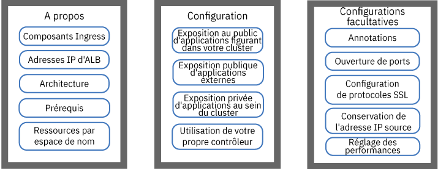
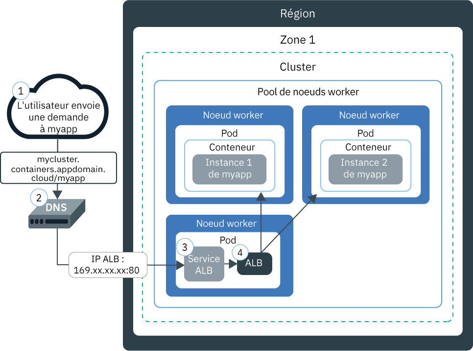
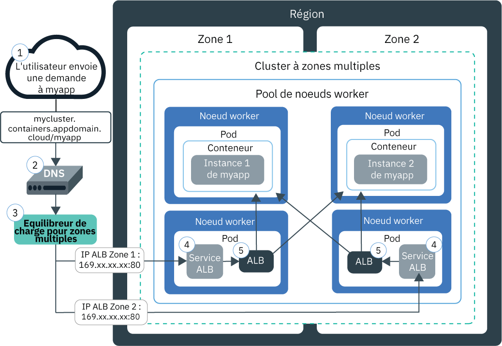
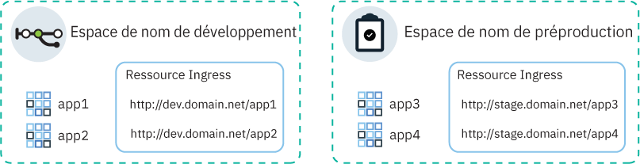
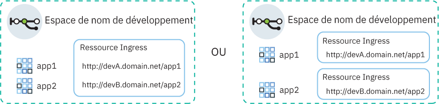

---

copyright:
  years: 2014, 2019
lastupdated: "2019-06-12"

keywords: kubernetes, iks, nginx, ingress controller

subcollection: containers

---

{:new_window: target="_blank"}
{:shortdesc: .shortdesc}
{:screen: .screen}
{:pre: .pre}
{:table: .aria-labeledby="caption"}
{:codeblock: .codeblock}
{:tip: .tip}
{:note: .note}
{:important: .important}
{:deprecated: .deprecated}
{:download: .download}
{:preview: .preview}


# Equilibrage de charge HTTPS avec des équilibreurs de charge d'application Ingress
{: #ingress}

Vous pouvez exposer plusieurs applications dans votre cluster Kubernetes en créant des ressources Ingress gérées par l'équilibreur de charge d'application (ALB) fourni par IBM dans {{site.data.keyword.containerlong}}.
{:shortdesc}



<map name="image-map">
    <area target="" alt="Composants Ingress" title="Composants Ingress" href="#ingress_components" coords="28,42,172,69" shape="rect">
    <area target="" alt="Adresses IP d'ALB" title="Adresses IP d'ALB" href="#ips" coords="27,79,171,104" shape="rect">
    <area target="" alt="Architecture" title="Architecture" href="#architecture-single" coords="31,114,171,140" shape="rect">
    <area target="" alt="Prérequis" title="Prérequis" href="#config_prereqs" coords="28,151,171,176" shape="rect">
    <area target="" alt="Planification réseau pour un ou plusieurs espaces de nom" title="Planification réseau pour un ou plusieurs espaces de nom" href="#multiple_namespaces" coords="31,191,172,229" shape="rect">
    <area target="" alt="Exposition au public d'applications figurant dans votre cluster" title="Exposition au public d'applications figurant dans votre cluster" href="#ingress_expose_public" coords="275,43,418,78" shape="rect">
    <area target="" alt="Exposition au public d'applications résidant hors de votre cluster" title="Exposition au public d'applications résidant hors de votre cluster" href="#external_endpoint" coords="275,94,419,128" shape="rect">
    <area target="" alt="Exposition d'applications sur un réseau privé" title="Exposition d'applications sur un réseau privé" href="#ingress_expose_private" coords="277,141,418,177" shape="rect">
    <area target="" alt="Utilisation de votre propre contrôleur Ingress" title="Utilisation de votre propre contrôleur Ingress" href="#user_managed" coords="278,192,416,228" shape="rect">
    <area target="" alt="Personnalisation d'une ressource Ingress avec des annotations" title="Personnalisation d'une ressource Ingress avec des annotations" href="#annotations" coords="523,44,670,73" shape="rect">
    <area target="" alt="Ouverture de ports dans l'équilibreur de charge d'application (ALB) Ingress" title="Ouverture de ports dans l'équilibreur de charge d'application (ALB) Ingress" href="#opening_ingress_ports" coords="521,83,669,105" shape="rect">
    <area target="" alt="Configuration de protocoles et de chiffrements SSL au niveau HTTP" title="Configuration de protocoles et de chiffrements SSL au niveau HTTP" href="#ssl_protocols_ciphers" coords="523,116,669,158" shape="rect">
    <area target="" alt="Conservation de l'adresse IP source" title="Conservation de l'adresse IP source" href="#preserve_source_ip" coords="522,167,671,202" shape="rect">
    <area target="" alt="Optimisation des performances de l'équilibreur de charge d'application (ALB)" title="Optimisation des performances de l'équilibreur de charge d'application (ALB)" href="#perf_tuning" coords="524,213,669,237" shape="rect">
</map>

## Exemples de fichiers YAML
{: #sample_ingress}

Utilisez ces exemples de fichiers YAML pour commencer rapidement par spécifier votre ressource Ingress.
{: shortdesc}

**Ressource Ingress pour exposer une application au public**</br>

Avez-vous déjà effectué les opérations suivantes ?
- Déployer une application
- Créer un service d'application
- Sélectionner un nom de domaine et une valeur confidentielle (secret) TLS

Vous pouvez utiliser le fichier YAML de déploiement suivant pour créer une ressource Ingress :

```
apiVersion: extensions/v1beta1
kind: Ingress
metadata:
  name: myingressresource
spec:
  tls:
  - hosts:
    - <domain>
    secretName: <tls_secret_name>
  rules:
  - host: <domain>
    http:
      paths:
      - path: /<app1_path>
        backend:
          serviceName: <app1_service>
          servicePort: 80
      - path: /<app2_path>
        backend:
          serviceName: <app2_service>
          servicePort: 80
```
{: codeblock}

</br>

**Ressource Ingress pour exposer une application en privé**</br>

Avez-vous déjà effectué les opérations suivantes ?
- Activer un équilibreur de charge d'application (ALB) privé
- Déployer une application
- Créer un service d'application
- Enregistrer un nom de domaine personnalisé et une valeur confidentielle (secret) TLS

Vous pouvez utiliser le fichier YAML de déploiement suivant pour créer une ressource Ingress :

```
apiVersion: extensions/v1beta1
kind: Ingress
metadata:
  name: myingressresource
  annotations:
    ingress.bluemix.net/ALB-ID: "<private_ALB_ID_1>;<private_ALB_ID_2>"
spec:
  tls:
  - hosts:
    - <domain>
    secretName: <tls_secret_name>
  rules:
  - host: <domain>
    http:
      paths:
      - path: /<app1_path>
        backend:
          serviceName: <app1_service>
          servicePort: 80
      - path: /<app2_path>
        backend:
          serviceName: <app2_service>
          servicePort: 80
```
{: codeblock}

<br />


## Qu'est-ce qu'Ingress ?
{: #planning}

Ingress est un service Kubernetes qui permet d'équilibrer les charges de travail du trafic réseau dans votre cluster en transférant des demandes publiques ou privées à vos applications. Vous pouvez utiliser Ingress pour exposer plusieurs services d'application sur un réseau public ou privé en utilisant une seule route publique ou privée.
{:shortdesc}

### Quels sont les composants fournis avec Ingress ?
{: #ingress_components}

Ingress comporte trois composants :
<dl>
<dt>Ressource Ingress</dt>
<dd>Pour exposer une application à l'aide d'Ingress, vous devez créer un service Kubernetes pour votre application et enregistrer ce service auprès d'Ingress en définissant une ressource Ingress. La ressource Ingress est une ressource Kubernetes qui définit les règles de routage des demandes entrantes pour les applications. Elle spécifie également le chemin d'accès à vos services d'application, qui sont ajoutés à la route publique pour composer une URL d'application unique, telle que `mycluster.us-south.containers.appdomain.cloud/myapp1`.<p class="note">A partir du 24 mai 2018, le format du sous-domaine Ingress a changé pour les nouveaux clusters. Le nom de la région ou de la zone inclus dans le nouveau format de sous-domaine est généré en fonction de la zone dans laquelle a été créé le cluster. Si vous avez des dépendances de pipeline sur des noms de domaine d'application cohérents, vous pouvez utiliser vos propres domaines personnalisés à la place du sous-domaine Ingress fourni par IBM.<ul><li>A tous les clusters créés après le 24 mai 2018 est affecté un sous-domaine au nouveau format, <code>&lt;cluster_name&gt;.&lt;region_or_zone&gt;.containers.appdomain.cloud</code>.</li><li>Les clusters à zone unique créés avant le 24 mai continuent à utiliser le sous-domaine affecté dans l'ancien format, <code>&lt;cluster_name&gt;.&lt;region&gt;.containers.mybluemix.net</code>.</li><li>Si vous remplacez un cluster à zone unique créé avant le 24 mai 2018 par un cluster à zones multiples en [ajoutant une zone au cluster](/docs/containers?topic=containers-add_workers#add_zone) pour la première fois, le cluster continue à utiliser le sous-domaine affecté dans l'ancien format,
<code>&lt;cluster_name&gt;.&lt;region&gt;.containers.mybluemix.net</code> et un sous-domaine au nouveau format lui est affecté, <code>&lt;cluster_name&gt;.&lt;region_or_zone&gt;.containers.appdomain.cloud</code>. Vous pouvez utiliser l'un ou l'autre de ces sous-domaines.</li></ul></p>**Clusters à zones multiples** : la ressource Ingress est globale, et une seule ressource Ingress est requise par espace de nom pour un cluster à zones multiples.</dd>
<dt>Equilibreur de charge d'application (ALB)</dt>
<dd>L'équilibreur de charge d'application (ALB) est un équilibreur de charge externe qui est à l'écoute des demandes de service HTTP, HTTPS ou TCP entrantes. L'ALB transfère ensuite les demandes au pod d'application approprié suivant les règles définies dans la ressource Ingress. Lorsque vous créez un cluster standard, {{site.data.keyword.containerlong_notm}} crée automatiquement un ALB à haute disponibilité pour votre cluster et lui affecte une route publique unique. La route publique est liée à une adresse IP publique portable allouée à votre compte d'infrastructure IBM Cloud (SoftLayer) lors de la création du cluster. Un équilibreur de charge ALB privé par défaut est également créé automatiquement, mais n'est pas activé automatiquement.<br></br>**Clusters à zones multiples** : lorsque vous ajoutez une zone dans votre cluster, un sous-réseau public portable est ajouté et un nouvel équilibreur de charge ALB est automatiquement créé et activé sur le sous-réseau dans cette zone. Tous les ALB publics par défaut dans votre cluster partagent une route publique mais ont des adresses IP distinctes. Un ALB privé par défaut est créé automatiquement dans chaque zone mais il n'est pas activé automatiquement.</dd>
<dt>Equilibreur de charge pour zones multiples (MZLB)</dt>
<dd><p>**Clusters à zones multiples** : dès que vous créez un cluster à zones multiples ou que vous [ajoutez une zone à un cluster à zone unique](/docs/containers?topic=containers-add_workers#add_zone), un équilibreur de charge pour zones multiples (MZLB) Cloudflare est automatiquement créé et déployé de sorte à avoir 1 équilibreur de charge MZLB pour chaque région. L'équilibreur de charge MZLB place les adresses IP de vos équilibreurs de charge d'application (ALB) derrière le même sous-domaine et active des diagnostics d'intégrité sur ces adresses IP pour déterminer si elles sont disponibles ou pas. Par exemple, si vous disposez de noeuds worker dans 3 zones dans la région Est des Etats-Unis, le sous-domaine `yourcluster.us-east.containers.appdomain.cloud` comporte 3 adresses IP d'ALB. L'équilibreur de charge MZLB réalise des diagnostics d'intégrité de l'adresse IP ALB publique dans chaque zone d'une région et conserve les résultats de recherche DNS à jour en fonction de ces diagnostics. Par exemple, si vos ALB ont les adresses IP `1.1.1.1`, `2.2.2.2` et `3.3.3.3`, une opération normale de recherche DNS de votre sous-domaine Ingress renvoie ces trois adresses IP, dont 1 est accessible au client de manière aléatoire. Si l'ALB avec l'adresse IP `3.3.3.3` devient indisponible pour une raison quelconque, par exemple en cas de défaillance d'une zone, le diagnostic d'intégrité correspondant à cette zone échoue, l'équilibreur de charge MZLB retire du sous-domaine l'adresse IP ayant échoué et la recherche de DNS renvoie uniquement les adresses IP d'ALB `1.1.1.1` et `2.2.2.2` qui sont saines. Le sous-domaine dispose d'une durée de vie (TTL) de 30 secondes. Au bout de 30 secondes, les nouvelles applications client peuvent accéder à une seule des adresses IP d'ALB saines.</p><p>Dans de rares cas, certaines résolutions DNS ou applications client peuvent continuer à utiliser l'adresse IP d'ALB qui n'est pas saine après la durée de vie de 30 secondes. Ces applications client peuvent expérimenter une longue durée de chargement tant que le client n'abandonne pas l'adresse IP `3.3.3.3` pour tenter de se connecter à  l'adresse IP `1.1.1.1` ou `2.2.2.2`. En fonction du navigateur client ou des paramètres de l'application client, le délai peut varier de quelques secondes à la totalité du délai d'attente TCP.</p>
<p>L'équilibreur de charge MZLB équilibre les charges des ALB publics utilisant uniquement le sous-domaine Ingress fourni par IBM. Si vous n'utilisez que des ALB privés, vous devez vérifier manuellement l'intégrité de vos ALB et mettre à jour les résultats de recherche DNS. Si vous avez recours à des ALB publics utilisant un domaine personnalisé, vous pouvez inclure ces ALB dans l'équilibrage de charge du MZLB en créant un enregistrement CNAME dans votre entrée DNS pour transférer les demandes de votre domaine personnalisé au sous-domaine Ingress fourni par IBM pour votre cluster.</p>
<p class="note">Si vous utilisez les règles réseau pre-DNAT de Calico pour bloquer tout le trafic entrant vers les services Ingress, vous devez également inclure dans la liste blanche les <a href="https://www.cloudflare.com/ips/">adresses IP IPV4 de Cloudflare  </a> utilisées pour effectuer des diagnostics d'intégrité de vos ALB. Pour obtenir les étapes nécessaires permettant de créer une règle pre-DAT Calico pour mettre ces adresses IP sur liste blanche, voir la leçon 3 du <a href="/docs/containers?topic=containers-policy_tutorial#lesson3">Tutoriel sur les règles réseau de Calico</a>.</p></dd>
</dl>

### Comment sont affectées les adresses IP dans les ALB Ingress ?
{: #ips}

Lorsque vous créez un cluster standard, un sous-réseau public portable et un sous-réseau privé portable sont fournis automatiquement par {{site.data.keyword.containerlong_notm}}. Par défaut, le cluster utilise automatiquement :
* 1 adresse IP publique portable du sous-réseau public portable correspondant à l'ALB Ingress public par défaut.
* 1 adresse IP privée portable du sous-réseau privé portable correspondant à l'ALB Ingress privé par défaut.
{: shortdesc}

Si vous disposez d'un cluster à zones multiples, un ALB public par défaut et un ALB privé par défaut sont automatiquement créés dans chaque zone. Toutes les adresses IP de vos ALB publics par défaut se trouvent derrière le même sous-domaine fourni par IBM pour votre cluster.

Les adresses IP publiques et privées portables sont des adresses IP flottantes statiques et ne changent pas en cas de retrait d'un noeud worker. Si le noeud worker est retiré,  un démon `Keepalived` contrôlant l'adresse IP en permanence, replanifie les pods d'ALB qui résidaient sur ce noeud worker dans un autre noeud worker figurant dans cette zone. Les pods d'ALB replanifiés conservent la même adresse IP statique. Pendant la durée de vie de votre cluster, l'adresse IP d'ALB dans chaque zone ne change pas. Si vous retirez une zone de votre cluster, l'adresse IP d'ALB de cette zone est retirée.

Pour voir les adresses IP affectées à vos ALB, vous pouvez exécuter la commande suivante.
```
ibmcloud ks albs --cluster <cluster_name_or_id>
```
{: pre}

Pour plus d'informations sur ce qui arrive aux adresses IP d'ALB en cas de défaillance d'une zone, voir la définition du [composant d'équilibreur de charge pour zones multiples](#ingress_components).


### Comment une demande accède à mon application avec Ingress dans un cluster à zone unique ?
{: #architecture-single}


Le diagramme suivant illustre comment Ingress dirige la communication d'Internet vers une application dans un cluster à zone unique :



1. Un utilisateur envoie une demande à votre application en accédant à l'URL de votre application. Il s'agit de l'URL publique de votre application exposée avec le chemin de la ressource Ingress ajouté à la suite, par exemple `mycluster.us-south.containers.appdomain.cloud/myapp`.

2. Un service système DNS résout le sous-domaine dans l'URL avec une adresse IP publique portable de l'équilibreur de charge qui expose l'ALB dans votre cluster.

3. En fonction de l'adresse IP résolue, le client envoie une demande au service d'équilibreur de charge qui expose l'ALB.

4. Le service d'équilibreur de charge achemine la demande à l'ALB.

5. L'équilibreur de charge ALB vérifie s'il existe une règle de routage pour le chemin `myapp` dans le cluster. Si une règle correspondante est trouvée, la demande est transmise en fonction des règles que vous avez définies dans la ressource Ingress au pod sur lequel est déployée l'application. L'adresse IP source du package est remplacée par l'adresse IP publique du noeud worker sur lequel s'exécute le pod d'application. Si plusieurs instances sont déployées dans le cluster, l'équilibreur de charge ALB équilibre les demandes entre les pods d'application.

### Comment une demande accède à  mon application avec Ingress dans un cluster à zones multiples ?
{: #architecture-multi}

Le diagramme suivant illustre comment Ingress dirige la communication d'Internet vers une application dans un cluster à zones multiples :



1. Un utilisateur envoie une demande à votre application en accédant à l'URL de votre application. Il s'agit de l'URL publique de votre application exposée avec le chemin de la ressource Ingress ajouté à la suite, par exemple `mycluster.us-south.containers.appdomain.cloud/myapp`.

2. Un service système DNS, qui fait office d'équilibreur de charge global, résout le sous-domaine dans l'URL avec une adresse IP disponible qui a été signalée comme saine par l'équilibreur de charge MZLB. Le MZLB vérifie en continu les adresses IP publiques portables des services d'équilibreur de charge qui exposent des ALB publics dans chaque zone de votre cluster. Les adresses IP sont résolues à tour de rôle, garantissant ainsi que les demandes sont équilibrées de manière égale parmi les ALB sains figurant dans les différentes zones.

3. Le client envoie la demande à l'adresse IP du service d'équilibreur de charge qui expose un ALB.

4. Le service d'équilibreur de charge achemine la demande à l'ALB.

5. L'équilibreur de charge ALB vérifie s'il existe une règle de routage pour le chemin `myapp` dans le cluster. Si une règle correspondante est trouvée, la demande est transmise en fonction des règles que vous avez définies dans la ressource Ingress au pod sur lequel est déployée l'application. L'adresse IP source du package est remplacée par l'adresse IP publique du noeud worker sur lequel s'exécute le pod d'application. Si plusieurs instances sont déployées dans le cluster, l'équilibreur de charge ALB équilibre les demandes entre les pods d'application sur toutes les zones.

<br />


## Conditions prérequises
{: #config_prereqs}

Avant d'utiliser Ingress, consultez les prérequis suivants.
{:shortdesc}

**Prérequis pour toutes les configurations Ingress :**
- Ingress n'est disponible que pour les clusters standard et nécessite au moins deux noeuds worker par zone pour garantir une haute disponibilité et l'application régulière de mises à jour. Si vous n'avez qu'un seul noeud worker dans une zone, l'ALB ne peut pas recevoir de mises à jour automatiques. Lorsque des mises à jour automatiques sont déployées sur des pods d'ALB, ces pods sont rechargés. Toutefois, les pods d'ALB ont des règles d'anti-affinité pour garantir qu'il n'y a qu'un seul pod planifié sur chaque noeud worker pour la haute disponibilité. Ainsi, le pod n'est pas redémarré et le trafic n'est pas interrompu. Le pod d'ALB est mis à jour vers la dernière version, uniquement lorsque vous supprimez l'ancien pod manuellement de sorte que le nouveau pod mis à jour puisse être planifié.
- La configuration d'Ingress nécessite les [rôles {{site.data.keyword.Bluemix_notm}} IAM](/docs/containers?topic=containers-users#platform) suivants :
    - Rôle de plateforme **Administrateur** pour le cluster
    - Rôle de service **Responsable** dans tous les espaces de nom

**Prérequis pour utiliser Ingress dans les clusters à zones multiples** :
 - Si vous limitez le trafic réseau aux [noeuds worker de périphérie](/docs/containers?topic=containers-edge), au moins 2 noeuds worker de périphérie doivent être activés dans chaque zone pour assurer la haute disponibilité des pods Ingress. [Créez un pool de noeuds worker de périphérie](/docs/containers?topic=containers-add_workers#add_pool) couvrant toutes les zones de votre cluster et comportant au moins 2 noeuds worker par zone.
 - Si vous disposez de plusieurs VLAN pour un cluster, de plusieurs sous-réseaux sur le même VLAN ou d'un cluster à zones multiples, vous devez activer une fonction [VRF (Virtual Router Function)](/docs/infrastructure/direct-link?topic=direct-link-overview-of-virtual-routing-and-forwarding-vrf-on-ibm-cloud#overview-of-virtual-routing-and-forwarding-vrf-on-ibm-cloud) pour votre compte d'infrastructure IBM Cloud (SoftLayer) pour que vos noeuds worker puissent communiquer entre eux sur le réseau privé. Pour activer la fonction VRF, [contactez le représentant de votre compte d'infrastructure IBM Cloud (SoftLayer)](/docs/infrastructure/direct-link?topic=direct-link-overview-of-virtual-routing-and-forwarding-vrf-on-ibm-cloud#how-you-can-initiate-the-conversion). Si vous ne parvenez pas à activer la fonction VRF ou si vous ne souhaitez pas le faire, activez la fonction [Spanning VLAN](/docs/infrastructure/vlans?topic=vlans-vlan-spanning#vlan-spanning). Pour effectuer cette action, vous devez disposer du [droit d'infrastructure](/docs/containers?topic=containers-users#infra_access) **Réseau > Gérer le spanning VLAN pour réseau**, ou vous pouvez demander au propriétaire du compte de l'activer. Pour vérifier si le spanning VLAN est déjà activé, utilisez la [commande](/docs/containers?topic=containers-cli-plugin-kubernetes-service-cli#cs_vlan_spanning_get) `ibmcloud ks vlan-spanning-get --region <region>`. 
 - En cas d'échec d'une zone, vous pourrez constater des défaillances intermittentes au niveau des demandes adressées à l'ALB Ingress dans cette zone.

<br />


## Planification réseau pour un ou plusieurs espaces de nom
{: #multiple_namespaces}

Une ressource Ingress est requise pour chaque espace de nom hébergeant les applications que vous souhaitez exposer.
{:shortdesc}

### Toutes les applications se trouvent dans un espace de nom
{: #one-ns}

Si les applications de votre cluster figurent toutes dans le même espace de nom, une ressource Ingress est requise pour définir les règles de routage pour les applications exposées à cet endroit. Par exemple, si les applications `app1` et `app2` sont exposées par des services dans un espace de nom de développement, vous pouvez créer une ressource Ingress dans cet espace de nom. La ressource indique `domain.net` comme hôte et enregistre les chemins où chaque application est à l'écoute avec `domain.net`.
{: shortdesc}


### Les applications se trouvent dans plusieurs espaces de nom
{: #multi-ns}

Si les applications de votre cluster figurent dans différents espaces de nom, vous devez créer une ressource par espace de nom pour définir les règles des applications exposées à cet endroit.
{: shortdesc}

Vous ne pouvez toutefois définir un nom d'hôte que dans une seule ressource. Vous ne pouvez pas définir le même nom d'hôte dans plusieurs ressources. Pour enregistrer plusieurs ressources Ingress avec le même nom d'hôte, vous devez utiliser un domaine générique. Lorsqu'un domaine générique, tel que `*.domain.net` est enregistré, plusieurs sous-domaines peuvent tous être résolus avec le même hôte. Ensuite, vous pouvez créer une ressource Ingress dans chaque espace de nom et spécifier un sous-domaine différent dans chaque ressource Ingress.

Vous pouvez par exemple, envisager le scénario suivant :
* Vous disposez de deux versions de la même application, `app1` et `app3`, à des fins de test.
* Vous déployez les applications dans deux espaces de nom différents au sein du même cluster : `app1` dans l'espace de nom de développement et `app3` dans l'espace de nom de préproduction.

Pour utiliser le même équilibreur de charge ALB du cluster pour gérer le trafic vers ces applications, vous créez les ressources et services suivants :
* Un service Kubernetes dans votre espace de nom de développement pour exposer `app1`.
* Une ressource Ingress dans l'espace de nom de développement qui spécifie l'hôte sous la forme `dev.domain.net`.
* Un service Kubernetes dans l'espace de nom de préproduction pour exposer `app3`.
* Une ressource Ingress dans l'espace de nom de préproduction qui spécifie l'hôte sous la forme `stage.domain.net`.
</br>



Désormais, les deux URL sont résolues avec le même domaine et sont donc traitées par le même équilibreur de charge ALB. Cependant, comme la ressource dans l'espace de nom de préproduction est enregistrée avec le sous-domaine `stage`, l'équilibreur de charge ALB Ingress achemine correctement les demandes de l'URL `stage.domain.net/app3` uniquement vers `app3`.

{: #wildcard_tls}
Le sous-domaine générique Ingress fourni par IBM, `*.<cluster_name>.<region>.containers.appdomain.cloud`, est enregistré par défaut pour votre cluster. Le certificat TLS fourni par IBM est un certificat générique pouvant être utilisé pour le sous-domaine générique. Pour utiliser un domaine personnalisé, vous devez enregistrer le domaine personnalisé en tant que domaine générique, par exemple : `*.custom_domain.net`. Pour utiliser TLS, vous devez obtenir un certificat générique.
{: note}

### Plusieurs domaines au sein d'un espace de nom
{: #multi-domains}

Dans un espace de nom individuel, vous pouvez utiliser un domaine pour accéder à toutes les applications dans l'espace de nom. Si vous souhaitez utiliser différents domaines pour les applications figurant dans un espace de nom, utilisez un domaine générique. Lorsqu'un domaine générique, tel que `*.mycluster.us-south.containers.appdomain.cloud` est enregistré, plusieurs sous-domaines sont résolus avec le même hôte. Vous pouvez ensuite utiliser une ressource pour spécifier plusieurs hôtes de sous-domaines multiples dans cette ressource. Autrement, vous pouvez créer plusieurs ressources Ingress dans l'espace de nom et indiquer un sous-domaine différent dans chaque ressource Ingress.
{: shortdesc}



Le sous-domaine générique Ingress fourni par IBM, `*.<cluster_name>.<region>.containers.appdomain.cloud`, est enregistré par défaut pour votre cluster. Le certificat TLS fourni par IBM est un certificat générique pouvant être utilisé pour le sous-domaine générique. Pour utiliser un domaine personnalisé, vous devez enregistrer le domaine personnalisé en tant que domaine générique, par exemple : `*.custom_domain.net`. Pour utiliser TLS, vous devez obtenir un certificat générique.
{: note}

<br />


## Exposition au public d'applications figurant dans votre cluster
{: #ingress_expose_public}

Exposez les applications figurant dans votre cluster au public à l'aide de l'équilibreur de charge d'application (ALB) Ingress public.
{:shortdesc}

Avant de commencer :

* Consultez les [Prérequis](#config_prereqs) d'Ingress.
* [Connectez-vous à votre compte. Le cas échéant, ciblez le groupe de ressources approprié. Définissez le contexte pour votre cluster.](/docs/containers?topic=containers-cs_cli_install#cs_cli_configure)

### Etape 1 : Déployez des applications et créez des services d'application
{: #public_inside_1}

Commencez par déployer vos applications et créer des services Kubernetes pour les exposer.
{: shortdesc}

1.  [Déployez votre application sur le cluster](/docs/containers?topic=containers-app#app_cli). Prenez soin d'ajouter un libellé à votre déploiement dans la section "metadata" de votre fichier de configuration, par exemple `app: code`. Ce libellé est nécessaire pour identifier tous les pods dans lesquels s'exécute votre application afin de pouvoir inclure ces pods dans l'équilibrage de charge Ingress.

2.   Créez un service Kubernetes pour chaque application que vous désirez exposer. Votre application doit être exposée par un service Kubernetes pour que l'équilibreur de charge ALB du cluster puisse l'inclure dans l'équilibrage de charge Ingress.
      1.  Ouvrez l'éditeur de votre choix et créez un fichier de configuration de service nommé, par exemple, `myappservice.yaml`.
      2.  Définissez un service pour l'application qu'exposera l'équilibreur de charge ALB.

          ```
          apiVersion: v1
          kind: Service
          metadata:
            name: myappservice
          spec:
            selector:
              <selector_key>: <selector_value>
            ports:
             - protocol: TCP
               port: 8080
          ```
          {: codeblock}

          <table>
          <thead>
          <th colspan=2> Description des composants du fichier YAML du service ALB</th>
          </thead>
          <tbody>
          <tr>
          <td><code>selector</code></td>
          <td>Entrez la paire clé de libellé (<em>&lt;selector_key&gt;</em>) et valeur (<em>&lt;selector_value&gt;</em>) que vous désirez utiliser pour cibler les pods dans lesquels s'exécute votre application. Pour cibler vos pods et les inclure dans l'équilibrage de charge du service, assurez-vous que <em>&lt;selector_key&gt;</em> et <em>&lt;selector_value&gt;</em> sont identiques à la paire clé/valeur dans la section <code>spec.template.metadata.labels</code> du fichier YAML de déploiement.</td>
           </tr>
           <tr>
           <td><code>port</code></td>
           <td>Port sur lequel le service est à l'écoute.</td>
           </tr>
           </tbody></table>
      3.  Sauvegardez vos modifications.
      4.  Créez le service dans votre cluster. Si les applications sont déployées dans plusieurs espaces de nom dans votre cluster, vérifiez que le service se déploie dans le même espace de nom que l'application que vous souhaitez exposer.

          ```
          kubectl apply -f myappservice.yaml [-n <namespace>]
          ```
          {: pre}
      5.  Répétez ces étapes pour chaque application que vous désirez exposer.


### Etape 2 : Sélectionnez un domaine d'application
{: #public_inside_2}

Lorsque vous configurez l'équilibreur de charge d'application (ALB) public, vous choisissez le domaine via lequel vos applications seront accessibles.
{: shortdesc}

Vous pouvez utiliser le domaine fourni par IBM, par exemple `mycluster-12345.us-south.containers.appdomain.cloud/myapp`, pour accéder à votre application sur Internet. Pour utiliser un domaine personnalisé à la place, vous pouvez configurer un enregistrement CNAME pour mapper votre domaine personnalisé au domaine fourni par IBM ou configurer un enregistrement A avec votre fournisseur de DNS en utilisant l'adresse IP publique de l'équilibreur de charge ALB.

**Pour utiliser le domaine Ingress fourni par IBM :**

Obtenez le domaine fourni par IBM. Remplacez `<cluster_name_or_ID>` par le nom du cluster sur lequel l'application est déployée.
```
ibmcloud ks cluster-get --cluster <cluster_name_or_ID> | grep Ingress
```
{: pre}

Exemple de sortie :
```
Ingress Subdomain:      mycluster-12345.us-south.containers.appdomain.cloud
Ingress Secret:         <tls_secret>
```
{: screen}

**Pour utiliser un domaine personnalisé :**
1.    Créez un domaine personnalisé. Pour enregistrer votre domaine personnalisé, travaillez en collaboration avec votre fournisseur de DNS (Domain Name Service) ou [{{site.data.keyword.Bluemix_notm}} DNS](/docs/infrastructure/dns?topic=dns-getting-started).
      * Si les applications que vous souhaitez exposer via Ingress se trouvent dans différents espaces de nom sur un cluster, enregistrez le domaine personnalisé en tant que domaine générique, par exemple `*.custom_domain.net`.

2.  Configurez votre domaine pour acheminer le trafic réseau entrant à l'équilibreur de charge ALB fourni par IBM. Sélectionnez l'une des options suivantes :
    -   Définir un alias pour votre domaine personnalisé en spécifiant le domaine fourni par IBM sous forme d'enregistrement de nom canonique (CNAME). Pour identifier le domaine Ingress fourni par IBM, exécutez la commande `ibmcloud ks cluster-get --cluster <cluster_name>` et recherchez la zone **Sous-domaine Ingress**. L'utilisation de CNAME est privilégiée car IBM fournit des diagnostics d'intégrité automatiques sur le sous-domaine IBM et retire toutes les adresses IP défaillantes dans la réponse DNS.
    -   Mapper votre domaine personnalisé à l'adresse IP publique portable de l'équilibreur de charge ALB fourni par IBM en ajoutant l'adresse IP en tant qu'enregistrement. Pour identifier l'adresse IP publique portable de l'équilibreur de charge d'application, exécutez la commande `ibmcloud ks alb-get --albID  <public_alb_ID>`. 

### Etape 3 : Sélectionnez une terminaison TLS
{: #public_inside_3}

Après avoir choisi le domaine de l'application, vous déterminez s'il faut utiliser une terminaison TLS.
{: shortdesc}

L'équilibreur de charge ALB équilibre la charge du trafic réseau HTTP vers les applications de votre cluster. Pour équilibrer la charge des connexions HTTPS entrantes, vous pouvez configurer l'équilibreur de charge ALB pour déchiffrer le trafic réseau et transférer la demande déchiffrée aux applications exposées dans votre cluster.

* Si vous utilisez le sous-domaine Ingress fourni par IBM, vous pouvez utiliser le certificat TLS fourni par IBM. Les certificats TLS fournis par IBM sont signés par LetsEncrypt et sont entièrement gérés par IBM. Ces certificats arrivent à expiration tous les 90 jours et sont automatiquement renouvelés 37 jours avant leur date d'expiration. Pour plus d'informations sur la certification TLS générique, voir [cette remarque](#wildcard_tls).
* Si vous utilisez un domaine personnalisé, vous pouvez utiliser votre propre certificat TLS pour gérer la terminaison TLS. L'ALB recherche d'abord une valeur confidentielle dans l'espace de nom où se trouve l'application, puis dans l'espace de nom `default` et pour finir dans `ibm-cert-store`. Si vos applications figurent dans un seul domaine, vous pouvez importer ou créer une valeur confidentielle (secret) TLS  pour le certificat dans ce même espace de nom. Si vos applications sont réparties sur plusieurs espaces de nom, importez ou créez une valeur confidentielle TLS pour le certificat dans l'espace de nom `default` de sorte que l'équilibreur de charge ALB puisse accéder au certificat et l'utiliser dans tous les espaces de nom. Dans les ressources Ingress que vous définissez pour chaque espace de nom, indiquez le nom de la valeur confidentielle (secret) qui figure dans l'espace de nom par défaut. Pour plus d'informations sur la certification TLS générique, voir [cette remarque](#wildcard_tls). **Remarque** : les certificats TLS qui contiennent des clés pré-partagées (TLS-PSK) ne sont pas pris en charge.

**Si vous utilisez le domaine Ingress fourni par IBM :**

Obtenez la valeur confidentielle TLS fournie par IBM pour votre cluster.
```
ibmcloud ks cluster-get --cluster <cluster_name_or_ID> | grep Ingress
```
{: pre}

Exemple de sortie :
```
Ingress Subdomain:      mycluster-12345.us-south.containers.appdomain.cloud
Ingress Secret:         <tls_secret>
```
{: screen}
</br>

**Si vous utilisez un domaine personnalisé :**

Si un certificat TLS que vous désirez utiliser est stocké dans {{site.data.keyword.cloudcerts_long_notm}}, vous pouvez importer sa valeur confidentielle associée dans votre cluster en exécutant la commande suivante :

```
ibmcloud ks alb-cert-deploy --secret-name <secret_name> --cluster <cluster_name_or_ID> --cert-crn <certificate_crn>
```
{: pre}

Vérifiez que vous n'avez pas créé une valeur confidentielle ayant le même nom que la valeur confidentielle d'Ingress fournie par IBM. Vous pouvez obtenir le nom de la valeur confidentielle Ingress fournie par IBM en exécutant la commande `ibmcloud ks cluster-get --cluster <cluster_name_or_ID> | grep Ingress`.
{: note}

Lorsque vous importez un certificat avec cette commande, la valeur de secret du certificat est créée dans un espace de nom nommé `ibm-cert-store`. La référence à ce secret est ensuite créée dans l'espace de nom `default`, accessible à n'importe quelle ressource Ingress d'un espace de nom. Lorsque l'équilibreur de charge d'application traite les demandes, il suit cette référence pour récupérer et utiliser cette valeur de secret du certificat depuis l'espace de nom `ibm-cert-store`.

</br>

Si vous ne disposez pas de certificat TLS, procédez comme suit :
1. Procurez-vous un certificat d'autorité de certification et une clé auprès de votre fournisseur de certificat. Si vous disposez de votre propre domaine, achetez un certificat TLS officiel pour votre domaine. Vérifiez que l'élément [CN ](https://support.dnsimple.com/articles/what-is-common-name/) est différent pour chaque certificat.
2. Convertissez le certificat et la clé en base 64.
   1. Codez le certificat et la clé en base 64 et sauvegardez la valeur codée en base 64 dans un nouveau fichier.
      ```
      openssl base64 -in tls.key -out tls.key.base64
      ```
      {: pre}

   2. Affichez la valeur codée en base 64 pour votre certificat et votre clé.
      ```
      cat tls.key.base64
      ```
      {: pre}

3. Créez un fichier de valeur confidentielle YAML en utilisant le certificat et la clé.
     ```
     apiVersion: v1
     kind: Secret
     metadata:
       name: ssl-my-test
     type: Opaque
     data:
       tls.crt: <client_certificate>
       tls.key: <client_key>
     ```
     {: codeblock}

4. Créez le certificat en tant que valeur confidentielle Kubernetes.
     ```
     kubectl create -f ssl-my-test
     ```
     {: pre}
     Vérifiez que vous n'avez pas créé une valeur confidentielle ayant le même nom que la valeur confidentielle d'Ingress fournie par IBM. Vous pouvez obtenir le nom de la valeur confidentielle Ingress fournie par IBM en exécutant la commande `ibmcloud ks cluster-get --cluster <cluster_name_or_ID> | grep Ingress`.
     {: note}


### Etape 4 : Créez la ressource Ingress
{: #public_inside_4}

Les ressources Ingress définissent les règles de routage utilisées par l'équilibreur de charge d'application (ALB) pour acheminer le trafic vers votre service d'application.
{: shortdesc}

Si votre cluster dispose de plusieurs espaces de nom dans lesquels sont exposées les applications, une ressource Ingress est requise par espace de nom. En revanche, chaque espace de nom doit utiliser un hôte différent. Vous devez enregistrer un domaine générique et indiquer un sous-domaine différent dans chaque ressource. Pour plus d'informations, voir [Planification réseau pour un ou plusieurs espaces de nom](#multiple_namespaces).
{: note}

1. Ouvrez l'éditeur de votre choix et créez un fichier de configuration Ingress nommé, par exemple, `myingressresource.yaml`.

2. Définissez dans votre fichier de configuration une ressource Ingress utilisant le domaine fourni par IBM ou votre domaine personnalisé pour acheminer le trafic réseau entrant aux services que vous avez créés auparavant.

    Exemple de fichier YAML n'utilisant pas TLS :
    ```
    apiVersion: extensions/v1beta1
    kind: Ingress
    metadata:
      name: myingressresource
    spec:
      rules:
      - host: <domain>
        http:
          paths:
          - path: /<app1_path>
            backend:
              serviceName: <app1_service>
              servicePort: 80
          - path: /<app2_path>
            backend:
              serviceName: <app2_service>
              servicePort: 80
    ```
    {: codeblock}

    Exemple de fichier YAML utilisant TLS :
    ```
    apiVersion: extensions/v1beta1
    kind: Ingress
    metadata:
      name: myingressresource
    spec:
      tls:
      - hosts:
        - <domain>
        secretName: <tls_secret_name>
      rules:
      - host: <domain>
        http:
          paths:
          - path: /<app1_path>
            backend:
              serviceName: <app1_service>
              servicePort: 80
          - path: /<app2_path>
            backend:
              serviceName: <app2_service>
              servicePort: 80
    ```
    {: codeblock}

    <table>
    <thead>
    <th colspan=2> Description des composants du fichier YAML</th>
    </thead>
    <tbody>
    <tr>
    <td><code>tls.hosts</code></td>
    <td>Pour utiliser TLS, remplacez <em>&lt;domain&gt;</em> par le sous-domaine Ingress fourni par IBM ou par votre domaine personnalisé.

    </br></br>
    <strong>Remarque :</strong><ul><li>Si vos applications sont exposées par des services dans différents espaces de nom, ajoutez un sous-domaine générique au début du domaine, par exemple `subdomain1.custom_domain.net` ou `subdomain1.mycluster.us-south.containers.appdomain.cloud`. Utilisez un sous-domaine unique pour chaque ressource que vous créez dans le cluster.</li><li>N'utilisez pas &ast; pour votre hôte ou laissez la propriété host vide pour éviter des erreurs lors de la création de la ressource Ingress.</li></ul></td>
    </tr>
    <tr>
    <td><code>tls.secretName</code></td>
    <td><ul><li>Si vous utilisez le domaine Ingress fourni par IBM, remplacez le nom de la valeur confidentielle TLS (<em>&lt;tls_secret_name&gt;</em>) par le nom de la valeur confidentielle Ingress (Ingress secret) fournie par IBM.</li><li>Si vous utilisez un domaine personnalisé, remplacez <em>&lt;tls_secret_name&gt;</em> par la valeur confidentielle que vous avez créée auparavant et qui contient votre certificat et votre clé TLS personnalisés. Si vous avez importé un certificat depuis {{site.data.keyword.cloudcerts_short}}, vous pouvez exécuter la commande <code>ibmcloud ks alb-cert-get --cluster <cluster_name_or_ID> --cert-crn <certificate_crn></code> pour examiner les valeurs confidentielles qui sont associées à un certificat TLS.</li><ul><td>
    </tr>
    <tr>
    <td><code>host</code></td>
    <td>Remplacez <em>&lt;domain&gt;</em> par le sous-domaine Ingress fourni par IBM ou par votre domaine personnalisé.

    </br></br>
    <strong>Remarque :</strong><ul><li>Si vos applications sont exposées par des services dans différents espaces de nom, ajoutez un sous-domaine générique au début du domaine, par exemple `subdomain1.custom_domain.net` ou `subdomain1.mycluster.us-south.containers.appdomain.cloud`. Utilisez un sous-domaine unique pour chaque ressource que vous créez dans le cluster.</li><li>N'utilisez pas &ast; pour votre hôte ou laissez la propriété host vide pour éviter des erreurs lors de la création de la ressource Ingress.</li></ul></td>
    </tr>
    <tr>
    <td><code>path</code></td>
    <td>Remplacez <em>&lt;app_path&gt;</em> par une barre oblique ou par le chemin sur lequel votre application est à l'écoute. Le chemin est ajouté au domaine fourni par IBM ou à votre domaine personnalisé de manière à créer une route unique vers votre application. Lorsque vous indiquez cette route dans un navigateur Web, le trafic réseau est acheminé vers l'équilibreur de charge ALB. L'équilibreur de charge ALB recherche le service associé et lui envoie le trafic réseau. Le service transfère ensuite le trafic aux pods sur lesquels s'exécute l'application.
    </br></br>
    De nombreuses applications ne sont pas à l'écoute sur un chemin spécifique mais utilisent le chemin racine et un port spécifique. Dans ce cas, définissez le chemin racine sous la forme <code>/</code>, sans spécifier de chemin individuel pour votre application. Exemples : <ul><li>Pour <code>http://domain/</code>, entrez <code>/</code> comme chemin.</li><li>Pour <code>http://domain/app1_path</code>, entrez <code>/app1_path</code> comme chemin.</li></ul>
    </br>
    <strong>Astuce :</strong> pour configurer Ingress pour qu'il soit à l'écoute sur un chemin différent de celui où votre application est à l'écoute, vous pouvez utiliser l'[annotation rewrite](/docs/containers?topic=containers-ingress_annotation#rewrite-path).</td>
    </tr>
    <tr>
    <td><code>serviceName</code></td>
    <td>Remplacez <em>&lt;app1_service&gt;</em> et <em>&lt;app2_service&gt;</em>, et ainsi de suite, par le nom des services que vous avez créés pour exposer vos applications. Si vos applications sont exposées par des services dans différents espaces de nom dans le cluster, incluez uniquement les services d'application figurant dans le même espace de nom. Vous devez créer une ressource Ingress pour chaque espace de nom contenant des applications que vous souhaitez exposer.</td>
    </tr>
    <tr>
    <td><code>servicePort</code></td>
    <td>Port sur lequel votre service est à l'écoute. Utilisez le même port que celui que vous avez défini lors de la création du service Kubernetes pour votre application.</td>
    </tr>
    </tbody></table>

3.  Créez la ressource Ingress pour votre cluster. Veillez à ce que la ressource se déploie dans le même espace de nom que les services d'application que vous avez spécifiés dans la ressource.

    ```
    kubectl apply -f myingressresource.yaml -n <namespace>
    ```
    {: pre}
4.   Vérifiez que la création de la ressource Ingress a abouti.

      ```
      kubectl describe ingress myingressresource
      ```
      {: pre}

      1. Si les messages compris dans les événements indiquent une erreur dans la configuration de votre ressource, modifiez les valeurs du fichier de votre ressource et réappliquez le fichier correspondant à la ressource.


Votre ressource Ingress est créée dans le même espace de nom que vos services d'application. Vos applications figurant dans cet espace de nom sont enregistrées avec l'équilibreur de charge ALB Ingress du cluster.

### Etape 5 : Accédez à votre application sur Internet
{: #public_inside_5}

Dans un navigateur Web, entrez l'URL du service d'application auquel accéder.
{: shortdesc}

```
https://<domain>/<app1_path>
```
{: codeblock}

Si vous exposez plusieurs applications, accédez à ces applications en modifiant le chemin ajouté à l'URL.

```
https://<domain>/<app2_path>
```
{: codeblock}

Si vous utilisez un domaine générique pour exposer des applications dans différents espaces de nom, accédez à ces applications avec leurs propres sous-domaines.

```
http://<subdomain1>.<domain>/<app1_path>
```
{: codeblock}

```
http://<subdomain2>.<domain>/<app1_path>
```
{: codeblock}


Vous rencontrez des difficultés pour connecter votre application via Ingress ? Essayez de [déboguer Ingress](/docs/containers?topic=containers-cs_troubleshoot_debug_ingress).
{: tip}

<br />


## Exposition au public d'applications résidant hors de votre cluster
{: #external_endpoint}

Exposez des applications résidant hors de votre cluster au public en les incluant dans l'équilibrage de charge de l'ALB Ingress public. Les demandes publiques entrantes sur le domaine fourni par IBM ou sur votre domaine personnalisé sont transmises automatiquement à l'application externe.
{: shortdesc}

Avant de commencer :

* Consultez les [Prérequis](#config_prereqs) d'Ingress.
* Vérifiez que l'application externe que vous désirez englober dans l'équilibrage de charge du cluster est accessible via une adresse IP publique.
* [Connectez-vous à votre compte. Le cas échéant, ciblez le groupe de ressources approprié. Définissez le contexte pour votre cluster.](/docs/containers?topic=containers-cs_cli_install#cs_cli_configure)

Pour exposer au public des applications résidant hors de votre cluster :

1.  Créez un service Kubernetes pour votre cluster qui transmettra les demandes entrantes au noeud final externe que vous allez créer.
    1.  Ouvrez l'éditeur de votre choix et créez un fichier de configuration de service nommé, par exemple, `myexternalservice.yaml`.
    2.  Définissez un service pour l'application qu'exposera l'équilibreur de charge ALB.

        ```
        apiVersion: v1
        kind: Service
        metadata:
          name: myexternalservice
        spec:
          ports:
           - protocol: TCP
             port: 8080
        ```
        {: codeblock}

        <table>
        <caption>Description des composants du fichier du service ALB</caption>
        <thead>
        <th colspan=2> Description des composants du fichier YAML</th>
        </thead>
        <tbody>
        <tr>
        <td><code>metadata.name</code></td>
        <td>Remplacez <em><code>&lt;myexternalservice&gt;</code></em> par le nom de votre service.<p>Découvrez comment [sécuriser vos informations personnelles](/docs/containers?topic=containers-security#pi) lorsque vous utilisez des ressources Kubernetes.</p></td>
        </tr>
        <tr>
        <td><code>port</code></td>
        <td>Port sur lequel le service est à l'écoute.</td>
        </tr></tbody></table>

    3.  Sauvegardez vos modifications.
    4.  Créez le service Kubernetes pour votre cluster.

        ```
        kubectl apply -f myexternalservice.yaml
        ```
        {: pre}
2.  Configurez un noeud final Kubernetes définissant l'emplacement externe de l'application que vous désirez inclure dans l'équilibrage de charge du cluster.
    1.  Ouvrez l'éditeur de votre choix et créez un fichier de configuration de noeud final nommé, par exemple, `myexternalendpoint.yaml`.
    2.  Définissez votre noeud final externe. Incluez toutes les adresses IP publiques et les ports pouvant être utilisés pour accéder à votre application externe.

        ```
        kind: Endpoints
        apiVersion: v1
        metadata:
          name: myexternalendpoint
        subsets:
          - addresses:
              - ip: <external_IP1>
              - ip: <external_IP2>
            ports:
              - port: <external_port>
        ```
        {: codeblock}

        <table>
        <thead>
        <th colspan=2> Description des composants du fichier YAML</th>
        </thead>
        <tbody>
        <tr>
        <td><code>name</code></td>
        <td>Remplacez <em><code>&lt;myexternalendpoint&gt;</code></em> par le nom du service Kubernetes que vous avez créé plus tôt.</td>
        </tr>
        <tr>
        <td><code>ip</code></td>
        <td>Remplacez <em>&lt;external_IP&gt;</em> par les adresses IP publiques permettant de se connecter à votre application externe.</td>
         </tr>
         <td><code>port</code></td>
         <td>Remplacez <em>&lt;external_port&gt;</em> par le port sur lequel votre application externe est à l'écoute.</td>
         </tbody></table>

    3.  Sauvegardez vos modifications.
    4.  Créez le noeud final Kubernetes pour votre cluster.

        ```
        kubectl apply -f myexternalendpoint.yaml
        ```
        {: pre}

3. Poursuivez en suivant les étapes indiquées dans "Exposition au public d'applications figurant dans votre cluster", [Etape 2 : Sélectionnez une domaine d'application](#public_inside_2).

<br />


## Exposition d'applications sur un réseau privé
{: #ingress_expose_private}

Exposez des applications sur un réseau privé en utilisant l'équilibreur de charge ALB Ingress privé.
{:shortdesc}

Pour utiliser un ALB privé, vous devez d'abord activer l'ALB privé. Les clusters avec VLAN privé uniquement n'ayant pas de sous-domaine Ingress fourni par IBM, aucune valeur confidentielle Ingress n'est créée lors de la configuration du cluster. Pour exposer vos applications sur le réseau privé, vous devez enregistrer votre ALB avec un domaine personnalisé, et éventuellement, importer votre propre certificat TLS.

Avant de commencer :
* Consultez les [Prérequis](#config_prereqs) d'Ingress.
* Passez en revue les options permettant de planifier l'accès privé aux applications lorsque les noeuds worker sont connectés à [un VLAN public et un VLAN privé](/docs/containers?topic=containers-cs_network_planning#private_both_vlans) ou [uniquement à un VLAN privé](/docs/containers?topic=containers-cs_network_planning#plan_private_vlan).
    * Si vos noeuds worker sont connectés uniquement à un VLAN privé, vous devez configurer un [service DNS disponible sur le réseau privé ](https://kubernetes.io/docs/tasks/administer-cluster/dns-custom-nameservers/).

### Etape 1 : Déployez des applications et créez des services d'application
{: #private_1}

Commencez par déployer vos applications et créer des services Kubernetes pour les exposer.
{: shortdesc}

1.  [Déployez votre application sur le cluster](/docs/containers?topic=containers-app#app_cli). Prenez soin d'ajouter un libellé à votre déploiement dans la section "metadata" de votre fichier de configuration, par exemple `app: code`. Ce libellé est nécessaire pour identifier tous les pods dans lesquels s'exécute votre application afin de pouvoir inclure ces pods dans l'équilibrage de charge Ingress.

2.   Créez un service Kubernetes pour chaque application que vous désirez exposer. Votre application doit être exposée par un service Kubernetes pour que l'équilibreur de charge ALB du cluster puisse l'inclure dans l'équilibrage de charge Ingress.
      1.  Ouvrez l'éditeur de votre choix et créez un fichier de configuration de service nommé, par exemple, `myappservice.yaml`.
      2.  Définissez un service pour l'application qu'exposera l'équilibreur de charge ALB.

          ```
          apiVersion: v1
          kind: Service
          metadata:
            name: myappservice
          spec:
            selector:
              <selector_key>: <selector_value>
            ports:
             - protocol: TCP
               port: 8080
          ```
          {: codeblock}

          <table>
          <thead>
          <th colspan=2> Description des composants du fichier YAML du service ALB</th>
          </thead>
          <tbody>
          <tr>
          <td><code>selector</code></td>
          <td>Entrez la paire clé de libellé (<em>&lt;selector_key&gt;</em>) et valeur (<em>&lt;selector_value&gt;</em>) que vous désirez utiliser pour cibler les pods dans lesquels s'exécute votre application. Pour cibler vos pods et les inclure dans l'équilibrage de charge du service, assurez-vous que <em>&lt;selector_key&gt;</em> et <em>&lt;selector_value&gt;</em> sont identiques à la paire clé/valeur dans la section <code>spec.template.metadata.labels</code> du fichier YAML de déploiement.</td>
           </tr>
           <tr>
           <td><code>port</code></td>
           <td>Port sur lequel le service est à l'écoute.</td>
           </tr>
           </tbody></table>
      3.  Sauvegardez vos modifications.
      4.  Créez le service dans votre cluster. Si les applications sont déployées dans plusieurs espaces de nom dans votre cluster, vérifiez que le service se déploie dans le même espace de nom que l'application que vous souhaitez exposer.

          ```
          kubectl apply -f myappservice.yaml [-n <namespace>]
          ```
          {: pre}
      5.  Répétez ces étapes pour chaque application que vous désirez exposer.


### Etape 2 : Activez l'équilibreur de charge d'application (ALB) privé par défaut
{: #private_ingress}

Lorsque vous créez un cluster standard, un équilibreur de charge d'application (ALB) privé fourni par IBM est créé dans chaque zone dans laquelle vous avez des noeuds worker, et une adresse IP privée portable ainsi qu'un chemin privé lui sont affectés. Toutefois, l'équilibreur de charge ALB privé par défaut figurant dans chaque zone n'est pas automatiquement activé. Pour utiliser l'ALB privé par défaut pour équilibrer la charge du trafic réseau privé vers vos applications, vous devez d'abord l'activer avec l'adresse IP privée portable fournie par IBM, ou votre propre adresse IP privée portable.
{:shortdesc}

Si vous avez utilisé l'indicateur `--no-subnet` lors de la création du cluster, vous devez ajouter un sous-réseau privé portable ou un sous-réseau géré par l'utilisateur avant de pouvoir activer l'équilibreur de charge ALB privé. Pour plus d'informations, voir [Demande de sous-réseaux supplémentaires pour votre cluster](/docs/containers?topic=containers-subnets#request).
{: note}

**Pour activer un ALB privé par défaut à l'aide d'une adresse IP privée portable pré-affectée fournie par IBM :**

1. Obtenez l'ID de l'ALB privé par défaut que vous souhaitez activer. Remplacez <em>&lt;cluster_name&gt;</em> par le nom du cluster sur lequel l'application que vous voulez exposer est déployée.

    ```
    ibmcloud ks albs --cluster <cluster_name>
    ```
    {: pre}

    La zone **Status** correspondant aux ALB privés est désactivée (_disabled_).
    ```
    ALB ID                                            Enabled   Status     Type      ALB IP          Zone    Build                          ALB VLAN ID
    private-crdf253b6025d64944ab99ed63bb4567b6-alb1   false     disabled   private   -               dal10   ingress:411/ingress-auth:315   2234947
    public-crdf253b6025d64944ab99ed63bb4567b6-alb1    true      enabled    public    169.xx.xxx.xxx  dal10   ingress:411/ingress-auth:315   2234945
    ```
    {: screen}
    Dans les clusters à zones multiples, le suffixe comportant des chiffres dans l'ID d'ALB indique l'ordre dans lequel l'ALB a été ajouté.
    * Par exemple, le suffixe `-alb1` dans l'ALB `private-cr6d779503319d419aa3b4ab171d12c3b8-alb1` indique qu'il s'agit du premier équilibreur de charge ALB privé par défaut créé. Il se trouve dans la zone dans laquelle vous avez créé le cluster. Dans l'exemple ci-dessus, le cluster a été créé dans `dal10`.
    * Le suffixe `-alb2` pour l'ALB `private-crb2f60e9735254ac8b20b9c1e38b649a5-alb2` indique qu'il s'agit du deuxième ALB privé par défaut créé. Il se trouve dans la deuxième zone que vous avez ajoutée dans votre cluster. Dans l'exemple ci-dessus, il s'agit de la zone `dal12`.

2. Activez l'équilibreur de charge ALB privé. Remplacez <em>&lt;private_ALB_ID&gt;</em> par l'ID de l'ALB privé indiqué dans la sortie de l'étape précédente.

   ```
   ibmcloud ks alb-configure --albID <private_ALB_ID> --enable
   ```
   {: pre}

3. **Clusters à zones multiples** : pour assurer la haute disponibilité, répétez les étapes ci-dessus pour l'ALB privé dans chaque zone.

<br>
**Pour activer l'équilibreur de charge ALB privé en utilisant votre propre adresse IP privée portable :**

1. Configurez le sous-réseau géré par l'utilisateur de l'adresse IP que vous avez choisie pour acheminer le trafic sur le VLAN privé de votre cluster.

   ```
    ibmcloud ks cluster-user-subnet-add --cluster <cluster_name> --subnet-cidr <subnet_CIDR> --private-vlan <private_VLAN>
    ```
   {: pre}

   <table>
   <thead>
   <th colspan=2> Description des composantes de la commande</th>
   </thead>
   <tbody>
   <tr>
   <td><code>&lt;cluster_name&gt;</code></td>
   <td>Nom ou ID du cluster dans lequel l'application que vous voulez exposer est déployée.</td>
   </tr>
   <tr>
   <td><code>&lt;subnet_CIDR&gt;</code></td>
   <td>CIDR de votre sous-réseau géré par l'utilisateur.</td>
   </tr>
   <tr>
   <td><code>&lt;private_VLAN_ID&gt;</code></td>
   <td>ID d'un VLAN privé disponible. Pour obtenir l'ID d'un VLAN privé disponible, exécutez la commande `ibmcloud ks vlans`.</td>
   </tr>
   </tbody></table>

2. Répertoriez les équilibreurs de charge ALB disponibles dans votre cluster pour identifier l'ID de l'ALB privé.

    ```
    ibmcloud ks albs --cluster <cluster_name>
    ```
    {: pre}

    La zone **Status** pour l'ALB privé indique qu'il est désactivé (_disabled_).
    ```
    ALB ID                                            Enabled   Status     Type      ALB IP          Zone    Build                          ALB VLAN ID
    private-crdf253b6025d64944ab99ed63bb4567b6-alb1   false     disabled   private   -               dal10   ingress:411/ingress-auth:315   2234947
    public-crdf253b6025d64944ab99ed63bb4567b6-alb1    true      enabled    public    169.xx.xxx.xxx  dal10   ingress:411/ingress-auth:315   2234945
    ```
    {: screen}

3. Activez l'équilibreur de charge ALB privé. Remplacez <em>&lt;private_ALB_ID&gt;</em> par l'ID de l'équilibreur de charge ALB privé indiqué dans la sortie de l'étape précédente et <em>&lt;user_IP&gt;</em> par l'adresse IP du sous-réseau géré par l'utilisateur que vous désirez utiliser.

   ```
   ibmcloud ks alb-configure --albID <private_ALB_ID> --enable --user-ip <user_IP>
   ```
   {: pre}

4. **Clusters à zones multiples** : pour assurer la haute disponibilité, répétez les étapes ci-dessus pour l'ALB privé dans chaque zone.

### Etape 3 : Mappez votre domaine personnalisé
{: #private_3}

Les clusters avec VLAN privé uniquement n'ont pas de sous-domaine Ingress fourni par IBM. Lorsque vous configurez l'ALB privé, exposez vos applications en utilisant un domaine personnalisé.
{: shortdesc}

**Clusters avec VLAN privé uniquement :**

1. Si vos noeuds worker sont connectés uniquement à un VLAN privé, vous devez configurer votre propre [service DNS disponible sur votre réseau privé ](https://kubernetes.io/docs/tasks/administer-cluster/dns-custom-nameservers/).
2. Créez un domaine personnalisé via votre fournisseur DNS. Si les applications que vous souhaitez exposer via Ingress se trouvent dans différents espaces de nom sur un cluster, enregistrez le domaine personnalisé en tant que domaine générique, par exemple *.custom_domain.net.
3. A l'aide de votre service DNS privé, mappez votre domaine personnalisé avec les adresses IP privées portables des ALB en ajoutant les adresses IP sous forme d'enregistrements A. Pour identifier les adresses IP privées portables des ALB, exécutez la commande `ibmcloud ks alb-get --albID <private_alb_ID>` pour chaque ALB.

**Clusters avec VLAN privé et public :**

1.    Créez un domaine personnalisé. Pour enregistrer votre domaine personnalisé, travaillez en collaboration avec votre fournisseur de DNS (Domain Name Service) ou [{{site.data.keyword.Bluemix_notm}} DNS](/docs/infrastructure/dns?topic=dns-getting-started).
      * Si les applications que vous souhaitez exposer via Ingress se trouvent dans différents espaces de nom sur un cluster, enregistrez le domaine personnalisé en tant que domaine générique, par exemple `*.custom_domain.net`.

2.  Mappez votre domaine personnalisé avec les adresses IP privées portables des ALB en ajoutant les adresses IP sous forme d'enregistrements A. Pour identifier les adresses IP privées portables des ALB, exécutez la commande `ibmcloud ks alb-get --albID <private_alb_ID>` pour chaque ALB.

### Etape 4 : Sélectionnez une terminaison TLS
{: #private_4}

Après avoir mappé votre domaine personnalisé, déterminez s'il faut utiliser une terminaison TLS.
{: shortdesc}

L'équilibreur de charge ALB équilibre la charge du trafic réseau HTTP vers les applications de votre cluster. Pour équilibrer la charge des connexions HTTPS entrantes, vous pouvez configurer l'équilibreur de charge ALB pour déchiffrer le trafic réseau et transférer la demande déchiffrée aux applications exposées dans votre cluster.

Les clusters avec VLAN privé uniquement n'ayant pas de domaine Ingress fourni par IBM, aucune valeur confidentielle Ingress n'est créée lors de la configuration du cluster. Vous pouvez utiliser votre propre certificat TLS pour gérer la terminaison TLS.  L'ALB recherche d'abord une valeur confidentielle dans l'espace de nom où se trouve l'application, puis dans l'espace de nom `default` et pour finir dans `ibm-cert-store`. Si vos applications figurent dans un seul domaine, vous pouvez importer ou créer une valeur confidentielle (secret) TLS  pour le certificat dans ce même espace de nom. Si vos applications sont réparties sur plusieurs espaces de nom, importez ou créez une valeur confidentielle TLS pour le certificat dans l'espace de nom `default` de sorte que l'équilibreur de charge ALB puisse accéder au certificat et l'utiliser dans tous les espaces de nom. Dans les ressources Ingress que vous définissez pour chaque espace de nom, indiquez le nom de la valeur confidentielle (secret) qui figure dans l'espace de nom par défaut. Pour plus d'informations sur la certification TLS générique, voir [cette remarque](#wildcard_tls). **Remarque** : les certificats TLS qui contiennent des clés pré-partagées (TLS-PSK) ne sont pas pris en charge.

Si un certificat TLS que vous désirez utiliser est stocké dans {{site.data.keyword.cloudcerts_long_notm}}, vous pouvez importer sa valeur confidentielle associée dans votre cluster en exécutant la commande suivante :

```
ibmcloud ks alb-cert-deploy --secret-name <secret_name> --cluster <cluster_name_or_ID> --cert-crn <certificate_crn>
```
{: pre}

Lorsque vous importez un certificat avec cette commande, la valeur de secret du certificat est créée dans un espace de nom nommé `ibm-cert-store`. La référence à ce secret est ensuite créée dans l'espace de nom `default`, accessible à n'importe quelle ressource Ingress d'un espace de nom. Lorsque l'équilibreur de charge d'application traite les demandes, il suit cette référence pour récupérer et utiliser cette valeur de secret du certificat depuis l'espace de nom `ibm-cert-store`.

### Etape 5 : Créez la ressource Ingress
{: #private_5}

Les ressources Ingress définissent les règles de routage utilisées par l'équilibreur de charge d'application (ALB) pour acheminer le trafic vers votre service d'application.
{: shortdesc}

Si votre cluster dispose de plusieurs espaces de nom dans lesquels sont exposées les applications, une ressource Ingress est requise par espace de nom. En revanche, chaque espace de nom doit utiliser un hôte différent. Vous devez enregistrer un domaine générique et indiquer un sous-domaine différent dans chaque ressource. Pour plus d'informations, voir [Planification réseau pour un ou plusieurs espaces de nom](#multiple_namespaces).
{: note}

1. Ouvrez l'éditeur de votre choix et créez un fichier de configuration Ingress nommé, par exemple, `myingressresource.yaml`.

2.  Définissez dans votre fichier de configuration une ressource Ingress utilisant votre domaine personnalisé pour acheminer le trafic réseau entrant aux services que vous avez créés auparavant.

    Exemple de fichier YAML n'utilisant pas TLS :
    ```
    apiVersion: extensions/v1beta1
    kind: Ingress
    metadata:
      name: myingressresource
      annotations:
        ingress.bluemix.net/ALB-ID: "<private_ALB_ID_1>;<private_ALB_ID_2>"
    spec:
      rules:
      - host: <domain>
        http:
          paths:
          - path: /<app1_path>
            backend:
              serviceName: <app1_service>
              servicePort: 80
          - path: /<app2_path>
            backend:
              serviceName: <app2_service>
              servicePort: 80
    ```
    {: codeblock}

    Exemple de fichier YAML utilisant TLS :
    ```
    apiVersion: extensions/v1beta1
    kind: Ingress
    metadata:
      name: myingressresource
      annotations:
        ingress.bluemix.net/ALB-ID: "<private_ALB_ID_1>;<private_ALB_ID_2>"
    spec:
      tls:
      - hosts:
        - <domain>
        secretName: <tls_secret_name>
      rules:
      - host: <domain>
        http:
          paths:
          - path: /<app1_path>
            backend:
              serviceName: <app1_service>
              servicePort: 80
          - path: /<app2_path>
            backend:
              serviceName: <app2_service>
              servicePort: 80
    ```
    {: codeblock}

    <table>
    <thead>
    <th colspan=2> Description des composants du fichier YAML</th>
    </thead>
    <tbody>
    <tr>
    <td><code>ingress.bluemix.net/ALB-ID</code></td>
    <td>Remplacez <em>&lt;private_ALB_ID&gt;</em> par l'ID de votre équilibreur de charge ALB privé. Si vous disposez d'un cluster à zones multiples et que vous avez activé plusieurs ALB privés, incluez l'ID de chaque ALB. Exécutez la commande <code>ibmcloud ks albs --cluster <my_cluster></code> pour identifier les ID d'ALB. Pour plus d'informations sur cette annotation Ingress, voir [Routage de l'équilibreur de charge d'application privé](/docs/containers?topic=containers-ingress_annotation#alb-id).</td>
    </tr>
    <tr>
    <td><code>tls.hosts</code></td>
    <td>Pour utiliser TLS, remplacez <em>&lt;domain&gt;</em> par votre domaine personnalisé.</br></br><strong>Remarque :</strong><ul><li>Si vos applications sont exposées par des services dans différents espaces de nom dans un cluster, ajoutez un sous-domaine générique au début du domaine, par exemple `subdomain1.custom_domain.net`. Utilisez un sous-domaine unique pour chaque ressource que vous créez dans le cluster.</li><li>N'utilisez pas &ast; pour votre hôte ou laissez la propriété host vide pour éviter des erreurs lors de la création de la ressource Ingress.</li></ul></td>
    </tr>
    <tr>
    <td><code>tls.secretName</code></td>
    <td>Remplacez <em>&lt;tls_secret_name&gt;</em> par le nom de la valeur confidentielle que vous avez créée auparavant et qui contient votre certificat et votre clé TLS personnalisés. Si vous avez importé un certificat depuis {{site.data.keyword.cloudcerts_short}}, vous pouvez exécuter la commande <code>ibmcloud ks alb-cert-get --cluster <cluster_name_or_ID> --cert-crn <certificate_crn></code> pour examiner les valeurs confidentielles qui sont associées à un certificat TLS.
    </tr>
    <tr>
    <td><code>host</code></td>
    <td>Remplacez <em>&lt;domain&gt;</em> par votre domaine personnalisé.
    </br></br>
    <strong>Remarque :</strong><ul><li>Si vos applications sont exposées par des services dans différents espaces de nom dans un cluster, ajoutez un sous-domaine générique au début du domaine, par exemple `subdomain1.custom_domain.net`. Utilisez un sous-domaine unique pour chaque ressource que vous créez dans le cluster.</li><li>N'utilisez pas &ast; pour votre hôte ou laissez la propriété host vide pour éviter des erreurs lors de la création de la ressource Ingress.</li></ul></td>
    </td>
    </tr>
    <tr>
    <td><code>path</code></td>
    <td>Remplacez <em>&lt;app_path&gt;</em> par une barre oblique ou par le chemin sur lequel votre application est à l'écoute. Le chemin est ajouté à votre domaine personnalisé de manière à créer une route unique vers votre application. Lorsque vous indiquez cette route dans un navigateur Web, le trafic réseau est acheminé vers l'équilibreur de charge ALB. L'équilibreur de charge ALB recherche le service associé et lui envoie le trafic réseau. Le service transfère ensuite le trafic aux pods sur lesquels s'exécute l'application.
    </br></br>
    De nombreuses applications ne sont pas à l'écoute sur un chemin spécifique mais utilisent le chemin racine et un port spécifique. Dans ce cas, définissez le chemin racine sous la forme <code>/</code>, sans spécifier de chemin individuel pour votre application. Exemples : <ul><li>Pour <code>http://domain/</code>, entrez <code>/</code> comme chemin.</li><li>Pour <code>http://domain/app1_path</code>, entrez <code>/app1_path</code> comme chemin.</li></ul>
    </br>
    <strong>Astuce :</strong> pour configurer Ingress pour qu'il soit à l'écoute sur un chemin différent de celui où votre application est à l'écoute, vous pouvez utiliser l'[annotation rewrite](/docs/containers?topic=containers-ingress_annotation#rewrite-path).</td>
    </tr>
    <tr>
    <td><code>serviceName</code></td>
    <td>Remplacez <em>&lt;app1_service&gt;</em> et <em>&lt;app2_service&gt;</em>, et ainsi de suite, par le nom des services que vous avez créés pour exposer vos applications. Si vos applications sont exposées par des services dans différents espaces de nom dans le cluster, incluez uniquement les services d'application figurant dans le même espace de nom. Vous devez créer une ressource Ingress pour chaque espace de nom contenant des applications que vous souhaitez exposer.</td>
    </tr>
    <tr>
    <td><code>servicePort</code></td>
    <td>Port sur lequel votre service est à l'écoute. Utilisez le même port que celui que vous avez défini lors de la création du service Kubernetes pour votre application.</td>
    </tr>
    </tbody></table>

3.  Créez la ressource Ingress pour votre cluster. Veillez à ce que la ressource se déploie dans le même espace de nom que les services d'application que vous avez spécifiés dans la ressource.

    ```
    kubectl apply -f myingressresource.yaml -n <namespace>
    ```
    {: pre}
4.   Vérifiez que la création de la ressource Ingress a abouti.

      ```
      kubectl describe ingress myingressresource
      ```
      {: pre}

      1. Si les messages compris dans les événements indiquent une erreur dans la configuration de votre ressource, modifiez les valeurs du fichier de votre ressource et réappliquez le fichier correspondant à la ressource.


Votre ressource Ingress est créée dans le même espace de nom que vos services d'application. Vos applications figurant dans cet espace de nom sont enregistrées avec l'équilibreur de charge ALB Ingress du cluster.

### Etape 6 : Accédez à votre application à partir de votre réseau privé
{: #private_6}

1. Avant d'accéder à votre application, vérifiez que vous pouvez accéder à un service DNS.
  * VLAN public et privé : pour utiliser le fournisseur de DNS externe par défaut, vous devez [configurer des noeuds de périphérie avec l'accès public](/docs/containers?topic=containers-edge#edge) et [configurer un dispositif de routeur virtuel ](https://www.ibm.com/blogs/bluemix/2017/07/kubernetes-and-bluemix-container-based-workloads-part4/).
  * VLAN privé uniquement : vous devez configurer un [service DNS disponible sur le réseau privé ](https://kubernetes.io/docs/tasks/administer-cluster/dns-custom-nameservers/).

2. A l'intérieur de votre pare-feu de réseau privé, entrez l'URL du service d'application dans un navigateur Web.

```
https://<domain>/<app1_path>
```
{: codeblock}

Si vous exposez plusieurs applications, accédez à ces applications en modifiant le chemin ajouté à l'URL.

```
https://<domain>/<app2_path>
```
{: codeblock}

Si vous utilisez un domaine générique pour exposer des applications dans différents espaces de nom, accédez à ces applications avec leurs propres sous-domaines.

```
http://<subdomain1>.<domain>/<app1_path>
```
{: codeblock}

```
http://<subdomain2>.<domain>/<app1_path>
```
{: codeblock}


Pour obtenir un tutoriel complet sur la sécurisation d'une communication de microservice à microservice entre vos clusters en utilisant l'équilibreur de charge ALB avec TLS, consultez [cet article de blogue ](https://medium.com/ibm-cloud/secure-microservice-to-microservice-communication-across-kubernetes-clusters-using-a-private-ecbe2a8d4fe2).
{: tip}

<br />


## Personnalisation d'une ressource Ingress avec des annotations
{: #annotations}

Pour ajouter des fonctionnalités à l'équilibreur de charge d'application (ALB) Ingress, vous pouvez ajouter des annotations sous forme de métadonnées dans une ressource Ingress.
{: shortdesc}

Familiarisez-vous avec quelques-unes des annotations les plus couramment utilisées.
* [redirect-to-https](/docs/containers?topic=containers-ingress_annotation#redirect-to-https) : convertit les demandes client HTTP non sécurisées en demandes HTTPS.
* [rewrite-path](/docs/containers?topic=containers-ingress_annotation#rewrite-path) : achemine le trafic réseau entrant vers un autre chemin que celui sur lequel votre application de back end est à l'écoute.
* [ssl-services](/docs/containers?topic=containers-ingress_annotation#ssl-services) : utilise TLS pour chiffrer le trafic vers vos applications en amont qui nécessitent HTTPS.
* [appid-auth](/docs/containers?topic=containers-ingress_annotation#appid-auth) : utilise {{site.data.keyword.appid_full_notm}} pour l'authentification auprès de votre application.
* [client-max-body-size](/docs/containers?topic=containers-ingress_annotation#client-max-body-size) : définit la taille maximale du corps que le client peut envoyer dans le cadre d'une demande.

Seules les annotations au format `ingress.bluemix.net/<annotation>` sont prises en charge. Pour obtenir la liste complète des annotations prises en charge, voir [Personnalisation d'Ingress avec des annotations](/docs/containers?topic=containers-ingress_annotation). Les annotations au format `ingress.kubernetes.io/<annotation>`, `kubernetes.io/<annotation>` et `nginx.ingress.kubernetes.io/<annotation>` ne sont pas prises en charge.
{: note}

<br />


## Ouverture de ports dans l'équilibreur de charge d'application (ALB) Ingress
{: #opening_ingress_ports}

Par défaut, seuls les ports 80 et 443 sont exposés dans l'équilibreur de charge ALB Ingress. Pour exposer d'autres ports, vous pouvez éditer la ressource configmap `ibm-cloud-provider-ingress-cm`.
{:shortdesc}

1. Editez le fichier de configuration correspondant à la ressource configmap `ibm-cloud-provider-ingress-cm`.

    ```
    kubectl edit cm ibm-cloud-provider-ingress-cm -n kube-system
    ```
    {: pre}

2. Ajoutez une section <code>data</code> et spécifiez les ports publics `80`, `443`, ainsi que tous les autres ports que vous voulez exposer, séparés par un point virgule (;).

    Par défaut, les ports 80 et 443 sont ouverts. Pour conserver les ports 80 et 443 ouverts, vous devez également les inclure en plus des autres ports que vous indiquez dans la zone `public-ports`. Tout port non spécifié est fermé. Si vous avez activé un équilibreur de charge ALB privé, vous devez également spécifier tous les ports que vous souhaitez garder ouverts dans la zone `private-ports`.
    {: important}

    ```
    apiVersion: v1
    data:
      public-ports: "80;443;<port3>"
      private-ports: "80;443;<port4>"
    kind: ConfigMap
    metadata:
      name: ibm-cloud-provider-ingress-cm
      namespace: kube-system
    ```
    {: codeblock}

    Exemple pour conserver les ports `80`, `443` et `9443` ouverts :
    ```
    apiVersion: v1
 data:
   public-ports: "80;443;9443"
 kind: ConfigMap
 metadata:
   name: ibm-cloud-provider-ingress-cm
   namespace: kube-system
    ```
    {: screen}

3. Sauvegardez le fichier de configuration.

4. Vérifiez que les modifications apportées à configmap ont été appliquées.
  ```
  kubectl get cm ibm-cloud-provider-ingress-cm -n kube-system -o yaml
  ```
  {: pre}

5. Facultatif :
  * Accédez à une application via un port TCP non standard que vous avez ouvert en utilisant l'annotation [`tcp-ports`](/docs/containers?topic=containers-ingress_annotation#tcp-ports).
  * Remplacez les ports par défaut pour le trafic réseau HTTP (port 80) et HTTPS (port 443) par un port que vous avez ouvert en utilisant l'annotation [`custom-port`](/docs/containers?topic=containers-ingress_annotation#custom-port).

Pour plus d'informations sur les ressources configmap, voir la [documentation Kubernetes](https://kubernetes.io/docs/tasks/configure-pod-container/configure-pod-configmap/).

<br />


## Conservation de l'adresse IP source
{: #preserve_source_ip}

Par défaut, l'adresse IP source de la demande client n'est pas conservée. Lorsqu'une demande client vers votre application est envoyée à votre cluster, elle est acheminée à un pod pour le service d'équilibreur de charge qui expose l'équilibreur de charge d'application (ALB). S'il n'existe aucun pod d'application sur le même noeud worker que le pod de service d'équilibreur de charge, l'équilibreur de charge transmet la demande à un pod d'application sur un autre noeud worker. L'adresse IP source du package est remplacée par l'adresse IP publique du noeud worker sur lequel s'exécute le pod d'application.
{: shortdesc}

Pour conserver l'adresse IP source d'origine de la demande du client, vous pouvez [activer la conservation de l'adresse IP source ](https://kubernetes.io/docs/tutorials/services/source-ip/#source-ip-for-services-with-typeloadbalancer). Conserver l'adresse IP du client est pratique, notamment lorsque les serveurs d'applications doivent appliquer des règles de sécurité et de contrôle d'accès.

Si vous [désactivez un ALB](/docs/containers?topic=containers-cli-plugin-kubernetes-service-cli#cs_alb_configure), toutes les modifications d'adresse IP source que vous effectuez dans le service d'équilibreur de charge exposant l'ALB sont perdues. Lorsque vous réactivez l'ALB, vous devez également réactiver l'adresse IP source.
{: note}

Pour activer la conservation de l'adresse IP source, éditez le service d'équilibreur de charge qui expose un ALB Ingress :

1. Activez la conservation de l'adresse IP source d'un ALB unique ou de tous les ALB figurant dans votre cluster.
    * Pour configurer la conservation de l'adresse IP source d'un seul ALB :
        1. Obtenez l'ID de l'ALB pour lequel vous voulez activer l'adresse IP source. Les services ALB ont un format de ce type : `public-cr18e61e63c6e94b658596ca93d087eed9-alb1` pour un ALB public ou `private-cr18e61e63c6e94b658596ca93d087eed9-alb1` pour un ALB privé.
            ```
            kubectl get svc -n kube-system | grep alb
            ```
            {: pre}

        2. Ouvrez le fichier YAML correspondant au service d'équilibreur de charge qui expose l'ALB.
            ```
            kubectl edit svc <ALB_ID> -n kube-system
            ```
            {: pre}

        3. Sous **`spec`**, modifiez la valeur de **`externalTrafficPolicy`** en remplaçant `Cluster` par `Local`.

        4. Sauvegardez et fermez le fichier de configuration. La sortie est similaire à ceci :

            ```
            service "public-cr18e61e63c6e94b658596ca93d087eed9-alb1" edited
            ```
            {: screen}
    * Pour configurer la conservation de l'adresse IP source pour tous les ALB publics de votre cluster, exécutez la commande suivante :
        ```
        kubectl get svc -n kube-system | grep alb | awk '{print $1}' | grep "^public" | while read alb; do kubectl patch svc $alb -n kube-system -p '{"spec":{"externalTrafficPolicy":"Local"}}'; done
        ```
        {: pre}

        Exemple de sortie :
        ```
        "public-cr18e61e63c6e94b658596ca93d087eed9-alb1", "public-cr17e61e63c6e94b658596ca92d087eed9-alb2" patched
        ```
        {: screen}

    * Pour configurer la conservation de l'adresse IP source pour tous les ALB privés de votre cluster, exécutez la commande suivante :
        ```
        kubectl get svc -n kube-system | grep alb | awk '{print $1}' | grep "^private" | while read alb; do kubectl patch svc $alb -n kube-system -p '{"spec":{"externalTrafficPolicy":"Local"}}'; done
        ```
        {: pre}

        Exemple de sortie :
        ```
        "private-cr18e61e63c6e94b658596ca93d087eed9-alb1", "private-cr17e61e63c6e94b658596ca92d087eed9-alb2" patched
        ```
        {: screen}

2. Vérifiez que l'adresse IP source est conservée dans les journaux de pod de votre ALB.
    1. Obtenez l'ID d'un pod pour l'ALB que vous avez modifié.
        ```
        kubectl get pods -n kube-system | grep alb
        ```
        {: pre}

    2. Ouvrez les journaux correspondant à cet ALB. Vérifiez que l'adresse IP de la zone `client` est l'adresse IP de la demande client au lieu de l'adresse IP du service d'équilibreur de charge.
        ```
        kubectl logs <ALB_pod_ID> nginx-ingress -n kube-system
        ```
        {: pre}

3. Désormais, quand vous recherchez les en-têtes des demandes envoyées à votre application de back end, vous pouvez voir l'adresse IP client dans l'en-tête `x-forwarded-for`.

4. Pour arrêter de conserver l'adresse IP source, vous pouvez annuler les modifications que vous avez apportées au service.
    * Pour annuler la conservation de l'adresse IP source pour vos ALB publics :
        ```
        kubectl get svc -n kube-system | grep alb | awk '{print $1}' | grep "^public" | while read alb; do kubectl patch svc $alb -n kube-system -p '{"spec":{"externalTrafficPolicy":"Cluster"}}'; done
        ```
        {: pre}
    * Pour annuler la conservation de l'adresse IP source pour vos ALB privés :
        ```
        kubectl get svc -n kube-system | grep alb | awk '{print $1}' | grep "^private" | while read alb; do kubectl patch svc $alb -n kube-system -p '{"spec":{"externalTrafficPolicy":"Cluster"}}'; done
        ```
        {: pre}

<br />


## Configuration de protocoles et de chiffrements SSL au niveau HTTP
{: #ssl_protocols_ciphers}

Activez les protocoles et chiffrements SSL au niveau HTTP global en éditant la ressource configmap `ibm-cloud-provider-ingress-cm`.
{:shortdesc}

Pour être en conformité avec le mandat PCI Security Standards Council, le service Ingress désactive TLS 1.0 et 1.1 par défaut avec la mise à jour de la version des pods d'ALB Ingress prévue le 23 janvier 2019. La mise à jour se déploie automatiquement sur tous les clusters {{site.data.keyword.containerlong_notm}} qui n'ont pas désactivé les mises à jour automatiques d'ALB. Si les clients qui se connectent à vos applications prennent en charge TLS 1.2, aucune action n'est requise. Si vous avez toujours des clients qui nécessitent la prise en charge de TLS 1.0 ou 1.1, vous devez activer manuellement les versions TLS requises. Vous pouvez remplacer la valeur par défaut pour utiliser les protocoles TLS 1.1 ou 1.0 en suivant les étapes indiquées dans cette section. Pour plus d'informations sur les versions TLS utilisées par vos clients pour accéder à vos applications, voir cet [article de blogue {{site.data.keyword.Bluemix_notm}}](https://www.ibm.com/blogs/bluemix/2018/11/ibm-cloud-kubernetes-service-alb-update-tls-1-0-and-1-1-disabled-by-default/).
{: important}

Lorsque vous indiquez les protocoles activés pour tous les hôtes, les paramètres TLSv1.1 et TLSv1.2 (1.1.13, 1.0.12) fonctionnent uniquement avec l'utilisation d'OpenSSL 1.0.1 ou version supérieure. Le paramètre TLSv1.3 (1.13.0) fonctionne uniquement avec l'utilisation d'OpenSSL 1.1.1 généré avec le support TLSv1.3.
{: note}

Pour éditer le fichier configmap pour activer les chiffrements et protocoles SSL :

1. Editez le fichier de configuration correspondant à la ressource configmap `ibm-cloud-provider-ingress-cm`.

    ```
    kubectl edit cm ibm-cloud-provider-ingress-cm -n kube-system
    ```
    {: pre}

2. Ajoutez les chiffrements et protocoles SSL. Configurez les chiffrements en fonction du [format de liste de chiffrements de la bibliothèque OpenSSL ](https://www.openssl.org/docs/man1.0.2/apps/ciphers.html).

   ```
   apiVersion: v1
 data:
   ssl-protocols: "TLSv1 TLSv1.1 TLSv1.2"
   ssl-ciphers: "HIGH:!aNULL:!MD5"
 kind: ConfigMap
 metadata:
   name: ibm-cloud-provider-ingress-cm
   namespace: kube-system
   ```
   {: codeblock}

3. Sauvegardez le fichier de configuration.

4. Vérifiez que les modifications apportées à configmap ont été appliquées.

   ```
   kubectl get cm ibm-cloud-provider-ingress-cm -n kube-system -o yaml
   ```
   {: pre}

<br />


## Optimisation des performances de l'équilibreur de charge d'application (ALB)
{: #perf_tuning}

Pour optimiser les performances de vos ALB Ingress, vous pouvez modifier les paramètres par défaut selon vos besoins.
{: shortdesc}


### Mise à l'échelle des ALB
{: #scale_albs}

Lorsque vous créez un cluster standard, un équilibreur de charge d'application (ALB) public et un équilibreur de charge d'application privé sont créés dans chaque zone dans laquelle vous avez des noeuds worker. Chaque ALB peut traiter 32 768 connexions par seconde. Toutefois, si vous devez traiter plus de 32 768 connexions par seconde, vous pouvez effectuer une mise à l'échelle par augmentation de vos ALB en créant d'autres ALB.
{: shortdesc}

Par exemple, si vous disposez de noeuds worker dans `dal10`, un ALB public par défaut existe dans `dal10`. Cet ALB public par défaut est déployé sous la forme de deux pods sur deux noeuds worker dans cette zone. Toutefois, pour traiter davantage de connexions par seconde, vous souhaitez augmenter le nombre d'ALB dans `dal10`. Vous pouvez créer un deuxième ALB public dans `dal10`. Cet ALB est également déployé sous la forme de deux pods sur deux noeuds worker dans `dal10`. Tous les ALB publics de votre cluster partagent le même sous-domaine Ingress affecté par IBM, par conséquent, l'adresse IP du nouvel ALB est ajoutée automatiquement à votre sous-domaine Ingress. Vous n'avez pas besoin de modifier vos fichiers de ressource Ingress. 

Vous pouvez également mettre à l'échelle par augmentation vos ALB sur davantage de zones. Lorsque vous créez un cluster à zones multiples, un équilibreur de charge d'application (ALB) public par défaut est créé dans chaque zone dans laquelle vous avez des noeuds worker. Toutefois, des ALB publics par défaut sont créés dans un maximum de 3 zones seulement. Si, par exemple, vous retirez par la suite l'une de ces 3 zones d'origine et ajoutez des noeuds worker dans une autre zone, un ALB public par défaut n'est pas créé dans cette nouvelle zone. Vous pouvez créer manuellement un ALB pour traiter des connexions dans cette zone.
{: tip}

1. Dans chaque zone où se trouvent des noeuds worker, créez un ALB.
  ```
  ibmcloud ks alb-create --cluster <cluster_name_or_ID> --type <public_or_private> --zone <zone> --vlan <VLAN_ID> [--user-ip <IP_address>]
  ```
  {: pre}

  <table>
  <caption>Description des composantes de cette commande</caption>
  <thead>
  <th colspan=2> Description des composantes de cette commande</th>
  </thead>
  <tbody>
  <tr>
  <td><code>--cluster &lt;cluster_name_or_ID&gt;</code></td>
  <td>Nom ou ID du cluster.</td>
  </tr>
  <tr>
  <td><code>--type &lt;public_or_private&gt;</code></td>
  <td>Type d'ALB : <code>public</code> ou <code>private</code>.</td>
  </tr>
  <tr>
  <td><code>--zone &lt;zone&gt;</code></td>
  <td>Zone où vous voulez créer l'équilibreur de charge d'application.</td>
  </tr>
  <tr>
  <td><code>--vlan &lt;VLAN_ID&gt;</code></td>
  <td>Ce VLAN doit correspondre au <code>type</code> d'ALB public ou privé et doit figurer dans la même <code>zone</code> que l'ALB que vous souhaitez créer. Pour voir les VLAN disponibles pour une zone, exécutez la commande <code>ibmcloud ks worker-get --cluster &lt;cluster_name_or_ID&gt; --worker &lt;worker_id&gt;</code> et notez l'ID du VLAN public ou privé. </td>
  </tr>
  <tr>
  <td><code>--user-ip &lt;IP_address&gt;</code></td>
  <td>Facultatif : adresse IP à affecter à l'ALB. Cette adresse IP doit figurer sur le <code>VLAN</code> que vous avez spécifié et doit figurer dans la même <code>zone</code> que l'ALB que vous souhaitez créer. Pour plus d'informations, voir [Affichage des adresses IP publiques portables disponibles](/docs/containers?topic=containers-subnets#managing_ips).</td>
  </tr>
  </tbody>
  </table>

2. Vérifiez que les ALB que vous avez créés dans chaque zone sont au **statut** `Enabled` et qu'une adresse IP ALB (**ALB IP**) est affectée.
    ```
    ibmcloud ks albs --cluster <cluster_name_or_ID>
    ```
    {: pre}

    Exemple de sortie pour un cluster dans lequel de nouveaux ALB publics ayant les ID `public-crdf253b6025d64944ab99ed63bb4567b6-alb3` et `public-crdf253b6025d64944ab99ed63bb4567b6-alb4` sont créés dans `dal10` et `dal12` :
    ```
    ALB ID                                            Enabled   Status     Type      ALB IP          Zone    Build                          ALB VLAN ID
    private-crdf253b6025d64944ab99ed63bb4567b6-alb1   false     disabled   private   -               dal12   ingress:411/ingress-auth:315   2294021
    private-crdf253b6025d64944ab99ed63bb4567b6-alb2   false     disabled   private   -               dal10   ingress:411/ingress-auth:315   2234947
    public-crdf253b6025d64944ab99ed63bb4567b6-alb1    true      enabled    public    169.48.228.78   dal12   ingress:411/ingress-auth:315   2294019
    public-crdf253b6025d64944ab99ed63bb4567b6-alb2    true      enabled    public    169.46.17.6     dal10   ingress:411/ingress-auth:315   2234945
    public-crdf253b6025d64944ab99ed63bb4567b6-alb3    true      enabled    public    169.49.28.09    dal12   ingress:411/ingress-auth:315   2294019
    public-crdf253b6025d64944ab99ed63bb4567b6-alb4    true      enabled    public    169.50.35.62    dal10   ingress:411/ingress-auth:315   2234945
    ```
    {: screen}

3. Facultatif pour les ALB publics : en utilisant les adresses IP des nouveaux ALB, vérifiez que ces derniers sont répertoriés sous le sous-domaine Ingress fourni par IBM pour votre cluster. Pour obtenir ce sous-domaine, exécutez la commande `ibmcloud ks cluster-get --cluster <cluster_name_or_ID>`.
  ```
  nslookup <Ingress_subdomain>
  ```
  {: pre}

  Exemple de sortie :
  ```
  Non-authoritative answer:
  Name:    mycluster.us-south.containers.appdomain.cloud
  Addresses:  169.48.228.78
            169.46.17.6
            169.49.28.09
            169.50.35.62
  ```
  {: screen}

4. Si vous décidez par la suite d'effectuer une mise à l'échelle par réduction de vos ALB, vous pouvez désactiver un ALB. Par exemple, vous souhaiterez peut-être désactiver un ALB afin d'utiliser moins de ressources de calcul sur vos noeuds worker. L'ALB est désactivé et n'achemine pas le trafic dans votre cluster. Vous pouvez réexécuter un ALB à tout moment en exécutant la commande `ibmcloud ks alb-configure --albID <ALB_ID> --enable`.
    ```
    ibmcloud ks alb-configure --albID <ALB_ID> --disable
    ```
    {: pre}


### Activation de la mise en mémoire tampon des journaux et du délai d'attente du vidage
{: #access-log}

Par défaut, dès qu'une demande arrive, l'ALB Ingress la consigne dans un journal. Si vous disposez d'un environnement avec une utilisation intensive, la consignation de chaque demande dès son arrivée peut considérablement augmenter l'utilisation d'E-S disque. Pour éviter d'obtenir des E-S disque en continu, vous pouvez activer la mise en mémoire tampon des journaux et du délai d'attente de vidage pour l'ALB en modifiant la ressource configmap Ingress `ibm-cloud-provider-ingress-cm`. Lorsque la mise en mémoire tampon est activée, au lieu d'effectuer une opération d'écriture distincte pour chaque entrée de journal, l'ALB met en mémoire tampon une série d'entrées et les écrit ensemble dans un fichier en une seule opération.
{: shortdesc}

1. Créez et éditez le fichier de configuration correspondant à la ressource configmap `ibm-cloud-provider-ingress-cm`.

    ```
    kubectl edit cm ibm-cloud-provider-ingress-cm -n kube-system
    ```
    {: pre}

2. Editez la ressource configmap.
    1. Activez la mise en mémoire tampon des journaux en ajoutant la zone `access-log-buffering` et en la définissant avec la valeur `"true"`.

    2. Définissez le seuil à partir duquel l'ALB doit commencer à écrire le contenu de la mémoire tampon dans le journal.
        * Intervalle de temps : ajoutez la zone `flush-interval` et définissez la fréquence à laquelle l'ALB doit écrire dans le journal. Par exemple, si la valeur par défaut `5m` est utilisée, l'ALB écrit le contenu de la mémoire tampon dans le journal toutes les 5 minutes.
        * Taille de mémoire tampon : ajoutez la zone `buffer-size` et définissez-la avec la quantité de mémoire de journal que peut contenir la mémoire tampon avant que l'ALB écrive le contenu de la mémoire tampon dans le journal. Par exemple, si la valeur par défaut `100KB` est utilisée, l'ALB écrit le contenu de la mémoire tampon dans le journal chaque fois que la mémoire tampon atteint 100 ko de contenu de journal.
        * Intervalle de temps ou taille de mémoire tampon : lorsque les deux zones `flush-interval` et `buffer-size` sont définies, l'ALB écrit le contenu de la mémoire tampon dans le journal en fonction du premier paramètre de seuil atteint.

    ```
    apiVersion: v1
    kind: ConfigMap
    data:
      access-log-buffering: "true"
      flush-interval: "5m"
      buffer-size: "100KB"
    metadata:
      name: ibm-cloud-provider-ingress-cm
      ...
    ```
   {: codeblock}

3. Sauvegardez le fichier de configuration.

4. Vérifiez que votre ALB est configuré avec les modifications du journal des accès.

   ```
   kubectl logs -n kube-system <ALB_ID> -c nginx-ingress
   ```
   {: pre}

### Modification du nombre ou de la durée des connexions persistantes (keepalive)
{: #keepalive_time}

Les connexions persistantes (keepalive) peuvent avoir un impact majeur sur les performances en diminuant l'utilisation de l'UC et du réseau nécessaire pour ouvrir et fermer les connexions. Pour optimiser les performances de vos ALB, vous pouvez modifier le nombre maximal de connexions persistantes pour les connexions entre l'ALB et le client et la durée possible de ces connexions.
{: shortdesc}

1. Editez le fichier de configuration correspondant à la ressource configmap `ibm-cloud-provider-ingress-cm`.

    ```
    kubectl edit cm ibm-cloud-provider-ingress-cm -n kube-system
    ```
    {: pre}

2. Modifiez les valeurs des zones `keep-alive-requests` et `keep-alive`.
    * `keep-alive-requests` : nombre de connexions client persistantes pouvant rester ouvertes dans l'ALB Ingress. La valeur par défaut est `4096`.
    * `keep-alive` : délai exprimé en secondes, pendant lequel la connexion client persistante reste ouverte dans l'ALB Ingress. La valeur par défaut est `8s`.
   ```
   apiVersion: v1
   data:
     keep-alive-requests: "4096"
     keep-alive: "8s"
   kind: ConfigMap
   metadata:
     name: ibm-cloud-provider-ingress-cm
     namespace: kube-system
   ```
   {: codeblock}

3. Sauvegardez le fichier de configuration.

4. Vérifiez que les modifications apportées à configmap ont été appliquées.

   ```
   kubectl get cm ibm-cloud-provider-ingress-cm -n kube-system -o yaml
   ```
   {: pre}


### Modification du journal des éléments en attente pour les connexions en attente
{: #backlog}

Vous pouvez diminuer le paramètre du journal des éléments en attente (backlog) correspondant au nombre de connexions en attente pouvant figurer dans la file d'attente du serveur.
{: shortdesc}

Dans la ressource configmap Ingress `ibm-cloud-provider-ingress-cm`,  la zone `backlog` définit le nombre maximal de connexions en attente pouvant attendre dans la file d'attente du serveur. Par défaut la valeur de `backlog` est fixée à `32768`. Vous pouvez remplacer cette valeur par défaut en modifiant la ressource configmap d'Ingress.

1. Editez le fichier de configuration correspondant à la ressource configmap `ibm-cloud-provider-ingress-cm`.

    ```
    kubectl edit cm ibm-cloud-provider-ingress-cm -n kube-system
    ```
    {: pre}

2. Modifiez la valeur de `backlog` en remplaçant `32768` par une valeur plus faible. La valeur doit être inférieure ou égale à 32768.

   ```
   apiVersion: v1
   data:
     backlog: "32768"
   kind: ConfigMap
   metadata:
     name: ibm-cloud-provider-ingress-cm
     namespace: kube-system
   ```
   {: codeblock}

3. Sauvegardez le fichier de configuration.

4. Vérifiez que les modifications apportées à configmap ont été appliquées.

   ```
   kubectl get cm ibm-cloud-provider-ingress-cm -n kube-system -o yaml
   ```
   {: pre}


### Optimisation des performances du noyau
{: #ingress_kernel}

Pour optimiser les performances de vos ALB Ingress, vous pouvez également [modifier les paramètres  `sysctl` du noyau Linux sur les noeuds worker](/docs/containers?topic=containers-kernel). Les noeuds worker sont automatiquement mis à disposition avec un noyau déjà optimisé, par conséquent ne modifiez ces paramètres que si vous nécessitez l'optimisation de performances spécifiques.
{: shortdesc}

<br />


## Déplacement d'ALB entre VLAN
{: #migrate-alb-vlan}

Lorsque vous [modifiez vos connexions VLAN de noeud worker](/docs/containers?topic=containers-cs_network_cluster#change-vlans), les noeuds worker sont connectés au nouveau VLAN et de nouvelles adresses IP publiques ou privées leur sont affectées. Toutefois, les ALB ne peuvent pas être automatiquement migrés vers le nouveau LAN car une adresse IP privée ou publique portable stable provenant d'un sous-réseau qui appartient à l'ancien VLAN leur est affectée. Lorsque vos noeuds worker et vos ALB sont connectés à des VLAN différents, les ALB ne peuvent pas acheminer le trafic réseau entrant pour des pods d'application vers vos noeuds worker. Pour déplacer vos ALB vers un autre VLAN, vous devez créer un ALB sur le nouveau VLAN et désactiver l'ALB sur l'ancien VLAN.
{: shortdesc}

Notez que tous les ALB publics de votre cluster partagent le même sous-domaine Ingress affecté par IBM. Lorsque vous créez de nouveaux ALB, vous n'avez pas besoin de modifier vos fichiers de ressource Ingress. 

1. Obtenez le nouveau VLAN public ou privé par lequel vous avez remplacé vos connexions de noeuds worker dans chaque zone. 
  1. Affichez la liste des détails relatifs à un noeud worker dans une zone.
```
    ibmcloud ks worker-get --cluster <cluster_name_or_ID> --worker <worker_id>
    ```
    {: pre}

  2. Dans la sortie, notez l'**ID** du VLAN public ou privé. 
    * Pour créer des ALB publics, notez l'ID VLAN public.
    * Pour créer des ALB privés, notez l'ID VLAN privé. 

  3. Répétez les étapes **a** et **b** pour un noeud worker dans chaque zone de manière à disposer des ID pour le nouveau VLAN public ou privé dans chaque zone. 

2. Dans chaque zone, créez un ALB sur le nouveau VLAN.
  ```
  ibmcloud ks alb-create --cluster <cluster_name_or_ID> --type <public_or_private> --zone <zone> --vlan <VLAN_ID> [--user-ip <IP_address>]
  ```
  {: pre}

  <table>
  <caption>Description des composantes de cette commande</caption>
  <thead>
  <th colspan=2> Description des composantes de cette commande</th>
  </thead>
  <tbody>
  <tr>
  <td><code>--cluster &lt;cluster_name_or_ID&gt;</code></td>
  <td>Nom ou ID du cluster.</td>
  </tr>
  <tr>
  <td><code>--type &lt;public_or_private&gt;</code></td>
  <td>Type d'ALB : <code>public</code> ou <code>private</code>.</td>
  </tr>
  <tr>
  <td><code>--zone &lt;zone&gt;</code></td>
  <td>Zone où vous voulez créer l'équilibreur de charge d'application.</td>
  </tr>
  <tr>
  <td><code>--vlan &lt;VLAN_ID&gt;</code></td>
  <td>Ce VLAN doit correspondre au <code>type</code> d'ALB public ou privé et doit figurer dans la même <code>zone</code> que l'ALB que vous souhaitez créer. </td>
  </tr>
  <tr>
  <td><code>--user-ip &lt;IP_address&gt;</code></td>
  <td>Facultatif : adresse IP à affecter à l'ALB. Cette adresse IP doit figurer sur le <code>VLAN</code> que vous avez spécifié et doit figurer dans la même <code>zone</code> que l'ALB que vous souhaitez créer. Pour plus d'informations, voir [Affichage des adresses IP publiques portables disponibles](/docs/containers?topic=containers-subnets#managing_ips).</td>
  </tr>
  </tbody>
  </table>

3. Vérifiez que les ALB que vous avez créés sur les nouveaux ALB dans chaque zone sont au **statut** `Enabled` et qu'une adresse IP ALB (**ALB IP**) est affectée.
    ```
    ibmcloud ks albs --cluster <cluster_name_or_ID>
    ```
    {: pre}

    Exemple de sortie pour un cluster dans lequel de nouveaux ALB publics sont créés sur le VLAN `2294030` dans `dal12` et sur le VLAN `2234940` dans `dal10` :
    ```
    ALB ID                                            Enabled   Status     Type      ALB IP          Zone    Build                          ALB VLAN ID
    private-crdf253b6025d64944ab99ed63bb4567b6-alb1   false     disabled   private   -               dal12   ingress:411/ingress-auth:315   2294021
    private-crdf253b6025d64944ab99ed63bb4567b6-alb2   false     disabled   private   -               dal10   ingress:411/ingress-auth:315   2234947
    public-crdf253b6025d64944ab99ed63bb4567b6-alb1    true      enabled    public    169.48.228.78   dal12   ingress:411/ingress-auth:315   2294019
    public-crdf253b6025d64944ab99ed63bb4567b6-alb2    true      enabled    public    169.46.17.6     dal10   ingress:411/ingress-auth:315   2234945
    public-crdf253b6025d64944ab99ed63bb4567b6-alb3    true      enabled    public    169.49.28.09    dal12   ingress:411/ingress-auth:315   2294030
    public-crdf253b6025d64944ab99ed63bb4567b6-alb4    true      enabled    public    169.50.35.62    dal10   ingress:411/ingress-auth:315   2234940
    ```
    {: screen}

4. Désactivez chaque ALB qui est connecté aux anciens VLAN.
  ```
  ibmcloud ks alb-configure --albID <old_ALB_ID> --disable
  ```
  {: pre}

5. Vérifiez que chaque ALB qui est connecté aux anciens VLAN a pour **statut** `disabled`. Seuls les ALB qui sont connectés aux nouveaux VLAN reçoivent du trafic réseau entrant et communiquent avec vos pods d'application.
    ```
    ibmcloud ks albs --cluster <cluster_name_or_ID>
    ```
    {: pre}

    Exemple de sortie pour un cluster dans lequel les ALB publics par défaut sur le VLAN `2294019` dans `dal12` et sur le VLAN `2234945` dans `dal10` sont désactivés :
    ```
    ALB ID                                            Enabled   Status     Type      ALB IP          Zone    Build
    private-crdf253b6025d64944ab99ed63bb4567b6-alb1   false     disabled   private   -               dal12   ingress:411/ingress-auth:315   2294021
    private-crdf253b6025d64944ab99ed63bb4567b6-alb2   false     disabled   private   -               dal10   ingress:411/ingress-auth:315   2234947
    public-crdf253b6025d64944ab99ed63bb4567b6-alb1    false     disabled   public    169.48.228.78   dal12   ingress:411/ingress-auth:315   2294019
    public-crdf253b6025d64944ab99ed63bb4567b6-alb2    false     disabled   public    169.46.17.6     dal10   ingress:411/ingress-auth:315   2234945
    public-crdf253b6025d64944ab99ed63bb4567b6-alb3    true      enabled    public    169.49.28.09    dal12   ingress:411/ingress-auth:315   2294030
    public-crdf253b6025d64944ab99ed63bb4567b6-alb4    true      enabled    public    169.50.35.62    dal10   ingress:411/ingress-auth:315   2234940
    ```
    {: screen}

7. Facultatif pour les ALB publics : vérifiez que les adresses IP des nouveaux ALB sont répertoriés sous le sous-domaine Ingress fourni par IBM pour votre cluster. Pour obtenir ce sous-domaine, exécutez la commande `ibmcloud ks cluster-get --cluster <cluster_name_or_ID>`.
  ```
  nslookup <Ingress_subdomain>
  ```
  {: pre}

  Exemple de sortie :
  ```
  Non-authoritative answer:
  Name:    mycluster.us-south.containers.appdomain.cloud
  Addresses:  169.49.28.09
            169.50.35.62
  ```
  {: screen}

<br />


## Utilisation de votre propre contrôleur Ingress
{: #user_managed}

Utilisez votre propre contrôleur Ingress à exécuter sur {{site.data.keyword.Bluemix_notm}} et optimisez un nom d'hôte et un certificat TLS fournis par IBM.
{: shortdesc}

Les équilibreurs de charge d'application (ALB) Ingress fournis par IBM sont basés sur des contrôleurs NGINX que vous pouvez configurer en utilisant des [annotations {{site.data.keyword.Bluemix_notm}} personnalisées](/docs/containers?topic=containers-ingress_annotation). En fonction de ce que votre application requiert, vous souhaiterez peut-être configurer votre propre contrôleur Ingress personnalisé. Lorsque vous fournissez votre propre contrôleur Ingress au lieu d'utiliser l'ALB Ingress fourni par IBM, il vous incombe de fournir l'image du contrôleur et d'assurer la maintenance et la mise à jour du contrôleur ainsi que les mises à jour de sécurité nécessaires pour protéger le contrôleur Ingress des vulnérabilités. **Remarque** : L'utilisation de votre propre contrôleur Ingress n'est prise en charge que pour fournir un accès externe public à vos applications et elle n'est pas prise en charge pour fournir un accès externe privé.

Deux méthodes vous permettent de fournir votre propre contrôleur Ingress :
* [Créez un équilibreur de charge de réseau (NLB) pour exposer votre déploiement de contrôleur Ingress personnalisé, puis créez un nom d'hôte pour l'adresse IP NLB](#user_managed_nlb). {{site.data.keyword.Bluemix_notm}} fournit un nom d'hôte et se charge de générer et gérer un certificat SSL générique pour le nom d'hôte. Pour plus d'informations sur les noms d'hôte DNS NLB fournis par IBM, voir [Enregistrement d'un nom d'hôte NLB](/docs/containers?topic=containers-loadbalancer#loadbalancer_hostname).
* [Désactivez le déploiement d'ALB fourni par IBM et utilisez le service d'équilibreur de charge qui a exposé l'ALB et l'enregistrement DNS pour le sous-domaine Ingress fourni par IBM.](#user_managed_alb)Cette option vous permet d'optimiser le sous-domaine Ingress et le certificat TLS qui sont déjà affectés à votre cluster. 

### Exposition de votre contrôleur Ingress en créant un NLB et un nom d'hôte
{: #user_managed_nlb}

Créez un équilibreur de charge de réseau (NLB) pour exposer votre déploiement de contrôleur Ingress personnalisé, puis créez un nom d'hôte pour l'adresse IP NLB.
{: shortdesc}

1. Obtenez le fichier de configuration de votre contrôleur Ingress. Par exemple, vous pouvez utiliser le [contrôleur Ingress de communauté NGINX générique de cloud ](https://github.com/kubernetes/ingress-nginx/tree/master/deploy/cloud-generic). Si vous utilisez le contrôleur de communauté, éditez le fichier `kustomization.yaml` en procédant comme indiqué ci-après. 
  1. Remplacez `namespace: ingress-nginx` par `namespace: kube-system`.
  2. Dans la section `commonLabels`, remplacez les libellés `app.kubernetes.io/name: ingress-nginx` et `app.kubernetes.io/part-of: ingress-nginx` par un libellé `app: ingress-nginx`. 

2. Déployez votre propre contrôleur Ingress. Par exemple, pour utiliser le contrôleur Ingress de communauté NGINX générique de cloud, exécutez la commande suivante :
    ```
    kubectl apply --kustomize . -n kube-system
    ```
    {: pre}

3. Définissez un équilibreur de charge pour exposer votre déploiement Ingress personnalisé.
    ```
    apiVersion: v1
    kind: Service
    metadata:
      name: my-lb-svc
    spec:
      type: LoadBalancer
      selector:
        app: ingress-nginx
      ports:
       - protocol: TCP
           port: 8080
        externalTrafficPolicy: Local
    ```
    {: codeblock}

4. Créez le service dans votre cluster.
    ```
    kubectl apply -f my-lb-svc.yaml
    ```
    {: pre}

5. Obtenez l'adresse **EXTERNAL-IP** pour l'équilibreur de charge.
    ```
    kubectl get svc my-lb-svc -n kube-system
    ```
    {: pre}

    Dans l'exemple suivant, la valeur de **EXTERNAL-IP** est `168.1.1.1`.
    ```
    NAME         TYPE           CLUSTER-IP       EXTERNAL-IP      PORT(S)            AGE
    my-lb-svc    LoadBalancer   172.21.xxx.xxx   168.1.1.1        80:30104/TCP       2m
    ```
    {: screen}

6. Enregistrez l'adresse IP d'équilibreur de charge en créant un nom d'hôte DNS.
```
    ibmcloud ks nlb-dns-create --cluster <cluster_name_or_id> --ip <LB_IP>
    ```
    {: pre}

7. Vérifiez que le nom d'hôte est créé.
  ```
  ibmcloud ks nlb-dnss --cluster <cluster_name_or_id>
  ```
  {: pre}

  Exemple de sortie :
  ```
  Hostname                                                                                IP(s)              Health Monitor   SSL Cert Status           SSL Cert Secret Name
  mycluster-a1b2cdef345678g9hi012j3kl4567890-0001.us-south.containers.appdomain.cloud     ["168.1.1.1"]      None             created                   <certificate>
  ```
  {: screen}

8. Facultatif : [Activez les diagnostics d'intégrité sur le nom d'hôte en créant un moniteur d'état](/docs/containers?topic=containers-loadbalancer#loadbalancer_hostname_monitor).

9. Déployez les autres ressources nécessaires à votre contrôleur Ingress personnalisé, par exemple configmap.

10. Créez des ressources Ingress pour vos applications. Vous pouvez utiliser la documentation Kubernetes pour créer [un fichier de ressources Ingress ](https://kubernetes.io/docs/concepts/services-networking/ingress/) et utiliser des [annotations ](https://kubernetes.github.io/ingress-nginx/user-guide/nginx-configuration/annotations/).
  <p class="tip">Si vous continuez à utiliser des ALB fournis par IBM- en même temps que votre contrôleur Ingress personnalisé dans un cluster, vous pouvez créer des ressources Ingress distinctes pour vos ALB et pour votre contrôleur personnalisé. Dans la [ressource Ingress que vous créez pour les ALB IBM uniquement](/docs/containers?topic=containers-ingress#ingress_expose_public), ajoutez l'annotation <code>kubernetes.io/ingress.class: "iks-nginx"</code>.</p>

11. Accédez à votre application en utilisant le nom d'hôte d'équilibreur de charge que vous avez identifié à l'étape 7 et le chemin d'écoute de votre application que vous avez spécifié dans le fichier de ressources Ingress. 
  ```
  https://<load_blanacer_host_name>/<app_path>
  ```
  {: codeblock}

### Exposez votre contrôleur Ingress en utilisant l'équilibreur de charge et le sous-domaine Ingress existants
{: #user_managed_alb}

Désactivez le déploiement d'ALB fourni par IBM et utilisez le service d'équilibreur de charge qui a exposé l'ALB et l'enregistrement DNS pour le sous-domaine Ingress fourni par IBM.
{: shortdesc}

1. Obtenez l'ID de l'ALB public par défaut. Le format de l'ALB public est similaire à `public-cr18e61e63c6e94b658596ca93d087eed9-alb1`.
    ```
    kubectl get svc -n kube-system | grep alb
    ```
    {: pre}

2. Désactivez l'ALB public par défaut. L'indicateur `--disable-deployment` désactive le déploiement de l'ALB fourni par IBM, mais ne supprime pas l'enregistrement DNS du sous-domaine Ingress fourni par IBM ou le service d'équilibreur de charge utilisé pour exposer le contrôleur Ingress.
    ```
    ibmcloud ks alb-configure --albID <ALB_ID> --disable-deployment
    ```
    {: pre}

3. Obtenez le fichier de configuration de votre contrôleur Ingress. Par exemple, vous pouvez utiliser le [contrôleur Ingress de communauté NGINX générique de cloud ](https://github.com/kubernetes/ingress-nginx/tree/master/deploy/cloud-generic). Si vous utilisez le contrôleur de communauté, éditez le fichier `kustomization.yaml` en procédant comme indiqué ci-après. 
  1. Remplacez `namespace: ingress-nginx` par `namespace: kube-system`.
  2. Dans la section `commonLabels`, remplacez les libellés `app.kubernetes.io/name: ingress-nginx` et `app.kubernetes.io/part-of: ingress-nginx` par un libellé `app: ingress-nginx`. 
  3. Dans la variable `SERVICE_NAME`, remplacez `name: ingress-nginx` par `name: <ALB_ID>`. Par exemple, l'ID ALB identifié à l'étape peut se présenter comme suit : `name: public-cr18e61e63c6e94b658596ca93d087eed9-alb1`.

4. Déployez votre propre contrôleur Ingress. Par exemple, pour utiliser le contrôleur Ingress de communauté NGINX générique de cloud, exécutez la commande suivante :
    **Important** : pour continuer à utiliser le service d'équilibreur de charge exposant le contrôleur et le sous-domaine Ingress fourni par IBM, votre contrôleur doit être déployé dans l'espace de nom `kube-system`.
    ```
    kubectl apply --kustomize . -n kube-system
    ```
    {: pre}

5. Obtenez le libellé de votre déploiement Ingress personnalisé.
    ```
    kubectl get deploy <ingress-controller-name> -n kube-system --show-labels
    ```
    {: pre}

    Dans l'exemple suivant, la valeur du libellé est `ingress-nginx`:
    ```
    NAME                       DESIRED   CURRENT   UP-TO-DATE   AVAILABLE   AGE       LABELS
    nginx-ingress-controller   1         1         1            1           1m        app=ingress-nginx
    ```
    {: screen}

6. En utilisant l'ID ALB que vous avez obtenu à l'étape 1, ouvrez le service d'équilibreur de charge qui expose l'ALB IBM.
    ```
    kubectl edit svc <ALB_ID> -n kube-system
    ```
    {: pre}

7. Mettez à jour le service d'équilibreur de charge pour qu'il pointe vers votre déploiement Ingress personnalisé. Sous `spec/selector`, supprimez l'ID de l'ALB du libellé `app` et ajoutez le libellé de votre propre contrôleur Ingress que vous avez obtenu à l'étape 5.
    ```
    apiVersion: v1
    kind: Service
    metadata:
      ...
    spec:
      clusterIP: 172.21.xxx.xxx
      externalTrafficPolicy: Cluster
      loadBalancerIP: 169.xx.xxx.xxx
      ports:
      - name: http
        nodePort: 31070
        port: 80
        protocol: TCP
        targetPort: 80
      - name: https
        nodePort: 31854
        port: 443
        protocol: TCP
        targetPort: 443
      selector:
        app: <custom_controller_label>
      ...
    ```
    {: codeblock}
    1. Facultatif : par défaut, le service d'équilibreur de charge autorise le trafic sur les ports 80 et 443. Si votre contrôleur Ingress personnalisé nécessite un autre ensemble de ports, ajoutez ces ports dans la section `ports`.

8. Sauvegardez et fermez le fichier de configuration. La sortie est similaire à ceci :
    ```
    service "public-cr18e61e63c6e94b658596ca93d087eed9-alb1" edited
    ```
    {: screen}

9. Vérifiez que l'ALB `Selector` pointe désormais sur votre contrôleur.
    ```
    kubectl describe svc <ALB_ID> -n kube-system
    ```
    {: pre}

    Exemple de sortie :
    ```
    Name:                     public-cre58bff97659a4f41bc927362d5a8ee7a-alb1
    Namespace:                kube-system
    Labels:                   app=public-cre58bff97659a4f41bc927362d5a8ee7a-alb1
    Annotations:              service.kubernetes.io/ibm-ingress-controller-public=169.xx.xxx.xxx
                              service.kubernetes.io/ibm-load-balancer-cloud-provider-zone=wdc07
    Selector:                 app=ingress-nginx
    Type:                     LoadBalancer
    IP:                       172.21.xxx.xxx
    IP:                       169.xx.xxx.xxx
    LoadBalancer Ingress:     169.xx.xxx.xxx
    Port:                     port-443  443/TCP
    TargetPort:               443/TCP
    NodePort:                 port-443  30087/TCP
    Endpoints:                172.30.xxx.xxx:443
    Port:                     port-80  80/TCP
    TargetPort:               80/TCP
    NodePort:                 port-80  31865/TCP
    Endpoints:                172.30.xxx.xxx:80
    Session Affinity:         None
    External Traffic Policy:  Cluster
    Events:                   <none>
    ```
    {: screen}

10. Déployez les autres ressources nécessaires à votre contrôleur Ingress personnalisé, par exemple configmap.

11. Si vous disposez d'un cluster à zones multiples, répétez ces étapes pour chaque ALB.

12. Si vous disposez d'un cluster à zones multiples, vous devez configurer un diagnostic d'intégrité. Le noeud final de diagnostic d'intégrité DNS Cloudflare, `albhealth.<clustername>.<region>.containers.appdomain.com`, s'attend à recevoir une réponse `200` avec un corps sain (`healthy`) dans la réponse. Si aucun diagnostic d'intégrité n'est configuré pour renvoyer `200` et `healthy`, le diagnostic d'intégrité retire les adresses IP ALB du pool DNS. Vous pouvez éditer la ressource de diagnostic d'intégrité existante ou créez votre propre ressource. 
  * Pour éditer la ressource de diagnostic d'intégrité existante :
      1. Ouvrez la ressource `alb-health`.
        ```
        kubectl edit ingress alb-health --namespace kube-system
        ```
        {: pre}
      2. Dans la section `metadata.annotations`, remplacez le nom d'annotation `ingress.bluemix.net/server-snippets` par l'annotation prise en charge par votre contrôleur. Par exemple, vous pourrez utiliser l'annotation `nginx.ingress.kubernetes.io/server-snippet`. Ne modifiez pas le contenu du fragment de serveur.
      3. Sauvegardez puis fermez le fichier. Vos modifications sont automatiquement appliquées.
  * Pour créer votre propre ressource de diagnostic d'intégrité, assurez-vous que le fragment suivant est renvoyé à Cloudflare :
    ```
    { return 200 'healthy'; add_header Content-Type text/plain; }
    ```
    {: codeblock}

13. Créez des ressources Ingress pour vos applications en suivant les étapes indiquées à la section [Exposition au public d'applications figurant dans votre cluster](#ingress_expose_public).

Vos applications sont désormais exposées par votre contrôleur Ingress personnalisé. Pour rétablir le déploiement de l'ALB fourni par IBM, réactivez l'ALB. L'ALB est redéployé et le service d'équilibreur de charge est automatiquement reconfiguré pour pointer vers l'ALB.

```
ibmcloud ks alb-configure --albID <alb ID> --enable
```
{: pre}
