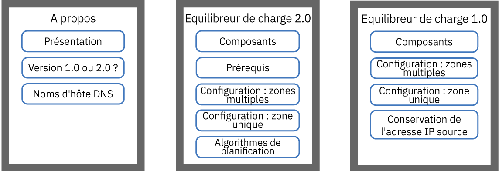
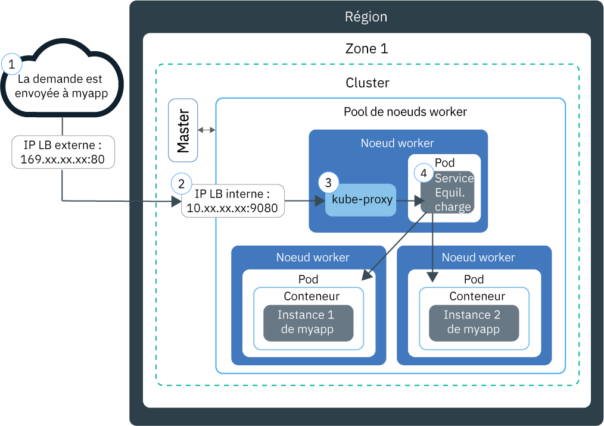
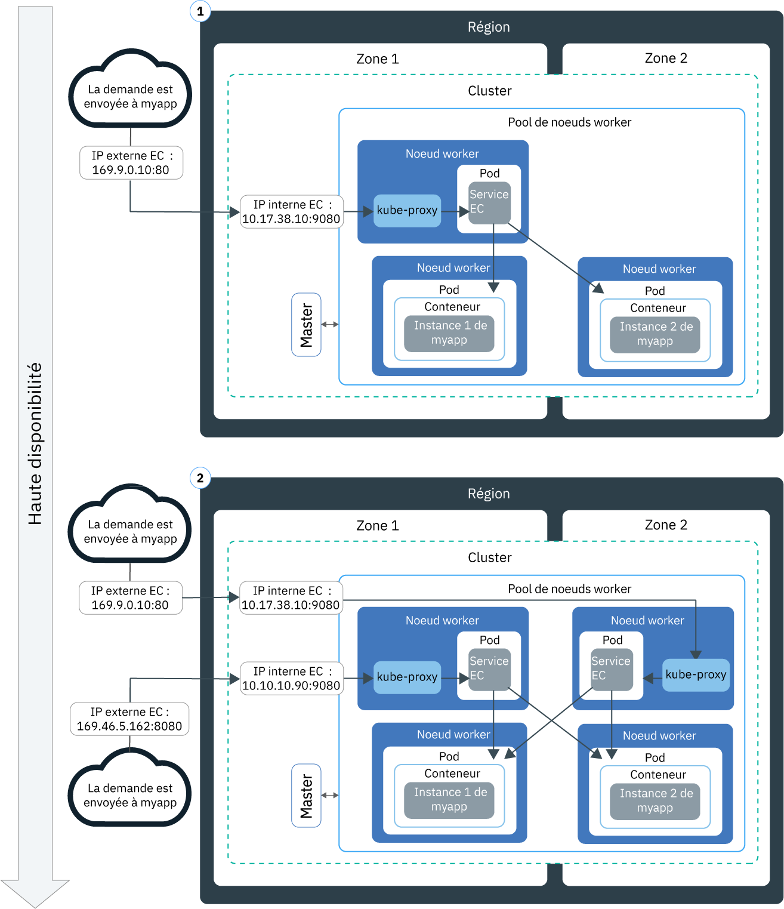
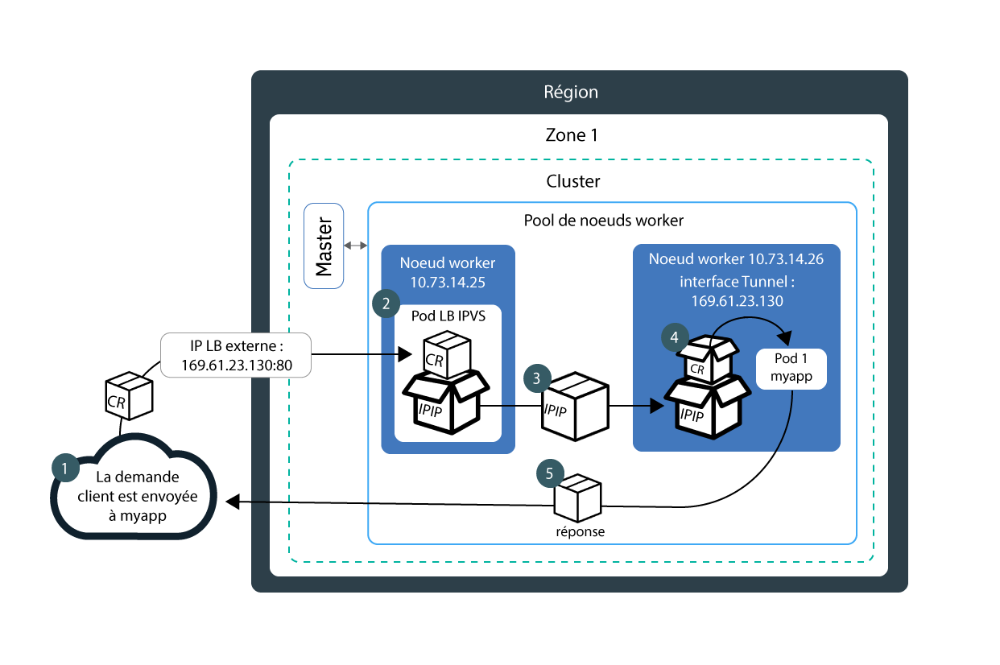
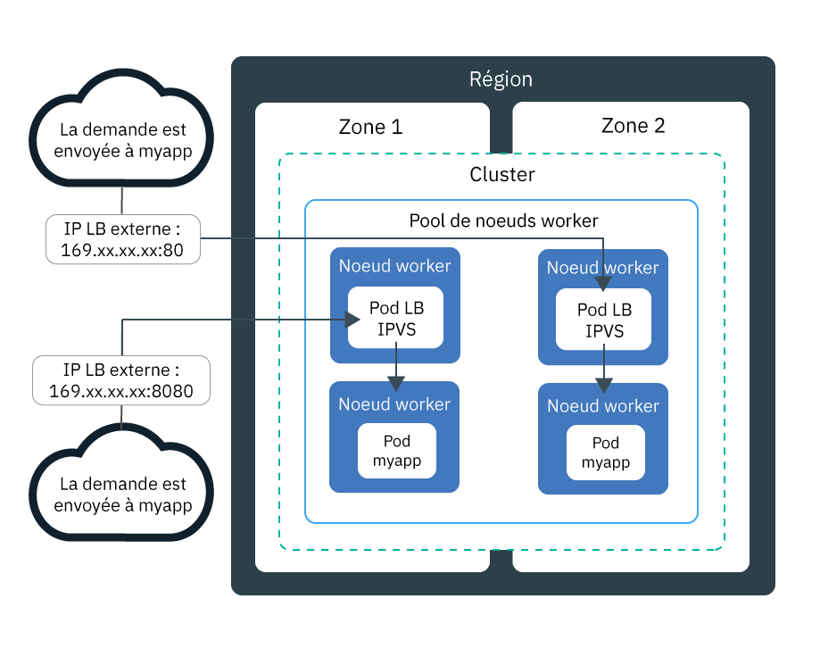

---

copyright:
  years: 2014, 2019
lastupdated: "2019-06-05"

keywords: kubernetes, iks, lb2.0, nlb, health check

subcollection: containers

---

{:new_window: target="_blank"}
{:shortdesc: .shortdesc}
{:screen: .screen}
{:pre: .pre}
{:table: .aria-labeledby="caption"}
{:codeblock: .codeblock}
{:tip: .tip}
{:note: .note}
{:important: .important}
{:deprecated: .deprecated}
{:download: .download}
{:preview: .preview}


# Equilibrage de charge de base et DSR à l'aide d'équilibreurs de charge de réseau (NLB)
{: #loadbalancer}

Exposez un port et utilisez une adresse IP pour un équilibreur de charge de réseau de couche 4 afin d'accéder à une application conteneurisée.
{:shortdesc}

Pour commencer, choisissez l'une des options suivantes :


<map name="image-map">
    <area target="" alt="Présentation" title="Présentation" href="#lb_overview" coords="35,44,175,72" shape="rect">
    <area target="" alt="Comparaison entre les équilibreurs de charge de version 1.0 et 2.0" title="Comparaison entre les équilibreurs de charge de version 1.0 et 2.0" href="#comparison" coords="34,83,173,108" shape="rect">
    <area target="" alt="Enregistrement d'un nom d'hôte d'équilibreur de charge" title="Enregistrement d'un nom d'hôte d'équilibreur de charge" href="#loadbalancer_hostname" coords="33,119,174,146" shape="rect">
    <area target="" alt="Version 2.0 : Composants et architecture (bêta)" title="Version 2.0 : Composants et architecture (bêta)" href="#planning_ipvs" coords="273,45,420,72" shape="rect">
    <area target="" alt="Version 2.0 : Prérequis" title="Version 2.0 : Prérequis" href="#ipvs_provision" coords="277,85,417,108" shape="rect">
    <area target="" alt="Version 2.0 : Configuration d'un équilibreur de charge 2.0 dans un cluster à zones multiples" title="Version 2.0 : Configuration d'un équilibreur de charge 2.0 dans un cluster à zones multiples" href="#ipvs_multi_zone_config" coords="276,122,417,147" shape="rect">
    <area target="" alt="Version 2.0 : Configuration d'un équilibreur de charge 2.0 dans un cluster à zone unique" title="Version 2.0 : Configuration d'un équilibreur de charge 2.0 dans un cluster à zone unique" href="#ipvs_single_zone_config" coords="277,156,419,184" shape="rect">
    <area target="" alt="Version 2.0 : Algorithmes de planification" title="Version 2.0 : Algorithmes de planification" href="#scheduling" coords="276,196,419,220" shape="rect">
    <area target="" alt="Version 1.0 : Composants et architecture" title="Version 1.0 : Composants et architecture" href="#v1_planning" coords="519,47,668,74" shape="rect">
    <area target="" alt="Version 1.0 : Configuration d'un équilibreur de charge 1.0 dans un cluster à zones multiples" title="Version 1.0 : Configuration d'un équilibreur de charge 1.0 dans un cluster à zones multiples" href="#multi_zone_config" coords="520,85,667,110" shape="rect">
    <area target="" alt="Version 1.0 : Configuration d'un équilibreur de charge 1.0 dans un cluster à zone unique" title="Version 1.0 : Configuration d'un équilibreur de charge 1.0 dans un cluster à zone unique" href="#lb_config" coords="520,122,667,146" shape="rect">
    <area target="" alt="Version 1.0 : Activation de la conservation de l'adresse IP source" title="Version 1.0 : Activation de la conservation de l'adresse IP source" href="#node_affinity_tolerations" coords="519,157,667,194" shape="rect">
</map>
</br>

Pour commencer rapidement, vous pouvez exécuter la commande suivante et créer un équilibreur de charge 1.0 :
```
kubectl expose deploy my-app --port=80 --target-port=8080 --type=LoadBalancer --name my-lb-svc
```
{: pre}

## Présentation
{: #lb_overview}

Lorsque vous créez un cluster standard, un sous-réseau public portable et un sous-réseau privé portable sont fournis automatiquement par {{site.data.keyword.containerlong}}.
{: shortdesc}

* Le sous-réseau public portable fournit 5 adresses IP utilisables. 1 adresse IP publique portable est utilisée par l'[équilibreur de charge d'application (ALB) Ingress public](/docs/containers?topic=containers-ingress) par défaut. Les 4 autres adresses IP publiques portables peuvent être utilisées pour exposer des applications individuelles sur Internet en créant des services d'équilibreur de charge de réseau (NLB) publics.
* Le sous-réseau privé portable fournit 5 adresses IP utilisables. 1 adresse IP privée portable est utilisée par l'[équilibreur de charge d'application (ALB) Ingress privé](/docs/containers?topic=containers-ingress#private_ingress) par défaut. Les 4 autres adresses IP privées portables peuvent être utilisées pour exposer des applications individuelles sur un réseau privé en créant des services d'équilibreur de charge privés, ou NLB.

Les adresses IP publiques et privées portables sont des adresses IP flottantes statiques et ne changent pas en cas de retrait d'un noeud worker. Si le noeud worker dans lequel figure l'adresse IP de l'équilibreur de charge de réseau est retiré, un démon Keepalived qui surveille en permanence l'adresse IP transfère automatiquement celle-ci sur un autre noeud worker. Vous pouvez affecter n'importe quel port à votre équilibreur de charge de réseau. Le service d'équilibreur de charge de réseau fait office de point d'entrée externe pour les demandes entrantes pour l'application. Pour accéder au NLB depuis Internet, vous pouvez utiliser l'adresse IP publique de votre NLB et le port affecté en utilisant le format `<IP_address>:<port>`. Vous pouvez également créer des entrées DNS pour des NLB en enregistrant les adresses IP NLB avec des noms d'hôte.

Lorsque vous exposez une application avec un service NLB, elle est également automatiquement mise à disposition sur les ports de noeud (NodePort) du service. Les [ports de noeud](/docs/containers?topic=containers-nodeport) sont accessibles sur toutes les adresses IP publiques et privées de tous les noeuds worker figurant dans le cluster. Pour bloquer le trafic vers les ports de noeud lorsque vous utilisez un service d'équilibreur de charge de réseau, voir [Contrôle du trafic entrant vers les services d'équilibreur de charge de réseau (NLB) ou NodePort](/docs/containers?topic=containers-network_policies#block_ingress).

<br />


## Comparaison de l'équilibrage de charge de base et DSR dans les équilibreurs de charge de réseau versions 1.0 et 2.0
{: #comparison}

Lorsque vous créez un équilibreur de charge de réseau, vous pouvez choisir un équilibreur de charge de réseau version 1.0, qui effectue l'équilibrage de charge de base, ou un équilibreur de charge version 2.0, qui effectue l'équilibrage de charge DSR (Direct Server Return). Notez que les équilibreurs de charge de réseau version 2.0 sont en version bêta.
{: shortdesc}

**En quoi les équilibreurs de charge de réseau 1.0 et 2.0 sont-ils semblables ?**

Les équilibreurs de charge de réseau 1.0 et 2.0 sont des équilibreurs de charge de couche 4 qui n'existent que dans l'espace du noyau Linux. Ces deux versions s'exécutent dans le cluster et utilisent des ressources de noeud worker. Par conséquent, la capacité disponible des équilibreurs de charge de réseau est toujours dédiée à votre propre cluster. Par ailleurs, ces deux versions d'équilibreurs de charge de réseau ne mettent pas fin à la connexion. Les connexions sont transférées à un pod d'application à la place.

**En quoi les équilibreurs de charge de réseau 1.0 et 2.0 sont-ils différents ?**

Lorsqu'un client envoie une demande à votre application, l'équilibreur de charge de réseau achemine des paquets de demandes à l'adresse IP du noeud worker où il existe un pod d'application. Les équilibreurs de charge de réseau 1.0 utilisent une conversion d'adresses réseau (NAT) pour réécrire l'adresse IP source du paquet de demandes sur l'adresse IP du noeud worker où il existe un pod d'équilibreur de charge. Lorsque le noeud worker renvoie un paquet de réponses d'application, il utilise l'adresse IP du noeud worker où se trouve l'équilibreur de charge de réseau. L'équilibreur de charge de réseau doit ensuite envoyer le paquet de réponses au client. Pour empêcher la réécriture de l'adresse IP, vous pouvez [activer la conservation de l'adresse IP source](#node_affinity_tolerations). Cependant, la conservation de l'adresse IP source nécessite que les pods d'équilibreur de charge et les pods d'application s'exécutent sur le même noeud worker pour éviter d'avoir à transférer la demande vers un autre noeud worker. Vous devez ajouter des propriétés d'affinité de noeud et de tolérance aux pods d'application. Pour plus d'informations sur l'équilibrage de charge de base avec des équilibreurs de charge de réseau version 1.0, voir [Version 1.0 : Composants et architecture de l'équilibrage de charge de base](#v1_planning).

Contrairement aux équilibreurs de charge de réseau 1.0, les équilibreurs de charge de réseau 2.0 n'utilisent pas la conversion NAT lors du transfert des demandes aux pods d'application sur d'autres noeuds worker. Lorsqu'un équilibreur de charge de réseau 2.0 achemine une demande client, il utilise un tunnel IP sur IP (IPIP) pour encapsuler le paquet de demandes d'origine dans un nouveau paquet distinct. Ce paquet comporte une adresse IP source du noeud worker dans lequel se trouve le pod d'équilibreur de charge, ce qui permet au paquet de demandes d'origine de conserver l'adresse IP du client comme adresse IP source. Le noeud worker utilise ensuite le mode DSR (Direct Server Return) pour envoyer le paquet de réponses de l'application à l'adresse IP du client. Le paquet de réponses ignore l'équilibreur de charge de réseau et est envoyé directement au client, réduisant ainsi la quantité de trafic que l'équilibreur de charge de réseau doit traiter. Pour plus d'informations sur l'équilibrage de charge DRS avec des équilibreurs de charge de réseau version 2.0, voir [Version 2.0 : Composants et architecture de l'équilibrage de charge DSR](#planning_ipvs).

<br />


## Version 1.0 : Composants et architecture de l'équilibrage de charge de base
{: #v1_planning}

L'équilibreur de charge de réseau 1.0 TCP/UDP utilise Iptables, une fonction du noyau Linux, pour équilibrer la charge des demandes sur les pods d'une application.
{: shortdesc}

### Flux de circulation dans un cluster à zone unique
{: #v1_single}

Le diagramme suivant montre comment un équilibreur de charge de réseau 1.0 dirige la communication d'Internet vers une application dans un cluster à zone unique.
{: shortdesc}



1. Une demande adressée à votre application utilise l'adresse IP publique de votre équilibreur de charge de réseau et le port affecté sur le noeud worker.

2. La demande est automatiquement transmise à l'adresse IP et au port du cluster interne du service NLB. L'adresse IP du cluster interne est accessible uniquement à l'intérieur du cluster.

3. `kube-proxy` achemine la demande vers le service NLB pour l'application.

4. La demande est transférée à l'adresse IP privée du pod d'application. L'adresse IP source du package de demande est remplacée par l'adresse IP publique du noeud worker sur lequel s'exécute le pod d'application. Si plusieurs instances d'application sont déployées dans le cluster, l'équilibreur de charge de réseau achemine les demandes entre les pods d'application.

### Flux de circulation dans un cluster à zones multiples
{: #v1_multi}

Le diagramme suivant montre comment un équilibreur de charge de réseau 1.0 dirige la communication d'Internet vers une application dans un cluster à zones multiples.
{: shortdesc}



Par défaut, chaque équilibreur de charge de réseau 1.0 est configuré dans une seule zone. Pour assurer la haute disponibilité, vous devez déployer un équilibreur de charge de réseau 1.0 dans toutes les zones où se trouvent vos instances d'application. Les demandes sont traitées par les équilibreurs de charge de réseau dans les différentes zones à tour de rôle. De plus, chaque équilibreur de charge de réseau route les demandes vers les instances d'application au sein de sa propre zone et vers les instances d'application situées dans d'autres zones.

<br />


## Version 1.0 : Configuration d'un équilibreur de charge de réseau 1.0 dans un cluster à zones multiples
{: #multi_zone_config}

**Avant de commencer** :
* Pour pouvoir créer des équilibreurs de charge de réseau (NLB) publics dans plusieurs zones, au moins un VLAN public doit comporter des sous-réseaux portables disponibles dans chaque zone. Pour pouvoir créer des équilibreurs de charge de réseau (NLB) privés dans plusieurs zones, au moins un VLAN privé doit comporter des sous-réseaux portables disponibles dans chaque zone. Vous pouvez ajouter des sous-réseaux en suivant la procédure indiquée dans [Configuration de sous-réseaux pour les clusters](/docs/containers?topic=containers-subnets).
* Si vous limitez le trafic réseau aux noeuds worker de périphérie, vérifiez qu'au moins 2 [noeuds worker de périphérie](/docs/containers?topic=containers-edge#edge) sont activés dans chaque zone pour assurer le déploiement uniforme des équilibreurs de charge de réseau.
* Activez la fonction [Spanning VLAN](/docs/infrastructure/vlans?topic=vlans-vlan-spanning#vlan-spanning) pour votre compte d'infrastructure IBM Cloud (SoftLayer) afin que vos noeuds worker puissent communiquer entre eux sur le réseau privé. Pour effectuer cette action, vous devez disposer du [droit d'infrastructure](/docs/containers?topic=containers-users#infra_access) **Réseau > Gérer le spanning VLAN pour réseau**, ou vous pouvez demander au propriétaire du compte de l'activer. Pour vérifier si le spanning VLAN est déjà activé, utilisez la [commande](/docs/containers?topic=containers-cli-plugin-kubernetes-service-cli#cs_vlan_spanning_get) `ibmcloud ks vlan-spanning-get --region <region>`. 
* Vérifiez que vous disposez du [rôle de service {{site.data.keyword.Bluemix_notm}} IAM **Auteur** ou **Responsable**](/docs/containers?topic=containers-users#platform) pour l'espace de nom `default`.


Pour configurer un service d'équilibreur de charge de réseau 1.0 dans un cluster à zones multiples :
1.  [Déployez votre application sur le cluster](/docs/containers?topic=containers-app#app_cli). Prenez soin d'ajouter un libellé à votre déploiement dans la section "metadata" de votre fichier de configuration. Ce libellé est nécessaire pour identifier tous les pods dans lesquels s'exécute votre application afin de pouvoir les inclure dans l'équilibrage de charge.

2.  Créez un service d'équilibreur de charge pour l'application que vous désirez exposer sur l'Internet public ou sur un réseau privé.
  1. Créez un fichier de configuration de service nommé, par exemple, `myloadbalancer.yaml`.
  2. Définissez un service d'équilibreur de charge pour l'application que vous désirez exposer. Vous pouvez spécifier une zone, un VLAN et une adresse IP.

      ```
      apiVersion: v1
      kind: Service
      metadata:
        name: myloadbalancer
        annotations:
          service.kubernetes.io/ibm-load-balancer-cloud-provider-ip-type: <public_or_private>
          service.kubernetes.io/ibm-load-balancer-cloud-provider-zone: "<zone>"
          service.kubernetes.io/ibm-load-balancer-cloud-provider-vlan: "<vlan_id>"
      spec:
        type: LoadBalancer
        selector:
          <selector_key>: <selector_value>
        ports:
         - protocol: TCP
             port: 8080
          loadBalancerIP: <IP_address>
      ```
      {: codeblock}

      <table>
      <caption>Description des composants du fichier YAML</caption>
      <thead>
      <th colspan=2> Description des composants du fichier YAML</th>
      </thead>
      <tbody>
      <tr>
        <td><code>service.kubernetes.io/ibm-load-balancer-cloud-provider-ip-type:</code>
        <td>Annotation utilisée pour spécifier un équilibreur de charge privé (<code>private</code>) ou public (<code>public</code>).</td>
      </tr>
      <tr>
        <td><code>service.kubernetes.io/ibm-load-balancer-cloud-provider-zone:</code>
        <td>Annotation utilisée pour indiquer la zone dans laquelle est déployé le service d'équilibreur de charge. Pour voir les zones, exécutez la commande <code>ibmcloud ks zones</code>.</td>
      </tr>
      <tr>
        <td>`service.kubernetes.io/ibm-load-balancer-cloud-provider-vlan:`
        <td>Annotation utilisée pour spécifier un VLAN sur lequel est déployé le service d'équilibreur de charge. Pour voir les VLAN, exécutez la commande <code>ibmcloud ks vlans --zone <zone></code>.</td>
      </tr>
      <tr>
        <td><code>selector</code></td>
        <td>Paire de libellés clé (<em>&lt;selector_key&gt;</em>)/valeur (<em>&lt;selector_value&gt;</em>) que vous avez utilisée dans la section <code>spec.template.metadata.labels</code> de votre fichier YAML de déploiement d'application.</td>
      </tr>
      <tr>
        <td><code>port</code></td>
        <td>Port sur lequel le service est à l'écoute.</td>
      </tr>
      <tr>
        <td><code>loadBalancerIP</code></td>
        <td>Facultatif : pour créer un équilibreur de charge privé ou utiliser une adresse IP portable spécifique pour un équilibreur de charge public, indiquez l'adresse IP que vous désirez utiliser. Cette adresse IP doit se trouver sur le VLAN et dans la zone que vous avez spécifiés dans les annotations. Si vous n'indiquez pas d'adresse IP :<ul><li>Si votre cluster se trouve sur un VLAN public, une adresse IP publique portable est utilisée. La plupart des clusters se trouvent sur un VLAN public.</li><li>Si votre cluster se trouve sur un VLAN privé uniquement, une adresse IP privée portable est utilisée.</li></ul></td>
      </tr>
      </tbody></table>

      Exemple de fichier de configuration utilisé pour créer un service d'équilibreur de charge de réseau 1.0 privé qui utilise une adresse IP indiquée sur le VLAN privé `2234945` dans la zone `dal12`:

      ```
      apiVersion: v1
      kind: Service
      metadata:
        name: myloadbalancer
        annotations:
          service.kubernetes.io/ibm-load-balancer-cloud-provider-ip-type: private
          service.kubernetes.io/ibm-load-balancer-cloud-provider-zone: "dal12"
          service.kubernetes.io/ibm-load-balancer-cloud-provider-vlan: "2234945"
      spec:
        type: LoadBalancer
        selector:
          app: nginx
        ports:
         - protocol: TCP
           port: 8080
        loadBalancerIP: 172.21.xxx.xxx
      ```
      {: codeblock}

  3. Facultatif : rendez votre service d'équilibreur de charge de réseau accessible uniquement à une plage d'adresses IP limitée en spécifiant les adresses IP dans la zone `spec.loadBalancerSourceRanges`. La zone `loadBalancerSourceRanges` est implémentée par `kube-proxy` dans votre cluster via des règles Iptables sur les noeuds worker. Pour plus d'informations, voir la [documentation Kubernetes ](https://kubernetes.io/docs/tasks/access-application-cluster/configure-cloud-provider-firewall/).

  4. Créez le service dans votre cluster.

      ```
      kubectl apply -f myloadbalancer.yaml
      ```
      {: pre}

3. Vérifiez que la création du service d'équilibreur de charge de réseau a abouti. La création du service et la mise à disposition de l'application peuvent prendre quelques minutes.

    ```
    kubectl describe service myloadbalancer
    ```
    {: pre}

    Exemple de sortie d'interface CLI :

    ```
    Name:                   myloadbalancer
    Namespace:              default
    Labels:                 <none>
    Selector:               app=liberty
    Type:                   LoadBalancer
    Zone:                   dal10
    IP:                     172.21.xxx.xxx
    LoadBalancer Ingress:   169.xx.xxx.xxx
    Port:                   <unset> 8080/TCP
    NodePort:               <unset> 32040/TCP
    Endpoints:              172.30.xxx.xxx:8080
    Session Affinity:       None
    Events:
      FirstSeen	LastSeen	Count	From			SubObjectPath	Type	 Reason			          Message
      ---------	--------	-----	----			-------------	----	 ------			          -------
      10s		    10s		    1	    {service-controller }	  Normal CreatingLoadBalancer	Creating load balancer
      10s		    10s		    1	    {service-controller }		Normal CreatedLoadBalancer	Created load balancer
    ```
    {: screen}

    L'adresse IP **LoadBalancer Ingress** est l'adresse IP portable affectée à votre service d'équilibreur de charge de réseau.

4.  Si vous avez créé un équilibreur de charge de réseau public, accédez à votre application via Internet.
    1.  Ouvrez le navigateur Web de votre choix.
    2.  Entrez l'adresse IP publique portable de l'équilibreur de charge de réseau et le port.

        ```
        http://169.xx.xxx.xxx:8080
        ```
        {: codeblock}    

5. Répétez les étapes 2 à 4 pour ajouter un équilibreur de charge de réseau 1.0 dans chaque zone.    

6. Si vous choisissez d'[activer la conservation de l'adresse IP source pour un service d'équilibreur de charge de réseau 1.0](#node_affinity_tolerations), assurez-vous que les pods d'application sont planifiés sur les noeuds worker de périphérie en [ajoutant l'affinité de noeud de périphérie aux pods d'application](#lb_edge_nodes). Les pods d'application doivent être planifiés sur des noeuds de périphérie pour recevoir des demandes entrantes.

7. Facultatif : un service d'équilibreur de charge rend votre application accessible via les ports de noeud du service. Les [ports de noeud (NodePort)](/docs/containers?topic=containers-nodeport) sont accessibles sur toutes les adresses IP publiques et privées pour tous les noeuds figurant dans le cluster. Pour bloquer le trafic vers les ports de noeud lorsque vous utilisez un service d'équilibreur de charge de réseau, voir [Contrôle du trafic entrant vers les services d'équilibreur de charge de réseau (NLB) ou NodePort](/docs/containers?topic=containers-network_policies#block_ingress).

Ensuite, vous pouvez [enregistrer un nom d'hôte NLB](#loadbalancer_hostname).

<br />


## Version 1.0 : Configuration d'un équilibreur de charge de réseau 1.0 dans un cluster à zone unique
{: #lb_config}

**Avant de commencer** :
* Vous devez disposer d'une adresse IP publique ou privée portable disponible pour l'affecter au service d'équilibreur de charge de réseau. Pour plus d'informations, voir [Configuration de sous-réseaux pour les clusters](/docs/containers?topic=containers-subnets).
* Vérifiez que vous disposez du [rôle de service {{site.data.keyword.Bluemix_notm}} IAM **Auteur** ou **Responsable**](/docs/containers?topic=containers-users#platform) pour l'espace de nom `default`.

Pour créer un service d'équilibreur de charge de réseau 1.0 dans un cluster à zone unique :

1.  [Déployez votre application sur le cluster](/docs/containers?topic=containers-app#app_cli). Prenez soin d'ajouter un libellé à votre déploiement dans la section "metadata" de votre fichier de configuration. Ce libellé est nécessaire pour identifier tous les pods dans lesquels s'exécute votre application afin de pouvoir les inclure dans l'équilibrage de charge.
2.  Créez un service d'équilibreur de charge pour l'application que vous désirez exposer sur l'Internet public ou sur un réseau privé.
    1.  Créez un fichier de configuration de service nommé, par exemple, `myloadbalancer.yaml`.

    2.  Définissez un service d'équilibreur de charge pour l'application que vous désirez exposer.
        ```
        apiVersion: v1
        kind: Service
        metadata:
          name: myloadbalancer
          annotations:
            service.kubernetes.io/ibm-load-balancer-cloud-provider-ip-type: <public_or_private>
            service.kubernetes.io/ibm-load-balancer-cloud-provider-vlan: "<vlan_id>"
        spec:
          type: LoadBalancer
          selector:
            <selector_key>: <selector_value>
          ports:
           - protocol: TCP
             port: 8080
          loadBalancerIP: <IP_address>
          externalTrafficPolicy: Local
        ```
        {: codeblock}

        <table>
        <caption>Description des composants du fichier YAML</caption>
        <thead>
        <th colspan=2> Description des composants du fichier YAML</th>
        </thead>
        <tbody>
        <tr>
          <td>`service.kubernetes.io/ibm-load-balancer-cloud-provider-ip-type:`
          <td>Annotation utilisée pour spécifier un équilibreur de charge privé (<code>private</code>) ou public (<code>public</code>).</td>
        </tr>
        <tr>
          <td>`service.kubernetes.io/ibm-load-balancer-cloud-provider-vlan:`
          <td>Annotation utilisée pour spécifier un VLAN sur lequel est déployé le service d'équilibreur de charge. Pour voir les VLAN, exécutez la commande <code>ibmcloud ks vlans --zone <zone></code>.</td>
        </tr>
        <tr>
          <td><code>selector</code></td>
          <td>Paire de libellés clé (<em>&lt;selector_key&gt;</em>)/valeur (<em>&lt;selector_value&gt;</em>) que vous avez utilisée dans la section <code>spec.template.metadata.labels</code> de votre fichier YAML de déploiement d'application.</td>
        </tr>
        <tr>
          <td><code>port</code></td>
          <td>Port sur lequel le service est à l'écoute.</td>
        </tr>
        <tr>
          <td><code>loadBalancerIP</code></td>
          <td>Facultatif : pour créer un équilibreur de charge privé ou utiliser une adresse IP portable spécifique pour un équilibreur de charge public, indiquez l'adresse IP que vous désirez utiliser. Cette adresse IP doit se trouver sur le VLAN que vous avez spécifié dans les annotations. Si vous n'indiquez pas d'adresse IP :<ul><li>Si votre cluster se trouve sur un VLAN public, une adresse IP publique portable est utilisée. La plupart des clusters se trouvent sur un VLAN public.</li><li>Si votre cluster se trouve sur un VLAN privé uniquement, une adresse IP privée portable est utilisée.</li></ul></td>
        </tr>
        </tbody></table>

        Exemple de fichier de configuration utilisé pour créer un service d'équilibreur de charge de réseau 1.0 privé qui utilise une adresse IP indiquée sur le VLAN privé `2234945` :

        ```
        apiVersion: v1
        kind: Service
        metadata:
          name: myloadbalancer
          annotations:
            service.kubernetes.io/ibm-load-balancer-cloud-provider-ip-type: private
            service.kubernetes.io/ibm-load-balancer-cloud-provider-vlan: "2234945"
        spec:
          type: LoadBalancer
          selector:
            app: nginx
          ports:
           - protocol: TCP
             port: 8080
          loadBalancerIP: 172.21.xxx.xxx
        ```
        {: codeblock}

    3. Facultatif : rendez votre service d'équilibreur de charge de réseau accessible uniquement à une plage d'adresses IP limitée en spécifiant les adresses IP dans la zone `spec.loadBalancerSourceRanges`. La zone `loadBalancerSourceRanges` est implémentée par `kube-proxy` dans votre cluster via des règles Iptables sur les noeuds worker. Pour plus d'informations, voir la [documentation Kubernetes ](https://kubernetes.io/docs/tasks/access-application-cluster/configure-cloud-provider-firewall/).

    4.  Créez le service dans votre cluster.

        ```
        kubectl apply -f myloadbalancer.yaml
        ```
        {: pre}

3.  Vérifiez que la création du service d'équilibreur de charge de réseau a abouti. La création du service et la mise à disposition de l'application peuvent prendre quelques minutes.

    ```
    kubectl describe service myloadbalancer
    ```
    {: pre}

    Exemple de sortie d'interface CLI :

    ```
    Name:                   myloadbalancer
    Namespace:              default
    Labels:                 <none>
    Selector:               app=liberty
    Type:                   LoadBalancer
    Location:               dal10
    IP:                     172.21.xxx.xxx
    LoadBalancer Ingress:   169.xx.xxx.xxx
    Port:                   <unset> 8080/TCP
    NodePort:               <unset> 32040/TCP
    Endpoints:              172.30.xxx.xxx:8080
    Session Affinity:       None
    Events:
      FirstSeen	LastSeen	Count	From			SubObjectPath	Type	 Reason			          Message
      ---------	--------	-----	----			-------------	----	 ------			          -------
      10s		    10s		    1	    {service-controller }	  Normal CreatingLoadBalancer	Creating load balancer
      10s		    10s		    1	    {service-controller }		Normal CreatedLoadBalancer	Created load balancer
    ```
    {: screen}

    L'adresse IP **LoadBalancer Ingress** est l'adresse IP portable affectée à votre service d'équilibreur de charge de réseau.

4.  Si vous avez créé un équilibreur de charge de réseau public, accédez à votre application via Internet.
    1.  Ouvrez le navigateur Web de votre choix.
    2.  Entrez l'adresse IP publique portable de l'équilibreur de charge de réseau et le port.

        ```
        http://169.xx.xxx.xxx:8080
        ```
        {: codeblock}

5. Si vous choisissez d'[activer la conservation de l'adresse IP source pour un service d'équilibreur de charge de réseau 1.0](#node_affinity_tolerations), assurez-vous que les pods d'application sont planifiés sur les noeuds worker de périphérie en [ajoutant l'affinité de noeud de périphérie aux pods d'application](#lb_edge_nodes). Les pods d'application doivent être planifiés sur des noeuds de périphérie pour recevoir des demandes entrantes.

6. Facultatif : un service d'équilibreur de charge rend votre application accessible via les ports de noeud du service. Les [ports de noeud (NodePort)](/docs/containers?topic=containers-nodeport) sont accessibles sur toutes les adresses IP publiques et privées pour tous les noeuds figurant dans le cluster. Pour bloquer le trafic vers les ports de noeud lorsque vous utilisez un service d'équilibreur de charge de réseau, voir [Contrôle du trafic entrant vers les services d'équilibreur de charge de réseau (NLB) ou NodePort](/docs/containers?topic=containers-network_policies#block_ingress).

Ensuite, vous pouvez [enregistrer un nom d'hôte NLB](#loadbalancer_hostname).

<br />


## Version 1.0 : Activation de la conservation de l'adresse IP source
{: #node_affinity_tolerations}

Cette fonction est applicable uniquement aux équilibreurs de charge de réseau 1.0. Par défaut, l'adresse IP source des demandes du client est conservée dans les équilibreurs de charge de réseau 2.0.
{: note}

Lorsqu'une demande du client destinée à votre application est envoyée à votre cluster, un pod de service d'équilibreur de charge reçoit la demande. S'il n'existe aucun pod d'application sur le même noeud worker que le pod de service d'équilibreur de charge, l'équilibreur de charge de réseau transmet la demande à un pod d'application sur un autre noeud worker. L'adresse IP source du package est remplacée par l'adresse IP publique du noeud worker sur lequel s'exécute le pod de service d'équilibreur de charge.
{: shortdesc}

Pour conserver l'adresse IP source d'origine de la demande du client, vous pouvez [activer l'adresse IP source ](https://kubernetes.io/docs/tasks/access-application-cluster/create-external-load-balancer/#preserving-the-client-source-ip) pour les services d'équilibreur de charge. La connexion TCP se poursuit jusqu'aux pods d'application de sorte que l'application puisse voir l'adresse IP source réelle du demandeur. Conserver l'adresse IP du client est pratique, notamment lorsque les serveurs d'applications doivent appliquer des règles de sécurité et de contrôle d'accès.

Après avoir activé l'adresse IP source, les pods de service d'équilibreur de charge doivent transférer les demandes aux pods d'application déployés sur le même noeud worker uniquement. En principe, des pods de service d'équilibreur de charge sont également déployés sur les noeuds worker sur lesquels sont déployés les pods d'application. Il existe cependant des situations où les pods d'équilibreur de charge et les pods d'application ne sont pas forcément planifiés sur le même noeud worker :

* Vous disposez de noeuds de périphérie avec des annotations taint de sorte que seuls les pods du service d'équilibreur de charge puissent se déployer sur ces noeuds. Le déploiement des pods d'application n'est pas autorisé sur ces noeuds.
* Votre cluster est connecté à plusieurs réseaux locaux virtuels (VLAN) publics ou privés, et vos pods d'application peuvent se déployer sur des noeuds worker connectés uniquement à un seul VLAN. Les pods de service d'équilibreur de charge risquent de ne pas se déployer sur ces noeuds worker car l'adresse IP de l'équilibreur de charge de réseau est connectée à un autre VLAN que les noeuds worker.

Pour forcer le déploiement de votre application sur des noeuds worker spécifiques sur lesquels peuvent se déployer des pods de service d'équilibreur de charge, vous devez ajouter des règles d'affinité et des tolérances au déploiement de votre application.

### Ajout de règles d'affinité et de tolérances pour les noeuds de périphérie
{: #lb_edge_nodes}

Lorsque vous [labellisez des noeuds worker en tant que noeuds de périphérie](/docs/containers?topic=containers-edge#edge_nodes) et que vous ajoutez des [annotations taint à ces noeuds de périphérie](/docs/containers?topic=containers-edge#edge_workloads), les pods de service d'équilibreur de charge se déploient uniquement sur ces noeuds de périphérie et les pods d'application ne peuvent pas se déployer sur les noeuds de périphérie. Lorsque l'adresse IP source est activée pour le service d'équilibreur de charge de réseau, les pods d'équilibreur de charge sur les noeuds de périphérie ne peuvent pas transférer les demandes entrantes vers vos pods d'application sur d'autres noeuds worker.
{:shortdesc}

Pour forcer le déploiement de vos pods d'application sur des noeuds de périphérie, ajoutez une [règle d'affinité ](https://kubernetes.io/docs/concepts/configuration/assign-pod-node/#node-affinity-beta-feature) et une [tolérance (toleration) ](https://kubernetes.io/docs/concepts/configuration/taint-and-toleration/#concepts) de noeud de périphérie au déploiement de l'application.

Exemple de fichier YAML de déploiement avec les règles d'affinité et de tolérance pour les noeuds de périphérie :

```
apiVersion: apps/v1
kind: Deployment
metadata:
  name: with-node-affinity
spec:
  selector:
    matchLabels:
      <label_name>: <label_value>
  template:
    spec:
      affinity:
        nodeAffinity:
          requiredDuringSchedulingIgnoredDuringExecution:
            nodeSelectorTerms:
            - matchExpressions:
              - key: dedicated
                operator: In
                values:
                - edge
      tolerations:
        - key: dedicated
          value: edge
...
```
{: codeblock}

Les deux sections **affinity** et **tolerations** ont la valeur `dedicated` pour `key` et `edge` pour `value`.

### Ajout de règles d'affinité à plusieurs réseaux locaux virtuels (VLAN) publics ou privés
{: #edge_nodes_multiple_vlans}

Lorsque votre cluster est connecté à plusieurs réseaux locaux virtuels (VLAN) publics ou privés, vos pods d'application peuvent se déployer sur des noeuds worker connectés uniquement à un seul VLAN. Si l'adresse IP de l'équilibreur de charge de réseau est connectée à un autre VLAN que ces noeuds worker, les pods de service d'équilibreur de charge ne pourront pas se déployer sur ces noeuds worker.
{:shortdesc}

Lorsque l'adresse IP source est activée, planifiez les pods d'application sur les noeuds worker avec le même VLAN que l'adresse IP de l'équilibreur de charge de réseau en ajoutant une règle d'affinité au déploiement de l'application.

Avant de commencer : [connectez-vous à votre compte. Le cas échéant, ciblez le groupe de ressources approprié. Définissez le contexte pour votre cluster.](/docs/containers?topic=containers-cs_cli_install#cs_cli_configure)

1. Procurez-vous l'adresse IP du service d'équilibreur de charge de réseau. Recherchez cette adresse dans la zone **LoadBalancer Ingress**.
    ```
    kubectl describe service <loadbalancer_service_name>
    ```
    {: pre}

2. Récupérez l'ID VLAN auquel votre service d'équilibreur de charge de réseau est connecté.

    1. Affichez la liste des VLAN publics portables de votre cluster.
        ```
        ibmcloud ks cluster-get --cluster <cluster_name_or_ID> --showResources
        ```
        {: pre}

        Exemple de sortie :
        ```
        ...

        Subnet VLANs
        VLAN ID   Subnet CIDR       Public   User-managed
        2234947   10.xxx.xx.xxx/29  false    false
        2234945   169.36.5.xxx/29   true     false
        ```
        {: screen}

    2. Dans la sortie sous **Subnet VLANs**, recherchez le routage CIDR de sous-réseau correspondant à l'adresse IP NLB que vous avez récupérée précédemment et notez l'ID du VLAN.

        Par exemple, si l'adresse IP du service d'équilibreur de charge de réseau est `169.36.5.xxx`, le sous-réseau correspondant dans l'exemple de sortie de l'étape précédente est `169.36.5.xxx/29`. L'ID du VLAN auquel est connecté ce sous-réseau est `2234945`.

3. [Ajoutez une règle d'affinité ](https://kubernetes.io/docs/concepts/configuration/assign-pod-node/#node-affinity-beta-feature) au déploiement d'application pour l'ID du VLAN que vous avez noté à l'étape précédente.

    Par exemple, si vous disposez de plusieurs VLAN et que vous souhaitez que vos pods d'application se déploient sur des noeuds worker résidant uniquement sur le VLAN public `2234945` :

    ```
    apiVersion: apps/v1
    kind: Deployment
    metadata:
      name: with-node-affinity
    spec:
      selector:
        matchLabels:
          <label_name>: <label_value>
      template:
        spec:
          affinity:
            nodeAffinity:
              requiredDuringSchedulingIgnoredDuringExecution:
                nodeSelectorTerms:
                - matchExpressions:
                  - key: publicVLAN
                    operator: In
                    values:
                    - "2234945"
    ...
    ```
    {: codeblock}

    Dans l'exemple de fichier YAML, la section **affinity** contient `publicVLAN` pour `key` et `"2234945"` pour `value`.

4. Appliquez le fichier de configuration de déploiement mis à jour.
    ```
    kubectl apply -f with-node-affinity.yaml
    ```
    {: pre}

5. Vérifiez que les pods d'application déployés sur les noeuds worker sont connectés au VLAN désigné.

    1. Affichez la liste des pods de votre cluster. Remplacez `<selector>` par le libellé que vous avez utilisé pour l'application.
        ```
        kubectl get pods -o wide app=<selector>
        ```
        {: pre}

        Exemple de sortie :
        ```
        NAME                   READY     STATUS              RESTARTS   AGE       IP               NODE
        cf-py-d7b7d94db-vp8pq  1/1       Running             0          15d       172.30.xxx.xxx   10.176.48.78
        ```
        {: screen}

    2. Dans la sortie, identifiez un pod pour votre application. Notez l'ID du noeud worker (**NODE**) sur lequel réside le pod.

        Dans l'exemple de sortie de l'étape précédente, le pod d'application `cf-py-d7b7d94db-vp8pq` réside sur le noeud worker `10.176.48.78`.

    3. Affichez la liste des détails relatifs à votre noeud worker.

        ```
        kubectl describe node <worker_node_ID>
        ```
        {: pre}

        Exemple de sortie :

        ```
        Name:                   10.xxx.xx.xxx
        Role:
        Labels:                 arch=amd64
                                beta.kubernetes.io/arch=amd64
                                beta.kubernetes.io/os=linux
                                failure-domain.beta.kubernetes.io/region=us-south
                                failure-domain.beta.kubernetes.io/zone=dal10
                                ibm-cloud.kubernetes.io/encrypted-docker-data=true
                                kubernetes.io/hostname=10.xxx.xx.xxx
                                privateVLAN=2234945
                                publicVLAN=2234967
        ...
        ```
        {: screen}

    4. Dans la section **Labels** de la sortie, vérifiez que le VLAN public ou privé correspond au VLAN que vous avez désigné dans les étapes précédentes.

<br />


## Version 2.0 : Composants et architecture (bêta)
{: #planning_ipvs}

Les fonctionnalités de l'équilibreur de charge de réseau 2.0 sont en version bêta. Pour utiliser un équilibreur de charge de réseau 2.0, vous devez [mettre à jour le maître et les noeuds worker de votre cluster](/docs/containers?topic=containers-update) vers la version 1.12 ou ultérieure de Kubernetes.
{: note}

L'équilibreur de charge de réseau 2.0 est un équilibreur de charge de couche 4 qui utilise le serveur IPVS (IP Virtual Server) du noyau Linux. Il prend en charge les protocoles TCP et UDP, s'exécute devant plusieurs noeuds worker et utilise un tunnel IP sur IP (IPIP) pour distribuer le trafic qui arrive sur une adresse IP d'équilibreur de charge de réseau unique sur ces noeuds worker.

Vous souhaitez plus de détails sur les modèles de déploiement d'équilibrage de charge disponibles dans {{site.data.keyword.containerlong_notm}} ? Consultez cet [article de blogue ](https://www.ibm.com/blogs/bluemix/2018/10/ibm-cloud-kubernetes-service-deployment-patterns-for-maximizing-throughput-and-availability/).
{: tip}

### Flux de circulation dans un cluster à zone unique
{: #ipvs_single}

Le diagramme suivant montre comment un équilibreur de charge de réseau 2.0 dirige la communication d'Internet vers une application dans un cluster à zone unique.
{: shortdesc}



1. Une demande client adressée à votre application utilise l'adresse IP publique de votre équilibreur de charge de réseau et le port affecté sur le noeud worker. Dans cet exemple, l'équilibreur de charge de réseau a l'adresse IP virtuelle 169.61.23.130, qui se trouve actuellement sur le noeud worker 10.73.14.25.

2. L'équilibreur de charge de réseau encapsule le paquet de demandes du client (labellisé "CR" dans l'image) dans un paquet IPIP (labellisé "IPIP"). Le paquet de demandes du client conserve l'adresse IP du client comme adresse IP source. Le paquet d'encapsulation IPIP utilise l'adresse IP 10.73.14.25 du noeud worker comme adresse IP source.

3. L'équilibreur de charge de réseau achemine le paquet IPIP vers un noeud worker dans lequel réside un pod d'application, 10.73.14.26. Si plusieurs instances d'application sont déployées dans le cluster, l'équilibreur de charge de réseau achemine les demandes entre les noeuds worker dans lesquels sont déployés les pods d'application.

4. Le noeud worker 10.73.14.26 décompresse le paquet d'encapsulation IPIP, puis décompresse le paquet de demandes du client. Le paquet de demandes du client est transféré au pod d'application sur ce noeud worker.

5. Le noeud worker 10.73.14.26 utilise ensuite l'adresse IP source du paquet de demandes d'origine, l'adresse IP du client, pour renvoyer le paquet de réponses du pod d'application directement au client.

### Flux de circulation dans un cluster à zones multiples
{: #ipvs_multi}

Le trafic dans un cluster à zones multiples suit le même chemin que le [trafic dans un cluster à zone unique](#ipvs_single). Dans un cluster à zones multiples, l'équilibreur de charge de réseau achemine les demandes vers les instances d'application au sein de sa propre zone et vers les instances d'application situées dans d'autres zones. Le diagramme suivant montre comment les équilibreurs de charge de réseau 2.0 de chaque zone dirigent le trafic d'Internet vers une application dans un cluster à zones multiples.
{: shortdesc}



Par défaut, chaque équilibreur de charge de réseau 2.0 est configuré dans une seule zone. Vous pouvez obtenir une plus haute disponibilité en déployant un équilibreur de charge de réseau 2.0 dans toutes les zones où vous disposez d'instances d'application.

<br />


## Version 2.0 : Prérequis
{: #ipvs_provision}

Vous ne pouvez pas mettre à jour un équilibreur de charge de réseau 1.0 vers la version 2.0. Vous devez créer un nouvel équilibreur de charge de réseau 2.0. Notez que vous pouvez exécuter des équilibreurs de charge de réseau 1.0 et 2.0 simultanément dans un cluster.
{: shortdesc}

Avant de créer un équilibreur de charge de réseau 2.0, vous devez respecter la procédure prérequise suivante.

1. [Mettez à jour le maître et les noeuds worker de votre cluster](/docs/containers?topic=containers-update) vers Kubernetes version 1.12 ou ultérieure.

2. Pour permettre à votre équilibreur de charge de réseau version 2.0 de transférer les demandes aux pods d'application dans plusieurs zones, ouvrez un cas de support afin de demander l'agrégation de capacité pour vos réseaux locaux virtuels (VLAN). Ce paramètre de configuration ne provoque pas d'indisponibilité ou d'interruption de réseau. 
    1. Connectez-vous à la [console{{site.data.keyword.Bluemix_notm}}](https://cloud.ibm.com/).
    2. Dans la barre de menu, cliquez sur **Support**, cliquez sur l'onglet **Gérer les cas**, puis sur **Créer un cas**.
    3. Dans les zones correspondant au cas, indiquez ceci :
       * Comme type de support, sélectionnez **Technique**.
       * Comme catégorie, sélectionnez **Spanning VLAN**.
       * Comme objet, saisissez **Public VLAN Network Question.**
    4. Ajoutez les informations suivantes à la description : "Please set up the network to allow capacity aggregation on the public VLANs associated with my account. The reference ticket for this request is: https://control.softlayer.com/support/tickets/63859145". Notez que si vous souhaitez autoriser l'agrégation de capacité sur des réseaux VLAN spécifiques, tels que les VLAN publics pour un seul cluster, vous pouvez spécifier ces ID VLAN dans la description.
    5. Cliquez sur **Soumettre**.

3. Activez une [fonction de routeur (VRF)](/docs/infrastructure/direct-link?topic=direct-link-overview-of-virtual-routing-and-forwarding-vrf-on-ibm-cloud#overview-of-virtual-routing-and-forwarding-vrf-on-ibm-cloud) pour votre compte d'infrastructure IBM Cloud (SoftLayer). Pour activer la fonction VRF, [contactez le représentant de votre compte d'infrastructure IBM Cloud (SoftLayer)](/docs/infrastructure/direct-link?topic=direct-link-overview-of-virtual-routing-and-forwarding-vrf-on-ibm-cloud#how-you-can-initiate-the-conversion). Si vous ne parvenez pas à activer la fonction VRF ou si vous ne souhaitez pas le faire, activez la fonction [Spanning VLAN](/docs/infrastructure/vlans?topic=vlans-vlan-spanning#vlan-spanning). Lorsqu'une fonction VRF ou Spanning VLAN est activée, l'équilibreur de charge de réseau 2.0 peut router des paquets vers différents sous-réseaux dans le compte.

4. Si vous utilisez des [règles réseau Calico pre-DNAT](/docs/containers?topic=containers-network_policies#block_ingress) pour gérer le trafic à destination de l'adresse IP d'un équilibreur de charge de réseau 2.0, vous devez ajouter les zones `applyOnForward: true` et `doNotTrack: true` et retirer la zone `preDNAT: true` dans la section `spec` dans ces règles. `applyOnForward: true` garantit l'application de la règle Calico au trafic à mesure qu'il est encapsulé et transféré. `doNotTrack: true` garantit que les noeuds worker peuvent utiliser le mode DSR pour renvoyer un paquet de réponses directement au client sans avoir besoin d'assurer le suivi de la connexion. Par exemple, si vous utilisez une règle Calico pour placer en liste blanche le trafic provenant uniquement d'adresses IP spécifiques vers l'adresse IP de votre équilibreur de charge de réseau, la règle ressemble à ce qui suit :
    ```
    apiVersion: projectcalico.org/v3
    kind: GlobalNetworkPolicy
    metadata:
      name: whitelist
    spec:
      applyOnForward: true
      doNotTrack: true
      ingress:
      - action: Allow
        destination:
          nets:
          - <loadbalancer_IP>/32
          ports:
          - 80
        protocol: TCP
        source:
          nets:
          - <client_address>/32
      selector: ibm.role=='worker_public'
      order: 500
      types:
      - Ingress
    ```
    {: screen}

Vous pouvez ensuite suivre la procédure décrite dans [Configuration d'un équilibreur de charge de réseau 2.0 dans un cluster à zones multiples](#ipvs_multi_zone_config) ou [dans un cluster à zone unique](#ipvs_single_zone_config).

<br />


## Version 2.0 : Configuration d'un équilibreur de charge de réseau 2.0 dans un cluster à zones multiples
{: #ipvs_multi_zone_config}

**Avant de commencer** :

* **Important** : effectuez les [tâches prérequises relatives à l'équilibreur de charge de réseau 2.0](#ipvs_provision).
* Pour pouvoir créer des équilibreurs de charge de réseau publics dans plusieurs zones, au moins un VLAN public doit comporter des sous-réseaux portables disponibles dans chaque zone. Pour pouvoir créer des équilibreurs de charge de réseau (NLB) privés dans plusieurs zones, au moins un VLAN privé doit comporter des sous-réseaux portables disponibles dans chaque zone. Vous pouvez ajouter des sous-réseaux en suivant la procédure indiquée dans [Configuration de sous-réseaux pour les clusters](/docs/containers?topic=containers-subnets).
* Si vous limitez le trafic réseau aux noeuds worker de périphérie, vérifiez qu'au moins 2 [noeuds worker de périphérie](/docs/containers?topic=containers-edge#edge) sont activés dans chaque zone pour assurer le déploiement uniforme des équilibreurs de charge de réseau.
* Vérifiez que vous disposez du [rôle de service {{site.data.keyword.Bluemix_notm}} IAM **Auteur** ou **Responsable**](/docs/containers?topic=containers-users#platform) pour l'espace de nom `default`.


Pour configurer un équilibreur de charge de réseau 2.0 dans un cluster à zones multiples :
1.  [Déployez votre application sur le cluster](/docs/containers?topic=containers-app#app_cli). Prenez soin d'ajouter un libellé à votre déploiement dans la section "metadata" de votre fichier de configuration. Ce libellé est nécessaire pour identifier tous les pods dans lesquels s'exécute votre application afin de pouvoir les inclure dans l'équilibrage de charge.

2.  Créez un service d'équilibreur de charge pour l'application que vous désirez exposer sur l'Internet public ou sur un réseau privé.
  1. Créez un fichier de configuration de service nommé, par exemple, `myloadbalancer.yaml`.
  2. Définissez un service d'équilibreur de charge pour l'application que vous désirez exposer. Vous pouvez spécifier une zone, un VLAN et une adresse IP.

      ```
      apiVersion: v1
      kind: Service
      metadata:
        name: myloadbalancer
        annotations:
          service.kubernetes.io/ibm-load-balancer-cloud-provider-ip-type: <public_or_private>
          service.kubernetes.io/ibm-load-balancer-cloud-provider-zone: "<zone>"
          service.kubernetes.io/ibm-load-balancer-cloud-provider-vlan: "<vlan_id>"
          service.kubernetes.io/ibm-load-balancer-cloud-provider-enable-features: "ipvs"
          service.kubernetes.io/ibm-load-balancer-cloud-provider-scheduler: "<algorithm>"
      spec:
        type: LoadBalancer
        selector:
          <selector_key>: <selector_value>
        ports:
         - protocol: TCP
           port: 8080
        loadBalancerIP: <IP_address>
        externalTrafficPolicy: Local
      ```
      {: codeblock}

      <table>
      <caption>Description des composants du fichier YAML</caption>
      <thead>
      <th colspan=2> Description des composants du fichier YAML</th>
      </thead>
      <tbody>
      <tr>
        <td><code>service.kubernetes.io/ibm-load-balancer-cloud-provider-ip-type:</code>
        <td>Annotation utilisée pour spécifier un équilibreur de charge privé (<code>private</code>) ou public (<code>public</code>).</td>
      </tr>
      <tr>
        <td><code>service.kubernetes.io/ibm-load-balancer-cloud-provider-zone:</code>
        <td>Annotation utilisée pour indiquer la zone dans laquelle est déployé le service d'équilibreur de charge. Pour voir les zones, exécutez la commande <code>ibmcloud ks zones</code>.</td>
      </tr>
      <tr>
        <td>`service.kubernetes.io/ibm-load-balancer-cloud-provider-vlan:`
        <td>Annotation utilisée pour spécifier un VLAN sur lequel est déployé le service d'équilibreur de charge. Pour voir les VLAN, exécutez la commande <code>ibmcloud ks vlans --zone <zone></code>.</td>
      </tr>
      <tr>
        <td><code>service.kubernetes.io/ibm-load-balancer-cloud-provider-enable-features: "ipvs"</code>
        <td>Annotation utilisée pour spécifier un équilibreur de charge version 2.0.</td>
      </tr>
      <tr>
        <td><code>service.kubernetes.io/ibm-load-balancer-cloud-provider-scheduler:</code>
        <td>Facultatif : annotation utilisée pour spécifier l'algorithme de planification. Les valeurs admises sont : <code>"rr"</code> pour Round Robin (valeur par défaut) ou <code>"sh"</code> pour Source Hashing. Pour plus d'informations, voir [2.0 : Algorithmes de planification](#scheduling).</td>
      </tr>
      <tr>
        <td><code>selector</code></td>
        <td>Paire de libellés clé (<em>&lt;selector_key&gt;</em>)/valeur (<em>&lt;selector_value&gt;</em>) que vous avez utilisée dans la section <code>spec.template.metadata.labels</code> de votre fichier YAML de déploiement d'application.</td>
      </tr>
      <tr>
        <td><code>port</code></td>
        <td>Port sur lequel le service est à l'écoute.</td>
      </tr>
      <tr>
        <td><code>loadBalancerIP</code></td>
        <td>Facultatif : pour créer un équilibreur de charge de réseau privé ou utiliser une adresse IP portable spécifique pour un équilibreur de charge de réseau public, indiquez l'adresse IP que vous désirez utiliser. Cette adresse IP doit se trouver dans la zone et dans le VLAN que vous avez spécifiés dans les annotations. Si vous n'indiquez pas d'adresse IP :<ul><li>Si votre cluster se trouve sur un VLAN public, une adresse IP publique portable est utilisée. La plupart des clusters se trouvent sur un VLAN public.</li><li>Si votre cluster se trouve sur un VLAN privé uniquement, une adresse IP privée portable est utilisée.</li></ul></td>
      </tr>
      <tr>
        <td><code>externalTrafficPolicy: Local</code></td>
        <td>Défini avec <code>Local</code>.</td>
      </tr>
      </tbody></table>

      Exemple de fichier de configuration utilisé pour créer un service d'équilibreur de charge de réseau 2.0 dans la zone `dal12` utilisant l'algorithme de planification Round Robin :

      ```
      apiVersion: v1
      kind: Service
      metadata:
        name: myloadbalancer
        annotations:
          service.kubernetes.io/ibm-load-balancer-cloud-provider-zone: "dal12"
          service.kubernetes.io/ibm-load-balancer-cloud-provider-enable-features: "ipvs"
          service.kubernetes.io/ibm-load-balancer-cloud-provider-scheduler: "rr"
      spec:
        type: LoadBalancer
        selector:
          app: nginx
        ports:
         - protocol: TCP
           port: 8080
        externalTrafficPolicy: Local
      ```
      {: codeblock}

  3. Facultatif : rendez votre service d'équilibreur de charge de réseau accessible uniquement à une plage d'adresses IP limitée en spécifiant les adresses IP dans la zone `spec.loadBalancerSourceRanges`.  La zone `loadBalancerSourceRanges` est implémentée par `kube-proxy` dans votre cluster via des règles Iptables sur les noeuds worker. Pour plus d'informations, voir la [documentation Kubernetes ](https://kubernetes.io/docs/tasks/access-application-cluster/configure-cloud-provider-firewall/).

  4. Créez le service dans votre cluster.

      ```
      kubectl apply -f myloadbalancer.yaml
      ```
      {: pre}

3. Vérifiez que la création du service d'équilibreur de charge de réseau a abouti. La création du service d'équilibreur de charge de réseau et la mise à disposition de l'application peuvent prendre quelques minutes.

    ```
    kubectl describe service myloadbalancer
    ```
    {: pre}

    Exemple de sortie d'interface CLI :

    ```
    Name:                   myloadbalancer
    Namespace:              default
    Labels:                 <none>
    Selector:               app=liberty
    Type:                   LoadBalancer
    Zone:                   dal10
    IP:                     172.21.xxx.xxx
    LoadBalancer Ingress:   169.xx.xxx.xxx
    Port:                   <unset> 8080/TCP
    NodePort:               <unset> 32040/TCP
    Endpoints:              172.30.xxx.xxx:8080
    Session Affinity:       None
    Events:
      FirstSeen	LastSeen	Count	From			SubObjectPath	Type	 Reason			          Message
      ---------	--------	-----	----			-------------	----	 ------			          -------
      10s		    10s		    1	    {service-controller }	  Normal CreatingLoadBalancer	Creating load balancer
      10s		    10s		    1	    {service-controller }		Normal CreatedLoadBalancer	Created load balancer
    ```
    {: screen}

    L'adresse IP **LoadBalancer Ingress** est l'adresse IP portable affectée à votre service d'équilibreur de charge de réseau.

4.  Si vous avez créé un équilibreur de charge de réseau public, accédez à votre application via Internet.
    1.  Ouvrez le navigateur Web de votre choix.
    2.  Entrez l'adresse IP publique portable de l'équilibreur de charge de réseau et le port.

        ```
        http://169.xx.xxx.xxx:8080
        ```
        {: codeblock}

5. Pour assurer la haute disponibilité, répétez les étapes 2 à 4 pour ajouter un équilibreur de charge de réseau 2.0 dans chaque zone où vous disposez d'instances d'application.

6. Facultatif : un service d'équilibreur de charge de réseau rend votre application accessible via les ports de noeud du service. Les [ports de noeud (NodePort)](/docs/containers?topic=containers-nodeport) sont accessibles sur toutes les adresses IP publiques et privées pour tous les noeuds figurant dans le cluster. Pour bloquer le trafic vers les ports de noeud lorsque vous utilisez un service d'équilibreur de charge de réseau, voir [Contrôle du trafic entrant vers les services d'équilibreur de charge de réseau (NLB) ou NodePort](/docs/containers?topic=containers-network_policies#block_ingress).

Ensuite, vous pouvez [enregistrer un nom d'hôte NLB](#loadbalancer_hostname).

<br />


## Version 2.0 : Configuration d'un équilibreur de charge de réseau 2.0 dans un cluster à zone unique
{: #ipvs_single_zone_config}

**Avant de commencer** :

* **Important** : effectuez les [tâches prérequises relatives à l'équilibreur de charge de réseau 2.0](#ipvs_provision).
* Vous devez disposer d'une adresse IP publique ou privée portable disponible pour l'affecter au service d'équilibreur de charge de réseau. Pour plus d'informations, voir [Configuration de sous-réseaux pour les clusters](/docs/containers?topic=containers-subnets).
* Vérifiez que vous disposez du [rôle de service {{site.data.keyword.Bluemix_notm}} IAM **Auteur** ou **Responsable**](/docs/containers?topic=containers-users#platform) pour l'espace de nom `default`.

Pour créer un service d'équilibreur de charge de réseau 2.0 dans un cluster à zone unique :

1.  [Déployez votre application sur le cluster](/docs/containers?topic=containers-app#app_cli). Prenez soin d'ajouter un libellé à votre déploiement dans la section "metadata" de votre fichier de configuration. Ce libellé est nécessaire pour identifier tous les pods dans lesquels s'exécute votre application afin de pouvoir les inclure dans l'équilibrage de charge.
2.  Créez un service d'équilibreur de charge pour l'application que vous désirez exposer sur l'Internet public ou sur un réseau privé.
    1.  Créez un fichier de configuration de service nommé, par exemple, `myloadbalancer.yaml`.

    2.  Définissez un service d'équilibreur de charge 2.0 pour l'application que vous souhaitez exposer.
        ```
        apiVersion: v1
        kind: Service
        metadata:
          name: myloadbalancer
          annotations:
            service.kubernetes.io/ibm-load-balancer-cloud-provider-ip-type: <public_or_private>
            service.kubernetes.io/ibm-load-balancer-cloud-provider-vlan: "<vlan_id>"
            service.kubernetes.io/ibm-load-balancer-cloud-provider-enable-features: "ipvs"
            service.kubernetes.io/ibm-load-balancer-cloud-provider-scheduler: "<algorithm>"
        spec:
          type: LoadBalancer
          selector:
            <selector_key>: <selector_value>
          ports:
           - protocol: TCP
             port: 8080
          loadBalancerIP: <IP_address>
          externalTrafficPolicy: Local
        ```
        {: codeblock}

        <table>
        <caption>Description des composants du fichier YAML</caption>
        <thead>
        <th colspan=2> Description des composants du fichier YAML</th>
        </thead>
        <tbody>
        <tr>
          <td>`service.kubernetes.io/ibm-load-balancer-cloud-provider-ip-type:`
          <td>Annotation utilisée pour spécifier un équilibreur de charge privé (<code>private</code>) ou public (<code>public</code>).</td>
        </tr>
        <tr>
          <td>`service.kubernetes.io/ibm-load-balancer-cloud-provider-vlan:`
          <td>Facultatif : annotation utilisée pour spécifier un VLAN sur lequel est déployé le service d'équilibreur de charge. Pour voir les VLAN, exécutez la commande <code>ibmcloud ks vlans --zone <zone></code>.</td>
        </tr>
        <tr>
          <td><code>service.kubernetes.io/ibm-load-balancer-cloud-provider-enable-features: "ipvs"</code>
          <td>Annotation utilisée pour spécifier un équilibreur de charge 2.0.</td>
        </tr>
        <tr>
          <td><code>service.kubernetes.io/ibm-load-balancer-cloud-provider-scheduler:</code>
          <td>Facultatif : annotation utilisée pour spécifier un algorithme de planification. Les valeurs admises sont : <code>"rr"</code> pour Round Robin (valeur par défaut) ou <code>"sh"</code> pour Source Hashing. Pour plus d'informations, voir [2.0 : Algorithmes de planification](#scheduling).</td>
        </tr>
        <tr>
          <td><code>selector</code></td>
          <td>Paire de libellés clé (<em>&lt;selector_key&gt;</em>)/valeur (<em>&lt;selector_value&gt;</em>) que vous avez utilisée dans la section <code>spec.template.metadata.labels</code> de votre fichier YAML de déploiement d'application.</td>
        </tr>
        <tr>
          <td><code>port</code></td>
          <td>Port sur lequel le service est à l'écoute.</td>
        </tr>
        <tr>
          <td><code>loadBalancerIP</code></td>
          <td>Facultatif : pour créer un équilibreur de charge de réseau privé ou utiliser une adresse IP portable spécifique pour un équilibreur de charge de réseau public, indiquez l'adresse IP que vous désirez utiliser. Cette adresse IP doit se trouver sur le VLAN que vous avez spécifié dans les annotations. Si vous n'indiquez pas d'adresse IP :<ul><li>Si votre cluster se trouve sur un VLAN public, une adresse IP publique portable est utilisée. La plupart des clusters se trouvent sur un VLAN public.</li><li>Si votre cluster se trouve sur un VLAN privé uniquement, une adresse IP privée portable est utilisée.</li></ul></td>
        </tr>
        <tr>
          <td><code>externalTrafficPolicy: Local</code></td>
          <td>Défini avec <code>Local</code>.</td>
        </tr>
        </tbody></table>

    3.  Facultatif : rendez votre service d'équilibreur de charge de réseau accessible uniquement à une plage d'adresses IP limitée en spécifiant les adresses IP dans la zone `spec.loadBalancerSourceRanges`. La zone `loadBalancerSourceRanges` est implémentée par `kube-proxy` dans votre cluster via des règles Iptables sur les noeuds worker. Pour plus d'informations, voir la [documentation Kubernetes ](https://kubernetes.io/docs/tasks/access-application-cluster/configure-cloud-provider-firewall/).

    4.  Créez le service dans votre cluster.

        ```
        kubectl apply -f myloadbalancer.yaml
        ```
        {: pre}

3.  Vérifiez que la création du service d'équilibreur de charge de réseau a abouti. La création du service et la mise à disposition de l'application peuvent prendre quelques minutes.

    ```
    kubectl describe service myloadbalancer
    ```
    {: pre}

    Exemple de sortie d'interface CLI :

    ```
    Name:                   myloadbalancer
    Namespace:              default
    Labels:                 <none>
    Selector:               app=liberty
    Type:                   LoadBalancer
    Location:               dal10
    IP:                     172.21.xxx.xxx
    LoadBalancer Ingress:   169.xx.xxx.xxx
    Port:                   <unset> 8080/TCP
    NodePort:               <unset> 32040/TCP
    Endpoints:              172.30.xxx.xxx:8080
    Session Affinity:       None
    Events:
      FirstSeen	LastSeen	Count	From			SubObjectPath	Type	 Reason			          Message
      ---------	--------	-----	----			-------------	----	 ------			          -------
      10s		    10s		    1	    {service-controller }	  Normal CreatingLoadBalancer	Creating load balancer
      10s		    10s		    1	    {service-controller }		Normal CreatedLoadBalancer	Created load balancer
    ```
    {: screen}

    L'adresse IP **LoadBalancer Ingress** est l'adresse IP portable affectée à votre service d'équilibreur de charge de réseau.

4.  Si vous avez créé un équilibreur de charge de réseau public, accédez à votre application via Internet.
    1.  Ouvrez le navigateur Web de votre choix.
    2.  Entrez l'adresse IP publique portable de l'équilibreur de charge de réseau et le port.

        ```
        http://169.xx.xxx.xxx:8080
        ```
        {: codeblock}

5. Facultatif : un service d'équilibreur de charge de réseau rend votre application accessible via les ports de noeud du service. Les [ports de noeud (NodePort)](/docs/containers?topic=containers-nodeport) sont accessibles sur toutes les adresses IP publiques et privées pour tous les noeuds figurant dans le cluster. Pour bloquer le trafic vers les ports de noeud lorsque vous utilisez un service d'équilibreur de charge de réseau, voir [Contrôle du trafic entrant vers les services d'équilibreur de charge de réseau (NLB) ou NodePort](/docs/containers?topic=containers-network_policies#block_ingress).

Ensuite, vous pouvez [enregistrer un nom d'hôte NLB](#loadbalancer_hostname).

<br />


## Version 2.0 : Algorithmes de planification
{: #scheduling}

Les algorithmes de planification déterminent comment un équilibreur de charge de réseau 2.0 affecte des connexions réseau à vos pods d'application. Lorsque les demandes du client parviennent à votre cluster, l'équilibreur de charge de réseau achemine les paquets de demandes aux noeuds worker en fonction de l'algorithme de planification. Pour utiliser un algorithme de planification, indiquez son nom abrégé Keepalived dans l'annotation du planificateur du fichier de configuration de votre service d'équilibreur de charge de réseau : `service.kubernetes.io/ibm-load-balancer-cloud-provider-scheduler: "rr"`. Consultez les listes suivantes pour voir les algorithmes de planification pris en charge dans {{site.data.keyword.containerlong_notm}}. Si vous n'indiquez pas d'algorithme de planification, l'algorithme Round Robin (rr) est utilisé par défaut. Pour plus d'informations, voir la [documentation Keepalived ](http://www.Keepalived.org/doc/scheduling_algorithms.html).
{: shortdesc}

### Algorithmes de planification pris en charge
{: #scheduling_supported}

<dl>
<dt>Round Robin (<code>rr</code>)</dt>
<dd>L'équilibreur de charge de réseau parcourt la liste des pods d'application lors de l'acheminement des connexions aux noeuds worker, en traitant chaque pod d'application de la même manière. Round Robin (rr) est l'algorithme de planification par défaut des équilibreurs de charge de réseau 2.0.</dd>
<dt>Source Hashing (<code>sh</code>)</dt>
<dd>L'équilibreur de charge de réseau génère une clé de hachage en fonction de l'adresse IP source du paquet de demandes du client. L'équilibreur de charge de réseau recherche ensuite la clé de hachage dans une table de hachage affectée de manière statique et achemine la demande au pod d'application qui traite les hachages de cette plage. Cet algorithme garantit que les demandes d'un client particulier sont toujours dirigées vers le même pod d'application. </br>**Remarque** : Kubernetes utilise des règles Iptables, ce qui entraîne l'envoi des demandes à un pod aléatoire sur le noeud worker. Pour utiliser cet algorithme de planification, vous devez vous assurer qu'il n'y a qu'un seul pod de votre application déployé par noeud worker. Par exemple, si chaque pod est labellisé <code>run=&lt;app_name&gt;</code>, ajoutez la règle d'anti-affinité suivante dans la section <code>spec</code> du déploiement de votre application : </br>
<pre class="codeblock">
<code>
    spec:
      affinity:
        podAntiAffinity:
          preferredDuringSchedulingIgnoredDuringExecution:
          - weight: 100
        podAffinityTerm:
          labelSelector:
            matchExpressions:
                - key: run
                  operator: In
                  values:
                  - <APP_NAME>
              topologyKey: kubernetes.io/hostname</code></pre>

Vous pouvez retrouver l'exemple complet dans [ce blogue de modèles de déploiement IBM Cloud ](https://www.ibm.com/blogs/bluemix/2018/10/ibm-cloud-kubernetes-service-deployment-patterns-4-multi-zone-cluster-app-exposed-via-loadbalancer-aggregating-whole-region-capacity/).</dd>
</dl>

### Algorithmes de planification non pris en charge
{: #scheduling_unsupported}

<dl>
<dt>Destination Hashing (<code>dh</code>)</dt>
<dd>La destination du paquet, qui correspond à l'adresse IP et au port de l'équilibreur de charge de réseau, est utilisée pour déterminer le noeud worker qui traite la demande entrante. Cependant, l'adresse IP et le port des équilibreurs de charge de réseau dans {{site.data.keyword.containerlong_notm}} ne bougent pas. L'équilibreur de charge de réseau est obligé de conserver la demande dans le même noeud worker où il se trouve, donc seuls les pods d'application sur un noeud worker traitent toutes les demandes entrantes.</dd>
<dt>Algorithmes de comptabilisation dynamique des connexions</dt>
<dd>Les algorithmes suivants dépendent de la comptabilisation dynamique des connexions entre les clients et les équilibreurs de charge de réseau. Cependant le mode DSR (Direct Service Return) empêche les pods d'équilibreur de charge de réseau 2.0 d'être dans le chemin des paquets renvoyés et les équilibreurs de charge de réseau n'assurent pas le suivi des connexions établies.<ul>
<li>Least Connection (<code>lc</code>)</li>
<li>Locality-Based Least Connection (<code>lblc</code>)</li>
<li>Locality-Based Least Connection with Replication (<code>lblcr</code>)</li>
<li>Never Queue (<code>nq</code>)</li>
<li>Shortest Expected Delay (<code>seq</code>)</li></ul></dd>
<dt>Algorithmes de pods pondérés</dt>
<dd>Les algorithmes suivants dépendent des pods d'application pondérés. Cependant, dans {{site.data.keyword.containerlong_notm}}, une pondération égale est affectée à tous les pods d'application pour l'équilibrage de charge.<ul>
<li>Weighted Least Connection (<code>wlc</code>)</li>
<li>Weighted Round Robin (<code>wrr</code>)</li></ul></dd></dl>

<br />


## Enregistrement d'un nom d'hôte d'équilibreur de charge de réseau
{: #loadbalancer_hostname}

Après avoir configuré des équilibreurs de charge de réseau, vous pouvez à présent créer des entrées DNS pour les adresses IP NLB en créant des noms d'hôte. Vous pouvez également configurer des moniteurs TCP/HTTP(S) afin d'effectuer un diagnostic d'intégrité des adresses IP NLB derrière chaque nom d'hôte.
{: shortdesc}

<dl>
<dt>Nom d'hôte</dt>
<dd>Lorsque vous créez un équilibreur de charge de réseau public dans un cluster à zone unique ou à zones multiples, vous pouvez exposer votre application sur Internet en créant un nom d'hôte pour l'adresse IP NLB. En outre, {{site.data.keyword.Bluemix_notm}} se charge de générer et gérer le certificat SSL d'assistant pour le nom d'hôte.
<p>Dans les clusters à zones multiples, vous pouvez créer un nom d'hôte et ajouter l'adresse IP NLB de chaque zone à cette entrée DNS de nom d'hôte. Par exemple, si vous avez déployé des équilibreurs de charge de noeud pour votre application dans 3 zones dans la région Sud des Etats-Unis, vous pouvez créer le nom d'hôte `mycluster-a1b2cdef345678g9hi012j3kl4567890-0001.us-south.containers.appdomain.cloud` pour les 3 adresses IP NLB. Lorsqu'un utilisateur accède à votre nom d'hôte d'application, le client accède à l'une de ces adresses IP de manière aléatoire et la demande est envoyée à cet équilibreur de charge de réseau.</p>
Notez que vous ne pouvez pas créer de noms d'hôte pour des équilibreurs de charge de réseau privés.</dd>
<dt>Moniteur de diagnostic d'intégrité</dt>
<dd>Activez des diagnostics d'intégrité sur les adresses IP NLB situées derrière un nom d'hôte unique afin de déterminer si elles sont disponibles ou non. Lorsque vous activez un moniteur pour votre nom d'hôte, il réalise un diagnostic d'intégrité de l'adresse IP NLB et tient à jour les résultats de recherche DNS en fonction de ces diagnostics d'intégrité. Par exemple, si vos équilibreurs de charge de réseau ont les adresses IP `1.1.1.1`, `2.2.2.2` et `3.3.3.3`, une opération normale de recherche DNS de votre nom d'hôte renvoie ces trois adresses IP, dont 1 est accessible au client de manière aléatoire. Si l'équilibreur de charge de réseau avec l'adresse IP `3.3.3.3` devient indisponible pour une raison quelconque, par exemple en cas de défaillance d'une zone, le diagnostic d'intégrité correspondant à cette adresse IP échoue, le moniteur retire du nom d'hôte l'adresse IP ayant échoué et la recherche DNS renvoie uniquement les adresses IP `1.1.1.1` et `2.2.2.2` qui sont saines.</dd>
</dl>

Vous pouvez voir tous les noms d'hôte qui sont enregistrés pour les adresses IP d'équilibreur de charge de réseau dans votre cluster en exécutant la commande suivante :
```
ibmcloud ks nlb-dnss --cluster <cluster_name_or_id>
```
{: pre}

</br>

### Enregistrement d'adresses IP NLB avec un nom d'hôte DNS
{: #loadbalancer_hostname_dns}

Exposez votre application au public sur Internet en créant un nom d'hôte pour l'adresse IP NLB.
{: shortdesc}

Avant de commencer :
* Passez en revue les remarques et limitations suivantes.
  * Vous pouvez créer des noms d'hôte pour les équilibreurs de charge de réseau 1.0 et 2.0.
  * Vous ne pouvez pas créer de noms d'hôte pour des équilibreurs de charge de réseau privés.
  * Vous pouvez enregistrer jusqu'à 128 noms d'hôte. Cette limite peut être levée sur demande en ouvrant un [cas de support](/docs/get-support?topic=get-support-getting-customer-support).
* [Créez un équilibreur de charge de réseau pour votre application dans un cluster à zone unique](#lb_config) ou [créez des équilibreurs de charge de réseau dans chaque zone d'un cluster à zones multiples](#multi_zone_config).

Pour créer un nom d'hôte pour une ou plusieurs adresses IP NLB :

1. Procurez-vous l'adresse **EXTERNAL-IP** de votre équilibreur de charge de réseau. Si vous avez des équilibreurs de charge de réseau dans chaque zone d'un cluster à zones multiples qui exposent une application, procurez-vous les adresses IP pour chaque équilibreur de charge de réseau.
  ```
  kubectl get svc
  ```
  {: pre}

  Dans l'exemple de sortie suivant, les adresses **EXTERNAL-IP** des équilibreurs de charge de réseau sont `168.2.4.5` et `88.2.4.5`.
  ```
  NAME             TYPE           CLUSTER-IP       EXTERNAL-IP       PORT(S)                AGE
  lb-myapp-dal10   LoadBalancer   172.21.xxx.xxx   168.2.4.5         1883:30303/TCP         6d
  lb-myapp-dal12   LoadBalancer   172.21.xxx.xxx   88.2.4.5          1883:31303/TCP         6d
  ```
  {: screen}

2. Enregistrez l'adresse IP en créant un nom d'hôte DNS. Notez que vous pouvez initialement créer le nom d'hôte avec une seule adresse IP.
  ```
  ibmcloud ks nlb-dns-create --cluster <cluster_name_or_id> --ip <NLB_IP>
  ```
  {: pre}

3. Vérifiez que le nom d'hôte est créé.
  ```
  ibmcloud ks nlb-dnss --cluster <cluster_name_or_id>
  ```
  {: pre}

  Exemple de sortie :
  ```
  Hostname                                                                                IP(s)              Health Monitor   SSL Cert Status           SSL Cert Secret Name
  mycluster-a1b2cdef345678g9hi012j3kl4567890-0001.us-south.containers.appdomain.cloud     ["168.2.4.5"]      None             created                   <certificate>
  ```
  {: screen}

4. Si vous avez des équilibreurs de charge de réseau dans chaque zone d'un cluster à zones multiples qui exposent une application, ajoutez les adresses IP des autres équilibreurs de charge de réseau au nom d'hôte. Notez que vous devez exécuter la commande suivante pour chaque adresse IP que vous souhaitez ajouter.
  ```
  ibmcloud ks nlb-dns-add --cluster <cluster_name_or_id> --ip <IP_address> --nlb-host <host_name>
  ```
  {: pre}

5. Facultatif : vérifiez que les adresses IP sont enregistrés avec votre nom d'hôte en exécutant une commande `host` ou `ns lookup`.
  Exemple de commande :
  ```
  host mycluster-a1b2cdef345678g9hi012j3kl4567890-0001.us-south.containers.appdomain.cloud
  ```
  {: pre}

  Exemple de sortie :
  ```
  mycluster-a1b2cdef345678g9hi012j3kl4567890-0001.us-south.containers.appdomain.cloud has address 88.2.4.5  
  mycluster-a1b2cdef345678g9hi012j3kl4567890-0001.us-south.containers.appdomain.cloud has address 168.2.4.5
  ```
  {: screen}

6. Dans un navigateur Web, entrez l'URL permettant d'accéder à votre application via le nom d'hôte que vous avez créé.

Vous pouvez ensuite [activer les diagnostics d'intégrité sur le nom d'hôte en créant un moniteur d'état](#loadbalancer_hostname_monitor).

</br>

### Description du format pour le nom d'hôte
{: #loadbalancer_hostname_format}

Les noms d'hôte pour les équilibreurs de charge de réseau suivent le format `<cluster_name>-<globally_unique_account_HASH>-0001.<region>.containers.appdomain.cloud`.
{: shortdesc}

Par exemple, un nom d'hôte que vous créez pour un équilibreur de charge de réseau peut se présenter comme suit : `mycluster-a1b2cdef345678g9hi012j3kl4567890-0001.us-south.containers.appdomain.cloud`. Le tableau suivant décrit chaque composant du nom d'hôte.

<table>
<thead>
<th colspan=2> Description du format du nom d'hôte d'équilibreur de charge de réseau</th>
</thead>
<tbody>
<tr>
<td><code>&lt;cluster_name&gt;</code></td>
<td>Nom de votre cluster.
<ul><li>Si le nom du cluster comprend tout au plus 26 caractères, il est entièrement inclus sans être modifié : <code>myclustername</code>.</li>
<li>Si le nom du cluster comprend au moins 26 caractères et s'il est unique dans cette région, seuls les 24 premiers caractères sont utilisés : <code>myveryverylongclusternam</code>.</li>
<li>Si le nom du cluster comprend au moins 26 caractères et s'il n'est pas unique dans cette région, seuls les 17 premiers caractères sont utilisés et un tiret suivi de 6 caractères aléatoires est ajouté : <code>myveryverylongclu-ABC123</code>.</li></ul>
</td>
</tr>
<tr>
<td><code>&lt;globally_unique_account_HASH&gt;</code></td>
<td>Une valeur de hachage unique globale est créée pour votre compte {{site.data.keyword.Bluemix_notm}}. Tous les noms d'hôte que vous créez pour des équilibreurs de charge de réseau dans des clusters dans votre compte utilisent cette valeur de hachage unique globale.</td>
</tr>
<tr>
<td><code>0001</code></td>
<td>
Le premier et le deuxième caractères, <code>00</code>, indiquent un nom d'hôte public. Le troisième et le quatrième caractères, par exemple, <code>01</code> ou un autre nombre, agissent en tant que compteur pour chaque nom d'hôte que vous créez.</td>
</tr>
<tr>
<td><code>&lt;region&gt;</code></td>
<td>Région dans laquelle le cluster est créé.</td>
</tr>
<tr>
<td><code>containers.appdomain.cloud</code></td>
<td>Sous-domaine pour les noms d'hôte {{site.data.keyword.containerlong_notm}}.</td>
</tr>
</tbody>
</table>

</br>

### Activation de diagnostics d'intégrité sur un nom d'hôte en créant un moniteur d'état
{: #loadbalancer_hostname_monitor}

Activez des diagnostics d'intégrité sur les adresses IP NLB situées derrière un nom d'hôte unique afin de déterminer si elles sont disponibles ou non.
{: shortdesc}

Avant de commencer, [enregistrez des adresses IP NLB avec un nom d'hôte DNS](#loadbalancer_hostname_dns).

1. Procurez-vous le nom de votre hôte. Dans la sortie, notez que l'**état** du moniteur pour l'hôte est `Unconfigured`.
  ```
  ibmcloud ks nlb-dns-monitor-ls --cluster <cluster_name_or_id>
  ```
  {: pre}

  Exemple de sortie :
  ```
  Hostname                                                                                   Status         Type    Port   Path
  mycluster-a1b2cdef345678g9hi012j3kl4567890-0001.us-south.containers.appdomain.cloud        Unconfigured   N/A     0      N/A
  ```
  {: screen}

2. Créez un moniteur de diagnostic d'intégrité pour le nom d'hôte. Si vous n'incluez pas de paramètre de configuration, la valeur par défaut est utilisée.
  ```
  ibmcloud ks nlb-dns-monitor-configure --cluster <cluster_name_or_id> --nlb-host <host_name> --enable --desc <description> --type <type> --method <method> --path <path> --timeout <timeout> --retries <retries> --interval <interval> --port <port> --expected-body <expected-body> --expected-codes <expected-codes> --follows-redirects <true> --allows-insecure <true>
  ```
  {: pre}

  <table>
  <caption>Description des composantes de cette commande</caption>
  <thead>
  <th colspan=2> Description des composantes de cette commande</th>
  </thead>
  <tbody>
  <tr>
  <td><code>--cluster &lt;cluster_name_or_ID&gt;</code></td>
  <td>Obligatoire : nom ou ID du cluster sur lequel le nom d'hôte est enregistré.</td>
  </tr>
  <tr>
  <td><code>--nlb-host &lt;host_name&gt;</code></td>
  <td>Obligatoire : Nom d'hôte pour lequel configurer un moniteur de diagnostic d'intégrité.</td>
  </tr>
  <tr>
  <td><code>--enable</code></td>
  <td>Obligatoire : Activez le moniteur de diagnostic d'intégrité pour le nom d'hôte.</td>
  </tr>
  <tr>
  <td><code>--description &lt;description&gt;</code></td>
  <td>Description du moniteur de diagnostic d'intégrité.</td>
  </tr>
  <tr>
  <td><code>--type &lt;type&gt;</code></td>
  <td>Protocole à utiliser pour le diagnostic d'intégrité : <code>HTTP</code>, <code>HTTPS</code> ou <code>TCP</code>. Valeur par défaut : <code>HTTP</code></td>
  </tr>
  <tr>
  <td><code>--method &lt;method&gt;</code></td>
  <td>Méthode à utiliser pour le diagnostic d'intégrité. Valeur par défaut pour <code>type</code> <code>HTTP</code> et <code>HTTPS</code> : <code>GET</code>. Valeur par défaut pour  <code>type</code> <code>TCP</code> : <code>connection_established</code>.</td>
  </tr>
  <tr>
  <td><code>--path &lt;path&gt;</code></td>
  <td>Lorsque <code>type</code> a pour valeur <code>HTTPS</code>, chemin de noeud final sur lequel doit porter le diagnostic d'intégrité. Valeur par défaut : <code>/</code></td>
  </tr>
  <tr>
  <td><code>--timeout &lt;timeout&gt;</code></td>
  <td>Délai d'attente, en secondes avant que l'adresse IP soit considérée comme défectueuse. Valeur par défaut : <code>5</code></td>
  </tr>
  <tr>
  <td><code>--retries &lt;retries&gt;</code></td>
  <td>Lorsqu'un dépassement de délai d'attente se produit, nombre de tentatives avant que l'adresse IP soit considérée comme défectueuse. Les nouvelles tentatives sont effectuées immédiatement. Valeur par défaut : <code>2</code></td>
  </tr>
  <tr>
  <td><code>--interval &lt;interval&gt;</code></td>
  <td>Intervalle, en secondes, entre chaque diagnostic d'intégrité. Des intervalles courts peuvent améliorer les temps de reprise, mais augmenter la charge sur les adresses IP. Valeur par défaut : <code>60</code></td>
  </tr>
  <tr>
  <td><code>--port &lt;port&gt;</code></td>
  <td>Numéro de port auquel établir une connexion pour le diagnostic d'intégrité. Lorsque <code>type</code> a pour valeur <code>TCP</code>, ce paramètre est obligatoire. Lorsque <code>type</code> a pour valeur <code>HTTP</code> ou <code>HTTPS</code>, définissez le port uniquement si vous utilisez un port autre que 80 pour HTTP ou 443 pour HTTPS. Valeur par défaut pour TCP : <code>0</code>. Valeur par défaut pour HTTP : <code>80</code>. Valeur par défaut pour HTTPS : <code>443</code>.</td>
  </tr>
  <tr>
  <td><code>--expected-body &lt;expected-body&gt;</code></td>
  <td>Lorsque <code>type</code> a pour valeur <code>HTTP</code> ou <code>HTTPS</code>, sous-chaîne non sensible à la casse que le diagnostic d'intégrité recherche dans le corps de la réponse. Si chaîne n'est pas trouvée, l'adresse IP est considérée comme défectueuse.</td>
  </tr>
  <tr>
  <td><code>--expected-codes &lt;expected-codes&gt;</code></td>
  <td>Lorsque <code>type</code> a pour valeur <code>HTTP</code> ou <code>HTTPS</code>, codes HTTP que le diagnostic d'intégrité recherche dans la réponse. Si le code HTTP est introuvable, l'adresse IP est considérée comme défectueuse. Valeur par défaut : <code>2xx</code></td>
  </tr>
  <tr>
  <td><code>--allows-insecure &lt;true&gt;</code></td>
  <td>Lorsque <code>type</code> a pour valeur <code>HTTP</code> ou <code>HTTPS</code>, affectez la valeur <code>true</code> pour ne pas valider le certificat.</td>
  </tr>
  <tr>
  <td><code>--follows-redirects &lt;true&gt;</code></td>
  <td>Lorsque <code>type</code> a pour valeur <code>HTTP</code> ou <code>HTTPS</code>, affectez la valeur <code>true</code> pour suivre les éventuelles redirections qui sont renvoyées par l'adresse IP.</td>
  </tr>
  </tbody>
  </table>

  Exemple de commande :
  ```
  ibmcloud ks nlb-dns-monitor-configure --cluster mycluster --nlb-host mycluster-a1b2cdef345678g9hi012j3kl4567890-0001.us-south.containers.appdomain.cloud --enable --desc "Login page monitor" --type HTTPS --method GET --path / --timeout 5 --retries 2 --interval 60  --expected-body "healthy" --expected-codes 2xx --follows-redirects true
  ```
  {: pre}

3. Vérifiez que le moniteur de diagnostic d'intégrité est configuré avec les paramètres appropriés.
  ```
  ibmcloud ks nlb-dns-monitor-get --cluster <cluster_name_or_id> --nlb-host <host_name>
  ```
  {: pre}

  Exemple de sortie :
  ```
  <placeholder - still want to test this one>
  ```
  {: screen}

4. Affichez l'état du diagnostic d'intégrité des adresses IP NLB situées derrière votre nom d'hôte.
  ```
  ibmcloud ks nlb-dns-monitor-status --cluster <cluster_name_or_id> --nlb-host <host_name>
  ```
  {: pre}

  Exemple de sortie :
  ```
  Hostname                                                                                IP          Health Monitor   H.Monitor Status
  mycluster-a1b2cdef345678g9hi012j3kl4567890-0001.us-south.containers.appdomain.cloud     168.2.4.5   Enabled          Healthy
  mycluster-a1b2cdef345678g9hi012j3kl4567890-0001.us-south.containers.appdomain.cloud     88.2.4.5    Enabled          Healthy
  ```
  {: screen}

</br>

### Mise à jour et retrait d'adresses IP et de moniteurs dans les noms d'hôte
{: #loadbalancer_hostname_delete}

Vous pouvez ajouter et retirer des adresses IP NLB dans les noms d'hôte que vous avez générés. Vous pouvez également désactiver et activer les moniteurs de diagnostic d'intégrité pour les noms d'hôte si nécessaire.
{: shortdesc}

**Adresses IP d'équilibreur de charge de réseau**

Si vous ajoutez ultérieurement d'autres équilibreurs de charge de réseau dans d'autres zones de votre cluster pour exposer la même application, vous pouvez ajouter les adresses IP correspondantes pour le nom d'hôte existant. Notez que vous devez exécuter la commande suivante pour chaque adresse IP que vous souhaitez ajouter.
```
ibmcloud ks nlb-dns-add --cluster <cluster_name_or_id> --ip <IP_address> --nlb-host <host_name>
```
{: pre}

Vous pouvez également retirer les adresses IP d'équilibreur de charge de réseau qui ne doivent plus être enregistrées avec un nom d'hôte. Notez que vous devez exécuter la commande suivante pour chaque adresse IP que vous souhaitez retirer. Si vous retirez toutes les adresses IP d'un nom d'hôte, le nom d'hôte existe toujours mais aucune adresse IP ne lui est associée.
```
ibmcloud ks nlb-dns-rm --cluster <cluster_name_or_id> --ip <ip1,ip2> --nlb-host <host_name>
```
{: pre}

</br>

**Moniteurs de diagnostic d'intégrité**

Si vous devez modifier la configuration de votre moniteur d'état, vous pouvez modifier des paramètres spécifiques. Ajoutez uniquement les options des paramètres que vous souhaitez modifier.
```
ibmcloud ks nlb-dns-monitor-configure --cluster <cluster_name_or_id> --nlb-host <host_name> --desc <description> --type <type> --method <method> --path <path> --timeout <timeout> --retries <retries> --interval <interval> --port <port> --expected-body <expected-body> --expected-codes <expected-codes> --follows-redirects <true> --allows-insecure <true>
```
{: pre}

Vous pouvez désactiver le moniteur de diagnostic d'intégrité pour un nom d'hôte à tout moment en exécutant la commande suivante :
```
ibmcloud ks nlb-dns-monitor-disable --cluster <cluster_name_or_id> --nlb-host <host_name>
```
{: pre}

Pour réactiver un moniteur pour un nom d'hôte, exécutez la commande suivante :
```
ibmcloud ks nlb-dns-monitor-enable --cluster <cluster_name_or_id> --nlb-host <host_name>
```
{: pre}
