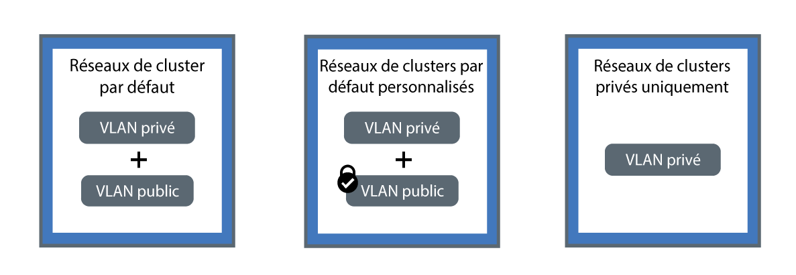

---

copyright:
  years: 2014, 2018
lastupdated: "2018-09-10"

---

{:new_window: target="_blank"}
{:shortdesc: .shortdesc}
{:screen: .screen}
{:pre: .pre}
{:table: .aria-labeledby="caption"}
{:codeblock: .codeblock}
{:tip: .tip}
{:download: .download}

# Planification des réseaux privés et en cluster
{: #planning}

Planifiez une configuration réseau pour votre cluster {{site.data.keyword.containerlong}}.
{: shortdesc}

## Description des réseaux au sein d'un cluster
{: #in-cluster}

Tous les pods qui sont déployés sur un noeud worker bénéficient d'une adresse IP privée dans la plage 172.30.0.0/16 et sont uniquement acheminés entre des noeuds worker. Pour éviter des conflits, n'utilisez pas cette plage d'adresses IP sur des noeuds qui communiquent avec vos noeuds worker. Les noeuds worker et les pods peuvent communiquer de manière sécurisée sur le réseau privé en utilisant des adresses IP privées. Toutefois, lorsqu'un pod tombe en panne ou qu'un noeud worker a besoin d'être recréé, une nouvelle adresse IP privée lui est affectée.

Par défaut, il est difficile de suivre des adresses IP privées fluctuantes pour des applications qui doivent être hautement disponibles. En guise d'alternative, vous pouvez utiliser les fonctions de reconnaissance de service Kubernetes intégrées pour exposer les applications sous forme de services IP de cluster sur le réseau privé. Un service Kubernetes regroupe un ensemble de pods et procure une connexion réseau vers ces pods. Cette connexion fournit la connectivité aux autres services dans le cluster sans exposer l'adresse IP privée réelle de chaque pod. Les services bénéficient d'une adresse IP interne au cluster accessible uniquement à l'intérieur du cluster.
* Clusters plus anciens : dans les clusters créés avant février 2018 dans la zone dal13 ou avant octobre 2017 dans les autres zones, les services bénéficient d'une adresse IP parmi les 254 adresses IP dans la plage 10.10.10.0/24. Si vous atteignez la limite de 254 services et que vous avez besoin d'autres services, vous devez créer un nouveau cluster.
* Clusters plus récents : dans les clusters créés après février 2018 dans la zone dal13 ou après octobre 2017 dans les autres zones, les services bénéficient d'une adresse IP parmi les 65 000 adresses IP dans la plage 172.21.0.0/16.

Pour éviter des conflits, n'utilisez pas cette plage d'adresses IP sur des noeuds qui communiquent avec vos noeuds worker. Une entrée de recherche DNS est également créée pour le service et stockée dans le composant `kube-dns` du cluster. L'entrée DNS contient le nom du service, l'espace de nom dans lequel il a été créé et le lien vers l'adresse IP interne au cluster.

Pour accéder à un pod situé derrière un service de cluster, les applications peuvent utiliser l'adresse IP interne au cluster du service ou envoyer une demande en utilisant le nom du service. Lorsque vous utilisez le nom du service, ce nom est recherché dans le composant `kube-dns` et la demande est acheminée à l'adresse IP interne au cluster du service. Lorsqu'une demande parvient au service, celui-ci envoie les demandes aux pods équitablement, indépendamment des adresses IP internes au cluster des pods et du noeud worker sur lequel ils sont déployés.

 

## Description des connexions VLAN et des interfaces réseau
{: #interfaces}

{{site.data.keyword.containerlong_notm}} fournit des réseaux locaux virtuels (VLAN) d'infrastructure IBM Cloud (SoftLayer) qui assurent des performances réseau et un isolement du réseau de qualité pour les noeuds worker. Un VLAN configure un groupe de noeuds worker et de pods comme s'ils étaient reliés physiquement au même câble. Les VLAN sont dédiés à votre compte {{site.data.keyword.Bluemix_notm}} et ne sont pas partagés avec les clients IBM.

Par défaut, tous les clusters sont connectés à un VLAN privé. Ce VLAN privé détermine l'adresse IP privée qui est affectée à chaque noeud worker. Vos noeuds worker disposent d'une interface réseau privée et sont accessibles sur le réseau privé. Lorsque vous créez un cluster qui est également connecté à un VLAN public, votre cluster dispose également d'une interface réseau publique. Le VLAN public permet aux noeuds worker de se connecter automatiquement au maître de manière sécurisée. Pour plus d'informations sur les VLAN par défaut correspondant à votre cluster, voir [Réseaux locaux virtuels (VLAN), sous-réseaux et adresses IP par défaut pour les clusters](cs_subnets.html#default_vlans_subnets).

Les configurations de réseaux de cluster peuvent être définies par les interfaces réseau du cluster :

* **Réseaux de cluster par défaut** : cluster avec interface réseau publique et privée
* **Réseaux de cluster par défaut personnalisés** : cluster avec une interface réseau publique et privée, et règles réseau Calico pour bloquer le trafic public entrant
* **Réseaux de cluster privés uniquement** : cluster avec une interface réseau privée uniquement

Cliquez sur l'une des configurations suivantes pour planifier les réseaux de votre cluster :

<map name="home_map" id="home_map">
<area href="#both_vlans" alt="Planification des réseaux de cluster par défaut" title="Planification des réseaux de cluster par défaut" shape="rect" coords="-7, -8, 149, 211" />
<area href="#both_vlans_private" alt="Planification des réseaux de cluster par défaut personnalisés" title="Planification des réseaux de cluster par défaut personnalisés" shape="rect" coords="196, -1, 362, 210" />
<area href="#private_vlan" alt="Planification des réseaux de cluster privés uniquement" title="Planification des réseaux de cluster privés uniquement" shape="rect" coords="409, -10, 572, 218" />
</map>

 

## Planification des réseaux de cluster par défaut
{: #both_vlans}

Par défaut, {{site.data.keyword.containerlong_notm}} configure votre cluster avec accès à un VLAN public et à un VLAN privé.
{:shortdesc}

**Qu'est-ce que cette configuration apporte à mon cluster ?**
* Une adresse IP publique pour chaque noeud worker, ce qui offre aux noeuds worker une interface réseau publique
* Une adresse IP privée pour chaque noeud worker, ce qui offre aux noeuds worker une interface réseau privée
* Une connexion OpenVPN automatique et sécurisée entre tous les noeuds worker et le maître

**Pourquoi utiliser cette configuration ?**

* Vous disposez d'une application qui doit être accessible à l'Internet public dans un cluster à zone unique.
* Vous disposez d'une application qui doit être accessible à l'Internet public dans un cluster à zones multiples. Comme vous devez activer le [spanning VLAN](cs_subnets.html#subnet-routing) pour créer un cluster à zones multiples, le cluster peut communiquer avec d'autres systèmes connectés à un VLAN privé dans le même compte IBM Cloud. **Remarque** : pour isoler votre cluster à zones multiples sur le réseau privé, utilisez des [règles réseau Calico](cs_network_policy.html#isolate_workers).

**Quelles sont mes options pour la gestion de l'accès public et privé à mon cluster ?**
 Les sections suivantes décrivent les fonctions d'{{site.data.keyword.containerlong_notm}} que vous pouvez utiliser pour configurer les réseaux des clusters connectés à un VLAN public et un VLAN privé.

### Exposition de vos applications avec des services de mise en réseau
{: #both_vlans_services}

L'interface réseau publique des noeuds worker est protégée par des [paramètres de règles réseau Calico prédéfinis](cs_network_policy.html#default_policy) qui sont configurés sur tous les noeuds worker lors de la création du cluster. Par défaut, tout le trafic réseau sortant est autorisé pour tous les noeuds worker. Le trafic réseau entrant est bloqué à l'exception de quelques ports. Ces ports sont ouverts de sorte qu'IBM puisse surveiller le trafic réseau et installer automatiquement les mises à jour de sécurité pour le maître Kubernetes.

Si vous souhaitez exposer vos applications sur le réseau public ou sur un réseau privé, vous pouvez créer des services NodePort, LoadBalancer ou Ingress publics ou privés. Pour plus d'informations sur chaque service, voir [Sélection d'un service NodePort, LoadBalancer ou Ingress](cs_network_planning.html#external).

### Facultatif : Isolement des charges de travail réseau dans les noeuds worker de périphérie
{: #both_vlans_edge}

Les noeuds worker de périphérie peuvent améliorer la sécurité de votre cluster en limitant les accès aux noeuds worker depuis l'extérieur et en isolant la charge de travail du réseau. Pour garantir que les pods Ingress et LoadBalancer sont déployés uniquement sur les noeuds worker spécifiés, [labellisez les noeuds worker en noeuds de périphérie](cs_edge.html#edge_nodes). Pour éviter l'exécution d'autres charges de travail sur les noeuds de périphérie, [ajoutez une annotation taint aux noeuds de périphérie](cs_edge.html#edge_workloads).

### Facultatif : Connexion à un réseau sur site ou à IBM Cloud Private à l'aide du réseau privé virtuel (VPN) strongSwan
{: #both_vlans_vpn}

Pour connecter vos noeuds worker et vos applications de manière sécurisée à un réseau sur site, vous devez configurer un [service VPN IPSec strongSwan ](https://www.strongswan.org/about.html). Le service VPN IPSec strongSwan fournit un canal de communication de bout en bout sécurisé sur Internet, basé sur l'ensemble de protocoles IPSec (Internet Protocol Security) aux normes de l'industrie.
* Pour configurer une connexion sécurisée entre votre cluster et un réseau sur site, [configurez et déployez le service VPN IPSec strongSwan](cs_vpn.html#vpn-setup) directement dans un pod de votre cluster.
* Pour configurer une connexion sécurisée entre votre cluster et une instance IBM Cloud Private, voir [Connexion de votre cloud public et de votre cloud privé au réseau privé virtuel (VPN) strongSwan](cs_hybrid.html#hybrid_vpn).

 

## Planification des réseaux de cluster par défaut personnalisés
{: #both_vlans_private}

Par défaut, {{site.data.keyword.containerlong_notm}} configure votre cluster avec accès à un VLAN public et à un VLAN privé. Cependant, vous pouvez personnaliser la configuration des réseaux par défaut en utilisant des règles réseau pour bloquer l'accès public.
{:shortdesc}

**Qu'est-ce que cette configuration apporte à mon cluster ?**
* Une adresse IP publique pour chaque noeud worker, ce qui offre aux noeuds worker une interface réseau publique
* Une adresse IP privée pour chaque noeud worker, ce qui offre aux noeuds worker une interface réseau privée
* Une connexion OpenVPN automatique et sécurisée entre tous les noeuds worker et le maître

**Pourquoi utiliser cette configuration ?**

* Vous disposez d'une application dans un cluster à zone unique. Vous souhaitez exposer cette application uniquement sur les pods figurant dans le cluster ou dans d'autres clusters connectés au même VLAN privé.
* Vous disposez d'une application dans un cluster à zones multiples. Vous souhaitez exposer cette application uniquement sur les pods figurant dans le cluster ou dans d'autres clusters connectés aux mêmes VLAN privés que votre cluster. 

**Quelles sont mes options pour la gestion de l'accès public et privé à mon cluster ?** Les sections suivantes décrivent les fonctions d'{{site.data.keyword.containerlong_notm}} que vous pouvez utiliser pour configurer les réseaux privés uniquement et bloquer les réseaux publics pour les clusters connectés à un VLAN public et un VLAN privé.

### Exposition de vos applications avec des services de mise en réseau privés et sécurisation de votre cluster pour bloquer l'accès public avec des règles réseau Calico
{: #both_vlans_private_services}

L'interface réseau publique des noeuds worker est protégée par des [paramètres de règles réseau Calico prédéfinis](cs_network_policy.html#default_policy) qui sont configurés sur tous les noeuds worker lors de la création du cluster. Par défaut, tout le trafic réseau sortant est autorisé pour tous les noeuds worker. Le trafic réseau entrant est bloqué à l'exception de quelques ports. Ces ports sont ouverts de sorte qu'IBM puisse surveiller le trafic réseau et installer automatiquement les mises à jour de sécurité pour le maître Kubernetes.

Si vous souhaitez exposer vos applications uniquement sur un réseau privé, vous pouvez créer des services NodePort, LoadBalancer ou Ingress privés. Pour plus d'informations sur la planification des réseaux externes privés, voir [Planification de réseau externe privé pour une configuration de VLAN public et privé](cs_network_planning.html#private_both_vlans).

Toutefois, les règles réseau Calico autorisent également le trafic réseau public entrant d'Internet vers ces services. Vous pouvez créer des règles Calico pour bloquer à la place tout le trafic public vers ces services. Par exemple, un service NodePort ouvre un port sur un noeud worker via à la fois l'adresse IP privée et l'adresse IP publique du noeud worker. Un service d'équilibreur de charge avec une adresse IP privée portable ouvre un service NodePort public sur tous les noeuds worker. Vous devez créer une [règle réseau preDNAT de Calico](cs_network_policy.html#block_ingress) pour bloquer les services NodePort publics.

Par exemple, supposons que vous ayez créé un service d'équilibreur de charge privé. Vous avez également créé une règle preDNAT Calico pour empêcher le trafic public d'atteindre les services NodePort ouverts par l'équilibreur de charge. Cet équilibreur de charge privé est accessible à :
* [Tout pod figurant dans le même cluster](#in-cluster)
* Tout pod figurant dans un cluster connecté au même VLAN privé
* Si vous avez la fonction [spanning VLAN activée](cs_subnets.html#subnet-routing), tout système connecté à l'un des VLAN privés dans le même compte IBM Cloud
* Si vous n'êtes pas dans le compte IBM Cloud mais toujours derrière le pare-feu de l'entreprise, tout système via une connexion VPN au sous-réseau sur lequel figure l'adresse IP de l'équilibreur de charge
* Si vous êtes dans un autre compte IBM Cloud, tout système via une connexion VPN au sous-réseau sur lequel figure l'adresse IP de l'équilibreur de charge

### Isolement de votre cluster sur le réseau privé
{: #isolate}

Si vous disposez d'un cluster à zones multiples, de plusieurs VLAN pour un cluster à zone unique ou de plusieurs sous-réseaux sur le même VLAN, vous devez [activer le spanning VLAN](/docs/infrastructure/vlans/vlan-spanning.html#vlan-spanning) pour que vos noeuds worker puissent communiquer entre eux sur le réseau privé. Cependant, lorsque le spanning VLAN est activé, tout système connecté à l'un des VLAN privés dans le même compte IBM Cloud peut accéder à vos noeuds worker. Vous pouvez isoler votre cluster à zones multiples des autres systèmes sur le réseau privé en utilisant des [règles réseau Calico](cs_network_policy.html#isolate_workers). Ces règles permettent également l'entrée et la sortie pour les plages d'adresses IP privées et les ports que vous avez ouverts dans votre pare-feu privé.

### Facultatif : Isolement des charges de travail réseau dans les noeuds worker de périphérie
{: #both_vlans_private_edge}

Les noeuds worker de périphérie peuvent améliorer la sécurité de votre cluster en limitant les accès aux noeuds worker depuis l'extérieur et en isolant la charge de travail du réseau. Pour garantir que les pods Ingress et LoadBalancer sont déployés uniquement sur les noeuds worker spécifiés, [labellisez les noeuds worker en noeuds de périphérie](cs_edge.html#edge_nodes). Pour éviter l'exécution d'autres charges de travail sur les noeuds de périphérie, [ajoutez une annotation taint aux noeuds de périphérie](cs_edge.html#edge_workloads).

Utilisez ensuite une [règle réseau preDNAT Calico](cs_network_policy.html#block_ingress) pour bloquer le trafic vers les services NodePort publics sur les clusters qui exécutent des noeuds worker de périphérie. Le blocage des ports de noeud assure que les noeuds worker de périphérie sont les seuls noeuds worker à traiter le trafic entrant.

### Facultatif : Connexion à un réseau sur site ou à IBM Cloud Private à l'aide du réseau privé virtuel (VPN) strongSwan
{: #both_vlans_private_vpn}

Pour connecter vos noeuds worker et vos applications de manière sécurisée à un réseau sur site, vous devez configurer un [service VPN IPSec strongSwan ](https://www.strongswan.org/about.html). Le service VPN IPSec strongSwan fournit un canal de communication de bout en bout sécurisé sur Internet, basé sur l'ensemble de protocoles IPSec (Internet Protocol Security) aux normes de l'industrie.
* Pour configurer une connexion sécurisée entre votre cluster et un réseau sur site, [configurez et déployez le service VPN IPSec strongSwan](cs_vpn.html#vpn-setup) directement dans un pod de votre cluster.
* Pour configurer une connexion sécurisée entre votre cluster et une instance IBM Cloud Private, voir [Connexion de votre cloud public et de votre cloud privé au réseau privé virtuel (VPN) strongSwan](cs_hybrid.html#hybrid_vpn).

 

## Planification des réseaux de cluster privés uniquement
{: #private_vlan}

Vous pouvez opter pour la [création d'un cluster avec un VLAN privé uniquement](cs_clusters.html#clusters_cli) en incluant l'indicateur `--private-only` dans l'interface de ligne de commande. Lorsque vos noeuds worker sont connectés uniquement à un VLAN privé, ils ne peuvent pas se connecter automatiquement au maître. Vous devez utiliser un dispositif de passerelle pour connecter les noeuds worker au maître. Vous pouvez également utiliser le dispositif de passerelle en tant que pare-feu pour bloquer tout accès non désiré à votre cluster.
{:shortdesc}

**Qu'est-ce que cette configuration apporte à mon cluster ?**
* Une adresse IP privée pour chaque noeud worker, ce qui offre aux noeuds worker une interface réseau privée

**Qu'est-ce que cette configuration n'apporte pas à mon cluster ?**
* Une adresse IP publique pour chaque noeud worker, ce qui offre aux noeuds worker une interface réseau publique. Le cluster n'est jamais accessible au public.
* Une connexion automatique entre tous les noeuds worker et le maître. Vous devez fournir cette connexion en [configurant un dispositif de passerelle](#private_vlan_gateway).

**Pourquoi utiliser cette configuration ?**
 Vous avez des exigences spécifiques en matière de sécurité ou vous avez besoin de créer des règles réseau personnalisées et des règles de routage pour apporter une sécurité des réseaux dédiée. **Remarque** : l'utilisation d'un dispositif de passerelle est facturée séparément. Pour obtenir des détails, voir la [documentation](/docs/infrastructure/fortigate-10g/explore-firewalls.html).

**Quelles sont mes options pour la gestion de l'accès public et privé à mon cluster ?**
 Les sections suivantes décrivent les fonctions d'{{site.data.keyword.containerlong_notm}} que vous pouvez utiliser pour configurer les réseaux de clusters connectés à un VLAN privé uniquement.

### Configuration d'un dispositif de passerelle
{: #private_vlan_gateway}

Si les noeuds worker sont configurés uniquement avec un VLAN privé, vous devez configurer une autre solution pour la connectivité du réseau entre vos noeuds worker et le maître. Vous pouvez mettre en place un pare-feu avec des règles réseau personnalisées afin d'assurer une sécurité réseau dédiée pour votre cluster standard et détecter et parer à des intrusions réseau. Par exemple, vous pouvez choisir de configurer un [dispositif de routeur virtuel](/docs/infrastructure/virtual-router-appliance/about.html) ou un [dispositif de sécurité Fortigate](/docs/infrastructure/fortigate-10g/about.html) qui fera office de pare-feu et bloquera le trafic indésirable. Lorsque vous configurez un pare-feu, vous devez également [ouvrir les ports et les adresses IP requis](cs_firewall.html#firewall_outbound) pour chaque région de manière à permettre au maître et aux noeuds worker de communiquer.

**Remarque** : si vous disposez d'un dispositif de routage existant et que vous ajoutez ensuite un cluster, les nouveaux sous-réseaux portables commandés pour le cluster ne sont pas configurés sur ce dispositif. Pour utiliser les services de réseau, vous devez activer le routage entre les sous-réseaux sur le même VLAN en [activant la fonction Spanning VLAN](cs_subnets.html#vra-routing).

Pour vérifier si la fonction Spanning VLAN est déjà activée, utilisez la [commande](cs_cli_reference.html#cs_vlan_spanning_get) `ibmcloud ks vlan-spanning-get`.
{: tip}

### Exposition de vos applications avec des services de réseau privé
{: #private_vlan_services}

Pour que votre application ne soit accessible qu'à partir d'un réseau privé, vous pouvez utiliser des services NodePort, LoadBalancer ou Ingress privés. Comme vos noeuds worker ne sont pas connectés à un VLAN public, aucun trafic public n'est acheminé vers ces services. Vous devez également [ouvrir les ports et les adresses IP requis](cs_firewall.html#firewall_inbound) pour autoriser le trafic entrant pour ces services.

Pour plus d'informations sur chaque service, voir [Sélection d'un service NodePort, LoadBalancer ou Ingress](cs_network_planning.html#external).

### Facultatif : Connexion à une base de données sur site à l'aide du dispositif de passerelle.
{: #private_vlan_vpn}

Pour connecter vos noeuds worker et vos applications de manière sécurisée à un réseau sur site, vous devez configurer une passerelle VPN. Vous pouvez utiliser des dispositifs de routeur virtuel (VRA) ou des dispositifs de sécurité Fortigate (FSA) que vous avez configurés auparavant pour configurer également un point de terminaison VPN IPSec. Pour configurer un dispositif VRA, voir [Configuration de la connectivité VPN avec un dispositif de routeur virtuel (VRA)](cs_vpn.html#vyatta).
