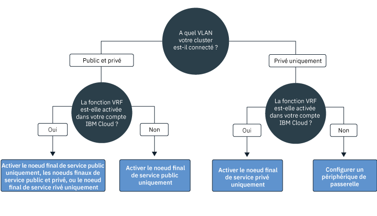
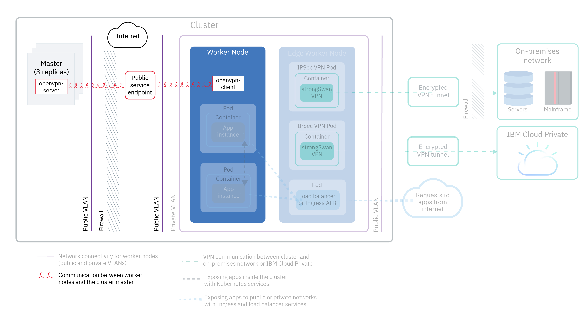

---

copyright:
  years: 2014, 2019
lastupdated: "2019-04-15"

---

{:new_window: target="_blank"}
{:shortdesc: .shortdesc}
{:screen: .screen}
{:pre: .pre}
{:table: .aria-labeledby="caption"}
{:codeblock: .codeblock}
{:tip: .tip}
{:note: .note}
{:important: .important}
{:deprecated: .deprecated}
{:download: .download}

# Planification réseau de votre cluster
{: #cs_network_ov}

Planifiez une configuration réseau pour votre cluster {{site.data.keyword.containerlong}}.
{: shortdesc}

Cette page vous aide à réaliser la configuration réseau de votre cluster. Vous recherchez des informations pour configurer la mise à en réseau de votre application ? Voir [Planification de l'exposition de vos applications avec une mise en réseau au sein du cluster et en externe](/docs/containers?topic=containers-cs_network_planning).
{: tip}

## Description des principes de base d'un réseau {{site.data.keyword.containerlong_notm}}
{: #cs_network_ov_basics}

Avant de commencer à configurer le réseau de votre cluster, il est important de comprendre les concepts de base de la mise en réseau dans les clusters {{site.data.keyword.containerlong_notm}}.
{: shortdesc}

### Quels composants de cluster doivent communiquer entre eux ?
{: #cs_network_ov_basics_components}

Lorsque vous créez votre cluster, vous devez choisir une configuration réseau pour permettre à certains composants du cluster de communiquer entre eux.
{: shortdesc}

* Tous les noeuds worker doivent être connectés à un réseau local virtuel (VLAN) pour communiquer entre eux et avec le maître Kubernetes. Pour choisir des VLAN, voir [Planification de la communication entre les noeuds worker](#cs_network_ov_worker).
* La communication doit être autorisée sur plusieurs VLAN privés pour permettre aux noeuds worker de se connecter entre eux et avec le maître. Pour activer une fonction de routeur virtuel (VRF) ou de spanning VLAN, voir [Comment sont configurés les VLAN et les sous-réseaux pour assurer la segmentation du réseau ?](#cs_network_ov_basics_segmentation).
* Vos noeuds worker peuvent communiquer de manière sécurisée avec le maître Kubernetes sur le réseau public ou sur le réseau privé. Pour choisir votre canal de communication entre les noeuds worker et le maître, voir [Planification de la communication entre le maître et les noeuds worker](#cs_network_ov_master).

### Comment fonctionne la mise en réseau dans {{site.data.keyword.containerlong_notm}} ?
{: #cs_network_ov_basics_vlans}

{{site.data.keyword.containerlong_notm}} utilise des VLAN, des sous-réseaux et des adresses IP pour fournir la connectivité réseau aux composants du cluster.
{: shortdesc}

**Que sont les réseaux locaux virtuels (VLAN) ? Quels sont les types de VLAN proposés par {{site.data.keyword.containerlong_notm}} ?** 

Lorsque vous créez un cluster, les noeuds worker du cluster sont connectés automatiquement à un VLAN. Un VLAN configure un groupe de noeuds worker et de pods comme s'ils étaient reliés physiquement au même câble et fournit un canal pour la connectivité entre les noeuds worker et les pods.
{: shortdesc}

<dl>
<dt>VLAN pour clusters gratuits</dt>
<dd>Dans les clusters gratuits, les noeuds worker du cluster sont connectés par défaut à un VLAN public et un VLAN privé dont IBM est le propriétaire. IBM contrôlant les VLAN, les sous-réseaux et les adresses IP, vous ne pouvez pas créer des clusters à zones multiples ni ajouter des sous-réseaux à votre cluster, et vous ne pouvez utiliser que des services NodePort pour exposer votre application.</dd>
<dt>VLAN pour clusters standard</dt>
<dd>Dans les clusters standard, la première fois que vous créez un cluster dans une zone, un VLAN public et un VLAN privé sont automatiquement mis à votre disposition dans cette zone dans votre compte d'infrastructure IBM Cloud (SoftLayer). Pour tous les autres clusters que vous créez dans cette zone, vous devez spécifier la paire de VLAN que vous souhaitez utiliser dans cette zone. Vous pouvez réutiliser le même VLAN public et le même VLAN privé que ceux que vous avez créés pour vous car les VLAN peuvent être partagés par plusieurs clusters.   Vous pouvez connecter vos noeuds worker à la fois à un VLAN public et au VLAN privé, ou seulement au VLAN privé. Si vous désirez connecter vos noeuds worker uniquement à un VLAN privé, vous pouvez utiliser l'ID d'un VLAN existant ou [créer un VLAN privé](/docs/cli/reference/ibmcloud?topic=cloud-cli-manage-classic-vlans#sl_vlan_create) et utiliser l'ID lors de la création du cluster.</dd></dl>

Pour voir quels sont les VLAN mis à disposition dans chaque zone de votre compte, exécutez la commande `ibmcloud ks vlans --zone <zone>.` Pour voir quels sont les VLAN sur lesquels est mis à disposition un cluster, exécutez la commande `ibmcloud ks cluster-get --cluster <cluster_name_or_ID> --showResources` et recherchez la section **Subnet VLANs**. 

L'infrastructure IBM Cloud (SoftLayer) gère les VLAN qui sont mis à disposition automatiquement lorsque vous créez votre premier cluster dans une zone. Si vous laissez un VLAN inactif, par exemple en supprimant tous les noeuds worker qui s'y trouvent, l'infrastructure IBM Cloud (SoftLayer) récupère ce VLAN. Par la suite, si vous avez besoin d'un nouveau VLAN, [contactez le support {{site.data.keyword.Bluemix_notm}}](/docs/infrastructure/vlans?topic=vlans-ordering-premium-vlans#ordering-premium-vlans).

**Comment mon choix de VLAN affecte-t-il mon cluster ?** 

Votre choix de connexions de VLAN détermine comment le maître Kubernetes et les noeuds worker peuvent communiquer entre eux dans votre cluster. Pour plus d'informations, voir [Planification de la communication entre les noeuds worker et le maître Kubernetes](/docs/containers?topic=containers-cs_network_ov#cs_network_ov_master).

Votre choix de connexions de VLAN peut également déterminer la connectivité réseau pour vos applications. Pour plus d'informations, voir [Planification de l'exposition de vos applications avec une mise en réseau au sein du cluster et en externe](/docs/containers?topic=containers-cs_network_planning).

### Que sont les sous-réseaux ? Quels sont les types de sous-réseaux proposés par {{site.data.keyword.containerlong_notm}} ?
{: #cs_network_ov_basics_subnets}

En plus des noeuds worker et des pods, des sous-réseaux sont également automatiquement mis à disposition sur les VLAN. Les sous-réseaux fournissent la connectivité réseau aux composants de votre cluster en leur affectant des adresses IP.
{: shortdesc}

Les sous-réseaux suivants sont automatiquement mis à disposition sur les VLAN public et privé :

**Sous-réseaux de VLAN public**
* Le sous-réseau public principal détermine les adresses IP publiques qui sont affectées aux noeuds worker lors de la création du cluster. Plusieurs clusters figurant sur le même VLAN peuvent partager un sous-réseau public principal.
* Le sous-réseau public portable est lié à un seul cluster et fournit 8 adresses IP publiques au cluster. 3 adresses IP sont réservées aux fonctions de l'infrastructure IBM Cloud (SoftLayer). 1 adresse IP est utilisée par l'équilibreur de charge d'application (ALB) Ingress public par défaut et 4 adresses peuvent être utilisées pour créer des services d'équilibreur de charge de réseau public. Les adresses IP publiques portables sont des adresses IP permanentes fixes pouvant être utilisées pour accéder aux équilibreurs de charge de réseau via Internet. Si vous avez besoin de plus de 4 adresses IP pour les équilibreurs de charge de réseau, voir [Ajout d'adresses IP portables](/docs/containers?topic=containers-subnets#adding_ips).

**Sous-réseaux de VLAN privé**
* Le sous-réseau privé principal détermine les adresses IP privées qui sont affectées aux noeuds worker lors de la création du cluster. Plusieurs clusters figurant sur le même VLAN peuvent partager un sous-réseau privé principal.
* Le sous-réseau privé portable est lié à un seul cluster et fournit 8 adresses IP privées au cluster. 3 adresses IP sont réservées aux fonctions de l'infrastructure IBM Cloud (SoftLayer). 1 adresse IP est utilisée par l'équilibreur de charge d'application (ALB) Ingress public par défaut et 4 adresses IP peuvent être utilisées pour créer des services d'équilibreur de charge de réseau privé. Les adresses IP publiques portables sont des adresses IP permanentes fixes pouvant être utilisées pour accéder aux équilibreurs de charge de réseau via un réseau privé. Si vous avez besoin de plus de 4 adresses IP pour les équilibreurs de charge de réseau privés, voir [Ajout d'adresses IP portables](/docs/containers?topic=containers-subnets#adding_ips).

Pour voir tous les sous-réseaux mis à disposition dans votre compte, exécutez la commande `ibmcloud ks subnets`. Pour voir les sous-réseaux portables publics et privés liés à un cluster, vous pouvez exécuter la commande `ibmcloud ks cluster-get <cluster_name_or_ID> --showResources` et recherchez la section **Subnet VLANs**.

Dans {{site.data.keyword.containerlong_notm}}, les VLAN sont limités à 40 sous-réseaux. Si vous atteignez cette limite, vérifiez d'abord si vous pouvez [réutiliser des sous-réseaux du VLAN pour créer d'autres clusters](/docs/containers?topic=containers-subnets#subnets_custom). Si vous avez besoin d'un nouveau VLAN, commandez-en un en [contactant le support {{site.data.keyword.Bluemix_notm}}](/docs/infrastructure/vlans?topic=vlans-ordering-premium-vlans#ordering-premium-vlans). Ensuite, [créez un cluster](/docs/containers?topic=containers-cs_cli_reference#cs_cluster_create) qui utilise ce nouveau VLAN.
{: note}

### Comment sont configurés les VLAN et les sous-réseaux pour assurer la segmentation du réseau ?
{: #cs_network_ov_basics_segmentation}

La segmentation du réseau décrit l'approche utilisée pour diviser un réseau en plusieurs sous-réseaux. Les applications qui s'exécutent dans un sous-réseau ne peuvent pas voir ou accéder aux applications figurant dans un autre sous-réseau. Pour plus d'informations sur les options de segmentation du réseau et leurs relations avec les VLAN, voir [cette rubrique de sécurité de cluster](/docs/containers?topic=containers-security#network_segmentation).
{: shortdesc}

Cependant, dans plusieurs situations, les composants de votre cluster doivent être autorisés à communiquer sur plusieurs VLAN privés. Par exemple, si vous souhaitez créer un cluster à zones multiples, si vous disposez de plusieurs VLAN pour un cluster ou de plusieurs sous-réseaux sur le même VLAN, les noeuds worker sur les différents sous-réseaux du même VLAN ou dans différents VLAN ne peuvent pas automatiquement communiquer entre eux. Vous devez activer une fonction de routeur virtuel (VRF) ou de spanning VLAN pour votre compte d'infrastructure IBM Cloud (SoftLayer).

**Que sont les fonctions de routeur virtuel (VRF) et de spanning VLAN ?** 

<dl>
<dt>[Fonction de routeur virtuel (VRF)](/docs/infrastructure/direct-link?topic=direct-link-overview-of-virtual-routing-and-forwarding-vrf-on-ibm-cloud#overview-of-virtual-routing-and-forwarding-vrf-on-ibm-cloud)</dt>
<dd>Une fonction VRF active tous les VLAN et les sous-réseaux dans votre compte d'infrastructure pour qu'ils communiquent entre eux. De plus, une fonction VRF est requise pour autoriser vos noeuds worker et le maître à communiquer via le noeud final de service privé. Pour activer la fonction VRF, [contactez le représentant de votre compte d'infrastructure IBM Cloud (SoftLayer)](/docs/infrastructure/direct-link?topic=direct-link-overview-of-virtual-routing-and-forwarding-vrf-on-ibm-cloud#how-you-can-initiate-the-conversion). Notez que la fonction VRF élimine l'option Spanning VLAN de votre compte car tous les VLAN sont en mesure de communiquer sauf si vous configurez un dispositif de passerelle pour gérer le trafic.</dd>
<dt>[Spanning VLAN](/docs/infrastructure/vlans?topic=vlans-vlan-spanning#vlan-spanning)</dt>
<dd>Si vous ne parvenez pas à activer la fonction VRF ou si vous ne souhaitez pas le faire, activez la fonction Spanning VLAN. Pour effectuer cette action, vous devez disposer du [droit d'infrastructure](/docs/containers?topic=containers-users#infra_access) **Réseau > Gérer le spanning VLAN pour réseau**, ou vous pouvez demander au propriétaire du compte de l'activer. Pour vérifier si le spanning VLAN est déjà activé, utilisez la [commande](/docs/containers?topic=containers-cs_cli_reference#cs_vlan_spanning_get) `ibmcloud ks vlan-spanning-get`. Notez que vous ne pouvez pas activer le noeud final de service privé si vous choisissez d'activer la fonction Spanning VLAN à la place d'une fonction VRF.</dd>
</dl>

**Comment les fonctions VRF ou Spanning VLAN affectent-elles la segmentation du réseau ?** 

Lorsque la fonction VRF ou Spanning VLAN est activée, tout système connecté à l'un de vos VLAN privés dans le même compte {{site.data.keyword.Bluemix_notm}} peut communiquer avec des noeuds worker. Vous pouvez isoler votre cluster des autres systèmes sur le réseau privé en appliquant des [règles de réseau privé Calico](/docs/containers?topic=containers-network_policies#isolate_workers). {{site.data.keyword.containerlong_notm}} est également compatible avec toutes les [offres de pare-feu d'infrastructure IBM Cloud (SoftLayer) ](https://www.ibm.com/cloud-computing/bluemix/network-security). Vous pouvez mettre en place un pare-feu, tel qu'un [dispositif de routeur virtuel (VRA)](/docs/infrastructure/virtual-router-appliance?topic=virtual-router-appliance-about-the-vra), avec des règles réseau personnalisées afin d'assurer une sécurité réseau dédiée pour votre cluster standard et détecter et parer à des intrusions réseau.

 

## Planification de la communication entre les noeuds worker
{: #cs_network_ov_worker}

Tous les noeuds worker doivent être connectés à un réseau local virtuel (VLAN) pour disposer d'une interface réseau. Cette interface réseau permet à chaque noeud worker d'envoyer et de recevoir des informations à destination et en provenance d'autres noeuds worker.
{: shortdesc}

### Quelles sont les options dont je dispose pour la connectivité de VLAN de noeud worker ?
{: #cs_network_ov_worker_options}

Lors de la création de votre cluster, vous pouvez connecter vos noeuds worker à un VLAN public et un VLAN privé ou uniquement à un VLAN privé.
{: shortdesc}

**Pourquoi connecter mon cluster à un VLAN public et un VLAN privé ?** 

Dans la plupart des cas, vous pouvez obtenir une certaine flexibilité de réseau en créant un cluster connecté à la fois à un VLAN public et à un VLAN privé. Par exemple :
* Vous disposez d'une application qui doit être accessible au public sur Internet.
* Vous disposez d'une application que vous souhaitez exposer uniquement sur des pods au sein du cluster ou dans d'autres clusters connectés au même VLAN privé. Vous avez plusieurs options possibles pour sécuriser votre application sur l'interface publique, par exemple utiliser des règles réseau Calico ou isoler la charge de travail de réseau externe sur des noeuds worker de périphérie.

L'image suivante illustre la connectivité réseau pour les noeuds worker connectés à un VLAN public et un VLAN privé.

<figure>
 
 <figcaption>Connectivité réseau pour les noeuds worker connectés à un VLAN public et un VLAN privé</figcaption>
</figure>

Si vous souhaitez créer un cluster à zones multiples, si vous disposez de plusieurs VLAN pour un cluster ou de plusieurs sous-réseaux sur le même VLAN, les noeuds worker sur les différents sous-réseaux du même VLAN ou dans différents VLAN ne peuvent pas automatiquement communiquer entre eux. Vous devez activer la fonction [VRF ou Spanning VLAN](#cs_network_ov_basics_segmentation) pour votre compte d'infrastructure IBM Cloud (SoftLayer). Choisissez VRF pour activer le [noeud final de service privé pour la communication entre le maître et les noeuds worker](#cs_network_ov_master_private). Si vous ne parvenez pas à activer la fonction VRF ou si vous ne souhaitez pas le faire, activez la fonction Spanning VLAN.

**Pourquoi connecter mon cluster uniquement à un VLAN privé ?** 

Créez un cluster avec uniquement un VLAN privé si vous avez des exigences spécifiques en matière de sécurité ou si vous avez besoin de créer des règles réseau et des règles de routage personnalisées pour apporter une sécurité de réseau dédiée.
{: shortdesc}

L'image suivante illustre la connectivité réseau pour les noeuds worker connectés uniquement à un VLAN privé.

<figure>
 
 <figcaption>Connectivité réseau pour les noeuds worker dans une configuration de réseau privé</figcaption>
</figure>

Si vous souhaitez créer un cluster à zones multiples, si vous disposez de plusieurs VLAN pour un cluster ou de plusieurs sous-réseaux sur le même VLAN, les noeuds worker sur les différents sous-réseaux du même VLAN ou dans différents VLAN ne peuvent pas automatiquement communiquer entre eux. Vous devez activer la fonction [VRF ou Spanning VLAN](#cs_network_ov_basics_segmentation) pour votre compte d'infrastructure IBM Cloud (SoftLayer). Choisissez VRF pour activer le [noeud final de service privé pour la communication entre le maître et les noeuds worker](#cs_network_ov_master_private). Si vous ne parvenez pas à activer la fonction VRF ou si vous ne souhaitez pas le faire, vous devez activer la fonction Spanning VLAN et configurer également un périphérique de passerelle pour la communication entre le maître et les noeuds worker.

### J'ai choisi mes connexions de VLAN. Comment les configurer ?
{: #cs_network_ov_worker_setup}

Vous pouvez suivre la procédure indiquée dans la rubrique [Configuration réseau avec un VLAN public et un VLAN privé](/docs/containers?topic=containers-cs_network_cluster#both_vlans) ou [Configuration réseau avec un VLAN privé uniquement](/docs/containers?topic=containers-cs_network_cluster#setup_private_vlan).
{: shortdesc}

### Puis-je changer d'avis sur mes VLAN par la suite ? Mes adresses IP de noeud worker changent-elles ?
{: #cs_network_ov_worker_change}

Vous pouvez changer la configuration de vos VLAN en modifiant les pools de noeuds worker dans votre cluster. Pour plus d'informations, voir [Modification des connexions de VLAN de vos noeuds worker](/docs/containers?topic=containers-cs_network_cluster#change-vlans).
{: shortdesc}

Une adresse IP est affectée à votre noeud worker sur les VLAN publics ou privés que votre cluster utilise. Une fois que le noeud worker est mis à disposition, les adresses IP ne changent pas. Par exemple, les adresses IP de noeud worker sont conservées au cours des opérations `reload`, `reboot` et `update`. De plus, l'adresse IP du noeud worker est utilisée pour l'identité de noeud worker dans la plupart des commandes `kubectl`. Si vous changez les VLAN que le pool worker utilise, les nouveaux noeuds worker qui sont mis à disposition dans ce pool utilisent les nouveaux VLAN pour leurs adresses IP. Les adresses IP de noeud worker existantes ne changent pas, mais vous pouvez choisir de retirer les noeuds worker qui utilisent les anciens VLAN. 

 

## Planification de la communication entre le maître et les noeuds worker
{: #cs_network_ov_master}

Lors de la création de votre cluster, vous devez choisir comment communiquent vos noeuds worker et le maître Kubernetes pour orchestrer vos configurations de cluster.
{: shortdesc}

Un canal de communication doit être instauré pour que le maître Kubernetes puisse gérer vos noeuds worker. La configuration de cette communication dépend de la manière dont vous avez configuré la connectivité de vos VLAN. Vous pouvez permettre la communication entre vos noeuds worker et le maître Kubernetes en activant des noeuds finaux de service uniquement publics, publics et privés ou uniquement privés. Pour déterminer si vous pouvez utiliser des noeuds finaux de service, suivez cet arbre de décisions.

<map name="dt-image-map" id="dt-image-map">
  <area alt="Configuration réseau par défaut avec des noeuds de service publics, publics et privé, ou privés" title="Configuration réseau par défaut avec des noeuds de service publics, publics ou privés" href="#cs_network_ov_master_both" coords="0,296,195,354" shape="rect" />
  <area alt="Configuration réseau par défaut avec un noeud final de service public uniquement" title="Configuration réseau par défaut avec un noeud final de service public uniquement" href="#cs_network_ov_master_public" coords="220,295,353,352" shape="rect" />
  <area alt="Configuration de réseau privé avec un noeud final de service privé uniquement" title="Configuration de réseau privé avec un noeud final de service privé uniquement" href="#cs_network_ov_master_private" coords="393,294,524,356" shape="rect" />
  <area alt="Configuration réseau avec un dispositif de passerelle" title="Configuration réseau avec un dispositif de passerelle" href="#cs_network_ov_master_gateway" coords="579,294,697,354" shape="rect" />
</map>

Consultez les sections suivantes pour plus d'informations sur chaque configuration.

### Noeud final de service public
{: #cs_network_ov_master_public}

Si les noeuds worker sont configurés avec un VLAN privé et un VLAN public, vos noeuds worker peuvent automatiquement se connecter au maître sur le réseau public via le noeud final de service public. Une fonction de routeur virtuel (VRF) n'est pas nécessaire dans votre compte {{site.data.keyword.Bluemix_notm}}.
{: shortdesc}

L'image suivante illustre la communication entre les noeuds worker et le maître Kubernetes via un noeud final de service public.

<figure>
 
 <figcaption>Communication entre les noeuds worker et le maître Kubernetes via un noeud final de service public</figcaption>
</figure>

**Communication entre les noeuds worker et le maître** 
La communication est établie de manière sécurisée sur le réseau public via le noeud final de service public. Les noeuds worker dialoguent avec le maître via des certificats TLS et le maître dialogue avec eux via une connexion OpenVPN.

**Accès au maître** 
Le maître est accessible au public pour les utilisateurs de cluster autorisés via le noeud final de service public. Les utilisateurs de votre cluster peuvent accéder de manière sécurisée à votre maître Kubernetes sur Internet pour exécuter des commandes `kubectl`, par exemple.

Pour configurer le noeud final de service public uniquement pendant ou après la création du cluster, suivez la procédure indiquée dans la rubrique [Configuration du noeud final de service public](/docs/containers?topic=containers-cs_network_cluster#set-up-public-se).

### Noeud final de service privé uniquement
{: #cs_network_ov_master_private}

Pour rendre votre maître accessible uniquement en privé, vous pouvez activer le noeud final de service privé dans les clusters exécutant Kubernetes version 1.11 ou ultérieure. Une fonction de routeur virtuel (VRF) est requise dans votre compte {{site.data.keyword.Bluemix_notm}}. Lorsque votre cluster est connecté uniquement à un VLAN privé, un noeud final de service privé évite d'avoir à utiliser un périphérique de passerelle pour établir une connexion sécurisée avec le maître.
{: shortdesc}

L'image suivante illustre la communication entre les noeuds worker et le maître Kubernetes via un noeud final de service privé.

<figure>
 
 <figcaption>Communication entre les noeuds worker et le maître Kubernetes via un noeud final de service privé</figcaption>
</figure>

**Communication entre les noeuds worker et le maître** 
La communication est établie sur le réseau privé via le noeud final de service privé. 

**Accès au maître** 
Les utilisateurs de votre cluster doivent figurer dans votre réseau privé {{site.data.keyword.Bluemix_notm}} ou se connecter au réseau privé via une connexion VPN pour accéder au maître. 

Pour configurer le noeud final de service privé uniquement pendant ou après la création du cluster, suivez la procédure indiquée dans la rubrique [Configuration du noeud final de service privé](/docs/containers?topic=containers-cs_network_cluster#set-up-private-se).

### Noeud finaux de service public et privé
{: #cs_network_ov_master_both}

Pour rendre votre maître accessible au public ou en privé aux utilisateurs du cluster, vous pouvez activer les noeuds finaux de service public ou privé dans les clusters exécutant Kubernetes version 1.11 ou ultérieure. Une fonction de routeur virtuel (VRF) est requise dans votre compte {{site.data.keyword.Bluemix_notm}}.
{: shortdesc}

**Communication entre les noeuds worker et le maître** 
La communication est établie sur le réseau privé via le noeud final de service privé et sur le réseau public via le noeud final de service public. En acheminant la moitié du trafic worker vers maître via le noeud final public et l'autre moitié via le noeud final privé, votre communication maître vers worker est protégée contre d'éventuelles pannes du réseau public ou privé. 

**Accès au maître** 
Le maître est accessible en privé via le noeud final de service privé si les utilisateurs du cluster autorisés figurent dans votre réseau privé {{site.data.keyword.Bluemix_notm}} ou s'ils sont connectés au réseau privé via une connexion VPN. Sinon, le maître est accessible au public pour les utilisateurs du cluster autorisés via le noeud final de service public.

Pour configurer des noeuds finaux de service public et privé pendant la création du cluster, suivez la procédure indiquée dans la rubrique [Configuration du noeud final de service privé](/docs/containers?topic=containers-cs_network_cluster#set-up-private-se). Après la création du cluster, vous pouvez activer le noeud final de service [public](/docs/containers?topic=containers-cs_network_cluster#set-up-public-se) ou [privé](/docs/containers?topic=containers-cs_network_cluster#set-up-private-se) individuellement.

### Configuration de réseau privé avec un dispositif de passerelle
{: #cs_network_ov_master_gateway}

Si les noeuds worker sont configurés uniquement avec un VLAN privé et que la fonction de routeur virtuel (VRF) n'est pas activée dans votre compte {{site.data.keyword.Bluemix_notm}}, vous devez configurer une autre solution pour la connectivité réseau entre vos noeuds worker et le maître. Vous pouvez mettre en place un pare-feu avec des règles réseau personnalisées afin d'assurer une sécurité réseau dédiée pour votre cluster standard et détecter et parer à des intrusions réseau. Par exemple, vous pouvez choisir de configurer un [dispositif de routeur virtuel (VRA)](/docs/infrastructure/virtual-router-appliance?topic=virtual-router-appliance-about-the-vra) ou un [dispositif de sécurité Fortigate (FSA)](/docs/services/vmwaresolutions/services?topic=vmware-solutions-fsa_considerations) qui fera office de pare-feu et bloquera le trafic indésirable. Lorsque vous configurez un pare-feu, vous devez également [ouvrir les ports et les adresses IP requis](/docs/containers?topic=containers-firewall#firewall_outbound) pour chaque région de manière à permettre au maître et aux noeuds worker de communiquer.
{: shortdesc}

Si vous avez un dispositif de routage et que vous ajoutez un cluster, les nouveaux sous-réseaux portables commandés pour le cluster ne sont pas configurés sur ce dispositif. Pour utiliser les services de réseau, vous devez activer le routage entre les sous-réseaux sur le même VLAN en [activant la fonction Spanning VLAN](/docs/containers?topic=containers-subnets#vra-routing).
{: important}

## Planification du cluster sur le réseau sur site ou pour la communication avec {{site.data.keyword.icpfull_notm}}
{: #cs_network_ov_vpn}

Connectez vos noeuds worker et vos applications de manière sécurisée sur un réseau sur site ou avec {{site.data.keyword.icpfull_notm}} en configurant un service de connexion VPN strongSwan dans votre cluster.
{: shortdesc}

### Etablissement d'une connexion VPN pour une configuration de VLAN public et privé
{: #cs_network_ov_vpn_public}

<figure>
 
 <figcaption>Communication VPN entre un cluster et un réseau sur site ou {{site.data.keyword.icpfull_notm}} dans une configuration réseau par défaut</figcaption>
</figure>

Pour connecter vos noeuds worker et vos applications de manière sécurisée à un réseau sur site, vous pouvez configurer un [service VPN IPSec strongSwan ](https://www.strongswan.org/about.html) directement dans votre cluster. Le service VPN IPSec strongSwan fournit un canal de communication de bout en bout sécurisé sur Internet, basé sur l'ensemble de protocoles IPSec (Internet Protocol Security) aux normes de l'industrie.
* Pour configurer une connexion sécurisée entre votre cluster et un réseau sur site, [configurez et déployez le service VPN IPSec strongSwan](/docs/containers?topic=containers-vpn#vpn-setup) directement dans un pod de votre cluster.
* Pour configurer une connexion sécurisée entre votre cluster et une instance {{site.data.keyword.icpfull_notm}}, voir [Connexion de votre cloud public et de votre cloud privé au réseau privé virtuel (VPN) strongSwan](/docs/containers?topic=containers-hybrid_iks_icp#hybrid_vpn).

### Etablissement d'une connexion VPN pour une configuration de VLAN privé uniquement
{: #cs_network_ov_vpn_private}

Si votre cluster est connecté uniquement à un VLAN privé, vous devez configurer un noeud final VPN IPSec sur un périphérique de passerelle VRA (Vyatta) ou FSA. Vous pouvez ensuite [configurer et déployer le service VPN IPSec strongSwan](/docs/containers?topic=containers-vpn#vpn-setup) dans votre cluster pour utiliser le noeud final VPN sur votre passerelle. Si vous ne souhaitez pas utiliser strongSwan, vous pouvez [configurer une connectivité VPN directement avec VRA](/docs/containers?topic=containers-vpn#vyatta).
{: shortdesc}

<figure>
 
 <figcaption>Communication VPN entre un cluster et un réseau sur site ou {{site.data.keyword.icpfull_notm}} via un périphérique de passerelle dans une configuration de réseau privé</figcaption>
</figure>

