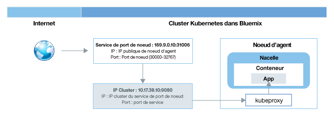
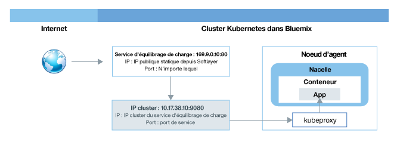
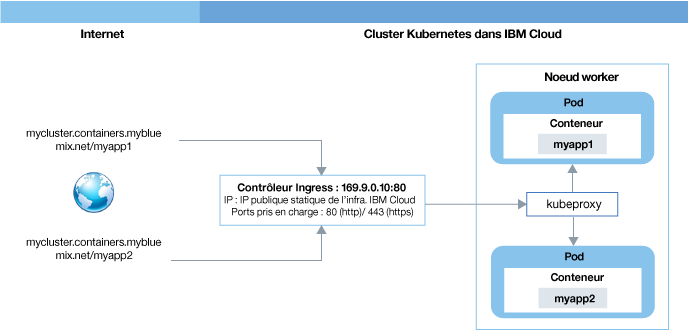

---

copyright:
  years: 2014, 2018
lastupdated: "2018-02-06"

---

{:new_window: target="_blank"}
{:shortdesc: .shortdesc}
{:screen: .screen}
{:pre: .pre}
{:table: .aria-labeledby="caption"}
{:codeblock: .codeblock}
{:tip: .tip}
{:download: .download}

# Planification de réseau externe
{: #planning}

Lorsque vous créez un cluster, chaque cluster doit être connecté à un VLAN public. Le réseau local virtuel public détermine l'adresse IP publique affectée à un noeud worker lors de la création du cluster.
{:shortdesc}

L'interface de réseau public des noeuds worker tant dans les clusters gratuits que standards est protégée par les règles réseau Calico. Ces règles bloquent par défaut la plupart du trafic entrant. Le trafic entrant nécessaire au fonctionnement de Kubernetes est toutefois autorisé, comme les connexions aux services NodePort, Loadbalancer et Ingress. Pour plus d'informations sur ces règles, notamment pour savoir comment les modifier, voir [Règles réseau](cs_network_policy.html#network_policies).

|Type de cluster|Gestionnaire du VLAN public pour le cluster|
|------------|------------------------------------------|
|Clusters gratuits dans {{site.data.keyword.Bluemix_notm}}|{{site.data.keyword.IBM_notm}}|
|Clusters standard dans {{site.data.keyword.Bluemix_notm}}|Vous dans votre compte d'infrastructure IBM Cloud (SoftLayer)|
{: caption="Responsabilités quant à la gestion de réseau local virtuel" caption-side="top"}

Pour plus d'informations sur la communication réseau en interne dans le cluster entre les noeuds worker et les pods, voir [Mise en réseau au sein d'un cluster](cs_secure.html#in_cluster_network). Pour plus d'informations sur la sécurisation des connexions d'applications s'exécutant dans un cluster Kubernetes cluster vers un réseau sur site ou vers des applications externes au cluster, voir [Configuration de la connectivité VPN](cs_vpn.html).

## Autorisation d'accès public aux applications
{: #public_access}

Pour rendre une application accessible au public sur Internet, vous devez mettre à jour votre fichier de configuration avant de déployer l'application dans un cluster.
{:shortdesc}

*Plan de données Kubernetes dans {{site.data.keyword.containershort_notm}}*

Le digramme illustre comment Kubernetes véhicule le trafic réseau dans {{site.data.keyword.containershort_notm}}. Selon que vous avez créé un cluster gratuit ou standard, différentes méthodes sont disponibles pour rendre votre application accessible depuis Internet.

<dl>
<dt><a href="#nodeport" target="_blank">Service NodePort</a> (clusters gratuits et standard)</dt>
<dd>
 <ul>
  <li>Vous pouvez exposer un port public sur chaque noeud worker et utiliser l'adresse IP publique de n'importe quel noeud worker pour accès public à votre service dans le cluster.</li>
  <li>Iptables est une fonction du noyau Linux qui charge les demandes d'équilibrage entre les pods de l'application, assure un routage réseau hautes performances et fournit un contrôle d'accès réseau.</li>
  <li>L'adresse IP publique du noeud worker n'est pas permanente. Lorsqu'un noeud worker est supprimé ou recréé, une nouvelle adresse IP publique lui est affectée.</li>
  <li>Le service NodePort est idéal pour tester l'accès public. Vous pouvez également l'utiliser si vous n'avez besoin de l'accès public que pendant un bref moment.</li>
 </ul>
</dd>
<dt><a href="#loadbalancer" target="_blank">Service LoadBalancer</a> (clusters standards uniquement)</dt>
<dd>
 <ul>
  <li>Chaque cluster standard est mis à disposition avec 4 adresses IP publiques portables et 4 adresses IP privées portables que vous pouvez utiliser pour créer un équilibreur de charge TCP/ UDP externe pour votre application.</li>
  <li>Iptables est une fonction du noyau Linux qui charge les demandes d'équilibrage entre les pods de l'application, assure un routage réseau hautes performances et fournit un contrôle d'accès réseau.</li>
  <li>L'adresse IP publique portable affectée à l'équilibreur de charge est permanente et ne change pas en cas de recréation d'un noeud worker dans le cluster.</li>
  <li>Vous pouvez personnaliser votre équilibreur de charge en exposant n'importe quel port dont votre application a besoin.</li></ul>
</dd>
<dt><a href="#ingress" target="_blank">Ingress</a> (clusters standards uniquement)</dt>
<dd>
 <ul>
  <li>Exposez plusieurs applications dans votre cluster en créant un équilibreur de charge externe HTTP ou HTTPS qui utilise un point d'entrée public sécurisé et unique pour acheminer les demandes entrantes vers vos applications.</li>
  <li>Vous pouvez utiliser une seule route publique pour exposer plusieurs applications dans votre cluster en tant que services.</li>
  <li>Ingress est constitué de deux composants principaux : la ressource Ingress et l'équilibreur de charge d'application. <ul>
    <li>La ressource Ingress définit les règles de routage et d'équilibrage de charge des demandes entrantes pour une application.</li>
    <li>L'équilibreur de charge d'application est à l'écoute de demandes de service HTTP ou HTTPS entrantes et les achemine aux pods des applications compte tenu des règles définies pour chaque ressource Ingress.</li>
   </ul>
  <li>Utilisez Ingress si vous désirez implémenter votre propre équilibreur de charge d'application avec des règles de routage personnalisées et si vous avez besoin d'une terminaison SSL pour vos applications.</li>
 </ul>
</dd></dl>

Pour sélectionner l'option réseau optimale pour votre application, vous pouvez suivre l'arbre de décision suivant :

<map name="networking_map" id="networking_map">
<area href="/docs/containers/cs_nodeport.html#config" alt="Service Nodeport" shape="circle" coords="52, 283, 45"/>
<area href="/docs/containers/cs_loadbalancer.html#config" alt="Service Loadbalancer" shape="circle" coords="247, 419, 44"/>
<area href="/docs/containers/cs_ingress.html#config" alt="Service Ingress" shape="circle" coords="445, 420, 45"/>
</map>

 

## Exposition d'une application sur Internet à l'aide d'un service NodePort
{: #nodeport}

Exposez un port public sur votre noeud worker et utilisez l'adresse IP publique du noeud worker pour un accès public au service dans le cluster depuis Internet.
{:shortdesc}

Lorsque vous exposez votre application en créant un service Kubernetes du type NodePort, une valeur NodePort comprise entre 30000 et 32767 et une adresse IP interne de cluster sont affectés au service. Le service NodePort fait office de point d'entrée externe pour les demandes entrantes vers votre application. Le NodePort affecté est exposé au public dans les paramètres kubeproxy de chaque noeud worker dans le cluster. Chaque noeud worker commence à écouter sur le NodePort affecté pour détecter des demandes entrantes pour le service. Pour accéder au service depuis Internet, vous pouvez utiliser l'adresse IP publique de n'importe quel noeud worker affectée lors de la création du cluster et le service NodePort au format `<ip_address>:<nodeport>`. En plus de l'adresse IP publique, un service NodePort est accessible via l'adresse IP privée d'un noeud worker.

Le diagramme suivant montre comment la communication est acheminée vers une application depuis Internet lorsqu'un service NodePort est configuré.

Comme l'illustre le diagramme, lorsqu'une demande parvient au service NodePort, elle est automatiquement acheminée à l'adresse IP interne du cluster du service et réacheminée du composant `kube-proxy` l'adresse IP privée du pod sur lequel l'application est déployée. L'adresse IP du cluster n'est accessible que dans le cluster. Si plusieurs répliques de votre application s'exécutent dans des pods différents, le composant `kube-proxy` équilibre la charge des demandes entrantes entre toutes les répliques.

**Remarque :** l'adresse IP publique du noeud worker n'est pas permanente. Lorsqu'un noeud worker est supprimé ou recréé, une nouvelle adresse IP publique lui est affectée. Vous pouvez utiliser le service NodePort pour tester l'accès public à votre application ou lorsque l'accès public n'est nécessaire que pour un temps très bref. Si vous avez besoin d'une adresse IP publique stable et d'une plus grande disponibilité de votre service, exposez votre application en utilisant un [service LoadBalancer](#loadbalancer) ou [Ingress](#ingress).

Pour les instructions de création d'un service de type NodePort avec {{site.data.keyword.containershort_notm}}, voir [Configuration de l'accès public à une application à l'aide du type de service NodePort](cs_nodeport.html#config).

 

## Exposition d'une application sur Internet à l'aide d'un service LoadBalancer
{: #loadbalancer}

Vous pouvez exposer un port et utiliser l'adresse IP publique ou privée de l'équilibreur de charge pour accéder à l'application.
{:shortdesc}

Lorsque vous créez un cluster standard, {{site.data.keyword.containershort_notm}} demande automatiquement cinq adresses IP publiques portables et cinq adresses IP privées portables et les provisionne dans votre compte d'infrastructure IBM Cloud (SoftLayer) lors de la création du cluster. Deux des adresses IP portables, une privée et l'autre publique, sont utilisées pour les [équilibreurs de charge d'application Ingress](#ingress). Quatre adresses IP portables publiques et quatre adresses IP portables privées sont utilisées pour exposer des applications en créant un service LoadBalancer.

Lorsque vous créez un service Kubernetes LoadBalancer dans un cluster sur un VLAN public, un équilibreur de charge externe est créé. L'une des quatre adresses IP publiques disponibles est affectée à cet équilibreur de charge. Si aucune adresse IP publique portable n'est disponible, la création de votre service LoadBalancer échoue. Le service LoadBalancer fait office de point d'entrée externe pour les demandes entrantes vers votre application. A la différence des services NodePort, vous pouvez affecter n'importe quel port à votre équilibreur de charge et n'êtes pas confiné à une plage de ports spécifique. L'adresse IP publique portable affectée à l'équilibreur de charge est permanente et ne change pas en cas de retrait ou de recréation d'un noeud worker. Par conséquent, le service LoadBalancer offre plus de disponibilité que le service NodePort. Pour accéder au service LoadBalancer depuis Internet, utilisez l'adresse IP publique de votre équilibreur de charge et le port affecté en utilisant le format `<ip_address>:<port>`.

Le diagramme suivant montre comment le service LoadBalancer achemine la communication vers une application depuis Internet :

Comme l'illustre le diagramme, lorsqu'une demande parvient au service LoadBalancer, cette demande est automatiquement acheminée à l'adresse IP interne du cluster qui a été affectée au service LoadBalancer lors de la création du service. L'adresse IP du cluster n'est accessible que dans le cluster. Depuis l'adresse IP du cluster, les demandes entrantes sont réacheminées vers le composant `kube-proxy` de votre noeud worker. Les demandes sont ensuite acheminées vers l'adresse IP privée du pod sur lequel l'application est déployée. Si plusieurs répliques de votre application s'exécutent dans des pods différents, le composant `kube-proxy` équilibre la charge des demandes entrantes entre toutes les répliques.

Si vous utilisez un service LoadBalancer, un port de noeud est également disponible sur chaque adresse IP de n'importe quel noeud worker. Pour bloquer l'accès au port de noeud lorsque vous utilisez un service LoadBalancer, voir [Blocage de trafic entrant](cs_network_policy.html#block_ingress).

Vos options pour les adresses IP lorsque vous créez un service LoadBalancer sont les suivantes :

- Si votre cluster se trouve sur un VLAN public, une adresse IP publique portable est utilisée.
- Si votre cluster est disponible uniquement sur un VLAN privé, une adresse IP privée portable est utilisée.
- Vous pouvez demander une adresse publique ou privée portable pour un service LoadBalancer en ajoutant une annotation dans le fichier de configuration : `service.kubernetes.io/ibm-load-balancer-cloud-provider-ip-type: <public_or_private>`.

Pour les instructions de création d'un service LoadBalancer avec {{site.data.keyword.containershort_notm}}, voir [Configuration de l'accès public à une application à l'aide du type de service LoadBalancer](cs_loadbalancer.html#config).

 

## Exposition d'une application sur Internet à l'aide d'Ingress
{: #ingress}

Ingress vous permet d'exposer plusieurs services dans votre cluster et de les rendre accessibles au public via un point d'entrée public unique.
{:shortdesc}

Au lieu de créer un service d'équilibreur de charge pour chaque application que vous désirez exposer au public, Ingress fournit une route publique unique qui vous permet d'acheminer les demandes publiques vers les applications situées à l'intérieur et à l'extérieur de votre cluster d'après leurs chemins d'accès individuels. Ingress comporte deux composants principaux. La ressource Ingress définit les règles de routage pour les demandes entrantes destinées à une application. Toutes les ressources Ingress doivent être enregistrées auprès de l'équilibreur de charge d'application Ingress qui est à l'écoute de demandes de service HTTP ou HTTPS entrantes et les réachemine en fonction des règles définies pour chaque ressource Ingress.

Lorsque vous créez un cluster standard, {{site.data.keyword.containershort_notm}} crée automatiquement un équilibreur de charge d'application à haute disponibilité pour votre cluster et lui affecte une route publique unique au format `<cluster_name>.<region>.containers.mybluemix.net`. La route publique est liée à une adresse IP publique portable allouée à votre compte d'infrastructure IBM Cloud (SoftLayer) lors de la création du cluster. Un équilibreur de charge d'application privé est également créé automatiquement, mais n'est pas activé automatiquement. 

Le diagramme suivant montre comment Ingress achemine la communication vers une application depuis Internet :

Pour exposer une application via Ingress, vous devez créer un service Kubernetes pour votre application et enregistrer ce service auprès de l'équilibreur de charge d'application en définissant une ressource Ingress. La ressource Ingress spécifie le chemin que vous désirez ajouter à la route publique pour composer une URL unique pour l'application exposée (par exemple, `mycluster.us-south.containers.mybluemix.net/myapp`). Lorsque vous entrez ce chemin dans votre navigateur Web, comme illustré dans le diagramme, la demande est envoyée à l'adresse IP publique portable liée de l'équilibreur de charge d'application. Ce dernier vérifie si une règle de routage est en vigueur pour le cluster pour le chemin `myapp` dans le cluster `mycluster`. Si une règle correspondante est identifiée, la demande, y compris le chemin individuel, est acheminée au pod sur lequel l'application est déployée, en fonction des règles qui ont été définies dans l'objet de ressource Ingress d'origine. Pour que l'application puisse traiter les demandes entrantes, vérifiez que celle-ci est à l'écoute sur le chemin individuel que vous avez défini dans la ressource Ingress.

Vous pouvez configurer l'équilibreur de charge d'application pour gérer le trafic réseau entrant pour vos applications pour les scénarios suivants :

-   Utilisation du domaine fourni par IBM sans terminaison TLS
-   Utilisation du domaine fourni par IBM avec terminaison TLS
-   Utilisation d'un domaine personnalisé avec terminaison TLS
-   Utilisation du domaine fourni par IBM ou d'un domaine personnalisé avec terminaison TLS pour accéder aux applications en dehors de votre cluster
-   Utilisation d'un équilibreur de charge d'application privé et d'un domaine personnalisé sans terminaison TLS
-   Utilisation d'un équilibreur de charge d'application privé et d'un domaine personnalisé avec terminaison TLS
-   Ajout de fonctions à votre équilibreur de charge d'application à l'aide d'annotations

Pour les instructions d'utilisation d'Ingress avec {{site.data.keyword.containershort_notm}}, voir [Configuration de l'accès public à une application à l'aide d'Ingress](cs_ingress.html#ingress).

 

