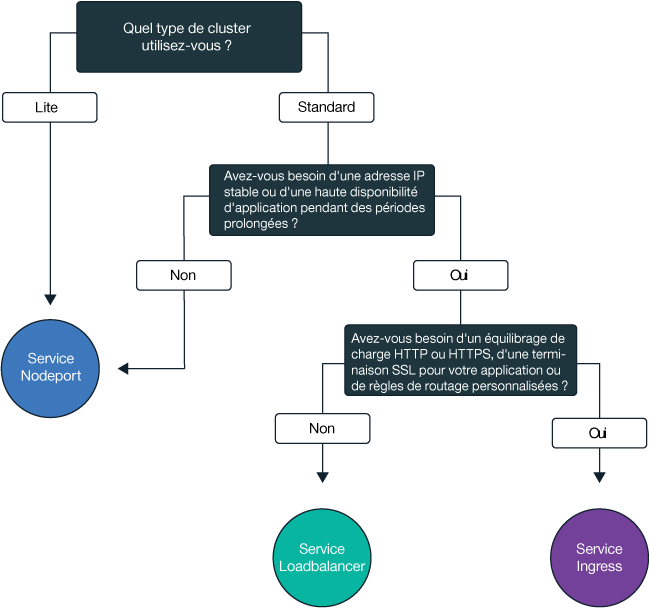
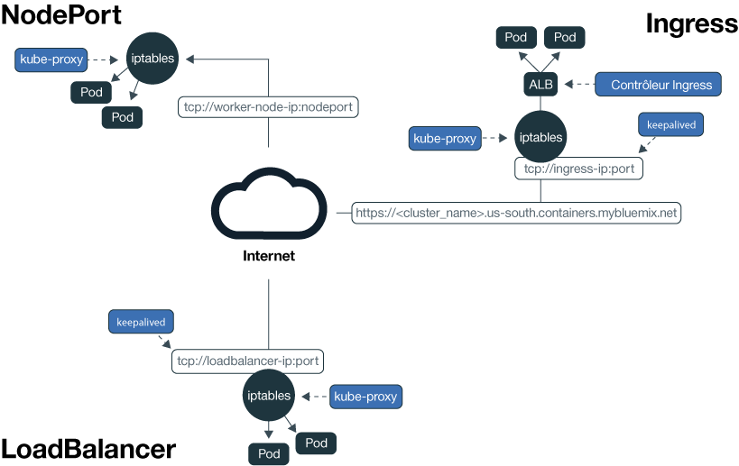

---

copyright:
  years: 2014, 2018
lastupdated: "2018-12-05"

---

{:new_window: target="_blank"}
{:shortdesc: .shortdesc}
{:screen: .screen}
{:pre: .pre}
{:table: .aria-labeledby="caption"}
{:codeblock: .codeblock}
{:tip: .tip}
{:note: .note}
{:important: .important}
{:deprecated: .deprecated}
{:download: .download}

# Planification pour exposer vos applications sur des réseaux externes
{: #planning}

Avec {{site.data.keyword.containerlong}}, vous pouvez gérer des réseaux externes en rendant les applications accessibles au public ou en privé.
{: shortdesc}

## Sélection d'un service NodePort, LoadBalancer ou Ingress
{: #external}

Pour rendre vos applications accessibles en externe à partir de l'Internet public ou d'un réseau privé, {{site.data.keyword.containerlong_notm}} prend en charge trois services de mise en réseau.
{:shortdesc}

**[Service NodePort](cs_nodeport.html)** (clusters gratuits et standard)
* Exposez un port sur chaque noeud worker et utilisez l'adresse IP publique ou privée d'un noeud worker pour accéder à votre service dans le cluster.
* Iptables est une fonction du noyau Linux qui charge les demandes d'équilibrage de charge entre les pods de l'application, assure un routage réseau à hautes performances et fournit un contrôle d'accès réseau.
* Les adresses publique et privée du noeud worker ne sont pas permanentes. Lorsqu'un noeud worker est supprimé ou recréé, une nouvelle adresse IP publique et une nouvelle adresse IP privée sont affectées au noeud worker.
* Le service NodePort est idéal pour tester l'accès public ou privé. Il peut également être utilisé si vous avez besoin d'un accès public ou privé sur une courte période.

**[Service LoadBalancer](cs_loadbalancer.html)** (clusters standard uniquement)
* Chaque cluster standard est mis à disposition avec quatre adresses IP publiques portables et quatre adresses IP privées portables que vous pouvez utiliser pour créer un équilibreur de charge TCP/UDP externe pour votre application.
* Iptables est une fonction du noyau Linux qui charge les demandes d'équilibrage de charge entre les pods de l'application, assure un routage réseau à hautes performances et fournit un contrôle d'accès réseau.
* Les adresses IP publiques et privées portables affectées à l'équilibreur de charge sont permanentes et ne changent pas lorsqu'un noeud worker est recréé dans le cluster.
* Vous pouvez personnaliser votre équilibreur de charge en exposant n'importe quel port dont votre application a besoin.

**[Ingress](cs_ingress.html)** (clusters standard uniquement)
* Exposez plusieurs application dans un cluster en créant un équilibreur de charge d'application (ALB) externe HTTP ou HTTPS, TCP ou UDP. L'ALB utilise un point d'entrée public ou privé unique et sécurisé pour acheminer les demandes entrantes vers vos applications.
* Vous pouvez utiliser une seule route pour exposer plusieurs applications dans votre cluster sous forme de services.
* Ingress comporte trois composants :
  * La ressource Ingress définit les règles de routage et d'équilibrage de charge des demandes entrantes pour une application.
  * L'équilibreur de charge d'application (ALB) est à l'écoute des demandes de service HTTP, HTTPS, TCP ou UDP entrantes. Il transmet les demandes aux pods des applications en fonction des règles que vous avez définies dans la ressource Ingress.
  * L'équilibreur de charge pour zones multiples (MZLB) gère toutes les demandes entrantes vers vos applications et équilibre la charge des demandes en les répartissant entre les ALB dans les différentes zones.
* Utilisez Ingress pour implémenter votre propre équilibreur de charge ALB avec des règles de routage personnalisées et si vous avez besoin d'une terminaison SSL pour vos applications.

Pour choisir le meilleur service de mise en réseau pour votre application, vous pouvez suivre cet arbre de décisions et cliquer sur l'une des options pour commencer.

<map name="networking_map" id="networking_map">
<area href="/docs/containers/cs_nodeport.html" alt="Service Nodeport" shape="circle" coords="52, 283, 45"/>
<area href="/docs/containers/cs_loadbalancer.html" alt="Service LoadBalancer" shape="circle" coords="247, 419, 44"/>
<area href="/docs/containers/cs_ingress.html" alt="Service Ingress" shape="circle" coords="445, 420, 45"/>
</map>

 

## Planification de réseau externe public
{: #public_access}

Lorsque vous créez un cluster Kubernetes dans {{site.data.keyword.containerlong_notm}}, vous pouvez connecter le cluster à un VLAN public. Le VLAN public détermine l'adresse IP publique qui est affectée à chaque noeud worker, ce qui offre à chaque noeud worker une interface réseau publique.
{:shortdesc}

Pour rendre une application accessible au public sur Internet, vous pouvez créer un service NodePort, LoadBalancer ou Ingress. Pour comparer chaque service, voir [Sélection d'un service NodePort, LoadBalancer ou Ingress](#external).

Le diagramme suivant illustre comment Kubernetes achemine du trafic réseau public dans {{site.data.keyword.containerlong_notm}}.

*Plan de données Kubernetes dans {{site.data.keyword.containerlong_notm}}*

L'interface réseau publique des noeuds worker tant dans les clusters gratuits que standard est protégée par les règles réseau Calico. Ces règles bloquent par défaut la plupart du trafic entrant. Le trafic entrant nécessaire au fonctionnement de Kubernetes est toutefois autorisé, comme les connexions aux services NodePort, LoadBalancer et Ingress. Pour plus d'informations sur ces règles, y compris comment les modifier, voir [Règles réseau](cs_network_policy.html#network_policies).

Pour plus d'informations sur la configuration des réseaux de votre cluster, notamment des informations sur les sous-réseaux, les pare-feux et les réseaux privés virtuels (VPN), voir [Planification des réseaux de cluster par défaut](cs_network_cluster.html#both_vlans).

 

## Planification de réseau externe privé pour une configuration de VLAN public et privé
{: #private_both_vlans}

Lorsque vos noeuds worker sont connectés à la fois à un VLAN public et à un VLAN privé, vous pouvez rendre votre application accessible uniquement à partir d'un réseau privé en créant des services NodePort, LoadBalancer ou Ingress privés. Ensuite, vous pouvez créer des règles Calico pour bloquer le trafic public vers ces services.

**NodePort**
* [Créez un service NodePort](cs_nodeport.html). En plus de l'adresse IP publique, un service NodePort est accessible via l'adresse IP privée d'un noeud worker.
* Un service NodePort ouvre un port sur un noeud worker via à la fois l'adresse IP privée et l'adresse IP publique du noeud worker. Vous devez utiliser une [règle réseau Calico preDNAT](cs_network_policy.html#block_ingress) pour bloquer les ports NodePort publics.

**LoadBalancer**
* [Créez un service LoadBalancer privé](cs_loadbalancer.html).
* Un service d'équilibreur de charge avec une adresse IP privée portable dispose toujours d'un port de noeud public ouvert sur chaque noeud worker. Vous devez utiliser une [règle réseau Calico preDNAT](cs_network_policy.html#block_ingress) pour bloquer les ports de noeud publics figurant dedans.

**Ingress**
* Lorsque vous créez un cluster, deux équilibreurs de charge d'application (ALB), un public et un privé, sont créés automatiquement. Comme l'ALB public est activé et l'ALB privé est désactivé par défaut, vous devez [désactiver l'ALB public](cs_cli_reference.html#cs_alb_configure) et [activer l'ALB privé](cs_ingress.html#private_ingress).
* Ensuite, [créez un service Ingress privé](cs_ingress.html#ingress_expose_private).

A titre d'exemple, admettons que vous ayez créé un service d'équilibreur de charge privé. Vous avez également créé une règle preDNAT Calico pour empêcher le trafic public d'atteindre les ports de noeud publics ouverts par l'équilibreur de charge. Cet équilibreur de charge privé est accessible à :
* Tout pod figurant dans le même cluster
* Tout pod dans un cluster figurant dans le même compte IBM Cloud
* Si vous avez la fonction [spanning VLAN activée](cs_subnets.html#subnet-routing), tout système connecté à l'un des VLAN privés dans le même compte IBM Cloud
* Si vous n'êtes pas dans le compte IBM Cloud mais toujours derrière le pare-feu de l'entreprise, tout système via une connexion VPN au sous-réseau sur lequel figure l'adresse IP de l'équilibreur de charge
* Si vous êtes dans un autre compte IBM Cloud, tout système via une connexion VPN au sous-réseau sur lequel figure l'adresse IP de l'équilibreur de charge

Pour plus d'informations sur la configuration des réseaux de votre cluster, notamment des informations sur les sous-réseaux, les pare-feux et les réseaux privés virtuels (VPN), voir [Planification des réseaux de cluster par défaut](cs_network_cluster.html#both_vlans).

 

## Planification de réseau externe privé pour une configuration de VLAN privé uniquement
{: #private_vlan}

Lorsque vos noeuds worker sont connectés à un VLAN privé uniquement, vous pouvez rendre votre application accessible uniquement à partir d'un réseau privé en créant des services NodePort, LoadBalancer ou Ingress privés. Comme vos noeuds worker ne sont pas connectés à un VLAN public, aucun trafic public n'est acheminé vers ces services.

**NodePort** :
* [Créez un service NodePort privé](cs_nodeport.html). Le service est disponible via l'adresse IP privée d'un noeud worker.
* Dans votre pare-feu privé, ouvrez le port que vous avez configuré lorsque vous avez déployé le service sur les adresses IP privées pour tous les noeuds worker vers lesquels autoriser le trafic. Pour identifier le port, exécutez la commande `kubectl get svc`. Le port est compris dans une plage de 20000 à 32000.

**LoadBalancer**
* [Créez un service LoadBalancer privé](cs_loadbalancer.html). Si votre cluster est disponible uniquement sur un VLAN privé, l'une des quatre adresses IP privées portables disponibles est utilisée.
* Dans votre pare-feu privé, ouvrez le port que vous avez configuré lorsque vous avez déployé le service en indiquant l'adresse IP privée du service d'équilibreur de charge.

**Ingress** :
* Vous devez configurer un [service DNS disponible sur le réseau privé ](https://kubernetes.io/docs/tasks/administer-cluster/dns-custom-nameservers/).
* Lorsque vous créez un cluster, un équilibreur de charge d'application (ALB) privé est créé automatiquement mais n'est pas activé par défaut. Vous devez [activer l'ALB privé](cs_ingress.html#private_ingress).
* Ensuite, [créez un service Ingress privé](cs_ingress.html#ingress_expose_private).
* Dans votre pare-feu privé, ouvrez le port 80 pour HTTP ou le port 443 pour HTTPS et indiquez l'adresse IP de votre ALB privé.

Pour plus d'informations sur la configuration des réseaux de votre cluster, notamment des informations sur les sous-réseaux et les dispositifs de passerelle, voir [Planification réseau pour une configuration de VLAN privé uniquement](cs_network_cluster.html#private_vlan).
