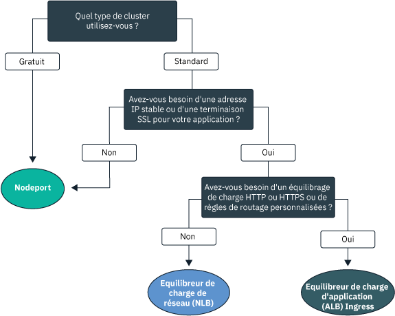
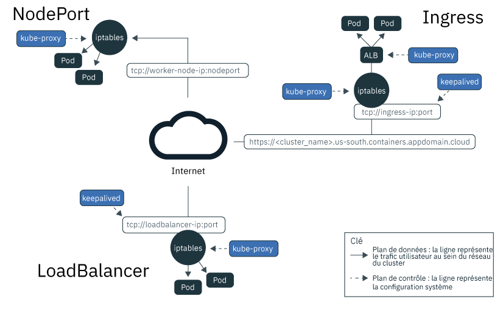
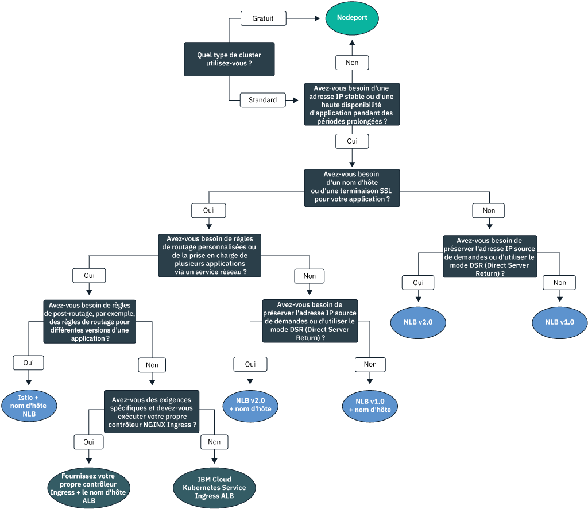

---

copyright:
  years: 2014, 2019
lastupdated: "2019-06-05"

keywords: kubernetes, iks

subcollection: containers

---

{:new_window: target="_blank"}
{:shortdesc: .shortdesc}
{:screen: .screen}
{:pre: .pre}
{:table: .aria-labeledby="caption"}
{:codeblock: .codeblock}
{:tip: .tip}
{:note: .note}
{:important: .important}
{:deprecated: .deprecated}
{:download: .download}
{:preview: .preview}

# Planification de réseaux au sein du cluster et en externe pour des applications
{: #cs_network_planning}

Avec {{site.data.keyword.containerlong}}, vous pouvez gérer des réseaux au sein du cluster et en externe en rendant les applications accessibles au public ou en privé.
{: shortdesc}

Pour commencer rapidement la mise en réseau de vos applications, suivez cet arbre de décisions et cliquez sur une option pour voir ses documents de configuration :

<map name="networking_map" id="networking_map">
<area target="" href="/docs/containers?topic=containers-nodeport" alt="Service NodePort" coords="52,254,78,260,93,270,101,285,92,302,72,314,49,318,19,309,0,281,18,263" shape="poly">
<area target="" href="/docs/containers?topic=containers-loadbalancer" alt="Service d'équilibreur de charge de réseau (NLB)" coords="288,405,324,414,348,434,350,455,327,471,295,477,246,471,222,446,237,417" shape="poly">
<area target="" href="/docs/containers?topic=containers-ingress" alt="Service d'équilibreur de charge d'application (ALB) Ingress" coords="532,405,568,410,593,427,600,448,582,468,554,477,508,476,467,463,454,441,474,419" shape="poly">
</map>

## Description de l'équilibrage de charge de charge pour les applications via la reconnaissance de service Kubernetes
{: #in-cluster}

La reconnaissance de service Kubernetes fournit une connexion réseau aux applications en utilisant des services de réseau et un proxy Kubernetes local.
{: shortdesc}

**Services** 
Tous les pods qui sont déployés sur un noeud worker bénéficient d'une adresse IP privée dans la plage 172.30.0.0/16 et sont uniquement acheminés entre des noeuds worker. Pour éviter des conflits, n'utilisez pas cette plage d'adresses IP sur des noeuds qui communiquent avec vos noeuds worker. Les noeuds worker et les pods peuvent communiquer de manière sécurisée sur le réseau privé en utilisant des adresses IP privées. Toutefois, lorsqu'un pod tombe en panne ou qu'un noeud worker a besoin d'être recréé, une nouvelle adresse IP privée lui est affectée.

Au lieu d'essayer de suivre les adresses IP privées fluctuantes pour des applications qui doivent être hautement disponibles, vous pouvez utiliser les fonctions de reconnaissance de service Kubernetes intégrées pour exposer les applications sous forme de services. Un service Kubernetes regroupe un ensemble de pods et procure une connexion réseau vers ces pods. Le service sélectionne les pods ciblés vers lesquels il achemine le trafic via des libellés.

Un service fournit la connectivité entre vos pods d'application et d'autres services dans le cluster sans exposer l'adresse IP privée réelle de chaque pod. Les services se voient affecter une adresse IP interne, `clusterIP`, accessible uniquement au sein du cluster. Cette adresse IP est liée au service pendant l'intégralité de son cycle de vie et ne change pas tant que le service existe. 
* Clusters plus récents : dans les clusters créés après février 2018 dans la zone dal13 ou après octobre 2017 dans les autres zones, les services se voient affecter une adresse IP parmi les 65 000 adresses IP dans la plage 172.21.0.0/16.
* Clusters plus anciens : dans les clusters créés avant février 2018 dans la zone dal13 ou avant octobre 2017 dans les autres zones, les services se voient affecter une adresse IP parmi les 254 adresses IP dans la plage 10.10.10.0/24. Si vous atteignez la limite de 254 services et que vous avez besoin d'autres services, vous devez créer un nouveau cluster.

Pour éviter des conflits, n'utilisez pas cette plage d'adresses IP sur des noeuds qui communiquent avec vos noeuds worker. Une entrée de recherche DNS est également créée pour le service et stockée dans le composant `kube-dns` du cluster. L'entrée DNS contient le nom du service, l'espace de nom dans lequel il a été créé et le lien vers l'adresse IP interne au cluster.

**`kube-proxy`** 
Afin de fournir l'équilibrage de charge de base de tout le trafic réseau TCP et UDP pour les services, un proxy réseau Kubernetes local, `kube-proxy`, s'exécute en tant que démon sur chaque noeud worker dans l'espace de nom `kube-system`. `kube-proxy` utilise des règles Iptables, une fonction de noyau Linux, pour envoyer équitablement les demandes aux pods situés derrière un service, indépendamment des adresses IP internes au cluster des pods et du noeud worker sur lequel ils sont déployés.

Par exemple, les applications au sein du cluster peuvent accéder à un pod situé derrière un service de cluster en utilisant l'adresse IP interne au cluster des services ou en envoyant une demande ay nom du service. Lorsque vous utilisez le nom du service, `kube-proxy` recherche ce nom dans le fournisseur DNS de cluster et achemine la demande vers l'adresse IP interne au cluster du service.

Si vous utilisez un service qui fournit à la fois une adresse IP de cluster interne et une adresse IP externe, les clients situés en dehors du cluster peuvent envoyer des demandes à l'adresse IP privée ou publique externe du service. `kube-proxy` achemine les demandes vers l'adresse IP interne au cluster du service et équilibre la charge entre les pods d'application situés derrière le service.

L'image suivante montre comment Kubernetes achemine le trafic réseau public via `kube-proxy` et les services NodePort, LoadBalancer ou Ingress dans {{site.data.keyword.containerlong_notm}}.

<figure>
 
 <figcaption>Acheminement par Kubernetes du trafic réseau public via les services NodePort, LoadBalancer et Ingress dans {{site.data.keyword.containerlong_notm}}</figcaption> </figure>

 

## Description des types de service Kubernetes
{: #external}

Kubernetes prend en charge quatre types de base de services réseau : `ClusterIP`, `NodePort`, `LoadBalancer` et `Ingress`. Les services `ClusterIP` rendent vos applications accessibles en interne pour permettre la communication entre les pods dans votre cluster uniquement. Les services `NodePort`, `LoadBalancer` et `Ingress` rendent vos applications accessibles de façon externe à partir de l'internet public ou d'un réseau privé.
{: shortdesc}

<dl>
<dt>[ClusterIP](https://kubernetes.io/docs/concepts/services-networking/service/#defining-a-service)</dt>
<dd>Vous pouvez exposer des applications uniquement sous forme de services IP de cluster sur le réseau privé. Un service `clusterIP` fournit une adresse IP interne au cluster qui est accessible par d'autres pods et services au sein du cluster uniquement. Aucune adresse IP externe n'est créée pour l'application. Pour accéder à un pod situé derrière un service de cluster, d'autres applications dans le cluster peuvent utiliser l'adresse IP interne au cluster du service ou envoyer une demande en utilisant le nom du service. Lorsqu'une demande parvient au service, celui-ci envoie les demandes aux pods équitablement, indépendamment des adresses IP internes au cluster des pods et du noeud worker sur lequel ils sont déployés. Notez que si vous ne spécifiez pas un `type` dans le fichier de configuration YAML d'un service, le type `ClusterIP` est créé par défaut.</dd>

<dt>[NodePort](/docs/containers?topic=containers-nodeport)</dt>
<dd>Lorsque vous exposez des applications avec un service NodePort, une valeur de port de noeud (NodePort) comprise entre 30000 et 32767 et une adresse IP interne de cluster sont affectées au service. Pour accéder au service en dehors du cluster, vous utilisez l'adresse IP publique ou privée de n'importe quel noeud worker et la valeur NodePort au format <code>&lt;IP_address&gt;:&lt;nodeport&gt;</code>. Toutefois, les adresses IP publique et privée du noeud worker ne sont pas permanentes. Lorsqu'un noeud worker est supprimé ou recréé, une nouvelle adresse IP publique et une nouvelle adresse IP privée sont affectées au noeud worker. Les valeurs NodePort sont idéales pour tester un accès public ou privé ou pour fournir un accès sur une courte période.</dd>

<dt>[LoadBalancer (NLB)](/docs/containers?topic=containers-loadbalancer)</dt>
<dd>Chaque cluster standard est mis à disposition avec quatre adresses IP publiques portables et quatre adresses IP privées portables que vous pouvez utiliser pour créer un équilibreur de charge de réseau (NLB) TCP/UDP pour votre application. Vous pouvez personnaliser votre équilibreur de charge de réseau en exposant n'importe quel port dont votre application a besoin. Les adresses IP publiques et privées portables affectées à l'équilibreur de charge de réseau (NLB) sont permanentes et ne changent pas lorsqu'un noeud worker est recréé dans le cluster. Vous pouvez créer un nom d'hôte pour votre application, qui enregistrera les adresses IP d'équilibreur de charge de réseau (NLB) public avec une entrée DNS. Vous pouvez également activer des moniteurs de diagnostic d'intégrité sur les adresses IP d'équilibreur de charge de réseau (NLB) pour chaque nom d'hôte.</dd>

<dt>[Ingress (ALB)](/docs/containers?topic=containers-ingress)</dt>
<dd>Exposez plusieurs applications dans un cluster en créant un équilibreur de charge d'application (ALB) Ingress HTTP, HTTPS ou TCP de couche 7. L'ALB utilise un point d'entrée public ou privé unique et sécurisé, un sous-domaine Ingress, pour acheminer les demandes entrantes vers vos applications. Vous pouvez utiliser une seule route pour exposer plusieurs applications dans votre cluster sous forme de services. Ingress comporte trois composants :<ul>
  <li>La ressource Ingress définit les règles de routage et d'équilibrage de charge des demandes entrantes pour une application.</li>
  <li>L'équilibreur de charge d'application (ALB) est à l'écoute des demandes de service HTTP, HTTPS ou TCP entrantes. Il transmet les demandes aux pods des applications en fonction des règles que vous avez définies dans la ressource Ingress.</li>
  <li>L'équilibreur de charge pour zones multiples (MZLB) gère toutes les demandes entrantes vers vos applications et équilibre la charge des demandes en les répartissant entre les ALB dans les différentes zones. Il active également les diagnostics d'intégrité sur l'adresse IP de l'ALB dans chaque zone.</li></ul></dd>
</dl>

 
Le tableau suivant compare les fonctions de chaque type de service réseau :

|Caractéristiques|ClusterIP|NodePort|LoadBalancer (NLB)|Ingress (ALB)|
|---------------|---------|--------|------------|-------|
|Clusters gratuits||| | |
|Clusters standard|||||
|Accessible en externe| ||||
|Adresse IP externe stable| | |||
|Nom d'hôte externe| | |||
|Arrêt SSL| | |||
|Equilibrage de charge HTTP(S)| | | ||
|Règles de routage personnalisées| | | ||
|Plusieurs applications par service| | | ||
{: caption="Caractéristiques des types de service réseau Kubernetes" caption-side="top"}

Pour choisir un modèle de déploiement d'équilibrage de charge basé sur un ou plusieurs services réseau, voir [Choix d'un modèle de déploiement pour équilibrage de charge externe public](#pattern_public) ou [Choix d'un modèle de déploiement pour équilibrage de charge externe privé](#private_access).

 

## Planification d'un équilibrage de charge externe public
{: #public_access}

Exposez au public une application de votre cluster sur Internet.
{: shortdesc}

Lorsque vous créez un cluster Kubernetes dans {{site.data.keyword.containerlong_notm}}, vous pouvez connecter le cluster à un VLAN public. Le VLAN public détermine l'adresse IP publique qui est affectée à chaque noeud worker, ce qui offre à chaque noeud worker une interface réseau publique. Les services de mise en réseau public se connectent à cette interface de réseau public en fournissant à votre application une adresse IP publique et, le cas échéant, une URL publique. Lorsqu'une application est exposée au public, quiconque disposant de l'adresse IP de service public ou de l'URL que vous avez configurée pour votre application peut envoyer une demande à cette dernière. C'est pourquoi, il est recommandé d'exposer le moins d'applications possible. Exposez uniquement une application au public lorsque vous êtes prêt à accepter du trafic provenant de clients ou d'utilisateurs Web externes.

L'interface réseau publique des noeuds worker est protégée par des [paramètres de règles réseau Calico prédéfinis](/docs/containers?topic=containers-network_policies#default_policy) qui sont configurés sur tous les noeuds worker lors de la création du cluster. Par défaut, tout le trafic réseau sortant est autorisé pour tous les noeuds worker. Le trafic réseau entrant est bloqué à l'exception de quelques ports. Ces ports sont ouverts de sorte qu'IBM puisse surveiller le trafic réseau et installer automatiquement les mises à jour de sécurité pour le maître Kubernetes et que les connexions puissent être établies avec les services NodePort, LoadBalancer et Ingress. Pour plus d'informations sur ces règles, y compris comment les modifier, voir [Règles réseau](/docs/containers?topic=containers-network_policies#network_policies).

Pour rendre une application accessible au public sur Internet, choisissez un modèle de déploiement d'équilibrage de charge pour votre application afin de créer des services NodePort, LoadBalancer ou Ingress publics.

### Choix d'un modèle de déploiement pour équilibrage de charge externe public
{: #pattern_public}

Lorsqu'il s'agit d'exposer une application à un service réseau, vous avec le choix entre plusieurs modèles de déploiement. Pour commencer rapidement, suivez l'arbre de décisions pour choisir un modèle de déploiement. Pour plus d'informations sur chaque modèle de déploiement et pour savoir pour quelle raison l'utiliser et comment le configurer, voir le tableau présenté après l'arbre de décisions. Pour obtenir des informations de base sur les services de mise en réseau utilisés par ces modèles de déploiement, utilisez [Description des types de service Kubernetes](#external).
{: shortdesc}

<figure>
  
  <figcaption>Utilisez cet arbre de décisions pour choisir le modèle de déploiement de mise en réseau le plus approprié pour votre application. Pour toute information sur chaque modèle de déploiement, voir le tableau ci-après.</figcaption>
</figure>

<table summary="Ce tableau, dont la lecture s'effectue de gauche à droite, comporte les colonnes Nom, Méthode d'équilibrage de charge, Cas d'utilisation et Implémentation.">
<caption>Caractéristiques des modèles de déploiement de réseau public dans IBM Cloud Kubernetes Service</caption>
<col width="10%">
<col width="25%">
<col width="25%">
<thead>
<th>Nom</th>
<th>Méthode d'équilibrage de charge</th>
<th>Cas d'utilisation</th>
<th>implémentation</th>
</thead>
<tbody>
<tr>
<td>NodePort</td>
<td>Port sur un noeud worker qui expose l'application sur l'adresse IP publique du noeud worker.</td>
<td>Tester l'accès public à une application ou fournir un accès pendant une courte période.</td>
<td>[Créez un service NodePort public](/docs/containers?topic=containers-nodeport#nodeport_config).</td>
</tr><tr>
<td>NLB v1.0 (+ nom d'hôte)</td>
<td>Equilibrage de charge de base qui expose l'application avec une adresse IP ou un nom d'hôte.</td>
<td>Exposer rapidement une application au public avec une adresse IP ou un nom d'hôte qui prend en charge l'arrêt SSL.</td>
<td><ol><li>Créez un équilibreur de charge de réseau public (NLB) 1.0 dans un cluster [à zone unique](/docs/containers?topic=containers-loadbalancer#lb_config) ou[à zones multiples](/docs/containers?topic=containers-loadbalancer#multi_zone_config).</li><li>Le cas échéant, [enregistrez](/docs/containers?topic=containers-loadbalancer#loadbalancer_hostname) un nom d'hôte et des diagnostics d'intégrité.</li></ol></td>
</tr><tr>
<td>NLB v2.0 (+ nom d'hôte)</td>
<td>Equilibrage de charge DSR qui expose l'application avec une adresse IP ou un nom d'hôte.</td>
<td>Exposer au public une application qui peut recevoir des niveaux élevés de trafic avec une adresse IP ou un nom d'hôte qui prend en charge l'arrêt SSL.</td>
<td><ol><li>Effectuez les [tâches prérequises](/docs/containers?topic=containers-loadbalancer#ipvs_provision).</li><li>Créez un NLB 2.0 public dans un cluster [à zone unique](/docs/containers?topic=containers-loadbalancer#ipvs_single_zone_config) ou [à zones multiples](/docs/containers?topic=containers-loadbalancer#ipvs_multi_zone_config).</li><li>Le cas échéant, [enregistrez](/docs/containers?topic=containers-loadbalancer#loadbalancer_hostname) un nom d'hôte et des diagnostics d'intégrité.</li></ol></td>
</tr><tr>
<td>Istio + nom d'hôte NLB</td>
<td>Equilibrage de charge de base qui expose l'application avec un nom d'hôte et utilise les règles de routage Istio.</td>
<td>Implémenter des règles de post-routage Istio, par exemple des règles pour différentes versions d'un microservice d'applications et exposer une application gérée par Istio avec un nom d'hôte public.</li></ol></td>
<td><ol><li>Installez le [module complémentaire Istio géré](/docs/containers?topic=containers-istio#istio_install).</li><li>Incluez votre application dans le [maillage de service Istio](/docs/containers?topic=containers-istio#istio_sidecar).</li><li>Enregistrez l'équilibreur de charge Istio par défaut avec [un nom d'hôte](/docs/containers?topic=containers-istio#istio_expose_link).</li></ol></td>
</tr><tr>
<td>ALB Ingress</td>
<td>Equilibrage de charge HTTPS qui expose l'application avec un nom d'hôte et utilise des règles de routage personnalisées.</td>
<td>Implémenter des règles de routage personnalisées et l'arrêt SSL pour plusieurs applications.</td>
<td><ol><li>Créez un [service Ingress](/docs/containers?topic=containers-ingress#ingress_expose_public) pour l'ALB public.</li><li>Personnalisez des règles de routage ALB avec des [annotations](/docs/containers?topic=containers-ingress_annotation).</li></ol></td>
</tr><tr>
<td>Utilisation de votre propre contrôleur Ingress + nom d'hôte ALB</td>
<td>Equilibrage de charge HTTPS avec un contrôleur Ingress personnalisé qui expose l'application avec un nom d'hôte ALB fourni par IBM et utilise des règles de routage personnalisées.</td>
<td>Implémenter des règles de routage personnalisées ou d'autres exigences spécifiques pour le réglage personnalisé pour plusieurs applications.</td>
<td>[Déployez votre contrôleur Ingress et optimisez le nom d'hôte ALB fourni par IBM](/docs/containers?topic=containers-ingress#user_managed).</td>
</tr>
</tbody>
</table>

Vous souhaitez encore plus de détails sur les modèles de déploiement d'équilibrage de charge disponibles dans {{site.data.keyword.containerlong_notm}} ? Consultez cet [article de blogue ](https://www.ibm.com/blogs/bluemix/2018/10/ibm-cloud-kubernetes-service-deployment-patterns-for-maximizing-throughput-and-availability/).
{: tip}

 

## Planification d'un équilibrage de charge externe privé
{: #private_access}

Exposez en privé une application de votre cluster sur le réseau privé uniquement.
{: shortdesc}

Lorsque vous déployez une application dans un cluster Kubernetes dans {{site.data.keyword.containerlong_notm}}, vous souhaitez peut-être rendre l'application accessible uniquement aux utilisateurs et services qui se trouvent sur le même réseau privé que votre cluster. L'équilibrage de charge privé est idéal pour rendre votre application disponible pour des demandes hors du cluster sans exposer l'application au public général. Vous pouvez également utiliser l'équilibrage de charge privé pour tester des accès, demander du routage et d'autres configurations pour votre application avant de l'exposer ultérieurement au public avec des services réseau public.

A titre d'exemple, admettons que vous ayez créé un équilibreur de charge de réseau privé pour votre application. Cet équilibreur de charge de réseau privé est accessible à :
* Tout pod figurant dans le même cluster.
* Tout pod figurant dans n'importe quel cluster dans le même compte {{site.data.keyword.Bluemix_notm}}.
* Si la fonction [VRF ou Spanning VLAN](/docs/containers?topic=containers-subnets#basics_segmentation) est activée, tout système connecté à n'importe lequel des VLAN privés dans le même compte {{site.data.keyword.Bluemix_notm}}. 
* Si vous n'êtes pas dans le compte {{site.data.keyword.Bluemix_notm}} mais toujours derrière le pare-feu de l'entreprise, tout système via une connexion VPN au sous-réseau sur lequel figure l'adresse IP de l'équilibreur de charge de réseau.
* Si vous êtes dans un autre compte {{site.data.keyword.Bluemix_notm}}, tout système via une connexion VPN au sous-réseau sur lequel figure l'adresse IP de l'équilibreur de charge de réseau.

Pour rendre une application disponible sur un réseau privé uniquement, choisissez un modèle de déploiement d'équilibrage de charge basé sur la configuration VLAN de votre cluster :
* [Configuration de VLAN public et privé](#private_both_vlans)
* [Configuration de VLAN privé uniquement](#plan_private_vlan)

### Configuration d'un équilibrage de charge privé dans une configuration de VLAN public et privé
{: #private_both_vlans}

Lorsque vos noeuds worker sont connectés à la fois à un VLAN public et à un VLAN privé, vous pouvez rendre votre application accessible uniquement à partir d'un réseau privé en créant des services NodePort, LoadBalancer ou Ingress privés. Ensuite, vous pouvez créer des règles Calico pour bloquer le trafic public vers ces services.
{: shortdesc}

L'interface réseau publique des noeuds worker est protégée par des [paramètres de règles réseau Calico prédéfinis](/docs/containers?topic=containers-network_policies#default_policy) qui sont configurés sur tous les noeuds worker lors de la création du cluster. Par défaut, tout le trafic réseau sortant est autorisé pour tous les noeuds worker. Le trafic réseau entrant est bloqué à l'exception de quelques ports. Ces ports sont ouverts de sorte qu'IBM puisse surveiller le trafic réseau et installer automatiquement les mises à jour de sécurité pour le maître Kubernetes et que les connexions puissent être établies avec les services NodePort, LoadBalancer et Ingress.

Etant donné que les règles réseau Calico par défaut autorisent le trafic public entrant dans ces services, vous pouvez créer des règles Calico pour bloquer tout le trafic public vers ces services. Par exemple, un service NodePort ouvre un port sur un noeud worker via à la fois l'adresse IP privée et l'adresse IP publique du noeud worker. Un service d'équilibreur de charge de réseau avec une adresse IP privée portable ouvre un service NodePort public sur tous les noeuds worker. Vous devez créer une [règle réseau Calico preDNAT](/docs/containers?topic=containers-network_policies#block_ingress) pour bloquer les ports de noeud publics.

Découvrez les modèles de déploiement d'équilibrage de charge suivants pour un réseau privé :

|Nom|Méthode d'équilibrage de charge|Cas d'utilisation|implémentation|
|----|---------------------|--------|--------------|
|NodePort|Port sur un noeud worker qui expose l'application sur l'adresse IP privée du noeud worker.|Tester l'accès privé sur une application ou fournir un accès pendant une courte période.|<ol><li>[Créez un service NodePort](/docs/containers?topic=containers-nodeport).</li><li>Un service NodePort ouvre un port sur un noeud worker via à la fois l'adresse IP privée et l'adresse IP publique du noeud worker. Vous devez utiliser une [règle réseau Calico preDNAT](/docs/containers?topic=containers-network_policies#block_ingress) pour bloquer le trafic vers les ports de noeud publics.</li></ol>|
|NLB v1.0|Equilibrage de charge de base qui expose l'application avec une adresse IP privée.|Exposer rapidement une application à un réseau privé avec une adresse IP privée.|<ol><li>[Créez un service NLB privé](/docs/containers?topic=containers-loadbalancer).</li><li>Un service d'équilibreur de charge avec une adresse IP privée portable dispose toujours d'un port de noeud public ouvert sur chaque noeud worker. Créez une [règle réseau Calico preDNAT](/docs/containers?topic=containers-network_policies#block_ingress) pour bloquer le trafic vers les ports de noeud publics.</li></ol>|
|NLB v2.0|Equilibrage de charge DSR qui expose l'application avec une adresse IP privée.|Exposer une application qui peut recevoir des niveaux élevés de trafic sur un réseau privé avec une adresse IP.|<ol><li>[Créez un service NLB privé](/docs/containers?topic=containers-loadbalancer).</li><li>Un service d'équilibreur de charge avec une adresse IP privée portable dispose toujours d'un port de noeud public ouvert sur chaque noeud worker. Créez une [règle réseau Calico preDNAT](/docs/containers?topic=containers-network_policies#block_ingress) pour bloquer le trafic vers les ports de noeud publics.</li></ol>|
|ALB Ingress|Equilibrage de charge HTTPS qui expose l'application avec un nom d'hôte et utilise des règles de routage personnalisées.|Implémenter des règles de routage personnalisées et l'arrêt SSL pour plusieurs applications.|<ol><li>[Désactivez l'ALB public](/docs/containers?topic=containers-cli-plugin-kubernetes-service-cli#cs_alb_configure)</li><li>[Activez l'ALB privé et créez une ressource Ingress](/docs/containers?topic=containers-ingress#ingress_expose_private).</li><li>Personnalisez des règles de routage ALB avec des [annotations](/docs/containers?topic=containers-ingress_annotation).</li></ol>|
{: caption="Caractéristiques des modèles de déploiement de réseau pour une configuration de VLAN public et privé" caption-side="top"}

 

### Configuration d'un équilibrage de charge privé dans une configuration de VLAN privé uniquement
{: #plan_private_vlan}

Lorsque vos noeuds worker sont connectés à un VLAN privé uniquement, vous pouvez rendre votre application accessible en externe à partir d'un réseau privé uniquement en créant des services NodePort, LoadBalancer ou Ingress privés.
{: shortdesc}

Si votre cluster est connecté à un VLAN privé uniquement et que vous permettez au maître et aux noeuds worker de communiquer via un noeud final de service privé uniquement, vous ne pouvez pas exposer automatiquement vos applications sur un réseau privé. Vous devez configurer un périphérique de passerelle, tel que [VRA (Vyatta)](/docs/infrastructure/virtual-router-appliance?topic=virtual-router-appliance-about-the-vra) ou [FSA](/docs/services/vmwaresolutions/services?topic=vmware-solutions-fsa_considerations) pour faire office de pare-feu et bloquer ou autoriser le trafic. Comme vos noeuds worker ne sont pas connectés à un VLAN public, aucun trafic public n'est acheminé vers les services NodePort, LoadBalancer, or Ingress. Toutefois, vous devez ouvrir les ports et les adresses IP requis dans votre pare-feu de périphérique de passerelle pour autoriser le trafic entrant vers ces services.

Découvrez les modèles de déploiement d'équilibrage de charge suivants pour un réseau privé :

|Nom|Méthode d'équilibrage de charge|Cas d'utilisation|implémentation|
|----|---------------------|--------|--------------|
|NodePort|Port sur un noeud worker qui expose l'application sur l'adresse IP privée du noeud worker.|Tester l'accès privé sur une application ou fournir un accès pendant une courte période.|<ol><li>[Créez un service NodePort](/docs/containers?topic=containers-nodeport).</li><li>Dans votre pare-feu privé, ouvrez le port que vous avez configuré lorsque vous avez déployé le service sur les adresses IP privées pour tous les noeuds worker vers lesquels autoriser le trafic. Pour identifier le port, exécutez la commande `kubectl get svc`. Le port est compris dans une plage de 20000 à 32000.</li></ol>|
|NLB v1.0|Equilibrage de charge de base qui expose l'application avec une adresse IP privée.|Exposer rapidement une application à un réseau privé avec une adresse IP privée.|<ol><li>[Créez un service NLB privé](/docs/containers?topic=containers-loadbalancer).</li><li>Dans votre pare-feu privé, ouvrez le port que vous avez configuré lorsque vous avez déployé le service en indiquant l'adresse IP privée du service d'équilibreur de charge de réseau.</li></ol>|
|NLB v2.0|Equilibrage de charge DSR qui expose l'application avec une adresse IP privée.|Exposer une application qui peut recevoir des niveaux élevés de trafic sur un réseau privé avec une adresse IP.|<ol><li>[Créez un service NLB privé](/docs/containers?topic=containers-loadbalancer).</li><li>Dans votre pare-feu privé, ouvrez le port que vous avez configuré lorsque vous avez déployé le service en indiquant l'adresse IP privée du service d'équilibreur de charge de réseau.</li></ol>|
|ALB Ingress|Equilibrage de charge HTTPS qui expose l'application avec un nom d'hôte et utilise des règles de routage personnalisées.|Implémenter des règles de routage personnalisées et l'arrêt SSL pour plusieurs applications.|<ol><li>Configurez un [service DNS disponible sur le réseau privé ](https://kubernetes.io/docs/tasks/administer-cluster/dns-custom-nameservers/).</li><li>[Activez l'ALB privé et créez une ressource Ingress](/docs/containers?topic=containers-ingress#private_ingress).</li><li>Dans votre pare-feu privé, ouvrez le port 80 pour HTTP ou le port 443 pour HTTPS et indiquez l'adresse IP de votre ALB privé.</li><li>Personnalisez des règles de routage ALB avec des [annotations](/docs/containers?topic=containers-ingress_annotation).</li></ol>|
{: caption="Caractéristiques des modèles de déploiement de réseau pour une configuration de VLAN privé uniquement" caption-side="top"}
