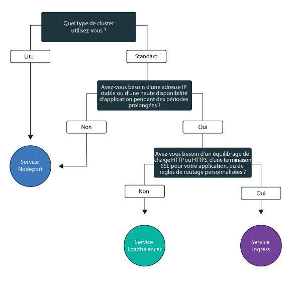

---

copyright:
  years: 2014, 2019
lastupdated: "2019-03-21"

keywords: kubernetes, iks

subcollection: containers

---

{:new_window: target="_blank"}
{:shortdesc: .shortdesc}
{:screen: .screen}
{:pre: .pre}
{:table: .aria-labeledby="caption"}
{:codeblock: .codeblock}
{:tip: .tip}
{:note: .note}
{:important: .important}
{:deprecated: .deprecated}
{:download: .download}

# Planification de l'exposition de vos applications avec une mise en réseau au sein du cluster et en externe

{: #cs_network_planning}

Avec {{site.data.keyword.containerlong}}, vous pouvez gérer des réseaux au sein du cluster et en externe en rendant les applications accessibles au public ou en privé.
{: shortdesc}

Cette page vous permet de planifier la mise en réseau de vos applications au sein du cluster et en externe. Pour plus d'informations sur la configuration de votre cluster pour les réseaux, voir [Configuration de votre réseau de cluster](/docs/containers?topic=containers-cs_network_cluster).
{: tip}

## Exposition d'applications au trafic à l'intérieur du cluster via des services Kubernetes
{: #in-cluster}

Créez des services de reconnaissance Kubernetes pour permettre la communication entre les pods dans votre cluster.
{: shortdesc}

<figure>
 
 <figcaption>Exposition d'applications à l'intérieur du cluster avec des services Kubernetes</figcaption>
</figure>

Tous les pods qui sont déployés sur un noeud worker bénéficient d'une adresse IP privée dans la plage 172.30.0.0/16 et sont uniquement acheminés entre des noeuds worker. Pour éviter des conflits, n'utilisez pas cette plage d'adresses IP sur des noeuds qui communiquent avec vos noeuds worker. Les noeuds worker et les pods peuvent communiquer de manière sécurisée sur le réseau privé en utilisant des adresses IP privées. Toutefois, lorsqu'un pod tombe en panne ou qu'un noeud worker a besoin d'être recréé, une nouvelle adresse IP privée lui est affectée.

Par défaut, il est difficile de suivre des adresses IP privées fluctuantes pour des applications qui doivent être hautement disponibles. En guise d'alternative, vous pouvez utiliser les fonctions de reconnaissance de service Kubernetes intégrées pour exposer les applications sous forme de services IP de cluster sur le réseau privé. Un service Kubernetes regroupe un ensemble de pods et procure une connexion réseau vers ces pods. Cette connexion fournit la connectivité aux autres services dans le cluster sans exposer l'adresse IP privée réelle de chaque pod. Les services bénéficient d'une adresse IP interne au cluster accessible uniquement à l'intérieur du cluster.
* Clusters plus anciens : dans les clusters créés avant février 2018 dans la zone dal13 ou avant octobre 2017 dans les autres zones, les services bénéficient d'une adresse IP parmi les 254 adresses IP dans la plage 10.10.10.0/24. Si vous atteignez la limite de 254 services et que vous avez besoin d'autres services, vous devez créer un nouveau cluster.
* Clusters plus récents : dans les clusters créés après février 2018 dans la zone dal13 ou après octobre 2017 dans les autres zones, les services bénéficient d'une adresse IP parmi les 65 000 adresses IP dans la plage 172.21.0.0/16.

Pour éviter des conflits, n'utilisez pas cette plage d'adresses IP sur des noeuds qui communiquent avec vos noeuds worker. Une entrée de recherche DNS est également créée pour le service et stockée dans le composant `kube-dns` du cluster. L'entrée DNS contient le nom du service, l'espace de nom dans lequel il a été créé et le lien vers l'adresse IP interne au cluster.

Pour accéder à un pod situé derrière un service de cluster, les applications peuvent utiliser l'adresse IP interne au cluster du service ou envoyer une demande en utilisant le nom du service. Lorsque vous utilisez le nom du service, ce nom est recherché dans le composant `kube-dns` et la demande est acheminée à l'adresse IP interne au cluster du service. Lorsqu'une demande parvient au service, celui-ci envoie les demandes aux pods équitablement, indépendamment des adresses IP internes au cluster des pods et du noeud worker sur lequel ils sont déployés.

 

## Sélection d'un service NodePort, LoadBalancer ou Ingress pour exposer les applications au trafic externe au cluster
{: #external}

Pour rendre vos applications accessibles en externe à partir de l'Internet public ou d'un réseau privé, {{site.data.keyword.containerlong_notm}} prend en charge trois services de mise en réseau.
{:shortdesc}

**[Service NodePort](/docs/containers?topic=containers-nodeport)** (clusters gratuits et standard)
* Exposez un port sur chaque noeud worker et utilisez l'adresse IP publique ou privée d'un noeud worker pour accéder à votre service dans le cluster.
* Iptables est une fonction du noyau Linux qui charge les demandes d'équilibrage de charge entre les pods de l'application, assure un routage réseau à hautes performances et fournit un contrôle d'accès réseau.
* Les adresses publique et privée du noeud worker ne sont pas permanentes. Lorsqu'un noeud worker est supprimé ou recréé, une nouvelle adresse IP publique et une nouvelle adresse IP privée sont affectées au noeud worker.
* Le service NodePort est idéal pour tester l'accès public ou privé. Il peut également être utilisé si vous avez besoin d'un accès public ou privé sur une courte période.

**[Service LoadBalancer](/docs/containers?topic=containers-loadbalancer)** (clusters standard uniquement)
* Chaque cluster standard est mis à disposition avec quatre adresses IP publiques portables et quatre adresses IP privées portables que vous pouvez utiliser pour créer un équilibreur de charge TCP/UDP externe pour votre application. Vous pouvez personnaliser votre équilibreur de charge en exposant n'importe quel port dont votre application a besoin.
* Iptables est une fonction du noyau Linux qui charge les demandes d'équilibrage de charge entre les pods de l'application, assure un routage réseau à hautes performances et fournit un contrôle d'accès réseau.
* Les adresses IP publiques et privées portables affectées à l'équilibreur de charge sont permanentes et ne changent pas lorsqu'un noeud worker est recréé dans le cluster.
* Vous pouvez créer un nom d'hôte pour votre application, qui enregistrera les adresses IP d'équilibreur de charge public avec une entrée DNS. Vous pouvez également activer des moniteurs de diagnostic d'intégrité sur les adresses IP d'équilibreur de charge pour chaque nom d'hôte.

**[Ingress](/docs/containers?topic=containers-ingress)** (clusters standard uniquement)
* Exposez plusieurs application dans un cluster en créant un équilibreur de charge d'application (ALB) externe HTTP, HTTPS ou TCP. L'ALB utilise un point d'entrée public ou privé unique et sécurisé, un sous-domaine Ingress, pour acheminer les demandes entrantes vers vos applications.
* Vous pouvez utiliser une seule route pour exposer plusieurs applications dans votre cluster sous forme de services.
* Ingress comporte trois composants :
  * La ressource Ingress définit les règles de routage et d'équilibrage de charge des demandes entrantes pour une application.
  * L'équilibreur de charge d'application (ALB) est à l'écoute des demandes de service HTTP, HTTPS ou TCP entrantes. Il transmet les demandes aux pods des applications en fonction des règles que vous avez définies dans la ressource Ingress.
  * L'équilibreur de charge pour zones multiples (MZLB) gère toutes les demandes entrantes vers vos applications et équilibre la charge des demandes en les répartissant entre les ALB dans les différentes zones. Il active également les diagnostics d'intégrité sur l'adresse IP de l'ALB dans chaque zone.
* Utilisez Ingress si vous devez implémenter votre propre équilibreur de charge ALB avec des règles de routage personnalisées et si vous avez besoin d'une terminaison SSL pour vos applications.

Pour choisir le meilleur service de mise en réseau pour votre application, vous pouvez suivre cet arbre de décisions et cliquer sur l'une des options pour commencer.

<map name="networking_map" id="networking_map">
<area href="/docs/containers?topic=containers-nodeport" alt="Service Nodeport" shape="circle" coords="52, 283, 45"/>
<area href="/docs/containers?topic=containers-loadbalancer" alt="Service LoadBalancer" shape="circle" coords="247, 419, 44"/>
<area href="/docs/containers?topic=containers-ingress" alt="Service Ingress" shape="circle" coords="445, 420, 45"/>
</map>

Vous souhaitez plus de détails sur les modèles de déploiement d'équilibrage de charge disponibles dans {{site.data.keyword.containerlong_notm}} ? Consultez cet [article de blogue ](https://www.ibm.com/blogs/bluemix/2018/10/ibm-cloud-kubernetes-service-deployment-patterns-for-maximizing-throughput-and-availability/).
{: tip}

 

## Planification de réseau externe public pour une configuration de VLAN public et privé
{: #public_access}

Lorsque vous créez un cluster Kubernetes dans {{site.data.keyword.containerlong_notm}}, vous pouvez connecter le cluster à un VLAN public. Le VLAN public détermine l'adresse IP publique qui est affectée à chaque noeud worker, ce qui offre à chaque noeud worker une interface réseau publique.
{:shortdesc}

<figure>
 
 <figcaption>Exposition d'applications sur un réseau public dans une configuration réseau par défaut</figcaption>
</figure>

L'interface réseau publique des noeuds worker est protégée par des [paramètres de règles réseau Calico prédéfinis](/docs/containers?topic=containers-network_policies#default_policy) qui sont configurés sur tous les noeuds worker lors de la création du cluster.

Par défaut, tout le trafic réseau sortant est autorisé pour tous les noeuds worker. Le trafic réseau entrant est bloqué à l'exception de quelques ports. Ces ports sont ouverts de sorte qu'IBM puisse surveiller le trafic réseau et installer automatiquement les mises à jour de sécurité pour le maître Kubernetes et que les connexions puissent être établies avec les services NodePort, LoadBalancer et Ingress. Pour plus d'informations sur ces règles, y compris comment les modifier, voir [Règles réseau](/docs/containers?topic=containers-network_policies#network_policies).

Pour rendre une application accessible au public sur Internet, vous pouvez créer un service NodePort, LoadBalancer ou Ingress. Pour comparer chaque service, voir [Sélection d'un service NodePort, LoadBalancer ou Ingress](#external).

Le diagramme suivant illustre comment Kubernetes achemine du trafic réseau public dans {{site.data.keyword.containerlong_notm}}.

 

## Planification de réseau externe privé pour une configuration de VLAN public et privé
{: #private_both_vlans}

Lorsque vos noeuds worker sont connectés à la fois à un VLAN public et à un VLAN privé, vous pouvez rendre votre application accessible uniquement à partir d'un réseau privé en créant des services NodePort, LoadBalancer ou Ingress privés. Ensuite, vous pouvez créer des règles Calico pour bloquer le trafic public vers ces services.
{: shortdesc}

L'interface réseau publique des noeuds worker est protégée par des [paramètres de règles réseau Calico prédéfinis](/docs/containers?topic=containers-network_policies#default_policy) qui sont configurés sur tous les noeuds worker lors de la création du cluster. Par défaut, tout le trafic réseau sortant est autorisé pour tous les noeuds worker. Le trafic réseau entrant est bloqué à l'exception de quelques ports. Ces ports sont ouverts de sorte qu'IBM puisse surveiller le trafic réseau et installer automatiquement les mises à jour de sécurité pour le maître Kubernetes et que les connexions puissent être établies avec les services NodePort, LoadBalancer et Ingress. 

Si vous souhaitez exposer vos applications uniquement sur un réseau privé, vous pouvez créer des services NodePort, LoadBalancer ou Ingress privés.

**NodePort**
* [Créez un service NodePort](/docs/containers?topic=containers-nodeport). En plus de l'adresse IP publique, un service NodePort est accessible via l'adresse IP privée d'un noeud worker.
* Un service NodePort ouvre un port sur un noeud worker via à la fois l'adresse IP privée et l'adresse IP publique du noeud worker. Vous devez utiliser une [règle réseau Calico preDNAT](/docs/containers?topic=containers-network_policies#block_ingress) pour bloquer les ports de noeud publics.

**LoadBalancer**
* [Créez un service LoadBalancer privé](/docs/containers?topic=containers-loadbalancer).
* Un service d'équilibreur de charge avec une adresse IP privée portable dispose toujours d'un port de noeud public ouvert sur chaque noeud worker. Vous devez utiliser une [règle réseau Calico preDNAT](/docs/containers?topic=containers-network_policies#block_ingress) pour bloquer les ports de noeud publics figurant dedans.

**Ingress**
* Lorsque vous créez un cluster, deux équilibreurs de charge d'application (ALB), un public et un privé, sont créés automatiquement. Comme l'ALB public est activé et l'ALB privé est désactivé par défaut, vous devez [désactiver l'ALB public](/docs/containers?topic=containers-cs_cli_reference#cs_alb_configure) et [activer l'ALB privé](/docs/containers?topic=containers-ingress#private_ingress).
* Ensuite, [créez un service Ingress privé](/docs/containers?topic=containers-ingress#ingress_expose_private).

Etant donné que les règles réseau Calico par défaut autorisent le trafic public entrant dans ces services, vous pouvez créer des règles Calico pour bloquer tout le trafic public vers ces services.
Par exemple, un service NodePort ouvre un port sur un noeud worker via à la fois l'adresse IP privée et l'adresse IP publique du noeud worker. Un service d'équilibreur de charge avec une adresse IP privée portable ouvre un service NodePort public sur tous les noeuds worker. Vous devez créer une [règle réseau Calico preDNAT](/docs/containers?topic=containers-network_policies#block_ingress) pour bloquer les ports de noeud publics.

A titre d'exemple, admettons que vous ayez créé un service d'équilibreur de charge privé. Vous avez également créé une règle Calico preDNAT pour empêcher le trafic public d'atteindre les ports de noeud publics ouverts par l'équilibreur de charge. Cet équilibreur de charge privé est accessible à :
* Tout pod figurant dans le même cluster
* Tout pod dans un cluster figurant dans le même compte {{site.data.keyword.Bluemix_notm}}
* Si vous avez la fonction [spanning VLAN activée](/docs/containers?topic=containers-subnets#subnet-routing), tout système connecté à l'un des VLAN privés dans le même compte {{site.data.keyword.Bluemix_notm}} 
* Si vous n'êtes pas dans le compte {{site.data.keyword.Bluemix_notm}} mais toujours derrière le pare-feu de l'entreprise, tout système via une connexion VPN au sous-réseau sur lequel figure l'adresse IP de l'équilibreur de charge
* Si vous êtes dans un autre compte {{site.data.keyword.Bluemix_notm}}, tout système via une connexion VPN au sous-réseau sur lequel figure l'adresse IP de l'équilibreur de charge.

 

## Planification de réseau externe privé pour une configuration de VLAN privé uniquement
{: #plan_private_vlan}

Lorsque vos noeuds worker sont connectés à un VLAN privé uniquement et que vous permettez au maître et aux noeuds worker de communiquer via [un périphérique de passerelle](/docs/containers?topic=containers-cs_network_ov#cs_network_ov_master_gateway), vous pouvez rendre votre application accessible à partir d'un réseau privé uniquement en créant des services NodePort, LoadBalancer ou Ingress privés.
{: shortdesc}

<figure>
 
 <figcaption>Exposition d'applications sur un réseau privé dans une configuration de réseau privé</figcaption>
</figure>

Comme vos noeuds worker ne sont pas connectés à un VLAN public, aucun trafic public n'est acheminé vers ces services. Vous devez également [ouvrir les ports et les adresses IP requis](/docs/containers?topic=containers-firewall#firewall_inbound) dans votre périphérique de passerelle pour autoriser le trafic entrant dans ces services.

**NodePort** :
* [Créez un service NodePort privé](/docs/containers?topic=containers-nodeport). Le service est disponible via l'adresse IP privée d'un noeud worker.
* Dans votre pare-feu privé, ouvrez le port que vous avez configuré lorsque vous avez déployé le service sur les adresses IP privées pour tous les noeuds worker vers lesquels autoriser le trafic. Pour identifier le port, exécutez la commande `kubectl get svc`. Le port est compris dans une plage de 20000 à 32000.

**LoadBalancer**
* [Créez un service LoadBalancer privé](/docs/containers?topic=containers-loadbalancer). Si votre cluster est disponible uniquement sur un VLAN privé, l'une des quatre adresses IP privées portables disponibles est utilisée.
* Dans votre pare-feu privé, ouvrez le port que vous avez configuré lorsque vous avez déployé le service en indiquant l'adresse IP privée du service d'équilibreur de charge.

**Ingress** :
* Vous devez configurer un [service DNS disponible sur le réseau privé ](https://kubernetes.io/docs/tasks/administer-cluster/dns-custom-nameservers/).
* Lorsque vous créez un cluster, un équilibreur de charge d'application (ALB) privé est créé automatiquement mais n'est pas activé par défaut. Vous devez [activer l'ALB privé](/docs/containers?topic=containers-ingress#private_ingress).
* Ensuite, [créez un service Ingress privé](/docs/containers?topic=containers-ingress#ingress_expose_private).
* Dans votre pare-feu privé, ouvrez le port 80 pour HTTP ou le port 443 pour HTTPS et indiquez l'adresse IP de votre ALB privé.

Si votre cluster est connecté à un VLAN privé uniquement et que vous permettez au maître et aux noeuds worker de communiquer via un noeud final de service privé uniquement, vous ne pouvez pas exposer vos applications sur un réseau privé. Vous devez configurer un périphérique de passerelle, tel que [VRA](/docs/infrastructure/virtual-router-appliance?topic=virtual-router-appliance-about-the-vra) ou [FSA](/docs/services/vmwaresolutions/services?topic=vmware-solutions-fsa_considerations) pour faire office de pare-feu et bloquer le trafic indésirable. Si vous ne voulez pas configurer de périphérique de passerelle, vous pouvez [créer un pool de noeuds worker](/docs/containers?topic=containers-clusters#add_pool) connectés à des VLAN public et privé. Vous pouvez labelliser ces noeuds worker en tant que noeuds de périphérie et utiliser des règles Calico pour bloquer tout le trafic public indésirable. Pour plus d'informations, voir la rubrique sur l'[isolement des charges de travail sur le réseau avec des noeuds worker de périphérie](/docs/containers?topic=containers-cs_network_planning#both_vlans_private_edge).
{: note}

 

## Facultatif : Isolement des charges de travail sur le réseau avec des noeuds de périphérie
{: #both_vlans_private_edge}

Les noeuds worker de périphérie peuvent améliorer la sécurité de votre cluster en limitant les accès aux noeuds worker depuis l'extérieur et en isolant la charge de travail du réseau. Pour garantir que les pods Ingress et LoadBalancer sont déployés uniquement sur les noeuds worker spécifiés, [labellisez les noeuds worker en noeuds de périphérie](/docs/containers?topic=containers-edge#edge_nodes). Pour éviter l'exécution d'autres charges de travail sur les noeuds de périphérie, [ajoutez une annotation taint aux noeuds de périphérie](/docs/containers?topic=containers-edge#edge_workloads).
{: shortdesc}

Si votre cluster est connecté à un VLAN public mais que vous voulez bloquer le trafic vers les ports de noeuds publics sur des noeuds worker de périphérie, vous pouvez également utiliser une [règle réseau Calico preDNAT](/docs/containers?topic=containers-network_policies#block_ingress). Le blocage des ports de noeud assure que les noeuds worker de périphérie sont les seuls noeuds worker à traiter le trafic entrant.

## Facultatif : Isolement de votre cluster sur le réseau privé
{: #isolate}

Si vous disposez d'un cluster à zones multiples, de plusieurs VLAN pour un cluster à zone unique ou de plusieurs sous-réseaux sur le même VLAN, vous devez [activer la fonction Spanning VLAN](/docs/infrastructure/vlans?topic=vlans-vlan-spanning#vlan-spanning) ou [VRF](/docs/infrastructure/direct-link?topic=direct-link-overview-of-virtual-routing-and-forwarding-vrf-on-ibm-cloud#customer-vrf-overview) pour que vos noeuds worker puissent communiquer entre eux sur le réseau privé. Cependant, lorsque la fonction Spanning VLAN ou VRF est activée, tout système connecté à l'un des VLAN privés dans le même compte IBM Cloud peut accéder à vos noeuds worker. Vous pouvez isoler votre cluster à zones multiples des autres systèmes sur le réseau privé en utilisant des [règles réseau Calico](/docs/containers?topic=containers-network_policies#isolate_workers). Ces règles permettent également l'entrée et la sortie pour les plages d'adresses IP privées et les ports que vous avez ouverts dans votre pare-feu privé.
{: shortdesc}
