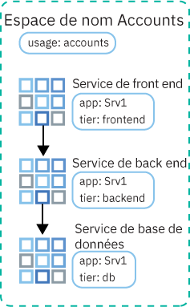
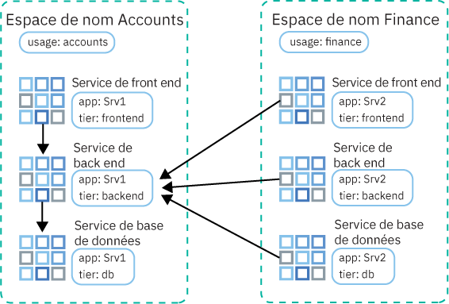

---

copyright:
  years: 2014, 2019
lastupdated: "2019-03-21"

keywords: kubernetes, iks

subcollection: containers

---

{:new_window: target="_blank"}
{:shortdesc: .shortdesc}
{:screen: .screen}
{:pre: .pre}
{:table: .aria-labeledby="caption"}
{:codeblock: .codeblock}
{:tip: .tip}
{:note: .note}
{:important: .important}
{:deprecated: .deprecated}
{:download: .download}


# Contrôle du trafic à l'aide de règles réseau
{: #network_policies}

Chaque cluster Kubernetes est configuré avec un plug-in réseau nommé Calico. Des règles réseau par défaut sont mises en place pour sécuriser l'interface réseau publique de chaque noeud worker dans {{site.data.keyword.containerlong}}.
{: shortdesc}

Si vous avez des exigences particulières en matière de sécurité ou si vous disposez d'un cluster à zones multiples avec la fonction Spanning VLAN activée, vous pouvez utiliser Calico et Kubernetes afin de créer des règles réseau pour un cluster. Avec les règles réseau Kubernetes, vous pouvez spécifier le trafic réseau que vous désirez autoriser ou bloquer vers et depuis un pod au sein d'un cluster. Pour définir des règles réseau plus avancées, par exemple le blocage de trafic entrant (ingress) vers les services d'équilibreur de charge, utilisez des règles réseau Calico.

<ul>
  <li>
  [Règles réseau Kubernetes ](https://kubernetes.io/docs/concepts/services-networking/network-policies/) : ces règles indiquent comment les pods communiquent avec d'autres pods et avec des noeuds finaux externes. A partir de Kubernetes version 1.8, le trafic réseau entrant et sortant peut être autorisé ou bloqué selon le protocole, le port et les adresses IP source et de destination. Le trafic peut également être filtré en fonction des libellés de pod et d'espace de nom. Les règles réseau Kubernetes sont appliquées à l'aide de commandes `kubectl` ou d'API Kubernetes. Lorsque ces règles sont appliquées, elles sont automatiquement converties en règles réseau Calico et Calico les met en oeuvre.
  </li>
  <li>
  [Règles réseau Calico ](https://docs.projectcalico.org/v3.1/getting-started/kubernetes/tutorials/advanced-policy) : ces règles sont un sur-ensemble des règles réseau Kubernetes et sont appliquées à l'aide de commandes `calicoctl`. Les règles Calico ajoutent les fonctions suivantes.
    <ul>
    <li>Autorisation ou blocage du trafic réseau sur des interfaces réseau spécifiques, sans tenir compte de la source de pod Kubernetes, de l'adresse IP de destination ou du routage CIDR.</li>
    <li>Autorisation ou blocage du trafic réseau pour les pods entre les espaces de nom.</li>
    <li>[Blocage de trafic entrant (ingress) vers les services LoadBalancer ou NodePort de Kubernetes](#block_ingress).</li>
    </ul>
  </li>
  </ul>

Calico applique ces règles, y compris les éventuelles règles réseau Kubernetes converties automatiquement en règles Calico, en configurant des règles Linux Iptables sur les noeuds worker Kubernetes. Les règles Iptables font office de pare-feu pour le noeud worker en définissant les caractéristiques que le trafic réseau doit respecter pour être acheminé vers la ressource ciblée.

Pour avoir recours au service Ingress et au service d'équilibreur de charge, utilisez des règles Calico et Kubernetes pour gérer le trafic réseau en provenance et à destination de votre cluster. N'utilisez pas les [groupes de sécurité](/docs/infrastructure/security-groups?topic=security-groups-about-ibm-security-groups#about-ibm-security-groups) de l'infrastructure IBM Cloud (SoftLayer). Ces groupes de sécurité sont appliqués à l'interface réseau d'un serveur virtuel unique pour filtrer le trafic au niveau de l'hyperviseur. Toutefois, les groupes de sécurité ne prennent pas en charge le protocole VRRP qui est utilisé par {{site.data.keyword.containerlong_notm}} pour gérer l'adresse IP de l'équilibreur de charge. Si le protocole VRRP n'est pas présent pour gérer l'adresse IP de l'équilibreur de charge, les services d'équilibreur de charge et Ingress ne fonctionneront pas correctement.
{: tip}

<br />


## Règles réseau Calico et Kubernetes par défaut
{: #default_policy}

Lorsqu'un cluster avec un réseau local virtuel (VLAN) public est créé, une ressource `HostEndpoint` avec le libellé `ibm.role: worker_public` est générée automatiquement pour chaque noeud worker et l'interface réseau publique associée. Pour protéger l'interface réseau publique d'un noeud worker, des règles Calico par défaut sont appliquées à chaque noeud final d'hôte avec le libellé `ibm.role: worker_public`.
{:shortdesc}

Ces règles Calico par défaut autorisent tout le trafic réseau sortant et autorisent le trafic réseau entrant sur des composants de cluster spécifiques, par exemple les services Kubernetes NodePort, LoadBalancer et Ingress. Tout autre trafic réseau entrant provenant d'Internet vers vos noeuds worker qui n'est pas spécifié dans les règles par défaut est bloqué. Les règles par défaut n'affectent pas le trafic entre les pods.

Consultez les règles réseau Calico par défaut suivantes qui sont automatiquement appliquées à votre cluster.

Ne supprimez pas de règle appliquée à un noeud final d'hôte à moins de comprendre parfaitement la règle. Assurez-vous de ne pas avoir besoin du trafic autorisé par la règle en question.
{: important}

 <table summary="La première ligne du tableau est répartie sur deux colonnes. La lecture des autres lignes s'effectue de gauche à droite, avec la zone du serveur dans la première colonne et les adresses IP correspondantes dans la deuxième colonne.">
 <caption>Règles Calico par défaut pour chaque cluster</caption>
  <thead>
  <th colspan=2> Règles Calico par défaut pour chaque cluster</th>
  </thead>
  <tbody>
    <tr>
      <td><code>allow-all-outbound</code></td>
      <td>Autorise tout le trafic sortant.</td>
    </tr>
    <tr>
      <td><code>allow-bigfix-port</code></td>
      <td>Autorise le trafic entrant sur le port 52311 vers l'application BigFix à accepter les mises à jour de noeud worker nécessaires.</td>
    </tr>
    <tr>
      <td><code>allow-icmp</code></td>
      <td>Autorise tous les paquets ICMP entrants (pings).</td>
     </tr>
    <tr>
      <td><code>allow-node-port-dnat</code></td>
      <td>Autorise le trafic entrant des services de port de noeud, d'équilibreur de charge et Ingress vers les pods exposés par ces services. <strong>Remarque</strong> : vous n'avez pas besoin d'indiquer les ports exposés car Kubernetes utilise la conversion d'adresse réseau de destination (DNAT) pour transférer les demandes de service aux pods appropriés. Ce réacheminement intervient avant l'application des règles de noeud final d'hôte dans des Iptables.</td>
   </tr>
   <tr>
      <td><code>allow-sys-mgmt</code></td>
      <td>Autorise les connexions entrantes pour des systèmes d'infrastructure IBM Cloud (SoftLayer) spécifiques utilisés pour gérer les noeuds worker.</td>
   </tr>
   <tr>
    <td><code>allow-vrrp</code></td>
    <td>Autorise les paquets VRRP utilisés pour le suivi et le déplacement d'adresses IP virtuelles entre les noeuds worker.</td>
   </tr>
  </tbody>
</table>

Dans les clusters Kubernetes version 1.10 ou ultérieure, une règle Kubernetes par défaut limitant l'accès au tableau de bord Kubernetes est également créée. Les règles Kubernetes ne s'appliquent pas au noeud final d'hôte, mais au pod `kube-dashboard` à la place. Cette règle s'applique aux clusters connectés uniquement à un VLAN privé et aux clusters connectés à un VLAN public et privé.

<table>
<caption>Règles Kubernetes par défaut pour chaque cluster</caption>
<thead>
<th colspan=2> Règles Kubernetes par défaut pour chaque cluster</th>
</thead>
<tbody>
 <tr>
  <td><code>kubernetes-dashboard</code></td>
  <td>Dans Kubernetes 1.10 ou version ultérieure uniquement, règle fournie dans l'espace de nom <code>kube-system</code> utilisée pour bloquer l'accès de tous les pods au tableau de bord Kubernetes. Cette règle n'affecte pas l'accès au tableau de bord à partir de la console {{site.data.keyword.Bluemix_notm}} ou via <code>kubectl proxy</code>. Si un pod nécessite l'accès au tableau de bord, déployez-le dans un espace de nom ayant le libellé <code>kubernetes-dashboard-policy: allow</code>.</td>
 </tr>
</tbody>
</table>

<br />


## Installation et configuration de l'interface de ligne de commande (CLI) de Calico
{: #cli_install}

Pour afficher, gérer et ajouter des règles Calico, installez et configurez l'interface CLI de Calico.
{:shortdesc}

1. [Connectez-vous à votre compte. Ciblez la région appropriée et, le cas échéant, le groupe de ressources. Définissez le contexte de votre cluster](/docs/containers?topic=containers-cs_cli_install#cs_cli_configure). Incluez les options `--admin` et `--network` avec la commande `ibmcloud ks cluster-config`. L'option `--admin` permet de télécharger les clés pour accéder à votre portefeuille d'infrastructure et exécuter des commandes Calico sur vos noeuds worker. L'option `--network` permet de télécharger le fichier de configuration pour exécuter toutes les commandes Calico.

  ```
  ibmcloud ks cluster-config --cluster <cluster_name_or_ID> --admin --network
  ```
  {: pre}

3. Pour les utilisateurs OS X et Linux, procédez comme suit.
    1. Créez le répertoire `/etc/calico`.
        ```
        sudo mkdir /etc/calico
        ```
        {: pre}

    2. Déplacez le fichier de configuration de Calico que vous avez téléchargé précédemment vers le répertoire.
        ```
        sudo mv /Users/<user>/.bluemix/plugins/container-service/clusters/<cluster_name>-admin/calicoctl.cfg /etc/calico
        ```
        {: pre}

4. [Téléchargez l'interface CLI de Calico ](https://github.com/projectcalico/calicoctl/releases/tag/v3.3.1).

    Si vous utilisez OS X, téléchargez la version `-darwin-amd64`. Si vous utilisez Windows, installez l'interface CLI de Calico dans le même répertoire que celle d'{{site.data.keyword.Bluemix_notm}}. Cette configuration vous évite diverses modifications de chemin de fichier lorsque vous exécutez des commandes par la suite.
    Veillez à sauvegarder le fichier sous `calicoctl.exe`.
    {: tip}

5. Pour les utilisateurs OS X et Linux, procédez comme suit.
    1. Déplacez le fichier exécutable vers le répertoire _/usr/local/bin_.
        - Linux :

          ```
          mv filepath/calicoctl /usr/local/bin/calicoctl
          ```
          {: pre}

        - OS X :

          ```
          mv filepath/calicoctl-darwin-amd64 /usr/local/bin/calicoctl
          ```
          {: pre}

    2. Rendez le fichier exécutable.

        ```
        chmod +x /usr/local/bin/calicoctl
        ```
        {: pre}

6. Si les règles réseau d'entreprise utilisent des proxys ou des pare-feux pour empêcher l'accès depuis votre système local à des noeuds finaux publics, [autorisez l'accès TCP pour les commandes Calico](/docs/containers?topic=containers-firewall#firewall).

7. Vérifiez que la configuration Calico fonctionne correctement.

    - Linux et OS X :

      ```
      calicoctl get nodes
      ```
      {: pre}

    - Windows : utilisez l'indicateur `--config` pour pointer vers le fichier de configuration réseau que vous avez obtenu à l'étape 1. Incluez cet indicateur chaque fois que vous exécutez une commande `calicoctl`.

      ```
      calicoctl get nodes --config=filepath/calicoctl.cfg
      ```
      {: pre}

      Sortie :

      ```
      NAME
              kube-dal10-crc21191ee3997497ca90c8173bbdaf560-w1.cloud.ibm
              kube-dal10-crc21191ee3997497ca90c8173bbdaf560-w2.cloud.ibm
              kube-dal10-crc21191ee3997497ca90c8173bbdaf560-w3.cloud.ibm
      ```
      {: screen}

<br />


## Affichage des règles réseau
{: #view_policies}

Affichez les détails des règles réseau par défaut ou ayant été ajoutées qui sont appliquées à votre cluster.
{:shortdesc}

Avant de commencer :
1. [Installez et configurez l'interface CLI de Calico.](#cli_install)
2. [Connectez-vous à votre compte. Ciblez la région appropriée et, le cas échéant, le groupe de ressources. Définissez le contexte de votre cluster](/docs/containers?topic=containers-cs_cli_install#cs_cli_configure). Incluez les options `--admin` et `--network` avec la commande `ibmcloud ks cluster-config`. L'option `--admin` permet de télécharger les clés pour accéder à votre portefeuille d'infrastructure et exécuter des commandes Calico sur vos noeuds worker. L'option `--network` permet de télécharger le fichier de configuration pour exécuter toutes les commandes Calico.

  ```
  ibmcloud ks cluster-config --cluster <cluster_name_or_ID> --admin --network
  ```
  {: pre}

**Pour afficher des règles réseau dans les clusters** :

Les utilisateurs de Linux et de Mac n'ont pas besoin d'inclure l'indicateur `--config=filepath/calicoctl.cfg` dans les commandes `calicoctl`.
{: tip}

1. Examinez le noeud final d'hôte Calico.

    ```
    calicoctl get hostendpoint -o yaml --config=filepath/calicoctl.cfg
    ```
    {: pre}

2. Examinez toutes les règles réseau Calico et Kubernetes créées pour le cluster. Cette liste inclut des règles qui n'ont peut-être pas encore été appliquées à des pods ou à des hôtes. Pour qu'une règle réseau soit appliquée, une ressource Kubernetes correspondant au sélecteur défini dans la règle réseau Calico doit être localisée.

    [Les règles réseau ](https://docs.projectcalico.org/v3.1/reference/calicoctl/resources/networkpolicy) sont limitées à des espaces de nom spécifiques :
    ```
    calicoctl get NetworkPolicy --all-namespaces -o wide --config=filepath/calicoctl.cfg
    ```
    {:pre}

    [Les règles réseau globales ](https://docs.projectcalico.org/v3.1/reference/calicoctl/resources/globalnetworkpolicy) ne sont pas limitées à des espaces de nom spécifiques :
    ```
    calicoctl get GlobalNetworkPolicy -o wide --config=filepath/calicoctl.cfg
    ```
    {: pre}

3. Affichez les informations détaillées d'une règle réseau.

    ```
    calicoctl get NetworkPolicy -o yaml <policy_name> --namespace <policy_namespace> --config=filepath/calicoctl.cfg
    ```
    {: pre}

4. Affichez les informations détaillées de toutes les règles réseau globales pour le cluster.

    ```
    calicoctl get GlobalNetworkPolicy -o yaml --config=filepath/calicoctl.cfg
    ```
    {: pre}

<br />


## Ajout de règles réseau
{: #adding_network_policies}

Dans la plupart des cas, les règles par défaut n'ont pas besoin d'être modifiées. Seuls les scénarios avancés peuvent nécessiter des modifications. Si vous constatez que vous devez apporter des modifications, vous pouvez créer vos propres règles réseau.
{:shortdesc}

Pour créer des règles réseau Kubernetes, voir la [documentation Kubernetes Network Policies ](https://kubernetes.io/docs/concepts/services-networking/network-policies/).

Pour créer des règles Calico, procédez comme suit :

1. [Installez et configurez l'interface CLI de Calico.](#cli_install)
2. [Connectez-vous à votre compte. Ciblez la région appropriée et, le cas échéant, le groupe de ressources. Définissez le contexte de votre cluster](/docs/containers?topic=containers-cs_cli_install#cs_cli_configure). Incluez les options `--admin` et `--network` avec la commande `ibmcloud ks cluster-config`. L'option `--admin` permet de télécharger les clés pour accéder à votre portefeuille d'infrastructure et exécuter des commandes Calico sur vos noeuds worker. L'option `--network` permet de télécharger le fichier de configuration pour exécuter toutes les commandes Calico.

  ```
  ibmcloud ks cluster-config --cluster <cluster_name_or_ID> --admin --network
  ```
  {: pre}

3. Définissez votre [règle réseau ](https://docs.projectcalico.org/v3.1/reference/calicoctl/resources/networkpolicy) ou [règle réseau globale ](https://docs.projectcalico.org/v3.1/reference/calicoctl/resources/globalnetworkpolicy) Calico en créant un script de configuration (`.yaml`). Ces fichiers de configuration incluent les sélecteurs qui décrivent les pods, les espaces de nom ou les hôtes, auxquels s'appliquent ces règles. Reportez-vous à ces [exemples de règles Calico ](http://docs.projectcalico.org/v3.1/getting-started/kubernetes/tutorials/advanced-policy) pour vous aider à créer vos propres règles. Notez que les clusters Kubernetes version 1.10 ou ultérieure doivent utiliser la syntaxe des règles de Calico v3.

4. Appliquez les règles au cluster.
    - Linux et OS X :

      ```
      calicoctl apply -f policy.yaml
      ```
      {: pre}

    - Windows :

      ```
      calicoctl apply -f filepath/policy.yaml --config=filepath/calicoctl.cfg
      ```
      {: pre}

<br />


## Contrôle du trafic entrant vers les services d'équilibreur de charge ou de port de noeud
{: #block_ingress}

[Par défaut](#default_policy), les services Kubernetes NodePort et LoadBalancer sont conçus pour rendre accessible votre application sur toutes les interfaces de cluster publiques et privées. Vous pouvez toutefois utiliser des règles Calico pour bloquer le trafic entrant vers vos services en fonction de l'origine ou de la destination du trafic.
{:shortdesc}

Les règles par défaut de Kubernetes et Calico sont difficiles à appliquer pour protéger les services Kubernetes NodePort et LoadBalancer en raison des règles Iptables DNAT générées pour ces services. Cependant, les règles pre-DNAT empêchent le trafic spécifié d'atteindre vos applications car elles génèrent et appliquent des règles Iptables avant que Kubernetes utilise la fonction DNAT standard pour acheminer le trafic vers les pods.

Quelques utilisations classiques des règles réseau pre-DNAT Calico :

  - Blocage du trafic vers les ports de noeud publics d'un service d'équilibreur de charge privé : un service d'équilibreur de charge rend votre application accessible via l'adresse IP et le port de l'équilibreur de charge et la rend également accessible via les ports de noeud du service. Les ports de noeud sont accessibles sur toutes les adresses IP (publiques et privées) pour tous les noeuds figurant dans le cluster.
  - Blocage du trafic vers les ports de noeud publics sur les clusters qui exécutent des [noeuds worker de périphérie](/docs/containers?topic=containers-edge#edge) : le blocage des ports de noeud garantit que les noeuds worker de périphérie sont les seuls noeuds worker qui traitent le trafic entrant.
  - Blocage du trafic en provenance de certaines adresses IP source ou CIDR (placement sur liste noire)
  - Autorisation du trafic provenant uniquement de certaines adresses IP source ou CIDR (placement sur liste blanche) et blocage de tout autre trafic

Pour voir comment mettre des adresses IP source sur liste blanche ou sur liste noire, essayez le [tutoriel sur l'utilisation des règles réseau de Calico pour bloquer le trafic](/docs/containers?topic=containers-policy_tutorial#policy_tutorial). Pour obtenir d'autres exemples de règles réseau Calico utilisées pour contrôler le trafic en provenance et à destination de votre cluster, vous pouvez consulter les pages [Stars Policy Demo ](https://docs.projectcalico.org/v3.1/getting-started/kubernetes/tutorials/stars-policy/) et [Advanced network policy ](https://docs.projectcalico.org/v3.1/getting-started/kubernetes/tutorials/advanced-policy).
{: tip}

Avant de commencer :
1. [Installez et configurez l'interface CLI de Calico.](#cli_install)
2. [Connectez-vous à votre compte. Ciblez la région appropriée et, le cas échéant, le groupe de ressources. Définissez le contexte de votre cluster](/docs/containers?topic=containers-cs_cli_install#cs_cli_configure). Incluez les options `--admin` et `--network` avec la commande `ibmcloud ks cluster-config`. L'option `--admin` permet de télécharger les clés pour accéder à votre portefeuille d'infrastructure et exécuter des commandes Calico sur vos noeuds worker. L'option `--network` permet de télécharger le fichier de configuration pour exécuter toutes les commandes Calico.

  ```
  ibmcloud ks cluster-config --cluster <cluster_name_or_ID> --admin --network
  ```
  {: pre}

Pour créer une règle pre-DNAT :

1. Définissez une règle réseau pre-DNAT de Calico pour l'accès entrant (trafic entrant) vers les services Kubernetes.
    * Les clusters Kubernetes version 1.10 ou ultérieure doivent utiliser la [syntaxe des règles Calico v3 ](https://docs.projectcalico.org/v3.1/reference/calicoctl/resources/networkpolicy).
    * Si vous gérez le trafic vers un [service d'équilibreur de charge version 2.0](/docs/containers?topic=containers-loadbalancer#planning_ipvs), vous devez inclure les zones `applyOnForward: true` et `doNotTrack: true` dans la section `spec` de la règle.

        Exemple de ressource qui bloque tous les ports de noeud :

        ```
        apiVersion: projectcalico.org/v3
        kind: GlobalNetworkPolicy
        metadata:
          name: deny-nodeports
        spec:
          applyOnForward: true
          preDNAT: true
          ingress:
          - action: Deny
            destination:
              ports:
              - 30000:32767
            protocol: TCP
            source: {}
          - action: Deny
            destination:
              ports:
              - 30000:32767
        protocol: UDP
        source: {}
      selector: ibm.role=='worker_public'
      order: 1100
      types:
          - Ingress
        ```
        {: codeblock}

        Exemple de ressource qui place en liste blanche le trafic qui provient uniquement d'un CIDR source indiqué vers un équilibreur de charge 2.0 :

        ```
        apiVersion: projectcalico.org/v3
    kind: GlobalNetworkPolicy
    metadata:
      name: whitelist
    spec:
      applyOnForward: true
      doNotTrack: true
      ingress:
          - action: Allow
        destination:
          nets:
              - <loadbalancer_IP>/32
          ports:
              - 80
        protocol: TCP
        source:
          nets:
              - <client_address>/32
      selector: ibm.role=='worker_public'
      order: 500
      types:
          - Ingress
        ```
        {: codeblock}

        Exemple de ressource qui place en liste blanche le trafic qui provient uniquement d'un CIDR source indiqué vers un équilibreur de charge 1.0 :

        ```
        apiVersion: projectcalico.org/v3
        kind: GlobalNetworkPolicy
        metadata:
          name: whitelist
        spec:
          applyOnForward: true
          preDNAT: true
          ingress:
          - action: Allow
        destination:
          nets:
              - <loadbalancer_IP>/32
          ports:
              - 80
        protocol: TCP
        source:
          nets:
              - <client_address>/32
      selector: ibm.role=='worker_public'
      order: 500
      types:
          - Ingress
        ```
        {: codeblock}

2. Appliquez la règle réseau Calico preDNAT. Comptez environ 1 minute pour que les modifications de règle
soient appliquées dans tout le cluster.

  - Linux et OS X :

    ```
    calicoctl apply -f deny-nodeports.yaml
    ```
    {: pre}

  - Windows :

    ```
    calicoctl apply -f filepath/deny-nodeports.yaml --config=filepath/calicoctl.cfg
    ```
    {: pre}

3. Facultatif : dans les clusters à zones multiples, l'équilibreur de charge pour zones multiples (MZLB) effectue un diagnostic d'intégrité des équilibreurs de charge d'application (ALB) Ingress dans chaque zone de votre cluster et conserve les résultats de recherche DNS mis à jour en fonction de ces diagnostics. Si vous utilisez des règles pre-DNAT pour bloquer tout le trafic entrant vers les services Ingress, vous devez également inclure dans la liste blanche les [adresses IP IPv4 de Cloudflare ](https://www.cloudflare.com/ips/) utilisées pour effectuer des diagnostics d'intégrité de vos équilibreurs de charge d'application (ALB). Pour obtenir les étapes nécessaires permettant de créer une règle pre-DAT Calico pour mettre ces adresses IP sur liste blanche, voir la leçon 3 du [Tutoriel sur les règles réseau de Calico](/docs/containers?topic=containers-policy_tutorial#lesson3).

## Isolement de vos clusters sur le réseau privé
{: #isolate_workers}

Si vous disposez d'un cluster à zones multiples, de plusieurs VLAN pour un cluster à zone unique ou de plusieurs sous-réseaux sur le même VLAN, vous devez [activer le spanning VLAN](/docs/infrastructure/vlans?topic=vlans-vlan-spanning#vlan-spanning) pour que vos noeuds worker puissent communiquer entre eux sur le réseau privé. Cependant, lorsque le spanning VLAN est activé, tout système connecté à l'un des VLAN privés dans le même compte IBM Cloud peut communiquer avec les noeuds worker.
{: shortdesc}

Vous pouvez isoler votre cluster des autres systèmes sur le réseau privé en appliquant des [règles de réseau privé Calico ](https://github.com/IBM-Cloud/kube-samples/tree/master/calico-policies/private-network-isolation). Cet ensemble de règles Calico et de noeuds finaux d'hôte isole le trafic du réseau privé d'un cluster des autres ressources dans le réseau privé du compte.

Les règles ciblent l'interface privée des noeuds worker (eth0) et le réseau de pods d'un cluster.

**Noeuds worker**

* Le trafic sortant de l'interface privée est autorisé uniquement pour les adresses IP de pod, les noeuds worker figurant dans ce cluster et le port UDP/TCP 53 pour l'accès DNS, le port 2049 pour la communication avec les serveurs de fichiers NFS et les ports 443 et 3260 pour la communication avec le stockage par blocs.
* Le trafic entrant de l'interface privée est autorisé uniquement à partir des noeuds worker du cluster et uniquement vers le DNS, Kubelet, ICMP et VRRP.

**Pods**

* Tout trafic entrant vers les pods est autorisé à partir des noeuds worker du cluster.
* Tout trafic sortant depuis les pods est réservé uniquement à ces éléments : adresses IP publiques, DNS, kubelet et autres pods figurant dans le cluster.

Avant de commencer :
1. [Installez et configurez l'interface CLI de Calico.](#cli_install)
2. [Connectez-vous à votre compte. Ciblez la région appropriée et, le cas échéant, le groupe de ressources. Définissez le contexte de votre cluster](/docs/containers?topic=containers-cs_cli_install#cs_cli_configure). Incluez les options `--admin` et `--network` avec la commande `ibmcloud ks cluster-config`. L'option `--admin` permet de télécharger les clés pour accéder à votre portefeuille d'infrastructure et exécuter des commandes Calico sur vos noeuds worker. L'option `--network` permet de télécharger le fichier de configuration pour exécuter toutes les commandes Calico.

  ```
  ibmcloud ks cluster-config --cluster <cluster_name_or_ID> --admin --network
  ```
  {: pre}

Pour isoler votre cluster sur le réseau privé en utilisant des règles Calico :

1. Clonez le référentiel `IBM-Cloud/kube-samples`.
    ```
    git clone https://github.com/IBM-Cloud/kube-samples.git
    ```
    {: pre}

2. Accédez au répertoire des règles privées pour la version de Calico compatible avec la version de votre cluster.
   ```
   cd <filepath>/IBM-Cloud/kube-samples/calico-policies/private-network-isolation/calico-v3
   ```
   {: pre}

3. Configurez une règle pour le noeud final de l'hôte privé.
    1. Ouvrez la règle `generic-privatehostendpoint.yaml`.
    2. Remplacez `<worker_name>` par le nom d'un noeud worker. **Important** : certains noeuds worker doivent suivre une structure de désignation différente pour les règles Calico. Vous devez utiliser le nom d'un noeud worker au format renvoyé par la commande suivante.
      ```
      ibmcloud ks calicoctl get nodes --config==filepath/calicoctl.cfg
      ```
      {: pre}
    3. Remplacez `<worker-node-private-ip>` par l'adresse IP privée du noeud worker. Pour voir les adresses IP privées de vos noeuds worker, exécutez la commande `ibmcloud ks workers --cluster <my_cluster>`.
    4. Répétez cette série d'étapes dans une nouvelle section pour chaque noeud worker de votre cluster. **Remarque** : chaque fois que vous ajoutez un noeud worker dans un cluster, vous devez mettre à jour le fichier des noeuds finaux de l'hôte avec les nouvelles entrées.

4. Appliquez l'ensemble des règles dans votre cluster.
    - Linux et OS X :

      ```
      calicoctl apply -f allow-all-workers-private.yaml
      calicoctl apply -f allow-ibm-ports-private.yaml
      calicoctl apply -f allow-egress-pods.yaml
      calicoctl apply -f allow-icmp-private.yaml
      calicoctl apply -f allow-vrrp-private.yaml
      calicoctl apply -f generic-privatehostendpoint.yaml
      ```
      {: pre}

    - Windows :

      ```
      calicoctl apply -f allow-all-workers-private.yaml --config=filepath/calicoctl.cfg
      calicoctl apply -f allow-ibm-ports-private.yaml --config=filepath/calicoctl.cfg
      calicoctl apply -f allow-egress-pods.yaml --config=filepath/calicoctl.cfg
      calicoctl apply -f allow-icmp-private.yaml --config=filepath/calicoctl.cfg
      calicoctl apply -f allow-vrrp-private.yaml --config=filepath/calicoctl.cfg
      calicoctl apply -f generic-privatehostendpoint.yaml --config=filepath/calicoctl.cfg
      ```
      {: pre}

## Contrôle du trafic entre les pods
{: #isolate_services}

Les règles Kubernetes protègent les pods du trafic réseau interne. Vous pouvez créer plusieurs règles réseau Kubernetes simples permettant d'isoler les uns des autres des microservices d'application au sein d'un espace de nom ou entre différents espaces de nom.
{: shortdesc}

Pour en savoir plus sur comment les règles réseau Kubernetes contrôlent le trafic de pod à pod et obtenir d'autres exemples de règles, voir la [documentation de Kubernetes  ](https://kubernetes.io/docs/concepts/services-networking/network-policies/).
{: tip}

### Isolement des services d'application au sein d'un espace de nom
{: #services_one_ns}

Le scénario suivant illustre comment gérer le trafic entre les microservices d'application au sein d'un espace de nom.

Une équipe nommée Accounts déploie plusieurs services d'application dans un espace de nom, mais ces services doivent être isolés pour n'autoriser que la communication nécessaire entre les microservices sur le réseau public. Pour l'application `Srv1`, l'équipe dispose de services de front end et de back end, et d'un service de base de données. Elle indique pour chaque service le libellé `app: Srv1` et le libellé `tier: frontend`, `tier: backend` ou `tier: db`.



L'équipe Accounts souhaite autoriser le trafic du service de front end vers le service de back end et du service de back end vers le service de base de données. Elle utilise des libellés dans les règles réseau pour désigner les trafics autorisés à circuler entre les microservices.

L'équipe commence par créer une règle réseau Kubernetes autorisant le trafic à partir du service front end vers le service de back end :

```
kind: NetworkPolicy
apiVersion: networking.k8s.io/v1
metadata:
  name: backend-allow
spec:
  podSelector:
    matchLabels:
      app: Srv1
      tier: backend
  ingress:
  - from:
    - podSelector:
        matchLabels:
          app: Srv1
          Tier: frontend
```
{: codeblock}

La section `spec.podSelector.matchLabels` répertorie les libellés pour le service de back end Srv1 pour que la règle ne s'applique que _vers_ ces pods. La section `spec.ingress.from.podSelector.matchLabels` répertorie les libellés du service de front end Srv1 pour que le trafic entrant ne soit autorisé que _depuis_ ces pods.

Ensuite, l'équipe crée une règle Kubernetes similaire pour autoriser le trafic du service de back end vers la base de données :

```
kind: NetworkPolicy
apiVersion: networking.k8s.io/v1
metadata:
  name: db-allow
spec:
  podSelector:
    matchLabels:
      app: Srv1
      tier: db
  ingress:
  - from:
    - podSelector:
        matchLabels:
          app: Srv1
          Tier: backend
  ```
  {: codeblock}

La section `spec.podSelector.matchLabels` répertorie les libellés pour le service de base de données Srv1 pour que la règle ne s'applique que _vers_ ces pods. La section `spec.ingress.from.podSelector.matchLabels` répertorie les libellés du service de back end Srv1 pour que le trafic entrant ne soit autorisé que _depuis_ ces pods.

Le trafic peut désormais circuler du service de front end vers le service de back end et du service de back end vers le service de base de données. La base de données peut répondre au service de back end et le service de back end peut répondre au service de front end, mais les connexions de trafic inverses ne peuvent pas être établies.

### Isolement des services d'application entre les espaces de nom
{: #services_across_ns}

Le scénario suivant illustre comment gérer le trafic entre les microservices d'application entre plusieurs espaces de nom.

Les services détenus par plusieurs équipes subalternes doivent communiquer mais ces services sont déployés dans différents espaces de nom au sein du même cluster. L'équipe Accounts déploie des services de front end, de back end et de base de données pour l'application app Srv1 dans l'espace de nom Accounts. L'équipe Finance déploie des services de front end, de back end et de base de données pour l'application app Srv2 dans l'espace de nom Finance. Ces deux équipes étiquettent chaque service avec le libellé `app: Srv1` ou `app: Srv2` et le libellé `tier: frontend`, `tier: backend` ou `tier: db`. Elles étiquettent également les espaces de nom avec le libellé `usage: accounts` ou `usage: finance`.



Le service Srv2 de l'équipe Finance doit demander des informations au service de back end Srv1 de l'équipe Accounts. Par conséquent, l'équipe Accounts crée une règle réseau Kubernetes utilisant des libellés pour autoriser tout le trafic en provenance de l'espace de nom Finance vers le service de back end Srv1 dans l'espace de nom Accounts. L'équipe indique également le port 3111 pour isoler l'accès uniquement via ce port.

```
kind: NetworkPolicy
apiVersion: networking.k8s.io/v1
metadata:
  Namespace: accounts
  name: accounts-allow
spec:
  podSelector:
    matchLabels:
      app: Srv1
      Tier: backend
  ingress:
  - from:
    - NamespaceSelector:
        matchLabels:
          usage: finance
      ports:
        port: 3111
```
{: codeblock}

La section `spec.podSelector.matchLabels` répertorie les libellés pour le service de back end Srv1 pour que la règle ne s'applique que _vers_ ces pods. La section `spec.ingress.from.NamespaceSelector.matchLabels` répertorie le libellé de l'espace de nom Finance pour que le trafic entrant soit autorisé uniquement _depuis_ les services figurant dans cet espace de nom.

Le trafic peut désormais circuler des microservices Finance vers le service de back end Srv1. Le service de back end Srv1 de Accounts peut répondre aux microservices Finance, mais une connexion de trafic inverse n'est pas possible.

Dans cet exemple, l'ensemble du trafic en provenance de tous les microservices dans l'espace de nom Finance est autorisé. Vous ne pouvez pas autoriser le trafic en provenance de pods d'application spécifiques d'un autre espace de nom car les éléments `podSelector` et `namespaceSelector` ne peuvent pas être combinés.

## Consignation du trafic refusé
{: #log_denied}

Pour consigner les demandes de trafic refusé sur certains pods de votre cluster, vous pouvez créer une règle réseau de consignation Calico.
{: shortdesc}

Lorsque vous configurez des règles réseau pour limiter le trafic sur les pods d'application, les demandes de trafic qui ne sont pas autorisées par ces règles sont refusées et supprimées. Dans certains cas, vous souhaiterez obtenir plus d'informations sur les demandes de trafic refusé. Par exemple, vous pouvez éventuellement détecter un trafic inhabituel qui est systématiquement refusé par l'une de vos règles réseau. Pour surveiller cette menace de sécurité potentielle, vous pouvez configurer la consignation de sorte à enregistrer toutes les fois qu'une règle refuse une action intentée sur les pods d'application indiqués.

Avant de commencer :
1. [Installez et configurez l'interface CLI de Calico.](#cli_install)
2. [Ciblez l'interface CLI de Kubernetes sur le cluster](/docs/containers?topic=containers-cs_cli_install#cs_cli_configure). Incluez l'option `--admin` avec la commande `ibmcloud ks cluster-config`, laquelle est utilisée pour télécharger les fichiers de certificat et d'autorisations. Ce téléchargement comprend également les clés permettant d'accéder à votre portefeuille d'infrastructure et d'exécuter des commandes Calico sur vos noeuds worker.
    ```
    ibmcloud ks cluster-config --cluster <cluster_name> --admin
    ```
    {: pre}

Pour créer une règle Calico pour consigner le trafic refusé :

1. Créez ou utilisez une règle réseau Kubernetes ou Calico existante pour bloquer ou limiter le trafic entrant. Par exemple, pour contrôler le trafic entre les pods, vous pouvez utiliser l'exemple de règle Kubernetes nommée `access-nginx` qui limite l'accès à une application NGINX. Le trafic entrant dans les pods avec le libellé "run=nginx" est autorisé uniquement en provenance des pods avec le libellé "run=access". Tout autre trafic entrant vers les pods d'application labellisés "run=nginx" est bloqué.
    ```
    kind: NetworkPolicy
    apiVersion: networking.k8s.io/v1
    metadata:
      name: access-nginx
    spec:
      podSelector:
        matchLabels:
          run: nginx
      ingress:
        - from:
          - podSelector:
              matchLabels:
                run: access
    ```
    {: codeblock}

2. Appliquez la règle.
    * Pour appliquer une règle Kubernetes :
        ```
        kubectl apply -f <policy_name>.yaml
        ```
        {: pre}
        La règle Kubernetes est automatiquement convertie en règle réseau Calico (`NetworkPolicy`) de sorte que Calico puisse l'appliquer sous forme de règles Iptables.

    * Pour appliquer une règle Calico :
        ```
        calicoctl apply -f <policy_name>.yaml --config=<filepath>/calicoctl.cfg
        ```
        {: pre}

3. Si vous avez appliqué une règle Kubernetes, consultez la syntaxe de la règle Calico créée automatiquement et copiez la valeur de la zone `spec.selector`.
    ```
    calicoctl get policy -o yaml <policy_name> --config=<filepath>/calicoctl.cfg
    ```
    {: pre}

    Par exemple, après avoir été appliquée et convertie, la règle `access-nginx` a la syntaxe Calico v3 suivante. La zone `spec.selector` a la valeur `projectcalico.org/orchestrator == 'k8s' && run == 'nginx'`.
    ```
    apiVersion: projectcalico.org/v3
    kind: NetworkPolicy
    metadata:
      name: access-nginx
    spec:
      ingress:
      - action: Allow
        destination: {}
        source:
          selector: projectcalico.org/orchestrator == 'k8s' && run == 'access'
      order: 1000
      selector: projectcalico.org/orchestrator == 'k8s' && run == 'nginx'
      types:
      - Ingress
    ```
    {: screen}

4. Pour consigner tout le trafic refusé par la règle Calico que vous avez créée précédemment, créez une règle réseau Calico (`NetworkPolicy`) nommée `log-denied-packets`. Par exemple, utilisez la règle suivante pour consigner tous les paquets refusés par la règle réseau que vous avez définie à l'étape 1. La règle de consignation utilise le même sélecteur de pod que dans l'exemple de règle `access-nginx`, qui ajoute cette règle dans la chaîne de règles Iptables de Calico. En utilisant un numéro d'ordre plus élevé, tel que `3000`, vous pouvez assurer que cette règle est ajoutée à la fin de la chaîne de règles Iptables. Tout paquet de demandes provenant du pod "run=access" qui correspond à la règle `access-nginx` est accepté par les pods "run=nginx".  Cependant, lorsque des paquets d'une autre source tentent de correspondre à la règle `access-nginx` d'ordre inférieur, ils sont refusés. Ces paquets tentent alors de correspondre à la règle `log-denied-packets` d'ordre supérieur. La règle `log-denied-packets` consigne tout paquet qui passe par elle, par conséquent seuls les paquets qui ont été refusés par les pods "run=nginx" sont consignés. Une fois que les tentatives de ces paquets sont consignées, les paquets sont supprimés.
    ```
    apiVersion: projectcalico.org/v3
    kind: NetworkPolicy
    metadata:
      name: log-denied-packets
    spec:
      types:
      - Ingress
      ingress:
      - action: Log
        destination: {}
        source: {}
      selector: projectcalico.org/orchestrator == 'k8s' && run == 'nginx'
      order: 3000
    ```
    {: codeblock}

    <table>
    <caption>Description des composants du fichier YAML de la règle de consignation</caption>
    <thead>
    <th colspan=2> Description des composants du fichier YAML de la règle de consignation</th>
    </thead>
    <tbody>
    <tr>
     <td><code>types</code></td>
     <td>Cette règle <code>Ingress</code> s'applique à toute les demandes de trafic entrant. La valeur <code>Ingress</code> est un terme général désignant tout trafic entrant et ne se réfère pas au trafic provenant uniquement de l'équilibreur de charge d'application (ALB) Ingress d'IBM.</td>
    </tr>
     <tr>
      <td><code>ingress</code></td>
      <td><ul><li><code>action</code> : l'action <code>Log</code> écrit une entrée de journal pour toute demande correspondant à cette règle dans le chemin `/var/log/syslog` sur le noeud worker.</li><li><code>destination</code> : aucune destination n'est indiquée car <code>selector</code> applique cette règle à tous les pods avec un libellé particulier.</li><li><code>source</code> : cette règle s'applique aux demandes de n'importe quelle source.</td>
     </tr>
     <tr>
      <td><code>selector</code></td>
      <td>Remplacez &lt;selector&gt; par le même sélecteur dans la zone `spec.selector` que vous avez utilisé dans votre règle Calico à l'étape 1 ou que vous avez trouvé dans la syntaxe de Calico correspondant à votre règle Kubernetes à l'étape 3. Par exemple, en utilisant le sélecteur <code>selector: projectcalico.org/orchestrator == 'k8s' && run == 'nginx'</code>, cette règle est ajoutée à la même chaîne Iptables que le modèle de règle réseau <code>access-nginx</code> indiqué à l'étape 1. Cette règle s'applique uniquement au trafic réseau entrant vers les pods utilisant le même libellé de sélecteur de pod.</td>
     </tr>
     <tr>
      <td><code>order</code></td>
      <td>Les règles Calico ont un ordre qui détermine à quel moment elles sont appliquées aux paquets de demandes entrantes. Les règles avec les ordres les moins élevés, par exemple <code>1000</code>, sont appliquées en premier. Les règles avec les ordres les plus élevés sont appliquées après les règles dont les ordres sont plus faibles. Par exemple, une règle avec un ordre très élevé, par exemple <code>3000</code>, est effectivement appliquée en dernier, une fois que toutes les règles d'ordre plus faible ont été appliquées.</br></br>Les paquets de demandes entrantes passent par la chaîne de règles Iptables et tentent d'abord de correspondre aux règles d'ordre moins élevé. Si un paquet correspond à une règle, le paquet est accepté. Toutefois, si un paquet ne correspond à aucune règle, il arrive à la dernière règle de la chaîne de règles Iptables avec l'ordre le plus élevé. Pour garantir qu'il s'agit de la dernière règle dans la chaîne, utilisez un ordre beaucoup plus élevé, par exemple <code>3000</code>, que la règle que vous avez créée à l'étape 1.</td>
     </tr>
    </tbody>
    </table>

5. Appliquez la règle.
    ```
    calicoctl apply -f log-denied-packets.yaml --config=<filepath>/calicoctl.cfg
    ```
    {: pre}

6. [Transférez les journaux](/docs/containers?topic=containers-health#configuring) de `/var/log/syslog` vers {{site.data.keyword.loganalysislong}} ou un serveur syslog externe.
