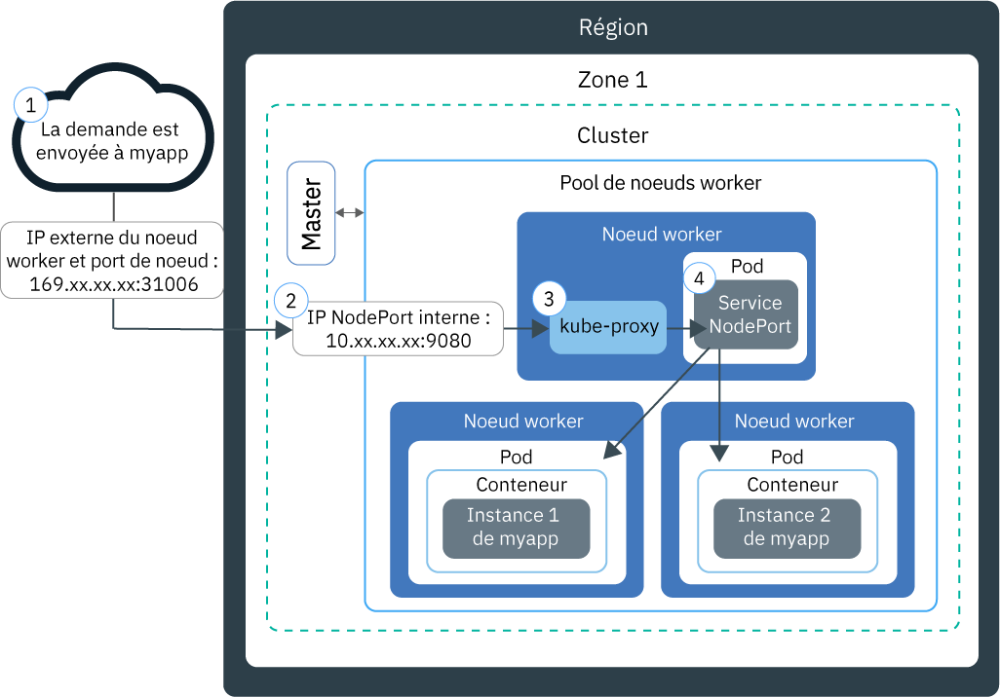

---

copyright:
  years: 2014, 2019
lastupdated: "2019-05-31"

keywords: kubernetes, iks

subcollection: containers

---

{:new_window: target="_blank"}
{:shortdesc: .shortdesc}
{:screen: .screen}
{:pre: .pre}
{:table: .aria-labeledby="caption"}
{:codeblock: .codeblock}
{:tip: .tip}
{:note: .note}
{:important: .important}
{:deprecated: .deprecated}
{:download: .download}
{:preview: .preview}


# Test de l'accès à des applications avec des ports de noeud (NodePort)
{: #nodeport}

Rendez votre application conteneurisée accessible sur Internet en utilisant l'adresse IP publique de n'importe quel noeud worker dans un cluster Kubernetes et en exposant un port de noeud (NodePort). Utilisez cette option pour tester {{site.data.keyword.containerlong}} et pour un accès public à court terme.
{:shortdesc}

## Gestion de trafic réseau à l'aide de services NodePort
{: #nodeport_planning}

Exposez un port public sur votre noeud worker et utilisez l'adresse IP publique du noeud worker pour accéder au service du cluster depuis Internet.
{:shortdesc}

Lorsque vous exposez votre application en créant un service Kubernetes du type NodePort, une valeur de port de noeud (NodePort) comprise entre 30000 et 32767 et une adresse IP interne de cluster sont affectées au service. Le service NodePort fait office de point d'entrée externe pour les demandes entrantes vers votre application. Le port de noeud affecté est exposé au public dans les paramètres `kubeproxy` de chaque noeud worker dans le cluster. Chaque noeud worker commence à écouter sur le port de noeud affecté pour détecter des demandes entrantes pour le service. Pour accéder au service depuis Internet, vous pouvez utiliser l'adresse IP publique de n'importe quel noeud worker affectée lors de la création du cluster et le service NodePort au format `<IP_address>:<nodeport>`. Si vous souhaitez accéder au service sur le réseau privé, utilisez l'adresse IP privée de n'importe quel noeud worker à la place de l'adresse IP publique.

Le diagramme suivant montre comment la communication est dirigée vers une application depuis Internet lorsqu'un service NodePort est configuré :



1. Une demande est envoyée à votre application en utilisant l'adresse IP publique de votre noeud worker et le port de noeud (NodePort) sur le noeud worker.

2. La demande est automatiquement transmise à l'adresse IP et au port du cluster interne du service NodePort. L'adresse IP du cluster interne est accessible uniquement à l'intérieur du cluster.

3. `kube-proxy` achemine la demande vers le service NodePort Kubernetes correspondant à l'application.

4. La demande est transmise à l'adresse IP privée du pod sur lequel l'application est déployée. Si plusieurs instances d'application sont déployées dans le cluster, le service NodePort achemine les demandes entre les pods d'application.

L'adresse IP publique du noeud worker n'est pas permanente. Lorsqu'un noeud worker est supprimé ou recréé, une nouvelle adresse IP publique lui est affectée. Vous pouvez utiliser le service NodePort pour tester l'accès public à votre application ou lorsque l'accès public n'est nécessaire que pour un temps très bref. Si vous avez besoin d'une adresse IP publique stable et d'une plus grande disponibilité de votre service, exposez votre application en utilisant un [service équilibreur de charge de réseau (NLB)](/docs/containers?topic=containers-loadbalancer) ou [Ingress](/docs/containers?topic=containers-ingress).
{: note}

<br />


## Activation de l'accès à une application à l'aide d'un service NodePort
{: #nodeport_config}

Vous pouvez exposer votre application en tant que service Kubernetes NodePort pour les clusters gratuits ou standard.
{:shortdesc}

Si vous n'avez pas encore d'application prête, vous pouvez utiliser l'exemple d'application Kubernetes intitulé [Guestbook ](https://github.com/kubernetes/examples/blob/master/guestbook/all-in-one/guestbook-all-in-one.yaml).

1.  Dans le fichier de configuration de votre application, définissez une section [service ](https://kubernetes.io/docs/concepts/services-networking/service/).

    Dans l'exemple Guestbook, il existe une section de service front-end dans le fichier de configuration. Pour rendre l'application Guestbook disponible en externe, ajoutez le type NodePort et un port de noeud compris entre 30000 et 32767 dans la section de service front-end.
    {: tip}

    Exemple :

    ```
    apiVersion: v1
    kind: Service
    metadata:
      name: <my-nodeport-service>
      labels:
        <my-label-key>: <my-label-value>
    spec:
      selector:
        <my-selector-key>: <my-selector-value>
      type: NodePort
      ports:
       - port: <8081>
         # nodePort: <31514>

    ```
    {: codeblock}

    <table>
    <caption>Description des composants du service NodePort</caption>
    <thead>
    <th colspan=2> Description des composants de la section service NodePort</th>
    </thead>
    <tbody>
    <tr>
    <td><code>metadata.name</code></td>
    <td>Remplacez <code><em>&lt;my-nodeport-service&gt;</em></code> par le nom de votre service NodePort.<p>Découvrez comment [sécuriser vos informations personnelles](/docs/containers?topic=containers-security#pi) lorsque vous utilisez des ressources Kubernetes.</p></td>
    </tr>
    <tr>
    <td><code>metadata.labels</code></td>
    <td>Remplacez <code><em>&lt;my-label-key&gt;</em></code> et <code><em>&lt;my-label-value&gt;</em></code> par le libellé que vous souhaitez utiliser pour votre service.</td>
    </tr>
    <tr>
      <td><code>spec.selector</code></td>
      <td>Remplacez <code><em>&lt;my-selector-key&gt;</em></code> et <code><em>&lt;my-selector-value&gt;</em></code> par la paire clé/valeur que vous avez utilisée dans la section <code>spec.template.metadata.labels</code> de votre fichier YAML de déploiement. Pour associer le service au déploiement, le sélecteur doit correspondre aux libellés du déploiement.
      </tr>
    <tr>
    <td><code>ports.port</code></td>
    <td>Remplacez <code><em>&lt;8081&gt;</em></code> par le port sur lequel votre service est à l'écoute. </td>
     </tr>
     <tr>
     <td><code>ports.nodePort</code></td>
     <td>Facultatif : Remplacez <code><em>&lt;31514&gt;</em></code> par un port de noeud compris entre 30000 et 32767. Ne spécifiez pas un port de noeud déjà utilisé par un autre service. Si aucune valeur NodePort n'est affectée, une valeur Nodeport aléatoire est affectée pour vous.<br><br>Pour spécifier un port de noeud et voir lesquels sont déjà utilisés, vous pouvez utiliser la commande suivante : <pre class="pre"><code>kubectl get svc</code></pre><p>Les ports de noeud utilisés figurent sous la zone **Ports**.</p></td>
     </tr>
     </tbody></table>

2.  Sauvegardez le fichier de configuration mis à jour.

3.  Répétez ces étapes pour créer un service NodePort pour chaque application que vous désirez exposer sur Internet.

**Etape suivante ?**

Une fois l'application déployée, vous pouvez utiliser l'adresse IP publique de n'importe quel noeud worker et la valeur NodePort pour composer l'URL publique d'accès à l'application dans un navigateur. Si vos noeuds worker sont connectés uniquement à un VLAN privé, un service NodePort privé a été créé et peut être accessible via l'adresse IP privée d'un noeud worker.

1.  Obtenez l'adresse IP publique d'un noeud worker dans le cluster. Si vous souhaitez accéder au noeud worker sur un réseau privé, obtenez l'adresse IP privée à la place.

    ```
    ibmcloud ks workers --cluster <cluster_name>
    ```
    {: pre}

    Sortie :

    ```
    ID                                                Public IP   Private IP    Size     State    Status
    prod-dal10-pa215dcf5bbc0844a990fa6b0fcdbff286-w1  192.0.2.23  10.100.10.10  u3c.2x4  normal   Ready
    prod-dal10-pa215dcf5bbc0844a990fa6b0fcdbff286-w2  192.0.2.27  10.100.10.15  u3c.2x4  normal   Ready
    ```
    {: screen}

2.  Si une valeur NodePort aléatoire a été affectée, identifiez-la.

    ```
    kubectl describe service <service_name>
    ```
    {: pre}

    Sortie :

    ```
    Name:                   <service_name>
    Namespace:              default
    Labels:                 run=<deployment_name>
    Selector:               run=<deployment_name>
    Type:                   NodePort
    IP:                     10.10.10.8
    Port:                   <unset> 8080/TCP
    NodePort:               <unset> 30872/TCP
    Endpoints:              172.30.171.87:8080
    Session Affinity:       None
    No events.
    ```
    {: screen}

    Dans cet exemple, la valeur de NodePort est `30872`.

    Si la section **Endpoints** affiche `<none>`, vérifiez les valeurs `<selectorkey>` et `<selectorvalue>` que vous avez utilisées dans la section `spec.selector` du service NodePort. Assurez-vous qu'elles sont identiques à la paire _clé/valeur_ que vous avez utilisée à la section `spec.template.metadata.labels` de votre fichier YAML de déploiement.
    {: note}

3.  Formez l'adresse URL avec l'une des adresses IP du noeud worker et la valeur de NodePort. Exemple : `http://192.0.2.23:30872`
