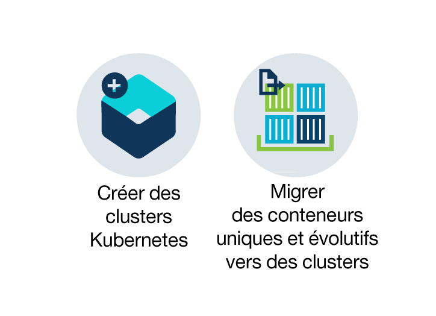
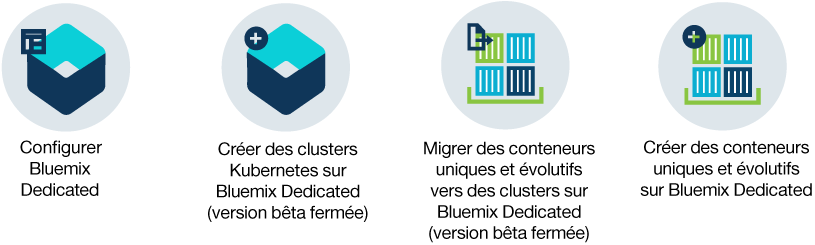

---

copyright:
  years: 2014, 2017
lastupdated: "2017-10-12"

---

{:new_window: target="_blank"}
{:shortdesc: .shortdesc}
{:screen: .screen}
{:pre: .pre}
{:table: .aria-labeledby="caption"}
{:codeblock: .codeblock}
{:tip: .tip}
{:download: .download}

# A propos d'{{site.data.keyword.containerlong_notm}}
{: #cs_ov}

{{site.data.keyword.containershort}} combine Docker et Kubernetes afin de proposer des outils performants, une expérience utilisateur intuitive et une sécurité et un isolement intégrés afin d'automatiser le déploiement, l'opération, la mise à l'échelle et la surveillance des applications conteneurisées dans un cluster d'hôtes de traitement indépendants via les API Kubernetes.
{:shortdesc}

 

## Conteneurs Docker
{: #cs_ov_docker}

Docker est un projet open source diffusé par dotCloud en 2013. Basé sur les fonctions de la technologie conteneur de
Linux (LXC), Docker est devenu une plateforme logicielle que vous pouvez utiliser pour
construire, tester, déployer et mettre à l'échelle rapidement des applications. Docker livre les logiciels dans des unités standardisées dénommées conteneurs qui incluent tous les éléments dont une application a besoin pour s'exécuter.
{:shortdesc}

Examinez ces concepts pour vous familiariser avec les concepts Docker élémentaires.

<dl>
<dt>Conteneur</dt>
<dd>Un conteneur est un moyen standard permettant de
conditionner une application et toutes ses dépendances. L'application peut ainsi être
déplacée d'un environnement à l'autre et exécutée sans modifications. Contrairement aux machines virtuelles, les conteneurs ne virtualisent pas une unité, son système d'exploitation et le matériel sous-jacent. Sels le code d'application, l'environnement d'exécution, les outils système, les bibliothèques et les paramètres sont inclus dans le conteneur. Les conteneurs opèrent sous forme de processus isolés sur l'hôte de traitement où ils sont déployés et partagent le système d'exploitation hôte et ses ressources matérielles. Cette approche rend le conteneur plus léger, portable, et efficace, qu'une machine virtuelle.</dd>
<dt>Image</dt>
<dd>Chaque conteneur est basé sur une image Docker et est considéré comme une instance d'une image. Une image est générée depuis un
Dockerfile, lequel est un fichier contenant des instructions pour la construction de l'image et des éventuels artefacts de construction,
comme une application, sa configuration et ses dépendances.</dd>
<dt>Registre</dt>
<dd>Un registre d'images est un endroit où vous pouvez stocker, extraire et partager des images Docker. Les images stockées dans un registre peuvent être soit disponibles au public (registre public), soit accessibles uniquement par un groupe d'utilisateurs restreint (registre privé). {{site.data.keyword.containershort_notm}} propose des images publiques, comme
ibmliberty, que vous pouvez utiliser pour vous familiariser avec Docker et Kubernetes en créant votre première application conteneurisée dans un cluster. Dans le cas d'applications d'entreprise, utilisez un registre privé comme celui
qui est fourni dans {{site.data.keyword.Bluemix_notm}} afin d'empêcher l'utilisation et la modification de vos
images par des utilisateurs non autorisés.

  
Lorsque vous désirez déployer un conteneur à partir d'une image, vérifiez que celle-ci est stockée dans un registre d'images public ou privé.</dd>
</dl>

### Principaux avantages de l'utilisation de conteneurs
{: #container_benefits}

<dl>
<dt>Les conteneurs sont agiles</dt>
<dd>Les conteneurs simplifient l'administration du système en
fournissant des environnements normalisés aux équipes de développement et de production. L'empreinte allégée du contexte d'exécution du moteur permet
un redimensionnement rapide (augmentation ou atténuation) en réponse à des fluctuations de la demande. Ils suppriment la complexité issue de la gestion de différentes
plateformes de système d'exploitation et de l'infrastructure sous-jacente. Ils permettent de déployer et d'exécuter n'importe quelle application dans n'importe quelle infrastructure rapidement et de manière fiable.</dd>
<dt>Les conteneurs sont de taille modeste</dt>
<dd>Vous pouvez englober plus de conteneurs dans l'espace que ne le permettrait une machine virtuelle.</dd>
<dt>Les conteneurs sont portables</dt>
<dd>Vous pouvez générer une image pour un autre conteneur en utilisant comme base une autre image. Quelqu'un d'autre peut faire le gros du travail sur une image que
vous pouvez personnaliser pour votre propre utilisation. Vous pouvez également migrer rapidement le code d'application depuis un environnement de
transfert vers un environnement de production. Le processus de migration peut être automatisé grâce à des outils tels que le pipeline de livraison Delivery
Pipeline ou UrbanCode Deploy.</dd>
</dl>

 

## Concepts de base de Kubernetes
{: #kubernetes_basics}

Kubernetes a été développé par Google dans le cadre du projet Borg et légué à la communauté open source en 2014. Kubernetes combine plus de 15 années de recherches par Google en matière d'exécution d'une
infrastructure conteneurisée avec charges de travail en production, des contributions de la communauté open source, et des outils Docker
de gestion de conteneurs, pour offrir une plateforme d'application isolée et sécurisée, portable, extensible et avec réparation spontanée en cas de reprise après incident.
{:shortdesc}

Familiarisez-vous avec le fonctionnement de Kubernetes grâce à un peu de terminologie.

<dl>
<dt>Cluster</dt>
<dd>Un cluster Kubernetes est composé d'une ou de plusieurs machines virtuelles dénommées noeuds d'agent. Chaque noeud d'agent représente un hôte de traitement sur lequel vous pouvez déployer, exécuter et gérer des applications conteneurisées. Les noeuds d'agent sont gérés par un maître Kubernetes qui assure le contrôle centralisé et la surveillance de toutes les ressources Kubernetes dans le cluster. Lorsque vous déployez une application conteneurisée, le maître Kubernetes décide l'emplacement de déploiement de l'application, en prenant en compte les exigences en termes de déploiement et la capacité disponible dans le cluster.</dd>
<dt>Pod</dt>
<dd>Chaque application conteneurisée qui est déployée dans un cluster Kubernetes est déployée, exécutée et gérée par un pod. Les pods représentent la plus petite unité déployable dans un cluster Kubernetes et servent à regrouper des conteneurs devant être traités comme une seule unité. Dans la plupart des cas, chaque conteneur est déployé dans son propre pod. Toutefois, une application peut nécessiter qu'un conteneur et d'autres conteneurs auxiliaires soient déployés dans un même pod afin qu'ils soient accessibles via la même adresse IP privée.</dd>
<dt>Déploiement</dt>
<dd>Un déploiement est une ressource Kubernetes où vous spécifiez les conteneurs et les autres ressources Kubernetes requises pour l'exécution de votre application, tels qu'un stockage persistant, des services, ou des annotations. Les déploiements sont documentés dans un script de déploiement Kubernetes. Lorsque vous lancez un déploiement, le maître Kubernetes déploie les conteneurs spécifiés dans des pods en fonction de la capacité disponible sur les noeuds d'agent du cluster. Les autres ressources Kubernetes sont créées et configurées comme spécifié dans le script de déploiement.

  
Vous pouvez utiliser un déploiement pour définir des stratégies de mise à jour de votre application, notamment le nombre de pods que vous désirez ajouter lors d'une mise à jour tournante et le nombre de pods pouvant être indisponibles à un moment donné. Lorsque vous effectuez une mise à jour tournante, le déploiement vérifie si la révision est fonctionnelle et l'arrête si des échecs sont détectés.</dd>
<dt>Service</dt>
<dd>Un service Kubernetes regroupe un ensemble de pods et procure une connexion réseau vers ces pods pour d'autres services dans le cluster sans exposer l'adresse IP privée réelle de chaque pod. Vous pouvez utiliser un service pour rendre votre application accessible dans votre cluster ou sur l'Internet public.

  
Pour en savoir plus sur la terminologie de Kubernetes, exécutez le <a href="cs_tutorials.html#cs_cluster_tutorial" target="_blank">tutoriel</a>.</dd>
</dl>

 

## Avantages de l'utilisation de clusters
{: #cs_ov_benefits}

Chaque cluster est déployé sur des machines virtuelles partagées ou dédiées qui ajoutent des fonctions natives à Kubernetes à celles fournies par {{site.data.keyword.IBM_notm}}.
{:shortdesc}

|Avantage|Description|
|-------|-----------|
|Clusters Kubernetes à service exclusif avec isolement de l'infrastructure de traitement, de réseau et de stockage|<ul><li>Créez votre propre infrastructure personnalisée afin de répondre aux besoins de votre environnement métier et de développement.</li><li>Allouez à un maître Kubernetes dédié et sécurisé, des noeuds d'agent, des réseaux virtuels et un espace de stockage en utilisant les ressources fournies par IBM Bluemix Infrastructure (SoftLayer).</li><li>Stockez les données persistantes, partagez les données entre les pods Kubernetes et restaurez les données en cas de besoin avec le service de volumes intégré et sécurisé.</li><li>Le maître Kubernetes entièrement géré est constamment surveillé et mis à jour par {{site.data.keyword.IBM_notm}} pour que votre cluster soit toujours disponible.</li><li>Tirez parti de la prise en charge complète de toutes les API Kubernetes natives.</li></ul>|
|Conformité en matière de sécurité d'image avec Vulnerability Advisor|<ul><li>Configurez votre propre registre d'images Docker privé et sécurisée où les images sont stockées et partagés par tous les utilisateurs dans l'organisation.</li><li>Tirez parti de l'analyse automatique des images dans votre registre {{site.data.keyword.Bluemix_notm}} privé.</li><li>Examinez les recommandations spécifiques au système d'exploitation utilisé dans l'image afin de corriger les vulnérabilités potentielles.</li></ul>|
|Mise à l'échelle automatique des applications|<ul><li>Définissez des règles personnalisées afin d'élargir ou de contracter vos applications en fonction de la consommation d'UC et de mémoire.</li></ul>|
|Surveillance continue de l'état de santé du cluster|<ul><li>Utilisez le tableau de bord du cluster pour déterminer rapidement et gérer l'état de santé de votre cluster, des noeuds d'agent et des déploiements de conteneurs.</li><li>Accédez à des métriques de consommation détaillées en utilisant {{site.data.keyword.monitoringlong}} et élargissez rapidement votre cluster pour répondre aux charges de travail.</li><li>Examinez les informations de journalisation à l'aide d'{{site.data.keyword.loganalysislong}} pour voir les activités détaillées du cluster.</li></ul>|
|Reprise en ligne automatique des conteneurs défectueux|<ul><li>Vérifications en continu de l'état de santé des conteneurs déployés sur un noeud d'agent.</li><li>Recréation automatique des conteneurs en cas de défaillances.</li></ul>|
|Reconnaissance et gestion de services|<ul><li>Enregistrement centralisé des services d'application pour les rendre disponibles à d'autres applications dans votre cluster sans les exposer publiquement.</li><li>Reconnaissance des services enregistrés sans avoir à suivre le fil des modifications de leurs adresses IP ou des ID de conteneurs et exploitation du routage automatique vers les instances disponibles.</li></ul>|
|Exposition sécurisée des services au public|<ul><li>Réseaux privés superposés avec prise en charge complète d'équilibreur de charge et d'Ingress pour rendre vos applications accessibles au public et équilibrer les charges de travail entre plusieurs noeuds d'agent sans avoir à suivre le fil des changements d'adresse IP dans votre cluster.</li><li>Possibilité de sélection d'une adresse IP publique, d'une route fournie par {{site.data.keyword.IBM_notm}} ou de votre propre domaine personnalisé pour accéder à des services dans votre cluster depuis Internet.</li></ul>|
|Intégration de services {{site.data.keyword.Bluemix_notm}}|<ul><li>Ajoutez des fonctionnalités supplémentaires à votre application via l'intégration de services {{site.data.keyword.Bluemix_notm}}, tels que les API Watson, Blockchain, services de données, Internet of Things, et facilitation de la simplification du processus de développement d'application et de gestion des conteneurs.</li></ul>|
{: caption="Tableau 1. Avantages de l'utilisation de clusters avec {{site.data.keyword.containerlong_notm}}" caption-side="top"}

 

## Environnements de cloud
{: #cs_ov_environments}

Vous pouvez choisir l'environnement de cloud {{site.data.keyword.Bluemix_notm}} sur lequel déployer des clusters et des conteneurs.
{:shortdesc}

### {{site.data.keyword.Bluemix_notm}} Public
{: #public_environment}

Déployez des clusters dans l'environnement de cloud public ([https://console.bluemix.net ](https://console.bluemix.net)) et connectez-vous à n'importe quel service dans le catalogue {{site.data.keyword.Bluemix_notm}}.

En exploitant des clusters dans
{{site.data.keyword.Bluemix_notm}} Public, vous pouvez choisir le niveau d'isolation de matériel pour les noeuds d'agent de votre cluster. Utilisez un matériel dédié pour les ressources physiques disponibles à dédier uniquement à votre cluster ou un matériel partagé pour permettre à des ressources d'être partagées avec les clusters d'autres clients {{site.data.keyword.IBM_notm}}. Vous pourriez opter pour un cluster dédié dans l'environnement {{site.data.keyword.Bluemix_notm}} Public
si vous désirez un isolement de votre cluster, mais n'avez pas besoin d'un tel isolement pour les autres services {{site.data.keyword.Bluemix_notm}} que vous utilisez.

Cliquez sur l'une des options suivantes pour commencer :

    <map name="public_options" id="public_options">
    <area href="container_index.html#clusters" alt="Initiation aux clusters Kubernetes dans {{site.data.keyword.Bluemix_notm}}
" title="Initiation aux clusters Kubernetes dans {{site.data.keyword.Bluemix_notm}}
" shape="rect" coords="-5, -6, 123, 154" />
    <area href="cs_classic.html#cs_classic" alt="Exécution de conteneurs uniques et évolutifs dans {{site.data.keyword.containershort_notm}}" title="Exécution de conteneurs uniques et évolutifs dans {{site.data.keyword.containershort_notm}}" shape="rect" coords="181, -5, 320, 161" />
    </map>

### {{site.data.keyword.Bluemix_notm}} Dedicated
{: #dedicated_environment}

Déployez des clusters (version bêta fermée) ou des conteneurs uniques et évolutifs dans un environnement de cloud dédié (`https://<my-dedicated-cloud-instance>.bluemix.net`) et connectez-vous aux services {{site.data.keyword.Bluemix_notm}} présélectionnés qui s'y exécutent également.

Les clusters avec {{site.data.keyword.Bluemix_notm}} Dedicated sont équivalents à ceux créés avec du matériel dédié dans {{site.data.keyword.Bluemix_notm}} Public. Les ressources physiques disponibles sont dédiées exclusivement à votre
cluster et ne sont pas partagées avec les clusters d'autres clients {{site.data.keyword.IBM_notm}}. Le noeud final d'API publique est utilisé pour créer des clusters tant pour l'édition Public que pour l'édition Dedicated. Toutefois, dans le cas de {{site.data.keyword.Bluemix_notm}} Dedicated, les différences les plus notables sont les suivantes.

*   {{site.data.keyword.IBM_notm}} possède et gère le compte IBM Bluemix Infrastructure (SoftLayer) dans lequel les noeuds d'agent, les réseaux locaux virtuels (VLAN) et les sous-réseaux sont déployés, au lieu que ces derniers soient déployés dans un compte dont vous êtes propriétaire.
*   Les spécifications pour ces réseaux locaux virtuels et sous-réseaux sont déterminées à la création de l'environnement Dedicated et non pas lorsque le cluster est créé.

Vous pourriez opter pour la mise en place d'un environnement {{site.data.keyword.Bluemix_notm}} Dedicated si vous voulez un isolement de votre cluster et avez également besoin d'un tel isolement pour les autres services {{site.data.keyword.Bluemix_notm}} que vous utilisez.

Cliquez sur l'une des options suivantes pour commencer :

    <map name="dedicated_options" id="dedicated_options">
    <area href="#setup_dedicated" alt="Configuration d'{{site.data.keyword.containershort_notm}} sur {{site.data.keyword.Bluemix_notm}} Dedicated (version bêta fermée)" title="Configuration d'{{site.data.keyword.containershort_notm}} sur {{site.data.keyword.Bluemix_notm}} Dedicated (version bêta fermée)" shape="rect" coords="-5, -15, 100, 153" />
    <area href="container_index.html#dedicated" alt="Initiation aux clusters Kubernetes dans {{site.data.keyword.Bluemix_notm}} Dedicated (version bêta fermée)" title="Initiation aux clusters Kubernetes dans {{site.data.keyword.Bluemix_notm}} Dedicated (version bêta fermée)" shape="rect" coords="153, -10, 276, 182" />
    <area href="cs_classic.html#cs_classic" alt="Exécution de conteneurs uniques et évolutifs dans {{site.data.keyword.containershort_notm}}" title="Exécution de conteneurs uniques et évolutifs dans {{site.data.keyword.containershort_notm}}" shape="rect" coords="317, -11, 436, 188" />
    <area href="container_ha.html#container_group_ui" alt="Exécution de services de longue durée en tant que groupes de conteneurs à partir de l'interface graphique {{site.data.keyword.Bluemix_notm}}" title="Exécution de services de longue durée en tant que groupes de conteneurs à partir de l'interface graphique {{site.data.keyword.Bluemix_notm}}" shape="rect" coords="485, -1, 600, 173" />
    </map>

### Différences en matière de gestion de cluster entre les environnements de cloud
{: #env_differences}

|Zone|{{site.data.keyword.Bluemix_notm}} Public|{{site.data.keyword.Bluemix_notm}} Dedicated (version bêta fermée)|
|--|--------------|--------------------------------|
|Création de cluster|Créez un cluster léger ou soumettez les informations suivantes pour un cluster standard :<ul><li>Type de cluster</li><li>Nom</li><li>Emplacement</li><li>Type de machine</li><li>Nombre de noeuds d'agent</li><li>VLAN public</li><li>VLAN privé</li><li>Matériel</li></ul>|Soumettez les informations suivantes pour un cluster standard :<ul><li>Nom</li><li>Version Kubernetes</li><li>Type de machine</li><li>Nombre de noeuds d'agent</li></ul>
**Remarque :** les paramètres de réseaux locaux virtuels et du matériel sont prédéfinis lors de la création de l'environnement {{site.data.keyword.Bluemix_notm}}.
|
|Matériel et propriétaire du cluster|Dans les clusters standard, le matériel peut être partagé avec d'autres clients {{site.data.keyword.IBM_notm}} ou vous être dédié exclusivement. Vous êtes propriétaire et gérez les réseaux locaux virtuels (VLAN) publics et privés dans votre compte IBM Bluemix Infrastructure (SoftLayer).|Dans les clusters sur {{site.data.keyword.Bluemix_notm}} Dedicated, le matériel est toujours dédié. IBM est le propriétaire et gère pour vous les réseaux locaux virtuels publics et privés. L'emplacement est prédéfini pour l'environnement {{site.data.keyword.Bluemix_notm}}.|
|Liaison de service à un cluster|Utilisez la commande [bx cs cluster-service-bind](cs_cluster.html#cs_cluster_service) pour lier une valeur confidentielle Kubernetes au cluster.|Créez un [fichier de clés JSON](cs_cluster.html#binding_dedicated) pour les données d'identification pour le service, puis créez une valeur confidentielle depuis ce fichier pour lier le service au cluster.|
|Mise en réseau de l'équilibreur de charge et d'Ingress|Lors de la mise à disposition de clusters standard, les actions suivantes interviennent automatiquement.<ul><li>Un sous-réseau portable public est lié à votre cluster et affecté à votre compte IBM Bluemix Infrastructure (SoftLayer). </li><li>Une adresse IP publique portable est utilisée pour un contrôleur Ingress à haute disponibilité et une route publique unique est affectée au format &lt;cluster_name&gt;.containers.mybluemix.net. Vous pouvez utiliser cette route pour exposer plusieurs applications au public.</li><li>Quatre adresses IP publiques portables sont affectées au cluster et peuvent être utilisées pour exposer des applications au public via des services d'équilibreur de charge. D'autres sous-réseaux peuvent être demandés via votre compte IBM Bluemix Infrastructure (SoftLayer). </li></ul>|Lorsque vous créez votre compte Dedicated, vous devez prendre les décisions suivantes :<ul><li>Nombre de sous-réseaux voulu</li><li>Type de sous-réseaux voulu : équilibreur de charge ou Ingress. {{site.data.keyword.IBM_notm}} crée les sous-réseaux et se charge pour vous des tâches de gestion réseau. Selon vos sélections, un contrôleur Ingress peut être créé et une route publique peut être affectée. Des sous-réseaux supplémentaires peuvent être demandés en [ouvrant un ticket de demande de service](/docs/support/index.html#contacting-support) pour créer le sous-réseau, puis en utilisant la commande [` cluster-subnet-add`](cs_cli_reference.html#cs_cluster_subnet_add) pour l'ajouter au cluster.|
|Mise en réseau de NodePort|Vous pouvez exposer un port public sur votre noeud d'agent et utiliser l'adresse IP publique de ce noeud pour accès public au service dans le cluster.|Toutes les adresses IP publiques des noeuds d'agent sont bloquées par un pare-feu. Toutefois, pour les services {{site.data.keyword.Bluemix_notm}} qui sont ajoutés au cluster, le port de noeud est accessible via une adresse IP publique ou une adresse IP privée.|
|Stockage persistant|Utilisez [un provisionnement dynamique](cs_apps.html#cs_apps_volume_claim) ou un [provisionnement statique](cs_cluster.html#cs_cluster_volume_create) des volumes.|Utilisez un [provisionnement dynamique](cs_apps.html) des volumes.</li></ul>|
|URL du registre d'images dans {{site.data.keyword.registryshort_notm}}|<ul><li>Sud et Est des Etats-Unis : <code>registry.ng bluemix.net</code></li><li>Sud du Royaume-Uni : <code>registry.eu-gb.bluemix.net</code></li><li>Europe centrale (Francfort) : <code>registry.eu-de.bluemix.net</code></li><li>Australie (Sydney) : <code>registry.au-syd.bluemix.net</code></li></ul>|<ul><li>Pour les nouveaux espaces de nom, utilisez les mêmes registres basés région que ceux définis pour {{site.data.keyword.Bluemix_notm}} Public.</li><li>Pour les espaces de nom configurés pour les conteneurs uniques et évolutifs dans {{site.data.keyword.Bluemix_notm}} Dedicated, utilisez <code>registry.&lt;dedicated_domain&gt;</code></li></ul>|
|Accès au registre|Voir les options dans [Utilisation de registres d'images privés et publics avec {{site.data.keyword.containershort_notm}}](cs_cluster.html#cs_apps_images).|<ul><li>Pour les nouveaux espaces de nom, examinez les options dans [Utilisation de registres d'images privés et publics avec {{site.data.keyword.containershort_notm}}](cs_cluster.html#cs_apps_images).</li><li>Pour les espaces de nom configurés pour des groupes uniques et évolutifs, [utilisez un jeton et créez une valeur confidentielle Kubernetes](cs_dedicated_tokens.html#cs_dedicated_tokens) pour l'authentification.</li></ul>|
{: caption="Tableau 2. Comparaison des fonctions {{site.data.keyword.Bluemix_notm}} Public et {{site.data.keyword.Bluemix_notm}} Dedicated" caption-side="top"}

### Configuration d'{{site.data.keyword.containershort_notm}} sur {{site.data.keyword.Bluemix_notm}} Dedicated (version bêta fermée)
{: #setup_dedicated}

Les administrateurs doivent ajouter l'ID administrateur IBM et les utilisateurs de votre organisation à l'environnement Dedicated.

Avant de commencer, [configurez un environnement {{site.data.keyword.Bluemix_notm}} Dedicated](/docs/dedicated/index.html#setupdedicated).

Pour configurer votre environnement Dedicated afin d'utiliser des clusters, procédez comme suit :

1.  Ajoutez à l'environnement l'ID administrateur IBM qui vous a été fourni.
    1.  Sélectionnez votre compte {{site.data.keyword.Bluemix_notm}} Dedicated.
    2.  Dans la barre de menu, cliquez sur
**Gérer>Sécurité>Identity and Access**. La fenêtre Utilisateurs affiche une liste d'utilisateurs avec leur adresse électronique et leur statut dans le compte sélectionné.
    3.  Cliquez sur **Inviter des utilisateurs**.
    4.  Dans **Adresse électronique ou IBMid existant**, entrez l'adresse électronique suivante : `cfsdl@us.ibm.com`.
    5.  Dans la section **Accès**, développez l'entrée **Services avec l'offre Identity and Access activée**.
    6.  Dans la liste déroulante **Services**, sélectionnez **{{site.data.keyword.containershort_notm}}**.
    7.  Dans la liste déroulante **Rôles**, sélectionnez **Administrateur**.
    8.  Cliquez sur **Inviter des utilisateurs**.
2.  [Créez des identifiants IBMid pour les utilisateurs finaux de votre compte {{site.data.keyword.Bluemix_notm}}. ](https://www.ibm.com/account/us-en/signup/register.html)
3.  [Ajoutez les utilisateurs créés à l'étape précédente à votre compte {{site.data.keyword.Bluemix_notm}}.](cs_cluster.html#add_users)
4.  Accédez à votre compte {{site.data.keyword.Bluemix_notm}}
Dedicated via la console de l'édition Public et commencez à créer des clusters.
    1.  Connectez-vous à la console {{site.data.keyword.Bluemix_notm}} Public ([https://console.bluemix.net ](https://console.bluemix.net)) avec votre IBMid.
    2.  Dans le menu de compte, sélectionnez votre compte {{site.data.keyword.Bluemix_notm}} Dedicated. La console est mise à jour avec les services et les informations de votre instance {{site.data.keyword.Bluemix_notm}} Dedicated.
    3.  Dans le catalogue pour votre instance {{site.data.keyword.Bluemix_notm}} Dedicated, sélectionnez **Conteneurs** et cliquez sur **Cluster Kubernetes**.
    Pour plus d'informations sur la création d'un cluster, voir [Création de clusters Kubernetes à partir de l'interface graphique dans {{site.data.keyword.Bluemix_notm}} Dedicated (version bêta fermée)](cs_cluster.html#creating_ui_dedicated)
5. Si votre système local ou votre réseau d'entreprise contrôle des noeuds finaux sur l'Internet public via proxy ou pare-feux, voir [Ouverture des ports et adresses IP requis dans votre pare-feu](cs_security.html#opening_ports) pour plus d'informations sur l'allocation de trafic sortant.

 

## Architecture de service
{: #cs_ov_architecture}

Chaque noeud d'agent est configuré avec un moteur Docker Engine géré par {{site.data.keyword.IBM_notm}}, des ressources de traitement, réseau, et service de volume séparées, ainsi que des fonctions de sécurité intégrées assurant l'isolation des ressources et offrant des fonctionnalités pour leur gestion tout en assurant la conformité des noeuds d'agent avec les règles de sécurité. Le noeud d'agent communique avec le maître par l'entremise de certificats TLS sécurisés et d'une connexion openVPN.
{:shortdesc}

*Figure 1. Architecture de Kubernetes et opération réseau dans {{site.data.keyword.containershort_notm}}*

 

## Usage abusif de conteneurs
{: #cs_terms}

Les clients ne doivent pas utiliser à mauvais escient {{site.data.keyword.containershort_notm}}.
{:shortdesc}

L'utilisation à mauvais escient inclut :

*   Toute activité illégale
*   Distribution ou exécution de logiciel malveillant
*   Endommager {{site.data.keyword.containershort_notm}} ou porter atteinte à l'utilisation
d'{{site.data.keyword.containershort_notm}} par autrui
*   Endommager ou porter atteinte à l'utilisation d'un autre service ou système par autrui
*   Accès non autorisé à un service ou système quelconque
*   Modification non autorisée d'un service ou système quelconque
*   Violation des droits d'autrui

Voir [Dispositions des services cloud](/docs/navigation/notices.html#terms) pour les conditions générales d'utilisation.
