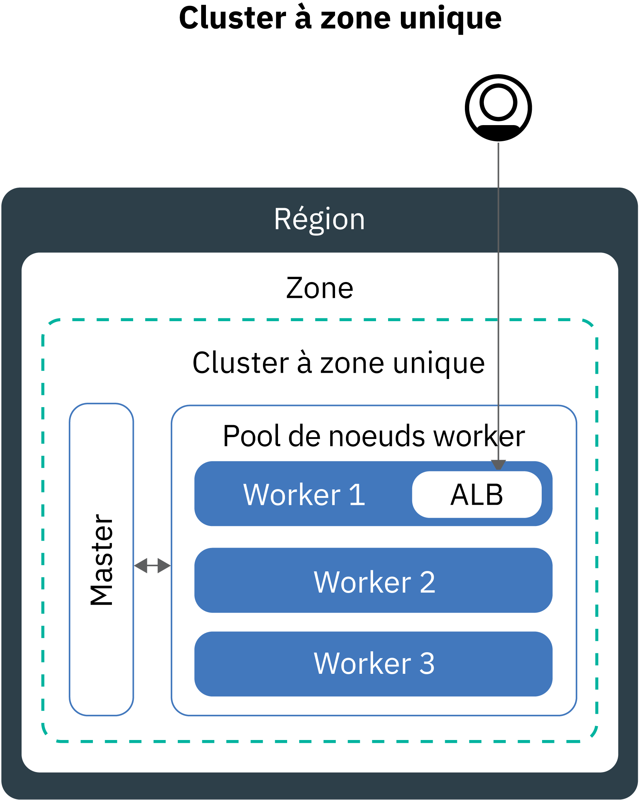
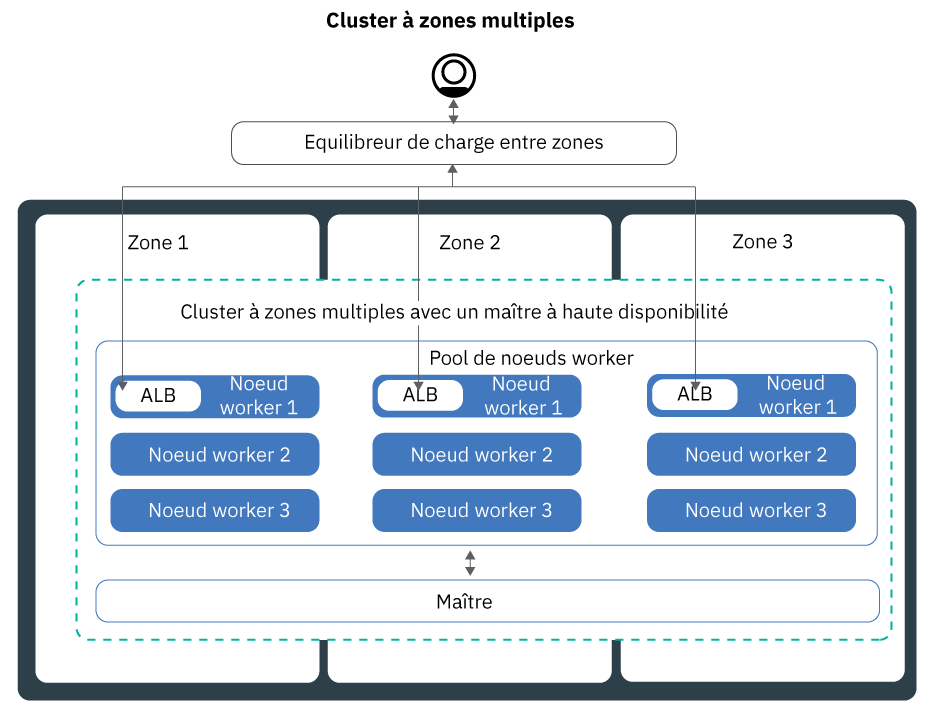
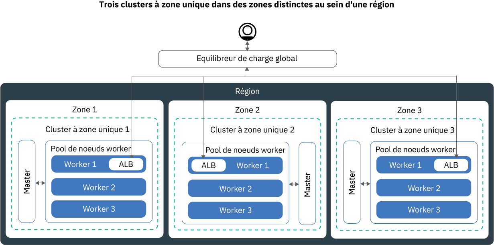

---

copyright:
  years: 2014, 2019
lastupdated: "2019-06-11"

keywords: kubernetes, iks, multi az, multi-az, szr, mzr

subcollection: containers

---

{:new_window: target="_blank"}
{:shortdesc: .shortdesc}
{:screen: .screen}
{:pre: .pre}
{:table: .aria-labeledby="caption"}
{:codeblock: .codeblock}
{:tip: .tip}
{:note: .note}
{:important: .important}
{:deprecated: .deprecated}
{:download: .download}
{:preview: .preview}


# Planification de votre cluster pour la haute disponibilité
{: #ha_clusters}

Concevez votre cluster standard de manière à obtenir un maximum de disponibilité et de capacité pour votre application avec {{site.data.keyword.containerlong}}.
{: shortdesc}

Vos utilisateurs risquent moins de rencontrer des indisponibilités lorsque vous répartissez votre configuration entre plusieurs noeuds worker, zones et clusters. Les fonctions intégrées, telles que l'équilibrage de charge et l'isolement, augmentent la résilience en cas de pannes d'hôtes, de réseaux ou d'applications. Examinez ces configurations potentielles de cluster, classées par ordre croissant de disponibilité.


1. [Cluster à zone unique](#single_zone) avec plusieurs noeuds worker dans un pool de noeuds worker.
2. [Cluster à zones multiples](#multizone) qui répartit les noeuds worker sur plusieurs zones au sein d'une région.
3. **Clusters qui sont connectés à des VLAN publics et privés uniquement** : [Plusieurs clusters](#multiple_clusters) configurés dans plusieurs zones ou régions connectés via un équilibreur de charge global.

## Cluster à zone unique
{: #single_zone}

Pour améliorer la disponibilité de votre application et permettre le basculement si un noeud worker n'est pas disponible dans votre cluster, ajoutez des noeuds worker supplémentaires dans votre cluster à zone unique.
{: shortdesc}



Par défaut, votre cluster à zone unique est configuré avec un pool de noeuds worker nommé `default`. Ce pool regroupe des noeuds worker ayant la même configuration, par exemple le type de machine, que vous avez définie lors de la création du cluster. Vous pouvez ajouter d'autres noeuds worker à votre cluster en [redimensionnant un pool de noeuds worker existant](/docs/containers?topic=containers-add_workers#resize_pool) ou en [ajoutant un nouveau pool de noeuds worker](/docs/containers?topic=containers-add_workers#add_pool).

Lorsque vous ajoutez d'autres noeuds worker, les instances d'application peuvent être réparties sur plusieurs noeuds worker. En cas de défaillance d'un noeud worker, les instances d'application sur les noeuds worker disponibles continuent à s'exécuter. Kubernetes replanifie automatiquement les pods des noeuds worker indisponibles pour que les performances et la capacité de votre application soient assurées. Pour vérifier que vos pods sont répartis uniformément sur les noeuds worker, implémentez l'[affinité des pods](https://kubernetes.io/docs/concepts/configuration/assign-pod-node/#inter-pod-affinity-and-anti-affinity-beta-feature).

**Puis-je convertir mon cluster à zone unique en cluster à zones multiples ?**</br>
Oui, à condition que le cluster se trouve dans l'une des [agglomérations à zones multiples prises en charge](/docs/containers?topic=containers-regions-and-zones#zones). Voir [Mise à jour pour passer des noeuds worker autonomes aux pools de noeuds worker](/docs/containers?topic=containers-update#standalone_to_workerpool).


**Dois-je utiliser des clusters à zones multiples ?**</br>
Non. Vous pouvez créer autant de clusters à zone unique que vous le souhaitez. En effet, vous pouvez même préférer des clusters à zone unique pour une gestion simplifiée ou si votre cluster doit résider dans une [ville à zone unique](/docs/containers?topic=containers-regions-and-zones#zones).

**Puis-je disposer d'un maître à haute disponibilité dans une zone unique ?**</br>
Oui. Dans une zone unique, votre maître est hautement disponible et comprend des répliques sur des hôtes physiques distincts pour le serveur d'API Kubernetes, le composant etcd, le planificateur et le gestionnaire de contrôleurs afin de les protéger en cas d'indisponibilité due par exemple à une mise à jour du maître. Pour vous protéger en cas de défaillance d'une zone, vous pouvez :
* [Créer un cluster dans une zone compatible avec plusieurs zones](#multizone), dans laquelle le maître est réparti entre plusieurs zones.
* [Créer plusieurs clusters qui sont connectés à des VLAN publics et privés](#multiple_clusters) et les connecter à un équilibreur de charge global. 

## Cluster à zones multiples
{: #multizone}

Avec {{site.data.keyword.containerlong_notm}}, vous avez la possibilité de créer des clusters à zones multiples. Vos utilisateurs risquent moins de rencontrer des indisponibilités lorsque vous répartissez vos applications entre plusieurs zones et noeuds worker en utilisant un pool de noeuds worker. Les fonctions intégrées, telles que l'équilibrage de charge, augmentent la résilience en cas de défaillance potentielle d'une zone avec des hôtes, des réseaux ou des applications. Si les ressources d'une zone sont indisponibles, les charges de travail de vos clusters seront opérationnelles dans les autres zones.
{: shortdesc}

**Qu'est-ce qu'un pool worker ?**</br>
Un pool worker est une collection de noeuds worker de même type, par exemple type de machine, UC et mémoire. Lorsque vous créez un cluster, un pool worker par défaut est automatiquement créé pour vous. Pour répartir les noeuds worker de votre pool entre plusieurs zones, ajouter des noeuds worker dans le pool ou mettre à jour des noeuds worker, vous pouvez utiliser les nouvelles commandes `ibmcloud ks worker-pool`.

**Puis-je continuer à utiliser des noeuds worker autonomes ?**</br>
L'ancienne configuration de noeuds worker autonomes est prise en charge, mais elle est dépréciée. Veillez à [ajouter un pool de noeuds worker à votre cluster](/docs/containers?topic=containers-planning_worker_nodes#add_pool), puis [utilisez des pools de noeuds worker](/docs/containers?topic=containers-update#standalone_to_workerpool) afin d'organiser vos noeuds worker au lieu d'utiliser des noeuds worker autonomes.

**Puis-je convertir mon cluster à zone unique en cluster à zones multiples ?**</br>
Oui, à condition que le cluster se trouve dans l'une des [agglomérations à zones multiples prises en charge](/docs/containers?topic=containers-regions-and-zones#zones). Voir [Mise à jour pour passer des noeuds worker autonomes aux pools de noeuds worker](/docs/containers?topic=containers-update#standalone_to_workerpool).


### Pouvez-vous m'en dire davantage sur la configuration d'un cluster à zones multiples ?
{: #mz_setup}



Vous pouvez ajouter des zones supplémentaires dans votre cluster pour répliquer les noeuds worker de votre pool de noeuds worker sur plusieurs zones au sein d'une région. Les clusters à zones multiples sont conçus pour planifier de manière uniforme les pods sur les noeuds worker et les zones afin d'assurer la disponibilité et la reprise en cas d'incident. Si les noeuds worker ne sont pas répartis uniformément sur les zones ou si la capacité est insuffisante dans l'une des zones, le planificateur de Kubernetes risque de ne pas parvenir à planifier tous les pods demandés. Par conséquent, les pods peuvent passer à l'état **En attente** jusqu'à ce que la capacité suffisante soit disponible. Si vous souhaitez modifier le comportement par défaut pour que le planificateur de Kubernetes répartisse les pods entre les zones avec une meilleure distribution, utilisez la [règle d'affinité de pods](https://kubernetes.io/docs/concepts/configuration/assign-pod-node/#inter-pod-affinity-and-anti-affinity-beta-feature) `preferredDuringSchedulingIgnoredDuringExecution`.

**Pourquoi dois-je avoir des noeuds worker répartis sur trois zones ?** </br>
La répartition de vos charges de travail sur trois zones permet d'assurer la haute disponibilité de votre application en cas d'indisponibilité d'une ou de deux zones, tout en ayant une configuration de cluster plus rentable. Mais pour quelle raison ? Voici un exemple.

Supposons que vous ayez besoin d'un noeud worker à six coeurs pour traiter la charge de travail de votre application. Voici les options à votre disposition pour garantir une meilleure disponibilité de votre cluster :

- **Dupliquer vos ressources dans une autre zone :** cette option vous laisse deux noeuds worker, chacun avec six coeurs dans chaque zone, soit un total de 12 coeurs. </br> 
- **Répartir les ressources sur trois zones :** avec cette option, vous déployez trois coeurs par zone, ce qui vous laisse une capacité totale de neuf coeurs. Pour gérer votre charge de travail, deux zones doivent être opérationnelles en même temps. Si l'une des zones est indisponible, les deux autres zones peuvent traiter votre charge de travail. Si deux zones sont indisponibles, il reste trois coeurs opérationnels pour traiter votre charge de travail. Le déploiement de trois coeurs par zone signifie des machines plus petites et donc une réduction de coût pour vous. </br>

**Comment est configuré le maître Kubernetes ?** </br>
Lorsque vous créez un cluster dans une [agglomération à zones multiples](/docs/containers?topic=containers-regions-and-zones#zones), un maître à haute disponibilité Kubernetes est automatiquement déployé et trois répliques sont réparties entre les zones de l'agglomération. Par exemple, si le cluster se trouve dans les zones `dal10`, `dal12` ou `dal13`, les répliques du maître Kubernetes sont réparties dans chaque zone de la métropole à zones multiples Dallas.

**Que se passe-t-il si le maître Kubernetes devient indisponible ?** </br>
Le [maître Kubernetes](/docs/containers?topic=containers-ibm-cloud-kubernetes-service-technology#architecture) est le composant principal qui permet de garder votre cluster opérationnel. Le maître stocke les ressources du cluster et leurs configurations dans la base de données etcd qui assure le bon fonctionnement de votre cluster. Le serveur d'API Kubernetes correspond au point d'entrée principal pour toutes les demandes de gestion de cluster des noeuds worker au maître, ou lorsque vous souhaitez interagir avec les ressources de votre cluster.<br><br>En cas de défaillance du maître, vos charges de travail continuent à s'exécuter sur les noeuds worker, mais vous ne pouvez pas utiliser des commandes `kubectl` pour gérer les ressources de votre cluster ou afficher l'état de santé du cluster tant que le serveur d'API Kubernetes dans le maître n'est pas opérationnel. Si un pod tombe en panne lors d'une indisponibilité du maître, le pod ne peut pas être replanifié tant que le noeud worker n'a pas rétabli le contact avec le serveur d'API Kubernetes.<br><br>Lors d'une indisponibilité du maître, vous pouvez toujours exécuter des commandes `ibmcloud ks` pour l'API {{site.data.keyword.containerlong_notm}} pour gérer vos ressources d'infrastructure, telles que les noeuds worker ou les réseaux locaux virtuels (VLAN). Si vous modifiez la configuration actuelle du cluster en ajoutant ou en retirant des noeuds worker dans le cluster, vos modifications ne sont pas appliquées tant que le maître n'est pas opérationnel.

Ne pas redémarrer ou réamorcer un noeud worker pendant la durée d'indisponibilité du maître. Cette action retire les pods de votre noeud worker. Comme le serveur d'API Kubernetes n'est pas disponible, les pods ne peuvent pas être replanifiés sur d'autres noeuds worker dans le cluster.
{: important}


Pour protéger votre cluster en cas de défaillance du maître ou dans les régions où les clusters à zones multiples ne sont pas disponibles, vous pouvez [configurer plusieurs clusters connectés à des VLAN publics et privés et les connecter à un équilibreur de charge global](#multiple_clusters).

**Dois-je faire quelque chose pour que le maître puisse communiquer avec les noeuds worker entre les différentes zones ?**</br>
Oui. Si vous disposez de plusieurs VLAN pour un cluster, de plusieurs sous-réseaux sur le même VLAN ou d'un cluster à zones multiples, vous devez activer une fonction [VRF (Virtual Router Function)](/docs/infrastructure/direct-link?topic=direct-link-overview-of-virtual-routing-and-forwarding-vrf-on-ibm-cloud#overview-of-virtual-routing-and-forwarding-vrf-on-ibm-cloud) pour votre compte d'infrastructure IBM Cloud (SoftLayer) pour que vos noeuds worker puissent communiquer entre eux sur le réseau privé. Pour activer la fonction VRF, [contactez le représentant de votre compte d'infrastructure IBM Cloud (SoftLayer)](/docs/infrastructure/direct-link?topic=direct-link-overview-of-virtual-routing-and-forwarding-vrf-on-ibm-cloud#how-you-can-initiate-the-conversion). Si vous ne parvenez pas à activer la fonction VRF ou si vous ne souhaitez pas le faire, activez la fonction [Spanning VLAN](/docs/infrastructure/vlans?topic=vlans-vlan-spanning#vlan-spanning). Pour effectuer cette action, vous devez disposer du [droit d'infrastructure](/docs/containers?topic=containers-users#infra_access) **Réseau > Gérer le spanning VLAN pour réseau**, ou vous pouvez demander au propriétaire du compte de l'activer. Pour vérifier si le spanning VLAN est déjà activé, utilisez la [commande](/docs/containers?topic=containers-cli-plugin-kubernetes-service-cli#cs_vlan_spanning_get) `ibmcloud ks vlan-spanning-get --region <region>`. 

**Comment laisser les utilisateurs accéder à mon application à partir de l'Internet public ?**</br>
Vous pouvez exposer vos applications en utilisant un équilibreur de charge d'application (ALB) Ingress ou le service d'équilibreur de charge.

- **Equilibreur de charge d'application (ALB) :** par défaut, les équilibreurs de charge d'application sont automatiquement créés et activés dans chaque zone de votre cluster. Un équilibreur de charge pour zones multiples (MZLB) Cloudflare pour votre cluster est également automatiquement créé et déployé de sorte à obtenir 1 équilibreur de charge MZLB pour chaque région. L'équilibreur de charge MZLB place les adresses IP de vos équilibreurs de charge d'application (ALB) derrière le même nom d'hôte et active des diagnostics d'intégrité sur ces adresses IP pour déterminer si elles sont disponibles ou pas. Par exemple, si vous disposez de noeuds worker dans 3 zones dans la région Est des Etats-Unis, le nom d'hôte `yourcluster.us-east.containers.appdomain.cloud` comporte 3 adresses IP d'ALB. L'équilibreur de charge MZLB réalise des diagnostics d'intégrité de l'adresse IP ALB publique dans chaque zone d'une région et conserve les résultats de recherche DNS à jour en fonction de ces diagnostics. Pour plus d'informations, voir [Composants et architecture du service Ingress](/docs/containers?topic=containers-ingress#planning).

- **Services d'équilibreur de charge :** les services d'équilibreur de charge sont configurés dans une seule zone uniquement. Les demandes entrantes dans votre application sont dirigées depuis cette zone vers toutes les instances d'application situées dans d'autres zones. Si cette zone devient indisponible, votre application risque d'être inaccessible sur Internet. Vous pouvez configurer des services d'équilibreur de charge supplémentaires dans d'autres zones pour tenir compte d'une défaillance de zone unique. Pour plus d'informations, voir [Services d'équilibreur de charge](/docs/containers?topic=containers-loadbalancer#multi_zone_config) à haute disponibilité.

**Puis-je configurer du stockage persistant pour mon cluster à zones multiples ?**</br>
Pour le stockage persistant à haute disponibilité, utilisez un service de cloud, tel que [{{site.data.keyword.cloudant_short_notm}}](/docs/services/Cloudant?topic=cloudant-getting-started#getting-started) ou [{{site.data.keyword.cos_full_notm}}](/docs/services/cloud-object-storage?topic=cloud-object-storage-about). Vous pouvez également recourir à une solution de stockage défini par logiciel (SDS), telle que [Portworx](/docs/containers?topic=containers-portworx#portworx) qui utilise des [machines SDS](/docs/containers?topic=containers-planning_worker_nodes#sds). Pour plus d'informations, voir [Comparaison des options de stockage persistant pour les clusters à zones multiples](/docs/containers?topic=containers-storage_planning#persistent_storage_overview).

Le stockage de fichiers NFS et le stockage par blocs ne peuvent pas être partagés entre les zones. Les volumes persistants ne peuvent être utilisés que dans la zone où est située l'unité de stockage réelle. Si vous disposez de stockage de fichiers NFS ou de stockage par blocs dans votre cluster que vous souhaitez continuer à utiliser, vous devez appliquer des libellés de région et de zone aux volumes persistants existants. Ces libellés permettent au planificateur kube-scheduler de déterminer où planifier une application qui utilise le volume persistant. Exécutez la commande suivante et remplacez `<mycluster>` par le nom de votre cluster.

```
bash <(curl -Ls https://raw.githubusercontent.com/IBM-Cloud/kube-samples/master/file-pv-labels/apply_pv_labels.sh) <mycluster>
```
{: pre}

**J'ai créé mon cluster à zones multiples. Pourquoi n'y a-t-il qu'une seule zone ? Comment ajouter des zones à mon cluster ?**</br>
Si vous [créez votre cluster à zones multiples à l'aide de l'interface de ligne de commande](/docs/containers?topic=containers-clusters#clusters_ui), le cluster est créé, mais vous devez ajouter des zones au pool de noeuds worker pour finaliser le processus. Pour couvrir plusieurs zones, votre cluster doit figurer dans une [agglomération à plusieurs zones](/docs/containers?topic=containers-regions-and-zones#zones). Pour ajouter une zone à votre cluster et répartir les noeuds worker sur différentes zones, voir [Ajouter une zone dans votre cluster](/docs/containers?topic=containers-add_workers#add_zone).

### Quels sont les changements par rapport à la façon dont je gère mes clusters actuellement ?
{: #mz_new_ways}

Avec l'introduction des pools de noeuds worker, vous pouvez utiliser un nouvel ensemble d'API et de commandes pour gérer votre cluster. Vous pouvez voir ces nouvelles commandes sur la [page de la documentation sur l'interface CLI](/docs/containers?topic=containers-cli-plugin-kubernetes-service-cli) ou sur votre terminal, en exécutant la commande `ibmcloud ks help`.
{: shortdesc}

Le tableau suivant compare l'ancienne et la nouvelle méthode pour quelques actions de gestion de cluster courantes.
<table summary="Le tableau présente la nouvelle manière d'exécuter des commandes pour les zones multiples. La lecture des lignes s'effectue de gauche à droite, avec la description dans la première colonne, l'ancienne méthode dans la deuxième colonne et la nouvelle méthode adaptée aux zones multiples dans la troisième colonne.">
<caption>Nouvelles méthodes pour les commandes de pool de noeuds worker à zones multiples.</caption>
  <thead>
  <th>Description</th>
  <th>Anciens noeuds worker autonomes</th>
  <th>Nouveaux pools de noeuds worker à zones multiples</th>
  </thead>
  <tbody>
    <tr>
    <td>Ajout de noeuds worker dans le cluster.</td>
    <td><p class="deprecated"><code>ibmcloud ks worker-add</code> pour ajouter des noeuds worker autonomes.</p></td>
    <td><ul><li>Pour ajouter d'autres types de machine que votre pool existant, créez un nouveau pool de noeuds worker :
[commande](/docs/containers?topic=containers-cli-plugin-kubernetes-service-cli#cs_worker_pool_create) <code>ibmcloud ks worker-pool-create</code>. </li>
    <li>Pour ajouter des noeuds worker à un pool existant, redimensionnez le nombre de noeuds par zone dans le pool : [commande](/docs/containers?topic=containers-cli-plugin-kubernetes-service-cli#cs_worker_pool_resize) <code>ibmcloud ks worker-pool-resize</code>.</li></ul></td>
    </tr>
    <tr>
    <td>Suppression de noeuds worker du cluster.</td>
    <td>Vous pouvez toujours utiliser la commande <code>ibmcloud ks worker-rm</code> pour supprimer un noeud worker problématique de votre cluster.</td>
    <td><ul><li>Si votre pool de noeuds worker n'est pas équilibré, par exemple après la suppression d'un noeud worker, rééquilibrez-le : [commande](/docs/containers?topic=containers-cli-plugin-kubernetes-service-cli#cs_rebalance) <code>ibmcloud ks worker-pool-rebalance</code>. </li>
    <li>Pour réduire le nombre de noeuds worker dans un pool, redimensionnez le nombre par zone (valeur minimale = `1`) : [commande](/docs/containers?topic=containers-cli-plugin-kubernetes-service-cli#cs_worker_pool_resize) <code>ibmcloud ks worker-pool-resize</code>. </li></ul></td>
    </tr>
    <tr>
    <td>Utilisation d'un nouveau VLAN pour les noeuds worker.</td>
    <td><p class="deprecated">Ajoutez un nouveau noeud worker utilisant le nouveau VLAN privé ou public : <code>ibmcloud ks worker-add</code>.</p></td>
    <td>Définissez le pool de noeuds worker pour l'utilisation d'un autre VLAN public ou privé que celui qu'il utilisait auparavant : [commande](/docs/containers?topic=containers-cli-plugin-kubernetes-service-cli#cs_zone_network_set) <code>ibmcloud ks zone-network-set</code>. </td>
    </tr>
  </tbody>
  </table>

## Plusieurs clusters publics connectés à un équilibreur de charge global
{: #multiple_clusters}

Pour protéger votre application en cas de défaillance du maître Kubernetes et pour les régions dans lesquelles les clusters à zones multiples ne sont pas disponibles, vous pouvez créer plusieurs clusters dans différentes zones au sein d'une région et les connecter avec un équilibreur de charge global.
{: shortdesc}

Pour que plusieurs clusters puissent être connectés à un équilibreur de charge global, ils doivent être connectés à des VLAN publics et privés.
{: note}



Pour équilibrer votre charge de travail sur plusieurs clusters, vous devez configurer un équilibreur de charge global et ajouter les adresses IP publiques de vos équilibreurs de charge d'application (ALB) ou services d'équilibreur de charge à votre domaine. En ajoutant ces adresses IP, vous pouvez acheminer le trafic entrant entre vos clusters. Pour que l'équilibreur de charge global détecte l'indisponibilité d'un de vos clusters, envisagez d'ajouter un diagnostic d'intégrité à base de commande ping pour toutes les adresses IP. Lorsque vous configurez ce diagnostic, votre fournisseur de DNS envoie régulièrement une commande ping pour tester les adresses IP que vous avez ajoutées dans votre domaine. Si une adresse IP devient indisponible, le trafic n'est plus adressé à cette adresse IP. Cependant, Kubernetes ne redémarre pas automatiquement les pods du cluster indisponible sur les noeuds worker des clusters disponibles. Pour que Kubernetes redémarre automatiquement les pods dans les clusters disponibles, envisagez la configuration d'un [cluster à zones multiples](#multizone).

**Pourquoi ai-je besoin de 3 clusters dans trois zones ?** </br>
De la même manière que vous utilisez [3 zones dans un cluster à zones multiples](#multizone), vous pouvez apporter une disponibilité accrue à votre application en configurant trois clusters sur différentes zones. Vous pouvez également réduire les coûts en achetant des machines plus petites pour traiter votre charge de travail.

**Et si je veux configurer plusieurs clusters dans différentes régions ?** </br>
Vous pouvez configurer plusieurs clusters dans différentes régions d'une géolocalisation (par exemple Sud des Etats-Unis et Est des Etats-Unis) ou entre plusieurs géolocalisations (par exemple Sud des Etats-Unis et Europe centrale). Ces deux types de configuration offrent le même niveau de disponibilité pour votre application, mais ajoutent également une certaine complexité quand il s'agit de partage et de réplication de données. Dans la plupart des cas, rester dans la même géolocalisation est largement suffisant. Mais si vos utilisateurs sont répartis à travers le monde, il vaut mieux configurer un cluster là où se trouvent vos utilisateurs, pour qu'ils ne soient pas confrontés à de longs délais d'attente lorsqu'ils envoient une demande à votre application.

**Pour configurer un équilibreur de charge global pour plusieurs clusters :**

1. [Créez des clusters](/docs/containers?topic=containers-clusters#clusters) dans plusieurs zones ou régions.
2. Si vous disposez de plusieurs VLAN pour un cluster, de plusieurs sous-réseaux sur le même VLAN ou d'un cluster à zones multiples, vous devez activer une fonction [VRF (Virtual Router Function)](/docs/infrastructure/direct-link?topic=direct-link-overview-of-virtual-routing-and-forwarding-vrf-on-ibm-cloud#overview-of-virtual-routing-and-forwarding-vrf-on-ibm-cloud) pour votre compte d'infrastructure IBM Cloud (SoftLayer) pour que vos noeuds worker puissent communiquer entre eux sur le réseau privé. Pour activer la fonction VRF, [contactez le représentant de votre compte d'infrastructure IBM Cloud (SoftLayer)](/docs/infrastructure/direct-link?topic=direct-link-overview-of-virtual-routing-and-forwarding-vrf-on-ibm-cloud#how-you-can-initiate-the-conversion). Si vous ne parvenez pas à activer la fonction VRF ou si vous ne souhaitez pas le faire, activez la fonction [Spanning VLAN](/docs/infrastructure/vlans?topic=vlans-vlan-spanning#vlan-spanning). Pour effectuer cette action, vous devez disposer du [droit d'infrastructure](/docs/containers?topic=containers-users#infra_access) **Réseau > Gérer le spanning VLAN pour réseau**, ou vous pouvez demander au propriétaire du compte de l'activer. Pour vérifier si le spanning VLAN est déjà activé, utilisez la [commande](/docs/containers?topic=containers-cli-plugin-kubernetes-service-cli#cs_vlan_spanning_get) `ibmcloud ks vlan-spanning-get --region <region>`. 
3. Dans chaque cluster, exposez vos applications en utilisant un [équilibreur de charge d'application (ALB)](/docs/containers?topic=containers-ingress#ingress_expose_public) ou un [service d'équilibreur de charge](/docs/containers?topic=containers-loadbalancer).
4. Pour chaque cluster, répertoriez les adresses IP publiques pour vos équilibreurs de charge d'application et vos services d'équilibreur de charge.
   - Pour répertorier l'adresse IP de tous les équilibreurs de charge d'application publics présents dans votre cluster :
     ```
     ibmcloud ks albs --cluster <cluster_name_or_id>
     ```
     {: pre}

   - Pour répertorier l'adresse IP de votre service d'équilibreur de charge :
     ```
     kubectl describe service <myservice>
     ```
     {: pre}

     L'adresse IP de l'**équilibreur de charge Ingress** est l'adresse IP portable qui a été affectée à votre service d'équilibreur de charge.

4.  Configurez un équilibreur de charge global en utilisant {{site.data.keyword.Bluemix_notm}} Internet Services (CIS) ou configurez votre propre équilibreur de charge global.

    **Pour utiliser un équilibreur de charge global CIS** :
    1.  Configurez le service en suivant les étapes 1 à 5 dans [Initiation à {{site.data.keyword.Bluemix_notm}} Internet Services (CIS)](/docs/infrastructure/cis?topic=cis-getting-started#getting-started). Ces étapes vous guident pour mettre à disposition l'instance de service, ajouter votre domaine d'application, configurer vos serveurs de noms et créer des enregistrements DNS. Créez un enregistrement DNS pour chaque adresse IP d'équilibreur de charge ou d'ALB que vous avez collectée. Ces enregistrements DNS mappent votre domaine d'application à l'ensemble des équilibreurs de charge d'application ou équilibreurs de charge de votre cluster et assurent que les demandes adressées à votre application sont transmises à vos clusters à tour de rôle.
    2. [Ajoutez des diagnostics d'intégrité](/docs/infrastructure/cis?topic=cis-set-up-and-configure-your-load-balancers#add-a-health-check) pour les équilibreurs de charge ALB ou les équilibreurs de charge. Vous pouvez utiliser le même diagnostic d'intégrité pour les ALB et les équilibreurs de charge dans tous vos clusters ou créer des diagnostics d'intégrité spécifiques à utiliser pour des clusters particuliers.
    3. [Ajoutez un pool d'origine](/docs/infrastructure/cis?topic=cis-set-up-and-configure-your-load-balancers#add-a-pool) pour chaque cluster en ajoutant les adresses IP de l'ALB ou de l'équilibreur de charge du cluster. Par exemple, si vous disposez de 3 clusters ayant chacun deux ALB, créez trois pools d'origine ayant chacun deux adresses IP d'ALB. Ajoutez un diagnostic d'intégrité à chaque pool d'origine que vous créez.
    4. [Ajoutez un équilibreur de charge global](/docs/infrastructure/cis?topic=cis-set-up-and-configure-your-load-balancers#set-up-and-configure-your-load-balancers).

    **Pour utiliser votre propre équilibreur de charge global** :
    1. Configurez votre domaine pour acheminer le trafic entrant à votre équilibreur de charge ALB ou aux services d'équilibreur de charge en ajoutant les adresses IP de tous les ALB et services d'équilibreur de charge publics à votre domaine.
    2. Pour chaque adresse IP, activez un diagnostic d'intégrité à base de commande ping de sorte que votre fournisseur de DNS puisse détecter les adresses IP défectueuses. Si une adresse IP est défectueuse, le trafic n'est plus acheminé vers cette adresse IP.
