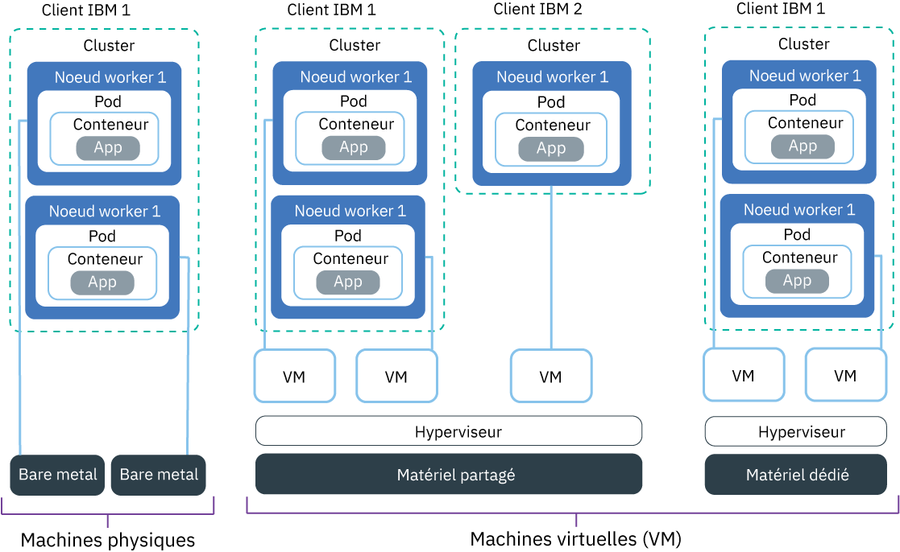

---

copyright:
  years: 2014, 2019
lastupdated: "2019-06-11"

keywords: kubernetes, iks, multi az, multi-az, szr, mzr

subcollection: containers

---

{:new_window: target="_blank"}
{:shortdesc: .shortdesc}
{:screen: .screen}
{:pre: .pre}
{:table: .aria-labeledby="caption"}
{:codeblock: .codeblock}
{:tip: .tip}
{:note: .note}
{:important: .important}
{:deprecated: .deprecated}
{:download: .download}
{:preview: .preview}

# Planification de la configuration de noeud worker
{: #planning_worker_nodes}

Un cluster Kubernetes est composé de noeuds worker regroupés en pools de noeuds worker. Il est surveillé et géré de manière centralisée par le maître Kubernetes. Les administrateurs du cluster décident comment configurer le cluster des noeuds worker pour garantir que les utilisateurs du cluster disposent de toutes les ressources pour déployer et exécuter des applications dans le cluster.
{:shortdesc}

Lorsque vous créez un cluster standard, les noeuds worker ayant les mêmes spécifications de mémoire, UC et espace disque (version) sont commandés dans l'infrastructure IBM Cloud (SoftLayer) pour votre compte et ajoutés dans le pool de noeuds worker par défaut de votre cluster. A chaque noeud worker sont affectés un ID de noeud worker unique et un nom de domaine qui ne doivent pas être modifiés après la création du cluster. Vous pouvez opter entre des serveurs virtuels ou physiques (bare metal). En fonction du niveau d'isolement du matériel que vous sélectionnez, les noeuds worker virtuels peuvent être définis sous forme de noeuds partagés ou dédiés. Pour ajouter différentes versions à votre cluster, [créez un autre pool de noeuds worker](/docs/containers?topic=containers-cli-plugin-kubernetes-service-cli#cs_worker_pool_create).

Kubernetes limite le nombre maximal de noeuds worker dont vous pouvez disposer dans un cluster. Pour plus d'informations, voir la rubrique sur les [quotas de noeuds worker et de pods ](https://kubernetes.io/docs/setup/cluster-large/).

Vous voulez vous assurer de toujours disposer d'une quantité suffisante de noeuds worker pour traiter votre charge de travail ? Découvrez le [programme de mise à l'échelle automatique de cluster (cluster autoscaler)](/docs/containers?topic=containers-ca#ca).
{: tip}

 

## Matériel disponible pour les noeuds worker
{: #shared_dedicated_node}

Lorsque vous créez un cluster standard dans {{site.data.keyword.Bluemix_notm}}, vous déterminez si vos pools de noeuds worker sont constitués de noeuds worker qui sont soit des machines physiques (bare metal) ou des machines virtuelles s'exécutant sur du matériel physique. Vous sélectionnez également la version du noeud worker ou une combinaison de mémoire, UC et autres spécifications machine, telles que le stockage sur disque.
{:shortdesc}

Si vous disposez de plusieurs versions de noeud worker, vous devez créer un pool de noeuds worker pour chaque version. Vous ne pouvez pas redimensionner des noeuds worker existants pour disposer de ressources différentes, comme de l'UC ou de la mémoire. Lorsque vous créez un cluster gratuit, votre noeud worker est automatiquement mis à disposition sous forme de noeud partagé virtuel dans le compte d'infrastructure IBM Cloud (SoftLayer). Dans les clusters standard, vous pouvez choisir le type de machine le mieux adapté à votre charge de travail. Lors de la planification, tenez compte des [réserves de ressources de noeud worker](#resource_limit_node) sur la capacité totale de mémoire et d'UC.

Sélectionnez l'une des options suivantes pour décider du type de pool de noeuds worker que vous désirez.
* [Machines virtuelles](#vm)
* [Machines physiques (bare metal)](#bm)
* [Machines SDS (Software-Defined Storage)](#sds)

## Machines virtuelles
{: #vm}

Avec des machines virtuelles, vous pouvez obtenir une plus grande flexibilité, des temps de mise à disposition plus rapides et plus de fonctions de mise à l'échelle automatique qu'avec des machines physiques (bare metal), et ce, à un coût plus avantageux. Vous pouvez utiliser des machines virtuelles pour la plupart des cas d'utilisation généraux, par exemple les environnements de test et de développement, les environnements de préproduction et de production, les microservices et les applications métier. Cependant, il y a un impact sur les performances. Si vous avez besoin de calcul haute performance pour des charges de travail qui consomment beaucoup de mémoire RAM, de données ou de processeur graphique (GPU), utilisez des machines [bare metal](#bm).
{: shortdesc}

**Dois-je préférer du matériel partagé ou dédié ?** 
Lorsque vous créez un cluster virtuel standard, vous devez décider si vous souhaitez que le matériel sous-jacent soit partagé par plusieurs clients {{site.data.keyword.IBM_notm}} (service partagé) ou vous être dédié exclusivement (service exclusif).

* **Dans une configuration de matériel partagé à service partagé** : les ressources physiques (comme l'UC et la mémoire) sont partagées par toutes les machines virtuelles déployées sur le même matériel physique. Pour permettre à chaque machine virtuelle d'opérer indépendamment, un moniteur de machine virtuelle, également dénommé hyperviseur, segmente les ressources physiques en entités isolées et les alloue à une machine virtuelle en tant que ressources dédiées (isolement par hyperviseur).
* **Dans une configuration de matériel dédié à service exclusif** : toutes les ressources physiques vous sont exclusivement dédiées. Vous pouvez déployer plusieurs noeuds worker en tant que machines virtuelles sur le même hôte physique. A l'instar de la configuration à service partagé, l'hyperviseur veille à ce que chaque noeud worker ait sa part des ressources physiques disponibles.

Les noeuds partagés sont généralement moins coûteux que les noeuds dédiés, car les coûts du matériel sous-jacent sont partagés entre plusieurs clients. Toutefois, lorsque vous choisissez entre noeuds partagés et noeud dédiés, n'hésitez pas à contacter votre service juridique pour déterminer le niveau d'isolement de l'infrastructure et de conformité requis par votre environnement d'application.

Certaines versions sont disponibles uniquement pour un type de configuration de service. Par exemple, les machines virtuelles `m3c` sont disponibles uniquement avec une configuration de service partagé (`shared`).
{: note}

**Quelles sont les fonctions générales des machines virtuelles ?** 
Les machines virtuelles utilisent le disque local à la place d'un réseau SAN (Storage Area Network) pour plus de fiabilité. Un réseau SAN procure, entre autres, une capacité de traitement plus élevée lors de la sérialisation des octets sur le disque local et réduit les risques de dégradation du système de fichiers en cas de défaillance du réseau. Toutes les machines virtuelles sont fournies avec une vitesse réseau de 1000 Mbit/s, un stockage sur disque local principal de 25 Go pour le système de fichiers du système d'exploitation et 100 Go de stockage sur disque local secondaire pour les données d'exécution de conteneur ou le `kubelet`. Le stockage local sur le noeud worker est conçu pour un traitement à court terme uniquement et le disque principal et le disque secondaire sont effacés lorsque vous mettez à jour ou rechargez le noeud worker. Pour les solutions de stockage persistant, voir [Planification de stockage persistant à haute disponibilité](/docs/containers?topic=containers-storage_planning#storage_planning).

**Que se passe-t-il si je dispose de types de machine plus anciennes ?** 
Si votre cluster a des versions de noeud worker `x1c` obsolètes ou Ubuntu 16 `x2c` plus anciennes, vous pouvez  [mettre à jour votre cluster pour qu'il dispose de noeuds worker Ubuntu 18 `x3c`](/docs/containers?topic=containers-update#machine_type).

**Quelles sont les versions de machine virtuelle disponibles ?** 
Les versions de noeud worker varient en fonction des zones. Le tableau suivant présente les versions les plus récentes, par exemple les versions des noeuds worker Ubuntu 18 `x3c`, par opposition aux versions de noeud worker Ubuntu 16 `x2c` plus anciennes. Pour voir les types de machine disponibles dans votre zone, exécutez la commande `ibmcloud ks machine-types <zone>`. Vous pouvez également passer en revue les types de machine [bare metal](#bm) ou [SDS](#sds).

{: #vm-table}
<table>
<caption>Types de machine disponibles dans {{site.data.keyword.containerlong_notm}}.</caption>
<thead>
<th>Nom et cas d'utilisation</th>
<th>Coeurs/ Mémoire</th>
<th>Disque principal / secondaire</th>
<th>Vitesse réseau</th>
</thead>
<tbody>
<tr>
<td><strong>Virtuel, u3c.2x4</strong> : utilisez cette machine virtuelle de petite taille à des fins de test rapide, de démonstration de faisabilité et pour d'autres charges de travail légères.</td>
<td>2/4 Go</td>
<td>25/100 Go</td>
<td>1000 Mbit/s</td>
</tr>
<tr>
<td><strong>Virtuel, b3c.4x16</strong> : sélectionnez cette machine virtuelle équilibrée à des fins de test et de développement et pour d'autres charges de travail légères.</td>
<td>4/16 Go</td>
<td>25/100 Go</td>
<td>1000 Mbit/s</td>
</tr>
<tr>
<td><strong>Virtuel, b3c.16x64</strong> : sélectionnez cette machine virtuelle équilibrée pour les charges de travail de taille moyenne.</td></td>
<td>16/64 Go</td>
<td>25/100 Go</td>
<td>1000 Mbit/s</td>
</tr>
<tr>
<td><strong>Virtuel, b3c.32x128</strong> : sélectionnez cette machine virtuelle équilibrée pour les charges de travail de taille moyenne à élevée, par exemple une base de données et un site Web dynamique avec de nombreux utilisateurs simultanés.</td>
<td>32/128 Go</td>
<td>25/100 Go</td>
<td>1000 Mbit/s</td>
</tr>
<tr>
<td><strong>Virtuel, c3c.16x16</strong> : utilisez cette version lorsque vous souhaitez un juste équilibre entre les ressources de calcul du noeud worker pour les charges de travail légères.</td>
<td>16/16 Go</td>
<td>25/100 Go</td>
<td>1000 Mbit/s</td>
</tr><tr>
<td><strong>Virtuel, c3c.16x32</strong> : utilisez cette version lorsque vous souhaitez un rapport 1:2 entre les ressources d'UC et de mémoire du noeud worker pour les charges de travail légères ou de taille moyenne.</td>
<td>16/32 Go</td>
<td>25/100 Go</td>
<td>1000 Mbit/s</td>
</tr><tr>
<td><strong>Virtuel, c3c.32x32</strong> : utilisez cette version lorsque vous souhaitez un juste équilibre entre les ressources de calcul du noeud worker pour les charges de travail de taille moyenne.</td>
<td>32/32 Go</td>
<td>25/100 Go</td>
<td>1000 Mbit/s</td>
</tr><tr>
<td><strong>Virtuel, c3c.32x64</strong> : utilisez cette version lorsque vous souhaitez un rapport 1:2 entre les ressources d'UC et de mémoire du noeud worker pour les charges de travail de taille moyenne.</td>
<td>32/64 Go</td>
<td>25/100 Go</td>
<td>1000 Mbit/s</td>
</tr>
<tr>
<td><strong>Virtuel, m3c.8x64</strong> : utilisez cette version lorsque vous souhaitez un rapport 1:8 entre les ressources d'UC et de mémoire pour les charges de travail légères ou de taille moyenne qui nécessitent plus de mémoire comme par exemple des bases de données de type {{site.data.keyword.Db2_on_Cloud_short}}. Disponible uniquement à Dallas et en tant que service à matériel partagé (`--hardware shared`).</td>
<td>8/64 Go</td>
<td>25/100 Go</td>
<td>1000 Mbit/s</td>
</tr><tr>
<td><strong>Virtuel, m3c.16x128</strong> : utilisez cette version lorsque vous souhaitez un rapport 1:8 entre les ressources d'UC et de mémoire pour les charges de travail de taille moyenne qui nécessitent plus de mémoire comme par exemple des bases de données de type {{site.data.keyword.Db2_on_Cloud_short}}. Disponible uniquement à Dallas et en tant que service à matériel partagé (`--hardware shared`).</td>
<td>16/128 Go</td>
<td>25/100 Go</td>
<td>1000 Mbit/s</td>
</tr><tr>
<td><strong>Virtuel, m3c.30x240</strong> : utilisez cette version lorsque vous souhaitez un rapport 1:8 entre les ressources d'UC et de mémoire pour les charges de travail légères ou de grande taille qui nécessitent plus de mémoire comme par exemple des bases de données de type {{site.data.keyword.Db2_on_Cloud_short}}. Disponible uniquement à Dallas et en tant que service à matériel partagé (`--hardware shared`).</td>
<td>30/240 Go</td>
<td>25/100 Go</td>
<td>1000 Mbit/s</td>
</tr>
<tr>
<td><strong>Virtuel, z1.2x4</strong> : utilisez cette version lorsque vous souhaitez qu'un noeud worker soit créé sur Hyper Protect Containers on IBM Z Systems. </td>
<td>2/4 Go</td>
<td>25/100 Go</td>
<td>1000 Mbit/s</td>
</tr>
</tbody>
</table>

## Machines physiques (bare metal)
{: #bm}

Vous pouvez mettre à disposition votre noeud worker sous forme de serveur physique à service exclusif, également désigné par serveur bare metal.
{: shortdesc}

**En quoi une machine bare metal est-elle différente d'une machine virtuelle ?** 
Le type bare metal vous permet d'accéder directement aux ressources physiques sur la machine, par exemple à la mémoire ou à l'UC. Cette configuration élimine l'hyperviseur de machine virtuelle qui alloue des ressources physiques aux machines virtuelles qui s'exécutent sur l'hôte. A la place, toutes les ressources d'une machine bare metal sont dédiées exclusivement au noeud worker, donc vous n'avez pas à vous soucier de "voisins gênants" partageant des ressources et responsables du ralentissement des performances. Les types de machine physique ont davantage de capacité de stockage local par rapport aux machines virtuelles et certaines disposent de disques RAID pour augmenter la disponibilité des données. Le stockage local sur le noeud worker est conçu pour un traitement à court terme uniquement et le disque principal et le disque secondaire sont effacés lorsque vous mettez à jour ou rechargez le noeud worker. Pour les solutions de stockage persistant, voir [Planification de stockage persistant à haute disponibilité](/docs/containers?topic=containers-storage_planning#storage_planning).

**Hormis de meilleures spécifications en termes de performances, puis-je faire quelque chose avec une machine bare metal qui ne soit pas possible avec une machine virtuelle ?** 
Oui. Avec une machine bare metal, vous avez la possibilité d'activer la fonction Calcul sécurisé (Trusted Compute) pour vérifier que vos noeuds worker ne font pas l'objet de falsification. Si vous n'activez pas cette fonction lors de la création du cluster mais souhaitez le faire ultérieurement, vous pouvez utiliser la [commande](/docs/containers?topic=containers-cli-plugin-kubernetes-service-cli#cs_cluster_feature_enable) `ibmcloud ks feature-enable`. Après avoir activé cette fonction, vous ne pourrez plus la désactiver par la suite. Vous pouvez créer un nouveau cluster sans la fonction trust. Pour plus d'informations sur le mode de fonctionnement de la fonction de confiance (trust) lors du processus de démarrage du noeud, voir [{{site.data.keyword.containerlong_notm}} avec calcul sécurisé](/docs/containers?topic=containers-security#trusted_compute). La fonction de calcul sécurisé (Trusted Compute) est disponible pour certains types de machine bare metal. Lorsque vous exécutez la [commande](/docs/containers?topic=containers-cli-plugin-kubernetes-service-cli#cs_machine_types) `ibmcloud ks machine-types <zone>`, vous pouvez voir les machines qui prennent en charge la fonction de confiance en examinant la zone **Trustable**. Par exemple, les versions GPU `mgXc` ne prennent pas en charge la fonction de calcul sécurisé.

En plus de la fonction de calcul sécurisé, vous pouvez également tirer parti d'{{site.data.keyword.datashield_full}} (bêta). {{site.data.keyword.datashield_short}} est intégré à la technologie Intel® Software Guard Extensions (SGX) et Fortanix® pour que le code et les données de vos charges de travail de conteneur {{site.data.keyword.Bluemix_notm}} soient protégés lors de leur utilisation. Le code d'application et les données s'exécutent dans des enclaves d'UC fortifiées, qui correspondent à des zones de mémoire sécurisées sur le noeud worker qui protègent les aspects critiques de l'application, ce qui permet de conserver le code et les données confidentiels et inchangés. Si vous ou votre entreprise nécessitez la confidentialité des données conformément à votre politique interne, aux réglementations officielles ou aux exigences de conformité de votre secteur d'activité, cette solution peut vous aider à passer au cloud. Parmi les exemples de cas d'utilisation figurent les institutions financières et médicales ou les pays dont les réglementations officielles nécessitent des solutions cloud sur site.

**Bare metal, ça a l'air génial ! Qu'est-ce qui m'empêche de commander une machine de ce type dès maintenant ?** 
Les serveurs bare metal sont plus chers que les serveurs virtuels et conviennent mieux aux applications à hautes performances qui nécessitent plus de ressources et de contrôle hôte.

Les serveurs bare metal sont facturés au mois. Si vous annulez un serveur bare metal avant la fin du mois, vous êtes facturé jusqu'à la fin de ce mois. Après avoir commandé ou annulé un serveur bare metal, le processus est finalisé manuellement dans votre compte d'infrastructure IBM Cloud (SoftLayer). Par conséquent, son exécution peut prendre plus d'un jour ouvrable.
{: important}

**Quelles versions bare metal puis-je commander ?** 
Les versions de noeud worker varient en fonction des zones. Le tableau suivant présente les versions les plus récentes, par exemple les versions des noeuds worker Ubuntu 18 `x3c`, par opposition aux versions de noeud worker Ubuntu 16 `x2c` plus anciennes. Pour voir les types de machine disponibles dans votre zone, exécutez la commande `ibmcloud ks machine-types <zone>`. Vous pouvez également passer en revue les types de machine [VM](#vm) ou [SDS](#sds).

Les machines bare metal sont optimisées pour différents cas d'utilisation, par exemple les charges de travail à forte consommation de mémoire RAM, de données ou de processeur graphique (GPU).

Choisissez un type de machine avec la configuration de stockage adaptée à votre charge de travail. Certaines versions comportent un mélange de configurations de stockage et de disques suivant. Par exemple, certaines versions peuvent comporter un disque principal SATA avec un disque secondaire SSD RAW.

* **SATA** : unité de stockage sur disque rotative magnétique souvent utilisée pour le disque principal du noeud worker qui stocke le système de fichiers du système d'exploitation.
* **SSD** : unité de stockage de type SSD (Solid State Drive) pour les données hautes performances.
* **RAW** : unité de stockage non formatée, dont la capacité totale peut être utilisée.
* **RAID** : unité de stockage comportant des données distribuées à des fins de redondance et de performances qui varie en fonction du niveau RAID. Ainsi, la capacité disque disponible à utiliser varie.

{: #bm-table}
<table>
<caption>Types de machine bare metal disponibles dans {{site.data.keyword.containerlong_notm}}.</caption>
<thead>
<th>Nom et cas d'utilisation</th>
<th>Coeurs/ Mémoire</th>
<th>Disque principal / secondaire</th>
<th>Vitesse réseau</th>
</thead>
<tbody>
<tr>
<td><strong>Bare metal à forte consommation de mémoire RAM, mr3c.28x512</strong> : augmentez au maximum la mémoire RAM disponible pour vos noeuds worker.</td>
<td>28/512 Go</td>
<td>SATA 2 To/SSD 960 Go</td>
<td>10000 Mbit/s</td>
</tr>
<tr>
<td><strong>Bare metal GPU, mg3c.16x128</strong> : choisissez ce type de machine pour des charges de travail nécessitant de nombreux calculs mathématiques, tels que le calcul hautes performances, l'apprentissage automatique ou les applications en 3D. Cette version comporte une carte physique Tesla K80 avec deux unités de traitement graphiques (GPU) par carte pour un total de deux GPU.</td>
<td>16/128 Go</td>
<td>SATA 2 To/SSD 960 Go</td>
<td>10000 Mbit/s</td>
</tr>
<tr>
<td><strong>Bare metal GPU, mg3c.28x256</strong> : choisissez ce type de machine pour des charges de travail nécessitant de nombreux calculs mathématiques, tels que le calcul hautes performances, l'apprentissage automatique ou les applications en 3D. Cette version possède deux cartes physiques Tesla K80 avec deux unités GPU par carte pour un total de quatre unités GPU.</td>
<td>28/256 Go</td>
<td>SATA 2 To/SSD 960 Go</td>
<td>10000 Mbit/s</td>
</tr>
<tr>
<td><strong>Bare metal à forte consommation de données, md3c.16x64.4x4tb</strong> : utilisez ce type pour une grande quantité de stockage sur disque local, avec notamment des disques RAID pour augmenter la disponibilité des données, pour des charges de travail de type systèmes de fichiers répartis, bases de données volumineuses et analyse de mégadonnées.</td>
<td>16/64 Go</td>
<td>RAID1 2x2 To/RAID10 SATA 4x4</td>
<td>10000 Mbit/s</td>
</tr>
<tr>
<td><strong>Bare metal à forte consommation de données, md3c.28x512.4x4tb</strong> : utilisez ce type pour une grande quantité de stockage sur disque local, avec notamment des disques RAID pour augmenter la disponibilité des données, pour des charges de travail de type systèmes de fichiers répartis, bases de données volumineuses et analyse de mégadonnées.</td>
<td>28 / 512 Go</td>
<td>RAID1 2x2 To/RAID10 SATA 4x4</td>
<td>10000 Mbit/s</td>
</tr>
<tr>
<td><strong>Bare metal équilibré, mb3c.4x32</strong> : à utiliser pour les charges de travail équilibrées qui nécessitent plus de ressources de calcul qu'en offrent les machines virtuelles. Cette version peut également être activée avec Intel® Software Guard Extensions (SGX) pour que vous puissiez utiliser <a href="/docs/services/data-shield?topic=data-shield-getting-started#getting-started" target="_blank">{{site.data.keyword.datashield_short}} (bêta)</a> pour chiffrer votre mémoire de données.</td>
<td>4/32 Go</td>
<td>SATA 2 To/SATA 2 To</td>
<td>10000 Mbit/s</td>
</tr>
<tr>
<td><strong>Bare metal équilibré, mb3c.16x64</strong> : à utiliser pour les charges de travail équilibrées qui nécessitent plus de ressources de calcul qu'en offrent les machines virtuelles.</td>
<td>16/64 Go</td>
<td>SATA 2 To/SSD 960 Go</td>
<td>10000 Mbit/s</td>
</tr>
<tr>
</tbody>
</table>

## Machines SDS (Software-Defined Storage)
{: #sds}

Les versions SDS (Software-Defined Storage) sont des machines physiques mises à disposition avec des disques RAW supplémentaires pour le stockage local physique. Contrairement aux disques locaux principaux et secondaires, les disques RAW ne sont pas effacés lors de la mise à jour ou du rechargement d'un noeud worker. Comme les données sont colocalisées avec le noeud de traitement, les machines SSD conviennent particulièrement aux charges de travail hautes performances.
{: shortdesc}

**Quand utiliser des versions SDS ?** 
En général, vous utilisez les machines SDS dans les cas suivants :
*  Si vous utilisez un module complémentaire SDS, tel que [Portworx](/docs/containers?topic=containers-portworx#portworx) dans le cluster, utilisez une machine SDS.
*  Si votre application est un objet [StatefulSet ](https://kubernetes.io/docs/concepts/workloads/controllers/statefulset/) qui nécessite un stockage local, vous pouvez utiliser des machines SDS et mettre à disposition des [volumes persistants locaux Kubernetes (bêta) ](https://kubernetes.io/blog/2018/04/13/local-persistent-volumes-beta/).
*  Vous disposez peut-être d'applications personnalisées qui nécessitent du stockage local brut supplémentaire.

Pour d'autres solutions de stockage, voir [Planification de stockage persistant à haute disponibilité](/docs/containers?topic=containers-storage_planning#storage_planning).

**Quelles versions SDS puis-je commander ?** 
Les versions de noeud worker varient en fonction des zones. Le tableau suivant présente les versions les plus récentes, par exemple les versions des noeuds worker Ubuntu 18 `x3c`, par opposition aux versions de noeud worker Ubuntu 16 `x2c` plus anciennes. Pour voir les types de machine disponibles dans votre zone, exécutez la commande `ibmcloud ks machine-types <zone>`. Vous pouvez également passer en revue les types de machine [bare metal](#bm) ou [VM](#vm).

Choisissez un type de machine avec la configuration de stockage adaptée à votre charge de travail. Certaines versions comportent un mélange de configurations de stockage et de disques suivant. Par exemple, certaines versions peuvent comporter un disque principal SATA avec un disque secondaire SSD RAW.

* **SATA** : unité de stockage sur disque rotative magnétique souvent utilisée pour le disque principal du noeud worker qui stocke le système de fichiers du système d'exploitation.
* **SSD** : unité de stockage de type SSD (Solid State Drive) pour les données hautes performances.
* **RAW** : unité de stockage non formatée, dont la capacité totale peut être utilisée.
* **RAID** : unité de stockage comportant des données distribuées à des fins de redondance et de performances qui varie en fonction du niveau RAID. Ainsi, la capacité disque disponible à utiliser varie.

{: #sds-table}
<table>
<caption>Types de machine SDS disponibles dans {{site.data.keyword.containerlong_notm}}.</caption>
<thead>
<th>Nom et cas d'utilisation</th>
<th>Coeurs/ Mémoire</th>
<th>Disque principal / secondaire</th>
<th>Disques RAW supplémentaires</th>
<th>Vitesse réseau</th>
</thead>
<tbody>
<tr>
<td><strong>Bare metal avec SDS, ms3c.4x32.1.9tb.ssd</strong> : si vous avez besoin de stockage local supplémentaire à des fins de performances, utilisez cette version DH (disk-heavy) qui prend en charge SDS.</td>
<td>4/32 Go</td>
<td>SATA 2 To/SSD 960 Go</td>
<td>SSD RAW 1,9 To (chemin d'accès à l'unité : `/dev/sdc`)</td>
<td>10000 Mbit/s</td>
</tr>
<tr>
<td><strong>Bare metal avec SDS, ms3c.16x64.1.9tb.ssd</strong> : si vous avez besoin de stockage local supplémentaire à des fins de performances, utilisez cette version DH (disk-heavy) qui prend en charge SDS.</td>
<td>16/64 Go</td>
<td>SATA 2 To/SSD 960 Go</td>
<td>SSD RAW 1,9 To (chemin d'accès à l'unité : `/dev/sdc`)</td>
<td>10000 Mbit/s</td>
</tr>
<tr>
<td><strong>Bare metal avec SDS, ms3c.28x256.3.8tb.ssd</strong> : si vous avez besoin de stockage local supplémentaire à des fins de performances, utilisez cette version DH (disk-heavy) qui prend en charge SDS.</td>
<td>28/256 Go</td>
<td>SATA 2 To/SSD 1,9 To</td>
<td>SSD RAW 3,8 To (chemin d'accès à l'unité : `/dev/sdc`)</td>
<td>10000 Mbit/s</td>
</tr>
<tr>
<td><strong>Bare metal avec SDS, ms3c.28x512.4x3.8tb.ssd</strong> : si vous avez besoin de stockage local supplémentaire à des fins de performances, utilisez cette version DH (disk-heavy) qui prend en charge SDS.</td>
<td>28 / 512 Go</td>
<td>SATA 2 To/SSD 1,9 To</td>
<td>4 disques, SSD Raw 3,8 To (chemins d'accès à ces unités : `/dev/sdc`, `/dev/sdd`, `/dev/sde`, `/dev/sdf`)</td>
<td>10000 Mbit/s</td>
</tr>
</tbody>
</table>

## Réserves de ressources de noeud worker
{: #resource_limit_node}

{{site.data.keyword.containerlong_notm}} définit des réserves de ressources de calcul qui limitent les ressources de calcul disponibles sur chaque noeud worker. Les ressources de mémoire et d'UC réservées ne peuvent pas être utilisées par des pods sur le noeud worker et réduisent les ressources pouvant être allouées sur chaque noeud worker. Lorsque vous commencez à déployer des pods, si le noeud worker ne dispose pas de ressources suffisantes pouvant être allouées, le déploiement échoue. De plus, si les pods dépassent la limite de ressources du noeud worker, les pods sont expulsés. Dans Kubernetes, cette limite est appelée [seuil d’éviction immédiate](https://kubernetes.io/docs/tasks/administer-cluster/out-of-resource/#hard-eviction-thresholds).
{:shortdesc}

S'il y a moins d'UC ou de mémoire disponible que les réserves de noeud worker, Kubernetes commence à expulser les pods pour restaurer suffisamment de ressources de calcul. Les pods sont replanifiés sur un autre noeud worker, le cas échéant. Si vos pods sont expulsés fréquemment, ajoutez d'autres noeuds worker à votre cluster ou définissez des [limites de ressources ](https://kubernetes.io/docs/concepts/configuration/manage-compute-resources-container/#resource-requests-and-limits-of-pod-and-container) sur vos pods.

Les ressources réservées sur votre noeud worker dépendent de la quantité d'UC et de mémoire fournie avec votre noeud worker. {{site.data.keyword.containerlong_notm}} définit différents niveaux de mémoire et d'UC, comme indiqué dans les tableaux suivants. Si votre noeud worker est fourni avec des ressources de calcul à plusieurs niveaux, un pourcentage de vos ressources d'UC et de mémoire est réservé pour chaque niveau.

Pour passer en revue la quantité de ressources de calcul actuellement utilisée sur votre noeud worker, exécutez la commande [`kubectl top node` ](https://kubernetes.io/docs/reference/kubectl/overview/#top).
{: tip}

<table summary="Ce tableau présente les réserves de mémoire de noeud worker par niveau.">
<caption>Réserves de mémoire de noeud worker par niveau.</caption>
<thead>
<tr>
  <th>Niveau mémoire</th>
  <th>% ou quantité réservés</th>
  <th>Exemple pour un noeud worker `b3c.4x16` (16 Go)</th>
  <th>Exemple pour un noeud worker `mg1c.28x256` (256 Go)</th>
</tr>
</thead>
<tbody>
<tr>
  <td>4 premiers Go (0 à 4 Go)</td>
  <td>25 % de mémoire</td>
  <td>1 Go</td>
  <td>1 Go</td>
</tr>
<tr>
  <td>4 Go suivants (5 à 8 Go)</td>
  <td>20 % de mémoire</td>
  <td>0,8 Go</td>
  <td>0,8 Go</td>
</tr>
<tr>
  <td>8 Go suivants (9 à 16 Go)</td>
  <td>10 % de mémoire</td>
  <td>0,8 Go</td>
  <td>0,8 Go</td>
</tr>
<tr>
  <td>112 Go suivants (17 à 128 Go)</td>
  <td>6 % de mémoire</td>
  <td>N/A</td>
  <td>6,72 Go</td>
</tr>
<tr>
  <td>Go restants (129 Go et +)</td>
  <td>2 % de mémoire</td>
  <td>N/A</td>
  <td>2,54 Go</td>
</tr>
<tr>
  <td>Réserve supplémentaire pour les règles d'[éviction avec `kubelet` ](https://kubernetes.io/docs/tasks/administer-cluster/out-of-resource/)</td>
  <td>100 Mo</td>
  <td>100 Mo (montant fixe)</td>
  <td>100 Mo (montant fixe)</td>
</tr>
<tr>
  <td>**Total réservé**</td>
  <td>**(variable)**</td>
  <td>**2,7 Go sur un total de 16 Go**</td>
  <td>**11,96 Go sur un total de 256 Go**</td>
</tr>
</tbody>
</table>

<table summary="Ce tableau présente les réserves d'UC de noeud worker par niveau.">
<caption>Réserves d'UC de noeud worker par niveau.</caption>
<thead>
<tr>
  <th>Niveau UC</th>
  <th>% réservé</th>
  <th>Exemple pour un noeud worker `b3c.4x16` (4 coeurs)</th>
  <th>Exemple pour un noeud worker `mg1c.28x256` (28 coeurs)</th>
</tr>
</thead>
<tbody>
<tr>
  <td>Premier coeur (Coeur 1)</td>
  <td>6 % des coeurs</td>
  <td>0,06 coeur</td>
  <td>0,06 coeur</td>
</tr>
<tr>
  <td>2 coeurs suivants (coeurs 2 et 3)</td>
  <td>1 % des coeurs</td>
  <td>0,02 coeur</td>
  <td>0,02 coeur</td>
</tr>
<tr>
  <td>2 coeurs suivants (coeurs 4 et 5)</td>
  <td>0,5 % des coeurs</td>
  <td>0,005 coeur</td>
  <td>0,01 coeur</td>
</tr>
<tr>
  <td>Coeurs restants (6 coeurs et +)</td>
  <td>0,25 % des coeurs</td>
  <td>N/A</td>
  <td>0,0575 coeur</td>
</tr>
<tr>
  <td>**Total réservé**</td>
  <td>**(variable)**</td>
  <td>**0,085 coeur sur un total de 4 coeurs**</td>
  <td>**0,1475 coeur sur un total de 28 coeurs**</td>
</tr>
</tbody>
</table>
