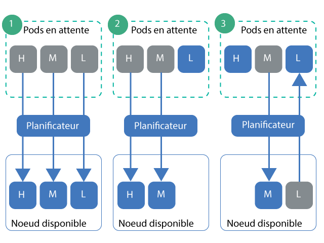

---

copyright:
  years: 2014, 2019
lastupdated: "2019-05-31"

keywords: kubernetes, iks

subcollection: containers

---

{:new_window: target="_blank"}
{:shortdesc: .shortdesc}
{:screen: .screen}
{:pre: .pre}
{:table: .aria-labeledby="caption"}
{:codeblock: .codeblock}
{:tip: .tip}
{:note: .note}
{:important: .important}
{:deprecated: .deprecated}
{:download: .download}
{:preview: .preview}


# Définition d'une priorité de pod
{: #pod_priority}

Avec la priorité et la préemption des pods de Kubernetes, vous pouvez configurer des classes de priorité pour indiquer la priorité relative d'un pod. Le planificateur de Kubernetes tient compte de la priorité d'un pod et peut même préempter (retirer) des pods dont la priorité est faible pour faire de la place sur un noeud worker aux pods avec une priorité plus élevée. Vos clusters {{site.data.keyword.containerlong}} qui exécutent Kubernetes version 1.11.2 ou ultérieure prennent en charge le contrôleur d'admission `Priority` qui impose ces classes.
{: shortdesc}

**Pourquoi définir une priorité de pod ?**</br>
En tant qu'administrateur de cluster, vous souhaitez contrôler les pods essentiels à la charge de travail de votre cluster. Les classes de priorité peuvent vous aider à contrôler les décisions du planificateur de Kubernetes pour privilégier les pods avec une priorité élevée par rapport aux pods avec une priorité plus faible. Le planificateur peut même préempter (retirer) les pods en cours d'exécution avec une priorité plus faible de sorte que les pods en attente dont la priorité est plus élevée puissent être planifiés.

En définissant la priorité des pods, vous pouvez empêcher des charges de travail avec une priorité plus faible d'impacter des charges de travail essentielles dans votre cluster, notamment dans les cas où le cluster commence à atteindre la limite de capacité de ses ressources.

Assurez-vous d'avoir [configuré l'accès utilisateur approprié](/docs/containers?topic=containers-users#users) pour votre cluster, et, le cas échéant, les [politiques de sécurité de pod](/docs/containers?topic=containers-psp#psp). L'accès et les politiques de sécurité de pod (PSP) peuvent empêcher des utilisateurs qui ne sont pas fiables de déployer des pods de priorité élevée empêchant la planification des autres pods.
{: tip}

{: #priority_scheduling}
**Comment fonctionnent la planification des priorités et la préemption ?**</br>
En général, les pods en attente ayant une priorité plus élevée sont planifiés avant les pods avec une priorité plus faible. Si vous ne disposez plus de ressources dans vos noeuds worker, le planificateur peut préempter (retirer) des pods pour libérer les ressources nécessaires pour permettre la planification des pods de priorité plus élevée. La préemption est également affectée par les périodes d'arrêt approprié, les objets pod disruption budget et l'affinité des noeuds worker.

Si vous n'indiquez pas de priorité pour le déploiement de vos pods, la valeur par défaut correspond à la classe de priorité définie par `globalDefault`. Si vous n'avez pas de classe de priorité `globalDefault`, la priorité par défaut pour tous les pods est zéro (`0`). Par défaut, {{site.data.keyword.containerlong_notm}} ne définit pas de classe `globalDefault`, par conséquent, la priorité par défaut des pods est zéro.

Pour comprendre comment s'articule la priorité des pods avec le planificateur, considérez les scénarios illustrés dans la figure suivante. Vous devez placer les pods dont la priorité est définie sur des noeuds worker avec des ressources disponibles. Autrement, les pods de priorité élevée dans votre cluster peuvent rester en attente, alors que des pods existants sont retirés au même moment, comme dans le scénario 3.

_Figure : Scénarios illustrant la priorité des pods_


1.  Trois pods avec une priorité élevée, moyenne et faible sont en attente de planification. Le planificateur trouve un noeud worker disposant d'assez d'espace pour les trois pods et planifie ces pods par ordre de priorité, en planifiant en premier le pod dont la priorité est la plus élevée.
2.  Trois pods avec une priorité élevée, moyenne et faible sont en attente de planification. Le planificateur trouve un noeud worker disponible mais ce noeud n'a pas assez de ressources pour prendre en charge les pods avec une priorité élevée ou moyenne. Le pod de priorité faible n'est pas planifié et reste en attente.
3.  Deux pods avec une priorité élevée et moyenne sont en attente de planification. Il existe déjà un troisième pod avec une priorité faible sur un noeud worker disponible. Cependant, le noeud worker ne dispose pas de ressources suffisantes pour planifier les pods en attente. Le planificateur préempte, ou retire, le pod de faible priorité, qui repasse alors à l'état en attente. Ensuite, le planificateur tente de planifier le pod avec une priorité élevée. Cependant, le noeud worker ne dispose pas de ressources suffisantes pour planifier le pod de priorité élevée et le planificateur planifie à la place le pod avec une priorité moyenne.

**Pour plus d'informations** : voir la documentation de Kubernetes sur la [priorité et la préemption des pods ](https://kubernetes.io/docs/concepts/configuration/pod-priority-preemption/).

**Puis-je désactiver le contrôleur d'admission de priorité de pod ?**</br>
Non. Si vous ne souhaitez pas utiliser la priorité de pod, ne définissez pas de classe `globalDefault` ou ajoutez une classe de priorité dans les déploiements de vos pods. Tous les pods prennent la valeur zéro, sauf les pods essentiels pour le cluster qu'IBM déploie avec les [classes de priorité par défaut](#default_priority_class). Comme la priorité des pods est relative, cette configuration de base garantit que les pods essentiels pour le cluster sont prioritaires pour les ressources et planifie tous les autres pods suivant les règles de planification existantes en vigueur.

**Comment les quotas de ressources affectent-ils la priorité d'un pod ?**</br>
Vous pouvez utiliser la priorité de pod en combinaison avec les quotas de ressources, notamment des [portées de quotas (quota scopes) ](https://kubernetes.io/docs/concepts/policy/resource-quotas/#quota-scopes) pour les clusters qui exécutent Kubernetes 1.12 ou version ultérieure. Avec les portées de quotas, vous pouvez configurer vos quotas de ressources en fonction de la priorité des pods. Ainsi, les pods de priorité plus élevée consomment des ressources système limitées par le quota de ressources avant les pods de priorité plus faible.

## Description des classes de priorité par défaut
{: #default_priority_class}

Vos clusters {{site.data.keyword.containerlong_notm}} sont fournis avec des classes de priorité par défaut.
{: shortdesc}

Ne modifiez pas les classes par défaut qui sont utilisées pour gérer correctement votre cluster. Vous pouvez utiliser ces classes dans les déploiements de vos applications ou [créer vos propres classes de priorité](#create_priority_class).
{: important}

Le tableau suivant présente les classes de priorité fournies par défaut dans votre cluster et indique pourquoi elles sont utilisées.

| Nom | Définie par | Valeur de priorité | Fonction |
|---|---|---|
| `system-node-critical` | Kubernetes | 2000001000 | Sélectionne les pods déployés dans l'espace de nom `kube-system` lorsque vous créez le cluster. Utilisez cette classe de priorité pour protéger les fonctions essentielles des noeuds worker, par exemple la mise en réseau, le stockage, la consignation, la surveillance et les pods de métriques. |
| `system-cluster-critical` | Kubernetes | 2000000000 | Sélectionne les pods déployés dans l'espace de nom `kube-system` lorsque vous créez le cluster. Utilisez cette classe de priorité pour protéger les fonctions essentielles des clusters, par exemple la mise en réseau, le stockage, la consignation, la surveillance et les pods de métriques. |
| `ibm-app-cluster-critical` | IBM | 900000000 | Sélectionne les pods déployés dans l'espace de nom `ibm-system` lorsque vous créez le cluster. Utilisez cette classe de priorité pour protéger les fonctions essentielles des applications, par exemple les pods d'équilibreur de charge. |
{: caption="Classes de priorité par défaut que vous ne devez pas modifier" caption-side="top"}

Vous pouvez vérifier les pods qui utilisent des classes de priorité en exécutant la commande suivante.

```
kubectl get pods --all-namespaces -o custom-columns=NAME:.metadata.name,PRIORITY:.spec.priorityClassName
```
{: pre}

## Création d'une classe de priorité
{: #create_priority_class}

Pour définir la priorité d'un pod, vous devez utiliser une classe de priorité.
{: shortdesc}

Avant de commencer :
* [Connectez-vous à votre compte. Le cas échéant, ciblez le groupe de ressources approprié. Définissez le contexte pour votre cluster.](/docs/containers?topic=containers-cs_cli_install#cs_cli_configure)
* Vérifiez que vous disposez du [rôle de service {{site.data.keyword.Bluemix_notm}} IAM **Auteur** ou **Responsable**](/docs/containers?topic=containers-users#platform) pour l'espace de nom `default`.
* [Créez](/docs/containers?topic=containers-clusters#clusters_ui) ou [mettez à jour](/docs/containers?topic=containers-update#update) votre cluster avec Kubernetes version 1.11 ou ultérieure.

Pour utiliser une classe de priorité :

1.  Facultatif : utilisez une classe de priorité existante comme modèle pour définir la nouvelle classe.

    1.  Répertoriez les classes de priorité existantes.

        ```
        kubectl get priorityclasses
        ```
        {: pre}

    2.  Sélectionnez la classe de priorité que vous voulez copier et créez un fichier YAML local.

        ```
        kubectl get priorityclass <priority_class> -o yaml > Downloads/priorityclass.yaml
        ```
        {: pre}

2.  Créez un fichier YAML pour votre classe de priorité.

    ```yaml
    apiVersion: scheduling.k8s.io/v1alpha1
    kind: PriorityClass
    metadata:
      name: <priority_class_name>
    value: <1000000>
    globalDefault: <false>
    description: "Use this class for XYZ service pods only."
    ```
    {: codeblock}

    <table>
    <caption>Description des composants du fichier YAML</caption>
    <thead>
    <th colspan=2> Description des composants du fichier YAML</th>
    </thead>
    <tbody>
    <tr>
    <td><code>metadata.name</code></td>
    <td>Obligatoire : nom de la classe de priorité que vous désirez créer.</td>
    </tr>
    <tr>
    <td><code>value</code></td>
    <td>Obligatoire : entrez un entier inférieur ou égal à 1 milliard (1000000000). Plus la valeur est élevée, plus la priorité est élevée. Les valeurs sont relatives aux valeurs des autres classes de priorité dans le cluster. Réservez les nombres très élevés aux pods essentiels pour le système dont vous ne souhaitez pas la préemption (retrait). </br></br>Par exemple, les [classes de priorité par défaut essentielles pour le cluster](#default_priority_class) sont comprises entre 900000000 et 2000001000, par conséquent, entrez une valeur inférieure à ces nombres pour les nouvelles classes de priorité, de sorte qu'aucun élément n'ait une priorité plus élevée que ces pods.</td>
    </tr>
    <tr>
    <td><code>globalDefault</code></td>
    <td>Facultatif : définissez cette zone avec la valeur `true` pour faire en sorte que cette classe de priorité soit la valeur par défaut globale appliquée à tous les pods planifiés sans valeur `priorityClassName`. 1 seule classe de priorité dans votre cluster peut être définie avec cette valeur par défaut globale. S'il n'y a aucune classe globalDefault, les pods n'ayant aucune valeur `priorityClassName` indiquée ont une priorité égale à zéro (`0`).</br></br>
    Les [classes de priorité par défaut](#default_priority_class) ne définissent pas de classe `globalDefault`. Si vous avez créé d'autres classes de priorité dans votre cluster, vous pouvez vérifier qu'elles ne contiennent pas la classe `globalDefault` en exécutant la commande `kubectl describe priorityclass<name>`.</td>
    </tr>
    <tr>
    <td><code>description</code></td>
    <td>Facultatif : informez les utilisateurs de la fonction de cette classe de priorité. Mettez cette chaîne entre guillemets (`""`).</td>
    </tr></tbody></table>

3.  Créez la classe de priorité dans votre cluster.

    ```
    kubectl apply -f filepath/priorityclass.yaml
    ```
    {: pre}

4.  Vérifiez que la classe de priorité a été créée.

    ```
    kubectl get priorityclasses
    ```
    {: pre}

Parfait ! Vous avez créé une classe de priorité. Informez votre équipe de l'existence de cette classe de priorité en indiquant la classe de priorité qu'ils doivent utiliser pour leurs déploiements de pods, le cas échéant.  

## Affectation de priorité à vos pods
{: #prioritize}

Affectez une classe de priorité à la spécification de votre pod pour définir la priorité du pod au sein de votre cluster {{site.data.keyword.containerlong_notm}}. Si vos pods existaient avant l'introduction des classes de priorité avec la version 1.11 de Kubernetes, vous devez modifier les fichiers YAML des pods pour affecter une priorité à ces pods.
{: shortdesc}

Avant de commencer :
* [Connectez-vous à votre compte. Le cas échéant, ciblez le groupe de ressources approprié. Définissez le contexte pour votre cluster.](/docs/containers?topic=containers-cs_cli_install#cs_cli_configure)
* Vérifiez que vous disposez du [rôle de service {{site.data.keyword.Bluemix_notm}} IAM **Auteur** ou **Responsable**](/docs/containers?topic=containers-users#platform) pour l'espace de nom dans lequel vous souhaitez déployer les pods.
* [Créez](/docs/containers?topic=containers-clusters#clusters_ui) ou [mettez à jour](/docs/containers?topic=containers-update#update) votre cluster avec Kubernetes version 1.11 ou ultérieure.
* [Familiarisez-vous avec le fonctionnement de la planification des priorités](#priority_scheduling), car la priorité peut préempter des pods existants et affecter le mode de consommation des ressources de votre cluster.

Pour affecter une priorité à vos pods :

1.  Vérifiez l'importance des autres pods déployés pour que vous puissiez choisir la classe de priorité appropriée pour vos pods en fonction de ce qui est déjà déployé.

    1.  Affichez les classes de priorité utilisées par les autres pods dans l'espace de nom.

        ```
        kubectl get pods -n <namespace> -o custom-columns=NAME:.metadata.name,PRIORITY:.spec.priorityClassName
        ```
        {: pre}

    2.  Obtenez les caractéristiques de la classe de priorité et notez le nombre correspondant à sa **valeur**. Les pods ayant les nombres les plus élevés sont prioritaires par rapport aux pods avec des nombres plus faibles. Répétez cette étape pour chaque classe de priorité que vous désirez passer en revue.

        ```
        kubectl describe priorityclass <priorityclass_name>
        ```
        {: pre}

2.  Obtenez la classe de priorité que vous désirez utiliser ou [créez votre propre classe de priorité](#create_priority_class).

    ```
    kubectl get priorityclasses
    ```
    {: pre}

3.  Dans votre spécification de pod, ajoutez la zone `priorityClassName` avec le nom de la classe de priorité que vous avez obtenue à l'étape précédente.

    ```yaml
    apiVersion: apps/v1
    kind: Deployment
    metadata:
      name: ibmliberty
    spec:
      replicas: 1
      selector:
        matchLabels:
          app: ibmliberty
      template:
        metadata:
          labels:
            app: ibmliberty
        spec:
          containers:
          - name: ibmliberty
            image: icr.io/ibmliberty:latest
            ports:
            - containerPort: 9080
          priorityClassName: <priorityclass_name>
    ```
    {: codeblock}

4.  Créez vos pods hiérarchisés dans l'espace de nom où vous voulez les déployer.

    ```
    kubectl apply -f filepath/pod-deployment.yaml
    ```
    {: pre}
