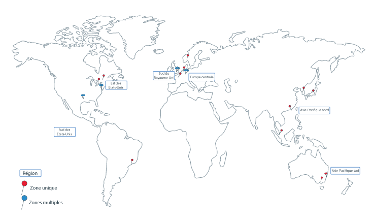

---

copyright:
  years: 2014, 2018
lastupdated: "2018-10-10"

---

{:new_window: target="_blank"}
{:shortdesc: .shortdesc}
{:screen: .screen}
{:pre: .pre}
{:table: .aria-labeledby="caption"}
{:codeblock: .codeblock}
{:tip: .tip}
{:download: .download}

# Régions et zones

Une région est un emplacement géographique spécifique dans lequel vous pouvez déployer des applications, des services et d'autres ressources {{site.data.keyword.Bluemix}}. [Les régions {{site.data.keyword.Bluemix_notm}}](#bluemix_regions) sont différentes des [régions {{site.data.keyword.containerlong}}](#container_regions). Les régions se composent d'une ou de plusieurs zones, lesquelles correspondent à des centres de données physiques qui hébergent les ressources de calcul, les ressources réseau et les ressources de stockage, ainsi que les systèmes de refroidissement et les appareils électriques hébergeant les services et les applications. Les zones sont isolées les unes des autres pour garantir qu'aucun point de défaillance unique ne sera partagé.
{:shortdesc}

{{site.data.keyword.Bluemix_notm}} est présent dans le monde entier. Les services au sein d'{{site.data.keyword.Bluemix_notm}} peuvent être disponibles partout ou dans une région spécifique. Lorsque vous créez un cluster Kubernetes dans {{site.data.keyword.containerlong_notm}}, ses ressources restent dans la région dans laquelle vous avez déployé le cluster.

**Remarque** : vous pouvez créer des clusters standard dans toutes les régions {{site.data.keyword.containerlong_notm}} prises en charge. Les clusters gratuits ne sont disponibles que dans certaines régions.



_Régions et zones {{site.data.keyword.containerlong_notm}}_

Les régions {{site.data.keyword.containerlong_notm}} sont les suivantes :
* Asie-Pacifique nord (clusters standard uniquement)
* Asie-Pacifique sud
* Europe centrale
* Sud du Royaume-Uni
* Est des Etats-Unis (clusters standard uniquement)
* Sud des Etats-Unis

<br />


## Régions dans {{site.data.keyword.Bluemix_notm}}
{: #bluemix_regions}

Vous pouvez organiser vos ressources entre les services {{site.data.keyword.Bluemix_notm}} en utilisant des régions {{site.data.keyword.Bluemix_notm}}. Par exemple, vous pouvez créer un cluster Kubernetes en utilisant une image Docker privée stockée dans le service {{site.data.keyword.registryshort_notm}} de la même région.
{:shortdesc}

Pour vérifier dans quelle région {{site.data.keyword.Bluemix_notm}} vous vous trouvez, exécutez la commande `ibmcloud info` et consultez la zone **Region**.

Vous pouvez accéder aux régions {{site.data.keyword.Bluemix_notm}} en spécifiant le noeud final d'API utilisé lorsque vous vous êtes connecté. Si vous ne spécifiez pas de région, vous êtes automatiquement connecté à la région la plus proche de vous.

Vous pouvez, par exemple, utiliser les commandes suivantes pour vous connecter aux noeuds finaux d'API des régions {{site.data.keyword.Bluemix_notm}} :

  * Sud des Etats-Unis
      ```
      ibmcloud login -a api.ng.bluemix.net
      ```
      {: pre}

  * Est des Etats-Unis
      ```
      ibmcloud login -a api.us-east.bluemix.net
      ```
      {: pre}

  * Sydney et Tokyo
      ```
      ibmcloud login -a api.au-syd.bluemix.net
      ```
      {: pre}

  * Allemagne
      ```
      ibmcloud login -a api.eu-de.bluemix.net
      ```
      {: pre}

  * Royaume-Uni
      ```
      ibmcloud login -a api.eu-gb.bluemix.net
      ```
      {: pre}

<br />


## Régions dans {{site.data.keyword.containerlong_notm}}
{: #container_regions}

En utilisant des régions {{site.data.keyword.containerlong_notm}}, vous pouvez créer des clusters  Kubernetes ou y accéder dans une région différente de la région {{site.data.keyword.Bluemix_notm}} où vous êtes connecté. Les noeuds finaux de régions {{site.data.keyword.containerlong_notm}} se réfèrent spécifiquement au service {{site.data.keyword.containerlong_notm}}, et non pas à {{site.data.keyword.Bluemix_notm}} dans son ensemble.
{:shortdesc}

**Remarque** : vous pouvez créer des clusters standard dans toutes les régions {{site.data.keyword.containerlong_notm}} prises en charge. Les clusters gratuits ne sont disponibles que dans certaines régions.

Régions {{site.data.keyword.containerlong_notm}} prises en charge :
  * Asie-Pacifique nord (clusters standard uniquement)
  * Asie-Pacifique sud
  * Europe centrale
  * Sud du Royaume-Uni
  * Est des Etats-Unis (clusters standard uniquement)
  * Sud des Etats-Unis

Vous pouvez accéder à {{site.data.keyword.containerlong_notm}} via un noeud final global : `https://containers.bluemix.net/v1`.
* Pour vérifier dans quelle région {{site.data.keyword.containerlong_notm}} vous vous trouvez actuellement,  exécutez la commande `ibmcloud ks region`.
* Pour extraire la liste des régions disponibles et de leurs noeuds finaux, exécutez la commande `ibmcloud ks regions`.

Pour utiliser l'API avec le noeud final global, dans toutes vos demandes, transmettez le nom de région dans l'en-tête `X-Region`.
{: tip}

### Connexion à une autre région d'{{site.data.keyword.containerlong_notm}}
{: #container_login_endpoints}

Vous pouvez changer de région en utilisant l'interface de ligne de commande (CLI) d'{{site.data.keyword.containerlong_notm}}.
{:shortdesc}

Vous souhaiterez peut-être vous connecter à une autre région {{site.data.keyword.containerlong_notm}} pour les raisons suivantes :
  * Vous avez créé des services {{site.data.keyword.Bluemix_notm}} ou des images Docker privées dans une région et vous souhaitez les utiliser avec {{site.data.keyword.containerlong_notm}} dans une autre région.
  * Vous souhaitez accéder à un cluster dans une région différente de la région {{site.data.keyword.Bluemix_notm}} par défaut à laquelle vous êtes connecté.

Pour basculer rapidement d'une région à une autre, exécutez la commande [`ibmcloud ks region-set`](cs_cli_reference.html#cs_region-set).

### Utilisation des commandes d'API {{site.data.keyword.containerlong_notm}}
{: #containers_api}

Pour interagir avec l'API {{site.data.keyword.containerlong_notm}}, entrez le type de commande et ajoutez `/v1/command` au noeud final global.
{:shortdesc}

Exemple d'API `GET /clusters` :
  ```
  GET https://containers.bluemix.net/v1/clusters
  ```
  {: codeblock}

</br>

Pour utiliser l'API avec le noeud final global, dans toutes vos demandes, transmettez le nom de région dans l'en-tête `X-Region`. Pour afficher la liste des régions disponibles, exécutez la commande `ibmcloud ks regions`.
{: tip}

Pour afficher la documentation sur les commandes d'API, accédez à [https://containers.bluemix.net/swagger-api/](https://containers.bluemix.net/swagger-api/).

## Zones dans {{site.data.keyword.containerlong_notm}}
{: #zones}

Les zones sont des centres de données physiques disponibles au sein d'une région {{site.data.keyword.Bluemix_notm}}. Les régions constituent un outil conceptuel permettant d'organiser les zones et peuvent inclure des zones (centres de données) dans différents pays. Le tableau suivant affiche les zones disponibles par région.
{:shortdesc}

* **Métropole à zones multiples** : les noeuds worker dans les clusters créés dans une métropole à zones multiples peuvent être répartis sur plusieurs zones.
* **Ville à zone unique** : les noeuds worker créés dans une ville à zone unique restent dans cette zone. Vous ne pouvez pas les répartir entre plusieurs zones.

<table summary="Le tableau suivant présente les zones disponibles par régions. La lecture des lignes s'effectue de gauche à droite, avec la région dans la première colonne, les métropoles à zones multiples dans la deuxième colonne et les villes à zone unique dans la troisième colonne.">
<caption>Zones uniques et zones multiples disponibles par région.</caption>
  <thead>
  <th>Région</th>
  <th>Métropole à zones multiples</th>
  <th>Ville à zone unique</th>
  </thead>
  <tbody>
    <tr>
      <td>Asie-Pacifique nord</td>
      <td>Tokyo : tok02, tok04, tok05</td>
      <td><p>Hong Kong (région administrative spéciale) de la République populaire de Chine : hkg02</p>
      <p>Séoul : seo01</p>
      <p>Singapour : sng01</p></td>
    </tr>
    <tr>
      <td>Asie-Pacifique sud</td>
      <td>Aucune</td>
      <td><p>Sydney : syd01, syd04</p>
      <p>Melbourne : mel01</p></td>
    </tr>
    <tr>
      <td>Europe centrale</td>
      <td>Francfort : fra02, fra04, fra05</td>
      <td><p>Amsterdam : ams03</p>
      <p>Milan : mil01</p>
      <p>Oslo : osl01</p>
      <p>Paris : par01</p>
      </td>
    </tr>
    <tr>
      <td>Sud du Royaume-Uni</td>
      <td>Londres : lon02, lon04, lon06</td>
      <td></td>
    </tr>
    <tr>
      <td>Est des Etats-Unis</td>
      <td>Washington DC : wdc04, wdc06, wdc07</td>
      <td><p>Montréal : mon01</p>
      <p>Toronto : tor01</p></td>
    </tr>
    <tr>
      <td>Sud des Etats-Unis</td>
      <td>Dallas : dal10, dal12, dal13</td>
      <td><p>San Jose : sjc03, sjc04</p>
      <p>São Paulo : sao01</p></td>
    </tr>
  </tbody>
</table>

### Clusters à zone unique
{: #single_zone}

Les ressources de votre cluster restent dans la zone dans laquelle est déployé le cluster. L'image suivante met en évidence les relations entre les composants d'un cluster à zone unique dans la région Est des Etats-Unis :


_Comprendre où résident les ressources de votre cluster à zone unique._

1.  Les ressources de votre cluster, notamment le maître et les noeuds worker, sont situées dans la même zone dans laquelle vous avez déployé le cluster. Lorsque vous initiez des actions d'orchestration de conteneurs locaux, par exemple des commandes `kubectl`, les informations s'échangent entre le maître et vos noeuds worker dans la même zone.

2.  Si vous configurez d'autres ressources de cluster, par exemple du stockage, des ressources réseau, du calcul ou des applications qui s'exécutent dans des pods, les ressources et leurs données restent dans la zone dans laquelle vous avez déployé votre cluster.

3.  Lorsque vous initiez des actions de gestion de cluster, par exemple l'exécution de commandes `ibmcloud ks`, les informations de base sur le cluster (par exemple le nom, l'ID, l'utilisateur, la commande) sont acheminées via un noeud final régional.

### Clusters à zones multiples
{: #multizone}

Dans un cluster à zones multiples, le noeud maître est déployé dans une zone compatible avec plusieurs zones et les ressources de votre cluster sont réparties sur plusieurs zones.

1.  Les noeuds worker sont répartis sur plusieurs zones d'une région pour offrir une plus grande disponibilité à votre cluster. Le maître reste dans la zone compatible avec plusieurs zones dans laquelle vous avez déployé le cluster. Lorsque vous initiez des actions d'orchestration de conteneurs locaux, par exemple avec des commandes `kubectl`, les informations s'échangent entre le maître et vos noeuds worker via un noeud final régional.

2.  D'autres ressources de cluster, comme par exemple du stockage, des ressources réseau, du calcul ou des applications s'exécutant dans des pods, varient par leur manière de se déployer dans les zones de votre cluster à zones multiples. Pour plus d'informations, consultez les rubriques suivantes :
    * Configuration de [stockage de fichiers](cs_storage_file.html#add_file) et de [stockage par blocs](cs_storage_block.html#add_block) dans les clusters à zones multiples
    * [Activation de l'accès public ou privé à une application à l'aide d'un service LoadBalancer dans un cluster à zones multiples](cs_loadbalancer.html#multi_zone_config)
    * [Gestion de trafic réseau à l'aide d'Ingress](cs_ingress.html#planning)
    * [Augmentation de la disponibilité de votre application](cs_app.html#increase_availability)

3.  Lorsque vous initiez des actions de gestion de cluster, par exemple l'exécution de [commandes `ibmcloud ks`](cs_cli_reference.html#cs_cli_reference), les informations de base sur le cluster (par exemple le nom, l'ID, l'utilisateur, la commande) sont acheminées via un noeud final régional.
