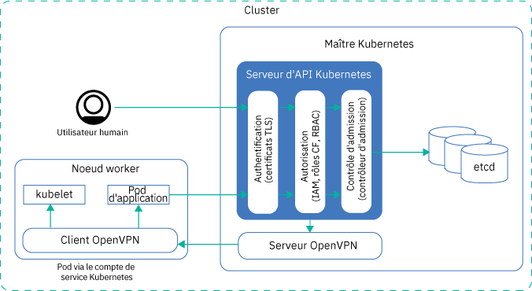
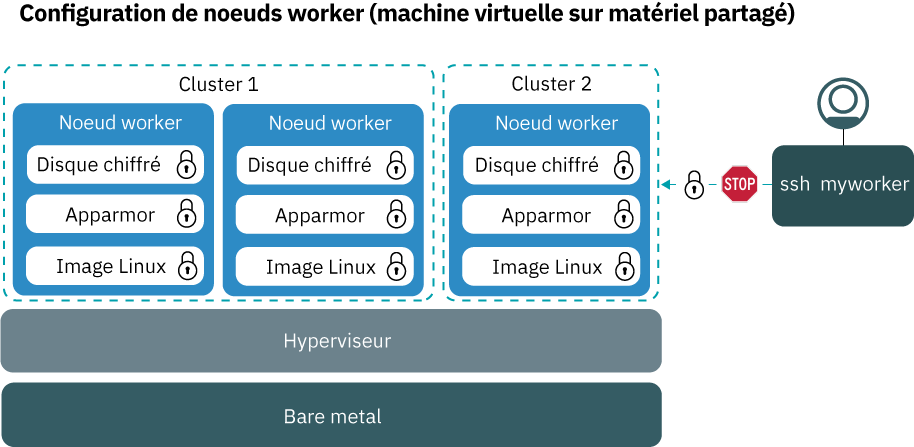
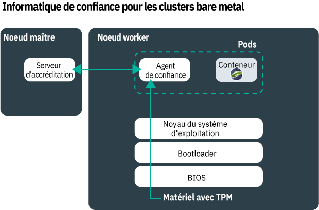
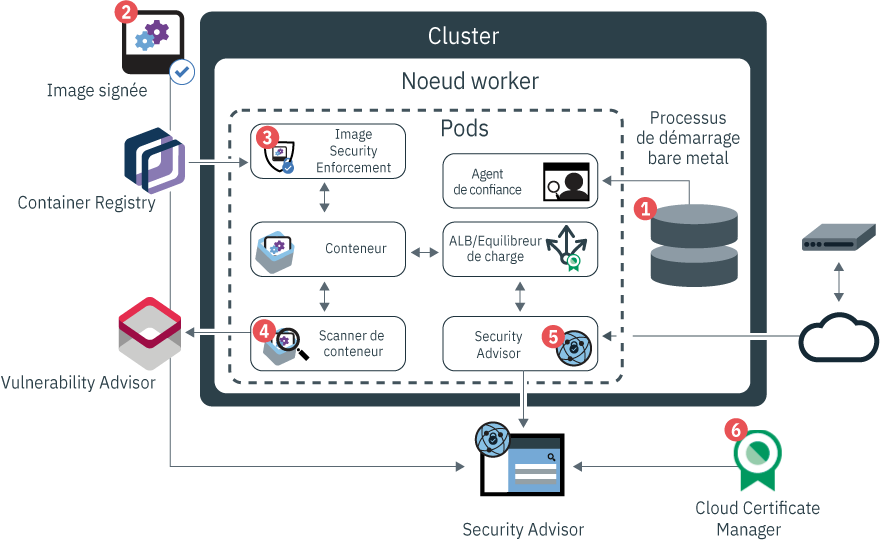
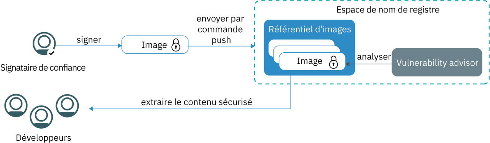
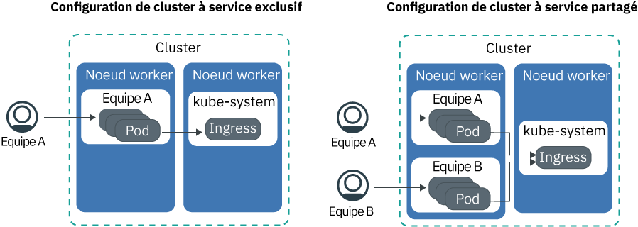

---

copyright:
  years: 2014, 2019
lastupdated: "2019-06-05"

keywords: kubernetes, iks

subcollection: containers

---

{:new_window: target="_blank"}
{:shortdesc: .shortdesc}
{:screen: .screen}
{:pre: .pre}
{:table: .aria-labeledby="caption"}
{:codeblock: .codeblock}
{:tip: .tip}
{:note: .note}
{:important: .important}
{:deprecated: .deprecated}
{:download: .download}
{:preview: .preview}

# Sécurité d'{{site.data.keyword.containerlong_notm}}
{: #security}

Vous pouvez utiliser les fonctions de sécurité intégrées dans {{site.data.keyword.containerlong}} pour l'analyse des risques et la protection en matière de sécurité. Ces fonctions vous aident à protéger l'infrastructure de votre cluster Kubernetes et la communication réseau, à isoler vos ressources de traitement, et à garantir la conformité aux règles de sécurité des composants de votre infrastructure et des déploiements de conteneurs.
{: shortdesc}

## Présentation des menaces de sécurité concernant votre cluster
{: #threats}

Pour protéger votre cluster de toute compromission, vous devez connaître les menaces de sécurité potentielles pouvant affecter votre cluster et les mesures à prendre pour réduire l'exposition à ces vulnérabilités.
{: shortdesc}

La sécurité du cloud et la protection contre les attaques de vos systèmes, de votre infrastructure et de vos données sont devenues très importantes ces dernières années alors que les sociétés continuent à déplacer leurs charges de travail sur le cloud public. Un cluster est constitué de plusieurs composants, chacun pouvant exposer votre environnement à des risques d'attaques malveillantes. Pour protéger votre cluster contre ces menaces de sécurité, vous devez veiller à appliquer les fonctions et les mises à jour de sécurité les plus récentes d'{{site.data.keyword.containerlong_notm}} et de Kubernetes dans tous les composants du cluster.

Ces composants sont les suivants :
- [Serveur d'API Kubernetes et magasin de données etcd](#apiserver)
- [Noeuds worker](#workernodes)
- [Réseau](#network)
- [Stockage persistant](#storage)
- [Surveillance et journalisation](#monitoring_logging)
- [Registre et images de conteneur](#images_registry)
- [Isolement et sécurité des conteneurs](#container)
- [Informations personnelles](#pi)

 

## Serveur d'API et etcd
{: #apiserver}

Le serveur d'API Kubernetes et etcd sont les composants les plus vulnérables s'exécutant sur votre maître Kubernetes. Si un utilisateur ou un système non autorisé parvient à accéder à votre serveur d'API Kubernetes, il peut changer les paramètres, ou encore manipuler ou prendre le contrôle de votre cluster et le rendre ainsi vulnérable aux attaques malveillantes.
{: shortdesc}

Pour protéger votre serveur d'API Kubernetes et le magasin de données etcd, vous devez sécuriser et limiter l'accès à votre serveur d'API Kubernetes à la fois pour les comptes des utilisateurs et les comptes de service Kubernetes.

**Comment est octroyé l'accès à mon serveur d'API Kubernetes ?**  
Par défaut, Kubernetes nécessite que toutes les demandes passent par ces différentes étapes avant d'obtenir le feu vert pour accéder au serveur d'API :

<ol><li><strong>Authentification : </strong>valide l'identité d'un utilisateur enregistré ou d'un compte de service.</li><li><strong>Autorisation : </strong>limite les droits des utilisateurs enregistrés et des comptes de service pour s'assurer qu'ils ne peuvent accéder et utiliser que les composants que vous voulez qu'ils utilisent.</li><li><strong>Contrôle d'admission : </strong>valide ou modifie les demandes avant leur traitement par le serveur d'API Kubernetes. De nombreuses fonctions de Kubernetes nécessitent des contrôleurs d'admission pour fonctionner correctement.</li></ol>

**Que fait {{site.data.keyword.containerlong_notm}} pour sécuriser le serveur d'API Kubernetes et le magasin de données etcd ?**  
L'image suivante présente les paramètres de sécurité par défaut du cluster pour l'authentification, l'autorisation, le contrôle d'admission et la connectivité sécurisée entre le maître Kubernetes et les noeuds worker.

<table>
<caption>Sécurité du serveur d'API Kubernetes et d'etcd</caption>
  <thead>
  <th>Fonction de sécurité</th>
  <th>Description</th>
  </thead>
  <tbody>
    <tr>
      <td>Maître Kubernetes entièrement géré et dédié</td>
      <td>
Chaque cluster Kubernetes dans {{site.data.keyword.containerlong_notm}} est régi par un maître Kubernetes dédié géré par IBM dans un compte d'infrastructure IBM Cloud (SoftLayer) sous propriété IBM. Le maître Kubernetes est configuré avec les composants dédiés suivants qui ne sont pas partagés avec d'autres clients IBM.

        <ul><li><strong>Magasin  de données etcd :</strong> stocke toutes les ressources Kubernetes d'un cluster, telles que `Services`, `Deployments` et `Pods`. Les éléments Kubernetes `ConfigMaps` et `Secrets` sont des données d'application stockées sous forme de paires clé-valeur pour pouvoir les utiliser dans une application s'exécutant dans un pod. Les données d'etcd sont stockées sur le disque local du maître Kubernetes et sauvegardées dans {{site.data.keyword.cos_full_notm}}. Les données sont chiffrées lors du transit vers {{site.data.keyword.cos_full_notm}} et au repos. Vous pouvez choisir d'activer le chiffrement de vos données etcd sur le disque local de votre maître Kubernetes en [activant le chiffrement {{site.data.keyword.keymanagementservicelong_notm}}](/docs/containers?topic=containers-encryption#encryption) pour votre cluster. Les données etcd des clusters exécutant une version antérieure de Kubernetes sont stockées sur un disque chiffré géré par IBM et sauvegardées quotidiennement. Lorsque ces données sont envoyées à un pod, elles sont chiffrées avec TLS pour garantir leur protection et leur intégrité.</li>
          <li><strong>kube-apiserver :</strong> constitue le point d'entrée principal pour toutes les demandes de gestion de cluster du noeud worker au maître Kubernetes. Le serveur kube-apiserver valide et traite les demandes et a accès en lecture et écriture au magasin de données etcd.</li>
          <li><strong>kube-scheduler :</strong> décide où déployer les pods en considérant la capacité du compte et les besoins en performances, les contraintes des règles en matière de matériel et de logiciel, les spécifications d'anti-affinité et les besoins de la charge de travail. Si aucun noeud worker ne répond à ces exigences, le pod n'est pas déployé dans le cluster.</li>
          <li><strong>kube-controller-manager :</strong> se charge de la surveillance des jeux de répliques et de la création de pods correspondants pour atteindre l'état spécifié.</li>
          <li><strong>OpenVPN :</strong> composant spécifique à {{site.data.keyword.containerlong_notm}} permettant une connectivité réseau sécurisée pour toutes les communications du maître Kubernetes avec les noeuds worker. La communication entre le maître Kubernetes et les noeuds worker est établie par l'utilisateur et comprend des commandes <code>kubectl</code>, telles que <code>logs</code>, <code>attach</code>, <code>exec</code> et <code>top</code>.</li></ul></td>
    </tr>
    <tr>
    <td>Surveillance continue par des ingénieurs IBM SRE (Site Reliability Engineers)</td>
    <td>Le maître Kubernetes, y compris tous ses composants et toutes ses ressources de calcul, mise en réseau et stockage, est surveillé en permanence par des ingénieurs IBM SRE (Site Reliability Engineers). Ces ingénieurs appliquent les dernières normes en matière de sécurité, détectent et éliminent les activités malveillantes et travaillent pour assurer la fiabilité et la disponibilité d'{{site.data.keyword.containerlong_notm}}. </td>
    </tr>
    <tr>
      <td>Communication sécurisée via TLS</td>
      <td>Pour utiliser {{site.data.keyword.containerlong_notm}}, vous devez vous authentifier auprès du service à l'aide de vos données d'identification. Une fois authentifié, {{site.data.keyword.containerlong_notm}} génère des certificats TLS qui chiffrent la communication en provenance et à destination du serveur d'API Kubernetes et du magasin de données etcd pour garantir une communication sécurisée de bout en bout entre les noeuds worker et le maître Kubernetes. Ces certificats ne sont jamais partagés entre les clusters ou entre les composants du maître Kubernetes. </td>
    </tr>
    <tr>
      <td>Connectivité OpenVPN avec les noeuds worker</td>
      <td>Bien que Kubernetes sécurise les communications entre le maître Kubernetes et les noeuds worker en utilisant le protocole <code>https</code>, aucune authentification n'est fournie par défaut sur le noeud worker. Pour sécuriser ces communications, {{site.data.keyword.containerlong_notm}} configure automatiquement une connexion OpenVPN entre le maître Kubernetes et les noeuds worker lors de la création du cluster.</td>
    </tr>
    <tr>
      <td>Contrôle d'accès à granularité fine</td>
      <td>En tant qu'administrateur de compte, vous pouvez [octroyer l'accès à d'autres utilisateurs pour {{site.data.keyword.containerlong_notm}}](/docs/containers?topic=containers-users#users) en utilisant {{site.data.keyword.Bluemix_notm}} Identity and Access Management (IAM). {{site.data.keyword.Bluemix_notm}} IAM fournit une authentification sécurisée avec la plateforme {{site.data.keyword.Bluemix_notm}}, {{site.data.keyword.containerlong_notm}} et toutes les ressources de votre compte. La configuration des rôles d'utilisateur et des droits d'accès est essentielle pour limiter le nombre de personnes pouvant accéder à vos ressources et réduire les dommages que pourrait causer un utilisateur en cas d'utilisation abusive de droits légitimes.   Vous pouvez effectuer une sélection parmi les rôles d'utilisateur prédéfinis suivants qui déterminent l'ensemble des actions que l'utilisateur peut exécuter : <ul><li><strong>Rôles de plateforme :</strong> ces rôles déterminent les actions liées au cluster et aux noeuds worker pouvant être exécutées par un utilisateur dans {{site.data.keyword.containerlong_notm}}.</li><li><strong>Rôles Infrastructure :</strong> ces rôles déterminent les droits de commander, de mettre à jour ou de supprimer des ressources d'infrastructure, par exemple des noeuds worker, des VLAN ou des sous-réseaux.</li><li><strong>Rôles RBAC Kubernetes :</strong> ces rôles déterminent les commandes `kubectl` pouvant être exécutées par des utilisateurs lorsqu'ils sont autorisés à accéder à un cluster. Les rôles RBAC sont automatiquement configurés pour l'espace de nom par défaut d'un cluster. Pour utiliser les mêmes rôles RBAC dans d'autres espaces de nom, vous pouvez copier ces rôles depuis l'espace de nom par défaut.  </li></ul>   Au lieu d'utiliser les rôles d'utilisateur prédéfinis, vous pouvez préférer [personnaliser les droits d'infrastructure](/docs/containers?topic=containers-users#infra_access) ou [configurer vos propres rôles RBAC](/docs/containers?topic=containers-users#rbac) pour ajouter un contrôle d'accès avec une granularité plus fine. </td>
    </tr>
    <tr>
      <td>Contrôleurs d'admission</td>
      <td>Les contrôleurs d'admission sont implémentés pour des fonctions spécifiques dans Kubernetes et {{site.data.keyword.containerlong_notm}}. Avec ces contrôleurs, vous pouvez configurer des règles dans votre cluster pour déterminer si une action particulière dans le cluster est autorisée ou non. Dans la règle, vous pouvez spécifier les conditions d'interdiction d'exécuter une action pour un utilisateur, même si cette action fait partie des droits généraux que vous avez affectés à l'utilisateur en utilisant RBAC. Par conséquent, les contrôleurs d'admission peuvent fournir une couche de sécurité supplémentaire pour votre cluster avant le traitement d'une demande d'API par le serveur d'API Kubernetes.    Lorsque vous créez un cluster, {{site.data.keyword.containerlong_notm}} installe automatiquement les [contrôleurs d'admission Kubernetes ](https://kubernetes.io/docs/admin/admission-controllers/) suivants dans le maître Kubernetes, qui ne peuvent pas être modifiés par l'utilisateur : <ul>
      <li>`DefaultTolerationSeconds`</li>
      <li>`DefaultStorageClass`</li>
      <li>`GenericAdmissionWebhook`</li>
      <li>`Initializers` (Kubernetes 1.13 ou version antérieure)</li>
      <li>`LimitRanger`</li>
      <li>`MutatingAdmissionWebhook`</li>
      <li>`NamespaceLifecycle`</li>
      <li>`NodeRestriction` (Kubernetes 1.14 ou version ultérieure)</li>
      <li>`PersistentVolumeLabel`</li>
      <li>[`PodSecurityPolicy`](/docs/containers?topic=containers-psp#ibm_psp)</li>
      <li>[`Priority`](/docs/containers?topic=containers-pod_priority#pod_priority) (Kubernetes 1.11 ou version ultérieure)</li>
      <li>`ResourceQuota`</li>
      <li>`ServiceAccount`</li>
      <li>`StorageObjectInUseProtection`</li>
      <li>`TaintNodesByCondition` (Kubernetes 1.12 ou version ultérieure)</li>
      <li>`ValidatingAdmissionWebhook`</li></ul> 
      Vous pouvez [installer vos propres contrôleurs d'admission dans le cluster ](https://kubernetes.io/docs/reference/access-authn-authz/extensible-admission-controllers/#admission-webhooks) ou effectuer une sélection parmi les contrôleurs d'admission en option proposés par {{site.data.keyword.containerlong_notm}} : <ul><li><strong>[Container Image Security Enforcement](/docs/services/Registry?topic=registry-security_enforce#security_enforce) :</strong> utilisez ce contrôleur d'admission pour imposer des règles Vulnerability Advisor dans votre cluster afin de bloquer les déploiements issus d'images vulnérables.</li></ul> 
Si vous installez manuellement des contrôleurs d'admission et que vous ne voulez plus les utiliser, veillez à les supprimer complètement. Si vous ne les supprimez pas complètement, ils peuvent bloquer toutes les actions que vous souhaitez effectuer sur le cluster.
</td>
    </tr>
  </tbody>
</table>

**Que puis-je faire d'autre pour sécuriser mon serveur d'API Kubernetes ?** 

Si votre cluster est connecté à un VLAN privé et un VLAN public, {{site.data.keyword.containerlong_notm}} configure automatiquement une connexion OpenVPN sécurisée entre le maître cluster et les noeuds worker via un noeud final de service public. Si la fonction VRF est activée dans votre compte {{site.data.keyword.Bluemix_notm}}, vous pouvez autoriser votre maître cluster et les noeuds worker à communiquer sur le réseau privé via un noeud final de service privé à la place.

Les noeuds finaux de service déterminent comment les noeuds worker et les utilisateurs du cluster peuvent accéder au maître cluster.
* Noeud final de service public uniquement : une connexion VPN sécurisée entre le maître cluster et les noeuds worker est établie sur le réseau public. Le maître est accessible publiquement aux utilisateurs de votre cluster.
* Noeuds finaux de service public et privé : La communication est établie sur le réseau privé via le noeud final de service privé et sur le réseau public via le noeud final de service public. En acheminant la moitié du trafic worker vers maître via le noeud final public et l'autre moitié via le noeud final privé, votre communication maître vers worker est protégée contre d'éventuelles pannes du réseau public ou privé. Le maître est accessible en privé via le noeud final de service privé si les utilisateurs du cluster autorisés figurent dans votre réseau privé {{site.data.keyword.Bluemix_notm}} ou s'ils sont connectés au réseau privé via une connexion VPN. Sinon, le maître est accessible au public pour les utilisateurs du cluster autorisés via le noeud final de service public.
* Noeud final de service privé uniquement : la communication entre le maître et les noeuds worker est établie sur le réseau privé. Les utilisateurs de votre cluster doivent figurer dans votre réseau privé {{site.data.keyword.Bluemix_notm}} ou se connecter au réseau privé via une connexion VPN pour accéder au maître.

Pour plus d'informations sur les noeuds finaux de service, voir [Communication entre les noeuds worker et le maître et entre les utilisateurs et le maître](/docs/containers?topic=containers-plan_clusters#workeruser-master).

 

## Noeud worker
{: #workernodes}

Les noeuds worker contiennent les déploiements et les services constituant votre application. Lorsque vous hébergez des charges de travail sur le cloud public, vous souhaitez vous assurer que votre application est protégée et qu'un utilisateur ou un logiciel non autorisé ne peut pas y accéder, y effectuer des modifications ou la contrôler.
{: shortdesc}

**A qui appartient le noeud worker et est-ce qu'il m'incombe de le sécuriser ?**  
La propriété d'un noeud worker dépend du type de cluster que vous créez. Les noeuds worker créés dans des clusters gratuits sont provisionnés dans le compte d'infrastructure IBM Cloud (SoftLayer) dont IBM est propriétaire. Vous pouvez déployer des applications sur le noeud worker mais sans en changer les paramètres ou installer des logiciels supplémentaires dessus. En raison d'une capacité limitée et de fonctions {{site.data.keyword.containerlong_notm}} limitées, n'exécutez pas de charge de travail de production sur les clusters gratuits. Pensez à utiliser des clusters standard pour vos charges de travail de ce type.

Les noeuds worker dans les clusters standard sont provisionnés dans le compte d'infrastructure IBM Cloud (SoftLayer) associé à votre compte {{site.data.keyword.Bluemix_notm}} public ou dédié. Les noeuds worker sont dédiés à votre compte et il vous incombe de demander des mises à jour de ces noeuds worker fréquemment pour vous assurer que le système d'exploitation des noeuds worker et les composants {{site.data.keyword.containerlong_notm}} appliquent les mises à jour et les correctifs de sécurité les plus récents.

Utilisez régulièrement la [commande](/docs/containers?topic=containers-cli-plugin-kubernetes-service-cli#cs_worker_update) `ibmcloud ks worker-update` (par exemple tous les mois) pour déployer des mises à jour et des correctifs de sécurité sur le système d'exploitation et mettre à jour la version de Kubernetes. Dès que des mises à jour sont disponibles, vous en êtes informé lorsque vous affichez des informations sur le maître et les noeuds worker dans la console ou l'interface de ligne de commande d'{{site.data.keyword.Bluemix_notm}}, par exemple avec les commandes `ibmcloud ks clusters` ou `ibmcloud ks workers --cluster <cluster_name>`. Les mises à jour de noeud worker sont fournies par IBM sous forme d'image du noeud worker complet incluant les derniers correctifs de sécurité. Pour appliquer les mises à jour, le noeud worker doit être réimagé et rechargé avec la nouvelle image. Les clés des superutilisateurs (root) font automatiquement l'objet d'une rotation lorsque le noeud est rechargé.
{: important}

**A quoi ressemble la configuration de mes noeuds worker ?** 
L'image suivante présente les composants configurés pour tous les noeuds worker afin de protéger vos noeuds worker contre les attaques malveillantes.

Cette image ne contient pas les composants qui assurent la communication sécurisée de bout en bout en provenance et à destination du noeud worker. Pour plus d'informations, voir [Sécurité des réseaux](#network).
{: note}

<table>
<caption>Configuration de la sécurité des noeuds worker</caption>
  <thead>
  <th>Fonction de sécurité</th>
  <th>Description</th>
  </thead>
  <tbody>
    <tr><td>Image Linux compatible avec CIS</td><td>Tous les noeuds worker sont configurés avec un système d'exploitation Ubuntu qui implémente les tests de performances publiés par CIS (Center of Internet Security). L'utilisateur ou le propriétaire de la machine ne peut pas changer le système d'exploitation Ubuntu. Pour consulter la version en cours d'Ubuntu, exécutez la commande <code>kubectl get nodes -o wide</code>. IBM collabore avec des équipes de conseil en sécurité, internes et externes, pour traiter les vulnérabilités de conformité aux règles de sécurité potentielles. Les mises à jour et les correctifs de sécurité du système d'exploitation sont disponibles via {{site.data.keyword.containerlong_notm}} et doivent être installés par l'utilisateur pour assurer que le noeud worker est sécurisé.
{{site.data.keyword.containerlong_notm}} utilise un noyau Linux Ubuntu pour les noeuds worker. Vous pouvez exécuter des conteneurs en fonction de n'importe quelle distribution Linux dans {{site.data.keyword.containerlong_notm}}. Vérifiez avec le fournisseur de l'image de conteneur si l'exécution de l'image de conteneur sur des noyaux Linux Ubuntu est prise en charge.
</td></tr>
    <tr>
    <td>Surveillance continue par des ingénieurs SRE (Site Reliability Engineers) </td>
    <td>L'image Linux installée sur vos noeuds worker est surveillée en permanence par des ingénieurs IBM SRE (Site Reliability Engineers) pour détecter des vulnérabilités et des problèmes de conformité en matière de sécurité. Pour traiter les vulnérabilités, les ingénieurs SRE créent des correctifs et des groupes de correctifs de sécurité pour vos noeuds worker. Veillez à appliquer ces correctifs lorsqu'ils sont disponibles pour assurer un environnement sécurisé pour vos noeuds worker et les applications que vous exécutez par-dessus.</td>
    </tr>
    <tr>
  <td>Isolement de traitement</td>
  <td>Les noeuds worker sont dédiés à un cluster et n'hébergent pas de charges de travail sur d'autres clusters. Lorsque vous créez un cluster standard, vous pouvez choisir de mettre à disposition vos noeuds worker sous forme de [machines physiques (bare metal) ou de machines virtuelles](/docs/containers?topic=containers-planning_worker_nodes#planning_worker_nodes) s'exécutant sur du matériel physique partagé ou dédié. Le noeud worker d'un cluster gratuit est automatiquement mis à disposition sous forme de noeud virtuel partagé dans le compte d'infrastructure IBM Cloud (SoftLayer) dont IBM est propriétaire.</td>
</tr>
<tr>
<td>Option pour déploiement bare metal</td>
<td>Si vous choisissez de mettre à disposition vos noeuds worker sur des serveurs physiques bare metal (au lieu d'instances de serveur virtuel), vous bénéficiez d'un contrôle supplémentaire sur l'hôte de calcul, par exemple la mémoire ou l'UC. Cette configuration élimine l'hyperviseur de machine virtuelle qui alloue des ressources physiques aux machines virtuelles qui s'exécutent sur l'hôte. A la place, toutes les ressources d'une machine bare metal sont dédiées exclusivement au noeud worker, donc vous n'avez pas à vous soucier de "voisins gênants" partageant des ressources et responsables du ralentissement des performances. Les serveurs bare metal vous sont dédiés, avec toutes leurs ressources disponibles pour l'utilisation du cluster.</td>
</tr>
<tr>
  <td id="trusted_compute">Option pour le calcul sécurisé</td>
    <td>Lorsque vous effectuez le déploiement de votre cluster sur un serveur bare metal prenant en charge la fonction de calcul sécurisé, vous pouvez [activer la fonction de confiance (trust)](/docs/containers?topic=containers-cli-plugin-kubernetes-service-cli#cs_cluster_feature_enable). La puce TPM (Trusted Platform Module) est activée sur chaque noeud worker bare metal dans le cluster prenant en charge la fonction de calcul sécurisé (y compris les prochains noeuds que vous ajoutez au cluster). Par conséquent, après avoir activé la fonction de confiance, vous ne pourrez plus la désactiver pour le cluster. Un serveur d'accréditation est déployé sur le noeud maître et un agent de confiance est déployé sous forme de pod sur le noeud worker. Au démarrage de votre noeud worker, le pod de l'agent de confiance surveille chaque étape du processus.
Le matériel se trouve à la racine de la fonction de confiance, envoyant ainsi les mesures à l'aide de TPM. TPM génère des clés de chiffrement utilisées pour sécuriser la transmission des données de mesure pendant toute la durée du processus. L'agent de confiance transmet au serveur d'accréditation les mesures de chaque composant dans le processus de démarrage : du microprogramme BIOS qui interagit avec le matériel TPM au chargeur de démarrage (bootloader) et au noyau du système d'exploitation. Ensuite, l'agent de confiance compare ces mesures aux mesures escomptées dans le serveur d'accréditation pour attester de la validité du démarrage. Le processus de calcul sécurisé n'assure pas la surveillance d'autres pods de vos noeuds worker, tels que les applications.

Par exemple, si un utilisateur non autorisé parvient à accéder à votre système et modifie le noyau du système d'exploitation avec une logique supplémentaire pour collecter des données, l'agent de confiance le détecte et change le statut du noeud pour indiquer que le noeud n'est pas fiable. Avec la fonction de calcul sécurisé, vous pouvez vérifier que vos noeuds worker ne font pas l'objet de falsification.

    
La fonction de calcul sécurisé (Trusted Compute) est disponible pour les types de machine bare metal sélectionnés. Par exemple, les versions GPU `mgXc` ne prennent pas en charge la fonction de calcul sécurisé.

    

</td>
  </tr>
    <tr>
  <td id="encrypted_disk">Disques chiffrés</td>
    <td>Par défaut, tous les noeuds worker sont mis à disposition avec deux partitions de données SSD locales chiffrées avec AES 256 bits. La première partition contient l'image du noyau utilisée pour initialiser le noeud worker et n'est pas chiffrée. La deuxième partition renferme le système de fichiers du conteneur. Elle est déverrouillée à l'aide de clés de chiffrement LUKS. Chaque noeud worker dans chaque cluster Kubernetes dispose de sa propre clé de chiffrement LUKS unique, gérée par {{site.data.keyword.containerlong_notm}}. Lorsque vous créez un cluster ou ajoutez un noeud worker à un cluster existant, les clés sont extraites de manière sécurisée, puis ignorées une fois le disque chiffré déverrouillé. 
Le chiffrement peut avoir une incidence sur les performances des entrées-sorties (E-S) de disque. Dans le cas de charges de travail exigeant de hautes performances des E-S de disque, testez un cluster avec et sans chiffrement activé pour déterminer s'il convient de désactiver le chiffrement.
</td>
      </tr>
    <tr>
      <td>Règles AppArmor spécialisées</td>
      <td>Tous les noeuds worker sont configurés avec des règles d'accès et de sécurité imposées par des profils [AppArmor ](https://wiki.ubuntu.com/AppArmor) qui sont chargés sur le noeud worker pendant l'amorçage. Les profils AppArmor ne peuvent pas être modifiés par l'utilisateur ou le propriétaire de la machine. </td>
    </tr>
    <tr>
      <td>SSH désactivé</td>
      <td>Par défaut, l'accès SSH est désactivé sur le noeud worker pour protéger votre cluster des attaques malveillantes. Lorsque l'accès SSH est désactivé, l'accès au cluster est forcé via le serveur d'API Kubernetes. Ce serveur nécessite que toutes les demandes soient vérifiées par rapport aux règles définies dans le module d'authentification, d'autorisation et de contrôle d'admission avant leur exécution dans le cluster.     Si vous disposez d'un cluster standard et désirez installer plus de fonctionnalités sur votre noeud worker, vous pouvez utiliser des modules complémentaires fournis par {{site.data.keyword.containerlong_notm}} ou des [DaemonSets Kubernetes ](https://kubernetes.io/docs/concepts/workloads/controllers/daemonset/) pour tous les éléments que vous désirez exécuter sur chaque noeud worker. Pour toute action ponctuelle que vous devez exécuter, utilisez des [travaux Kubernetes ](https://kubernetes.io/docs/concepts/workloads/controllers/jobs-run-to-completion/).</td>
    </tr>
  </tbody>
  </table>

 

## Réseau
{: #network}
L'approche classique pour protéger un réseau d'entreprise consiste à configurer un pare-feu et bloquer tout trafic indésirable vers vos applications. C'est toujours d'actualité car les recherches montrent que les attaques malveillantes proviennent d'utilisateurs internes ou d'utilisateurs autorisés utilisant à mauvais escient les droits qui leur sont conférés.
{: shortdesc}

Pour protéger votre réseau et limiter l'étendue des dommages pouvant être causés par un utilisateur lorsque l'accès est octroyé, vous devez veiller à ce que vos charges de travail soient aussi isolées que possible et à limiter le nombre d'applications et de noeuds worker exposés publiquement.

**Quel trafic réseau est autorisé par défaut pour mon cluster ?** 
Tous les conteneurs sont protégés par des [paramètres de règles réseau Calico prédéfinis](/docs/containers?topic=containers-network_policies#default_policy) qui sont configurés sur chaque noeud worker lors de la création du cluster. Par défaut, tout le trafic réseau sortant est autorisé pour tous les noeuds worker. Le trafic réseau entrant est bloqué, à l'exception de quelques ports qui sont ouverts pour permettre à IBM de surveiller le trafic réseau et d'installer automatiquement les mises à jour de sécurité pour le maître Kubernetes. L'accès du maître Kubernetes au kubelet du noeud worker est sécurisé par un tunnel OpenVPN. Pour plus d'informations, voir l'[architecture d'{{site.data.keyword.containerlong_notm}}](/docs/containers?topic=containers-ibm-cloud-kubernetes-service-technology).

Pour autoriser le trafic réseau entrant provenant d'Internet, vous devez exposer vos applications avec un [service NodePort, un équilibreur de charge de réseau (NLB) ou un équilibreur de charge d'application (ALB) Ingress](/docs/containers?topic=containers-cs_network_planning#external).  

{: #network_segmentation}
**Qu'est-ce que la segmentation du réseau et comment la configurer pour un cluster ?**  
La segmentation du réseau décrit l'approche utilisée pour diviser un réseau en plusieurs sous-réseaux. Vous pouvez regrouper des applications et les données associées auxquelles accéder au sein d'un groupe particulier dans votre organisation. Les applications qui s'exécutent dans un sous-réseau ne peuvent pas voir ou accéder aux applications figurant dans un autre sous-réseau. La segmentation du réseau limite également l'accès fourni à un utilisateur interne ou à un logiciel tiers et peut restreindre l'éventail d'activités malveillantes.   

{{site.data.keyword.containerlong_notm}} fournit des réseaux locaux virtuels (VLAN) de l'infrastructure IBM Cloud (SoftLayer) qui assurent des performances réseau et un isolement du réseau de qualité pour les noeuds worker. Un VLAN configure un groupe de noeuds worker et de pods comme s'ils étaient reliés physiquement au même câble. Les VLAN sont dédiés à votre compte {{site.data.keyword.Bluemix_notm}} et ne sont pas partagés avec les clients IBM. Si vous disposez de plusieurs VLAN pour un cluster, de plusieurs sous-réseaux sur le même VLAN ou d'un cluster à zones multiples, vous devez activer une fonction [VRF (Virtual Router Function)](/docs/infrastructure/direct-link?topic=direct-link-overview-of-virtual-routing-and-forwarding-vrf-on-ibm-cloud#overview-of-virtual-routing-and-forwarding-vrf-on-ibm-cloud) pour votre compte d'infrastructure IBM Cloud (SoftLayer) pour que vos noeuds worker puissent communiquer entre eux sur le réseau privé. Pour activer la fonction VRF, [contactez le représentant de votre compte d'infrastructure IBM Cloud (SoftLayer)](/docs/infrastructure/direct-link?topic=direct-link-overview-of-virtual-routing-and-forwarding-vrf-on-ibm-cloud#how-you-can-initiate-the-conversion). Si vous ne parvenez pas à activer la fonction VRF ou si vous ne souhaitez pas le faire, activez la fonction [Spanning VLAN](/docs/infrastructure/vlans?topic=vlans-vlan-spanning#vlan-spanning). Pour effectuer cette action, vous devez disposer du [droit d'infrastructure](/docs/containers?topic=containers-users#infra_access) **Réseau > Gérer le spanning VLAN pour réseau**, ou vous pouvez demander au propriétaire du compte de l'activer. Pour vérifier si le spanning VLAN est déjà activé, utilisez la [commande](/docs/containers?topic=containers-cli-plugin-kubernetes-service-cli#cs_vlan_spanning_get) `ibmcloud ks vlan-spanning-get --region <region>`. 

Lorsque vous activez la fonction VRF ou Spanning VLAN pour votre compte, la segmentation du réseau est retirée de vos clusters.

Consultez le tableau suivant pour voir les options permettant d'obtenir une segmentation du réseau lorsque vous activez la fonction VRF ou Spanning VLAN pour votre compte.

|Fonction de sécurité|Description|
|-------|----------------------------------|
|Configurer des règles réseau personnalisées avec Calico|Vous pouvez utiliser l'interface Calico intégrée pour [configurer des règles réseau Calico personnalisées](/docs/containers?topic=containers-network_policies#network_policies) pour vos noeuds worker. Par exemple, vous pouvez autoriser ou bloquer le trafic réseau sur certaines interfaces réseau, pour des pods ou des services spécifiques. Pour configurer des règles réseau personnalisées, vous devez [installer l'interface de ligne de commande <code>calicoctl</code>](/docs/containers?topic=containers-network_policies#cli_install).|
|Support pour les pare-feux réseau de l'infrastructure IBM Cloud (SoftLayer)|{{site.data.keyword.containerlong_notm}} est compatible avec toutes les [offres de pare-feu d'infrastructure IBM Cloud (SoftLayer) ](https://www.ibm.com/cloud-computing/bluemix/network-security). Sur {{site.data.keyword.Bluemix_notm}} Public, vous pouvez mettre en place un pare-feu avec des règles réseau personnalisées afin de promouvoir une sécurité réseau dédiée pour votre cluster standard et détecter et parer à des intrusions réseau. Par exemple, vous pouvez choisir de configurer un [dispositif de routeur virtuel](/docs/infrastructure/virtual-router-appliance?topic=virtual-router-appliance-about-the-vra) qui fera office de pare-feu et bloquera le trafic indésirable. Lorsque vous configurez un pare-feu, [vous devez également ouvrir les adresses IP et les ports requis](/docs/containers?topic=containers-firewall#firewall) pour chaque région de manière à permettre au maître et aux noeuds worker de communiquer.|
{: caption="Options de segmentation de réseau" caption-side="top"}

**Que puis-je faire d'autre pour réduire l'étendue des attaques externes ?** 
Plus vous exposez d'applications et de noeuds worker au public, plus les étapes pour vous protéger contre les attaques malveillantes provenant de l'extérieur sont nombreuses. Consultez le tableau suivant pour identifier les options permettant de préserver la confidentialité de vos applications et de vos noeuds worker.

|Fonction de sécurité|Description|
|-------|----------------------------------|
|Limiter le nombre d'applications exposées|Par défaut, vos applications et les services qui s'exécutent dans le cluster ne sont pas accessibles sur l'Internet public. Vous pouvez décider d'exposer vos applications au public, ou de faire en sorte que vos applications et services soient accessibles uniquement sur le réseau privé. Dans ce cas, vous pouvez tirer parti des fonctions de sécurité intégrées pour assurer la communication sécurisée entre les noeuds worker et les pods. Pour exposer des services et des applications sur l'Internet public, vous pouvez tirer parti de la [prise en charge d''équilibreur de charge de réseau (NLB) et d'équilibreur de charge d'application (ALB) Ingress](/docs/containers?topic=containers-cs_network_planning#external) pour exposer vos services au public de manière sécurisée. Veillez à ce que seuls les services nécessaires soient exposés et consultez régulièrement la liste des applications exposées pour vous assurer qu'elles sont encore valides. |
|Garder vos noeuds worker privés|Lorsque vous créez un cluster, chaque cluster est automatiquement connecté à un VLAN privé. Ce VLAN privé détermine l'adresse IP privée qui est affectée à un noeud worker. Vous pouvez décider de garder vos noeuds worker privés en les connectant uniquement à un VLAN privé. Les VLAN privés dans les clusters gratuits sont gérés par IBM et les VLAN privés dans les clusters standard sont gérés par vos soins dans votre compte d'infrastructure IBM Cloud (SoftLayer).   <strong>Attention :</strong> n'oubliez pas que pour pouvoir communiquer avec le maître Kubernetes et afin qu'{{site.data.keyword.containerlong_notm}} fonctionne correctement, vous devez configurer la connectivité publique avec des [adresses URL et des adresses IP spécifiques](/docs/containers?topic=containers-firewall#firewall_outbound). Pour assurer cette connectivité publique, vous pouvez configurer un pare-feu, par exemple un [dispositif de routeur virtuel](/docs/infrastructure/virtual-router-appliance?topic=virtual-router-appliance-about-the-vra), devant vos noeuds worker et activer le trafic réseau vers ces URL et ces adresses IP.|
|Limiter la connectivité Internet publique avec les noeuds de périphérie|Par défaut, tous les noeuds worker sont configurés pour accepter des pods d'application ainsi que des pods d'équilibreur de charge ou des pods Ingress associés. Vous pouvez étiqueter vos noeuds worker en tant que [noeuds de périphérie](/docs/containers?topic=containers-edge#edge) pour forcer le déploiement des pods d'équilibreur de charge et des pods Ingress uniquement sur ces noeuds worker. En outre, vous pouvez [ajouter une annotation taint à vos noeuds worker](/docs/containers?topic=containers-edge#edge_workloads) de sorte que les pods d'application ne soient pas placés sur les noeuds de périphérie. Avec les noeuds de périphérie, vous pouvez isoler la charge de travail du réseau dans votre cluster et garder privés d'autres noeuds dans le cluster.|
{: caption="Options de services et de noeuds worker privés" caption-side="top"}

**Que faire pour connecter mon cluster à un centre de données sur site ?** 
Pour connecter vos noeuds worker et vos applications à un centre de données sur site, vous pouvez configurer un [noeud final VPN IPSec avec un service strongSwan, un dispositif de routeur virtuel ou avec un dispositif de sécurité Fortigate](/docs/containers?topic=containers-vpn#vpn).

### Services LoadBalancer et Ingress
{: #network_lb_ingress}

Vous pouvez utiliser les services de réseau d'équilibreur de charge de réseau (NLB) et d'équilibreur de charge d'application (ALB) Ingress pour connecter vos applications à l'Internet public ou à des réseaux privés externes. Consultez les paramètres facultatifs suivants pour les équilibreurs de charge de réseau et les équilibreurs de charge d'application que vous pouvez utiliser pour satisfaire les exigences en matière de sécurité des applications de back end ou chiffrer le trafic qui circule dans votre cluster.
{: shortdesc}

**Puis-je utiliser des groupes de sécurité pour gérer le trafic réseau de mon cluster ?**  
Pour avoir recours aux services NLB et ALB Ingress, utilisez des [règles Calico et Kubernetes](/docs/containers?topic=containers-network_policies) pour gérer le trafic réseau en provenance et à destination de votre cluster. N'utilisez pas les [groupes de sécurité](/docs/infrastructure/security-groups?topic=security-groups-about-ibm-security-groups#about-ibm-security-groups) de l'infrastructure IBM Cloud (SoftLayer). Ces groupes de sécurité sont appliqués à l'interface réseau d'un serveur virtuel unique pour filtrer le trafic au niveau de l'hyperviseur. Toutefois, les groupes de sécurité ne prennent pas en charge le protocole VRRP qui est utilisé par {{site.data.keyword.containerlong_notm}} pour gérer l'adresse IP de l'équilibreur de charge de réseau. Si le protocole VRRP n'est pas présent pour gérer l'adresse IP NLB, les services NLB et Ingress ne fonctionneront pas correctement. Si vous n'utilisez pas ces services et que vous souhaitez isoler complètement votre noeud worker du public, vous pouvez utiliser des groupes de sécurité.

**Comment sécuriser l'adresse IP source au sein d'un cluster ?**  
Dans les équilibreurs de charge de réseau version 2.0, l'adresse IP source de la demande client est conservée. Toutefois, dans les équilibreurs de charge de réseau version 1.0 et dans tous les équilibreurs de charge d'application Ingress, l'adresse IP source de la demande client n'est pas conservée. Lorsqu'une demande client vers votre application est envoyée à votre cluster, elle est acheminée à un pod pour l'équilibreur de charge de réseau (NLB) 1.0 ou l'équilibreur de charge d'application (ALB). S'il n'existe aucun pod d'application sur le même noeud worker que le pod de service d'équilibreur de charge, l'équilibreur de charge de réseau ou l'équilibreur de charge d'application transmet la demande à un pod d'application sur un autre noeud worker. L'adresse IP source du package est remplacée par l'adresse IP publique du noeud worker sur lequel s'exécute le pod d'application.

Conserver l'adresse IP du client est pratique, notamment lorsque les serveurs d'applications doivent appliquer des règles de sécurité et de contrôle d'accès. Pour conserver l'adresse IP source d'origine de la demande client, vous pouvez activer la conservation de l'adresse IP source pour les [équilibreurs de charge de réseau (NLB) version 1.0](/docs/containers?topic=containers-loadbalancer#node_affinity_tolerations) ou les [équilibreurs de charge d'application (ALB) Ingress](/docs/containers?topic=containers-ingress#preserve_source_ip).

**Comment chiffrer le trafic avec TLS ?**  
Le service Ingress offre des terminaisons TLS à deux points précis dans le flux de circulation :
* [Déchiffrer le package dès l'arrivée](/docs/containers?topic=containers-ingress#public_inside_2) : par défaut, l'ALB Ingress équilibre la charge du trafic réseau HTTP dans les applications de votre cluster. Pour équilibrer la charge des connexions HTTPS entrantes, vous pouvez configurer l'équilibreur de charge ALB pour déchiffrer le trafic réseau et transférer la demande déchiffrée aux applications exposées dans votre cluster. Si vous utilisez le sous-domaine Ingress fourni par IBM, vous pouvez utiliser le certificat TLS fourni par IBM. Si vous utilisez un domaine personnalisé, vous pouvez utiliser votre propre certificat TLS pour gérer la terminaison TLS.
* [Chiffrer à nouveau le package avant son transfert vers les applications en amont](/docs/containers?topic=containers-ingress_annotation#ssl-services) : l'équilibreur de charge ALB déchiffre les demandes HTTPS avant de transférer le trafic dans vos applications. Si vous disposez d'applications nécessitant HTTPS et que vous devez chiffrer le trafic avant son transfert vers ces applications en amont, vous pouvez utiliser l'annotation `ssl-services`. Si vos applications en amont peuvent traiter TLS, vous pouvez éventuellement fournir un certificat qui est inclus dans une valeur confidentielle TLS pour l'authentification unidirectionnelle ou mutuelle.

Pour sécuriser les communications de service à service, vous pouvez utiliser l'[authentification TLS mutuelle d'Istio ](https://istio.io/docs/concepts/security/mutual-tls/). Istio est un service open source qui fournit aux développeurs un moyen de connecter, sécuriser, gérer et surveiller un réseau de microservices, appelé également maillage de services, sur des plateformes d'orchestration de cloud, telles que Kubernetes.

 

## Stockage persistant
{: #storage}

Lorsque vous mettez à disposition du stockage persistant pour stocker des données dans votre cluster, vos données sont automatiquement chiffrées sans coût supplémentaire lorsqu'elles sont stockées dans votre partage de fichiers ou votre stockage par blocs. Le chiffrement comprend des instantanés et du stockage répliqué.
{: shortdesc}

Pour plus d'informations sur le mode de chiffrement des données pour un type de stockage spécifique, consultez les liens suivants.
- [Stockage de fichiers NFS](/docs/infrastructure/FileStorage?topic=FileStorage-encryption#encryption)
- [Stockage par blocs](/docs/infrastructure/BlockStorage?topic=BlockStorage-encryption#block-storage-encryption-at-rest)  

Vous pouvez également recourir à un service de base de données {{site.data.keyword.Bluemix_notm}}, comme [{{site.data.keyword.cloudant}} NoSQL DB](/docs/services/Cloudant?topic=cloudant-getting-started#getting-started), pour conserver les données dans une base de données située hors du cluster. Les données stockées dans un service de base de données Cloud sont accessibles entre les clusters, les zones et les régions. Pour obtenir des informations sur la sécurité pour IBM Cloudant NoSQL DB, voir la [documentation du service](/docs/services/Cloudant/offerings?topic=cloudant-security#security).

 

## Surveillance et journalisation
{: #monitoring_logging}

La clé pour détecter des attaques malveillantes prenant pour cible votre cluster est la surveillance et la journalisation appropriées des métriques et de tous les événements qui se produisent dans le cluster. Cela peut également vous aider à comprendre la capacité du cluster et la disponibilité des ressources de votre application de sorte à prévoir en conséquence la protection de vos applications pour éviter des temps d'indisponibilité.
{: shortdesc}

**Mon cluster est-il surveillé par IBM ?** 
Chaque maître Kubernetes est surveillé en permanence par IBM pour contrôler et contrer les attaques par déni de service (DOS) au niveau des processus. {{site.data.keyword.containerlong_notm}} analyse automatiquement tous les noeuds sur lesquels est déployé le maître Kubernetes pour rechercher les vulnérabilités détectées dans Kubernetes et les correctifs de sécurité spécifiques au système d'exploitation. Si des vulnérabilités sont détectées, {{site.data.keyword.containerlong_notm}} applique automatiquement les correctifs appropriés et résout les vulnérabilités pour l'utilisateur.  

**Quelles sont les informations consignées ?** 
Pour les clusters standard, vous pouvez [configurer le transfert des journaux](/docs/containers?topic=containers-health#logging) pour tous les événements liés au cluster provenant de différentes sources vers {{site.data.keyword.loganalysislong_notm}} ou un autre serveur externe de sorte à pouvoir filtrer et analyser vos journaux. Ces sources comprennent les journaux des composants suivants :

- **Conteneurs** : journaux écrits dans STDOUT ou STDERR.
- **Applications** : journaux écrits dans un chemin spécifique dans votre application.
- **Noeuds worker** : journaux du système d'exploitation Ubuntu envoyés vers /var/log/syslog et /var/log/auth.log.
- **Serveur d'API Kubernetes API** : toutes les actions liées au cluster envoyées au serveur d'API Kubernetes sont consignées à des fins d'audit, notamment l'heure, l'utilisateur et la ressource concernée. Pour plus d'informations, voir [Journaux d'audit Kubernetes ](https://kubernetes.io/docs/tasks/debug-application-cluster/audit/)
- **Composants système Kubernetes** : journaux de `kubelet`, `kube-proxy`, ainsi que d'autres composants exécutés dans l'espace de nom `kube-system`.
- **Ingress** : journaux d'un équilibreur de charge d'application (ALB) Ingress qui gère le trafic réseau entrant dans un cluster.

Vous pouvez choisir les événements que vous souhaitez consigner pour votre cluster ainsi que la destination de transfert de vos journaux. Pour détecter des activités malveillantes et vérifier l'état de santé de votre cluster, vous devez continuellement analyser vos journaux.

**Comment surveiller l'état de santé et les performances de mon cluster ?** 
Vous pouvez vérifier la capacité et les performances de votre cluster en surveillant les composants du cluster et les ressources de calcul, telles que l'utilisation de l'UC et de la mémoire. {{site.data.keyword.containerlong_notm}} envoie automatiquement des métriques correspondant aux clusters standard à {{site.data.keyword.monitoringlong}} pour que vous puissiez les [voir et les analyser dans Grafana](/docs/containers?topic=containers-health#view_metrics).

Vous pouvez également utiliser des outils intégrés, tels que la page de détails d'{{site.data.keyword.containerlong_notm}}, le tableau de bord Kubernetes ou [configurer l'intégration avec des produits tiers](/docs/containers?topic=containers-supported_integrations#health_services), tels que Prometheus, Sysdig, LogDNA, Weave Scope, etc.

Pour configurer un système de détection d'intrusion sur l'hôte (HIDS) et la surveillance des journaux d'événements de sécurité (SELM), installez des outils tiers qui sont conçus pour détecter les intrusions ou un usage abusif, tels que [Twistlock ](https://www.twistlock.com/) ou le [projet Sysdig Falco ](https://sysdig.com/opensource/falco/). Sysdig Falco est un outil à part entière qui n'est pas inclus si vous choisissez l'installation du [module complémentaire Sysdig](/docs/services/Monitoring-with-Sysdig/tutorials?topic=Sysdig-kubernetes_cluster#kubernetes_cluster) fourni par IBM dans votre cluster.  

**Comment effectuer l'audit des événements qui se produisent dans mon cluster ?** 
Vous pouvez [configurer {{site.data.keyword.cloudaccesstraillong}} dans votre cluster {{site.data.keyword.containerlong_notm}}](/docs/containers?topic=containers-at_events#at_events). Pour plus d'informations, consultez la [documentation {{site.data.keyword.cloudaccesstrailshort}}](/docs/services/cloud-activity-tracker?topic=cloud-activity-tracker-activity_tracker_ov#activity_tracker_ov).

**Quelles sont les options que je peux utiliser pour activer la fonction de confiance dans mon cluster ?**  
Par défaut, {{site.data.keyword.containerlong_notm}} fournit de nombreuses fonctions pour les composants de votre cluster afin que vous puissiez déployer vos applications conteneurisées dans un environnement très sécurisé. Augmentez le niveau de confiance de votre cluster pour vous assurer que ce qui se passe dans votre cluster correspond bien à ce que vous aviez prévu. Vous pouvez mettre en oeuvre la fonction de confiance dans votre cluster de plusieurs manières, comme illustré dans le diagramme suivant.

1.  **{{site.data.keyword.containerlong_notm}} avec la fonction de calcul sécurisé** : sur les noeuds worker bare metal, vous pouvez activer la fonction de confiance. L'agent de confiance surveille le processus de démarrage et signale tout changement de sorte que vous puissiez vérifier que vos noeuds worker bare metal ne font pas l'objet de falsification. Avec la fonction Calcul sécurisé, vous pouvez déployer vos conteneurs sur des hôtes bare metal vérifiés de sorte que vos charges de travail s'exécutent sur du matériel sécurisé. Notez que certaines machines bare metal, telles que les processeurs graphiques (GPU), ne prennent pas en charge la fonction de calcul sécurisé. [En savoir plus sur le fonctionnement de la fonction Calcul sécurisé](#trusted_compute).

2.  **Approbation de contenu pour vos images** : garantissez l'intégrité de vos images en activant l'approbation de contenu dans votre registre {{site.data.keyword.registryshort_notm}}. Avec un contenu sécurisé, vous pouvez vérifier que les personnes qui peuvent signer les images sont dignes de confiance. Lorsque les signataires de confiance envoient des images par commande push dans votre registre, les utilisateurs peuvent extraire le contenu signé de sorte à pouvoir vérifier la source de l'image. Pour plus d'informations, voir la rubrique sur la [signature d'images pour contenu sécurisé](/docs/services/Registry?topic=registry-registry_trustedcontent#registry_trustedcontent).

3.  **Container Image Security Enforcement (bêta)** : créez un contrôleur d'admission avec des règles personnalisées de sorte à pouvoir vérifier les images de conteneur avant de les déployer. Avec Container Image Security Enforcement, vous contrôlez l'origine de déploiement des images et vérifiez si elles respectent les [règles de Vulnerability Advisor](/docs/services/va?topic=va-va_index) ou les exigences en matière d'[approbation de contenu](/docs/services/Registry?topic=registry-registry_trustedcontent#registry_trustedcontent). Si un déploiement n'est pas conforme aux règles que vous avez définies, Security Enforcement empêche les modifications sur votre cluster. Pour plus d'informations, voir [Container Image Security Enforcement (bêta)](/docs/services/Registry?topic=registry-security_enforce#security_enforce).

4.  **Scanner de vulnérabilité de contenu** : par défaut, Vulnerability Advisor scanne les images stockées dans {{site.data.keyword.registryshort_notm}}. Pour vérifier le statut des conteneurs de production qui s'exécutent dans votre cluster, vous pouvez installer le scanner de conteneur. Pour plus d'informations, voir [Installation du scanner de conteneur](/docs/services/va?topic=va-va_index#va_install_container_scanner).

5.  **Analyse réseau avec Security Advisor (aperçu)** : avec {{site.data.keyword.Bluemix_notm}} Security Advisor, vous pouvez centraliser les informations relatives à la sécurité à partir de services {{site.data.keyword.Bluemix_notm}}, tels que Vulnerability Advisor et {{site.data.keyword.cloudcerts_short}}. Lorsque vous activez Security Advisor dans votre cluster, vous pouvez afficher des rapports sur le trafic réseau entrant et sortant qui vous paraît suspect. Pour plus d'informations, voir [Analyse réseau](/docs/services/security-advisor?topic=security-advisor-setup-network#setup-network). Pour effectuer l'installation, voir [Configuration de la surveillance des adresses IP de serveur et des clients suspects pour un cluster Kubernetes](/docs/services/security-advisor?topic=security-advisor-setup-network#setup-network).

6.  **{{site.data.keyword.cloudcerts_long_notm}}** : si vous voulez [exposer votre application en utilisant un domaine personnalisé avec TLS](/docs/containers?topic=containers-ingress#ingress_expose_public), vous pouvez stocker votre certificat TLS dans {{site.data.keyword.cloudcerts_short}}. Les certificats arrivés à expiration ou sur le point d'arriver à expiration peuvent également être signalés dans votre tableau de bord {{site.data.keyword.security-advisor_short}}. Pour plus d'informations, voir [Initiation à {{site.data.keyword.cloudcerts_short}}](/docs/services/certificate-manager?topic=certificate-manager-getting-started#getting-started).

 

## Image et registre
{: #images_registry}

Chaque déploiement repose sur une image qui contient les instructions de lancement du conteneur qui exécute votre application. Ces instructions comprennent le système d'exploitation dans le conteneur et d'autres logiciels que vous souhaitez installer. Pour protéger votre application, vous devez protéger l'image et mettre en place des vérifications pour contrôler l'intégrité de l'image.
{: shortdesc}

**Dois-je utiliser un registre public ou privé pour stocker mes images ?**  
Des registres publics, comme Docker Hub, peuvent être utilisés pour vous familiariser avec les images Docker et Kubernetes et créer votre première application conteneurisée dans un cluster. Mais dans le cadre d'applications d'entreprise, évitez les registres que vous ne connaissez pas ou auxquels vous ne faites pas confiance afin de protéger votre cluster contre les images malveillantes. Conservez vos images dans un registre privé, tel que celui qui est fourni dans {{site.data.keyword.registryshort_notm}} et veillez à contrôler l'accès au registre et le contenu de l'image à envoyer.

**Pourquoi est-ce important de contrôler les images pour y détecter des vulnérabilités ?**  
Les recherches montrent que les attaques les plus malveillantes tirent parti des vulnérabilités logicielles connues et de configurations système présentant des faiblesses. Lorsque vous déployez un conteneur à partir d'une image, le conteneur se lance avec le système d'exploitation et d'autres fichiers binaires que vous avez décrits dans l'image. De la même manière que vous protégez votre machine virtuelle ou physique, vous devez éliminer les vulnérabilités connues afférant au système d'exploitation et aux fichiers binaires que vous utilisez dans le conteneur pour protéger votre application en évitant que des utilisateurs non autorisés puissent y accéder.  

Pour protéger vos applications, envisagez de traiter les domaines suivant :

1. **Automatisez le processus de construction et limiter les droits** :  
Automatisez le processus de construction de votre image de conteneur à partir de votre code source afin d'éliminer les variations et les erreurs de code source. En intégrant le processus de construction dans votre pipeline CI/CD, vous pouvez garantir que votre image est analysée et construite uniquement si elle passe avec succès les contrôles de sécurité que vous avez spécifiés. Pour éviter que les développeurs appliquent des correctifs logiciels à des images sensibles, limitez le nombre de personnes de votre organisation ayant accès au processus de construction.

2. **Analysez les images avant de les déployer en production :**  
Veillez à analyser toutes les images avant de déployer un conteneur à partir de ces images. Si vous utilisez, par exemple, {{site.data.keyword.registryshort_notm}}, toutes les images sont automatiquement analysées pour détecter d'éventuelles vulnérabilités lorsque vous insérez l'image dans votre espace de nom. Si des vulnérabilités sont détectées, envisagez de les éliminer ou bloquez le déploiement pour ces images. Trouvez une personne ou une équipe de votre organisation chargée de surveiller et de résoudre les vulnérabilités. En fonction de votre structure organisationnelle, cette personne peut faire partie d'une équipe de sécurité, d'exploitation ou de déploiement. Utilisez des contrôleurs d'admission, tels que [Container Image Security Enforcement](/docs/services/Registry?topic=registry-security_enforce#security_enforce) pour bloquer les déploiements d'images ayant réagi positivement à la vérification des vulnérabilités et activez l'[approbation de contenu](/docs/services/Registry?topic=registry-registry_trustedcontent#registry_trustedcontent) pour que les images soient approuvées par un signataire de confiance avant d'être insérées dans le registre de conteneur.

3. **Analysez régulièrement les conteneurs en cours d'exécution :**  
Même si vous avez déployé un conteneur à partir d'une image qui a réussi le test de vérification des vulnérabilités, le système d'exploitation ou les fichiers binaires qui s'exécutent dans le conteneur peuvent devenir vulnérables au fil du temps. Pour protéger votre application, vous devez vous assurer que les conteneurs en cours d'exécution font l'objet d'analyses régulières pour pouvoir détecter les vulnérabilités et y remédier. Selon l'application, pour renforcer la sécurité, vous pouvez mettre en place un processus neutralisant les conteneurs vulnérables dès qu'ils sont détectés.

**Comment {{site.data.keyword.registryshort_notm}} peut m'aider à protéger mes images et le processus de déploiement ?**  

<table>
<caption>Sécurité pour les images et les déploiements</caption>
  <thead>
    <th>Fonction de sécurité</th>
    <th>Description</th>
  </thead>
  <tbody>
    <tr>
      <td>Référentiel d'images Docker privé et sécurisé dans {{site.data.keyword.registryshort_notm}}</td>
      <td>Configurez votre propre [référentiel d'images](/docs/services/Registry?topic=registry-getting-started#getting-started) Docker dans un registre d'images privé à service partagé, haute disponibilité et évolutif, hébergé et géré par IBM. En utilisant le registre, vous pouvez construire des images Docker et les stocker de manière sécurisée et les partager entre les utilisateurs du cluster.   Découvrez comment [sécuriser vos informations personnelles](/docs/containers?topic=containers-security#pi) lorsque vous utilisez des images de conteneur.</td>
    </tr>
    <tr>
      <td>Envoyer des images contenant uniquement du contenu sécurisé</td>
      <td>Vérifiez l'intégrité de vos images en activant l'[approbation de contenu](/docs/services/Registry?topic=registry-registry_trustedcontent#registry_trustedcontent) dans votre référentiel d'images. Avec un contenu sécurisé, vous pouvez vérifier que les personnes qui peuvent signer les images sont dignes de confiance et envoyer des images à l'espace de nom d'un registre spécifique. Lorsque les signataires de confiance envoient une image à un espace de nom de registre, les utilisateurs peuvent extraire le contenu signé de sorte à pouvoir vérifier le diffuseur et l'intégrité de l'image.</td>
    </tr>
    <tr>
      <td>Analyses automatiques des vulnérabilités</td>
      <td>En utilisant {{site.data.keyword.registryshort_notm}}, vous pouvez tirer parti de la fonctionnalité intégrée d'analyse de sécurité offerte par [Vulnerability Advisor](/docs/services/va?topic=va-va_index#va_registry_cli). Chaque image envoyée par commande push à l'espace de nom de votre registre est automatiquement analysée pour détection de vulnérabilités face à une base de données recensant les problèmes CentOS, Debian, Red Hat et Ubuntu connus. Si des vulnérabilités sont détectées, Vulnerability Advisor communique des instructions pour les résoudre et garantir l'intégrité et la sécurité de l'image.</td>
    </tr>
    <tr>
      <td>Bloquer les déploiements à partir d'images vulnérables ou d'utilisateurs non fiables</td>
      <td>Créez un contrôleur d'admission avec des règles personnalisées de sorte à pouvoir vérifier les images de conteneur avant de les déployer. Avec [Container Image Security Enforcement](/docs/services/Registry?topic=registry-security_enforce#security_enforce), vous contrôlez l'origine de déploiement des images et vérifiez si elles respectent les règles de Vulnerability Advisor ou les exigences en matière d'approbation de contenu. Si un déploiement n'est pas conforme aux règles que vous avez définies, le contrôleur d'admission bloque le déploiement dans votre cluster.</td>
    </tr>
    <tr>
      <td>Analyse directe des conteneurs</td>
      <td>Pour détecter les vulnérabilités dans les conteneurs en cours d'exécution, vous pouvez installer [ibmcloud-container-scanner](/docs/services/va?topic=va-va_index#va_install_container_scanner). Comme pour les images, vous pouvez configurer le scanner de conteneur pour surveiller les conteneurs et rechercher leurs vulnérabilités dans tous les espaces de nom du cluster. Lorsque des vulnérabilités sont détectées, mettez à jour l'image source et redéployer le conteneur.</td>
    </tr>
  </tbody>
  </table>

 

## Isolement et sécurité des conteneurs
{: #container}

**Qu'est-ce qu'un espace de nom Kubernetes et pourquoi dois-je l'utiliser ?**  
Les espaces de nom Kubernetes constituent un moyen de partitionner virtuellement un cluster et permettent d'isoler vos déploiements et les groupes d'utilisateurs qui souhaitent transférer leur charge de travail sur le cluster. Avec les espaces de nom, vous pouvez organiser les ressources sur les noeuds worker, ainsi que sur les zones dans les clusters à zones multiples.  

Tous les clusters sont configurés avec les espaces de nom suivants :
- **default :** espace de nom où tout est déployé sans qu'un espace de nom spécifique soit défini. Lorsque vous affectez à un utilisateur le rôle de plateforme Afficheur, Editeur ou Opérateur, l'utilisateur peut accéder à l'espace de nom default, mais pas aux espaces de nom `kube-system`, `ibm-system` ou `ibm-cloud-cert`.
- **kube-system et ibm-system :** cet espace de nom renferme les déploiements et les services requis pour Kubernetes et {{site.data.keyword.containerlong_notm}} permettant de gérer le cluster. Les administrateurs du cluster peuvent utiliser cet espace de nom pour rendre une ressource Kubernetes disponible dans les différents espaces de nom.
- **ibm-cloud-cert :** cet espace de nom est utilisé pour les ressources associées à {{site.data.keyword.cloudcerts_long_notm}}.
- **kube-public :** cet espace de nom est accessible pour tous les utilisateurs, même s'ils ne sont pas authentifiés avec le cluster. Soyez prudent en déployant des ressources sur cet espace de nom car vous risquez de compromettre vos clusters.

Les administrateurs de cluster peuvent configurer des espaces de nom supplémentaires dans le cluster et les personnaliser suivant leurs besoins.

Pour chaque espace de nom dont vous disposez dans le cluster, assurez-vous de configurer des [règles RBAC](/docs/containers?topic=containers-users#rbac) adéquates pour limiter l'accès à cet espace de nom, contrôler ce qui est déployé et définir les [quotas de ressources ](https://kubernetes.io/docs/concepts/policy/resource-quotas/) et les [plages de limites ](https://kubernetes.io/docs/tasks/administer-cluster/memory-default-namespace/) appropriés.
{: important}

**Dois-je configurer un cluster à service exclusif ou à service partagé ?**  
Dans un cluster à service exclusif, vous créez un cluster pour tous les groupes de personnes qui doivent exécuter des charges de travail dans un cluster. En général, cette équipe est chargée de gérer le cluster en veillant à le configurer et à le sécuriser correctement. Les clusters à service partagé utilisent plusieurs espaces de nom pour isoler les titulaires et leurs charges de travail.

Les clusters à service exclusif et à service partagé fournissent le même niveau d'isolement pour vos charges de travail pour un coût à peu près identique. L'option qui vous convient dépend du nombre d'équipes qui doivent exécuter des charges de travail dans un cluster, de leurs exigences en matière de service et de la taille du service.

Un cluster à service exclusif peut vous convenir si vous disposez de nombreuses équipes avec des services complexes, chaque équipe devant contrôler le cycle de vie du cluster. Ce contrôle comprend la liberté de décider du moment opportun pour mettre à jour un cluster ou de choisir les ressources pouvant être déployées sur le cluster. N'oubliez pas que la gestion d'un cluster nécessite une connaissance approfondie de Kubernetes et de l'infrastructure afin de garantir la capacité du cluster et la sécurité de vos déploiements.  

L'avantage des clusters à service partagé réside dans le fait que vous pouvez utiliser le même nom de service dans différents espaces de nom, ce qui peut s'avérer pratique lorsque vous envisagez d'utiliser des espaces de nom pour séparer vos environnements de production, de préproduction et de développement. Alors que les clusters à service partagé nécessitent en principe moins de personnes pour gérer et administrer le cluster, ils induisent plus de complexité dans les domaines suivants :

- **Accès :** lorsque vous mettez en place plusieurs espaces de nom, vous devez configurer des règles RBAC adéquates pour chaque espace de nom afin d'assurer l'isolement des ressources. Les règles RBAC sont complexes et nécessitent une connaissance approfondie de Kubernetes.
- **Limitation des ressources de calcul :** pour assurer que chaque équipe dispose des ressources nécessaires pour déployer des services et exécuter des applications dans le cluster, vous devez établir des [quotas de ressources](https://kubernetes.io/docs/concepts/policy/resource-quotas/) pour tous les espaces de nom. Ces quotas de ressources déterminent les contraintes de déploiement d'un espace de nom, telles que le nombre de ressources Kubernetes que vous pouvez déployer, ainsi que la quantité d'UC et de mémoire pouvant être consommée par ces ressources. Après avoir défini un quota, les utilisateurs doivent inclure des limites et des demandes de ressources dans leurs déploiements.
- **Ressources de cluster partagées :** si vous exécutez plusieurs titulaires dans un cluster, certaines ressources du cluster, comme par exemple l'équilibreur de charge d'application (ALB) Ingress ou les adresses IP portables sont partagées entre les différents titulaires. Des services plus petits peuvent avoir des difficultés à utiliser des ressources partagées s'ils se retrouvent en concurrence avec des services plus importants dans le cluster.
- **Mises à jour :** vous pouvez exécuter une seule version d'API Kubernetes à la fois. Toutes les applications qui s'exécutent dans un cluster doivent se conformer à la version d'API Kubernetes en cours indépendamment de l'équipe propriétaire de l'application. Lorsque vous souhaitez effectuer la mise à jour d'un cluster, vous devez veiller à ce que toutes les équipes soient prêtes à basculer vers une nouvelle version d'API Kubernetes et à ce que les applications soient mises à jour pour fonctionner avec cette nouvelle version d'API Kubernetes. Cela signifie également que les équipes individuelles ont moins de contrôle sur la version d'API Kubernetes qu'elles souhaitent exécuter.
- **Modifications de la configuration du cluster :** si vous envisagez de modifier la configuration du cluster ou de replanifier des charges de travail sur de nouveaux noeuds worker, vous devez transférer les modifications aux différents titulaires. Ce transfert nécessite davantage de synchronisation et de tests par rapport à un cluster à service exclusif.
- **Processus de communication :** lorsque vous gérez plusieurs titulaires, pensez à configurer un processus de communication de sorte que les titulaires sachent à qui s'adresser en cas de problème avec le cluster ou quand ils ont besoin de ressources supplémentaires pour leurs services. Ce processus de communication suppose également d'informer vos titulaires de toutes les modifications effectuées dans la configuration du cluster, ainsi que des mises à jour planifiées.

**Que puis-je faire d'autre pour protéger mon conteneur ?**

|Fonction de sécurité|Description|
|-------|----------------------------------|
|Limiter le nombre de conteneurs privilégiés|Les conteneurs s'exécutent sous forme de processus Linux distinct sur l'hôte de calcul qui est isolé des autres processus. Bien que les utilisateurs disposent des droits d'accès de l'utilisateur root dans le conteneur, les droits de cet utilisateur sont limités en dehors du conteneur afin de protéger d'autres processus Linux, le système de fichiers hôte et les unités hôte. Certaines applications nécessitent l'accès au système de fichiers hôte ou des droits avancés pour fonctionner correctement. Vous pouvez exécuter des conteneurs en mode privilégié pour autoriser au conteneur le même accès que les processus qui s'exécutent sur l'hôte de calcul.
Tenez compte du fait que les conteneurs privilégiés peuvent causer des dommages considérables au cluster et à l'hôte de calcul sous-jacent, s'ils deviennent compromis. Essayez de limiter le nombre de conteneurs qui s'exécutent en mode privilégié et pensez à modifier la configuration de votre application pour qu'elle puisse s'exécuter sans droits avancés. Pour bloquer l'exécution des conteneurs privilégiés dans votre cluster, envisagez la configuration de [politiques de sécurité de pod](/docs/containers?topic=containers-psp#customize_psp) personnalisées.
|
|Définir les limites d'UC et de mémoire des conteneurs|Tous les conteneurs nécessitent une quantité spécifique d'UC et de mémoire pour démarrer correctement et poursuivre leur exécution. Vous pouvez définir des [demandes de ressources Kubernetes et des limites de ressources ](https://kubernetes.io/docs/concepts/configuration/manage-compute-resources-container/) pour vos conteneurs afin de limiter la quantité d'UC et de mémoire pouvant être consommée par le conteneur. Si aucune limite d'UC et de mémoire n'est définie et que le conteneur est occupé, le container utilise la totalité des ressources disponibles. Cette consommation de ressources élevée peut affecter d'autres conteneurs sur le noeud worker en les privant des ressources suffisantes pour démarrer ou fonctionner correctement, et exposer votre noeud worker aux attaques par déni de service.|
|Appliquer les paramètres de sécurité du système d'exploitation aux pods|Vous pouvez ajouter la [section <code>securityContext</code> ](https://kubernetes.io/docs/tasks/configure-pod-container/security-context/) dans le déploiement de votre pod pour appliquer les paramètres de sécurité propres à Linux au pod ou à un conteneur particulier figurant dans le pod. Les paramètres de sécurité comprennent le contrôle de l'ID utilisateur et de l'ID du groupe qui exécute des scripts dans le conteneur, tel que le script de point d'entrée, ou l'ID utilisateur ou l'adresse IP du groupe propriétaire du chemin de montage du volume.   <strong>Astuce :</strong> si vous souhaitez utiliser <code>securityContext</code> pour définir l'ID utilisateur <code>runAsUser</code> ou l'ID de groupe <code>fsGroup</code>, envisagez l'utilisation de stockage par blocs lorsque vous [créez du stockage persistant](/docs/containers?topic=containers-block_storage#add_block). Le stockage NFS n'est pas compatible avec <code>fsGroup</code>, et <code>runAsUser</code> doit être défini au niveau du conteneur et non pas au niveau du pod. |
|Imposer l'authentification gérée par des règles|Vous pouvez ajouter dans vos déploiements une annotation Ingress qui vous permette de contrôler l'accès à vos services et à vos API. En utilisant {{site.data.keyword.appid_short_notm}} et la sécurité déclarative, vous pouvez garantir l'authentification des utilisateurs et la validation de jeton. |
{: caption="Autres protections de sécurité" caption-side="top"}

 

## Stockage d'informations personnelles
{: #pi}

Vous êtes chargé d'assurer la sécurité de vos informations personnelles dans les ressources et les images de conteneur Kubernetes. Ces informations comprennent vos nom, adresse, numéro de téléphone, adresse e-mail ou tout autre information permettant d'identifier, de contacter ou de localiser vous, vos clients ou d'autres personnes.
{: shortdesc}

<dl>
  <dt>Utilisez une valeur confidentielle (secret) Kubernetes pour stocker vos informations personnelles</dt>
  <dd>Ne stockez les informations personnelles que dans les ressources Kubernetes conçues pour contenir des informations personnelles. Par exemple, n'utilisez pas votre nom dans le nom d'un espace de nom, d'un déploiement ou d'un fichier configmap de Kubernetes. Pour une protection et un chiffrement appropriés, stockez plutôt les informations personnelles dans des <a href="/docs/containers?topic=containers-encryption#secrets">valeurs confidentielles Kubernetes</a>.</dd>

  <dt>Utilisez une valeur confidentielle Kubernetes `imagePullSecret` pour stocker les données d'identification de registre d'images</dt>
  <dd>Ne stockez pas d'informations personnelles dans des images de conteneur ou des espaces de nom de registre. Pour une protection et un chiffrement appropriés, stockez plutôt les données d'identification de registre dans des valeurs <a href="/docs/containers?topic=containers-images#other">Kubernetes `imagePullSecrets`</a> et d'autres informations personnelles dans des <a href="/docs/containers?topic=containers-encryption#secrets">valeurs confidentielles (secrets) Kubernetes</a>. Notez que si des informations personnelles sont stockées dans une couche précédente d'image, la suppression d'une image ne suffit pas forcément pour supprimer ces informations personnelles.</dd>
  </dl>

Pour configurer le chiffrement de vos valeurs confidentielles, voir [Chiffrement de valeurs confidentielles Kubernetes à l'aide de {{site.data.keyword.keymanagementserviceshort}}](/docs/containers?topic=containers-encryption#keyprotect).

Sur des noeuds worker bare metal avec SGX activé, vous pouvez chiffrer vos données en cours d'utilisation à l'aide du [service {{site.data.keyword.datashield_short}} (bêta)](/docs/services/data-shield?topic=data-shield-getting-started#getting-started). Semblable à l'approche de chiffrement des données au repos et en mouvement, Fortanix Runtime Encryption intégré à {{site.data.keyword.datashield_short}} protège les clés, les données et les applications des menaces externes et internes. Les menaces peuvent provenir de personnes malveillantes au sein de l'organisation, de fournisseurs de cloud, de détournements au niveau su système d'exploitation ou d'intrus sur le réseau.

## Bulletins de sécurité Kubernetes
{: #security_bulletins}

En cas de vulnérabilités détectées dans Kubernetes, Kubernetes publie des CVE dans des bulletins de sécurité pour informer les utilisateurs et indiquer les actions que doivent effectuer les utilisateurs pour résoudre ces vulnérabilités. Les bulletins de sécurité qui concernent les utilisateurs {{site.data.keyword.containerlong_notm}} ou la plateforme {{site.data.keyword.Bluemix_notm}} sont publiés dans les [bulletins de sécurité {{site.data.keyword.Bluemix_notm}}](https://cloud.ibm.com/status?component=containers-kubernetes&selected=security).

Certaines vulnérabilités (CVE) nécessitent une mise à jour de correctif de dernier niveau pour une version Kubernetes que vous pouvez installer dans le cadre d'un [processus de mise à jour de cluster](/docs/containers?topic=containers-update#update) normal dans {{site.data.keyword.containerlong_notm}}. Veillez à appliquer les correctifs de sécurité à temps pour protéger votre cluster contre les attaques malveillantes. Pour plus d'informations sur le contenu d'un correctif de sécurité, consultez le [journal des modifications de version](/docs/containers?topic=containers-changelog#changelog).
