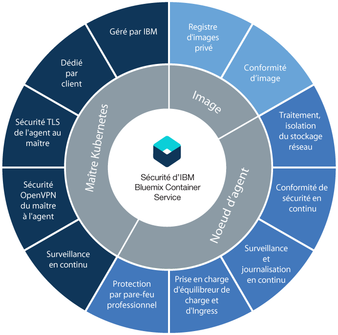

---

copyright:
  years: 2014, 2018
lastupdated: "2018-01-11"

---

{:new_window: target="_blank"}
{:shortdesc: .shortdesc}
{:screen: .screen}
{:pre: .pre}
{:table: .aria-labeledby="caption"}
{:codeblock: .codeblock}
{:tip: .tip}
{:download: .download}

# Sécurité d'{{site.data.keyword.containerlong_notm}}
{: #security}

Vous pouvez utiliser les fonctions de sécurité intégrées pour l'analyse des risques et la protection de la sécurité. Ces fonctions vous aident à protéger l'infrastructure de votre cluster et la communication réseau, à isoler vos ressources de traitement, et à garantir la conformité aux règles de sécurité dans les composants de votre infrastructure et les déploiements de conteneurs.
{: shortdesc}

## Sécurité par composant du cluster
{: #cluster}

Chaque cluster {{site.data.keyword.containerlong_notm}} dispose de fonctions de sécurité intégrées dans son [maître](#master) et ses noeuds [worker](#worker). Si vous disposez d'un pare-feu, avec d'accéder l'équilibrage de charge depuis l'extérieur du cluster, ou désirez exécuter des commandes `kubectl` depuis votre système local lorsque les règles de réseau d'entreprise empêchent l'accès à des noeuds finaux Internet publics, [ouvrez des ports sur votre pare-feu](cs_firewall.html#firewall). Si vous désirez connecter des applications de votre cluster à un réseau sur site ou à d'autres applications externes à votre cluster, [configurez votre connectivité VPN ](cs_vpn.html#vpn).
{: shortdesc}

Dans le diagramme suivant, vous voyez que les fonctions de sécurité sont regroupées par maître Kubernetes, noeuds d'agent et images de conteneur.

  <table summary="La première ligne du tableau s'étend sur deux colonnes. Les autres lignes se lisent de gauche à droite. L'emplacement du serveur figure dans la première colonne et les adresses IP pour concordance dans la seconde colonne.">
  <thead>
  <th colspan=2> Paramètres de sécurité de cluster intégrés dans {{site.data.keyword.containershort_notm}}</th>
  </thead>
  <tbody>
    <tr>
      <td>Maître Kubernetes</td>
      <td>Le maître Kubernetes présent dans chaque cluster est géré par IBM et caractérisé par une haute disponibilité. Il inclut des paramètres de sécurité {{site.data.keyword.containershort_notm}} qui assurent la conformité aux règles de sécurité et une communication sécurisée vers et depuis les noeuds d'agent. Des mises à jour sont effectuées par
IBM chaque fois que nécessaire. Le maître Kubernetes dédié régit et surveille depuis une position centralisée toutes les ressources Kubernetes
dans le cluster. En fonction des exigences du déploiement et de la capacité du cluster, le maître Kubernetes planifie automatiquement le déploiement de vos applications conteneurisées entre les noeuds d'agent disponibles. Pour plus d'informations, voir [Sécurité du maître Kubernetes](#master).</td>
    </tr>
    <tr>
      <td>Noeud worker</td>
      <td>Les conteneurs sont déployés sur des noeuds d'agent dédiés à un cluster et qui assurent l'isolement du traitement, du réseau et du stockage pour les clients IBM. {{site.data.keyword.containershort_notm}} dispose de fonctions de sécurité intégrées pour sécuriser vos noeuds d'agent sur le réseau privé et public et pour garantir la conformité des noeuds d'agent aux règles de sécurité. Pour plus d'informations, voir [Sécurité des noeuds d'agent](#worker). De plus, vous pouvez ajouter des [règles réseau Calico](cs_network_policy.html#network_policies) pour spécifier le trafic réseau que vous voulez autoriser ou bloquer vers et depuis un pod d'un noeud worker. </td>
     </tr>
     <tr>
      <td>Images</td>
      <td>En tant qu'administrateur du cluster, vous pouvez configurer votre propre registre d'images Docker sécurisé dans {{site.data.keyword.registryshort_notm}} pour y stocker et partager avec vos utilisateurs du cluster des images Docker. Pour garantir des déploiements de conteneurs sécurisés, chaque image dans
votre registre privé est analysée par Vulnerability Advisor. Vulnerability Advisor est un composant d'{{site.data.keyword.registryshort_notm}} qui détecte des vulnérabilités potentielles, soumet des recommandations de sécurité et des instructions pour résoudre ces vulnérabilités. Pour plus d'informations, voir [Sécurité des images dans {{site.data.keyword.containershort_notm}}](#images).</td>
    </tr>
  </tbody>
</table>

 

## Maître Kubernetes
{: #master}

Examinez les fonctions de sécurité du maître Kubernetes intégré destinées à
protéger ce dernier et à sécuriser les communications réseau du cluster.
{: shortdesc}

<dl>
  <dt>Maître Kubernetes entièrement géré et dédié</dt>
    <dd>Chaque cluster Kubernetes dans {{site.data.keyword.containershort_notm}} est régi par un maître Kubernetes dédié géré par IBM dans un compte d'infrastructure IBM Cloud (SoftLayer) sous propriété IBM. Le maître Kubernetes est configuré avec les composants dédiés suivants qui ne sont pas partagés avec d'autres clients IBM.
    <ul><li>Magasin  de données etcd : stocke toutes les ressources Kubernetes d'un cluster, telles que services, déploiements et pods. Les éléments Kubernetes ConfigMaps et Secrets sont des données d'application stockées sous forme de paires clé-valeur afin de les utiliser dans une application s'exécutant dans un pod. Les données etcd sont stockées sur un disque géré par IBM et chiffré par TLS lors de leur envoi à un pod pour assurer l'intégrité et la protection des données.</li>
    <li>kube-apiserver : constitue le point d'entrée principal pour toutes les demandes du noeud worker au maître Kubernetes. Le serveur kube-apiserver valide et traite les demandes et a accès en lecture et écriture au magasin de données etcd.</li>
    <li>kube-scheduler : décide où déployer les pods en prenant en compte la capacité du compte et les besoins en performance, les contraintes des règles en matière de matériel et de logiciel, les spécifications d'anti-affinité, et les besoins de la charge de travail. Si aucun noeud worker ne correspond à ces exigences, le pod n'est pas déployé dans le cluster.</li>
    <li>kube-controller-manager : se charge de la surveillance des jeux de répliques et de la création de pods correspondants pour atteindre l'état désiré.</li>
    <li>OpenVPN : composant spécifique à {{site.data.keyword.containershort_notm}} permettant une connectivité réseau sécurisée pour toutes les communications du maître Kubernetes avec les noeuds d'agent.</li></ul></dd>
  <dt>Connectivité réseau TLS sécurisée pour toutes les communications du noeud worker avec le maître Kubernetes</dt>
    <dd>Pour sécuriser les communications réseau vers le maître Kubernetes, {{site.data.keyword.containershort_notm}} génère des certificats TLS qui chiffrent les communications vers et depuis le serveur kube-apiserver et les composant du magasin de données etcd pour chaque cluster. Ces certificats ne sont jamais partagés entre les clusters ou entre les composants du maître Kubernetes.</dd>
  <dt>Connectivité réseau OpenVPN sécurisée pour toutes les communications du maître Kubernetes vers les noeuds d'agent</dt>
    <dd>Bien que Kubernetes sécurise les communications entre le maître Kubernetes et les noeuds d'agent en utilisant le protocole
`https`, aucune authentification n'est fournie par défaut sur le noeud worker. Pour sécuriser ces communications, {{site.data.keyword.containershort_notm}} configure automatiquement une connexion OpenVPN
entre le maître Kubernetes et les noeuds d'agent lors de la création du cluster.</dd>
  <dt>Surveillance continue du réseau maître Kubernetes</dt>
    <dd>Chaque Kubernetes est surveillé en permanence par IBM pour identifier et contrer les attaques de type DOS
(Déni de service) au niveau des processus.</dd>
  <dt>Conformité de sécurité du noeud maître Kubernetes</dt>
    <dd>{{site.data.keyword.containershort_notm}} analyse automatiquement chaque noeud sur lequel le maître Kubernetes est déployé pour détecter des vulnérabilités affectant Kubernetes et identifier les correctifs de sécurité spécifiques au système d'exploitation devant être appliqués pour protection du noeud maître. Si des vulnérabilités sont détectées, {{site.data.keyword.containershort_notm}} applique automatiquement les correctifs appropriés et résout les vulnérabilités pour l'utilisateur.</dd>
</dl>

 

## Noeuds d'agent
{: #worker}

Examinez les fonctions de sécurité de noeud worker intégrées destinées à protéger l'environnement de noeud worker et à assurer l'isolement des ressources, du réseau et du stockage.
{: shortdesc}

<dl>
  <dt>Isolement de l'infrastructure de traitement, réseau et de stockage</dt>
    <dd>Lorsque vous créez un cluster, des machines virtuelles sont allouées par IBM en tant que noeuds d'agent dans le compte d'infrastructure IBM Cloud (SoftLayer) ou dans le compte d'infrastructure IBM Cloud (SoftLayer) dédié. Les noeuds d'agent sont dédiés à un cluster et n'hébergent pas la charge de travail d'autres clusters.
 Chaque compte {{site.data.keyword.Bluemix_notm}} est configuré avec des réseaux locaux virtuels d'infrastructure IBM Cloud (SoftLayer) pour garantir des performances réseau satisfaisantes et l'isolement des noeuds d'agent.
 
Pour rendre persistantes les données dans votre cluster, vous pouvez allouer un stockage de fichiers NFS dédié depuis l'infrastructure IBM Cloud (SoftLayer) et tirer parti des fonctions intégrées de sécurité des données de cette plateforme.
</dd>
  <dt>Noeud worker sécurisé configuré</dt>
    <dd>Chaque noeud worker est configuré avec un système d'exploitation Ubuntu qui ne peut pas être modifié par l'utilisateur. Afin de protéger ce système d'exploitation face aux attaques potentielles, chaque noeud worker est configuré avec des paramètres de pare-feu avancés imposés par les règles iptable de Linux.
 Tous les conteneurs s'exécutant sur Kubernetes sont protégés par des paramètres de règles réseau Calico prédéfinies qui sont configurées sur chaque noeud worker lors de la création du cluster. Cette configuration assure une communication réseau sécurisée entre les noeuds d'agent et les pods. Pour limiter davantage les actions qu'un conteneur peut effectuer sur le noeud worker, les utilisateurs peuvent choisir de configurer des [règles AppArmor ](https://kubernetes.io/docs/tutorials/clusters/apparmor/) sur les noeuds d'agent.

 L'accès SSH est désactivé sur le noeud worker. Si vous souhaitez installer des fonctions supplémentaires sur votre noeud worker, vous pouvez utiliser des [jeux de démons Kubernetes ](https://kubernetes.io/docs/concepts/workloads/controllers/daemonset) pour tout ce que vous voulez exécuter sur chaque noeud worker, ou des [travaux Kubernetes ](https://kubernetes.io/docs/concepts/workloads/controllers/jobs-run-to-completion/) pour les actions ponctuelles que vous devez exécuter.
</dd>
  <dt>Conformité à la sécurité de noeud worker Kubernetes</dt>
    <dd>IBM collabore avec des équipes de conseil en sécurité, internes et externes, pour traiter les vulnérabilités de conformité aux règles de sécurité potentielles. IBM maintient l'accès aux noeuds en vue de déployer des correctifs de sécurité sur le système d'exploitation.
 <b>Important</b> : Redémarrez vos noeuds d'agent régulièrement pour garantir l'installation des mises à jour et des correctifs de sécurité automatiquement déployés dans le système d'exploitation. IBM ne redémarre pas vos noeuds d'agent.
</dd>
  <dt id="encrypted_disks">Disque chiffré</dt>
  <dd>Par défaut, {{site.data.keyword.containershort_notm}} fournit deux partitions de données SSD locales chiffrées pour tous les noeuds worker lorsque ceux-ci sont provisionnés. La première partition n'est pas chiffrée et la seconde partition montée sur _/var/lib/docker_ est déverrouillée à l'aide des clés de chiffrement LUKS. Chaque agent dans chaque cluster Kubernetes dispose de sa propre clé de chiffrement LUKS unique, gérée par {{site.data.keyword.containershort_notm}}. Lorsque vous créez un cluster ou ajoutez un noeud worker à un cluster existant, les clés sont extraites de manière sécurisée, puis ignorées une fois que le disque chiffré a été déverrouillé.
  
<b>Remarque </b>: le chiffrement peut avoir une incidence sur les performances des E-S disque. Dans le cas de charges de travail exigeant de hautes performances des E-S, testez un cluster avec et sans chiffrement activé pour déterminer s'il convient de désactiver le chiffrement.

  </dd>
  <dt>Support pour les pare-feux réseau d'infrastructure IBM Cloud (SoftLayer)</dt>
    <dd>{{site.data.keyword.containershort_notm}} est compatible avec toutes les [offres de pare-feu d'infrastructure IBM Cloud (SoftLayer) ](https://www.ibm.com/cloud-computing/bluemix/network-security). Sur {{site.data.keyword.Bluemix_notm}} Public, vous pouvez mettre en place un pare-feu avec des règles réseau personnalisées afin de promouvoir une sécurité réseau dédiée pour votre cluster et de détecter et de parer à des intrusions réseau. Par exemple, vous pouvez choisir de configurer un [produit Vyatta ](https://knowledgelayer.softlayer.com/topic/vyatta-1) qui agira en tant que pare-feu et bloquera le trafic indésirable. Lorsque vous configurez un pare-feu, [vous devez également ouvrir les adresses IP et les ports requis](cs_firewall.html#firewall) pour chaque région de manière à permettre au maître et aux noeuds d'agent de communiquer.</dd>
  <dt>Gardez privés les services ou exposez sélectivement des services et des applications à l'Internet public</dt>
    <dd>Vous pouvez décider de garder privés vos services et applications et d'exploiter les fonctions de sécurité intégrées décrites dans cette rubrique pour assurer une communication sécurisée entre les noeuds d'agent et les pods. Si vous désirez exposer des services et des applications sur l'Internet public, vous
pouvez exploiter la prise en charge d'Ingress et d'un équilibreur de charge pour rendre
vos services accessibles au public de manière sécurisée.</dd>
  <dt>Connectez de manière sécurisée vos noeuds worker et vos applications à un centre de données sur site</dt>
  <dd>Pour connecter vos noeuds worker et vos applications à un centre de données sus site, vous pouvez configurer un noeud final VPN IPSec avec un service Strongswan ou un dispositif de passerelle Vyatta ou un dispositif Fortigate. <ul><li><b>Service VPN Strongswan IPSec </b>: vous pouvez définir un [service VPN Strongswan IPSec ](https://www.strongswan.org/) connectant de manière sécurisée votre cluster Kubernetes avec un réseau sur site. Le service VPN Strongswan IPSec fournit un canal de communication de bout en bout sécurisé sur Internet basé sur la suite de protocoles IPSec (Internet Protocol Security) aux normes du secteur. Pour configurer une connexion sécurisée entre votre cluster et un réseau sur site, vous devez disposer d'une passerelle IPsec VPN ou d'un serveur d'infrastructure IBM Cloud (SoftLayer) installés sur votre centre de données sur site. Vous pouvez ensuite [configurer et déployer le service Strongswan IPSec VPN](cs_vpn.html#vpn) dans un pod Kubernetes.</li><li><b>Dispositif de passerelle Vyatta ou dispositif Fortigate </b>: si vous disposez d'un cluster plus volumineux, vous pouvez choisir de mettre en place en  dispositif de passerelle Vyatta ou un dispositif Fortigate pour configurer un noeud final IPSec VPN. Pour plus d'informations, reportez-vous à cet article de blogue sur la [Connexion d'un cluster à un centre de données sur site](https://www.ibm.com/blogs/bluemix/2017/07/kubernetes-and-bluemix-container-based-workloads-part4/).</li></ul></dd>
  <dt>Consignation au journal et surveillance en continu de l'activité du cluster</dt>
    <dd>Dans le cas de clusters standard, tous les événements associés au cluster, comme l'ajout d'un noeud worker, la progression d'une mise à jour tournante ou les informations d'utilisation des capacités, peuvent être consignés et surveillés par {{site.data.keyword.containershort_notm}} et envoyés à {{site.data.keyword.loganalysislong_notm}} et à {{site.data.keyword.monitoringlong_notm}}. Pour plus d'informations sur la configuration  de la consignation et de la surveillance, voir [Configuration de journalisation de cluster](/docs/containers/cs_health.html#logging) et [Configuration de la surveillance de cluster](/docs/containers/cs_health.html#monitoring).</dd>
</dl>

 

## Images
{: #images}

Gérez la sécurité et l'intégrité de vos images via des fonctions de sécurité intégrées.
{: shortdesc}

<dl>
<dt>Référentiel d'images Docker privé et sécurisé dans {{site.data.keyword.registryshort_notm}}</dt>
<dd>Vous pouvez mettre en place votre propre registre d'images Docker dans un registre d'images privé, à service partagé, haute disponibilité et évolutif, hébergé et géré par IBM, pour construire, stocker en sécurité et partager entre les utilisateurs du cluster vos images Docker.</dd>

<dt>Conformité de l'image avec les règles de sécurité</dt>
<dd>En utilisant {{site.data.keyword.registryshort_notm}}, vous pouvez
exploiter la fonctionnalité intégrée d'analyse de sécurité offerte par Vulnerability Advisor Chaque image envoyée par commande push à votre espace de nom est automatiquement analysée pour détection de vulnérabilités face à une base de données
de problèmes CentOS, Debian, Red Hat et Ubuntu connus. si des vulnérabilités sont détectées, Vulnerability communique des instructions pour les résoudre et garantir l'intégrité et la sécurité de l'image.</dd>
</dl>

Pour examiner l'évaluation des vulnérabilités de vos images, [consultez la documentation de l'assistant de détection des vulnérabilités](/docs/services/va/va_index.html#va_registry_cli).

 

## Mise en réseau au sein d'un cluster
{: #in_cluster_network}

La communication réseau sécurisée au sein d'un cluster entre des noeuds d'agent et des pods est réalisée via des réseaux locaux virtuels privés (VLAN privés). Un réseau local virtuel configure un groupe de noeuds d'agent et de pods comme s'ils étaient reliés physiquement au même câble.
{:shortdesc}

Lorsque vous créez un cluster, chaque cluster est automatiquement connecté à un VLAN privé. Le réseau local virtuel privé détermine l'adresse IP privée qui est affectée à un noeud worker lors de la création du cluster.

|Type de cluster|Gestionnaire du VLAN privé pour le cluster|
|------------|-------------------------------------------|
|Clusters légers dans {{site.data.keyword.Bluemix_notm}}|{{site.data.keyword.IBM_notm}}|
|Clusters standard dans {{site.data.keyword.Bluemix_notm}}|Vous dans votre compte d'infrastructure IBM Cloud (SoftLayer) 
**Astuce :** Pour avoir accès à tous les VLAN dans votre compte, activez [VLAN Spanning ](https://knowledgelayer.softlayer.com/procedure/enable-or-disable-vlan-spanning).
|

Une adresse IP privée est également affectée à chaque nacelle déployée sur un noeud worker. L'adresse IP affectée aux pods est située sur la plage d'adresses IP privées 172.30.0.0/16 et les pods ne sont utilisés que pour le routage entre les noeuds d'agent. Pour éviter des conflits, n'utilisez pas cette plage d'adresses IP sur des noeuds qui communiqueront avec vos noeuds d'agent. Les noeuds d'agent et les pods peuvent communiquer de manière sécurisée sur le réseau privé en utilisant les adresses IP privées. Toutefois, lorsqu'un pod tombe en panne ou qu'un noeud worker a besoin d'être recréé, une nouvelle adresse IP privée lui est affectée.

Etant donné qu'il est ardu de suivre des adresses IP privées fluctuantes pour des applications devant faire l'objet d'une haute disponibilité, vous pouvez utiliser les fonctionnalités Kubernetes intégrées de reconnaissance de service et exposer des applications en tant que services IP de cluster sur le réseau privé dans le cluster. Un service Kubernetes regroupe un ensemble de pods et procure une connexion réseau vers ces pods pour d'autres services dans le cluster sans exposer l'adresse IP privée réelle de chaque pod. Lorsque vous créez un service IP de cluster, une adresse IP privée lui est affectée à partir de la plage d'adresses privées 10.10.10.0/24. Comme pour la plage d'adresses privées de pods, n'utilisez pas cette plage d'adresses sur des noeuds qui communiqueront avec vos noeuds d'agent. Cette adresse IP n'est accessible que dans le cluster. Vous ne pouvez pas y accéder depuis Internet. En même temps, une entrée de recherche DNS est créée pour le service et stockée dans le composant kube-dns du cluster. L'entrée DNS contient le nom du service, l'espace de nom dans lequel il a été créé et le lien vers l'adresse IP privée de cluster affectée.

Si une application dans le cluster a besoin d'accéder à un pod situé derrière un service IP de cluster, elle peut soit utiliser l'adresse IP privée de cluster qui a été affectée au service, soit envoyer une demande en utilisant le nom du service. Lorsque vous utilisez le nom du service, ce nom est recherché dans le composant kube-dns et la demande est acheminée à l'adresse IP privée de cluster du service. Lorsqu'une demande parvient au service, celui-ci se charge d'envoyer équitablement toutes les demandes aux pods, sans considération de leurs adresses IP privées et du noeud worker sur lequel ils sont déployés.

Pour plus d'informations sur la création d'un service de type IP de cluster, voir [Kubernetes services ](https://kubernetes.io/docs/concepts/services-networking/service/#publishing-services---service-types).
