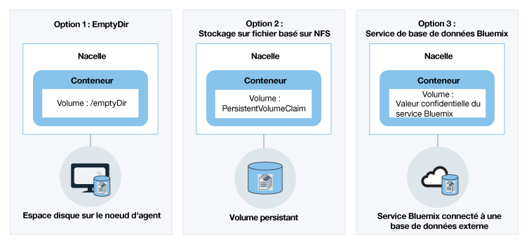
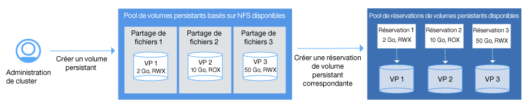

---

copyright:
  years: 2014, 2018
lastupdated: "2018-01-11"

---

{:new_window: target="_blank"}
{:shortdesc: .shortdesc}
{:screen: .screen}
{:pre: .pre}
{:table: .aria-labeledby="caption"}
{:codeblock: .codeblock}
{:tip: .tip}
{:download: .download}


# Sauvegarde des données avec stockage sur volume persistant
{: #planning}

De par sa conception, la durée de vie d'un conteneur est brève. Toutefois, comme illustré dans le digramme suivant, vous disposez de plusieurs options pour rendre persistantes les données en cas de reprise en ligne d'un conteneur et pour partager les données entre les conteneurs.
{:shortdesc}

**Remarque **: si vous utilisez un pare-feu, [autorisez l'accès sortant](cs_firewall.html#pvc) pour les plages IP de l'infrastructure IBM Cloud (SoftLayer) des emplacements (centres de données) où sont situés vos clusters, de manière à pouvoir créer des réservations de volumes persistants.



|Option|Description|
|------|-----------|
|Option 1 : Utiliser `/emptyDir` pour rendre persistantes les données à l'aide de l'espace disque disponible sur le noeud worker<p>Cette fonction est disponible pour les clusters léger et standard.</p>|Avec cette option, vous pouvez créer un volume vide sur l'espace disque du noeud worker affecté à un pod. Le conteneur dans cette nacelle peut lire et écrire sur ce volume. Comme le volume est affecté à un pod spécifique, les données ne peuvent pas être partagées avec d'autres pods dans un jeu de répliques.<p>Un volume `/emptyDir` et ses données sont supprimés lorsque le pod affecté est supprimé définitivement du noeud worker.</p><p>**Remarque :** si le conteneur à l'intérieur du pod tombe en panne, les données du volume restent disponibles sur le noeud worker.</p><p>Pour plus d'informations, voir [Volumes Kubernetes ](https://kubernetes.io/docs/concepts/storage/volumes/).</p>|
|Option 2 : Créer une réservation de volume persistant pour provisionner un stockage persistant basé NFS pour votre déploiement<p>Cette fonction n'est disponible que pour les clusters standard.</p>|<p>Avec cette option, vous pouvez disposer d'un stockage persistant des données d'application et de conteneurs via des volumes persistants. Les volumes sont hébergés sur un [stockage de fichiers Endurance and Performance basé NFS ](https://www.ibm.com/cloud/file-storage/details). Le stockage de fichiers est chiffré au repos et vous pouvez créer des répliques des données stockées.</p> <p>Vous devez créer une [réservation de volume persistant](cs_storage.html) pour déclencher un demande de stockage basé NFS. {{site.data.keyword.containershort_notm}} fournit des classes de stockage prédéfinies qui définissent les plages de taille de stockage, les opérations IOPS, la règle de suppression et les autorisations d'accès en écriture au volume. Vous pouvez choisir entre ces classes de stockage lorsque vous créez votre réservation de volume persistant. Après que vous ayez soumis une demande de volume persistant, {{site.data.keyword.containershort_notm}} provisionne dynamiquement un volume persistant hébergé sur le stockage de fichiers NFS. [Vous pouvez monter la réservation de volume persistant](cs_storage.html#create) en tant que volume sur votre déploiement pour permettre aux conteneurs d'accéder en lecture et écriture au volume. Les volumes persistant peuvent être partagés à travers le même jeu de répliques ou avec d'autres déploiements dans le même cluster.</p><p>Lorsqu'un conteneur tombe en panne ou qu'un pod est retiré d'un noeud worker, les données ne sont pas supprimées et sont toujours accessibles par d'autres déploiements qui montent le volume. Les réservations de volume persistant sont hébergées sur un stockage permanent, mais il n'existe aucune sauvegarde correspondante. Si vous avez besoin d'une sauvegarde de vos données, créez manuellement une copie de sauvegarde.</p><p>**Remarque :** le stockage de partages de fichiers NFS persistants est facturé sur une base mensuelle. Si vous provisionnez un stockage persistant pour votre cluster et le retirez immédiatement, vous devrez néanmoins payer la redevance mensuelle pour le stockage persistant, même si vous ne l'avez utilisé que très brièvement.</p>|
|Option 3 : Lier un service de base de données {{site.data.keyword.Bluemix_notm}} à votre pod<p>Cette fonction est disponible pour les clusters léger et standard.</p>|Avec cette option, vous pouvez rendre persistantes les données et y accéder à l'aide d'un service cloud de base de données {{site.data.keyword.Bluemix_notm}}. Lorsque vous liez le service {{site.data.keyword.Bluemix_notm}} à un espace de nom dans votre cluster, une valeur confidentielle Kubernetes est créée. Cette valeur contient des informations confidentielles sur le service, comme son URL, votre nom d'utilisateur et mot de passe. Vous pouvez monter le volume en tant que volume secret sur votre pod et accéder au service en utilisant les données d'identification dans la valeur confidentielle. En montant le volume sur sur d'autres pods, vous pouvez également partager les données entre les pods.<p>Lorsqu'un conteneur tombe en panne ou qu'un pod est retiré d'un noeud worker, les données ne sont pas perdues et restent accessibles aux autres pods qui montent le volume secret.</p><p>La plupart des services de base de données {{site.data.keyword.Bluemix_notm}} proposent un espace disque gratuit pour une petite quantité de données, de sorte que vous pouvez tester ses caractéristiques.</p><p>Pour plus d'informations sur la liaison d'un service {{site.data.keyword.Bluemix_notm}} à un pod, voir [Ajout de services {{site.data.keyword.Bluemix_notm}} à des applications dans {{site.data.keyword.containershort_notm}}](cs_integrations.html#adding_app).</p>|
{: caption="Table. Options de stockage persistant pour les déploiements dans des clusters Kubernetes" caption-side="top"}

<br />


## Utilisation de partages de fichiers NFS existants dans des clusters
{: #existing}

Si vous disposez déjà de partages de fichiers NFS existants dans votre compte d'infrastructure IBM Cloud (SoftLayer) et que vous voulez les utiliser avec Kubernetes, créez alors des volumes persistants sur votre partage de fichiers NFS existant. Un volume persistant est un élément matériel réel qui fait office de ressource de cluster Kubernetes et peut être consommé par l'utilisateur du cluster.
{:shortdesc}

Kubernetes fait une distinction entre les volumes persistants qui représentent le matériel effectif et les réservations de volume persistant qui sont des demandes de stockage déclenchées habituellement par l'utilisateur du cluster. Le diagramme suivant illustre la relation entre des volumes persistants et des réservations de volume persistant persistent volume.



 Comme illustré dans le diagramme, pour permettre l'utilisation de partage de fichiers NLS existants avec Kubernetes, vous devez créer des volumes persistants d'une certaine taille et avec un mode d'accès déterminé,
qui soient conformes à la spécification de volume persistant. Si le volume persistant et la réservation de volume persistant correspondent, ils sont liés l'un à l'autre. Seules les réservations de volume persistant liées peuvent être utilisées par l'utilisateur du cluster pour monter le
volume sur un déploiement. Cette procédure est dénommée provisionnement statique de stockage persistant.

Avant de commencer, vérifiez que vous disposez d'un partage de fichiers NFS existant que vous pouvez utiliser pour créer votre volume persistant.

**Remarque :** le provisionnement statique de stockage persistant ne s'applique qu'aux partages de fichiers NFS existants. Si vous ne disposez pas de partages de fichiers
NFS existants, les utilisateurs du cluster peuvent utiliser la procédure de [provisionnement dynamique](cs_storage.html#create) pour ajouter des volumes persistants.

Pour créer un volume persistant et une réservation correspondante, procédez comme suit.

1.  Dans votre compte d'infrastructure IBM Cloud (SoftLayer), recherchez l'ID et le chemin du partage NFS où vous désirez créer votre objet de volume persistant. Par ailleurs, autorisez le stockage de fichiers sur les sous-réseaux du cluster. Cette autorisation permet à votre cluster d'accéder au stockage.
    1.  Connectez-vous à votre compte d'infrastructure IBM Cloud (SoftLayer).
    2.  Cliquez sur **Stockage**.
    3.  Cliquez sur **Stockage de fichiers** et, dans le menu **Actions**, sélectionnez **Autoriser l'hôte**.
    4.  Cliquez sur **Sous-réseaux**. Après l'autorisation, chaque noeud worker sur le sous-réseau a accès au stockage de fichiers.
    5.  Sélectionnez dans le menu le sous-réseau du VLAN public de votre cluster et cliquez sur **Soumettre**. Si vous devez identifier le sous-réseau, exécutez la commande `bx cs cluster-get <cluster_name> --showResources`.
    6.  Cliquez sur le nom du stockage de fichiers.
    7.  Notez la valeur de la zone **Point de montage**. Cette zone est affichée sous la forme `<server>:/<path>`.
2.  Créez un fichier de configuration de stockage pour votre volume persistant. Incluez le serveur et le chemin de la zone**Point de montage** du système de fichiers.

    ```
    apiVersion: v1
    kind: PersistentVolume
    metadata:
     name: mypv
    spec:
     capacity:
       storage: "20Gi"
     accessModes:
       - ReadWriteMany
     nfs:
       server: "nfslon0410b-fz.service.networklayer.com"
       path: "/IBM01SEV8491247_0908"
    ```
    {: codeblock}

    <table>
    <caption>Table. Description des composants du fichier YAML</caption>
    <thead>
    <th colspan=2> Description des composants du fichier YAML</th>
    </thead>
    <tbody>
    <tr>
    <td><code>name</code></td>
    <td>Entrez le nom de l'objet de volume persistant que vous désirez créer.</td>
    </tr>
    <tr>
    <td><code>stockage</code></td>
    <td>Entrez la taille de stockage du partage de fichiers NFS existant. Cette taille doit être indiquée en gigaoctets, par exemple 20Gi (20 Go) ou 1000Gi (1 To), et correspondre à celle du partage de fichiers existant.</td>
    </tr>
    <tr>
    <td><code>accessMode</code></td>
    <td>Les modes d'accès définissent la manière dont une réservation de volume persistant peut être montée sur un noeud worker.<ul><li>ReadWriteOnce (RWO): le volume persistant ne peut être monté sur des déploiements que dans un seul noeud worker. Les conteneurs dans des déploiements montés sur ce volume persistant peuvent accéder en lecture et en écriture au volume.</li><li>ReadOnlyMany (ROX) : le volume persistant peut être monté sur des déploiements hébergés sur plusieurs noeuds worker. Les déploiements montés sur ce volume persistant ne peuvent accéder au volume qu'en lecture.</li><li>ReadWriteMany (RWX) : ce volume persistant peut être monté sur des déploiements hébergés sur plusieurs noeuds worker. Les déploiements montés sur ce volume persistant peuvent accéder en lecture et en écriture au volume.</li></ul></td>
    </tr>
    <tr>
    <td><code>server</code></td>
    <td>Entrez l'ID du serveur du partage de fichiers NFS.</td>
    </tr>
    <tr>
    <td><code>path</code></td>
    <td>Entrez le chemin du partage de fichiers NFS où vous désirez créer l'objet de volume persistant.</td>
    </tr>
    </tbody></table>

3.  Créez le volume persistent dans votre cluster.

    ```
    kubectl apply -f <yaml_path>
    ```
    {: pre}

    Exemple

    ```
    kubectl apply -f deploy/kube-config/pv.yaml
    ```
    {: pre}

4.  Vérifiez que le volume persistant a été créé.

    ```
    kubectl get pv
    ```
    {: pre}

5.  Créez un autre fichier de configuration pour créer votre réservation de volume persistant. Pour que la réservation de volume persistant corresponde à l'objet de volume persistant créé auparavant, vous devez sélectionner la même valeur pour `storage` et pour `accessMode`. La zone `storage-class` doit être vide. Si l'une de ces zones ne correspond pas au volume persistant, un nouveau volume persistant est créé automatiquement à la place.

    ```
    kind: PersistentVolumeClaim
    apiVersion: v1
    metadata:
     name: mypvc
     annotations:
       volume.beta.kubernetes.io/storage-class: ""
    spec:
     accessModes:
       - ReadWriteMany
     resources:
       requests:
         storage: "20Gi"
    ```
    {: codeblock}

6.  Créez votre réservation de volume persistant.

    ```
    kubectl apply -f deploy/kube-config/mypvc.yaml
    ```
    {: pre}

7.  Vérifiez que votre réservation de volume persistant a été créée et liée à l'objet de volume persistant. Ce processus peut prendre quelques minutes.

    ```
    kubectl describe pvc mypvc
    ```
    {: pre}

    Votre sortie sera similaire à ceci.

    ```
    Name: mypvc
    Namespace: default
    StorageClass: ""
    Status: Bound
    Volume: pvc-0d787071-3a67-11e7-aafc-eef80dd2dea2
    Labels: <none>
    Capacity: 20Gi
    Access Modes: RWX
    Events:
      FirstSeen LastSeen Count From        SubObjectPath Type Reason Message
      --------- -------- ----- ----        ------------- -------- ------ -------
      3m 3m 1 {ibm.io/ibmc-file 31898035-3011-11e7-a6a4-7a08779efd33 } Normal Provisioning External provisioner is provisioning volume for claim "default/my-persistent-volume-claim"
      3m 1m  10 {persistentvolume-controller } Normal ExternalProvisioning cannot find provisioner "ibm.io/ibmc-file", expecting that a volume for the claim is provisioned either manually or via external software
      1m 1m 1 {ibm.io/ibmc-file 31898035-3011-11e7-a6a4-7a08779efd33 } Normal ProvisioningSucceeded Successfully provisioned volume pvc-0d787071-3a67-11e7-aafc-eef80dd2dea2
    ```
    {: screen}


Vous avez créé correctement un objet de stockage persistant et l'avez lié à une réclamation de volume
persistant. Les utilisateurs du cluster peuvent à présent [monter la réservation de volume persistant](#app_volume_mount) sur leurs déploiements et lancer une lecture et une écriture sur l'objet de volume persistant.

<br />


## Création d'un stockage persistant pour les applications
{: #create}

Créez une réservation de volume persistant (pvc) pour mettre à disposition un stockage de fichiers NFS pour votre cluster. Montez ensuite cette réservation sur un déploiement afin de garantir la disponibilité des données même en cas de panne ou d'arrêt des pods.
{:shortdesc}

Le stockage de fichiers NFS où est sauvegardé le volume persistant est mis en cluster par IBM pour une haute disponibilité de vos données.

1.  Examinez les classes de stockage disponibles. {{site.data.keyword.containerlong}} fournit huit classes de stockage prédéfinies afin que l'administrateur du cluster n'ait pas besoin d'en créer. La classe de stockage `ibmc-file-bronze` est identique à la classe de stockage `default`.

    ```
    kubectl get storageclasses
    ```
    {: pre}

    ```
    $ kubectl get storageclasses
    NAME                         TYPE
    default                      ibm.io/ibmc-file   
    ibmc-file-bronze (default)   ibm.io/ibmc-file   
    ibmc-file-custom             ibm.io/ibmc-file
    ibmc-file-gold               ibm.io/ibmc-file   
    ibmc-file-retain-bronze      ibm.io/ibmc-file   
    ibmc-file-retain-custom      ibm.io/ibmc-file   
    ibmc-file-retain-gold        ibm.io/ibmc-file   
    ibmc-file-retain-silver      ibm.io/ibmc-file   
    ibmc-file-silver             ibm.io/ibmc-file
    ```
    {: screen}

2.  Déterminez si vous souhaitez sauvegarder vos données et le partage de fichiers NFS après avoir supprimé la réservation de volume persistant (pvc). Pour conserver vos données, choisissez une classe de stockage `retain`. Si vous souhaitez que les données et votre partage de fichiers soient supprimés en même temps que la réservation pvc, choisissez une classe de stockage sans `retain`.

3.  Examinez les opérations d'entrée-sortie par seconde (IOPS) d'une classe de stockage et les tailles de stockage disponibles.

    - Les classes de stockage de bronze, argent et or utilisent un stockage [Endurance ](https://knowledgelayer.softlayer.com/topic/endurance-storage) avec 1 IOPS définie par Go pour chaque classe. Le nombre total d'opérations IOPS dépend de la taille du stockage. Par exemple, 1000Gi pvc à 4 IOPS par Go donne un total de 4000 IOPS.

      ```
      kubectl describe storageclasses ibmc-file-silver
      ```
      {: pre}

      La zone **parameters** indique le nombre d'IOPS per Go associé à la classe de stockage et les tailles disponibles (en Go).

      ```
      Parameters:	iopsPerGB=4,sizeRange=20Gi,40Gi,80Gi,100Gi,250Gi,500Gi,1000Gi,2000Gi,4000Gi,8000Gi,12000Gi
      ```
      {: screen}

    - Les classes de stockage personnalisées utilisent du [stockage de type Performance ](https://knowledgelayer.softlayer.com/topic/performance-storage) et disposent d'options discrètes pour la taille et le nombre total d'IOPS.

      ```
      kubectl describe storageclasses ibmc-file-retain-custom
      ```
      {: pre}

      La zone **parameters** indique le nombre d'IOPS associé à la classe de stockage et les tailles disponibles en gigaoctets. Par exemple, 40Gi pvc peut sélectionner un nombre d'IOPS multiple de 100 compris entre 100 et 2000 IOPS.

      ```
      Parameters:	Note=IOPS value must be a multiple of 100,reclaimPolicy=Retain,sizeIOPSRange=20Gi:[100-1000],40Gi:[100-2000],80Gi:[100-4000],100Gi:[100-6000],1000Gi[100-6000],2000Gi:[200-6000],4000Gi:[300-6000],8000Gi:[500-6000],12000Gi:[1000-6000]
      ```
      {: screen}

4.  Créez un fichier de configuration pour définir votre réservation de volume persistant et enregistrer la configuration dans un fichier `.yaml`.

    Exemple pour les classes de type bronze, silver et gold :

    ```
    apiVersion: v1
    kind: PersistentVolumeClaim
    metadata:
      name: <pvc_name>
      annotations:
        volume.beta.kubernetes.io/storage-class: "ibmc-file-silver"
    spec:
      accessModes:
        - ReadWriteMany
      resources:
        requests:
          storage: 20Gi
    ```
    {: codeblock}

    Exemple pour les classes personnalisées :

    ```
    apiVersion: v1
    kind: PersistentVolumeClaim
    metadata:
      name: <pvc_name>
      annotations:
        volume.beta.kubernetes.io/storage-class: "ibmc-file-retain-custom"
    spec:
      accessModes:
        - ReadWriteMany
      resources:
        requests:
          storage: 40Gi
          iops: "500"
    ```
    {: codeblock}

    <table>
    <thead>
    <th colspan=2> Description des composants du fichier YAML</th>
    </thead>
    <tbody>
    <tr>
    <td><code>metadata/name</code></td>
    <td>Entrez le nom de la réservation de volume persistant.</td>
    </tr>
    <tr>
    <td><code>metadata/annotations</code></td>
    <td>Indiquez la classe de stockage pour le volume persistant :
      <ul>
      <li>ibmc-file-bronze / ibmc-file-retain-bronze : 2 IOPS par Go.</li>
      <li>ibmc-file-silver / ibmc-file-retain-silver : 4 IOPS par Go.</li>
      <li>ibmc-file-gold / ibmc-file-retain-gold : 10 IOPS par Go.</li>
      <li>ibmc-file-custom / ibmc-file-retain-custom : Plusieurs valeurs d'IOPS disponibles.

    </li> Si vous ne spécifiez pas de classe de stockage, le volume persistant est créé avec la classe de stockage bronze.</td>
    </tr>
    <tr>
    <td><code>spec/accessModes</code>
    <code>resources/requests/storage</code></td>
    <td>Si vous choisissez une taille autre que celle qui est répertoriée, cette taille est arrondie vers le haut. Si vous choisissez une taille supérieure à la taille maximale, cette taille est arrondie au-dessous.</td>
    </tr>
    <tr>
    <td><code>spec/accessModes</code>
    <code>resources/requests/iops</code></td>
    <td>Cette option est applicable uniquement à ibmc-file-custom / ibmc-file-retain-custom. Indiquez le nombre total d'IOPS pour le stockage. Exécutez la commande `kubectl describe storageclasses ibmc-file-custom` pour voir toutes les options. Si vous choisissez une valeur IOPS autre que celle répertoriée, la valeur IOPS est arrondie à la valeur supérieure.</td>
    </tr>
    </tbody></table>

5.  Créez la réservation de volume persistant.

    ```
    kubectl apply -f <local_file_path>
    ```
    {: pre}

6.  Vérifiez que votre réservation de volume persistant a été créée et liée au volume persistant. Ce processus peut prendre quelques minutes.

    ```
    kubectl describe pvc <pvc_name>
    ```
    {: pre}

    Votre sortie sera similaire à ceci.

    ```
    Name:  <pvc_name>
    Namespace: default
    StorageClass: ""
    Status:  Bound
    Volume:  pvc-0d787071-3a67-11e7-aafc-eef80dd2dea2
    Labels:  <none>
    Capacity: 20Gi
    Access Modes: RWX
    Events:
      FirstSeen LastSeen Count From        SubObjectPath Type  Reason   Message
      --------- -------- ----- ----        ------------- -------- ------   -------
      3m  3m  1 {ibm.io/ibmc-file 31898035-3011-11e7-a6a4-7a08779efd33 }   Normal  Provisioning  External provisioner is provisioning volume for claim "default/my-persistent-volume-claim"
      3m  1m  10 {persistentvolume-controller }       Normal  ExternalProvisioning cannot find provisioner "ibm.io/ibmc-file", expecting that a volume for the claim is provisioned either manually or via external software
      1m  1m  1 {ibm.io/ibmc-file 31898035-3011-11e7-a6a4-7a08779efd33 }   Normal  ProvisioningSucceeded Successfully provisioned volume pvc-0d787071-3a67-11e7-aafc-eef80dd2dea2

    ```
    {: screen}

6.  {: #app_volume_mount}Pour monter la réservation de volume persistant sur votre déploiement, créez un fichier de configuration. Enregistrez la configuration sous forme de fichier `.yaml`.

    ```
    apiVersion: extensions/v1beta1
    kind: Deployment
    metadata:
     name: <deployment_name>
    replicas: 1
    template:
     metadata:
       labels:
         app: <app_name>
    spec:
     containers:
     - image: <image_name>
       name: <container_name>
       volumeMounts:
       - mountPath: /<file_path>
         name: <volume_name>
     volumes:
     - name: <volume_name>
       persistentVolumeClaim:
         claimName: <pvc_name>
    ```
    {: codeblock}

    <table>
    <thead>
    <th colspan=2> Description des composants du fichier YAML</th>
    </thead>
    <tbody>
    <tr>
    <td><code>metadata/name</code></td>
    <td>Nom du déploiement.</td>
    </tr>
    <tr>
    <td><code>template/metadata/labels/app</code></td>
    <td>Libellé du déploiement.</td>
    </tr>
    <tr>
    <td><code>volumeMounts/mountPath</code></td>
    <td>Chemin absolu du répertoire où est monté le volume dans le déploiement.</td>
    </tr>
    <tr>
    <td><code>volumeMounts/name</code></td>
    <td>Nom du volume à monter sur votre déploiement.</td>
    </tr>
    <tr>
    <td><code>volumes/name</code></td>
    <td>Nom du volume à monter sur votre déploiement. Généralement, ce nom est identique à <code>volumeMounts/name</code>.</td>
    </tr>
    <tr>
    <td><code>volumes/name/persistentVolumeClaim</code></td>
    <td>Nom de la réservation de volume persistant que vous souhaitez utiliser pour votre volume. Lorsque vous montez le volume sur le déploiement, Kubernetes identifie le volume persistant lié à la réservation de volume persistant et permet à l'utilisateur d'accéder en lecture et écriture au volume persistant.</td>
    </tr>
    </tbody></table>

8.  Créez le déploiement et montez la réservation de volume persistant.

    ```
    kubectl apply -f <local_yaml_path>
    ```
    {: pre}

9.  Vérifiez que le montage du volume a abouti.

    ```
    kubectl describe deployment <deployment_name>
    ```
    {: pre}

    Le point de montage est indiqué dans la zone **Volume Mounts** et le volume est indiqué dans la zone **Volumes**.

    ```
     Volume Mounts:
          /var/run/secrets/kubernetes.io/serviceaccount from default-token-tqp61 (ro)
          /volumemount from myvol (rw)
    ...
    Volumes:
      myvol:
        Type: PersistentVolumeClaim (a reference to a PersistentVolumeClaim in the same namespace)
        ClaimName: mypvc
        ReadOnly: false

    ```
    {: screen}

<br />


## Ajout d'un accès d'utilisateur non root au stockage persistant
{: #nonroot}

Les utilisateurs non root ne disposent pas du droit d'accès en écriture sur le chemin de montage du volume pour le stockage NFS. Pour le leur octroyer, vous devez éditer le fichier
Dockerfile de l'image afin de créer sur le chemin de montage un répertoire avec le droit d'accès approprié.
{:shortdesc}

Avant de commencer, [ciblez avec votre interface de ligne de commande](cs_cli_install.html#cs_cli_configure) votre cluster.

Si vous concevez une application avec un utilisateur non root devant disposer du droit d'accès en écriture sur le
volume, vous devez ajouter les processus suivants à votre Dockerfile et un script de point d'entrée :

-   Créez un utilisateur non root
-   Ajoutez temporairement cet utilisateur au groupe root.
-   Créez sur le chemin de montage du volume un répertoire avec les droits d'accès utilisateur appropriés.

Pour {{site.data.keyword.containershort_notm}}, le propriétaire par défaut du chemin de montage du volume est le propriétaire `nobody`. Avec le stockage NFS, si le propriétaire n'existe pas localement dans le pod, l'utilisateur `nobody` est créé. Les volumes sont configurés pour
reconnaître l'utilisateur root dans le conteneur, or, pour certaines applications, il s'agit du seul utilisateur au sein d'un conteneur. Cependant, certaines applications spécifient un utilisateur non root autre que `nobody` qui écrit des données sur le chemin de montage du conteneur. Certaines applications spécifient que le volume doit appartenir à l'utilisateur root. En général, les applications n'utilisent pas l'utilisation root pour des raisons de sécurité. Toutefois, si votre application nécessite un utilisateur root, vous pouvez contacter le [support {{site.data.keyword.Bluemix_notm}} ](/docs/support/index.html#contacting-support) pour une assistance.


1.  Créez un fichier Dockerfile sous un répertoire local. L'exemple Dockerfile suivant crée un utilisateur non root nommé `myguest`.

    ```
    FROM registry.<region>.bluemix.net/ibmnode:latest

    # Create group and user with GID & UID 1010.
    # In this case your are creating a group and user named myguest.
    # The GUID and UID 1010 is unlikely to create a conflict with any existing user GUIDs or UIDs in the image.
    # The GUID and UID must be between 0 and 65536. Otherwise, container creation fails.
    RUN groupadd --gid 1010 myguest
    RUN useradd --uid 1010 --gid 1010 -m --shell /bin/bash myguest

    ENV MY_USER=myguest

    COPY entrypoint.sh /sbin/entrypoint.sh
    RUN chmod 755 /sbin/entrypoint.sh

    EXPOSE 22
    ENTRYPOINT ["/sbin/entrypoint.sh"]
    ```
    {: codeblock}

2.  Créez le script de point d'entrée dans le même dossier local que le fichier Dockerfile. Cet exemple de script de point d'entrée spécifie
`/mnt/myvol` comme chemin de montage du volume.

    ```
    #!/bin/bash
    set -e

    # This is the mount point for the shared volume.
    # By default the mount point is owned by the root user.
    MOUNTPATH="/mnt/myvol"
    MY_USER=${MY_USER:-"myguest"}

    # This function creates a subdirectory that is owned by
    # the non-root user under the shared volume mount path.
    create_data_dir() {
      #Add the non-root user to primary group of root user.
      usermod -aG root $MY_USER

      # Provide read-write-execute permission to the group for the shared volume mount path.
      chmod 775 $MOUNTPATH

      # Create a directory under the shared path owned by non-root user myguest.
      su -c "mkdir -p ${MOUNTPATH}/mydata" -l $MY_USER
      su -c "chmod 700 ${MOUNTPATH}/mydata" -l $MY_USER
      ls -al ${MOUNTPATH}

      # For security, remove the non-root user from root user group.
      deluser $MY_USER root

      # Change the shared volume mount path back to its original read-write-execute permission.
      chmod 755 $MOUNTPATH
      echo "Created Data directory..."
    }

    create_data_dir

    # This command creates a long-running process for the purpose of this example.
    tail -F /dev/null
    ```
    {: codeblock}

3.  Connectez-vous à {{site.data.keyword.registryshort_notm}}.

    ```
    bx cr login
    ```
    {: pre}

4.  Générez l'image sur votre poste local. N'oubliez pas de remplacer _&lt;my_namespace&gt;_ par l'espace de nom de votre registre d'images privées. Exécutez la commande `bx cr namespace-get` si vous avez besoin d'identifier votre espace de nom.

    ```
    docker build -t registry.<region>.bluemix.net/<my_namespace>/nonroot .
    ```
    {: pre}

5.  Envoyez l'image par commande push à votre espace de nom dans {{site.data.keyword.registryshort_notm}} .

    ```
    docker push registry.<region>.bluemix.net/<my_namespace>/nonroot
    ```
    {: pre}

6.  Créez une réservation de volume persistant en créant un fichier de configuration `.yaml`. Cet exemple utilise une classe de stockage aux performances plus faibles. Exécutez la commande `kubectl get storageclasses` pour afficher les classes de stockage disponibles.

    ```
    apiVersion: v1
    kind: PersistentVolumeClaim
    metadata:
      name: mypvc
      annotations:
        volume.beta.kubernetes.io/storage-class: "ibmc-file-bronze"
    spec:
      accessModes:
        - ReadWriteMany
      resources:
        requests:
          storage: 20Gi
    ```
    {: codeblock}

7.  Créez la réservation de volume persistant.

    ```
    kubectl apply -f <local_file_path>
    ```
    {: pre}

8.  Créez un fichier de configuration pour monter le volume et exécutez le pod à partir de l'image non root. Le chemin de montage de volume `/mnt/myvol` correspond au chemin de montage spécifié dans le fichier Dockerfile. Enregistrez la configuration sous forme de fichier `.yaml`.

    ```
    apiVersion: v1
    kind: Pod
    metadata:
     name: mypod
    spec:
     containers:
     - image: registry.<region>.bluemix.net/<my_namespace>/nonroot
       name: mycontainer
       volumeMounts:
       - mountPath: /mnt/myvol
         name: myvol
     volumes:
     - name: myvol
       persistentVolumeClaim:
         claimName: mypvc
    ```
    {: codeblock}

9.  Créez la nacelle et montez la réservation de volume persistant sur la nacelle.

    ```
    kubectl apply -f <local_yaml_path>
    ```
    {: pre}

10. Vérifiez que le montage du volume sur votre nacelle a abouti.

    ```
    kubectl describe pod mypod
    ```
    {: pre}

    Le point de montage du volume est indiqué dans la zone **Volume Mounts** et le volume est répertorié dans la zone **Volumes**.

    ```
     Volume Mounts:
          /var/run/secrets/kubernetes.io/serviceaccount from default-token-tqp61 (ro)
          /mnt/myvol from myvol (rw)
    ...
    Volumes:
      myvol:
        Type: PersistentVolumeClaim (a reference to a PersistentVolumeClaim in the same namespace)
        ClaimName: mypvc
        ReadOnly: false

    ```
    {: screen}

11. Connectez-vous au pod une fois qu'il est lancé.

    ```
    kubectl exec -it mypod /bin/bash
    ```
    {: pre}

12. Affichez les droits d'accès au chemin de montage de votre volume.

    ```
    ls -al /mnt/myvol/
    ```
    {: pre}

    ```
    root@instance-006ff76b:/# ls -al /mnt/myvol/
    total 12
    drwxr-xr-x 3 root    root    4096 Jul 13 19:03 .
    drwxr-xr-x 3 root    root    4096 Jul 13 19:03 ..
    drwx------ 2 myguest myguest 4096 Jul 13 19:03 mydata
    ```
    {: screen}

    Cette sortie indique que l'utilisateur root dispose des droits d'accès en lecture, écriture et exécution sur le chemin de montage du volume
`mnt/myvol/`, tandis que l'utilisateur non root myguest dispose des droits d'accès en lecture et écriture sur le dossier `mnt/myvol/mydata`. Grâce
à la mise à jour de ces droits d'accès, l'utilisateur non root peut à présent écrire des données sur le volume persistant.


