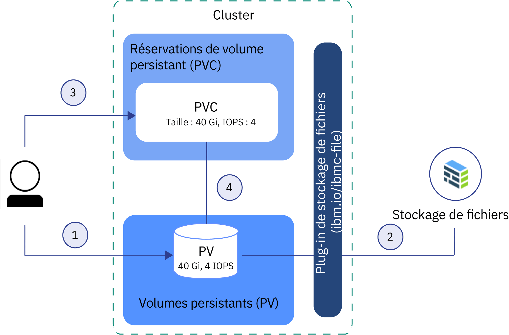

---

copyright:
  years: 2014, 2018
lastupdated: "2018-10-25"

---

{:new_window: target="_blank"}
{:shortdesc: .shortdesc}
{:screen: .screen}
{:pre: .pre}
{:table: .aria-labeledby="caption"}
{:codeblock: .codeblock}
{:tip: .tip}
{:download: .download}


# Description des concepts de base du stockage Kubernetes
{: #kube_concepts}

## Volumes persistants et réservations de volume persistant
{: #pvc_pv}

Avant de commencer à mettre à disposition du stockage, il est important de connaître les concepts Kubernetes de volume persistant et de réservation de volume persistant et de savoir comment ils interagissent dans un cluster. 
{: shortdesc}

L'image suivante présente les composants de stockage dans un cluster Kubernetes. 


- **Cluster**</br> Par défaut, chaque cluster est configuré avec un plug-in pour [mettre à disposition du stockage de fichiers](cs_storage_file.html#add_file). Vous pouvez opter pour l'installation d'autres modules complémentaires, tels que celui destiné au [stockage par blocs](cs_storage_block.html). Pour utiliser du stockage dans un cluster, vous devez créer une réservation de volume persistant et une instance de stockage physique. Lorsque vous supprimez le cluster, vous pouvez éventuellement supprimer les instances de stockage associées.
- **Application**</br> Pour effectuer des opérations de lecture/écriture dans votre instance de stockage, vous devez monter la réservation de volume persistant (PVC) sur votre application. Les différents types de stockage disposent de règles de lecture-écriture différentes. Par exemple, vous pouvez monter plusieurs pods sur la même PVC pour le stockage de fichiers. Le stockage par blocs est fourni avec un mode d'accès RWO (ReadWriteOnce) de sorte que vous puissiez monter le stockage sur un seul pod. 
- **Réservation de volume persistant (PVC)** </br> Une PVC est une demande permettant de mettre à disposition du stockage avec un type et une configuration spécifiques. Pour spécifier le modèle de stockage persistant que vous souhaitez, vous utilisez des [classes de stockage Kubernetes](#storageclasses). L'administrateur du cluster peut définir des classes de stockage ou vous pouvez effectuer une sélection parmi les classes de stockage prédéfinies dans {{site.data.keyword.containerlong_notm}}. Lorsque vous créez une PVC, la demande est envoyée à {{site.data.keyword.Bluemix}} Storage Provider. En fonction de la configuration définie dans la classe de stockage, l'unité de stockage physique est commandée et mise à disposition dans votre compte d'infrastructure IBM Cloud (SoftLayer). Si la configuration demandée n'existe pas, le stockage n'est pas créé. 
- **Volume persistant (PV)** </br> Un PV est une instance de stockage virtuel qui est ajoutée sous forme de volume dans le cluster. Le PV pointe vers une unité de stockage physique dans votre compte d'infrastructure IBM Cloud (SoftLayer) et abstrait l'API qui est utilisée pour communiquer avec l'unité de stockage. Pour monter un volume persistant (PV) sur une application vous devez disposer d'une réservation de volume persistant (PVC) correspondante. Les PV montés apparaissent dans un dossier au sein du système de fichiers du conteneur. 
- **Stockage physique** </br> Instance de stockage physique que vous pouvez utiliser pour conserver vos données. {{site.data.keyword.containerlong_notm}} offre la haute disponibilité aux instances de stockage physique. Cependant, les données stockées sur une instance de stockage physique ne sont pas sauvegardées automatiquement. En fonction du type de stockage que vous utilisez, il existe différentes méthodes de configuration des solutions de sauvegarde et de restauration. 

Pour en savoir plus sur comment créer et utiliser des PVC, des PV et l'unité de stockage physique, voir : 
- [Provisionnement dynamique](#dynamic_provisioning)
- [Provisionnement statique](#static_provisioning) 

## Provisionnement dynamique
{: #dynamic_provisioning}

Utilisez le provisionnement dynamique pour donner aux développeurs la liberté de mettre à disposition du stockage lorsqu'ils en ont besoin. 
{: shortdesc}

**Comment cela fonctionne-t-il ?**</br>

Le provisionnement dynamique est une fonction native dans Kubernetes qui permet au développeur d'un cluster de commander du stockage d'un type et d'une configuration prédéfinis sans connaître les détails relatifs au mode de mise à disposition de l'unité de stockage physique. Pour réunir les détails d'un type de stockage spécifique, l'administrateur du cluster doit créer des [classes de stockage](#storageclasses) que le développeur peut utiliser, ou utiliser les classes de stockage fournies avec les plug-in de stockage d'{{site.data.keyword.Bluemix}}.

Pour commander du stockage, vous devez créer une PVC. Cette PVC détermine la spécification du stockage que vous souhaitez mettre à disposition. Une fois la PVC créée, l'unité de stockage et le volume persistant sont automatiquement créés pour vous.  

L'image suivante montre comment fonctionne le provisionnement dynamique de stockage de fichiers dans un cluster. Ce flux d'échantillonnage fonctionne de la même manière avec d'autres types de stockage, tel que le stockage par blocs. 

**Flux d'échantillonnage correspondant au provisionnement dynamique de stockage de fichiers avec la classe de stockage silver prédéfinie**


1. L'utilisateur crée une réservation de volume persistant (PVC) qui indique le type de stockage, la classe de stockage, la taille en gigaoctets, le nombre d'opérations d'entrée-sortie par seconde (IOPS) et le type de facturation. La classe de stockage détermine le type de stockage mis à disposition et les plages de taille et d'IOPS autorisées. La création d'une PVC dans un cluster déclenche automatiquement le plug-in de stockage pour le type de stockage demandé pour mettre à disposition le stockage avec la spécification donnée. 
2. L'unité de stockage est automatiquement commandée et mise à disposition dans votre compte d'infrastructure IBM Cloud (SoftLayer). Le cycle de facturation de votre unité de stockage commence à ce stade. 
3. Le plug-in de stockage crée automatiquement un volume persistant (PV) dans le cluster, une unité de stockage virtuel pointant vers l'unité de stockage réelle dans votre compte d'infrastructure IBM Cloud (SoftLayer). 
4. La réservation de volume persistant (PVC) et le volume persistant (PV) sont automatiquement interconnectés. Le statut de la PVC et du PV passe à `Bound`. Vous pouvez désormais utiliser la PVC pour monter le stockage persistant sur votre application. Si vous supprimez la PVC, le PV et l'instance de stockage associée sont également supprimés. </br>

**Dans quels cas utiliser le provisionnement dynamique ?**</br>

Examinez les cas d'utilisation courants de provisionnement dynamique : 
1. **Mise à disposition du stockage selon les besoins :** au lieu de disposer à l'avance de stockage persistant pour les développeurs et de payer du stockage qui n'est pas utilisé, vous pouvez donner aux développeurs la liberté de mettre à disposition du stockage lorsqu'ils en ont besoin. Afin de déterminer le type de stockage que les développeurs peuvent mettre à disposition, vous pouvez définir des [classes de stockage](#storageclasses). 
2. **Création automatisée de PVC, PV et d'unité de stockage :** vous souhaitez mettre à disposition et retirer automatiquement du stockage sans l'intervention manuelle d'un administrateur de cluster. 
3. **Création et suppression de stockage fréquentes :** vous disposez d'une application ou configurez un pipeline de distribution continue qui crée et retire régulièrement du stockage persistant. Le stockage persistant mis à disposition avec le provisionnement dynamique avec une classe de stockage sans retain peut être retiré en supprimant la PVC. 

Pour plus d'informations sur le provisionnement dynamique de stockage persistant, voir : 
- [Stockage de fichiers](cs_storage_file.html#add_file)
- [Stockage par blocs](cs_storage_block.html#add_block)

## Provisionnement statique
{: #static_provisioning}

Si vous disposez d'une unité de stockage persistant dans votre compte d'infrastructure IBM Cloud (SoftLayer), vous pouvez utiliser le provisionnement statique pour mettre à disposition l'instance de stockage dans votre cluster. 
{: shortdesc}

**Comment cela fonctionne-t-il ?**</br>

Le provisionnement statique est une fonction native dans Kubernetes qui permet aux administrateurs de cluster de mettre à disposition des instances de stockage existantes dans un cluster. En tant qu'administrateur de cluster, vous devez connaître les détails de l'unité de stockage, les configurations prises en charge, ainsi que les options de montage.  

Pour mettre du stockage existant à la disposition d'un utilisateur de cluster, vous devez créer manuellement l'unité de stockage, un volume persistant (PV) et une réservation de volume persistant (PVC).  

L'image suivante montre comment fonctionne le provisionnement statique de stockage de fichiers dans un cluster. Ce flux d'échantillonnage fonctionne de la même manière avec d'autres types de stockage, tel que le stockage par blocs. 

**Flux d'échantillonnage correspondant au provisionnement statique de stockage de fichiers**



1. L'administrateur du cluster rassemble tous les détails sur l'unité de stockage existante et crée un volume persistant (PV) dans le cluster. 
2. En fonction des détails du stockage dans le volume persistant (PV), le plug-in de stockage connecte le PV à l'unité de stockage dans votre compte d'infrastructure IBM Cloud (SoftLayer). 
3. L'administrateur du cluster ou un développeur crée une réservation de volume persistant (PVC). Comme le PV et l'unité de stockage existent déjà, aucune classe de stockage n'est spécifiée dans la réservation PVC. 
4. Une fois la réservation PVC créée, le plug-in de stockage essaie de corréler cette PVC à un volume persistant existant. La PVC et le PV correspondent lorsqu'ils utilisent les mêmes valeurs de taille, d'IOPS et de mode d'accès. Lorsque la PVC et le PV correspondent, Le statut de la PVC et du PV passe à `Bound`. Vous pouvez désormais utiliser la PVC pour monter le stockage persistant sur votre application. Lorsque vous supprimez la PVC, le PV et l'instance de stockage physique ne sont pas retirés. Vous devez retirer la PVC, le PV et l'instance de stockage physique séparément.  </br>

**Dans quels cas utiliser le provisionnement statique ?**</br>

Examinez les cas d'utilisation courants de provisionnement statique de stockage persistant : 
1. **Mise à disposition de données conservées dans le cluster :** vous avez mis à disposition du stockage persistant avec une classe de stockage retain en utilisant un provisionnement dynamique. Vous avez supprimé la PVC, mais le PV, le stockage physique dans l'infrastructure IBM Cloud (SoftLayer), ainsi que les données existent toujours. Vous souhaitez accéder aux données conservées à partir d'une application dans votre cluster. 
2. **Utilisation d'une unité de stockage existante :** Vous avez mis à disposition du stockage persistant directement dans votre compte d'infrastructure IBM Cloud (SoftLayer) et souhaitez utiliser cette unité de stockage dans votre cluster. 
3. **Partage de stockage persistant entre différents clusters situés dans la même zone :** vous avez mis à disposition du stockage persistant pour votre cluster. Pour partager la même instance de stockage persistant avec d'autres clusters dans la même zone, vous devez créer manuellement le volume persistant et la réservation de volume persistant correspondante dans les autres clusters. **Remarque :** le partage de stockage persistant entre différents clusters est disponible uniquement si le cluster et l'instance de stockage se trouvent dans la même zone. 
4. **Partage de stockage persistant entre différents espaces de nom dans le même cluster :** vous avez mis à disposition du stockage persistant dans un espace de nom de votre cluster. Vous souhaitez utiliser la même instance de stockage pour un pod d'application déployé dans un autre espace de nom de votre cluster. 

Pour plus d'informations sur le provisionnement statique de stockage persistant, voir :
- [Stockage de fichiers](cs_storage_file.html#predefined_storageclass)
- [Stockage par blocs](cs_storage_block.html#predefined_storageclass)

## Classes de stockage
{: #storageclasses}

Pour utiliser le provisionnement dynamique de stockage persistant, vous devez définir le type et la configuration de stockage de votre choix. 
{: shortdesc}

Une classe de stockage Kubernetes est utilisée pour faire abstraction de la plateforme de stockage sous-jacente prise en charge dans {{site.data.keyword.Bluemix_notm}} de sorte que vous n'ayez pas besoin de connaître tous les détails sur les tailles, les opérations d'entrée-sortie par seconde (IOPS) ou les règles de conservation prises en charge pour réussir à mettre à disposition du stockage persistant dans un cluster. {{site.data.keyword.containerlong_notm}} fournit des classes de stockage prédéfinies pour tous les types de stockage pris en charge. Chaque classe de stockage est conçue pour faire abstraction du niveau de stockage pris en charge tout en vous laissant le choix de décider de la taille, du nombre d'IOPS et de la règle de conservation que vous souhaitez utiliser. 

Pour obtenir les spécifications des classes de stockage prédéfinies, voir : 
- [Stockage de fichiers](cs_storage_file.html#storageclass_reference)
- [Stockage par blocs](cs_storage_block.html#storageclass_reference)

Vous ne trouvez pas ce que vous cherchez ? Vous pouvez également créer votre propre classe de stockage pour mettre à disposition le type de stockage de votre choix.
{: tip}

### Personnalisation d'une classe de stockage
{: #customized_storageclass}

Si vous ne pouvez pas utiliser l'une des classes de stockage fournies, vous pouvez créer votre propre classe de stockage personnalisée. 
{: shortdesc}

1. Créez une classe de stockage personnalisée. Vous pouvez commencer par utiliser une des classes prédéfinies ou consulter les exemples de classes de stockage personnalisées. 
   - Classes de stockage prédéfinies : 
     - [Stockage de fichiers](cs_storage_file.html#storageclass_reference)
     - [Stockage par blocs](cs_storage_block.html#storageclass_reference)
   - Exemples de classes de stockage personnalisées : 
     - [Stockage de fichiers](cs_storage_file.html#custom_storageclass)
     - [Stockage par blocs](cs_storage_block.html#custom_storageclass)
     
2. Créez la classe de stockage personnalisée.
   ```
   kubectl apply -f <local_file_path>
   ```
   {: pre}

3.  Vérifiez que la classe de stockage a été créée.
    ```
    kubectl get storageclasses                                                        
    ```
    {: pre}

4. Créez une réservation de volume persistant (PVC) pour effectuer le provisionnement dynamique du stockage avec votre classe de stockage personnalisée.
   - [Stockage de fichiers](cs_storage_file.html#add_file)
   - [Stockage par blocs](cs_storage_block.html#add_block)
   
5. Vérifiez que votre PVC est créée et liée à un volume persistant (PV). L'exécution de ce processus peut prendre quelques minutes. 
   ```
   kubectl get pvc
   ```
   {: pre}
   
### Modification ou mise à jour pour passer à une autre classe de stockage
{: #update_storageclass}

Avec le provisionnement dynamique de stockage persistant à l'aide d'une classe de stockage, vous mettez à disposition le stockage persistant avec une configuration spécifique, également désignée par version (flavor). Cette version n'est pas modifiable une fois le stockage mis à disposition. 

Pour modifier la taille, le nombre d'IOPS ou la règle de conservation d'une unité de stockage, vous devez mettre à disposition une nouvelle unité de stockage et copier les données de votre ancienne unité de stockage vers la nouvelle. 

1. Déterminez la version de stockage persistant que vous souhaitez mettre à disposition.
   - [Stockage de fichiers](cs_storage_file.html#predefined_storageclass)
   - [Stockage par blocs](cs_storage_block.html#predefined_storageclass)
   
2. Créez une réservation de volume persistant (PVC) pour mettre à disposition votre stockage persistant. 
   - [Stockage de fichiers](cs_storage_file.html#add_file)
   - [Stockage par blocs](cs_storage_block.html#add_block)
   
3. Copiez les données de votre unité de stockage existante vers la nouvelle. Tous les types de stockage disposent de différentes options de sauvegarde et restauration de données. 
   - [Stockage de fichiers](cs_storage_file.html#backup_restore)
   - [Stockage par blocs](cs_storage_block.html#backup_restore)
   
4. Mettez à jour le déploiement de votre application pour référencer la nouvelle unité de stockage. 
   1. Récupérez le nom de la PVC que vous avez créée auparavant. 
      ```
      kubectl get pvc
      ```
      {: pre}
      
   2. Affichez la liste des déploiements dans votre cluster. 
      ```
      kubectl get deployments
      ```
      {: pre}
      
   3. Récupérez le fichier YAML de déploiement correspondant au déploiement avec l'ancienne unité de stockage persistant. 
      ```
      kubectl get deployment <deployment_name> -o yaml
      ```
      {: pre}
      
   4. Modifiez le nom de la PVC dans la section `spec.volumes` de votre déploiement.
   5. Appliquez les modifications à votre déploiement. L'application des modifications entraîne la création d'un nouveau pod et le montage sur votre pod de la PVC qui effectue la liaison avec le PV. Le pod qui avait monté l'ancienne instance de stockage persistant est supprimé. 
      ```
      kubectl apply -f deployment.yaml
      ```
      {: pre}
      

## Préparation du stockage existant pour une utilisation sur plusieurs zones avec des libellés Kubernetes
{: #multizone}

Si vous avez mis à jour votre cluster pour passer d'un cluster à zone unique à un cluster à zones multiples et que vous disposiez déjà de volumes persistants (PV), ajoutez les libellés de zone et de région Kubernetes à ces volumes. Ces libellés garantissent que les pods qui montent ce stockage sont déployés dans la zone dans laquelle se trouve le stockage persistant.
{:shortdesc}

**Remarque :** ces étapes sont nécessaires uniquement si vous disposiez déjà de volumes persistants créés avant l'introduction des fonctionnalités de zones multiples. Les volumes persistants créés après l'introduction de ces fonctionnalités ont déjà le libellé de zone et de région. 

Utilisez un script pour rechercher tous les volumes persistants présents dans votre cluster et appliquer les libellés Kubernetes `failure-domain.beta.kubernetes.io/region` et `failure-domain.beta.kubernetes.io/zone`. Si le volume persistant contient déjà ces libellés, le script ne remplace pas les valeurs existantes.

Avant de commencer :
- [Ciblez l'interface CLI de Kubernetes sur le cluster](cs_cli_install.html#cs_cli_configure).
- Si vous disposez de plusieurs VLAN pour un cluster, de plusieurs sous-réseaux sur le même VLAN ou d'un cluster à zones multiples, vous devez activer la fonction [Spanning VLAN](/docs/infrastructure/vlans/vlan-spanning.html#vlan-spanning) pour votre compte d'infrastructure IBM Cloud (SoftLayer) afin que vos noeuds worker puissent communiquer entre eux sur le réseau privé. Pour effectuer cette action, vous devez disposer des [droits Infrastructure](cs_users.html#infra_access) **Réseau > Gérer spanning VLAN pour réseau** ou vous pouvez demander au propriétaire du compte de l'activer. Pour vérifier si la fonction Spanning VLAN est déjà activée, utilisez la [commande](/docs/containers/cs_cli_reference.html#cs_vlan_spanning_get) `ibmcloud ks vlan-spanning-get`. Avec {{site.data.keyword.BluDirectLink}}, vous devez utiliser à la place une [fonction VRF (Virtual Router Function)](/docs/infrastructure/direct-link/subnet-configuration.html#more-about-using-vrf). Pour activer la fonction VRF, contactez le représentant de votre compte d'infrastructure IBM Cloud (SoftLayer).

Pour mettre à jour des volumes persistants (PV) existants :

1.  Appliquez les libellés multizone à vos PV en exécutant le script.  Remplacez <mycluster> par le nom de votre cluster. Lorsque vous y êtes invité, confirmez la mise à jour de vos volumes persistants.

    ```
    bash <(curl -Ls https://raw.githubusercontent.com/IBM-Cloud/kube-samples/master/file-pv-labels/apply_pv_labels.sh) <mycluster>
    ```
    {: pre}

    **Exemple de sortie** :

    ```
    Retrieving cluster storage...
    OK

    Name:			mycluster
    ID:			  myclusterID1234
    State:			normal
    ...
    Addons
    Name                   Enabled
    storage-watcher-pod    true
    basic-ingress-v2       true
    customer-storage-pod   true
    us-south
    kube-config-dal10-storage.yml
    storage.yml
    dal10\n
    The persistent volumes which do not have region and zone labels will be updated with REGION=
    us-south and ZONE=dal10. Are you sure to continue (y/n)?y
    persistentvolume "pvc-ID-123456" labeled
    persistentvolume "pvc-ID-789101" labeled
    ['failure-domain.beta.kubernetes.io/region' already has a value (us-south), and --overwrite is false, 'failure-domain.beta.kubernetes.io/zone' already has a value (dal10), and --overwrite is false]
    ['failure-domain.beta.kubernetes.io/region' already has a value (us-south), and --overwrite is false, 'failure-domain.beta.kubernetes.io/zone' already has a value (dal10), and --overwrite is false]
    \nSuccessfully applied labels to persistent volumes which did not have region and zone labels.
    ```
    {: screen}

2.  Vérifiez que les libellés ont été appliqués à vos volumes persistants.

    1.  Recherchez dans la sortie de la commande précédente les ID des volumes persistants auxquels un libellé a été appliqué (labeled).

        ```
        persistentvolume "pvc-ID-123456" labeled
        persistentvolume "pvc-ID-789101" labeled
        ```
        {: screen}

    2.  Passez en revue les libellés de région et de zone de vos volumes persistants.

        ```
        kubectl describe pv pvc-ID-123456
        ```
        {: pre}

        **Exemple de sortie** :
        ```
        Name:		pvc-ID-123456
        Labels:		CapacityGb=4
        		Datacenter=dal10
            ...
        		failure-domain.beta.kubernetes.io/region=us-south
        		failure-domain.beta.kubernetes.io/zone=dal10
            ...
        ```
        {: screen}
        
**Etape suivante ?**

Maintenant que vous avez ajouté des libellés à vos volumes persistants, vous pouvez les monter sur votre cluster à zones multiples. Reportez-vous aux liens suivants pour plus d'informations. 
- Utilisation de [stockage de fichiers NFS existant](cs_storage_file.html#existing_file)
- Utilisation de [stockage par blocs existant](cs_storage_block.html#existing_block)
