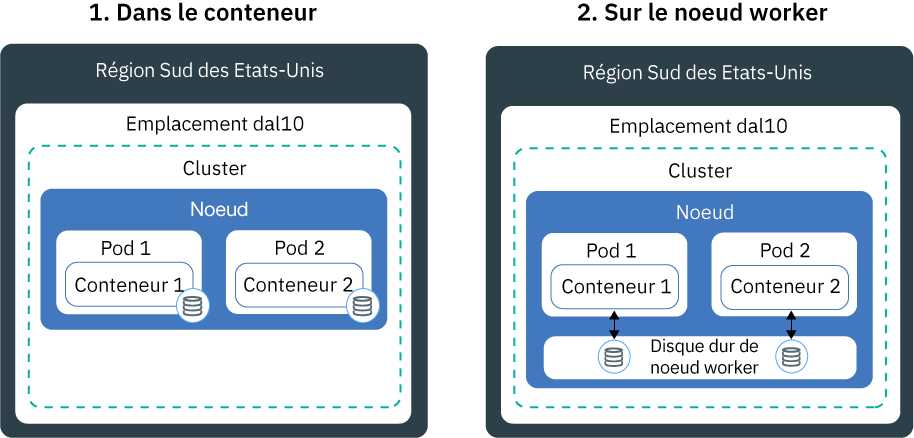
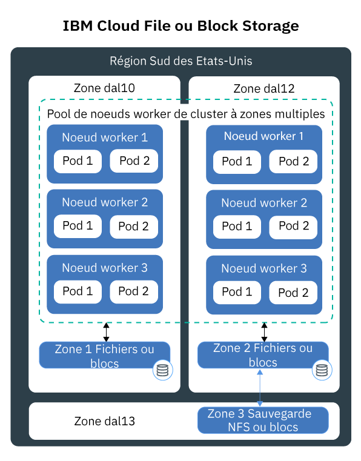
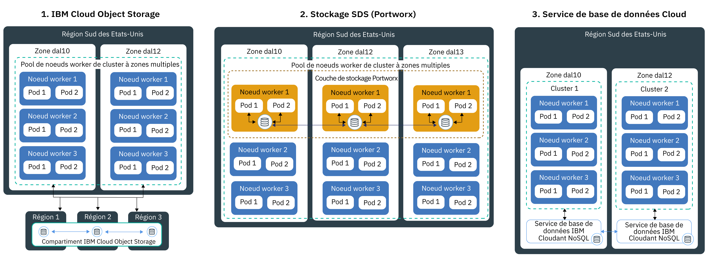

---

copyright:
  years: 2014, 2019
lastupdated: "2019-06-11"

keywords: kubernetes, iks

subcollection: containers

---

{:new_window: target="_blank"}
{:shortdesc: .shortdesc}
{:screen: .screen}
{:pre: .pre}
{:table: .aria-labeledby="caption"}
{:codeblock: .codeblock}
{:tip: .tip}
{:note: .note}
{:important: .important}
{:deprecated: .deprecated}
{:download: .download}
{:preview: .preview}

# Planification de stockage persistant à haute disponibilité
{: #storage_planning}

## Choix d'une solution de stockage
{: #choose_storage_solution}

Avant de décider du type de stockage qui vous convient le mieux, vous devez connaître les conditions requises par votre application, le type de données que vous souhaitez stocker et la fréquence à laquelle vous souhaitez accéder à ces données.
{: shortdesc}

1. Déterminez si vos données doivent faire l'objet d'un stockage permanent ou si elles peuvent être retirées à tout moment. 
   - **Stockage persistant :** vos données doivent toujours être disponibles, même en cas de retrait du conteneur, du noeud worker ou du cluster. Utilisez le stockage persistant dans les scénarios suivants :
       - Applications avec état
       - Données métier stratégiques
       - Données devant être toujours disponibles en raison des réglementations en vigueur, par exemple une période de conservation définie
       - Audit
       - Données qui doivent être accessibles et partagées entre des instances d'application
   - **Stockage non persistant :** vos données peuvent être retirées en cas de retrait du conteneur, du noeud worker ou du cluster. Ce type de stockage est utilisé en principe pour les informations de consignation, telles que les journaux système ou les journaux de conteneur, les tests de développement ou lorsque vous souhaitez accéder aux données à partir du système de fichiers de l'hôte. Pour obtenir une présentation des options de stockage non persistant disponibles, voir [Comparaison des options de stockage non persistant](#non_persistent_overview).

2. Si vous devez conserver vos données, déterminez si votre application nécessite un type de stockage particulier. Lorsque vous utilisez une application existante, cette application peut être conçue pour stocker des données avec l'une des méthodes suivantes :  
   - **Dans un système de fichiers :** les données peuvent être stockées sous forme de fichier dans un répertoire. Par exemple, vous pouvez stocker ce fichier sur votre disque dur local. Certaines applications nécessitent que les données soient stockées dans un système de fichiers spécifique, tel que `nfs` ou `ext4` afin d'optimiser le magasin de données et d'atteindre les objectifs en termes de performances.
   - **Dans une base de données :** les données doivent être stockées dans une base de données selon un schéma précis. Certaines applications sont fournies avec une interface de base de données que vous pouvez utiliser pour stocker vos données. Par exemple, WordPress est optimisé pour stocker des données dans une base de données MySQL. Dans ces cas de figure, le type de stockage est sélectionné pour vous.

3. Si votre application n'a pas de restriction particulière sur le type de stockage que vous devez utiliser, déterminez le type de données que vous souhaitez stocker.
   - **Données structurées :** données que vous pouvez stocker dans une base de données relationnelle lorsque vous disposez d'une table avec des lignes et des colonnes. Les données dans les tables peuvent être connectées à l'aide de clés et sont en général faciles d'accès en raison d'un modèle de données prédéfini. Exemples : numéros de téléphone, numéros de sécurité sociale ou codes postaux.
   - **Données semi-structurées :** données qui n'entrent pas dans le cadre d'une base de données relationnelle mais qui contiennent des propriétés organisationnelles que vous pouvez utiliser pour lire et analyser ces données plus facilement. Exemples : fichiers de langage de balisage, de type CSV, XML ou JSON.  
   - **Données non structurées :** données qui ne suivent pas de modèle d'organisation particulier et dont le niveau de complexité est tel que vous ne pouvez pas les stocker dans une base de données relationnelle avec des modèles de données prédéfinis. Pour accéder à ces données, il vous faut des logiciels et des outils avancés. Exemples : messages électroniques, vidéos, photos, fichiers audio, présentations, données de réseaux sociaux ou pages Web.

   Si vous disposez de données structurées et non structurées, essayez de stocker chacun de ces types de données séparément dans une solution de stockage conçue pour chaque type particulier. L'utilisation d'une solution de stockage adaptée à votre type de données facilite l'accès à vos données tout en vous offrant des avantages en termes de performances, d'évolutivité, de durabilité et de cohérence.
   {: tip}

4. Analysez le mode d'accès à vos données de votre choix. Les solutions de stockage sont en principe conçues et optimisées pour prendre en charge les opérations de lecture ou d'écriture.  
   - **Lecture seule :** vos données sont en lecture seule. Vous ne voulez pas écrire ou modifier de données.
   - **Lecture et écriture :** vous voulez lire, écrire et modifier vos données. Pour les données lues et écrites, il est important de savoir si les opérations sont plutôt des opérations de lecture ou des opérations d'écriture ou si les deux types d'opérations sont équilibrés.

4. Déterminez la fréquence d'accès à vos données. Connaître la fréquence d'accès aux données peut vous aider à appréhender les performances dont vous avez besoin pour votre stockage. Par exemple, les données à accès fréquent résident en principe sur du stockage rapide.
   - **Données les plus sollicitées :** données à accès fréquent. Les cas d'utilisation courants sont les applications Web ou mobiles.
   - **Données à accès moins ou moyennement fréquent :** données dont l'accès n'est pas très fréquent, par exemple une fois par mois ou moins. Les cas d'utilisation courants sont les archives, la conservation à court-terme des données ou la reprise après incident.
   - **Données à accès peu fréquent :** données dont l'accès est plutôt rare voire inexistant. Les cas d'utilisation courants sont les archives, les sauvegardes à long terme, les données d'historique.
   - **Données figées :** données auxquelles il n'y a pas d'accès et que vous devez conserver pour vous conformer à une réglementation.

   Si vous ne pouvez pas prévoir la fréquence ou si la fréquence ne suit pas un pattern strict, déterminez si vos charges de travail utilisent de nombreuses accès en lecture, en écriture ou si elles sont équilibrées. Ensuite, examinez l'option de stockage qui convient à votre charge de travail et recherchez le niveau de stockage qui vous offre la flexibilité dont vous avez besoin. Par exemple, {{site.data.keyword.cos_full_notm}} fournit la classe de stockage `flex` qui prend en considération la fréquence d'accès aux données sur un mois et tient compte de cette mesure pour optimiser votre facturation mensuelle.
   {: tip}

5. Déterminez si vos données doivent être partagées entre plusieurs instances d'application, plusieurs zones ou plusieurs régions.
   - **Accès entre les pods :** lorsque vous utilisez des volumes persistants Kubernetes pour accéder à votre stockage, vous pouvez déterminer le nombre de pods pouvant monter le volume en même temps. Certaines solutions de stockage, telles que le stockage par blocs, sont accessibles à un pod à la fois uniquement. Avec d'autres solutions de stockage, vous pouvez partager un volume entre plusieurs pods. 
   - **Accès entre les zones et les régions :** vos données devront parfois être accessibles entre plusieurs zones ou régions. Certaines solutions de stockage, par exemple le stockage de fichiers ou le stockage par blocs, sont spécifiques à un centre de données et ne peuvent pas être partagées entre plusieurs zones dans une configuration de cluster à zones multiples.

   Si vous souhaitez rendre vos données accessibles dans les différentes zones ou régions, veillez à consulter votre service juridique pour vérifier que vos données peuvent être stockées dans plusieurs zones ou dans un autre pays.
   {: note}

6. Familiarisez-vous avec d'autres caractéristiques de stockage pouvant influencer votre choix.
   - **Cohérence :** garantie qu'une opération de lecture renvoie la dernière version d'un fichier. Les solutions de stockage peuvent apporter une cohérence forte (`strong consistency`) qui vous garantit de recevoir la dernière version d'un fichier ou une cohérence finale (`eventual consistency`) lorsque l'opération de lecture ne garantit pas le renvoi de la dernière version. Vous obtenez souvent une cohérence finale dans les systèmes répartis géographiquement dans lesquels une opération d'écriture doit d'abord être répliquée sur toutes les instances.
   - **Performances :** temps nécessaire pour exécuter une opération de lecture ou d'écriture.
   - **Durabilité :** garantie qu'une opération d'écriture validée dans votre stockage survive de manière permanente sans subir de dommages ou de perte, même si les gigaoctets ou téraoctets de données sont écrits dans votre stockage au même moment.
   - **Résilience :** capacité de reprise après une panne en poursuivant les opérations, même en cas de défaillance d'un composant matériel ou logiciel. Par exemple, votre stockage physique subit une panne de courant, doit faire face à l'indisponibilité du réseau ou est supprimé suite à une catastrophe naturelle.
   - **Disponibilité :** capacité de fournir l'accès à vos données, même si un centre de données ou une région n'est pas disponible. La disponibilité de vos données est en principe assurée en ajoutant de la redondance et en configurant des mécanismes de basculement.
   - **Evolutivité :** possibilité d'augmenter la capacité et de personnaliser les performances en fonction de vos besoins.
   - **Chiffrement :** masquer les données permet d'empêcher leur visibilité en cas d'accès par un utilisateur non autorisé.

7. [Passez en revue les solutions de stockage persistant](#persistent_storage_overview) et sélectionnez la solution qui convient le mieux aux besoins de votre application et de vos données.

## Comparaison des options de stockage non persistant
{: #non_persistent_overview}

Vous pouvez utiliser des options de stockage non persistant si vos données n'ont pas besoin d'être stockées de manière permanente ou pour les tests d'unité des composants de votre application.
{: shortdesc}

L'image suivante présente les options de stockage de données non persistant disponibles dans {{site.data.keyword.containerlong_notm}}. Ces options sont disponibles pour les clusters gratuits et standard.

<table>
<thead>
<th style="text-align:left">Caractéristiques</th>
<th style="text-align:left">A l'intérieur du conteneur</th>
<th style="text-align:left">Sur le disque principal ou secondaire du noeud worker</th>
</thead>
<tbody>
<tr>
<td style="text-align:left">Compatible avec plusieurs zones</td>
<td style="text-align:left">Non</td>
<td style="text-align:left">Non</td>
</tr>
<tr>
<td style="text-align:left">Types de données</td>
<td style="text-align:left">Tous</td>
<td style="text-align:left">Tous</td>
</tr>
<tr>
<td style="text-align:left">Capacité</td>
<td style="text-align:left">Limitée au disque secondaire disponible du noeud worker. Pour limiter la quantité de stockage secondaire consommée par votre pod, utilisez les limites et les demandes de ressources de [stockage éphémère ](https://kubernetes.io/docs/concepts/configuration/manage-compute-resources-container/#local-ephemeral-storage).</td>
<td style="text-align:left">Limitée à l'espace disponible du noeud worker sur le disque principal (`hostPath`) ou secondaire (`emptyDir`). Pour limiter la quantité de stockage secondaire consommée par votre pod, utilisez les limites et les demandes de ressources de [stockage éphémère ](https://kubernetes.io/docs/concepts/configuration/manage-compute-resources-container/#local-ephemeral-storage).</td>
</tr>
<tr>
<td style="text-align:left">Modèle d'accès aux données</td>
<td style="text-align:left">Opérations de lecture et d'écriture quelle que soit la fréquence</td>
<td style="text-align:left">Opérations de lecture et d'écriture quelle que soit la fréquence</td>
</tr>
<tr>
<td style="text-align:left">Accès</td>
<td style="text-align:left">Via le système de fichiers du conteneur</td>
<td style="text-align:left"><ul style="margin:0px 0px 0px 20px; padding:0px"><li style="margin:0px; padding:0px">Via le [volume <code>hostPath</code> de Kubernetes ](https://kubernetes.io/docs/concepts/storage/volumes/#hostpath) pour accéder au stockage principal du noeud worker. </li><li style="margin:0px; padding:0px">Via [le volume <code>emptyDir</code> de Kubernetes ](https://kubernetes.io/docs/concepts/storage/volumes/#emptydir) pour accéder au stockage secondaire du noeud worker.</li></ul></td>
</tr>
<tr>
<td style="text-align:left">Performances</td>
<td style="text-align:left">Hautes</td>
<td style="text-align:left">Hautes avec faible temps d'attente lorsqu'une unité SSD est utilisée</td>
</tr>
<tr>
<td style="text-align:left">Cohérence</td>
<td style="text-align:left">Forte</td>
<td style="text-align:left">Forte</td>
</tr>
<tr>
<td style="text-align:left">Résilience</td>
<td style="text-align:left">Faible</td>
<td style="text-align:left">Faible</td>
</tr>
<tr>
<td style="text-align:left">Disponibilité</td>
<td style="text-align:left">Spécifique au conteneur</td>
<td style="text-align:left">Spécifique au noeud worker</td>
</tr>
<tr>
<td style="text-align:left">Evolutivité</td>
<td style="text-align:left">Difficile à étendre car limitée à la capacité du disque secondaire du noeud worker</td>
<td style="text-align:left">Difficile à étendre car limitée à la capacité du disque principal et du disque secondaire du noeud worker</td>
</tr>
<tr>
<td style="text-align:left">Durabilité</td>
<td style="text-align:left">Les données sont perdues en cas de panne ou de retrait du conteneur. </td>
<td style="text-align:left">Les données dans les volumes <code>hostPath</code> ou <code>emptyDir</code> sont perdues si : <ul><li>Le noeud worker est supprimé.</li><li>Le noeud worker est rechargé ou mis à jour.</li><li>Le cluster est supprimé.</li><li>Le compte {{site.data.keyword.Bluemix_notm}} passe à un état 'suspendu'. </li></ul>

Par ailleurs, les données d'un volume <code>emptyDir</code> sont supprimées dans les cas suivants : <ul><li>Le pod affecté est supprimé définitivement du noeud worker.</li><li>Le pod affecté est planifié pour opérer sur un autre noeud worker.</li></ul>
</tr>
<tr>
<td style="text-align:left">Cas d'utilisation courants</td>
<td style="text-align:left"><ul style="margin:0px 0px 0px 20px; padding:0px"><li style="margin:0px; padding:0px">Cache d'image local</li><li style="margin:0px; padding:0px">Journaux de conteneur</li></ul></td>
<td style="text-align:left"><ul style="margin:0px 0px 0px 20px; padding:0px"><li style="margin:0px; padding:0px">Cache local hautes performances</li><li style="margin:0px; padding:0px">Accès aux fichiers à partir du système de fichiers du noeud worker</li><li style="margin:0px; padding:0px">Tests d'unité</li></ul></td>
</tr>
<tr>
<td style="text-align:left">Cas d'utilisation qui ne sont pas idéaux</td>
<td style="text-align:left"><ul style="margin:0px 0px 0px 20px; padding:0px"><li style="margin:0px; padding:0px">Stockage de données persistant</li><li style="margin:0px; padding:0px">Partage de données entre plusieurs conteneurs</li></ul></td>
<td style="text-align:left"><ul style="margin:0px 0px 0px 20px; padding:0px"><li style="margin:0px; padding:0px">Stockage de données persistant</li></ul></td>
</tr>
</tbody>
</table>

## Comparaison des options de stockage persistant pour les clusters à zone unique
{: #single_zone_persistent_storage}

Si vous disposez d'un cluster à zone unique, vous pouvez choisir entre les options suivantes dans {{site.data.keyword.containerlong_notm}} qui permettent un accès rapide à vos données. Pour une haute disponibilité accrue, utilisez une option de stockage conçue pour des [données réparties géographiquement](#persistent_storage_overview) et, si possible en fonction de vos exigences, créez un cluster à zones multiples.
{: shortdesc}

Les options de stockage persistant sont disponibles uniquement pour les clusters standard.
{: note}

L'image suivante présente les options disponibles dans {{site.data.keyword.containerlong_notm}} pour stocker vos données de manière permanente dans un cluster à zone unique.

<table>
<thead>
<th style="text-align:left">Caractéristiques</th>
<th style="text-align:left">Stockage de fichiers</th>
<th style="text-align:left">Stockage par blocs</th>
</thead>
<tbody>
<tr>
<td style="text-align:left">Compatible avec plusieurs zones</td>
<td style="text-align:left">Non, car spécifique à un centre de données. Les données ne peuvent pas être partagées entre plusieurs zones, sauf si vous implémentez votre propre réplication de données.</td>
<td style="text-align:left">Non, car spécifique à un centre de données. Les données ne peuvent pas être partagées entre plusieurs zones, sauf si vous implémentez votre propre réplication de données.</td>
</tr>
<tr>
<td style="text-align:left">Types de données idéaux</td>
<td style="text-align:left">Tous</td>
<td style="text-align:left">Tous</td>
</tr>
<tr>
<td style="text-align:left">Modèle d'utilisation des données</td>
<td style="text-align:left"><ul style="margin:0px 0px 0px 20px; padding:0px"><li style="margin:0px; padding:0px">Opérations de lecture-écriture aléatoire</li><li style="margin:0px; padding:0px">Opérations de lecture-écriture séquentielle</li></ul></td>
<td style="text-align:left"><ul style="margin:0px 0px 0px 20px; padding:0px"><li style="margin:0px; padding:0px">Opérations de lecture-écriture aléatoire</li><li style="margin:0px; padding:0px">Charges de travail à écriture intensive</li></ul></td>
</tr>
<tr>
<td style="text-align:left">Accès</td>
<td style="text-align:left">Via le système de fichiers sur le volume monté</td>
<td style="text-align:left">Via le système de fichiers sur le volume monté</td>
</tr>
<tr>
<td style="text-align:left">Accès en écriture pris en charge par Kubernetes</td>
<td style="text-align:left"><ul style="margin:0px 0px 0px 20px; padding:0px"><li style="margin:0px; padding:0px">ReadWriteMany (RWX)</li><li style="margin:0px; padding:0px"> ReadOnlyMany (ROX)</li><li style="margin:0px; padding:0px">ReadWriteOnce (RWO)</li></ul></td>
<td style="text-align:left"><ul style="margin:0px 0px 0px 20px; padding:0px"><li style="margin:0px; padding:0px">ReadWriteOnce (RWO)</li></ul></td>
</tr>
<tr>
<td style="text-align:left">Performances</td>
<td style="text-align:left">Prévisibles en raison des opérations d'entrée-sortie par seconde (IOPS) affectées et de la taille. Les IOPS sont partagées entre les pods qui accèdent au volume.</td>
<td style="text-align:left">Prévisibles en raison des opérations d'entrée-sortie par seconde (IOPS) affectées et de la taille. Les IOPS ne sont pas partagées entre les pods. </td>
</tr>
<tr>
<td style="text-align:left">Cohérence</td>
<td style="text-align:left">Forte</td>
<td style="text-align:left">Forte</td>
</tr>
<tr>
<td style="text-align:left">Durabilité</td>
<td style="text-align:left">Haute</td>
<td style="text-align:left">Haute</td>
</tr>
<tr>
<td style="text-align:left">Résilience</td>
<td style="text-align:left">Moyenne car spécifique à un centre de données. Le serveur de stockage de fichiers est clustérisé par IBM avec une mise en réseau redondante.</td>
<td style="text-align:left">Moyenne car spécifique à un centre de données. Le serveur de stockage par blocs est clustérisé par IBM avec une mise en réseau redondante.</td>
</tr>
<tr>
<td style="text-align:left">Disponibilité</td>
<td style="text-align:left">Moyenne car spécifique à un centre de données.</td>
<td style="text-align:left">Moyenne car spécifique à un centre de données.</td>
</tr>
<tr>
<td style="text-align:left">Evolutivité</td>
<td style="text-align:left">Extension difficile au-delà du centre de données. Vous ne pouvez pas modifier un niveau de stockage existant. </td>
<td style="text-align:left">Extension difficile au-delà du centre de données. Vous ne pouvez pas modifier un niveau de stockage existant.</td>
</tr>
<tr>
<td style="text-align:left">Chiffrement</td>
<td style="text-align:left">Au repos</td>
<td style="text-align:left">Au repos</td>
</tr>
<tr>
<td style="text-align:left">Cas d'utilisation courants</td>
<td style="text-align:left"><ul style="margin:0px 0px 0px 20px; padding:0px"><li style="margin:0px; padding:0px">Stockage de masse ou de fichier unique</li><li style="margin:0px; padding:0px">Partage de fichiers dans un cluster à zone unique</li></ul></td>
<td style="text-align:left"><ul style="margin:0px 0px 0px 20px; padding:0px"><li style="margin:0px; padding:0px">Objets StatefulSet</li><li style="margin:0px; padding:0px">Stockage de secours lors de l'exécution de votre propre base de données</li><li style="margin:0px; padding:0px">Accès hautes performances pour des pods uniques</li></ul></td>
</tr>
<tr>
<td style="text-align:left">Cas d'utilisation qui ne sont pas idéaux</td>
<td style="text-align:left"><ul style="margin:0px 0px 0px 20px; padding:0px"><li style="margin:0px; padding:0px">Clusters à zones multiples</li><li style="margin:0px; padding:0px">Données réparties géographiquement</li></ul></td>
<td style="text-align:left"><ul style="margin:0px 0px 0px 20px; padding:0px"><li style="margin:0px; padding:0px">Clusters à zones multiples</li><li style="margin:0px; padding:0px">Données réparties géographiquement</li><li style="margin:0px; padding:0px">Partage de données entre plusieurs instances d'application</li></ul></td>
</tr>
</tbody>
</table>

## Comparaison des options de stockage persistant pour les clusters à zones multiples
{: #persistent_storage_overview}

Si vous disposez d'un cluster à zones multiples, choisissez entre les options de stockage persistant suivantes pour accéder à vos données à partir de noeuds worker répartis dans les différentes zones.
{: shortdesc}

Les options de stockage persistant sont disponibles uniquement pour les clusters standard.

Vous envisagez de connecter votre cluster à une base de données sur site à la place ? Voir [Configuration de la connectivité VPN dans votre cluster](/docs/containers?topic=containers-vpn#vpn).
{: tip}

L'image suivante présente les options disponibles dans {{site.data.keyword.containerlong_notm}} pour stocker vos données de manière permanente dans un cluster à zones multiples et assurer ainsi la haute disponibilité de vos données. Vous pouvez utiliser ces options dans un cluster à zone unique mais vous risquez de ne pas obtenir les avantages requis par votre application en termes de haute disponibilité.

<table>
<thead>
<th style="text-align:left">Caractéristiques</th>
<th style="text-align:left">Stockage d'objets</th>
<th style="text-align:left">SDS (Portworx)</th>
<th style="text-align:left">Bases de données {{site.data.keyword.Bluemix_notm}}</th>
</thead>
<tbody>
<tr>
<td style="text-align:left">Compatible avec plusieurs zones</td>
<td style="text-align:left">Oui</td>
<td style="text-align:left">Oui</td>
<td style="text-align:left">Oui</td>
</tr>
<tr>
<td style="text-align:left">Types de données idéaux</td>
<td style="text-align:left">Données semi-structurées et non structurées</td>
<td style="text-align:left">Tous</td>
<td style="text-align:left">Selon la base de données sous forme de service (DBaaS)</td>
</tr>
<tr>
<td style="text-align:left">Modèle d'utilisation des données</td>
<td style="text-align:left"><ul style="margin:0px 0px 0px 20px; padding:0px"><li style="margin:0px; padding:0px">Charges de travail à lecture intensive</li><li style="margin:0px; padding:0px">Peu ou pas du tout d'opérations d'écriture</li></ul></td>
<td style="text-align:left"><ul style="margin:0px 0px 0px 20px; padding:0px"><li style="margin:0px; padding:0px">Charges de travail à écriture intensive</li><li style="margin:0px; padding:0px">Opérations de lecture-écriture aléatoire</li><li style="margin:0px; padding:0px">Opérations de lecture-écriture séquentielle</li></ul></td>
<td style="text-align:left"><ul style="margin:0px 0px 0px 20px; padding:0px"><li style="margin:0px; padding:0px">Charges de travail à lecture-écriture intensive</li></ul></td>
</tr>
<tr>
<td style="text-align:left">Accès</td>
<td style="text-align:left">Via le système de fichiers sur le volume monté (plug-in) ou via l'API REST de votre application</td>
<td style="text-align:left">Via le système de fichiers sur le volume monté ou accès client NFS au volume</td>
<td style="text-align:left">Via l'API REST de votre application</td>
</tr>
<tr>
<td style="text-align:left">Accès en écriture pris en charge par Kubernetes</td>
<td style="text-align:left"><ul style="margin:0px 0px 0px 20px; padding:0px"><li style="margin:0px; padding:0px">ReadWriteMany (RWX)</li><li style="margin:0px; padding:0px"> ReadOnlyMany (ROX)</li><li style="margin:0px; padding:0px">ReadWriteOnce (RWO)</li></ul></td>
<td style="text-align:left">Tous</td>
<td style="text-align:left"><ul style="margin:0px 0px 0px 20px; padding:0px"><li style="margin:0px; padding:0px">N/A car accès direct depuis l'application</li></ul></td>
</tr>
<tr>
<td style="text-align:left">Performances</td>
<td style="text-align:left">Hautes pour les opérations de lecture. Prévisibles en raison des opérations d'entrée-sortie par seconde (IOPS) affectées et de la taille lorsque vous utilisez des machines non SDS.</td>
<td style="text-align:left"><ul style="margin:0px 0px 0px 20px; padding:0px"><li style="margin:0px; padding:0px">Proches des performances bare metal pour les opérations de lecture-écriture séquentielle lorsque vous utilisez des machines SDS. </li><li style="margin:0px; padding:0px">Fourniture de [profils ](https://docs.portworx.com/portworx-install-with-kubernetes/storage-operations/create-pvcs/dynamic-provisioning/#using-dynamic-provisioning) pour l'exécution de bases de données hautes performances</li><li style="margin:0px; padding:0px">Possibilité de créer une couche de stockage avec différents profils de performance que votre application peut sélectionner.</li></ul> </td>
<td style="text-align:left">Hautes si la base de données est déployée dans le même centre de données que votre application.</td>
</tr>
<tr>
<td style="text-align:left">Cohérence</td>
<td style="text-align:left">Finale</td>
<td style="text-align:left">Forte</td>
<td style="text-align:left">Selon la base de données sous forme de service (DBaaS)</td>
</tr>
<tr>
<td style="text-align:left">Durabilité</td>
<td style="text-align:left">Très haute car les tranches de données sont réparties sur un cluster de noeuds
de stockage. Chaque noeud stocke uniquement une partie des données. </td>
<td style="text-align:left">Très haute car trois copies de vos données sont conservées en permanence.</td>
<td style="text-align:left">Haute</td>
</tr>
<tr>
<td style="text-align:left">Résilience</td>
<td style="text-align:left">Haute car les tranches de données sont réparties sur trois zones ou régions. Moyenne lorsqu'elle est configurée dans une seule zone.</td>
<td style="text-align:left">Haute lorsque la configuration comporte une réplication sur trois zones. Moyenne lorsque le stockage des données s'effectue dans une seule zone.</td>
<td style="text-align:left">Selon la base de données sous forme de service (DBaaS) et votre configuration </td>
</tr>
<tr>
<td style="text-align:left">Disponibilité</td>
<td style="text-align:left">Haute en raison de la répartition entre plusieurs zones ou régions. </td>
<td style="text-align:left">Haute lorsque vous répliquez des données sur trois noeuds worker dans différentes zones.</td>
<td style="text-align:left">Haute si vous avez configuré plusieurs instances. </td>
</tr>
<tr>
<td style="text-align:left">Evolutivité</td>
<td style="text-align:left">Mise à l'échelle automatique</td>
<td style="text-align:left">Augmente la capacité du volume en le redimensionnant. Pour augmenter la capacité de la couche de stockage globale, vous devez ajouter des noeuds worker ou supprimer du stockage par blocs. Ces deux scénarios nécessitent que la capacité soit surveillée par l'utilisateur. </td>
<td style="text-align:left">Mise à l'échelle automatique</td>
</tr>
<tr>
<td style="text-align:left">Chiffrement</td>
<td style="text-align:left">En transit et au repos</td>
<td style="text-align:left">Fournissez votre propre clé pour protéger vos données en transit et au repos avec {{site.data.keyword.keymanagementservicelong_notm}}. </td>
<td style="text-align:left">Au repos</td>
</tr>
<tr>
<td style="text-align:left">Cas d'utilisation courants</td>
<td style="text-align:left"><ul style="margin:0px 0px 0px 20px; padding:0px"><li style="margin:0px; padding:0px">Clusters à zones multiples</li><li style="margin:0px; padding:0px">Données réparties géographiquement</li><li style="margin:0px; padding:0px">Big Data statiques</li><li style="margin:0px; padding:0px">Contenu multimédia statique</li><li style="margin:0px; padding:0px">Applications Web</li><li style="margin:0px; padding:0px">Sauvegardes</li><li style="margin:0px; padding:0px">Archives</li></ul></td>
<td style="text-align:left"><ul style="margin:0px 0px 0px 20px; padding:0px"><li style="margin:0px; padding:0px">Objets StatefulSet</li><li style="margin:0px; padding:0px">Données réparties géographiquement</li><li style="margin:0px; padding:0px">Solution de stockage courante lorsque vous exécutez des applications sur plusieurs fournisseurs de cloud</li><li style="margin:0px; padding:0px">Stockage de secours lors de l'exécution de votre propre base de données</li><li style="margin:0px; padding:0px">Accès hautes performances pour des pods uniques</li><li style="margin:0px; padding:0px">Accès au stockage partagé sur plusieurs pods et noeuds worker</li></ul></td>
<td style="text-align:left"><ul style="margin:0px 0px 0px 20px; padding:0px"><li style="margin:0px; padding:0px">Clusters à zones multiples</li><li style="margin:0px; padding:0px">Bases de données relationnelles et non relationnelles</li><li style="margin:0px; padding:0px">Données réparties géographiquement</li></ul></td>
</tr>
<tr>
<td style="text-align:left">Cas d'utilisation qui ne sont pas idéaux</td>
<td style="text-align:left"><ul style="margin:0px 0px 0px 20px; padding:0px"><li style="margin:0px; padding:0px">Charges de travail à écriture intensive</li><li style="margin:0px; padding:0px">Opérations d'écriture aléatoire</li><li style="margin:0px; padding:0px">Mises à jour de données incrémentielles</li><li style="margin:0px; padding:0px">Bases de données transactionnelles</li></ul></td>
<td style="text-align:left">N/A</td>
<td style="text-align:left"><ul style="margin:0px 0px 0px 20px; padding:0px"><li style="margin:0px; padding:0px">Application conçue pour effectuer des opérations d'écriture dans un système de fichiers</li></ul></td>
</tr>
</tbody>
</table>
