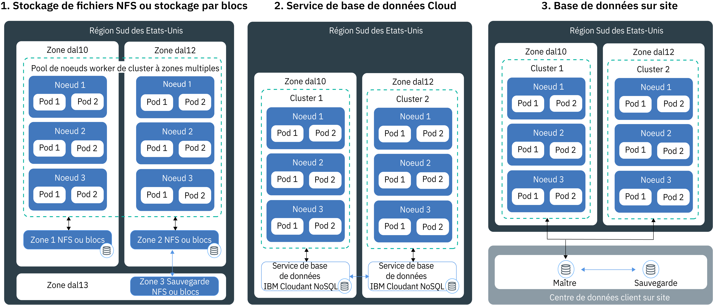

---

copyright:
  years: 2014, 2018
lastupdated: "2018-08-06"

---

{:new_window: target="_blank"}
{:shortdesc: .shortdesc}
{:screen: .screen}
{:pre: .pre}
{:table: .aria-labeledby="caption"}
{:codeblock: .codeblock}
{:tip: .tip}
{:download: .download}

# Planification de stockage persistant à haute disponibilité
{: #storage_planning}

## Options de stockage de données non persistant
{: #non_persistent}

Vous pouvez utiliser des options de stockage non persistant si vos données n'ont pas besoin d'être stockées de manière permanente ou si elles n'ont pas besoin d'être partagées entre les instances d'application. Ces options peuvent également être utilisées afin d'effectuer un test d'unité sur vos composants d'application ou d'essayer de nouvelles fonctions.
{: shortdesc}

L'illustration suivante présente les options de stockage de données non persistant disponibles dans {{site.data.keyword.containerlong_notm}}. Ces options sont disponibles pour les clusters gratuits et standard.

<table summary="Le tableau présente les options de stockage non persistant. La lecture des lignes s'effectue de gauche à droite, avec le numéro de l'option dans la première colonne, son titre dans la deuxième colonne et une description dans la troisième colonne." style="width: 100%">
<caption>Options de stockage non persistant</caption>
  <thead>
  <th>Option</th>
  <th>Description</th>
  </thead>
  <tbody>
    <tr>
      <td>1. Dans le conteneur ou dans le pod</td>
      <td>De par leur conception, les conteneurs ont une durée de vie brève et ne sont pas à l'abri de défaillances inattendues. Toutefois, vous pouvez consigner des données sur le système de fichiers local afin de stocker des données tout au long du cycle de vie du conteneur. Les données hébergées au sein d'un conteneur ne peuvent pas être partagées avec d'autres conteneurs ou pods et sont perdues en cas de panne ou de suppression du conteneur. Pour plus d'informations, voir [Stockage de données dans un conteneur](https://docs.docker.com/storage/).</td>
    </tr>
  <tr>
    <td>2. Sur le noeud worker</td>
    <td>Chaque noeud worker est configuré avec un stockage principal et un stockage secondaire déterminés par le type de machine que vous sélectionnez pour votre noeud worker. Le stockage principal est utilisé pour stocker les données du système d'exploitation. Il est accessible par le biais d'un [volume <code>hostPath</code> Kubernetes ](https://kubernetes.io/docs/concepts/storage/volumes/#hostpath). Le stockage secondaire est utilisé pour stocker des données provenant du `kubelet` et du moteur d'exécution du conteneur. Vous pouvez accéder au stockage secondaire en utilisant un [volume <code>emptyDir</code> Kubernetes ](https://kubernetes.io/docs/concepts/storage/volumes/#emptydir)  Alors que les volumes <code>hostPath</code> sont utilisés pour monter des fichiers à partir du système de fichiers du noeud worker sur votre pod, un volume <code>emptyDir</code> crée un répertoire vide qui est affecté à un pod dans votre cluster. Tous les conteneurs figurant dans ce pod peuvent effectuer des opérations de lecture/écriture dans ce volume. Comme le volume est affecté à un pod spécifique, les données ne peuvent pas être partagées avec d'autres pods dans un jeu de répliques.  
Un volume <code>hostPath</code> ou <code>emptyDir</code> et ses données sont supprimés dans les cas suivants : <ul><li>Le noeud worker est supprimé.</li><li>Le noeud worker est rechargé ou mis à jour.</li><li>Le cluster est supprimé.</li><li>Le compte {{site.data.keyword.Bluemix_notm}} passe à un état 'suspendu'. </li></ul>

Par ailleurs, les données d'un volume <code>emptyDir</code> sont supprimées dans les cas suivants : <ul><li>Le pod affecté est supprimé définitivement du noeud worker.</li><li>Le pod affecté est planifié pour opérer sur un autre noeud worker.</li></ul>

<strong>Remarque :</strong> si le conteneur à l'intérieur du pod tombe en panne, les données du volume restent disponibles sur le noeud worker.
</td>
    </tr>
    </tbody>
    </table>

## Options de stockage de données persistant pour haute disponibilité
{: #persistent}

La principale difficulté lorsque vous créez des applications avec état à haute disponibilité consiste à conserver les données réparties entre plusieurs instances d'application dans des zones multiples, et de toujours les maintenir synchronisées. Pour les données à haute disponibilité, assurez-vous de disposer d'une base de données maître à plusieurs instances réparties entre plusieurs centres de données, voire plusieurs régions. Cette base de données maître doit être répliquée en permanence pour assurer une source unique de données de référence. Toutes les instances dans votre cluster doivent pouvoir lire et écrire dans cette base de données maître. En cas de défaillance d'une instance de la base de données maître, les autres instances récupèrent le contrôle de la charge de travail afin que vos applications ne connaissent pas de temps d'indisponibilité.
{: shortdesc}

L'illustration suivante présente les options disponibles dans {{site.data.keyword.containerlong_notm}} pour assurer une haute disponibilité de vos données dans un cluster standard. L'option pertinente dépend des facteurs suivants :
  * **Type de votre application :** vous pourriez, par exemple, utiliser une application nécessitant le stockage des données dans un fichier et non pas dans une base de données.
  * **Règlementation en termes de stockage et de routage des données :** vous pourriez, par exemple, être obligé de stocker et de router vos données aux Etats-Unis, sans pouvoir utiliser un service situé en Europe.
  * **Options de sauvegarde et de restauration :** toutes les options de stockage disposent de capacités de sauvegarde et de restauration des données. Vérifiez que les options disponibles répondent aux exigences de votre plan de reprise après incident, telles que la fréquence des sauvegardes ou la possibilité de stocker vos données hors de votre centre de données principal.
  * **Réplication globale :** pour assurer la haute disponibilité, vous souhaiterez éventuellement configurer plusieurs instances de stockage, lesquelles seront distribuées et répliquées entre vos centres de données à travers le monde.

 

<table summary="Le tableau suivant présente les options de stockage persistant. La lecture des lignes s'effectue de gauche à droite, avec le numéro de l'option dans la première colonne, le titre de l'option dans la deuxième colonne et une description dans la troisième colonne." style="width: 100%">
<caption>Options de stockage persistant</caption>
  <thead>
  <th>Option</th>
  <th>Description</th>
  </thead>
  <tbody>
  <tr>
  <td>1. Stockage NFS ou stockage par blocs</td>
  <td>Avec cette option, vous pouvez conserver des données d'application et de conteneur au sein de la même zone en utilisant des volumes persistants Kubernetes.   <strong>Comment puis-je mettre à disposition du stockage de fichiers ou du stockage par blocs ?</strong> Pour mettre à disposition du stockage de fichiers et du stockage par blocs dans un cluster, vous [utilisez des volumes persistants (PV) et des réservations de volume persistant (PVC)](cs_storage_basics.html#pvc_pv). Les PVC et les PV sont des concepts de Kubernetes qui font abstraction de l'API pour mettre à disposition l'unité physique de stockage de fichiers ou de stockage par blocs. Vous pouvez créer des PVC et des PV avec un provisionnement [dynamique](cs_storage_basics.html#dynamic_provisioning) ou [statique](cs_storage_basics.html#static_provisioning).   <strong>Puis-je utiliser du stockage de fichiers ou du stockage par blocs dans un cluster à zones multiples ?</strong>  Les unités de stockage de fichiers et de stockage par blocs sont spécifiques à une zone et ne peuvent pas être partagées entre plusieurs zones ou régions. Pour utiliser ce type de stockage dans un cluster, vous devez disposer d'au moins un noeud worker dans la même zone que votre stockage.   Si vous utilisez un [provisionnement dynamique](cs_storage_basics.html#dynamic_provisioning) de votre stockage de fichiers ou de votre stockage par blocs, dans un cluster couvrant plusieurs zones, le stockage est mis à disposition dans 1 seule zone qui est sélectionnée en mode circulaire. Pour mettre à disposition du stockage persistant dans toutes les zones de votre cluster à zones multiples, répétez ces étapes pour mettre à disposition le stockage de manière dynamique pour chaque zone. Par exemple si votre cluster couvre les zones `dal10`, `dal12` et `dal13`, la première fois que vous utilisez le provisionnement dynamique de stockage persistant, ce stockage sera peut-être mis à disposition dans `dal10`. Créez deux réservations de volume persistant (PVC) supplémentaires pour couvrir les zones `dal12` et `dal13`.   <strong>Que faire pour partager les données entre différentes zones ?</strong> Si vous désirez partager des données entre plusieurs zones, utilisez un service cloud de base de données, tel que [{{site.data.keyword.cloudant_short_notm}}](/docs/services/Cloudant/getting-started.html#getting-started-with-cloudant) ou [{{site.data.keyword.cos_full_notm}}](/docs/services/cloud-object-storage/about-cos.html#about-ibm-cloud-object-storage). </td>
  </tr>
  <tr id="cloud-db-service">
    <td>2. Service de base de données cloud</td>
    <td>Cette option vous permet de conserver les données via un service de base de données {{site.data.keyword.Bluemix_notm}}, comme [IBM Cloudant NoSQL DB](/docs/services/Cloudant/getting-started.html#getting-started-with-cloudant).   <strong>Puis-je utiliser un service cloud de base de données pour mon cluster à zones multiples ?</strong> Avec un service cloud de base de données, les données sont stockées hors du cluster dans l'instance de service spécifiée. Cette instance de service est mise à disposition dans une zone. Cependant, toutes les instances de service sont fournies avec une interface externe que vous pouvez utiliser pour accéder à vos données. Lorsque vous utilisez un service de base de données pour un cluster à zones multiples, vous pouvez partager des données entre des clusters, des zones et des régions. Pour rendre votre instance de service plus disponible, vous pouvez choisir de configurer plusieurs instances sur les différentes zones et la réplication entre ces instances pour une disponibilité accrue.   <strong>Comment ajouter un service cloud de base de données à mon cluster ?</strong> Pour utiliser un service dans votre cluster, vous devez [lier le service {{site.data.keyword.Bluemix_notm}}](cs_integrations.html#adding_app) à un espace de nom dans votre cluster. Lorsque vous liez le service au cluster, une valeur confidentielle (secret) Kubernetes est créée. Celle-ci héberge des informations confidentielles relatives au service, comme son URL, votre nom d'utilisateur et votre mot de passe. Vous pouvez monter le volume en tant que volume secret sur votre pod et accéder au service en utilisant les données d'identification dans la valeur confidentielle. En montant le volume sur d'autres pods, vous pouvez également partager les données entre les pods. Lorsqu'un conteneur tombe en panne ou qu'un pod est retiré d'un noeud worker, les données ne sont pas perdues et restent accessibles aux autres pods qui montent le volume secret.   La plupart des services de base de données {{site.data.keyword.Bluemix_notm}} proposent un espace disque gratuit pour une petite quantité de données, de sorte que vous puissiez tester ses caractéristiques.
</td>
  </tr>
  <tr>
    <td>3. Base de données sur site</td>
    <td>Si vos données doivent être stockées sur site pour des raisons juridiques, vous pouvez [configurer une connexion VPN](cs_vpn.html#vpn) vers votre base de données locale et utiliser les mécanismes de stockage, de sauvegarde et de réplication existants dans votre centre de données.</td>
  </tr>
  </tbody>
  </table>

{: caption="Tableau. Options de stockage de données persistant pour les déploiements dans des clusters Kubernetes" caption-side="top"}
