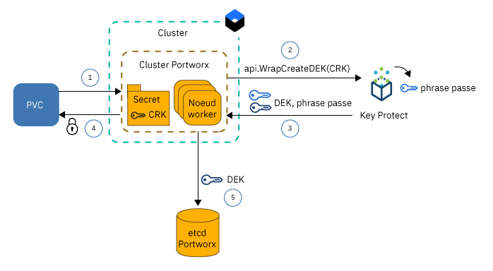
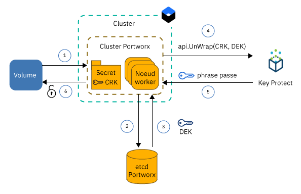

---

copyright:
  years: 2014, 2019
lastupdated: "2019-05-31"

keywords: kubernetes, iks, local persistent storage

subcollection: containers

---

{:new_window: target="_blank"}
{:shortdesc: .shortdesc}
{:screen: .screen}
{:pre: .pre}
{:table: .aria-labeledby="caption"}
{:codeblock: .codeblock}
{:tip: .tip}
{:note: .note}
{:important: .important}
{:deprecated: .deprecated}
{:download: .download}
{:preview: .preview}


# Stockage de données sur SDS (Software-Defined Storage) avec Portworx
{: #portworx}

[Portworx ](https://portworx.com/products/introduction/) est une solution de stockage SDS à haute disponibilité que vous pouvez utiliser afin de gérer du stockage persistant local pour vos bases de données conteneurisées et d'autres applications avec état, ou afin de partager des données entre des pods sur plusieurs zones.
{: shortdesc}

**Qu'est-ce qu'une solution SDS (Software-Defined Storage) ?** </br>
Une solution de stockage défini par logiciel (SDS) abstrait les unités de stockage de différents types, tailles ou de fournisseurs différents, rattachées aux noeuds worker dans votre cluster. Des noeuds worker avec du stockage disponible sur des disques durs sont ajoutés sous forme de noeud à un cluster de stockage. Dans ce cluster, le stockage physique est virtualisé et présenté sous forme de pool de stockage virtuel à l'utilisateur. Le cluster de stockage est géré par le logiciel SDS. Si les données doivent être hébergées sur le cluster de stockage, le logiciel SDS détermine où les stocker pour obtenir une disponibilité optimale. Votre stockage virtuel est fourni avec un ensemble commun de fonctions et de services dont vous pouvez tirer parti sans tenir compte de l'architecture de stockage sous-jacente effective.

**Comment fonctionne Portworx ?** </br>
Portworx regroupe le stockage disponible lié à vos noeuds worker pour créer une couche de stockage persistant unifiée pour les bases de données conteneurisées ou d'autres applications avec état que vous envisagez d'exécuter dans le cluster. En utilisant la réplication de volume de chaque volume au niveau conteneur sur plusieurs noeuds worker, Portworx assure la persistance et l'accessibilité des données sur plusieurs zones.

Portworx fournit également d'autres fonctions que vous pouvez utiliser pour vos applications avec état, par exemple les images instantanées de volume, le chiffrement de volume, l'isolation, ainsi que l'environnement d'exécution Storage Orchestrator for Kubernetes (Stork) afin d'assurer le positionnement optimal des volumes dans le cluster. Pour plus d'informations, voir la [documentation Portworx ](https://docs.portworx.com/).

**Quelle version de noeud worker dans {{site.data.keyword.containerlong_notm}} convient le mieux à Portworx ?** </br>
{{site.data.keyword.containerlong_notm}} fournit des versions de noeud worker bare metal optimisées en vue d'une [utilisation avec SDS (Software-Defined Storage)](/docs/containers?topic=containers-planning_worker_nodes#sds) et qui sont accompagnées d'un ou plusieurs disques locaux de type RAW, non formatés et non montés que vous pouvez utiliser pour votre couche de stockage Portworx. Portworx offre des performances optimales avec des machines de noeud worker SDS d'un débit réseau de 10 Gbit/s.

**Et si j'envisage d'exécuter Portworx sur des noeuds worker non SDS ?** </br>
Vous pouvez installer Portworx sur des versions non SDS de noeud worker, mais vous risquez de ne pas obtenir les performances requises par votre application. Les noeuds worker non SDS peuvent être de type virtuel ou bare metal. Si vous voulez utiliser des machines virtuelles, utilisez un modèle de noeud worker `b2c.16x64` ou supérieur. Les machines virtuelles de modèle `b3c.4x16` ou `u3c.2x4` n'offrent pas les ressources nécessaires au bon fonctionnement de Portworx. N'oubliez pas que les machines virtuelles offrent un débit de 1000 Mbit/s, ce qui n'est pas suffisant pour obtenir les performances idéales de Portworx. Les machines bare metal sont fournies avec suffisamment de ressources de calcul et de vitesse réseau pour Portworx, mais vous devez [ajouter du stockage par blocs brut, non formaté et non monté](#create_block_storage) avant d'utiliser ces machines.

**Comment puis-je m'assurer que le mode de stockage de mes données est à haute disponibilité ?** </br>
Vous devez disposer d'au moins 3 noeuds worker dans votre cluster Portworx pour que Portworx puisse répliquer vos données sur plusieurs noeuds. En répliquant vos données sur plusieurs noeuds worker, Portworx peut garantir que votre application avec état peut être replanifiée sur un autre noeud worker en cas de défaillance sans perte de données. Pour une disponibilité accrue, utilisez un [cluster à zones multiples](/docs/containers?topic=containers-ha_clusters#multizone) et répliquez vos volumes sur des noeuds worker SDS dans au moins 3 zones.

**Quelle topologie de volume offre les meilleures performances pour mes pods ?** </br>
L'un des défis majeurs lors de l'exécution d'applications avec état dans un cluster consiste à garantir que votre conteneur puisse être replanifié sur un autre hôte en cas de défaillance du conteneur ou de l'hôte dans son ensemble. Dans Docker, lorsqu'un conteneur doit être replanifié sur un autre hôte, le volume n'est pas transféré sur le nouvel hôte. Portworx peut être configuré pour s'exécuter en mode hyperconvergé (`hyper-converged`) pour garantir que vos ressources de calcul et le stockage résident toujours sur le même noeud worker. Lorsque votre application doit être replanifiée, Portworx la transfère sur un noeud worker où se trouve l'une de vos répliques de volume pour garantir la vitesse d'accès au disque local et les meilleures performances pour votre application avec état. L'exécution en mode `hyper-converged` offre les meilleures performances pour vos pods, mais nécessite que le stockage soit disponible sur tous les noeuds worker dans votre cluster.

Vous pouvez également choisir de n'utiliser qu'un sous-ensemble de noeuds worker pour votre couche de stockage Portworx. Par exemple, vous pouvez disposer d'un pool de noeuds worker avec des noeuds worker SDS fournis avec du stockage par blocs brut et un autre pool de noeuds worker avec des noeuds worker virtuels non fournis avec du stockage local. Lorsque vous installez Portworx, un pod Portworx est planifié sur tous les noeuds worker de votre cluster dans le cadre d'un ensemble de démons (daemonSet). Comme vos noeuds worker SDS disposent de stockage local, ces noeuds worker sont inclus uniquement dans la couche de stockage Portworx. Vos noeuds worker virtuels ne sont pas inclus dans un noeud de stockage car ils n'ont pas de stockage local. Cependant, lorsque vous déployez un pod d'application sur votre noeud worker virtuel, ce pod peut toujours accéder aux données qui sont stockées physiquement sur un noeud worker SDS en utilisant le pod d'ensemble de démons Portworx. Cette configuration est désignée par `storage-heavy` et offre des performances légèrement plus faibles que la configuration `hyper-converged` car le noeud worker virtuel doit communiquer avec le noeud worker SDS via le réseau privé pour accéder aux données.

**Quelle est la configuration requise pour mettre à disposition Portworx ?** </br>
{{site.data.keyword.containerlong}} fournit des versions de noeud worker optimisées pour une utilisation avec SDS et qui sont accompagnées d'un ou plusieurs disques locaux RAW, non formatés et non montés, que vous pouvez utiliser pour stocker vos données. Portworx offre des performances optimales lorsque vous utilisez des [machines de noeud worker SDS](/docs/containers?topic=containers-planning_worker_nodes#sds) d'un débit réseau de 10 Gbit/s. Vous pouvez toutefois installer Portworx sur des versions non SDS de noeud worker, mais vous risquez de ne pas obtenir les performances requises par votre application. La configuration requise minimale d'un noeud worker pour exécuter Portworx correctement comprend :
- 4 coeurs d'UC
- 4 Go de mémoire
- 128 Go de stockage non formaté brut
- 10 Gbit/s de vitesse réseau

**Quelles sont les limitations que je dois prévoir ?** </br>
Portworx est disponible pour des clusters standard configurés avec une connectivité de réseau public. Si votre cluster ne peut pas accéder au réseau public, par exemple si vous disposez d'un cluster privé protégé derrière un pare-feu ou d'un cluster où seul le noeud final de service privé est activé, vous ne pouvez pas utiliser Portworx dans votre cluster, sauf si vous ouvrez tout le trafic réseau sortant sur le port TCP 443 ou si vous activez le noeud final de service public.


Tout est prêt ? Commençons par [créer un cluster avec un pool de noeuds worker SDS comportant au moins 3 noeuds worker](/docs/containers?topic=containers-clusters#clusters_ui). Si vous souhaitez inclure des noeuds worker non SDS dans votre cluster Portworx, [ajoutez du stockage par blocs brut](#create_block_storage) à chaque noeud worker. Une fois votre cluster préparé, passez à l'[installation de la charte Helm Portworx](#install_portworx) dans votre cluster et à la création de votre cluster de stockage hyperconvergé.  

## Création de stockage par blocs brut, non formaté et non monté pour les noeuds worker non SDS
{: #create_block_storage}

Portworx s'exécute mieux lorsque vous utilisez des versions de noeud worker optimisées pour une [utilisation avec SDS (Software-Defined Storage)](/docs/containers?topic=containers-planning_worker_nodes#sds). Cependant, si vous ne pouvez ou ne voulez pas utiliser des noeuds worker SDS, vous pouvez opter pour l'installation de Portworx sur des versions de noeud worker non SDS. N'oubliez pas que les noeuds worker non SDS ne sont pas optimisés pour Portworx et risquent de ne pas offrir les performances requises par votre application.
{: shortdesc}

Pour inclure des noeuds worker non SDS dans votre cluster Portworx, vous devez ajouter à vos noeuds worker des unités de stockage par blocs brutes, non formatées et non montées en utilisant le plug-in {{site.data.keyword.Bluemix_notm}} Block Volume Attacher. Le stockage par blocs brut ne peut pas être provisionné avec des réservations de volume persistant (PVC) Kubernetes car l'unité de stockage par blocs est automatiquement formatée par {{site.data.keyword.containerlong_notm}}. Portworx ne prend en charge que le stockage par blocs. Les noeuds worker non SDS qui montent du stockage de fichiers ou d'objets ne peuvent pas être utilisés pour la couche de données Portworx.

Si vous disposez de versions de noeud worker SDS dans votre cluster et que vous voulez utiliser uniquement ces noeuds worker pour créer votre couche de stockage Portworx, vous pouvez complètement ignorer cette étape et passer à la [configuration de votre base de données Portworx](#portworx_database).
{: note}

1. [Installez le plug-in {{site.data.keyword.Bluemix_notm}} Block Volume Attacher](/docs/containers?topic=containers-utilities#block_storage_attacher).
2. Pour ajouter du stockage par blocs avec la même configuration à tous vos noeuds worker, [ajoutez automatiquement du stockage par blocs](/docs/containers?topic=containers-utilities#automatic_block) avec le plug-in {{site.data.keyword.Bluemix_notm}} Block Volume Attacher. Pour ajouter du stockage par blocs avec une autre configuration, ajoutez le stockage par blocs uniquement à un sous-ensemble de noeuds worker, ou pour avoir davantage de contrôle sur le processus de mise à disposition, [ajoutez du stockage par blocs manuellement](/docs/containers?topic=containers-utilities#manual_block).
3. [Reliez le stockage par blocs](/docs/containers?topic=containers-utilities#attach_block) à vos noeuds worker.

## Obtention d'une licence Portworx
{: #portworx_license}

Lorsque vous [installez Portworx avec une charte Helm](#install_portworx), vous obtenez l'édition Portworx `px-enterprise` en tant que version d'évaluation. Cette version d'évaluation vous offre les fonctionnalités complètes de Portworx que vous pouvez tester pendant 30 jours. Lorsque la version d'évaluation a expiré, vous devez acheter une licence Portworx pour continuer à utiliser votre cluster Portworx.
{: shortdesc}

Pour plus d'informations sur les types de licence disponibles et savoir comment mettre à niveau votre licence d'évaluation, voir [Portworx Licensing ](https://docs.portworx.com/reference/knowledge-base/px-licensing/). Les employés d'IBM doivent commander une licence Portworx en suivant [cette procédure](https://github.ibm.com/alchemy-containers/armada-storage/blob/master/portworx/px-license.md).

## Configuration d'une base de données pour les métadonnées Portworx
{: #portworx_database}

Configurez un service de base de données {{site.data.keyword.Bluemix_notm}}, tel que [Databases for etcd](#databaseetcd) ou [{{site.data.keyword.composeForEtcd}}](#compose) pour créer un stockage de valeurs de clés (KVS) pour les métadonnées du cluster Portworx.
{: shortdesc}

Le stockage de valeurs de clés Portworx sert de source unique de données de référence pour votre cluster Portworx. Si ce stockage n'est pas disponible, vous ne pouvez pas utiliser votre cluster Portworx pour accéder à vos données ou les stocker. Les données existantes ne sont pas modifiées ou supprimées lorsque la base de données Portworx n'est pas disponible.

### Configuration d'une instance de service Databases for etcd
{: #databaseetcd}

Databases for etcd est un service etcd géré qui permet de stocker et répliquer vos données de manière sécurisée sur trois instances de stockage afin d'assurer la haute disponibilité et la résilience de vos données. Pour plus d'informations, voir le [tutoriel d'initiation du service Databases for etcd](/docs/services/databases-for-etcd?topic=databases-for-etcd-getting-started#getting-started).

La procédure suivante montre comment mettre à disposition et configurer une instance de service Databases for etcd pour Portworx.

1. Vérifiez que vous disposez du [rôle d'accès à la plateforme `Administrator` dans {{site.data.keyword.Bluemix_notm}} Identity and Access Management (IAM)](/docs/iam?topic=iam-iammanidaccser#iammanidaccser)  pour le service Databases for etcd.  

2. Mettez à disposition votre instance de service Databases for etcd.
   1. Ouvrez la [page du catalogue Databases for etcd](https://cloud.ibm.com/catalog/services/databases-for-etcd)
   2. Entrez un nom pour votre instance de service, par exemple `px-etcd`.
   3. Sélectionnez la région dans laquelle vous envisagez de déployer votre instance de service. Pour des performances optimales, choisissez la région dans laquelle se trouve votre cluster.
   4. Sélectionnez le même groupe de ressources que celui où figure votre cluster.
   5. Utilisez les paramètres par défaut pour la mémoire initiale et l'allocation de disque.
   6. Déterminez si vous voulez utiliser l'instance de service {{site.data.keyword.keymanagementserviceshort}} par défaut ou votre propre instance.
   5. Consultez le plan de tarification.
   6. Cliquez sur **Créer** pour commencer à configurer votre instance de service. Cette configuration peut prendre quelques minutes.
3. Créez les données d'identification du service pour votre instance de service Databases for etcd.
   1. Dans la navigation de la page des détails du service, cliquez sur **Données d'identification pour le service**.
   2. Cliquez sur **Nouvelles données d'identification**.
   3. Entrez un nom pour les données d'identification de votre service et cliquez sur **Ajouter**.
4. {: #databases_credentials}Récupérez vos données d'identification au service et votre certificat.
   1. Dans la colonne **Actions** du tableau des données d'identification du service, cliquez sur **Afficher les données d'identification**.
   2. Recherchez la section `grp.authentication` de vos données d'identification au service et notez le nom d'utilisateur (**`username`**) et le mot de passe (**`password`**).
      Exemple de sortie pour le nom d'utilisateur et le mot de passe :
      ```
      "grpc": {
      "authentication": {
        "method": "direct",
        "password": "123a4567ab89cde09876vaa543a2bc2a10a123456bcd123456f0a7895aab1de",
        "username": "ibm_cloud_1abd2e3f_g12h_3bc4_1234_5a6bc7890ab"
      }
      ```
      {: screen}
   3. Recherchez la section `composed` des données d'identification du service et notez les valeurs etcd **`--endpoints`**.  
      Exemple de sortie pour `--endpoints` :
      ```
      --endpoints=https://1ab234c5-12a1-1234-a123-123abc45cde1.123456ab78cd9ab1234a456740ab123c.databases.appdomain.cloud:32059
      ```
      {: screen}

   4. Recherchez la section `certificate` de vos données d'identification pour le service et notez la valeur de **`certificate_base64`**.
      Exemple de sortie pour `certificate` :
      ```
      "certificate": {
        "certificate_base64": "AB0cAB1CDEaABcCEFABCDEF1ACB3ABCD1ab2AB0cAB1CDEaABcCEFABCDEF1ACB3ABCD1ab2AB0cAB1CDEaABcCEFABCDEF1ACB3ABCD1ab2..."
      ```
      {: screen}

5. Créez une valeur confidentielle (secret) Kubernetes pour votre certificat.
   1. Créez un fichier de configuration pour votre valeur confidentielle.
      ```
      apiVersion: v1
      kind: Secret
      metadata:
        name: px-etcd-certs
        namespace: kube-system
      type: Opaque
      data:
        ca.pem: <certificate_base64>
        client-key.pem: ""
        client.pem: ""
      ```
      {: codeblock}

   2. Créez la valeur confidentielle dans votre cluster.
      ```
      kubectl apply -f secret.yaml
      ```

6. [Installez Portworx dans votre cluster](#install_portworx).


### Configuration d'une instance de service Compose for etcd
{: #compose}

{{site.data.keyword.composeForEtcd}} contient l'option qui permet de configurer votre base de données dans le cadre d'un cluster de stockage en cloud offrant haute disponibilité et résilience en cas de défaillance d'une zone. Pour plus d'informations, voir le [tutoriel d'initiation à {{site.data.keyword.composeForEtcd}}](/docs/services/ComposeForEtcd?topic=compose-for-etcd-getting-started-tutorial#getting-started-tutorial).
{: shortdesc}

La procédure suivante montre comment mettre à disposition et configurer le service de base de données {{site.data.keyword.composeForEtcd}} pour Portworx.

1. Vérifiez que vous disposez du [rôle Cloud Foundry `Developer` pour l'espace](/docs/iam?topic=iam-mngcf#mngcf) où vous voulez créer votre service de base de données {{site.data.keyword.composeForEtcd}}.

2. Mettez à disposition une instance de service {{site.data.keyword.composeForEtcd}}.
   1. Ouvrez la [page du catalogue {{site.data.keyword.composeForEtcd}}](https://cloud.ibm.com/catalog/services/compose-for-etcd)
   2. Entrez un nom pour votre instance de service, par exemple `px-etcd`.
   3. Sélectionnez la région dans laquelle vous envisagez de déployer votre instance de service. Pour des performances optimales, choisissez la région dans laquelle se trouve votre cluster.
   4. Sélectionnez une organisation et un espace Cloud Foundry.
   5. Consultez les plans de tarification et sélectionnez celui qui vous convient.
   6. Cliquez sur **Créer** pour commencer à configurer votre instance de service. Une fois la configuration terminée, la page des détails du service s'ouvre.
3. {: #etcd_credentials}Récupérez les données d'identification du service {{site.data.keyword.composeForEtcd}}.
   1. Dans la navigation de la page des détails du service, cliquez sur **Gérer**.
   2. Accédez à l'onglet **Vue d'ensemble**.
   3. Dans la section **Chaînes de connexion**, sélectionnez **Ligne de commande**.
   4. Notez a valeur des paramètres `--endpoints` et `--user`.
      Exemple de sortie pour `--endpoints` :
      ```
      --endpoints=https://portal-ssl123-34.bmix-dal-yp-12a23b5c-123a-12ab-a1b2-1a2bc3d34567.1234567890.composedb.com:12345,https://portal-ssl123-35.bmix-dal-yp-12a23b5c-123a-12ab-a1b2-1a2bc3d34567.1234567890.composedb.com:12345
      ```
      {: screen}

      Exemple de sortie pour `--user` :
      ```
      --user=root:ABCDEFGHIJKLMNOP
      ```
      {: screen}
   5. Utilisez ces données d'identification pour le service lorsque vous [installez Portworx dans votre cluster](#install_portworx).


## Installation de Portworx dans votre cluster
{: #install_portworx}

Installez Portworx avec une charte Helm. La charte Helm déploie une version d'évaluation de l'édition Portworx enterprise `px-enterprise` que vous pouvez utiliser pendant 30 jours. De plus, [Stork ](https://docs.portworx.com/portworx-install-with-kubernetes/storage-operations/stork/) est également installé sur votre cluster Kubernetes. Stork est le planificateur de stockage de Portworx qui vous permet de colocaliser les pods avec leurs données, ainsi que de créer et restaurer les images instantanées des volumes Portworx.
{: shortdesc}

Vous recherchez les instructions pour mettre à jour ou supprimer Portworx ? Voir [Mise à jour de Portworx](#update_portworx) et [Suppression de Portworx](#remove_portworx).
{: tip}

Avant de commencer :
- [Créez un cluster ou utilisez un cluster existant](/docs/containers?topic=containers-clusters#clusters_ui).
- Si vous souhaitez utiliser des noeuds worker non SDS pour votre couche de stockage Portworx, [ajoutez une unité de stockage par blocs non formatée à votre noeud worker non SDS](#create_block_storage).
- Créez une [instance de service {{site.data.keyword.composeForEtcd}}](#portworx_database) pour stocker la configuration et les métadonnées de Portworx.
- Déterminez si vous souhaitez chiffrer vos volumes Portworx avec {{site.data.keyword.keymanagementservicelong_notm}}. Pour chiffrer vos volumes, vous devez [configurer une instance de service {{site.data.keyword.keymanagementservicelong_notm}} et stocker les informations du service dans une valeur confidentielle (secret) Kubernetes](#encrypt_volumes).
- [Connectez-vous à votre compte. Le cas échéant, ciblez le groupe de ressources approprié. Définissez le contexte pour votre cluster.](/docs/containers?topic=containers-cs_cli_install#cs_cli_configure)

Pour installer Portworx :

1.  [Suivez les instructions](/docs/containers?topic=containers-helm#public_helm_install) d'installation du client Helm sur votre machine locale, et installez le serveur Helm (Tiller) avec un compte de service dans votre cluster.

2.  Vérifiez que Tiller est installé avec un compte de service.

    ```
    kubectl get serviceaccount -n kube-system tiller
    ```
    {: pre}

    Exemple de sortie :

    ```
    NAME                                 SECRETS   AGE
    tiller                               1         2m
    ```
    {: screen}

3. Récupérez le noeud final, le nom d'utilisateur et le mot de passe etcd de la base de données Portworx que vous avez configurée précédemment. Selon le type de service de base de données que vous avez utilisé, voir [{{site.data.keyword.composeForEtcd}}](#etcd_credentials) ou [Databases for etcd](#databases_credentials).

4. Téléchargez la charte Helm Portworx.
   ```
   git clone https://github.com/portworx/helm.git
   ```
   {: pre}

5. Ouvrez le fichier `values.yaml` avec l'éditeur de votre choix. Voici un exemple avec l'utilisation de l'éditeur `nano`.
   ```
   nano helm/charts/portworx/values.yaml
   ```
   {: pre}

6. Mettez à jour les valeurs suivantes et sauvegardez vos modifications.
   - **`etcdEndPoint`** : ajoutez le noeud final à votre instance de service {{site.data.keyword.composeForEtcd}} que vous avez récupérée précédemment au format `"etcd:<etcd_endpoint1>;etcd:<etcd_endpoint2>"`. Si vous avez plusieurs noeuds finaux, incluez-les tous en les séparant par un point-virgule (`;`).
    - **`imageVersion`** : entrez la version la plus récente de la charte Helm Portworx. Pour l'obtenir, reportez-vous aux [notes sur l'édition ](https://docs.portworx.com/reference/release-notes/) de Portworx.
   - **`clusterName`** : entrez le nom du cluster dans lequel vous voulez installer Portworx.
   - **`usedrivesAndPartitions`** : entrez `true` pour laisser Portworx trouver les disques durs non montés et les partitions.
   - **`usefileSystemDrive`** : entrez `true` pour laisser Portworx trouver les disques durs non montés, même s'ils sont formatés.
   - **`drives`** : entrez `none` pour laisser Portworx trouver les disques durs non montés et non formatés.
   - **`etcd.credentials`** : entrez le nom d'utilisateur et le mot de passe de votre instance de service {{site.data.keyword.composeForEtcd}} que vous avez récupérés précédemment au format `<user_name>:<password>`.
   - **`etcd.certPath`** : entrez le chemin où est stocké le certificat de votre instance de service de base de données. Si vous avez configuré une instance de service Databases for etcd, entrez `/etc/pwx/etcdcerts`. Pour {{site.data.keyword.composeForEtcd}}, entrez `none`.
   - **`etcd.ca`** : entrez le chemin d'accès au fichier de l'autorité de certification (CA). Si vous avez configuré une instance de service Databases for etcd, entrez `/etc/pwx/etcdcerts/ca.pem`. Pour {{site.data.keyword.composeForEtcd}}, entrez `none`.

   Pour obtenir une liste complète des paramètres pris en charge, voir la [documentation de la charte Helm Portworx ](https://github.com/portworx/helm/blob/master/charts/portworx/README.md#configuration).

   Exemple de fichier `values.yaml` pour Databases for etcd :
   ```
   # Please uncomment and specify values for these options as per your requirements.

   deploymentType: oci                     # accepts "oci" or "docker"
   imageType: none                         #
   imageVersion: 2.0.2                   # Version of the PX Image.

   openshiftInstall: false                 # Defaults to false for installing Portworx on Openshift .
   isTargetOSCoreOS: false                 # Is your target OS CoreOS? Defaults to false.
   pksInstall: false                       # installation on PKS (Pivotal Container Service)
   AKSorEKSInstall: false                  # installation on AKS or EKS.
   etcdEndPoint: "etcd:<etcd_endpoint1>;etcd:<etcd_endpoint2>"
                                         # the default value is empty since it requires to be explicity set using either the --set option of -f values.yaml.
   clusterName: <cluster_name>                # This is the default. please change it to your cluster name.
   usefileSystemDrive: true             # true/false Instructs PX to use an unmounted Drive even if it has a file system.
   usedrivesAndPartitions: true          # Defaults to false. Change to true and PX will use unmounted drives and partitions.
   secretType: none                      # Defaults to None, but can be AWS / KVDB / Vault.
   drives: none                          # NOTE: This is a ";" seperated list of drives. For eg: "/dev/sda;/dev/sdb;/dev/sdc" Defaults to use -A switch.
   dataInterface: none                   # Name of the interface <ethX>
   managementInterface: none             # Name of the interface <ethX>
   envVars: none                         # NOTE: This is a ";" seperated list of environment variables. For eg: MYENV1=myvalue1;MYENV2=myvalue2

   stork: true                           # Use Stork https://docs.portworx.com/portworx-install-with-kubernetes/storage-operations/stork/ for hyperconvergence.
   storkVersion: 1.1.3

   customRegistryURL:
   registrySecret:

   lighthouse: false
   lighthouseVersion: 1.4.0

   journalDevice:

   deployOnMaster:  false                # For POC only
   csi: false                            # Enable CSI

   internalKVDB: false                   # internal KVDB
   etcd:
     credentials: <username>:<password>  # Username and password for ETCD authentication in the form user:password
     certPath: /etc/pwx/etcdcerts                      # Base path where the certificates are placed. (example: if the certificates ca,crt and the key are in /etc/pwx/etcdcerts the value should be provided as /etc/pwx/$
     ca: /etc/pwx/etcdcerts/ca.pem                            # Location of CA file for ETCD authentication. Should be /path/to/server.ca
     cert: none                          # Location of certificate for ETCD authentication. Should be /path/to/server.crt
     key: none                           # Location of certificate key for ETCD authentication Should be /path/to/servery.key
   consul:
     token: none                           # ACL token value used for Consul authentication. (example: 398073a8-5091-4d9c-871a-bbbeb030d1f6)

   serviceAccount:
     hook:
       create: true
       name:
   ```
   {: codeblock}

7. Installez la charte Helm Portworx.
   ```
   helm install ./helm/charts/portworx/ --debug --name portworx
   ```
   {: pre}

   Exemple de sortie :
   ```
   LAST DEPLOYED: Mon Sep 17 16:33:01 2018
   NAMESPACE: default
   STATUS: DEPLOYED

   RESOURCES:
   ==> v1/Pod(related)
   NAME                             READY  STATUS             RESTARTS  AGE
   portworx-594rw                   0/1    ContainerCreating  0         1s
   portworx-rn6wk                   0/1    ContainerCreating  0         1s
   portworx-rx9vf                   0/1    ContainerCreating  0         1s
   stork-6b99cf5579-5q6x4           0/1    ContainerCreating  0         1s
   stork-6b99cf5579-slqlr           0/1    ContainerCreating  0         1s
   stork-6b99cf5579-vz9j4           0/1    ContainerCreating  0         1s
   stork-scheduler-7dd8799cc-bl75b  0/1    ContainerCreating  0         1s
   stork-scheduler-7dd8799cc-j4rc9  0/1    ContainerCreating  0         1s
   stork-scheduler-7dd8799cc-knjwt  0/1    ContainerCreating  0         1s

   ==> v1/ConfigMap
   NAME          DATA  AGE
   stork-config  1     1s

   ==> v1/ClusterRoleBinding
   NAME                          AGE
   node-role-binding             1s
   stork-scheduler-role-binding  1s
   stork-role-binding            1s

   ==> v1/ServiceAccount
   NAME                     SECRETS  AGE
   px-account               1        1s
   stork-account            1        1s
   stork-scheduler-account  1        1s

   ==> v1/ClusterRole
   NAME                    AGE
   node-get-put-list-role  1s
   stork-scheduler-role    1s
   stork-role              1s

   ==> v1/Service
   NAME              TYPE       CLUSTER-IP     EXTERNAL-IP  PORT(S)   AGE
   portworx-service  ClusterIP  172.21.50.26   <none>       9001/TCP  1s
   stork-service     ClusterIP  172.21.132.84  <none>       8099/TCP  1s

   ==> v1beta1/DaemonSet
   NAME      DESIRED  CURRENT  READY  UP-TO-DATE  AVAILABLE  NODE SELECTOR  AGE
   portworx  3        3        0      3           0          <none>         1s

   ==> v1beta1/Deployment
   NAME             DESIRED  CURRENT  UP-TO-DATE  AVAILABLE  AGE
   stork            3        3        3           0          1s
   stork-scheduler  3        3        3           0          1s

   ==> v1/StorageClass
   NAME                                    PROVISIONER                    AGE
   px-sc-repl3-iodb-512blk-snap60-15snaps  kubernetes.io/portworx-volume  1s
   px-sc-repl3-iodb-snap60-15snaps         kubernetes.io/portworx-volume  1s

   ==> v1/StorageClass
   stork-snapshot-sc  stork-snapshot  1s

   NOTES:

   Your Release is named "portworx"
   Portworx Pods should be running on each node in your cluster.

   Portworx would create a unified pool of the disks attached to your Kubernetes nodes.
   No further action should be required and you are ready to consume Portworx Volumes as part of your application data requirements.

   For further information on usage of the Portworx in creating Volumes please refer
       https://docs.portworx.com/scheduler/kubernetes/preprovisioned-volumes.html

   For dynamically provisioning volumes for your Stateful applications as they run on Kubernetes please refer
       https://docs.portworx.com/scheduler/kubernetes/dynamic-provisioning.html

   Want to use Storage Orchestration for hyperconvergence, Please look at STork here. (NOTE: This isnt currently deployed as part of the Helm chart)
       https://docs.portworx.com/portworx-install-with-kubernetes/storage-operations/stork/

   Refer application solutions such as Cassandra, Kafka etcetera.
       https://docs.portworx.com/portworx-install-with-kubernetes/application-install-with-kubernetes/cassandra/
       https://docs.portworx.com/portworx-install-with-kubernetes/application-install-with-kubernetes/kafka-with-zookeeper/

   For options that you could provide while installing Portworx on your cluster head over to the README.md
   ```
   {: screen}

8. Vérifiez que Portworx est installé.
   1. Répertoriez les pods Portworx dans votre espace de nom `kube-system`.
      ```
      kubectl get pods -n kube-system | grep 'portworx\|stork'
      ```
      {: pre}

      Exemple de sortie :
      ```
      portworx-594rw                          1/1       Running     0          20h
      portworx-rn6wk                          1/1       Running     0          20h
      portworx-rx9vf                          1/1       Running     0          20h
      stork-6b99cf5579-5q6x4                  1/1       Running     0          20h
      stork-6b99cf5579-slqlr                  1/1       Running     0          20h
      stork-6b99cf5579-vz9j4                  1/1       Running     0          20h
      stork-scheduler-7dd8799cc-bl75b         1/1       Running     0          20h
      stork-scheduler-7dd8799cc-j4rc9         1/1       Running     0          20h
      stork-scheduler-7dd8799cc-knjwt         1/1       Running     0          20h
      ```
      {: screen}

      L'installation a abouti lorsque vous voyez un ou plusieurs pods `portworx`, `stork` et `stork-scheduler`. Le nombre de pods `portworx`, `stork` et `stork-scheduler` est égal au nombre de noeuds worker inclus dans votre cluster Portworx. Tous les pods doivent être à l'état **Running**.

9. Vérifiez que votre cluster Portworx est configuré correctement.      
   1. Connectez-vous à l'un de vos pods `portworx` et affichez le statut de votre cluster Portworx.
      ```
      kubectl exec <portworx_pod> -it -n kube-system -- /opt/pwx/bin/pxctl status
      ```
      {: pre}

      Exemple de sortie :
      ```
      Status: PX is operational
      License: Trial (expires in 30 days)
      Node ID: 10.176.48.67
	      IP: 10.176.48.67
 	      Local Storage Pool: 1 pool
	      POOL	IO_PRIORITY	RAID_LEVEL	USABLE	USED	STATUS	ZONE	REGION
      	0	LOW		raid0		20 GiB	3.0 GiB	Online	dal10	us-south
      	Local Storage Devices: 1 device
      	Device	Path						Media Type		Size		Last-Scan
       	0:1	/dev/mapper/3600a09803830445455244c4a38754c66	STORAGE_MEDIUM_MAGNETIC	20 GiB		17 Sep 18 20:36 UTC
      	total							-			20 GiB
      Cluster Summary
	      Cluster ID: multizone
	      Cluster UUID: a0d287ba-be82-4aac-b81c-7e22ac49faf5
	      Scheduler: kubernetes
	      Nodes: 2 node(s) with storage (2 online), 1 node(s) without storage (1 online)
	      IP		ID		StorageNode	Used	Capacity	Status	StorageStatus	Version		Kernel			OS
	      10.184.58.11	10.184.58.11	Yes		3.0 GiB	20 GiB		Online	Up		1.5.0.0-bc1c580	4.4.0-133-generic	Ubuntu 16.04.5 LTS
	      10.176.48.67	10.176.48.67	Yes		3.0 GiB	20 GiB		Online	Up (This node)	1.5.0.0-bc1c580	4.4.0-133-generic	Ubuntu 16.04.5 LTS
	      10.176.48.83	10.176.48.83	No		0 B	0 B		Online	No Storage	1.5.0.0-bc1c580	4.4.0-133-generic	Ubuntu 16.04.5 LTS
      Global Storage Pool
	      Total Used    	:  6.0 GiB
	      Total Capacity	:  40 GiB
      ```
      {: screen}

   2. Vérifiez que tous les noeuds worker que vous voulez inclure dans votre cluster Portworx sont présents en examinant la colonne **`StorageNode`** dans la section **Cluster Summary** de la sortie de l'interface de ligne de commande. Si un noeud worker est inclus dans un noeud de stockage dans le cluster Portworx, ce noeud worker affiche **Yes** dans la colonne **`StorageNode`**. Si un noeud worker ne figure pas dans le cluster Portworx, Portworx ne parvient pas à trouver l'unité de stockage par blocs brute et non formatée qui est rattachée à votre noeud worker.

      Comme Portworx s'exécute en tant qu'ensemble de démons dans votre cluster, les nouveaux noeuds worker que vous ajoutez dans votre cluster sont automatiquement inspectés en quête de stockage par blocs brut et ajoutés à la couche de données Portworx.
      {: note}

   3. Vérifiez que chaque noeud de stockage est répertorié avec la quantité correcte de stockage par blocs brut en consultant la colonne **Capacity** dans la section **Cluster Summary** de la sortie de l'interface de ligne de commande.

   4. Consultez la classification d'E-S de Portworx qui a été affectée aux disques faisant partie du cluster Portworx. Lors de la configuration de votre cluster Portworx, tous les disques sont inspectés afin de déterminer leur profil de performance. La classification du profil dépend de la vitesse du réseau auquel votre noeud worker est connecté et du type d'unité de stockage dont vous disposez. Les disques de noeuds worker SDS sont classifiés avec `high`. Si vous connectez manuellement des disques sur un noeud worker virtuel, ces disques sont classifiés avec `low` car les noeuds worker virtuels ont une vitesse réseau plus lente.

      ```
      kubectl exec -it <portworx_pod> -n kube-system -- /opt/pwx/bin/pxctl cluster provision-status
      ```
      {: pre}

      Exemple de sortie :
      ```
      NODE		NODE STATUS	POOL	POOL STATUS	IO_PRIORITY	SIZE	AVAILABLE	USED	PROVISIONED	RESERVEFACTOR	ZONE	REGION		RACK
      10.184.58.11	Up		0	Online		LOW		20 GiB	17 GiB		3.0 GiB	0 B		0		dal12	us-south	default
      10.176.48.67	Up		0	Online		LOW		20 GiB	17 GiB		3.0 GiB	0 B		0		dal10	us-south	default
      10.176.48.83	Up		0	Online		HIGH		3.5 TiB	3.5 TiB		10 GiB	0 B		0		dal10	us-south	default
      ```
      {: screen}

Parfait ! Vous venez de configurer votre cluster Portworx, vous pouvez désormais [ajouter du stockage de votre cluster dans vos applications](#add_portworx_storage).

### Mise à jour de Portworx dans votre cluster
{: #update_portworx}

Vous pouvez mettre à niveau Portworx pour passer à la version la plus récente.
{: shortdesc}

1. Suivez les étapes 2 à 5 indiquées dans [Installation de Portworx dans votre cluster](#install_portworx).

2. Recherchez le nom d'installation de votre charte Helm Portworx.
   ```
   helm list | grep portworx
   ```
   {: pre}

   Exemple de sortie :
   ```
   <helm_chart_name>            1       	Mon Sep 17 16:33:01 2018	DEPLOYED	portworx-1.0.0     default     
   ```
   {: screen}

3. Mettez à jour votre charte Helm Portworx.
   ```
   helm upgrade <helm_chart_name> ./helm/charts/portworx/
   ```
   {: pre}

### Suppression de Portworx de votre cluster
{: #remove_portworx}

Si vous ne souhaitez plus utiliser Portworx dans votre cluster, vous pouvez désinstaller la charte Helm.
{: shortdesc}

1. Recherchez le nom d'installation de votre charte Helm Portworx.
   ```
   helm list | grep portworx
   ```
   {: pre}

   Exemple de sortie :
   ```
   <helm_chart_name>            1       	Mon Sep 17 16:33:01 2018	DEPLOYED	portworx-1.0.0     default     
   ```
   {: screen}

2. Supprimez Portworx en retirant la charte Helm.
   ```
   helm delete --purge <helm_chart_name>
   ```
   {: pre}

3. Vérifiez que les pods Portworx sont retirés.
   ```
   kubectl get pod -n kube-system | grep 'portworx\|stork'
   ```
   {: pre}

   Le retrait des pods a abouti lorsqu'aucun pod n'est affiché dans la sortie de votre interface de ligne de commande.

## Chiffrement des volumes Portworx avec {{site.data.keyword.keymanagementservicelong_notm}}
{: #encrypt_volumes}

Pour protéger vos données dans un volume Portworx, vous pouvez choisir de protéger vos volumes avec {{site.data.keyword.keymanagementservicelong_notm}}.
{: shortdesc}

{{site.data.keyword.keymanagementservicelong_notm}} vous aide à mettre à disposition des clés chiffrées qui sont sécurisées par des modules HSM (Hardware Security Modules) certifiés FIPS 140-2 de niveau 2 et basés sur le cloud. Vous pouvez utiliser ces clés pour protéger vos données de manière sécurisée de sorte à empêcher leur accès à des utilisateurs non autorisés. Vous pouvez choisir entre l'utilisation d'une clé de chiffrement pour chiffrer tous vos volumes dans un cluster ou l'utilisation d'une clé de chiffrement pour chaque volume. Portworx utilise cette clé pour chiffrer les données au repos ou en transit lorsque les données sont envoyées à un autre noeud worker. Pour plus d'informations, voir [Volume encryption ](https://docs.portworx.com/portworx-install-with-kubernetes/storage-operations/create-pvcs/create-encrypted-pvcs/#volume-encryption). Pour renforcer la sécurité, configurez un chiffrement par volume.

Examinez les informations suivantes :
- Présentation du [flux de travail de chiffrement de volume Portworx](#px_encryption) avec {{site.data.keyword.keymanagementservicelong_notm}} pour le chiffrement par volume
- Présentation du [flux de travail de déchiffrement de volume Portworx](#decryption) avec {{site.data.keyword.keymanagementservicelong_notm}} pour le chiffrement par volume
- [Configuration du chiffrement par volume](#setup_encryption) pour vos volumes Portworx.

### Flux de travail du chiffrement par volume Portworx
{: #px_encryption}

L'image suivante illustre le flux de travail de chiffrement dans Portworx avec {{site.data.keyword.keymanagementservicelong_notm}} lorsque vous avez configuré un chiffrement par volume.
{: shortdesc}



1. L'utilisateur crée une réservation de volume persistant (PVC) avec une classe de stockage Portworx et demande que le stockage soit chiffré.
2. Portworx appelle l'API {{site.data.keyword.keymanagementservicelong_notm}} `WrapCreateDEK` pour créer une phrase passe en utilisant la clé racine du client (CRK) qui est stockée dans la valeur confidentielle (secret) Portworx.
3. L'instance de service {{site.data.keyword.keymanagementservicelong_notm}} génère une phrase passe de 256 bits et l'encapsule dans la clé de chiffrement de données (DEK). La clé DEK est renvoyée au cluster Portworx.
4. Le cluster Portworx utilise la phrase passe pour chiffrer le volume.
5. Le cluster Portworx stocke la clé DEK en texte en clair dans la base de données etcd Portworx, associe l'ID du volume à la clé DEK et supprime la phrase passe de sa mémoire.

### Flux de travail du déchiffrement par volume Portworx
{: #decryption}

L'image suivante illustre le flux de travail de déchiffrement dans Portworx avec {{site.data.keyword.keymanagementservicelong_notm}} lorsque vous avez configuré un chiffrement par volume.



1. Kubernetes envoie une demande de déchiffrement d'un volume chiffré.
2. Portworx demande la clé DEK correspondant au volume dans la base de données etcd Portworx.
3. La base de données etcd Portworx recherche la clé DEK et la renvoie au cluster Portworx.
4. Le cluster Portworx appelle l'API {{site.data.keyword.keymanagementservicelong_notm}} `UnWrapDEK` en fournissant la clé DEK et la clé racine (CRK) qui est stockée dans la valeur confidentielle (secret) Portworx.
5. {{site.data.keyword.keymanagementservicelong_notm}} désencapsule la clé DEK pour extraire la phrase passe et renvoie la phrase passe au cluster Portworx.
6. Le cluster Portworx utilise la phrase passe pour déchiffrer le volume. Une fois le volume déchiffré, la phrase passe est retirée du cluster Portworx.  

### Configuration d'un chiffrement par volume pour vos volumes Portworx
{: #setup_encryption}

Pour configurer le chiffrement de vos volumes Portworx avec {{site.data.keyword.keymanagementservicelong_notm}}, procédez comme suit :
{: shortdesc}

1. Assurez-vous que le [rôle d'accès à la plateforme `Editor` et que le rôle d'accès au service `Writer` vous ont été affectés](/docs/services/key-protect?topic=key-protect-manage-access#manage-access) dans {{site.data.keyword.Bluemix_notm}} Identity and Access Management pour le service {{site.data.keyword.keymanagementservicelong_notm}}.

2. Créez une instance de service {{site.data.keyword.keymanagementservicelong_notm}}.
   1. Ouvrez la [page du catalogue {{site.data.keyword.keymanagementservicelong_notm}}](https://cloud.ibm.com/catalog/services/key-protect).
   2. Dans la zone **Service name**, entrez un nom pour votre instance de service.
   3. Sélectionnez la région dans laquelle vous envisagez de déployer votre instance de service. Pour des performances optimales, choisissez la région dans laquelle se trouve votre cluster.
   4. Sélectionnez le groupe de ressources dans lequel se trouve votre cluster.
   5. Consultez le plan de tarification.
   6. Cliquez sur **Create** pour créer votre instance de service. Lorsque la création est terminée, la page des détails du service s'ouvre.

3. Créez une clé racine {{site.data.keyword.keymanagementservicelong_notm}}.
   1. Dans la page des détails du service, sélectionnez **Manage**.
   2. Cliquez sur **Add key**.
   3. Entrez le **nom** de votre clé et sélectionnez **Root key** dans la liste déroulante **Key type**.
   4. Cliquez sur **Create key**.
   5. Notez l'ID de la clé racine que vous avez créée.

4. Récupérez l'identificateur global unique (**GUID**) de votre instance de service.
   ```
   ibmcloud resource service-instance <service_instance_name_or_ID>
   ```
   {: pre}

   Exemple de sortie :
   ```
   Retrieving service instance portworx in resource group default under account IBM as nspies@us.ibm.com...
   OK

   Name:                  portworx   
   ID:                    crn:v1:bluemix:public:kms:us-south:a/1ab123ab3c456789cde1f1234ab1cd123:a1a2b345-1d12-12ab-a12a-1abc2d3e1234::   
   GUID:                  a1a2b345-1d12-12ab-a12a-1abc2d3e1234  
   Location:              us-south   
   Service Name:          kms   
   Service Plan Name:     tiered-pricing   
   Resource Group Name:   default   
   State:                 active   
   Type:                  service_instance   
   Sub Type:                 
   Tags:                     
   Created at:            2018-10-30T20:24:54Z   
   Updated at:            2018-10-30T20:24:54Z  
   ```
   {: screen}

5. [Créez un ID de service pour votre compte](/docs/iam?topic=iam-serviceids#serviceids).  

6. [Affectez les droits d'accès de votre ID de service](/docs/iam?topic=iam-serviceidpolicy#serviceidpolicy) à votre instance de service {{site.data.keyword.keymanagementservicelong_notm}}.

7. [Créez une clé d'API pour votre ID de service](/docs/iam?topic=iam-serviceidapikeys#serviceidapikeys). Cette clé d'API est utilisée par Portworx pour accéder à l'API {{site.data.keyword.keymanagementservicelong_notm}}.

8. [Récupérez le noeud final d'API {{site.data.keyword.keymanagementservicelong_notm}}](/docs/services/key-protect?topic=key-protect-regions#regions) correspondant à la région dans laquelle vous avez créé votre instance de service. Vérifiez que vous avez noté votre noeud final d'API au format `https://<api_endpoint>`.

9. Codez l'identificateur GUID {{site.data.keyword.keymanagementservicelong_notm}}, la clé d'API, la clé racine et le noeud final d'API {{site.data.keyword.keymanagementservicelong_notm}} en base64 et notez toutes les valeurs codées en base64. Répétez cette commande pour chaque paramètre afin d'extraire la valeur codée en base 64.
   ```
   echo -n "<value>" | base64
   ```
   {: pre}

10. Créez un espace de nom nommé `portworx` dans votre cluster et autorisez Portworx à accéder à toutes les valeurs confidentielles (secrets) de Kubernetes qui sont stockées dans cet espace de nom.
    ```
    apiVersion: v1
    kind: Namespace
    metadata:
      name: portworx
    ---
    # Role to access Kubernetes secrets in the portworx namespace only
    kind: Role
    apiVersion: rbac.authorization.k8s.io/v1
    metadata:
      name: px-role
      namespace: portworx
    rules:
    - apiGroups: [""]
      resources: ["secrets"]
      verbs: ["get", "list", "create", "update", "patch"]
    ---
    # Allow portworx service account to access the secrets in the portworx namespace
    kind: RoleBinding
    apiVersion: rbac.authorization.k8s.io/v1
    metadata:
      name: px-role-binding
      namespace: portworx
    subjects:
    - kind: ServiceAccount
      name: px-account
      namespace: kube-system
    roleRef:
      kind: Role
      name: px-role
      apiGroup: rbac.authorization.k8s.io
    ```
    {: codeblock}

11. Créez une valeur confidentielle Kubernetes nommée `px-ibm` dans l'espace de nom `portworx` de votre cluster pour stocker vos informations {{site.data.keyword.keymanagementservicelong_notm}}.
   1. Créez un fichier de configuration pour votre valeur confidentielle Kubernetes avec le contenu suivant.
      ```
      apiVersion: v1
      kind: Secret
      metadata:
        name: px-ibm
        namespace: portworx
      type: Opaque
      data:
        IBM_SERVICE_API_KEY: <base64_apikey>
        IBM_INSTANCE_ID: <base64_guid>
        IBM_CUSTOMER_ROOT_KEY: <base64_rootkey>
	    IBM_BASE_URL: <base64_kp_api_endpoint>
      ```
      {: codeblock}

      <table>
      <caption>Description des composants du fichier YAML</caption>
      <thead>
      <th colspan=2> Description des composants du fichier YAML</th>
      </thead>
      <tbody>
      <tr>
      <td><code>metadata.name</code></td>
      <td>Entrez <code>px-ibm</code> comme nom de votre valeur confidentielle Kubernetes. Si vous utilisez un autre nom, Portworx ne reconnaît pas la valeur confidentielle lors de l'installation. </td>
      </tr>
      <tr>
      <td><code>data.IBM_SERVICE_API_KEY</code></td>
      <td>Entrez la clé d'API {{site.data.keyword.keymanagementservicelong_notm}} codée en base64 que vous avez récupérée précédemment. </td>
      </tr>
      <tr>
      <td><code>data.IBM_INSTANCE_ID</code></td>
      <td>Entrez l'identificateur global unique (GUID) {{site.data.keyword.keymanagementservicelong_notm}} codé en base64 que vous avez récupéré précédemment. </td>
      </tr>
      <tr>
      <td><code>data.IBM_CUSTOMER_ROOT_KEY</code></td>
      <td>Entrez la clé racine {{site.data.keyword.keymanagementservicelong_notm}} codée en base64 que vous avez récupérée précédemment. </td>
      </tr>
      <tr>
      <td><code>data.IBM_BASE_URL</code></td>
      <td>Entrez le noeud final d'API codé en base64 de votre instance de service {{site.data.keyword.keymanagementservicelong_notm}}. </td>
      </tr>
      </tbody>
      </table>

   2. Créez la valeur confidentielle dans l'espace de nom `portworx` de votre cluster.
      ```
      kubectl apply -f secret.yaml
      ```
      {: pre}

   3. Vérifiez que la valeur confidentielle a été créée.
      ```
      kubectl get secrets -n portworx
      ```
      {: pre}

12. Si vous avez configuré le chiffrement avant d'avoir installé Portworx, vous pouvez maintenant [installer Portworx dans votre cluster](#add_portworx_storage). Pour ajouter le chiffrement dans votre cluster après avoir installé Portworx, mettez à jour l'ensemble de démons Portworx pour ajouter `"-secret_type"` et `"ibm-kp"` en tant qu'arguments supplémentaires dans la définition de conteneur Portworx.
   1. Mettez à jour l'ensemble de démons Portworx.
      ```
      kubectl edit daemonset portworx -n kube-system
      ```
      {: pre}

      Exemple d'ensemble de démons mis à jour :
      ```
      containers:
       - args:
       - -c
       - testclusterid
       - -s
       - /dev/sdb
       - -x
       - kubernetes
       - -secret_type
       - ibm-kp
       name: portworx
      ```
      {: codeblock}

      Après avoir édité l'ensemble de démons, les pods Portworx sont redémarrés et mettent automatiquement à jour le fichier `config.json` sur le noeud worker pour répercuter ces modifications.

   2. Répertoriez les pods Portworx dans votre espace de nom `kube-system`.
      ```
      kubectl get pods -n kube-system | grep portworx
      ```
      {: pre}

   3. Connectez-vous à l'un de vos pods Portworx.
      ```
      kubectl exec -it <pod_name> -it -n kube-system
      ```
      {: pre}

   4. Accédez au répertoire `pwx`.
      ```
      cd etc/pwx
      ```
      {: pre}

   5. Consultez le fichier `config.json` pour vérifier que `"secret_type": "ibm-kp"` est ajouté dans la section **secret** de la sortie de l'interface de ligne de commande.
      ```
      cat config.json
      ```
      {: pre}

      Exemple de sortie :
      ```
      {
      "alertingurl": "",
      "clusterid": "px-kp-test",
      "dataiface": "",
      "kvdb": [
          "etcd:https://portal-ssl748-34.bmix-dal-yp-12a2312v5-123a-44ac-b8f7-5d8ce1d123456.123456789.composedb.com:56963",
          "etcd:https://portal-ssl735-35.bmix-dal-yp-12a2312v5-123a-44ac-b8f7-5d8ce1d123456.12345678.composedb.com:56963"
      ],
      "mgtiface": "",
      "password": "ABCDEFGHIJK",
      "scheduler": "kubernetes",
      "secret": {
         "cluster_secret_key": "",
         "secret_type": "ibm-kp"
      },
      "storage": {
        "devices": [
         "/dev/sdc1"
        ],
        "journal_dev": "",
        "max_storage_nodes_per_zone": 0,
        "system_metadata_dev": ""
      },
      "username": "root",
      "version": "1.0"
      }
      ```
      {: screen}

   6. Quittez le pod.

Vérifiez comment [chiffrer les valeurs confidentielles dans votre cluster Kubernetes](/docs/containers?topic=containers-encryption#keyprotect), y compris la valeur confidentielle dans laquelle vous avez stockée la clé CRK {{site.data.keyword.keymanagementserviceshort}} pour votre cluster de stockage Portworx.
{: tip}

## Ajout de stockage de votre cluster Portworx à des applications
{: #add_portworx_storage}

Maintenant que votre cluster Portworx est fin prêt, vous pouvez commencer à créer des volumes Portworx en utilisant le [provisionnement dynamique de Kubernetes](/docs/containers?topic=containers-kube_concepts#dynamic_provisioning).
{: shortdesc}

### Etape 1 : Création d'une classe de stockage ou utilisation d'une classe de stockage existante pour votre réservation de volume persistant (PVC)
{: #create_storageclass}

Pour solliciter du stockage de votre cluster Portworx et l'utiliser dans votre application, vous devez commencer par créer ou trouver une classe de stockage que vous pouvez utiliser pour mettre à disposition un volume Portworx.
{: shortdesc}

1. Répertoriez les classes de stockage disponibles dans votre cluster et vérifiez si vous pouvez utiliser une classe de stockage Portworx existante. Portworx est fourni avec un ensemble de classes de stockage par défaut qui sont optimisées pour l'utilisation de base de données pour le partage de données entre le pods.
   ```
   kubectl get storageclasses | grep portworx
   ```
   {: pre}

   Pour afficher les détails d'une classe de stockage, exécutez la commande `kubectl describe storageclass<storageclass_name>`.
   {: tip}

2. Si vous n'envisagez pas d'utiliser une classe de stockage existante, créez un fichier de configuration pour votre nouvelle classe de stockage.

   Pour obtenir une liste complète d'options prises en charge pouvant être spécifiées dans votre classe de stockage, voir [Using Dynamic Provisioning ](https://docs.portworx.com/portworx-install-with-kubernetes/storage-operations/create-pvcs/dynamic-provisioning/#using-dynamic-provisioning)

   ```
   kind: StorageClass
   apiVersion: storage.k8s.io/v1
   metadata:
       name: <storageclass_name>
   provisioner: kubernetes.io/portworx-volume
   parameters:
      repl: "<replication_factor>"
      secure: "<true_or_false>"
      priority_io: "<io_priority>"
      shared: "<true_or_false>"
   ```
   {: codeblock}

   <table>
   <caption>Description des composants du fichier YAML</caption>
   <thead>
   <th colspan=2> Description des composants du fichier YAML</th>
   </thead>
   <tbody>
   <tr>
   <td><code>metadata.name</code></td>
   <td>Entrez un nom pour votre classe de stockage. </td>
   </tr>
   <tr>
   <td><code>parameters.repl</code></td>
   <td>Entrez le nombre de répliques de vos données que vous voulez stocker sur différents noeuds worker. Les nombres admis sont `1`,`2` ou `3`. Par exemple, si vous entrez `3`, vos données sont répliquées sur 3 noeuds worker différents dans votre cluster Portworx. Pour le stockage de vos données à haute disponibilité, utilisez un cluster à zones multiples et répliquez vos données sur 3 noeuds worker dans des zones différentes. <strong>Remarque : </strong>vous devez disposer de suffisamment de noeuds worker pour répondre aux exigences de votre réplication. Par exemple, si vous disposez de deux noeuds worker, mais que vous indiquez trois répliques, la création de la réservation de volume persistant avec cette classe de stockage échouera. </td>
   </tr>
   <tr>
   <td><code>parameters.secure</code></td>
   <td>Spécifiez si vous voulez chiffrer les données dans votre volume avec {{site.data.keyword.keymanagementservicelong_notm}}. Sélectionnez l'une des options suivantes : <ul><li><strong>true</strong> : entrez <code>true</code> pour activer le chiffrement de vos volumes Portworx. Pour chiffrer les volumes, vous devez avoir une instance de service {{site.data.keyword.keymanagementservicelong_notm}} et une valeur confidentielle (secret) Kubernetes contenant votre clé racine. Pour plus d'information sur la configuration du chiffrement pour les volumes Portworx, voir [Chiffrement de vos volumes Portworx](#encrypt_volumes). </li><li><strong>false</strong> : lorsque vous entrez <code>false</code>, vos volumes Portworx ne sont pas chiffrés. </li></ul> Si vous n'indiquez pas cette option, vos volumes Portworx ne sont pas chiffrés par défaut. <strong>Remarque :</strong> vous pouvez choisir d'activer le chiffrement des volumes dans votre réservation de volume persistant (PVC), même si vous avez désactivé le chiffrement dans votre classe de stockage. La valeur que vous créez dans la PVC est prioritaire sur les valeurs indiquées dans la classe de stockage.  </td>
   </tr>
   <tr>
   <td><code>parameters.priority_io</code></td>
   <td>Entrez la priorité d'E-S de Portworx que vous souhaitez solliciter pour vos données. Les options disponibles sont `high`, `medium` et `low`. Lors de la configuration de votre cluster Portworx, tous les disques sont inspectés afin de déterminer leur profil de performance. La classification du profil dépend de la bande passante du réseau de votre noeud worker et du type d'unité de stockage dont vous disposez. Les disques de noeuds worker SDS sont classifiés avec `high`. Si vous connectez manuellement des disques sur un noeud worker virtuel, ces disques sont classifiés avec `low` car les noeuds worker virtuels ont une vitesse réseau plus lente. </br><br> Lorsque vous créez une PVC avec une classe de stockage, le nombre de répliques que vous spécifiez dans <code>parameters/repl</code> est prioritaire sur la priorité d'E-S. Par exemple, lorsque vous spécifiez 3 répliques que vous voulez stocker sur des disques à grande vitesse, mais que vous ne disposez que d'un seul noeud worker avec un disque à grande vitesse dans votre cluster, la création de votre PVC aboutira quand même. Vos données sont répliquées sur le disque à grande vitesse et sur le disque lent. </td>
   </tr>
   <tr>
   <td><code>parameters.shared</code></td>
   <td>Définissez si vous souhaitez autoriser plusieurs pods à accéder au même volume. Sélectionnez l'une des options suivantes : <ul><li><strong>True : </strong>si vous définissez cette option sur <code>true</code>, vous pouvez accéder au même volume via plusieurs pods répartis sur des noeuds worker dans des zones différentes. </li><li><strong>False : </strong>si vous définissez cette option sur <code>false</code>, vous pouvez accéder au volume à partir de plusieurs pods uniquement si ces pods sont déployés sur le noeud worker relié au disque physique assurant la sauvegarde du volume. Si votre pod est déployé sur un autre noeud worker, il ne pourra pas accéder au volume.</li></ul></td>
   </tr>
   </tbody>
   </table>

3. Créez la classe de stockage.
   ```
   kubectl apply -f storageclass.yaml
   ```
   {: pre}

4. Vérifiez que la classe de stockage est créée.
   ```
   kubectl get storageclasses
   ```
   {: pre}

### Etape 2 : Création de votre réservation de volume persistant (PVC)
{: #create_dynamic_pvc}

Lorsque vous créez la PVC en spécifiant la classe de stockage que vous avez créée précédemment, vous mettez à disposition de manière dynamique le volume persistant (PV) et le volume Portworx qui bloque de l'espace sur les disques de votre cluster Portworx.
{: shortdesc}

1. Créez un fichier de configuration pour votre PVC.
   ```
   kind: PersistentVolumeClaim
   apiVersion: v1
   metadata:
      name: mypvc
   spec:
      accessModes:
        - <access_mode>
      resources:
        requests:
          storage: <size>
      storageClassName: portworx-shared-sc
    ```
    {: codeblock}

    <table>
    <caption>Description des composants du fichier YAML</caption>
    <thead>
    <th colspan=2> Description des composants du fichier YAML</th>
    </thead>
    <tbody>
    <tr>
    <td><code>metadata.name</code></td>
    <td>Entrez un nom pour votre PVC, par exemple <code>mypvc</code>. </td>
    </tr>
    <tr>
    <td><code>spec.accessModes</code></td>
    <td>Entrez le [mode d'accès à Kubernetes ](https://kubernetes.io/docs/concepts/storage/persistent-volumes/#access-modes) de votre choix. </td>
    </tr>
    <tr>
    <td><code>resources.requests.storage</code></td>
    <td>Entrez la quantité de stockage de votre cluster Portworx (en gigaoctets) que vous envisagez d'affecter. Par exemple, pour affecter 2 gigaoctets de votre cluster Portworx, entrez `2Gi`. La quantité de stockage que vous pouvez indiquer est limitée par la quantité de stockage disponible dans votre cluster Portworx. Si vous avez indiqué un facteur de réplication supérieur à 1 dans votre [classe de stockage](#create_storageclass), la quantité de stockage que vous indiquez dans votre PVC est réservée sur plusieurs noeuds worker.   </td>
    </tr>
    <tr>
    <td><code>spec.storageClassName</code></td>
    <td>Entrez le nom de la classe de stockage que vous avez choisie ou créée précédemment et que vous voulez utiliser pour mettre à disposition votre volume persistant. L'exemple de fichier YAML utilise la classe de stockage <code>portworx-shared-sc</code>. </td>
    </tr>
    </tbody>
    </table>

2. Créez votre réservation de volume persistant (PVC).
   ```
   kubectl apply -f pvc.yaml
   ```
   {: pre}

3. Vérifiez que votre PVC est créée et liée à un volume persistant (PV). Ce processus peut prendre quelques minutes.
   ```
   kubectl get pvc
   ```
   {: pre}

### Etape 3 : Montage de la PVC sur votre application
{: #mount_pvc}

Pour accéder au stockage à partir de votre application, vous devez monter la PVC sur votre application.
{: shortdesc}

1. Créez un fichier de configuration pour le déploiement du montage de la PVC.

   Pour obtenir des conseils sur le déploiement d'un ensemble avec état (StatefulSet) avec Portworx, voir [StatefulSets ](https://docs.portworx.com/portworx-install-with-kubernetes/application-install-with-kubernetes/cassandra/). La documentation Portworx fournit également des exemples de déploiement de [Cassandra ](https://docs.portworx.com/portworx-install-with-kubernetes/application-install-with-kubernetes/cassandra/), [Kafka ](https://docs.portworx.com/portworx-install-with-kubernetes/application-install-with-kubernetes/kafka-with-zookeeper/), [ElasticSearch avec Kibana ](https://docs.portworx.com/portworx-install-with-kubernetes/application-install-with-kubernetes/elastic-search-and-kibana/) et [WordPress avec MySQL ](https://docs.portworx.com/portworx-install-with-kubernetes/application-install-with-kubernetes/wordpress/).
   {: tip}

   ```
   apiVersion: apps/v1
   kind: Deployment
   metadata:
     name: <deployment_name>
     labels:
       app: <deployment_label>
   spec:
     selector:
       matchLabels:
         app: <app_name>
     template:
       metadata:
         labels:
           app: <app_name>
       spec:
         schedulerName: stork
         containers:
         - image: <image_name>
           name: <container_name>
	   securityContext:
             fsGroup: <group_ID>
           volumeMounts:
           - name: <volume_name>
             mountPath: /<file_path>
         volumes:
         - name: <volume_name>
           persistentVolumeClaim:
             claimName: <pvc_name>
   ```
   {: codeblock}

   <table>
    <caption>Description des composants du fichier YAML</caption>
    <thead>
    <th colspan=2> Description des composants du fichier YAML</th>
    </thead>
    <tbody>
        <tr>
    <td><code>metadata.labels.app</code></td>
    <td>Libellé du déploiement.</td>
      </tr>
      <tr>
        <td><code>spec.selector.matchLabels.app</code> <br/> <code>spec.template.metadata.labels.app</code></td>
        <td>Libellé de votre application.</td>
      </tr>
    <tr>
    <td><code>template.metadata.labels.app</code></td>
    <td>Libellé du déploiement.</td>
      </tr>
    <tr>
    <td><code>spec.schedulerName</code></td>
    <td>Utilisez [Stork ](https://docs.portworx.com/portworx-install-with-kubernetes/storage-operations/stork/) comme planificateur pour votre cluster Portworx. Stork vous permet de colocaliser les pods et leurs données, il fournit une migration transparente des pods en cas d'erreurs de stockage et facilite la création et la restauration d'images instantanées des volumes Portworx. </td>
    </tr>
    <tr>
    <td><code>spec.containers.image</code></td>
    <td>Nom de l'image que vous désirez utiliser. Pour répertorier les images disponibles dans votre compte {{site.data.keyword.registryshort_notm}}, exécutez la commande <code>ibmcloud cr image-list</code>.</td>
    </tr>
    <tr>
    <td><code>spec.containers.name</code></td>
    <td>Nom du conteneur que vous désirez déployer dans votre cluster.</td>
    </tr>
    <tr>
    <td><code>spec.containers.securityContext.fsGroup</code></td>
    <td>Facultatif : pour accéder à votre stockage avec un utilisateur non root, spécifiez le [contexte de sécurité ](https://kubernetes.io/docs/tasks/configure-pod-container/security-context/) de votre pod et définissez l'ensemble d'utilisateurs auquel vous souhaitez octroyer l'accès dans la section `fsGroup` de votre fichier YAML de déploiement. Pour plus d'informations, voir la rubrique sur l'[accès aux volumes Portworx avec un utilisateur non root ](https://docs.portworx.com/portworx-install-with-kubernetes/storage-operations/create-pvcs/access-via-non-root-users/). </td>
    </tr>
    <tr>
    <td><code>spec.containers.volumeMounts.mountPath</code></td>
    <td>Chemin absolu du répertoire où est monté le volume dans le conteneur. Si vous souhaitez partager un volume entre différentes applications, vous pouvez spécifier des [sous-chemins (subPaths) de volume ](https://kubernetes.io/docs/concepts/storage/volumes/#using-subpath) pour chacune de vos applications.</td>
    </tr>
    <tr>
    <td><code>spec.containers.volumeMounts.name</code></td>
    <td>Nom du volume à monter sur votre pod.</td>
    </tr>
    <tr>
    <td><code>volumes.name</code></td>
    <td>Nom du volume à monter sur votre pod. Généralement, ce nom est identique à <code>volumeMounts/name</code>.</td>
    </tr>
    <tr>
    <td><code>volumes.persistentVolumeClaim.claimName</code></td>
    <td>Nom de la réservation de volume persistant (PVC) liée au volume persistant (PV) que vous voulez utiliser. </td>
    </tr>
    </tbody></table>

2. Créez votre déploiement.
   ```
   kubectl apply -f deployment.yaml
   ```
   {: pre}

3. Vérifiez que le volume persistant est bien monté sur votre application.

   ```
   kubectl describe deployment <deployment_name>
   ```
   {: pre}

   Le point de montage est indiqué dans la zone **Volume Mounts** et le volume est indiqué dans la zone **Volumes**.

   ```
    Volume Mounts:
          /var/run/secrets/kubernetes.io/serviceaccount from default-token-tqp61 (ro)
          /volumemount from myvol (rw)
   ...
   Volumes:
     myvol:
       Type:	PersistentVolumeClaim (a reference to a PersistentVolumeClaim in the same namespace)
       ClaimName:	mypvc
       ReadOnly:	false
   ```
   {: screen}

4. Vérifiez que vous pouvez écrire des données dans votre cluster Portworx.
   1. Connectez-vous au pod qui monte votre volume persistant.
      ```
      kubectl exec <pod_name> -it bash
      ```
      {: pre}

   2. Accédez au chemin de montage du volume que vous avez défini dans le déploiement de votre application.
   3. Créez un fichier texte.
      ```
      echo "This is a test" > test.txt
      ```
      {: pre}

   4. Lisez le fichier que vous avez créé.
      ```
      cat test.txt
      ```
      {: pre}


## Découverte d'autres fonctions de Portworx
{: #features}

<dl>
<dt>Utilisation de volumes Portworx existants</dt>
<dd>Si vous disposez déjà d'un volume Portworx que vous avez créé manuellement ou qui n'a pas été automatiquement supprimé lorsque vous avez supprimé la PVC, vous pouvez effectuer un provisionnement statique du volume et de la PVC correspondants et utiliser ce volume avec votre application. Pour plus d'informations, voir la rubrique sur l'[utilisation de volumes existants ](https://docs.portworx.com/portworx-install-with-kubernetes/storage-operations/create-pvcs/using-preprovisioned-volumes/#using-the-portworx-volume). </dd>
<dt>Exécution d'ensembles avec état sur Portworx</dt>
<dd>Si vous disposez d'une application avec état que vous voulez déployer en tant qu'ensemble avec état dans votre cluster, vous pouvez configurer votre ensemble avec état pour utiliser le stockage de votre cluster Portworx. Pour plus d'informations, voir la rubrique sur la [création d'un ensemble avec état (StatefulSet) MySQL ](https://docs.portworx.com/portworx-install-with-kubernetes/application-install-with-kubernetes/cassandra/#create-a-mysql-statefulset). </dd>
<dt>Exécution de vos pods hyperconvergés</dt>
<dd>Vous pouvez configurer votre cluster Portworx pour planifier des pods sur le même noeud worker où réside le volume du pod. Il s'agit d'une configuration `hyperconvergée` qui peut améliorer les performances de stockage des données. Pour plus d'informations, voir la rubrique sur l'[exécution de pods sur le même hôte qu'un volume  ](https://docs.portworx.com/portworx-install-with-kubernetes/storage-operations/hyperconvergence/).</dd>
<dt>Création d'images instantanées de vos volumes Portworx</dt>
<dd>Vous pouvez sauvegarder l'état en cours d'un volume et ses données en créant une image instantanée Portworx. Les images instantanées peuvent être stockées sur votre cluster Portworx local ou dans le cloud. Pour plus d'informations, voir la rubrique sur la [création et l'utilisation d'images instantanées locales ](https://docs.portworx.com/portworx-install-with-kubernetes/storage-operations/create-snapshots/). </dd>
	<dt>Surveillance et gestion de votre cluster Portworx avec Lighthouse</dt>
	<dd>[Lighthouse ](https://docs.portworx.com/reference/lighthouse/) est un outil graphique intuitif qui vous aide à gérer et surveiller vos clusters et images instantanées de volume Portworx. Avec Lighthouse, vous pouvez afficher l'état de santé de votre cluster Portworx, notamment le nombre de noeuds de stockage et de volumes disponibles, la capacité disponible, et analyser vos données dans Prometheus, Grafana ou Kibana. </dd>
</dl>

## Nettoyage des volumes et du cluster Portworx
{: #portworx_cleanup}

Supprimez un [volume Portworx](#remove_pvc), un [noeud de stockage](#remove_storage_node_cluster) ou le [cluster Portworx dans son intégralité](#remove_storage_node_cluster) si vous n'en avez plus besoin.
{: shortdesc}

### Retrait de volumes Portworx des applications
{: #remove_pvc}

Lorsque vous avez ajouté du stockage de votre cluster Portworx dans votre application, vous avez trois composants principaux : la réservation de volume persistant (PVC) Kubernetes qui a demandé le stockage, le volume persistant (PV) Kubernetes qui est monté sur votre pod et décrit dans la PVC et le volume Portworx qui bloque l'espace sur les disques physiques de votre cluster Portworx Pour retirer du stockage de votre application, vous devez retirer tous ces composants.
{: shortdesc}

1. Répertoriez les PVC de votre cluster et notez le nom (**NAME**) de la PVC ainsi que le nom du volume persistant (PV) lié à la PVC et indiqué sous **VOLUME**.
    ```
    kubectl get pvc
    ```
    {: pre}

    Exemple de sortie :
    ```
    NAME                  STATUS    VOLUME                                     CAPACITY   ACCESSMODES   STORAGECLASS            AGE
    px-pvc		  Bound     pvc-06886b77-102b-11e8-968a-f6612bb731fb   20Gi       RWO           px-high                 78d
    ```
    {: screen}

2. Examinez la section **`ReclaimPolicy`** correspondant à la politique de récupération de la classe de stockage.
   ```
   kubectl describe storageclass <storageclass_name>
   ```
   {: pre}

   Si la politique de récupération indique `Delete`, le volume persistant et les données dans votre stockage physique du cluster Portworx sont retirés lorsque vous retirez la PVC. Si la politique de récupération indique `Retain` ou si vous avez mis à disposition votre stockage sans classe de stockage, votre volume persistant et vos données ne sont pas retirés en même temps que la PVC. Vous devez retirer la PVC, le volume persistant et les données séparément.

3. Supprimez les pods sur lesquels est montée la PVC.
   1. Répertoriez les pods sur lesquels est montée la PVC.
      ```
      kubectl get pods --all-namespaces -o=jsonpath='{range .items[*]}{"\n"}{.metadata.name}{":\t"}{range .spec.volumes[*]}{.persistentVolumeClaim.claimName}{" "}{end}{end}' | grep "<pvc_name>"
      ```
      {: pre}

      Exemple de sortie :
      ```
      blockdepl-12345-prz7b:	claim1-block-bronze  
      ```
      {: screen}

      Si aucun pod n'est renvoyé dans la sortie de l'interface CLI, aucun pod n'utilise la PVC.

   2. Supprimez le pod utilisant la PVC.

      Si le pod fait partie d'un déploiement, supprimez le déploiement.
      {: tip}

      ```
      kubectl delete pod <pod_name>
      ```
      {: pre}

   3. Vérifiez que le pod est supprimé.
      ```
      kubectl get pods
      ```
      {: pre}

4. Supprimez la PVC.
   ```
   kubectl delete pvc <pvc_name>
   ```
   {: pre}

5. Examinez le statut de votre volume persistant. Utilisez le nom du volume persistant que vous avez récupéré précédemment sous **VOLUME**.
   ```
   kubectl get pv <pv_name>
   ```
   {: pre}

   Lorsque vous supprimez la PVC, le volume persistant lié à cette PVC est libéré. Selon le mode de mise à disposition de votre stockage, votre volume persistant va passer de l'état `Deleting` si sa suppression est automatique ou à l'état `Released` si vous devez supprimer manuellement le volume persistant. **Remarque** : pour les volumes persistants supprimés automatiquement, l'état peut brièvement indiquer `Released` avant sa suppression définitive. Exécutez à nouveau la commande au bout de quelques minutes pour voir si le volume persistant est supprimé.

6. Si votre volume persistant n'est pas supprimé, supprimez-le manuellement.
   ```
   kubectl delete pv <pv_name>
   ```
   {: pre}

7. Vérifiez que le volume persistant est supprimé.
   ```
   kubectl get pv
   ```
   {: pre}

8. Vérifiez que votre volume Portworx est supprimé. Connectez-vous à l'un de vos pods Portworx dans votre cluster pour répertorier vos volumes. Pour trouver les pods Portworx disponibles, exécutez la commande `kubectl get pods -n kube-system | grep portworx`.
   ```
   kubectl exec <portworx-pod>  -it -n kube-system -- /opt/pwx/bin/pxctl volume list
   ```
   {: pre}

9. Si votre volume Portworx n'est pas supprimé, supprimez-le manuellement.
   ```
   kubectl exec <portworx-pod>  -it -n kube-system -- /opt/pwx/bin/pxctl volume delete <volume_ID>
   ```
   {: pre}

### Suppression d'un noeud worker de votre cluster Portworx ou suppression complète de votre cluster Portworx
{: #remove_storage_node_cluster}

Vous pouvez exclure des noeuds worker de votre cluster Portworx ou supprimer complètement le cluster Portworx si vous ne souhaitez plus utiliser Portworx.
{: shortdesc}

La suppression du cluster Portworx supprime toutes les données figurant dans ce cluster. Veillez à [créer une image instantanée de vos données et à sauvegarder cette image dans le cloud ](https://docs.portworx.com/portworx-install-with-kubernetes/storage-operations/create-snapshots/).
{: important}

- **Suppression d'un noeud worker du cluster Portworx :** si vous voulez supprimer un noeud worker qui exécute Portworx et stocke les données dans votre cluster Portworx, vous devez effectuer la migration de vos pods existants sur les noeuds worker restants, puis désinstaller Portworx sur le noeud. Pour plus d'informations, voir la rubrique sur le [retrait de service d'un noeud Portworx dans Kubernetes ](https://docs.portworx.com/portworx-install-with-kubernetes/operate-and-maintain-on-kubernetes/uninstall/decommission-a-node/)
- **Suppression complète du cluster Portworx :** vous pouvez supprimer un cluster Portworx en utilisant la commande [`kubectl exec <portworx-pod>  -it -n kube-system -- /opt/pwx/bin/pxctl cluster-delete` ](https://docs.portworx.com/reference/cli/#pxctl-cluster-delete) ou en [désinstallant la charte Helm Portworx](#remove_portworx).

## Aide et assistance
{: #portworx_help}

Si vous rencontrez un problème lors de l'utilisation de Portworx ou si vous voulez discuter des configurations de Portworx pour votre cas particulier, publiez une question sur la chaîne `portworx-on-iks` dans [{{site.data.keyword.containerlong_notm}} Slack ](https://ibm-container-service.slack.com/). Connectez-vous à Slack en utilisant votre ID IBM. Si vous n'utilisez pas un ID IBM pour votre compte {{site.data.keyword.Bluemix_notm}}, [demandez une invitation à Slack ](https://bxcs-slack-invite.mybluemix.net/).
