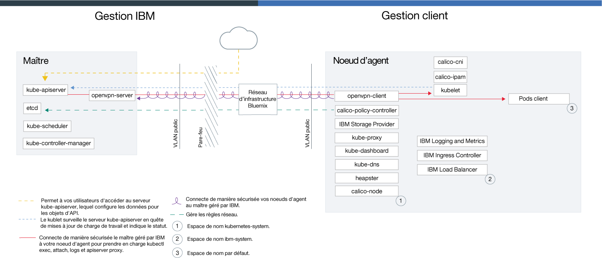

---

copyright:
  years: 2014, 2018
lastupdated: "2018-10-25"

---

{:new_window: target="_blank"}
{:shortdesc: .shortdesc}
{:screen: .screen}
{:pre: .pre}
{:table: .aria-labeledby="caption"}
{:codeblock: .codeblock}
{:tip: .tip}
{:download: .download}

# Technologie d'{{site.data.keyword.containerlong_notm}}

Découvrez la technologie sur laquelle s'appuie {{site.data.keyword.containerlong}}.
{:shortdesc}

## Conteneurs Docker
{: #docker_containers}

S'appuyant sur la technologie de conteneur Linux (LXC), le projet open source Docker a défini des modèles pour conditionner des logiciels dans des unités normalisées, appelées des conteneurs, incluant tous les éléments dont une application a besoin pour s'exécuter. {{site.data.keyword.containerlong_notm}} utilise `containerd` comme environnement d'exécution de conteneur pour déployer des conteneurs à partir d'une image de conteneur Docker dans votre cluster.
{:shortdesc}

En savoir plus sur certains concepts de base Docker :

<dl>
<dt>Image</dt>
<dd>Une image de conteneur sert de base pour tous les conteneurs que vous souhaitez exécuter. Les images de conteneur sont générées à partir d'un fichier Dockerfile, qui correspond à un fichier texte définissant comment construire l'image et qui génère les artefacts à inclure dedans, comme par exemple l'application, la configuration de l'application et les dépendances associées. Les images sont toujours construites à partir d'autres images, ce qui les rend faciles à configurer. Quelqu'un d'autre peut faire le gros du travail sur une image en vous laissant le soin de la personnaliser.</dd>
<dt>Registre</dt>
<dd>Un registre d'images est un endroit où stocker, extraire et partager des images de conteneur. Les images stockées dans un registre peuvent être accessibles au public (registre public) ou uniquement à un petit groupe d'utilisateurs (registre privé). {{site.data.keyword.containerlong_notm}} propose des images publiques, telles que ibmliberty, que vous pouvez utiliser pour créer votre première application conteneurisée. Dans le cas d'applications d'entreprise, utilisez un registre privé tel que celui fourni dans {{site.data.keyword.Bluemix_notm}} pour protéger vos images contre une utilisation par des utilisateurs non autorisés.
</dd>
<dt>Conteneur</dt>
<dd>Chaque conteneur est créé à partir d'une image. Un conteneur est un package d'application avec toutes ses dépendances de sorte que l'application puisse être transférée entre des environnements et exécutée sans modifications. Contrairement aux machines virtuelles, les conteneurs ne virtualisent pas une unité, son système d'exploitation et le matériel sous-jacent. Seuls le code d'application, l'environnement d'exécution, les outils système, les bibliothèques et les paramètres sont inclus dans le conteneur. Les conteneurs opèrent sous forme de processus isolés sur des hôtes de calcul Ubuntu et partagent le système d'exploitation hôte et ses ressources matérielles. Cette approche rend le conteneur encore plus léger, portable et efficace qu'une machine virtuelle.</dd>
</dl>

### Principaux avantages de l'utilisation de conteneurs
{: #container_benefits}

<dl>
<dt>Les conteneurs sont agiles</dt>
<dd>Les conteneurs simplifient l'administration du système en fournissant des environnements standardisés pour des déploiements en phase de développement et de production. L'environnement d'exécution simple permet un dimensionnement rapide par augmentation ou diminution des déploiements. Libérez-vous de la complexité de gérer des plateformes de système d'exploitation différentes et leurs infrastructures sous-jacentes en utilisant des conteneurs qui vous aideront à déployer et à exécuter rapidement et de manière fiable n'importe quelle application sur une infrastructure quelconque.</dd>
<dt>Les conteneurs sont de taille modeste</dt>
<dd>Vous pouvez intégrer beaucoup de conteneurs dans l'espace monopolisé par une seule machine virtuelle.</dd>
<dt>Les conteneurs sont portables</dt>
<dd>
<ul>
  <li>Réutiliser des éléments d'image pour construire des conteneurs. </li>
  <li>Déplacer rapidement le code d'application de l'environnement de transfert aux environnements de production.</li>
  <li>Automatiser vos processus avec des outils de distribution continue.</li>
  </ul>
  </dd>

Découvrez comment [sécuriser vos informations personnelles](cs_secure.html#pi) lorsque vous utilisez des images de conteneur.

Prêt à en savoir plus sur Docker ? <a href="https://developer.ibm.com/courses/all/docker-essentials-extend-your-apps-with-containers/" target="_blank">Découvrez comment Docker et {{site.data.keyword.containerlong_notm}} fonctionnent ensemble en suivant ce cours.</a>

</dl>

 

## Clusters Kubernetes
{: #kubernetes_basics}

Le projet open source intitulé Kubernetes combine l'exécution d'une infrastructure conteneurisée avec des charges de travail en production, des contributions open source et des outils de gestion de conteneurs Docker. L'infrastructure Kubernetes fournit une plateforme d'application isolée et sécurisée pour la gestion des conteneurs, qui est à la fois portable, extensible et dotée de fonctions de réparation spontanée en cas de basculements.
{:shortdesc}

Découvrez des concepts Kubernetes de base comme illustré dans le diagramme suivant.

<dl>
<dt>Compte</dt>
<dd>Les termes "votre compte" font référence à votre compte {{site.data.keyword.Bluemix_notm}}.</dd>

<dt>Cluster</dt>
<dd>Un cluster Kubernetes est composé d'un ou de plusieurs hôtes de calcul dénommés noeuds worker. Les noeuds worker sont gérés par un maître Kubernetes qui assure le contrôle centralisé et la surveillance de toutes les ressources Kubernetes dans le cluster. Donc lorsque vous déployez les ressources pour une application conteneurisée, la maître Kubernetes décide sur quel noeud worker déployer ces ressources, en prenant en compte les exigences de déploiement et la capacité disponible dans le cluster. Les ressources Kubernetes incluent des services, des déploiements et des pods.</dd>

<dt>Service</dt>
<dd>Un service est une ressource Kubernetes qui regroupe un ensemble de pods et fournit la connectivité réseau à ces pods sans exposer l'adresse IP privée réelle de chaque pod. Vous pouvez utiliser un service pour rendre votre application accessible dans votre cluster ou sur l'Internet public.
</dd>

<dt>Déploiement</dt>
<dd>Un déploiement est une ressource Kubernetes où vous pouvez spécifier des informations sur d'autres ressources ou capacités requises pour exécuter votre application, telles que services, stockage persistant ou annotations. Vous documentez un déploiement dans un fichier de configuration YAML que vous appliquez au cluster. Le maître Kubernetes configure les ressources et déploie des conteneurs dans des pods sur les noeuds worker avec la capacité disponible.
  
Définissez des stratégies de mise à jour de votre application, notamment le nombre de pods que vous voulez ajouter lors d'une mise à jour en continu et le nombre de pods pouvant être indisponibles à un moment donné. Lorsque vous effectuez une mise à jour en continu, le déploiement vérifie si la mise à jour fonctionne et l'arrête si des échecs sont détectés.</dd>

<dt>Pod</dt>
<dd>Chaque application conteneurisée déployée dans un cluster est déployée, exécutée et gérée par une ressource Kubernetes dénommée pod. Les pods sont de petites unités déployables dans un cluster Kubernetes et servent à regrouper des conteneurs devant être traités comme une seule unité. Dans la plupart des cas, chaque conteneur est déployé sur son propre pod. Toutefois, une application peut nécessiter qu'un conteneur et d'autres conteneurs auxiliaires soient déployés dans un même pod afin qu'ils soient accessibles via la même adresse IP privée.</dd>

<dt>Application</dt>
<dd>Une application peut se référer à une application complète ou à un composant d'une application. Vous pourriez déployer des composants d'une application dans des composants distincts ou des noeuds worker distincts.</dd>

Découvrez comment [sécuriser vos informations personnelles](cs_secure.html#pi) lorsque vous utilisez des ressources Kubernetes.

Prêt à en savoir plus sur Kubernetes ?

<ul><li><a href="cs_tutorials.html#cs_cluster_tutorial" target="_blank">Développez vos connaissances en termes de terminologie avec le tutoriel Création de clusters</a>.</li>
<li><a href="https://developer.ibm.com/courses/all/get-started-kubernetes-ibm-cloud-container-service/" target="_blank">Découvrez comment Kubernetes et {{site.data.keyword.containerlong_notm}} fonctionnent ensemble en suivant ce cours.</a></li></ul>

</dl>

 

## Architecture de service
{: #architecture}

Dans un cluster Kubernetes qui s'exécute sur {{site.data.keyword.containerlong_notm}}, vos applications conteneurisées sont hébergées sur des hôtes de calcul nommés noeuds worker. Plus précisément, les applications s'exécutent dans des pods et ces pods sont hébergés sur des noeuds worker. Les noeuds worker sont gérés par le maître Kubernetes. Le maître Kubernetes et les noeuds worker communiquent entre eux au moyen de certificats TLS sécurisés et d'une connexion OpenVPN pour orchestrer vos configurations de cluster.
{: shortdesc}

La figure suivante présente les composants de votre cluster et montre comment ils interagissent.

<figure>
 
 <figcaption>Architecture d'{{site.data.keyword.containerlong_notm}}</figcaption>
</figure>

Quelle est la différence entre le maître Kubernetes et un noeud worker ? Bonne question !

<dl>
  <dt>Maître Kubernetes</dt>
    <dd>Le maître Kubernetes est chargé de gérer toutes les ressources de calcul, de réseau et de stockage dans le cluster. Il assure que vos applications et services conteneurisés sont déployés de manière égale sur les noeuds worker dans le cluster. En fonction de la configuration de vos applications et de vos services, le maître détermine le noeud worker qui dispose des ressources suffisantes pour répondre aux besoins de l'application.  Le tableau suivant présente les composants du maître Kubernetes.
    <table>
    <caption>Composants du maître Kubernetes</caption>
    <thead>
    <th>Composant du maître</th>
    <th>Description</th>
    </thead>
    <tbody>
    <tr>
    <td>kube-apiserver</td>
    <td>Le serveur d'API Kubernetes constitue le point d'entrée principal pour toutes les demandes de gestion de cluster du noeud worker au maître Kubernetes. Il valide et traite les demandes qui modifient l'état des ressources Kubernetes, tels que les pods ou les services, et enregistre cet état dans le magasin de données etcd.</td>
    </tr>
    <tr>
    <td>openvpn-server</td>
    <td>Le serveur OpenVPN utilise le client OpenVPN pour connecter le maître au noeud worker de manière sécurisée. Cette connexion prend en charge les commandes kubectl exec, attach, logs et proxy.</td>
    </tr>
    <tr>
    <td>etcd</td>
    <td>etcd est un magasin de paires clé/valeur à haute disponibilité qui contient l'état de toutes les ressources Kubernetes d'un cluster, comme par exemple les services, les déploiements et les pods. Les données etcd sont stockées sur un disque chiffré géré par IBM et sauvegardées quotidiennement.</td>
    </tr>
    <tr>
    <td>kube-scheduler</td>
    <td>Le planificateur de Kubernetes examine les pods qui viennent d'être créés et décide de l'emplacement de leur déploiement en fonction de la capacité, des besoins en matière de performances, des contraintes en matière de réglementation, des spécification en matière d'anti-affinité et des exigences liées aux charges de travail. Si aucun noeud worker ne correspond à ces exigences, le pod n'est pas déployé dans le cluster.</td>
    </tr>
    <tr>
    <td>kube-controller-manager</td>
    <td>Le gestionnaire de contrôleurs Kubernetes est un démon qui examine l'état des ressources de cluster, telles que les jeux de répliques. Lorsque l'état d'une ressource change, par exemple si un pod d'un jeu de répliques tombe en panne, le gestionnaire de contrôleurs initie les actions correctives pour atteindre l'état désiré.</td>
    </tr>
    </tbody></table></dd>
  <dt>Noeud worker</dt>
    <dd>Chaque noeud worker correspond à une machine physique (bare metal) ou à une machine virtuelle qui s'exécute sur du matériel physique dans l'environnement de cloud. Lorsque vous mettez à disposition un noeud worker, vous déterminez les ressources disponibles dans les conteneurs qui sont hébergés sur ce noeud worker. Prêts à l'emploi, vos noeuds worker sont configurés avec un moteur Docker Engine géré par {{site.data.keyword.IBM_notm}}, ainsi que des ressources de calcul, un réseau et un service de volumes distincts. Les fonctions de sécurité intégrées assurent l'isolement, offrent des capacités de gestion des ressources et garantissent la conformité des noeuds worker en matière de sécurité.  Le tableau suivant présente les composants d'un noeud worker.
    <table>
    <caption>Composants des noeuds worker</caption>
    <thead>
    <th>Composant de noeud worker</th>
    <th>Espace de nom</th>
    <th>Description</th>
    </thead>
    <tbody>
    <tr>
    <td>openvpn-client</td>
    <td>kube-system</td>
    <td>Le client OpenVPN utilise le serveur OpenVPN pour connecter le maître au noeud worker de manière sécurisée. Cette connexion prend en charge les commandes kubectl exec, attach, logs et proxy.</td>
    </tr>
    <tr>
    <td>calico-policy-controller</td>
    <td>kube-system</td>
    <td>Le contrôleur Calico Policy Controller examine le trafic réseau entrant et sortant pour voir s'il est conforme aux règles de sécurité établies. Si le trafic n'est pas autorisé dans le cluster, l'accès au cluster est bloqué. Calico Policy Controller est également utilisé pour créer et définir des règles réseau pour un cluster.</td>
    </tr>
    <tr>
    <td>Storage Provider</td>
    <td>kube-system</td>
    <td>Tous les clusters sont configurés avec un plug-in pour mettre à disposition du stockage de fichiers. Vous pouvez opter pour l'installation d'autres modules complémentaires, comme par exemple le stockage par blocs.</td>
    </tr>
    <tr>
    <td>kube-proxy</td>
    <td>kube-system</td>
    <td>Le proxy réseau de Kubernetes est un démon qui s'exécute sur tous les noeuds worker et transfère ou équilibre le trafic réseau TCP et UDP pour les services qui s'exécutent dans le cluster.</td>
    </tr>
    <tr>
    <td>kube-dashboard</td>
    <td>kube-system</td>
    <td>Le tableau de bord Kubernetes est une interface utilisateur Web qui permet aux utilisateur d'assurer la gestion et le traitement des incidents du cluster et des applications qui s'exécutent dans le cluster.</td>
    </tr>
    <tr>
    <td>kube-dns</td>
    <td>kube-system</td>
    <td>Kubernetes DNS planifie un pod et un service DNS sur le cluster. Les conteneurs utilisent automatiquement l'adresse IP du service DNS pour résoudre les noms DNS dans leur recherche d'autres pods et services.</td>
    </tr>
    <tr>
    <td>heapster</td>
    <td>kube-system</td>
    <td>Heapster est un outil d'aggrégation de données d'événement et de surveillance à l'échelle du cluster. Le pod Heapster reconnaît tous les noeuds dans un cluster et interroge les informations d'utilisation à partir du kubelet de chaque noeud. Vous pouvez obtenir des graphiques d'utilisation dans le tableau de bord Kubernetes.</td>
    </tr>
    <tr>
    <td>calico-node</td>
    <td>kube-system</td>
    <td>Le noeud Calico est un conteneur qui regroupe les différents composants requis pour mettre en réseau les conteneurs avec Calico.</td>
    </tr>
    <tr>
    <td>Logging and Metrics</td>
    <td>ibm-system</td>
    <td>Vous pouvez recourir aux services intégrés {{site.data.keyword.loganalysislong_notm}} et {{site.data.keyword.monitoringlong_notm}} pour étendre vos fonctions de collecte et de conservation lorsque vous utiliser des journaux et des indicateurs.</td>
    </tr>
    <tr>
    <td>ALB Ingress</td>
    <td>ibm-system</td>
    <td>Ingress est un service Kubernetes que vous pouvez utiliser pour l'équilibrage de vos charges de travail réseau dans votre cluster en transférant des demandes publiques ou privées à plusieurs applications dans votre cluster. Pour exposer vos applications sur le réseau public ou privé, vous devez créer une ressource Ingress pour enregistrer vos applications auprès de l'équilibreur de charge d'application (ALB) Ingress. L'accès à plusieurs applications peut alors s'effectuer en utilisant une seule adresse URL ou une seule adresse IP.</td>
    </tr>
    <tr>
    <td>Equilibreur de charge</td>
    <td>ibm-system</td>
    <td>Un équilibreur de charge est un service Kubernetes que vous pouvez utiliser pour l'équilibrage de vos charges de travail réseau dans votre cluster en transférant des demandes publiques ou privées à une application.</td>
    </tr>
    <tr>
    <td>Pods et services d'application</td>
    <td>default</td>
    <td>Dans l'espace de nom <code>default</code> ou dans les espaces de nom que vous créez, vous pouvez déployer des applications dans des pods et des services pour communiquer avec ces pods.</td>
    </tr>
    <tr>
    <td>calico-cni</td>
    <td>n/a</td>
    <td>L'interface CNI (Container Network Interface) de Calico gère la connectivité réseau de vos conteneurs et supprime les ressources allouées lorsqu'un conteneur est supprimé.</td>
    </tr>
    <tr>
    <td>calico-ipam</td>
    <td>n/a</td>
    <td>Calico IPAM gère l'affectation d'adresses IP pour les conteneurs.</td>
    </tr>
    <tr>
    <td>kubelet</td>
    <td>n/a</td>
    <td>Le kubelet est un pod qui s'exécute sur tous les noeuds worker et qui est chargé de surveiller l'intégrité des pods qui s'exécutent sur le noeud worker et de contrôler les événements envoyés par le serveur d'API Kubernetes. En fonction des événements, le kubelet crée ou supprime des pods, assure la mise en place des sondes Liveness probe et Readiness probe et renvoie le statut des pods au serveur d'API Kubernetes.</td>
    </tr>
    </tbody></table></dd>
</dl>

Vous souhaitez voir comment utiliser {{site.data.keyword.containerlong_notm}} avec d'autres produits et services ? Consultez quelques exemples d'[intégrations](cs_integrations.html#integrations).
{: tip}
