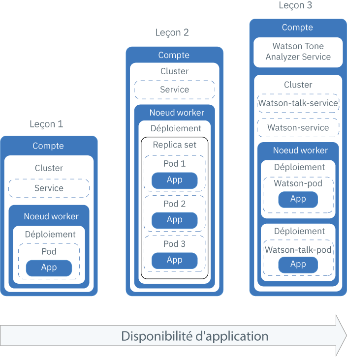
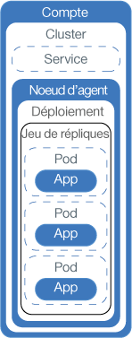
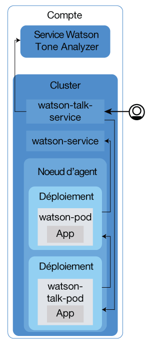

---

copyright:
  years: 2014, 2018
lastupdated: "2018-4-20"

---

{:new_window: target="_blank"}
{:shortdesc: .shortdesc}
{:screen: .screen}
{:pre: .pre}
{:table: .aria-labeledby="caption"}
{:codeblock: .codeblock}
{:tip: .tip}
{:download: .download}


# Tutoriel : Déploiement d'applications dans des clusters
{: #cs_apps_tutorial}

Découvrez comment utiliser {{site.data.keyword.containerlong}} afin de déployer une application conteneurisée tirant parti de {{site.data.keyword.watson}} {{site.data.keyword.toneanalyzershort}}.
{: shortdesc}

Dans ce scénario, une entreprise de RP fictive utilise le service {{site.data.keyword.Bluemix_notm}} pour analyser ses communiqués de presse et recevoir un retour d'informations sur le ton de ses messages.

En utilisant le cluster Kubernetes créé dans le dernier tutoriel, le développeur d'application de l'entreprise de RP déploie une version Hello World de l'application. En s'appuyant sur chaque leçon du tutoriel, le développeur déploie progressivement des versions plus complexes de la même application. Le diagramme ci-après décrit les composants de chaque déploiement d'après la leçon.



Comme illustré dans le diagramme, Kubernetes utilise plusieurs types de ressources pour rendre vos applications opérationnelles dans des clusters. Dans Kubernetes, les déploiements et les services fonctionnent en tandem. Les déploiements incluent les définitions pour l'application (par exemple, l'image à utiliser pour le conteneur et le port à exposer pour l'application). Lorsque vous créez un déploiement, un pod Kubernetes est créé pour chaque conteneur que vous avez défini dans le déploiement. Pour rendre votre application plus résiliente, vous pouvez définir plusieurs instances de la même application dans votre déploiement et permettre à Kubernetes de créer automatiquement un jeu de répliques pour vous. Le jeu de répliques surveille les pods et garantit que le nombre de pods désiré est en opération en tout temps. Si un pod ne répond plus, il est recréé automatiquement.

Les services regroupent un ensemble de pods et fournissent une connexion réseau vers ces pods à d'autres services dans le cluster sans exposer l'adresse IP privée réelle de chaque pod. Vous pouvez utiliser les services Kubernetes pour rendre une application accessible à d'autres pods dans le cluster ou pour l'exposer sur Internet. Dans ce tutoriel, vous utiliserez un service Kubernetes pour accéder depuis Internet à votre application en opération en utilisant l'adresse IP publique affectée automatiquement à un noeud worker et un port public.

Pour rendre votre application encore plus disponible, dans les clusters standard, vous pouvez créer plusieurs noeuds worker, de manière à disposer encore d'un plus grand nombre de répliques de votre application. Cette tâche n'est pas couverte par le tutoriel, mais envisagez-la en vue d'améliorations futures de la disponibilité d'une application.

Une seule leçon couvre l'intégration d'un service {{site.data.keyword.Bluemix_notm}} dans une application, mais vous pouvez les utiliser qu'il s'agisse d'une application toute simple, ou aussi complexe que vous pouvez imaginer.

## Objectifs

* Assimiler la terminologie Kubernetes de base
* Envoyer par commande push une image vers votre espace de nom du registre dans {{site.data.keyword.registryshort_notm}}
* Rendre une application accessible au public
* Déployer une instance unique d'une application dans un cluster à l'aide d'une commande Kubernetes et d'un script
* Déployer plusieurs instances d'une application dans des conteneurs recréés lors des diagnostics d'intégrité
* Déployer une application utilisant des fonctionnalités d'un service {{site.data.keyword.Bluemix_notm}}

## Durée

40 minutes

## Publics

Développeurs de logiciels et administrateurs réseau n'ayant encore jamais déployé une application dans un cluster Kubernetes.

## Conditions prérequises

* [Tutoriel : Création de clusters Kubernetes dans {{site.data.keyword.containershort_notm}}](cs_tutorials.html#cs_cluster_tutorial).

## Leçon 1 : Déploiement d'applications avec instance unique dans des clusters Kubernetes
{: #cs_apps_tutorial_lesson1}

Au cours du tutoriel précédent, vous avez créé un cluster avec un seul noeud worker. Dans cette leçon, vous allez configurer un déploiement et déployer une instance unique de l'application sur un noeud Kubernetes dans le noeud worker.
{:shortdesc}

Les composants que vous déployez en suivant cette leçon sont illustrés dans le diagramme suivant.


Pour déployer l'application :

1.  Clonez le code source de l'application [Hello World ](https://github.com/IBM/container-service-getting-started-wt) dans votre répertoire utilisateur de base. Ce répertoire héberge différentes versions d'une application similaire dans des dossiers débutant chacun par `Lab`. Chaque version contient les fichiers suivants :
    * `Dockerfile` : définitions pour génération de l'image.
    * `app.js` : application Hello World.
    * `package.json` : métadonnées de l'application.

    ```
    git clone https://github.com/IBM/container-service-getting-started-wt.git
    ```
    {: pre}

2.  Accédez au répertoire `Lab 1`.

    ```
    cd 'container-service-getting-started-wt/Lab 1'
    ```
    {: pre}

3. Connectez-vous à l'interface CLI d'{{site.data.keyword.Bluemix_notm}}. A l'invite, entrez vos données d'identification {{site.data.keyword.Bluemix_notm}}. Pour stipuler une région {{site.data.keyword.Bluemix_notm}}, [incluez son noeud final d'API](cs_regions.html#bluemix_regions).
  ```
  bx login [--sso]
  ```
  {: pre}

  **Remarque **: si la connexion échoue, il se peut que votre ID soit fédéré. Essayez d'adjoindre en suffixe la balise `--sso` à la commande. Utilisez l'URL indiquée dans votre sortie CLI pour extraire un code ponctuel.

4. Définissez dans votre interface CLI le contexte du cluster.
    1. Obtenez la commande permettant de définir la variable d'environnement et téléchargez les fichiers de configuration Kubernetes.

        ```
        bx cs cluster-config <cluster_name_or_ID>
        ```
        {: pre}

        Une fois les fichiers de configuration téléchargés, une commande s'affiche ; elle vous permet de définir le chemin vers le fichier de configuration Kubernetes local en tant que variable d'environnement.
    2.  Copiez et collez la sortie afin de définir la variable d'environnement `KUBECONFIG`.

        Exemple pour OS X :

        ```
        export KUBECONFIG=/Users/<user_name>/.bluemix/plugins/container-service/clusters/<pr_firm_cluster>/kube-config-prod-dal10-pr_firm_cluster.yml
        ```
        {: screen}

5.  Connectez-vous à l'interface CLI de {{site.data.keyword.registryshort_notm}}. **Remarque** : vérifiez que vous avez le plug-in container-registry [installé](/docs/services/Registry/index.html#registry_cli_install).

    ```
    bx cr login
    ```
    {: pre}
    -   Si vous ne vous rappelez plus de votre espace de nom dans {{site.data.keyword.registryshort_notm}}, exécutez la commande suivante.

        ```
        bx cr namespace-list
        ```
        {: pre}

6. Lancez Docker.
    * Si vous utilisez Docker CE, aucune action n'est nécessaire.
    * Si vous utilisez Linux, reportez-vous à la [documentation Docker ](https://docs.docker.com/engine/admin/) pour obtenir les instructions de lancement de Docker selon la distribution Linux que vous utilisez.
    * Si vous utilisez Docker Toolbox sur Windows ou OSX, vous pouvez utiliser le programme Docker Quickstart Terminal, lequel démarre Docker pour vous. Utilisez ce programme dans les prochaines étapes pour exécuter les commandes Docker, puis revenez à l'interface CLI pour définir la variable de session `KUBECONFIG`.

7.  Générez une image Docker incluant les fichiers d'application du répertoire `Lab 1`. Si vous avez besoin de modifier l'application plus tard, répétez ces étapes pour créer une autre version de l'image.

    

    1.  Générez l'image sur votre poste local. Spécifiez le nom et la balise que vous désirez utiliser. Prenez soin d'utiliser l'espace de nom que vous avez créé dans {{site.data.keyword.registryshort_notm}} au cours du précédent tutoriel. Le balisage de l'image avec les informations de l'espace de nom indique à Docker où la commande push doit transférer l'image lors d'une étape ultérieure . Utilisez uniquement des caractères alphanumériques en minuscules ou des traits de soulignement (`_`) dans le nom de l'image. N'oubliez pas le point (`.`à la fin de la commande. Le signe point indique à Docker de rechercher le Dockerfile et les artefacts de génération de l'image dans le répertoire actuel.

        ```
        docker build -t registry.<region>.bluemix.net/<namespace>/hello-world:1 .
        ```
        {: pre}

        Lorsque la génération est terminée, vérifiez que le message de réussite suivant est bien affiché :
        ```
        Successfully built <image_id>
        Successfully tagged <image_tag>
        ```
        {: screen}

    2.  Transférez l'image par commande push à votre espace de nom dans le registre.

        ```
        docker push registry.<region>.bluemix.net/<namespace>/hello-world:1
        ```
        {: pre}

        Exemple de sortie :

        ```
        The push refers to a repository [registry.ng.bluemix.net/pr_firm/hello-world]
        ea2ded433ac8: Pushed
        894eb973f4d3: Pushed
        788906ca2c7e: Pushed
        381c97ba7dc3: Pushed
        604c78617f34: Pushed
        fa18e5ffd316: Pushed
        0a5e2b2ddeaa: Pushed
        53c779688d06: Pushed
        60a0858edcd5: Pushed
        b6ca02dfe5e6: Pushed
        1: digest: sha256:0d90cb73288113bde441ae9b8901204c212c8980d6283fbc2ae5d7cf652405
        43 size: 2398
        ```
        {: screen}

8.  Les déploiements sont utilisés pour gérer les pods, lesquels contiennent des instances conteneurisées d'une application. La commande suivante déploie l'application sur un pod unique. Dans le cadre de ce tutoriel, le déploiement est intitulé hello-world-deployment, mais vous pouvez lui attribuer le nom de votre choix. Si vous avez utilisé le terminal Docker Quickstart pour exécuter des commandes Docker, prenez soin de revenir à l'interface CLI que vous aviez utilisée pour définir la variable de session `KUBECONFIG`.

    ```
    kubectl run hello-world-deployment --image=registry.<region>.bluemix.net/<namespace>/hello-world:1
    ```
    {: pre}

    Exemple de sortie :

    ```
    deployment "hello-world-deployment" created
    ```
    {: screen}

    

9.  Rendez l'application accessible au public en exposant le déploiement en tant que service NodePort. Tout comme quand vous exposez un port pour une application Cloud Foundry, le NodePort que vous exposez est celui sur lequel le noeud worker est à l'écoute de trafic.

    ```
    kubectl expose deployment/hello-world-deployment --type=NodePort --port=8080 --name=hello-world-service --target-port=8080
    ```
    {: pre}

    Exemple de sortie :

    ```
    service "hello-world-service" exposed
    ```
    {: screen}

    <table>
    <table summary=“Information about the expose command parameters.”>
    <thead>
    <th colspan=2> Informations additionnelles sur les paramètres de la commande expose</th>
    </thead>
    <tbody>
    <tr>
    <td><code>expose</code></td>
    <td>Expose une ressource en tant que service Kubernetes et la rend disponible au public des utilisateurs.</td>
    </tr>
    <tr>
    <td><code>deployment/<em>&lt;hello-world-deployment&gt;</em></code></td>
    <td>Type et nom de la ressource à exposer avec ce service.</td>
    </tr>
    <tr>
    <td><code>--name=<em>&lt;hello-world-service&gt;</em></code></td>
    <td>Nom du service.</td>
    </tr>
    <tr>
    <td><code>--port=<em>&lt;8080&gt;</em></code></td>
    <td>Port à utiliser pour le service.</td>
    </tr>
    <tr>
    <td><code>--type=NodePort</code></td>
    <td>Type de service à créer.</td>
    </tr>
    <tr>
    <td><code>--target-port=<em>&lt;8080&gt;</em></code></td>
    <td>Port vers lequel le service achemine le trafic. En l'occurrence, le port cible est le même que le port du service, mais d'autres applications que vous créez pourraient utiliser des ports différents.</td>
    </tr>
    </tbody></table>

10. Maintenant que la tâche de déploiement est terminée, vous pouvez tester votre application dans un navigateur. Extrayez les informations détaillées pour composer l'URL.
    1.  Extrayez les informations sur le service pour déterminer quel NodePort a été affecté.

        ```
        kubectl describe service hello-world-service
        ```
        {: pre}

        Exemple de sortie :

        ```
        Name:                   hello-world-service
        Namespace:              default
        Labels:                 run=hello-world-deployment
        Selector:               run=hello-world-deployment
        Type:                   NodePort
        IP:                     10.xxx.xx.xxx
        Port:                   <unset> 8080/TCP
        NodePort:               <unset> 30872/TCP
        Endpoints:              172.30.xxx.xxx:8080
        Session Affinity:       None
        No events.
        ```
        {: screen}

        Les NodePorts sont affectés aléatoirement lorsqu'ils sont générés par la commande `expose`, mais sur la plage 30000 à 32767. Dans cet exemple, la valeur de NodePort est 30872.

    2.  Identifiez l'adresse IP publique du noeud worker dans le cluster.

        ```
        bx cs workers <cluster_name_or_ID>
        ```
        {: pre}

        Exemple de sortie :

        ```
        bx cs workers pr_firm_cluster
        Listing cluster workers...
        OK
        ID                                                 Public IP       Private IP       Machine Type   State    Status   Location   Version
        kube-mil01-pa10c8f571c84d4ac3b52acbf50fd11788-w1   169.xx.xxx.xxx  10.xxx.xx.xxx    free           normal   Ready    mil01      1.8.11
        ```
        {: screen}

11. Ouvre un navigateur et accédez à l'application via l'URL `http://<IP_address>:<NodePort>`. En utilisant les valeurs de l'exemple, l'URL est `http://169.xx.xxx.xxx:30872`. Lorsque vous entrez cette URL dans un navigateur, le texte suivant apparaît.

    ```
    Hello World! Your app is up and running in a cluster!
    ```
    {: screen}

    Vous pouvez communiquer cette URL à un collègue pour qu'il l'essaye, ou bien l'entrer dans le navigateur de votre téléphone portable pour constater que l'application Hello World est réellement accessible au public.

12. [Lancez le tableau de bord Kubernetes](cs_app.html#cli_dashboard). Notez que les étapes varient selon votre version de kubernetes.

13. Vous pouvez examiner dans l'onglet **Charges de travail** les ressources que vous avez créées. Lorsque vous avez fini d'explorer le tableau de bord Kubernetes, utilisez les touches CTRL+C pour quitter la commande `proxy`.

Félicitations ! Vous venez de déployer la première version de l'application.

Trop de commandes dans cette leçon ? Nous sommes bien d'accord. Que diriez-vous d'utiliser un script de configuration pour se charger d'une partie du travail à votre place ? Pour utiliser un script de configuration pour la seconde version de l'application et pour
promouvoir une plus haute disponibilité en déployant plusieurs instances de l'application, passez à la leçon suivante.

<br />


## Leçon 2 : Déploiement et mise à jour d'applications avec une plus haute disponibilité
{: #cs_apps_tutorial_lesson2}

Dans cette leçon, vous allez déployer trois instances de l'application Hello World dans un cluster pour assurer une plus haute disponibilité de l'application que dans la première version.
{:shortdesc}

Une plus haute disponibilité signifie que l'accès utilisateur est divisé entre les trois instances. Lorsqu'un trop grand nombre d'utilisateurs tentent d'accéder à la même instance de l'application, ils peuvent être confrontés à des temps de réponse lents. L'existence de plusieurs instances peut induire des temps de réponse plus rapides pour vos utilisateurs. Dans cette leçon, vous découvrirez également comment des diagnostics d'intégrité et des mises à jour de déploiements peuvent opérer avec Kubernetes. Le diagramme suivant inclut les composants que vous déployez dans cette leçon.



Au cours du tutoriel précédent, vous avez créé votre compte et un cluster avec un noeud worker unique. Dans cette leçon, vous configurez un déploiement et déployez trois instances de l'application Hello world. Chaque instance est déployée dans un pod Kubernetes dans le cadre d'un jeu de répliques dans le noeud worker. Pour une disponibilité publique, vous créez également un service Kubernetes.

Comme défini dans le script de configuration, Kubernetes peut utiliser une vérification de la disponibilité pour déterminer si un conteneur dans un pod est en opération ou non. Ces vérifications peuvent, par exemple, identifier des interblocages, où une application est en opération, mais ne parvient pas à progresser. Le redémarrage d'un conteneur dans cette situation peut aider à rendre l'application disponible malgré les bogues. Kubernetes utilise ensuite une vérification de l'état de préparation du conteneur pour déterminer quand il est à nouveau prêt à accepter le trafic. Un pod est considéré comme prêt quand son conteneur est lui-même prêt. Une fois le pod prêt, il est redémarré. Dans cette version de l'application, son délai d'attente expire toutes les 15 secondes. Lorsqu'un diagnostic d'intégrité est configuré dans le script de configuration, les conteneurs sont recréés si cette vérification détecte un problème affectant une application.

1.  Depuis une interface CLI, accédez au répertoire `Lab 2`.

  ```
  cd 'container-service-getting-started-wt/Lab 2'
  ```
  {: pre}

2.  Si vous aviez lancé une nouvelle session CLI, connectez-vous et définissez le contexte du cluster.

3.  Générez et indexez la seconde version de l'application localement en tant qu'image. Ici aussi, n'oubliez pas le point (`.`) à la fin de la commande.

  ```
  docker build -t registry.<region>.bluemix.net/<namespace>/hello-world:2 .
  ```
  {: pre}

  Vérifiez qu'un message de réussite est bien affiché.

  ```
  Successfully built <image_id>
  ```
  {: screen}

4.  Envoyez par commande push la seconde version de l'image à votre espace de nom du registre. Patientez jusqu'à ce que l'image ait été envoyée par la commande push avant de passer à l'étape suivante.

  ```
  docker push registry.<region>.bluemix.net/<namespace>/hello-world:2
  ```
  {: pre}

  Exemple de sortie :

  ```
  The push refers to a repository [registry.ng.bluemix.net/pr_firm/hello-world]
  ea2ded433ac8: Pushed
  894eb973f4d3: Pushed
  788906ca2c7e: Pushed
  381c97ba7dc3: Pushed
  604c78617f34: Pushed
  fa18e5ffd316: Pushed
  0a5e2b2ddeaa: Pushed
  53c779688d06: Pushed
  60a0858edcd5: Pushed
  b6ca02dfe5e6: Pushed
  1: digest: sha256:0d90cb73288113bde441ae9b8901204c212c8980d6283fbc2ae5d7cf652405
  43 size: 2398
  ```
  {: screen}

5.  Ouvrez le fichier `healthcheck.yml` situé dans le répertoire `Lab 2` dans un éditeur de texte. Ce script de configuration agrège quelques étapes de la leçon précédente pour créer en même temps un déploiement et un service. Les développeurs d'application de l'entreprise PR peuvent utiliser ces scripts lors de mises à jour ou pour traiter les incidents en recréant les pods.
    1. Mettez à jour les informations de l'image dans votre espace de nom du registre privé.

        ```
        image: "registry.<region>.bluemix.net/<namespace>/hello-world:2"
        ```
        {: pre}

    2.  Dans la section **Deployment**, observez la valeur de `replicas`. la valeur de replicas désigne le nombre d'instances de votre application. L'exécution de trois instances assure une plus haute disponibilité de votre application qu'une seule instance.

        ```
        replicas: 3
        ```
        {: pre}

    3.  Notez la sonde HTTP liveness qui effectue un bilan de santé du conteneur toutes les 5 secondes.

        ```
        livenessProbe:
                    httpGet:
                      path: /healthz
                      port: 8080
                    initialDelaySeconds: 5
                    periodSeconds: 5
        ```
        {: codeblock}

    4.  Dans la section **Service**, observez la valeur de `NodePort`. Au lieu de générer aléatoirement un NodePort comme dans la leçon précédente, vous pouvez spécifier un port sur la plage 30000 à 32767. Cet exemple utilise le port 30072.

6.  Revenez à l'interface CLI que vous avez utilisée pour définir le contexte de votre cluster et lancez le script de configuration. Une fois le déploiement et le service créés, l'application est visible aux utilisateurs de l'entreprise PR.

  ```
  kubectl apply -f healthcheck.yml
  ```
  {: pre}

  Exemple de sortie :

  ```
  deployment "hw-demo-deployment" created
  service "hw-demo-service" created
  ```
  {: screen}

7.  A présent que la tâche de déploiement est terminée, vous pouvez ouvrir un navigateur et vérifier le fonctionnement de l'application. Pour composer l'URL, utilisez pour votre noeud worker la même adresse IP publique que dans la leçon précédente et combinez-la avec le NodePort spécifié dans le script de configuration. Pour obtenir l'adresse IP publique du noeud worker, utilisez la commande suivante :

  ```
  bx cs workers <cluster_name_or_ID>
  ```
  {: pre}

  En utilisant les valeurs de l'exemple, l'URL est `http://169.xx.xxx.xxx:30072`. Dans un navigateur, le texte suivant pourrait s'afficher. Si ce n'est pas le cas, ne vous inquiétez pas. Cette application est conçue pour s'ouvrir et se fermer.

  ```
  Hello World! Great job getting the second stage up and running!
  ```
  {: screen}

  Vous pouvez également vérifier l'URL `http://169.xx.xxx.xxx:30072/healthz` pour obtenir le statut.

  Pour les premières 10 - 15 secondes, un message 200 est renvoyé, ce qui indique que l'application fonctionne correctement. Au bout de ces 15 secondes, un message d'expiration du délai imparti s'affiche. Ce comportement est inattendu.

  ```
  {
    "error": "Timeout, Health check error!"
  }
  ```
  {: screen}

8.  [Lancez le tableau de bord Kubernetes](cs_app.html#cli_dashboard). Notez que les étapes varient selon votre version de kubernetes.

9. Vous pouvez examiner dans l'onglet **Charges de travail** les ressources que vous avez créées. Depuis cet onglet, vous pouvez actualiser l'écran continuellement et constater que le diagnostic d'intégrité opère. Dans la section **Pods**, vous pouvez observer combien de fois les pods sont redémarrés quand leurs conteneurs sont recréés. Si l'erreur ci-après s'affiche dans le tableau de bord, ce message indique que le diagnostic d'intégrité a identifié un problème. Patientez quelques minutes, puis actualisez à nouveau la page. Le nombre de tentatives de redémarrage pour chaque pod est affiché.

    ```
    Liveness probe failed: HTTP probe failed with statuscode: 500
    Back-off restarting failed docker container
    Error syncing pod, skipping: failed to "StartContainer" for "hw-container" with CrashLoopBackOff: "Back-off 1m20s restarting failed container=hw-container pod=hw-demo-deployment-3090568676-3s8v1_default(458320e7-059b-11e7-8941-56171be20503)"
    ```
    {: screen}

    Lorsque vous avez fini d'explorer le tableau de bord Kubernetes, utilisez dans votre interface CLI les touches CTRL+C pour quitter la commande `proxy`.


Félicitations ! Vous avez déployé la seconde version de l'application. Vous n'avez eu à utiliser que moins de commandes, avez appris comment opère le diagnostic d'intégrité et avez édité un déploiement, ce qui est parfait ! L'application Hello World pour l'entreprise PR a réussi le test. Vous pouvez maintenant déployer une application plus utile pour l'entreprise de RP et commencer à analyser les communiqués de presse.

Prêt à supprimer ce que vous avez créé avant de continuer ? Cette fois, vous pouvez utiliser le même script de configuration pour supprimer les deux ressources que vous avez créées.

  ```
  kubectl delete -f healthcheck.yml
  ```
  {: pre}

  Exemple de sortie :

  ```
  deployment "hw-demo-deployment" deleted
  service "hw-demo-service" deleted
  ```
  {: screen}

<br />


## Leçon 3 : Déploiement et mise à jour de l'application Watson Tone Analyzer
{: #cs_apps_tutorial_lesson3}

Dans les leçons précédentes, les applications étaient déployées en tant que composants uniques dans un seul noeud worker. Dans cette leçon, vous pouvez déployer deux composants d'une application dans un cluster qui utilise le service {{site.data.keyword.watson}} {{site.data.keyword.toneanalyzershort}}.
{:shortdesc}

La dispersion des composants dans des conteneurs différents permet de mettre à jour un composant sans affecter l'autre. Vous mettrez ensuite à jour l'application pour l'étoffer avec d'autres répliques afin de la rendre plus disponible. Le diagramme suivant inclut les composants que vous déployez dans cette leçon.



Depuis le tutoriel précédent, vous disposez de votre compte et d'un cluster contenant un noeud worker. Dans cette leçon, vous allez créer une instance du service {{site.data.keyword.watson}} {{site.data.keyword.toneanalyzershort}} dans votre compte {{site.data.keyword.Bluemix_notm}} et configurer deux déploiements, un pour chaque composant de l'application. Chaque composant est déployé dans un pod Kubernetes dans le noeud worker. Pour que ces deux composants soient publics, vous créez également un service Kubernetes pour chaque composant.


### Leçon 3a : Déploiement de l'application {{site.data.keyword.watson}} {{site.data.keyword.toneanalyzershort}}
{: #lesson3a}

1.  Depuis une interface CLI, accédez au répertoire `Lab 3`.

  ```
  cd 'container-service-getting-started-wt/Lab 3'
  ```
  {: pre}

2.  Si vous aviez lancé une nouvelle session CLI, connectez-vous et définissez le contexte du cluster.

3.  Générez la première image {{site.data.keyword.watson}}.

    1.  Accédez au répertoire `watson`.

        ```
        cd watson
        ```
        {: pre}

    2.  Générez et indexez la première partie de l'application localement en tant qu'image. Ici aussi, n'oubliez pas le point (`.`) à la fin de la commande. Si vous utilisez le terminal Docker Quickstart pour exécuter des commandes Docker, prenez soin de basculer entre les interfaces CLI.

        ```
        docker build -t registry.<region>.bluemix.net/<namespace>/watson .
        ```
        {: pre}

        Vérifiez qu'un message de réussite est bien affiché.

        ```
        Successfully built <image_id>
        ```
        {: screen}

    3.  Transférez par commande push la première partie de l'application en tant qu'image dans votre espace de nom du registre d'images privé. Patientez jusqu'à ce que l'image ait été envoyée par la commande push avant de passer à l'étape suivante.

        ```
        docker push registry.<region>.bluemix.net/<namespace>/watson
        ```
        {: pre}

4.  Générez l'image {{site.data.keyword.watson}}-talk.

    1.  Accédez au répertoire `watson-talk`.

        ```
        cd 'container-service-getting-started-wt/Lab 3/watson-talk'
        ```
        {: pre}

    2.  Générez et indexez la seconde partie de l'application localement en tant qu'image. Ici aussi, n'oubliez pas le point (`.`) à la fin de la commande.

        ```
        docker build -t registry.<region>.bluemix.net/<namespace>/watson-talk
        ```
        {: pre}

        Vérifiez qu'un message de réussite est bien affiché.

        ```
        Successfully built <image_id>
        ```
        {: screen}

    3.  Transférez par commande push la seconde partie de l'application vers votre espace de nom du registre d'images privé. Patientez jusqu'à ce que l'image ait été envoyée par la commande push avant de passer à l'étape suivante.

        ```
        docker push registry.<region>.bluemix.net/<namespace>/watson-talk
        ```
        {: pre}

5.  Vérifiez que les images ont bien été ajoutées à votre espace de nom du registre. Si vous avez utilisé le terminal Docker Quickstart pour exécuter des commandes Docker, prenez soin de revenir à l'interface CLI que vous aviez utilisée pour définir la variable de session `KUBECONFIG`.

    ```
    bx cr images
    ```
    {: pre}

    Exemple de sortie :

    ```
    Listing images...

    REPOSITORY                                      NAMESPACE  TAG      DIGEST         CREATED         SIZE     VULNERABILITY STATUS
    registry.ng.bluemix.net/namespace/hello-world   namespace  1        0d90cb732881   40 minutes ago  264 MB   OK
    registry.ng.bluemix.net/namespace/hello-world   namespace  2        c3b506bdf33e   20 minutes ago  264 MB   OK
    registry.ng.bluemix.net/namespace/watson        namespace  latest   fedbe587e174   3 minutes ago   274 MB   OK
    registry.ng.bluemix.net/namespace/watson-talk   namespace  latest   fedbe587e174   2 minutes ago   274 MB   OK
    ```
    {: screen}

6.  Ouvrez le fichier `watson-deployment.yml` situé dans le répertoire `Lab 3` dans un éditeur de texte. Ce script de configuration inclut un déploiement et un service tant pour le composant watson que pour le composant watson-talk de l'application.

    1.  Mettez à jour les informations de l'image dans votre espace de nom du registre pour les deux déploiements.

        watson:

        ```
        image: "registry.<region>.bluemix.net/namespace/watson"
        ```
        {: codeblock}

        watson-talk:

        ```
        image: "registry.<region>.bluemix.net/namespace/watson-talk"
        ```
        {: codeblock}

    2.  Dans la section volumes du déploiement Watson, mettez à jour le nom de la clé confidentielle {{site.data.keyword.watson}} {{site.data.keyword.toneanalyzershort}} avec celle que vous avez créée dans le tutoriel précédent. En montant la valeur confidentielle Kubernetes en tant que volume dans votre déploiement, vous mettez les données d'identification du service {{site.data.keyword.Bluemix_notm}} à disposition du conteneur exécuté dans votre pod. Les composants de l'application {{site.data.keyword.watson}} de ce tutoriel sont configurés pour rechercher les données d'identification du service à l'aide du chemin de montage du volume.

        ```
        volumes:
                - name: service-bind-volume
                  secret:
                    defaultMode: 420
                    secretName: binding-mytoneanalyzer
        ```
        {: codeblock}

        Si vous avez oublié le nom de la valeur confidentielle, exécutez la commande suivante.

        ```
        kubectl get secrets --namespace=default
        ```
        {: pre}

    3.  Dans la section du service watson-talk, notez la valeur définie pour `NodePort`. Cet exemple utilise 30080.

7.  Exécutez le script de configuration.

  ```
  kubectl apply -f watson-deployment.yml
  ```
  {: pre}

8.  Facultatif : Vérifiez que la valeur confidentielle de {{site.data.keyword.watson}} {{site.data.keyword.toneanalyzershort}} est montée en tant que volume sur le pod.

    1.  Pour identifier le nom d'un pod Watson, exécutez la commande suivante.

        ```
        kubectl get pods
        ```
        {: pre}

        Exemple de sortie :

        ```
        NAME                                 READY     STATUS    RESTARTS  AGE
        watson-pod-4255222204-rdl2f          1/1       Running   0         13h
        watson-talk-pod-956939399-zlx5t      1/1       Running   0         13h
        ```
        {: screen}

    2.  Obtenez les détails du pod et recherchez le nom de la clé confidentielle.

        ```
        kubectl describe pod <pod_name>
        ```
        {: pre}

        Exemple de sortie :

        ```
        Volumes:
          service-bind-volume:
            Type:       Secret (a volume populated by a Secret)
            SecretName: binding-mytoneanalyzer
          default-token-j9mgd:
            Type:       Secret (a volume populated by a Secret)
            SecretName: default-token-j9mgd
        ```
        {: codeblock}

9.  Ouvrez un navigateur et analysez un texte. Format de l'URL : `http://<worker_node_IP_address>:<watson-talk-nodeport>/analyze/"<text_to_analyze>"`.

    Exemple :

    ```
    http://169.xx.xxx.xxx:30080/analyze/"Today is a beautiful day"
    ```
    {: screen}

    Dans un navigateur, vous pouvez voir la réponse JSON pour le texte que vous avez saisi.

10.  [Lancez le tableau de bord Kubernetes](cs_app.html#cli_dashboard). Notez que les étapes varient selon votre version de kubernetes.

11. Vous pouvez examiner dans l'onglet **Charges de travail** les ressources que vous avez créées. Lorsque vous avez fini d'explorer le tableau de bord Kubernetes, utilisez les touches CTRL+C pour quitter la commande `proxy`.

### Leçon 3b. Mise à jour du déploiement Watson Tone Analyzer en exécution
{: #lesson3b}

Vous pouvez éditer un déploiement en cours d'exécution en modifiant des valeurs dans le modèle de pod. Cette leçon comprend la mise à jour de l'image qui a été utilisée. L'entreprise de relations publiques désire modifier l'application dans le déploiement.

Modifiez le nom de l'image :

1.  Ouvrez les détails de configuration pour le déploiement en cours.

    ```
    kubectl edit deployment/watson-talk-pod
    ```
    {: pre}

    En fonction de votre système d'exploitation, un éditeur vi ou un éditeur de texte s'ouvre de votre système d'exploitation.

2.  Modifiez le nom de l'image en image ibmliberty.

    ```
    spec:
              containers:
              - image: registry.<region>.bluemix.net/ibmliberty:latest
    ```
    {: codeblock}

3.  Enregistrez vos modifications et quittez l'éditeur.

4.  Appliquez les modifications au déploiement en cours.

    ```
    kubectl rollout status deployment/watson-talk-pod
    ```
    {: pre}

    Attendez la confirmation que le déploiement s'est achevé.

    ```
    deployment "watson-talk-pod" successfully rolled out
    ```
    {: screen}

    Lorsque vous déployez une modification, un autre pod est créé et testé par Kubernetes. Si le test aboutit, l'ancien pod est supprimé.

[Testez vos connaissances en répondant à un quiz !](https://ibmcloud-quizzes.mybluemix.net/containers/apps_tutorial/quiz.php)

Félicitations ! Vous avez déployé l'application {{site.data.keyword.watson}} {{site.data.keyword.toneanalyzershort}}. L'entreprise PR peut absolument commencer à utiliser ce déploiement de l'application pour analyser ses communiqués de presse.

Prêt à supprimer ce que vous avez créé ? Vous pouvez utiliser le script de configuration pour supprimer les ressources que vous avez créées.

  ```
  kubectl delete -f watson-deployment.yml
  ```
  {: pre}

  Exemple de sortie :

  ```
  deployment "watson-pod" deleted
  deployment "watson-talk-pod" deleted
  service "watson-service" deleted
  service "watson-talk-service" deleted
  ```
  {: screen}

  Si vous ne voulez pas conserver le cluster, vous pouvez le supprimer lui-aussi.

  ```
  bx cs cluster-rm <cluster_name_or_ID>
  ```
  {: pre}

## Etape suivante ?
{: #next}

Maintenant que vous maîtrisez les bases, vous pouvez passer à des activités plus avancées. Vous pourriez envisager l'une des tâches suivantes :

- Réaliser un lab plus compliqué dans le référentiel
- [Effectuer la mise à l'échelle automatique de vos applications](cs_app.html#app_scaling) avec {{site.data.keyword.containershort_notm}}
- Explorer les circuits d'orchestration de conteneur sur [developerWorks ](https://developer.ibm.com/code/journey/category/container-orchestration/)

