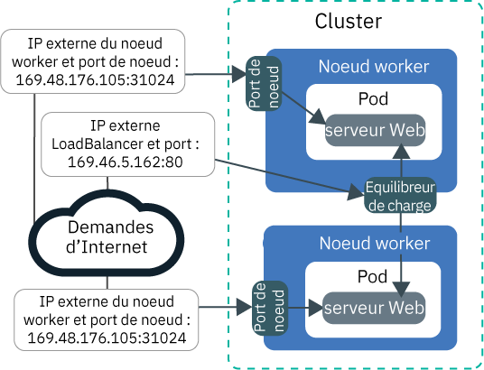
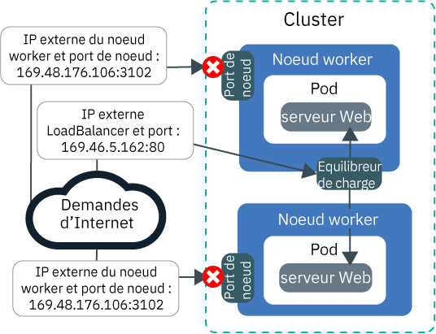
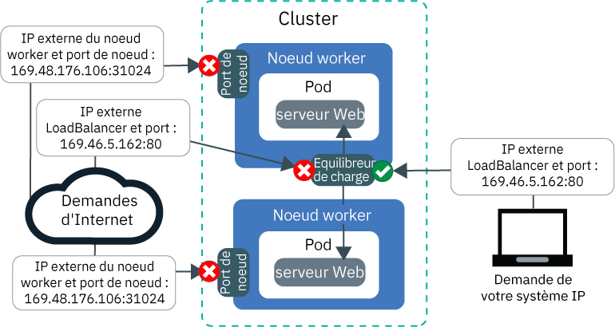
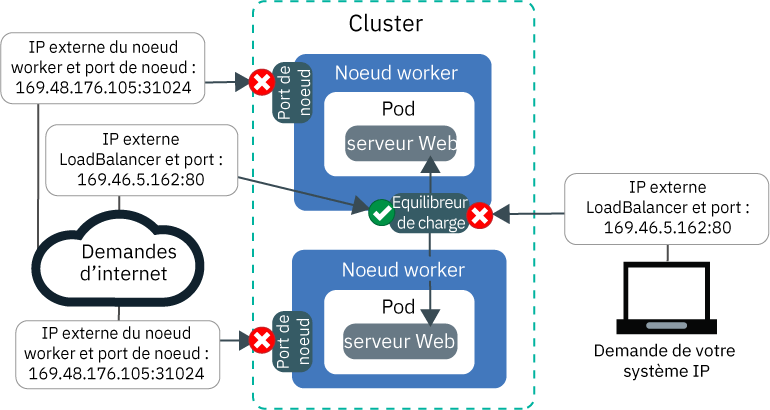

---

copyright:
  years: 2014, 2019
lastupdated: "2019-06-11"

keywords: kubernetes, iks

subcollection: containers

---

{:new_window: target="_blank"}
{:shortdesc: .shortdesc}
{:screen: .screen}
{:pre: .pre}
{:table: .aria-labeledby="caption"}
{:codeblock: .codeblock}
{:tip: .tip}
{:note: .note}
{:important: .important}
{:deprecated: .deprecated}
{:download: .download}
{:preview: .preview}


# Tutoriel : Utilisation des règles réseau Calico pour bloquer le trafic
{: #policy_tutorial}

Par défaut, les services Kubernetes NodePort, LoadBalancer et Ingress rendent votre application accessible au public et à toutes les interfaces réseau du cluster publiques et privées. La règle réseau Calico par défaut `allow-node-port-dnat` autorise le trafic entrant en provenance des services NodePort, d'équilibreur de charge de réseau (NLS) et d'équilibreur de charge d'application (ALB) Ingress vers les pods d'application exposés par ces services. Kubernetes utilise la conversion d'adresse réseau de destination (DNAT) pour transférer les demandes de service aux pods appropriés.
{: shortdesc}

Cependant, pour des raisons de sécurité, vous pouvez être amené à autoriser le trafic vers les services de réseau uniquement à partir de certaines adresses IP source. Vous pouvez utiliser des [règles Calico Pre-DNAT ](https://docs.projectcalico.org/v3.1/getting-started/bare-metal/policy/pre-dnat) pour inscrire sur liste blanche ou liste noire le trafic en provenance ou à destination de certaines adresses IP. Les règles Pre-DNAT empêchent le trafic d'atteindre vos applications car elles sont appliquées avant que Kubernetes utilise la fonction DNAT standard pour acheminer le trafic vers les pods. Lorsque vous créez des règles Calico Pre-DNAT, vous déterminez les adresses IP source à inscrire sur liste blanche ou sur liste noire. Dans la plupart des cas, l'inscription sur liste blanche fournit la configuration la plus sécurisée car tout le trafic est bloqué à l'exception du trafic en provenance d'adresses IP source autorisées. En principe, l'utilisation d'une liste noire n'est utile que dans les scénarios utilisés pour empêcher une attaque en provenance d'un petit groupe d'adresses IP.

Dans ce scénario, vous jouez le rôle d'un administrateur réseau pour une entreprise de relations publiques et vous constatez l'arrivée de trafic inhabituel dans vos applications. Les leçons de ce tutoriel vous guident dans le processus de création d'un modèle d'application de serveur Web, exposant l'application à l'aide d'un service d'équilibreur de charge de réseau (NLB) et protégeant l'application contre le trafic inhabituel indésirable avec des règles Calico de liste blanche et de liste noire.

## Objectifs
{: #policies_objectives}

- Apprendre à bloquer tout le trafic entrant sur tous les ports de noeud en créant une règle Pre-DNAT de poids fort.
- Apprendre à autoriser des adresses IP source sur liste blanche à accéder à l'adresse IP publique et au port du service d'équilibreur de charge de réseau (NLB) en créant une règle Pre-DNAT de poids faible. Les règles de poids faible remplacent les règles de poids fort.
- Apprendre à bloquer les adresses IP source sur liste noire pour les empêcher d'accéder à l'adresse IP publique et au port de l'équilibreur de charge de réseau (NLB) en créant une règle Pre-DNAT de poids faible.

## Durée
{: #policies_time}

1 heure

## Public
{: #policies_audience}

Ce tutoriel est destiné aux développeurs de logiciel et aux administrateurs réseau souhaitant gérer le trafic réseau vers une application.

## Prérequis
{: #policies_prereqs}

- [Créez un cluster](/docs/containers?topic=containers-clusters#clusters_ui).
- [Ciblez votre interface CLI sur le cluster](/docs/containers?topic=containers-cs_cli_install#cs_cli_configure).
- [Installez et configurez l'interface de ligne de commande de Calico](/docs/containers?topic=containers-network_policies#cli_install).
- Vérifiez que vous disposez des règles d'accès {{site.data.keyword.Bluemix_notm}} IAM suivantes pour {{site.data.keyword.containerlong_notm}} :
    - [N'importe quel rôle de plateforme](/docs/containers?topic=containers-users#platform)
    - [Rôle de service **Auteur** ou **Responsable**](/docs/containers?topic=containers-users#platform)

<br />


## Leçon 1 : Déploiement d'une application et exposition de cette application à l'aide d'un NLB
{: #lesson1}

La première leçon vous montre comment est exposée votre application depuis plusieurs adresses IP et ports et par où passe le trafic public pour atteindre votre cluster.
{: shortdesc}

Commencez par déployer un modèle d'application de serveur Web à utiliser tout au long de ce tutoriel. Le serveur Web `echoserver` présente les données de la connexion établie avec le cluster à partir du client et vous pouvez tester l'accès au cluster de l'entreprise de relations publiques (RP). Exposez ensuite l'application en créant un service d'équilibreur de charge de réseau (NLB) 1.0. Un service NLB 1.0 rend votre application accessible via l'adresse IP du service NLB et les ports de noeud des noeuds worker.

Vous souhaitez utiliser un équilibreur de charge d'application (ALB) Ingress ? Au lieu de créer un équilibreur de charge de réseau aux étapes 3 et 4, [créez un service pour l'application de serveur Web](/docs/containers?topic=containers-ingress#public_inside_1) et [créez une ressource Ingress pour l'application de serveur Web](/docs/containers?topic=containers-ingress#public_inside_4). Procurez-vous ensuite les adresses IP publiques de vos équilibreurs de charge d'application en exécutant la commande `ibmcloud ks albs --cluster <cluster_name>` et utilisez ces adresses IP dans le tutoriel à la place de `<loadbalancer_IP>.`
{: tip}

L'image suivante montre comment l'application de serveur Web est exposée sur Internet par le port de noeud public et l'équilibreur de charge de réseau public à la fin de la leçon 1 :



1. Déployez le modèle d'application de serveur Web. Lorsqu'une connexion à l'application de serveur Web est établie, l'application répond avec les en-têtes HTTP qu'elle a reçus dans la connexion.
    ```
    kubectl run webserver --image=k8s.gcr.io/echoserver:1.10 --replicas=3
    ```
    {: pre}

2. Vérifiez que la zone **STATUS** des pods de l'application de serveur Web a la valeur `Running`.
    ```
    kubectl get pods -o wide
    ```
    {: pre}

    Exemple de sortie :
    ```
    NAME                         READY     STATUS    RESTARTS   AGE       IP               NODE
    webserver-855556f688-6dbsn   1/1       Running   0          1m        172.30.xxx.xxx   10.176.48.78
    webserver-855556f688-76rkp   1/1       Running   0          1m        172.30.xxx.xxx   10.176.48.78
    webserver-855556f688-xd849   1/1       Running   0          1m        172.30.xxx.xxx   10.176.48.78
    ```
    {: screen}

3. Pour exposer l'application sur l'Internet public, créez un fichier de configuration de service d'équilibreur de charge de réseau 1.0 nommé `webserver-lb.yaml` dans un éditeur de texte.
    ```
    apiVersion: v1
    kind: Service
    metadata:
      labels:
        run: webserver
      name: webserver-lb
    spec:
      type: LoadBalancer
      selector:
        run: webserver
      ports:
      - name: webserver-port
        port: 80
        protocol: TCP
        targetPort: 8080
    ```
    {: codeblock}

4. Déployez l'équilibreur de charge de réseau.
    ```
    kubectl apply -f filepath/webserver-lb.yaml
    ```
    {: pre}

5. Vérifiez que vous disposez d'un accès public à l'application qui est exposée par l'équilibreur de charge de réseau à partir de votre ordinateur. 

    1. Procurez-vous l'adresse **EXTERNAL-IP** de l'équilibreur de charge de réseau.
        ```
        kubectl get svc -o wide
        ```
        {: pre}

        Exemple de sortie :
        ```
        NAME           CLUSTER-IP       EXTERNAL-IP        PORT(S)        AGE       SELECTOR
        webserver-lb   172.21.xxx.xxx   169.xx.xxx.xxx     80:31024/TCP   2m        run=webserver
        ```
        {: screen}

    2. Créez un fichier aide-mémoire et copiez l'adresse IP de l'équilibreur de charge de réseau dans ce fichier texte. Cet aide-mémoire vous aidera à retrouver plus rapidement des valeurs dans les leçons suivantes.

    3. Vérifiez que vous disposez d'un accès public à l'adresse IP externe de l'équilibreur de charge de réseau.
        ```
        curl --connect-timeout 10 <loadbalancer_IP>:80
        ```
        {: pre}

        L'exemple de sortie suivante confirme que l'équilibreur de charge de réseau expose votre application sur son adresse IP publique `169.1.1.1`. Le pod d'application `webserver-855556f688-76rkp` reçoit la demande curl :
        ```
        Hostname: webserver-855556f688-76rkp
        Pod Information:
            -no pod information available-
        Server values:
            server_version=nginx: 1.13.3 - lua: 10008
        Request Information:
            client_address=1.1.1.1
            method=GET
            real path=/
            query=
            request_version=1.1
            request_scheme=http
            request_uri=http://169.1.1.1:8080/
        Request Headers:
            accept=*/*
            host=169.1.1.1
            user-agent=curl/7.54.0
        Request Body:
            -no body in request-
        ```
        {: screen}

6. Vérifiez que vous disposez d'un accès public à l'application qui est exposée par le port de noeud à partir de votre ordinateur. Un service NLB rend votre application accessible via son adresse IP et les ports de noeud des noeuds worker.

    1. Procurez-vous le port de noeud que l'équilibreur de charge de réseau a affecté aux noeuds worker. La valeur du port de noeud est comprise entre 30000 et 32767.
        ```
        kubectl get svc -o wide
        ```
        {: pre}

        Dans la sortie de l'exemple suivant, la valeur du port de noeud est `31024` :
        ```
        NAME           CLUSTER-IP       EXTERNAL-IP        PORT(S)        AGE       SELECTOR
        webserver-lb   172.21.xxx.xxx   169.xx.xxx.xxx     80:31024/TCP   2m        run=webserver
        ```
        {: screen}  

    2. Obtenez l'**adresse IP publique** d'un noeud worker.
        ```
        ibmcloud ks workers --cluster <cluster_name>
        ```
        {: pre}

        Exemple de sortie :
        ```
        ID                                                 Public IP        Private IP     Machine Type        State    Status   Zone    Version   
        kube-dal10-cr18e61e63c6e94b658596ca93d087eed9-w1   169.xx.xxx.xxx   10.176.48.67   u3c.2x4.encrypted   normal   Ready    dal10   1.13.6_1513*   
        kube-dal10-cr18e61e63c6e94b658596ca93d087eed9-w2   169.xx.xxx.xxx   10.176.48.79   u3c.2x4.encrypted   normal   Ready    dal10   1.13.6_1513*   
        kube-dal10-cr18e61e63c6e94b658596ca93d087eed9-w3   169.xx.xxx.xxx   10.176.48.78   u3c.2x4.encrypted   normal   Ready    dal10   1.13.6_1513*   
        ```
        {: screen}

    3. Copiez l'adresse IP publique du noeud worker et le port de noeud dans votre aide-mémoire pour les utiliser dans les leçons suivantes.

    4. Vérifiez que vous pouvez accéder à l'adresse IP publique du noeud worker via le port de noeud.
        ```
        curl  --connect-timeout 10 <worker_IP>:<NodePort>
        ```
        {: pre}

        L'exemple de sortie suivant confirme que la demande transmise à votre application provient de l'adresse IP privée `10.1.1.1` du noeud worker et du port de noeud `31024`. Le pod d'application `webserver-855556f688-xd849` a reçu la demande curl :
        ```
        Hostname: webserver-855556f688-xd849
        Pod Information:
            -no pod information available-
        Server values:
            server_version=nginx: 1.13.3 - lua: 10008
        Request Information:
            client_address=1.1.1.1
            method=GET
            real path=/
            query=
            request_version=1.1
            request_scheme=http
            request_uri=http://10.1.1.1:8080/
        Request Headers:
            accept=*/*
            host=10.1.1.1:31024
            user-agent=curl/7.60.0
        Request Body:
            -no body in request-
        ```
        {: screen}

A ce stade, votre application est exposée à partir de plusieurs ports et adresses IP. La plupart de ces adresses IP sont internes au cluster et sont accessibles uniquement via le réseau privé. Seuls le port de noeud public et le port de l'équilibreur de charge de réseau public sont exposés sur l'Internet public.

Ensuite, vous pouvez commencer à créer et appliquer des règles Calico pour bloquer le trafic public.

## Leçon 2 : Blocage de tout le trafic entrant sur tous les ports de noeud
{: #lesson2}

Pour sécuriser le cluster de l'entreprise de relations publiques, vous devez bloquer l'accès public au service NLB et aux ports de noeud qui exposent votre application. Commencez par bloquer l'accès aux ports de noeud.
{: shortdesc}

L'image suivante montre comment le trafic est autorisé vers l'équilibreur de charge de réseau mais pas vers les ports de noeud à la fin de la leçon 2 :



1. Dans un éditeur de texte, créez une règle Pre-DAT de poids fort nommée `deny-nodeports.yaml` pour refuser le trafic entrant TCP et UDP provenant d'une adresse IP source vers tous les ports de noeud.
    ```
    apiVersion: projectcalico.org/v3
    kind: GlobalNetworkPolicy
    metadata:
      name: deny-nodeports
    spec:
      applyOnForward: true
      preDNAT: true
      ingress:
      - action: Deny
            destination:
              ports:
          - 30000:32767
            protocol: TCP
            source: {}
      - action: Deny
            destination:
              ports:
          - 30000:32767
        protocol: UDP
        source: {}
      selector: ibm.role=='worker_public'
      order: 1100
      types:
      - Ingress
    ```
    {: codeblock}

2. Appliquez la règle.
    - Linux :

      ```
      calicoctl apply -f filepath/deny-nodeports.yaml
      ```
      {: pre}

    - Windows et OS X :

      ```
      calicoctl apply -f filepath/deny-nodeports.yaml --config=filepath/calicoctl.cfg
      ```
      {: pre}
  Exemple de sortie :
  ```
  Successfully applied 1 'GlobalNetworkPolicy' resource(s)
  ```
  {: screen}

3. En utilisant les valeurs de votre aide-mémoire, vérifiez que vous ne disposez d'aucun accès public à l'adresse IP publique du noeud worker et au port de noeud.
    ```
    curl  --connect-timeout 10 <worker_IP>:<NodePort>
    ```
    {: pre}

    La connexion arrive à expiration car la règle Calico que vous avez créée bloque le trafic vers les ports de noeud.
    ```
    curl: (28) Connection timed out after 10016 milliseconds
    ```
    {: screen}

4. Remplacez la valeur `Cluster` par `Local` pour la politique externalTrafficPolicy de l'équilibreur de charge que vous avez créé lors de la leçon précédente. Avec la valeur `Local`, l'adresse IP source de votre système est préservée lorsque vous exécutez une commande curl sur l'adresse IP de l'équilibreur de charge lors de l'étape suivante.
    ```
    kubectl patch svc webserver -p '{"spec":{"externalTrafficPolicy":"Local"}}'
    ```
    {: pre}

5. En utilisant la valeur de votre aide-mémoire, vérifiez que vous bénéficiez toujours de l'accès public à l'adresse IP externe de l'équilibreur de charge de réseau.
    ```
    curl --connect-timeout 10 <loadbalancer_IP>:80
    ```
    {: pre}

    Exemple de sortie :
    ```
    Hostname: webserver-855556f688-76rkp
    Pod Information:
        -no pod information available-
    Server values:
        server_version=nginx: 1.13.3 - lua: 10008
    Request Information:
        client_address=1.1.1.1
        method=GET
        real path=/
        query=
        request_version=1.1
        request_scheme=http
        request_uri=http://<loadbalancer_IP>:8080/
    Request Headers:
        accept=*/*
        host=<loadbalancer_IP>
        user-agent=curl/7.54.0
    Request Body:
        -no body in request-
    ```
    {: screen}
    Dans la section `Request Information` de la sortie, l'adresse IP source est, par exemple, `client_address=1.1.1.1`. L'adresse IP source est l'adresse IP publique du système que vous utilisez pour exécuter la commande curl. Autrement, si vous vous connectez à Internet via un proxy ou un réseau privé virtuel (VPN), le proxy ou le VPN peut rendre illisible l'adresse IP réelle de votre système. Dans les deux cas, l'équilibreur de charge de réseau voit l'adresse IP source de votre système en tant qu'adresse IP client.

6. Copiez l'adresse IP source de votre système (`client_address=1.1.1.1` figurant dans la sortie de l'étape précédente) dans votre aide-mémoire pour l'utiliser dans les leçons suivantes.

Parfait ! A ce stade, votre application est exposée sur l'Internet public uniquement à partir du port de l'équilibreur de charge de réseau public. Le trafic vers les ports de noeud publics est bloqué. Votre cluster est en partie verrouillé par rapport au trafic indésirable.

Ensuite, vous pouvez créer et appliquer des règles Calico pour inscrire sur liste blanche le trafic en provenance de certaines adresses IP source.

## Leçon 3 : Autorisation de trafic entrant à partir d'une adresse IP sur liste blanche vers l'équilibreur de charge de réseau
{: #lesson3}

A présent, vous décidez de bloquer l'intégralité du trafic vers le cluster de l'entreprise de relations publiques et de tester l'accès en inscrivant uniquement l'adresse IP de votre ordinateur sur liste blanche.
{: shortdesc}

Tout d'abord, en plus des ports de noeud, vous devez bloquer tout le trafic entrant vers l'équilibreur de charge de réseau qui expose l'application. Ensuite, vous pouvez créer une règle pour inscrire l'adresse IP de votre système sur liste blanche. A la fin de la leçon 3, tout le trafic vers les ports de noeud et l'équilibreur de charge de réseau publics sera bloqué et seul le trafic en provenance de l'adresse IP de votre système sur liste blanche sera autorisé :



1. Dans un éditeur de texte, créez une règle Pre-DNAT de poids fort nommée `deny-lb-port-80.yaml` pour refuser tout le trafic TCP et UDP entrant en provenance de n'importe quelle adresse IP source vers l'adresse IP et le port de l'équilibreur de charge de réseau. Remplacez `<loadbalancer_IP>` par l'adresse IP publique d'équilibreur de charge de réseau à partir de votre aide-mémoire.

    ```
    apiVersion: projectcalico.org/v3
    kind: GlobalNetworkPolicy
    metadata:
      name: deny-lb-port-80
    spec:
      applyOnForward: true
      preDNAT: true
      ingress:
      - action: Deny
        destination:
          nets:
          - <loadbalancer_IP>/32
          ports:
          - 80
        protocol: TCP
        source: {}
      - action: Deny
        destination:
          nets:
          - <loadbalancer_IP>/32
          ports:
          - 80
        protocol: UDP
        source: {}
      selector: ibm.role=='worker_public'
      order: 800
      types:
      - Ingress
    ```
    {: codeblock}

2. Appliquez la règle.
    - Linux :

      ```
      calicoctl apply -f filepath/deny-lb-port-80.yaml
      ```
      {: pre}

    - Windows et OS X :

      ```
      calicoctl apply -f filepath/deny-lb-port-80.yaml --config=filepath/calicoctl.cfg
      ```
      {: pre}

3. En utilisant la valeur de votre aide-mémoire, vérifiez que vous ne pouvez plus accéder à l'adresse IP publique de l'équilibreur de charge de réseau. La connexion arrive à expiration car la règle Calico que vous avez créée bloque le trafic vers l'équilibreur de charge de réseau.
    ```
    curl --connect-timeout 10 <loadbalancer_IP>:80
    ```
    {: pre}

4. Dans un éditeur de texte, créez une règle Pre-DNAT de poids faible nommée `whitelist.yaml` pour autoriser le trafic en provenance de l'adresse IP de votre système vers l'adresse IP et le port de l'équilibreur de charge de réseau. En utilisant les valeurs de votre aide-mémoire, remplacez `<loadbalancer_IP>` par l'adresse IP publique de l'équilibreur de charge de réseau et `<client_address>` par l'adresse IP publique de l'adresse IP source de votre système. Si avez oublié votre adresse IP système, vous pouvez exécuter la commande `curl ifconfig.co`.
    ```
    apiVersion: projectcalico.org/v3
    kind: GlobalNetworkPolicy
    metadata:
      name: whitelist
    spec:
      applyOnForward: true
      preDNAT: true
      ingress:
      - action: Allow
        destination:
          nets:
          - <loadbalancer_IP>/32
          ports:
          - 80
        protocol: TCP
        source:
          nets:
          - <client_address>/32
      selector: ibm.role=='worker_public'
      order: 500
      types:
      - Ingress
    ```
    {: codeblock}

5. Appliquez la règle.
    - Linux :

      ```
      calicoctl apply -f filepath/whitelist.yaml
      ```
      {: pre}

    - Windows et OS X :

      ```
      calicoctl apply -f filepath/whitelist.yaml --config=filepath/calicoctl.cfg
      ```
      {: pre}
  L'adresse IP de votre système est désormais sur liste blanche.

6. En utilisant la valeur de votre aide-mémoire, vérifiez que vous pouvez désormais accéder à l'adresse IP publique de l'équilibreur de charge de réseau.
    ```
    curl --connect-timeout 10 <loadbalancer_IP>:80
    ```
    {: pre}

7. Si vous avez accès à un autre système ayant une adresse IP différente, essayez d'accéder à l'équilibreur de charge de réseau à partir de ce système.
    ```
    curl --connect-timeout 10 <loadbalancer_IP>:80
    ```
    {: pre}
    La connexion arrive à expiration car l'adresse IP de ce système ne figure pas sur la liste blanche.

A ce stade, tout le trafic vers les ports de noeud publics et l'équilibreur de charge de réseau est bloqué. Seul le trafic en provenance de l'adresse IP de votre système sur liste blanche est autorisé.

## Leçon 4 : Refus d'accès entrant en provenance d'adresses IP sur liste noire vers l'équilibreur de charge de réseau
{: #lesson4}

Dans la leçon précédente, vous avez bloqué tout le trafic et inscrit uniquement quelques adresses IP sur liste blanche. Ce scénario fonctionne bien à des fins de test lorsque vous voulez limiter l'accès à quelques adresses IP source contrôlées. Cependant, l'entreprise de relations publiques dispose d'applications qui nécessitent une plus grande ouverture au public. Vous devez veiller à ce que tout le trafic soit autorisé sauf le trafic inhabituel que vous voyez en provenance de quelques adresses IP. L'utilisation d'une liste noire est utile dans un scénario de ce type car elle vous permet d'éviter toute attaque en provenance d'un petit groupe d'adresses IP.
{: shortdesc}

Dans cette leçon, vous allez tester l'utilisation d'une liste noire pour bloquer le trafic en provenance de l'adresse IP source de votre propre système. A la fin de la leçon 4, tout le trafic vers les ports de noeud publics sera bloqué et tout le trafic vers l'équilibreur de charge de réseau public sera autorisé. Seul le trafic en provenance de l'adresse IP de votre système sur liste noire vers l'équilibreur de charge de réseau sera bloqué :



1. Supprimez les règles d'inscription sur liste blanche que vous avez créées dans la leçon précédente.
    - Linux :
      ```
      calicoctl delete GlobalNetworkPolicy deny-lb-port-80
      ```
      {: pre}
      ```
      calicoctl delete GlobalNetworkPolicy whitelist
      ```
      {: pre}

    - Windows et OS X :
      ```
      calicoctl delete GlobalNetworkPolicy deny-lb-port-80 --config=filepath/calicoctl.cfg
      ```
      {: pre}
      ```
      calicoctl delete GlobalNetworkPolicy whitelist --config=filepath/calicoctl.cfg
      ```
      {: pre}

    Désormais, tout le trafic TCP et UDP entrant en provenance de n'importe quelle adresse IP source vers l'adresse IP et le port de l'équilibreur de charge de réseau est à nouveau autorisé.

2. Pour refuser tout le trafic TCP et UDP entrant en provenance de l'adresse IP source de votre système vers l'adresse IP et le port de l'équilibreur de charge de réseau, créez une règle pre-DNAT de poids faible nommée `blacklist.yaml` dans un éditeur de texte. En utilisant les valeurs de votre aide-mémoire, remplacez `<loadbalancer_IP>` par l'adresse IP publique de l'équilibreur de charge de réseau et `<client_address>` par l'adresse IP publique de l'adresse IP source de votre système.
  ```
  apiVersion: projectcalico.org/v3
  kind: GlobalNetworkPolicy
  metadata:
    name: blacklist
  spec:
    applyOnForward: true
    preDNAT: true
    ingress:
    - action: Deny
      destination:
        nets:
        - <loadbalancer_IP>/32
        ports:
        - 80
      protocol: TCP
      source:
        nets:
        - <client_address>/32
    - action: Deny
      destination:
        nets:
        - <loadbalancer_IP>/32
        ports:
        - 80
      protocol: UDP
      source:
        nets:
        - <client_address>/32
    selector: ibm.role=='worker_public'
    order: 500
    types:
    - Ingress
  ```
  {: codeblock}

3. Appliquez la règle.
    - Linux :

      ```
      calicoctl apply -f filepath/blacklist.yaml
      ```
      {: pre}

    - Windows et OS X :

      ```
      calicoctl apply -f filepath/blacklist.yaml --config=filepath/calicoctl.cfg
      ```
      {: pre}
  L'adresse IP de votre système figure à présent sur liste noire.

4. En utilisant la valeur de votre aide-mémoire, vérifiez sur votre système que vous ne pouvez pas accéder à l'adresse IP de l'équilibreur de charge de réseau car l'adresse IP de votre système est sur liste noire.
    ```
    curl --connect-timeout 10 <loadbalancer_IP>:80
    ```
    {: pre}
    A ce stade, tout le trafic vers les ports de noeud publics est bloqué et tout le trafic vers l'équilibreur de charge de réseau public est autorisé. Seul le trafic en provenance de l'adresse IP de votre système sur liste noire vers l'équilibreur de charge de réseau est bloqué.

Parfait ! Vous avez réussi à contrôler le trafic dans votre application en utilisant des règles Calico Pre-DNAT pour placer des adresses IP source sur liste noire. 

## Leçon 5 : Consignation du trafic bloqué en provenance d'adresses IP sur liste noire vers l'équilibreur de charge de réseau
{: #lesson5}

Dans la leçon précédente, vous avez inscrit sur liste noire le trafic provenant de l'adresse IP de votre système et à destination de l'équilibreur de charge de réseau. Dans cette leçon, vous allez apprendre à consigner les demandes de trafic refusé.
{: shortdesc}

Dans notre exemple de scénario, l'entreprise de relations publiques pour laquelle vous travaillez souhaite que vous configuriez une trace de consignation relative à tout le trafic inhabituel qui est systématiquement refusé par l'une de vos règles réseau. Pour surveiller cette menace de sécurité potentielle, vous configurez la consignation de manière à enregistrer toutes les fois que votre règle inscrite sur liste noire refuse une action intentée sur l'adresse IP d'équilibreur de charge de réseau indiquée.

1. Créez une règle de réseau Calico nommée `log-denied-packets`. Cette règle de journal utilise le même sélecteur que la règle `blacklist`, qui ajoute cette règle à la chaîne de règles Iptables Calico. En utilisant un numéro d'ordre plus faible, tel que `300`, vous pouvez assurer que cette règle est ajoutée à la fin de la chaîne de règles Iptables avant la règle inscrite sur liste noire. Les paquets provenant de votre adresse IP sont consignés par cette règle avant qu'ils ne tentent d'établir une correspondance avec la règle `blacklist` et ils sont refusés.
  ```
  apiVersion: projectcalico.org/v3
  kind: GlobalNetworkPolicy
  metadata:
    name: log-denied-packets
  spec:
    applyOnForward: true
    preDNAT: true
    ingress:
    - action: Log
      destination:
        nets:
        - <loadbalancer_IP>/32
        ports:
        - 80
      protocol: TCP
      source:
        nets:
        - <client_address>/32
    - action: Deny
      destination:
        nets:
        - <loadbalancer_IP>/32
        ports:
        - 80
      protocol: UDP
      source:
        nets:
        - <client_address>/32
    selector: ibm.role=='worker_public'
    order: 300
    types:
    - Ingress
  ```
  {: codeblock}

2. Appliquez la règle.
  ```
  calicoctl apply -f log-denied-packets.yaml --config=<filepath>/calicoctl.cfg
  ```
  {: pre}

3. Générez des entrées de journal en envoyant des paquets depuis l'adresse IP de votre système vers l'adresse IP de l'équilibreur de charge de réseau. Ces paquets de demandes sont consignés avant d'être refusés.
  ```
  curl --connect-timeout 10 <loadbalancer_IP>:80
  ```
  {: pre}

4. Recherchez les entrées de journal qui sont écrites dans le chemin `/var/log/syslog`. L'entrée de journal se présente comme suit :
  ```
  Sep 5 14:34:40 <worker_hostname> kernel: [158271.044316] calico-packet: IN=eth1 OUT= MAC=08:00:27:d5:4e:57:0a:00:27:00:00:00:08:00 SRC=192.XXX.XX.X DST=192.XXX.XX.XX LEN=60 TOS=0x00 PREC=0x00 TTL=64 ID=52866 DF PROTO=TCP SPT=42962 DPT=22 WINDOW=29200 RES=0x00 SYN URGP=0
  ```
  {: screen}

Bien ! Vous avez configuré la consignation de sorte que le trafic inscrit sur liste noire puisse être surveillé plus facilement. 

Si vous souhaitez nettoyer les règles de liste noire et de journal :
1. Nettoyez la règle de liste noire.
    - Linux :
      ```
      calicoctl delete GlobalNetworkPolicy blacklist
      ```
      {: pre}

    - Windows et OS X :
      ```
      calicoctl delete GlobalNetworkPolicy blacklist --config=filepath/calicoctl.cfg
      ```
      {: pre}

2. Nettoyez la règle de journal.
    - Linux :
      ```
      calicoctl delete GlobalNetworkPolicy log-denied-packets
      ```
      {: pre}

    - Windows et OS X :
      ```
      calicoctl delete GlobalNetworkPolicy log-denied-packets --config=filepath/calicoctl.cfg
      ```
      {: pre}

## Etape suivante ?
{: #whats_next}

* En savoir plus sur comment [contrôler le trafic avec des règles réseau](/docs/containers?topic=containers-network_policies).
* Pour obtenir d'autres exemples de règles réseau Calico utilisées pour contrôler le trafic en provenance et à destination de votre cluster, vous pouvez consulter les pages [Stars Policy Demo ](https://docs.projectcalico.org/v3.1/getting-started/kubernetes/tutorials/stars-policy/) et [Advanced network policy ](https://docs.projectcalico.org/v3.1/getting-started/kubernetes/tutorials/advanced-policy).
