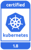

---

copyright:
  years: 2014, 2018
lastupdated: "2018-08-06"

---

{:new_window: target="_blank"}
{:shortdesc: .shortdesc}
{:screen: .screen}
{:pre: .pre}
{:table: .aria-labeledby="caption"}
{:codeblock: .codeblock}
{:tip: .tip}
{:download: .download}


# Informations de version et actions de mise à jour
{: #cs_versions}

## Types de version Kubernetes
{: #version_types}

{{site.data.keyword.containerlong}} prend en charge plusieurs versions de Kubernetes simultanément. Lorsque la version la plus récente (n) est publiée, jusqu'à 2 versions antérieures (n-2) sont prises en charge. Les versions au-delà de deux versions avant la version la plus récente (n-3) sont d'abord dépréciées, puis finissent par ne plus être prises en charge.
{:shortdesc}

**Versions de Kubernetes prises en charge** :

- La plus récente : 1.10.5
- Version par défaut : 1.10.5
- Autres : 1.9.9, 1.8.15

</br>

**Versions dépréciées** : lorsque des clusters s'exécutent sur une version de Kubernetes dépréciée, vous disposez de 30 jours pour vérifier et passer à une version Kubernetes prise en charge. Passé ce délai, votre version ne sera plus prise en charge. Au cours de la période de dépréciation, votre cluster est toujours entièrement pris en charge. Toutefois, vous ne pouvez pas créer de nouveaux clusters utilisant la version dépréciée.

**Versions non prises en charge** : si vous exécutez des clusters sur une version de Kubernetes qui n'est pas prise en charge, [consultez les impacts potentiels](#version_types) concernant les mises à jour, puis [mettez à jour le cluster](cs_cluster_update.html#update) immédiatement pour continuer à recevoir les mises à jour de sécurité importantes et l'aide du support. 
*  **Attention** : si vous attendez que votre cluster soit à une version secondaire au moins trois fois inférieure à une version prise en charge, vous devez forcer la mise à jour, ce qui peut occasionner des résultats inattendus ou provoquer des incidents. 
*  Dans les clusters non pris en charge, il est impossible d'ajouter ou de recharger des noeuds worker. 
*  Une fois que vous avez mis à jour le cluster pour passer à une version prise en charge, il peut effectuer à nouveau des opérations normales et continuer à recevoir l'aide du support.

</br>

Pour vérifier la version du serveur d'un cluster, exécutez la commande suivante.

```
kubectl version  --short | grep -i server
```
{: pre}

Exemple de sortie :

```
Server Version: v1.10.5+IKS
```
{: screen}


## Types de mise à jour
{: #update_types}

Votre cluster Kubernetes dispose de trois types de mise à jour : principale, secondaire et correctif.
{:shortdesc}

|Type de mise à jour|Exemples de libellé de version|Mis à jour par|Impact
|-----|-----|-----|-----|
|Principale|1.x.x|Vous|Modifications d'opérations pour des clusters, y compris scripts ou déploiements.|
|Secondaire|x.9.x|Vous|Modifications d'opérations pour des clusters, y compris scripts ou déploiements.|
|Correctif|x.x.4_1510|IBM et vous|Correctifs Kubernetes, ainsi que d'autres mises à jour du composant {{site.data.keyword.Bluemix_notm}} Provider, tels que des correctifs de sécurité et de système d'exploitation. IBM met automatiquement à jour les maîtres, mais vous appliquez les correctifs à vos noeuds worker.|
{: caption="Impacts des mises à jour Kubernetes" caption-side="top"}

A mesure que des mises à jour deviennent disponibles, vous en êtes informé lorsque vous affichez des informations sur les noeuds worker, par exemple avec les commandes `ibmcloud ks workers <cluster>` ou `ibmcloud ks worker-get <cluster> <worker>`.
-  **Mises à jour principale et secondaire** : commencez d'abord par [mettre à jour votre noeud maître](cs_cluster_update.html#master), puis [mettez à jour vos noeuds worker](cs_cluster_update.html#worker_node).
   - Par défaut, vous ne pouvez pas mettre à jour le maître Kubernetes au-delà de trois niveaux de version secondaire. Par exemple, si votre version maître actuelle est la version 1.5 et que vous voulez passer à la version 1.8, vous devez d'abord passer en version 1.7. Vous pouvez forcer la mise à jour pour continuer, mais effectuer une mise à jour au-delà de deux niveaux de version secondaire par rapport à la version en cours risque d'entraîner des résultats inattendus ou provoquer des incidents.
   - Si vous utilisez une version d'interface CLI `kubectl` qui ne correspond pas au moins à la version principale et secondaire (`major.minor`) de vos clusters, vous risquez d'obtenir des résultats inattendus. Assurez-vous de maintenir votre cluster Kubernetes et les [versions CLI](cs_cli_install.html#kubectl) à jour.
-  **Mises à jour de correctif** : vérifiez tous les mois pour voir s'il y a une mise à jour disponible et utilisez la [commande](cs_cli_reference.html#cs_worker_update) `ibmcloud ks worker-update` ou la [commande](cs_cli_reference.html#cs_worker_reload) `ibmcloud ks worker-reload` pour appliquer ces correctifs de sécurité et de système d'exploitation. Pour plus d'informations, voir [Journal des modifications de version](cs_versions_changelog.html).

<br/>

Ces informations récapitulent les mises à jour susceptibles d'avoir un impact sur les applications déployées lorsque vous mettez à jour un cluster vers une nouvelle version à partir de la version précédente.
-  [Actions de migration](#cs_v110) - Version 1.10.
-  [Actions de migration](#cs_v19) - Version 1.9.
-  [Actions de migration](#cs_v18) - Version 1.8.
-  [Archive](#k8s_version_archive) des versions dépréciées ou non prises en charge.

<br/>

Pour obtenir la liste complète des modifications, consultez les informations suivantes :
* [Journal des modifications de Kubernetes ](https://github.com/kubernetes/kubernetes/blob/master/CHANGELOG.md).
* [Journal des modifications de version IBM](cs_versions_changelog.html).

## Version 1.10
{: #cs_v110}

<p> {{site.data.keyword.containerlong_notm}} est un produit certifié Kubernetes pour la version 1.10 sous le programme CNCF de certification de conformité logicielle de Kubernetes. _Kubernetes® est une marque de la Fondation Linux aux Etats-Unis et dans d'autres pays et est utilisé dans le cadre d'une licence de la Fondation Linux._</p>

Passez en revue les modifications que vous devrez peut-être apporter lors d'une mise à jour de la version Kubernetes précédente vers la version 1.10.

**Important** : pour pouvoir effectuer la mise à jour vers Kubernetes 1.10, vous devez suivre les étapes indiquées dans [Préparation à la mise à jour vers Calico v3](#110_calicov3).

<br/>

### Mise à jour avant le maître
{: #110_before}

<table summary="Mises à jour Kubernetes pour la version 1.10">
<caption>Modifications à effectuer avant la mise à jour du maître vers Kubernetes 1.10</caption>
<thead>
<tr>
<th>Type</th>
<th>Description</th>
</tr>
</thead>
<tbody>
<tr>
<td>Calico v3</td>
<td>La mise à jour vers Kubernetes version 1.10 fait également passer Calico de la version 2.6.5 à la version 3.1.1. <strong>Important</strong> : pour pouvoir effectuer la mise à jour vers Kubernetes v1.10, vous devez suivre les étapes indiquées dans [Préparation à la mise à jour vers Calico v3](#110_calicov3).</td>
</tr>
<tr>
<td>Règle réseau du tableau de bord Kubernetes</td>
<td>Dans Kubernetes 1.10, la règle réseau <code>kubernetes-dashboard</code> dans l'espace de nom <code>kube-system</code> bloque l'accès de tous les pods au tableau de bord Kubernetes. Mais elle <strong>n'affecte pas</strong> la possibilité d'accéder au tableau de bord à partir de la console {{site.data.keyword.Bluemix_notm}} ou via le proxy <code>kubectl proxy</code>. Si un pod nécessite l'accès au tableau de bord, vous pouvez ajouter un libellé <code>kubernetes-dashboard-policy: allow</code> à un espace de nom puis déployer le pod sur cet espace de nom.</td>
</tr>
<tr>
<td>Accès à l'API Kubelet</td>
<td>L'autorisation d'accès à l'API Kubelet est désormais déléguée au <code>serveur d'API Kubernetes</code>. L'accès à l'API Kubelet est basé sur les rôles de cluster (<code>ClusterRoles</code>) qui octroient le droit d'accès aux sous-ressources de <strong>noeud</strong>. Par défaut, Kubernetes Heapster dispose des rôles <code>ClusterRole</code> et <code>ClusterRoleBinding</code>. Cependant, si l'API Kubelet est utilisée par d'autres utilisateurs ou applications, vous devez leur accorder le droit d'utiliser l'API. Consultez la documentation Kubernetes sur l'[autorisation d'accès à Kubelet](https://kubernetes.io/docs/reference/command-line-tools-reference/kubelet-authentication-authorization/).</td>
</tr>
<tr>
<td>Suites de chiffrement</td>
<td>Les suites de chiffrement prises en charge sur le <code>serveur d'API Kubernetes</code> et l'API Kubelet sont désormais limitées à un sous-ensemble avec un niveau de chiffrement élevé (128 bits ou plus). Si vous disposez d'automatisation ou de ressources utilisant un niveau de chiffrement plus faible et qui s'appuient sur la communication avec le <code>serveur d'API Kubernetes</code> ou l'API Kubelet, activez un support de chiffrement plus fort avant d'effectuer la mise à jour du maître.</td>
</tr>
<tr>
<td>VPN strongSwan</td>
<td>Si vous utilisez [strongSwan](cs_vpn.html#vpn-setup) pour la connectivité VPN, vous devez supprimer la charte avant de mettre à jour le cluster en exécutant la commande `helm delete --purge <release_name>`. Une fois la mise à jour du cluster terminée, réinstallez la charte Helm strongSwan.</td>
</tr>
</tbody>
</table>

### Mise à jour après le maître
{: #110_after}

<table summary="Mises à jour Kubernetes pour la version 1.10">
<caption>Modifications à effectuer après la mise à jour du maître vers Kubernetes 1.10</caption>
<thead>
<tr>
<th>Type</th>
<th>Description</th>
</tr>
</thead>
<tbody>
<tr>
<td>Calico v3</td>
<td>Lorsque le cluster est mis à jour, toutes les données existantes de Calico appliquées au cluster sont automatiquement migrées pour utiliser la syntaxe de Calico v3. Pour afficher, ajouter ou modifier des ressources Calico avec la syntaxe de Calico v3, mettez à jour la [configuration de l'interface de ligne de commande de Calico pour passer à la version 3.1.1](#110_calicov3).</td>
</tr>
<tr>
<td>Adresse IP externe (<code>ExternalIP</code>) du noeud</td>
<td>La zone <code>ExternalIP</code> d'un noeud est désormais définie avec la valeur de l'adresse IP publique du noeud. Vérifiez et mettez à jour toutes les ressources qui dépendent de cette valeur.</td>
</tr>
<tr>
<td><code>kubectl port-forward</code></td>
<td>Désormais quand vous utilisez la commande <code>kubectl port-forward</code>, elle ne prend plus en charge l'indicateur <code>-p</code>. Si vos scripts s'appuient sur le comportement précédent, mettez-les à jour pour remplacer l'indicateur <code>-p</code> par le nom du pod.</td>
</tr>
<tr>
<td>Volumes de données d'API en lecture seule</td>
<td>Désormais les éléments `secret`, `configMap`, `downwardAPI` et les volumes projetés sont montés en lecture seule.
Auparavant, les applications étaient autorisées à écrire des données dans ces volumes qui pouvaient être
automatiquement rétablies par le système. Cette action de migration est requise pour corriger
la vulnérabilité de sécurité [CVE-2017-1002102](https://cve.mitre.org/cgi-bin/cvename.cgi?name=2017-1002102).
Si vos applications s'appuient sur ce comportement peu fiable en matière de sécurité, modifiez-les en conséquence.</td>
</tr>
<tr>
<td>VPN strongSwan</td>
<td>Si vous utilisez [strongSwan](cs_vpn.html#vpn-setup) pour la connectivité VPN et que vous avez supprimé votre charte avant de mettre à jour le cluster, vous pouvez à présent réinstaller la charte Helm strongSwan.</td>
</tr>
</tbody>
</table>

### Préparation à la mise à jour vers Calico v3
{: #110_calicov3}

Avant de commencer, le maître, ainsi que tous les noeuds worker de votre cluster doivent exécuter Kubernetes version 1.8 ou ultérieure, et votre cluster doit comporter au moins un noeud worker.

**Important** : préparez la mise à jour vers Calico v3 avant de mettre à jour le maître. Durant la mise à niveau du maître vers Kubernetes v1.10, les nouveaux pods et les nouvelles règles réseau de Kubernetes ou Calico ne sont plus planifiés. La durée pendant laquelle la mise à jour empêche toute nouvelle planification varie. Cette durée peut être de quelques minutes pour les clusters de petite taille avec des minutes supplémentaires pour chaque lot de 10 noeuds. Les règles réseau et les pods poursuivent leur exécution.

1.  Vérifiez que vos pods Calico sont sains.
    ```
    kubectl get pods -n kube-system -l k8s-app=calico-node -o wide
    ```
    {: pre}

2.  Si un pod n'est pas à l'état **Running**, supprimez-le ou attendez qu'il soit à l'état **Running** avant de continuer.

3.  Si vous générez automatiquement des règles Calico ou d'autres ressources Calico, mettez à jour vos outils d'automatisation pour générer ces ressources avec la [syntaxe de Calico v3 ](https://docs.projectcalico.org/v3.1/reference/calicoctl/resources/).

4.  Si vous utilisez [strongSwan](cs_vpn.html#vpn-setup) pour la connectivité VPN, la charte Helm 2.0.0 strongSwan ne fonctionne pas avec Calico v3 ou Kubernetes 1.10. [Mettez à jour strongSwan](cs_vpn.html#vpn_upgrade) avec la charte Helm 2.1.0, qui offre une compatibilité en amont avec Calico 2.6 et Kubernetes 1.7, 1.8 et 1.9.

5.  [Mettez à jour votre maître de cluster vers Kubernetes v1.10](cs_cluster_update.html#master).

<br />


## Version 1.9
{: #cs_v19}

<p> {{site.data.keyword.containerlong_notm}} est un produit certifié Kubernetes pour la version 1.9 sous le programme CNCF de certification de conformité logicielle de Kubernetes. _Kubernetes® est une marque de la Fondation Linux aux Etats-Unis et dans d'autres pays et est utilisé dans le cadre d'une licence de la Fondation Linux._</p>

Passez en revue les modifications que vous devrez peut-être apporter lors d'une mise à jour de la version Kubernetes précédente vers la version 1.9.

<br/>

### Mise à jour avant le maître
{: #19_before}

<table summary="Mises à jour Kubernetes pour la version 1.9">
<caption>Modifications à apporter avant la mise à jour du maître vers la version Kubernetes 1.9</caption>
<thead>
<tr>
<th>Type</th>
<th>Description</th>
</tr>
</thead>
<tbody>
<tr>
<td>API d'admission webhook</td>
<td>L'API d'admission, qui est utilisée lorsque le serveur d'API appelle des webhooks de contrôle d'admission, a été transférée de <code>admission.v1alpha1</code> à <code>admission.v1beta1</code>. <em>Vous devez supprimer les éventuels webhooks existants avant de mettre à niveau votre cluster</em> et mettre à jour les fichiers de configuration webhook afin d'utiliser l'API la plus récente. Cette modification n'est pas compatible en amont.</td>
</tr>
</tbody>
</table>

### Mise à jour après le maître
{: #19_after}

<table summary="Mises à jour Kubernetes pour la version 1.9">
<caption>Modifications à apporter après la mise à jour du maître vers la version Kubernetes 1.9</caption>
<thead>
<tr>
<th>Type</th>
<th>Description</th>
</tr>
</thead>
<tbody>
<tr>
<td>Sortie `kubectl`</td>
<td>A présent, lorsque vous utilisez la commande `kubectl` en spécifiant `-o custom-columns` et que la colonne est introuvable dans l'objet, la sortie indique `<none>`.<br>
Auparavant, l'opération échouait et un message d'erreur `xxx is not found` (xxx introuvable) était affiché. Si vos scripts reposent sur le comportement antérieur, mettez-les à jour.</td>
</tr>
<tr>
<td>`kubectl patch`</td>
<td>Maintenant, lorsqu'aucune modification n'est apportée à la ressource concernée, la commande `kubectl patch` échoue avec `exit code 1`. Si vos scripts reposent sur le comportement antérieur, mettez-les à jour.</td>
</tr>
<tr>
<td>Droits d'accès au tableau de bord Kubernetes</td>
<td>Les utilisateurs doivent se connecter au tableau de bord Kubernetes avec leurs données d'identification pour afficher les ressources du cluster. L'autorisation RBAC `ClusterRoleBinding` du tableau de bord Kubernetes par défaut est supprimée. Pour les instructions correspondantes, voir [Lancement du tableau de bord Kubernetes](cs_app.html#cli_dashboard).</td>
</tr>
<tr>
<td>Volumes de données d'API en lecture seule</td>
<td>Désormais les éléments `secret`, `configMap`, `downwardAPI` et les volumes projetés sont montés en lecture seule.
Auparavant, les applications étaient autorisées à écrire des données dans ces volumes qui pouvaient être
automatiquement rétablies par le système. Cette action de migration est requise pour corriger la vulnérabilité
de sécurité [CVE-2017-1002102](https://cve.mitre.org/cgi-bin/cvename.cgi?name=2017-1002102).
Si vos applications s'appuient sur ce comportement peu fiable en matière de sécurité, modifiez-les en conséquence.</td>
</tr>
<tr>
<td>Annotations taint et tolerations</td>
<td>Les annotations taint `node.alpha.kubernetes.io/notReady` et `node.alpha.kubernetes.io/unreachable` sont remplacées respectivement par `node.kubernetes.io/not-ready` et `node.kubernetes.io/unreachable`.<br>
Bien que ces annotations taint soient mises à jour automatiquement, vous devez mettre à jour manuellement leurs annotations tolerations. Pour chaque espace de nom à l'exception d'`ibm-system` et de `kube-system`, déterminez si vous devez modifier les annotations tolerations :<br>
<ul><li><code>kubectl get pods -n &lt;namespace&gt; -o yaml | grep "node.alpha.kubernetes.io/notReady" && echo "Action required"</code></li><li>
<code>kubectl get pods -n &lt;namespace&gt; -o yaml | grep "node.alpha.kubernetes.io/unreachable" && echo "Action required"</code></li></ul><br>
Si `Action required` est renvoyé, modifiez les annotations tolerations de pod en conséquence.</td>
</tr>
<tr>
<td>API d'admission webhook</td>
<td>Si vous avez supprimé des webhooks existants avant de mettre à jour le cluster, créez de nouveaux webhooks.</td>
</tr>
</tbody>
</table>

<br />


## Version 1.8
{: #cs_v18}

<p> {{site.data.keyword.containerlong_notm}} est un produit certifié par Kubernetes pour la version 1.8 sous le programme CNCF de certification de conformité logicielle de Kubernetes. _Kubernetes® est une marque de la Fondation Linux aux Etats-Unis et dans d'autres pays et est utilisé dans le cadre d'une licence de la Fondation Linux._</p>

Passez en revue les modifications que vous devrez peut-être apporter lors d'une mise à jour de la version Kubernetes précédente vers la version 1.8.

<br/>

### Mise à jour avant le maître
{: #18_before}

<table summary="Mises à jour Kubernetes pour les versions 1.8">
<caption>Modifications à effectuer avant la mise à jour du maître vers Kubernetes 1.8</caption>
<thead>
<tr>
<th>Type</th>
<th>Description</th>
</tr>
</thead>
<tbody>
<tr>
<td>Aucune</td>
<td>Aucune modification n'est requise avant la mise à jour du maître</td>
</tr>
</tbody>
</table>

### Mise à jour après le maître
{: #18_after}

<table summary="Mises à jour Kubernetes pour les versions 1.8">
<caption>Modifications à effectuer après la mise à jour du maître vers Kubernetes 1.8</caption>
<thead>
<tr>
<th>Type</th>
<th>Description</th>
</tr>
</thead>
<tbody>
<tr>
<td>Connexion au tableau de bord Kubernetes</td>
<td>L'URL d'accès au tableau de bord Kubernetes en version 1.8 a changé et le processus de connexion inclut une nouvelle étape d'authentification. Pour plus d'informations, voir [Accès au tableau de bord Kubernetes](cs_app.html#cli_dashboard).</td>
</tr>
<tr>
<td>Droits sur le tableau de bord Kubernetes</td>
<td>Pour forcer les utilisateurs à se connecter avec leurs données d'identification pour afficher des ressources de cluster en version 1.8, supprimez l'autorisation RBAC 1.7 ClusterRoleBinding. Exécutez `kubectl delete clusterrolebinding -n kube-system kubernetes-dashboard`.</td>
</tr>
<tr>
<td>`kubectl delete`</td>
<td>La commande `kubectl delete` ne réduit plus les objets d'API de charge de travail, tels que les pods, avant suppression de l'objet. Si vous avez besoin de réduire l'objet, utilisez la commande [`kubectl scale ` ](https://kubernetes.io/docs/reference/kubectl/overview/#scale) avant de supprimer l'objet.</td>
</tr>
<tr>
<td>`kubectl run`</td>
<td>La commande `kubectl run` doit utiliser plusieurs indicateurs pour `--env` au lieu d'arguments séparés par une virgule. Par exemple, exécutez <code>kubectl run --env &lt;x&gt;=&lt;y&gt; --env &lt;z&gt;=&lt;a&gt;</code> et non pas <code>kubectl run --env &lt;x&gt;=&lt;y&gt;,&lt;z&gt;=&lt;a&gt;</code>. </td>
</tr>
<tr>
<td>`kubectl stop`</td>
<td>La commande `kubectl stop` n'est plus disponible.</td>
</tr>
<tr>
<td>Volumes de données d'API en lecture seule</td>
<td>Désormais les éléments `secret`, `configMap`, `downwardAPI` et les volumes projetés sont montés en lecture seule.
Auparavant, les applications étaient autorisées à écrire des données dans ces volumes qui pouvaient être
automatiquement rétablies par le système. Cette action de migration est requise pour corriger la vulnérabilité
de sécurité [CVE-2017-1002102](https://cve.mitre.org/cgi-bin/cvename.cgi?name=2017-1002102).
Si vos applications s'appuient sur ce comportement peu fiable en matière de sécurité, modifiez-les en conséquence.</td>
</tr>
</tbody>
</table>

<br />


## Archive
{: #k8s_version_archive}

### Version 1.7 (non prise en charge)
{: #cs_v17}

A partir du 21 juin 2018, les clusters {{site.data.keyword.containershort_notm}} qui exécutent [Kubernetes version 1.7](cs_versions_changelog.html#changelog_archive) ne sont plus pris en charge. Les clusters de la version 1.7 ne peuvent pas recevoir des mises à jour ou du support sauf s'ils ont été mis à jour à la version suivante la plus récente ([Kubernetes 1.8](#cs_v18)).

[Consultez l'impact potentiel](cs_versions.html#cs_versions) de chaque mise à jour de version Kubernetes, puis [mettez à jour vos clusters](cs_cluster_update.html#update) immédiatement à la version 1.8 ou ultérieure. 

### Version 1.5 (non prise en charge)
{: #cs_v1-5}

A partir du 4 avril 2018, les clusters {{site.data.keyword.containershort_notm}} qui exécutent [Kubernetes version 1.5](https://github.com/kubernetes/kubernetes/blob/master/CHANGELOG-1.5.md) ne sont plus pris en charge. Les clusters de la version 1.5 ne peuvent pas recevoir des mises à jour ou du support sauf s'ils ont été mis à jour à la version suivante la plus récente ([Kubernetes 1.8](#cs_v18)).

[Consultez l'impact potentiel](cs_versions.html#cs_versions) de chaque mise à jour de version Kubernetes, puis [mettez à jour vos clusters](cs_cluster_update.html#update) immédiatement à la version 1.8 ou ultérieure. 
