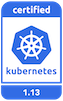

---

copyright:
  years: 2014, 2019
lastupdated: "2019-06-11"

keywords: kubernetes, iks

subcollection: containers

---

{:new_window: target="_blank"}
{:shortdesc: .shortdesc}
{:screen: .screen}
{:pre: .pre}
{:table: .aria-labeledby="caption"}
{:codeblock: .codeblock}
{:tip: .tip}
{:note: .note}
{:important: .important}
{:deprecated: .deprecated}
{:note: .note}


# Informations de version et actions de mise à jour
{: #cs_versions}

## Types de version Kubernetes
{: #version_types}

{{site.data.keyword.containerlong}} prend en charge plusieurs versions de Kubernetes simultanément. Lorsque la version la plus récente (n) est publiée, jusqu'à 2 versions antérieures (n-2) sont prises en charge. Les versions au-delà de deux versions avant la version la plus récente (n-3) sont d'abord dépréciées, puis finissent par ne plus être prises en charge.
{:shortdesc}

**Versions de Kubernetes prises en charge** :
*   La plus récente : 1.14.2 
*   Par défaut : 1.13.6
*   Autre : 1.12.9

**Versions de Kubernetes dépréciées et non prises en charge** :
*   Dépréciée : 1.11
*   Non prises en charge : 1.5, 1.7, 1.8, 1.9, 1.10 

</br>

**Versions dépréciées** : lorsque des clusters s'exécutent sur une version de Kubernetes dépréciée, vous disposez d'un minimum de 30 jours pour vérifier et passer à une version Kubernetes prise en charge. Passé ce délai, votre version ne sera plus prise en charge. Au cours de la période de dépréciation, votre cluster est toujours opérationnel mais peut nécessiter des mises à jour vers une version prise en charge pour corriger des vulnérabilités de sécurité. Par exemple, vous pouvez ajouter et recharger des noeuds worker, mais vous ne pouvez pas créer de nouveaux clusters qui utilisent la version dépréciée lorsque la date de non prise en charge est distante de 30 jours tout au plus.

**Versions non prises en charge** : si vos clusters exécutent une version de Kubernetes qui n'est pas prise en charge, consultez les impacts potentiels suivants, puis [mettez à jour le cluster](/docs/containers?topic=containers-update#update) immédiatement pour continuer à recevoir les mises à jour de sécurité importantes et l'aide du support. Dans les clusters non pris en charge, il est impossible d'ajouter ou de recharger des noeuds worker. Vous pouvez déterminer si votre cluster n'**est pas pris en charge** en consultant la zone **State** dans la sortie de la commande `ibmcloud ks clusters` ou dans la [console {{site.data.keyword.containerlong_notm}} ](https://cloud.ibm.com/kubernetes/clusters).

Si vous attendez que votre cluster soit à une version secondaire inférieure à trois niveaux par rapport à une version prise en charge, vous ne pouvez pas mettre à jour le cluster. A la place, [créez un nouveau cluster](/docs/containers?topic=containers-clusters#clusters), [déployez vos applications](/docs/containers?topic=containers-app#app) sur le nouveau cluster et [supprimez](/docs/containers?topic=containers-remove) le cluster non pris en charge. <br><br>Pour éviter cela, mettez à jour les clusters dépréciés vers une version prise en charge inférieure de trois niveaux par rapport à la version actuelle, par exemple en passant de la version 1.11 à la version 1.12, et en effectuant ensuite la mise à jour vers la dernière version, 1.14. Si les noeuds worker exécutent une version inférieure de trois niveaux par rapport à celle du maître, il se peut que vos pods échouent en passant à un état tel que `MatchNodeSelector`, `CrashLoopBackOff` ou `ContainerCreating` jusqu'à ce que vous mettiez à jour les noeuds worker vers la même version. Après que vous avez effectué une mise à jour à partir d'une version dépréciée vers une version prise en charge, votre cluster peut effectuer à nouveau des opérations normales et continuer à recevoir l'aide du support.
{: important}

</br>

Pour vérifier la version du serveur d'un cluster, exécutez la commande suivante.
```
kubectl version  --short | grep -i server
```
{: pre}

Exemple de sortie :
```
Server Version: v1.13.6+IKS
```
{: screen}


## Types de mise à jour
{: #update_types}

Votre cluster Kubernetes dispose de trois types de mise à jour : principale, secondaire et correctif.
{:shortdesc}

|Type de mise à jour|Exemples de libellé de version|Mis à jour par|Impact
|-----|-----|-----|-----|
|Principale|1.x.x|Vous|Modifications d'opérations pour les clusters, y compris scripts ou déploiements.|
|Secondaire|x.9.x|Vous|Modifications d'opérations pour les clusters, y compris scripts ou déploiements.|
|Correctif|x.x.4_1510|IBM et vous|Correctifs Kubernetes, ainsi que d'autres mises à jour du composant {{site.data.keyword.Bluemix_notm}} Provider, tels que des correctifs de sécurité et de système d'exploitation. IBM met automatiquement à jour les maîtres, mais c'est à vous d'appliquer les correctifs à vos noeuds worker. Vous trouverez plus d'informations sur les correctifs dans la section suivante.|
{: caption="Impacts des mises à jour Kubernetes" caption-side="top"}

A mesure que des mises à jour deviennent disponibles, vous en êtes informé lorsque vous affichez des informations sur les noeuds worker, par exemple avec les commandes `ibmcloud ks workers --cluster <cluster>` ou `ibmcloud ks worker-get --cluster <cluster> --worker <worker>`.
-  **Mises à jour principale et secondaire (1.x)** : commencez d'abord par [mettre à jour votre noeud maître](/docs/containers?topic=containers-update#master), puis [mettez à jour vos noeuds worker](/docs/containers?topic=containers-update#worker_node). Les noeuds worker ne peuvent pas exécuter une version principale ou secondaire de Kubernetes supérieure à celle du maître.
   - Vous ne pouvez pas mettre à jour un maître Kubernetes au-delà de trois niveaux de version secondaire. Par exemple, si la version actuelle du maître est 1.11 et que vous voulez passer à la version 1.14, vous devez d'abord passer à la version 1.12. 
   - Si vous utilisez une version d'interface CLI `kubectl` qui ne correspond pas au moins à la version principale et secondaire (`major.minor`) de vos clusters, vous risquez d'obtenir des résultats inattendus. Assurez-vous de maintenir votre cluster Kubernetes et les [versions CLI](/docs/containers?topic=containers-cs_cli_install#kubectl) à jour.
-  **Mises à jour de correctifs (x.x.4_1510)** : les modifications sur les correctifs sont documentées dans le [Journal des modifications de version](/docs/containers?topic=containers-changelog). Les correctifs du maître sont appliqués automatiquement, contrairement aux correctifs de noeud worker que vous devez initier. Les noeuds worker peuvent également exécuter des versions de correctif supérieures à celle du maître. Dès que des mises à jour deviennent disponibles, vous en êtes informé lorsque vous affichez des informations sur le maître ou les noeuds worker dans la console {{site.data.keyword.Bluemix_notm}} ou l'interface de ligne de commande (CLI), par exemple en exécutant les commandes suivantes : `ibmcloud ks clusters`, `cluster-get`, `workers` ou `worker-get`.
   - **Correctifs de noeud Worker** : vérifiez tous les mois pour voir s'il y a une mise à jour disponible et utilisez la [commande](/docs/containers?topic=containers-cli-plugin-kubernetes-service-cli#cs_worker_update) `ibmcloud ks worker-update` ou la [commande](/docs/containers?topic=containers-cli-plugin-kubernetes-service-cli#cs_worker_reload) `ibmcloud ks worker-reload` pour appliquer ces correctifs de système d'exploitation et de sécurité. Durant une mise à jour ou un rechargement, la machine de votre noeud worker est réimagée et les données sont supprimées si elles ne sont pas [stockées hors du noeud worker](/docs/containers?topic=containers-storage_planning#persistent_storage_overview).
   - **Correctifs du maître** : les correctifs du maître sont appliqués automatiquement sur plusieurs jours, de sorte que la version d'un correctif de maître s'affiche comme étant disponible avant d'être appliquée à votre maître. L'automatisation de la mise à jour ignore également les clusters qui ne sont pas dans un état sain ou dont les opérations sont encore en cours d'exécution. Occasionnellement, IBM peut désactiver les mises à jour automatiques pour un groupe de correctifs de maître spécifique, comme indiqué dans le journal des modifications, par exemple un correctif nécessaire uniquement si un maître est mis à jour d'une version secondaire à une autre. Pour chacun de ces cas de figure, vous pouvez choisir d'utiliser la [commande](/docs/containers?topic=containers-cli-plugin-kubernetes-service-cli#cs_cluster_update) `ibmcloud ks cluster-update` vous-même en toute sécurité sans attendre l'application de la mise à jour automatique. 

</br>

{: #prep-up}
Ces informations récapitulent les mises à jour susceptibles d'avoir un impact sur les applications déployées lorsque vous mettez à jour un cluster vers une nouvelle version à partir de la version précédente.
-  [Actions de préparation](#cs_v114) - Version 1.14.
-  [Actions de préparation](#cs_v113) - Version 1.13.
-  [Actions de préparation](#cs_v112) - Version 1.12.
-  **Déprécié** : [Actions de préparation](#cs_v111) - Version 1.11.
-  [Archive](#k8s_version_archive) des versions non prises en charge.

<br/>

Pour obtenir la liste complète des modifications, consultez les informations suivantes :
* [Journal des modifications de Kubernetes ](https://github.com/kubernetes/kubernetes/blob/master/CHANGELOG.md).
* [Journal des modifications de version IBM](/docs/containers?topic=containers-changelog).

</br>

## Historique des éditions
{: #release-history}

Le tableau suivant présente l'historique des éditions de version d'{{site.data.keyword.containerlong_notm}}. Vous pouvez utiliser ces informations à des fins de planification, par exemple pour estimer le délai général à prévoir pour qu'une édition particulière ne soit plus prise en charge. Une fois que la communauté Kubernetes publie une mise à jour de version, l'équipe IBM commence à expérimenter et tester l'édition pour les environnements {{site.data.keyword.containerlong_notm}}. Les dates de disponibilité et les dates auxquelles une édition n'est plus prise en charge dépendent des résultats de ces tests, des mises à jour de la communauté, des correctifs de sécurité et des changements de technologie qui interviennent d'une version à l'autre. Envisagez de tenir à jour la version de votre maître cluster et des noeuds worker en fonction des règles de prise en charge des versions `n-2`.
{: shortdesc}

{{site.data.keyword.containerlong_notm}} a été disponible initialement avec la version 1.5 de Kubernetes. Les dates de publication ou de non prise en charge d'une version sont susceptibles de changer. Pour accéder aux étapes de préparation à une mise à jour de version, cliquez sur le numéro de version.

Les dates avec l'indicateur représentant un poignard (`†`) sont provisoires et peuvent changer.
{: important}

<table summary="Ce tableau présente l'historique des éditions d'{{site.data.keyword.containerlong_notm}}.">
<caption>Historique des éditions d'{{site.data.keyword.containerlong_notm}}.</caption>
<col width="20%" align="center">
<col width="20%">
<col width="30%">
<col width="30%">
<thead>
<tr>
<th>Prise en charge ?</th>
<th>Version</th>
<th>{{site.data.keyword.containerlong_notm}}<br>date de publication</th>
<th>{{site.data.keyword.containerlong_notm}}<br>date de non prise en charge</th>
</tr>
</thead>
<tbody>
<tr>
  <td></td>
  <td>[1.14](#cs_v114)</td>
  <td>7 mai 2019</td>
  <td>Mars 2020 `†`</td>
</tr>
<tr>
  <td></td>
  <td>[1.13](#cs_v113)</td>
  <td>5 février 2019</td>
  <td>Décembre 2019 `†`</td>
</tr>
<tr>
  <td></td>
  <td>[1.12](#cs_v112)</td>
  <td>7 novembre 2018</td>
  <td>Septembre 2019 `†`</td>
</tr>
<tr>
  <td></td>
  <td>[1.11](#cs_v111)</td>
  <td>14 août 2018</td>
  <td>27 juin 2019 `†`</td>
</tr>
<tr>
  <td></td>
  <td>[1.10](#cs_v110)</td>
  <td>1er mai 2018</td>
  <td>16 mai 2019</td>
</tr>
<tr>
  <td></td>
  <td>[1.9](#cs_v19)</td>
  <td>8 Février 2018</td>
  <td>27 décembre 2018</td>
</tr>
<tr>
  <td></td>
  <td>[1.8](#cs_v18)</td>
  <td>8 novembre 2017</td>
  <td>22 septembre 2018</td>
</tr>
<tr>
  <td></td>
  <td>[1.7](#cs_v17)</td>
  <td>19 septembre 2017</td>
  <td>21 juin 2018</td>
</tr>
<tr>
  <td></td>
  <td>1.6</td>
  <td>N/A</td>
  <td>N/A</td>
</tr>
<tr>
  <td></td>
  <td>[1.5](#cs_v1-5)</td>
  <td>23 mai 2017</td>
  <td>4 avril 2018</td>
</tr>
</tbody>
</table>

<br />


## Version 1.14
{: #cs_v114}

<p> {{site.data.keyword.containerlong_notm}} est un produit certifié Kubernetes pour la version 1.14 sous le programme CNCF de certification de conformité logicielle de Kubernetes. _Kubernetes® est une marque de la Fondation Linux aux Etats-Unis et dans d'autres pays et est utilisé dans le cadre d'une licence de la Fondation Linux._</p>

Passez en revue les modifications que vous devrez peut-être apporter lors d'une mise à jour de la version Kubernetes précédente vers la version 1.14.
{: shortdesc}

Kubernetes 1.14 introduit de nouvelles fonctions que vous pouvez explorer. Essayez le nouveau projet [`kustomize` ](https://github.com/kubernetes-sigs/kustomize) que vous pouvez utiliser pour écrire, personnaliser et réutiliser vos configurations YAML de ressource Kubernetes. Ou, consultez la nouvelle [documentation sur l'interface CLI `kubectl` ](https://kubectl.docs.kubernetes.io/).
{: tip}

### Mise à jour avant le maître
{: #114_before}

Le tableau suivant présente les actions que vous devez effectuer avant de mettre à jour le maître Kubernetes.
{: shortdesc}

<table summary="Mises à jour Kubernetes pour la version 1.14">
<caption>Modifications à effectuer avant la mise à jour du maître vers Kubernetes 1.14</caption>
<thead>
<tr>
<th>Type</th>
<th>Description</th>
</tr>
</thead>
<tbody>
<tr>
<td>Modification de la structure de répertoire de journaux de pod par l'interface CRI</td>
<td>L'interface CRI (Container Runtime Interface) a modifié la structure de répertoire de journaux de pod `/var/log/pods/<UID>` et l'a remplacée par `/var/log/pods/<NAMESPACE_NAME_UID>`. Si vos applications ignorent Kubernetes et l'interface CRI pour accéder aux journaux de pod directement sur des noeuds worker, mettez-les à jour pour prendre en charge les deux structures de répertoire. L'accès aux pods de journal via Kubernetes, par exemple en exécutant la commande `kubectl logs`, n'est pas impacté par cette modification. </td>
</tr>
<tr>
<td>Les diagnostics d'intégrité ne suivent plus les redirections</td>
<td>Les sondes de diagnostic d'intégrité Liveness Probe et Readiness Probe qui utilisent une action `HTTPGetAction` ne suivent plus les redirections vers des noms d'hôte qui sont différents de ceux de la demande de sonde d'origine. A la place, ces redirections non locales renvoient une réponse `Success` et un événement associé au motif `ProbeWarning` est généré pour indiquer que la redirection a été ignorée. Si vous vous étiez précédemment basé sur la redirection pour exécuter des diagnostics d'intégrité sur des noeuds finaux de nom d'hôte différents, vous devez exécuter la logique de diagnostic d'intégrité en dehors de `kubelet`. Par exemple, vous pouvez mettre en cache le noeud final externe au lieu de rediriger la demande de sonde. </td>
</tr>
<tr>
<td>Non pris en charge : Fournisseur DNS de cluster KubeDNS</td>
<td>CoreDNS est désormais le seul fournisseur DNS de cluster pris en charge pour les clusters qui exécutent Kubernetes version 1.14 et versions ultérieures. Si vous effectuez une mise à jour d'un cluster existant vers la version 1.14 et que ce cluster utilise KubeDNS comme fournisseur de DNS de cluster, KubeDNS est automatiquement migré vers CoreDNS lors de la mise à jour. Par conséquent, avant de mettre à jour le cluster, pensez à [configurer CoreDNS en tant que fournisseur DNS de cluster](/docs/containers?topic=containers-cluster_dns#set_coredns) et à le tester. <br><br>CoreDNS prend en charge la [spécification de DNS de cluster ](https://github.com/kubernetes/dns/blob/master/docs/specification.md#25---records-for-external-name-services) pour saisir un nom de domaine comme zone `ExternalName` du service Kubernetes. Le précédent fournisseur DNS de cluster, KubeDNS, ne suivait pas la spécification de DNS de cluster, et donc, autorisait les adresses IP dans la zone `ExternalName`. Si un service Kubernetes utilise des adresses IP à la place de DNS, vous devez mettre à jour la zone `ExternalName` avec DNS afin d'assurer la continuité des fonctionnalités.</td>
</tr>
<tr>
<td>Non pris en charge : Fonction alpha `Initializers` de Kubernetes</td>
<td>La fonction alpha `Initializers`, la version d'API `admissionregistration.k8s.io/v1alpha1`, le plug-in de contrôleur d'admission `Initializers` et l'utilisation de la zone d'API `metadata.initializers` de Kubernetes sont retirés. Si vous utilisez `Initializers`, changez pour des [webhooks d'admission Kubernetes ](https://kubernetes.io/docs/reference/access-authn-authz/extensible-admission-controllers/) et supprimez les objets d'API `InitializerConfiguration` existants avant de mettre à jour le cluster.</td>
</tr>
<tr>
<td>Non pris en charge : Annotations taint alpha de noeud</td>
<td>L'utilisation des annotations taint `node.alpha.kubernetes.io/notReady` et `node.alpha.kubernetes.io/unreachable` n'est plus prise en charge. Si vous vous basez sur ces annotations taint, mettez à jour vos applications pour qu'elles utilisent les annotations taint `node.kubernetes.io/not-ready` et `node.kubernetes.io/unreachable` à la place. </td>
</tr>
<tr>
<td>Non pris en charge : documentation swagger d'API Kubernetes</td>
<td>La documentation d'API de schéma `swagger/*`, `/swagger.json` et `/swagger-2.0.0.pb-v1` a été retirée en faveur de la documentation d'API de schéma `/openapi/v2`. La documentation swagger a été dépréciée lorsque la documentation OpenAPI est devenue disponible dans Kubernetes version 1.10. De plus, désormais, le serveur d'API Kubernetes agrège uniquement les schémas OpenAPI à partir des noeuds finaux `/openapi/v2` de serveurs d'API agrégés. La rétromigration permettant d'agréger depuis `/swagger.json` est retirée. Si vous avez installé des applications qui fournissent des extensions d'API Kubernetes, vérifiez que vos applications prennent en charge la documentation d'API de schéma `/openapi/v2`. </td>
</tr>
<tr>
<td>Non pris en charge et déprécié : Certaines métriques choisies</td>
<td>Passez en revue les [métriques Kubernetes retirés et dépréciés](https://github.com/kubernetes/kubernetes/blob/master/CHANGELOG-1.14.md#removed-and-deprecated-metrics). Si vous utilisez l'un de ces métriques dépréciées, changez pour la métrique de remplacement disponible. </td>
</tr>
</tbody>
</table>

### Mise à jour après le maître
{: #114_after}

Le tableau suivant présente les actions que vous devez effectuer après avoir mis à jour le maître Kubernetes.
{: shortdesc}

<table summary="Mises à jour Kubernetes pour la version 1.14">
<caption>Modifications à effectuer après la mise à jour du maître vers Kubernetes 1.14</caption>
<thead>
<tr>
<th>Type</th>
<th>Description</th>
</tr>
</thead>
<tbody>
<tr>
<td>Non pris en charge : `kubectl --show-all`</td>
<td>L'indicateur `--show-all` et sa version abrégée `-a` ne sont plus pris en charge. Si vos scripts reposent sur ces indicateurs, mettez-les à jour.</td>
</tr>
<tr>
<td>Politiques RBAC par défaut de Kubernetes pour les utilisateurs non authentifiés</td>
<td>Les politiques de contrôle d'accès à base de rôles (RBAC) par défaut de Kubernetes n'octroient plus d'accès aux [API de reconnaissance et de vérification des droits aux utilisateurs authentifiés](https://kubernetes.io/docs/reference/access-authn-authz/rbac/#discovery-roles). Cette modification ne s'applique qu'aux clusters version 1.14. Si vous mettez à jour un cluster à partir d'une version antérieure, les utilisateurs non authentifiés ont toujours accès aux API de reconnaissance et de vérification des droits. Si vous souhaitez effectuez une mise à jour vers les politiques par défaut plus sécurisées pour les utilisateurs non authentifiés, retirez le groupe `system:unauthenticated` des liaisons de rôle de cluster `system:basic-user` et `system:discovery`. </td>
</tr>
<tr>
<td>Déprécié : Requêtes Prometheus qui utilisent les libellés `pod_name` et `container_name`</td>
<td>Mettez à jour les requêtes Prometheus qui correspondent aux libellés `pod_name` ou `container_name` pour utiliser à la place les libellés `pod` ou `container`. Les exemples de requête qui peuvent utiliser ces libellés dépréciés incluent des métriques de sonde kubelet. Les libellés `pod_name` et `container_name` dépréciés ne seront plus pris en charge dans la prochaine édition de Kubernetes. </td>
</tr>
</tbody>
</table>

<br />


## Version 1.13
{: #cs_v113}

<p> {{site.data.keyword.containerlong_notm}} est un produit certifié Kubernetes pour la version 1.13 sous le programme CNCF de certification de conformité logicielle de Kubernetes. _Kubernetes® est une marque de la Fondation Linux aux Etats-Unis et dans d'autres pays et est utilisé dans le cadre d'une licence de la Fondation Linux._</p>

Passez en revue les modifications que vous devrez peut-être apporter lors d'une mise à jour de la version Kubernetes précédente vers la version 1.13.
{: shortdesc}

### Mise à jour avant le maître
{: #113_before}

Le tableau suivant présente les actions que vous devez effectuer avant de mettre à jour le maître Kubernetes.
{: shortdesc}

<table summary="Mises à jour de Kubernetes pour la version 1.13">
<caption>Modifications à effectuer avant la mise à jour du maître vers Kubernetes 1.13</caption>
<thead>
<tr>
<th>Type</th>
<th>Description</th>
</tr>
</thead>
<tbody>
<tr>
<td>N/A</td>
<td></td>
</tr>
</tbody>
</table>

### Mise à jour après le maître
{: #113_after}

Le tableau suivant présente les actions que vous devez effectuer après avoir mis à jour le maître Kubernetes.
{: shortdesc}

<table summary="Mises à jour de Kubernetes pour la version 1.13">
<caption>Modifications à effectuer après la mise à jour du maître vers Kubernetes 1.13</caption>
<thead>
<tr>
<th>Type</th>
<th>Description</th>
</tr>
</thead>
<tbody>
<tr>
<td>CoreDNS est disponible comme nouveau fournisseur DNS de cluster par défaut</td>
<td>CoreDNS est désormais le fournisseur DNS de cluster par défaut pour les nouveaux clusters dans Kubernetes versions 1.13 et ultérieures. Si vous mettez à jour un cluster existant à la version 1.13 et que ce cluster utilise KubeDNS comme fournisseur DNS de cluster, KubeDNS reste le fournisseur DNS de cluster. Cependant, vous pouvez choisir d'[utiliser CoreDNS à la place](/docs/containers?topic=containers-cluster_dns#dns_set).
<br><br>CoreDNS prend en charge la [spécification de DNS de cluster ](https://github.com/kubernetes/dns/blob/master/docs/specification.md#25---records-for-external-name-services) pour saisir un nom de domaine comme zone `ExternalName` du service Kubernetes. Le précédent fournisseur DNS de cluster, KubeDNS, ne suivait pas la spécification de DNS de cluster, et donc, autorisait les adresses IP dans la zone `ExternalName`. Si un service Kubernetes utilise des adresses IP à la place de DNS, vous devez mettre à jour la zone `ExternalName` avec DNS afin d'assurer la continuité des fonctionnalités.</td>
</tr>
<tr>
<td>Sortie de la commande`kubectl` pour les sections `Deployment` et `StatefulSet`</td>
<td>La sortie de la commande `kubectl` pour les sections `Deployment` et `StatefulSet` comprend désormais une colonne `Ready` et devient beaucoup plus lisible. Si vos scripts reposent sur le comportement antérieur, mettez-les à jour.</td>
</tr>
<tr>
<td>Sortie de la commande `kubectl` pour la section `PriorityClass`</td>
<td>La sortie de la commande `kubectl` pour la section `PriorityClass` comprend désormais une colonne `Value`. Si vos scripts reposent sur le comportement antérieur, mettez-les à jour.</td>
</tr>
<tr>
<td>`kubectl get componentstatuses`</td>
<td>La commande `kubectl get componentstatuses` n'indique pas correctement l'état de santé de certains composants du maître Kubernetes car ces composants ne sont plus accessibles depuis le serveur d'API Kubernetes depuis que `localhost` et les ports (HTTP) non sécurisés sont désactivés. Après l'introduction de maîtres à haute disponibilité (HA) dans Kubernetes version 1.10, chaque maître Kubernetes est configuré avec plusieurs instances `apiserver`, `controller-manager`, `scheduler` et `etcd`. A la place, examinez l'état de santé du cluster en consultant la [console {{site.data.keyword.Bluemix_notm}} ](https://cloud.ibm.com/kubernetes/landing) ou en utilisant la [commande](/docs/containers?topic=containers-cli-plugin-kubernetes-service-cli#cs_cluster_get) `ibmcloud ks cluster-get`. </td>
</tr>
<tr>
<tr>
<td>Commande non prise en charge : `kubectl run-container`</td>
<td>La commande `kubectl run-container` est supprimée. Utilisez à la place la commande `kubectl run`.</td>
</tr>
<tr>
<td>`kubectl rollout undo`</td>
<td>Lorsque vous exécutez la commande `kubectl rollout undo` pour une révision qui n'existe pas, une erreur est renvoyée. Si vos scripts reposent sur le comportement antérieur, mettez-les à jour.</td>
</tr>
<tr>
<td>Annotation dépréciée : `scheduler.alpha.kubernetes.io/critical-pod`</td>
<td>L'annotation `scheduler.alpha.kubernetes.io/critical-pod` est désormais dépréciée. Modifiez les pods qui s'appuient sur cette annotation pour utiliser à la place une [priorité de pod](/docs/containers?topic=containers-pod_priority#pod_priority).</td>
</tr>
</tbody>
</table>

### Mise à jour après les noeuds worker
{: #113_after_workers}

Le tableau suivant présente les actions que vous devez effectuer après avoir mis à jour vos noeuds worker.
{: shortdesc}

<table summary="Mises à jour de Kubernetes pour la version 1.13">
<caption>Modifications à effectuer après la mise à jour de vos noeuds worker vers Kubernetes 1.13</caption>
<thead>
<tr>
<th>Type</th>
<th>Description</th>
</tr>
</thead>
<tbody>
<tr>
<td>Serveur Stream `cri` de containerd</td>
<td>Dans la version 1.2 de containerd, le serveur Stream du plug-in `cri` est opérationnel sur un port aléatoire, `http://localhost:0`. Cette modification prend en charge le proxy de streaming `kubelet` et fournit une interface de streaming avec une sécurité renforcée pour les opérations de conteneur `exec` et `logs`. Auparavant le serveur Stream `cri` était à l'écoute sur l'interface réseau privé du noeud worker sur le port 10010. Si vos applications utilisent le plug-in de conteneur `cri` et s'appuient sur l'ancien comportement, mettez-les à jour.</td>
</tr>
</tbody>
</table>

<br />


## Version 1.12
{: #cs_v112}

<p> {{site.data.keyword.containerlong_notm}} est un produit certifié Kubernetes pour la version 1.12 sous le programme CNCF de certification de conformité logicielle de Kubernetes. _Kubernetes® est une marque de la Fondation Linux aux Etats-Unis et dans d'autres pays et est utilisé dans le cadre d'une licence de la Fondation Linux._</p>

Passez en revue les modifications que vous devrez peut-être apporter lors d'une mise à jour de la version Kubernetes précédente vers la version 1.12.
{: shortdesc}

### Mise à jour avant le maître
{: #112_before}

Le tableau suivant présente les actions que vous devez effectuer avant de mettre à jour le maître Kubernetes.
{: shortdesc}

<table summary="Mise à jour de Kubernetes pour la version 1.12">
<caption>Modifications à effectuer avant la mise à jour du maître vers Kubernetes 1.12</caption>
<thead>
<tr>
<th>Type</th>
<th>Description</th>
</tr>
</thead>
<tbody>
<tr>
<td>Kubernetes Metrics Server</td>
<td>Si le serveur de métriques Kubernetes `metric-server` est déployé dans votre cluster, vous devez le retirer avant de mettre à jour le cluster à la version 1.12 de Kubernetes. Ce retrait permet d'éviter les conflits avec le serveur `metric-server` déployé lors de la mise à jour.</td>
</tr>
<tr>
<td>Liaisons de rôle pour le compte de service `kube-system` `default`</td>
<td>Le compte de service `kube-system` `default` n'a plus l'accès **cluster-admin** à l'API Kubernetes. Si vous déployez des fonctions ou des modules complémentaires de type [Helm](/docs/containers?topic=containers-helm#public_helm_install) qui nécessitent l'accès aux processus dans votre cluster, configurez un [compte de service ](https://kubernetes.io/docs/reference/access-authn-authz/service-accounts-admin/). Si vous avez besoin de temps pour créer et configurer des comptes de service individuels avec les droit appropriés, vous pouvez accorder provisoirement le rôle **cluster-admin** avec la liaison de rôle de cluster suivante : `kubectl create clusterrolebinding kube-system:default --clusterrole=cluster-admin --serviceaccount=kube-system:default`</td>
</tr>
</tbody>
</table>

### Mise à jour après le maître
{: #112_after}

Le tableau suivant présente les actions que vous devez effectuer après avoir mis à jour le maître Kubernetes.
{: shortdesc}

<table summary="Mise à jour de Kubernetes pour la version 1.12">
<caption>Modifications à effectuer après la mise à jour du maître vers Kubernetes 1.12</caption>
<thead>
<tr>
<th>Type</th>
<th>Description</th>
</tr>
</thead>
<tbody>
<tr>
<td>API pour Kubernetes</td>
<td>L'API Kubernetes remplace les API dépréciées, comme suit :
<ul><li><strong>apps/v1</strong> : l'API Kubernetes `apps/v1` remplace les API `apps/v1beta1` et `apps/v1alpha`. L'API `apps/v1` remplace également l'API `extensions/v1beta1` pour les ressources `daemonset`, `deployment`, `replicaset` et `statefulset`. Le projet Kubernetes déprécie et arrête progressivement la prise en charge des API précédentes du serveur d'API Kubernetes `apiserver` et du client `kubectl`.</li>
<li><strong>networking.k8s.io/v1</strong> : l'API `networking.k8s.io/v1` remplace l'API `extensions/v1beta1` pour les ressources NetworkPolicy.</li>
<li><strong>policy/v1beta1</strong> : l'API `policy/v1beta1` remplace l'API `extensions/v1beta1` pour les ressources `podsecuritypolicy`.</li></ul>
<br><br>Mettez à jour toutes les zones `apiVersion` de vos fichiers YAML pour utiliser l'API Kubernetes appropriée avant que les API dépréciées ne soient plus prises en charge. Consultez aussi la [documentation Kubernetes ](https://kubernetes.io/docs/concepts/workloads/controllers/deployment/) pour les modifications qui sont liées à l'API `apps/v1`, par exemple :
<ul><li>Après avoir créé un déploiement, la zone `.spec.selector` est non modifiable.</li>
<li>La zone `.spec.rollbackTo` est dépréciée. Utilisez à la place la commande `kubectl rollout undo`.</li></ul></td>
</tr>
<tr>
<td>CoreDNS disponible en tant que fournisseur DNS de cluster</td>
<td>Le projet Kubernetes est en train d'évoluer pour prendre en charge CoreDNS à la place de Kubernetes DNS (KubeDNS) utilisé actuellement. Dans la version 1.12, le serveur DNS de cluster par défaut est toujours KubeDNS, mais vous pouvez [choisir d'utiliser CoreDNS](/docs/containers?topic=containers-cluster_dns#dns_set).</td>
</tr>
<tr>
<td>`kubectl apply --force`</td>
<td>Désormais, lorsque vous forcez une action d'application (`kubectl apply --force`) sur des ressources qui ne peuvent pas être mises à jour, par exemple des zones non modifiables dans des fichiers YAML, les ressources sont recréées à la place. Si vos scripts reposent sur le comportement antérieur, mettez-les à jour.</td>
</tr>
<tr>
<td>`kubectl get componentstatuses`</td>
<td>La commande `kubectl get componentstatuses` n'indique pas correctement l'état de santé de certains composants du maître Kubernetes car ces composants ne sont plus accessibles depuis le serveur d'API Kubernetes depuis que `localhost` et les ports (HTTP) non sécurisés sont désactivés. Après l'introduction de maîtres à haute disponibilité (HA) dans Kubernetes version 1.10, chaque maître Kubernetes est configuré avec plusieurs instances `apiserver`, `controller-manager`, `scheduler` et `etcd`. A la place, examinez l'état de santé du cluster en consultant la [console {{site.data.keyword.Bluemix_notm}} ](https://cloud.ibm.com/kubernetes/landing) ou en utilisant la [commande](/docs/containers?topic=containers-cli-plugin-kubernetes-service-cli#cs_cluster_get) `ibmcloud ks cluster-get`. </td>
</tr>
<tr>
<td>`kubectl logs --interactive`</td>
<td>L'indicateur `--interactive` n'est plus pris en charge pour les journaux `kubectl logs`. Mettez à jour toute automatisation utilisant cet indicateur.</td>
</tr>
<tr>
<td>`kubectl patch`</td>
<td>Si la commande `patch` n'aboutit à aucun changement (correctif redondant), la commande n'existe plus avec un code retour `1`. Si vos scripts reposent sur le comportement antérieur, mettez-les à jour.</td>
</tr>
<tr>
<td>`kubectl version -c`</td>
<td>L'indicateur d'abréviation `-c` n'est plus pris en charge. Utilisez à la place l'indicateur `--client` complet. Mettez à jour toute automatisation utilisant cet indicateur.</td>
</tr>
<tr>
<td>`kubectl wait`</td>
<td>Si aucun sélecteur correspondant n'est trouvé, la commande imprime désormais un message d'erreur avec en sortie le code retour `1`. Si vos scripts reposent sur le comportement antérieur, mettez-les à jour.</td>
</tr>
<tr>
<td>Port kubelet cAdvisor</td>
<td>L'interface utilisateur Web [Container Advisor (cAdvisor) ](https://github.com/google/cadvisor) qui était utilisée au démarrage de `--cadvisor-port` a été retirée de Kubernetes 1.12. Si vous devez exécuter cAdvisor, [déployez cAdvisor en tant que DaemonSet ](https://github.com/google/cadvisor/tree/master/deploy/kubernetes).<br><br>Dans le DaemonSet, indiquez la section ports pour que cAdvisor puissent être accessible via `http://node-ip:4194`, comme suit. Les pods de cAdvisor échouent tant que les noeuds worker ne sont pas mis à jour à la version 1.12, car les versions précédentes de kubelet utilisent le port d'hôte 4194 pour cAdvisor.
<pre class="screen"><code>ports:
          - name: http
            containerPort: 8080
            hostPort: 4194
            protocol: TCP</code></pre></td>
</tr>
<tr>
<td>Tableau de bord Kubernetes</td>
<td>Si vous accédez au tableau de bord via `kubectl proxy`, le bouton **SKIP** sur la page de connexion a été retiré. [Utilisez un **jeton** pour vous connecter](/docs/containers?topic=containers-app#cli_dashboard) à la place.</td>
</tr>
<tr>
<td id="metrics-server">Kubernetes Metrics Server</td>
<td>Le serveur Kubernetes Metrics Server remplace Kubernetes Heapster (déprécié depuis la version 1.8 de Kubernetes) comme fournisseur de métriques de cluster. Si vous exécutez plus de 30 pods par noeud worker dans votre cluster, [ajustez la configuration du serveur `metrics-server` à des fins de performances](/docs/containers?topic=containers-kernel#metrics).
<p>Le tableau de bord Kubernetes ne fonctionne pas avec le serveur `metrics-server`. Si vous souhaitez afficher des métriques dans un tableau de bord, faites votre sélection parmi les options suivantes.</p>
<ul><li>[Configurez Grafana pour analyser les métriques](/docs/services/cloud-monitoring/tutorials?topic=cloud-monitoring-container_service_metrics#container_service_metrics) en utilisant le tableau de bord de surveillance de cluster.</li>
<li>Déployez [Heapster ](https://github.com/kubernetes/heapster) dans votre cluster.
<ol><li>Copiez les fichiers [YAML ](https://github.com/kubernetes/kubernetes/blob/release-1.12/cluster/addons/cluster-monitoring/heapster-rbac.yaml) `heapster-rbac`, [YAML ](https://github.com/kubernetes/kubernetes/blob/release-1.12/cluster/addons/cluster-monitoring/standalone/heapster-service.yaml) `heapster-service` et  [YAML ](https://github.com/kubernetes/kubernetes/blob/release-1.12/cluster/addons/cluster-monitoring/standalone/heapster-controller.yaml) `heapster-controller`.</li>
<li>Editez le fichier YAML `heapster-controller` en remplaçant les chaînes suivantes.
<ul><li>Remplacez `{{ nanny_memory }}` par `90Mi`</li>
<li>Remplacez `{{ base_metrics_cpu }}` par `80m`</li>
<li>Remplacez `{{ metrics_cpu_per_node }}` par `0.5m`</li>
<li>Remplacez `{{ base_metrics_memory }}` par `140Mi`</li>
<li>Remplacez `{{ metrics_memory_per_node }}` par `4Mi`</li>
<li>Remplacez `{{ heapster_min_cluster_size }}` par `16`</li></ul></li>
<li>Appliquez les fichiers YAML `heapster-rbac`, `heapster-service` et `heapster-controller` à votre cluster en exécutant la commande `kubectl apply -f`.</li></ol></li></ul></td>
</tr>
<tr>
<td>API Kubernetes `rbac.authorization.k8s.io/v1`</td>
<td>L'API Kubernetes `rbac.authorization.k8s.io/v1` (prise en charge à partir de la version 1.8 de Kubernetes) remplace les API `rbac.authorization.k8s.io/v1alpha1` et `rbac.authorization.k8s.io/v1beta1`. Vous ne pouvez plus créer des objets RBAC tels que des rôles ou des liaisons de rôle avec l'API `v1alpha` non prise en charge. Les objets RBAC existants sont convertis pour passer à l'API `v1`.</td>
</tr>
</tbody>
</table>

<br />


## Dépréciée : Version 1.11
{: #cs_v111}

<p> {{site.data.keyword.containerlong_notm}} est un produit certifié Kubernetes pour la version 1.11 sous le programme CNCF de certification de conformité logicielle de Kubernetes. _Kubernetes® est une marque de la Fondation Linux aux Etats-Unis et dans d'autres pays et est utilisé dans le cadre d'une licence de la Fondation Linux._</p>

Passez en revue les modifications que vous devrez peut-être apporter lors d'une mise à jour de la version Kubernetes précédente vers la version 1.11.
{: shortdesc}

La version 1.11 de Kubernetes est dépréciée et n'est plus prise en charge à compter du 27 juin 2019 (date provisoire). [Consultez l'impact potentiel](/docs/containers?topic=containers-cs_versions#cs_versions) de chaque mise à jour de version Kubernetes, puis [mettez à jour vos clusters](/docs/containers?topic=containers-update#update) pour passer immédiatement à la version 1.12 ou ultérieure.
{: deprecated}

Pour pouvoir effectuer la mise à jour d'un cluster de Kubernetes version 1.9 ou antérieure à la version 1.11, vous devez suivre les étapes indiquées dans [Préparation à la mise à jour vers Calico v3](#111_calicov3).
{: important}

### Mise à jour avant le maître
{: #111_before}

Le tableau suivant présente les actions que vous devez effectuer avant de mettre à jour le maître Kubernetes.
{: shortdesc}

<table summary="Mises à jour Kubernetes pour la version 1.11">
<caption>Modifications à effectuer avant la mise à jour du maître vers Kubernetes 1.11</caption>
<thead>
<tr>
<th>Type</th>
<th>Description</th>
</tr>
</thead>
<tbody>
<tr>
<td>Configuration de la haute disponibilité (HA) du noeud maître cluster</td>
<td>Mise à jour de la configuration du maître cluster pour accroître la haute disponibilité (HA). Désormais, les clusters ont trois répliques du maître Kubernetes configurées de sorte que chaque maître soit déployé sur des hôtes physiques distincts. Par ailleurs, si votre cluster se trouve dans une zone compatible avec plusieurs zones, les maîtres sont répartis sur les différentes zones.<br><br>Pour connaître les actions que vous devez effectuer, voir [Mise à jour des maîtres cluster pour la haute disponibilité](#ha-masters). Ces actions de préparation sont applicables dans les cas suivants :<ul>
<li>Si vous disposez d'un pare-feu ou de règles réseau Calico personnalisées.</li>
<li>Si vous utilisez les ports d'hôte `2040` ou `2041` sur vos noeuds worker.</li>
<li>Si vous avez utilisé l'adresse IP du maître cluster pour accéder au maître depuis le cluster.</li>
<li>Si vous disposez d'un processus automatique pour appeler l'API ou l'interface de ligne de commande Calico (`calicoctl`), par exemple pour créer des règles Calico.</li>
<li>Si vous utilisez des règles réseau Kubernetes ou Calico pour contrôler l'accès du trafic sortant du pod vers le maître.</li></ul></td>
</tr>
<tr>
<td>Nouvel environnement d'exécution de conteneur `containerd` de Kubernetes</td>
<td><p class="important">`containerd` est le nouvel environnement d'exécution de conteneur de Kubernetes qui remplace Docker. Pour connaître les actions que vous devez effectuer, voir [Mise à jour vers l'environnement d'exécution de conteneur `containerd`](#containerd).</p></td>
</tr>
<tr>
<td>Chiffrement des données dans etcd</td>
<td>Auparavant, les données etcd étaient stockées sur une instance de stockage de fichiers NFS d'un maître qui était chiffrée au repos. Désormais, les données etcd sont stockées sur le disque local du maître et sauvegardées dans {{site.data.keyword.cos_full_notm}}. Les données sont chiffrées lors du transit vers {{site.data.keyword.cos_full_notm}} et au repos. Cependant, les données etcd sur le disque local du maître ne sont pas chiffrées. Si vous souhaitez que les données etcd locales de votre maître soient chiffrées, [activez {{site.data.keyword.keymanagementservicelong_notm}} dans votre cluster](/docs/containers?topic=containers-encryption#keyprotect).</td>
</tr>
<tr>
<td>Propagation de montage pour les volumes de conteneur Kubernetes</td>
<td>La valeur par défaut de la [zone `mountPropagation` ](https://kubernetes.io/docs/concepts/storage/volumes/#mount-propagation) pour un montage de volume (`VolumeMount`) de conteneur est passée de `HostToContainer` à `None`. Cette modification rétablit le comportement qui prévalait dans Kubernetes version 1.9 et antérieure. Si les spécifications de vos pods s'appuient sur `HostToContainer` (valeur par défaut), procédez à leur mise à jour.</td>
</tr>
<tr>
<td>Désérialiseur JSON du serveur d'API Kubernetes</td>
<td>Le désérialiseur JSON du serveur d'API Kubernetes est désormais sensible à la casse. Cette modification rétablit le comportement qui prévalait dans Kubernetes version 1.7 et antérieure. Si vos définitions de ressource JSON utilisent une casse incorrecte, procédez à leur mise à jour. <br><br>Seules les demandes directes du serveur d'API Kubernetes sont impactées. L'interface de ligne de commande `kubectl` continue à appliquer des clés sensibles à la casse à partir de la version 1.7 de Kubernetes, par conséquent si vous effectuez la gestion de vos ressources uniquement avec `kubectl`, vous n'êtes pas concerné.</td>
</tr>
</tbody>
</table>

### Mise à jour après le maître
{: #111_after}

Le tableau suivant présente les actions que vous devez effectuer après avoir mis à jour le maître Kubernetes.
{: shortdesc}

<table summary="Mises à jour Kubernetes pour la version 1.11">
<caption>Modifications à effectuer après la mise à jour du maître vers Kubernetes 1.11</caption>
<thead>
<tr>
<th>Type</th>
<th>Description</th>
</tr>
</thead>
<tbody>
<tr>
<td>Configuration de la consignation pour les clusters</td>
<td>Le module complémentaire de cluster `fluentd` est automatiquement mis à jour à la version 1.11, même lorsque la mise à jour automatique de la consignation (`logging-autoupdate`) est désactivée.<br><br>
Le répertoire de consignation du conteneur `/var/lib/docker/` a été remplacé par `/var/log/pods/`. Si vous utilisez votre propre solution de consignation qui surveille l'ancien répertoire, effectuez la mise à jour en conséquence.</td>
</tr>
<tr>
<td>Prise en charge d'{{site.data.keyword.Bluemix_notm}} Identity and Access Management (IAM)</td>
<td>Dans les clusters exécutant Kubernetes version 1.11 ou plus, les [groupes d'accès](/docs/iam?topic=iam-groups#groups) et les [ID de service](/docs/iam?topic=iam-serviceids#serviceids) IAM sont pris en charge. Vous pouvez désormais utiliser ces fonctions pour [autoriser l'accès à votre cluster](/docs/containers?topic=containers-users#users).</td>
</tr>
<tr>
<td>Actualisation de la configuration de Kubernetes</td>
<td>La configuration OpenID Connect pour le serveur d'API Kubernetes du cluster a été mise à jour pour prendre en charge les groupes d'accès {{site.data.keyword.Bluemix_notm}} Identity and Access Management (IAM). Par conséquent, vous devez actualiser la configuration Kubernetes de votre cluster après la mise à jour du maître Kubernetes v1.11 en exécutant la commande `ibmcloud ks cluster-config --cluster <cluster_name_or_ID>`. Avec cette commande, la configuration est appliquée aux liaisons de rôle dans l'espace de nom `default`.<br><br>Si vous ne le faites pas, les actions du cluster échouent avec un message d'erreur de ce type : `You must be logged in to the server (Unauthorized).`</td>
</tr>
<tr>
<td>Tableau de bord Kubernetes</td>
<td>Si vous accédez au tableau de bord via `kubectl proxy`, le bouton **SKIP** sur la page de connexion a été retiré. [Utilisez un **jeton** pour vous connecter](/docs/containers?topic=containers-app#cli_dashboard) à la place.</td>
</tr>
<tr>
<td>Interface de ligne de commande (CLI) `kubectl`</td>
<td>L'interface CLI `kubectl` pour Kubernetes version 1.11 nécessite les API `apps/v1`. Par conséquent, l'interface CLI `kubectl` v1.11 ne fonctionne pas pour les clusters qui exécutent Kubernetes avec une version inférieure ou égale à 1.8. Utilisez la version de l'interface CLI `kubectl` qui correspond à celle du serveur d'API Kubernetes de votre cluster.</td>
</tr>
<tr>
<td>`kubectl auth can-i`</td>
<td>Désormais, lorsqu'un utilisateur n'est pas autorisé, la commande `kubectl auth can-i` échoue avec le message `exit code 1`. Si vos scripts reposent sur le comportement antérieur, mettez-les à jour.</td>
</tr>
<tr>
<td>`kubectl delete`</td>
<td>Désormais, lors de la suppression de ressources à l'aide de critères de sélection, tels que des libellés, la commande `kubectl delete` ignore les erreurs de type `not found` par défaut. Si vos scripts reposent sur le comportement antérieur, mettez-les à jour.</td>
</tr>
<tr>
<td>Fonction `sysctls` de Kubernetes</td>
<td>L'annotation `security.alpha.kubernetes.io/sysctls` est désormais ignorée. A la place, Kubernetes a ajouté des zones dans les objets `PodSecurityPolicy` et `Pod` pour spécifier et contrôler `sysctls`. Pour plus d'informations, voir l'[utilisation de sysctls dans Kubernetes ](https://kubernetes.io/docs/tasks/administer-cluster/sysctl-cluster/). <br><br>Après avoir mis à jour le maître cluster et les noeuds worker, procédez à la mise à jour des objets `PodSecurityPolicy` et `Pod` pour l'utilisation des nouvelles zones de `sysctls`.</td>
</tr>
</tbody>
</table>

### Mise à jour des maîtres cluster pour la haute disponibilité dans Kubernetes 1.11
{: #ha-masters}

Pour les clusters qui exécutent Kubernetes version 1.10.8_1530, 1.11.3_1531 ou ultérieure, la configuration du maître cluster est mise à jour pour augmenter la haute disponibilité (HA). Désormais, les clusters ont trois répliques du maître Kubernetes configurées de sorte que chaque maître soit déployé sur des hôtes physiques distincts. Par ailleurs, si votre cluster se trouve dans une zone compatible avec plusieurs zones, les maîtres sont répartis sur les différentes zones.
{: shortdesc}

Vous pouvez vérifier si votre cluster bénéficie d'une configuration du maître à haute disponibilité en examinant l'URL du maître du cluster dans la console ou en exécutant la commande `ibmcloud ks cluster-get --cluster <cluster_name_or_ID`. Si l'URL du maître a un nom d'hôte tel que ` https://c2.us-south.containers.cloud.ibm.com:xxxxx` et non pas une adresse IP telle que ` https://169.xx.xx.xx:xxxxx`, le cluster a une configuration de maître à haute disponibilité. Vous pouvez obtenir une configuration du maître à haute disponibilité en raison d'une mise à jour de correctif de maître automatique ou en appliquant une mise à jour manuellement. Dans ces deux cas, vous devez consulter les éléments suivants pour vous assurer que le réseau de votre cluster est configuré pour tirer parti de tous les avantages de cette configuration.

* Si vous disposez d'un pare-feu ou de règles réseau Calico personnalisées.
* Si vous utilisez les ports d'hôte `2040` ou `2041` sur vos noeuds worker.
* Si vous avez utilisé l'adresse IP du maître cluster pour accéder au maître depuis le cluster.
* Si vous disposez d'un processus automatique pour appeler l'API ou l'interface de ligne de commande Calico (`calicoctl`), par exemple pour créer des règles Calico.
* Si vous utilisez des règles réseau Kubernetes ou Calico pour contrôler l'accès du trafic sortant du pod vers le maître.

<br>
**Mise à jour de votre pare-feu ou de vos règles réseau d'hôte Calico personnalisées pour les maîtres à haute disponibilité** :</br>
{: #ha-firewall}
Si vous utilisez un pare-feu ou des règles réseau d'hôte Calico personnalisées pour contrôler la sortie de vos noeuds worker, autorisez le trafic sortant vers les ports et les adresses IP pour toutes les zones au sein de la région où se trouve votre cluster. Voir [Autorisation accordée au cluster d'accéder aux ressources de l'infrastructure et à d'autres services](/docs/containers?topic=containers-firewall#firewall_outbound).

<br>
**Réservation des ports d'hôte `2040` et `2041` sur vos noeuds worker** :</br>
{: #ha-ports}
Pour autoriser l'accès au maître cluster dans une configuration à haute disponibilité, vous devez laisser les ports d'hôte `2040` et `2041` disponibles sur tous les noeuds worker.
* Mettez à jour les pods avec `hostPort` défini avec `2040` ou `2041` pour utiliser d'autres ports.
* Mettez à jour les pods avec `hostNetwork` défini avec `true` à l'écoute sur les ports `2040` ou `2041` pour utiliser d'autres ports.

Pour vérifier si vos pods utilisent actuellement les ports `2040` ou `2041`, ciblez votre cluster et exécutez la commande suivante.

```
kubectl get pods --all-namespaces -o yaml | grep -B 3 "hostPort: 204[0,1]"
```
{: pre}

Si vous disposez déjà d'une configuration maître à haute disponibilité, les résultats pour `ibm-master-proxy-*` sont visibles dans l'espace de nom `kube-system`, comme illustré dans l'exemple ci-après. Si d'autres pods sont renvoyés, mettez à jour leurs ports.

```
name: ibm-master-proxy-static
ports:
- containerPort: 2040
  hostPort: 2040
  name: apiserver
  protocol: TCP
- containerPort: 2041
  hostPort: 2041
...
```
{: screen}


<br>
**Utilisation de l'adresse IP du cluster ou du domaine du service `kubernetes` pour accéder au maître depuis le cluster** : </br>
{: #ha-incluster}
Pour accéder au maître cluster dans une configuration à haute disponibilité depuis le cluster, utilisez l'une des options suivantes :
* L'adresse IP du cluster du service `kubernetes`, dont la valeur par défaut est : `https://172.21.0.1`
* Le nom de domaine du service `kubernetes`, dont la valeur par défaut est : `https://kubernetes.default.svc.cluster.local`

Si vous avez utilisé auparavant l'adresse IP du maître cluster, cette méthode fonctionne toujours. Cependant, pour une disponibilité accrue, effectuez une mise à jour pour utiliser l'adresse IP du cluster ou le nom de domaine du service `kubernetes`.

<br>
**Configuration de Calico pour accéder au maître en dehors du cluster avec une configuration à haute disponibilité (HA)** : </br>
{: #ha-outofcluster}
Les données stockées dans l'élément configmap `calico-config` dans l'espace de nom `kube-system` sont modifiées pour prendre en charge la configuration du maître à haute disponibilité. En particulier, la valeur `etcd_endpoints` prend désormais en charge l'accès au sein du cluster uniquement. L'utilisation de cette valeur pour configurer l'interface CLI de Calico pour l'accès en dehors du cluster ne fonctionne plus.

Utilisez à la place les données stockées dans l'élément configmap `cluster-info` dans l'espace de nom `kube-system`. Utilisez notamment les valeurs `etcd_host` et `etcd_port` pour configurer le noeud final de l'[interface de ligne de commande (CLI) Calico](/docs/containers?topic=containers-network_policies#cli_install) pour accéder au maître avec une configuration à haute disponibilité en dehors du cluster.

<br>
**Mise à jour des règles réseau Kubernetes ou Calico** : </br>
{: #ha-networkpolicies}
Vous avez besoin d'effectuer d'autres actions si vous utilisez des [règles réseau Kubernetes ou Calico](/docs/containers?topic=containers-network_policies#network_policies) pour contrôler l'accès de la sortie du pod au maître cluster et vous utilisez actuellement :
*  L'adresse IP du cluster du service Kubernetes, que vous pouvez obtenir en exécutant la commande `kubectl get service kubernetes -o yaml | grep clusterIP`.
*  Le nom de domaine du service Kubernetes dont la valeur par défaut est `https://kubernetes.default.svc.cluster.local`.
*  L'adresse IP du maître cluster, que vous pouvez obtenir en exécutant la commande `kubectl cluster-info | grep Kubernetes`.

La procédure suivante indique comment mettre à jour vos règles réseau Kubernetes. Pour mettre à jour des règles réseau Calico, répétez cette procédure avec quelques légères modifications de syntaxe des règles et utilisez `calicoctl` pour rechercher des règles et en mesurer l'impact.
{: note}

Avant de commencer : [connectez-vous à votre compte. Le cas échéant, ciblez le groupe de ressources approprié. Définissez le contexte pour votre cluster.](/docs/containers?topic=containers-cs_cli_install#cs_cli_configure)

1.  Obtenez l'adresse IP du maître cluster.
    ```
    kubectl cluster-info | grep Kubernetes
    ```
    {: pre}

2.  Recherchez les règles réseau Kubernetes pour en mesurer l'impact. Si aucun fichier YAML n'est renvoyé, votre cluster n'est pas impacté et vous n'avez pas besoin d'effectuer d'autres modifications.
    ```
    kubectl get networkpolicies --all-namespaces -o yaml | grep <cluster-master-ip>
    ```
    {: pre}

3.  Passez en revue le fichier YAML. Par exemple, si votre cluster utilise la règle réseau Kubernetes suivante pour autoriser les pods de l'espace de nom `default` à accéder au maître cluster via l'adresse IP de cluster du service `kubernetes` ou l'adresse IP du maître cluster, vous devez mettre à jour la règle.
    ```
    apiVersion: networking.k8s.io/v1
    kind: NetworkPolicy
    metadata:
      name: all-master-egress
      namespace: default
    spec:
      egress:
      # Allow access to cluster master using kubernetes service cluster IP address
      # or domain name or cluster master IP address.
      - ports:
        - protocol: TCP
        to:
        - ipBlock:
            cidr: 161.202.126.210/32
      # Allow access to Kubernetes DNS in order to resolve the kubernetes service
      # domain name.
      - ports:
        - protocol: TCP
          port: 53
        - protocol: UDP
          port: 53
      podSelector: {}
      policyTypes:
      - Egress
    ```
    {: screen}

4.  Révisez la règle réseau Kubernetes pour autoriser le trafic sortant vers l'adresse IP du proxy du maître au sein du cluster `172.20.0.1`. Pour l'instant, conservez l'adresse IP du maître cluster. Par exemple, l'exemple de règle réseau précédent a été modifié comme suit.

    Si vous aviez configuré vos règles de sortie pour ouvrir uniquement l'adresse IP unique et le port pour le maître Kubernetes unique, utilisez désormais la plage d'adresses IP du proxy du maître au sein du cluster 172.20.0.1/32 et le port 2040.
    {: tip}

    ```
    apiVersion: networking.k8s.io/v1
    kind: NetworkPolicy
    metadata:
      name: all-master-egress
      namespace: default
    spec:
      egress:
      # Allow access to cluster master using kubernetes service cluster IP address
      # or domain name.
      - ports:
        - protocol: TCP
        to:
        - ipBlock:
            cidr: 172.20.0.1/32
        - ipBlock:
            cidr: 161.202.126.210/32
      # Allow access to Kubernetes DNS in order to resolve the kubernetes service domain name.
      - ports:
        - protocol: TCP
          port: 53
        - protocol: UDP
          port: 53
      podSelector: {}
      policyTypes:
      - Egress
    ```
    {: screen}

5.  Appliquez la règle réseau révisée à votre cluster.
    ```
    kubectl apply -f all-master-egress.yaml
    ```
    {: pre}

6.  Après avoir complété toutes les [actions de préparation](#ha-masters) (y compris ces étapes), [mettez à jour votre maître cluster](/docs/containers?topic=containers-update#master) avec le groupe de correctifs du maître HA.

7.  Une fois la mise à jour effectuée, retirez l'adresse IP du maître cluster de la règle réseau. Par exemple, dans la règle réseau précédente, retirez les lignes suivantes, puis appliquez à nouveau la règle.

    ```
    - ipBlock:
        cidr: 161.202.126.210/32
    ```
    {: screen}

    ```
    kubectl apply -f all-master-egress.yaml
    ```
    {: pre}

### Mise à jour vers l'environnement d'exécution de conteneur `containerd`
{: #containerd}

Pour les clusters qui exécutent Kubernetes version 1.11 ou ultérieure, `containerd` remplace Docker et devient le nouvel environnement d'exécution de conteneur pour Kubernetes afin d'améliorer les performances. Si vos pods reposent sur l'environnement d'exécution de conteneur Docker pour Kubernetes, vous devez les mettre à jour pour utiliser `containerd` comme environnement d'exécution de conteneur. Pour plus d'informations, voir l'[annonce Kubernetes sur containerd ](https://kubernetes.io/blog/2018/05/24/kubernetes-containerd-integration-goes-ga/).
{: shortdesc}

**Comment savoir si mes applications reposent sur `docker` au lieu de `containerd` ?**<br>
Exemples de fois où vous pouvez vous appuyer sur l'environnement d'exécution de conteneur Docker :
*  Si vous accédez au moteur Docker ou directement à l'API en utilisant des conteneurs privilégiés, mettez à jour vos pods pour prendre en charge `containerd` comme environnement d'exécution. Par exemple, vous pouvez appeler le socket Docker directement pour lancer les conteneurs ou effectuer d'autres opérations Docker. Le socket Docker est passé de `/var/run/docker.sock` à `/run/containerd/containerd.sock`. Le protocole utilisé dans le socket `containerd` est légèrement différent de celui de Docker. Essayez de mettre à jour votre application pour utiliser le socket `containerd`. Pour continuer à utiliser le socket Docker, envisagez d'utiliser [Docker-inside-Docker (DinD) ](https://hub.docker.com/_/docker/).
*  Certains modules complémentaires de tiers, par exemple les outils de consignation et de surveillance, que vous installez dans votre cluster peuvent reposer sur le moteur Docker. Vérifiez auprès de votre fournisseur que les outils sont bien compatibles avec containerd. Les cas d'utilisation possibles sont :
   - Votre outil de consignation peut utiliser le répertoire `/var/log/pods/<pod_uuid>/<container_name>/*.log` du conteneur `stderr/stdout` pour accéder aux journaux. Dans Docker, ce répertoire est un lien symbolique vers `/var/data/cripersistentstorage/containers/<container_uuid>/<container_uuid>-json.log` alors que dans `containerd` vous accédez au répertoire directement sans lien symbolique.
   - Votre outil de surveillance accède directement au socket Docker. Le socket Docker est passé de `/var/run/docker.sock` à `/run/containerd/containerd.sock`.

<br>

**Outre le recours à l'environnement d'exécution, dois-je effectuer d'autres actions de préparation ?**<br>

**Outil de manifeste** : si vous disposez d'images multiplateformes générées avec l'[outil ](https://docs.docker.com/edge/engine/reference/commandline/manifest/) expérimental `docker manifest` avant Docker version 18.06, vous ne pouvez pas extraire l'image de DockerHub en utilisant `containerd`.

Lorsque vous vérifiez les événements de pod, vous pourrez voir s'afficher une erreur de ce type :
```
failed size validation
```
{: screen}

Pour utiliser une image générée à l'aide de l'outil de manifeste avec `containerd`, choisissez l'une des options suivantes.

*  Régénérez l'image avec l'[outil de manifeste ](https://github.com/estesp/manifest-tool).
*  Régénérez l'image avec l'outil `docker-manifest` après avoir mis à jour Docker à la version 18.06 ou ultérieure.

<br>

**Qu'est-ce qui n'est pas affecté ? Dois-je modifier ma façon de déployer des conteneurs ?**<br>
En général, vos processus de déploiement de conteneur ne changent pas. Vous pouvez toujours utiliser un fichier Dockerfile pour définir une image Docker et construire un conteneur Docker pour vos applications. Si vous utilisez des commandes `docker` pour construire et insérer des images dans un registre, vous pouvez continuer à utiliser `docker` ou utiliser à la place des commandes `ibmcloud cr`.

### Préparation à la mise à jour vers Calico v3
{: #111_calicov3}

Si vous effectuez la mise à jour d'un cluster de Kubernetes version 1.9 ou antérieure à la version 1.11, préparez la mise à jour Calico v3 avant de mettre à jour le maître. Durant la mise à niveau du maître vers Kubernetes v1.11, les nouveaux pods et les nouvelles règles réseau de Kubernetes ou Calico ne sont plus planifiés. La durée pendant laquelle la mise à jour empêche toute nouvelle planification varie. Cette durée peut être de quelques minutes pour les clusters de petite taille avec des minutes supplémentaires pour chaque lot de 10 noeuds. Les règles réseau et les pods poursuivent leur exécution.
{: shortdesc}

Si vous effectuez la mise à jour d'un cluster de Kubernetes version 1.10 à la version 1.11, sautez ces étapes car vous les avez déjà effectuées lorsque vous êtes passé à la version 1.10.
{: note}

Avant de commencer, votre maître cluster ainsi que tous les noeuds worker doivent exécuter Kubernetes version 1.8 ou 1.9, et votre cluster doit comporter au moins un noeud worker.

1.  Vérifiez que vos pods Calico sont sains.
    ```
    kubectl get pods -n kube-system -l k8s-app=calico-node -o wide
    ```
    {: pre}

2.  Si un pod n'est pas à l'état **Running**, supprimez-le ou attendez qu'il soit à l'état **Running** avant de continuer. Si le pod ne revient pas à l'état **Running** :
    1.  Vérifiez les zones **State** et **Status** du noeud worker.
        ```
        ibmcloud ks workers --cluster <cluster_name_or_ID>
        ```
        {: pre}
    2.  Si l'état du noeud worker n'est pas **Normal**, suivez la procédure de [débogage des noeuds worker](/docs/containers?topic=containers-cs_troubleshoot#debug_worker_nodes). Par exemple, un état **Critical** ou **Unknown** est souvent résolu en [rechargeant le noeud worker](/docs/containers?topic=containers-cli-plugin-kubernetes-service-cli#cs_worker_reload).

3.  Si vous générez automatiquement des règles Calico ou d'autres ressources Calico, mettez à jour vos outils d'automatisation pour générer ces ressources avec la [syntaxe de Calico v3 ](https://docs.projectcalico.org/v3.1/reference/calicoctl/resources/).

4.  Si vous utilisez [strongSwan](/docs/containers?topic=containers-vpn#vpn-setup) pour la connectivité VPN, la charte Helm 2.0.0 strongSwan ne fonctionne pas avec Calico v3 ou Kubernetes 1.11. [Mettez à jour strongSwan](/docs/containers?topic=containers-vpn#vpn_upgrade) avec la charte Helm 2.1.0, qui offre une compatibilité en amont avec Calico 2.6 et Kubernetes 1.7, 1.8 et 1.9.

5.  [Mettez à jour votre maître cluster vers Kubernetes v1.11](/docs/containers?topic=containers-update#master).

<br />


## Archive
{: #k8s_version_archive}

Recherchez une présentation des versions de Kubernetes qui ne sont pas prises en charge dans {{site.data.keyword.containerlong_notm}}.
{: shortdesc}

### Version 1.10 (non prise en charge)
{: #cs_v110}

A partir du 16 mai 2019, les clusters {{site.data.keyword.containerlong_notm}} qui exécutent [Kubernetes version 1.10](/docs/containers?topic=containers-changelog#changelog_archive) ne sont plus pris en charge. Les clusters de la version 1.10 ne peuvent pas recevoir des mises à jour de sécurité ou du support sauf s'ils ont été mis à jour vers la version suivante la plus récente.
{: shortdesc}

[Consultez l'impact potentiel](/docs/containers?topic=containers-cs_versions#cs_versions) de chaque mise à jour de version Kubernetes, puis [mettez à jour vos clusters](/docs/containers?topic=containers-update#update) vers [Kubernetes 1.12](#cs_v112) car la version 1.11 de Kubernetes est dépréciée. 

### Version 1.9 (non prise en charge)
{: #cs_v19}

A partir du 27 décembre 2018, les clusters {{site.data.keyword.containerlong_notm}} qui exécutent [Kubernetes version 1.9](/docs/containers?topic=containers-changelog#changelog_archive) ne sont plus pris en charge. Les clusters de la version 1.9 ne peuvent pas recevoir des mises à jour de sécurité ou du support sauf s'ils ont été mis à jour vers la version suivante la plus récente.
{: shortdesc}

[Consultez l'impact potentiel](/docs/containers?topic=containers-cs_versions#cs_versions) de chaque mise à jour de version Kubernetes, puis [mettez à jour vos clusters](/docs/containers?topic=containers-update#update), d'abord vers la [version 1.11 dépréciée de Kubernetes](#cs_v111), puis immédiatement vers la [version 1.12 de Kubernetes](#cs_v112). 

### Version 1.8 (non prise en charge)
{: #cs_v18}

A partir du 22 septembre 2018, les clusters {{site.data.keyword.containerlong_notm}} qui exécutent [Kubernetes version 1.8](/docs/containers?topic=containers-changelog#changelog_archive) ne sont plus pris en charge. Les clusters de la version 1.8 ne peuvent pas recevoir des mises à jour de sécurité ou du support.
{: shortdesc}

Pour continuer à exécuter vos applications dans {{site.data.keyword.containerlong_notm}}, [créez un nouveau cluster](/docs/containers?topic=containers-clusters#clusters) et [déployez vos applications](/docs/containers?topic=containers-app#app) dans le nouveau cluster.

### Version 1.7 (non prise en charge)
{: #cs_v17}

A partir du 21 juin 2018, les clusters {{site.data.keyword.containerlong_notm}} qui exécutent [Kubernetes version 1.7](/docs/containers?topic=containers-changelog#changelog_archive) ne sont plus pris en charge. Les clusters de la version 1.7 ne peuvent pas recevoir des mises à jour de sécurité ou du support.
{: shortdesc}

Pour continuer à exécuter vos applications dans {{site.data.keyword.containerlong_notm}}, [créez un nouveau cluster](/docs/containers?topic=containers-clusters#clusters) et [déployez vos applications](/docs/containers?topic=containers-app#app) dans le nouveau cluster.

### Version 1.5 (non prise en charge)
{: #cs_v1-5}

A partir du 4 avril 2018, les clusters {{site.data.keyword.containerlong_notm}} qui exécutent [Kubernetes version 1.5](https://github.com/kubernetes/kubernetes/blob/master/CHANGELOG-1.5.md) ne sont plus pris en charge. Les clusters de la version 1.5 ne peuvent pas recevoir des mises à jour de sécurité ou du support.
{: shortdesc}

Pour continuer à exécuter vos applications dans {{site.data.keyword.containerlong_notm}}, [créez un nouveau cluster](/docs/containers?topic=containers-clusters#clusters) et [déployez vos applications](/docs/containers?topic=containers-app#app) dans le nouveau cluster.
