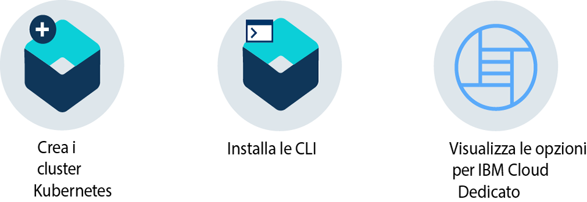

---

copyright:
  years: 2014, 2017
lastupdated: "2017-11-28"

---

{:new_window: target="_blank"}
{:shortdesc: .shortdesc}
{:screen: .screen}
{:pre: .pre}
{:table: .aria-labeledby="caption"}
{:codeblock: .codeblock}
{:tip: .tip}
{:download: .download}

# Introduzione a {{site.data.keyword.containerlong_notm}}
{: #container_index}

Parti in quarta con {{site.data.keyword.Bluemix_notm}} distribuendo applicazioni ad alta disponibilità nei contenitori Docker eseguiti nei cluster Kubernetes. I contenitori sono un modo standard per assemblare applicazioni e tutte le sue dipendenze in modo da poter spostare facilmente le applicazioni tra gli ambienti. A differenza delle macchine virtuali, i contenitori non includono il sistema operativo. I contenitori includono solo il codice dell'applicazione, il runtime, gli strumenti di sistema, le librerie e le impostazioni. I contenitori sono più leggeri, portatili ed efficienti rispetto alle macchine virtuali.
{:shortdesc}

Fai clic su una opzione per iniziare:

<map name="home_map" id="home_map">
<area href="#clusters" alt="Introduzione ai cluster Kubernetes in {{site.data.keyword.Bluemix_notm}}" title="Introduzione ai cluster Kubernetes in {{site.data.keyword.Bluemix_notm}}" shape="rect" coords="-7, -8, 108, 211" />
<area href="cs_classic.html#cs_classic" alt="Esecuzione di contenitori singoli e scalabili in {{site.data.keyword.containershort_notm}}" title="Esecuzione di contenitori singoli e scalabili in {{site.data.keyword.containershort_notm}}" shape="rect" coords="155, -1, 289, 210" />
<area href="cs_ov.html#dedicated_environment" alt="{{site.data.keyword.Bluemix_dedicated_notm}} - ambiente cloud " title="{{site.data.keyword.Bluemix_notm}} - ambiente cloud" shape="rect" coords="326, -10, 448, 218" />
</map>

## Introduzione ai cluster
{: #clusters}

Vuoi distribuire un'applicazione nel contenitore? Aspetta! Crea prima un cluster Kubernetes. Kubernetes è uno strumento di orchestrazione per i contenitori. Con Kubernetes, gli sviluppatori possono distribuire in un attimo le applicazioni ad alta disponibilità sfruttando la potenza e la flessibilità dei cluster.
{:shortdesc}

E cos'è un cluster? Un cluster è un insieme di risorse, nodi di lavoro, reti e dispositivi di archiviazione che mantengono le applicazioni altamente disponibili. Dopo aver ottenuto il tuo cluster, puoi distribuire le tue applicazioni nei contenitori.

Per creare un cluster lite:

1.  Dal [**catalogo** ](https://console.bluemix.net/catalog/?category=containers), nella categoria **Contenitori**, fai clic su **Cluster Kubernetes**.

2.  Immetti un **Nome cluster**. Il tipo di cluster predefinito è lite. La prossima volta, puoi creare un cluster standard e definire ulteriori personalizzazioni, come il numero di
nodi di lavoro all'interno del cluster.

3.  Fai clic su **Crea cluster**. Si aprono i dettagli del cluster, ma il nodo di lavoro nel cluster impiega alcuni minuti per eseguire
il provisioning. Puoi vedere lo stato del nodo di lavoro nella scheda **Nodi di lavoro**. Quando lo stato diventa `Pronto`, il nodo di lavoro è pronto per essere utilizzato.

Ottimo lavoro! Hai creato il tuo primo cluster!

*   Il cluster lite ha un nodo di lavoro con 2 CPU e 4 GB di memoria disponibile per le tue applicazioni.
*   Il nodo di lavoro è monitorato e gestito centralmente da un master Kubernetes dedicato e altamente disponibile di proprietà di {{site.data.keyword.IBM_notm}} che controlla e monitora tutte le risorse Kubernetes presenti nel cluster. Puoi concentrarti sul tuo nodo di lavoro e sulle applicazioni distribuite nel nodo di lavoro senza preoccuparti di gestire anche questo master.
*   Le risorse richieste per eseguire il cluster, come le VLAN e gli indirizzi IP, sono gestite in un account dell'infrastruttura IBM Cloud (SoftLayer) di proprietà di {{site.data.keyword.IBM_notm}}. Quando crei un cluster standard, gestisci queste risorse nel tuo proprio account dell'infrastruttura IBM Cloud (SoftLayer). Puoi scoprire di più su queste risorse
quando crei un cluster standard.
*   **Suggerimento:** con un account lite {{site.data.keyword.Bluemix_notm}}, puoi creare 1 cluster lite con 2 CPU e 4 GB di RAM e integrarlo con i servizi lite. Per creare più cluster, disporre di diversi tipi di macchine e utilizzare i servizi completi, [esegui l'aggiornamento a un account Pagamento a consumo {{site.data.keyword.Bluemix_notm}}](/docs/pricing/billable.html#upgradetopayg).

**Operazioni successive**

Una volta che il cluster è operativo, puoi iniziare a eseguire alcune attività.

* [Installa le CLI per iniziare ad utilizzare il tuo cluster.](cs_cli_install.html#cs_cli_install)
* [Distribuisci un'applicazione nel tuo cluster.](cs_apps.html#cs_apps_cli)
* [Crea un cluster standard con più nodi per una maggiore disponibilità.](cs_cluster.html#cs_cluster_ui)
* [Configura il tuo registro privato in {{site.data.keyword.Bluemix_notm}} per memorizzare e condividere le immagini Docker con altri utenti.](/docs/services/Registry/index.html)

## Introduzione ai cluster in {{site.data.keyword.Bluemix_dedicated_notm}} (Beta chiusa)
{: #dedicated}

Kubernetes è uno strumento di orchestrazione per la pianificazione dei contenitori dell'applicazione su un cluster
di macchine di calcolo. Con Kubernetes, gli sviluppatori possono sviluppare rapidamente applicazioni ad alta disponibilità sfruttando la potenza e la flessibilità dei contenitori nella propria istanza {{site.data.keyword.Bluemix_dedicated_notm}}.
{:shortdesc}

Prima di iniziare, [configura il tuo ambiente {{site.data.keyword.Bluemix_dedicated_notm}} per utilizzare i cluster](cs_ov.html#setup_dedicated). Puoi quindi
creare un cluster. Un cluster è una serie di nodi di lavoro organizzati in una
rete. Lo scopo del cluster è di definire una serie di risorse, nodi, reti e dispositivi di archiviazione
che mantengono le applicazioni altamente disponibili. Dopo aver creato un
cluster, puoi distribuire la tua applicazione nel cluster.

**Suggerimento:** se la tua organizzazione non ha già un ambiente {{site.data.keyword.Bluemix_dedicated_notm}}, potresti non averne bisogno. [Prova prima un cluster dedicato standard
nell'ambiente {{site.data.keyword.Bluemix_notm}}
pubblico.](cs_cluster.html#cs_cluster_ui)

Per distribuire un cluster in {{site.data.keyword.Bluemix_dedicated_notm}}:

1.  Accedi alla console {{site.data.keyword.Bluemix_notm}} pubblico ([https://console.bluemix.net ](https://console.bluemix.net/catalog/?category=containers)) con il tuo ID IBM. Anche se devi richiedere un cluster da {{site.data.keyword.Bluemix_notm}} pubblico, lo distribuirai nel tuo account {{site.data.keyword.Bluemix_dedicated_notm}}.
2.  Se disponi di più account, dal menu Account, seleziona un account {{site.data.keyword.Bluemix_notm}}.
3.  Dal catalogo, nella categoria **Contenitori**, fai clic **Cluster Kubernetes**.
4.  Immetti i dettagli del cluster.
    1.  Immetti un **Nome cluster**.
    2.  Seleziona una **Versione Kubernetes** da utilizzare nei nodi di lavoro. 
    3.  Seleziona un **Tipo di macchina**. Il tipo di macchina definisce la quantità di CPU virtuale e di memoria configurate in ogni nodo di lavoro
disponibile per tutti i contenitori che distribuisci nei tuoi nodi.
    4.  Scegli il **Numero di nodi di lavoro** di cui hai bisogno. Seleziona 3 per l'elevata di disponibilità del tuo cluster.

    I campi relativi a tipo di cluster, ubicazione, VLAN pubblica, VLAN privata e hardware vengono definiti durante il processo di creazione dell'account {{site.data.keyword.Bluemix_dedicated_notm}}, pertanto non puoi modificare questi valori.
5.  Fai clic su **Crea cluster**. Si aprono i dettagli del cluster, ma i nodi di lavoro nel cluster impiegano alcuni minuti per eseguire
il provisioning. Puoi vedere lo stato dei nodi di lavoro nella scheda **Nodi di
lavoro**. Quando lo stato diventa `Pronto`, i nodi di lavoro sono pronti per essere utilizzati.

    I nodi di lavoro sono monitorati e gestiti centralmente da un master Kubernetes dedicato e altamente disponibile di proprietà di {{site.data.keyword.IBM_notm}} che controlla e monitora tutte le risorse Kubernetes presenti nel cluster. Puoi concentrarti sui nodi di lavoro e sulle
applicazioni distribuite nei nodi di lavoro senza preoccuparti di gestire anche questo
master.

Ottimo lavoro! Hai creato il tuo primo cluster!

**Operazioni successive**

Quando il cluster è attivo e in esecuzione, puoi controllare le seguenti attività.

* [Installa le CLI per iniziare ad utilizzare il tuo cluster.](cs_cli_install.html#cs_cli_install)
* [Distribuisci un'applicazione al tuo cluster.](cs_apps.html#cs_apps_cli)
* [Aggiungi i servizi {{site.data.keyword.Bluemix_notm}} al tuo cluster.](cs_cluster.html#binding_dedicated)
* [Scopri le differenze tra i cluster in {{site.data.keyword.Bluemix_dedicated_notm}} e pubblico.](cs_ov.html#env_differences)

