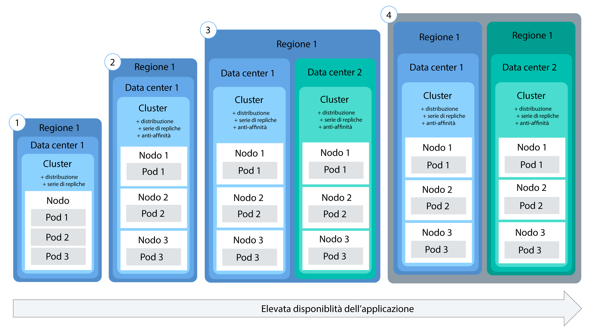

---

copyright:
  years: 2014, 2018
lastupdated: "2018-4-20"

---

{:new_window: target="_blank"}
{:shortdesc: .shortdesc}
{:screen: .screen}
{:pre: .pre}
{:table: .aria-labeledby="caption"}
{:codeblock: .codeblock}
{:tip: .tip}
{:download: .download}


# Distribuzione di applicazioni nei cluster
{: #app}

Puoi utilizzare le tecniche di Kubernetes nel {{site.data.keyword.containerlong}} per distribuire le applicazioni nei contenitori e assicurarti che tali applicazioni siano sempre attive e funzionanti. Ad esempio, puoi eseguire aggiornamenti continui e rollback senza tempi di inattività per i tuoi utenti.
{: shortdesc}

Scopri la procedura generale per distribuire le applicazioni facendo clic su un'area della seguente immagine.


<map name="d62e18" id="d62e18">
<area href="cs_cli_install.html" target="_blank" alt="Installa le CLI." title="Installa le CLI." shape="rect" coords="30, 69, 179, 209" />
<area href="https://kubernetes.io/docs/concepts/configuration/overview/" target="_blank" alt="Crea un file di configurazione per la tua applicazione. Consulta le procedure consigliate da Kubernetes." title="Crea un file di configurazione per la tua applicazione. Consulta le procedure consigliate da Kubernetes." shape="rect" coords="254, 64, 486, 231" />
<area href="#app_cli" target="_blank" alt="Opzione 1: esegui i file di configurazione della CLI Kubernetes." title="Opzione 1: esegui i file di configurazione della CLI Kubernetes." shape="rect" coords="544, 67, 730, 124" />
<area href="#cli_dashboard" target="_blank" alt="Opzione 2: avvia il dashboard Kubernetes in locale ed esegui i file di configurazione." title="Opzione 2: avvia il dashboard Kubernetes in locale ed esegui i file di configurazione." shape="rect" coords="544, 141, 728, 204" />
</map>


<br />


## Pianificazione delle distribuzioni altamente disponibili
{: #highly_available_apps}

Più ampiamente distribuisci la tua configurazione su più nodi di lavoro e cluster, meno è probabile che i tuoi utenti riscontrino tempi di inattività con la tua applicazione.
{: shortdesc}

Rivedi queste potenziali configurazioni delle applicazioni ordinate con diversi gradi di disponibilità.



1.  Una distribuzione con n+2 pod gestiti da una serie di repliche.
2.  Una distribuzione con n+2 pod gestiti da una serie di repliche ed estesi a più nodi
(anti-affinità) nella stessa ubicazione.
3.  Una distribuzione con n+2 pod gestiti da una serie di repliche ed estesi a più nodi
(anti-affinità) in ubicazioni differenti.
4.  Una distribuzione con n+2 pod gestiti da una serie di repliche ed estesi a più nodi
(anti-affinità) in diverse regioni.


### Aumento della disponibilità della tua applicazione

<dl>
  <dt>Utilizza le distribuzioni e le serie di repliche per distribuire la tua applicazione e le sue dipendenze.</dt>
    <dd><p>Una distribuzione è una risorsa Kubernetes che puoi utilizzare per dichiarare tutti i componenti della tua applicazione e le sue dipendenze. Con le distribuzioni, non devi scrivere tutta la procedura e puoi invece concentrarti sulla tua applicazione. </p>
    <p>Quando distribuisci più di un pod, viene creata automaticamente una serie di repliche per le tue distribuzioni che monitora i pod e assicura che il numero di pod desiderato sia sempre in esecuzione. In caso di interruzione di un pod, la serie di repliche sostituisce il pod inattivo con uno nuovo.</p>
    <p>Puoi utilizzare una distribuzione per definire le strategie di aggiornamento per la tua applicazione incluso il numero di pod da aggiungere durante un aggiornamento continuo e il numero di pod che possono non essere disponibili in un determinato momento. Quando effettui un aggiornamento continuo, la distribuzione controlla che la revisione funzioni e arresta il rollout quando vengono rilevati degli errori.</p>
    <p>Con le distribuzioni puoi distribuire contemporaneamente più revisioni con indicatori diversi. Ad esempio, puoi verificare una distribuzione prima di decidere di metterla in produzione. </p>
    <p>Le distribuzioni ti consentono di tenere traccia delle revisioni distribuite. Puoi utilizzare questa cronologia per eseguire il rollback a una versione precedente nel caso in cui riscontri che gli aggiornamenti non funzionano come previsto. </p></dd>
  <dt>Includi repliche sufficienti per il carico di lavoro della tua applicazione, più due</dt>
    <dd>Per rendere la tua applicazione ancora più disponibile e più resiliente agli errori, valuta la possibilità di includere delle repliche aggiuntive rispetto al numero minimo per gestire il carico di lavoro previsto. Le repliche aggiuntive possono gestire il carico di lavoro se si verifica un arresto anomalo del pod e la serie di repliche non ha ancora ripristinato il pod arrestato. Per la protezione da due errori simultanei, includi due ulteriori repliche. Questa configurazione è un modello N+2, dove N è il numero di repliche per gestire il carico di lavoro in entrata e +2 sono le due repliche aggiuntive. Finché il tuo cluster ha spazio sufficiente, puoi avere quanti pod desideri. </dd>
  <dt>Espandi i pod tra più nodi (anti-affinità)</dt>
    <dd><p>Quando crei la tua distribuzione, ogni pod può essere distribuito allo stesso nodo di lavoro. Ciò è noto come affinità o condivisione percorso. Per proteggere la tua applicazione da un errore del nodo di lavoro, puoi configurare la tua distribuzione per espandere i pod tra più nodi di lavoro utilizzando l'opzione <em>podAntiAffinity</em> con i tuoi cluster standard. Puoi definire due tipi di anti-affinità pod: preferito o richiesto. Per ulteriori informazioni, consulta la documentazione Kubernetes in <a href="https://kubernetes.io/docs/concepts/configuration/assign-pod-node/" rel="external" target="_blank" title="(Si apre in una nuova scheda o finestra)">Assigning Pods to Nodes</a>.</p>
    <p><strong>Nota</strong>: con l'anti-affinità richiesta, puoi distribuire solo la quantità di repliche per le quali disponi dei nodi di lavoro. Ad esempio, se hai 3 nodi di lavoro nel tuo cluster ma definisci 5 repliche nel tuo file YAML, verranno distribuite solo 3 repliche. Ciascuna replica è attiva su un nodo di lavoro diverso. Le 2 repliche rimanenti rimarranno in sospeso. Se aggiungi un nodo di lavoro al tuo cluster, una delle repliche rimanenti viene distribuita automaticamente al nuovo nodo di lavoro. <p>
    <p><strong>File YAML di distribuzione di esempio</strong>:<ul>
    <li><a href="https://raw.githubusercontent.com/IBM-Cloud/kube-samples/master/deploy-apps-clusters/nginx_preferredAntiAffinity.yaml" rel="external" target="_blank" title="(Si apre in una nuova scheda o finestra)">Nginx app with preferred pod anti-affinity.</a></li>
    <li><a href="https://raw.githubusercontent.com/IBM-Cloud/kube-samples/master/deploy-apps-clusters/liberty_requiredAntiAffinity.yaml" rel="external" target="_blank" title="(Si apre in una nuova scheda o finestra)">IBM® WebSphere® Application Server Liberty app with required pod anti-affinity.</a></li></ul></p>
    </dd>
<dt>Distribuisci i pod tra più zone o regioni</dt>
  <dd>Per proteggere la tua applicazione da un malfunzionamento di un'ubicazione o di una regione, puoi creare un secondo cluster in un'altra ubicazione o regione e utilizzare un YAML di distribuzione per distribuire una serie di repliche duplicata per la tua applicazione. Aggiungendo una rotta condivisa e un programma di bilanciamento del carico davanti ai tuoi cluster, puoi distribuire il tuo carico di lavoro tra le ubicazioni e regioni. Per ulteriori informazioni, vedi [Elevata disponibilità dei cluster](cs_clusters.html#clusters).
  </dd>
</dl>


### Distribuzione dell'applicazione minima
{: #minimal_app_deployment}

Una distribuzione di base dell'applicazione in un cluster gratuito o standard può includere i seguenti componenti.
{: shortdesc}


Per distribuire i componenti per un'applicazione minima come illustrato nel diagramma, puoi utilizzare un file di configurazione simile al seguente esempio:
```
apiVersion: apps/v1beta1
kind: Deployment
metadata:
  name: ibmliberty
spec:
  replicas: 1
  template:
    metadata:
      labels:
        app: ibmliberty
    spec:
      containers:
      - name: ibmliberty
        image: registry.bluemix.net/ibmliberty:latest
        ports:
        - containerPort: 9080        
---
apiVersion: v1
kind: Service
metadata:
  name: ibmliberty-service
  labels:
    app: ibmliberty
spec:
  selector:
    app: ibmliberty
  type: NodePort
  ports:
   - protocol: TCP
     port: 9080
```
{: codeblock}

**Nota:** per esporre il tuo servizio, assicurati che la coppia chiave/valore che utilizzi nella sezione `spec.selector` del servizio sia la stessa coppia chiave/valore che utilizzi nella sezione `spec.template.metadata.labels` del tuo yaml di distribuzione.
Per ulteriori informazioni su ciascun componente, consulta i [Principi di base di Kubernetes](cs_tech.html#kubernetes_basics).

<br />


## Avvio del dashboard Kubernetes
{: #cli_dashboard}

Ari il dashboard Kubernetes nel tuo sistema locale per visualizzare le informazioni su un cluster e sui suoi nodi di lavoro.
{:shortdesc}

Prima di iniziare, [indirizza la tua CLI](cs_cli_install.html#cs_cli_configure) al tuo cluster. Questa attività richiede la [politica di accesso Amministratore](cs_users.html#access_policies). Verifica la tua [politica di accesso](cs_users.html#infra_access) corrente.

Puoi utilizzare la porta predefinita o impostare una tua porta per avviare il dashboard Kubernetes per un cluster.

1.  Per i cluster con una versione del master Kubernetes di 1.7.16 o precedente:

    1.  Imposta il proxy con il numero di porta predefinito.

        ```
        kubectl proxy
        ```
        {: pre}

        Output:

        ```
        Inizio di utilizzo su 127.0.0.1:8001
        ```
        {: screen}

    2.  Apri il dashboard Kubernetes in un browser Web.

        ```
        http://localhost:8001/ui
        ```
        {: codeblock}

2.  Per i cluster con una versione del master Kubernetes di 1.8.2 o successiva:

    1.  Ottieni le tue credenziali per Kubernetes.

        ```
        kubectl config view -o jsonpath='{.users[0].user.auth-provider.config.id-token}'
        ```
        {: pre}

    2.  Copia il valore **id-token** visualizzato nell'output.

    3.  Imposta il proxy con il numero di porta predefinito.

        ```
        kubectl proxy
        ```
        {: pre}

        Output di esempio:

        ```
        Inizio di utilizzo su 127.0.0.1:8001
        ```
        {: screen}

    4.  Accedi al dashboard.

      1.  Nel tuo browser, passa al seguente URL:

          ```
          http://localhost:8001/api/v1/namespaces/kube-system/services/https:kubernetes-dashboard:/proxy/
          ```
          {: codeblock}

      2.  Nella pagina di accesso, seleziona il metodo di autenticazione **Token**.

      3.  Quindi, incolla il valore **id-token** che hai precedentemente copiato nel campo **Token** e fai clic su **ACCEDI**.

[Successivamente, puoi eseguire un file di configurazione dal dashboard.](#app_ui)

Quando hai finito con il dashboard Kubernetes, utilizza `CTRL+C` per uscire dal comando `proxy`. Dopo essere uscito, il dashboard Kubernetes non è più disponibile. Esegui il comando `proxy` per riavviare il dashboard Kubernetes.


<br />


## Creazione dei segreti
{: #secrets}

I segreti Kubernetes rappresentano un modo sicuro per memorizzare informazioni riservate, quali nome utente, password o chiavi.
{:shortdesc}

<table>
<caption>File richiesti per memorizzare i segreti in base all'attività</caption>
<thead>
<th>Attività</th>
<th>File richiesti da memorizzare nei segreti</th>
</thead>
<tbody>
<tr>
<td>Aggiungere un servizio a un cluster</td>
<td>Nessuno. Un segreto viene creato per te quando esegui il bind di un servizio a un cluster.</td>
</tr>
<tr>
<td>Facoltativo: se non utilizzi il segreto ingress, configura il servizio Ingress con TLS. <p><b>Nota</b>: TLS è già abilitato per impostazione predefinita e un segreto è già stato creato per la connessione TLS.

Per visualizzare il segreto TLS:
<pre>
bx cs cluster-get &lt;cluster_name_or_ID&gt; | grep "Ingress secret"
</pre>
</p>
Per creare il tuo proprio segreto, completa la procedura in questo argomento.</td>
<td>Certificato e chiave del server: <code>server.crt</code> e <code>server.key</code></td>
<tr>
<td>Crea l'annotazione di autenticazione reciproca.</td>
<td>Certificato CA: <code>ca.crt</code></td>
</tr>
</tbody>
</table>

Per ulteriori informazioni su cosa puoi memorizzare nei segreti, consulta la [documentazione Kubernetes](https://kubernetes.io/docs/concepts/configuration/secret/).


Per creare un segreto con un certificato:

1. Genera il certificato e la chiave di autorità di certificazione (CA, certificate authority) dal tuo provider di certificati. Se disponi del tuo proprio dominio, acquista un certificato TLS ufficiale per il dominio. A scopo di test, puoi generare un certificato autofirmato.

 **Importante**: assicurati che il [CN](https://support.dnsimple.com/articles/what-is-common-name/) sia diverso per ogni certificato. 

 Il certificato client e la chiave client devono essere verificati utilizzando il certificato di fonte attendibile, che in questo caso è il certificato CA. Esempio:

 ```
 Client Certificate: issued by Intermediate Certificate
 Intermediate Certificate: issued by Root Certificate
 Root Certificate: issued by itself
 ```
 {: codeblock}

2. Crea il certificato come segreto Kubernetes.

   ```
   kubectl create secret generic <secret_name> --from-file=<cert_file>=<cert_file>
   ```
   {: pre}

   Esempi:
   - Connessione TLS:

     ```
     kubectl create secret tls <secret_name> --from-file=tls.crt=server.crt --from-file=tls.key=server.key
     ```
     {: pre}

   - Annotazione di autenticazione reciproca:

     ```
     kubectl create secret generic <secret_name> --from-file=ca.crt=ca.crt
     ```
     {: pre}

<br />


## Distribuzione di applicazioni con la GUI
{: #app_ui}

Quando distribuisci un'applicazione al tuo cluster utilizzando il dashboard Kubernetes, una risorsa di distribuzione crea, aggiorna e gestisce automaticamente i pod nel tuo cluster.
{:shortdesc}

Prima di iniziare:

-   Installa le [CLI](cs_cli_install.html#cs_cli_install) richieste.
-   [Indirizza la tua CLI](cs_cli_install.html#cs_cli_configure) al tuo cluster.

Per distribuire la tua applicazione:

1.  Apri il [dashboard](#cli_dashboard) Kubernetes e fai clic su **+ Create**.
2.  Immetti i dettagli della tua applicazione in uno dei due modi. 
  * Seleziona **Specify app details below** e immetti i dettagli. 
  * Seleziona **Upload a YAML or JSON file** per caricare il [file di configurazione ](https://kubernetes.io/docs/tasks/inject-data-application/define-environment-variable-container/) della tua applicazione.

  Hai bisogno di aiuto con il tuo file di configurazione? Controlla questo [file YAML di esempio ](https://github.com/IBM-Cloud/kube-samples/blob/master/deploy-apps-clusters/deploy-ibmliberty.yaml). In questo esempio, un contenitore viene distribuito dall'immagine **ibmliberty** nella regione Stati Uniti Sud.
  {: tip}

3.  Verifica di aver distribuito correttamente la tua applicazione in uno dei seguenti modi. 
  * Nel dashboard Kubernetes, fai clic su **Deployments**. Viene visualizzato un elenco delle distribuzioni riuscite. 
  * Se la tua applicazione è [disponibile pubblicamente](cs_network_planning.html#public_access), passa alla pagina di panoramica del cluster nel tuo dashboard {{site.data.keyword.containerlong}}. Copia il dominio secondario, che si trova nella sezione di riepilogo del cluster, e incollalo in un browser per visualizzare la tua applicazione. 

<br />


## Distribuzione di applicazioni con la CLI
{: #app_cli}

Dopo aver creato un cluster, puoi distribuire un'applicazione in tale cluster utilizzando la CLI Kubernetes.
{:shortdesc}

Prima di iniziare:

-   Installa le [CLI](cs_cli_install.html#cs_cli_install) richieste.
-   [Indirizza la tua CLI](cs_cli_install.html#cs_cli_configure) al tuo cluster.

Per distribuire la tua applicazione:

1.  Crea un file di configurazione basato sulle [Procedure consigliate Kubernetes ](https://kubernetes.io/docs/concepts/configuration/overview/). Generalmente, un file di configurazione contiene i dettagli di configurazione per ognuna delle risorse che crei in Kubernetes. Il tuo script potrebbe includere una o più delle seguenti sezioni:

    -   [Distribuire ](https://kubernetes.io/docs/concepts/workloads/controllers/deployment/): definisce la creazione di pod e serie di repliche. Un pod include una singola applicazione inserita nel contenitore e le serie di repliche controllano più istanze dei pod.

    -   [Servizio ](https://kubernetes.io/docs/concepts/services-networking/service/): fornisce accesso di front-end ai pod utilizzando un nodo di lavoro o un indirizzo IP pubblico del programma di bilanciamento del carico o una rotta Ingress pubblica.

    -   [Ingress ](https://kubernetes.io/docs/concepts/services-networking/ingress/): specifica un tipo di programma di bilanciamento del carico che fornisce le rotte per accedere alla tua applicazione pubblicamente.

    

2.  Esegui il file di configurazione nel contesto di un cluster.

    ```
    kubectl apply -f config.yaml
    ```
    {: pre}

3.  Se rendi la tua applicazione disponibile pubblicamente utilizzando un servizio della porta del nodo, un servizio del programma di bilanciamento del carico o Ingress, verifica di poter accedere all'applicazione.

<br />


## Ridimensionamento delle applicazioni 
{: #app_scaling}

Con Kubernetes, puoi abilitare il [ridimensionamento automatico pod orizzontale ](https://kubernetes.io/docs/tasks/run-application/horizontal-pod-autoscale/) per aumentare o ridurre automaticamente il numero di istanze delle tue applicazioni in base alla CPU.
{:shortdesc}

Cerchi informazioni sul ridimensionamento delle applicazioni Cloud Foundry? Controlla [IBM Auto-Scaling per {{site.data.keyword.Bluemix_notm}}](/docs/services/Auto-Scaling/index.html). 
{: tip}

Prima di iniziare:
- [Indirizza la tua CLI](cs_cli_install.html#cs_cli_configure) al tuo cluster.
- Il monitoraggio Heapster deve essere distribuito nel cluster che vuoi ridimensionare automaticamente.

Passi:

1.  Distribuisci la tua applicazione al cluster dalla CLI. Quando distribuisci la tua applicazione, devi richiedere la CPU.

    ```
    kubectl run <app_name> --image=<image> --requests=cpu=<cpu> --expose --port=<port_number>
    ```
    {: pre}

    <table>
    <thead>
    <th colspan=2> Descrizione dei componenti di questo comando</th>
    </thead>
    <tbody>
    <tr>
    <td><code>--image</code></td>
    <td>L'applicazione che desideri distribuire.</td>
    </tr>
    <tr>
    <td><code>--request=cpu</code></td>
    <td>La CPU richiesta per il contenitore, specificata in milli-core. Ad esempio, <code>--requests=200m</code>.</td>
    </tr>
    <tr>
    <td><code>--expose</code></td>
    <td>Se true, crea un servizio esterno.</td>
    </tr>
    <tr>
    <td><code>--port</code></td>
    <td>La porta dove la tua applicazione è disponibile esternamente.</td>
    </tr></tbody></table>

    Per distribuzioni più complesse, potresti dover creare un [file di configurazione](#app_cli).
    {: tip}

2.  Crea un autoscaler e definisci la tua politica. Per ulteriori informazioni sull'utilizzo del comando `kubectl autoscale`, consulta la [documentazione Kubernetes ](https://v1-8.docs.kubernetes.io/docs/reference/generated/kubectl/kubectl-commands#autoscale).

    ```
    kubectl autoscale deployment <deployment_name> --cpu-percent=<percentage> --min=<min_value> --max=<max_value>
    ```
    {: pre}

    <table>
    <thead>
    <th colspan=2> Descrizione dei componenti di questo comando</th>
    </thead>
    <tbody>
    <tr>
    <td><code>--cpu-percent</code></td>
    <td>L'utilizzo medio della CPU mantenuto da Horizontal Pod Autoscaler, che viene specificato come percentuale.</td>
    </tr>
    <tr>
    <td><code>--min</code></td>
    <td>Il numero minimo di pod distribuiti utilizzati per mantenere la percentuale di utilizzo della CPU specificata.</td>
    </tr>
    <tr>
    <td><code>--max</code></td>
    <td>Il numero massimo di pod distribuiti utilizzati per mantenere la percentuale di utilizzo della CPU specificata.</td>
    </tr>
    </tbody></table>


<br />


## Gestione delle distribuzioni graduali
{: #app_rolling}

Puoi gestire la distribuzione delle modifiche in modo automatizzato e controllato. Se la distribuzione non avviene secondo i tuoi piani, puoi riportarla alla revisione precedente.
{:shortdesc}

Prima di iniziare, crea una [distribuzione](#app_cli).

1.  [Distribuisci ](https://kubernetes.io/docs/reference/generated/kubectl/kubectl-commands#rollout) una modifica. Ad esempio, potresti voler modificare l'immagine che hai utilizzato nella tua distribuzione iniziale.

    1.  Ottieni il nome della distribuzione.

        ```
        kubectl get deployments
        ```
        {: pre}

    2.  Ottieni il nome del pod.

        ```
        kubectl get pods
        ```
        {: pre}

    3.  Ottieni il nome del contenitore in esecuzione nel pod.

        ```
        kubectl describe pod <pod_name>
        ```
        {: pre}

    4.  Configura la nuova immagine per la distribuzione da utilizzare.

        ```
        kubectl set image deployment/<deployment_name><container_name>=<image_name>
        ```
        {: pre}

    Quando esegui i comandi, la modifica viene immediatamente applicata e registrata nella cronologia di distribuzione.

2.  Controlla lo stato della tua distribuzione.

    ```
    kubectl rollout status deployments/<deployment_name>
    ```
    {: pre}

3.  Annulla una modifica.
    1.  Visualizza la cronologia di distribuzione e identifica il numero di revisione della tua ultima distribuzione.

        ```
        kubectl rollout history deployment/<deployment_name>
        ```
        {: pre}

        **Suggerimento:** per visualizzare i dettagli di una revisione specifica, includi il numero di revisione.

        ```
        kubectl rollout history deployment/<deployment_name> --revision=<number>
        ```
        {: pre}

    2.  Riporta la distribuzione alla versione precedente o specifica una revisione. Per tornare alla versione precedente, utilizza il seguente comando.

        ```
        kubectl rollout undo deployment/<depoyment_name> --to-revision=<number>
        ```
        {: pre}

<br />


