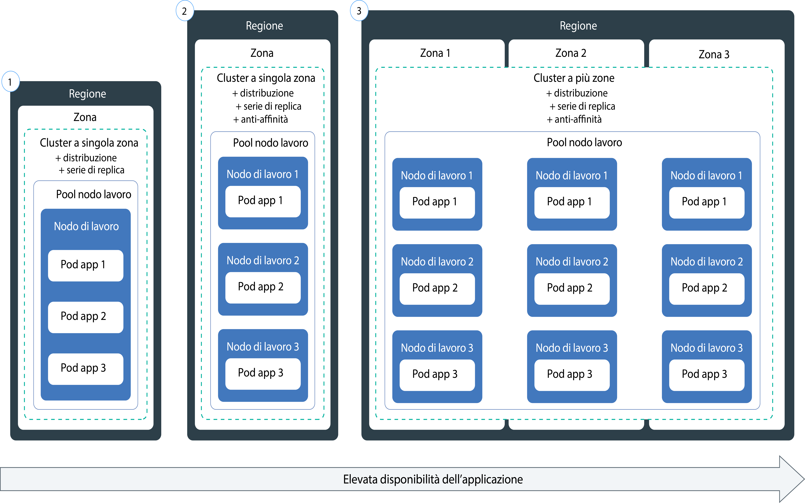

---

copyright:
  years: 2014, 2019
lastupdated: "2019-06-11"

keywords: kubernetes, iks, node.js, js, java, .net, go, flask, react, python, swift, rails, ruby, spring boot, angular

subcollection: containers

---

{:new_window: target="_blank"}
{:shortdesc: .shortdesc}
{:screen: .screen}
{:pre: .pre}
{:table: .aria-labeledby="caption"}
{:codeblock: .codeblock}
{:tip: .tip}
{:note: .note}
{:important: .important}
{:deprecated: .deprecated}
{:download: .download}
{:preview: .preview}


# Distribuzione di applicazioni native di Kubernetes nei cluster
{: #app}

Puoi utilizzare le tecniche di Kubernetes nel {{site.data.keyword.containerlong}} per distribuire le applicazioni nei contenitori e assicurarti che tali applicazioni siano sempre attive e funzionanti. Ad esempio, puoi eseguire aggiornamenti continui e rollback senza tempi di inattività per i tuoi utenti. Poiché Kubernetes è una piattaforma di orchestrazione dei contenitori estensibile che non richiede un linguaggio o un'applicazione specifici, puoi eseguire vari carichi di lavoro come le applicazioni senza stato, con stato e di elaborazione dati che vengono scritte nel linguaggio di tua scelta.
{: shortdesc}

Scopri la procedura generale per distribuire le applicazioni facendo clic su un'area della seguente immagine. Desideri apprendere prima i principi di base? Prova ad [eseguire l'esercitazione sulla distribuzione delle applicazioni](/docs/containers?topic=containers-cs_apps_tutorial#cs_apps_tutorial).


<map name="d62e18" id="d62e18">
<area href="/docs/containers?topic=containers-cs_cli_install" target="_blank" alt="Installa le CLI." title="Installa le CLI." shape="rect" coords="30, 69, 179, 209" />
<area href="https://kubernetes.io/docs/concepts/configuration/overview/" target="_blank" alt="Crea un file di configurazione per la tua applicazione. Consulta le procedure consigliate da Kubernetes." title="Crea un file di configurazione per la tua applicazione. Consulta le procedure consigliate da Kubernetes." shape="rect" coords="254, 64, 486, 231" />
<area href="#app_cli" target="_blank" alt="Opzione 1: esegui i file di configurazione della CLI Kubernetes." title="Opzione 1: esegui i file di configurazione della CLI Kubernetes." shape="rect" coords="544, 67, 730, 124" />
<area href="#cli_dashboard" target="_blank" alt="Opzione 2: avvia il dashboard Kubernetes in locale ed esegui i file di configurazione." title="Opzione 2: avvia il dashboard Kubernetes in locale ed esegui i file di configurazione." shape="rect" coords="544, 141, 728, 204" />
</map>

<br />


## Pianificazione per l'esecuzione di applicazioni nei cluster
{: #plan_apps}

Prima di distribuire un'applicazione in un cluster {{site.data.keyword.containerlong_notm}}, decidi come vuoi configurare la tua applicazione in modo che sia accessibile correttamente e sia integrata con altri servizi in {{site.data.keyword.Bluemix_notm}}.
{:shortdesc}

### Che tipo di oggetti Kubernetes posso creare per la mia applicazione?
{: #object}

Quando prepari il file YAML della tua applicazione, hai molte opzioni per aumentare la disponibilità, le prestazioni e la sicurezza dell'applicazione. Ad esempio, invece di un singolo pod, puoi utilizzare un oggetto controller Kubernetes per gestire il tuo carico di lavoro, ad esempio una serie di repliche, un lavoro o una serie di daemon. Per ulteriori informazioni su pod e controller, consulta la [documentazione di Kubernetes ](https://kubernetes.io/docs/concepts/workloads/pods/pod-overview/). Una distribuzione che gestisce una serie di repliche dei pod è un caso di utilizzo comune per un'applicazione.
{: shortdesc}

Ad esempio, un oggetto `kind: Deployment` è una buona scelta per distribuire un pod dell'applicazione perché con esso puoi specificare una serie di repliche per una maggiore disponibilità dei tuoi pod.

La seguente tabella descrive il motivo per cui potresti creare diversi tipi di oggetti del carico di lavoro Kubernetes.

| Oggetto | Descrizione |
| --- | --- |
| [`Pod` ](https://kubernetes.io/docs/concepts/workloads/pods/pod/) | Un pod è la più piccola unità distribuibile per i tuoi carichi di lavoro e può contenere uno o più contenitori. Analogamente ai contenitori, i pod sono progettati per essere eliminabili e vengono spesso utilizzati per il test unitario delle funzioni dell'applicazione. Per evitare tempi di inattività per la tua applicazione, prendi in considerazione la distribuzione di pod con un controller Kubernetes, ad esempio una distribuzione. Una distribuzione ti aiuta a gestire più pod, repliche, ridimensionamento pod, rollout e altro ancora. |
| [`ReplicaSet` ](https://kubernetes.io/docs/concepts/workloads/controllers/replicaset/) | Una serie di repliche garantisce che più repliche del tuo pod siano in esecuzione e ripianifica un pod se si arresta. Puoi creare una serie di repliche per verificare come funziona la pianificazione dei pod, ma per gestire gli aggiornamenti, i rollout e il ridimensionamento dell'applicazione, crea invece una distribuzione. |
| [`Deployment` ](https://kubernetes.io/docs/concepts/workloads/controllers/deployment/) | Una distribuzione è un controller che gestisce un pod o una [serie di repliche ](https://kubernetes.io/docs/concepts/workloads/controllers/replicaset/) di template di pod. Puoi creare pod o serie di repliche senza una distribuzione per testare le funzioni dell'applicazione. Per una configurazione a livello di produzione, utilizza le distribuzioni per gestire gli aggiornamenti, i rollout e il ridimensionamento dell'applicazione. |
| [`StatefulSet` ](https://kubernetes.io/docs/concepts/workloads/controllers/statefulset/) | Analogamente alle distribuzioni, una serie con stato è un controller che gestisce una serie di repliche dei pod. A differenza delle distribuzioni, una serie con stato garantisce che il tuo pod abbia un'identità di rete univoca che mantiene il suo stato dopo la ripianificazione. Quando vuoi eseguire i carichi di lavoro nel cloud, prova a [progettare la tua applicazione in modo che sia senza stato](/docs/containers?topic=containers-strategy#cloud_workloads)
affinché le istanze del servizio siano indipendenti le une dalle altre e possano non riuscire senza provocare un'interruzione del servizio. Tuttavia alcune applicazioni, come i database, devono avere uno stato. Per questi casi, valuta la possibilità di creare una serie con stato e di utilizzare un'archiviazione di [file](/docs/containers?topic=containers-file_storage#file_statefulset), [blocchi](/docs/containers?topic=containers-block_storage#block_statefulset) o [oggetti](/docs/containers?topic=containers-object_storage#cos_statefulset) come archiviazione persistente per la tua serie con stato. Puoi anche installare [Portworx](/docs/containers?topic=containers-portworx) sui tuoi nodi di lavoro bare metal e utilizzarlo come soluzione SDS (software-defined storage) altamente disponibile per gestire l'archiviazione persistente per la tua serie con stato. |
| [`DaemonSet` ](https://kubernetes.io/docs/concepts/workloads/controllers/daemonset/) | Utilizza una serie di daemon quando devi eseguire lo stesso pod su ogni nodo di lavoro nel tuo cluster. I pod gestiti da una serie di daemon sono pianificati automaticamente quando un nodo di lavoro viene aggiunto a un cluster. I casi di utilizzo tipici includono programmi di raccolta log, come ad esempio `logstash` o `prometheus`, che raccolgono i log da ogni nodo di lavoro per fornire informazioni approfondite sull'integrità di un cluster o di un'applicazione. |
| [`Job` ](https://kubernetes.io/docs/concepts/workloads/controllers/jobs-run-to-completion/) | Un lavoro assicura che uno o più pod vengano eseguiti correttamente fino al completamento. Potresti utilizzare un lavoro per le code o i lavori batch per supportare l'elaborazione parallela di elementi di lavoro separati ma correlati, come un certo numero di frame da visualizzare, e-mail da inviare e file da convertire. Per pianificare un lavoro da eseguire in determinati orari, utilizza un [`CronJob` ](https://kubernetes.io/docs/concepts/workloads/controllers/cron-jobs/).|
{: caption="Tipi di oggetti del carico di lavoro Kubernetes che puoi creare." caption-side="top"}

### Come posso aggiungere funzionalità alla configurazione della mia applicazione Kubernetes?
Vedi [Specifica dei requisiti della tua applicazione nel file YAML](#app_yaml) per le descrizioni di ciò che potresti includere in una distribuzione. L'esempio include:
* [Serie di repliche](#replicaset)
* [Etichette](#label)
* [Affinità](#affinity)
* [Politiche di immagini](#image)
* [Porte](#port)
* [Richieste e limiti di risorse](#resourcereq)
* [Analisi di attività e disponibilità](#probe)
* [Servizi](#app-service) per esporre il servizio dell'applicazione su una porta
* [Mappe di configurazione](#configmap) per impostare le variabili di ambiente del contenitore
* [Segreti](#secret) per impostare le variabili di ambiente del contenitore
* [Volumi persistenti](#pv) che vengono montati sul contenitore per l'archiviazione

### Cosa devo fare se voglio che la configurazione della mia applicazione Kubernetes utilizzi le variabili? Come le aggiungo al file YAML?
{: #variables}

Per aggiungere informazioni della variabile alle tue distribuzioni invece di codificare in modo permanente i dati nel file YAML, puoi utilizzare un oggetto [`ConfigMap` ](https://kubernetes.io/docs/tasks/configure-pod-container/configure-pod-configmap/) o [`Secret` ](https://kubernetes.io/docs/concepts/configuration/secret/) di Kubernetes.
{: shortdesc}

Per utilizzare una mappa di configurazione o un segreto, devi montarli sul pod. La mappa di configurazione o il segreto vengono combinati con il pod subito prima della sua esecuzione. Puoi riutilizzare la specifica e l'immagine di una distribuzione tra molte applicazioni, ma devi quindi sostituire le mappe di configurazione e i segreti personalizzati. I segreti in particolare possono occupare molto spazio di archiviazione sul nodo locale, quindi pianifica di conseguenza.

Entrambe le risorse definiscono coppie chiave-valore, ma puoi usarle per situazioni diverse.

<dl>
<dt>Mappa di configurazione</dt>
<dd>Fornisci informazioni di configurazione non sensibili per i carichi di lavoro specificati in una distribuzione. Puoi usare le mappe di configurazione in tre modi principali.
<ul><li><strong>File system</strong>: puoi montare un intero file o una serie di variabili su un pod. Un file viene creato per ogni voce in base al contenuto del nome chiave del file impostato sul valore.</li>
<li><strong>Variabile di ambiente</strong>: imposta dinamicamente la variabile di ambiente per una specifica del contenitore.</li>
<li><strong>Argomento riga comandi</strong>: imposta l'argomento della riga comandi utilizzato in una specifica del contenitore.</li></ul></dd>

<dt>Segreto</dt>
<dd>Fornisci informazioni sensibili ai tuoi carichi di lavoro, come quelle che seguono. Altri utenti del cluster potrebbero avere accesso al segreto, quindi assicurati di sapere che le informazioni sul segreto possono essere condivise con tali utenti.
<ul><li><strong>Informazioni di identificazione personale</strong>: memorizza nei segreti le informazioni sensibili come indirizzi e-mail o altri tipi di informazioni necessarie per la conformità aziendale o la regolamentazione governativa.</li>
<li><strong>Credenziali</strong>: inserisci in un segreto le credenziali come password, chiavi e token per ridurre il rischio di esposizione accidentale. Ad esempio, quando esegui il [bind di un servizio](/docs/containers?topic=containers-service-binding#bind-services) al tuo cluster, le credenziali vengono memorizzate in un segreto.</li></ul></dd>
</dl>

Vuoi rendere i tuoi segreti ancora più sicuri? Chiedi al tuo amministratore cluster di [abilitare {{site.data.keyword.keymanagementservicefull}}](/docs/containers?topic=containers-encryption#keyprotect) nel cluster per crittografare i segreti nuovi ed esistenti.
{: tip}

### Come posso aggiungere i servizi IBM, ad esempio Watson, alla mia applicazione?
Vedi [Aggiunta dei servizi alle applicazioni](/docs/containers?topic=containers-service-binding#adding_app).

### Come posso assicurarmi che la mia applicazione abbia le risorse giuste?
Quando [specifichi il file YAML della tua applicazione](#app_yaml), puoi aggiungere le funzionalità di Kubernetes alla configurazione dell'applicazione che consentono all'applicazione di ottenere le risorse giuste. In particolare, [imposta i limiti e le richieste di risorse ](https://kubernetes.io/docs/concepts/configuration/manage-compute-resources-container/) per ogni contenitore definito nel file YAML.
{: shortdesc}

Inoltre, il tuo amministratore cluster potrebbe configurare controlli delle risorse che possono influire sulla distribuzione dell'applicazione, tra cui:
*  [Quote di risorse ](https://kubernetes.io/docs/concepts/policy/resource-quotas/)
*  [Priorità dei pod](/docs/containers?topic=containers-pod_priority#pod_priority)

### Come posso accedere alla mia applicazione?
Puoi accedere alla tua applicazione in modo privato all'interno del cluster [utilizzando un servizio `clusterIP`](/docs/containers?topic=containers-cs_network_planning#in-cluster).
{: shortdesc}

Se vuoi esporre pubblicamente la tua applicazione, hai diverse opzioni che dipendono dal tuo tipo di cluster.
*  **Cluster gratuito**: puoi esporre la tua applicazione utilizzando un [servizio NodePort](/docs/containers?topic=containers-nodeport#nodeport).
*  **Cluster standard**: puoi esporre la tua applicazione utilizzando un [servizio NodePort, programma di bilanciamento del carico o Ingress](/docs/containers?topic=containers-cs_network_planning#external).
*  **Cluster reso privato utilizzando Calico**: puoi esporre la tua applicazione utilizzando un [servizio NodePort, programma di bilanciamento del carico o Ingress](/docs/containers?topic=containers-cs_network_planning#private_both_vlans). Devi inoltre utilizzare una politica di rete preDNAT di Calico per bloccare le porte del nodo pubblico.
*  **Cluster standard solo per VLAN privata**: puoi esporre la tua applicazione utilizzando un [servizio NodePort, programma di bilanciamento del carico o Ingress](/docs/containers?topic=containers-cs_network_planning#plan_private_vlan). Devi anche aprire la porta per l'indirizzo IP privato del servizio nel tuo firewall.

### Dopo aver distribuito la mia applicazione, come posso monitorarne l'integrità?
Puoi configurare la [registrazione e il monitoraggio](/docs/containers?topic=containers-health#health) di {{site.data.keyword.Bluemix_notm}} per il tuo cluster. Puoi anche scegliere di integrare un [servizio di registrazione o monitoraggio](/docs/containers?topic=containers-supported_integrations#health_services) di terze parti.
{: shortdesc}

### Come posso mantenere aggiornata la mia applicazione?
Se vuoi aggiungere e rimuovere dinamicamente le applicazioni in risposta all'utilizzo del carico di lavoro, vedi [Ridimensionamento delle applicazioni](/docs/containers?topic=containers-app#app_scaling).
{: shortdesc}

Se vuoi gestire gli aggiornamenti alla tua applicazione, vedi [Gestione delle distribuzioni graduali](/docs/containers?topic=containers-app#app_rolling).

### Come posso controllare chi ha accesso alle distribuzioni della mia applicazione?
Gli amministratori di account e di cluster possono controllare l'accesso su molti livelli diversi: cluster, spazio dei nomi Kubernetes, pod e contenitore.
{: shortdesc}

Con {{site.data.keyword.Bluemix_notm}} IAM, puoi assegnare autorizzazioni a singoli utenti, gruppi o account di servizio a livello di istanza del cluster.  Puoi ridurre ulteriormente l'accesso al cluster limitando gli utenti a determinati spazi dei nomi all'interno del cluster. Per ulteriori informazioni, vedi [Assegnazione dell'accesso al cluster](/docs/containers?topic=containers-users#users).

Per controllare l'accesso a livello di pod, puoi [configurare le politiche di sicurezza del pod con RBAC Kubernetes](/docs/containers?topic=containers-psp#psp).

All'interno del file YAML di distribuzione dell'applicazione, puoi impostare il contesto di sicurezza per un pod o un contenitore. Per ulteriori informazioni, consulta la [documentazione di Kubernetes ](https://kubernetes.io/docs/tasks/configure-pod-container/security-context/).

Vuoi controllare l'accesso a livello di applicazione? Per creare un flusso di accesso che puoi aggiornare in qualsiasi momento senza modificare il tuo codice applicazione, prova a utilizzare [{{site.data.keyword.appid_long_notm}}](/docs/services/appid?topic=appid-getting-started).
{: tip}

<br />


## Pianificazione delle distribuzioni altamente disponibili
{: #highly_available_apps}

Più ampiamente distribuisci la tua configurazione su più nodi di lavoro e cluster, meno è probabile che i tuoi utenti riscontrino tempi di inattività con la tua applicazione.
{: shortdesc}

Rivedi queste potenziali configurazioni delle applicazioni ordinate con diversi gradi di disponibilità.



1.  Una distribuzione con n+2 pod gestiti da una serie di repliche in un singolo nodo in un cluster a zona singola.
2.  Una distribuzione con n+2 pod gestiti da una serie di repliche ed estesi a più nodi (anti-affinità) in un cluster a zona singola.
3.  Una distribuzione con n+2 pod gestiti da una serie di repliche ed estesi a più nodi (anti-affinità) in un cluster multizona tra zone.

Puoi anche [collegare più cluster in regioni diverse con un programma di bilanciamento del carico globale](/docs/containers?topic=containers-ha_clusters#multiple_clusters) per aumentare l'alta disponibilità.

### Aumento della disponibilità della tua applicazione
{: #increase_availability}

Considera le seguenti opzioni per aumentare la disponibilità della tua applicazione.
{: shortdesc}

<dl>
  <dt>Utilizza le distribuzioni e le serie di repliche per distribuire la tua applicazione e le sue dipendenze.</dt>
    <dd><p>Una distribuzione è una risorsa Kubernetes che puoi utilizzare per dichiarare tutti i componenti della tua applicazione e le sue dipendenze. Con le distribuzioni, non devi scrivere tutta la procedura e puoi invece concentrarti sulla tua applicazione.</p>
    <p>Quando distribuisci più di un pod, viene creata automaticamente una serie di repliche per le tue distribuzioni che monitora i pod e assicura che il numero di pod specificato sia sempre in esecuzione. In caso di interruzione di un pod, la serie di repliche sostituisce il pod inattivo con uno nuovo.</p>
    <p>Puoi utilizzare una distribuzione per definire le strategie di aggiornamento per la tua applicazione, incluso il numero di pod da aggiungere durante un aggiornamento continuo e il numero di pod che possono non essere disponibili in un determinato momento. Quando effettui un aggiornamento continuo, la distribuzione controlla che la revisione funzioni e arresta il rollout quando vengono rilevati degli errori.</p>
    <p>Con le distribuzioni, puoi distribuire contemporaneamente più revisioni con indicatori diversi. Ad esempio, puoi verificare una distribuzione prima di decidere di metterla in produzione.</p>
    <p>Attraverso le distribuzioni puoi tenere traccia delle revisioni distribuite. Puoi utilizzare questa cronologia per eseguire il rollback a una versione precedente nel caso in cui riscontri che gli aggiornamenti non funzionano come previsto.</p></dd>
  <dt>Includi repliche sufficienti per il carico di lavoro della tua applicazione, più due</dt>
    <dd>Per rendere la tua applicazione ancora più disponibile e più resiliente agli errori, valuta la possibilità di includere delle repliche aggiuntive rispetto al numero minimo per gestire il carico di lavoro previsto. Le repliche aggiuntive possono gestire il carico di lavoro se si verifica un arresto anomalo del pod e la serie di repliche non ha ancora ripristinato il pod arrestato. Per la protezione da due errori simultanei, includi due ulteriori repliche. Questa configurazione è un modello N+2, dove N è il numero di repliche per gestire il carico di lavoro in entrata e +2 sono le due repliche aggiuntive. Finché il tuo cluster ha spazio sufficiente, puoi avere quanti pod desideri.</dd>
  <dt>Espandi i pod tra più nodi (anti-affinità)</dt>
    <dd><p>Quando crei la tua distribuzione, ogni pod può essere distribuito allo stesso nodo di lavoro. Ciò è noto come affinità o condivisione percorso. Per proteggere la tua applicazione da un errore del nodo di lavoro, puoi configurare la tua distribuzione per espandere i pod tra più nodi di lavoro utilizzando l'opzione <code>podAntiAffinity</code> con i tuoi cluster standard. Puoi definire due tipi di anti-affinità pod: preferito o richiesto.
      <p>Per ulteriori informazioni, consulta la documentazione Kubernetes in <a href="https://kubernetes.io/docs/concepts/configuration/assign-pod-node/" rel="external" target="_blank" title="(Si apre in una nuova scheda o finestra)">Assigning Pods to Nodes</a>.</p>
      <p>Per un esempio di affinità nella distribuzione di un'applicazione, vedi [Creazione del file YAML di distribuzione della tua applicazione](#app_yaml).</p>
      </dd>
    </dd>
<dt>Distribuisci i pod tra più zone o regioni</dt>
  <dd><p>Per proteggere la tua applicazione da un malfunzionamento della zona, puoi creare più cluster in zone separate o aggiungere zone ad un pool di nodi di lavoro in un cluster multizona. I cluster multizona sono disponibili solo in [determinate aree metropolitane](/docs/containers?topic=containers-regions-and-zones#zones), ad esempio Dallas. Se crei più cluster in zone separate, devi [impostare un programma di bilanciamento del carico globale](/docs/containers?topic=containers-ha_clusters#multiple_clusters).</p>
  <p>Quando usi una serie di repliche e specifichi l'anti-affinità pod, Kubernetes espande i pod dell'applicazione tra i nodi. Se i tuoi nodi si trovano in più zone, i pod vengono estesi tra le zone, aumentando la disponibilità della tua applicazione. Se vuoi limitare le tue applicazioni affinché vengano eseguite in una sola zona, puoi configurare l'affinità pod o creare ed etichettare un pool di nodi di lavoro in una zona. Per ulteriori informazioni, vedi [Alta disponibilità per i cluster multizona](/docs/containers?topic=containers-ha_clusters#ha_clusters).</p>
  <p><strong>In una distribuzione cluster multizona, i miei pod dell'applicazione vengono distribuiti uniformemente tra i nodi?</strong></p>
  <p>I pod vengono distribuiti uniformemente tra le zone, ma non sempre tra i nodi. Ad esempio, se hai un cluster con un nodo in ciascuna delle tre zone e distribuisci una serie di repliche di sei pod, ciascun nodo ottiene due pod. Tuttavia, se hai un cluster con due nodi in ciascuna delle tre zone e distribuisci una serie di repliche di sei pod, ciascuna zona pianifica due pod e potrebbe pianificare o meno un solo pod per nodo. Per un maggiore controllo sulla pianificazione, puoi [impostare l'affinità pod ](https://kubernetes.io/docs/concepts/configuration/assign-pod-node).</p>
  <p><strong>Se una zona si disattiva, in che modo i pod vengono ripianificati sui nodi rimanenti nelle altre zone?</strong></br>Dipende dalla politica di pianificazione che hai utilizzato nella distribuzione. Se hai incluso l'[affinità pod specifica del nodo ](https://kubernetes.io/docs/concepts/configuration/assign-pod-node/#node-affinity-beta-feature), i tuoi pod non verranno ripianificati. Se non l'hai inclusa, i pod verranno creati sui nodi di lavoro disponibili nelle altre zone, ma potrebbero non essere bilanciati. Ad esempio, due pod potrebbero essere distribuiti tra i due nodi disponibili oppure potrebbero essere entrambi pianificati su un unico nodo con capacità disponibile. Allo stesso modo, quando la zona non disponibile torna disponibile, i pod non vengono eliminati e ribilanciati automaticamente tra i nodi. Se vuoi che i pod vengano ribilanciati tra le zone una volta che la zona torna attiva, prendi in considerazione di utilizzare il [programma di annullamento della pianificazione (descheduler) Kubernetes](https://github.com/kubernetes-incubator/descheduler).</p>
  <p><strong>Suggerimento</strong>: nei cluster multizona, prova a tenere la capacità del tuo nodo di lavoro al 50% per ciascuna zona, in modo da avere capacità sufficiente per proteggere il tuo cluster da un malfunzionamento della zona.</p>
  <p><strong>Se voglio estendere la mia applicazione tra le regioni?</strong></br>Per proteggere la tua applicazione da un malfunzionamento della regione, crea un secondo cluster in un'altra regione, [imposta un programma di bilanciamento del carico globale](/docs/containers?topic=containers-ha_clusters#multiple_clusters) per connettere i tuoi cluster e usa file YAML di distribuzione per distribuire una serie di repliche duplicata con l'[anti-affinità pod ](https://kubernetes.io/docs/concepts/configuration/assign-pod-node/) nella tua applicazione.</p>
  <p><strong>Se le mie applicazioni hanno bisogno di memoria persistente?</strong></p>
  <p>Usa un servizio cloud come [{{site.data.keyword.cloudant_short_notm}}](/docs/services/Cloudant?topic=cloudant-getting-started#getting-started) o [{{site.data.keyword.cos_full_notm}}](/docs/services/cloud-object-storage?topic=cloud-object-storage-about).</p></dd>
</dl>

## Specifica dei requisiti della tua applicazione nel file YAML
{: #app_yaml}

In Kubernetes, descrivi la tua applicazione in un file YAML che dichiara la configurazione dell'oggetto Kubernetes. Il server API Kubernetes elabora quindi il file YAML e memorizza la configurazione e lo stato richiesto dell'oggetto nell'archivio dati etcd. Il programma di pianificazione (scheduler) Kubernetes pianifica i tuoi carichi di lavoro sui nodi di lavoro all'interno del cluster, tenendo conto delle specifiche nel tuo file YAML, di eventuali politiche del cluster impostate dall'amministratore e della capacità disponibile del cluster.
{: shortdesc}

Esamina una copia del [file YAML completo](https://raw.githubusercontent.com/IBM-Cloud/kube-samples/master/deploy-apps-clusters/deploy_wasliberty.yaml). Quindi, rivedi le seguenti sezioni per comprendere come poter migliorare la distribuzione della tua applicazione.

* [Serie di repliche](#replicaset)
* [Etichette](#label)
* [Affinità](#affinity)
* [Politiche di immagini](#image)
* [Porte](#port)
* [Richieste e limiti di risorse](#resourcereq)
* [Analisi di attività e disponibilità](#probe)
* [Servizi](#app-service) per esporre il servizio dell'applicazione su una porta
* [Mappe di configurazione](#configmap) per impostare le variabili di ambiente del contenitore
* [Segreti](#secret) per impostare le variabili di ambiente del contenitore
* [Volumi persistenti](#pv) che vengono montati sul contenitore per l'archiviazione
* [Passi successivi](#nextsteps)
* [YAML completo di esempio](#yaml-example)

<dl>
<dt>Metadati di distribuzione di base</dt>
  <dd><p>Utilizza la versione API appropriata per il [tipo di oggetto Kubernetes](#object) che distribuisci. La versione dell'API determina le funzioni supportate per l'oggetto Kubernetes a tua disposizione. Il nome che fornisci nei metadati è il nome dell'oggetto, non la sua etichetta. Usi il nome quando interagisci con il tuo oggetto, come ad esempio `kubectl get deployment <name>`.</p>
  <p><pre class="codeblock"><code>apiVersion: apps/v1
kind: Deployment
metadata:
  name: wasliberty</code></pre></p></dd>

<dt id="replicaset">Serie di repliche</dt>
  <dd><p>Per aumentare la disponibilità della tua applicazione, puoi specificare una serie di repliche nella tua distribuzione. In una serie di repliche, definisci il numero di istanze dell'applicazione che vuoi distribuire. Le serie di repliche vengono gestite e monitorate dalla tua distribuzione di Kubernetes. Se un'istanza dell'applicazione si interrompe, Kubernetes avvia automaticamente una nuova istanza per mantenere il numero specificato di istanze dell'applicazione.</p>
  <p><pre class="codeblock"><code>spec:
  replicas: 3</pre></code></p></dd>

<dt id="label">Etichette</dt>
  <dd><p>Con le [etichette](/docs/containers?topic=containers-strategy#deploy_organize), puoi contrassegnare diversi tipi di risorse del tuo cluster con la stessa coppia `key: value`. Quindi, puoi specificare il selettore da abbinare all'etichetta in modo che tu possa costruire su queste altre risorse. Se prevedi di esporre pubblicamente la tua applicazione, devi utilizzare un'etichetta che corrisponda al selettore specificato nel servizio. Nell'esempio, la specifica di distribuzione utilizza il template che corrisponde all'etichetta `app: wasliberty.`</p>
  <p>Puoi richiamare gli oggetti etichettati nel tuo cluster, ad esempio per vedere i componenti di `staging` o `production`. Ad esempio, elenca tutte le risorse con un'etichetta `env: production` su tutti gli spazi nomi presenti nel cluster. <strong>Nota:</strong> devi accedere a tutti gli spazi dei nomi per eseguire questo comando.<pre class="pre"><code>kubectl get all -l env=production --all-namespaces</code></pre></p>
  <ul><li>Per ulteriori informazioni sulle etichette, vedi la [documentazione di Kubernetes ](https://kubernetes.io/docs/concepts/overview/working-with-objects/labels/).</li>
  <li>Per applicare le etichette ai nodi di lavoro, [crea il tuo pool di nodi di lavoro](/docs/containers?topic=containers-add_workers#add_pool) con le etichette o [aggiorna un pool di nodi di lavoro esistente](/docs/containers?topic=containers-add_workers#worker_pool_labels).</li>
  <li>Per un esempio più dettagliato, vedi [Distribuzione delle applicazioni a specifici nodi di lavoro utilizzando le etichette](/docs/containers?topic=containers-app#node_affinity).</li></ul>
  <p><pre class="codeblock"><code>selector:
  matchLabels:
    app: wasliberty
template:
  metadata:
    labels:
      app: wasliberty</pre></code></p></dd>

<dt id="affinity">Affinità</dt>
  <dd><p>Specifica l'affinità (condivisione percorso) se vuoi un maggiore controllo sui nodi di lavoro su cui sono pianificati i pod. L'affinità interessa i pod solo al momento della pianificazione. Ad esempio, per diffondere la distribuzione tra i nodi di lavoro anziché consentire ai pod di pianificare sullo stesso nodo, utilizza l'opzione <code>podAntiAffinity</code> con i tuoi cluster standard. Puoi definire due tipi di anti-affinità pod: preferito o richiesto.</p>
  <p>Per ulteriori informazioni, consulta la documentazione Kubernetes in <a href="https://kubernetes.io/docs/concepts/configuration/assign-pod-node/" rel="external" target="_blank" title="(Si apre in una nuova scheda o finestra)">Assigning Pods to Nodes</a>.</p>
  <ul><li><strong>Anti-affinità richiesta</strong>: puoi distribuire solo il numero di repliche per cui disponi di nodi di lavoro. Ad esempio, se hai tre nodi di lavoro nel tuo cluster, ma definisci cinque repliche nel tuo file YAML, verranno distribuite solo tre repliche. Ciascuna replica è attiva su un nodo di lavoro diverso. Le due repliche rimanenti resteranno in sospeso. Se aggiungi un nodo di lavoro al tuo cluster, una delle repliche rimanenti viene distribuita automaticamente al nuovo nodo di lavoro. Se un nodo di lavoro non riesce, il pod non viene ripianificato perché è richiesta la politica di affinità. Per un YAML di esempio con la politica richiesta, vedi <a href="https://github.com/IBM-Cloud/kube-samples/blob/master/deploy-apps-clusters/liberty_requiredAntiAffinity.yaml" rel="external" target="_blank" title="(Si apre in una nuova scheda o)">Liberty app with required pod anti-affinity.</a></li>
  <li><strong>Anti-affinità preferita</strong>: puoi distribuire i tuoi pod ai nodi con capacità disponibile, che offre maggiore flessibilità per il tuo carico di lavoro. Quando possibile, i pod vengono pianificati su diversi nodi di lavoro. Ad esempio, se hai tre nodi di lavoro con una capacità sufficiente nel tuo cluster, è possibile pianificare i cinque pod di replica tra i nodi. Tuttavia, se aggiungi altri due nodi di lavoro al tuo cluster, la regola di affinità non forza i due pod aggiuntivi in esecuzione sui nodi esistenti per la ripianificazione sul nodo libero.</li>
  <li><strong>Affinità dei nodi di lavoro</strong>: puoi configurare la tua distribuzione in modo che venga eseguita solo su determinati nodi di lavoro, ad esempio bare metal. Per ulteriori informazioni, vedi [Distribuzione delle applicazioni a specifici nodi di lavoro utilizzando le etichette](/docs/containers?topic=containers-app#node_affinity).</li></ul>
  <p>Esempio per l'anti-affinità preferita:</p>
  <p><pre class="codeblock"><code>spec:
  affinity:
    podAntiAffinity:
      preferredDuringSchedulingIgnoredDuringExecution:
      - weight: 100
            podAffinityTerm:
              labelSelector:
                matchExpressions:
            - key: app
                  operator: In
                  values:
              - wasliberty
          topologyKey: kubernetes.io/hostname</pre></code></p></dd>

<dt id="image">Immagine di contenitore</dt>
  <dd>
  <p>Specifica l'immagine che vuoi utilizzare per i tuoi contenitori, l'ubicazione dell'immagine e la politica di estrazione dell'immagine. Se non specifichi una tag per l'immagine, per impostazione predefinita viene estratta l'immagine contrassegnata con `latest`.</p>
  <p>**Attenzione**: evita di utilizzare la tag latest per i carichi di lavoro di produzione. Potresti non aver verificato il tuo carico di lavoro con l'immagine più recente se utilizzi un repository pubblico o condiviso, ad esempio Docker Hub o {{site.data.keyword.registryshort_notm}}.</p>
  <p>Ad esempio, per elencare le tag di immagini IBM pubbliche:</p>
  <ol><li>Passa alla regione del registro globale.<pre class="pre"><code>ibmcloud cr region-set global</code></pre></li>
  <li>Elenca le immagini IBM.<pre class="pre"><code>ibmcloud cr images --include-ibm</code></pre></li></ol>
  <p>L'impostazione predefinita di `imagePullPolicy` è impostata su `IfNotPresent`, che estrae l'immagine solo se non esiste localmente. Se vuoi che l'immagine venga estratta ogni volta che si avvia il contenitore, specifica `imagePullPolicy: Always`.</p>
  <p><pre class="codeblock"><code>containers:
- name: wasliberty
  image: icr.io/ibmliberty:webProfile8
  imagePullPolicy: Always</pre></code></p></dd>

<dt id="port">Porta per il servizio dell'applicazione</dt>
  <dd><p>Seleziona una porta del contenitore su cui aprire i servizi dell'applicazione. Per vedere quale porta deve essere aperta, fai riferimento alle specifiche dell'applicazione o al Dockerfile. La porta è accessibile dalla rete privata, ma non da una connessione di rete pubblica. Per esporre pubblicamente l'applicazione, devi creare un servizio NodePort, programma di bilanciamento del carico o Ingress. Utilizzi questo stesso numero di porta quando [crei un oggetto `Service`](#app-service).</p>
  <p><pre class="codeblock"><code>ports:
- containerPort: 9080</pre></code></p></dd>

<dt id="resourcereq">Richieste e limiti di risorse</dt>
  <dd><p>Come amministratore cluster, puoi garantire che i team che condividono un cluster non utilizzino più della loro giusta quota di risorse di calcolo (memoria e CPU) creando un [oggetto <code>ResourceQuota</code> ](https://kubernetes.io/docs/concepts/policy/resource-quotas/) per ogni spazio dei nomi Kubernetes nel cluster. Se l'amministratore del cluster imposta una quota di risorse di calcolo, ogni contenitore all'interno del template di distribuzione deve specificare le richieste e i limiti di risorse per la memoria e la CPU, altrimenti la creazione del pod non riesce.</p>
  <p><ol><li>Verifica se è impostata una quota della risorsa per uno spazio dei nomi.<pre class="pre"><code>kubectl get quota --namespace=<namespace></code></pre></li>
  <li>Vedi quali sono i limiti di quota.<pre class="pre"><code>kubectl describe quota <quota_name> --namespace=<namespace></code></pre></li></ol></p>
  <p>Anche se non è impostata alcuna quota di risorsa, puoi includere richieste e limiti di risorse nella tua distribuzione per migliorare la gestione delle risorse del nodo di lavoro.</p><p class="note">Se un contenitore supera il suo limite, potrebbe essere riavviato o avere esito negativo. Se un contenitore supera una richiesta, il suo pod potrebbe essere rimosso se il nodo di lavoro esaurisce quella risorsa che viene superata. Per ulteriori informazioni sulla risoluzione dei problemi, vedi [Continui errori di riavvio o rimozione imprevista dei pod](/docs/containers?topic=containers-cs_troubleshoot_clusters#pods_fail).</p>
  <p>**Richiesta**: la quantità minima della risorsa che il programma di pianificazione riserva per il contenitore da utilizzare. Se la quantità è uguale al limite, la risorsa viene garantita. Se la quantità è inferiore al limite, la richiesta è comunque garantita, ma il programma di pianificazione può utilizzare la differenza tra la richiesta e il limite per soddisfare le risorse di altri contenitori.</p>
  <p>**Limite**: la quantità massima della risorsa che il contenitore può consumare. Se la quantità totale di risorse che viene utilizzata tra i contenitori supera la quantità disponibile sul nodo di lavoro, è possibile rimuovere i contenitori per liberare spazio. Per evitare la rimozione, imposta la richiesta di risorse su un valore uguale al limite del contenitore. Se non è specificato alcun limite, il valore predefinito è la capacità del nodo di lavoro.</p>
  <p>Per ulteriori informazioni, consulta la [documentazione Kubernetes ](https://kubernetes.io/docs/concepts/configuration/manage-compute-resources-container/).</p>
  <p><pre class="codeblock"><code>resources:
  requests:
    memory: "512Mi"
    cpu: "500m"
  limits:
    memory: "1024Mi"
    cpu: "1000m"</pre></code></p></dd>

<dt id="probe">Analisi di attività e disponibilità</dt>
  <dd><p>Per impostazione predefinita, Kubernetes invia il traffico ai pod della tua applicazione dopo l'avvio di tutti i contenitori nel pod e riavvia i contenitori quando si bloccano. Tuttavia, puoi impostare i controlli dell'integrità per migliorare la stabilità dell'instradamento del traffico di servizio. Ad esempio, la tua applicazione potrebbe avere un ritardo di avvio. I processi dell'applicazione potrebbero iniziare prima che l'intera applicazione sia completamente pronta, il che può influire sulle risposte, soprattutto quando si esegue il ridimensionamento su più istanze. Con i controlli di integrità, puoi far sapere al tuo sistema se l'applicazione è in esecuzione e pronta a ricevere richieste. Impostando queste analisi, puoi anche aiutare ad evitare tempi di inattività quando esegui un [aggiornamento continuo](#app_rolling) della tua applicazione. Puoi impostare due tipi di controlli dell'integrità: analisi di attività e di disponibilità.</p>
  <p>**Analisi di attività**: configura un'analisi di attività per verificare se il contenitore è in esecuzione. Se l'analisi ha esito negativo, il contenitore viene riavviato. Se il contenitore non specifica un'analisi di attività, l'analisi ha esito positivo perché presume che il contenitore sia attivo quando si trova nello stato **In esecuzione**.</p>
  <p>**Prova di disponibilità**: configura un'analisi di disponibilità per verificare se il contenitore è pronto a ricevere richieste e traffico esterno. Se l'analisi non riesce, l'indirizzo IP del pod viene rimosso come indirizzo IP utilizzabile per i servizi che corrispondono al pod, ma il contenitore non viene riavviato. L'impostazione di un'analisi di disponibilità con un ritardo iniziale è particolarmente importante se la tua applicazione impiega molto tempo per l'avvio. Prima del ritardo iniziale, l'analisi non si avvia, dando al contenitore il tempo di iniziare. Se il contenitore non fornisce un'analisi di disponibilità, l'analisi ha esito positivo perché presume che il contenitore sia attivo quando si trova nello stato **In esecuzione**.</p>
  <p>Puoi configurare le analisi come comandi, richieste HTTP o socket TCP. Nell'esempio vengono utilizzate le richieste HTTP. Dai all'analisi di attività più tempo rispetto all'analisi di disponibilità. Per ulteriori informazioni, consulta la [documentazione Kubernetes ](https://kubernetes.io/docs/tasks/configure-pod-container/configure-liveness-readiness-probes/).</p>
  <p><pre class="codeblock"><code>livenessProbe:
  httpGet:
    path: /
    port: 9080
  initialDelaySeconds: 300
  periodSeconds: 15
readinessProbe:
  httpGet:
    path: /
    port: 9080
  initialDelaySeconds: 45
  periodSeconds: 5</pre></code></p></dd>

<dt id="app-service">Esposizione del servizio dell'applicazione</dt>
  <dd><p>Puoi creare un servizio che espone la tua applicazione. Nella sezione `spec`, assicurati di far corrispondere i valori di `porta` e di etichetta con quelli che hai utilizzato nella distribuzione. Il servizio espone gli oggetti che corrispondono all'etichetta, come `app: wasliberty` nel seguente esempio.</p>
  <ul><li>Per impostazione predefinita, un servizio utilizza [`ClusterIP ` ](https://kubernetes.io/docs/tutorials/kubernetes-basics/expose/expose-intro/), che rende il servizio accessibile solo all'interno del cluster ma non all'esterno.</li>
  <li>Puoi creare un servizio NodePort, programma di bilanciamento del carico o Ingress per esporre pubblicamente l'applicazione. Questi servizi hanno due IP, uno esterno e uno interno. Quando il traffico viene ricevuto sull'IP esterno, viene inoltrato all'IP del cluster interno. Quindi, dall'IP del cluster interno, il traffico viene instradato all'IP del contenitore dell'applicazione.</li>
  <li>L'esempio utilizza `NodePort` per esporre il servizio all'esterno del cluster. Per ulteriori informazioni su come configurare l'accesso esterno, vedi [Scelta di un servizio NodePort, LoadBalancer o Ingress](/docs/containers?topic=containers-cs_network_planning#external).</li></ul>
  <p><pre class="codeblock"><code>apiVersion: v1
kind: Service
metadata:
  name: wasliberty
  labels:
    app: wasliberty
spec:
  ports:
  - port: 9080
  selector:
    app: wasliberty
  type: NodePort</pre></code></p></dd>

<dt id="configmap">Mappe di configurazione per le variabili di ambiente del contenitore</dt>
<dd><p>Le mappe di configurazione forniscono informazioni di configurazione non sensibili per i carichi di lavoro della tua distribuzione. Il seguente esempio mostra come puoi fare riferimento ai valori della tua mappa di configurazione come variabili di ambiente nella sezione delle specifiche del contenitore del tuo file YAML di distribuzione. Facendo riferimento ai valori della tua mappa di configurazione, puoi disaccoppiare queste informazioni di configurazione dalla distribuzione per mantenere portatile la tua applicazione inserita in un contenitore.<ul><li>[Come decidere se utilizzare un oggetto Kubernetes `ConfigMap` o `Secret` per le variabili](#variables).</li>
<li>Per altri modi di usare le mappe di configurazione, vedi la [documentazione di Kubernetes ](https://kubernetes.io/docs/tasks/configure-pod-container/configure-pod-configmap/).</li></ul></p>
<p><pre class="codeblock"><code>apiVersion: apps/v1
kind: Deployment
metadata:
  name: wasliberty
spec:
  replicas: 3
  template:
    ...
    spec:
      ...
      containers:
      - name: wasliberty
        ...
        env:
          - name: VERSION
            valueFrom:
              configMapKeyRef:
                name: wasliberty
                key: VERSION
          - name: LANGUAGE
            valueFrom:
              configMapKeyRef:
                name: wasliberty
                key: LANGUAGE
        ...
---
apiVersion: v1
kind: ConfigMap
metadata:
  name: wasliberty
  labels:
    app: wasliberty
data:
  VERSION: "1.0"
  LANGUAGE: en</pre></code></p></dd>

  <dt id="secret">Segreti per le variabili di ambiente del contenitore</dt>
  <dd><p>I segreti forniscono informazioni di configurazione sensibili come, ad esempio, le password per i carichi di lavoro della tua distribuzione. Il seguente esempio mostra come puoi fare riferimento ai valori del segreto come variabili di ambiente nella sezione delle specifiche del contenitore del tuo file YAML di distribuzione. Puoi anche montare il segreto come volume. Facendo riferimento ai valori del tuo segreto, puoi disaccoppiare queste informazioni di configurazione dalla distribuzione per mantenere portatile la tua applicazione inserita in un contenitore.<ul><li>[Come decidere se utilizzare un oggetto ConfigMap o Secret per le variabili](#variables).</li>
  <li>Per ulteriori informazioni, vedi [Utilizzo dei segreti](/docs/containers?topic=containers-encryption#secrets).</li></ul></p>
  <p><pre class="codeblock"><code>apiVersion: apps/v1
  kind: Deployment
  metadata:
    name: wasliberty
  spec:
    replicas: 3
    template:
      ...
      spec:
        ...
        containers:
        - name: wasliberty
          ...
          env:
          - name: username
            valueFrom:
              secretKeyRef:
                name: wasliberty
                key: username
          - name: password
            valueFrom:
              secretKeyRef:
                name: wasliberty
                key: password
          ...
  ---
  apiVersion: v1
  kind: Secret
  metadata:
    name: wasliberty
    labels:
      app: wasliberty
  type: Opaque
  data:
    username: dXNlcm5hbWU=
    password: cGFzc3dvcmQ=</pre></code></p></dd>

<dt id="pv">Volumi persistenti per l'archiviazione del contenitore</dt>
<dd><p>I volumi persistenti (PV) si interfacciano con l'archiviazione fisica per fornire un'archiviazione dati persistente per i carichi di lavoro del tuo contenitore. Il seguente esempio mostra come poter aggiungere l'archiviazione persistente alla tua applicazione. Per eseguire il provisioning dell'archiviazione persistente, devi creare un'attestazione del volume persistente (o PVC, persistent volume claim) per descrivere il tipo e la dimensione dell'archiviazione file che vuoi avere. Dopo aver creato la PVC, il volume persistente e l'archiviazione fisica vengono creati automaticamente attraverso il [provisioning dinamico](/docs/containers?topic=containers-kube_concepts#dynamic_provisioning). Facendo riferimento alla PVC nel file YAML di distribuzione, l'archiviazione viene montata automaticamente sul pod della tua applicazione. Quando il contenitore nel tuo pod scrive i dati nella directory del percorso di montaggio `/test`, i dati vengono memorizzati nell'istanza di archiviazione file NFS.</p><ul><li>Per ulteriori informazioni, vedi [Descrizione dei principi di base dell'archiviazione Kubernetes](/docs/containers?topic=containers-kube_concepts#kube_concepts).</li><li>Per le opzioni sugli altri tipi di archiviazione di cui puoi eseguire il provisioning, vedi [Pianificazione di archiviazione persistente altamente disponibile](/docs/containers?topic=containers-storage_planning#storage_planning).</li></ul>
<p><pre class="codeblock"><code>apiVersion: apps/v1
kind: Deployment
metadata:
  name: wasliberty
spec:
  replicas: 3
  template:
    ...
    spec:
      ...
      containers:
      - name: wasliberty
        ...
        volumeMounts:
        - name: pvmount
          mountPath: /test
      volumes:
      - name: pvmount
        persistentVolumeClaim:
          claimName: wasliberty
        ...
---
apiVersion: v1
kind: PersistentVolumeClaim
metadata:
  name: wasliberty
  annotations:
    volume.beta.kubernetes.io/storage-class: "ibmc-file-bronze"
  labels:
    billingType: "hourly"
    app: wasliberty
spec:
  accessModes:
    - ReadWriteMany
         resources:
           requests:
             storage: 24Gi</pre></code></p></dd>

<dt id="nextsteps">Sei pronto a distribuire un'applicazione?</dt>
<dd><ul><li>[Per iniziare, utilizza una copia del file YAML completo come template](https://raw.githubusercontent.com/IBM-Cloud/kube-samples/master/deploy-apps-clusters/deploy_wasliberty.yaml).</li>
<li>[Distribuisci un'applicazione dal dashboard Kubernetes](/docs/containers?topic=containers-app#app_ui).</li>
<li>[Distribuisci un'applicazione dalla CLI](/docs/containers?topic=containers-app#app_cli).</li></ul></dd>

</dl>

### Esempio di YAML di distribuzione completo
{: #yaml-example}

Il seguente esempio è una copia dello YAML di distribuzione [discusso precedentemente sezione per sezione](#app_yaml). Puoi anche [scaricare il file YAML da GitHub](https://raw.githubusercontent.com/IBM-Cloud/kube-samples/master/deploy-apps-clusters/deploy_wasliberty.yaml).
{: shortdesc}

Per applicare il file YAML:

```
kubectl apply -f file.yaml [-n <namespace>]
```
{: pre}

YAML di esempio:

```yaml
apiVersion: apps/v1
kind: Deployment
metadata:
  name: wasliberty
spec:
  replicas: 3
  selector:
    matchLabels:
      app: wasliberty
  template:
    metadata:
      labels:
        app: wasliberty
    spec:
      affinity:
        podAntiAffinity:
          preferredDuringSchedulingIgnoredDuringExecution:
          - weight: 100
            podAffinityTerm:
              labelSelector:
                matchExpressions:
                - key: app
                  operator: In
                  values:
                  - wasliberty
              topologyKey: kubernetes.io/hostname
      containers:
      - name: wasliberty
        image: icr.io/ibmliberty
        env:
          - name: VERSION
            valueFrom:
              configMapKeyRef:
                name: wasliberty
                key: VERSION
          - name: LANGUAGE
            valueFrom:
              configMapKeyRef:
                name: wasliberty
                key: LANGUAGE
          - name: username
            valueFrom:
              secretKeyRef:
                name: wasliberty
                key: username
          - name: password
            valueFrom:
              secretKeyRef:
                name: wasliberty
                key: password
        ports:
          - containerPort: 9080
        resources:
          requests:
            memory: "512Mi"
            cpu: "500m"
          limits:
            memory: "1024Mi"
            cpu: "1000m"
        livenessProbe:
          httpGet:
            path: /
            port: 9080
          initialDelaySeconds: 300
          periodSeconds: 15
        readinessProbe:
          httpGet:
            path: /
            port: 9080
          initialDelaySeconds: 45
          periodSeconds: 5
        volumeMounts:
        - name: pvmount
          mountPath: /test
      volumes:
      - name: pvmount
        persistentVolumeClaim:
          claimName: wasliberty
---
apiVersion: v1
kind: Service
metadata:
  name: wasliberty
  labels:
    app: wasliberty
spec:
  ports:
  - port: 9080
  selector:
    app: wasliberty
  type: NodePort
---
apiVersion: v1
kind: ConfigMap
metadata:
  name: wasliberty
  labels:
    app: wasliberty
data:
  VERSION: "1.0"
  LANGUAGE: en
---
apiVersion: v1
kind: Secret
metadata:
  name: wasliberty
  labels:
    app: wasliberty
type: Opaque
data:
  username: dXNlcm5hbWU=
  password: cGFzc3dvcmQ=
---
apiVersion: v1
kind: PersistentVolumeClaim
metadata:
  name: wasliberty
  annotations:
    volume.beta.kubernetes.io/storage-class: "ibmc-file-bronze"
  labels:
    billingType: "hourly"
    app: wasliberty
spec:
  accessModes:
    - ReadWriteMany
  resources:
    requests:
      storage: 24Gi
```
{: codeblock}

<br />


## Gestione dei file di configurazione di Kubernetes per il riutilizzo in più ambienti con Kustomize
{: #kustomize}

Nell'ambito di un'applicazione nativa del cloud [Twelve-Factor ](https://12factor.net/), vuoi mantenere la parità dallo sviluppo all'applicazione attraverso la configurazione di una pipeline di sviluppo e fornitura continui, che utilizza un'origine codebase comune con controllo delle versioni. Nei tuoi repository di codebase, archivi i file manifest di configurazione della risorsa Kubernetes, spesso in formato YAML. Puoi utilizzare il progetto Kubernetes [Kustomize ](https://kustomize.io/) sia per standardizzare che per personalizzare le tue distribuzioni tra più ambienti.
{: shortdesc}

Ad esempio, puoi configurare un file YAML `kustomization` di base per dichiarare oggetti Kubernetes quali le distribuzioni e le PVC condivise nei tuoi ambienti di sviluppo, test e produzione. Successivamente, è possibile configurare dei file YAML `kustomization` distinti che dispongono di configurazioni personalizzate per ciascun ambiente, come ad esempio più repliche nell'ambiente di produzione che nell'ambiente di test. Questi file YAML personalizzati possono poi sovrapporsi o essere creati sul file YAML di base condiviso, in modo da permetterti di gestire ambienti per lo più identici, tranne che per alcune differenze di configurazione delle sovrapposizioni che controlli dall'origine. Per ulteriori informazioni su Kustomize, quali un glossario e le FAQ, consulta la [documentazione su Kustomize](https://github.com/kubernetes-sigs/kustomize/tree/master/docs).

Prima di iniziare:
*   [Crea](/docs/containers?topic=containers-clusters#clusters_ui) o [aggiorna](/docs/containers?topic=containers-update) fino a un cluster che esegua Kubernetes versione 1.14 o successiva.
*   Assicurati che la tua versione [`kubectl`](/docs/containers?topic=containers-cs_cli_install#kubectl) corrisponda alla versione del tuo cluster.
*   [Accedi al tuo account. Se applicabile, specifica il gruppo di risorse appropriato. Imposta il contesto per il tuo cluster.](/docs/containers?topic=containers-cs_cli_install#cs_cli_configure)

Per configurare i file di configurazione con Kustomize:
1.  [Installa lo strumento `kustomize`](https://github.com/kubernetes-sigs/kustomize/blob/master/docs/INSTALL.md).
    *   Se utilizzi MacOS, puoi utilizzare il gestore pacchetti `brew`.
        ```
        brew install kustomize
        ```
        {: pre}
    *   Se utilizzi Windows, puoi utilizzare il gestore pacchetti `chocolatey`.
        ```
        choco install kustomize
        ```
        {: pre}
2.  Crea una directory per la tua applicazione in un sistema di controllo della versione, quale Git.
    ```
    git init ~/<my_app>
    ```
    {: pre}
3.  Crea la tua struttura di repository per le tue directory `kustomize`[`base`](https://github.com/kubernetes-sigs/kustomize/blob/master/docs/glossary.md#base) e[`overlay`](https://github.com/kubernetes-sigs/kustomize/blob/master/docs/glossary.md#overlay) e le directory di ambienti quali gli ambienti di produzione e preparazione. Nei passi successivi, configuri questi repository per l'utilizzo con `kustomize`.
    ```
    mkdir -p ~/<my_app>/base &&
    mkdir -p ~/<my_app>/overlay &&
    mkdir -p ~/<my_app>/overlay/staging &&
    mkdir -p ~/<my_app>/overlay/prod
    ```
    {: pre}
    
    Struttura repository di esempio:
    ```
    .
    ├── base
    └── overlay
        ├── prod
        └── staging
    ```
    {: screen}
4.  Configura il repository `base`.
    1.  Passa al repository di base.
        ```
        cd ~/<my_app>/base
        ```
        {: pre}
    2.  Crea un insieme iniziale di file YAML di configurazione Kubernetes per la distribuzione della tua applicazione. Potresti utilizzare l'[esempio YAML](#yaml-example) `wasLiberty` per creare una distribuzione, un servizio, una mappa di configurazione e una richiesta di volume persistente (PVC).
    3.  Crea un [file `kustomization` ](https://github.com/kubernetes-sigs/kustomize/blob/master/docs/kustomization.yaml) che specifica la configurazione di base da applicare tra gli ambienti. Il file `kustomization` deve includere l'elenco di file YAML di configurazione delle risorse di Kubernetes archiviate nello stesso repository `base`. Nel file `kustomization`, puoi anche aggiungere le configurazioni che si applicano a tutti i file YAML delle risorse nel repository di base, come ad esempio un prefisso o un suffisso aggiunto a tutti i nomi delle risorse, un'etichetta, lo spazio dei nomi esistente in cui tutte le risorse vengono create, i segreti, le mappe di configurazione e altro.
        ```
        apiVersion: kustomize.config.k8s.io/v1beta1
        kind: Kustomization
        namespace: wasliberty
        namePrefix: kustomtest-
        nameSuffix: -v2
        commonLabels:
          app: kustomized-wasliberty
        resources:
        - deployment.yaml
        - service.yaml
        - pvc.yaml
        - configmap.yaml
        - secret.yaml
        ```
        {: codeblock}
        
        I nomi dei file YAML delle `resources` devono corrispondere a quelli degli altri file del repository `base`. Potresti includere più configurazioni nello stesso file, ma in questo esempio le configurazioni sono file distinti quali `deployment.yaml`, `service.yaml` e `pvc.yaml`.
        
    4.  Genera i file YAML delle risorse con le configurazioni che hai definito nel file YAML di base `kustomization`. Le risorse vengono create combinando le configurazioni del file `kustomization` e dei file YAML delle risorse. I file YAML combinati vengono restituiti in `stdout` nell'output del terminale. Utilizzare questo stesso comando per generare qualsiasi modifica successiva apporti al file YAML`kustomization`, quale l'aggiunta di una nuova etichetta.
        ```
        kustomize build
        ```
        {: pre}
5.  Configura il tuo repository di sovrapposizioni con file YAML `kustomization` univoci per ciascuno dei tuoi ambienti, quali gli ambienti di preparazione e produzione.
    1.  Nel repository di preparazione, crea un file `kustomization.yaml`. Aggiungi qualsiasi configurazione univoca per la preparazione, come ad esempio un'etichetta, una tag di immagine o un file YAML per un nuovo componente da testare.
        ```
        apiVersion: kustomize.config.k8s.io/v1beta1
        kind: Kustomization
        namePrefix: staging-
        commonLabels:
          env: staging
          owner: TeamA
        bases:
        - ../../base
        patchesStrategicMerge:
        - configmap.yaml
        - new_staging_resource.yaml
        resources:
        - new_staging_resource.yaml
        ```
        {: codeblock}
        <table summary="Tabella che nella Colonna 1 descrive i campi del file YAML e nella Colonna 2 spiega come compilarli.">
        <caption>Componenti YAML</caption>
        <thead>
        <th colspan=2> Descrizione dei componenti del file YAML</th>
        </thead>
        <tbody>
        <tr>
        <td><code>namePrefix</code></td>
        <td>Specifica un prefisso da aggiungere al nome di ciascuna delle risorse che vuoi creare con il tuo file `kustomization` di preparazione, come ad esempio `staging-`.</td>
        </tr>
        <tr>
        <td><code>commonLabels</code></td>
        <td>Aggiungi etichette univoche per gli oggetti di preparazione, quali l'ambiente di preparazione e il team responsabile.</td>
        </tr>
        <tr>
        <td><code>bases</code></td>
        <td>Aggiungi il percorso relativo di una directory o l'URL di un repository remoto che contiene un file `kustomization` di base. In questo esempio, il percorso relativo punta al file `kustomization` del repository `base` che hai creato in precedenza. Questo campo è obbligatorio per un `kustomization` di sovrapposizione.</td>
        </tr>
        <tr>
        <td><code>patchesStrategicMerge</code></td>
        <td>Elenca i file YAML di configurazione delle risorse che desideri unire al `kustomization` di base. Devi inoltre aggiungere questi file allo stesso repository del file `kustomization`, ad esempio `overlay/staging`. Questi file di configurazione delle risorse possono contenere piccole modifiche che vengono fuse nei file di configurazione di base omonimi come se si trattasse di una patch. La risorsa riceve tutti i componenti presenti nel file di configurazione `base`, più gli eventuali componenti aggiuntivi che hai specificato nel file di configurazione `overlay`.<br><br>Se la configurazione rappresenta un nuovo file non contenuto nel file di base, devi aggiungere anche il nome file nel campo `resources` .</td>
        </tr>
        <tr>
        <td><code>resources</code></td>
        <td>Elenca qualsiasi file YAML di configurazione delle risorse univoco per la repository di preparazione non incluso nella repository di base. Includi questi file anche nel campo `patchesStrategicMerge` e aggiungili allo stesso repository del file `kustomization`, quale `overlay/staging`.</td>
        </tr>
        <tr>
        <td>Altre configurazioni possibili</td>
        <td>Per ulteriori configurazioni che potresti aggiungere al tuo file, vedi [`kustomization` YAML example ](https://github.com/kubernetes-sigs/kustomize/blob/master/docs/kustomization.yaml).</td>
        </tr>
        </tbody></table>
    2.  Genera i tuoi file di configurazione della sovrapposizione di preparazione.
        ```
        kustomize build overlay/staging
        ```
        {: pre}
    3.  Ripeti questa procedura per creare il tuo file `kustomization` di sovrapposizione del prodotto e altri file YAML di configurazione. Ad esempio, potresti aumentare il numero di repliche del tuo file `deployment.yaml`, in modo che il tuo ambiente di produzione possa gestire più richieste degli utenti.
    4.  Rivedi la struttura del tuo repository `kustomize`, al fine di accertarti che includa tutti i file di configurazione YAML di cui necessiti. La struttura potrebbe essere simile al seguente esempio.
        ```
        ├── base
        │   ├── configmap.yaml
        │   ├── deployment.yaml
        │   ├── kustomization.yaml
        │   ├── pvc.yaml
        │   ├── secret.yaml
        │   └── service.yaml
        └── overlay
            ├── prod
            │   ├── deployment.yaml
            │   ├── kustomization.yaml
            │   └── new_prod_resource.yaml
            └── staging
                ├── configmap.yaml
                ├── kustomization.yaml
                └── new_staging_resource.yaml
        ```
        {: screen}
6.  Applica le risorse Kubernetes per l'ambiente che desideri distribuire. Il seguente esempio utilizza il repository di preparazione.
    1.  Passa alla directory di sovrapposizione di preparazione. Se non hai creato risorse nel passo precedente, creale ora.
        ```
        cd overlay/staging && kustomize build
        ```
        {: pre}
    2.  Applica le risorse Kubernetes al tuo cluster. Includi l'indicatore `-k` e la directory in cui si trova il file `kustomization`. Ad esempio, se ti trovi già nella directory di preparazione, includi `../staging` per contrassegnare il percorso alla directory.
        ```
        kubectl apply -k ../staging
        ```
        {: pre}
        Output di esempio:
        ```
        configmap/staging-kustomtest-configmap-v2 created
        secret/staging-kustomtest-secret-v2 created
        service/staging-kustomtest-service-v2 created
        deployment.apps/staging-kustomtest-deployment-v2 created
        job.batch/staging-pi created
        persistentvolumeclaim/staging-kustomtest-pvc-v2 created
        ```
    3.  Controlla che le modifiche univoche della preparazione siano state applicate. Ad esempio, se hai aggiunto il prefisso `staging-`, i pod e le altre risorse che hai creato possono includerlo nel loro nome.
        ```
        kubectl get -k ../staging
        ```
        {: pre}
        Output di esempio:
        ```
        NAME                                        DATA   AGE
        configmap/staging-kustomtest-configmap-v2   2      90s

        NAME                                  TYPE     DATA   AGE
        secret/staging-kustomtest-secret-v2   Opaque   2      90s

        NAME                                    TYPE       CLUSTER-IP      EXTERNAL-IP   PORT(S)          AGE
        service/staging-kustomtest-service-v2   NodePort   172.21.xxx.xxx   <none>        9080:30200/TCP   90s

        NAME                                               READY   UP-TO-DATE   AVAILABLE   AGE
        deployment.apps/staging-kustomtest-deployment-v2   0/3     3            0           91s

        NAME                   COMPLETIONS   DURATION   AGE
        job.batch/staging-pi   1/1           41s        2m37s

        NAME                                              STATUS    VOLUME   CAPACITY   ACCESS MODES   STORAGECLASS       AGE
        persistentvolumeclaim/staging-kustomtest-pvc-v2   Pending                                      ibmc-file-bronze   90s
        ```
        {: screen}
    4.  Ripeti questa procedura per ciascun ambiente che vuoi generare.
7.  **Facoltativo**: ripulisci il tuo ambiente, rimuovendo tutte le risorse che hai applicato con Kustomize.
    ```
    kubectl delete -k <directory>
    ```
    {: pre}
    Output di esempio:
    ```
    configmap "staging-kustomtest-configmap-v2" deleted
    secret "staging-kustomtest-secret-v2" deleted
    service "staging-kustomtest-service-v2" deleted
    deployment.apps "staging-kustomtest-deployment-v2" deleted
    job.batch "staging-pi" deleted
    persistentvolumeclaim "staging-kustomtest-pvc-v2" deleted
    ```
    {: screen}

## Avvio del dashboard Kubernetes
{: #cli_dashboard}

Apri il dashboard Kubernetes nel tuo sistema locale per visualizzare le informazioni su un cluster e sui suoi nodi di lavoro. [Nella console {{site.data.keyword.Bluemix_notm}}](#db_gui), puoi accedere al dashboard con un solo clic. [Con la CLI](#db_cli), puoi accedere al dashboard o utilizzare la procedura in un processo di automazione come per una pipeline CI/CD.
{:shortdesc}

Hai così tante risorse e utenti nel tuo cluster che il dashboard Kubernetes è un po' lento? Per i cluster che eseguono Kubernetes versione 1.12 o successive, il tuo amministratore cluster può ridimensionare la distribuzione di `kubernetes-dashboard` eseguendo `kubectl -n kube-system scale deploy kubernetes-dashboard --replicas=3`.
{: tip}

Prima di iniziare:
* Assicurati che ti sia stato assegnato un [ruolo del servizio](/docs/containers?topic=containers-users#platform) che concede il ruolo RBAC Kubernetes appropriato in modo che tu possa lavorare con le risorse Kubernetes.
* Per [avviare il dashboard Kubernetes dalla console](#db_gui), ti deve essere assegnato un [ruolo della piattaforma](/docs/containers?topic=containers-users#platform). Se ti è stato assegnato solo un ruolo del servizio ma non un ruolo della piattaforma, [avvia il dashboard Kubernetes dalla CLI](#db_cli).
* [Accedi al tuo account. Se applicabile, specifica il gruppo di risorse appropriato. Imposta il contesto per il tuo cluster.](/docs/containers?topic=containers-cs_cli_install#cs_cli_configure)

Puoi utilizzare la porta predefinita o impostare una tua porta per avviare il dashboard Kubernetes per un cluster.

**Avvio del dashboard Kubernetes dalla console {{site.data.keyword.Bluemix_notm}}**
{: #db_gui}

1.  Accedi alla [console {{site.data.keyword.Bluemix_notm}}](https://cloud.ibm.com/).
2.  Dalla barra dei menu, seleziona l'account che vuoi utilizzare.
3.  Dal menu , fai clic su **Kubernetes**.
4.  Nella pagina **Cluster**, fai clic sul cluster a cui vuoi accedere.
5.  Dalla pagina dei dettagli del cluster, fai clic sul pulsante **Dashboard Kubernetes**.

</br>
</br>

**Avvio del dashboard Kubernetes dalla CLI**
{: #db_cli}

1.  Ottieni le tue credenziali per Kubernetes.

    ```
    kubectl config view -o jsonpath='{.users[0].user.auth-provider.config.id-token}'
    ```
    {: pre}

2.  Copia il valore **id-token** visualizzato nell'output.

3.  Imposta il proxy con il numero di porta predefinito.

    ```
    kubectl proxy
    ```
    {: pre}

    Output di esempio:

    ```
    Inizio di utilizzo su 127.0.0.1:8001
    ```
    {: screen}

4.  Accedi al dashboard.

  1.  Nel tuo browser, passa al seguente URL:

      ```
      http://localhost:8001/api/v1/namespaces/kube-system/services/https:kubernetes-dashboard:/proxy/
      ```
      {: codeblock}

  2.  Nella pagina di accesso, seleziona il metodo di autenticazione **Token**.

  3.  Quindi, incolla il valore **id-token** che hai precedentemente copiato nel campo **Token** e fai clic su **ACCEDI**.

Quando hai finito con il dashboard Kubernetes, utilizza `CTRL+C` per uscire dal comando `proxy`. Dopo essere uscito, il dashboard Kubernetes non è più disponibile. Esegui il comando `proxy` per riavviare il dashboard Kubernetes.

[Successivamente, puoi eseguire un file di configurazione dal dashboard.](#app_ui)

<br />


## Distribuzione di applicazioni con il dashboard Kubernetes
{: #app_ui}

Quando distribuisci un'applicazione al tuo cluster utilizzando il dashboard Kubernetes, una risorsa di distribuzione crea, aggiorna e gestisce automaticamente i pod nel tuo cluster. Per ulteriori informazioni sull'utilizzo del dashboard, consulta [la documentazione di Kubernetes ](https://kubernetes.io/docs/tasks/access-application-cluster/web-ui-dashboard/).
{:shortdesc}

Hai così tante risorse e utenti nel tuo cluster che il dashboard Kubernetes è un po' lento? Per i cluster che eseguono Kubernetes versione 1.12 o successive, il tuo amministratore cluster può ridimensionare la distribuzione di `kubernetes-dashboard` eseguendo `kubectl -n kube-system scale deploy kubernetes-dashboard --replicas=3`.
{: tip}

Prima di iniziare:

-   [Installa le CLI richieste](/docs/containers?topic=containers-cs_cli_install#cs_cli_install).
-   [Accedi al tuo account. Se applicabile, specifica il gruppo di risorse appropriato. Imposta il contesto per il tuo cluster.](/docs/containers?topic=containers-cs_cli_install#cs_cli_configure)
-   Assicurati che ti sia stato assegnato un [ruolo del servizio](/docs/containers?topic=containers-users#platform) che concede il ruolo RBAC Kubernetes appropriato in modo che tu possa lavorare con le risorse Kubernetes.
-   Per [avviare il dashboard Kubernetes dalla console](#db_gui), ti deve essere assegnato un [ruolo della piattaforma](/docs/containers?topic=containers-users#platform). Se ti è stato assegnato solo un ruolo del servizio ma non un ruolo della piattaforma, [avvia il dashboard Kubernetes dalla CLI](#db_cli).

Per distribuire la tua applicazione:

1.  Apri il [dashboard](#cli_dashboard) Kubernetes e fai clic su **+ Create**.
2.  Immetti i dettagli della tua applicazione in uno dei due seguenti modi.
  * Seleziona **Specify app details below** e immetti i dettagli.
  * Seleziona **Upload a YAML or JSON file** per caricare il [file di configurazione ](https://kubernetes.io/docs/tasks/inject-data-application/define-environment-variable-container/) della tua applicazione.

  Hai bisogno di aiuto con il tuo file di configurazione? Controlla questo [file YAML di esempio ](https://github.com/IBM-Cloud/kube-samples/blob/master/deploy-apps-clusters/deploy-ibmliberty.yaml). In questo esempio, un contenitore viene distribuito dall'immagine **ibmliberty** nella regione Stati Uniti Sud. Ulteriori informazioni sulla [protezione delle tue informazioni personali](/docs/containers?topic=containers-security#pi) quando utilizzi le risorse Kubernetes.
  {: tip}

3.  Verifica di aver distribuito correttamente la tua applicazione in uno dei seguenti modi.
  * Nel dashboard Kubernetes, fai clic su **Deployments**. Viene visualizzato un elenco delle distribuzioni riuscite.
  * Se la tua applicazione è [disponibile pubblicamente](/docs/containers?topic=containers-cs_network_planning#public_access), passa alla pagina di panoramica del cluster nel tuo dashboard {{site.data.keyword.containerlong}}. Copia il dominio secondario, che si trova nella sezione di riepilogo del cluster, e incollalo in un browser per visualizzare la tua applicazione.

<br />


## Distribuzione di applicazioni con la CLI
{: #app_cli}

Dopo aver creato un cluster, puoi distribuire un'applicazione in tale cluster utilizzando la CLI Kubernetes.
{:shortdesc}

Prima di iniziare:

-   Installa le [CLI](/docs/containers?topic=containers-cs_cli_install#cs_cli_install) richieste.
-   [Accedi al tuo account. Se applicabile, specifica il gruppo di risorse appropriato. Imposta il contesto per il tuo cluster.](/docs/containers?topic=containers-cs_cli_install#cs_cli_configure)
-   Assicurati che ti sia stato assegnato un [ruolo del servizio](/docs/containers?topic=containers-users#platform) che concede il ruolo RBAC Kubernetes appropriato in modo che tu possa lavorare con le risorse Kubernetes nello spazio dei nomi.

Per distribuire la tua applicazione:

1.  Crea un file di configurazione basato sulle [Procedure consigliate Kubernetes ](https://kubernetes.io/docs/concepts/configuration/overview/). Generalmente, un file di configurazione contiene i dettagli di configurazione per ognuna delle risorse che crei in Kubernetes. Il tuo script potrebbe includere una o più delle seguenti sezioni:

    -   [Distribuire ](https://kubernetes.io/docs/concepts/workloads/controllers/deployment/): definisce la creazione di pod e serie di repliche. Un pod include una singola applicazione inserita nel contenitore e le serie di repliche controllano più istanze dei pod.

    -   [Servizio ](https://kubernetes.io/docs/concepts/services-networking/service/): fornisce accesso di front-end ai pod utilizzando un nodo di lavoro o un indirizzo IP pubblico del programma di bilanciamento del carico o una rotta Ingress pubblica.

    -   [Ingress ](https://kubernetes.io/docs/concepts/services-networking/ingress/): specifica un tipo di programma di bilanciamento del carico che fornisce le rotte per accedere alla tua applicazione pubblicamente.

    Ulteriori informazioni sulla [protezione delle tue informazioni personali](/docs/containers?topic=containers-security#pi) quando utilizzi le risorse Kubernetes.

2.  Esegui il file di configurazione nel contesto di un cluster.

    ```
    kubectl apply -f config.yaml
    ```
    {: pre}

3.  Se rendi la tua applicazione disponibile pubblicamente utilizzando un servizio nodeport, un servizio del programma di bilanciamento del carico o Ingress, verifica di poter accedere all'applicazione.

<br />


## Distribuzione delle applicazioni a specifici nodi di lavoro utilizzando le etichette
{: #node_affinity}

Quando distribuisci un'applicazione, i pod dell'applicazione vengono distribuiti indiscriminatamente ai vari nodi di lavoro nel tuo cluster. In alcuni casi, potresti voler limitare i nodi di lavori a cui distribuire i pod dell'applicazione. Ad esempio, potresti voler distribuire i pod dell'applicazione solo ai nodi di lavoro di un determinato pool di nodi di lavoro, in quanto tali nodi si trovano su macchine bare metal. Per indicare i nodi di lavoro a cui devono essere distribuiti tali pod dell'applicazione, aggiungi una regola di affinità alla tua distribuzione dell'applicazione.
{:shortdesc}

Prima di iniziare:
*   [Accedi al tuo account. Se applicabile, specifica il gruppo di risorse appropriato. Imposta il contesto per il tuo cluster.](/docs/containers?topic=containers-cs_cli_install#cs_cli_configure)
*   Assicurati che ti sia stato assegnato un [ruolo del servizio](/docs/containers?topic=containers-users#platform) che concede il ruolo RBAC Kubernetes appropriato in modo che tu possa lavorare con le risorse Kubernetes nello spazio dei nomi.

Per distribuire le applicazioni a specifici nodi di lavoro:

1.  Ottieni l'ID del pool di nodi di lavoro a cui desideri distribuire i pod dell'applicazione.
    ```
    ibmcloud ks worker-pools --cluster <cluster_name_or_ID>
    ```
    {: pre}

2.  Elenca i nodi di lavoro che si trovano nel pool di nodi di lavoro e prendi nota di uno degli indirizzi **IP privati**.
    ```
    ibmcloud ks workers --cluster <cluster_name_or_ID> --worker-pool <worker_pool_name_or_ID>
    ```
    {: pre}

3.  Descrivi il nodo di lavoro. Nell'output **Labels**, prendi nota dell'etichetta dell'ID pool di nodi di lavoro, `ibm-cloud.kubernetes.io/worker-pool-id`.

    <p class="tip">I passi in questo argomento utilizzano un ID pool di nodi di lavoro per distribuire i pod dell'applicazione solo ai nodi di lavoro che si trovano all'interno di tale pool di nodi di lavoro. Per distribuire i pod dell'applicazione a specifici nodi di lavoro utilizzando un'etichetta diversa, prendi nota di questa etichetta. Ad esempio, per distribuire i pod dell'applicazione solo a nodi di lavoro su una specifica VLAN privata, utilizza l'etichetta `privateVLAN=`.</p>

    ```
    kubectl describe node <worker_node_private_IP>
    ```
    {: pre}

    Output di esempio:
    ```
    Name:               10.xxx.xx.xxx
    Roles:              <none>
    Labels:             arch=amd64
                        beta.kubernetes.io/arch=amd64
                        beta.kubernetes.io/instance-type=b3c.4x16.encrypted
                        beta.kubernetes.io/os=linux
                        failure-domain.beta.kubernetes.io/region=us-south
                        failure-domain.beta.kubernetes.io/zone=dal10
                        ibm-cloud.kubernetes.io/encrypted-docker-data=true
                        ibm-cloud.kubernetes.io/ha-worker=true
                        ibm-cloud.kubernetes.io/iaas-provider=softlayer
                        ibm-cloud.kubernetes.io/machine-type=b3c.4x16.encrypted
                        ibm-cloud.kubernetes.io/sgx-enabled=false
                        ibm-cloud.kubernetes.io/worker-pool-id=00a11aa1a11aa11a1111a1111aaa11aa-11a11a
                        ibm-cloud.kubernetes.io/worker-version=1.13.6_1534
                        kubernetes.io/hostname=10.xxx.xx.xxx
                        privateVLAN=1234567
                        publicVLAN=7654321
    Annotations:        node.alpha.kubernetes.io/ttl=0
    ...
    ```
    {: screen}

4. [Aggiungi una regola di affinità ](https://kubernetes.io/docs/concepts/configuration/assign-pod-node/#node-affinity-beta-feature) per l'etichetta dell'ID pool nodi di lavoro alla distribuzione dell'applicazione.

    YAML di esempio:

    ```
    apiVersion: apps/v1
    kind: Deployment
    metadata:
      name: with-node-affinity
    spec:
      template:
        spec:
          affinity:
            nodeAffinity:
              requiredDuringSchedulingIgnoredDuringExecution:
                nodeSelectorTerms:
                - matchExpressions:
                  - key: ibm-cloud.kubernetes.io/worker-pool-id
                    operator: In
                    values:
                    - <worker_pool_ID>
    ...
    ```
    {: codeblock}

    Nella sezione **affinity** dello YAML di esempio, `ibm-cloud.kubernetes.io/worker-pool-id` è il valore di`key` e `<worker_pool_ID>` è il valore di `value`

5. Applica il file di configurazione della distribuzione aggiornato.
    ```
    kubectl apply -f with-node-affinity.yaml
    ```
    {: pre}

6. Verifica che i pod dell'applicazione vengano distribuiti ai nodi di lavoro corretti.

    1. Elenca i pod nel tuo cluster.
        ```
        kubectl get pods -o wide
        ```
        {: pre}

        Output di esempio:
        ```
        NAME                   READY     STATUS              RESTARTS   AGE       IP               NODE
        cf-py-d7b7d94db-vp8pq  1/1       Running             0          15d       172.30.xxx.xxx   10.176.48.78
        ```
        {: screen}

    2. Nell'output, identifica un pod per la tua applicazione. Prendi nota dell'indirizzo IP privato **NODE** del nodo di lavoro in cui il pod è attivo.

        Nel precedente output di esempio, il pod dell'applicazione `cf-py-d7b7d94db-vp8pq` si trova su un nodo di lavoro con indirizzo IP `10.xxx.xx.xxx`.

    3. Elenca i nodi di lavoro nel pool di nodi di lavoro che hai indicato nella tua distribuzione dell'applicazione.

        ```
        ibmcloud ks workers --cluster <cluster_name_or_ID> --worker-pool <worker_pool_name_or_ID>
        ```
        {: pre}

        Output di esempio:

        ```
        ID                                                 Public IP       Private IP     Machine Type      State    Status  Zone    Version
        kube-dal10-crb20b637238bb471f8b4b8b881bbb4962-w7   169.xx.xxx.xxx  10.176.48.78   b3c.4x16          normal   Ready   dal10   1.8.6_1504
        kube-dal10-crb20b637238bb471f8b4b8b881bbb4962-w8   169.xx.xxx.xxx  10.176.48.83   b3c.4x16          normal   Ready   dal10   1.8.6_1504
        kube-dal12-crb20b637238bb471f8b4b8b881bbb4962-w9   169.xx.xxx.xxx  10.176.48.69   b3c.4x16          normal   Ready   dal12   1.8.6_1504
        ```
        {: screen}

        Se hai creato una regola di affinità dell'applicazione basata su un altro fattore, utilizza tale valore. Ad esempio, per verificare che il pod dell'applicazione sia distribuito a un nodo di lavoro su una specifica VLAN, visualizza la VLAN su cui si trova il nodo di lavoro eseguendo `ibmcloud ks worker-get --cluster <cluster_name_or_ID> --worker <worker_ID>`.
        {: tip}

    4. Nell'output, verifica che il nodo di lavoro con l'indirizzo IP privato che hai identificato nel passo precedente venga distribuito in questo pool di nodi di lavoro.

<br />


## Distribuzione di un'applicazione a una macchina GPU.
{: #gpu_app}

Se hai un [tipo di macchina GPU (graphics processing unit) bare metal](/docs/containers?topic=containers-planning_worker_nodes#planning_worker_nodes), puoi pianificare i carichi di lavoro intensivi in modo matematico nel nodo di lavoro. Ad esempio, potresti eseguire un'applicazione 3D che utilizza la piattaforma CUDA (Compute Unified Device Architecture) per condividere il carico di elaborazione tra la GPU e la CPU per aumentare le prestazioni.
{:shortdesc}

Nella seguente procedura, imparerai come distribuire i carichi di lavoro che richiedono la GPU. Puoi anche [distribuire le applicazioni](#app_ui) che non hanno bisogno di elaborare i loro carichi di lavoro sia tramite la GPU che la CPU. Dopo, potresti trovare utile approfondire i carichi di lavoro intensivi in modo matematico come il framework di machine learning [TensorFlow ](https://www.tensorflow.org/) con [questa demo Kubernetes ](https://github.com/pachyderm/pachyderm/tree/master/examples/ml/tensorflow).

Prima di iniziare:
* [Crea un tipo di macchina GPU bare metal](/docs/containers?topic=containers-clusters#clusters_ui). Il completamento di questo processo può richiedere più di un giorno lavorativo.
* Assicurati che ti sia stato assegnato un [ruolo del servizio](/docs/containers?topic=containers-users#platform) che concede il ruolo RBAC Kubernetes appropriato in modo che tu possa lavorare con le risorse Kubernetes nello spazio dei nomi.

Per eseguire un carico di lavoro su una macchina GPU:
1.  Crea un file YAML. In questo esempio, un `Job` YAML gestisce i carichi di lavoro come batch creando un pod di breve durata che viene eseguito finché il comando pianificato per il completamento non viene terminato correttamente.

    Per i carichi di lavoro GPU, devi sempre fornire il campo `resources: limits: nvidia.com/gpu` nella specifica YAML.
    {: note}

    ```yaml
    apiVersion: batch/v1
    kind: Job
    metadata:
      name: nvidia-smi
      labels:
        name: nvidia-smi
    spec:
      template:
        metadata:
          labels:
            name: nvidia-smi
        spec:
          containers:
          - name: nvidia-smi
            image: nvidia/cuda:9.1-base-ubuntu16.04
            command: [ "/usr/test/nvidia-smi" ]
            imagePullPolicy: IfNotPresent
            resources:
              limits:
                nvidia.com/gpu: 2
            volumeMounts:
            - mountPath: /usr/test
              name: nvidia0
          volumes:
            - name: nvidia0
              hostPath:
                path: /usr/bin
          restartPolicy: Never
    ```
    {: codeblock}

    <table summary="Tabella che nella Colonna 1 descrive i campi del file YAML e nella Colonna 2 spiega come compilarli.">
    <caption>Componenti YAML</caption>
    <thead>
    <th colspan=2> Descrizione dei componenti del file YAML</th>
    </thead>
    <tbody>
    <tr>
    <td>Nomi etichetta e metadati</td>
    <td>Fornisci un nome e un etichetta al lavoro e utilizza lo stesso nome nei metadati del file e di `spec template`. Ad esempio, `nvidia-smi`.</td>
    </tr>
    <tr>
    <td><code>containers.image</code></td>
    <td>Fornisci l'immagine di cui il contenitore è un'istanza in esecuzione. In questo esempio, il valore è impostato per utilizzare l'immagine DockerHub CUDA:<code>nvidia/cuda:9.1-base-ubuntu16.04</code></td>
    </tr>
    <tr>
    <td><code>containers.command</code></td>
    <td>Specifica un comando da eseguire nel contenitore. In questo esempio, il comando <code>[ "/usr/test/nvidia-smi" ]</code> fa riferimento a un file binario che si trova nella macchina GPU, per cui devi configurare anche un montaggio del volume.</td>
    </tr>
    <tr>
    <td><code>containers.imagePullPolicy</code></td>
    <td>Per trasmettere una nuova immagine solo se l'immagine non è al momento nel nodo di lavoro, specifica <code>IfNotPresent</code>.</td>
    </tr>
    <tr>
    <td><code>resources.limits</code></td>
    <td>Per le macchine GPU, devi specificare il limite della risorsa. Il Kubernetes [Device Plug-in](https://kubernetes.io/docs/concepts/cluster-administration/device-plugins/) imposta la richiesta della risorsa predefinita in modo che corrisponda al limite.
    <ul><li>Devi specificare la chiave come <code>nvidia.com/gpu</code>.</li>
    <li>Immetti il numero intero di GPU che richiedi, come ad esempio <code>2</code>. <strong>Nota</strong>: i pod del contenitore non condividono le GPU e le GPU non possono essere sovraccaricate. Ad esempio, se hai solo 1 macchina `mg1c.16x128`, allora hai solo 2 GPU in tale macchina e puoi specificare un massimo di `2`.</li></ul></td>
    </tr>
    <tr>
    <td><code>volumeMounts</code></td>
    <td>Denomina il volume montato nel contenitore, come ad esempio <code>nvidia0</code>. Specifica <code>mountPath</code> nel contenitore per il volume. In questo esempio, il percorso <code>/usr/test</code> corrisponde a quello utilizzato nel comando del contenitore del lavoro.</td>
    </tr>
    <tr>
    <td><code>volumes</code></td>
    <td>Denomina il volume del lavoro, come ad esempio <code>nvidia0</code>. Nel <code>hostPath</code> del nodo di lavoro della GPU, specifica il <code>path</code> del volume nell'host, in questo esempio, <code>/usr/bin</code>. Il contenitore <code>mountPath</code> viene associato al volume dell'host <code>path</code>, che fornisce a questo lavoro l'accesso ai binari NVIDIA nel nodo di lavoro della GPU per il comando del contenitore da eseguire.</td>
    </tr>
    </tbody></table>

2.  Applica il file YAML. Ad esempio:

    ```
    kubectl apply -f nvidia-smi.yaml
    ```
    {: pre}

3.  Controlla il pod del lavoro filtrando i tuoi pod con l'etichetta `nvidia-sim`. Verifica che lo **STATO** sia **Completato**.

    ```
    kubectl get pod -a -l 'name in (nvidia-sim)'
    ```
    {: pre}

    Output di esempio:
    ```
    NAME                  READY     STATUS      RESTARTS   AGE
    nvidia-smi-ppkd4      0/1       Completed   0          36s
    ```
    {: screen}

4.  Descrivi il pod per visualizzare come il plugin del dispositivo GPU ha pianificato il pod.
    * Nei campi `Limits` e `Requests`, controlla che il limite della risorsa che hai specificato corrisponda alla richiesta che imposta automaticamente il plugin del dispositivo.
    * Negli eventi, verifica che il pod sia assegnato al tuo nodo di lavoro GPU.

    ```
    kubectl describe pod nvidia-smi-ppkd4
    ```
    {: pre}

    Output di esempio:
    ```
    Name:           nvidia-smi-ppkd4
    Namespace:      default
    ...
    Limits:
     nvidia.com/gpu:  2
    Requests:
     nvidia.com/gpu:  2
    ...
    Events:
    Type    Reason                 Age   From                     Message
    ----    ------                 ----  ----                     -------
    Normal  Scheduled              1m    default-scheduler        Successfully assigned nvidia-smi-ppkd4 to 10.xxx.xx.xxx
    ...
    ```
    {: screen}

5.  Per verificare che il lavoro abbia utilizzato la GPU per calcolare il proprio carico di lavoro, puoi controllare i log. Il comando `[ "/usr/test/nvidia-smi" ]` dal lavoro ha interrogato lo stato del dispositivo GPU nel nodo di lavoro della GPU.

    ```
    kubectl logs nvidia-sim-ppkd4
    ```
    {: pre}

    Output di esempio:
    ```
    +-----------------------------------------------------------------------------+
    | NVIDIA-SMI 390.12                 Driver Version: 390.12                    |
    |-------------------------------+----------------------+----------------------+
    | GPU  Name        Persistence-M| Bus-Id        Disp.A | Volatile Uncorr. ECC |
    | Fan  Temp  Perf  Pwr:Usage/Cap|         Memory-Usage | GPU-Util  Compute M. |
    |===============================+======================+======================|
    |   0  Tesla K80           Off  | 00000000:83:00.0 Off |                  Off |
    | N/A   37C    P0    57W / 149W |      0MiB / 12206MiB |      0%      Default |
    +-------------------------------+----------------------+----------------------+
    |   1  Tesla K80           Off  | 00000000:84:00.0 Off |                  Off |
    | N/A   32C    P0    63W / 149W |      0MiB / 12206MiB |      1%      Default |
    +-------------------------------+----------------------+----------------------+

    +-----------------------------------------------------------------------------+
    | Processes:                                                       GPU Memory |
    |  GPU       PID   Type   Process name                             Usage      |
    |=============================================================================|
    |  No running processes found                                                 |
    +-----------------------------------------------------------------------------+
    ```
    {: screen}

    In questo esempio, vedi che entrambe le GPU sono state utilizzate per eseguire il lavoro perché entrambe sono state pianificate nel nodo di lavoro. Se il limite è impostato su 1, viene visualizzata solo 1 GPU.

## Ridimensionamento delle applicazioni
{: #app_scaling}

Con Kubernetes, puoi abilitare il [ridimensionamento automatico pod orizzontale ](https://kubernetes.io/docs/tasks/run-application/horizontal-pod-autoscale/) per aumentare o ridurre automaticamente il numero di istanze delle tue applicazioni in base alla CPU.
{:shortdesc}

Cerchi informazioni sul ridimensionamento delle applicazioni Cloud Foundry? Controlla [IBM Auto-Scaling per {{site.data.keyword.Bluemix_notm}}](/docs/services/Auto-Scaling?topic=Auto-Scaling%20-get-started). Vuoi ridimensionare i tuoi nodi di lavoro anziché i tuoi pod? Controlla il [cluster autoscaler](/docs/containers?topic=containers-ca#ca).
{: tip}

Prima di iniziare:
- [Accedi al tuo account. Se applicabile, specifica il gruppo di risorse appropriato. Imposta il contesto per il tuo cluster.](/docs/containers?topic=containers-cs_cli_install#cs_cli_configure)
- Il monitoraggio Heapster deve essere distribuito nel cluster che vuoi ridimensionare automaticamente.
- Assicurati che ti sia stato assegnato un [ruolo del servizio](/docs/containers?topic=containers-users#platform) che concede il ruolo RBAC Kubernetes appropriato in modo che tu possa lavorare con le risorse Kubernetes nello spazio dei nomi.

Passi:

1.  Distribuisci la tua applicazione al cluster dalla CLI. Quando distribuisci la tua applicazione, devi richiedere la CPU.

    ```
    kubectl run <app_name> --image=<image> --requests=cpu=<cpu> --expose --port=<port_number>
    ```
    {: pre}

    <table summary="Tabella che nella Colonna 1 descrive le opzioni dei comandi Kubectl e nella Colonna 2 spiega come compilarli.">
    <caption>Componenti del comando per `kubectl run`</caption>
    <thead>
    <th colspan=2> Descrizione dei componenti di questo comando</th>
    </thead>
    <tbody>
    <tr>
    <td><code>--image</code></td>
    <td>L'applicazione che desideri distribuire.</td>
    </tr>
    <tr>
    <td><code>--request=cpu</code></td>
    <td>La CPU richiesta per il contenitore, specificata in milli-core. Ad esempio, <code>--requests=200m</code>.</td>
    </tr>
    <tr>
    <td><code>--expose</code></td>
    <td>Se true, crea un servizio esterno.</td>
    </tr>
    <tr>
    <td><code>--port</code></td>
    <td>La porta dove la tua applicazione è disponibile esternamente.</td>
    </tr></tbody></table>

    Per distribuzioni più complesse, potresti dover creare un [file di configurazione](#app_cli).
    {: tip}

2.  Crea un autoscaler e definisci la tua politica. Per ulteriori informazioni sull'utilizzo del comando `kubectl autoscale`, consulta la [documentazione Kubernetes ](https://kubernetes.io/docs/reference/generated/kubectl/kubectl-commands#autoscale).

    ```
    kubectl autoscale deployment <deployment_name> --cpu-percent=<percentage> --min=<min_value> --max=<max_value>
    ```
    {: pre}

    <table summary="Tabella che nella Colonna 1 descrive le opzioni dei comandi Kubectl e nella Colonna 2 spiega come compilarli.">
    <caption>Componenti del comando per `kubectl autoscale`</caption>
    <thead>
    <th colspan=2> Descrizione dei componenti di questo comando</th>
    </thead>
    <tbody>
    <tr>
    <td><code>--cpu-percent</code></td>
    <td>L'utilizzo medio della CPU mantenuto da Horizontal Pod Autoscaler, che viene specificato come percentuale.</td>
    </tr>
    <tr>
    <td><code>--min</code></td>
    <td>Il numero minimo di pod distribuiti utilizzati per mantenere la percentuale di utilizzo della CPU specificata.</td>
    </tr>
    <tr>
    <td><code>--max</code></td>
    <td>Il numero massimo di pod distribuiti utilizzati per mantenere la percentuale di utilizzo della CPU specificata.</td>
    </tr>
    </tbody></table>


<br />


## Gestione delle distribuzioni graduali per aggiornare le tue applicazioni
{: #app_rolling}

Puoi gestire il rollout delle modifiche della tua applicazione in modo automatizzato e controllato per i carichi di lavoro con un template di pod come le distribuzioni. Se la distribuzione non avviene secondo i tuoi piani, puoi riportarla alla revisione precedente.
{:shortdesc}

Vuoi evitare tempi di inattività durante l'aggiornamento continuo? Assicurati di specificare un'[analisi di disponibilità nella tua distribuzione](#probe) in modo che il rollout proceda al successivo pod dell'applicazione una volta pronto l'ultimo pod aggiornato.
{: tip}

Prima di iniziare:
*   [Accedi al tuo account. Se applicabile, specifica il gruppo di risorse appropriato. Imposta il contesto per il tuo cluster.](/docs/containers?topic=containers-cs_cli_install#cs_cli_configure)
*   Crea una [distribuzione](#app_cli).
*   Assicurati di avere un [ruolo del servizio](/docs/containers?topic=containers-users#platform) che concede il ruolo RBAC Kubernetes appropriato in modo che tu possa lavorare con le risorse Kubernetes nello spazio dei nomi.

Per gestire gli aggiornamenti continui per le tue applicazioni:
1.  Per accertarti che le tue distribuzioni vengano contrassegnate come pronte solo quando il contenitore è in esecuzione e pronto a rispondere alle richieste di servizio, aggiungi [analisi di attività e di disponibilità alla tua distribuzione](#probe).

2.  Aggiorna la tua distribuzione in modo da includere una strategia di aggiornamento continuo che specifica il picco massimo e i pod non disponibili o la percentuale di pod durante l'aggiornamento.

    ```
    apiVersion: apps/v1
    kind: Deployment
    metadata:  
      name: nginx-test
    spec:
      replicas: 10
      selector:
        matchLabels:
          service: http-server
      minReadySeconds: 5
      progressDeadlineSeconds: 600
      strategy: 
        type: RollingUpdate  
        rollingUpdate:    
          maxUnavailable: 50%
          maxSurge: 2
    ...
    ```
    {: codeblock}

    <table summary="Tabella che nella Colonna 1 descrive i campi del file YAML e nella Colonna 2 spiega come compilarli.">
    <caption>Componenti YAML</caption>
    <thead>
    <th colspan=2> Descrizione dei componenti del file YAML</th>
    </thead>
    <tbody>
    <tr>
    <td><code>spec.minReadySeconds</code></td>
    <td>Per impostazione predefinita, le distribuzioni attendono fino a quando il pod viene contrassegnato come `pronto` per continuare con il rollout. Se noti che la distribuzione continua a creare pod anche se la tua app nel pod più recente non è ancora pronta, utilizza questo campo per rallentare il rollout di distribuzione. Ad esempio, se specifichi `5`, una volta che il pod è `pronto` la distribuzione attende 5 secondi prima di creare il pod successivo.</td>
    </tr>
    <tr>
    <td><code>spec.progressDeadlineSeconds</code></td>
    <td>Imposta un timeout, in secondi, prima che una distribuzione venga considerata non riuscita. Ad esempio, se la nuova versione della tua applicazione ha un bug e si blocca immediatamente, senza un timeout il rollout non può proseguire, poiché il pod non raggiunge mai lo stato `pronto`. Se imposti questo timeout su `600` secondi, se una qualsiasi fase del rollout non riesce ad avanzare per 10 minuti, la distribuzione viene contrassegnata come non riuscita e il rollout si arresta.</td>
    </tr>
    <tr>
    <td><code>spec.strategy.type</code></td>
    <td>Specifica il tipo di strategia `RollingUpdate`.</td>
    </tr>
    <tr>
    <td><code>spec.strategy.rollingUpdate.maxUnavailable</code></td>
    <td>Imposta il numero massimo di pod che possono non essere disponibili durante un aggiornamento, sotto forma di numero (`2`) o percentuale (`50%`). In generale, utilizza un percentuale in modo tale che se successivamente modifichi il numero di repliche non devi ricordarti di aggiornare il numero qui, a meno che non desideri limitare il rollout per consentire l'inattività di un solo pod alla volta. Se desideri non scendere mai sotto il 100% di capacità, imposta questo valore su `0%` e specifica il parametro `spec.strategy.type.rollingUpdate.maxSurge`.</td>
    </tr>
    <tr>
    <td><code>spec.strategy.rollingUpdate.maxSurge</code></td>
    <td>Imposta il numero di risorse supplementari che la distribuzione può utilizzare durante il rollout, sotto forma di numero (`2`) o di percentuale (`50%`). Ad esempio, se la tua distribuzione specifica `10` repliche e imposti `maxSurge` su `2`, durante il rollout, vengono create due nuove repliche. Ora hai 12 repliche (10 esistenti e 2 nuove). Dopo che le due nuove repliche sono pronte, la distribuzione abbassa le vecchie repliche a 8 per soddisfare le 10 repliche specificate. Questo processo continua fino a quando il rollout non è completo e tutte e 10 le repliche eseguono la nuova versione.<p class="tip">Se desideri eseguire un aggiornamento con passaggio istantaneo blue-verde, imposta `maxSurge` su `100%`. La distribuzione crea tutte le nuove repliche richieste, quindi azzera quelle della versione precedente.</p></td>
    </tr>
    </tbody></table>

3.  [Distribuisci ](https://kubernetes.io/docs/concepts/workloads/controllers/deployment/#updating-a-deployment) una modifica. Ad esempio, potresti voler modificare l'immagine che hai utilizzato nella tua distribuzione iniziale.

    1.  Ottieni il nome della distribuzione.

        ```
        kubectl get deployments
        ```
        {: pre}

    2.  Ottieni il nome del pod.

        ```
        kubectl get pods
        ```
        {: pre}

    3.  Ottieni il nome del contenitore in esecuzione nel pod.

        ```
        kubectl describe pod <pod_name>
        ```
        {: pre}

    4.  Configura la nuova immagine per la distribuzione da utilizzare.

        ```
        kubectl set image deployment/<deployment_name><container_name>=<image_name>
        ```
        {: pre}

    Quando esegui i comandi, la modifica viene immediatamente applicata e registrata nella cronologia di distribuzione.

4.  Controlla lo stato della tua distribuzione.

    ```
    kubectl rollout status deployments/<deployment_name>
    ```
    {: pre}

    Se noti qualcosa nello stato e desideri avere il tempo di controllarlo, puoi mettere in pausa e riprendere il tuo rollout con i seguenti comandi.

    ```
    kubectl rollout pause deployment <deployment_name>
    ```
    {: pre}

    ```
    kubectl rollout resume deployment <deployment_name>
    ```
    {: pre}

5.  Annulla una modifica.
    1.  Visualizza la cronologia di distribuzione e identifica il numero di revisione della tua ultima distribuzione.

        ```
        kubectl rollout history deployment/<deployment_name>
        ```
        {: pre}

        **Suggerimento:** per visualizzare i dettagli di una revisione specifica, includi il numero di revisione.

        ```
        kubectl rollout history deployment/<deployment_name> --revision=<number>
        ```
        {: pre}

    2.  Riporta la distribuzione alla versione precedente o specifica una revisione. Per tornare alla versione precedente, utilizza il seguente comando.

        ```
        kubectl rollout undo deployment/<depoyment_name> --to-revision=<number>
        ```
        {: pre}

<br />

