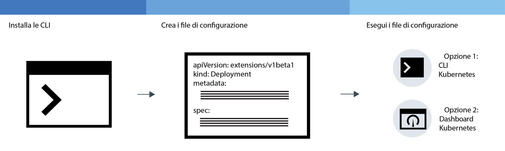
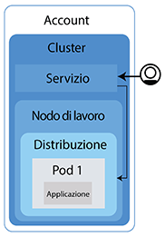

---

copyright:
  years: 2014, 2018
lastupdated: "2018-08-06"

---

{:new_window: target="_blank"}
{:shortdesc: .shortdesc}
{:screen: .screen}
{:pre: .pre}
{:table: .aria-labeledby="caption"}
{:codeblock: .codeblock}
{:tip: .tip}
{:download: .download}


# Distribuzione di applicazioni nei cluster
{: #app}

Puoi utilizzare le tecniche di Kubernetes nel {{site.data.keyword.containerlong}} per distribuire le applicazioni nei contenitori e assicurarti che tali applicazioni siano sempre attive e funzionanti. Ad esempio, puoi eseguire aggiornamenti continui e rollback senza tempi di inattività per i tuoi utenti.
{: shortdesc}

Scopri la procedura generale per distribuire le applicazioni facendo clic su un'area della seguente immagine. Desideri apprendere prima i principi di base? Prova ad [eseguire l'esercitazione sulla distribuzione delle applicazioni](cs_tutorials_apps.html#cs_apps_tutorial).


<map name="d62e18" id="d62e18">
<area href="cs_cli_install.html" target="_blank" alt="Installa le CLI." title="Installa le CLI." shape="rect" coords="30, 69, 179, 209" />
<area href="https://kubernetes.io/docs/concepts/configuration/overview/" target="_blank" alt="Crea un file di configurazione per la tua applicazione. Consulta le procedure consigliate da Kubernetes." title="Crea un file di configurazione per la tua applicazione. Consulta le procedure consigliate da Kubernetes." shape="rect" coords="254, 64, 486, 231" />
<area href="#app_cli" target="_blank" alt="Opzione 1: esegui i file di configurazione della CLI Kubernetes." title="Opzione 1: esegui i file di configurazione della CLI Kubernetes." shape="rect" coords="544, 67, 730, 124" />
<area href="#cli_dashboard" target="_blank" alt="Opzione 2: avvia il dashboard Kubernetes in locale ed esegui i file di configurazione." title="Opzione 2: avvia il dashboard Kubernetes in locale ed esegui i file di configurazione." shape="rect" coords="544, 141, 728, 204" />
</map>

<br />


## Pianificazione delle distribuzioni altamente disponibili
{: #highly_available_apps}

Più ampiamente distribuisci la tua configurazione su più nodi di lavoro e cluster, meno è probabile che i tuoi utenti riscontrino tempi di inattività con la tua applicazione.
{: shortdesc}

Rivedi queste potenziali configurazioni delle applicazioni ordinate con diversi gradi di disponibilità.


1.  Una distribuzione con n+2 pod gestiti da una serie di repliche in un singolo nodo in un singolo cluster di zone.
2.  Una distribuzione con n+2 pod gestiti da una serie di repliche ed estesi a più nodi (anti-affinità) in un singolo cluster di zone.
3.  Una distribuzione con n+2 pod gestiti da una serie di repliche ed estesi a più nodi (anti-affinità) in un cluster multizona tra zone.

Puoi anche [collegare più cluster in regioni diverse con un programma di bilanciamento del carico globale](cs_clusters.html#multiple_clusters) per aumentare l'alta disponibilità.

### Aumento della disponibilità della tua applicazione
{: #increase_availability}

<dl>
  <dt>Utilizza le distribuzioni e le serie di repliche per distribuire la tua applicazione e le sue dipendenze.</dt>
    <dd><p>Una distribuzione è una risorsa Kubernetes che puoi utilizzare per dichiarare tutti i componenti della tua applicazione e le sue dipendenze. Con le distribuzioni, non devi scrivere tutta la procedura e puoi invece concentrarti sulla tua applicazione.</p>
    <p>Quando distribuisci più di un pod, viene creata automaticamente una serie di repliche per le tue distribuzioni che monitora i pod e assicura che il numero di pod desiderato sia sempre in esecuzione. In caso di interruzione di un pod, la serie di repliche sostituisce il pod inattivo con uno nuovo.</p>
    <p>Puoi utilizzare una distribuzione per definire le strategie di aggiornamento per la tua applicazione incluso il numero di pod da aggiungere durante un aggiornamento continuo e il numero di pod che possono non essere disponibili in un determinato momento. Quando effettui un aggiornamento continuo, la distribuzione controlla che la revisione funzioni e arresta il rollout quando vengono rilevati degli errori.</p>
    <p>Con le distribuzioni puoi distribuire contemporaneamente più revisioni con indicatori diversi. Ad esempio, puoi verificare una distribuzione prima di decidere di metterla in produzione.</p>
    <p>Le distribuzioni ti consentono di tenere traccia delle revisioni distribuite. Puoi utilizzare questa cronologia per eseguire il rollback a una versione precedente nel caso in cui riscontri che gli aggiornamenti non funzionano come previsto.</p></dd>
  <dt>Includi repliche sufficienti per il carico di lavoro della tua applicazione, più due</dt>
    <dd>Per rendere la tua applicazione ancora più disponibile e più resiliente agli errori, valuta la possibilità di includere delle repliche aggiuntive rispetto al numero minimo per gestire il carico di lavoro previsto. Le repliche aggiuntive possono gestire il carico di lavoro se si verifica un arresto anomalo del pod e la serie di repliche non ha ancora ripristinato il pod arrestato. Per la protezione da due errori simultanei, includi due ulteriori repliche. Questa configurazione è un modello N+2, dove N è il numero di repliche per gestire il carico di lavoro in entrata e +2 sono le due repliche aggiuntive. Finché il tuo cluster ha spazio sufficiente, puoi avere quanti pod desideri.</dd>
  <dt>Espandi i pod tra più nodi (anti-affinità)</dt>
    <dd><p>Quando crei la tua distribuzione, ogni pod può essere distribuito allo stesso nodo di lavoro. Ciò è noto come affinità o condivisione percorso. Per proteggere la tua applicazione da un errore del nodo di lavoro, puoi configurare la tua distribuzione per espandere i pod tra più nodi di lavoro utilizzando l'opzione <em>podAntiAffinity</em> con i tuoi cluster standard. Puoi definire due tipi di anti-affinità pod: preferito o richiesto. Per ulteriori informazioni, consulta la documentazione Kubernetes in <a href="https://kubernetes.io/docs/concepts/configuration/assign-pod-node/" rel="external" target="_blank" title="(Si apre in una nuova scheda o finestra)">Assigning Pods to Nodes</a>.</p>
    <p><strong>Nota</strong>: con l'anti-affinità richiesta, puoi distribuire solo la quantità di repliche per le quali disponi dei nodi di lavoro. Ad esempio, se hai 3 nodi di lavoro nel tuo cluster ma definisci 5 repliche nel tuo file YAML, verranno distribuite solo 3 repliche. Ciascuna replica è attiva su un nodo di lavoro diverso. Le 2 repliche rimanenti rimarranno in sospeso. Se aggiungi un nodo di lavoro al tuo cluster, una delle repliche rimanenti viene distribuita automaticamente al nuovo nodo di lavoro.<p>
    <p><strong>File YAML di distribuzione di esempio</strong>:<ul>
    <li><a href="https://raw.githubusercontent.com/IBM-Cloud/kube-samples/master/deploy-apps-clusters/nginx_preferredAntiAffinity.yaml" rel="external" target="_blank" title="(Si apre in una nuova scheda o finestra)">Nginx app with preferred pod anti-affinity.</a></li>
    <li><a href="https://raw.githubusercontent.com/IBM-Cloud/kube-samples/master/deploy-apps-clusters/liberty_requiredAntiAffinity.yaml" rel="external" target="_blank" title="(Si apre in una nuova scheda o finestra)">IBM® WebSphere® Application Server Liberty app with required pod anti-affinity.</a></li></ul></p>
    
    </dd>
<dt>Distribuisci i pod tra più zone o regioni</dt>
  <dd><p>Per proteggere la tua applicazione da un malfunzionamento della zona, puoi creare più cluster in zone separate o aggiungere zone ad un pool di lavoro in un cluster multizona. I cluster multizona sono disponibili solo in [determinate aree metropolitane](cs_regions.html#zones), ad esempio Dallas. Se crei più cluster in zone separate, devi [impostare un programma di bilanciamento del carico globale](cs_clusters.html#multiple_clusters).</p>
  <p>Quando usi una serie di repliche e specifichi l'anti-affinità pod, Kubernetes espande i pod dell'applicazione tra i nodi. Se i tuoi nodi si trovano in più zone, i pod vengono estesi tra le zone, aumentando la disponibilità della tua applicazione. Se vuoi limitare le tue applicazioni affinché vengano eseguite in una sola zona, puoi configurare l'affinità pod o creare ed etichettare un pool di lavoro in una zona. Per ulteriori informazioni, vedi [Alta disponibilità per i cluster multizona](cs_clusters.html#ha_clusters).</p>
  <p><strong>In una distribuzione cluster multizona, i miei pod dell'applicazione vengono distribuiti uniformemente tra i nodi?</strong></p>
  <p>I pod vengono distribuiti uniformemente tra le zone, ma non sempre tra i nodi. Ad esempio, se hai un cluster con un nodo in ciascuna delle tre zone e distribuisci una serie di repliche di sei pod, ciascun nodo ottiene due pod. Tuttavia, se hai un cluster con due nodi in ciascuna delle tre zone e distribuisci una serie di repliche di sei pod, ciascuna zona ha due pod pianificati e potrebbe pianificare o meno un pod per nodo. Per un maggiore controllo sulla pianificazione, puoi [impostare l'affinità pod ](https://kubernetes.io/docs/concepts/configuration/assign-pod-node).</p>
  <p><strong>Se una zona si disattiva, in che modo i pod vengono ripianificati sui nodi rimanenti nelle altre zone?</strong></br>Dipende dalla politica di pianificazione che hai utilizzato nella distribuzione. Se hai incluso l'[affinità pod specifica del nodo ](https://kubernetes.io/docs/concepts/configuration/assign-pod-node/#node-affinity-beta-feature), i tuoi pod non verranno ripianificati. Se non l'hai inclusa, i pod verranno creati sui nodi di lavoro disponibili nelle altre zone, ma potrebbero non essere bilanciati. Ad esempio, due pod potrebbero essere estesi tra due nodi disponibili oppure potrebbero essere entrambi pianificati su un nodo con capacità disponibile. Allo stesso modo, quando la zona non disponibile torna disponibile, i pod non vengono eliminati e ribilanciati automaticamente tra i nodi. Se vuoi che i pod vengano ribilanciati tra le zone una volta che la zona torna attiva, prendi in considerazione di utilizzare il [programma di annullamento della pianificazione (descheduler) Kubernetes](https://github.com/kubernetes-incubator/descheduler).</p>
  <p><strong>Suggerimento</strong>: nei cluster multizona, prova a tenere la capacità del tuo nodo di lavoro al 50% per zona in modo da avere capacità sufficiente per proteggere il tuo cluster da un malfunzionamento della zona. </p>
  <p><strong>Se voglio estendere la mia applicazione tra le regioni?</strong></br>Per proteggere la tua applicazione da un malfunzionamento della regione, crea un secondo cluster in un'altra regione, [imposta un programma di bilanciamento del carico globale](cs_clusters.html#multiple_clusters) per connettere i tuoi cluster e usa file YAML di distribuzione per distribuire una serie di repliche duplicata con l'[anti-affinità pod ](https://kubernetes.io/docs/concepts/configuration/assign-pod-node/) nella tua applicazione.</p>
  <p><strong>Se le mie applicazioni hanno bisogno di memoria persistente?</strong></p>
  <p>Usa un servizio cloud come [{{site.data.keyword.cloudant_short_notm}}](/docs/services/Cloudant/getting-started.html#getting-started-with-cloudant) o [{{site.data.keyword.cos_full_notm}}](/docs/services/cloud-object-storage/about-cos.html#about-ibm-cloud-object-storage).</p></dd>
</dl>


### Distribuzione dell'applicazione minima
{: #minimal_app_deployment}

Una distribuzione di base dell'applicazione in un cluster gratuito o standard può includere i seguenti componenti.
{: shortdesc}



Per distribuire i componenti per un'applicazione minima come illustrato nel diagramma, puoi utilizzare un file di configurazione simile al seguente esempio:
```
apiVersion: apps/v1beta1
kind: Deployment
metadata:
  name: ibmliberty
spec:
  replicas: 1
  template:
    metadata:
      labels:
        app: ibmliberty
    spec:
      containers:
      - name: ibmliberty
        image: registry.bluemix.net/ibmliberty:latest
        ports:
        - containerPort: 9080        
---
apiVersion: v1
kind: Service
metadata:
  name: ibmliberty-service
  labels:
    app: ibmliberty
spec:
  selector:
    app: ibmliberty
  type: NodePort
  ports:
   - protocol: TCP
     port: 9080
```
{: codeblock}

**Nota:** per esporre il tuo servizio, assicurati che la coppia chiave/valore che utilizzi nella sezione `spec.selector` del servizio sia la stessa coppia chiave/valore che utilizzi nella sezione `spec.template.metadata.labels` del tuo yaml di distribuzione.
Per ulteriori informazioni su ciascun componente, consulta i [Principi di base di Kubernetes](cs_tech.html#kubernetes_basics).

<br />


## Avvio del dashboard Kubernetes
{: #cli_dashboard}

Apri il dashboard Kubernetes nel tuo sistema locale per visualizzare le informazioni su un cluster e sui suoi nodi di lavoro. [Nella GUI](#db_gui), puoi accedere al dashboard con un pulsante di un clic pratico. [Con la CLI](#db_cli), puoi accedere al dashboard o utilizzare la procedura in un processo di automazione come per una pipeline CI/CD.
{:shortdesc}

Prima di iniziare, [indirizza la tua CLI](cs_cli_install.html#cs_cli_configure) al tuo cluster.

Puoi utilizzare la porta predefinita o impostare una tua porta per avviare il dashboard Kubernetes per un cluster.

**Avvio del dashboard Kubernetes dalla GUI**
{: #db_gui}

1.  Accedi alla [GUI {{site.data.keyword.Bluemix_notm}}](https://console.bluemix.net/).
2.  Dal tuo profilo nella barra dei menu, seleziona l'account che vuoi utilizzare.
3.  Dal menu, fai clic su **Contenitori**.
4.  Nella pagina **Cluster**, fai clic sul cluster a cui vuoi accedere.
5.  Dalla pagina dei dettagli del cluster, fai clic sul pulsante **Dashboard Kubernetes**.

</br>
</br>

**Avvio del dashboard Kubernetes dalla CLI**
{: #db_cli}

1.  Ottieni le tue credenziali per Kubernetes.

    ```
    kubectl config view -o jsonpath='{.users[0].user.auth-provider.config.id-token}'
    ```
    {: pre}

2.  Copia il valore **id-token** visualizzato nell'output.

3.  Imposta il proxy con il numero di porta predefinito.

    ```
    kubectl proxy
    ```
    {: pre}

    Output di esempio:

    ```
    Inizio di utilizzo su 127.0.0.1:8001
    ```
    {: screen}

4.  Accedi al dashboard.

  1.  Nel tuo browser, passa al seguente URL:

      ```
      http://localhost:8001/api/v1/namespaces/kube-system/services/https:kubernetes-dashboard:/proxy/
      ```
      {: codeblock}

  2.  Nella pagina di accesso, seleziona il metodo di autenticazione **Token**.

  3.  Quindi, incolla il valore **id-token** che hai precedentemente copiato nel campo **Token** e fai clic su **ACCEDI**.

Quando hai finito con il dashboard Kubernetes, utilizza `CTRL+C` per uscire dal comando `proxy`. Dopo essere uscito, il dashboard Kubernetes non è più disponibile. Esegui il comando `proxy` per riavviare il dashboard Kubernetes.

[Successivamente, puoi eseguire un file di configurazione dal dashboard.](#app_ui)

<br />


## Creazione dei segreti
{: #secrets}

I segreti Kubernetes rappresentano un modo sicuro per memorizzare informazioni riservate, quali nome utente, password o chiavi.
{:shortdesc}

Esamina le seguenti attività che richiedono segreti. Per ulteriori informazioni sugli elementi che possono essere memorizzati nei segreti, vedi la [documentazione Kubernetes ](https://kubernetes.io/docs/concepts/configuration/secret/).

### Aggiunta di un servizio a un cluster
{: #secrets_service}

Quando esegui il bind di un servizio a un cluster, non devi creare un segreto. Viene creato automaticamente per te. Per ulteriori informazioni, vedi [Aggiunta di servizi Cloud Foundry ai cluster](cs_integrations.html#adding_cluster).

### Configurazione dell'ALB Ingress per utilizzare TLS
{: #secrets_tls}

Il carico ALB bilancia il traffico di rete HTTP alle applicazioni nel tuo cluster. Per bilanciare anche il traffico delle connessioni HTTPS in entrata, puoi configurare l'ALB per decodificare il traffico di rete e inoltrare la richiesta decodificata alle applicazioni esposte nel tuo cluster.

Se stai utilizzando un dominio secondario Ingress fornito da IBM, puoi [utilizzare il certificato TLS fornito da IBM](cs_ingress.html#public_inside_2). Per visualizzare il segreto TLS fornito da IBM, esegui il seguente comando:
```
ibmcloud ks cluster-get <cluster_name_or_ID> | grep "Ingress secret"
```
{: pre}

Se stai utilizzando un dominio personalizzato, puoi utilizzare il tuo certificato per gestire la terminazione TLS. Per creare il tuo segreto TLS:
1. Genera una chiave e un certificato in uno dei seguenti modi:
    * Genera un certificato e una chiave di autorità di certificazione (CA, certificate authority) dal tuo provider di certificati. Se disponi del tuo proprio dominio, acquista un certificato TLS ufficiale per il dominio.
      **Importante**: assicurati che il [CN ](https://support.dnsimple.com/articles/what-is-common-name/) sia diverso per ciascun certificato.
    * A scopo di test, puoi creare un certificato autofirmato utilizzando OpenSSL. Per ulteriori informazioni, vedi questa [esercitazione sul certificato SSL autofirmato ](https://www.akadia.com/services/ssh_test_certificate.html).
        1. Crea un `tls.key`.
            ```
            openssl genrsa -out tls.key 2048
            ```
            {: pre}
        2. Usa la chiave per creare un `tls.crt`.
            ```
            openssl req -new -x509 -key tls.key -out tls.crt
            ```
            {: pre}
2. [Converti il certificato e la chiave in base 64 ](https://www.base64encode.org/).
3. Crea un file YAML del segreto utilizzando il certificato e la chiave.
     ```
     apiVersion: v1
     kind: Secret
     metadata:
       name: ssl-my-test
     type: Opaque
     data:
       tls.crt: <client_certificate>
       tls.key: <client_key>
     ```
     {: codeblock}

4. Crea il certificato come segreto Kubernetes.
     ```
     kubectl create -f ssl-my-test
     ```
     {: pre}

### Personalizzazione dell'ALB Ingress con l'annotazione dei servizi SSL
{: #secrets_ssl_services}

Puoi utilizzare l'annotazione [`ingress.bluemix.net/ssl-services`](cs_annotations.html#ssl-services) per crittografare il traffico nelle tue applicazioni upstream dall'ALB Ingress. Per creare il segreto:

1. Ottieni il certificato e la chiave autorità di certificazione (CA, certificate authority) dal tuo server upstream.
2. [Converti il certificato in base 64 ](https://www.base64encode.org/).
3. Crea un file YAML del segreto utilizzando il certificato.
     ```
     apiVersion: v1
     kind: Secret
     metadata:
       name: ssl-my-test
     type: Opaque
     data:
       trusted.crt: <ca_certificate>
     ```
     {: codeblock}
     **Nota**: se vuoi anche applicare l'autenticazione reciproca per il traffico upstream, puoi fornire un `client.crt` e un `client.key` in aggiunta a `trusted.crt` nella sezione dati.
4. Crea il certificato come segreto Kubernetes.
     ```
     kubectl create -f ssl-my-test
     ```
     {: pre}

### Personalizzazione dell'ALB Ingress con l'annotazione di autenticazione reciproca
{: #secrets_mutual_auth}

Puoi utilizzare l'[annotazione `ingress.bluemix.net/mutual-auth`](cs_annotations.html#mutual-auth) per configurare l'autenticazione reciproca del traffico downstream per l'ALB Ingress. Per creare un segreto di autenticazione reciproca:

1. Genera una chiave e un certificato in uno dei seguenti modi:
    * Genera un certificato e una chiave di autorità di certificazione (CA, certificate authority) dal tuo provider di certificati. Se disponi del tuo proprio dominio, acquista un certificato TLS ufficiale per il dominio.
      **Importante**: assicurati che il [CN ](https://support.dnsimple.com/articles/what-is-common-name/) sia diverso per ciascun certificato.
    * A scopo di test, puoi creare un certificato autofirmato utilizzando OpenSSL. Per ulteriori informazioni, vedi questa [esercitazione sul certificato SSL autofirmato ](https://www.akadia.com/services/ssh_test_certificate.html).
        1. Crea un `ca.key`.
            ```
            openssl genrsa -out ca.key 1024
            ```
            {: pre}
        2. Usa la chiave per creare un `ca.crt`.
            ```
            openssl req -new -x509 -key ca.key -out ca.crt
            ```
            {: pre}
        3. Usa `ca.crt` per creare un certificato autofirmato.
            ```
            openssl x509 -req -in example.org.csr -CA ca.crt -CAkey ca.key -CAcreateserial -out example.org.crt
            ```
            {: pre}
2. [Converti il certificato in base 64 ](https://www.base64encode.org/).
3. Crea un file YAML del segreto utilizzando il certificato.
     ```
     apiVersion: v1
     kind: Secret
     metadata:
       name: ssl-my-test
     type: Opaque
     data:
       ca.crt: <ca_certificate>
     ```
     {: codeblock}
4. Crea il certificato come segreto Kubernetes.
     ```
     kubectl create -f ssl-my-test
     ```
     {: pre}

<br />


## Distribuzione di applicazioni con la GUI
{: #app_ui}

Quando distribuisci un'applicazione al tuo cluster utilizzando il dashboard Kubernetes, una risorsa di distribuzione crea, aggiorna e gestisce automaticamente i pod nel tuo cluster.
{:shortdesc}

Prima di iniziare:

-   Installa le [CLI](cs_cli_install.html#cs_cli_install) richieste.
-   [Indirizza la tua CLI](cs_cli_install.html#cs_cli_configure) al tuo cluster.

Per distribuire la tua applicazione:

1.  Apri il [dashboard](#cli_dashboard) Kubernetes e fai clic su **+ Create**.
2.  Immetti i dettagli della tua applicazione in uno dei due modi.
  * Seleziona **Specify app details below** e immetti i dettagli.
  * Seleziona **Upload a YAML or JSON file** per caricare il [file di configurazione ](https://kubernetes.io/docs/tasks/inject-data-application/define-environment-variable-container/) della tua applicazione.

  Hai bisogno di aiuto con il tuo file di configurazione? Controlla questo [file YAML di esempio ](https://github.com/IBM-Cloud/kube-samples/blob/master/deploy-apps-clusters/deploy-ibmliberty.yaml). In questo esempio, un contenitore viene distribuito dall'immagine **ibmliberty** nella regione Stati Uniti Sud. Ulteriori informazioni sulla [protezione delle tue informazioni personali](cs_secure.html#pi) quando utilizzi le risorse Kubernetes.
  {: tip}

3.  Verifica di aver distribuito correttamente la tua applicazione in uno dei seguenti modi.
  * Nel dashboard Kubernetes, fai clic su **Deployments**. Viene visualizzato un elenco delle distribuzioni riuscite.
  * Se la tua applicazione è [disponibile pubblicamente](cs_network_planning.html#public_access), passa alla pagina di panoramica del cluster nel tuo dashboard {{site.data.keyword.containerlong}}. Copia il dominio secondario, che si trova nella sezione di riepilogo del cluster, e incollalo in un browser per visualizzare la tua applicazione.

<br />


## Distribuzione di applicazioni con la CLI
{: #app_cli}

Dopo aver creato un cluster, puoi distribuire un'applicazione in tale cluster utilizzando la CLI Kubernetes.
{:shortdesc}

Prima di iniziare:

-   Installa le [CLI](cs_cli_install.html#cs_cli_install) richieste.
-   [Indirizza la tua CLI](cs_cli_install.html#cs_cli_configure) al tuo cluster.

Per distribuire la tua applicazione:

1.  Crea un file di configurazione basato sulle [Procedure consigliate Kubernetes ](https://kubernetes.io/docs/concepts/configuration/overview/). Generalmente, un file di configurazione contiene i dettagli di configurazione per ognuna delle risorse che crei in Kubernetes. Il tuo script potrebbe includere una o più delle seguenti sezioni:

    -   [Distribuire ](https://kubernetes.io/docs/concepts/workloads/controllers/deployment/): definisce la creazione di pod e serie di repliche. Un pod include una singola applicazione inserita nel contenitore e le serie di repliche controllano più istanze dei pod.

    -   [Servizio ](https://kubernetes.io/docs/concepts/services-networking/service/): fornisce accesso di front-end ai pod utilizzando un nodo di lavoro o un indirizzo IP pubblico del programma di bilanciamento del carico o una rotta Ingress pubblica.

    -   [Ingress ](https://kubernetes.io/docs/concepts/services-networking/ingress/): specifica un tipo di programma di bilanciamento del carico che fornisce le rotte per accedere alla tua applicazione pubblicamente.

    Ulteriori informazioni sulla [protezione delle tue informazioni personali](cs_secure.html#pi) quando utilizzi le risorse Kubernetes.

2.  Esegui il file di configurazione nel contesto di un cluster.

    ```
    kubectl apply -f config.yaml
    ```
    {: pre}

3.  Se rendi la tua applicazione disponibile pubblicamente utilizzando un servizio nodeport, un servizio del programma di bilanciamento del carico o Ingress, verifica di poter accedere all'applicazione.

<br />


## Distribuzione delle applicazioni a specifici nodi di lavoro utilizzando le etichette
{: #node_affinity}

Quando distribuisci un'applicazione, i pod dell'applicazione vengono distribuiti indiscriminatamente ai vari nodi di lavoro nel tuo cluster. In alcuni casi, potresti voler limitare i nodi di lavori a cui distribuire i pod dell'applicazione. Ad esempio, potresti voler distribuire i pod dell'applicazione solo ai nodi di lavoro in un determinato pool di lavoro in quanto tali nodi di lavoro si trovano su macchine bare metal. Per indicare i nodi di lavoro a cui devono essere distribuiti tali pod dell'applicazione, aggiungi una regola di affinità alla tua distribuzione dell'applicazione.
{:shortdesc}

Prima di iniziare, [indirizza la tua CLI](cs_cli_install.html#cs_cli_configure) al tuo cluster.

1. Ottieni il nome del pool di lavoro a cui desideri distribuire i pod dell'applicazione.
    ```
    ibmcloud ks worker-pools <cluster_name_or_ID>
    ```
    {:pre}

    Questa procedura utilizza un nome pool di lavoro come esempio. Per distribuire i pod dell'applicazione a determinati nodi di lavoro in base ad un altro valore, usa invece tale valore. Ad esempio, per distribuire i pod dell'applicazione solo a nodi di lavoro su una specifica VLAN, ottieni l'ID VLAN eseguendo `ibmcloud ks vlans <zone>`.
    {: tip}

2. [Aggiungi una regola di affinità ](https://kubernetes.io/docs/concepts/configuration/assign-pod-node/#node-affinity-beta-feature) per il nome pool di lavoro alla distribuzione dell'applicazione.

    yaml di esempio:

    ```
    apiVersion: extensions/v1beta1
    kind: Deployment
    metadata:
      name: with-node-affinity
    spec:
      template:
        spec:
          affinity:
            nodeAffinity:
              requiredDuringSchedulingIgnoredDuringExecution:
                nodeSelectorTerms:
                - matchExpressions:
                  - key: workerPool
                    operator: In
                    values:
                    - <worker_pool_name>
    ...
    ```
    {: codeblock}

    Nella sezione **affinity** dell'yaml di esempio, `workerPool` è `key` e `<worker_pool_name>` è `value`.

3. Applica il file di configurazione della distribuzione aggiornato.
    ```
    kubectl apply -f with-node-affinity.yaml
    ```
    {: pre}

4. Verifica che i pod dell'applicazione vengano distribuiti ai nodi di lavoro corretti.

    1. Elenca i pod nel tuo cluster.
        ```
        kubectl get pods -o wide
        ```
        {: pre}

        Output di esempio:
        ```
        NAME                   READY     STATUS              RESTARTS   AGE       IP               NODE
        cf-py-d7b7d94db-vp8pq  1/1       Running             0          15d       172.30.xxx.xxx   10.176.48.78
        ```
        {: screen}

    2. Nell'output, identifica un pod per la tua applicazione. Prendi nota dell'indirizzo IP privato **NODE** del nodo di lavoro in cui il pod è attivo.

        Nell'output di esempio sopra riportato, il pod dell'applicazione `cf-py-d7b7d94db-vp8pq` si trova su un nodo di lavoro con indirizzo IP `10.176.48.78`.

    3. Elenca i nodi di lavoro nel pool di lavoro che hai indicato nella tua distribuzione dell'applicazione.

        ```
        ibmcloud ks workers <cluster_name_or_ID> --worker-pool <worker_pool_name>
        ```
        {: pre}

        Output di esempio:

        ```
        ID                                                 Public IP       Private IP     Machine Type      State    Status  Zone    Version
        kube-dal10-crb20b637238bb471f8b4b8b881bbb4962-w7   169.xx.xxx.xxx  10.176.48.78   b2c.4x16          normal   Ready   dal10   1.8.6_1504
        kube-dal10-crb20b637238bb471f8b4b8b881bbb4962-w8   169.xx.xxx.xxx  10.176.48.83   b2c.4x16          normal   Ready   dal10   1.8.6_1504
        kube-dal12-crb20b637238bb471f8b4b8b881bbb4962-w9   169.xx.xxx.xxx  10.176.48.69   b2c.4x16          normal   Ready   dal12   1.8.6_1504
        ```
        {: screen}

        Se hai creato una regola di affinità dell'applicazione basata su un altro fattore, utilizza tale valore. Ad esempio, per verificare che il pod dell'applicazione venga distribuito ai nodi di lavoro su una specifica VLAN, visualizza la VLAN su cui è in esecuzione il nodo di lavoro eseguendo `ibmcloud ks worker-get <cluster_name_or_ID> <worker_ID>`.
        {: tip}

    4. Nell'output, verifica che il nodo di lavoro con l'indirizzo IP privato che hai identificato nel passo precedente venga distribuito in questo pool di lavoro.

<br />


## Distribuzione di un'applicazione a una macchina GPU.
{: #gpu_app}

Se hai un [tipo di macchina GPU (graphics processing unit) bare metal](cs_clusters.html#shared_dedicated_node), puoi pianificare i carichi di lavoro intensivi in modo matematico nel nodo di lavoro. Ad esempio, potresti eseguire un'applicazione 3D che utilizza la piattaforma CUDA (Compute Unified Device Architecture) per condividere il carico di elaborazione tra la GPU e la CPU per aumentare le prestazioni.
{:shortdesc}

Nella seguente procedura, imparerai come distribuire i carichi di lavoro che richiedono la GPU. Puoi anche [distribuire le applicazioni](#app_ui) che non hanno bisogno di elaborare i loro carichi di lavoro sia tramite la GPU che la CPU. Dopo, potresti trovare utile approfondire i carichi di lavoro intensivi in modo matematico come il framework di machine learning [TensorFlow ](https://www.tensorflow.org/) con [questa demo Kubernetes ](https://github.com/pachyderm/pachyderm/tree/master/doc/examples/ml/tensorflow).

Prima di iniziare:
* [Crea un tipo di macchina GPU bare metal](cs_clusters.html#clusters_cli). Tieni presente che il completamento di questo processo può richiedere più di 1 giorno lavorativo.
* Il tuo master del cluster e il nodo di lavoro GPU devono eseguire Kubernetes alla versione 1.10 o successiva.

Per eseguire un carico di lavoro su una macchina GPU:
1.  Crea un file YAML. In questo esempio, un `Job` YAML gestisce i carichi di lavoro come batch creando un pod di breve durata che viene eseguito finché il comando pianificato per il completamento non viene terminato correttamente.

    **Importante**: per i carichi di lavoro GPU, devi sempre fornire il campo `resources: limits: nvidia.com/gpu` nella specifica YAML.

    ```yaml
    apiVersion: batch/v1
    kind: Job
    metadata:
      name: nvidia-smi
      labels:
        name: nvidia-smi
    spec:
      template:
        metadata:
          labels:
            name: nvidia-smi
        spec:
          containers:
          - name: nvidia-smi
            image: nvidia/cuda:9.1-base-ubuntu16.04
            command: [ "/usr/test/nvidia-smi" ]
            imagePullPolicy: IfNotPresent
            resources:
              limits:
                nvidia.com/gpu: 2
            volumeMounts:
            - mountPath: /usr/test
              name: nvidia0
          volumes:
            - name: nvidia0
              hostPath:
                path: /usr/bin
          restartPolicy: Never
    ```
    {: codeblock}

    <table>
    <caption>Componenti YAML</caption>
    <thead>
    <th colspan=2> Descrizione dei componenti del file YAML</th>
    </thead>
    <tbody>
    <tr>
    <td>Nomi etichetta e metadati</td>
    <td>Fornisci un nome e un etichetta al lavoro e utilizza lo stesso nome nei metadati del file e di `spec template`. Ad esempio, `nvidia-smi`.</td>
    </tr>
    <tr>
    <td><code>containers/image</code></td>
    <td>Fornisci l'immagine di cui il contenitore è un'istanza in esecuzione. In questo esempio, il valore è impostato per utilizzare l'immagine DockerHub CUDA:<code>nvidia/cuda:9.1-base-ubuntu16.04</code></td>
    </tr>
    <tr>
    <td><code>containers/command</code></td>
    <td>Specifica un comando da eseguire nel contenitore. In questo esempio il comando <code>[ "/usr/test/nvidia-smi" ]</code> fa riferimento a un binario nella macchina GPU, per cui devi configurare anche un montaggio del volume.</td>
    </tr>
    <tr>
    <td><code>containers/imagePullPolicy</code></td>
    <td>Per trasmettere una nuova immagine solo se l'immagine non è al momento nel nodo di lavoro, specifica <code>IfNotPresent</code>.</td>
    </tr>
    <tr>
    <td><code>resources/limits</code></td>
    <td>Per le macchine GPU, devi specificare il limite della risorsa. Il Kubernetes [Device Plug-in](https://kubernetes.io/docs/concepts/cluster-administration/device-plugins/) imposta la richiesta della risorsa predefinita in modo che corrisponda al limite.
    <ul><li>Devi specificare la chiave come <code>nvidia.com/gpu</code>.</li>
    <li>Immetti il numero intero di GPU che richiedi, come ad esempio <code>2</code>. <strong>Nota</strong>: i pod del contenitore non condividono le GPU e le GPU non possono essere sovraccaricate. Ad esempio, se hai solo 1 macchina `mg1c.16x128`, allora hai solo 2 GPU in tale macchina e puoi specificare un massimo di `2`.</li></ul></td>
    </tr>
    <tr>
    <td><code>volumeMounts</code></td>
    <td>Denomina il volume montato nel contenitore, come ad esempio <code>nvidia0</code>. Specifica <code>mountPath</code> nel contenitore per il volume. In questo esempio, il percorso <code>/usr/test</code> corrisponde a quello utilizzato nel comando del contenitore del lavoro.</td>
    </tr>
    <tr>
    <td><code>volumes</code></td>
    <td>Denomina il volume del lavoro, come ad esempio <code>nvidia0</code>. Nel <code>hostPath</code> del nodo di lavoro della GPU, specifica il <code>path</code> del volume nell'host, in questo esempio, <code>/usr/bin</code>. Il contenitore <code>mountPath</code> viene associato al volume dell'host <code>path</code>, che fornisce a questo lavoro l'accesso ai binari NVIDIA nel nodo di lavoro della GPU per il comando del contenitore da eseguire.</td>
    </tr>
    </tbody></table>

2.  Applica il file YAML. Ad esempio:

    ```
    kubectl apply -f nvidia-smi.yaml
    ```
    {: pre}

3.  Controlla il pod del lavoro filtrando i tuoi pod con l'etichetta `nvidia-sim`. Verifica che lo **STATO** sia **Completato**.

    ```
    kubectl get pod -a -l 'name in (nvidia-sim)'
    ```
    {: pre}

    Output di esempio:
    ```
    NAME                  READY     STATUS      RESTARTS   AGE
    nvidia-smi-ppkd4      0/1       Completed   0          36s
    ```
    {: screen}

4.  Descrivi il pod per visualizzare come il plugin del dispositivo GPU ha pianificato il pod.
    * Nei campi `Limits` e `Requests`, controlla che il limite della risorsa che hai specificato corrisponda alla richiesta che imposta automaticamente il plugin del dispositivo.
    * Negli eventi, verifica che il pod sia assegnato al tuo nodo di lavoro GPU.

    ```
    kubectl describe pod nvidia-smi-ppkd4
    ```
    {: pre}

    Output di esempio:
    ```
    Name:           nvidia-smi-ppkd4
    Namespace:      default
    ...
    Limits:
     nvidia.com/gpu:  2
    Requests:
     nvidia.com/gpu:  2
    ...
    Events:
    Type    Reason                 Age   From                     Message
    ----    ------                 ----  ----                     -------
    Normal  Scheduled              1m    default-scheduler        Successfully assigned nvidia-smi-ppkd4 to 10.xxx.xx.xxx
    ...
    ```
    {: screen}

5.  Per verificare che il lavoro abbia utilizzato la GPU per calcolare il proprio carico di lavoro, puoi controllare i log. Il comando `[ "/usr/test/nvidia-smi" ]` dal lavoro ha interrogato lo stato del dispositivo GPU nel nodo di lavoro della GPU.

    ```
    kubectl logs nvidia-sim-ppkd4
    ```
    {: pre}

    Output di esempio:
    ```
    +-----------------------------------------------------------------------------+
    | NVIDIA-SMI 390.12                 Driver Version: 390.12                    |
    |-------------------------------+----------------------+----------------------+
    | GPU  Name        Persistence-M| Bus-Id        Disp.A | Volatile Uncorr. ECC |
    | Fan  Temp  Perf  Pwr:Usage/Cap|         Memory-Usage | GPU-Util  Compute M. |
    |===============================+======================+======================|
    |   0  Tesla K80           Off  | 00000000:83:00.0 Off |                  Off |
    | N/A   37C    P0    57W / 149W |      0MiB / 12206MiB |      0%      Default |
    +-------------------------------+----------------------+----------------------+
    |   1  Tesla K80           Off  | 00000000:84:00.0 Off |                  Off |
    | N/A   32C    P0    63W / 149W |      0MiB / 12206MiB |      1%      Default |
    +-------------------------------+----------------------+----------------------+

    +-----------------------------------------------------------------------------+
    | Processes:                                                       GPU Memory |
    |  GPU       PID   Type   Process name                             Usage      |
    |=============================================================================|
    |  No running processes found                                                 |
    +-----------------------------------------------------------------------------+
    ```
    {: screen}

    In questo esempio, vedi che entrambe le GPU sono state utilizzate per eseguire il lavoro perché entrambe sono state pianificate nel nodo di lavoro. Se il limite è impostato su 1, viene visualizzata solo 1 GPU.

## Ridimensionamento delle applicazioni
{: #app_scaling}

Con Kubernetes, puoi abilitare il [ridimensionamento automatico pod orizzontale ](https://kubernetes.io/docs/tasks/run-application/horizontal-pod-autoscale/) per aumentare o ridurre automaticamente il numero di istanze delle tue applicazioni in base alla CPU.
{:shortdesc}

Cerchi informazioni sul ridimensionamento delle applicazioni Cloud Foundry? Controlla [IBM Auto-Scaling per {{site.data.keyword.Bluemix_notm}}](/docs/services/Auto-Scaling/index.html). 
{: tip}

Prima di iniziare:
- [Indirizza la tua CLI](cs_cli_install.html#cs_cli_configure) al tuo cluster.
- Il monitoraggio Heapster deve essere distribuito nel cluster che vuoi ridimensionare automaticamente.

Passi:

1.  Distribuisci la tua applicazione al cluster dalla CLI. Quando distribuisci la tua applicazione, devi richiedere la CPU.

    ```
    kubectl run <app_name> --image=<image> --requests=cpu=<cpu> --expose --port=<port_number>
    ```
    {: pre}

    <table>
    <caption>Componenti del comando per kubectl run</caption>
    <thead>
    <th colspan=2> Descrizione dei componenti di questo comando</th>
    </thead>
    <tbody>
    <tr>
    <td><code>--image</code></td>
    <td>L'applicazione che desideri distribuire.</td>
    </tr>
    <tr>
    <td><code>--request=cpu</code></td>
    <td>La CPU richiesta per il contenitore, specificata in milli-core. Ad esempio, <code>--requests=200m</code>.</td>
    </tr>
    <tr>
    <td><code>--expose</code></td>
    <td>Se true, crea un servizio esterno.</td>
    </tr>
    <tr>
    <td><code>--port</code></td>
    <td>La porta dove la tua applicazione è disponibile esternamente.</td>
    </tr></tbody></table>

    Per distribuzioni più complesse, potresti dover creare un [file di configurazione](#app_cli).
    {: tip}

2.  Crea un autoscaler e definisci la tua politica. Per ulteriori informazioni sull'utilizzo del comando `kubectl autoscale`, consulta la [documentazione Kubernetes ](https://v1-8.docs.kubernetes.io/docs/reference/generated/kubectl/kubectl-commands#autoscale).

    ```
    kubectl autoscale deployment <deployment_name> --cpu-percent=<percentage> --min=<min_value> --max=<max_value>
    ```
    {: pre}

    <table>
    <caption>Componenti del comando per kubectl autoscale</caption>
    <thead>
    <th colspan=2> Descrizione dei componenti di questo comando</th>
    </thead>
    <tbody>
    <tr>
    <td><code>--cpu-percent</code></td>
    <td>L'utilizzo medio della CPU mantenuto da Horizontal Pod Autoscaler, che viene specificato come percentuale.</td>
    </tr>
    <tr>
    <td><code>--min</code></td>
    <td>Il numero minimo di pod distribuiti utilizzati per mantenere la percentuale di utilizzo della CPU specificata.</td>
    </tr>
    <tr>
    <td><code>--max</code></td>
    <td>Il numero massimo di pod distribuiti utilizzati per mantenere la percentuale di utilizzo della CPU specificata.</td>
    </tr>
    </tbody></table>


<br />


## Gestione delle distribuzioni graduali
{: #app_rolling}

Puoi gestire la distribuzione delle modifiche in modo automatizzato e controllato. Se la distribuzione non avviene secondo i tuoi piani, puoi riportarla alla revisione precedente.
{:shortdesc}

Prima di iniziare, crea una [distribuzione](#app_cli).

1.  [Distribuisci ](https://kubernetes.io/docs/concepts/workloads/controllers/deployment/#updating-a-deployment) una modifica. Ad esempio, potresti voler modificare l'immagine che hai utilizzato nella tua distribuzione iniziale.

    1.  Ottieni il nome della distribuzione.

        ```
        kubectl get deployments
        ```
        {: pre}

    2.  Ottieni il nome del pod.

        ```
        kubectl get pods
        ```
        {: pre}

    3.  Ottieni il nome del contenitore in esecuzione nel pod.

        ```
        kubectl describe pod <pod_name>
        ```
        {: pre}

    4.  Configura la nuova immagine per la distribuzione da utilizzare.

        ```
        kubectl set image deployment/<deployment_name><container_name>=<image_name>
        ```
        {: pre}

    Quando esegui i comandi, la modifica viene immediatamente applicata e registrata nella cronologia di distribuzione.

2.  Controlla lo stato della tua distribuzione.

    ```
    kubectl rollout status deployments/<deployment_name>
    ```
    {: pre}

3.  Annulla una modifica.
    1.  Visualizza la cronologia di distribuzione e identifica il numero di revisione della tua ultima distribuzione.

        ```
        kubectl rollout history deployment/<deployment_name>
        ```
        {: pre}

        **Suggerimento:** per visualizzare i dettagli di una revisione specifica, includi il numero di revisione.

        ```
        kubectl rollout history deployment/<deployment_name> --revision=<number>
        ```
        {: pre}

    2.  Riporta la distribuzione alla versione precedente o specifica una revisione. Per tornare alla versione precedente, utilizza il seguente comando.

        ```
        kubectl rollout undo deployment/<depoyment_name> --to-revision=<number>
        ```
        {: pre}

<br />

