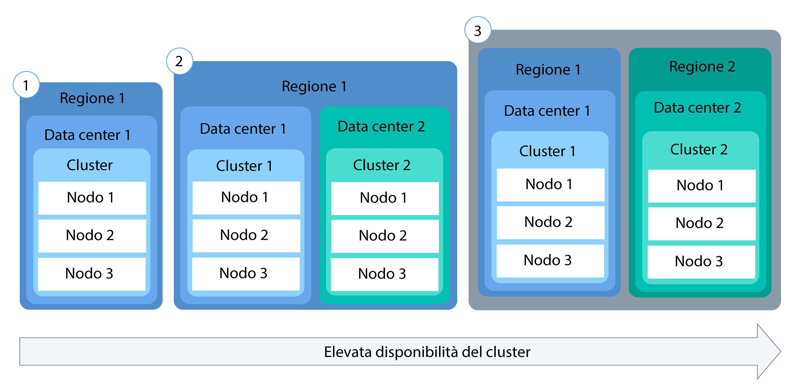

---

copyright:
  years: 2014, 2017
lastupdated: "2017-08-21"

---

{:new_window: target="_blank"}
{:shortdesc: .shortdesc}
{:screen: .screen}
{:pre: .pre}
{:codeblock: .codeblock}
{:table: .aria-labeledby="caption"}
{:codeblock: .codeblock}
{:tip: .tip} 
{:download: .download}


# Configurazione dei cluster
{: #cs_cluster}

Progetta la configurazione del tuo cluster per la massima capacità e disponibilità.
{:shortdesc}

Prima di iniziare, riesamina le opzioni per le [configurazioni di cluster ad alta disponibilità](cs_planning.html#cs_planning_cluster_config).

](https://console.bluemix.net/docs/api/content/containers/images/cs_cluster_ha_roadmap.png)

## Creazione dei cluster con la GUI
{: #cs_cluster_ui}

Un cluster Kubernetes  è una serie di nodi di lavoro organizzati in una
rete. Lo scopo del cluster è di definire una serie di risorse, nodi, reti e dispositivi di archiviazione
che mantengono le applicazioni altamente disponibili. Prima di poter distribuire un'applicazione,
devi creare un cluster e configurare le definizioni per i nodi di lavoro in tale cluster.
{:shortdesc}

Per gli utenti {{site.data.keyword.Bluemix_notm}} dedicato, consulta [Creazione di cluster Kubernetes dalla GUI in {{site.data.keyword.Bluemix_notm}} DST (Chiuso Beta)](#creating_cli_dedicated) invece.

Per creare un cluster:
1.  Dal catalogo, seleziona **Contenitori** e fai clic su **Cluster
Kubernetes**.

2.  Per il **Tipo di cluster**, seleziona **Standard**. Con un cluster standard, ottieni le funzioni come più nodi di lavoro per un ambiente ad elevata disponibilità.
3.  Immetti un **Nome cluster**.
4.  Seleziona una **Versione Kubernetes** da utilizzare nei nodi di lavoro. 
5.  Seleziona un'{{site.data.keyword.Bluemix_notm}} **Ubicazione** in cui distribuire il tuo cluster. Le ubicazioni disponibili
dipendono dalla regione {{site.data.keyword.Bluemix_notm}} in cui hai
eseguito l'accesso. Per
prestazioni ottimali, seleziona la regione fisicamente più vicina a te. Quando
selezioni una posizione ubicata al di fuori del tuo paese, tieni presente che potresti aver bisogno
di un'autorizzazione legale prima di poter fisicamente archiviare i dati in un paese straniero. La regione {{site.data.keyword.Bluemix_notm}}
determina il registro del contenitore che puoi utilizzare e i servizi  {{site.data.keyword.Bluemix_notm}}
per te disponibili.
6.  Seleziona un **Tipo di macchina**. Il tipo di macchina definisce la quantità di CPU virtuale e di memoria configurate in ogni nodo di lavoro
disponibile per tutti i contenitori che distribuisci nei tuoi nodi.
    -   Il tipo di macchina micro indica l'opzione più piccola.
    -   Un tipo di macchina bilanciato ha una quantità uguale di memoria assegnata a ciascuna CPU, il che ottimizza
le prestazioni.
7.  Scegli il **Numero di nodi di lavoro** di cui hai bisogno. Seleziona 3 per l'elevata di disponibilità del tuo cluster.
8.  Seleziona una **VLAN privata** dal tuo account {{site.data.keyword.BluSoftlayer_full}}. Viene utilizzata una VLAN privata per la comunicazione tra i nodi di lavoro. Puoi utilizzare la stessa VLAN privata per più cluster.
9. Seleziona una **VLAN pubblica** dal tuo account {{site.data.keyword.BluSoftlayer_notm}}. Viene utilizzata una VLAN pubblica per la comunicazione tra i nodi di lavoro e il master Kubernetes gestito da
IBM. Puoi utilizzare la stessa VLAN pubblica per più cluster. Se scegli di non selezionare una VLAN pubblica, devi configurare una soluzione alternativa.
10. Per **Hardware**, scegli **Dedicato** o
**Condiviso**. **Condiviso** è un'opzione sufficiente per la maggior parte delle situazioni.
    -   **Dedicato**: assicurati di completare l'isolamento delle tue risorse fisiche da altri clienti IBM.
    -   **Condiviso**: consente a IBM di archiviare le tue risorse fisiche nello stesso hardware di altri clienti IBM.
11. Fai clic su **Crea cluster**. Si aprono i dettagli del cluster, ma i nodi di lavoro nel cluster impiegano alcuni minuti per eseguire
il provisioning. Nella scheda **Nodi di lavoro**, puoi visualizzare l'andamento della distribuzione del nodo di lavoro. Quando i nodi di lavoro sono pronti, lo stato viene modificato in **Pronto**.

    **Nota:** a ogni nodo di lavoro viene assegnato
un ID e nome dominio univoco che non deve essere modificato manualmente dopo la creazione del
cluster. La modifica dell'ID o del nome dominio impedisce al master Kubernetes di gestire il tuo
cluster.


**Operazioni successive**

Quando il cluster è attivo e in esecuzione, puoi controllare le seguenti attività:

-   [Installa le CLI per iniziare ad utilizzare
il tuo cluster.](cs_cli_install.html#cs_cli_install)
-   [Distribuisci un'applicazione nel tuo cluster.](cs_apps.html#cs_apps_cli)
-   [Configura il tuo registro privato in {{site.data.keyword.Bluemix_notm}} per memorizzare e condividere le immagini Docker con
altri utenti.](/docs/services/Registry/index.html)

### Creazione di cluster con la GUI in {{site.data.keyword.Bluemix_notm}} dedicato (Chiuso beta)
{: #creating_ui_dedicated}

1.  Accedi alla console {{site.data.keyword.Bluemix_notm}} pubblico ([https://console.bluemix.net ](https://console.bluemix.net)) con il tuo ID IBM.
2.  Dal menu Account, seleziona il tuo account {{site.data.keyword.Bluemix_notm}} dedicato. La console
viene aggiornata con i servizi e le informazioni per la tua istanza di {{site.data.keyword.Bluemix_notm}} dedicato.
3.  Dal catalogo, seleziona **Contenitori** e fai clic su **Cluster
Kubernetes**.
4.  Immetti un **Nome cluster**.
5.  Seleziona una **Versione Kubernetes** da utilizzare nei nodi di lavoro. 
6.  Seleziona un **Tipo di macchina**. Il tipo di macchina definisce la quantità di CPU virtuale e di memoria configurate in ogni nodo di lavoro
disponibile per tutti i contenitori che distribuisci nei tuoi nodi.
    -   Il tipo di macchina micro indica l'opzione più piccola.
    -   Un tipo di macchina bilanciato ha una quantità uguale di memoria assegnata a ciascuna CPU, il che ottimizza
le prestazioni.
7.  Scegli il **Numero di nodi di lavoro** di cui hai bisogno. Seleziona 3 per assicurare l'elevata disponibilità al tuo cluster.
8.  Fai clic su **Crea cluster**. Si aprono i dettagli del cluster, ma i nodi di lavoro nel cluster impiegano alcuni minuti per eseguire
il provisioning. Nella scheda **Nodi di lavoro**, puoi visualizzare l'andamento della distribuzione del nodo di lavoro. Quando i nodi di lavoro sono pronti, lo stato viene modificato in **Pronto**.

**Operazioni successive**

Quando il cluster è attivo e in esecuzione, puoi controllare le seguenti attività:

-   [Installa le CLI per iniziare ad utilizzare
il tuo cluster.](cs_cli_install.html#cs_cli_install)
-   [Distribuisci un'applicazione nel tuo cluster.](cs_apps.html#cs_apps_cli)
-   [Configura il tuo registro privato in {{site.data.keyword.Bluemix_notm}} per memorizzare e condividere le immagini Docker con
altri utenti.](/docs/services/Registry/index.html)

## Creazione dei cluster con la CLI
{: #cs_cluster_cli}

Un cluster è una serie di nodi di lavoro organizzati in una
rete. Lo scopo del cluster è di definire una serie di risorse, nodi, reti e dispositivi di archiviazione
che mantengono le applicazioni altamente disponibili. Prima di poter distribuire un'applicazione,
devi creare un cluster e configurare le definizioni per i nodi di lavoro in tale cluster.
{:shortdesc}

Per gli utenti {{site.data.keyword.Bluemix_notm}} dedicato, consulta [Creazione di cluster Kubernetes dalla CLI in {{site.data.keyword.Bluemix_notm}} DST (Chiuso Beta)](#creating_cli_dedicated) invece.

Per creare un cluster:
1.  Installa la CLI {{site.data.keyword.Bluemix_notm}} e il plugin
[{{site.data.keyword.containershort_notm}}](cs_cli_install.html#cs_cli_install).
2.  Accedi alla CLI {{site.data.keyword.Bluemix_notm}}. Immetti le tue credenziali
{{site.data.keyword.Bluemix_notm}} quando richiesto.

    ```
    bx login
    ```
    {: pre}

      Per specificare una regione
{{site.data.keyword.Bluemix_notm}} specifica, includi l'endpoint
dell'API. Se disponi di immagini Docker private archiviate nel registro del contenitore di una regione
{{site.data.keyword.Bluemix_notm}} specifica o delle istanze del servizio
{{site.data.keyword.Bluemix_notm}} che hai già creato,
accedi in tale regione per accedere alle tue immagini e servizi {{site.data.keyword.Bluemix_notm}}.

      La regione {{site.data.keyword.Bluemix_notm}} a cui hai eseguito l'accesso determina inoltre la regione in cui puoi creare i tuoi cluster Kubernetes, inclusi i data center disponibili. Se non specifici una regione, viene automaticamente fatto accesso alla regione a te più vicina.

       -  Stati Uniti Sud

           ```
           bx login -a api.ng.bluemix.net
           ```
           {: pre}
     
       -  Sydney

           ```
           bx login -a api.au-syd.bluemix.net
           ```
           {: pre}

       -  Germania

           ```
           bx login -a api.eu-de.bluemix.net
           ```
           {: pre}

       -  Regno Unito

           ```
           bx login -a api.eu-gb.bluemix.net
           ```
           {: pre}

      **Nota:** se disponi di un ID federato, utilizza `bx login --sso` per accedere alla CLI {{site.data.keyword.Bluemix_notm}}. Immetti il tuo nome utente e usa l'URL fornito nell'output della CLI per richiamare la tua passcode monouso. Sai di disporre di un ID federato quando l'accesso ha esito negativo senza
`--sso` e positivo con l'opzione `--sso`.

3.  Se sei assegnato a più account, organizzazioni e spazi {{site.data.keyword.Bluemix_notm}},
seleziona l'account in cui vuoi creare il tuo cluster Kubernetes. I cluster sono specifici di un account e di un'organizzazione,
ma sono indipendenti da uno spazio {{site.data.keyword.Bluemix_notm}}. Quindi,
se hai accesso a più spazi nella tua organizzazione, puoi selezionarne uno qualsiasi dall'elenco.
4.  Facoltativo: se vuoi creare o accedere ai cluster Kubernetes in un'altra regione rispetto alla regione {{site.data.keyword.Bluemix_notm}} che hai selezionato precedentemente, specifica tale regione. Ad esempio, potresti voler accedere a un'altra regione {{site.data.keyword.containershort_notm}} per i seguenti motivi:

    -   Hai creato i servizi {{site.data.keyword.Bluemix_notm}} o le immagini Docker private in una regione e desideri utilizzarle con {{site.data.keyword.containershort_notm}} in un'altra regione.
    -   Vuoi accedere a un cluster in una regione diversa dalla regione {{site.data.keyword.Bluemix_notm}} predefinita a cui hai eseguito l'accesso.
    
    Scegli tra i seguenti endpoint API: 

    -   Stati Uniti Sud:

        ```
        bx cs init --host https://us-south.containers.bluemix.net
        ```
        {: pre}

    -   Regno Unito-Sud:

        ```
        bx cs init --host https://uk-south.containers.bluemix.net
        ```
        {: pre}

    -   Europa centrale:

        ```
        bx cs init --host https://eu-central.containers.bluemix.net
        ```
        {: pre}

    -   Asia Pacifico Sud:

        ```
        bx cs init --host https://ap-south.containers.bluemix.net
        ```
        {: pre}
    
6.  Crea un cluster.
    1.  Esamina le ubicazioni disponibili. Le ubicazioni che vengono mostrate dipendono dalla regione {{site.data.keyword.containershort_notm}} a cui hai eseguito l'accesso.

        ```
        bx cs locations
        ```
        {: pre}

        L'output della CLI sarà simile al seguente:

        -   Stati Uniti Sud:

            ```
            dal10
            dal12
            ```
            {: screen}

        -   Regno Unito-Sud:

            ```
            lon02
            lon04
            ```
            {: screen}

        -   Europa centrale:

            ```
            ams03
            fra02
            ```
            {: screen}

        -   Asia Pacifico Sud

            ```
            syd01
            syd02
            ```
            {: screen}

    2.  Scegli un'ubicazione ed esamina i tipi di macchina disponibili in tale ubicazione. Il tipo di macchina specifica le risorse di calcolo virtuali che sono disponibili per ogni nodo
di lavoro.

        ```
        bx cs machine-types <location>
        ```
        {: pre}

        ```
        Getting machine types list...
        OK
        Machine Types
        Name         Cores   Memory   Network Speed   OS             Storage   Server Type
        u1c.2x4      2       4GB      1000Mbps        UBUNTU_16_64   100GB     virtual
        b1c.4x16     4       16GB     1000Mbps        UBUNTU_16_64   100GB     virtual
        b1c.16x64    16      64GB     1000Mbps        UBUNTU_16_64   100GB     virtual
        b1c.32x128   32      128GB    1000Mbps        UBUNTU_16_64   100GB     virtual
        b1c.56x242   56      242GB    1000Mbps        UBUNTU_16_64   100GB     virtual
        ```
        {: screen}

    3.  Controlla se esiste già  una VLAN pubblica e privata in {{site.data.keyword.BluSoftlayer_notm}} per questo account.

        ```
        bx cs vlans <location>
        ```
        {: pre}

        ```
        ID        Name                Number   Type      Router  
        1519999   vlan   1355     private   bcr02a.dal10  
        1519898   vlan   1357     private   bcr02a.dal10 
        1518787   vlan   1252     public   fcr02a.dal10 
        1518888   vlan   1254     public    fcr02a.dal10 
        ```
        {: screen}

        Se esiste già una VLAN pubblica e privata, nota i router corrispondenti. I router della VLAN privata iniziano sempre con `bcr` (router back-end) e i router
della VLAN pubblica iniziano sempre con `fcr` (router front-end). La combinazione di numeri e lettere
dopo questi prefissi devono corrispondere per utilizzare tali VLAN durante la creazione di un cluster. Nell'output di esempio, le VLAN private
possono essere utilizzate con una qualsiasi VLAN pubblica perché i router includono tutti
`02a.dal10`.

    4.  Esegui il comando `cluster-create`. Puoi scegliere tra un cluster lite,
che include un nodo di lavoro configurato con 2vCPU e 4 GB di memoria o un cluster standard, che può includere
quanti nodi di lavoro desideri nel tuo account {{site.data.keyword.BluSoftlayer_notm}}. Quando crei un cluster standard,
per impostazione predefinita, l'hardware del nodo di lavoro viene condiviso da più clienti IBM e addebitato
in base alle ore di utilizzo. </b>Esempio per un cluster standard:

        ```
        bx cs cluster-create --location dal10; --public-vlan <public_vlan_id> --private-vlan <private_vlan_id> --machine-type u1c.2x4 --workers 3 --name <cluster_name>
        ```
        {: pre}

        Esempio per un cluster lite:

        ```
        bx cs cluster-create --name my_cluster
        ```
        {: pre}

        <table>
        <caption>Tabella 1. Descrizione dei componenti di questo comando</caption>
        <thead>
        <th colspan=2> Descrizione dei componenti di questo comando</th>
        </thead>
        <tbody>
        <tr>
        <td><code>cluster-create</code></td>
        <td>Il comando per creare un cluster nella tua organizzazione {{site.data.keyword.Bluemix_notm}}.</td> 
        </tr>
        <tr>
        <td><code>--location <em>&lt;location&gt;</em></code></td>
        <td>Sostituisci <em>&lt;location&gt;</em> con l'ID ubicazione {{site.data.keyword.Bluemix_notm}} in cui vuoi creare
il tuo cluster. Le ubicazioni disponibili
dipendono dalla regione {{site.data.keyword.containershort_notm}} in cui hai
eseguito l'accesso. Le ubicazioni disponibili sono:<ul><li>Stati Uniti Sud<ul><li>dal10 [Dallas]</li><li>dal12 [Dallas]</li></ul></li><li>Regno Unito-Sud<ul><li>lon02 [London]</li><li>lon04 [London]</li></ul></li><li>Europa centrale<ul><li>ams03 [Amsterdam]</li><li>ra02 [Frankfurt]</li></ul></li><li>Asia Pacifico Sud<ul><li>syd01 [Sydney]</li><li>syd04 [Sydney]</li></ul></li></ul></td> 
        </tr>
        <tr>
        <td><code>--machine-type <em>&lt;machine_type&gt;</em></code></td>
        <td>Se stai creando un cluster standard, scegli un tipo di macchina. Il tipo di macchina specifica le risorse di calcolo virtuali che sono disponibili per ogni nodo
di lavoro. Controlla [Confronto tra i cluster standard e lite per
{{site.data.keyword.containershort_notm}}](cs_planning.html#cs_planning_cluster_type) per ulteriori informazioni. Per i cluster lite, non devi definire il tipo di macchina. </td> 
        </tr>
        <tr>
        <td><code>--public-vlan <em>&lt;public_vlan_id&gt;</em></code></td>
        <td><ul><li>Per i cluster lite, non devi definire una VLAN pubblica. Il tuo cluster lite viene automaticamente collegato alla
VLAN pubblica di proprietà di IBM. </li><li>Per un cluster standard, se hai già una VLAN pubblica configurata nel tuo account {{site.data.keyword.BluSoftlayer_notm}} per quella ubicazione, immetti l'ID
della VLAN pubblica. Altrimenti, non devi specificare questa opzione perché {{site.data.keyword.containershort_notm}} automaticamente
crea una VLAN pubblica al tuo posto. <br/><br/><strong>Nota</strong>: le VLAN pubbliche e private che specifichi con il comando create devono corrispondere. I router della VLAN privata iniziano sempre con <code>bcr</code> (router back-end) e i router
della VLAN pubblica iniziano sempre con <code>fcr</code> (router front-end). La combinazione di numeri e lettere
dopo questi prefissi devono corrispondere per utilizzare tali VLAN durante la creazione di un cluster. Per creare un cluster, non utilizzare
VLAN pubbliche e private che non corrispondono.</li></ul></td> 
        </tr>
        <tr>
        <td><code>--private-vlan <em>&lt;private_vlan_id&gt;</em></code></td>
        <td><ul><li>Per i cluster lita, non devi definire una
VLAN privata.  Il tuo cluster lite viene automaticamente collegato alla
VLAN privata di proprietà di IBM. </li><li>Per un cluster standard, se hai già una VLAN privata configurata nel tuo account {{site.data.keyword.BluSoftlayer_notm}} per quella ubicazione, immetti l'ID
della VLAN privata. Altrimenti, non devi specificare questa opzione perché {{site.data.keyword.containershort_notm}} automaticamente
crea una VLAN privata al tuo posto. <br/><br/><strong>Nota</strong>: le VLAN pubbliche e private che specifichi con il comando create devono corrispondere. I router della VLAN privata iniziano sempre con <code>bcr</code> (router back-end) e i router
della VLAN pubblica iniziano sempre con <code>fcr</code> (router front-end). La combinazione di numeri e lettere
dopo questi prefissi devono corrispondere per utilizzare tali VLAN durante la creazione di un cluster. Per creare un cluster, non utilizzare
VLAN pubbliche e private che non corrispondono.</li></ul></td> 
        </tr>
        <tr>
        <td><code>--name <em>&lt;name&gt;</em></code></td>
        <td>Sostituisci <em>&lt;name&gt;</em> con un nome per il tuo cluster.</td> 
        </tr>
        <tr>
        <td><code>--workers <em>&lt;number&gt;</em></code></td>
        <td>Il numero di nodi di lavoro da includere nel cluster. Se non viene specificata l'opzione <code>--workers</code>,
viene creato 1 nodo di lavoro.</td> 
        </tr>
        </tbody></table>

7.  Verifica che la creazione del cluster sia stata richiesta.

    ```
    bx cs clusters
    ```
    {: pre}

    **Nota:** servono fino a 15 minuti perché le macchine del nodo di lavoro siano ordinate e che il cluster
sia configurato e ne sia stato eseguito il provisioning al tuo account.

    Quando è stato terminato il provisioning del tuo cluster,
lo stato del tuo cluster viene modificato in **distribuito**.

    ```
    Name         ID                                   State      Created          Workers   
    my_cluster   paf97e8843e29941b49c598f516de72101   deployed   20170201162433   1   
    ```
    {: screen}

8.  Controlla lo stato dei nodi di lavoro.

    ```
    bx cs workers <cluster>
    ```
    {: pre}

    Quando i nodi di lavoro sono pronti, la condizione
passa a **normale** e lo stato è **Pronto**. Quando lo stato del nodo è **Pronto**,
puoi accedere al
cluster.

    **Nota:** a ogni nodo di lavoro viene assegnato
un ID e nome dominio univoco che non deve essere modificato manualmente dopo la creazione del
cluster. La modifica dell'ID o del nome dominio impedisce al master Kubernetes di gestire il tuo
cluster.

    ```
    ID                                                  Public IP        Private IP     Machine Type   State      Status  
    prod-dal10-pa8dfcc5223804439c87489886dbbc9c07-w1   169.47.223.113   10.171.42.93   free           normal    Ready
    ```
    {: screen}

9. Configura il cluster che hai creato come il contesto per questa sessione. Completa questi passi di configurazione ogni volta che lavori con il tuo cluster.
    1.  Richiama il comando per impostare la variabile di ambiente e scaricare i file di configurazione Kubernetes.

        ```
        bx cs cluster-config <cluster_name_or_id>
        ```
        {: pre}

        Quando il download dei file di configurazione è terminato, viene visualizzato un comando che puoi utilizzare per impostare il percorso al file di configurazione di Kubernetes locale come una variabile di ambiente.

        Esempio per OS X:

        ```
        export KUBECONFIG=/Users/<nome_utente>/.bluemix/plugins/container-service/clusters/<nome_cluster>/kube-config-prod-dal10-<nome_cluster>.yml
        ```
        {: screen}

    2.  Copia e incolla il comando visualizzato nel tuo terminale per impostare la variabile di ambiente `KUBECONFIG`.
    3.  Verifica che la variabile di ambiente `KUBECONFIG` sia impostata correttamente.

        Esempio per OS X:

        ```
        echo $KUBECONFIG
        ```
        {: pre}

        Output:

        ```
        /Users/<nome_utente>/.bluemix/plugins/container-service/clusters/<nome_cluster>/kube-config-prod-dal10-<nome_cluster>.yml
        
        ```
        {: screen}

10. Avvia il tuo dashboard Kubernetes con la porta predefinita 8001.
    1.  Imposta il proxy con il numero di porta predefinito.

        ```
        kubectl proxy
        ```
        {: pre}

        ```
        Inizio di utilizzo su 127.0.0.1:8001
        ```
        {: screen}

    2.  Apri il seguente URL in un browser web per visualizzare il dashboard Kubernetes.

        ```
        http://localhost:8001/ui
        ```
        {: codeblock}


**Operazioni successive**

-   [Distribuisci un'applicazione nel tuo cluster.](cs_apps.html#cs_apps_cli)
-   [Gestisci il tuo cluster con la riga di comando `kubectl`. ](https://kubernetes.io/docs/user-guide/kubectl/)
-   [Configura il tuo registro privato in {{site.data.keyword.Bluemix_notm}} per memorizzare e condividere le immagini Docker con
altri utenti.](/docs/services/Registry/index.html)

### Creazione di cluster con la CLI in {{site.data.keyword.Bluemix_notm}} dedicato (Chiuso beta)
{: #creating_cli_dedicated}

1.  Installa la CLI {{site.data.keyword.Bluemix_notm}} e il plugin
[{{site.data.keyword.containershort_notm}}](cs_cli_install.html#cs_cli_install).
2.  Accedi all'endpoint pubblico per {{site.data.keyword.containershort_notm}}. Immetti le tue credenziali {{site.data.keyword.Bluemix_notm}} e seleziona l'account {{site.data.keyword.Bluemix_notm}} dedicato quando richiesto.

    ```
    bx login -a api.<region>.bluemix.net
    ```
    {: pre}

    **Nota:** se disponi di un ID federato, utilizza `bx login --sso` per accedere alla CLI {{site.data.keyword.Bluemix_notm}}. Immetti il tuo nome utente e usa l'URL fornito nell'output della CLI per richiamare la tua passcode monouso. Sai di disporre di un ID federato quando l'accesso ha esito negativo senza
`--sso` e positivo con l'opzione `--sso`.

3.  Crea un cluster con il comando `cluster-create`. Quando crei un cluster standard, l'hardware del nodo di lavoro viene addebitato in base alle
ore di utilizzo.

    Esempio

    ```
    bx cs cluster-create --machine-type <machine-type> --workers <number> --name <cluster_name>
    ```
    {: pre}
    
    <table>
    <caption>Tabella 2. Descrizione dei componenti di questo comando</caption>
    <thead>
    <th colspan=2> Descrizione dei componenti di questo comando</th>
    </thead>
    <tbody>
    <tr>
    <td><code>cluster-create</code></td>
    <td>Il comando per creare un cluster nella tua organizzazione {{site.data.keyword.Bluemix_notm}}.</td> 
    </tr>
    <tr>
    <td><code>--location <em>&lt;location&gt;</em></code></td>
    <td>Sostituisci &lt;location&gt; con l'ID ubicazione {{site.data.keyword.Bluemix_notm}} in cui vuoi creare
il tuo cluster. Le ubicazioni disponibili
dipendono dalla regione {{site.data.keyword.containershort_notm}} in cui hai
eseguito l'accesso. Le ubicazioni disponibili sono:<ul><li>Stati Uniti Sud<ul><li>dal10 [Dallas]</li><li>dal12 [Dallas]</li></ul></li><li>Regno Unito-Sud<ul><li>lon02 [London]</li><li>lon04 [London]</li></ul></li><li>Europa centrale<ul><li>ams03 [Amsterdam]</li><li>ra02 [Frankfurt]</li></ul></li><li>Asia Pacifico Sud<ul><li>syd01 [Sydney]</li><li>syd04 [Sydney]</li></ul></li></ul></td> 
    </tr>
    <tr>
    <td><code>--machine-type <em>&lt;machine_type&gt;</em></code></td>
    <td>Se stai creando un cluster standard, scegli un tipo di macchina. Il tipo di macchina specifica le risorse di calcolo virtuali che sono disponibili per ogni nodo
di lavoro. Controlla [Confronto tra i cluster standard e lite per
{{site.data.keyword.containershort_notm}}](cs_planning.html#cs_planning_cluster_type) per ulteriori informazioni. Per i cluster lite, non devi definire il tipo di macchina. </td> 
    </tr>
    <tr>
    <td><code>--name <em>&lt;name&gt;</em></code></td>
    <td>Sostituisci <em>&lt;name&gt;</em> con un nome per il tuo cluster.</td> 
    </tr>
    <tr>
    <td><code>--workers <em>&lt;number&gt;</em></code></td>
    <td>Il numero di nodi di lavoro da includere nel cluster. Se non viene specificata l'opzione <code>--workers</code>,
viene creato 1 nodo di lavoro.</td> 
    </tr>
    </tbody></table>

4.  Verifica che la creazione del cluster sia stata richiesta.

    ```
    bx cs clusters
    ```
    {: pre}

    **Nota:** servono fino a 15 minuti perché le macchine del nodo di lavoro siano ordinate e che il cluster
sia configurato e ne sia stato eseguito il provisioning al tuo account.

    Quando è stato terminato il provisioning del tuo cluster,
lo stato del tuo cluster viene modificato in **distribuito**.

    ```
    Name         ID                                   State      Created          Workers   
    my_cluster   paf97e8843e29941b49c598f516de72101   deployed   20170201162433   1   
    ```
    {: screen}

5.  Controlla lo stato dei nodi di lavoro.

    ```
    bx cs workers <cluster>
    ```
    {: pre}

    Quando i nodi di lavoro sono pronti, la condizione
passa a **normale** e lo stato è **Pronto**. Quando lo stato del nodo è **Pronto**,
puoi accedere al
cluster.

    ```
    ID                                                  Public IP        Private IP     Machine Type   State      Status  
    prod-dal10-pa8dfcc5223804439c87489886dbbc9c07-w1   169.47.223.113   10.171.42.93   free           normal    Ready
    ```
    {: screen}

6.  Configura il cluster che hai creato come il contesto per questa sessione. Completa questi passi di configurazione ogni volta che lavori con il tuo cluster.

    1.  Richiama il comando per impostare la variabile di ambiente e scaricare i file di configurazione Kubernetes.

        ```
        bx cs cluster-config <cluster_name_or_id>
        ```
        {: pre}

        Quando il download dei file di configurazione è terminato, viene visualizzato un comando che puoi utilizzare per impostare il percorso al file di configurazione di Kubernetes locale come una variabile di ambiente.

        Esempio per OS X:

        ```
        export KUBECONFIG=/Users/<nome_utente>/.bluemix/plugins/container-service/clusters/<nome_cluster>/kube-config-prod-dal10-<nome_cluster>.yml
        ```
        {: screen}

    2.  Copia e incolla il comando visualizzato nel tuo terminale per impostare la variabile di ambiente `KUBECONFIG`.
    3.  Verifica che la variabile di ambiente `KUBECONFIG` sia impostata correttamente.

        Esempio per OS X:

        ```
        echo $KUBECONFIG
        ```
        {: pre}

        Output:

        ```
        /Users/<nome_utente>/.bluemix/plugins/container-service/clusters/<nome_cluster>/kube-config-prod-dal10-<nome_cluster>.yml
        
        ```
        {: screen}

7.  Accedi al dashboard Kubernetes con la porta predefinita 8001.
    1.  Imposta il proxy con il numero di porta predefinito.

        ```
        kubectl proxy
        ```
        {: pre}

        ```
        Inizio di utilizzo su 127.0.0.1:8001
        ```
        {: screen}

    2.  Apri il seguente URL in un browser web per poter visualizzare il dashboard Kubernetes.

        ```
        http://localhost:8001/ui
        ```
        {: codeblock}


**Operazioni successive**

-   [Distribuisci un'applicazione nel tuo cluster.](cs_apps.html#cs_apps_cli)
-   [Gestisci il tuo cluster con la riga di comando `kubectl`. ](https://kubernetes.io/docs/user-guide/kubectl/)
-   [Configura il tuo registro privato in {{site.data.keyword.Bluemix_notm}} per memorizzare e condividere le immagini Docker con
altri utenti.](/docs/services/Registry/index.html)

## Utilizzo dei registri di immagini pubblici e privati
{: #cs_apps_images}

Un'immagine Docker è la base per ogni contenitore che crei. Un'immagine viene creata da un
Dockerfile, che è un file che contiene le istruzioni per creare l'immagine. Nelle sue istruzioni, un Dockerfile potrebbe
fare riferimento alle risorse di build che vengono memorizzate separatamente, quali ad esempio un'applicazione, la configurazione
dell'applicazione e le relative dipendenze. Le immagini normalmente vengono archiviate in un registro ed è possibile accedervi pubblicamente (registro pubblico)
o configurarle con un accesso limitato a un piccolo gruppo di utenti (registro privato).
{:shortdesc}

Esamina le seguenti opzioni per trovare informazioni su come configurare un registro delle immagini e su come
utilizzare un'immagine dal registro.

-   [Accesso a uno spazio dei nomi in {{site.data.keyword.registryshort_notm}} per lavorare con le immagini fornite da IBM e con le tue proprie immagini Docker private](#bx_registry_default).
-   [Accesso alle immagini pubbliche da Docker Hub](#dockerhub).
-   [Accesso alle immagini private memorizzate in altri registri
privati](#private_registry).

### Accedere a uno spazio dei nomi in {{site.data.keyword.registryshort_notm}}
per lavorare con le immagini fornite da IBM e con le tue proprie immagini Docker private
{: #bx_registry_default}

Puoi distribuire i contenitori al tuo cluster da un'immagine pubblica fornita da IBM o da un'immagine privata
memorizzata nel tuo spazio dei nomi in {{site.data.keyword.registryshort_notm}}.

Prima di iniziare:

-   [Configura una spazio dei nomi in {{site.data.keyword.registryshort_notm}}
su {{site.data.keyword.Bluemix_notm}} pubblico o {{site.data.keyword.Bluemix_notm}} dedicato e distribuisci le
immagini in questo spazio dei nomi](/docs/services/Registry/registry_setup_cli_namespace.html#registry_namespace_add).
-   [Crea un
cluster](#cs_cluster_cli).
-   [Indirizza la tua CLI al tuo cluster](cs_cli_install.html#cs_cli_configure).

Quando crei un cluster, per esso viene creato automaticamente un token di registro senza
scadenza. Questo token viene utilizzato per autorizzare l'accesso in sola lettura a tutti i tuoi spazi dei nomi che hai configurato
in {{site.data.keyword.registryshort_notm}} in modo che tu possa
lavorare con le immagini pubbliche fornite da IBM e le tue immagini Docker private. I token devono essere memorizzati
in un `imagePullSecret` Kubernetes per poter essere accessibili da un cluster Kubernetes
quando distribuisci un'applicazione inserita in un contenitore. Quando il tuo cluster viene creato, {{site.data.keyword.containershort_notm}} memorizza automaticamente questo token in un
`imagePullSecret` Kubernetes. `imagePullSecret` viene aggiunto allo spazio dei nomi
Kubernetes predefinito, all'elenco di segreti predefinito nel ServiceAccount per tale spazio dei nomi
e allo spazio dei nomi kube-system.

**Nota:** utilizzando questa configurazione iniziale, puoi distribuire i contenitori da qualsiasi immagine disponibile in
uno spazio dei nomi del tuo account {{site.data.keyword.Bluemix_notm}} allo
spazio dei nomi **predefinito** del tuo cluster. Se vuoi distribuire un contenitore in altri
spazi dei nomi del tuo cluster, o se vuoi utilizzare un'immagine memorizzata in un'altra regione {{site.data.keyword.Bluemix_notm}} o in un altro account {{site.data.keyword.Bluemix_notm}}, devi [creare il tuo proprio imagePullSecret per il cluster](#bx_registry_other).

Per distribuire un contenitore nello spazio dei nomi **predefinito** del tuo
cluster, crea uno script di configurazione di distribuzione.

1.  Apri il tuo editor preferito e crea uno script di configurazione di distribuzione denominato
<em>mydeployment.yaml</em>.
2.  Definisci la distribuzione e l'immagine che vuoi utilizzare dal tuo spazio dei nomi in {{site.data.keyword.registryshort_notm}}.

    Per
utilizzare un'immagine privata da uno spazio dei nomi in {{site.data.keyword.registryshort_notm}}:

    ```
    apiVersion: extensions/v1beta1
    kind: Deployment
    metadata:
      name: ibmliberty-deployment
    spec:
      replicas: 3
      template:
        metadata:
          labels:
            app: ibmliberty
        spec:
          containers:
          - name: ibmliberty
            image: registry.<region>.bluemix.net/<namespace>/<my_image>:<tag>
    ```
    {: codeblock}

    **Suggerimento:** per richiamare le informazioni sul tuo spazio dei nomi, esegui `bx cr namespace-list`.

3.  Crea la distribuzione nel tuo cluster.

    ```
    kubectl apply -f mydeployment.yaml
    ```
    {: pre}

    **Suggerimento:** puoi anche distribuire uno script di configurazione esistente, come una delle immagini pubbliche fornite da IBM. Questo esempio utilizza l'immagine **ibmliberty** nella regione stati uniti sud.

    ```
    kubectl apply -f https://raw.githubusercontent.com/IBM-{{site.data.keyword.Bluemix_notm}}/kube-samples/master/deploy-apps-clusters/deploy-ibmliberty.yaml
    ```
    {: pre}

### Distribuzione di immagini ad altri spazi dei nomi Kubernetes o accesso alle immagini in altre regioni o account {{site.data.keyword.Bluemix_notm}}
{: #bx_registry_other}

Puoi distribuire
i contenitori ad altri spazi dei nomi Kubernetes, utilizzare le immagini memorizzate in altre regioni o account {{site.data.keyword.Bluemix_notm}}
o utilizzare le immagini memorizzate in {{site.data.keyword.Bluemix_notm}} dedicato creando il tuo proprio imagePullSecret.

Prima di iniziare:

1.  [Configura una spazio dei nomi in {{site.data.keyword.registryshort_notm}}
su {{site.data.keyword.Bluemix_notm}} pubblico o {{site.data.keyword.Bluemix_notm}} dedicato e distribuisci le
immagini in questo spazio dei nomi](/docs/services/Registry/registry_setup_cli_namespace.html#registry_namespace_add).
2.  [Crea un
cluster](#cs_cluster_cli).
3.  [Indirizza la tua CLI al tuo cluster](cs_cli_install.html#cs_cli_configure).

Per creare il tuo proprio imagePullSecret:

**Nota:** segreti imagePullSecret sono validi solo per gli spazi dei nomi per i quali sono stati creati. Ripeti questa procedura
per ogni spazio dei nomi in cui vuoi distribuire i contenitori da un'immagine privata.

1.  Se ancora non hai un token, [crea un token per il registro a cui vuoi accedere.](/docs/services/Registry/registry_tokens.html#registry_tokens_create)
2.  Elenca i token disponibili nel tuo account {{site.data.keyword.Bluemix_notm}}.

    ```
    bx cr token-list
    ```
    {: pre}

3.  Prendi nota dell'ID token che vuoi utilizzare. 
4.  Richiama il valore per il tuo token. Sostituisci <token_id>
con l'ID del token che hai richiamato nel passo precedente.

    ```
    bx cr token-get <token_id>
    ```
    {: pre}

    Il valore del tuo token viene visualizzato
nel campo **Token** dell'output della tua CLI.

5.  Crea il segreto Kubernetes per memorizzare le informazioni sul token.

    ```
    kubectl --namespace <kubernetes_namespace> create secret docker-registry <secret_name>  --docker-server=<registry_url> --docker-username=token --docker-password=<token_value> --docker-email=<docker_email>
    ```
    {: pre}
    
    <table>
    <caption>Tabella 3. Descrizione dei componenti di questo comando</caption>
    <thead>
    <th colspan=2> Descrizione dei componenti di questo comando</th>
    </thead>
    <tbody>
    <tr>
    <td><code>--namespace <em>&lt;kubernetes_namespace&gt;</em></code></td>
    <td>Obbligatoria. Lo spazio dei nomi Kubernetes del cluster in cui vuoi utilizzare il segreto e a cui
distribuire i contenitori. Esegui <code>kubectl get namespaces</code> per elencare tutti gli spazi dei nomi nel tuo
cluster.</td> 
    </tr>
    <tr>
    <td><code><em>&lt;secret_name&gt;</em></code></td>
    <td>Obbligatoria. Il nome che vuoi utilizzare per imagePullSecret. </td> 
    </tr>
    <tr>
    <td><code>--docker-server <em>&lt;registry_url&gt;</em></code></td>
    <td>Obbligatoria. L'URL del registro delle immagini in cui è configurato il tuo spazio dei nomi.<ul><li>Per gli spazi dei nomi configurati in Stati Uniti Sud registry.ng.bluemix.net</li><li>Per gli spazi dei nomi configurati in Regno Unito Sud registry.eu-gb.bluemix.net</li><li>Per gli spazi dei nomi configurati in Europa centrale (Francoforte) registry.eu-de.bluemix.net</li><li>Per gli spazi dei nomi configurati in Australia (Sydney) registry.au-syd.bluemix.net</li><li>Per gli spazi dei nomi configurati in {{site.data.keyword.Bluemix_notm}} dedicato registry.<em>&lt;dedicated_domain&gt;</em></li></ul></td> 
    </tr>
    <tr>
    <td><code>--docker-username <em>&lt;docker_username&gt;</em></code></td>
    <td>Obbligatoria. Il nome utente per accedere al tuo registro privato.</td> 
    </tr>
    <tr>
    <td><code>--docker-password <em>&lt;token_value&gt;</em></code></td>
    <td>Obbligatoria. Il valore del tuo token di registro che hai richiamato in precedenza.</td> 
    </tr>
    <tr>
    <td><code>--docker-email <em>&lt;docker-email&gt;</em></code></td>
    <td>Obbligatoria. Se ne hai uno, immetti il tuo indirizzo e-mail Docker. Se non hai uno, immetti
un indirizzo e-mail fittizio, come ad esempio a@b.c. Questa e-mail è obbligatoria per creare un segreto Kubernetes,
ma non viene utilizzata dopo la creazione.</td> 
    </tr>
    </tbody></table>

6.  Verifica che il segreto sia stato creato correttamente. Sostituisci
<em>&lt;kubernetes_namespace&gt;</em> con il nome dello spazio in cui hai creato
imagePullSecret.

    ```
    kubectl get secrets --namespace <kubernetes_namespace>
    ```
    {: pre}

7.  Crea un a pod che fa riferimento all'imagePullSecret.
    1.  Apri il tuo editor preferito e crea uno script di configurazione del pod denominato mypod.yaml. 
    2.  Definisci il pod e l'imagePullSecret che vuoi utilizzare per accedere al tuo registro
{{site.data.keyword.Bluemix_notm}} privato. Per
utilizzare un'immagine privata da uno spazio dei nomi:

        ```
        apiVersion: v1
        kind: Pod
        metadata:
          name: <pod_name>
        spec:
          containers:
            - name: <container_name>
              image: registry.<region>.bluemix.net/<my_namespace>/<my_image>:<tag>  
          imagePullSecrets:
            - name: <secret_name>
        ```
        {: codeblock}

        <table>
        <caption>Tabella 4.Descrizione dei componenti del file YAML</caption>
        <thead>
        <th colspan=2> Descrizione dei
componenti del file YAML</th>
        </thead>
        <tbody>
        <tr>
        <td><code><em>&lt;container_name&gt;</em></code></td>
        <td>Il nome del contenitore che vuoi distribuire al tuo cluster.</td> 
        </tr>
        <tr>
        <td><code><em>&lt;secret_name&gt;</em></code></td>
        <td>Lo spazio dei nomi in cui è memorizzata la tua immagine. Per elencare gli spazi dei nomi disponibili, esegui `bx cr
namespace-list`.</td> 
        </tr>
        <tr>
        <td><code><em>&lt;my_namespace&gt;</em></code></td>
        <td>Lo spazio dei nomi in cui è memorizzata la tua immagine. Per elencare gli spazi dei nomi disponibili, esegui `bx cr
namespace-list`.</td> 
        </tr>
        <tr>
        <td><code><em>&lt;my_image&gt;</em></code></td>
        <td>Il nome dell'immagine che vuoi utilizzare. Per elencare le immagini disponibili in un account {{site.data.keyword.Bluemix_notm}}, esegui `bx cr
image-list`.</td> 
        </tr>
        <tr>
        <td><code><em>&lt;tag&gt;</em></code></td>
        <td>La versione dell'immagine che vuoi utilizzare. Se non si specifica una tag, viene utilizzata l'immagine contrassegnata con
<strong>latest</strong> per impostazione predefinita.</td> 
        </tr>
        <tr>
        <td><code><em>&lt;secret_name&gt;</em></code></td>
        <td>Il nome dell'imagePullSecret che hai creato in precedenza.</td> 
        </tr>
        </tbody></table>

   3.  Salva le modifiche.
   4.  Crea la distribuzione nel tuo cluster.

        ```
        kubectl apply -f mypod.yaml
        ```
        {: pre}


### Accesso alle immagini pubbliche da Docker Hub
{: #dockerhub}

Puoi utilizzare qualsiasi immagine pubblica memorizzata in Docker Hub per distribuire un contenitore al tuo
cluster senza alcuna configurazione aggiuntiva. Crea un file dello script di configurazione di distribuzione o distribuiscine uno esistente.

Prima di iniziare:

1.  [Crea un
cluster](#cs_cluster_cli).
2.  [Indirizza la tua CLI al tuo cluster](cs_cli_install.html#cs_cli_configure).

Crea uno script di configurazione di distribuzione.

1.  Apri il tuo editor preferito e crea uno script di configurazione di distribuzione denominato mydeployment.yaml. 
2.  Definisci la distribuzione e l'immagine pubblica dal Docker Hub che vuoi utilizzare. Il seguente script di configurazione utilizza l'immagine pubblica NGINX disponibile su Docker Hub.

    ```
    apiVersion: extensions/v1beta1
    kind: Deployment
    metadata:
      name: nginx-deployment
    spec:
      replicas: 3
      template:
        metadata:
          labels:
            app: nginx
        spec:
          containers:
          - name: nginx
            image: nginx
    ```
    {: codeblock}

3.  Crea la distribuzione nel tuo cluster.

    ```
    kubectl apply -f mydeployment.yaml
    ```
    {: pre}

    **Suggerimento:** in alternativa, distribuisci uno script di configurazione esistente. Il seguente esempio utilizza la stessa immagine NGINX pubblica ma la applica direttamente al tuo cluster.

    ```
    kubectl apply -f https://raw.githubusercontent.com/IBM-{{site.data.keyword.Bluemix_notm}}/kube-samples/master/deploy-apps-clusters/deploy-nginx.yaml
    ```
    {: pre}


### Accesso alle immagini private memorizzate in altri registri privati
{: #private_registry}

Se hai già un registro privato che vuoi utilizzare, devi memorizzare le credenziali del
registro in un imagePullSecret Kubernetes e fare riferimento a questo segreto nel tuo script di configurazione.

Prima di iniziare:

1.  [Crea un
cluster](#cs_cluster_cli).
2.  [Indirizza la tua CLI al tuo cluster](cs_cli_install.html#cs_cli_configure).

Per creare un imagePullSecret, attieniti alla seguente procedura.

**Nota:** i segreti imagePullSecret sono validi per gli spazi dei nomi per i quali sono stati creati. Ripeti questa procedura
per ogni spazio dei nomi in cui vuoi distribuire i contenitori da un'immagine memorizzata in un registro {{site.data.keyword.Bluemix_notm}} privato.

1.  Crea il segreto Kubernetes per memorizzare le credenziali del tuo registro privato.

    ```
    kubectl --namespace <kubernetes_namespace> create secret docker-registry <secret_name>  --docker-server=<registry_url> --docker-username=<docker_username> --docker-password=<docker_password> --docker-email=<docker_email>
    ```
    {: pre}
    
    <table>
    <caption>Tabella 5. Descrizione dei componenti di questo comando</caption>
    <thead>
    <th colspan=2> Descrizione dei componenti di questo comando</th>
    </thead>
    <tbody>
    <tr>
    <td><code>--namespace <em>&lt;kubernetes_namespace&gt;</em></code></td>
    <td>Obbligatoria. Lo spazio dei nomi Kubernetes del cluster in cui vuoi utilizzare il segreto e a cui
distribuire i contenitori. Esegui <code>kubectl get namespaces</code> per elencare tutti gli spazi dei nomi nel tuo
cluster.</td> 
    </tr>
    <tr>
    <td><code><em>&lt;secret_name&gt;</em></code></td>
    <td>Obbligatoria. Il nome che vuoi utilizzare per imagePullSecret. </td> 
    </tr>
    <tr>
    <td><code>--docker-server <em>&lt;registry_url&gt;</em></code></td>
    <td>Obbligatoria. L'URL del registro in cui sono memorizzate le tue immagini private.</td> 
    </tr>
    <tr>
    <td><code>--docker-username <em>&lt;docker_username&gt;</em></code></td>
    <td>Obbligatoria. Il nome utente per accedere al tuo registro privato.</td> 
    </tr>
    <tr>
    <td><code>--docker-password <em>&lt;token_value&gt;</em></code></td>
    <td>Obbligatoria. Il valore del tuo token di registro che hai richiamato in precedenza.</td> 
    </tr>
    <tr>
    <td><code>--docker-email <em>&lt;docker-email&gt;</em></code></td>
    <td>Obbligatoria. Se ne hai uno, immetti il tuo indirizzo e-mail Docker. Se non hai uno, immetti
un indirizzo e-mail fittizio, come ad esempio a@b.c. Questa e-mail è obbligatoria per creare un segreto Kubernetes,
ma non viene utilizzata dopo la creazione.</td> 
    </tr>
    </tbody></table>

2.  Verifica che il segreto sia stato creato correttamente. Sostituisci
<em>&lt;kubernetes_namespace&gt;</em> con il nome dello spazio in cui hai creato
imagePullSecret.

    ```
    kubectl get secrets --namespace <kubernetes_namespace>
    ```
    {: pre}

3.  Crea un a pod che fa riferimento all'imagePullSecret.
    1.  Apri il tuo editor preferito e crea uno script di configurazione del pod denominato mypod.yaml. 
    2.  Definisci il pod e l'imagePullSecret che vuoi utilizzare per accedere al tuo registro
{{site.data.keyword.Bluemix_notm}} privato. Per utilizzare un'immagine
privata dal tuo registro privato:

        ```
        apiVersion: v1
        kind: Pod
        metadata:
          name: <pod_name>
        spec:
          containers:
            - name: <container_name>
              image: <my_image>:<tag>  
          imagePullSecrets:
            - name: <secret_name>
        ```
        {: codeblock}

        <table>
        <caption>Tabella 6.Descrizione dei componenti del file YAML</caption>
        <thead>
        <th colspan=2> Descrizione dei
componenti del file YAML</th>
        </thead>
        <tbody>
        <tr>
        <td><code><em>&lt;pod_name&gt;</em></code></td>
        <td>Il nome del pod che vuoi creare.</td> 
        </tr>
        <tr>
        <td><code><em>&lt;container_name&gt;</em></code></td>
        <td>Il nome del contenitore che vuoi distribuire al tuo cluster.</td> 
        </tr>
        <tr>
        <td><code><em>&lt;my_image&gt;</em></code></td>
        <td>Il percorso completo dell'immagine nel tuo registro privato che vuoi utilizzare.</td> 
        </tr>
        <tr>
        <td><code><em>&lt;tag&gt;</em></code></td>
        <td>La versione dell'immagine che vuoi utilizzare. Se non si specifica una tag, viene utilizzata l'immagine contrassegnata con
<strong>latest</strong> per impostazione predefinita.</td> 
        </tr>
        <tr>
        <td><code><em>&lt;secret_name&gt;</em></code></td>
        <td>Il nome dell'imagePullSecret che hai creato in precedenza.</td> 
        </tr>
        </tbody></table>

  3.  Salva le modifiche.
  4.  Crea la distribuzione nel tuo cluster.

        ```
        kubectl apply -f mypod.yaml
        ```
        {: pre}


## Aggiunta dei servizi {{site.data.keyword.Bluemix_notm}}
ai cluster
{: #cs_cluster_service}

Aggiungi un'istanza del servizio {{site.data.keyword.Bluemix_notm}} esistente al tuo cluster
per abilitare gli utenti del cluster ad accedere e utilizzare il servizio
{{site.data.keyword.Bluemix_notm}} quando distribuiscono un'applicazione al cluster.
{:shortdesc}

Prima di iniziare:

-   [Indirizza la tua CLI](cs_cli_install.html#cs_cli_configure) al tuo cluster.
-   [Richiedi un'istanza del servizio {{site.data.keyword.Bluemix_notm}}](/docs/services/reqnsi.html#req_instance) nel tuo spazio da aggiungere al cluster.
-   Per gli utenti {{site.data.keyword.Bluemix_notm}} dedicato, consulta invece [Aggiunta dei servizi {{site.data.keyword.Bluemix_notm}} ai cluster in {{site.data.keyword.Bluemix_notm}} dedicato (Chiuso beta)](#binding_dedicated).

**Nota:** puoi aggiungere solo servizi {{site.data.keyword.Bluemix_notm}} che supportano le chiavi del servizio (scorri fino alla sezione [Abilitazione di applicazioni esterne a utilizzare servizi {{site.data.keyword.Bluemix_notm}}](/docs/services/reqnsi.html#req_instance)).

Per aggiungere un servizio:
2.  Elenca tutti servizi esistenti nel tuo spazio {{site.data.keyword.Bluemix_notm}}.

    ```
    bx service list
    ```
    {: pre}

    Output CLI di esempio:

    ```
    name                      service           plan    bound apps   last operation   
    <service_instance_name>   <service_name>    spark                create succeeded
    ```
    {: screen}

3.  Prendi nota del **nome** dell'istanza del servizio che vuoi aggiungere al tuo cluster.
4.  Identifica lo spazio dei nomi del cluster che desideri utilizzare per l'aggiunta del tuo servizio. Scegli tra le seguenti opzioni:
    -   Elenca gli spazi dei nomi esistenti e scegline uno che desideri utilizzare.

        ```
        kubectl get namespaces
        ```
        {: pre}

    -   Crea un nuovo spazio dei nomi nel tuo cluster. 

        ```
        kubectl create namespace <namespace_name>
        ```
        {: pre}

5.  Aggiungi il servizio al tuo cluster.

    ```
    bx cs cluster-service-bind <cluster_name_or_id> <namespace> <service_instance_name>
    ```
    {: pre}

    Dopo che
il servizio è stato correttamente associato al tuo cluster, viene creato un segreto cluster che contiene le credenziali
della tua istanza del servizio. Output CLI di esempio:

    ```
    bx cs cluster-service-bind mycluster mynamespace cleardb 
    Binding service instance to namespace...
    OK
    Namespace: mynamespace
    Secret name:     binding-<service_instance_name>
    ```
    {: screen}

6.  Verifica che il segreto sia stato creato nel tuo spazio dei nomi del cluster.

    ```
    kubectl get secrets --namespace=<namespace>
    ```
    {: pre}


Per utilizzare il
servizio in un pod distribuito nel cluster, gli utenti del cluster possono accedere alle credenziali del servizio {{site.data.keyword.Bluemix_notm}} da
[montaggio del segreto Kubernetes come un volume secreto in un pod](cs_apps.html#cs_apps_service).

### Aggiunta dei servizi {{site.data.keyword.Bluemix_notm}} ai cluster in {{site.data.keyword.Bluemix_notm}} dedicato (Chiuso beta) 
{: #binding_dedicated}

Prima di iniziare, [richiedi un'istanza del servizio {{site.data.keyword.Bluemix_notm}}](/docs/services/reqnsi.html#req_instance) nel tuo spazio da aggiungere al tuo cluster.

1.  Accedi all'ambiente {{site.data.keyword.Bluemix_notm}} dedicato in cui è stata creata l'istanza del servizio.

    ```
    bx login -a api.<dedicated_domain>
    ```
    {: pre}

2.  Elenca tutti servizi esistenti nel tuo spazio {{site.data.keyword.Bluemix_notm}}.

    ```
    bx service list
    ```
    {: pre}

    Output CLI di esempio:

    ```
    name                      service           plan    bound apps   last operation   
    <service_instance_name>   <service_name>    spark                create succeeded
    ```
    {: screen}

3.  Crea una chiave delle credenziali del servizio contenente informazioni riservate sul
servizio, quali nome utente, password e URL.

    ```
    bx service key-create <service_name> <service_key_name>
    ```
    {: pre}

4.  Utilizza la chiave delle credenziali del servizio per creare sul computer un file JSON che include le
informazioni riservate relative al servizio.

    ```
    bx service key-show <service_name> <service_key_name>| sed -n '/{/,/}/'p >> /filepath/<dedicated-service-key>.json
    ```
    {: pre}

5.  Accedi all'endpoint pubblico per {{site.data.keyword.containershort_notm}} e indirizza la tua CLI al cluster
nel tuo ambiente {{site.data.keyword.Bluemix_notm}}
dedicato.
    1.  Accedi all'account utilizzando l'endpoint pubblico per {{site.data.keyword.containershort_notm}}. Immetti le tue credenziali {{site.data.keyword.Bluemix_notm}} e seleziona l'account {{site.data.keyword.Bluemix_notm}} dedicato quando richiesto.

        ```
        bx login -a api.ng.bluemix.net
        ```
        {: pre}

        **Nota:** se disponi di un ID federato, utilizza `bx login --sso` per accedere alla CLI {{site.data.keyword.Bluemix_notm}}. Immetti il tuo nome utente e usa l'URL fornito nell'output della CLI per richiamare la tua passcode monouso. Sai di disporre di un ID federato quando l'accesso ha esito negativo senza
`--sso` e positivo con l'opzione `--sso`.

    2.  Ottieni un elenco di cluster disponibili e identifica il nome del cluster da indirizzare alla
CLI.

        ```
        bx cs clusters
        ```
        {: pre}

    3.  Richiama il comando per impostare la variabile di ambiente e scaricare i file di configurazione Kubernetes.

        ```
        bx cs cluster-config <cluster_name_or_id>
        ```
        {: pre}

        Quando il download dei file di configurazione è terminato, viene visualizzato un comando che puoi utilizzare per impostare il percorso al file di configurazione di Kubernetes locale come una variabile di ambiente.

        Esempio per OS X:

        ```
        export KUBECONFIG=/Users/<nome_utente>/.bluemix/plugins/container-service/clusters/<nome_cluster>/kube-config-prod-dal10-<nome_cluster>.yml
        ```
        {: screen}

    4.  Copia e incolla il comando visualizzato nel tuo terminale per impostare la variabile di ambiente `KUBECONFIG`.
6.  Crea un segreto Kubernetes dal file JSON delle credenziali del servizio.

    ```
    kubectl create secret generic <secret_name> --from-file=/filepath/<dedicated-service-key>.json
    ```
    {: pre}

7.  Ripeti questi passi per ogni servizio {{site.data.keyword.Bluemix_notm}} che vuoi
utilizzare.

Il servizio {{site.data.keyword.Bluemix_notm}} è associato
al cluster e può essere utilizzato da qualsiasi pod distribuito in tale cluster. Per utilizzare il
servizio in un pod, gli utenti del cluster possono [montare il
segreto Kubernetes come volume segreto nel pod](cs_apps.html#cs_apps_service) per accedere alle credenziali di servizio per il
servizio {{site.data.keyword.Bluemix_notm}}.


## Gestione dell'accesso al cluster
{: #cs_cluster_user}

Puoi concedere ad altri utenti l'accesso al tuo cluster in modo che essi possano accedervi,
gestirlo e distribuirvi applicazioni.
{:shortdesc}

A ogni utente che lavora con {{site.data.keyword.containershort_notm}} deve essere assegnato
un ruolo utente specifico del servizio in Identity and Access Management che determini il tipo di azioni che tale utente
può eseguire. Identity and Access Management differenzia le seguenti autorizzazioni di accesso.

-   politiche di accesso
{{site.data.keyword.containershort_notm}}

    Le politiche di accesso determinano le azioni di gestione cluster che puoi eseguire su un
cluster, come la creazione o rimozione dei cluster e l'aggiunta o la rimozione di nodi di lavoro supplementari.

<!-- If you want to prevent a user from deploying apps to a cluster or creating other Kubernetes resources, you must create RBAC policies for the cluster. -->

-   Ruoli Cloud Foundry

    A ogni utente deve essere assegnato un ruolo Cloud Foundry. Questo ruolo
determina le azioni che l'utente può eseguire sull'account {{site.data.keyword.Bluemix_notm}}, come l'invito di altri utenti
o la visualizzazione dell'utilizzo della quota. Per esaminare le autorizzazioni di ciascun ruolo, vedi [Ruoli Cloud
Foundry](/docs/iam/users_roles.html#cfroles).

-   Ruoli RBAC

    Ad ogni utente a cui è assegnata una politica di accesso {{site.data.keyword.containershort_notm}} viene assegnato automaticamente un
ruolo RBAC. I ruoli RBAC determinano le azioni che puoi eseguire sulle risorse Kubernetes
all'interno del cluster. I ruoli RBAC vengono configurati solo per lo spazio dei nomi predefinito. L'amministratore del cluster
può aggiungere i ruoli RBAC per gli altri spazi dei nomi nel cluster. Consulta  [Using RBAC Authorization ](https://kubernetes.io/docs/admin/authorization/rbac/#api-overview) nella documentazione Kubernetes per ulteriori informazioni.


Scegli tra le seguenti azioni per procedere:

-   [Visualizza le politiche di accesso e le autorizzazioni richieste per lavorare con i
cluster](#access_ov).
-   [Visualizza la tua politica di accesso corrente](#view_access).
-   [Modifica la politica di accesso di un utente esistente](#change_access).
-   [Aggiungi ulteriori utenti all'account {{site.data.keyword.Bluemix_notm}}](#add_users).

### Panoramica delle politiche di accesso e delle autorizzazioni richieste di {{site.data.keyword.containershort_notm}}
{: #access_ov}

Esamina le politiche di accesso e le autorizzazioni che puoi concedere agli utenti nel tuo account {{site.data.keyword.Bluemix_notm}}.

|Politica di accesso|Autorizzazioni di gestione cluster|Autorizzazioni delle risorse Kubernetes|
|-------------|------------------------------|-------------------------------|
|<ul><li>Ruolo: Amministratore</li><li>Istanze del servizio: tutte le istanze del servizio corrente</li></ul>|<ul><li>Creare un cluster lite o standard </li><li>Impostare le credenziali per un account {{site.data.keyword.Bluemix_notm}} per accedere al portfolio {{site.data.keyword.BluSoftlayer_notm}}</li><li>Rimuovere un cluster</li><li>Assegnare e modificare le politiche di accesso {{site.data.keyword.containershort_notm}}
per altri utenti esistenti in questo account.</li></ul><br/>Questo ruolo eredita le autorizzazioni dai ruoli editor, operatore e visualizzatore
per tutti i cluster in questo account.|<ul><li>Ruolo RBAC: amministratore del cluster</li><li>Accesso in lettura/scrittura alle risorse in ogni spazio dei nomi</li><li>Creare ruoli all'interno di uno spazio dei nomi</li></ul>|
|<ul><li>Ruolo: Amministratore</li><li>Istanze del servizio: uno specifico ID cluster</li></ul>|<ul><li>Rimuovere un cluster specifico. </li></ul><br/>Questo ruolo eredita le autorizzazioni dai ruoli editor, operatore e visualizzatore
per il cluster selezionato.|<ul><li>Ruolo RBAC: amministratore del cluster</li><li>Accesso in lettura/scrittura alle risorse in ogni spazio dei nomi</li><li>Creare ruoli all'interno di uno spazio dei nomi</li><li>Accesso al dashboard Kubernetes</li></ul>|
|<ul><li>Ruolo: Operatore</li><li>Istanze del servizio: tutte le istanze del servizio corrente/uno specifico ID cluster</li></ul>|<ul><li>Aggiungere ulteriori nodi di lavoro a un cluster</li><li>Rimuovere nodi di lavoro da un cluster</li><li>Riavviare un nodo di lavoro</li><li>Ricaricare un nodo di lavoro</li><li>Aggiungere una sottorete a un cluster</li></ul>|<ul><li>Ruolo RBAC: amministratore</li><li>Accesso in lettura/scrittura alle risorse nello spazio dei nomi predefinito ma non allo spazio dei nomi</li><li>Creare ruoli all'interno di uno spazio dei nomi</li></ul>|
|<ul><li>Ruolo: Editor</li><li>Istanze del servizio: tutte le istanze del servizio corrente, uno specifico ID cluster </li></ul>|<ul><li>Eseguire il bind di un servizio {{site.data.keyword.Bluemix_notm}} a un
cluster.</li><li>Annulla il bind di un servizio {{site.data.keyword.Bluemix_notm}} a un cluster.</li><li>Crea un webhook.</li></ul><br/>Utilizza questo ruolo per gli sviluppatori della tua applicazione.|<ul><li>Ruolo RBAC: modifica</li><li>Accesso in lettura/scrittura alle risorse nello spazio dei nomi predefinito</li></ul>|
|<ul><li>Ruolo: Visualizzatore</li><li>Istanze del servizio: tutte le istanze del servizio corrente/uno specifico ID cluster</li></ul>|<ul><li>Elencare un cluster</li><li>Visualizzare i dettagli per un cluster</li></ul>|<ul><li>Ruolo RBAC: visualizza</li><li>Accesso in lettura alle risorse nello spazio dei nomi predefinito</li><li>Nessun accesso in lettura ai segreti Kubernetes</li></ul>|
|<ul><li>Ruolo organizzazione Cloud Foundry: Gestore</li></ul>|<ul><li>Aggiungere ulteriori utenti a un account {{site.data.keyword.Bluemix_notm}}</li></ul>||
|<ul><li>Ruolo spazio Cloud Foundry: Sviluppatore</li></ul>|<ul><li>Creare istanze del servizio {{site.data.keyword.Bluemix_notm}}/li><li>Eseguire il bind delle istanze del servizio {{site.data.keyword.Bluemix_notm}}
ai cluster</li></ul>||
{: caption="Tabella 7. Panoramica delle autorizzazioni e delle politiche di accesso al servizio IBM Bluemix Container obbligatorie" caption-side="top"}

### Verifica della tua politica di accesso
{{site.data.keyword.containershort_notm}}
{: #view_access}

Puoi riesaminare e verificare la tua politica di accesso assegnata per {{site.data.keyword.containershort_notm}}. La politica di accesso determina
le azioni di gestione del cluster che puoi eseguire.

1.  Seleziona l'account {{site.data.keyword.Bluemix_notm}}
in cui vuoi verificare la tua politica di accesso {{site.data.keyword.containershort_notm}}.
2.  Dalla barra dei menu, fai clic su **Gestisci** > **Sicurezza** > **Identità e accesso**. La finestra **Utenti** visualizza un elenco
di utenti con i relativi indirizzi e-mail e lo stato corrente per l'account selezionato.
3.  Seleziona l'utente per il quale vuoi controllare la politica di accesso.
4.  Nella sezione **Politiche di servizio**, esamina la politica di accesso per
l'utente. Per trovare informazioni dettagliate sulle azioni che puoi eseguire con questo ruolo, consulta
[Panoramica delle autorizzazioni e delle politiche di accesso {{site.data.keyword.containershort_notm}} obbligatorie](#access_ov).
5.  Facoltativo: [Modifica la tua politica di accesso corrente](#change_access).

    **Nota:** solo gli utenti che hanno una politica di accesso Amministratore assegnata per tutte le risorse in {{site.data.keyword.containershort_notm}} possono modificare la politica di accesso
per un utente esistente. Per aggiungere ulteriori utenti a un account {{site.data.keyword.Bluemix_notm}}, devi avere il ruolo Gestore di Cloud
Foundry per l'account. Per trovare l'ID del proprietario dell'account {{site.data.keyword.Bluemix_notm}}, esegui `bx iam
accounts` e cerca l'**ID utente proprietario**.


### Modifica della politica di accesso {{site.data.keyword.containershort_notm}}
per un utente esistente
{: #change_access}

Puoi modificare la politica di accesso per un utente esistente per concedere le autorizzazioni di gestione
cluster per un cluster nel tuo account {{site.data.keyword.Bluemix_notm}}.

Prima di iniziare, [verifica che ti sia stata assegnata
la politica di accesso Amministratore](#view_access) per tutte le risorse in {{site.data.keyword.containershort_notm}}.

1.  Seleziona l'account {{site.data.keyword.Bluemix_notm}}
in cui vuoi modificare la politica di accesso {{site.data.keyword.containershort_notm}} per un utente esistente.
2.  Dalla barra dei menu, fai clic su **Gestisci** > **Sicurezza** > **Identità e accesso**. La finestra **Utenti** visualizza un elenco
di utenti con i relativi indirizzi e-mail e lo stato corrente per l'account selezionato.
3.  Trova l'utente per il quale vuoi modificare la politica di accesso. Se non trovi l'utente che
stai cercando, [invita questo utente all'account {{site.data.keyword.Bluemix_notm}}](#add_users).
4.  Dalla scheda **Azioni**, fai clic su **Assegna
politica**.
5.  Dall'elenco a discesa **Servizio**, seleziona **{{site.data.keyword.containershort_notm}}**.
6.  Dall'elenco a discesa **Ruoli**, seleziona la politica di accesso che vuoi
assegnare.La selezione di un ruolo senza alcuna limitazione su una regione o un cluster specifico,
applica automaticamente questa politica di accesso a tutti i cluster creati in questo account. Se vuoi
limitare l'accesso a determinati cluster o regioni, selezionali dall'elenco a discesa **Istanza del
servizio** e **Regione**. Per trovare un elenco di azioni supportate
per ogni politica di accesso, vedi [Panoramica delle autorizzazioni e delle politiche di accesso
{{site.data.keyword.containershort_notm}} obbligatorie](#access_ov). Per trovare l'ID di uno specifico cluster, esegui bx cs clusters.
7.  Fai clic su **Assegna politica** per salvare le modifiche.

### Aggiunta di utenti a un account
{{site.data.keyword.Bluemix_notm}}
{: #add_users}

Puoi aggiungere ulteriori utenti a un account {{site.data.keyword.Bluemix_notm}} per concedere loro l'accesso ai tuoi
cluster.

Prima di iniziare, verifica che ti sia stato assegnato il ruolo Gestore di
Cloud Foundry per un account
{{site.data.keyword.Bluemix_notm}}.

1.  Seleziona l'account {{site.data.keyword.Bluemix_notm}}
in cui vuoi aggiungere gli utenti.
2.  Dalla barra dei menu, fai clic su **Gestisci** > **Sicurezza** > **Identità e accesso**. La finestra Utenti visualizza un elenco
di utenti con i relativi indirizzi e-mail e lo stato corrente per l'account selezionato.
3.  Fai clic su **Invita utenti**.
4.  In **Indirizzo e-mail o ID IBM esistente**, immetti l'indirizzo e-mail dell'utente
che vuoi aggiungere all'account {{site.data.keyword.Bluemix_notm}}.
5.  Nella sezione **Accesso**, espandi **Servizi abilitati per l'accesso
e l'identità**.
6.  Dall'elenco a discesa **Servizi**, seleziona **{{site.data.keyword.containershort_notm}}**.
7.  Dall'elenco a discesa **Ruoli**, seleziona la politica di accesso che vuoi
assegnare. La selezione di un ruolo senza alcuna limitazione su una regione o un cluster specifico,
applica automaticamente questa politica di accesso a tutti i cluster creati in questo account. Se vuoi
limitare l'accesso a determinati cluster o regioni, selezionali dall'elenco a discesa **Istanza del
servizio** e **Regione**. Per trovare un elenco di azioni supportate
per ogni politica di accesso, vedi [Panoramica delle autorizzazioni e delle politiche di accesso
{{site.data.keyword.containershort_notm}} obbligatorie](#access_ov). Per trovare l'ID di uno specifico cluster, esegui bx cs clusters.
8.  Espandi la sezione **Accesso Cloud Foundry** e seleziona l'organizzazione {{site.data.keyword.Bluemix_notm}}
dall'elenco a discesa **Organizzazione** a cui vuoi aggiungere l'utente.
9.  Dall'elenco a discesa **Ruoli spazio**, seleziona un
ruolo. I cluster Kubernetes sono indipendenti dagli spazi {{site.data.keyword.Bluemix_notm}}. Per consentire a questo utente di aggiungere
ulteriori utenti a un account {{site.data.keyword.Bluemix_notm}},
devi assegnare all'utente un ruolo Cloud Foundry **Ruolo organizzazione**. Tuttavia, puoi assegnare
i ruoli organizzazione Cloud Foundry solo in un passo successivo.
10. Fai clic su **Invita utenti**.
11. Facoltativo: dalla panoramica **Utenti**, nella scheda **Azioni**, seleziona **Gestisci utente**.
12. Facoltativo: nella sezione **Ruoli Cloud Foundry**, trova il ruolo organizzazione Cloud Foundry che è stato concesso all'utente aggiunto nei passi precedenti.
13. Facoltativo: dalla scheda **Azioni**, seleziona **Modifica ruolo organizzazione**.
14. Facoltativo: dall'elenco a discesa **Ruoli organizzazione**, seleziona **Gestore**.
15. Facoltativo: fai clic su **Salva ruolo**.

## Aggiunta di sottoreti ai cluster
{: #cs_cluster_subnet}

Modifica il pool di indirizzi IP pubblici portatili disponibili aggiungendo sottoreti al tuo
cluster.
{:shortdesc}

In {{site.data.keyword.containershort_notm}}, puoi aggiungere IP portatili
stabili per i servizi Kubernetes aggiungendo delle sottoreti di rete al cluster. Quando crei un
cluster standard, {{site.data.keyword.containershort_notm}} fornisce automaticamente
una sottorete pubblica portatile e 5 indirizzi IP. Gli indirizzi IP pubblici portatili sono
statici e non cambiano alla rimozione di un nodo di lavoro o di un cluster.

Uno degli indirizzi IP pubblici portatili è utilizzato per il [controller Ingress](cs_apps.html#cs_apps_public_ingress) che puoi
utilizzare per esporre più applicazioni nel tuo cluster utilizzando una rotta pubblica. I restanti 4 indirizzi IP pubblici
portatili possono essere utilizzati per esporre singole applicazioni al pubblico mediante la [creazione di un servizio di
bilanciamento del carico](cs_apps.html#cs_apps_public_load_balancer).

**Nota:** gli indirizzi IP pubblici portatili vengono addebitati mensilmente. Se scegli di rimuovere gli indirizzi IP pubblici portatili
dopo il provisioning del tuo cluster, devi comunque pagare l'addebito mensile, anche se li hai utilizzati
solo per un breve periodo di tempo.

### Richiesta di ulteriori sottoreti per il tuo cluster
{: #add_subnet}

Puoi aggiungere stabili IP pubblici portatili al cluster assegnando ad esso delle
sottoreti.

Per gli utenti di {{site.data.keyword.Bluemix_notm}}
dedicato, invece di utilizzare questa attività, devi [aprire un ticket
di supporto](/docs/support/index.html#contacting-support) per creare una sottorete e utilizzare quindi il comando [bx cs cluster-subnet-add](cs_cli_reference.html#cs_cluster_subnet_add)
per aggiungere la sottorete al cluster.

Prima di iniziare, assicurati di poter accedere al portfolio di {{site.data.keyword.BluSoftlayer_notm}} attraverso la GUI di {{site.data.keyword.Bluemix_notm}}. Per accedere al portfolio, devi configurare
o utilizzare un account Pagamento a consumo di {{site.data.keyword.Bluemix_notm}}
esistente.

1.  Dal catalogo, nella sezione **Infrastruttura**, seleziona
**Rete**.
2.  Seleziona **Sottorete/IP** e fai clic su
**Crea**.
3.  Dall'elenco a discesa **Seleziona il tipo di sottorete da aggiungere a questo account**,
seleziona **Pubblico portatile**.
4.  Seleziona il numero di indirizzi IP che vuoi aggiungere dalla tua sottorete portatile.

    **Nota:** quando aggiungi indirizzi IP pubblici portatili per la tua sottorete, 3 indirizzi IP vengono utilizzati per
stabilire un collegamento di rete interno al cluster, pertanto non puoi utilizzarli per il tuo controller Ingress o per creare un servizio di bilanciamento
del carico. Ad esempio, se richiedi 8 indirizzi IP pubblici portatili, puoi utilizzarne 5 per
esporre le tue applicazioni pubblicamente.

5.  Seleziona la VLAN pubblica a cui vuoi instradare gli indirizzi IP pubblici portatili. Devi
selezionare la VLAN pubblica a cui è connesso un nodo di lavoro esistente. Esamina la VLAN pubblica per un nodo di
lavoro.

    ```
    bx cs worker-get <worker_id>
    ```
    {: pre}

6.  Completa il questionario e fai clic su **Effettua ordine**.

    **Nota:** gli indirizzi IP pubblici portatili vengono addebitati mensilmente. Se scegli di rimuovere gli indirizzi
IP pubblici portatili dopo averli creati, dovrai ancora pagare l'addebito mensile anche se li hai utilizzati
solo una parte del mese.
<!-- removed conref to test bx login -->
7.  Una volta fornita la sottorete, rendila disponibile al tuo cluster Kubernetes.
    1.  Dal dashboard Infrastruttura, seleziona la sottorete che hai creato e prendi nota dell'ID
della sottorete.
    2.  Accedi alla CLI {{site.data.keyword.Bluemix_notm}}.

        ```
        bx login
        ```
        {: pre}

        Per specificare una specifica regione {{site.data.keyword.Bluemix_notm}}, scegli uno dei seguenti endpoint API:

       -  Stati Uniti Sud

           ```
           bx login -a api.ng.bluemix.net
           ```
           {: pre}
     
       -  Sydney

           ```
           bx login -a api.au-syd.bluemix.net
           ```
           {: pre}

       -  Germania

           ```
           bx login -a api.eu-de.bluemix.net
           ```
           {: pre}

       -  Regno Unito

           ```
           bx login -a api.eu-gb.bluemix.net
           ```
           {: pre}

    3.  Elenca tutti i cluster nel tuo account e prendi nota dell'ID del cluster in cui vuoi rendere disponibile
la sottorete.

        ```
        bx cs clusters
        ```
        {: pre}

    4.  Aggiungi la sottorete al tuo cluster. Quando rendi disponibile una sottorete a un
cluster, per te viene creata una mappa di configurazione Kubernetes che include tutti gli indirizzi IP pubblici
portatili che puoi utilizzare. Se non è presente alcun controller
Ingress per il tuo cluster, viene utilizzato automaticamente un indirizzo IP pubblico portatile per creare tale
controller. Tutti gli altri indirizzi IP pubblici portatili possono essere utilizzati per creare i servizi del programma di bilanciamento del carico
per le tue applicazioni.

        ```
        bx cs cluster-subnet-add <cluster name or id> <subnet id>
        ```
        {: pre}

8.  Verifica che la sottorete sia stata aggiunta correttamente al tuo cluster. L'ID cluster è elencato nella colonna
**Cluster associato**.

    ```
    bx cs subnets
    ```
    {: pre}

### Aggiunta di sottoreti personalizzate ed esistenti ai cluster Kubernetes
{: #custom_subnet}

Puoi aggiungere sottoreti pubbliche portatili esistenti al tuo cluster Kubernetes.

Prima di iniziare, [indirizza la tua CLI](cs_cli_install.html#cs_cli_configure) al tuo cluster.

Se hai una sottorete esistente nel tuo portfolio {{site.data.keyword.BluSoftlayer_notm}} con regole firewall personalizzate o
indirizzi IP disponibili che vuoi utilizzare, crea un cluster senza sottorete e rendi disponibile la tua
sottorete esistente al cluster durante il provisioning.

1.  Identifica la sottorete da utilizzare. Nota l'ID della sottorete e l'ID della VLAN. In questo esempio, l'ID sottorete è 807861 e
l'ID VLAN è 1901230.

    ```
    bx cs subnets
    ```
    {: pre}

    ```
    Getting subnet list...
    OK
    ID        Network                                      Gateway                                   VLAN ID   Type      Bound Cluster   
    553242    203.0.113.0/24                               10.87.15.00                               1565280   private      
    807861    192.0.2.0/24                                 10.121.167.180                            1901230   public      
    
    ```
    {: screen}

2.  Conferma l'ubicazione della VLAN. In questo esempio, l'ubicazione è dal10.

    ```
    bx cs vlans dal10
    ```
    {: pre}

    ```
    Getting VLAN list...
    OK
    ID        Name                  Number   Type      Router   
    1900403   vlan                    1391     private   bcr01a.dal10   
    1901230   vlan                    1180     public   fcr02a.dal10 
    ```
    {: screen}

3.  Crea un cluster utilizzando l'ubicazione e l'ID VLAN che hai identificato. Includi l'indicatore `--no-subnet` per impedire che una nuova sottorete IP
pubblica portatile venga creata automaticamente.

    ```
    bx cs cluster-create --location dal10 --machine-type u1c.2x4 --no-subnet --public-vlan 1901230 --private-vlan 1900403 --workers 3 --name my_cluster 
    ```
    {: pre}

4.  Verifica che la creazione del cluster sia stata richiesta.

    ```
    bx cs clusters
    ```
    {: pre}

    **Nota:** servono fino a 15 minuti perché le macchine del nodo di lavoro siano ordinate e che il cluster
sia configurato e ne sia stato eseguito il provisioning al tuo account.

    Quando è stato terminato il provisioning del tuo cluster,
lo stato del tuo cluster viene modificato in **distribuito**.

    ```
    Name         ID                                   State      Created          Workers   
    my_cluster   paf97e8843e29941b49c598f516de72101   deployed   20170201162433   3   
    ```
    {: screen}

5.  Controlla lo stato dei nodi di lavoro.

    ```
    bx cs workers <cluster>
    ```
    {: pre}

    Quando i nodi di lavoro sono pronti, la condizione
passa a **normale** e lo stato è **Pronto**. Quando lo stato del nodo è **Pronto**,
puoi accedere al
cluster.

    ```
    ID                                                  Public IP        Private IP     Machine Type   State      Status  
    prod-dal10-pa8dfcc5223804439c87489886dbbc9c07-w1   169.47.223.113   10.171.42.93   free           normal    Ready
    ```
    {: screen}

6.  Aggiungi la sottorete al tuo cluster specificando l'ID sottorete. Quando rendi disponibile una sottorete a un
cluster, per te viene creata una mappa di configurazione Kubernetes che include tutti gli indirizzi IP pubblici
portatili che puoi utilizzare. Se ancora non esiste alcun controller Ingress
per il tuo cluster, viene automaticamente utilizzato un indirizzo IP pubblico portatile per creare il controller
Ingress. Tutti gli altri indirizzi IP pubblici portatili possono essere utilizzati per creare i servizi del programma di bilanciamento del carico
per le tue applicazioni.

    ```
    bx cs cluster-subnet-add mycluster 807861
    ```
    {: pre}


## Utilizzo di condivisioni file NFS esistenti nei cluster
{: #cs_cluster_volume_create}

Se hai già delle condivisioni file NFS esistenti nel tuo account {{site.data.keyword.BluSoftlayer_notm}} che vuoi utilizzare con
Kubernetes, puoi farlo creando dei volumi persistenti sulla tua condivisione file NFS esistente. Un
volume persistente è un pezzo di hardware effettivo che funge da risorsa cluster Kubernetes e può
essere utilizzato dall'utente del cluster.
{:shortdesc}

Prima di iniziare, assicurati di avere una condivisione file NFS esistente da utilizzare per creare
il tuo volume persistente.

[](https://console.bluemix.net/docs/api/content/containers/images/cs_cluster_pv_pvc.png)

Kubernetes differenzia i volumi persistenti che rappresentano l'hardware effettivo e
le attestazioni del volume persistente che sono delle richieste di archiviazione normalmente avviate dall'utente del cluster. Se
vuoi abilitare l'utilizzo delle condivisioni file NFS esistenti con Kubernetes, devi creare i volumi
persistenti con una determinata dimensione e modalità di accesso e creare un'attestazione del volume persistente che corrisponda
alla specifica del volume persistente. Se il volume persistente e l'attestazione del volume persistente corrispondono, vengono
collegati tra loro. Solo le attestazioni del volume persistente collegate possono essere utilizzate dall'utente del cluster per montare
il volume in un pod. Questo processo viene indicato come provisioning statico di archiviazione persistente.

**Nota:** il provisioning statico di archiviazione persistente viene applicato solo alle condivisioni file NFS esistenti. Se non
disponi di condivisioni file NFS esistenti, gli utenti del cluster possono utilizzare il processo di [provisioning
dinamico](cs_apps.html#cs_apps_volume_claim) per aggiungere i volumi persistenti.

Per creare un volume persistente e un'attestazione del volume persistente corrispondente, segui la seguente procedura.

1.  Nel tuo account {{site.data.keyword.BluSoftlayer_notm}}, cerca
l'ID e il percorso della condivisione file NFS in cui vuoi creare l'oggetto del volume persistente.
    1.  Accedi al tuo account {{site.data.keyword.BluSoftlayer_notm}}.
    2.  Fai clic su **Archiviazione**.
    3.  Fai clic su **Archiviazione file** e prendi nota dell'ID e del percorso della condivisione file NFS
che vuoi utilizzare.
2.  Apri il tuo editor preferito.
3.  Crea uno script di configurazione dell'archiviazione per il tuo volume persistente.

    ```
    apiVersion: v1
    kind: PersistentVolume
    metadata:
     name: mypv
    spec:
     capacity:
       storage: "20Gi"
     accessModes:
       - ReadWriteMany
     nfs:
       server: "nfslon0410b-fz.service.softlayer.com"
       path: "/IBM01SEV8491247_0908"
    ```
    {: codeblock}

    <table>
    <caption>Tabella 8.Descrizione dei componenti del file YAML</caption>
    <thead>
    <th colspan=2> Descrizione dei
componenti del file YAML</th>
    </thead>
    <tbody>
    <tr>
    <td><code>name</code></td>
    <td>Immetti il nome dell'oggetto del volume persistente che vuoi creare.</td> 
    </tr>
    <tr>
    <td><code>storage</code></td>
    <td>Immetti la dimensione di archiviazione della condivisione file NFS esistente. La dimensione di archiviazione deve essere scritta
in gigabyte, ad esempio, 20Gi (20 GB) o 1000Gi (1 TB) e deve corrispondere alla dimensione
della condivisione file esistente.</td> 
    </tr>
    <tr>
    <td><code>accessMode</code></td>
    <td>Le modalità di accesso definiscono il modo in cui l'attestazione del volume persistente può essere montata in un
nodo di lavoro.<ul><li>ReadWriteOnce (RWO): Il volume persistente può essere montato nei pod solo in un nodo di lavoro. I pod montati in questo volume persistente possono leggere e scrivere nel volume.</li><li>ReadOnlyMany (ROX): Il volume persistente può essere montato nei pod
ospitati in più nodi di lavoro. I pod montati in questo volume persistente possono solo leggere dal volume.</li><li>ReadWriteMany (RWX): Questo volume persistente può essere montato nei pod
ospitati in più nodi di lavoro. I pod montati in questo volume persistente possono leggere e scrivere nel volume.</li></ul></td> 
    </tr>
    <tr>
    <td><code>server</code></td>
    <td>Immetti l'ID server della condivisione file NFS.</td> 
    </tr>
    <tr>
    <td><code>path</code></td>
    <td>Immetti il percorso della condivisione file NFS in cui vuoi creare l'oggetto del volume persistente.</td> 
    </tr>
    </tbody></table>

4.  Crea l'oggetto del volume persistente nel tuo cluster.

    ```
    kubectl apply -f <yaml_path>
    ```
    {: pre}

    Esempio

    ```
    kubectl apply -f deploy/kube-config/pv.yaml
    ```
    {: pre}

5.  Verifica che il volume persistente sia stato creato.

    ```
    kubectl get pv
    ```
    {: pre}

6.  Crea un altro script di configurazione per creare la tua attestazione del volume persistente. Affinché l'attestazione del volume persistente corrisponda all'oggetto del volume persistente creato
in precedenza, devi scegliere lo stesso valore per `storage` e
`accessMode`. Il campo `storage-class` deve essere vuoto. Se uno di questi
campi non corrisponde al volume persistente, verrà creato automaticamente un nuovo volume
persistente.

    ```
    kind: PersistentVolumeClaim
    apiVersion: v1
    metadata:
     name: mypvc
     annotations:
       volume.beta.kubernetes.io/storage-class: ""
    spec:
     accessModes:
       - ReadWriteMany
     resources:
       requests:
         storage: "20Gi"
    ```
    {: codeblock}

7.  Crea la tua attestazione del volume persistente.

    ```
    kubectl apply -f deploy/kube-config/mypvc.yaml
    ```
    {: pre}

8.  Verifica che la tua attestazione del volume persistente sia stata creata e collegata all'oggetto del volume persistente. Questo processo può richiedere qualche minuto.

    ```
    kubectl describe pvc mypvc
    ```
    {: pre}

    Il tuo output sarà simile al seguente.

    ```
    Name: mypvc
    Namespace: default
    StorageClass: ""
    Status:  Bound
    Volume:  pvc-0d787071-3a67-11e7-aafc-eef80dd2dea2
    Labels:  <none>
    Capacity: 20Gi
    Access Modes: RWX
    Events:
      FirstSeen LastSeen Count From        SubObjectPath Type  Reason   Message
      --------- -------- ----- ----        ------------- -------- ------   -------
      3m  3m  1 {ibm.io/ibmc-file 31898035-3011-11e7-a6a4-7a08779efd33 }   Normal  Provisioning  External provisioner is provisioning volume for claim "default/my-persistent-volume-claim"
      3m  1m  10 {persistentvolume-controller }       Normal  ExternalProvisioning cannot find provisioner "ibm.io/ibmc-file", expecting that a volume for the claim is provisioned either manually or via external software
      1m  1m  1 {ibm.io/ibmc-file 31898035-3011-11e7-a6a4-7a08779efd33 }   Normal  ProvisioningSucceeded Successfully provisioned volume pvc-0d787071-3a67-11e7-aafc-eef80dd2dea2
    ```
    {: screen}


Hai creato correttamente un oggetto del volume persistente e lo hai collegato a un'attestazione del
volume persistente. Gli utenti del cluster possono ora [montare l'attestazione del volume persistente](cs_apps.html#cs_apps_volume_mount) nel proprio pod e iniziare a leggere
e a scrivere sull'oggetto del volume persistente.

## Visualizzazione delle risorse del cluster Kubernetes 
{: #cs_weavescope}

Weave Scope fornisce un diagramma visivo delle risorse in un cluster Kubernetes,
inclusi i servizi, i pod, i contenitori, i processi, i nodi e altro. Scope fornisce metriche interattive
per la CPU e la memoria e inoltre fornisce strumenti per inserire ed eseguire in un contenitore. {:shortdesc}

Prima di iniziare:

-   Ricorda di non esporre le informazioni del tuo cluster pubblicamente su internet. Completa questa procedura per distribuire in sicurezza Weave Scope e accedervi da un browser web
localmente.
-   Se non ne hai già uno, [crea un
cluster standard](#cs_cluster_ui). Weave Scope può essere pesante per la CPU, specialmente l'applicazione. Esegui Weave Scope con grandi cluster a pagamento, non con cluster lite. 
-   [Indirizza la tua
CLI](cs_cli_install.html#cs_cli_configure) al tuo cluster per eseguire i comandi kubectl.


Per utilizzare Weave Scope con un cluster:
2.  Distribuisci uno dei file di configurazione delle autorizzazioni RBAC fornite nel
cluster.

    Per abilitare le autorizzazioni di lettura/scrittura:

    ```
    kubectl apply -f "https://raw.githubusercontent.com/IBM-{{site.data.keyword.Bluemix_notm}}/kube-samples/master/weave-scope/weave-scope-rbac.yaml"
    ```
    {: pre}

    Per abilitare le autorizzazioni di
sola
lettura:

    ```
    kubectl apply -f "https://raw.githubusercontent.com/IBM-{{site.data.keyword.Bluemix_notm}}/kube-samples/master/weave-scope/weave-scope-rbac-readonly.yaml"
    ```
    {: pre}

    Output:

    ```
    clusterrole "weave-scope-mgr" created
    clusterrolebinding "weave-scope-mgr-role-binding" created
    ```
    {: screen}

3.  Distribuisci il servizio Weave Scope, che è accessibile privatamente dall'indirizzo IP del cluster.

    <pre class="pre">
    <code>kubectl apply --namespace kube-system -f "https://cloud.weave.works/k8s/scope.yaml?k8s-version=$(kubectl version | base64 | tr -d '&bsol;n')"</code>
    </pre>

    Output:

    ```
    serviceaccount "weave-scope" created
    deployment "weave-scope-app" created
    service "weave-scope-app" created
    daemonset "weave-scope-agent" created
    ```
    {: screen}

4.  Esegui una comando di inoltro della porta per visualizzare il servizio nel tuo computer. Ora che Weave Scope è stato configurato con il cluster, per accedere a Weave Scope successivamente, puoi
eseguire questo comando di inoltro della porta senza dover completare nuovamente i precedenti passi di configurazione.

    ```
    kubectl port-forward -n kube-system "$(kubectl get -n kube-system pod --selector=weave-scope-component=app -o jsonpath='{.items..metadata.name}')" 4040
    ```
    {: pre}

    Output:

    ```
    Forwarding from 127.0.0.1:4040 -> 4040
    Forwarding from [::1]:4040 -> 4040
    Handling connection for 4040
    ```
    {: screen}

5.  Apri il tuo browser web in `http://localhost:4040`. Scegli di visualizzare i diagrammi della topologia o le tabelle delle risorse Kubernetes nel cluster.

      


[Learn more about the Weave Scope features ](https://www.weave.works/docs/scope/latest/features/).

## Rimozione dei cluster
{: #cs_cluster_remove}

Quando non hai più bisogno di un cluster, puoi rimuoverlo in modo che non utilizzi
più risorse.
{:shortdesc}

I cluster lite e standard creati con un account standard o Pagamento a consumo {{site.data.keyword.Bluemix_notm}} devono essere rimossi manualmente
dall'utente quando non sono più necessari. I cluster lite creati con un account di prova gratuita vengono rimossi automaticamente
al termine del periodo di prova.

Quando elimini un cluster, stai anche eliminando le risorse nel cluster,
inclusi i contenitori, i pod, i servizi associati e i segreti. Se quando elimini il tuo cluster non elimini la tua archiviazione, puoi eliminarla
attraverso il dashboard {{site.data.keyword.BluSoftlayer_notm}} nella
GUI {{site.data.keyword.Bluemix_notm}}. A causa del ciclo di fatturazione mensile, non è possibile eliminare un'attestazione del volume persistente durante l'ultimo
giorno del mese. Se elimini l'attestazione del volume persistente l'ultimo giorno del mese, l'eliminazione rimane in sospeso fino all'inizio del mese successivo.

**Avvertenza:** non è stato creato alcun backup del tuo cluster o dei tuoi dati nella tua memoria persistente. L'eliminazione di un cluster è permanente e non può essere annullata. 

-   Dalla GUI {{site.data.keyword.Bluemix_notm}}
    1.  Seleziona il tuo cluster
e fai clic su **Elimina** dal gruppo **Ulteriori azioni...**.
-   Dalla CLI {{site.data.keyword.Bluemix_notm}}
    1.  Elenca i cluster disponibili.

        ```
        bx cs clusters
        ```
        {: pre}

    2.  Elimina il cluster.

        ```
        bx cs cluster-rm my_cluster
        ```
        {: pre}

    3.  Segui le richieste e scegli se eliminare le risorse del cluster.

Quando rimuovi un cluster, le sottoreti pubblica e privata portatili
vengono rimosse automaticamente. Le sottoreti sono utilizzate per assegnare indirizzi IP pubblici portatili ai servizi di bilanciamento del carico o al tuo controller Ingress. Puoi scegliere di eliminare manualmente le sottoreti o di riutilizzarle in un nuovo cluster.

