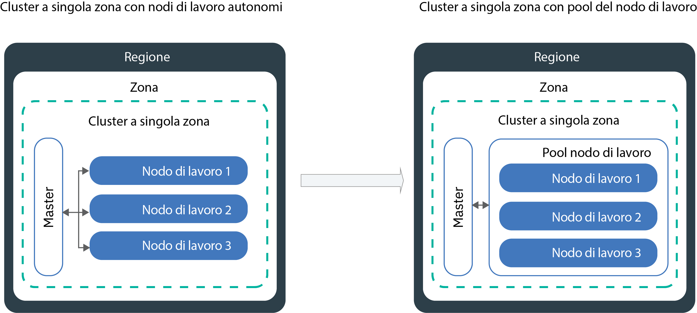

---

copyright:
  years: 2014, 2019
lastupdated: "2019-06-12"

keywords: kubernetes, iks

subcollection: containers

---

{:new_window: target="_blank"}
{:shortdesc: .shortdesc}
{:screen: .screen}
{:pre: .pre}
{:table: .aria-labeledby="caption"}
{:codeblock: .codeblock}
{:tip: .tip}
{:note: .note}
{:important: .important}
{:deprecated: .deprecated}
{:download: .download}
{:preview: .preview}


# Aggiornamento di cluster, nodi di lavoro e componenti del cluster
{: #update}

Puoi installare gli aggiornamenti per mantenere aggiornati i tuoi cluster Kubernetes in {{site.data.keyword.containerlong}}.
{:shortdesc}

## Aggiornamento del master Kubernetes
{: #master}

Periodicamente, Kubernetes rilascia [aggiornamenti principali, secondari o patch](/docs/containers?topic=containers-cs_versions#version_types). Gli aggiornamenti possono influire sulla versione del server API Kubernetes o su altri componenti nel tuo master Kubernetes. IBM aggiorna la versione patch, ma devi aggiornare la versione principale e quella secondaria del master.
{:shortdesc}

**Come posso sapere quando aggiornare il master?**</br>
Riceverai una notifica nella console e nella CLI {{site.data.keyword.Bluemix_notm}} nel momento in cui saranno disponibili aggiornamenti e inoltre potrai controllare la nostra pagina delle [versioni supportate](/docs/containers?topic=containers-cs_versions).

**Quante versioni precedenti alla più recente sono supportate dal master?**</br>
IBM generalmente supporta tre versioni di Kubernetes alla volta. Puoi aggiornare il server API Kubernetes a non più di due versioni precedenti a quella corrente.

Ad esempio, se la versione corrente del server API Kubernetes è 1.11 e vuoi aggiornare alla 1.14, devi prima aggiornare alla 1.12.

Se il tuo cluster esegue una versione non supportata di Kubernetes, segui le [istruzionisull'archivio delle versioni](/docs/containers?topic=containers-cs_versions#k8s_version_archive). Per evitare di arrivare a uno stato non supportato e a un impatto operativo, mantieni aggiornato il tuo cluster.

**Sui miei nodi di lavoro posso utilizzare una versione successiva a quella del master?**</br>
I tuoi nodi di lavoro non possono eseguire una versione Kubernetes `major.minor` successiva rispetto a quella master. Per prima cosa, [aggiorna il tuo master](#update_master) alla versione Kubernetes più recente. Poi, [aggiorna i nodi di lavoro](#worker_node) nel tuo cluster.

I nodi di lavoro possono eseguire versioni patch successive rispetto al master, ad esempio versioni patch specifiche per i nodi di lavoro per gli aggiornamenti di sicurezza.

**Come vengono applicati gli aggiornamenti patch?**</br>
Per impostazione predefinita, gli aggiornamenti patch per il master vengono applicati automaticamente nel corso di diversi giorni, pertanto una versione della patch master potrebbe essere disponibile prima che venga applicata al tuo master. L'automazione degli aggiornamenti ignora anche i cluster che si trovano in uno stato non integro o che hanno operazioni attualmente in corso. Occasionalmente, IBM potrebbe disabilitare gli aggiornamenti automatici per uno specifico fix pack del master, ad esempio una patch che è necessaria solo se un master viene aggiornato da una versione secondaria a un'altra. In questi casi, puoi [controllare il changelog delle versioni](/docs/containers?topic=containers-changelog) per eventuali impatti e scegliere di utilizzare tranquillamente il [comando](/docs/containers?topic=containers-cli-plugin-kubernetes-service-cli#cs_cluster_update) `ibmcloud ks cluster-update` senza attendere l'applicazione dell'automazione degli aggiornamenti.

A differenza del master, devi aggiornare i tuoi nodi di lavoro per ogni versione patch.

**Cosa accade durante l'aggiornamento del master?**</br>
Nei cluster che eseguono Kubernetes versione 1.11 o successive, il tuo master è altamente disponibile con tre pod master di replica. I pod master hanno un aggiornamento continuo, durante il quale solo un pod alla volta non è disponibile. Due istanze sono attive e in esecuzione in modo che tu possa accedere e modificare il cluster durante l'aggiornamento. I nodi di lavoro, le applicazioni e le risorse continuano ad essere in esecuzione.

Per i cluster che eseguono le versioni precedenti di Kubernetes, quando aggiorni il server API Kubernetes, tale server resta inattivo per circa 5-10 minuti. Durante l'aggiornamento, non è possibile accedere o modificare il cluster. Tuttavia, i nodi di lavoro, le applicazioni e le risorse che gli utenti del cluster hanno distribuito non vengono modificate e continuano ad essere eseguite.

**Posso eseguire il rollback dell'aggiornamento?**</br>
No, non puoi eseguire il rollback di un cluster ad una versione precedente una volta eseguito il processo di aggiornamento. Assicurati di utilizzare un cluster di test e segui le istruzioni per risolvere i problemi potenziali prima di aggiornare il tuo master di produzione.

**Quale processo posso seguire per aggiornare il master?**</br>
Il seguente diagramma illustra il processo che puoi seguire per aggiornare il tuo master.


Figura 1. Diagramma del processo di aggiornamento del master Kubernetes

{: #update_master}
Prima di iniziare, assicurati di disporre del [ruolo della piattaforma {{site.data.keyword.Bluemix_notm}} IAM **Operatore** o **Amministratore**](/docs/containers?topic=containers-users#platform).

Per aggiornare la versione _principale_ o _secondaria_ del master Kubernetes:

1.  Controlla le [modifiche Kubernetes](/docs/containers?topic=containers-cs_versions) ed effettua tutti gli aggiornamenti contrassegnati come _Aggiorna prima master_.

2.  Aggiorna il tuo server API Kubernetes e i componenti master Kubernetes associati utilizzando la [console {{site.data.keyword.Bluemix_notm}}](https://cloud.ibm.com/login) o eseguendo il [comando](/docs/containers?topic=containers-cli-plugin-kubernetes-service-cli#cs_cluster_update) della CLI `ibmcloud ks cluster-update`.

3.  Attendi alcuni minuti, quindi conferma che l'aggiornamento è stato completato. Controlla la versione del server API Kubernetes nel dashboard dei cluster {{site.data.keyword.Bluemix_notm}} o esegui `ibmcloud ks clusters`.

4.  Installa la versione della [`cli kubectl`](/docs/containers?topic=containers-cs_cli_install#kubectl) che corrisponde alla versione del server API Kubernetes eseguita nel master Kubernetes. [Kubernetes non supporta ](https://kubernetes.io/docs/setup/version-skew-policy/) le versioni client `kubectl` che precedono o seguono di oltre due versioni quella del server (n +/- 2).

Una volta completato l'aggiornamento del server API Kubernetes, puoi aggiornare i tuoi nodi di lavoro.

<br />


## Aggiornamento dei nodi di lavoro
{: #worker_node}

Hai ricevuto una notifica per aggiornare i tuoi nodi di lavoro. Cosa significa? Man mano che gli aggiornamenti e le patch di sicurezza vengono implementati per il server API Kubernetes e altri componenti master di Kubernetes, devi assicurati che i nodi di lavoro rimangano sincronizzati.
{: shortdesc}

**Cosa accade alle mie applicazioni durante un aggiornamento?**</br>
Se esegui le applicazioni come parte di una distribuzione su nodi di lavoro che hai aggiornato, le applicazioni verranno ripianificate su altri nodi di lavoro nel cluster. Questi nodi di lavoro potrebbero trovarsi in un pool di nodi di lavoro diverso oppure, se hai nodi di lavoro autonomi, le applicazioni potrebbero essere pianificate su nodi di lavoro autonomi. Per evitare un periodo di inattività per la tua applicazione, devi assicurarti di disporre di capacità sufficiente nel cluster per sostenere il carico di lavoro.

**In che modo posso controllare quanti nodi di lavoro vengono disabilitati alla volta durante l'aggiornamento?**</br>
Se tutti i tuoi nodi di lavoro devono essere attivi e in esecuzione, prendi in considerazione il [ridimensionamento del tuo pool di nodi di lavoro](/docs/containers?topic=containers-cli-plugin-kubernetes-service-cli#cs_worker_pool_resize) oppure l'[aggiunta di nodi di lavoro autonomi](/docs/containers?topic=containers-cli-plugin-kubernetes-service-cli#cs_worker_add) per aggiungere altri nodi di lavoro. Puoi rimuovere i nodi di lavoro aggiuntivi una volta completato l'aggiornamento.

Inoltre, puoi creare una mappa di configurazione Kubernetes che specifichi il numero massimo di nodi di lavoro non disponibili alla volta durante l'aggiornamento. I nodi di lavoro vengono identificati dalle etichette del nodo di lavoro. Puoi utilizzare le etichette fornite da IBM oppure le etichette personalizzate che hai aggiunto al nodo di lavoro.

**Cosa accade se scelgo di non definire una mappa di configurazione?**</br>
Quando la mappa di configurazione non è definita, viene utilizzato il valore predefinito. Per impostazione predefinita, un massimo del 20% di tutti i nodi di lavoro in ciascun cluster può non essere disponibile durante il processo di aggiornamento.

**Prima di iniziare**:
- [Accedi al tuo account. Se applicabile, specifica il gruppo di risorse appropriato. Imposta il contesto per il tuo cluster.](/docs/containers?topic=containers-cs_cli_install#cs_cli_configure)
- [Aggiorna il master Kubernetes](#master). La versione Kubernetes del nodo di lavoro non può essere superiore alla versione del server API Kubernetes che viene eseguita nel master Kubernetes.
- Apporta tutte le modifiche contrassegnate con _Aggiorna dopo il master_ in [Modifiche Kubernetes](/docs/containers?topic=containers-cs_versions).
- Se vuoi applicare un aggiornamento della patch, esamina il [changelog della versione Kubernetes](/docs/containers?topic=containers-changelog#changelog).
- Assicurati di disporre del [ruolo della piattaforma {{site.data.keyword.Bluemix_notm}} IAM **Operatore** o **Amministratore**](/docs/containers?topic=containers-users#platform). </br>

Gli aggiornamenti ai nodi di lavoro possono causare tempi di inattività per applicazioni e servizi. L'immagine della macchina del nodo di lavoro viene ricreata e i dati vengono eliminati se non sono [archiviati al di fuori del pod](/docs/containers?topic=containers-storage_planning#persistent_storage_overview).
{: important}

{: #worker-up-configmap}
**Per creare una mappa di configurazione e aggiornare i nodi di lavoro**:

1.  Elenca i nodi di lavoro e prendi nota del loro indirizzo IP privato.

    ```
    ibmcloud ks workers --cluster <cluster_name_or_ID>
    ```
    {: pre}

2. Visualizza le etichette di un nodo di lavoro. Puoi trovare le etichette del nodo di lavoro nella sezione **Labels** del tuo output della CLI. Ogni etichetta è formata da un `NodeSelectorKey` e da un `NodeSelectorValue`.
   ```
   kubectl describe node <private_worker_IP>
   ```
   {: pre}

   Output di esempio:
   ```
   Name:               10.184.58.3
   Roles:              <none>
   Labels:             arch=amd64
                    beta.kubernetes.io/arch=amd64
                    beta.kubernetes.io/os=linux
                    failure-domain.beta.kubernetes.io/region=us-south
                    failure-domain.beta.kubernetes.io/zone=dal12
                    ibm-cloud.kubernetes.io/encrypted-docker-data=true
                    ibm-cloud.kubernetes.io/iaas-provider=softlayer
                    ibm-cloud.kubernetes.io/machine-type=u3c.2x4.encrypted
                    kubernetes.io/hostname=10.123.45.3
                    privateVLAN=2299001
                    publicVLAN=2299012
   Annotations:        node.alpha.kubernetes.io/ttl=0
                    volumes.kubernetes.io/controller-managed-attach-detach=true
   CreationTimestamp:  Tue, 03 Apr 2018 15:26:17 -0400
   Taints:             <none>
   Unschedulable:      false
   ```
   {: screen}

3. Crea una mappa di configurazione e definisci le regole di non disponibilità per i tuoi nodi di lavoro. Il seguente esempio mostra quattro controlli, `zonecheck.json`, `regioncheck.json`, `defaultcheck.json` e un template di controllo. Puoi utilizzare questi controlli di esempio per definire le regole per i nodi di lavoro in una specifica zona (`zonecheck.json`), regione (`regioncheck.json`) o per tutti i nodi di lavoro che non corrispondono a nessuno dei controlli che hai definito nella mappa di configurazione (`defaultcheck.json`). Usa questo template di controllo per creare il tuo controllo. Per ogni controllo, per identificare un nodo di lavoro, devi scegliere una delle etichette del nodo di lavoro che hai richiamato nel passo precedente.  

   Per ogni controllo, puoi impostare solo un valore per <code>NodeSelectorKey</code> e <code>NodeSelectorValue</code>. Se vuoi impostare le regole per più di una regione, zona o altre etichette del nodo di lavoro, crea un nuovo controllo. Definisci massimo 10 controlli in una mappa di configurazione. Se aggiungi altri controlli, verranno ignorati.
   {: note}

   Esempio:
   ```
   apiVersion: v1
    kind: ConfigMap
    metadata:
      name: ibm-cluster-update-configuration
      namespace: kube-system
    data:
     drain_timeout_seconds: "120"
     zonecheck.json: |
       {
        "MaxUnavailablePercentage": 30,
        "NodeSelectorKey": "failure-domain.beta.kubernetes.io/zone",
        "NodeSelectorValue": "dal13"
      }
    regioncheck.json: |
       {
        "MaxUnavailablePercentage": 20,
        "NodeSelectorKey": "failure-domain.beta.kubernetes.io/region",
        "NodeSelectorValue": "us-south"
      }
    defaultcheck.json: |
       {
        "MaxUnavailablePercentage": 20
      }
    <check_name>: |
      {
        "MaxUnavailablePercentage": <value_in_percentage>,
        "NodeSelectorKey": "<node_selector_key>",
        "NodeSelectorValue": "<node_selector_value>"
      }
   ```
   {: codeblock}

   <table summary="La prima riga nella tabella si estende su entrambe le colonne. Le rimanenti righe devono essere lette da sinistra a destra, con il parametro nella colonna uno e la descrizione corrispondente nella colonna due.">
   <caption>Componenti della mappa di configurazione</caption>
    <thead>
      <th colspan=2> Descrizione dei componenti </th>
    </thead>
    <tbody>
      <tr>
        <td><code>drain_timeout_seconds</code></td>
        <td> Facoltativo: il timeout in secondi di attesa per il completamento dello [svuotamento ](https://kubernetes.io/docs/tasks/administer-cluster/safely-drain-node/). Lo svuotamento in sicurezza di un nodo di lavoro rimuove tutti i pod esistenti dal nodo di lavoro e ripianifica i pod su altri nodi di lavoro nel cluster. I valori accettati sono numeri interi compresi tra 1 e 180. Il valore predefinito è 30.</td>
      </tr>
      <tr>
        <td><code>zonecheck.json</code></br><code>regioncheck.json</code></td>
        <td>Due controlli che definiscono una regola per una serie di nodi di lavoro che puoi identificare con i valori <code>NodeSelectorKey</code> e <code>NodeSelectorValue</code> specificati. <code>zonecheck.json</code> identifica i nodi di lavoro in base alla loro etichetta di zona e <code>regioncheck.json</code> usa l'etichetta della regione che viene aggiunta ad ogni nodo di lavoro durante il provisioning. Nell'esempio, durante l'aggiornamento, può essere non disponibile il 30% di tutti i nodi di lavoro che hanno <code>dal13</code> come etichetta di zona e il 20% di tutti i nodi di lavoro presenti in <code>us-south</code>.</td>
      </tr>
      <tr>
        <td><code>defaultcheck.json</code></td>
        <td>Se non crei una mappa di configurazione oppure la mappa viene configurata in modo errato, viene applicato il valore predefinito Kubernetes. Per impostazione predefinita, solo il 20% dei nodi di lavoro del cluster può essere non disponibile alla volta. Puoi sovrascrivere il valore predefinito aggiungendo il controllo predefinito alla tua mappa di configurazione. Nell'esempio, ogni nodo di lavoro che non è specificato nei controlli di zona e regione (<code>dal13</code> o <code>us-south</code>) può essere non disponibile durante l'aggiornamento. </td>
      </tr>
      <tr>
        <td><code>MaxUnavailablePercentage</code></td>
        <td>Il numero massimo di nodi che possono essere non disponibili per un valore e una chiave etichetta specificati, espresso come percentuale. Un nodo di lavoro è non disponibile durante il processo di distribuzione, ricaricamento o provisioning. I nodi di lavoro in coda sono bloccati dall'essere aggiornati se superano le percentuali di non disponibilità massime definite. </td>
      </tr>
      <tr>
        <td><code>NodeSelectorKey</code></td>
        <td>La chiave di etichetta del nodo di lavoro per il quale vuoi impostare una regola. Puoi impostare regole per le etichette predefinite fornite da IBM, così come per le etichette del nodo di lavoro che hai creato. <ul><li>Se vuoi aggiungere una regola per i nodi di lavoro che appartengono ad un pool di nodi di lavoro, puoi usare l'etichetta <code>ibm-cloud.kubernetes.io/machine-type</code>. </li><li> Se hai più di un pool di nodi di lavoro con lo stesso tipo di macchina, usa un'etichetta personalizzata. </li></ul></td>
      </tr>
      <tr>
        <td><code>NodeSelectorValue</code></td>
        <td>Il valore dell'etichetta che deve essere tenuto in considerazione dal nodo di lavoro per la regola che hai definito. </td>
      </tr>
    </tbody>
   </table>

4. Crea la mappa di configurazione nel tuo cluster.
   ```
   kubectl apply -f <filepath/configmap.yaml>
   ```
   {: pre}

5.  Verifica che la mappa di configurazione sia stata creata.
    ```
    kubectl get configmap --namespace kube-system
    ```
    {: pre}

6.  Aggiorna i nodi di lavoro.

    ```
    ibmcloud ks worker-update --cluster <cluster_name_or_ID> --workers <worker_node1_ID> <worker_node2_ID>
    ```
    {: pre}

7. Facoltativo: verifica gli eventi che vengono attivati dalla mappa di configurazione e tutti gli errori di convalida che si verificano. Gli eventi possono essere esaminati nella sezione **Events** dell'output della tua CLI.
   ```
   kubectl describe -n kube-system cm ibm-cluster-update-configuration
   ```
   {: pre}

8. Conferma che l'aggiornamento è stato completato controllando la versione Kubernetes dei tuoi nodi di lavoro.  
   ```
   kubectl get nodes
   ```
   {: pre}

9. Verifica di non avere nodi di lavoro duplicati. In alcuni casi, i cluster meno recenti possono elencare nodi di lavoro duplicati con uno stato di **`Non pronto`** dopo un aggiornamento. Per rimuovere i duplicati, consulta [risoluzione dei problemi](/docs/containers?topic=containers-cs_troubleshoot_clusters#cs_duplicate_nodes).

Passi successivi:
-   Ripeti il processo di aggiornamento con gli altri pool di nodi di lavoro.
-   Avvisa gli sviluppatori che lavorano nel cluster di aggiornare la loro CLI `kubectl` alla versione del master Kubernetes.
-   Se il dashboard Kubernetes non visualizza i grafici di utilizzo, [elimina il pod `kube-dashboard`](/docs/containers?topic=containers-cs_troubleshoot_health#cs_dashboard_graphs).


### Aggiornamento dei nodi di lavoro nella console
{: #worker_up_console}

Dopo aver configurato la mappa di configurazione per la prima volta, puoi poi aggiornare i nodi di lavoro utilizzando la console {{site.data.keyword.Bluemix_notm}}.
{: shortdesc}

Prima di iniziare:
*   [Imposta una mappa di configurazione](#worker_node) per controllare come vengono aggiornati i tuoi nodi di lavoro.
*   [Aggiorna il master Kubernetes](#master). La versione Kubernetes del nodo di lavoro non può essere superiore alla versione del server API Kubernetes che viene eseguita nel master Kubernetes.
*   Apporta tutte le modifiche contrassegnate con _Aggiorna dopo il master_ in [Modifiche Kubernetes](/docs/containers?topic=containers-cs_versions).
*   Se vuoi applicare un aggiornamento della patch, esamina il [changelog della versione Kubernetes](/docs/containers?topic=containers-changelog#changelog).
*   Assicurati di disporre del [ruolo della piattaforma {{site.data.keyword.Bluemix_notm}} IAM **Operatore** o **Amministratore**](/docs/containers?topic=containers-users#platform). </br>

Gli aggiornamenti ai nodi di lavoro possono causare tempi di inattività per applicazioni e servizi. L'immagine della macchina del nodo di lavoro viene ricreata e i dati vengono eliminati se non sono [archiviati al di fuori del pod](/docs/containers?topic=containers-storage_planning#persistent_storage_overview).
{: important}

Per aggiornare i nodi di lavoro dalla console:
1.  Dal menu della [console {{site.data.keyword.Bluemix_notm}}](https://cloud.ibm.com/) , fai clic su **Kubernetes**.
2.  Dalla pagina **Cluster**, fai clic sul tuo cluster.
3.  Dalla scheda **Nodi di lavoro**, seleziona la casella di spunta per ciascun nodo di lavoro che desideri aggiornare. Viene visualizzata una barra delle azioni sulla riga dell'intestazione della tabella.
4.  Dalla barra delle azioni, fai clic su **Aggiorna Kubernetes**.

<br />


## Aggiornamento dei tipi di macchina
{: #machine_type}

Puoi aggiornare i tipi di macchina dei tuoi nodi di lavoro aggiungendo nuovi nodi di lavoro e rimuovendo quelli vecchi. Ad esempio, se il tuo cluster ha tipi di nodo di lavoro `x1c` o Ubuntu 16 `x2c` precedenti obsoleti, crea nodi di lavoro Ubuntu 18 che utilizzano tipi di macchina con `x3c` nei nomi.
{: shortdesc}

Prima di iniziare:
- [Accedi al tuo account. Se applicabile, specifica il gruppo di risorse appropriato. Imposta il contesto per il tuo cluster.](/docs/containers?topic=containers-cs_cli_install#cs_cli_configure)
- Se archivi i dati nel tuo nodo di lavoro, i dati vengono eliminati se non [archiviati all'esterno del nodo di lavoro](/docs/containers?topic=containers-storage_planning#persistent_storage_overview).
- Assicurati di disporre del [ruolo della piattaforma {{site.data.keyword.Bluemix_notm}} IAM **Operatore** o **Amministratore**](/docs/containers?topic=containers-users#platform).

Per aggiornare i tipi di macchina:

1. Elenca i nodi di lavoro e prendi nota del loro indirizzo IP privato.
   - **Per i nodi di lavoro in un pool di nodi di lavoro**:
     1. Elenca i pool di nodi di lavoro disponibili nel tuo cluster.
        ```
        ibmcloud ks worker-pools --cluster <cluster_name_or_ID>
        ```
        {: pre}

     2. Elenca i nodi di lavoro nel pool di nodi di lavoro.
        ```
        ibmcloud ks workers --cluster <cluster_name_or_ID> --worker-pool <pool_name>
        ```
        {: pre}

     3. Ottieni i dettagli per un nodo di lavoro e prendi nota della zona, dell'ID VLAN privata e di quello della VLAN pubblica.
        ```
        ibmcloud ks worker-get --cluster <cluster_name_or_ID> --worker <worker_ID>
        ```
        {: pre}

   - **Obsoleto: per i nodi di lavoro autonomi**:
     1. Elenca i nodi di lavoro disponibili.
        ```
        ibmcloud ks workers --cluster <cluster_name_or_ID>
        ```
        {: pre}

     2. Ottieni i dettagli per un nodo di lavoro e prendi nota della zona, dell'ID VLAN privata e di quello della VLAN pubblica.
        ```
        ibmcloud ks worker-get --cluster <cluster_name_or_ID> --worker <worker_ID>
        ```
        {: pre}

2. Elenca i tipi di macchina disponibili nella zona.
   ```
   ibmcloud ks machine-types <zone>
   ```
   {: pre}

3. Crea un nodo di lavoro con il nuovo tipo di macchina.
   - **Per i nodi di lavoro in un pool di nodi di lavoro**:
     1. Crea un pool di nodi di lavoro con il numero di nodi di lavoro che vuoi sostituire.
        ```
        ibmcloud ks worker-pool-create --name <pool_name> --cluster <cluster_name_or_ID> --machine-type <machine_type> --size-per-zone <number_of_workers_per_zone>
        ```
        {: pre}

     2. Verifica che il pool di nodi di lavoro sia stato creato.
        ```
        ibmcloud ks worker-pools --cluster <cluster_name_or_ID>
        ```
        {: pre}

     3. Aggiungi la zona al pool di nodi di lavoro che hai richiamato in precedenza. Quando aggiungi una zona, viene eseguito il provisioning dei nodi di lavoro definiti nel tuo pool di nodi di lavoro nella zona e vengono considerati per una pianificazione futura del carico di lavoro. Se vuoi estendere i tuoi nodi di lavoro tra più zone, scegli una [zona che supporta il multizona](/docs/containers?topic=containers-regions-and-zones#zones).
        ```
        ibmcloud ks zone-add --zone <zone> --cluster <cluster_name_or_ID> --worker-pools <pool_name> --private-vlan <private_VLAN_ID> --public-vlan <public_VLAN_ID>
        ```
        {: pre}

   - **Obsoleto: per i nodi di lavoro autonomi**:
       ```
       ibmcloud ks worker-add --cluster <cluster_name> --machine-type <machine_type> --workers <number_of_worker_nodes> --private-vlan <private_VLAN_ID> --public-vlan <public_VLAN_ID>
       ```
       {: pre}

4. Attendi che i nodi di lavoro vengano distribuiti.
   ```
   ibmcloud ks workers --cluster <cluster_name_or_ID>
   ```
   {: pre}

   Quando lo stato del nodo di lavoro diventa **Normal**, la distribuzione è terminata.

5. Rimuovi il nodo di lavoro obsoleto. **Nota**: se rimuovi un tipo di macchina con fatturazione mensile (ad esempio, bare metal), ti viene addebitato l'intero mese.
   - **Per i nodi di lavoro in un pool di nodi di lavoro**:
     1. Rimuovi il pool di nodi di lavoro con il tipo di macchina obsoleto. La rimozione di un pool di nodi di lavoro rimuove tutti i nodi di lavoro nel pool in tutte le zone. Il completamento di questo processo potrebbe impiegare alcuni minuti.
        ```
        ibmcloud ks worker-pool-rm --worker-pool <pool_name> --cluster <cluster_name_or_ID>
        ```
        {: pre}

     2. Verifica che il pool di nodi di lavoro sia stato rimosso.
        ```
        ibmcloud ks worker-pools --cluster <cluster_name_or_ID>
        ```
        {: pre}

   - **Obsoleto: per i nodi di lavoro autonomi**:
      ```
      ibmcloud ks worker-rm --cluster <cluster_name> --worker <worker_node>
      ```
      {: pre}

6. Verifica che i nodi di lavoro siano stati rimossi dal tuo cluster.
   ```
   ibmcloud ks workers --cluster <cluster_name_or_ID>
   ```
   {: pre}

7. Ripeti questi passi per aggiornare gli altri pool di nodi di lavoro o nodi di lavoro autonomi in tipi di macchine differenti

## Aggiornamento dei componenti del cluster
{: #components}

Il tuo cluster {{site.data.keyword.containerlong_notm}} viene fornito con dei componenti, come Fluentd per la registrazione, che vengono installati automaticamente quando esegui il provisioning del cluster. Per impostazione predefinita, questi componenti vengono aggiornati automaticamente da IBM. Tuttavia, puoi disabilitare gli aggiornamenti per alcuni componenti aggiuntivi e aggiornarli manualmente e separatamente dai nodi master e di lavoro.
{: shortdesc}

**Quali componenti predefiniti posso aggiornare separatamente dal cluster?**</br>
Puoi disabilitare facoltativamente gli aggiornamenti automatici per i seguenti componenti:
* [Fluentd per la registrazione](#logging-up)
* [ALB (application load balancer) Ingress](#alb)

**Ci sono componenti che non posso aggiornare separatamente dal cluster?**</br>

Sì. Il tuo cluster viene distribuito con i seguenti componenti gestiti e risorse associate che non possono essere modificati, ad eccezione per ridimensionare i pod o modificare le mappe di configurazione per determinati vantaggi in termini di prestazioni. Se provi a modificare uno di questi componenti di distribuzione, le loro impostazioni originali vengono ripristinate a intervalli regolari.

* `coredns`
* `coredns-autoscaler`
* `heapster`
* `ibm-file-plugin`
* `ibm-storage-watcher`
* `ibm-keepalived-watcher`
* `kube-dns-amd64`
* `kube-dns-autoscaler`
* `kubernetes-dashboard`
* `metrics-server`
* `vpn`

Puoi visualizzare queste risorse utilizzando l'etichetta `addonmanager.kubernetes.io/mode: Reconcile`. Ad esempio:

```
kubectl get deployments --all-namespaces -l addonmanager.kubernetes.io/mode=Reconcile
```
{: pre}

**Posso installare altri plug-in o componenti aggiuntivi oltre a quelli predefiniti?**</br>
Sì. {{site.data.keyword.containerlong_notm}} fornisce altri plug-in e componenti aggiuntivi tra cui puoi scegliere per aggiungere funzionalità al tuo cluster. Ad esempio, potresti voler [utilizzare i grafici Helm](/docs/containers?topic=containers-helm#public_helm_install) per installare il [plug-in dell'archiviazione blocchi](/docs/containers?topic=containers-block_storage#install_block) o il servizio [VPN strongSwan](/docs/containers?topic=containers-vpn#vpn-setup). Oppure, potresti voler abilitare nel tuo cluster i componenti aggiuntivi gestiti di IBM, quali [Istio](/docs/containers?topic=containers-istio) o [Knative](/docs/containers?topic=containers-serverless-apps-knative). Devi aggiornare questi grafici Helm e componenti aggiuntivi separatamente, seguendo le istruzioni fornite nei file readme dei grafici Helm o la procedura per [aggiornare i componenti aggiuntivi gestiti](/docs/containers?topic=containers-managed-addons#updating-managed-add-ons).

### Gestione degli aggiornamenti automatici per Fluentd
{: #logging-up}

Per modificare le configurazioni della registrazione o del filtraggio, la versione del componente Fluentd deve essere la più recente. Per impostazione predefinita, gli aggiornamenti automatici per il componente sono abilitati.
{: shortdesc}

Puoi gestire gli aggiornamenti automatici del componente Fluentd nei seguenti modi. **Nota**: per eseguire questi comandi, devi disporre del [ruolo della piattaforma {{site.data.keyword.Bluemix_notm}} IAM **Amministratore**](/docs/containers?topic=containers-users#platform) per il cluster.

* Controlla se gli aggiornamenti automatici sono abilitati eseguendo il [comando](/docs/containers?topic=containers-cli-plugin-kubernetes-service-cli#cs_log_autoupdate_get) `ibmcloud ks logging-autoupdate-get --cluster <cluster_name_or_ID>`.
* Disabilita gli aggiornamenti automatici eseguendo il [comando](/docs/containers?topic=containers-cli-plugin-kubernetes-service-cli#cs_log_autoupdate_disable) `ibmcloud ks logging-autoupdate-disable`.
* Se gli aggiornamenti automatici sono disabilitati, ma hai bisogno di cambiare la tua configurazione, hai due opzioni:
    * Attiva gli aggiornamenti automatici per i tuoi pod Fluentd.
        ```
        ibmcloud ks logging-autoupdate-enable --cluster <cluster_name_or_ID>
        ```
        {: pre}
    * Forza un aggiornamento una tantum quando usi un comando di registrazione che include l'opzione `--force-update`. **Nota**: i tuoi pod vengono aggiornati alla versione più recente del componente Fluentd, ma Fluentd non viene aggiornato automaticamente andando avanti.
        Comando di esempio:

        ```
        ibmcloud ks logging-config-update --cluster <cluster_name_or_ID> --id <log_config_ID> --type <log_type> --force-update
        ```
        {: pre}

### Gestione degli aggiornamenti automatici per gli ALB Ingress
{: #alb}

Controlla quando viene aggiornato il componente ALB (application load balancer) Ingress.
{: shortdesc}

Quando il componente ALB Ingress viene aggiornato, i contenitori `nginx-ingress` e `ingress-auth` di tutti i pod ALB vengono aggiornati all'ultima versione di build. Per impostazione predefinita, gli aggiornamenti automatici per gli ALB sono abilitati. Gli aggiornamenti vengono eseguiti su base continuativa in modo che i tuoi ALB Ingress non subiscano tempi di inattività.

Se disabiliti gli aggiornamenti automatici, devi occuparti manualmente dell'aggiornamento degli ALB. Man mano che gli aggiornamenti diventano disponibili, ricevi una notifica nella CLI quando esegui i comandi `ibmcloud ks albs` o `alb-autoupdate-get`.

Quando aggiorni la versione Kubernetes principale o secondaria del tuo cluster, IBM apporta automaticamente le modifiche necessarie alla distribuzione di Ingress, ma non modifica la versione di build dei tuoi ALB Ingress. Devi occuparti di verificare la compatibilità delle ultime versioni di Kubernetes e delle immagini dei tuoi ALB Ingress.
{: note}

Prima di iniziare:

1. Verifica che i tuoi ALB siano in esecuzione.
    ```
    ibmcloud ks albs
    ```
    {: pre}

2. Controlla lo stato degli aggiornamenti automatici per il componente ALB Ingress.
    ```
    ibmcloud ks alb-autoupdate-get --cluster <cluster_name_or_ID>
    ```
    {: pre}

    Output di esempio quando gli aggiornamenti automatici sono abilitati:
    ```
    Retrieving automatic update status of application load balancer (ALB) pods in cluster mycluster...
    OK
    Automatic updates of the ALB pods are enabled in cluster mycluster
    ALBs are at the latest version in cluster mycluster
    ```
    {: screen}

    Output di esempio quando gli aggiornamenti automatici sono disabilitati:
    ```
    Retrieving automatic update status of application load balancer (ALB) pods in cluster mycluster...
    OK
    Automatic updates of the ALB pods are disabled in cluster mycluster
    ALBs are not at the latest version in cluster mycluster. To view the current version, run 'ibmcloud ks albs'.
    ```
    {: screen}

3. Verifica la versione di **Build** corrente dei tuoi pod ALB.
    ```
    ibmcloud ks albs --cluster <cluster_name_or_ID>
    ```
    {: pre}

    Output di esempio:
    ```
    ALB ID                                            Enabled   Status     Type      ALB IP          Zone    Build                           ALB VLAN ID
    private-crdf253b6025d64944ab99ed63bb4567b6-alb2   false     disabled   private   10.xxx.xx.xxx   dal10   ingress:411/ingress-auth:315*   2234947
    public-crdf253b6025d64944ab99ed63bb4567b6-alb2    true      enabled    public    169.xx.xxx.xxx  dal10   ingress:411/ingress-auth:315*   2234945

    * An update is available for the ALB pods. Review any potentially disruptive changes for the latest version before you update: https://cloud.ibm.com/docs/containers?topic=containers-update#alb
    ```
    {: screen}

Puoi gestire gli aggiornamenti automatici del componente ALB Ingress nei seguenti modi. **Nota**: per eseguire questi comandi, devi disporre del [ruolo della piattaforma {{site.data.keyword.Bluemix_notm}} IAM **Editor** o **Amministratore**](/docs/containers?topic=containers-users#platform) per il cluster.
* Disabilita gli aggiornamenti automatici.
    ```
    ibmcloud ks alb-autoupdate-disable --cluster <cluster_name_or_ID>
    ```
    {: pre}
* Aggiorna manualmente i tuoi ALB Ingress.
    1. Se è disponibile un aggiornamento e vuoi aggiornare i tuoi ALB, per prima cosa controlla il [changelog per l'ultima versione del componente ALB Ingress](/docs/containers?topic=containers-cluster-add-ons-changelog#alb_changelog) per verificare eventuali modifiche con potenziale interruzione del servizio.
    2. Forza un aggiornamento una tantum dei tuoi pod ALB. Tutti i pod ALB nel cluster vengono aggiornati all'ultima versione di build. Non puoi aggiornare un singolo ALB o scegliere a quale build aggiornare gli ALB. Gli aggiornamenti automatici rimangono disabilitati.
        ```
        ibmcloud ks alb-update --cluster <cluster_name_or_ID>
        ```
        {: pre}
* Se i tuoi pod ALB sono stati aggiornati di recente, ma una configurazione personalizzata per gli ALB è interessata dall'ultima build, puoi eseguire il rollback dell'aggiornamento alla build in cui i tuoi pod ALB erano precedentemente in esecuzione. **Nota**: dopo aver eseguito il rollback di un aggiornamento, gli aggiornamenti automatici per i pod ALB sono disabilitati.
    ```
    ibmcloud ks alb-rollback --cluster <cluster_name_or_ID>
    ```
    {: pre}
* Riabilita gli aggiornamenti automatici. Ogni volta che diventa disponibile la build successiva, i pod ALB vengono aggiornati automaticamente all'ultima build.
    ```
    ibmcloud ks alb-autoupdate-enable --cluster <cluster_name_or_ID>
    ```
    {: pre}

<br />


## Aggiornamento di componenti aggiuntivi gestiti
{: #addons}

I componenti aggiuntivi {{site.data.keyword.containerlong_notm}} gestiti rappresentano un modo facile per migliorare il tuo cluster con funzionalità open source, quali Istio o Knative. La versione dello strumento open source che aggiungi al tuo cluster viene testata da IBM e approvata perl'uso in {{site.data.keyword.containerlong_notm}}. Per aggiornare alle ultime versioni i componenti aggiuntivi gestiti che hai abilitato nel tuo cluster, vedi [Aggiornamento di componenti aggiuntivi gestiti](/docs/containers?topic=containers-managed-addons#updating-managed-add-ons).

## Aggiornamento dai nodi di lavoro autonomi ai pool di nodi di lavoro
{: #standalone_to_workerpool}

Con l'introduzione dei cluster multizona, i nodi di lavoro con la stessa configurazione, ad esempio il tipo di macchina, vengono raggruppati in pool di nodi di lavoro. Quando crei un nuovo cluster, viene creato automaticamente per te un pool di nodi di lavoro denominato `default`.
{: shortdesc}

Puoi usare i pool di nodi di lavoro per estendere uniformemente i nodi di lavoro tra le zone e creare un cluster bilanciato. I cluster bilanciati sono più disponibili e resilienti ai malfunzionamenti. Se un nodo di lavoro viene rimosso da una zona, puoi ribilanciare il pool di nodi di lavoro ed eseguire automaticamente il provisioning di nuovi nodi di lavoro in tale zona. I pool di nodi di lavoro vengono usati anche per installare gli aggiornamenti della versione di Kubernetes in tutti i tuoi nodi di lavoro.  

Se hai creato dei cluster prima che diventassero disponibili quelli multizona, i tuoi nodi di lavoro saranno ancora di tipo autonomo e non verranno raggruppati automaticamente in pool di nodi di lavoro. Devi aggiornare questi cluster per utilizzare i pool di nodi di lavoro. Se non esegui l'aggiornamento, non potrai modificare il tuo cluster a zona singola in un cluster multizona.
{: important}

Esamina la seguente immagine per vedere in che modo cambia la configurazione del tuo cluster quando passi da nodi di lavori autonomi a pool di nodi di lavoro.



Prima di iniziare:
- Assicurati di disporre del [ruolo della piattaforma {{site.data.keyword.Bluemix_notm}} IAM **Operator** (operatore) o **Administrator** (amministratore)](/docs/containers?topic=containers-users#platform) per il cluster.
- [Accedi al tuo account. Se applicabile, specifica il gruppo di risorse appropriato. Imposta il contesto per il tuo cluster.](/docs/containers?topic=containers-cs_cli_install#cs_cli_configure)

Per aggiornare i nodi di lavoro autonomi ai pool di nodi di lavoro:

1. Elenca i nodi di lavoro autonomi esistenti nel tuo cluster e prendi nota di **ID**, **Tipo di macchina** e **IP privato**.
   ```
   ibmcloud ks workers --cluster <cluster_name_or_ID>
   ```
   {: pre}

2. Crea un pool di nodi di lavoro e stabilisci il tipo di macchina e il numero di nodi di lavoro che vuoi aggiungere al pool.
   ```
   ibmcloud ks worker-pool-create --name <pool_name> --cluster <cluster_name_or_ID> --machine-type <machine_type> --size-per-zone <number_of_workers_per_zone>
   ```
   {: pre}

3. Elenca le zone disponibili e stabilisci dove vuoi eseguire il provisioning dei nodi di lavoro nel tuo pool di nodi di lavoro. Per visualizzare la zona in cui hai eseguito il provisioning dei tuoi nodi di lavoro autonomi, esegui `ibmcloud ks cluster-get --cluster <cluster_name_or_ID>`. Se vuoi estendere i tuoi nodi di lavoro tra più zone, scegli una [zona che supporta il multizona](/docs/containers?topic=containers-regions-and-zones#zones).
   ```
   ibmcloud ks zones
   ```
   {: pre}

4. Elenca le VLAN disponibili per la zona che hai scelto nel passo precedente. Se ancora non hai una VLAN in tale zona, questa viene creata automaticamente per te quando aggiungi la zona al pool di nodi di lavoro.
   ```
   ibmcloud ks vlans --zone <zone>
   ```
   {: pre}

5. Aggiungi la zona al tuo pool di nodi di lavoro. Quando aggiungi una zona a un pool di nodi di lavoro, viene eseguito il provisioning dei nodi di lavoro definiti nel tuo pool di nodi di lavoro nella zona e vengono considerati per una pianificazione futura del carico di lavoro. {{site.data.keyword.containerlong}} aggiunge automaticamente l'etichetta `failure-domain.beta.kubernetes.io/region` per la regione e l'etichetta `failure-domain.beta.kubernetes.io/zone` per la zona a ciascun nodo di lavoro. Il programma di pianificazione (scheduler) Kubernetes usa queste tabelle per estendere i pod tra le zone all'interno della stessa regione.
   1. **Per aggiungere una zona a un unico pool di nodi di lavoro**: sostituisci `<pool_name>` con il nome del tuo pool di nodi di lavoro e compila l'ID cluster, la zona e le VLAN con le informazioni che hai richiamato in precedenza. Se non hai una VLAN privata e una pubblica in tale zona, non specificare questa opzione. Verranno create automaticamente per te una VLAN privata e una pubblica.

      Se vuoi utilizzare VLAN diverse per pool di nodi di lavoro differenti, ripeti questo comando per ciascuna VLAN e i suoi pool di nodi di lavoro corrispondenti. I nuovi nodi di lavoro vengono aggiunti alle VLAN che hai specificato, ma le VLAN per i nodi di lavoro esistenti non vengono modificate.
      ```
      ibmcloud ks zone-add --zone <zone> --cluster <cluster_name_or_ID> --worker-pools <pool_name> --private-vlan <private_VLAN_ID> --public-vlan <public_VLAN_ID>
      ```
      {: pre}

   2. **Per aggiungere la zona a più pool di nodi di lavoro**: aggiungi più pool di nodi di lavoro al comando `ibmcloud ks zone-add`. Per aggiungere più pool di nodi di lavoro a una zona, devi avere una VLAN privata e una pubblica esistenti in tale zona. Se non hai una VLAN privata e una pubblica in tale zona, prendi in considerazione di aggiungere innanzitutto la zona a un pool di nodi di lavoro in modo che la VLAN privata e quella pubblica vengano create per te. Quindi, puoi aggiungere la zona agli altri pool di nodi di lavoro. </br></br>È importante che venga eseguito il provisioning dei nodi di lavoro presenti in tutti i tuoi pool di nodi di lavoro in tutte le zone per assicurarti che il tuo cluster sia bilanciato tra le zone. Se vuoi utilizzare VLAN diverse per pool di nodi di lavoro differenti, ripeti questo comando con la VLAN che vuoi utilizzare per il tuo pool di nodi di lavoro. Se hai più VLAN per un cluster, più sottoreti sulla stessa VLAN o un cluster multizona, devi abilitare una [VRF (Virtual Router Function)](/docs/infrastructure/direct-link?topic=direct-link-overview-of-virtual-routing-and-forwarding-vrf-on-ibm-cloud#overview-of-virtual-routing-and-forwarding-vrf-on-ibm-cloud) per il tuo account dell'infrastruttura IBM Cloud (SoftLayer) in modo che i tuoi nodi di lavoro possano comunicare tra loro sulla rete privata. Per abilitare VRF, [contatta il tuo rappresentante dell'account dell'infrastruttura IBM Cloud (SoftLayer)](/docs/infrastructure/direct-link?topic=direct-link-overview-of-virtual-routing-and-forwarding-vrf-on-ibm-cloud#how-you-can-initiate-the-conversion). Se non puoi o non vuoi abilitare VRF, abilita lo [spanning della VLAN](/docs/infrastructure/vlans?topic=vlans-vlan-spanning#vlan-spanning). Per eseguire questa azione, ti serve l'[autorizzazione dell'infrastruttura](/docs/containers?topic=containers-users#infra_access) **Rete > Gestisci il VLAN Spanning di rete** oppure puoi richiedere al proprietario dell'account di abilitarlo. Per controllare se lo spanning della VLAN è già abilitato, utilizza il [comando `ibmcloud ks vlan-spanning-get --region <region>`](/docs/containers?topic=containers-cli-plugin-kubernetes-service-cli#cs_vlan_spanning_get).
      ```
      ibmcloud ks zone-add --zone <zone> --cluster <cluster_name_or_ID> --worker-pools <pool_name1,pool_name2,pool_name3> --private-vlan <private_VLAN_ID> --public-vlan <public_VLAN_ID>
      ```
      {: pre}

   3. **Per aggiungere più zone ai tuoi pool di nodi di lavoro**: ripeti il comando `ibmcloud ks zone-add` con una zona diversa e specifica i pool di nodi di lavoro di cui vuoi eseguire il provisioning in tale zona. Aggiungendo altre zone al tuo cluster, lo modifichi da cluster a zona singola a [cluster multizona](/docs/containers?topic=containers-ha_clusters#multizone).

6. Attendi che i nodi di lavoro vengano distribuiti in ciascuna zona.
   ```
   ibmcloud ks workers --cluster <cluster_name_or_ID>
   ```
   {: pre}
   Quando lo stato del nodo di lavoro diventa **Normal**, la distribuzione è terminata.

7. Rimuovi i tuoi nodi di lavoro autonomi. Se hai più nodi di lavoro autonomi, rimuovine uno alla volta.
   1. Elenca i nodi di lavoro nel tuo cluster e confronta l'indirizzo IP privato proveniente da questo comando con l'indirizzo IP privato che hai richiamato all'inizio per trovare i tuoi nodi di lavoro autonomi.
      ```
      kubectl get nodes
      ```
      {: pre}
   2. Contrassegna il nodo di lavoro come non pianificabile in un processo noto come delimitazione. Quando delimiti un nodo di lavoro, lo rendi non disponibile per una futura pianificazione di pod. Usa il `nome` restituito nel comando `kubectl get nodes`.
      ```
      kubectl cordon <worker_name>
      ```
      {: pre}
   3. Verifica che la pianificazione di pod sia disabilitata per il tuo nodo di lavoro.
      ```
      kubectl get nodes
      ```
      {: pre}
      Il tuo nodo di lavoro è disabilitato per la pianificazione di pod se lo stato visualizza **`SchedulingDisabled`**.
   4. Forza la rimozione dei pod dal tuo nodo di lavoro autonomo e la ripianificazione sui nodi di lavoro autonomi non delimitati e sui nodi di lavoro rimanenti provenienti dal tuo pool di nodi di lavoro.
      ```
      kubectl drain <worker_name> --ignore-daemonsets
      ```
      {: pre}
      Questo processo può richiedere qualche minuto.

   5. Rimuovi il tuo nodo di lavoro autonomo. Usa l'ID del nodo di lavoro che hai richiamato con il comando `ibmcloud ks workers --cluster <cluster_name_or_ID>`.
      ```
      ibmcloud ks worker-rm --cluster <cluster_name_or_ID> --worker <worker_ID>
      ```
      {: pre}
   6. Ripeti questa procedura fino a quando non saranno stati rimossi tutti i tuoi nodi di lavoro autonomi.


**Operazioni successive** </br>
Ora che hai aggiornato il tuo cluster per utilizzare i pool di nodi di lavoro, puoi migliorare la disponibilità aggiungendo altre zone al tuo cluster. Aggiungendo altre zone al tuo cluster, quest'ultimo passa da cluster a zona singola a [cluster multizona](/docs/containers?topic=containers-ha_clusters#ha_clusters). Quando modifichi il tuo cluster a zona singola in un cluster multizona, il tuo dominio Ingress passa da `<cluster_name>.<region>.containers.mybluemix.net` a `<cluster_name>.<region_or_zone>.containers.appdomain.cloud`. Il dominio Ingress esistente è ancora valido e puoi utilizzarlo per inviare le richieste alle tue applicazioni.

<br />

