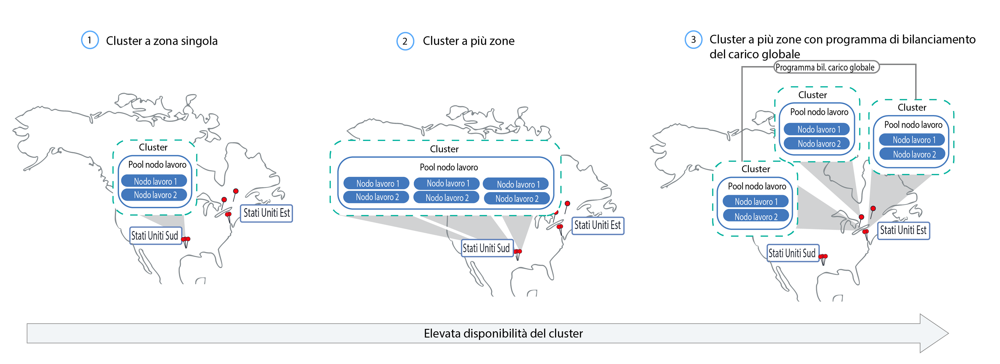
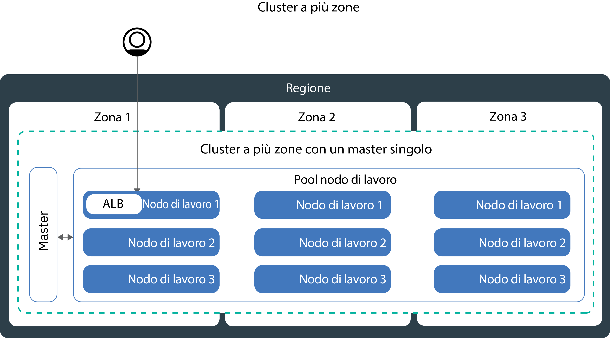

---

copyright:
  years: 2014, 2018
lastupdated: "2018-09-12"

---

{:new_window: target="_blank"}
{:shortdesc: .shortdesc}
{:screen: .screen}
{:pre: .pre}
{:table: .aria-labeledby="caption"}
{:codeblock: .codeblock}
{:tip: .tip}
{:download: .download}


# Pianificazione della tua impostazione di cluster e nodi di lavoro
{: #plan_clusters}
Progetta il tuo cluster standard per la massima capacità e disponibilità per la tua applicazione con {{site.data.keyword.containerlong}}.

## Cluster altamente disponibili
{: #ha_clusters}

I tuoi utenti hanno meno probabilità di riscontrare tempi di inattività quando distribuisci le tue applicazioni tra più nodi di lavoro, zone e cluster. Le funzionalità integrate, come il bilanciamento del carico e l'isolamento, aumentano la resilienza nei confronti di
potenziali errori con host, reti o applicazioni.
{: shortdesc}

Rivedi la configurazione di questi cluster potenziali ordinati per gradi di disponibilità.



1. Un [cluster a zona singola](#single_zone) con più nodi di lavoro in un pool di nodi di lavoro.
2. Un [cluster multizona](#multizone) che estende i nodi di lavoro tra le zone all'interno di una regione.
3. [Più cluster](#multiple_clusters) impostati tra le zone o le regioni e che sono connessi tramite un programma di bilanciamento del carico globale.

## Cluster a zona singola
{: #single_zone}

Per migliorare la disponibilità per la tua applicazione e per consentire il failover nel caso in cui un nodo di lavoro non sia disponibile nel tuo cluster, aggiungi altri nodi di lavoro al tuo cluster a zona singola.
{: shortdesc}


Per impostazione predefinita, il tuo cluster a zona singola è impostato con un pool di nodi di lavoro denominato `default`. Il pool di nodi di lavoro raggruppa i nodi di lavoro con la stessa configurazione, ad esempio il tipo di macchina, che hai definito durante la creazione del cluster. Puoi aggiungere altri nodi di lavoro al tuo cluster [ridimensionando un pool di nodi di lavoro esistente](cs_clusters.html#resize_pool) o [aggiungendo un nuovo pool di nodi di lavoro](cs_clusters.html#add_pool).

Quando aggiungi più nodi di lavoro, le istanze dell'applicazione possono essere distribuite tra più nodi di lavoro. Se un nodo di lavoro si disattiva, le istanze dell'applicazione sui nodi di lavoro disponibili continueranno a funzionare. Kubernetes ripianifica automaticamente i pod dai nodi di lavoro non disponibili per garantire le prestazioni e la capacità della tua applicazione. Per assicurarti che i tuoi pod vengano distribuiti uniformemente tra i nodi di lavoro, implementa l'[affinità pod](https://kubernetes.io/docs/concepts/configuration/assign-pod-node/#inter-pod-affinity-and-anti-affinity-beta-feature).

**Posso convertire il mio cluster a zona singola in un cluster multizona?**</br>
Se il cluster si trova in una delle [città metropolitane multizona supportate](cs_regions.html#zones), sì. Vedi [Aggiornamento dai nodi di lavoro autonomi ai pool di nodi di lavoro](cs_cluster_update.html#standalone_to_workerpool).


**Devo utilizzare i cluster multizona?**</br>
No. Puoi creare tutti i cluster a zona singola che desideri. In effetti, potresti preferire i cluster a zona singola per la gestione semplificata oppure se il tuo cluster deve risiedere in una specifica [città a zona singola](cs_regions.html#zones).

## Cluster multizona
{: #multizone}

Con {{site.data.keyword.containerlong}}, puoi creare cluster multizona. I tuoi utenti hanno meno probabilità di riscontrare tempi di inattività quando distribuisci le tue applicazioni tra più nodi di lavoro e zone utilizzando un pool di nodi di lavoro. Le funzionalità integrate, come il bilanciamento del carico, aumentano la resilienza nei confronti di
potenziali malfunzionamenti della zona con host, reti o applicazioni. Se le risorse in una zona si disabilitano, i tuoi carichi di lavoro del cluster saranno ancora operativi nelle altre zone. **Nota**: per le istanze {{site.data.keyword.Bluemix_dedicated_notm}} sono disponibili solo cluster a zona singola.
{: shortdesc}

**Cos'è un pool di nodi di lavoro?**</br>
Un pool di nodi di lavoro è una raccolta di nodi di lavoro con la stessa varietà, ad esempio tipo di macchina, CPU e memoria. Quando crei un cluster, viene automaticamente creato per tuo conto un pool di nodi di lavoro predefinito. Per distribuire i nodi di lavoro nel tuo pool tra le zone, aggiungere nodi di lavoro al pool o aggiornare i nodi di lavoro, puoi utilizzare i nuovi comandi `ibmcloud ks worker-pool`.

**Posso ancora utilizzare i nodi di lavoro autonomi?**</br>
La configurazione cluster precedente dei nodi di lavoro autonomi è supportata ma obsoleta. Assicurati di [aggiungere un pool di nodi di lavoro al tuo cluster](cs_clusters.html#add_pool) e quindi di [eseguire la migrazione per utilizzare i pool di nodi di lavoro](cs_cluster_update.html#standalone_to_workerpool) per organizzare i tuoi nodi di lavoro invece di nodi di lavoro autonomi.

**Posso convertire il mio cluster a zona singola in un cluster multizona?**</br>
Se il cluster si trova in una delle [città metropolitane multizona supportate](cs_regions.html#zones), sì. Vedi [Aggiornamento dai nodi di lavoro autonomi ai pool di nodi di lavoro](cs_cluster_update.html#standalone_to_workerpool).


### Ulteriori informazioni sulla configurazione del cluster multizona
{: #mz_setup}



Puoi aggiungere ulteriori zone al tuo cluster per replicare i nodi di lavoro nei tuoi pool di nodi di lavoro tra più zone all'interno di una regione. I cluster multizona sono progettati per pianificare uniformemente i pod tra i nodi di lavoro e le zone per garantire la disponibilità e il ripristino in caso di malfunzionamento. Se i nodi di lavoro non vengono estesi uniformemente tra le zone o se la capacità di una delle zone non è sufficiente, il programma di pianificazione (scheduler) Kubernetes potrebbe non riuscire a pianificare tutti i pod richiesti. Di conseguenza, i pod potrebbero essere in uno stato di **In sospeso** fino a quando non sarà disponibile capacità sufficiente. Se vuoi modificare il comportamento predefinito in modo che il programma di pianificazione (scheduler) Kubernetes distribuisca i pod tra le zone con una distribuzione migliore, usa la [politica di affinità pod](https://kubernetes.io/docs/concepts/configuration/assign-pod-node/#inter-pod-affinity-and-anti-affinity-beta-feature) `preferredDuringSchedulingIgnoredDuringExecution`.

**Perché ho bisogno dei nodi di lavoro in 3 zone?** </br>
La distribuzione del tuo carico di lavoro tra 3 zone garantisce l'alta disponibilità per la tua applicazione nel caso in cui una o due zone non siano disponibili, ma rende anche la configurazione del tuo cluster più efficiente. Ti chiedi per quale motivo? Di seguito troverai un esempio.

Supponiamo che hai bisogno di un nodo di lavoro con 6 core per gestire il carico di lavoro per la tua applicazione. Per rendere il tuo cluster ancora più disponibile, hai le seguenti opzioni:

- **Duplica le tue risorse in un'altra zona:** questa opzione ti lascia con 2 nodi di lavoro, ciascuno con 6 core in ogni zona per un totale di 12 core. </br>
- **Distribuisci le risorse tra 3 zone:** con questa opzione, distribuisci 3 core per zona, lasciandoti con una capacità totale di 9 core. Per gestire il tuo carico di lavoro, è necessario che siano attive due zone alla volta. Se una zona non è disponibile, le altre due zone possono gestire il tuo carico di lavoro. Se due zone non sono disponibili, i 3 core rimanenti sono attivi per gestire il tuo carico di lavoro. La distribuzione di 3 core per zona significa macchine più piccole e quindi una riduzione dei costi per te.</br>

**Come è configurato il mio master Kubernetes?** </br>
Un cluster multizona è impostato con un singolo master Kubernetes di cui viene eseguito il provisioning nella stessa area metropolitana dei nodi di lavoro. Ad esempio, se i nodi di lavoro si trovano in una o più delle zone `dal10`, `dal12` o `dal13`, il master si trova nella città metropolitana multizona di Dallas.

**Cosa accade se il master Kubernetes diventa non disponibile?** </br>
Il [master Kubernetes](cs_tech.html#architecture) è il componente principale che mantiene operativo il tuo cluster. Il master archivia le risorse del cluster e le loro configurazioni nel database etcd che funge da SPoT (single point of truth) per il tuo cluster. Il server API Kubernetes funge da punto di ingresso principale per tutte le richieste di gestione del cluster dai nodo di lavoro al master oppure quando vuoi interagire con le tue risorse cluster.<br><br>Se si verifica un malfunzionamento del master, i tuoi carichi di lavoro continuano a essere eseguiti sui nodi di lavoro ma non puoi utilizzare i comandi `kubectl` per gestire le tue risorse cluster o visualizzare l'integrità del cluster finché il server API Kubernetes nel master non torna a essere attivo. Se un pod viene disattivato durante l'interruzione del master, non è possibile ripianificarlo finché il nodo di lavoro non potrà raggiungere nuovamente il server API Kubernetes.<br><br>Durante un'interruzione del master, puoi continuare a eseguire i comandi `ibmcloud ks` sull'API {{site.data.keyword.containerlong_notm}} per gestire le tue risorse dell'infrastruttura, quali i nodi di lavoro o le VLAN. Se modifichi la configurazione del cluster corrente aggiungendo o rimuovendo nodi di lavoro nel cluster, le tue modifiche diventeranno effettive solo dopo che il master sarà tornato attivo. **Nota**: non riavviare un nodo di lavoro durante un'interruzione del master. Questa azione rimuove i pod dal tuo nodo di lavoro. Poiché il server API Kubernetes non è disponibile, i pod non possono essere ripianificati su altri nodi di lavoro nel cluster.


Per proteggere il tuo cluster da un malfunzionamento del master Kubernetes o quando si trova in regioni in cui non sono disponibili cluster multizona, puoi [impostare più cluster e collegarli ad un programma di bilanciamento del carico globale](#multiple_clusters).

**Devo fare qualcosa perché il master possa comunicare con i nodi di lavoro tra le zone?**</br>
Sì. Se hai più VLAN per un cluster, più sottoreti sulla stessa VLAN o un cluster multizona, devi abilitare lo [spanning della VLAN](/docs/infrastructure/vlans/vlan-spanning.html#vlan-spanning) per il tuo account dell'infrastruttura IBM Cloud (SoftLayer) in modo che i tuoi nodi di lavoro possano comunicare tra loro sulla rete privata. Per eseguire questa azione, ti serve l'[autorizzazione dell'infrastruttura](cs_users.html#infra_access) **Rete > Gestisci il VLAN Spanning di rete** oppure puoi richiedere al proprietario dell'account di abilitarlo. Per controllare se lo spanning di VLAN è già abilitato, usa il [comando](/docs/containers/cs_cli_reference.html#cs_vlan_spanning_get) `ibmcloud ks vlan-spanning-get`.Se stai utilizzando {{site.data.keyword.BluDirectLink}}, devi invece utilizzare una [VRF (Virtual Router Function)](/docs/infrastructure/direct-link/subnet-configuration.html#more-about-using-vrf). Per abilitare la VRF, contatta il tuo rappresentante dell'account dell'infrastruttura IBM Cloud (SoftLayer).

**Come posso consentire ai miei utenti l'accesso alla mia applicazione da un Internet pubblico?**</br>
Puoi esporre le tue applicazioni utilizzando un ALB Ingress o il servizio del programma di bilanciamento del carico.

Per impostazione predefinita, gli ALB pubblici vengono creati e abilitati automaticamente in ciascuna zona nel tuo cluster. Viene anche creato e distribuito automaticamente un programma di bilanciamento del carico multizona (MZLB) Cloudflare per il tuo cluster in modo che esista 1 MZLB per ogni regione. L'MZLB mette gli indirizzi IP dei tuoi ALB dietro lo stesso nome host e abilita i controlli dell'integrità su tali indirizzi IP per determinare se sono disponibili o meno. Ad esempio, se hai dei nodi di lavoro in 3 zone nella regione Stati Uniti Est, il nome host `yourcluster.us-east.containers.appdomain.cloud` ha 3 indirizzi IP ALB. L'MZLB controlla l'integrità dell'IP ALB pubblico in ciascuna zona di una regione e tiene i risultati della ricerca DNS aggiornati in base a tali controlli dell'integrità. Per ulteriori informazioni, vedi [Componenti e architettura di Ingress](cs_ingress.html#planning).

I servizi del programma di bilanciamento dei carico vengono impostati solo in una zona. Le richieste in entrata alla tua applicazione vengono instradate da tale zona a tutte le istanze dell'applicazione in altre zone. Se questa zona diventa non disponibile, la tua applicazione potrebbe non essere raggiungibile da internet. Puoi impostare ulteriori servizi del programma di bilanciamento del carico nelle altre zone per tenere conto del malfunzionamento di una singola zona. Per ulteriori informazioni, vedi i [servizi del programma di bilanciamento del carico](cs_loadbalancer.html#multi_zone_config) ad alta disponibilità.

**Posso configurare l'archiviazione persistente per il mio cluster multizona?**</br>
Per l'archiviazione persistente altamente disponibile, usa un servizio cloud come [{{site.data.keyword.cloudant_short_notm}}](/docs/services/Cloudant/getting-started.html#getting-started-with-cloudant) o [{{site.data.keyword.cos_full_notm}}](/docs/services/cloud-object-storage/about-cos.html#about-ibm-cloud-object-storage).

L'archiviazione file e blocchi NFS non è condivisibile tra le zone. I volumi persistenti possono essere utilizzati solo nella zona in cui si trova il dispositivo di archiviazione effettivo. Se nel tuo cluster hai dell'archiviazione blocchi o file NFS che vuoi continuare a utilizzare, devi applicare le etichette di regione e zona ai volumi persistenti esistenti. Queste etichette consentono al programma di pianificazione (scheduler) kube di determinare dove pianificare un'applicazione che utilizza il volume persistente. Esegui il seguente comando e sostituisci `<mycluster>` con il tuo nome cluster.

```
bash <(curl -Ls https://raw.githubusercontent.com/IBM-Cloud/kube-samples/master/file-pv-labels/apply_pv_labels.sh) <mycluster>
```
{: pre}

**Ho creato il mio cluster multizona. Perché è presente ancora una sola zona? Come posso aggiungere zone al mio cluster?**</br>
Se [crei il tuo cluster multizona con la CLI](cs_clusters.html#clusters_cli), il cluster viene creato, ma devi aggiungere le zone al pool di nodi di lavoro per completare il processo. Per estendersi su più zone, il tuo cluster deve trovarsi in una [città metropolitana multizona](cs_regions.html#zones). Per aggiungere una zona al tuo cluster ed estendere i nodi di lavoro tra le zone, vedi [Aggiunta di una zona al tuo cluster](cs_clusters.html#add_zone).

### Quali sono alcuni cambiamenti rispetto a come gestisco attualmente i miei cluster?
{: #mz_new_ways}

Con l'introduzione dei pool di nodi di lavoro, puoi utilizzare una nuova serie di API e di comandi per gestire il tuo cluster. Puoi vedere questi nuovi comandi nella [pagina della documentazione della CLI](cs_cli_reference.html#cs_cli_reference) oppure sul tuo terminale eseguendo `ibmcloud ks help`.

La tabella riportata di seguito confronta i vecchi metodi con i nuovi per alcune azioni di gestione cluster comuni.
<table summary="La tabella mostra la descrizione del nuovo modo per eseguire i comandi multizona. Le righe devono essere lette da sinistra a destra, con la descrizione nella colonna uno, il vecchio modo nella colonna due e il nuovo modo multizona nella colonna tre.">
<caption>Nuovi metodi per i comando del pool di nodi di lavoro multizona.</caption>
  <thead>
  <th>Descrizione</th>
  <th>Vecchi nodi di lavoro autonomi</th>
  <th>Nuovi pool di nodi di lavoro multizona</th>
  </thead>
  <tbody>
    <tr>
    <td>Aggiungi i nodi di lavoro al cluster.</td>
    <td><strong>Obsoleto</strong>: <code>ibmcloud ks worker-add</code> per aggiungere i nodi di lavoro autonomi.</td>
    <td><ul><li>Per aggiungere tipi di macchina diversi rispetto al tuo pool esistente, crea un nuovo pool di nodi di lavoro: [comando](cs_cli_reference.html#cs_worker_pool_create) <code>ibmcloud ks worker-pool-create</code>.</li>
    <li>Per aggiungere nodi di lavoro ad un pool esistente, ridimensiona il numero di nodi per zona nel pool: [comando](cs_cli_reference.html#cs_worker_pool_resize) <code>ibmcloud ks worker-pool-resize</code>.</li></ul></td>
    </tr>
    <tr>
    <td>Rimuovi i nodi di lavoro dal cluster.</td>
    <td><code>ibmcloud ks worker-rm</code>, che puoi ancora utilizzare per eliminare un nodo di lavoro problematico dal tuo cluster.</td>
    <td><ul><li>Se il tuo pool di nodi di lavoro non è bilanciato, ad esempio dopo la rimozione di un nodo di lavoro, ribilancialo: [comando](cs_cli_reference.html#cs_rebalance) <code>ibmcloud ks worker-pool-rebalance</code> .</li>
    <li>Per ridurre il numero di nodi di lavoro in un pool, ridimensiona il numero per zona (valore minimo pari a 1): [comando](cs_cli_reference.html#cs_worker_pool_resize) <code>ibmcloud ks worker-pool-resize</code>.</li></ul></td>
    </tr>
    <tr>
    <td>Usa una nuova VLAN per i nodi di lavoro.</td>
    <td><strong>Obsoleto</strong>: aggiungi un nuovo nodo di lavoro che utilizza la nuova VLAN privata o pubblica: <code>ibmcloud ks worker-add</code>.</td>
    <td>Imposta il pool di nodi di lavoro per utilizzare una VLAN pubblica o privata diversa rispetto a quella utilizzata in precedenza: [comando](cs_cli_reference.html#cs_zone_network_set) <code>ibmcloud ks zone-network-set</code>.</td>
    </tr>
  </tbody>
  </table>

## Più cluster connessi a un programma di bilanciamento del carico globale
{: #multiple_clusters}

Per proteggere la tua applicazione da un malfunzionamento del master Kubernetes e per le regioni in cui non sono disponibili cluster multizona, puoi creare più cluster in zone diverse all'interno di una regione e collegarli con un programma di bilanciamento del carico globale.
{: shortdesc}


Per bilanciare il carico di lavoro tra più cluster, devi impostare un programma di bilanciamento del carico globale e aggiungere gli indirizzi IP dei tuoi ALB o dei tuoi servizi di bilanciamento del carico al tuo dominio. Aggiungendo questi indirizzi IP, puoi instradare il traffico in entrata tra i tuoi cluster. Affinché il programma di bilanciamento del carico globale rilevi se uno dei tuoi cluster non è disponibile, prendi in considerazione di aggiungere il controllo dell'integrità basato su ping ad ogni indirizzo IP. Quando imposti questo controllo, il tuo provider DNS esegue regolarmente il ping degli indirizzi IP che hai aggiunto al tuo domino. Se uno degli indirizzi IP diventa non disponibile, il traffico non verrà più inviato a questo indirizzo IP. Tuttavia, Kubernetes non riavvia automaticamente i pod dal cluster non disponibile sui nodi di lavoro nei cluster disponibili. Se vuoi che Kubernetes riavvii automaticamente i pod nei cluster disponibili, prendi in considerazione di impostare un [cluster multizona](#multizone).

**Perché ho bisogno di 3 cluster in 3 zone?** </br>
In modo analogo all'utilizzo di [3 zone in un cluster multizona](#multizone), puoi fornire una maggiore disponibilità alla tua applicazione impostando fino a 3 cluster tra le zone. Puoi anche ridurre i costi acquistando macchine più piccole per gestire il tuo carico di lavoro.

**Se voglio impostare più cluster tra le regioni?** </br>
Puoi impostare più cluster in regioni diverse di una geolocalizzazione (ad esempio, Stati Uniti Sud e Stati Uniti Est) o tra geolocalizzazioni (ad esempio, Stati Uniti Sud ed Europa Centrale). Entrambe le configurazioni offrono lo stesso livello di disponibilità per la tua applicazione, ma aggiungono anche complessità quando si tratta di condivisione e di replica dei dati. Per la maggior parte dei casi, trovarsi all'interno della stessa geolocalizzazione si rivela sufficiente. Ma se hai utenti in tutto il mondo, sarebbe meglio impostare un cluster dove si trovano gli utenti, in questo modo questi ultimi non riscontreranno lunghi tempi di attesa quando invieranno una richiesta alla tua applicazione.

**Per impostare un programma di bilanciamento del carico globale per più cluster:**

1. [Crea i cluster](cs_clusters.html#clusters) in più zone o regioni.
2. Se hai più VLAN per un cluster, più sottoreti sulla stessa VLAN o un cluster multizona, devi abilitare lo [spanning della VLAN](/docs/infrastructure/vlans/vlan-spanning.html#vlan-spanning) per il tuo account dell'infrastruttura IBM Cloud (SoftLayer) in modo che i tuoi nodi di lavoro possano comunicare tra loro sulla rete privata. Per eseguire questa azione, ti serve l'[autorizzazione dell'infrastruttura](cs_users.html#infra_access) **Rete > Gestisci il VLAN Spanning di rete** oppure puoi richiedere al proprietario dell'account di abilitarlo. Per controllare se lo spanning di VLAN è già abilitato, usa il [comando](/docs/containers/cs_cli_reference.html#cs_vlan_spanning_get) `ibmcloud ks vlan-spanning-get`.Se stai utilizzando {{site.data.keyword.BluDirectLink}}, devi invece utilizzare una [VRF (Virtual Router Function)](/docs/infrastructure/direct-link/subnet-configuration.html#more-about-using-vrf). Per abilitare la VRF, contatta il tuo rappresentante dell'account dell'infrastruttura IBM Cloud (SoftLayer).
3. In ciascun cluster, esponi la tua applicazione utilizzando un [ALB](cs_ingress.html#ingress_expose_public) o un [servizio del programma di bilanciamento del carico](cs_loadbalancer.html#config).
4. Per ciascun cluster, elenca gli indirizzi IP pubblici dei tuoi ALB o dei tuoi servizi del programma di bilanciamento del carico.
   - Per elencare l'indirizzo IP di tutti gli AL pubblici abilitati nel tuo cluster:
     ```
     ibmcloud ks albs --cluster <cluster_name_or_id>
     ```
     {: pre}

   - Per elencare l'indirizzo IP per il tuo servizio del programma di bilanciamento del carico:
     ```
     kubectl describe service <myservice>
     ```
     {: pre}

     L'indirizzo IP **Ingress programma di bilanciamento del carico** è l'indirizzo IP portatile che è stato assegnato al tuo servizio del programma di bilanciamento del carico.

4.  Imposta un programma di bilanciamento del carico globale utilizzando {{site.data.keyword.Bluemix_notm}} Internet Services (CIS) oppure imposta il tuo programma di bilanciamento del carico globale.

    **Per utilizzare un programma di bilanciamento del carico globale CIS**:
    1.  Imposta il servizio seguendo i passi da 1 a 4 presenti in [Introduzione a {{site.data.keyword.Bluemix_notm}} Internet Services (CIS)](/docs/infrastructure/cis/getting-started.html#getting-started-with-ibm-cloud-internet-services-cis-).
        *  I passi da 1 a 3 ti guidano attraverso il provisioning dell'istanza di servizio, l'aggiunta del tuo dominio dell'applicazione e la configurazione dei tuoi server dei nomi.
        * Il passo 4 ti guida attraverso la creazione dei record DNS. Crea un record DNS per ciascun indirizzo IP ALB o del programma di bilanciamento del carico che hai raccolto. Questi record DNS associano il tuo dominio dell'applicazione a tutti i tuoi programmi di bilanciamento del carico o agli ALB del cluster e garantiscono che le richieste al tuo dominio dell'applicazione vengono inoltrate ai tuoi cluster in un ciclo round-robin.
    2. [Aggiungi i controlli dell'integrità](/docs/infrastructure/cis/glb-setup.html#add-a-health-check) per gli ALB o i programmi di bilanciamento del carico. Puoi utilizzare lo stesso controllo dell'integrità per gli ALB o i programmi di bilanciamento del carico in tutti i tuoi cluster oppure creare controlli dell'integrità specifici da utilizzare per cluster specifici.
    3. [Aggiungi un pool di origine](/docs/infrastructure/cis/glb-setup.html#add-a-pool) per ciascun cluster aggiungendo gli IP dell'ALB o del programma di bilanciamento del carico del cluster. Ad esempio, se hai 3 cluster che hanno 2 ALB, crea 3 pool di origine che hanno 2 indirizzi IP ALB ciascuno. Aggiungi un controllo dell'integrità a ciascun pool di origine che hai creato.
    4. [Aggiungi un programma di bilanciamento del carico globale](/docs/infrastructure/cis/glb-setup.html#set-up-and-configure-your-load-balancers).

    **Per utilizzare un tuo programma di bilanciamento del carico globale**:
    1. Configura il tuo dominio per instradare il traffico in entrata al tuo ALB o ai servizi di bilanciamento del carico aggiungendo gli indirizzi IP di tutti gli ALB e di tutti i servizi del programma di bilanciamento del carico abilitati pubblici al tuo dominio.
    2. Per ciascun indirizzo IP, abilita il controllo dell'integrità basato su ping in modo che il tuo provider DNS possa rilevare gli indirizzi IP non integri. Se viene rilevato un indirizzo IP non integro, il traffico non verrà più instradato a questo indirizzo IP.

## Cluster privati
{: #private_clusters}

Per impostazione predefinita, {{site.data.keyword.containerlong_notm}} configura il tuo cluster con l'accesso a una VLAN privata e una VLAN pubblica. La VLAN privata determina l'indirizzo IP privato che viene assegnato a ciascun nodo di lavoro, che fornisce a ciascun nodo di lavoro un'interfaccia di rete privata. La VLAN pubblica consente ai nodi di lavoro di connettersi automaticamente e in modo protetto al master.


Se vuoi creare un cluster che abbia accesso solo su una VLAN privata, puoi creare un cluster privato a zona singola o multizona. Tuttavia, quando sono connessi solo a una VLAN privata, i tuoi nodi di lavoro non possono connettersi automaticamente al master. Devi configurare un'applicazione gateway per fornire la connettività di rete tra i nodi di lavoro e il master.
**Nota**: non puoi convertire un cluster che è connesso a una VLAN pubblica e privata in modo che diventi un cluster solo privato. In caso di rimozione di tutte le VLAN pubbliche da un cluster, diversi componenti cluster smettono di funzionare. Devi creare un nuovo cluster attenendoti alla seguente procedura:

Se vuoi creare un cluster che ha accesso solo su una VLAN privata:

1.  Consulta [Pianificazione della rete cluster solo privata](cs_network_planning.html#private_vlan)
2.  Configura la tua applicazione gateway per la connettività di rete. Nota: devi [aprire le porte e gli indirizzi IP richiesti](cs_firewall.html#firewall_outbound) nel tuo firewall e [abilitare lo spanning della VLAN](cs_subnets.html#vra-routing) per le sottoreti.
3.  [Crea un cluster utilizzando la CLI](cs_clusters.html#clusters_cli) includendo l'indicatore `--private-only`.
4.  Se vuoi esporre un'applicazione a una rete privata utilizzando un servizio NodePort, LoadBalancer o Ingress privato, consulta [Pianificazione di una rete esterna privata per la configurazione di solo una VLAN privata](cs_network_planning.html#private_vlan). Il servizio è accessibile solo sull'indirizzo IP privato e devi configurare le porte nel tuo firewall per utilizzare l'indirizzo IP privato.


## Pool di nodi di lavoro e nodi di lavoro
{: #planning_worker_nodes}

Un cluster Kubernetes è costituito da nodi di lavoro raggruppati in pool di nodi di lavoro ed è monitorato e gestito centralmente dal master Kubernetes. Gli amministratori del cluster decidono come configurare il cluster dei nodi di lavoro per garantire che gli utenti del cluster abbiano tutte le risorse per distribuire ed eseguire le applicazioni nel cluster.
{:shortdesc}

Quando crei un cluster standard, nell'infrastruttura IBM Cloud (SoftLayer) vengono ordinati per tuo conto i nodi di lavoro delle stesse specifiche di memoria, CPU e spazio su disco (varietà) e vengono aggiunti al pool di nodi di lavoro predefinito nel tuo cluster. A ogni nodo di lavoro viene
assegnato un ID e nome dominio univoco che non deve essere modificato dopo la creazione del cluster. Puoi scegliere tra server virtuali o fisici (bare metal). A seconda del livello di isolamento hardware che scegli, i nodi di lavoro virtuali possono essere configurati come nodi condivisi o dedicati. Per aggiungere delle varietà differenti al tuo cluster, [crea un altro pool di nodi di lavoro](cs_cli_reference.html#cs_worker_pool_create).

Kubernetes limita il numero massimo di nodi di lavoro che puoi avere in un cluster. Controlla [nodo di lavoro e quote pod ](https://kubernetes.io/docs/setup/cluster-large/) per ulteriori informazioni.


## Hardware disponibile per i nodi di lavoro
{: #shared_dedicated_node}

Quando crei un cluster standard in {{site.data.keyword.Bluemix_notm}}, scegli se i tuoi pool di nodi di lavoro sono costituiti da nodi di lavoro che sono macchine fisiche (bare metal) o macchine virtuali che vengono eseguite su hardware fisico. Puoi anche selezionare la varietà di nodo di lavoro oppure una combinazione di memoria, CPU e altre specifiche macchina quali l'archiviazione disco.
{:shortdesc}


Se vuoi più di una varietà di nodo di lavoro, devi creare un pool di nodi di lavoro per ciascuna varietà. Quando crei un cluster gratuito, viene eseguito automaticamente il provisioning del tuo nodo di lavoro come nodo virtuale condiviso nell'account dell'infrastruttura IBM Cloud (SoftLayer). Come ben sai, tieni presente la [soglia minima del limite del nodo di lavoro](#resource_limit_node) del 10% di capacità di memoria totale.

Puoi distribuire i cluster utilizzando l'[IU della console](cs_clusters.html#clusters_ui) o la [CLI](cs_clusters.html#clusters_cli).

Seleziona una delle seguenti opzioni per decidere quale tipo di pool di nodi di lavoro vuoi.
* [Macchine virtuali](#vm)
* [Macchine fisiche (bare metal)](#bm)
* [Macchine SDS (software-defined storage)](#sds)

### Macchine virtuali
{: #vm}

Con le VM, ottieni maggiore flessibilità, tempi di provisioning più veloci e ulteriori funzioni di scalabilità automatica rispetto ai bare metal, ad un prezzo più conveniente. Puoi utilizzare le VM per casi di utilizzo più generali come gli ambienti di sviluppo e test, di preparazione e di produzione, i microservizi e le applicazioni di business. Tuttavia, è un compromesso nelle prestazioni. Se hai bisogno di calcolo ad elevate prestazioni per i carichi di lavoro con un utilizzo intensivo di RAM, dati o GPU, utilizza [bare metal](#bm).
{: shortdesc}

**È meglio se utilizzo hardware condiviso o dedicato?**</br>
Quando crei un cluster virtuale standard, devi scegliere se desideri che l'hardware sottostante sia condiviso tra più clienti {{site.data.keyword.IBM_notm}} (più tenant) o che sia dedicato solo a te (tenant singolo).

* **In una configurazione di hardware condiviso a più tenant**: le risorse fisiche, quali CPU e memoria, sono condivise tra tutte le macchine virtuali distribuite allo stesso hardware fisico. Per assicurare che ogni macchina virtuale
possa essere eseguita indipendentemente, un monitoraggio della macchina virtuale, conosciuto anche come hypervisor,
divide le risorse fisiche in entità isolate e le alloca come risorse dedicate
a una macchina virtuale (isolamento hypervisor).
* **In una configurazione hardware dedicato a singolo tenant**: tutte le risorse fisiche sono dedicate soltanto a te. Puoi distribuire
più nodi di lavoro come macchine virtuali allo stesso host fisico. In modo simile alla configurazione a più tenant,
l'hypervisor assicura che ogni nodo ottenga la propria condivisione di risorse
fisiche disponibili.

I nodi condivisi sono generalmente più economici dei nodi dedicati perché i costi dell'hardware sottostante
sono condivisi tra più clienti. Tuttavia, quando decidi tra nodi condivisi e dedicati,
potresti voler verificare con il tuo dipartimento legale e discutere sul livello di conformità e isolamento dell'infrastruttura
che il tuo ambiente dell'applicazione necessita.

**Quali sono le caratteristiche generali delle macchine virtuali (VM, Virtual Machine)?**</br>
Le macchine virtuali utilizzano il disco locale anziché SAN (Storage Area Networking) per garantire l'affidabilità. I vantaggi dell'affidabilità includono una velocità di elaborazione più elevata durante la serializzazione dei byte sul disco locale e una riduzione del danneggiamento del file system dovuto a errori di rete. Ogni VM offre una velocità di rete di 1000Mbps, 25GB di archiviazione disco locale primaria per il file system del sistema operativo e 100GB di archiviazione disco locale secondaria per dati quali il runtime del contenitore e il `kubelet`.

**Cosa succede se ho tipi di macchine `u1c` o `b1c` obsoleti?**</br>
Per iniziare a utilizzare i tipi di macchina `u2c` e `b2c`, [aggiorna i tipi di macchina aggiungendo i nodi di lavoro](cs_cluster_update.html#machine_type).

**Quali varietà di macchina virtuale sono disponibili?**</br>
I tipi di macchina variano per zona. Per vedere i tipi di macchina disponibili nella tua zona, esegui `ibmcloud ks machine-types <zone>`. Puoi anche riesaminare i tipi di macchina [bare metal](#bm) o [SDS](#sds) disponibili.

<table>
<caption>Tipi di macchina virtuale disponibili in {{site.data.keyword.containerlong_notm}}.</caption>
<thead>
<th>Nome e caso di utilizzo</th>
<th>Core / Memoria</th>
<th>Disco primario / secondario</th>
<th>Velocità di rete</th>
</thead>
<tbody>
<tr>
<td><strong>Virtuale, u2c.2x4</strong>: utilizza questa VM di dimensione minima per il test rapido, le prove di concetto e altri carichi di lavoro leggeri.</td>
<td>2 / 4GB</td>
<td>25GB / 100GB</td>
<td>1000Mbps</td>
</tr>
<tr>
<td><strong>Virtuale, b2c.4x16</strong>: seleziona questa VM bilanciata per il test e lo sviluppo e altri carichi di lavoro leggeri.</td>
<td>4 / 16GB</td>
<td>25GB / 100GB</td>
<td>1000Mbps</td>
</tr>
<tr>
<td><strong>Virtuale, b2c.16x64</strong>: seleziona questa VM bilanciata per carichi di lavoro di dimensione media.</td></td>
<td>16 / 64GB</td>
<td>25GB / 100GB</td>
<td>1000Mbps</td>
</tr>
<tr>
<td><strong>Virtuale, b2c.32x128</strong>: seleziona questa VM bilanciata per carichi di lavoro medi o grandi, come un database e un sito web dinamico con molti utenti simultanei.</td></td>
<td>32 / 128GB</td>
<td>25GB / 100GB</td>
<td>1000Mbps</td>
</tr>
<tr>
<td><strong>Virtuale, b2c.56x242</strong>: seleziona questa VM bilanciata per carichi di lavoro grandi, come un database e più applicazioni con molti utenti simultanei.</td></td>
<td>56 / 242GB</td>
<td>25GB / 100GB</td>
<td>1000Mbps</td>
</tr>
<tr>
<td><strong>Virtuale, c2c.16x16</strong>: utilizza questa varietà quando vuoi un bilanciamento equilibrato delle risorse di elaborazione dal nodo di lavoro per i carichi di lavoro leggeri.</td></td>
<td>16 / 16GB</td>
<td>25GB / 100GB</td>
<td>1000Mbps</td>
</tr><tr>
<td><strong>Virtuale, c2c.16x32</strong>: utilizza questa varietà quando vuoi uno stretto bilanciamento di risorse di CPU e memoria dal nodo di lavoro per i carichi di lavoro leggeri o di medie dimensioni.</td></td>
<td>16 / 32GB</td>
<td>25GB / 100GB</td>
<td>1000Mbps</td>
</tr><tr>
<td><strong>Virtuale, c2c.32x32</strong>: utilizza questa varietà quando vuoi un bilanciamento equilibrato delle risorse di elaborazione dal nodo di lavoro per i carichi di lavoro di medie dimensioni.</td></td>
<td>32 / 32GB</td>
<td>25GB / 100GB</td>
<td>1000Mbps</td>
</tr><tr>
<td><strong>Virtuale, c2c.32x64</strong>: utilizza questa varietà quando vuoi uno stretto bilanciamento di risorse di CPU e memoria dal nodo di lavoro per i carichi di lavoro di medie dimensioni.</td></td>
<td>16 / 16GB</td>
<td>25GB / 100GB</td>
<td>1000Mbps</td>
</tr>
</tbody>
</table>

### Macchine fisiche (bare metal)
{: #bm}

Puoi eseguire il provisioning del tuo nodo di lavoro come server fisico a singolo tenant, indicato anche come bare metal.
{: shortdesc}

**In che modo bare metal è diverso dalle macchine virtuali?**</br>
Bare metal ti dà accesso diretto alle risorse fisiche sulla macchina, come la memoria o la CPU. Questa configurazione elimina l'hypervisor della macchina virtuale che assegna risorse fisiche alle macchine virtuali eseguite sull'host. Invece, tutte le risorse di una macchina bare metal sono dedicate esclusivamente al nodo di lavoro, quindi non devi preoccuparti dei "vicini rumorosi" che condividono risorse o rallentano le prestazioni. I tipi di macchine fisiche hanno un'archiviazione locale maggiore rispetto a quelle virtuali e alcune dispongono di RAID per il backup dei dati locali.

**Oltre a specifiche migliori per le prestazioni, posso fare qualcosa con bare metal che non posso fare con le macchine virtuali?**</br>
Sì. Con bare metal, puoi abilitare Trusted Compute per verificare possibili tentativi di manomissione dei tuoi nodi di lavoro. Se non abiliti l'attendibilità durante la creazione del cluster ma vuoi farlo in seguito, puoi usare il [comando](cs_cli_reference.html#cs_cluster_feature_enable) `ibmcloud ks feature-enable`. Dopo aver abilitato l'attendibilità, non puoi disabilitarla successivamente. Puoi creare un nuovo cluster senza attendibilità. Per ulteriori informazioni su come funziona l'attendibilità durante il processo di avvio del nodo, vedi [{{site.data.keyword.containerlong_notm}} con Trusted Compute](cs_secure.html#trusted_compute). Trusted Compute è disponibile sui cluster su cui è in esecuzione Kubernetes versione 1.9 o successive e che hanno alcuni tipi di macchine bare metal. Quando esegui il [comando](cs_cli_reference.html#cs_machine_types) `ibmcloud ks machine-types<zone>`, puoi vedere quali macchine supportano l'attendibilità controllando il campo **Trustable**. Ad esempio, le varietà GPU `mgXc` non supportano Trusted Compute.

**Bare metal sembra essere un'opzione estremamente valida. Cosa mi impedisce di ordinarne uno immediatamente?**</br>
I server bare metal sono più costosi di quelli virtuali e sono più adatti per le applicazioni ad alte prestazioni che richiedono più risorse e controllo host. 

**Importante**:i server bare metal sono fatturati mensilmente. Se annulli un server bare metal prima della fine del mese, ti viene addebitato il costo fino alla fine di quel mese. L'ordinazione e l'annullamento dei server bare metal è un processo manuale che viene eseguito tramite il tuo account dell'infrastruttura IBM Cloud (SoftLayer). Il suo completamento può richiedere più di un giorno lavorativo.

**Quali varietà di bare metal posso ordinare?**</br>
I tipi di macchina variano per zona. Per vedere i tipi di macchina disponibili nella tua zona, esegui `ibmcloud ks machine-types <zone>`. Puoi anche riesaminare i tipi di macchina [VM](#vm) o [SDS](#sds) disponibili.

Le macchine bare metal sono ottimizzate per diversi casi d'uso quali i carichi di lavoro con un utilizzo intensivo di RAM, dati o GPU.

Scegli un tipo di macchina con la configurazione di archiviazione corretta per supportare il tuo carico di lavoro. Alcune varietà hanno una combinazione delle seguenti configurazioni di dischi e archiviazione. Ad esempio, alcune varietà possono avere un disco primario SATA con un disco secondario SSD raw.

* **SATA**: un dispositivo di archiviazione disco a rotazione magnetica che viene spesso utilizzato per il disco primario del nodo di lavoro che memorizza il file system del sistema operativo.
* **SSD**: un dispositivo di archiviazione SSD (solid state drive) per dati ad elevate prestazioni.
* **Raw**: il dispositivo di archiviazione non è formattato; tutta la capacità è disponibile per l'utilizzo.
* **RAID**: il dispositivo di archiviazione ha i dati distribuiti per la ridondanza e prestazioni che variano a seconda del livello RAID. Di conseguenza, la capacità del disco disponibile per l'utilizzo varia.


<table>
<caption>Tipi di macchina bare metal disponibili in {{site.data.keyword.containerlong_notm}}.</caption>
<thead>
<th>Nome e caso di utilizzo</th>
<th>Core / Memoria</th>
<th>Disco primario / secondario</th>
<th>Velocità di rete</th>
</thead>
<tbody>
<tr>
<td><strong>Bare metal con RAM intensiva, mr1c.28x512</strong>: massimizza la disponibilità della RAM dei tuoi nodi di lavoro.</td>
<td>28 / 512GB</td>
<td>2TB SATA / 960GB SSD</td>
<td>10000Mbps</td>
</tr>
<tr>
<td><strong>Bare metal GPU, mg1c.16x128</strong>: scegli questo tipo per i carichi di lavoro intensivi matematicamente come il calcolo di elevate prestazioni, il machine learning o le applicazioni 3D. Questa varietà ha 1 scheda fisica Tesla K80 con 2 GPU (graphics processing unit) per scheda per un totale di 2 GPU.</td>
<td>16 / 128GB</td>
<td>2TB SATA / 960GB SSD</td>
<td>10000Mbps</td>
</tr>
<tr>
<td><strong>Bare metal GPU, mg1c.28x256</strong>: scegli questo tipo per i carichi di lavoro intensivi matematicamente come il calcolo di elevate prestazioni, il machine learning o le applicazioni 3D. Questa varietà ha 2 schede fisiche Tesla K80 con 2 GPU per scheda per un totale di 4 GPU.</td>
<td>28 / 256GB</td>
<td>2TB SATA / 960GB SSD</td>
<td>10000Mbps</td>
</tr>
<tr>
<td><strong>Bare metal con dai intensivi, md1c.16x64.4x4tb</strong>: per una quantità significativa di archiviazione su disco locale, incluso RAID per eseguire il backup dei dati memorizzati localmente sulla macchina. Utilizza per casi come i file system distribuiti, i database molto grandi e i carichi di lavoro di analisi Big Data.</td>
<td>16 / 64GB</td>
<td>2x2TB RAID1 / 4x4TB SATA RAID10</td>
<td>10000Mbps</td>
</tr>
<tr>
<td><strong>Bare metal con dai intensivi, md1c.28x512.4x4tb</strong>: per una quantità significativa di archiviazione su disco locale, incluso RAID per eseguire il backup dei dati memorizzati localmente sulla macchina. Utilizza per casi come i file system distribuiti, i database molto grandi e i carichi di lavoro di analisi Big Data.</td>
<td>28 / 512 GB</td>
<td>2x2TB RAID1 / 4x4TB SATA RAID10</td>
<td>10000Mbps</td>
</tr>
<tr>
<td><strong>Bare metal bilanciato, mb1c.4x32</strong>: utilizza per i carichi di lavoro bilanciati che richiedono ulteriori risorse di calcolo rispetto all'offerta delle macchine virtuali.</td>
<td>4 / 32GB</td>
<td>2TB SATA / 2TB SATA</td>
<td>10000Mbps</td>
</tr>
<tr>
<td><strong>Bare metal bilanciato, mb1c.16x64</strong>: utilizza per i carichi di lavoro bilanciati che richiedono ulteriori risorse di calcolo rispetto all'offerta delle macchine virtuali.</td>
<td>16 / 64GB</td>
<td>2TB SATA / 960GB SSD</td>
<td>10000Mbps</td>
</tr>
<tr>
</tbody>
</table>

### Macchine SDS (software-defined storage)
{: #sds}

Le varietà SDS (software-defined storage) sono macchine fisiche di cui viene eseguito il provisioning con un disco raw per l'archiviazione locale fisica. Poiché i dati sono co-ubicati con il nodo di elaborazione, le macchine SDS sono adatte per i carichi di lavoro ad elevate prestazioni.
{: shortdesc}

**Quando utilizzo le varietà SDS?**</br>
Di norma utilizzi le macchine SDS nei seguenti casi:
*  Se utilizzi un componente aggiuntivo SDS al tuo cluster, devi utilizzare una macchina SDS.
*  Se la tua applicazione è uno [StatefulSet ](https://kubernetes.io/docs/concepts/workloads/controllers/statefulset/) che richiede l'archiviazione locale, puoi utilizzare le macchine SDS ed eseguire il provisioning di [volumi persistenti locali Kubernetes (beta)](https://kubernetes.io/blog/2018/04/13/local-persistent-volumes-beta/).
*  Potresti avere delle applicazioni personalizzate o dei componenti aggiuntivi del cluster che richiedono SDS o l'archiviazione locale. Ad esempio, se intendi utilizzare logDNA, devi utilizzare un tipo di macchina SDS.

**Quali varietà di SDS posso ordinare?**</br>
I tipi di macchina variano per zona. Per vedere i tipi di macchina disponibili nella tua zona, esegui `ibmcloud ks machine-types <zone>`. Puoi anche riesaminare i tipi di macchina [bare metal](#bm) o [VM](#vm) disponibili.

Scegli un tipo di macchina con la configurazione di archiviazione corretta per supportare il tuo carico di lavoro. Alcune varietà hanno una combinazione delle seguenti configurazioni di dischi e archiviazione. Ad esempio, alcune varietà possono avere un disco primario SATA con un disco secondario SSD raw.

* **SATA**: un dispositivo di archiviazione disco a rotazione magnetica che viene spesso utilizzato per il disco primario del nodo di lavoro che memorizza il file system del sistema operativo.
* **SSD**: un dispositivo di archiviazione SSD (solid state drive) per dati ad elevate prestazioni.
* **Raw**: il dispositivo di archiviazione non è formattato; tutta la capacità è disponibile per l'utilizzo.
* **RAID**: il dispositivo di archiviazione ha i dati distribuiti per la ridondanza e prestazioni che variano a seconda del livello RAID. Di conseguenza, la capacità del disco disponibile per l'utilizzo varia.


<table>
<caption>Tipi di macchina SDS disponibili in {{site.data.keyword.containerlong_notm}}.</caption>
<thead>
<th>Nome e caso di utilizzo</th>
<th>Core / Memoria</th>
<th>Disco primario / secondario</th>
<th>Archiviazione locale</th>
<th>Velocità di rete</th>
</thead>
<tbody>
<tr>
<td><strong>Bare metal con SDS, ms2c.28x256.3.8tb.ssd</strong>: se hai bisogno di archiviazione locale supplementare per le prestazioni, utilizza la varietà con una notevole capacità di disco che supporta SDS (software-defined storage).</td>
<td>28 / 256GB</td>
<td>SATA di 2TB / SSD d 1,9TB</td>
<td>SSD raw di 3,8TB</td>
<td>10000Mbps</td>
</tr>
<tr>
<td><strong>Bare metal con SDS, ms2c.28x512.4x3.8tb.ssd</strong>: se hai bisogno di archiviazione locale supplementare per le prestazioni, utilizza la varietà con una notevole capacità di disco che supporta SDS (software-defined storage).</td>
<td>28 / 512GB</td>
<td>SATA di 2TB / SSD d 1,9TB</td>
<td>4 dischi, SSD raw di 3,8TB</td>
<td>10000Mbps</td>
</tr>
</tbody>
</table>

## Limiti di memoria dei nodi di lavoro
{: #resource_limit_node}

{{site.data.keyword.containerlong_notm}} imposta un limite di memoria su ogni nodo di lavoro. Quando i pod in esecuzione sul nodo di lavoro superano questo limite di memoria, i pod vengono rimossi. In Kubernetes, questo limite è chiamato [soglia di rimozione rigida](https://kubernetes.io/docs/tasks/administer-cluster/out-of-resource/#hard-eviction-thresholds).
{:shortdesc}

Se i tuoi pod vengono rimossi frequentemente, aggiungi più nodi di lavoro al tuo cluster o imposta i [limiti di risorsa ](https://kubernetes.io/docs/concepts/configuration/manage-compute-resources-container/#resource-requests-and-limits-of-pod-and-container) sui pod.

**Ogni macchina ha una soglia minima uguale al 10% della sua capacità di memoria totale**. Quando sul nodo di lavoro è disponibile meno memoria rispetto alla soglia minima consentita, Kubernetes rimuove immediatamente il pod. Il pod viene ripianificato su un altro nodo di lavoro, laddove disponibile. Ad esempio, se hai una macchina virtuale `b2c.4x16`, la sua capacità di memoria totale è 16GB. Se è disponibile meno di 1600MB (10%) di memoria, i nuovi pod non possono essere pianificati in questo nodo di lavoro ma lo sono invece in un altro. Se non è disponibile alcun nodo di lavoro, i nuovi pod rimangono senza pianificazione.

Per verificare la quantità di memoria utilizzata sul tuo nodo di lavoro, esegui [`kubectl top node ` ](https://kubernetes.io/docs/reference/kubectl/overview/#top).

## Autorecovery per i tuoi nodi di lavoro
{: #autorecovery}

I componenti critici, come `containerd`, `kubelet`, `kube-proxy` e `calico`, devono funzionare correttamente per avere un nodo di lavoro Kubernetes integro. Con il passare del tempo questi componenti possono rompersi e lasciare il tuo nodo di lavoro in uno stato non funzionale. I nodi di lavoro non funzionali riducono la capacità totale del cluster e possono causare tempi di inattività per la tua applicazione.
{:shortdesc}

Puoi [configurare i controlli dell'integrità per il nodo di lavoro e abilitare l'Autorecovery](cs_health.html#autorecovery). Se Autorecovery rileva un nodo di lavoro non integro in base ai controlli configurati, attiva un'azione correttiva come un ricaricamento del sistema operativo sul nodo di lavoro. Per ulteriori informazioni su come funziona Autorecovery, vedi il [blog Autorecovery ](https://www.ibm.com/blogs/bluemix/2017/12/autorecovery-utilizes-consistent-hashing-high-availability/).

<br />

