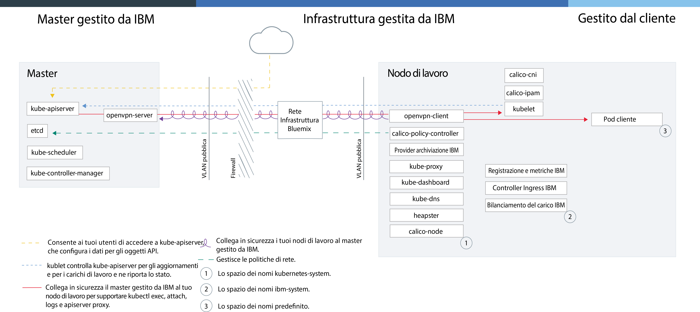

---

copyright:
  years: 2014, 2019
lastupdated: "2019-06-07"

keywords: kubernetes, iks

subcollection: containers

---

{:new_window: target="blank"}
{:shortdesc: .shortdesc}
{:screen: .screen}
{:pre: .pre}
{:table: .aria-labeledby="caption"}
{:codeblock: .codeblock}
{:tip: .tip}
{:note: .note}
{:important: .important}
{:deprecated: .deprecated}
{:download: .download}
{:preview: .preview}


# Obsoleto: Cloud dedicato
{: #dedicated}

{{site.data.keyword.containerlong}} in {{site.data.keyword.Bluemix_dedicated_notm}} è obsoleto. Non puoi creare cluster in un ambiente {{site.data.keyword.Bluemix_dedicated_notm}}. Per creare cluster in {{site.data.keyword.Bluemix_notm}} Public, consulta [Introduzione a {{site.data.keyword.containerlong_notm}}](/docs/containers?topic=containers-getting-started).
{: deprecated}

Se hai un account {{site.data.keyword.Bluemix_dedicated_notm}}, puoi distribuire cluster Kubernetes in un ambiente cloud dedicato
(`https://<my-dedicated-cloud-instance>.bluemix.net`) e connetterti con i servizi {{site.data.keyword.Bluemix_notm}} preselezionati
che sono in esecuzione in tale ambiente.
{:shortdesc}

Se non hai un account {{site.data.keyword.Bluemix_dedicated_notm}}, puoi [iniziare con {{site.data.keyword.containerlong_notm}}](/docs/containers?topic=containers-getting-started) in un account {{site.data.keyword.Bluemix_notm}} pubblico.

## Informazioni sull'ambiente cloud dedicato
{: #dedicated_environment}

Con un account {{site.data.keyword.Bluemix_dedicated_notm}}, le risorse fisiche disponibili sono dedicate solo al tuo cluster e non vengono condivise con i cluster di altri clienti {{site.data.keyword.IBM_notm}}. Potresti scegliere di configurare un ambiente {{site.data.keyword.Bluemix_dedicated_notm}} se vuoi l'isolamento per il tuo cluster e lo richiedi per gli altri servizi {{site.data.keyword.Bluemix_notm}} che utilizzi. Se non hai un account dedicato, puoi [creare i cluster con l'hardware dedicato in {{site.data.keyword.Bluemix_notm}} pubblico](/docs/containers?topic=containers-clusters#clusters_ui).
{: shortdesc}

Con {{site.data.keyword.Bluemix_dedicated_notm}}, puoi creare i cluster dal catalogo nella console dedicata o utilizzando la CLI {{site.data.keyword.containerlong_notm}}. Per utilizzare la console dedicata, accedi ai tuoi account dedicato e pubblico contemporaneamente utilizzando il tuo ID IBM. Puoi utilizzare il collegamento duale per accedere ai tuoi cluster pubblici utilizzando la tua console dedicata. Per la CLI, accedi utilizzando il tuo endpoint dedicato (`api.<my-dedicated-cloud-instance>.bluemix.net.`).. Specifica poi l'endpoint API {{site.data.keyword.containerlong_notm}} della regione pubblica associata all'ambiente dedicato.

Le maggiori differenze tra {{site.data.keyword.Bluemix_notm}} pubblico e dedicato sono le seguenti.

*   In {{site.data.keyword.Bluemix_dedicated_notm}}, {{site.data.keyword.IBM_notm}} possiede e gestisce l'account dell'infrastruttura IBM Cloud (SoftLayer) in cui vengono distribuiti i nodi di lavoro, le VLAN e le sottoreti. In {{site.data.keyword.Bluemix_notm}} pubblico, sei tu a possedere l'account dell'infrastruttura IBM Cloud (SoftLayer).
*   In {{site.data.keyword.Bluemix_dedicated_notm}}, le specifiche per le VLAN e le sottoreti nell'account dell'infrastruttura IBM Cloud (SoftLayer) gestito da {{site.data.keyword.IBM_notm}} vengono determinate quando l'ambiente dedicato viene abilitato. In {{site.data.keyword.Bluemix_notm}} pubblico, le specifiche per le VLAN e le sottoreti vengono determinate al momento della creazione del cluster.

### Differenze nella gestione dei cluster tra gli ambienti cloud
{: #dedicated_env_differences}

<table>
<caption>Differenze nella gestione dei cluster</caption>
<col width="20%">
<col width="40%">
<col width="40%">
 <thead>
 <th>Area</th>
 <th>{{site.data.keyword.Bluemix_notm}} pubblico</th>
 <th>{{site.data.keyword.Bluemix_dedicated_notm}}</th>
 </thead>
 <tbody>
 <tr>
 <td>Creazione cluster</td>
 <td>Crea un cluster gratuito o un cluster standard.</td>
 <td>Crea un cluster standard.</td>
 </tr>
 <tr>
 <td>Hardware e proprietà del cluster</td>
 <td>Nei cluster standard, l'hardware può essere condiviso da altri clienti {{site.data.keyword.IBM_notm}} o dedicato solo a te. Le VLAN pubbliche e private sono possedute e gestite da te nel tuo account dell'infrastruttura IBM Cloud (SoftLayer).</td>
 <td>Nei cluster su {{site.data.keyword.Bluemix_dedicated_notm}}, l'hardware è sempre dedicato. Le VLAN pubbliche e private disponibili per la creazione del cluster vengono predefinite quando viene configurato l'ambiente {{site.data.keyword.Bluemix_dedicated_notm}} e appartengono e vengono gestite da IBM per tuo conto. Anche la zona disponibile durante la creazione del cluster viene predefinita per l'ambiente {{site.data.keyword.Bluemix_notm}}.</td>
 </tr>
 <tr>
 <td>Rete Programma di bilanciamento del carico e Ingress</td>
 <td>Durante il provisioning dei cluster standard, si verificano automaticamente le seguenti azioni.<ul><li>Una sottorete pubblica portatile e una privata vengono associate al tuo cluster e assegnate al tuo account dell'infrastruttura IBM Cloud (SoftLayer). È possibile richiedere ulteriori sottoreti attraverso il tuo account dell'infrastruttura IBM Cloud (SoftLayer).</li></li><li>Viene utilizzato un indirizzo IP pubblico portatile per un ALB (application load balancer) Ingress altamente disponibile e viene assegnata una rotta pubblica univoca nel formato <code>&lt;cluster_name&gt;. containers.appdomain.cloud</code>. Puoi utilizzare questa rotta per esporre più applicazioni pubblicamente. Viene utilizzato un indirizzo IP privato portatile per un ALB privato.</li><li>Vengono assegnati al cluster quattro indirizzi IP pubblici e quattro privati portatili che possono venire utilizzati per i servizi del programma di bilanciamento del carico.</ul></td>
 <td>Quando crei il tuo account dedicato, prendi una decisione di connettività su come vuoi esporre e accedere ai tuoi servizi del cluster. Per utilizzare i tuoi propri intervalli di IP aziendali (IP gestiti dall'utente), devi fornirli quando [configuri un ambiente {{site.data.keyword.Bluemix_dedicated_notm}}](/docs/dedicated?topic=dedicated-dedicated#setupdedicated). <ul><li>Per impostazione predefinita, nessuna sottorete pubblica portatile viene associata ai cluster che crei nel tuo account dedicato. Invece, hai la flessibilità di scegliere il modello di connettività che si adatta meglio alla tua azienda.</li><li>Dopo che hai creato il cluster, scegli il tipo di sottoreti che vuoi associare e utilizzare con il tuo cluster per il programma di bilanciamento del carico o per la connettività Ingress.<ul><li>Per le sottoreti portatili pubblica e privata, puoi [aggiungere le sottoreti ai cluster](/docs/containers?topic=containers-subnets#subnets)</li><li>Per gli indirizzi IP gestiti dall'utente che hai fornito a IBM nell'onboarding dedicato,
puoi [aggiungere le sottoreti gestite dall'utente ai cluster](#dedicated_byoip_subnets).</li></ul></li><li>Dopo aver associato una sottorete al tuo cluster, viene creato l'ALB Ingress. Una rotta Ingress pubblica viene creata solo se utilizzi una sottorete pubblica portatile.</li></ul></td>
 </tr>
 <tr>
 <td>Rete NodePort</td>
 <td>Esponi una porta pubblica nel tuo nodo di lavoro e utilizza l'indirizzo IP pubblico del nodo di lavoro
per accedere pubblicamente al tuo servizio nel cluster.</td>
 <td>Tutti gli indirizzi IP dei nodi di lavoro vengono bloccati da un firewall. Tuttavia per i servizi {{site.data.keyword.Bluemix_notm}} aggiunti al cluster, è possibile accedere alla NodePort tramite un indirizzo IP pubblico o privato.</td>
 </tr>
 <tr>
 <td>Archiviazione persistente</td>
 <td>Utilizza il [provisioning
dinamico](/docs/containers?topic=containers-kube_concepts#dynamic_provisioning) o il [provisioning
statico](/docs/containers?topic=containers-kube_concepts#static_provisioning) dei volumi.</td>
 <td>Utilizza il [provisioning
dinamico](/docs/containers?topic=containers-kube_concepts#dynamic_provisioning) dei volumi. [Apri un caso di supporto](/docs/get-support?topic=get-support-getting-customer-support) per richiedere un backup per i tuoi volumi, richiedere il ripristino dai tuoi volumi e per eseguire altre funzioni di archiviazione.</li></ul></td>
 </tr>
 <tr>
 <td>URL del registro di immagini in {{site.data.keyword.registryshort_notm}}</td>
 <td><ul><li>Stati Uniti Sud e Stati Uniti Est: <code>registry.ng bluemix.net</code></li><li>Regno Unito Sud: <code>registry.eu-gb.bluemix.net</code></li><li>Europa centrale (Francoforte): <code>registry.eu-de.bluemix.net</code></li><li>Australia (Sydney): <code>registry.au-syd.bluemix.net</code></li></ul></td>
 <td><ul><li>Per i nuovi spazi dei nomi, utilizza gli stessi registri basati su regione definiti per {{site.data.keyword.Bluemix_notm}} pubblico.</li><li>Per gli spazi dei nomi configurati per i contenitori singoli e scalabili in {{site.data.keyword.Bluemix_dedicated_notm}}, utilizza <code>registry.&lt;dedicated_domain&gt;</code></li></ul></td>
 </tr>
 <tr>
 <td>Accesso al registro</td>
 <td>Consulta le opzioni in [Utilizzo dei registri di immagini pubblici e privati con {{site.data.keyword.containerlong_notm}}](/docs/containers?topic=containers-images).</td>
 <td><ul><li>Per i nuovi spazi dei nomi, vedi le opzioni in [Utilizzo dei registri di immagini pubblici e privati con {{site.data.keyword.containerlong_notm}}](/docs/containers?topic=containers-images).</li><li>Per gli spazi dei nomi configurati per i gruppi di contenitori singoli e scalabili, [utilizza un token e crea un segreto
Kubernetes](#cs_dedicated_tokens) per l'autenticazione.</li></ul></td>
 </tr>
 <tr>
 <td>Cluster multizona</td>
 <td>Crea [cluster multizona](/docs/containers?topic=containers-ha_clusters#multizone) aggiungendo più zone ai tuoi pool di nodi di lavoro.</td>
 <td>Crea [cluster a zona singola](/docs/containers?topic=containers-ha_clusters#single_zone). La zona disponibile è stata predefinita al momento della configurazione dell'ambiente {{site.data.keyword.Bluemix_dedicated_notm}}. Per impostazione predefinita, un cluster a zona singola è impostato con un pool di nodi di lavoro denominato `default`. Il pool di nodi di lavoro raggruppa i nodi di lavoro con la stessa configurazione, ad esempio il tipo di macchina, che hai definito durante la creazione del cluster. Puoi aggiungere altri nodi di lavoro al tuo cluster [ridimensionando un pool di nodi di lavoro esistente](/docs/containers?topic=containers-add_workers#resize_pool) o [aggiungendo un nuovo pool di nodi di lavoro](/docs/containers?topic=containers-add_workers#add_pool). Quando aggiungi un pool di nodi di lavoro, devi aggiungere la zona disponibile al pool di nodi di lavoro in modo tale che i nodi di lavoro possano essere distribuiti nella stessa zona. Tuttavia, non puoi aggiungere altre zone ai tuoi pool di nodi di lavoro.</td>
 </tr>
</tbody></table>
{: caption="Differenze delle funzioni tra {{site.data.keyword.Bluemix_notm}} pubblico e {{site.data.keyword.Bluemix_dedicated_notm}}" caption-side="top"}

<br />


### Architettura del servizio
{: #dedicated_ov_architecture}

Ogni nodo di lavoro è configurato con risorse di calcolo separate, rete e servizio del volume.
{:shortdesc}

Le funzioni di sicurezza integrate forniscono l'isolamento, le funzionalità di gestione della risorsa e la conformità di sicurezza dei nodi di lavoro. Il nodo di lavoro comunica con il master utilizzando i certificati TLS protetti e la connessione OpenVPN.


*La rete e l'architettura Kubernetes in {{site.data.keyword.Bluemix_dedicated_notm}}*



<br />


## Configurazione di {{site.data.keyword.containerlong_notm}} in Dedicato
{: #dedicated_setup}

Ogni ambiente {{site.data.keyword.Bluemix_dedicated_notm}} ha un account aziendale, di proprietà del client, pubblico in {{site.data.keyword.Bluemix_notm}}. Per consentire agli utenti dell'ambiente dedicato di creare i cluster, l'amministratore deve aggiungere gli utenti a un account aziendale pubblico .
{:shortdesc}

Prima di iniziare:
  * [Configura un ambiente {{site.data.keyword.Bluemix_dedicated_notm}}](/docs/dedicated?topic=dedicated-dedicated#setupdedicated).
  * Se il tuo sistema locale o la tua rete aziendale controllano gli endpoint Internet pubblici utilizzando i proxy o i firewall, devi [aprire le porte e gli indirizzi IP necessari nel tuo firewall](/docs/containers?topic=containers-firewall#firewall).
  * [Scarica la CLI Cloud Foundry ](https://github.com/cloudfoundry/cli/releases).

Per consentire agli utenti {{site.data.keyword.Bluemix_dedicated_notm}} di accedere ai cluster:

1.  Il proprietario del tuo account {{site.data.keyword.Bluemix_notm}} pubblico deve generare una chiave API.
    1.  Accedi all'endpoint per la tua istanza {{site.data.keyword.Bluemix_dedicated_notm}}. Immetti le credenziali {{site.data.keyword.Bluemix_notm}} per il proprietario dell'account pubblico e seleziona il tuo account quando richiesto.

        ```
        ibmcloud login -a api.<my-dedicated-cloud-instance>.<region>.bluemix.net
        ```
        {: pre}

        Se disponi di un ID federato, utilizza `ibmcloud login -a api.<my-dedicated-cloud-instance>.<region>.bluemix.net --sso` per accedere alla CLI {{site.data.keyword.Bluemix_notm}}. Immetti il tuo nome utente e usa l'URL fornito nell'output della CLI per richiamare la tua passcode monouso. Sai che hai un ID federato quando l'accesso ha esito negativo senza `--sso` e positivo con l'opzione `--sso`.
        {: tip}

    2.  Genera una chiave API per invitare gli utenti nell'account pubblico. Prendi nota del valore della chiave API, che l'amministratore dell'account dedicato deve utilizzare nel prossimo passo.

        ```
        ibmcloud iam api-key-create <key_name> -d "Key to invite users to <dedicated_account_name>"
        ```
        {: pre}

    3.  Prendi nota del GUID dell'organizzazione dell'account pubblico in cui vuoi invitare gli utenti, che l'amministratore dell'account dedicato deve utilizzare nel prossimo passo.

        ```
        ibmcloud account orgs
        ```
        {: pre}

2.  Il proprietario del tuo account {{site.data.keyword.Bluemix_dedicated_notm}} può invitare uno o più utenti nel tuo account pubblico.
    1.  Accedi all'endpoint per la tua istanza {{site.data.keyword.Bluemix_dedicated_notm}}. Immetti le credenziali {{site.data.keyword.Bluemix_notm}} per il proprietario dell'account dedicato e seleziona il tuo account quando richiesto.

        ```
        ibmcloud login -a api.<my-dedicated-cloud-instance>.<region>.bluemix.net
        ```
        {: pre}

        Se disponi di un ID federato, utilizza `ibmcloud login -a api.<my-dedicated-cloud-instance>.<region>.bluemix.net --sso` per accedere alla CLI {{site.data.keyword.Bluemix_notm}}. Immetti il tuo nome utente e usa l'URL fornito nell'output della CLI per richiamare la tua passcode monouso. Sai che hai un ID federato quando l'accesso ha esito negativo senza `--sso` e positivo con l'opzione `--sso`.
        {: tip}

    2.  Invita gli utenti nell'account pubblico.
        * Per invitare un solo utente:

            ```
            ibmcloud cf bluemix-admin invite-users-to-public -userid=<user_email> -apikey=<public_API_key> -public_org_id=<public_org_ID>
            ```
            {: pre}

            Sostituisci <em>&lt;user_IBMid&gt;</em> con l'email dell'utente che vuoi invitare, <em>&lt;public_API_key&gt;</em> con la chiave API generata nel passo precedente e <em>&lt;public_org_ID&gt;</em> con il GUID dell'organizzazione dell'account pubblico. 

        * Per invitare tutti gli utenti al momento in un'organizzazione dell'account dedicato:

            ```
            ibmcloud cf bluemix-admin invite-users-to-public -organization=<dedicated_org_ID> -apikey=<public_API_key> -public_org_id=<public_org_ID>
            ```

            Sostituisci <em>&lt;dedicated_org_ID&gt;</em> con l'ID dell'organizzazione dell'account dedicato, <em>&lt;public_API_key&gt;</em> con la chiave API generata nel passo precedente e <em>&lt;public_org_ID&gt;</em> con il GUID dell'organizzazione dell'account pubblico. 

    3.  Se esiste un ID IBM per un utente, l'utente viene automaticamente aggiunto all'organizzazione specificata nell'account pubblico. Se non esiste un ID IBM per un utente, viene inviato un invito all'indirizzo email dell'utente. Dopo che l'utente ha accettato l'invito, viene creato un ID IBM per l'utente e viene aggiunto all'organizzazione specificata nell'account pubblico.

    4.  Verifica che gli utenti siano stati aggiunti all'account.

        ```
        ibmcloud cf bluemix-admin invite-users-status -apikey=<public_API_key>
        ```
        {: pre}

        Gli utenti invitati che hanno un ID IBM esistente hanno uno stato di `ACTIVE`. Gli utenti invitati che non hanno un ID IBM esistente hanno lo stato di `PENDING` prima di accettare l'invito e `ACTIVE` dopo averlo accettato.

3.  Se un utente ha bisogno dei privilegi per creare un cluster, devi concedere il ruolo amministratore a tale utente.

    1.  Dalla barra dei menu nella console pubblica, fai clic su **Gestisci > Sicurezza > Identità e accesso** e fai clic su **Utenti**.

    2.  Dalla riga per l'utente per l'assegnazione dell'accesso, seleziona il menu **Azioni** e fai clic su **Assegna accesso**.

    3.  Seleziona **Assegna l'accesso alle risorse**.

    4.  Dall'elenco **Servizi**, seleziona **{{site.data.keyword.containerlong}}**.

    5.  Dall'elenco **Regione**, seleziona **Tutte le regioni correnti** o una regione specifica, se ti viene richiesto.

    6. In **Seleziona i ruoli**, seleziona amministratore.

    7. Fai clic su **Assegna**.

4.  Gli utenti possono ora accedere all'endpoint dell'account dedicato per iniziare a creare i cluster.

    1.  Accedi all'endpoint per la tua istanza {{site.data.keyword.Bluemix_dedicated_notm}}. Immetti il tuo ID IBM quando richiesto.

        ```
        ibmcloud login -a api.<my-dedicated-cloud-instance>.<region>.bluemix.net
        ```
        {: pre}

        Se disponi di un ID federato, utilizza `ibmcloud login -a api.<my-dedicated-cloud-instance>.<region>.bluemix.net --sso` per accedere alla CLI {{site.data.keyword.Bluemix_notm}}. Immetti il tuo nome utente e usa l'URL fornito nell'output della CLI per richiamare la tua passcode monouso. Sai che hai un ID federato quando l'accesso ha esito negativo senza `--sso` e positivo con l'opzione `--sso`.
        {: tip}

    2.  Se stai accedendo per la prima volta, fornisci i tuoi ID utente e password dedicati quando richiesto. Il tuo account dedicato è autenticato e gli account dedicato e pubblico sono collegati tra loro. Ogni volta che accedi dopo la prima volta, utilizza solo il tuo ID IBM per accedere. Per ulteriori informazioni, consulta [Connessione di un ID dedicato al tuo ID IBM pubblico](/docs/iam?topic=iam-connect_dedicated_id#connect_dedicated_id).

        Per creare i cluster, devi accedere sia al tuo account dedicato che al tuo account pubblico. Se vuoi accedere solo al tuo account dedicato, utilizza l'indicatore `--no-iam` quando accedi all'endpoint dedicato.
        {: note}

    3.  Per creare o accedere ai cluster nell'ambiente dedicato, devi configurare la regione associata a tale ambiente. **Nota**: non puoi creare cluster in gruppi di risorse diversi da quello di `default`.

        ```
        ibmcloud ks region-set
        ```
        {: pre}

5.  Se vuoi scollegare i tuoi account, puoi disconnettere il tuo ID IBM dal tuo ID utente dedicato. Per ulteriori informazioni, consulta [Disconnetti il tuo ID dedicato dall'ID IBM pubblico](/docs/iam?topic=iam-connect_dedicated_id#disconnect_id).

    ```
    ibmcloud iam dedicated-id-disconnect
    ```
    {: pre}

<br />


## Creazione dei cluster
{: #dedicated_administering}

Progetta la configurazione del tuo cluster {{site.data.keyword.Bluemix_dedicated_notm}} per la massima capacità e disponibilità.
{:shortdesc}

### Creazione dei cluster con la console {{site.data.keyword.Bluemix_notm}}
{: #dedicated_creating_ui}

1. Apri la tua console dedicata: `https://<my-dedicated-cloud-instance>.bluemix.net`.

2. Seleziona la casella di spunta **Accedi anche a {{site.data.keyword.Bluemix_notm}} pubblico** e fai clic su **Accedi**.

3. Segui le istruzioni per accedere con il tuo ID IBM. Se stai accedendo al tuo account dedicato per la prima volta, segui le istruzioni per accedere a {{site.data.keyword.Bluemix_dedicated_notm}}.

4. Dal catalogo, seleziona **Contenitori** e fai clic su **Cluster
Kubernetes**.

5. Configura i tuoi dettagli del cluster.

    1. Immetti un **Nome cluster**. Il nome deve iniziare con una lettera, può contenere lettere, numeri e un trattino (-) e non può contenere più di 35 caratteri. Utilizza un nome che sia univoco tra le regioni. Il nome cluster e la regione in cui viene distribuito il cluster formano il nome dominio completo per il dominio secondario Ingress. Per garantire che il dominio secondario Ingress sia univoco all'interno di una regione, è possibile che il nome cluster venga troncato e vi venga aggiunto un valore casuale all'interno del nome dominio Ingress.

    2. Seleziona la **Zona** in cui distribuire il tuo cluster. La zona disponibile è stata predefinita al momento della configurazione dell'ambiente {{site.data.keyword.Bluemix_dedicated_notm}}.

    3. Scegli la versione del server API Kubernetes per il nodo master del cluster.

    4. Seleziona un tipo di isolamento hardware. Il tipo virtuale ha una fatturazione oraria e il tipo bare metal ha una fatturazione mensile.

        - **Virtuale - Dedicato**: i tuoi nodi di lavoro sono ospitati sull'infrastruttura dedicata al tuo account. Le tue risorse fisiche sono completamente isolate.

        - **Bare Metal**: il provisioning dei server bare metal, con fatturazione mensile, viene eseguito manualmente mediante l'infrastruttura IBM Cloud (SoftLayer) dopo il tuo ordine e il completamento di questo processo può richiedere più di un giorno lavorativo. Bare metal è più adatto per le applicazioni ad alte prestazioni che richiedono più risorse e controllo host. Per degli specifici tipi di macchina, puoi anche scegliere di abilitare [Trusted Compute](/docs/containers?topic=containers-security#trusted_compute) per verificare possibili tentativi di intrusione nei tuoi nodi di lavoro. Se non abiliti l'attendibilità durante la creazione del cluster ma vuoi farlo in seguito, puoi usare il [comando](/docs/containers?topic=containers-cli-plugin-kubernetes-service-cli#cs_cluster_feature_enable) `ibmcloud ks feature-enable`. Dopo aver abilitato l'attendibilità, non puoi disabilitarla successivamente.

        Assicurati di voler eseguire il provisioning di una macchina bare metal. Poiché viene fatturata mensilmente, se la annulli immediatamente dopo un ordine effettuato per errore, ti viene comunque addebitato l'intero mese.
        {:tip}

    5. Seleziona un **Tipo di macchina**. Il tipo di macchina definisce la quantità di CPU virtuale, di memoria e di spazio disco configurata in ogni nodo di lavoro e resa disponibile ai contenitori. I tipi di macchine bare metal e virtuali disponibili variano in base alla zona in cui distribuisci il cluster. Per ulteriori informazioni, consulta la documentazione per il [comando](/docs/containers?topic=containers-cli-plugin-kubernetes-service-cli#cs_machine_types) `ibmcloud ks machine-type`. Dopo aver creato il tuo cluster, puoi aggiungere diversi tipi di macchina aggiungendo un nodo di lavoro al cluster.

    6. Scegli il **Numero di nodi di lavoro** di cui hai bisogno. Seleziona `3` per assicurare l'alta disponibilità al tuo cluster.

    7. Seleziona una **VLAN pubblica** (facoltativo) e una **VLAN privata** (obbligatorio). Le VLAN pubbliche e private disponibili vengono predefinite quando viene configurato l'ambiente {{site.data.keyword.Bluemix_dedicated_notm}}. Entrambe le VLAN comunicano con i nodi di lavoro ma la VLAN pubblica anche con il master Kubernetes gestito da IBM. Puoi utilizzare la stessa VLAN per più cluster.
        Se i nodi di lavoro sono configurati solo con una VLAN privata, devi consentire le comunicazioni tra i nodi di lavoro e il master cluster [abilitando l'endpoint del servizio privato](/docs/containers?topic=containers-cs_network_cluster#set-up-private-se) o [configurando un dispositivo gateway](/docs/containers?topic=containers-plan_clusters#workeruser-master).
        {: note}

    8. Per impostazione predefinita, **Codifica disco locale** è selezionato. Se scegli di deselezionare la casella di spunta, i dati di runtime del contenitore dell'host non vengono crittografati. [Ulteriori informazioni sulla crittografia](/docs/containers?topic=containers-security#encrypted_disk).

6. Fai clic su **Crea cluster**. Puoi vedere lo stato di avanzamento della distribuzione del nodo di lavoro nella scheda **Nodi di lavoro**. Quando la distribuzione è terminata, puoi vedere se il tuo cluster è pronto nella scheda **Panoramica**.
    A ogni nodo di lavoro viene assegnato un ID e nome dominio univoco che non deve essere modificato manualmente dopo la creazione del cluster. La modifica dell'ID o del nome dominio impedisce al master Kubernetes di gestire il tuo cluster.
    {: important}

### Creazione dei cluster con la CLI
{: #dedicated_creating_cli}

1.  Installa la CLI {{site.data.keyword.Bluemix_notm}} e il [plugin {{site.data.keyword.containerlong_notm}}](/docs/containers?topic=containers-cs_cli_install#cs_cli_install).
2.  Accedi all'endpoint per la tua istanza {{site.data.keyword.Bluemix_dedicated_notm}}. Immetti le tue credenziali {{site.data.keyword.Bluemix_notm}} e seleziona il tuo account quando richiesto.

    ```
    ibmcloud login -a api.<my-dedicated-cloud-instance>.<region>.bluemix.net
    ```
    {: pre}

    Se disponi di un ID federato, utilizza `ibmcloud login -a api.<my-dedicated-cloud-instance>.<region>.bluemix.net --sso` per accedere alla CLI {{site.data.keyword.Bluemix_notm}}. Immetti il tuo nome utente e usa l'URL fornito nell'output della CLI per richiamare la tua passcode monouso. Sai che hai un ID federato quando l'accesso ha esito negativo senza `--sso` e positivo con l'opzione `--sso`.
    {: tip}

3.  Indica come destinazione un endpoint regionale. Sono supportati i seguenti endpoint regionali:
  * Dallas (Stati Uniti Sud, us-south): `https://us-south.containers.cloud.ibm.com`
  * Francoforte (Europa Centrale, eu-de): `https://eu-de.containers.cloud.ibm.com`
  * Londra (Regno Unito Sud, eu-gb): `https://eu-gb.containers.cloud.ibm.com`
  * Sydney (Asia Pacifico Sud, au-syd): `https://au-syd.containers.cloud.ibm.com`
  * Tokyo (Asia Pacifico Nord, jp-tok): `https://jp-tok.containers.cloud.ibm.com`
  * Washington, D.C. (Stati Uniti Est, us-east): `https://us-east.containers.cloud.ibm.com`
  ```
  ibmcloud ks init --host <endpoint>
  ```
  {: pre}
  Non puoi utilizzare l'endpoint globale: `https://containers.cloud.ibm.com`. Devi indicare come destinazione un endpoint regionale per creare o gestire i cluster in tale regione.
  {: important}

4.  Crea un cluster con il comando `cluster-create`. Quando crei un cluster standard, l'hardware del nodo di lavoro viene addebitato in base alle ore di utilizzo.

    Esempio:

    ```
    ibmcloud ks cluster-create --zone <zone> --machine-type <machine_type> --name <cluster_name> --workers <number>
    ```
    {: pre}

    <table>
    <caption>Descrizione dei componenti di questo comando</caption>
    <thead>
    <th colspan=2> Descrizione dei componenti di questo comando</th>
    </thead>
    <tbody>
    <tr>
    <td><code>cluster-create</code></td>
    <td>Il comando per creare un cluster nella tua organizzazione {{site.data.keyword.Bluemix_notm}}.</td>
    </tr>
    <tr>
    <td><code>--zone <em>&lt;zone&gt;</em></code></td>
    <td>Immetti l'ID zona {{site.data.keyword.Bluemix_notm}} che il tuo ambiente dedicato è configurato a utilizzare.</td>
    </tr>
    <tr>
    <td><code>--machine-type <em>&lt;machine_type&gt;</em></code></td>
    <td>Immetti un tipo di macchina. Puoi distribuire i tuoi nodi di lavoro come macchine virtuali su hardware dedicato o come macchine fisiche su bare metal. I tipi di macchine fisiche e virtuali disponibili variano in base alla zona in cui distribuisci il cluster. Per ulteriori informazioni, consulta la documentazione per il [comando](/docs/containers?topic=containers-cli-plugin-kubernetes-service-cli#cs_machine_types) `ibmcloud ks machine-type`. </td>
    </tr>
    <tr>
    <td><code>--public-vlan <em>&lt;machine_type&gt;</em></code></td>
    <td>Immetti l'Id della VLAN pubblica che il tuo ambiente dedicato è configurato a utilizzare. Se vuoi collegare i tuoi nodi di lavoro solo a una VLAN privata, non specificare questa opzione.<p class="note">Se i nodi di lavoro sono configurati solo con una VLAN privata, devi consentire le comunicazioni tra i nodi di lavoro e il master cluster [abilitando l'endpoint del servizio privato](/docs/containers?topic=containers-cs_network_cluster#set-up-private-se) o [configurando un dispositivo gateway](/docs/containers?topic=containers-plan_clusters#workeruser-master).</p></td>
    </tr>
    <tr>
    <td><code>--private-vlan <em>&lt;machine_type&gt;</em></code></td>
    <td>Immetti l'ID della VLAN privata che il tuo ambiente dedicato è configurato a utilizzare.</td>
    </tr>  
    <tr>
    <td><code>--name <em>&lt;name&gt;</em></code></td>
    <td>Immetti un nome per il tuo cluster. Il nome deve iniziare con una lettera, può contenere lettere, numeri e un trattino (-) e non può contenere più di 35 caratteri. Utilizza un nome che sia univoco tra le regioni. Il nome cluster e la regione in cui viene distribuito il cluster formano il nome dominio completo per il dominio secondario Ingress. Per garantire che il dominio secondario Ingress sia univoco all'interno di una regione, è possibile che il nome cluster venga troncato e vi venga aggiunto un valore casuale all'interno del nome dominio Ingress.
</td>
    </tr>
    <tr>
    <td><code>--workers <em>&lt;number&gt;</em></code></td>
    <td>Immetti il numero di nodi di lavoro da includere nel cluster. Se non viene specificata l'opzione <code>--workers</code>, viene creato un nodo di lavoro.</td>
    </tr>
    <tr>
    <td><code>--kube-version <em>&lt;major.minor.patch&gt;</em></code></td>
    <td>La versione di Kubernetes per il nodo master del cluster. Questo valore è facoltativo. Quando la versione non viene specificata, il cluster viene creato con l'impostazione predefinita delle versioni di Kubernetes supportate. Per visualizzare le versioni disponibili, esegui <code>ibmcloud ks versions</code>.
</td>
    </tr>
    <tr>
    <td><code>--disable-disk-encrypt</code></td>
    <td>I nodi di lavoro sono dotati di [crittografia disco](/docs/containers?topic=containers-security#encrypted_disk) AES a 256 bit per impostazione predefinita. Se vuoi disabilitare la crittografia, includi questa opzione.</td>
    </tr>
    <tr>
    <td><code>--trusted</code></td>
    <td>Abilita [Trusted Compute](/docs/containers?topic=containers-security#trusted_compute) per verificare i tentativi di intrusione nei tuoi nodi di lavoro bare metal. Se non abiliti l'attendibilità durante la creazione del cluster ma vuoi farlo in seguito, puoi usare il [comando](/docs/containers?topic=containers-cli-plugin-kubernetes-service-cli#cs_cluster_feature_enable) `ibmcloud ks feature-enable`. Dopo aver abilitato l'attendibilità, non puoi disabilitarla successivamente.</td>
    </tr>
    </tbody></table>

5.  Verifica che la creazione del cluster sia stata richiesta.

    ```
    ibmcloud ks clusters
    ```
    {: pre}

    * Per le macchine virtuali, possono essere necessari alcuni minuti per l'ordine delle macchine del nodo di lavoro e per la configurazione e il provisioning del cluster nel tuo account. Il provisioning delle macchine fisiche bare metal viene eseguito tramite l'interazione manuale con l'infrastruttura Cloud IBM (SoftLayer) e il completamento di questo processo può richiedere più di un giorno lavorativo.
    * Se visualizzi il seguente messaggio di errore, [apri un caso di supporto](/docs/get-support?topic=get-support-getting-customer-support).
        ```
        Eccezione infrastruttura {{site.data.keyword.Bluemix_notm}}: impossibile inserire l'ordine. Le risorse dietro il router 'router_name' non sono sufficienti a soddisfare la richiesta per i seguenti guest: 'worker_id'.
        ```

    Una volta completato il provisioning del tuo cluster, lo stato del tuo cluster viene modificato in **deployed**.

    ```
    Name         ID                                   State      Created          Workers    Zone      Version     Resource Group Name
    my_cluster   paf97e8843e29941b49c598f516de72101   deployed   20170201162433   1          mil01     1.13.6      Default
    ```
    {: screen}

6.  Controlla lo stato dei nodi di lavoro.

    ```
    ibmcloud ks workers --cluster <cluster_name_or_ID>
    ```
    {: pre}

    Quando i nodi di lavoro sono pronti, la condizione passa a **normal** e lo stato è **Ready**. Quando lo stato del nodo è **Ready**, puoi accedere al cluster.

    A ogni nodo di lavoro viene assegnato un ID e nome dominio univoco che non deve essere modificato manualmente dopo la creazione del cluster. La modifica dell'ID o del nome dominio impedisce al master Kubernetes di gestire il tuo cluster.
    {: important}

    ```
    ID                                                 Public IP       Private IP       Machine Type   State    Status   Zone   Version
    kube-mil01-paf97e8843e29941b49c598f516de72101-w1   169.xx.xxx.xxx  10.xxx.xx.xxx    free           normal   Ready    mil01      1.13.6
    ```
    {: screen}

7.  Configura il cluster che hai creato come il contesto per questa sessione. Completa questi passi di configurazione ogni volta che lavori con il tuo cluster.

    1.  Richiama il comando per impostare la variabile di ambiente e scaricare i file di configurazione Kubernetes.

        ```
        ibmcloud ks cluster-config --cluster <cluster_name_or_ID>
        ```
        {: pre}

        Quando il download dei file di configurazione è terminato, viene visualizzato un comando che puoi utilizzare per impostare il percorso al file di configurazione di Kubernetes locale come una variabile di ambiente.

        Esempio per OS X:

        ```
        export KUBECONFIG=/Users/<nome_utente>/.bluemix/plugins/container-service/clusters/<nome_cluster>/kube-config-prod-dal10-<nome_cluster>.yml
        ```
        {: screen}

    2.  Copia e incolla il comando nell'output per impostare la variabile di ambiente `KUBECONFIG`.
    3.  Verifica che la variabile di ambiente `KUBECONFIG` sia impostata correttamente.

        Esempio per OS X:

        ```
        echo $KUBECONFIG
        ```
        {: pre}

        Output:

        ```
        /Users/<nome_utente>/.bluemix/plugins/container-service/clusters/<nome_cluster>/kube-config-prod-dal10-<nome_cluster>.yml

        ```
        {: screen}

8.  Accedi al dashboard Kubernetes con la porta predefinita 8001.
    1.  Imposta il proxy con il numero di porta predefinito.

        ```
        kubectl proxy
        ```
        {: pre}

        ```
        Inizio di utilizzo su 127.0.0.1:8001
        ```
        {: screen}

    2.  Apri il seguente URL in un browser web per visualizzare il dashboard Kubernetes.

        ```
        http://localhost:8001/ui
        ```
        {: codeblock}

### Aggiunta di nodi di lavoro
{: #add_workers_dedicated}

Con un {{site.data.keyword.Bluemix_dedicated_notm}}, puoi creare solo [cluster a zona singola](/docs/containers?topic=containers-ha_clusters#single_zone). Per impostazione predefinita, un cluster a zona singola è impostato con un pool di nodi di lavoro denominato `default`. Il pool di nodi di lavoro raggruppa i nodi di lavoro con la stessa configurazione, ad esempio il tipo di macchina, che hai definito durante la creazione del cluster. Puoi aggiungere altri nodi di lavoro al tuo cluster [ridimensionando un pool di nodi di lavoro esistente](/docs/containers?topic=containers-add_workers#resize_pool) o [aggiungendo un nuovo pool di nodi di lavoro](/docs/containers?topic=containers-add_workers#add_pool). Quando aggiungi un pool di nodi di lavoro, devi aggiungere la zona disponibile al pool di nodi di lavoro in modo tale che i nodi di lavoro possano essere distribuiti nella stessa zona. Tuttavia, non puoi aggiungere altre zone ai tuoi pool di nodi di lavoro.
{: shortdesc}

### Utilizzo dei registri di immagini pubblici e privati
{: #dedicated_images}

Ulteriori informazioni sulla [protezione delle tue informazioni personali](/docs/containers?topic=containers-security#pi) quando utilizzi le immagini del contenitore.

Per i nuovi spazi dei nomi, vedi le opzioni in [Utilizzo dei registri di immagini pubblici e privati con {{site.data.keyword.containerlong_notm}}](/docs/containers?topic=containers-images). Per gli spazi dei nomi configurati per i gruppi di contenitori singoli e scalabili, [utilizza un token e crea un segreto
Kubernetes](#cs_dedicated_tokens) per l'autenticazione.

### Aggiunta di sottoreti ai cluster
{: #dedicated_cluster_subnet}

Modifica il pool di indirizzi IP pubblici portatili disponibili aggiungendo le sottoreti al tuo cluster. Per ulteriori informazioni, consulta [Aggiunta di sottoreti ai cluster](/docs/containers?topic=containers-subnets#subnets). Controlla le seguenti differenze per aggiungere le sottoreti ai cluster dedicati.
{: shortdesc}

#### Aggiunta di ulteriori sottoreti gestite dall'utente e degli indirizzi IP ai tuoi cluster Kubernetes
{: #dedicated_byoip_subnets}

Fornisci un numero maggiore di tue sottoreti da una rete in loco che vuoi utilizzare per accedere a {{site.data.keyword.containerlong_notm}}. Puoi aggiungere gli indirizzi IP privati da queste sottoreti ai servizi del programma di bilanciamento del carico e Ingress nel tuo cluster Kubernetes. Le sottoreti gestite dall'utente sono configurate in uno o due modi a seconda del formato della sottorete che vuoi utilizzare.
{: shortdesc}

Requisiti:
- Le sottoreti gestite dall'utente possono essere aggiunte solo a VLAN private.
- Il limite di lunghezza del prefisso della sottorete è da /24 a /30. Ad esempio, `203.0.113.0/24` specifica 253 indirizzi IP privati utilizzabili, mentre `203.0.113.0/30` specifica 1 indirizzo IP privato utilizzabile.
- Il primo indirizzo IP nella sottorete deve essere utilizzato come gateway della sottorete.

Prima di iniziare: configura l'instradamento del traffico di rete in entrata e in uscita della tua rete aziendale alla rete {{site.data.keyword.Bluemix_dedicated_notm}} che utilizzerà la sottorete gestita dall'utente.

1. Per utilizzare la tua propria sottorete, [apri un caso di supporto](/docs/get-support?topic=get-support-getting-customer-support) e fornisci l'elenco dei CIDR della sottorete che vuoi utilizzare. **Nota**: il modo in cui ALB e i programmi di bilanciamento del carico vengono gestiti per un account interno e in loco si differenzia a seconda del formato del CIDR della sottorete. Consulta il passo finale per le differenze di configurazione.

2. Dopo che {{site.data.keyword.IBM_notm}} ha eseguito il provisioning delle sottoreti gestite dall'utente, rendi una sottorete disponibile al tuo cluster Kubernetes.

    ```
    ibmcloud ks cluster-user-subnet-add --cluster <cluster_name> --subnet-cidr <subnet_CIDR> --private-vlan <private_VLAN>
    ```
    {: pre}
    Sostituisci <em>&lt;cluster_name&gt;</em> con il nome o l'ID del tuo cluster, <em>&lt;subnet_CIDR&gt;</em> con uno dei CIDR della sottorete che hai fornito nel caso di supporto e <em>&lt;private_VLAN&gt;</em> con un ID VLAN privata disponibile. Puoi trovare l'ID di una VLAN privata disponibile eseguendo `ibmcloud ks vlans`.

3. Verifica che le sottoreti siano state aggiunte al tuo cluster. Il campo **Gestito dall'utente** per le sottoreti fornite dall'utente è _`true`_.

    ```
    ibmcloud ks cluster-get --showResources <cluster_name>
    ```
    {: pre}

    ```
    Subnet VLANs
    VLAN ID   Subnet CIDR         Public       User-managed
    1555503   169.xx.xxx.xxx/24   true         false
    1555505   10.xxx.xx.xxx/24    false        false
    1555505   10.xxx.xx.xxx/24    false        true
    ```
    {: screen}

4. **Importante**: se hai più VLAN per un cluster, più sottoreti sulla stessa VLAN o un cluster multizona, devi abilitare una [VRF (Virtual Router Function)](/docs/infrastructure/direct-link?topic=direct-link-overview-of-virtual-routing-and-forwarding-vrf-on-ibm-cloud#overview-of-virtual-routing-and-forwarding-vrf-on-ibm-cloud) per il tuo account dell'infrastruttura IBM Cloud (SoftLayer) in modo che i tuoi nodi di lavoro possano comunicare tra loro sulla rete privata. Per abilitare VRF, [contatta il tuo rappresentante dell'account dell'infrastruttura IBM Cloud (SoftLayer)](/docs/infrastructure/direct-link?topic=direct-link-overview-of-virtual-routing-and-forwarding-vrf-on-ibm-cloud#how-you-can-initiate-the-conversion). Se non puoi o non vuoi abilitare VRF, abilita lo [spanning della VLAN](/docs/infrastructure/vlans?topic=vlans-vlan-spanning#vlan-spanning). Per eseguire questa azione, ti serve l'[autorizzazione dell'infrastruttura](/docs/containers?topic=containers-users#infra_access) **Rete > Gestisci il VLAN Spanning di rete** oppure puoi richiedere al proprietario dell'account di abilitarlo. Per controllare se lo spanning della VLAN è già abilitato, usa il [comando](/docs/containers?topic=containers-cli-plugin-kubernetes-service-cli#cs_vlan_spanning_get) `ibmcloud ks vlan-spanning-get --region <region>`.

5. Per configurare la connettività dell'account interna e in loco, scegli tra queste opzioni:
  - Se hai utilizzato un intervallo di IP privato 10.x.x.x per la sottorete, utilizza gli IP validi da tale intervallo per configurare la connettività dell'account interna e in loco con Ingress e un programma di bilanciamento del carico. Per ulteriori informazioni, vedi [Pianificazione della rete con i servizi NodePort, LoadBalancer o Ingress](/docs/containers?topic=containers-cs_network_planning#external).
  - Se non hai utilizzato un intervallo di IP privato 10.x.x.x per la sottorete, utilizza gli IP validi da tale intervallo per configurare la connettività in loco con Ingress e un programma di bilanciamento del carico. Per ulteriori informazioni, vedi [Pianificazione della rete con i servizi NodePort, LoadBalancer o Ingress](/docs/containers?topic=containers-cs_network_planning#external). Tuttavia, devi utilizzare una sottorete privata portatile dell'infrastruttura IBM Cloud (SoftLayer) per configurare la connettività dell'account interna tra il tuo cluster e altri servizi basati su Cloud Foundry. Puoi creare una sottorete privata portatile con il comando [`ibmcloud ks cluster-subnet-add`](/docs/containers?topic=containers-cli-plugin-kubernetes-service-cli#cs_cluster_subnet_add). Per questo scenario, il tuo cluster ha una sottorete gestita dall'utente per la connettività in loco e una sottorete privata portatile dell'infrastruttura IBM Cloud (SoftLayer) per la connettività dell'account interna.

### Configurazione degli altri cluster
{: #dedicated_other}

Rivedi le seguenti opzioni per le configurazioni degli altri cluster:
  * [Gestione dell'accesso al cluster](/docs/containers?topic=containers-users#access_policies)
  * [Aggiornamento del master Kubernetes](/docs/containers?topic=containers-update#master)
  * [Aggiornamento dei nodi di lavoro](/docs/containers?topic=containers-update#worker_node)
  * [Configurazione della registrazione cluster](/docs/containers?topic=containers-health#logging). L'abilitazione del log non è supportata dall'endpoint dedicato. Devi accedere all'endpoint {{site.data.keyword.cloud_notm}} pubblico e specificare come destinazione la tua organizzazione e il tuo spazio pubblici per abilitare l'inoltro dei log.
  * [Configurazione del monitoraggio dei cluster](/docs/containers?topic=containers-health#view_metrics). Esiste un cluster `ibm-monitoring` all'interno di ogni account {{site.data.keyword.Bluemix_dedicated_notm}}. Questo cluster monitora continuamente l'integrità di {{site.data.keyword.containerlong_notm}} nell'ambiente dedicato, verificando la stabilità e la connettività dell'ambiente. Non rimuovere questo cluster dall'ambiente.
  * [Rimozione dei cluster](/docs/containers?topic=containers-remove)

<br />


## Distribuzione di applicazioni nei cluster
{: #dedicated_apps}

Puoi utilizzare le tecniche Kubernetes per distribuire le applicazioni nei cluster {{site.data.keyword.Bluemix_dedicated_notm}} e per assicurarti che siano sempre pronte e in esecuzione.
{:shortdesc}

Per distribuire le applicazioni nei cluster, puoi seguire le istruzioni per la [distribuzione delle applicazioni nei cluster {{site.data.keyword.Bluemix_notm}} pubblico](/docs/containers?topic=containers-app#app). Controlla le seguenti differenze per i cluster {{site.data.keyword.Bluemix_dedicated_notm}}.

Ulteriori informazioni sulla [protezione delle tue informazioni personali](/docs/containers?topic=containers-security#pi) quando utilizzi le risorse Kubernetes.

### Consentire l'accesso pubblico alle applicazioni
{: #dedicated_apps_public}

Per gli ambienti {{site.data.keyword.Bluemix_dedicated_notm}}, gli indirizzi IP primari pubblici sono bloccati da un firewall. Per rendere pubblicamente disponibile un'applicazione, utilizza un [servizio del programma di bilanciamento del carico](#dedicated_apps_public_load_balancer) o [Ingress](#dedicated_apps_public_ingress) invece di un servizio NodePort. Se richiedi l'accesso a un servizio del programma di bilanciamento del carico o Ingress per tali indirizzi IP pubblici portatili, fornisci una whitelist di firewall aziendali a IBM al momento dell'onboarding del servizio.
{: shortdesc}

#### Configurazione dell'accesso a un'applicazione utilizzando il tipo di servizio LoadBalancer
{: #dedicated_apps_public_load_balancer}

Se vuoi utilizzare gli indirizzi IP pubblici per il programma di bilanciamento del carico, assicurati che sia stata fornita una whitelist di firewall aziendali a IBM o [apri un caso di supporto](/docs/get-support?topic=get-support-getting-customer-support) per configurare la whitelist di firewall. Quindi, segui la procedura descritta in [Bilanciamento del carico DSR e di base con gli NLB (network load balancer)](/docs/containers?topic=containers-loadbalancer).
{: shortdesc}

#### Configurazione dell'accesso pubblico a un'applicazione utilizzando Ingress
{: #dedicated_apps_public_ingress}

Se vuoi utilizzare gli indirizzi IP pubblici per l'ALB Ingress, assicurati che sia stata fornita una whitelist di firewall aziendali a IBM o [apri un caso di supporto](/docs/get-support?topic=get-support-getting-customer-support) per configurare la whitelist di firewall. Quindi segui la procedura presente in [Esposizione delle applicazioni in pubblico](/docs/containers?topic=containers-ingress#ingress_expose_public).
{: shortdesc}

### Creazione di archiviazione persistente
{: #dedicated_apps_volume_claim}

Per esaminare le opzioni per creare l'archiviazione persistente, vedi [Opzioni di archiviazione dati persistente per l'elevata disponibilità](/docs/containers?topic=containers-storage_planning#persistent_storage_overview). Per richiedere un backup per i tuoi volumi, un ripristino dai tuoi volumi, un'eliminazione di volumi oppure un'istantanea periodica dell'archiviazione file, devi [aprire un caso di supporto](/docs/get-support?topic=get-support-getting-customer-support).
{: shortdesc}

Se scegli di eseguire il provisioning di [archiviazione file](/docs/containers?topic=containers-file_storage#file_predefined_storageclass), scegli le classi di archiviazione di non conservazione. La scelta di classi di archiviazione di non conservazione aiuta ad evitare istanze di archiviazione persistente orfane nell'infrastruttura IBM Cloud (SoftLayer) che puoi rimuovere solo aprendo un caso di supporto.

## Creazione di un token {{site.data.keyword.registryshort_notm}} per un registro di immagini di {{site.data.keyword.Bluemix_dedicated_notm}}
{: #cs_dedicated_tokens}

Crea un token senza scadenza per un registro di immagini che hai utilizzato per i gruppi singoli o scalabili con i cluster in {{site.data.keyword.containerlong}}.
{:shortdesc}

1.  Richiedi un token di registro permanente per la sessione corrente. Questo token concede l'accesso alle immagini nello spazio dei nomi corrente.
    ```
    ibmcloud cr token-add --description "<description>" --non-expiring -q
    ```
    {: pre}

2.  Verifica il segreto Kubernetes.

    ```
    kubectl describe secrets
    ```
    {: pre}

    Puoi utilizzare questo segreto per lavorare con {{site.data.keyword.containerlong}}.

3.  Crea il segreto Kubernetes per memorizzare le informazioni sul token.

    ```
    kubectl --namespace <kubernetes_namespace> create secret docker-registry <secret_name>  --docker-server=<registry_url> --docker-username=token --docker-password=<token_value> --docker-email=<docker_email>
    ```
    {: pre}

    <table>
    <caption>Descrizione dei componenti di questo comando</caption>
    <thead>
    <th colspan=2> Descrizione dei componenti di questo comando</th>
    </thead>
    <tbody>
    <tr>
    <td><code>--namespace &lt;kubernetes_namespace&gt;</code></td>
    <td>Obbligatoria. Lo spazio dei nomi Kubernetes del cluster in cui vuoi utilizzare il segreto e a cui distribuire i contenitori. Esegui <code>kubectl get namespaces</code> per elencare tutti gli spazi dei nomi nel tuo cluster.</td>
    </tr>
    <tr>
    <td><code>&lt;secret_name&gt;</code></td>
    <td>Obbligatoria. Il nome che vuoi utilizzare per il tuo segreto di pull dell'immagine.</td>
    </tr>
    <tr>
    <td><code>--docker-server=&lt;registry_url&gt;</code></td>
    <td>Obbligatoria. L'URL del registro di immagini in cui è configurato il tuo spazio dei nomi: <code>registry.&lt;dedicated_domain&gt;</code></li></ul></td>
    </tr>
    <tr>
    <td><code>--docker-username=token</code></td>
    <td>Obbligatoria. Non modificare questo valore.</td>
    </tr>
    <tr>
    <td><code>--docker-password=&lt;token_value&gt;</code></td>
    <td>Obbligatoria. Il valore del tuo token di registro che hai richiamato in precedenza.</td>
    </tr>
    <tr>
    <td><code>--docker-email=&lt;docker-email&gt;</code></td>
    <td>Obbligatoria. Se ne hai uno, immetti il tuo indirizzo e-mail Docker. Se non hai uno, immetti un indirizzo e-mail fittizio, come ad esempio a@b.c. Questa e-mail è obbligatoria per creare un segreto Kubernetes, ma non viene utilizzata dopo la creazione.</td>
    </tr>
    </tbody></table>

4.  Crea un pod che fa riferimento al segreto di pull dell'immagine.

    1.  Apri il tuo editor di testo preferito e crea uno script di configurazione del pod denominato `mypod.yaml`.
    2.  Definisci il pod e il segreto di pull dell'immagine che vuoi utilizzare per accedere al registro. Per utilizzare un'immagine privata da uno spazio dei nomi:

        ```
        apiVersion: v1
        kind: Pod
        metadata:
          name: <pod_name>
        spec:
          containers:
            - name: <container_name>
              image: registry.<dedicated_domain>/<my_namespace>/<my_image>:<tag>
          imagePullSecrets:
            - name: <secret_name>
        ```
        {: codeblock}

        <table>
        <caption>Descrizione dei componenti del file YAML</caption>
        <thead>
        <th colspan=2> Descrizione dei componenti del file YAML</th>
        </thead>
        <tbody>
        <tr>
        <td><code>&lt;pod_name&gt;</code></td>
        <td>Il nome del pod che vuoi creare.</td>
        </tr>
        <tr>
        <td><code>&lt;container_name&gt;</code></td>
        <td>Il nome del contenitore che vuoi distribuire al tuo cluster.</td>
        </tr>
        <tr>
        <td><code>&lt;my_namespace&gt;</code></td>
        <td>Lo spazio dei nomi in cui è memorizzata la tua immagine. Per elencare gli spazi dei nomi disponibili, esegui `ibmcloud cr namespace-list`.</td>
        </tr>
        <td><code>&lt;my_image&gt;</code></td>
        <td>Il nome dell'immagine che vuoi utilizzare. Per elencare le immagini disponibili in un account {{site.data.keyword.Bluemix_notm}}, esegui <code>ibmcloud cr image-list</code>.</td>
        </tr>
        <tr>
        <td><code>&lt;tag&gt;</code></td>
        <td>La versione dell'immagine che vuoi utilizzare. Se non si specifica una tag, viene utilizzata l'immagine contrassegnata con <strong>latest</strong> per impostazione predefinita.</td>
        </tr>
        <tr>
        <td><code>&lt;secret_name&gt;</code></td>
        <td>Il nome del segreto di pull dell'immagine che hai creato in precedenza.</td>
        </tr>
        </tbody></table>

    3.  Salva le modifiche.

    4.  Crea la distribuzione nel tuo cluster.

          ```
          kubectl apply -f mypod.yaml -n <namespace>
          ```
          {: pre}
