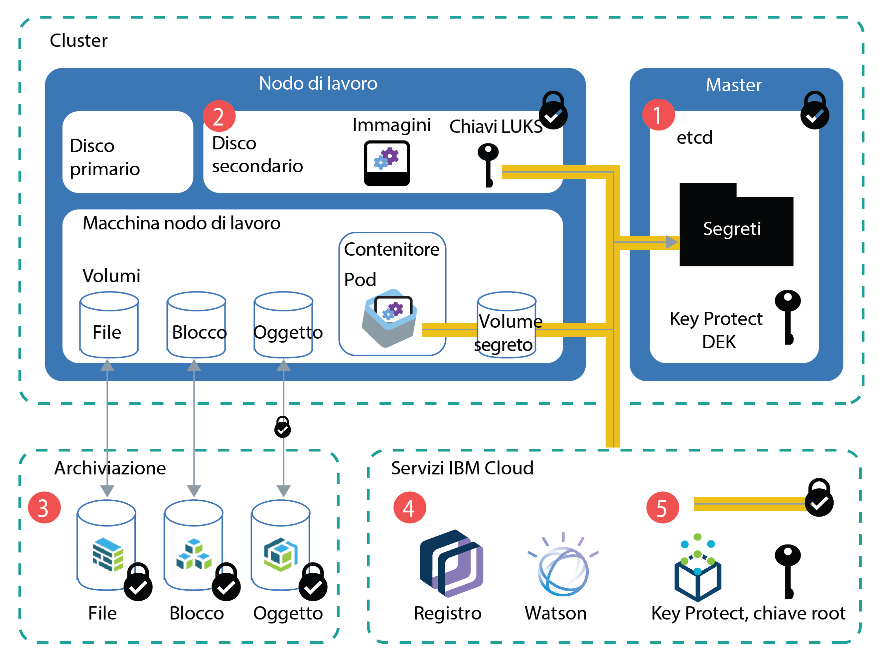

---

copyright:
  years: 2014, 2019
lastupdated: "2019-05-31"

keywords: kubernetes, iks

subcollection: containers

---

{:new_window: target="_blank"}
{:shortdesc: .shortdesc}
{:screen: .screen}
{:pre: .pre}
{:table: .aria-labeledby="caption"}
{:codeblock: .codeblock}
{:tip: .tip}
{:note: .note}
{:important: .important}
{:deprecated: .deprecated}
{:download: .download}
{:preview: .preview}


# Protezione delle informazioni sensibili nel tuo cluster
{: #encryption}

Proteggi le informazioni sensibili del cluster per garantire l'integrità dei dati e impedire che i tuoi dati vengano esposti a utenti non autorizzati.
{: shortdesc}

Puoi creare dati sensibili su diversi livelli nel tuo cluster che richiedono ciascuno una protezione adeguata.
- **Livello di cluster:** i dati di configurazione del cluster vengono memorizzati nel componente etcd del tuo master Kubernetes. I dati in etcd sono memorizzati sul disco locale del master Kubernetes e vengono sottoposti a backup su {{site.data.keyword.cos_full_notm}}. I dati vengono crittografati durante il transito su {{site.data.keyword.cos_full_notm}} e quando inattivi. Puoi scegliere di abilitare la crittografia per i tuoi dati etcd sul disco locale del tuo master Kubernetes [abilitando la crittografia {{site.data.keyword.keymanagementservicelong_notm}}](/docs/containers?topic=containers-encryption#encryption) per il tuo cluster. I dati etcd per i cluster che eseguono una versione precedente di Kubernetes sono memorizzati su un disco crittografato gestito da IBM e sottoposto a backup giornaliero.
- **Livello di applicazione:** quando distribuisci la tua applicazione, non memorizzare informazioni riservate, quali credenziali o chiavi, nel file di configurazione YAML, nelle mappe di configurazione o negli script. Utilizza invece i [segreti Kubernetes ](https://kubernetes.io/docs/concepts/configuration/secret/). Puoi anche [crittografare i dati nei segreti Kubernetes](#keyprotect) per impedire a utenti non autorizzati di accedere alle informazioni sensibili del cluster.

Per ulteriori informazioni sulla protezione del tuo cluster, vedi [Sicurezza per {{site.data.keyword.containerlong_notm}}](/docs/containers?topic=containers-security#security).



_Figura: panoramica della crittografia dei dati in un cluster_

1.  **etcd**: etcd è il componente del master che memorizza i dati delle tue risorse Kubernetes, come i file `.yaml` di configurazione degli oggetti e i segreti. I dati in etcd sono memorizzati sul disco locale del master Kubernetes e vengono sottoposti a backup su {{site.data.keyword.cos_full_notm}}. I dati vengono crittografati durante il transito su {{site.data.keyword.cos_full_notm}} e quando inattivi. Puoi scegliere di abilitare la crittografia per i tuoi dati etcd sul disco locale del tuo master Kubernetes [abilitando la crittografia {{site.data.keyword.keymanagementservicelong_notm}}](#keyprotect) per il tuo cluster. I dati etcd nei cluster che eseguono una versione precedente di Kubernetes sono memorizzati su un disco crittografato gestito da IBM e sottoposto a backup giornaliero. Quando i dati etcd vengono inviati a un pod, i dati vengono crittografati tramite TLS per garantirne la protezione e l'integrità.
2.  **Disco secondario del nodo di lavoro**: il disco secondario del tuo nodo di lavoro è il luogo in cui sono memorizzati il file system del contenitore e le immagini estratte localmente. Il disco è crittografato in AES a 256 bit con una chiave di crittografia LUKS che è univoca per il nodo di lavoro e memorizzata sotto forma di segreto in etcd, gestito da IBM. Quando ricarichi o aggiorni i tuoi nodi di lavoro, le chiavi LUKS vengono ruotate.
3.  **Archiviazione**: puoi scegliere di memorizzare i dati [configurando l'archiviazione persistente di file, blocchi o oggetti](/docs/containers?topic=containers-storage_planning#persistent_storage_overview). Le istanze di archiviazione dell'infrastruttura IBM Cloud (SoftLayer) salvano i dati su dischi crittografati, quindi i tuoi dati inattivi vengono crittografati. Inoltre, se scegli l'archiviazione oggetti vengono crittografati anche i tuoi dati in transito.
4.  **Servizi {{site.data.keyword.Bluemix_notm}}**: puoi [integrare i servizi {{site.data.keyword.Bluemix_notm}}](/docs/containers?topic=containers-service-binding#bind-services), come {{site.data.keyword.registryshort_notm}} o {{site.data.keyword.watson}}, con il tuo cluster. Le credenziali del servizio sono memorizzate in un segreto salvato in etcd, a cui la tua applicazione può accedere montando il segreto come volume o specificando il segreto come variabile di ambiente nella [tua distribuzione](/docs/containers?topic=containers-app#secret).
5.  **{{site.data.keyword.keymanagementserviceshort}}**: quando [abiliti {{site.data.keyword.keymanagementserviceshort}}](#keyprotect) nel tuo cluster, una chiave di crittografia dati (DEK) con wrapping viene memorizzata in etcd. La DEK crittografa i segreti nel tuo cluster, incluse le credenziali del servizio e la chiave LUKS. Poiché la chiave root si trova nella tua istanza {{site.data.keyword.keymanagementserviceshort}}, controlli l'accesso ai tuoi segreti crittografati. Le chiavi {{site.data.keyword.keymanagementserviceshort}} sono protette mediante gli HSM (hardware security module) basati su cloud con certificazione FIPS 140-2 Livello 2 che proteggono contro il furto di informazioni. Per ulteriori informazioni su come funziona la crittografia {{site.data.keyword.keymanagementserviceshort}}, vedi [Crittografia envelope](/docs/services/key-protect/concepts?topic=key-protect-envelope-encryption#envelope-encryption).

## Utilizzo dei segreti
{: #secrets}

I segreti Kubernetes rappresentano un modo sicuro per memorizzare informazioni riservate, quali nome utente, password o
chiavi. Se hai bisogno di informazioni riservate crittografate, [abilita {{site.data.keyword.keymanagementserviceshort}}](#keyprotect) per crittografare i segreti. Per ulteriori informazioni sugli elementi che possono essere memorizzati nei segreti, vedi la [documentazione Kubernetes ](https://kubernetes.io/docs/concepts/configuration/secret/).
{:shortdesc}

Esamina le seguenti attività che richiedono segreti.

### Aggiunta di un servizio a un cluster
{: #secrets_service}

Quando esegui il bind di un servizio a un cluster, non devi creare un segreto per memorizzare le tue credenziali del servizio. Viene creato automaticamente per te. Per ulteriori informazioni, vedi [Aggiunta di servizi {{site.data.keyword.Bluemix_notm}} ai cluster](/docs/containers?topic=containers-service-binding#bind-services).
{: shortdesc}

### Crittografia del traffico alle tue applicazione con i segreti TLS
{: #secrets_tls}

L'ALB bilancia il carico del traffico di rete HTTP alle applicazioni nel tuo cluster. Per bilanciare anche il traffico delle connessioni HTTPS in entrata, puoi configurare l'ALB per decodificare il traffico di rete e inoltrare la richiesta decodificata alle applicazioni esposte nel tuo cluster. Per ulteriori informazioni, vedi la [documentazione sulla configurazione Ingress](/docs/containers?topic=containers-ingress#public_inside_3).
{: shortdesc}

Inoltre, se hai applicazioni che richiedono il protocollo HTTPS e il traffico deve rimanere crittografato, puoi utilizzare i segreti di autenticazione unidirezionale o reciproca con l'annotazione `ssl-services`. Per ulteriori informazioni, vedi la [documentazione sulle annotazioni Ingress](/docs/containers?topic=containers-ingress_annotation#ssl-services).

### Accesso al tuo registro con le credenziali memorizzate in un segreto di pull dell'immagine di Kubernetes
{: #imagepullsecret}

Quando crei un cluster, i segreti per le tue credenziali {{site.data.keyword.registrylong}} vengono creati automaticamente per te nello spazio dei nomi Kubernetes `default`. Tuttavia, devi [creare il tuo proprio segreto di pull dell'immagine per il cluster](/docs/containers?topic=containers-images#other) se vuoi distribuire un contenitore nelle seguenti situazioni.
* Da un'immagine nel tuo registro {{site.data.keyword.registryshort_notm}} a uno spazio dei nomi Kubernetes diverso da `default`.
* Da un'immagine nel tuo registro {{site.data.keyword.registryshort_notm}} che è memorizzata in una diversa regione {{site.data.keyword.Bluemix_notm}} o in un diverso account {{site.data.keyword.Bluemix_notm}}.
* Da un'immagine che è memorizzata in un registro privato esterno.

<br />


## Crittografia del disco locale e dei segreti del master Kubernetes utilizzando {{site.data.keyword.keymanagementserviceshort}} (beta)
{: #keyprotect}

Puoi proteggere il componente etcd nel tuo master Kubernetes e nei segreti Kubernetes utilizzando [{{site.data.keyword.keymanagementservicefull}} ](/docs/services/key-protect?topic=key-protect-getting-started-tutorial) come [provider KMS (key management service) ](https://kubernetes.io/docs/tasks/administer-cluster/kms-provider/) di Kubernetes nel tuo cluster. Il provider KMS è una funzione alpha in Kubernetes versione 1.11, che rende l'integrazione di {{site.data.keyword.keymanagementserviceshort}} una release beta in {{site.data.keyword.containerlong_notm}}.
{: shortdesc}

Per impostazione predefinita, la tua configurazione cluster e i segreti Kubernetes sono memorizzati nel componente etcd del master Kubernetes gestito da IBM. I tuoi nodi di lavoro hanno anche dischi secondari crittografati dalle chiavi LUKS gestite da IBM che sono memorizzate come segreti in etcd. I dati in etcd sono memorizzati sul disco locale del master Kubernetes e vengono sottoposti a backup su {{site.data.keyword.cos_full_notm}}. I dati vengono crittografati durante il transito su {{site.data.keyword.cos_full_notm}} e quando inattivi. Tuttavia, i dati nel tuo componente etcd sul disco locale del master Kubernetes non vengono crittografati automaticamente finché non abiliti la crittografia {{site.data.keyword.keymanagementserviceshort}} per il tuo cluster. I dati etcd per i cluster che eseguono una versione precedente di Kubernetes sono memorizzati su un disco crittografato gestito da IBM e sottoposto a backup giornaliero.

Quando abiliti {{site.data.keyword.keymanagementserviceshort}} nel tuo cluster, la tua chiave root viene utilizzata per crittografare i dati in etcd, inclusi i segreti LUKS. Ottieni un maggiore controllo sui tuoi dati sensibili crittografando i segreti con la tua chiave root. L'uso della tua propria crittografia aggiunge un livello di sicurezza ai tuoi dati etcd e segreti Kubernetes e ti offre un controllo più dettagliato su chi può accedere alle informazioni sensibili del cluster. Se hai bisogno di rimuovere in modo irreversibile l'accesso a etcd o ai tuoi segreti, puoi eliminare la chiave root.

Non eliminare le chiavi root nella tua istanza {{site.data.keyword.keymanagementserviceshort}}. Non eliminare le chiavi anche se le ruoti per utilizzare una nuova chiave. Se elimini una chiave root non puoi accedere ai dati in etcd o ai dati dei segreti presenti nel tuo cluster o rimuoverli.
{: important}

Prima di iniziare:
* [Accedi al tuo account. Se applicabile, specifica il gruppo di risorse appropriato. Imposta il contesto per il tuo cluster.](/docs/containers?topic=containers-cs_cli_install#cs_cli_configure)
* Verifica che il cluster esegua Kubernetes versione 1.11.3_1521 o successiva, eseguendo `ibmcloud ks cluster-get --cluster <cluster_name_or_ID>` e selezionando il campo **Versione**.
* Assicurati di disporre del [ruolo della piattaforma {{site.data.keyword.Bluemix_notm}} IAM **Amministratore**](/docs/containers?topic=containers-users#platform) per il cluster.
* Assicurati che la chiave API impostata per la regione in cui si trova il tuo cluster sia autorizzata a utilizzare Key Protect. Per controllare il proprietario della chiave API di cui sono state memorizzate le credenziali per la regione, esegui `ibmcloud ks api-key-info --cluster <cluster_name_or_ID>`.

Per abilitare {{site.data.keyword.keymanagementserviceshort}} o per aggiornare l'istanza o la chiave root che crittografa i segreti nel cluster:

1.  [Crea un'istanza {{site.data.keyword.keymanagementserviceshort}}](/docs/services/key-protect?topic=key-protect-provision#provision).

2.  Ottieni l'ID dell'istanza del servizio.

    ```
    ibmcloud resource service-instance <kp_instance_name> | grep GUID
    ```
    {: pre}

3.  [Crea una chiave root](/docs/services/key-protect?topic=key-protect-create-root-keys#create-root-keys). Per impostazione predefinita, la chiave root viene creata senza una data di scadenza.

    Devi impostare una data di scadenza per rispettare le politiche di sicurezza interne? [Crea la chiave root utilizzando l'API](/docs/services/key-protect?topic=key-protect-create-root-keys#create-root-key-api) e includi il parametro `expirationDate`. **Importante**: prima che la tua chiave root scada, devi ripetere questi passi per aggiornare il cluster in modo da utilizzare una nuova chiave root. In caso contrario, non puoi decrittografare i tuoi segreti.
    {: tip}

4.  Prendi nota dell'[**ID** della chiave root](/docs/services/key-protect?topic=key-protect-view-keys#view-keys-gui).

5.  Ottieni l'[endpoint {{site.data.keyword.keymanagementserviceshort}}](/docs/services/key-protect?topic=key-protect-regions#service-endpoints) della tua istanza.

6.  Ottieni il nome del cluster per il quale desideri abilitare {{site.data.keyword.keymanagementserviceshort}}.

    ```
    ibmcloud ks clusters
    ```
    {: pre}

7.  Abilita {{site.data.keyword.keymanagementserviceshort}} nel tuo cluster. Compila gli indicatori con le informazioni che hai precedentemente richiamato. Il completamento del processo di abilitazione potrebbe richiedere alcuni minuti.

    ```
    ibmcloud ks key-protect-enable --cluster <cluster_name_or_ID> --key-protect-url <kp_endpoint> --key-protect-instance <kp_instance_ID> --crk <kp_root_key_ID>
    ```
    {: pre}

8.  Durante l'abilitazione, potresti non essere in grado di accedere al master Kubernetes, ad esempio, per aggiornare le configurazioni YAML per le distribuzioni. Nell'output del seguente comando, verifica che il valore di **Master Status** sia **Ready**.
    ```
    ibmcloud ks cluster-get --cluster <cluster_name_or_ID>
    ```
    {: pre}

    Output di esempio quando l'abilitazione è in corso:
    ```
    Name:                   <cluster_name>   
    ID:                     <cluster_ID>   
    ...
    Master Status:          Key Protect feature enablement in progress.  
    ```
    {: screen}

    Output di esempio quando il master è pronto:
    ```
    Name:                   <cluster_name>   
    ID:                     <cluster_ID>   
    ...
    Master Status:          Ready (1 min ago)   
    ```
    {: screen}

    Una volta abilitato {{site.data.keyword.keymanagementserviceshort}} nel cluster, i dati in `etcd`, i segreti esistenti e i nuovi segreti che vengono creati nel cluster vengono crittografati automaticamente utilizzando la tua chiave root {{site.data.keyword.keymanagementserviceshort}}.

9.  Facoltativo: per ruotare la chiave, ripeti questi passi con un nuovo ID chiave root. La nuova chiave root viene aggiunta alla configurazione del cluster insieme alla chiave root precedente, in modo che i dati crittografati esistenti restino protetti.

Non eliminare le chiavi root nella tua istanza {{site.data.keyword.keymanagementserviceshort}}. Non eliminare le chiavi anche se le ruoti per utilizzare una nuova chiave. Se elimini una chiave root non puoi accedere ai dati in etcd o ai dati dei segreti presenti nel tuo cluster o rimuoverli.
{: important}


## Crittografia dei dati utilizzando IBM Cloud Data Shield (Beta)
{: #datashield}

{{site.data.keyword.datashield_short}} è integrato con la tecnologia di Intel® Software Guard Extensions (SGX) e Fortanix® in modo che il codice e i dati dei carichi di lavoro del tuo contenitore {{site.data.keyword.Bluemix_notm}} siano protetti durante l'utilizzo. Il codice e i dati dell'applicazione vengono eseguiti in enclavi con protezione avanzata della CPU, che sono aree di memoria attendibili sul nodo di lavoro che proteggono aspetti critici dell'applicazione, aiutando a mantenere il codice e i dati riservati e invariati.
{: shortdesc}

Quando si tratta di proteggere i tuoi dati, la crittografia è uno dei controlli più popolari ed efficaci. Tuttavia, i dati devono essere crittografati in ogni fase del loro ciclo di vita. I dati passano attraverso tre fasi durante il loro ciclo di vita: dati inattivi, dati dinamici e dati in uso. I dati inattivi e dinamici sono comunemente usati per proteggere i dati quando vengono memorizzati e quando vengono trasportati. Nella fase successiva di tale protezione, puoi quindi crittografare i dati in uso.

Se tu o la tua azienda richiedete la sensibilità dei dati a causa di politiche interne, regolamentazioni governative o requisiti di conformità del settore, questa soluzione potrebbe aiutarvi a passare al cloud. Soluzioni di esempio includono istituzioni finanziarie e sanitarie o paesi con politiche governative che richiedono soluzioni cloud in loco.

Per iniziare, esegui il provisioning di un cluster di lavoro bare metal abilitato per SGX con tipo di macchina mb2c.4x32 e controlla [la documentazione {{site.data.keyword.datashield_short}}](/docs/services/data-shield?topic=data-shield-getting-started#getting-started).
