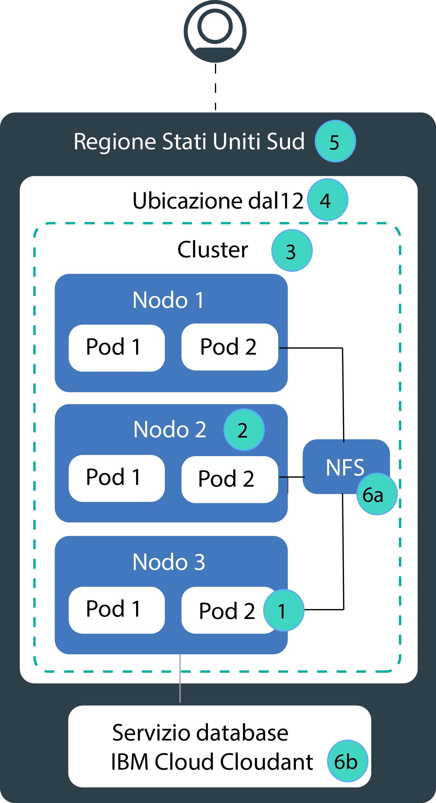

---

copyright:
  years: 2014, 2019
lastupdated: "2019-06-05"

keywords: kubernetes, iks, disaster recovery, dr, ha, hadr

subcollection: containers

---

{:new_window: target="_blank"}
{:shortdesc: .shortdesc}
{:screen: .screen}
{:pre: .pre}
{:table: .aria-labeledby="caption"}
{:codeblock: .codeblock}
{:tip: .tip}
{:note: .note}
{:important: .important}
{:deprecated: .deprecated}
{:download: .download}
{:preview: .preview}

# Alta disponibilità per {{site.data.keyword.containerlong_notm}}
{: #ha}

Utilizza le funzioni integrate di Kubernetes e {{site.data.keyword.containerlong}} per rendere il tuo cluster ancora più disponibile e per proteggere la tua applicazione dai tempi di inattività in caso di errore di un componente nel tuo cluster.
{: shortdesc}

L'alta disponibilità è una disciplina fondamentale in un'infrastruttura IT per mantenere operative le tue applicazioni, anche dopo un'avaria parziale o totale del sito. Lo scopo principale dell'alta disponibilità è eliminare i potenziali punti di errore in un'infrastruttura IT. Ad esempio, puoi tutelarti in caso di errore di un sistema aggiungendo la ridondanza e configurando meccanismi di failover.

Puoi ottenere l'alta disponibilità su diversi livelli della tua infrastruttura IT e all'interno dei vari componenti del tuo cluster. l livello di disponibilità giusto per te dipende da diversi fattori, come i requisiti aziendali, gli SLA (Service Level Agreement) stipulati con i tuoi clienti e il denaro che vuoi spendere.

## Panoramica dei potenziali punti di errore in {{site.data.keyword.containerlong_notm}}
{: #fault_domains}

L'architettura e l'infrastruttura di {{site.data.keyword.containerlong_notm}} sono progettate per garantire affidabilità, bassa latenza di elaborazione e una massima operatività del servizio. Tuttavia, possono verificarsi degli errori. A seconda del servizio che ospiti in {{site.data.keyword.Bluemix_notm}}, potresti non essere in grado di tollerare gli errori, anche se questi errori durano solo pochi minuti.
{: shortdesc}

{{site.data.keyword.containerlong_notm}} fornisce diversi approcci per aggiungere più disponibilità al tuo cluster aggiungendo ridondanza e anti-affinità. Controlla la seguente immagine per informazioni sui potenziali punti di errore e su come eliminarli.

<dl>
<dt> 1. Malfunzionamento del contenitore o del pod.</dt>
  <dd>
I contenitori e i pod sono, come progettati, di breve durata e possono avere un malfunzionamento imprevisto. Ad esempio, un contenitore o un pod potrebbe arrestarsi se si verifica un errore nella tua applicazione. Per rendere la tua applicazione altamente disponibile, devi assicurarti di disporre di un numero sufficiente di istanze della tua applicazione per gestire il carico di lavoro oltre a delle istanze aggiuntive in caso di malfunzionamento. Idealmente, queste istanze sono distribuite su più nodi di lavoro per proteggere la tua applicazione in caso di un malfunzionamento del nodo di lavoro.

  
Vedi [Distribuzione di applicazioni altamente disponibili](/docs/containers?topic=containers-app#highly_available_apps).
</dd>
<dt> 2. Malfunzionamento del nodo di lavoro.</dt>
  <dd>
Un nodo di lavoro è una VM che viene eseguita su un hardware fisico. I malfunzionamenti dei nodi di lavoro includono interruzioni hardware, come alimentazione, raffreddamento o collegamento in rete e problemi nella VM stessa. Puoi tenere conto di un malfunzionamento del nodo di lavoro configurando più nodi di lavoro nel tuo cluster.

Non è garantito che i nodi di lavoro in una zona siano su host di calcolo fisici separati. Ad esempio, potresti avere un cluster con 3 nodi di lavoro, ma tutti e 3 i nodi di lavoro sono stati creati sullo stesso host di calcolo fisico nella zona IBM. Se questo host di calcolo fisico si interrompe, si interromperanno tutti i tuoi nodi di lavoro. Per proteggerti da questo malfunzionamento, devi [configurare un cluster multizona o creare più cluster a zona singola](/docs/containers?topic=containers-ha_clusters#ha_clusters) in zone diverse.

  
Vedi [Creazione di cluster con più nodi di lavoro.](/docs/containers?topic=containers-cli-plugin-kubernetes-service-cli#cs_cluster_create)
</dd>
<dt> 3. Malfunzionamento del cluster.</dt>
  <dd>
Il [master Kubernetes](/docs/containers?topic=containers-ibm-cloud-kubernetes-service-technology#architecture) è il componente principale che mantiene operativo il tuo cluster. Il master archivia le risorse del cluster e le loro configurazioni nel database etcd che funge da SPoT (single point of truth) per il tuo cluster. Il server API Kubernetes funge da punto di ingresso principale per tutte le richieste di gestione del cluster dai nodo di lavoro al master oppure quando vuoi interagire con le tue risorse cluster.  Se si verifica un malfunzionamento del master, i tuoi carichi di lavoro continuano a essere eseguiti sui nodi di lavoro ma non puoi utilizzare i comandi `kubectl` per gestire le tue risorse cluster o visualizzare l'integrità del cluster finché il server API Kubernetes nel master non torna a essere attivo. Se un pod viene disattivato durante l'interruzione del master, non è possibile ripianificarlo finché il nodo di lavoro non potrà raggiungere nuovamente il server API Kubernetes.  Durante un'interruzione del master, puoi continuare a eseguire i comandi `ibmcloud ks` sull'API {{site.data.keyword.containerlong_notm}} per gestire le tue risorse dell'infrastruttura, quali i nodi di lavoro o le VLAN. Se modifichi la configurazione del cluster corrente aggiungendo o rimuovendo nodi di lavoro nel cluster, le tue modifiche diventeranno effettive solo dopo che il master sarà tornato attivo.

Non riavviare un nodo di lavoro durante un'interruzione del master. Questa azione rimuove i pod dal tuo nodo di lavoro. Poiché il server API Kubernetes non è disponibile, i pod non possono essere ripianificati su altri nodi di lavoro nel cluster.
{: important}
 I master cluster sono altamente disponibili e includono repliche per il server API, etcd, il programma di pianificazione e il gestore controller Kubernetes su host separati per proteggerti in caso di interruzione, come durante un aggiornamento del master.

Per proteggere il tuo master del cluster da un malfunzionamento della zona, puoi: <ul><li>Creare un cluster in una [località metropolitana multizona](/docs/containers?topic=containers-regions-and-zones#zones), che estende il master tra le zone.</li><li>Configurare un secondo cluster in un'altra zona.</li></ul>

  
Vedi [Configurazione di cluster altamente disponibili.](/docs/containers?topic=containers-ha_clusters#ha_clusters)
</dd>
<dt> 4. Malfunzionamento della zona.</dt>
  <dd>
Un malfunzionamento della zona riguarda tutti gli host di calcolo fisici e l'archiviazione NFS. I malfunzionamenti includono interruzioni di alimentazione, raffreddamento, collegamento in rete o di archiviazione e disastri naturali, come inondazioni, terremoti e uragani. Per proteggerti da un malfunzionamento della zona, devi disporre di cluster in due ubicazioni diverse il cui carico viene bilanciato dal programma di bilanciamento del carico esterno.

  
Vedi [Configurazione di cluster altamente disponibili](/docs/containers?topic=containers-ha_clusters#ha_clusters).
</dd>    
<dt> 5. Malfunzionamento della regione.</dt>
  <dd>
Ogni regione è configurata con un programma di bilanciamento del carico altamente disponibile accessibile dall'endpoint API specifico della regione. Il programma di bilanciamento del carico instrada le richieste in entrata e in uscita ai cluster nelle zone regionali. La probabilità di un malfunzionamento a livello dell'intera regione è bassa. Tuttavia, per tenere conto di questo malfunzionamento, puoi configurare più cluster in regioni diverse e collegarli utilizzando un programma di bilanciamento del carico esterno. Se si verifica un malfunzionamento in un'intera regione, il cluster nell'altra regione può subentrare e occuparsi del carico di lavoro.

Un cluster per più regioni richiede diverse risorse cloud e, a seconda della tua applicazione, può essere complesso e costoso. Controlla se hai bisogno di una configurazione per più regioni o se puoi gestire una potenziale interruzione del servizio. Se vuoi configurare un cluster per più regioni, assicurati che la tua applicazione e i dati possano essere ospitati in un'altra regione e che l'applicazione possa gestire la replica dei dati globali.

  
Vedi [Configurazione di cluster altamente disponibili](/docs/containers?topic=containers-ha_clusters#ha_clusters).
</dd>   
<dt> 6a, 6b. Malfunzionamento dell'archiviazione.</dt>
  <dd>
In un'applicazione con stato, i dati svolgono un ruolo importante per mantenere operativa la tua applicazione. Assicurati che i tuoi dati siano altamente disponibili in modo da poterli recuperare in caso di malfunzionamento. In {{site.data.keyword.containerlong_notm}}, puoi scegliere tra diverse opzioni per conservare i tuoi dati. Ad esempio, puoi eseguire il provisioning dell'archiviazione NFS utilizzando i volumi persistenti nativi di Kubernetes o memorizzare i tuoi dati utilizzando un servizio di database {{site.data.keyword.Bluemix_notm}}.

  
Vedi [Pianificazione di dati altamente disponibili](/docs/containers?topic=containers-storage_planning#persistent_storage_overview).
</dd>
</dl>
