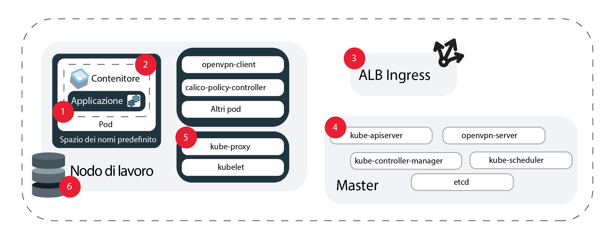

---

copyright:
  years: 2014, 2019
lastupdated: "2019-06-11"

keywords: kubernetes, iks, logmet, logs, metrics

subcollection: containers

---

{:new_window: target="_blank"}
{:shortdesc: .shortdesc}
{:screen: .screen}
{:pre: .pre}
{:table: .aria-labeledby="caption"}
{:codeblock: .codeblock}
{:tip: .tip}
{:note: .note}
{:important: .important}
{:deprecated: .deprecated}
{:download: .download}
{:preview: .preview}


# Registrazione e monitoraggio
{: #health}

Configura la registrazione e il monitoraggio in {{site.data.keyword.containerlong}} per aiutarti a risolvere i problemi e migliorare l'integrità e le prestazioni dei cluster e delle applicazioni Kubernetes.
{: shortdesc}

Il monitoraggio continuo e la registrazione costituiscono la chiave per rilevare gli attacchi al tuo cluster e per risolvere i problemi nel momento in cui si verificano. Monitorando continuamente il tuo cluster, puoi meglio comprenderne la capacità e la disponibilità delle risorse disponibili per la tua applicazione. Con queste conoscenze, puoi prepararti a proteggere le tue applicazioni dai tempi di inattività. **Nota**: per configurare la registrazione e il monitoraggio, devi utilizzare un cluster standard in {{site.data.keyword.containerlong_notm}}.

## Scelta di una soluzione di registrazione
{: #logging_overview}

Per impostazione predefinita, i log vengono generati e scritti localmente per tutti i seguenti componenti cluster di {{site.data.keyword.containerlong_notm}}: nodi di lavoro, contenitori, applicazioni, archiviazione persistente, ALB (application load balancer) Ingress, API Kubernetes e lo spazio dei nomi `kube-system`. Sono disponibili diverse soluzioni di registrazione per raccogliere, inoltrare e visualizzare questi log.
{: shortdesc}

Puoi scegliere la tua soluzione di registrazione in base ai componenti cluster per i quali devi raccogliere i log. Un'implementazione comune è scegliere un servizio di registrazione che preferisci in base alle funzionalità di analisi e interfaccia, come {{site.data.keyword.loganalysisfull}}, {{site.data.keyword.la_full}} o un servizio di terze parti. Puoi quindi utilizzare {{site.data.keyword.cloudaccesstrailfull}} per controllare l'attività utente nel cluster ed eseguire il backup dei log del master cluster in {{site.data.keyword.cos_full}}. **Nota**: per configurare la registrazione, devi avere un cluster Kubernetes standard.

<dl>

<dt>{{site.data.keyword.la_full_notm}}</dt>
<dd>Gestisci i log del contenitore di pod distribuendo LogDNA come servizio di terze parti al tuo cluster. Per utilizzare {{site.data.keyword.la_full_notm}}, devi distribuire un agent di registrazione a ogni nodo di lavoro presente nel tuo cluster. Questo agent raccoglie i log con l'estensione `*.log` e i file senza estensione memorizzati nella directory `/var/log` del tuo pod da tutti gli spazi dei nomi, incluso `kube-system`. L'agent inoltra quindi i log al servizio {{site.data.keyword.la_full_notm}}. Per ulteriori informazioni sul servizio, vedi la documentazione di [{{site.data.keyword.la_full_notm}}](/docs/services/Log-Analysis-with-LogDNA?topic=LogDNA-about). Per iniziare, vedi [Gestione dei log di cluster Kubernetes con {{site.data.keyword.loganalysisfull_notm}} with LogDNA](/docs/services/Log-Analysis-with-LogDNA/tutorials?topic=LogDNA-kube#kube).
</dd>

<dt>Fluentd con {{site.data.keyword.loganalysisfull_notm}}</dt>
<dd><p class="deprecated">In precedenza era possibile creare una configurazione di registrazione per inoltrare i log raccolti dal componente del cluster Fluentd a {{site.data.keyword.loganalysisfull_notm}}. A partire dal 30 aprile 2019, non puoi eseguire il provisioning di nuove istanze {{site.data.keyword.loganalysisshort_notm}} e tutte le istanze del piano Lite vengono eliminate. Le istanze del piano Premium esistenti sono supportate fino al 30 settembre 2019. Per continuare a raccogliere log per il tuo cluster, devi configurare {{site.data.keyword.la_full_notm}} o modificare la tua configurazione in modo che inoltri i log a un server esterno.</p>
</dd>

<dt>Fluentd con un server esterno</dt>
<dd>Per raccogliere, inoltrare e visualizzare i log per un componente cluster, puoi creare una configurazione di registrazione utilizzando Fluentd. Quando crei una configurazione di registrazione, il componente del cluster [Fluentd ](https://www.fluentd.org/) raccoglie i log dai percorsi relativi a un'origine specificata. Fluentd può quindi inoltrare questi log a un server esterno che accetta un protocollo syslog. Per iniziare, vedi [Descrizione del cluster e inoltro del log dell'applicazione a syslog](#logging). </dd>

<dt>{{site.data.keyword.cloudaccesstrailfull_notm}}</dt>
<dd>Per monitorare l'attività amministrativa avviata dall'utente nel tuo cluster, puoi raccogliere e inoltrare i log di controllo a {{site.data.keyword.cloudaccesstrailfull_notm}}. I cluster generano due tipi di eventi {{site.data.keyword.cloudaccesstrailshort}}.
<ul><li>Gli eventi di gestione del cluster vengono generati e inoltrati automaticamente a {{site.data.keyword.cloudaccesstrailshort}}.</li>
<li>Gli eventi di controllo del server API Kubernetes vengono generati automaticamente, ma devi [creare una configurazione di registrazione](#api_forward) affinché Fluentd possa inoltrare questi log a {{site.data.keyword.cloudaccesstrailshort}}.</li></ul>
Per ulteriori informazioni sui tipi di eventi {{site.data.keyword.containerlong_notm}} che puoi tracciare, vedi [Eventi Activity Tracker](/docs/containers?topic=containers-at_events). Per ulteriori informazioni sul servizio, vedi la documentazione di [Activity Tracker](/docs/services/cloud-activity-tracker?topic=cloud-activity-tracker-getting-started).
<p class="note">{{site.data.keyword.containerlong_notm}} non è attualmente configurato per l'utilizzo di {{site.data.keyword.at_full}}. Per gestire gli eventi di gestione cluster e i log di controllo dell'API Kubernetes, continua a utilizzare {{site.data.keyword.cloudaccesstrailfull_notm}} con LogAnalysis.</p>
</dd>

<dt>{{site.data.keyword.cos_full_notm}}</dt>
<dd>Per raccogliere, inoltrare e visualizzare i log per il master Kubernetes del tuo cluster, puoi eseguire in qualsiasi momento un'istantanea dei tuoi log master per raccoglierli in un bucket {{site.data.keyword.cos_full_notm}}. L'istantanea include tutto ciò che viene inviato tramite il server API, come la pianificazione di pod, le distribuzioni o le politiche RBAC. Per iniziare, vedi [Raccolta dei log master](#collect_master).</dd>

<dt>Servizi di terze parti</dt>
<dd>Se hai esigenze speciali, puoi configurare la tua propria soluzione di registrazione. Controlla i servizi di registrazione di terze parti che puoi aggiungere al tuo cluster in [Integrazioni di registrazione e monitoraggio](/docs/containers?topic=containers-supported_integrations#health_services). Puoi raccogliere i log del contenitore dal percorso `/var/log/pods/`.</dd>

</dl>

<br />


## Inoltro dei log del cluster e delle applicazioni a {{site.data.keyword.la_full_notm}}
{: #logdna}

Gestisci i log del contenitore di pod distribuendo LogDNA come servizio di terze parti al tuo cluster.
{: shortdesc}

Per utilizzare {{site.data.keyword.la_full_notm}}, devi distribuire un agent di registrazione a ogni nodo di lavoro presente nel tuo cluster. Questo agent raccoglie i log con l'estensione `*.log` e i file senza estensione memorizzati nella directory `/var/log` del tuo pod da tutti gli spazi dei nomi, incluso `kube-system`. L'agent inoltra quindi i log al servizio {{site.data.keyword.la_full_notm}}. Per ulteriori informazioni sul servizio, vedi la documentazione di [{{site.data.keyword.la_full_notm}}](/docs/services/Log-Analysis-with-LogDNA?topic=LogDNA-about). Per iniziare, vedi [Gestione dei log di cluster Kubernetes con {{site.data.keyword.loganalysisfull_notm}} with LogDNA](/docs/services/Log-Analysis-with-LogDNA/tutorials?topic=LogDNA-kube#kube).

<br />


## Obsoleto: inoltro dei log di controllo di API Kubernetes, applicazioni e cluster a {{site.data.keyword.loganalysisfull_notm}}
{: #loga}

In precedenza era possibile creare una configurazione di registrazione per inoltrare i log raccolti dal componente del cluster Fluentd a {{site.data.keyword.loganalysisfull_notm}}. A partire dal 30 aprile 2019, {{site.data.keyword.loganalysisfull_notm}} è obsoleto. Non puoi eseguire il provisioning di nuove istanze {{site.data.keyword.loganalysisshort_notm}} e tutte le istanze del piano Lite vengono eliminate. Le istanze del piano Premium esistenti sono supportate fino al 30 settembre 2019.
{: deprecated}

Per continuare a raccogliere i log per il tuo cluster, sono disponibili le seguenti opzioni:
* Configura {{site.data.keyword.la_full_notm}}. Per ulteriori informazioni, vedi [Transizione a {{site.data.keyword.la_full_notm}}](/docs/services/CloudLogAnalysis?topic=cloudloganalysis-transition).
* [Modifica la tua configurazione in modo che inoltri i log a un server esterno](#configuring).

Per ulteriori informazioni sulle istanze {{site.data.keyword.loganalysisshort_notm}} esistenti, vedi la [documentazione {{site.data.keyword.loganalysisshort_notm}}](/docs/services/CloudLogAnalysis?topic=cloudloganalysis-containers_kube_other_logs).

<br />


## Inoltro dei log di controllo di API Kubernetes, applicazioni e cluster a un server esterno
{: #configuring}

Configura l'inoltro del log per i cluster standard {{site.data.keyword.containerlong_notm}} a un server esterno.
{: shortdesc}

### Descrizione dell'inoltro dei log a un server esterno
{: #logging}

Per impostazione predefinita, i log vengono raccolti dal componente aggiuntivo [Fluentd ](https://www.fluentd.org/) nel tuo cluster. Quando crei una configurazione di registrazione per un'origine nel tuo cluster, come ad esempio un contenitore, i log che Fluentd raccoglie dai percorsi di tale origine vengono inoltrati a un server esterno. Il traffico dall'origine al servizio di registrazione sulla porta di inserimento è crittografato.
{: shortdesc}

**Quali sono le origini per cui posso configurare l'inoltro dei log?**

Nella seguente immagine puoi vedere l'ubicazione delle origini per cui puoi configurare la registrazione.



1. `worker`: informazioni specifiche per la configurazione dell'infrastruttura del tuo nodo di lavoro. I log del nodo di lavoro vengono acquisiti in syslog e contengono eventi del sistema operativo. In `auth.log` puoi trovare informazioni sulle richieste di autenticazione che vengono effettuate al sistema operativo.</br>**Percorsi**:
    * `/var/log/syslog`
    * `/var/log/auth.log`

2. `container`: informazioni che vengono registrate da un contenitore in esecuzione.</br>**Percorsi**: qualsiasi cosa scritta in `STDOUT` o `STDERR`.

3. `application`: informazioni sugli eventi che si verificano a livello dell'applicazione. Potrebbe essere una notifica indicante che si è verificato un evento, ad esempio un accesso riuscito, un'avvertenza relativa all'archiviazione o altre operazioni che possono essere eseguite a livello dell'applicazione. </br>**Percorsi**: puoi impostare i percorsi a cui vengono inoltrati i tuoi log. Tuttavia, per poter inviare i log, devi utilizzare un percorso assoluto nella tua configurazione della registrazione altrimenti i log non potranno essere letti. Se il tuo percorso viene montato nel tuo nodo di lavoro, potresti aver creato un collegamento simbolico. Esempio: se il percorso specificato è `/usr/local/spark/work/app-0546/0/stderr` ma i log in realtà vanno a `/usr/local/spark-1.0-hadoop-1.2/work/app-0546/0/stderr`, i log non potranno essere letti.

4. `storage`: informazioni sull'archiviazione persistente configurata nel tuo cluster. I log di archiviazione possono aiutarti a configurare dashboard e avvisi di determinazione dei problemi come parte delle tue release di produzione e pipeline DevOps. **Nota**: i percorsi`/var/log/kubelet.log` e `/var/log/syslog` contengono anche log di archiviazione, ma i log di questi percorsi vengono raccolti dalle origini log `kubernetes` e `worker`.</br>**Percorsi**:
    * `/var/log/ibmc-s3fs.log`
    * `/var/log/ibmc-block.log`

  **Pod**:
    * `portworx-***`
    * `ibmcloud-block-storage-attacher-***`
    * `ibmcloud-block-storage-driver-***`
    * `ibmcloud-block-storage-plugin-***`
    * `ibmcloud-object-storage-plugin-***`

5. `kubernetes`: informazioni da kubelet, kube-proxy e altri eventi Kubernetes che si verificano nello spazio dei nomi kube-system del nodo di lavoro.</br>**Percorsi**:
    * `/var/log/kubelet.log`
    * `/var/log/kube-proxy.log`
    * `/var/log/event-exporter/1..log`

6. `kube-audit`: informazioni sulle azioni relative al cluster che vengono inviate al server API Kubernetes, inclusi l'ora, l'utente e la risorsa interessata.

7. `ingress`: informazioni sul traffico di rete che entra in un cluster tramite l'ALB Ingress.</br>**Percorsi**:
    * `/var/log/alb/ids/*.log`
    * `/var/log/alb/ids/*.err`
    * `/var/log/alb/customerlogs/*.log`
    * `/var/log/alb/customerlogs/*.err`

</br>

**Quali sono le opzioni di configurazione a mia disposizione?**

La tabella riportata di seguito mostra le diverse opzioni a tua disposizione quando configuri la registrazione e le relative descrizioni.

<table>
<caption> Descrizione delle opzioni di configurazione della registrazione</caption>
  <thead>
    <th>Opzione</th>
    <th>Descrizione</th>
  </thead>
  <tbody>
    <tr>
      <td><code><em>&lt;cluster_name_or_ID&gt;</em></code></td>
      <td>Il nome o l'ID del cluster.</td>
    </tr>
    <tr>
      <td><code><em>--log_source</em></code></td>
      <td>L'origine da cui vuoi inoltrare i log. I valori accettati sono <code>container</code>, <code>application</code>, <code>worker</code>, <code>kubernetes</code>, <code>ingress</code>, <code>storage</code> e <code>kube-audit</code>. Questo argomento supporta un elenco separato da virgole di origini log a cui applicare la configurazione. Se non fornisci un'origine log, le configurazioni di registrazione vengono create per le origini log <code>container</code> e <code>ingress</code>.</td>
    </tr>
    <tr>
      <td><code><em>--type syslog</em></code></td>
      <td>Il valore <code>syslog</code> inoltra i tuoi log a un server esterno.</p>
      </dd></td>
    </tr>
    <tr>
      <td><code><em>--namespace</em></code></td>
      <td>Facoltativo: lo spazio dei nomi Kubernetes da cui vuoi inoltrare i log. L'inoltro del log non è supportato per gli spazi dei nomi Kubernetes <code>ibm-system</code> e <code>kube-system</code>. Questo valore è valido solo per l'origine log <code>container</code>. Se non specifichi uno spazio dei nomi, tutti gli spazi dei nomi nel cluster utilizzeranno questa configurazione.</td>
    </tr>
    <tr>
      <td><code><em>--hostname</em></code></td>
      <td><p>Per {{site.data.keyword.loganalysisshort_notm}}, utilizza l'[URL di inserimento](/docs/services/CloudLogAnalysis?topic=cloudloganalysis-log_ingestion#log_ingestion_urls). Se non specifichi un URL di inserimento, viene utilizzato l'endpoint per la regione in cui hai creato il tuo cluster.</p>
      <p>Per syslog, specifica il nome host o l'indirizzo IP del servizio di raccolta log.</p></td>
    </tr>
    <tr>
      <td><code><em>--port</em></code></td>
      <td>La porta di inserimento. Se non specifichi una porta, viene utilizzata la porta standard <code>9091</code>.
      <p>Per syslog, specifica la porta del server di raccolta log. Se non specifichi una porta, viene utilizzata la porta standard <code>514</code>.</td>
    </tr>
    <tr>
      <td><code><em>--app-containers</em></code></td>
      <td>Facoltativo: per inoltrare i log dalle applicazioni, puoi specificare il nome del contenitore che contiene la tua applicazione. Puoi specificare più di un contenitore utilizzando un elenco separato da virgole. Se non si specificano i contenitori, i log vengono inoltrati da tutti i contenitori che contengono i percorsi da te forniti.</td>
    </tr>
    <tr>
      <td><code><em>--app-paths</em></code></td>
      <td>Il percorso su un contenitore a cui accedono le applicazioni. Per inoltrare i log con il tipo di origine <code>application</code>, devi fornire un percorso. Per specificare più di un percorso, utilizza un elenco separato da virgole. Esempio: <code>/var/log/myApp1/*,/var/log/myApp2/*</code></td>
    </tr>
    <tr>
      <td><code><em>--syslog-protocol</em></code></td>
      <td>Quando il tipo di registrazione è <code>syslog</code>, il protocollo del livello di trasporto. Puoi usare i seguenti protocolli: `udp`, `tls` o `tcp`. Quando esegui l'inoltro a un server rsyslog con il protocollo <code>udp</code>, i log superiori a 1KB vengono troncati.</td>
    </tr>
    <tr>
      <td><code><em>--ca-cert</em></code></td>
      <td>Obbligatorio: quando il tipo di registrazione è <code>syslog</code> e il protocollo è <code>tls</code>, il nome del segreto Kubernetes che contiene il certificato di autorità di certificazione (CA, certificate authority).</td>
    </tr>
    <tr>
      <td><code><em>--verify-mode</em></code></td>
      <td>Quando il tipo di registrazione è <code>syslog</code> e il protocollo è <code>tls</code>, la modalità di verifica. I valori supportati sono <code>verify-peer</code> e il valore predefinito <code>verify-none</code>.</td>
    </tr>
    <tr>
      <td><code><em>--skip-validation</em></code></td>
      <td>Facoltativo: ignora la convalida dei nomi di organizzazione e spazio quando vengono specificati. La mancata convalida riduce il tempo di elaborazione, ma una configurazione di registrazione non valida non inoltrerà correttamente i log.</td>
    </tr>
  </tbody>
</table>

**Sono responsabile dell'aggiornamento di Fluentd?**

Per modificare le configurazioni della registrazione o del filtraggio, la versione del componente aggiuntivo di registrazione Fluentd deve essere la più recente. Per impostazione predefinita, gli aggiornamenti automatici per il componente aggiuntivo sono abilitati. Per disabilitare gli aggiornamenti automatici, vedi [Aggiornamento dei componenti aggiuntivi del cluster: Fluentd per la registrazione](/docs/containers?topic=containers-update#logging-up).

**Posso inoltrare solo alcuni log da un'origine nel mio cluster?**

Sì. Ad esempio, se hai un pod particolarmente ridondante, puoi impedire che i log di tale pod occupino spazio di archiviazione, consentendo comunque l'inoltro dei log di altri pod. Per impedire che i log di uno specifico pod vengano inoltrati, vedi [Filtraggio dei log](#filter-logs).

<br />


### Inoltro dei log del cluster e delle applicazioni
{: #enable-forwarding}

Crea una configurazione per la registrazione del cluster e delle applicazioni. Puoi differenziare tra le diverse opzioni di registrazione usando gli indicatori.
{: shortdesc}

**Inoltro dei log al tuo server sui protocolli `udp` o `tcp`**

1. Assicurati di disporre del [ruolo della piattaforma {{site.data.keyword.Bluemix_notm}} IAM **Editor** o **Amministratore**](/docs/containers?topic=containers-users#platform).

2. Per il cluster in cui si trova l'origine log: [accedi al tuo account. Se applicabile, specifica il gruppo di risorse appropriato. Imposta il contesto per il tuo cluster.](/docs/containers?topic=containers-cs_cli_install#cs_cli_configure)

3. Imposta un server che accetti un protocollo syslog in uno dei due seguenti modi:
  * Configura e gestisci il tuo proprio server o utilizza un provider per gestirlo al tuo posto. Se un provider gestisce il server al tuo posto, richiama l'endpoint di registrazione dal provider di registrazione.

  * Esegui syslog da un contenitore. Ad esempio, puoi utilizzare questo [file .yaml di distribuzione ](https://github.com/IBM-Cloud/kube-samples/blob/master/deploy-apps-clusters/deploy-syslog-from-kube.yaml) per recuperare un'immagine pubblica Docker che esegue un contenitore nel tuo cluster. L'immagine pubblica la porta `514` sull'indirizzo IP del cluster pubblico e utilizza questo indirizzo IP per configurare l'host syslog.

  Puoi vedere i tuoi log come JSON validi rimuovendo i prefissi syslog. Per eseguire tale operazione, aggiungi il seguente codice all'inizio del tuo file <code>etc/rsyslog.conf</code> in cui è in esecuzione il tuo server rsyslog: <code>$template customFormat,"%msg%\n"</br>$ActionFileDefaultTemplate customFormat</code>
  {: tip}

4. Crea una configurazione di inoltro dei log.
    ```
    ibmcloud ks logging-config-create --cluster <cluster_name_or_ID> --logsource <log_source> --namespace <kubernetes_namespace> --hostname <log_server_hostname_or_IP> --port <log_server_port> --type syslog --app-containers <containers> --app-paths <paths_to_logs> --syslog-protocol <protocol> --skip-validation
    ```
    {: pre}

</br></br>

**Inoltro dei log al tuo server sul protocollo `tls`**

I passi riportati di seguito sono istruzioni generali. Prima di utilizzare il contenitore in un ambiente di produzione, assicurati che vengano soddisfatti i requisiti di sicurezza necessari.
{: tip}

1. Assicurati di avere i seguenti [ruoli IAM {{site.data.keyword.Bluemix_notm}}](/docs/containers?topic=containers-users#platform):
    * Ruolo della piattaforma **Editor** o **Amministratore** per il cluster
    * Ruolo del servizio **Scrittore** o **Gestore** per lo spazio dei nomi `kube-system`

2. Per il cluster in cui si trova l'origine log: [accedi al tuo account. Se applicabile, specifica il gruppo di risorse appropriato. Imposta il contesto per il tuo cluster.](/docs/containers?topic=containers-cs_cli_install#cs_cli_configure)

3. Imposta un server che accetti un protocollo syslog in uno dei due seguenti modi:
  * Configura e gestisci il tuo proprio server o utilizza un provider per gestirlo al tuo posto. Se un provider gestisce il server al tuo posto, richiama l'endpoint di registrazione dal provider di registrazione.

  * Esegui syslog da un contenitore. Ad esempio, puoi utilizzare questo [file .yaml di distribuzione ](https://github.com/IBM-Cloud/kube-samples/blob/master/deploy-apps-clusters/deploy-syslog-from-kube.yaml) per recuperare un'immagine pubblica Docker che esegue un contenitore nel tuo cluster. L'immagine pubblica la porta `514` sull'indirizzo IP del cluster pubblico e utilizza questo indirizzo IP per configurare l'host syslog. Devi inserire l'autorità di certificazione (CA, certificate authority) pertinente e i certificati del lato server e aggiornare il file `syslog.conf` per abilitare `tls` sul tuo server.

4. Salva il tuo certificato dell'autorità di certificazione (CA, certificate authority) in un file denominato `ca-cert`. Deve essere esattamente questo nome.

5. Crea un segreto nello spazio dei nomi `kube-system` per il file `ca-cert`. Quando crei la tua configurazione di registrazione, utilizzi il nome del segreto per l'indicatore `--ca-cert`.
    ```
    kubectl -n kube-system create secret generic --from-file=ca-cert
    ```
    {: pre}

6. Crea una configurazione di inoltro dei log.
    ```
    ibmcloud ks logging-config-create --cluster <cluster name or id> --logsource <log source> --type syslog --syslog-protocol tls --hostname <ip address of syslog server> --port <port for syslog server, 514 is default> --ca-cert <secret name> --verify-mode <defaults to verify-none>
    ```
    {: pre}

### Inoltro dei log di controllo dell'API Kubernetes
{: #audit_enable}

Per controllare gli eventi trasmessi attraverso il tuo server API Kubernetes, puoi creare una configurazione per l'inoltro degli eventi al tuo server esterno.
{: shortdesc}

Per ulteriori informazioni sui log di controllo Kubernetes, consulta l'<a href="https://kubernetes.io/docs/tasks/debug-application-cluster/audit/" target="blank">argomento di controllo </a> nella documentazione Kubernetes.

* Al momento, viene utilizzata una politica di controllo predefinita per tutti i cluster con questa configurazione di registrazione.
* Al momento, i filtri non sono supportati.
* Può essere presente solo una configurazione `kube-audit` per cluster, ma puoi inoltrare i log a {{site.data.keyword.cloudaccesstrailshort}} e a un server esterno creando una configurazione di registrazione e un webhook.
* Devi disporre del [ruolo della piattaforma {{site.data.keyword.Bluemix_notm}} IAM **Amministratore**](/docs/containers?topic=containers-users#platform) per il cluster.

**Prima di iniziare**

1. Configura un server di registrazione remoto dove puoi inoltrare i log. Ad esempio, puoi [utilizzare Logstash con Kubernetes ](https://kubernetes.io/docs/tasks/debug-application-cluster/audit/#use-logstash-to-collect-and-distribute-audit-events-from-webhook-backend) per raccogliere gli eventi di controllo.

2. Per il cluster da cui vuoi raccogliere i log di controllo del server API: [accedi al tuo account. Se applicabile, specifica il gruppo di risorse appropriato. Imposta il contesto per il tuo cluster.](/docs/containers?topic=containers-cs_cli_install#cs_cli_configure)

Per inoltrare i log di controllo dell'API Kubernetes:

1. Configura il webhook. Se non fornisci alcuna informazione negli indicatori, viene utilizzata una configurazione predefinita.

    ```
    ibmcloud ks apiserver-config-set audit-webhook <cluster_name_or_ID> --remoteServer <server_URL_or_IP> --caCert <CA_cert_path> --clientCert <client_cert_path> --clientKey <client_key_path>
    ```
    {: pre}

  <table>
  <caption>Descrizione dei componenti di questo comando</caption>
    <thead>
      <th colspan=2> Descrizione dei componenti di questo comando</th>
    </thead>
    <tbody>
      <tr>
        <td><code><em>&lt;cluster_name_or_ID&gt;</em></code></td>
        <td>Il nome o l'ID del cluster.</td>
      </tr>
      <tr>
        <td><code><em>&lt;server_URL&gt;</em></code></td>
        <td>L'URL o l'indirizzo IP del servizio di registrazione remoto a cui vuoi inviare i log. Se fornisci un URL server non protetto i certificati vengono ignorati.</td>
      </tr>
      <tr>
        <td><code><em>&lt;CA_cert_path&gt;</em></code></td>
        <td>Il percorso del file per il certificato CA utilizzato per verificare il servizio di registrazione remoto.</td>
      </tr>
      <tr>
        <td><code><em>&lt;client_cert_path&gt;</em></code></td>
        <td>Il percorso del file per il certificato client utilizzato per l'autenticazione con il servizio di registrazione remoto.</td>
      </tr>
      <tr>
        <td><code><em>&lt;client_key_path&gt;</em></code></td>
        <td>Il percorso del file per la chiave client corrispondente utilizzata per il collegamento al servizio di registrazione remoto.</td>
      </tr>
    </tbody>
  </table>

2. Verifica che l'inoltro dei log sia stato abilitato visualizzando l'URL per il servizio di registrazione remoto.

    ```
    ibmcloud ks apiserver-config-get audit-webhook <cluster_name_or_ID>
    ```
    {: pre}

    Output di esempio:
    ```
    OK
    Server:			https://8.8.8.8
    ```
    {: screen}

3. Applica l'aggiornamento della configurazione riavviando il master Kubernetes.

    ```
    ibmcloud ks apiserver-refresh --cluster <cluster_name_or_ID>
    ```
    {: pre}

4. Facoltativo: se vuoi arrestare l'inoltro dei log di controllo, puoi disabilitare la tua configurazione.
    1. Per il cluster da cui vuoi interrompere la raccolta dei log di controllo del server API: [accedi al tuo account. Se applicabile, specifica il gruppo di risorse appropriato. Imposta il contesto per il tuo cluster.](/docs/containers?topic=containers-cs_cli_install#cs_cli_configure)
    2. Disabilita la configurazione back-end webhook per il server API del cluster.

        ```
        ibmcloud ks apiserver-config-unset audit-webhook <cluster_name_or_ID>
        ```
        {: pre}

    3. Applica l'aggiornamento della configurazione riavviando il master Kubernetes.

        ```
        ibmcloud ks apiserver-refresh --cluster <cluster_name_or_ID>
        ```
        {: pre}

### Filtraggio dei log inoltrati
{: #filter-logs}

Puoi scegliere quali log inoltrare al tuo server esterno eliminando tramite filtro specifici log per un periodo di tempo. Puoi differenziare tra le diverse opzioni di filtraggio usando gli indicatori.
{: shortdesc}

<table>
<caption>Descrizione delle opzioni per il filtraggio log</caption>
  <thead>
    <th colspan=2> Descrizione delle opzioni di filtraggio log</th>
  </thead>
  <tbody>
    <tr>
      <td>&lt;cluster_name_or_ID&gt;</td>
      <td>Obbligatorio: il nome o l'ID del cluster per il quale desideri filtrare i log.</td>
    </tr>
    <tr>
      <td><code>&lt;log_type&gt;</code></td>
      <td>Il tipo di log a cui desideri applicare il filtro. Attualmente sono supportati <code>all</code>, <code>container</code> e <code>host</code>.</td>
    </tr>
    <tr>
      <td><code>&lt;configs&gt;</code></td>
      <td>Facoltativo: un elenco separato da virgole dei tuoi ID di configurazione di registrazione. Se non viene fornito, il filtro viene applicato a tutte le configurazioni di registrazione cluster passate al filtro. Puoi visualizzare le configurazioni di registrazione che corrispondono al filtro utilizzando l'opzione <code>--show-matching-configs</code>.</td>
    </tr>
    <tr>
      <td><code>&lt;kubernetes_namespace&gt;</code></td>
      <td>Facoltativo: lo spazio dei nomi Kubernetes da cui vuoi inoltrare i log. Questo indicatore si applica solo quando utilizzi il tipo di log <code>container</code>.</td>
    </tr>
    <tr>
      <td><code>&lt;container_name&gt;</code></td>
      <td>Facoltativo: il nome del contenitore da cui desideri filtrare i log.</td>
    </tr>
    <tr>
      <td><code>&lt;logging_level&gt;</code></td>
      <td>Facoltativo: filtra i log che si trovano al livello specificato e a quelli inferiori ad esso. I valori accettabili nel loro ordine canonico sono <code>fatal</code>, <code>error</code>, <code>warn/warning</code>, <code>info</code>, <code>debug</code> e <code>trace</code>. Ad esempio, se hai filtrato i log a livello <code>info</code>, vengono filtrati anche <code>debug</code> e <code>trace</code>. **Nota**: puoi utilizzare questo indicatore solo quando i messaggi di log sono in formato JSON e contengono un campo di livello. Per visualizzare i tuoi messaggi in JSON, aggiungi l'indicatore <code>--json</code> al comando.</td>
    </tr>
    <tr>
      <td><code>&lt;message&gt;</code></td>
      <td>Facoltativo: filtra i log che contengono un messaggio specificato scritto come un'espressione regolare.</td>
    </tr>
    <tr>
      <td><code>&lt;filter_ID&gt;</code></td>
      <td>Facoltativo: l'ID del filtro di log.</td>
    </tr>
    <tr>
      <td><code>--show-matching-configs</code></td>
      <td>Facoltativo: mostra le configurazioni di registrazione a cui applicare ciascun filtro.</td>
    </tr>
    <tr>
      <td><code>--all</code></td>
      <td>Facoltativo: elimina tutti i tuoi filtri di inoltro del log.</td>
    </tr>
  </tbody>
</table>

1. Crea un filtro di registrazione.
  ```
  ibmcloud ks logging-filter-create --cluster <cluster_name_or_ID> --type <log_type> --logging-configs <configs> --namespace <kubernetes_namespace> --container <container_name> --level <logging_level> --regex-message <message>
  ```
  {: pre}

2. Visualizza il filtro di log che hai creato.

  ```
  ibmcloud ks logging-filter-get --cluster <cluster_name_or_ID> --id <filter_ID> --show-matching-configs
  ```
  {: pre}

3. Aggiorna il filtro di log che hai creato.
  ```
  ibmcloud ks logging-filter-update --cluster <cluster_name_or_ID> --id <filter_ID> --type <server_type> --logging-configs <configs> --namespace <kubernetes_namespace --container <container_name> --level <logging_level> --regex-message <message>
  ```
  {: pre}

4. Elimina un filtro di log che hai creato.

  ```
  ibmcloud ks logging-filter-rm --cluster <cluster_name_or_ID> --id <filter_ID> [--all]
  ```
  {: pre}

### Verifica, aggiornamento ed eliminazione dell'inoltro dei log
{: #verifying-log-forwarding}

**Verifica**</br>
Puoi verificare che la tua configurazione sia impostata correttamente in uno dei due seguenti modi:

* Per elencare tutte le configurazioni di registrazione in un cluster:
  ```
  ibmcloud ks logging-config-get --cluster <cluster_name_or_ID>
  ```
  {: pre}

* Per elencare le configurazioni di registrazione per un tipo di origine log:
  ```
  ibmcloud ks logging-config-get --cluster <cluster_name_or_ID> --logsource <source>
  ```
  {: pre}

**Aggiornamento**</br>
Puoi aggiornare una configurazione di registrazione che hai già creato:
```
ibmcloud ks logging-config-update --cluster <cluster_name_or_ID> --id <log_config_id> --namespace <namespace> --type <server_type> --syslog-protocol <protocol> --logsource <source> --hostname <hostname_or_ingestion_URL> --port <port> --space <cluster_space> --org <cluster_org> --app-containers <containers> --app-paths <paths_to_logs>
```
{: pre}

**Eliminazione**</br>
Puoi arrestare l'inoltro dei log eliminando una o tutte le configurazioni di registrazione per un cluster:

* Per eliminare una configurazione di registrazione:
  ```
  ibmcloud ks logging-config-rm --cluster <cluster_name_or_ID> --id <log_config_ID>
  ```
  {: pre}

* Per eliminare tutte le configurazioni di registrazione:
  ```
  ibmcloud ks logging-config-rm --cluster <my_cluster> --all
  ```
  {: pre}

<br />


## Inoltro dei log di controllo dell'API Kubernetes a {{site.data.keyword.cloudaccesstrailfull_notm}}
{: #api_forward}

Kubernetes controlla automaticamente tutti gli eventi trasmessi tramite il tuo server API Kubernetes. Puoi inoltrare gli eventi a {{site.data.keyword.cloudaccesstrailfull_notm}}.
{: shortdesc}

Per ulteriori informazioni sui log di controllo Kubernetes, consulta l'<a href="https://kubernetes.io/docs/tasks/debug-application-cluster/audit/" target="blank">argomento di controllo </a> nella documentazione Kubernetes.

* Al momento, viene utilizzata una politica di controllo predefinita per tutti i cluster con questa configurazione di registrazione.
* Al momento, i filtri non sono supportati.
* Può essere presente solo una configurazione `kube-audit` per cluster, ma puoi inoltrare i log a {{site.data.keyword.cloudaccesstrailshort}} e a un server esterno creando una configurazione di registrazione e un webhook.
* Devi disporre del [ruolo della piattaforma {{site.data.keyword.Bluemix_notm}} IAM **Amministratore**](/docs/containers?topic=containers-users#platform) per il cluster.

{{site.data.keyword.containerlong_notm}} non è attualmente configurato per l'utilizzo di {{site.data.keyword.at_full}}. Per gestire i log di controllo dell'API Kubernetes, continua a utilizzare {{site.data.keyword.cloudaccesstrailfull_notm}} con LogAnalysis.
{: note}

**Prima di iniziare**

1. Verifica le autorizzazioni. Se hai specificato uno spazio quando hai creato il cluster, sia il proprietario dell'account che il proprietario della chiave {{site.data.keyword.containerlong_notm}} necessitano delle autorizzazioni di Gestore, Sviluppatore o Revisore in quello spazio.

2. Per il cluster da cui vuoi raccogliere i log di controllo del server API: [accedi al tuo account. Se applicabile, specifica il gruppo di risorse appropriato. Imposta il contesto per il tuo cluster.](/docs/containers?topic=containers-cs_cli_install#cs_cli_configure)

**Inoltro dei log**

1. Crea una configurazione di registrazione.

    ```
    ibmcloud ks logging-config-create --cluster <cluster_name_or_ID> --logsource kube-audit --space <cluster_space> --org <cluster_org> --hostname <ingestion_URL> --type ibm
    ```
    {: pre}

    Esempio di comando e output:

    ```
    ibmcloud ks logging-config-create --cluster myCluster --logsource kube-audit
    Creating logging configuration for kube-audit logs in cluster myCluster...
    OK
    Id                                     Source      Namespace   Host                                   Port     Org    Space   Server Type   Protocol  Application Containers   Paths
    14ca6a0c-5bc8-499a-b1bd-cedcf40ab850   kube-audit    -         ingest-au-syd.logging.bluemix.net✣    9091✣     -       -         ibm          -              -                  -

    ✣ Indicates the default endpoint for the {{site.data.keyword.loganalysisshort_notm}} service.

    ```
    {: screen}

    <table>
    <caption>Descrizione dei componenti di questo comando</caption>
      <thead>
        <th colspan=2> Descrizione dei componenti di questo comando</th>
      </thead>
      <tbody>
        <tr>
          <td><code><em>&lt;cluster_name_or_ID&gt;</em></code></td>
          <td>Il nome o l'ID del cluster.</td>
        </tr>
        <tr>
          <td><code><em>&lt;ingestion_URL&gt;</em></code></td>
          <td>L'endpoint a cui vuoi inoltrare i log. Se non specifichi un [URL di inserimento](/docs/services/CloudLogAnalysis?topic=cloudloganalysis-log_ingestion#log_ingestion_urls), viene utilizzato l'endpoint per la regione in cui hai creato il tuo cluster.</td>
        </tr>
        <tr>
          <td><code><em>&lt;cluster_space&gt;</em></code></td>
          <td>Facoltativo: il nome dello spazio Cloud Foundry a cui vuoi inviare i log. Quando inoltri i log a {{site.data.keyword.loganalysisshort_notm}}, lo spazio e l'organizzazione sono specificati nel punto di inserimento. Se non specifichi uno spazio, i log vengono inviati al livello dell'account.</td>
        </tr>
        <tr>
          <td><code><em>&lt;cluster_org&gt;</em></code></td>
          <td>Il nome dell'organizzazione Cloud Foundry in cui si trova lo spazio. Questo valore è obbligatorio se hai specificato uno spazio.</td>
        </tr>
      </tbody>
    </table>

2. Visualizza la tua configurazione di registrazione del cluster per verificare che sia stata implementata nel modo che volevi.

    ```
    ibmcloud ks logging-config-get --cluster <cluster_name_or_ID>
    ```
    {: pre}

    Esempio di comando e output:
    ```
    ibmcloud ks logging-config-get --cluster myCluster
    Retrieving cluster myCluster logging configurations...
    OK
    Id                                     Source        Namespace   Host                                 Port    Org   Space   Server Type  Protocol  Application Containers   Paths
    a550d2ba-6a02-4d4d-83ef-68f7a113325c   container     *           ingest-au-syd.logging.bluemix.net✣  9091✣   -     -         ibm           -          -              -
    14ca6a0c-5bc8-499a-b1bd-cedcf40ab850   kube-audit    -           ingest-au-syd.logging.bluemix.net✣  9091✣   -     -         ibm           -          -              -       
    ```
    {: screen}

3. Per visualizzare gli eventi di controllo dell'API Kubernetes che inoltri:
  1. Accedi al tuo account {{site.data.keyword.Bluemix_notm}}.
  2. Dal catalogo, esegui il provisioning di un'istanza del servizio {{site.data.keyword.cloudaccesstrailshort}} nello stesso account della tua istanza di {{site.data.keyword.containerlong_notm}}.
  3. Nella scheda **Gestisci** del dashboard {{site.data.keyword.cloudaccesstrailshort}}, seleziona il dominio di account o spazio.
    * **Log di account**: gli eventi di gestione del cluster e gli eventi di controllo del server API Kubernetes sono disponibili nel **dominio account** relativo alla regione {{site.data.keyword.Bluemix_notm}} in cui vengono generati gli eventi.
    * **Log dello spazio**: se hai specificato uno spazio quando durante l'impostazione della configurazione delle tue registrazioni nella fase 2, questi eventi sono disponibili nel **dominio spazio** associato allo spazio Cloud Foundry in cui è stato eseguito il provisioning del servizio {{site.data.keyword.cloudaccesstrailshort}}.
  4. Fai clic su **Visualizza in Kibana**.
  5. Imposta l'intervallo di tempo per il quale desideri visualizzare i log. Il valore predefinito è 24 ore.
  6. Per restringere la ricerca, puoi fare clic sull'icona di modifica per `ActivityTracker_Account_Search_in_24h` e aggiungere campi nella colonna **Campi disponibili**.

  Per consentire ad altri utenti di visualizzare eventi di account e di spazio, vedi [Concessione di autorizzazioni per visualizzare gli eventi di account](/docs/services/cloud-activity-tracker/how-to?topic=cloud-activity-tracker-grant_permissions#grant_permissions).
  {: tip}

<br />


## Raccolta dei log master in un bucket di {{site.data.keyword.cos_full_notm}}
{: #collect_master}

Con {{site.data.keyword.containerlong_notm}}, puoi eseguire in qualsiasi momento un'istantanea dei tuoi log master per raccoglierli in un bucket {{site.data.keyword.cos_full_notm}}. L'istantanea include tutto ciò che viene inviato tramite il server API, come la pianificazione di pod, le distribuzioni o le politiche RBAC.
{: shortdesc}

Poiché i log del server API Kubernetes vengono trasmessi automaticamente, vengono anche eliminati automaticamente per fare spazio ai nuovi log in arrivo. Mantenendo un'istantanea dei log di un momento specifico, puoi meglio risolvere i problemi, esaminare le differenze di utilizzo e individuare i modelli per mantenere applicazioni più sicure.

**Prima di iniziare**

* [Esegui il provisioning di un'istanza](/docs/services/cloud-object-storage/basics?topic=cloud-object-storage-gs-dev) di {{site.data.keyword.cos_short}} dal catalogo {{site.data.keyword.Bluemix_notm}}.
* Assicurati di disporre del [ruolo della piattaforma {{site.data.keyword.Bluemix_notm}} IAM **Amministratore**](/docs/containers?topic=containers-users#platform) per il cluster.

**Creazione di un'istantanea**

1. Crea un bucket di Object Storage tramite la console {{site.data.keyword.Bluemix_notm}} seguendo [questa esercitazione introduttiva](/docs/services/cloud-object-storage?topic=cloud-object-storage-getting-started#gs-create-buckets).

2. Genera le [credenziali del servizio HMAC](/docs/services/cloud-object-storage/iam?topic=cloud-object-storage-service-credentials) nel bucket che hai creato.
  1. Nella scheda **Credenziali del servizio** del dashboard {{site.data.keyword.cos_short}}, fai clic su **Nuova credenziale**.
  2. Fornisci alle credenziali HMAC il ruolo del servizio `Scrittore`.
  3. Nel campo **Aggiungi parametri di configurazione inline **, specifica `{"HMAC":true}`.

3. Tramite la CLI, effettua una richiesta per un'istantanea dei tuoi log master.

  ```
  ibmcloud ks logging-collect --cluster <cluster name or ID> --cos-bucket <COS_bucket_name> --cos-endpoint <location_of_COS_bucket> --hmac-key-id <HMAC_access_key_ID> --hmac-key <HMAC_access_key>
  ```
  {: pre}

  <table>
  <caption>Descrizione dei componenti di questo comando</caption>
    <thead>
      <th colspan=2> Descrizione dei componenti di questo comando</th>
    </thead>
    <tbody>
      <tr>
        <td><code>--cluster <em>&lt;cluster_name_or_ID&gt;</em></code></td>
        <td>Il nome o l'ID del cluster.</td>
      </tr>
      <tr>
        <td><code>--cos-bucket <em>&lt;COS_bucket_name&gt;</em></code></td>
        <td>Il nome del bucket {{site.data.keyword.cos_short}} in cui vuoi memorizzare i tuoi log.</td>
      </tr>
      <tr>
        <td><code>--cos-endpoint <em>&lt;location_of_COS_bucket&gt;</em></code></td>
        <td>L'endpoint {{site.data.keyword.cos_short}} regionale, interregionale o a livello di singolo data center per il bucket in cui archivi i tuoi log. Per gli endpoint disponibili, vedi [Endpoint e ubicazioni di archiviazione](/docs/services/cloud-object-storage/basics?topic=cloud-object-storage-endpoints) nella documentazione di {{site.data.keyword.cos_short}}.</td>
      </tr>
      <tr>
        <td><code>--hmac-key-id <em>&lt;HMAC_access_key_ID&gt;</em></code></td>
        <td>L'ID univoco per le credenziali HMAC della tua istanza {{site.data.keyword.cos_short}}.</td>
      </tr>
      <tr>
        <td><code>--hmac-key <em>&lt;HMAC_access_key&gt;</em></code></td>
        <td>La chiave HMAC per la tua istanza {{site.data.keyword.cos_short}}.</td>
      </tr>
    </tbody>
  </table>

  Comando e risposta di esempio:

  ```
  ibmcloud ks logging-collect --cluster mycluster --cos-bucket mybucket --cos-endpoint s3-api.us-geo.objectstorage.softlayer.net --hmac-key-id e2e7f5c9fo0144563c418dlhi3545m86 --hmac-key c485b9b9fo4376722f692b63743e65e1705301ab051em96j
  There is no specified log type. The default master will be used.
  Submitting log collection request for master logs for cluster mycluster...
  OK
  The log collection request was successfully submitted. To view the status of the request run ibmcloud ks logging-collect-status mycluster.
  ```
  {: screen}

4. Controlla lo stato della tua richiesta. Il completamento dell'istantanea potrebbe richiedere alcuni minuti, ma puoi verificare se la richiesta è stata completata o meno. Puoi trovare il nome del file che contiene i tuoi log master nella risposta e utilizzare la console {{site.data.keyword.Bluemix_notm}} per scaricare il file.

  ```
  ibmcloud ks logging-collect-status --cluster <cluster_name_or_ID>
  ```
  {: pre}

  Output di esempio:

  ```
  ibmcloud ks logging-collect-status --cluster mycluster
  Getting the status of the last log collection request for cluster mycluster...
  OK
  State     Start Time             Error   Log URLs
  success   2018-09-18 16:49 PDT   - s3-api.us-geo.objectstorage.softlayer.net/mybucket/master-0-0862ae70a9ae6c19845ba3pc0a2a6o56-1297318756.tgz
  s3-api.us-geo.objectstorage.softlayer.net/mybucket/master-1-0862ae70a9ae6c19845ba3pc0a2a6o56-1297318756.tgz
  s3-api.us-geo.objectstorage.softlayer.net/mybucket/master-2-0862ae70a9ae6c19845ba3pc0a2a6o56-1297318756.tgz
  ```
  {: screen}

<br />


## Scelta di una soluzione di monitoraggio
{: #view_metrics}

Le metriche ti aiutano a monitorare l'integrità e le prestazioni dei tuoi cluster. Puoi utilizzare le funzioni di runtime del contenitore e Kubernetes standard per monitorare l'integrità dei tuoi cluster e delle tue applicazioni. **Nota**: il monitoraggio è supportato solo per i cluster standard.
{:shortdesc}

**IBM monitora il mio cluster?**

Ogni master Kubernetes viene continuamente monitorato da IBM. {{site.data.keyword.containerlong_notm}} esegue automaticamente la scansione di ogni nodo in cui viene distribuito il master Kubernetes alla ricerca di vulnerabilità trovate nelle correzioni di sicurezza specifiche del sistema operativo e di Kubernetes. Se vengono trovate delle vulnerabilità,
{{site.data.keyword.containerlong_notm}} automaticamente applica le correzioni
e risolve le vulnerabilità per conto dell'utente per garantire la protezione del nodo master. Sei responsabile del monitoraggio e dell'analisi dei log per il resto dei tuoi componenti cluster.

Per evitare conflitti quando si utilizzano i servizi di metrica, assicurati che i cluster tra i gruppi di risorse e le regioni abbiano nomi univoci.
{: tip}

<dl>
  <dt>{{site.data.keyword.mon_full_notm}}</dt>
    <dd>Ottieni visibilità operativa sulle prestazioni e sull'integrità delle tue applicazioni distribuendo Sysdig come servizio di terze parti ai tuoi nodi di lavoro per inoltrare le metriche a {{site.data.keyword.monitoringlong}}. Per ulteriori informazioni, vedi [Analizza le metriche per un'applicazione distribuita in un cluster Kubernetes](/docs/services/Monitoring-with-Sysdig/tutorials?topic=Sysdig-kubernetes_cluster#kubernetes_cluster).</dd>

  <dt>Dashboard Kubernetes</dt>
    <dd>Il dashboard Kubernetes è un'interfaccia web di amministrazione in cui puoi esaminare lo stato dei nodi di lavoro, trovare risorse Kubernetes, distribuire applicazioni inserite in un contenitore e risolvere problemi con le informazioni di registrazione e monitoraggio. Per ulteriori informazioni su come
accedere al tuo dashboard Kubernetes, consulta [Avvio del dashboard Kubernetes per {{site.data.keyword.containerlong_notm}}](/docs/containers?topic=containers-app#cli_dashboard).</dd>

  <dt>Obsoleto: dashboard delle metriche della pagina di panoramica del cluster della console {{site.data.keyword.Bluemix_notm}} e output di <code>ibmcloud ks cluster - get</code></dt>
    <dd>{{site.data.keyword.containerlong_notm}} fornisce informazioni sull'integrità
e capacità del tuo cluster e sull'utilizzo delle tue risorse del cluster. Puoi utilizzare questa console per ridimensionare il tuo cluster, gestire la tua archiviazione persistente e aggiungere ulteriori funzionalità al cluster attraverso il bind del servizio {{site.data.keyword.Bluemix_notm}}. Per visualizzare le metriche, passa al dashboard **Kubernetes** > **Cluster**, seleziona un cluster e fai clic sul link **Metriche**.
  <p class="deprecated">Il link al dashboard delle metriche contenuto nella pagina di panoramica del cluster della console {{site.data.keyword.Bluemix_notm}} e nell'output di `ibmcloud ks cluster-get` è obsoleto. I cluster creati dopo il 3 maggio 2019 non vengono creati con il link al dashboard delle metriche. I cluster creati entro il 3 maggio 2019 continuano ad avere il link al dashboard delle metriche.</p></dd>

  <dt>{{site.data.keyword.monitoringlong_notm}}</dt>
    <dd><p>Le metriche per i cluster standard si trovano nell'account {{site.data.keyword.Bluemix_notm}} a cui è stato effettuato l'accesso quando è stato creato il cluster Kubernetes. Se quando hai creato il cluster hai specificato uno spazio {{site.data.keyword.Bluemix_notm}}, le metriche si trovano in quello spazio. Le metriche di contenitore sono raccolte automaticamente per tutti i contenitori distribuiti in un cluster. Queste metriche vengono inviate e rese disponibili tramite Grafana. Per ulteriori informazioni sulle metriche, vedi [Monitoraggio per il {{site.data.keyword.containerlong_notm}}](/docs/services/cloud-monitoring/containers?topic=cloud-monitoring-monitoring_bmx_containers_ov#monitoring_bmx_containers_ov).</p>
    <p>Per accedere al dashboard Grafana, vai a uno dei seguenti URL e seleziona l'account o lo spazio {{site.data.keyword.Bluemix_notm}} in cui hai creato il cluster.</p>
    <table summary="La prima riga nella tabella si estende su entrambe le colonne. Le righe rimanenti devono essere lette da sinistra a destra, con la zona server nella colonna uno e gli indirizzi IP corrispondenti nella colonna due.">
      <caption>Gli indirizzi IP da aprire per il traffico di monitoraggio</caption>
            <thead>
            <th>Regione {{site.data.keyword.containerlong_notm}}</th>
            <th>Indirizzo di monitoraggio</th>
            <th>Sottoreti di monitoraggio</th>
            </thead>
          <tbody>
            <tr>
             <td>Europa Centrale</td>
             <td><code>metrics.eu-de.bluemix.net</code></td>
             <td><code>158.177.65.80/30</code></td>
            </tr>
            <tr>
             <td>Regno Unito Sud</td>
             <td><code>metrics.eu-gb.bluemix.net</code></td>
             <td><code>169.50.196.136/29</code></td>
            </tr>
            <tr>
              <td>Stati Uniti Est, Stati Uniti Sud, Asia Pacifico Nord, Asia Pacifico Sud</td>
              <td><code>metrics.ng.bluemix.net</code></td>
              <td><code>169.47.204.128/29</code></td>
             </tr>
            </tbody>
          </table> </dd>
</dl>

### Altri strumenti di monitoraggio dell'integrità
{: #health_tools}

Puoi configurare altri strumenti per ulteriori funzionalità di monitoraggio.
<dl>
  <dt>Prometheus</dt>
    <dd>Prometheus è uno strumento di monitoraggio, registrazione e avviso open source progettato per Kubernetes. Lo strumento richiama informazioni dettagliate sul cluster, sui nodi di lavoro e sull'integrità della distribuzione in base alle informazioni di registrazione di Kubernetes. Per ulteriori informazioni sulla configurazione, vedi le [istruzioni su CoreOS
](https://github.com/coreos/prometheus-operator/tree/master/contrib/kube-prometheus).</dd>
</dl>

<br />


## Visualizzazione degli stati del cluster
{: #states}

Esamina lo stato di un cluster Kubernetes per ottenere informazioni sulla disponibilità e capacità del cluster e sui potenziali problemi che potrebbero verificarsi.
{:shortdesc}

Per visualizzare informazioni relative a un cluster specifico, come zone, URL endpoint del servizio, dominio secondario Ingress, versione e proprietario, utilizza il [comando `ibmcloud ks cluster-get --cluster <cluster_name_or_ID>`](/docs/containers?topic=containers-cli-plugin-kubernetes-service-cli#cs_cluster_get). Includi l'indicatore `--showResources` per visualizzare più risorse del cluster come i componenti aggiuntivi per i pod di archiviazione o le VLAN di sottorete per IP pubblici e privati.

Puoi esaminare le informazioni sul cluster globale, il master gestito da IBM e i tuoi nodi di lavoro. Per risolvere i problemi relativi al cluster e ai nodi di lavoro, vedi [Risoluzione dei problemi dei cluster](/docs/containers?topic=containers-cs_troubleshoot#debug_clusters).

### Stati cluster
{: #states_cluster}

Puoi visualizzare lo stato del cluster corrente eseguendo il comando `ibmcloud ks clusters` e individuando il campo **Stato**. 
{: shortdesc}

<table summary="Ogni riga della tabella deve essere letta da sinistra verso destra, con lo stato del cluster nella prima colonna e un descrizione nella seconda colonna.">
<caption>Stati cluster</caption>
   <thead>
   <th>Stato cluster</th>
   <th>Descrizione</th>
   </thead>
   <tbody>
<tr>
   <td>`Aborted`</td>
   <td>L'eliminazione del cluster viene richiesta dall'utente prima che il master Kubernetes venga distribuito. Al termine dell'eliminazione del cluster, questo viene rimosso dal tuo dashboard. Se il tuo cluster rimane bloccato in questo stato per molto tempo, apri un [caso di supporto {{site.data.keyword.Bluemix_notm}}](/docs/containers?topic=containers-cs_troubleshoot#ts_getting_help).</td>
   </tr>
 <tr>
     <td>`Critical`</td>
     <td>Il master Kubernetes non può essere raggiunto o tutti i nodi di lavoro nel cluster sono inattivi. </td>
    </tr>
   <tr>
     <td>`Delete failed`</td>
     <td>Non è possibile eliminare il master Kubernetes o almeno uno dei nodi di lavoro.  </td>
   </tr>
   <tr>
     <td>`Deleted`</td>
     <td>Il cluster viene eliminato ma non ancora rimosso dal tuo dashboard. Se il tuo cluster rimane bloccato in questo stato per molto tempo, apri un [caso di supporto {{site.data.keyword.Bluemix_notm}}](/docs/containers?topic=containers-cs_troubleshoot#ts_getting_help). </td>
   </tr>
   <tr>
   <td>`Deleting`</td>
   <td>Il cluster viene eliminato e la relativa infrastruttura viene smantellata. Non puoi accedere al cluster.  </td>
   </tr>
   <tr>
     <td>`Deploy failed`</td>
     <td>Non è stato possibile completare la distribuzione del master Kubernetes. Non puoi risolvere questo stato. Contatta il supporto IBM Cloud aprendo un [caso di supporto {{site.data.keyword.Bluemix_notm}}](/docs/containers?topic=containers-cs_troubleshoot#ts_getting_help).</td>
   </tr>
     <tr>
       <td>`Deploying`</td>
       <td>Il master Kubernetes non è ancora stato completamente distribuito. Non puoi accedere al tuo cluster. Attendi fino alla completa distribuzione del cluster per verificarne l'integrità.</td>
      </tr>
      <tr>
       <td>`Normal`</td>
       <td>Tutti i nodi di lavoro in un cluster sono attivi e in esecuzione. Puoi accedere al cluster e distribuire le applicazioni al cluster. Questo stato è considerato come integro e non richiede un'azione da parte tua.<p class="note">Anche se i nodi di lavoro possono essere normali, le altre risorse dell'infrastruttura, come [rete](/docs/containers?topic=containers-cs_troubleshoot_network) e [archiviazione](/docs/containers?topic=containers-cs_troubleshoot_storage), potrebbero necessitare ancora di attenzione. Se hai appena creato il cluster, alcune delle sue parti utilizzate da altri servizi, quali i segreti Ingress o i segreti di pull dell'immagine di registro, potrebbero essere ancora in elaborazione.</p></td>
    </tr>
      <tr>
       <td>`Pending`</td>
       <td>Il master Kubernetes è stato distribuito. Sta venendo eseguito il provisioning dei nodi di lavoro e non sono ancora disponibili nel cluster. Puoi accedere al cluster, ma non puoi distribuire le applicazioni al cluster.  </td>
     </tr>
   <tr>
     <td>`Requested`</td>
     <td>Viene inviata una richiesta per creare il cluster e ordinare l'infrastruttura per il master Kubernetes e i nodi di lavoro. Quando viene avviata la distribuzione del cluster, lo stato del cluster cambia in <code>Deploying</code>. Se il tuo cluster rimane bloccato nello stato <code>Requested</code> per molto tempo, apri un [caso di supporto {{site.data.keyword.Bluemix_notm}}](/docs/containers?topic=containers-cs_troubleshoot#ts_getting_help). </td>
   </tr>
   <tr>
     <td>`Updating`</td>
     <td>Il server API Kubernetes eseguito nel master Kubernetes viene aggiornato a una nuova versione dell'API Kubernetes. Durante l'aggiornamento, non è possibile accedere o modificare il cluster. I nodi di lavoro, le applicazioni e le risorse che sono state distribuite dall'utente non vengono modificate e continuano a essere eseguite. Attendi il completamento dell'aggiornamento per verificare l'integrità del tuo cluster. </td>
   </tr>
   <tr>
    <td>`Unsupported`</td>
    <td>La [versione di Kubernetes](/docs/containers?topic=containers-cs_versions#cs_versions) eseguita dal cluster non è più supportata. L'integrità del tuo cluster non è più monitorata attivamente o segnalata. Inoltre, non puoi aggiungere né ricaricare i nodi di lavoro. Per continuare a ricevere importanti aggiornamenti di sicurezza e supporto, devi aggiornare il cluster. Consulta le [azioni di preparazione dell'aggiornamento della versione](/docs/containers?topic=containers-cs_versions#prep-up), quindi [aggiorna il tuo cluster](/docs/containers?topic=containers-update#update) a una versione supportata di Kubernetes.<br><br><p class="note">I cluster la cui versione precede di tre o più versioni la versione più vecchia supportata non possono essere aggiornati. Per evitare questa situazione, puoi aggiornare il cluster a una versione di Kubernetes che precede di non oltre tre versioni quella corrente, come ad esempio dalla 1.12 alla 1.14. Inoltre, se il tuo cluster esegue la versione 1.5, 1.7 o 1.8, la versione è troppo obsoleta per procedere all'aggiornamento. Devi invece [creare un cluster](/docs/containers?topic=containers-clusters#clusters) e [distribuire le tue applicazioni](/docs/containers?topic=containers-app#app) al cluster.</p></td>
   </tr>
    <tr>
       <td>`Warning`</td>
       <td>Almeno un nodo di lavoro nel cluster non è disponibile, ma altri lo sono e possono subentrare nel carico di lavoro. </td>
    </tr>
   </tbody>
 </table>


### Stati del master
{: #states_master}

Il tuo {{site.data.keyword.containerlong_notm}} include un master gestito da IBM con repliche altamente disponibili, aggiornamenti della patch di sicurezza automatici e ripristino automatico in caso di incidente. Puoi controllare l'integrita e lo stato del master cluster eseguendo `ibmcloud ks cluster-get --cluster <cluster_name_or_ID>`.
{: shortdesc} 

**Master Health**<br>
L'integrità del master (**Master Health**) rispecchia lo stato dei componenti del master e segnala l'eventuale necessità di intervento dell'utente. Lo stato di integrità può essere uno dei seguenti:
*   `error`: il master non è operativo. IBM viene avvisato automaticamente e interviene per risolvere il problema. Puoi continuare a monitorare lo stato di integrazione del master finché non diventa `normal`.
*   `normal`: il master è operativo e integro. Non è richiesta alcuna azione.
*   `unavailable`: il master potrebbe non essere accessibile, il che significa che alcune azioni come il ridimensionamento di un pool di nodi di lavoro è temporaneamente non disponibile. IBM viene avvisato automaticamente e interviene per risolvere il problema. Puoi continuare a monitorare lo stato di integrazione del master finché non diventa `normal`. 
*   `unsupported`: il master esegue una versione non supportata di Kubernetes. Devi[aggiornare il tuo cluster](/docs/containers?topic=containers-update) per riportare il master allo stato di integrità `normal`.

**Master Status e Master State**<br>
Il **Master Status** fornisce dettagli sull'operazione in corso da quando è cambiato lo stato del master. Questo stato indica da quanto tempo il master è nello stesso stato, ad esempio `Ready (1 month ago)`. Il **Master State** rispecchia il ciclo di vita delle operazioni che potrebbero essere eseguite sul master, quali la distribuzione, l'aggiornamento e l'eliminazione. La seguente tabella descrive ciascuno stato.

<table summary="Ogni riga della tabella deve essere letta da sinistra a destra, con lo stato del master nella prima colonna e una descrizione nella seconda colonna.">
<caption>Stati del master</caption>
   <thead>
   <th>Stato del master</th>
   <th>Descrizione</th>
   </thead>
   <tbody>
<tr>
   <td>`deployed`</td>
   <td>Il master è stato distribuito correttamente. Controlla lo stato per verificare che il master sia `Ready` o per vedere se è disponibile un aggiornamento.</td>
   </tr>
 <tr>
     <td>`deploying`</td>
     <td>La distribuzione del master è in corso. Attendi che lo stato diventi `deployed` prima di utilizzare il cluster, ad esempio per aggiungere nodi di lavoro.</td>
    </tr>
   <tr>
     <td>`deploy_failed`</td>
     <td>Il master non è stato distribuito. Il supporto IBM riceve una notifica dell'errore e lavora alla risoluzione del problema. Controlla il campo **Master Status** per ulteriori informazioni o attendi che lo stato diventi `deployed`.</td>
   </tr>
   <tr>
   <td>`deleting`</td>
   <td>È in corso l'eliminazione del master a causa dell'eliminazione del cluster. Non puoi annullare un'eliminazione. Una volta eliminato il cluster, non puoi più controllare lo stato del master perché il cluster viene completamente rimosso.</td>
   </tr>
     <tr>
       <td>`delete_failed`</td>
       <td>Il master non è riuscito a effettuare un'eliminazione. Il supporto IBM riceve una notifica dell'errore e lavora alla risoluzione del problema. Non puoi risolvere il problema tentando di eliminare di nuovo il cluster. Verifica, invece, il campo **Master status** per ulteriori informazioni o attendi l'eliminazione del cluster.</td>
      </tr>
      <tr>
       <td>`updating`</td>
       <td>Il master sta aggiornando la sua versione di Kubernetes. L'aggiornamento potrebbe essere un aggiornamento patch applicato automaticamente o una versione principale o secondaria che applichi con l'aggiornamento del cluster. Durante l'aggiornamento, il tuo master altamente disponibile può continuare l'elaborazione delle richieste e i nodi e i carichi di lavoro della tua applicazione continuano a essere eseguiti. Una volta completato l'aggiornamento del master, puoi [aggiornare i tuoi nodi di lavoro](/docs/containers?topic=containers-update#worker_node).<br><br>
       Se l'aggiornamento non ha esito positivo, il master ritorna allo stato `deployed` e continua a essere eseguito nella versione precedente. Il supporto IBM riceve una notifica dell'errore e lavora alla risoluzione del problema. Puoi verificare se l'aggiornamento non è riuscito, nel campo **Master Status**.</td>
    </tr>
   </tbody>
 </table>


### Stati del nodo di lavoro
{: #states_workers}

Puoi visualizzare lo stato del nodo di lavoro corrente eseguendo il comando `ibmcloud ks workers --cluster <cluster_name_or_ID` e individuando i campi **State** e **Status**.
{: shortdesc}

<table summary="Ogni riga della tabella deve essere letta da sinistra verso destra, con lo stato del cluster nella prima colonna e un descrizione nella seconda colonna.">
<caption>Stati del nodo di lavoro</caption>
  <thead>
  <th>Stato nodo di lavoro</th>
  <th>Descrizione</th>
  </thead>
  <tbody>
<tr>
    <td>`Critical`</td>
    <td>Un nodo di lavoro può entrare in uno stato Critical per diversi motivi: <ul><li>Hai effettuato un riavvio per il tuo nodo di lavoro senza prima delimitarlo e svuotarlo. Il riavvio di un nodo di lavoro può causare il danneggiamento dei dati in <code>containerd</code>, <code>kubelet</code>, <code>kube-proxy</code> e <code>calico</code>. </li>
    <li>I pod distribuiti sul tuo nodo di lavoro non utilizzano limiti di risorse per [memoria ](https://kubernetes.io/docs/tasks/configure-pod-container/assign-memory-resource/) e [CPU ](https://kubernetes.io/docs/tasks/configure-pod-container/assign-cpu-resource/). Senza limiti di risorse, i pod possono consumare tutte le risorse disponibili, senza lasciare risorse per altri pod da eseguire su questo nodo di lavoro. Questo eccesso del carico di lavoro causa un errore per il nodo di lavoro. </li>
    <li><code>containerd</code>, <code>kubelet</code> o <code>calico</code> sono entrati in uno stato irreversibile dopo aver eseguito centinaia o migliaia di contenitori nel tempo. </li>
    <li>Hai configurato una VRA (Virtual Router Appliance) per il tuo nodo di lavoro che è diventato inattivo e ha interrotto le comunicazioni tra il nodo di lavoro e il master Kubernetes. </li><li> Problemi di rete correnti in {{site.data.keyword.containerlong_notm}} o nell'infrastruttura IBM Cloud (SoftLayer) che comportano un errore di comunicazione tra il tuo nodo di lavoro e il master Kubernetes.</li>
    <li>Il tuo nodo di lavoro ha esaurito la capacità. Controlla lo stato (<strong>Status</strong>) del nodo di lavoro per vedere se indica una condizione di <strong>Out of disk</strong> o <strong>Out of memory</strong>. Se il tuo nodo di lavoro ha esaurito la capacità, puoi ridurre il carico di lavoro sul nodo di lavoro o aggiungere un nodo di lavoro al tuo cluster per bilanciare il carico di lavoro.</li>
    <li>Il dispositivo è stato spento dall'[elenco di risorse della console {{site.data.keyword.Bluemix_notm}} ](https://cloud.ibm.com/resources). Apri l'elenco risorse e trova il tuo ID nodo di lavoro nell'elenco **Dispositivi**. Nel menu delle azioni, fai clic su **Accendi**.</li></ul>
    In molti casi, [ricaricare](/docs/containers?topic=containers-cli-plugin-kubernetes-service-cli#cs_worker_reload) il nodo di lavoro può risolvere il problema. Quando ricarichi il tuo nodo di lavoro, verrà applicata la [versione patch](/docs/containers?topic=containers-cs_versions#version_types)
più recente. La versione principale e quella secondaria non cambiano. Prima di ricaricare il tuo nodo di lavoro, assicurati di delimitarlo e svuotarlo per garantire che i pod esistenti vengano terminati normalmente e ripianificati sui nodi di lavoro rimanenti. </br></br> Se il ricaricamento del nodo di lavoro non risolve il problema, vai al passo successivo per continuare a risolvere il problema. </br></br><strong>Suggerimento:</strong> puoi [configurare i controlli dell'integrità per il nodo di lavoro e abilitare l'Autorecovery](/docs/containers?topic=containers-health#autorecovery). Se Autorecovery rileva un nodo di lavoro non integro in base ai controlli configurati, attiva un'azione correttiva come un ricaricamento del sistema operativo sul nodo di lavoro. Per ulteriori informazioni su come funziona Autorecovery, vedi il [blog Autorecovery ](https://www.ibm.com/blogs/bluemix/2017/12/autorecovery-utilizes-consistent-hashing-high-availability/).
    </td>
   </tr>
   <tr>
   <td>`Deployed`</td>
   <td>Gli aggiornamenti sono stati distribuiti correttamente al tuo nodo di lavoro. Dopo la distribuzione degli aggiornamenti, {{site.data.keyword.containerlong_notm}} avvia un controllo dell'integrità sul nodo di lavoro. Dopo che il controllo dell'integrità è stato eseguito con esito positivo, il nodo di lavoro passa a uno stato di <code>Normal</code>. I nodi di lavoro in uno stato <code>Deployed</code> di norma sono pronti a ricevere carichi di lavoro, che puoi controllare eseguendo <code>kubectl get nodes</code> e confermando che lo stato si presenta come <code>Normal</code>. </td>
   </tr>
    <tr>
      <td>`Deploying`</td>
      <td>Quando aggiorni la versione di Kubernetes del tuo nodo di lavoro, il nodo di lavoro viene ridistribuito per installare gli aggiornamenti. Se ricarichi o riavvii il tuo nodo di lavoro, esso viene ridistribuito per installare automaticamente la versione patch più recente. Se il tuo nodo di lavoro rimane bloccato in questo stato per molto tempo, vai al passo successivo per controllare se si è verificato un problema durante la distribuzione. </td>
   </tr>
      <tr>
      <td>`Normal`</td>
      <td>È stato eseguito il provisioning completo del tuo nodo di lavoro ed è pronto per essere utilizzato nel cluster. Questo stato è considerato come integro e non richiede un'azione da parte dell'utente. **Nota**: anche se i nodi di lavoro possono essere normali, le altre risorse dell'infrastruttura, come [rete](/docs/containers?topic=containers-cs_troubleshoot_network) e [archiviazione](/docs/containers?topic=containers-cs_troubleshoot_storage), potrebbero necessitare ancora di attenzione.</td>
   </tr>
 <tr>
      <td>`Provisioning`</td>
      <td>Sta venendo eseguito il provisioning del tuo nodo di lavoro e non è ancora disponibile nel cluster. Puoi monitorare il processo di provisioning nella colonna <strong>Status</strong> del tuo output CLI. Se il tuo nodo di lavoro rimane bloccato in questo stato per molto tempo, vai al passo successivo per controllare se si è verificato un problema durante il provisioning.</td>
    </tr>
    <tr>
      <td>`Provision_failed`</td>
      <td>Non è stato possibile eseguire il provisioning del tuo nodo di lavoro. Continua con il passo successivo per trovare i dettagli del malfunzionamento.</td>
    </tr>
 <tr>
      <td>`Reloading`</td>
      <td>Il tuo nodo di lavoro sta venendo ricaricato e non è disponibile nel cluster. Puoi monitorare il processo di ricaricamento nella colonna <strong>Status</strong> del tuo output CLI. Se il tuo nodo di lavoro rimane bloccato in questo stato per molto tempo, vai al passo successivo per controllare se si è verificato un problema durante il ricaricamento.</td>
     </tr>
     <tr>
      <td>`Reloading_failed`</td>
      <td>Impossibile ricaricare il tuo nodo di lavoro. Continua con il passo successivo per trovare i dettagli del malfunzionamento.</td>
    </tr>
    <tr>
      <td>`Reload_pending `</td>
      <td>Viene inviata una richiesta per ricaricare o aggiornare la versione Kubernetes del tuo nodo di lavoro. Quando il nodo di lavoro viene ricaricato, lo stato cambia in <code>Reloading</code>. </td>
    </tr>
    <tr>
     <td>`Unknown`</td>
     <td>Il master Kubernetes non è raggiungibile per uno dei seguenti motivi:<ul><li>Hai richiesto un aggiornamento del tuo master Kubernetes. Lo stato del nodo di lavoro non può essere richiamato durante l'aggiornamento. Se il nodo di lavoro rimane in questo stato per un periodo di tempo prolungato anche dopo che il master Kubernetes è stato aggiornato correttamente, prova a [ricaricare](/docs/containers?topic=containers-cli-plugin-kubernetes-service-cli#cs_worker_reload) il nodo di lavoro.</li><li>Potresti avere un altro firewall che protegge i tuoi nodi di lavoro o hai modificato le impostazioni del firewall recentemente. {{site.data.keyword.containerlong_notm}}
richiede che alcuni indirizzi IP e porte siano aperti per consentire le comunicazioni dal nodo di lavoro al master Kubernetes e viceversa. Per ulteriori informazioni, vedi [Il firewall impedisce la connessione dei nodi di lavoro](/docs/containers?topic=containers-cs_troubleshoot_clusters#cs_firewall).</li><li>Il master Kubernetes è inattivo. Contatta il supporto {{site.data.keyword.Bluemix_notm}} aprendo un [caso di supporto {{site.data.keyword.Bluemix_notm}}](/docs/containers?topic=containers-cs_troubleshoot#ts_getting_help).</li></ul></td>
</tr>
   <tr>
      <td>`Warning`</td>
      <td>Il tuo nodo di lavoro sta raggiungendo il limite di memoria o spazio disco. Puoi ridurre il carico di lavoro nel tuo nodo di lavoro o aggiungere un nodo di lavoro al tuo cluster per bilanciare il carico del carico di lavoro.</td>
</tr>
  </tbody>
</table>


## Configurazione del monitoraggio dell'integrità per i nodi di lavoro con Autorecovery
{: #autorecovery}

Il sistema Autorecovery utilizza vari controlli per interrogare lo stato di integrità dei nodi di lavoro. Se Autorecovery rileva un nodo di lavoro non integro in base ai controlli configurati, attiva un'azione correttiva come un ricaricamento del sistema operativo sul nodo di lavoro. Viene eseguita un'azione correttiva su un solo nodo di lavoro alla volta. Il nodo di lavoro deve completare correttamente l'azione correttiva prima che qualsiasi altro nodo di lavoro sia sottoposto a un'azione correttiva. Per ulteriori informazioni consulta questo post del blog [Autorecovery ](https://www.ibm.com/blogs/bluemix/2017/12/autorecovery-utilizes-consistent-hashing-high-availability/).
{: shortdesc}

Autorecovery richiede che almeno un nodo sia integro per funzionare correttamente. Configura Autorecovery con controlli attivi solo nei cluster con due o più nodi di lavoro.
{: note}

Prima di iniziare:
- Assicurati di avere i seguenti [ruoli IAM {{site.data.keyword.Bluemix_notm}}](/docs/containers?topic=containers-users#platform):
    - Ruolo della piattaforma **Amministratore** per il cluster
    - Ruolo del servizio **Scrittore** o **Gestore** per lo spazio dei nomi `kube-system`
- [Accedi al tuo account. Se applicabile, specifica il gruppo di risorse appropriato. Imposta il contesto per il tuo cluster.](/docs/containers?topic=containers-cs_cli_install#cs_cli_configure)

Per configurare Autorecovery:

1.  [Segui le istruzioni](/docs/containers?topic=containers-helm#public_helm_install) per installare il client Helm sulla tua macchina locale, installare il server Helm (tiller) con un account di servizio e aggiungere il repository Helm {{site.data.keyword.Bluemix_notm}}.

2.  Verifica che tiller sia installato con un account di servizio.
    ```
    kubectl get serviceaccount -n kube-system | grep tiller
    ```
    {: pre}

    Output di esempio:
    ```
    NAME                                 SECRETS   AGE
    tiller                               1         2m
    ```
    {: screen}

3. Crea un file di mappa di configurazione che definisca i tuoi controlli in formato JSON. Ad esempio, il seguente file YAML definisce tre controlli: un controllo HTTP e due controlli del server API Kubernetes. Fai riferimento alle tabelle che seguono il file YAML di esempio per informazioni sui tre tipi di controlli e sui componenti individuali dei controlli.
</br>
   **Suggerimento:** definisci ogni controllo come una chiave univoca nella sezione `data` della mappa di configurazione.

   ```
   kind: ConfigMap
   apiVersion: v1
   metadata:
     name: ibm-worker-recovery-checks
     namespace: kube-system
   data:
     checknode.json: |
       {
         "Check":"KUBEAPI",
          "Resource":"NODE",
          "FailureThreshold":3,
          "CorrectiveAction":"RELOAD",
          "CooloffSeconds":1800,
          "IntervalSeconds":180,
          "TimeoutSeconds":10,
          "Enabled":true
        }
      checkpod.json: |
        {
         "Check":"KUBEAPI",
         "Resource":"POD",
         "PodFailureThresholdPercent":50,
         "FailureThreshold":3,
         "CorrectiveAction":"RELOAD",
         "CooloffSeconds":1800,
         "IntervalSeconds":180,
         "TimeoutSeconds":10,
         "Enabled":true
       }
     checkhttp.json: |
       {
         "Check":"HTTP",
         "FailureThreshold":3,
         "CorrectiveAction":"REBOOT",
         "CooloffSeconds":1800,
         "IntervalSeconds":180,
         "TimeoutSeconds":10,
         "Port":80,
         "ExpectedStatus":200,
         "Route":"/myhealth",
         "Enabled":false
       }
   ```
   {:codeblock}

   <table summary="Descrizione dei componenti della mappa di configurazione">
   <caption>Descrizione dei componenti della mappa di configurazione</caption>
   <thead>
   <th colspan=2>Descrizione dei componenti della mappa di configurazione</th>
   </thead>
   <tbody>
   <tr>
   <td><code>name</code></td>
   <td>Il nome della configurazione <code>ibm-worker-recovery-checks</code> è una costante e non può essere modificato.</td>
   </tr>
   <tr>
   <td><code>namespace</code></td>
   <td>Lo spazio dei nomi <code>kube-system</code> è una costante e non può essere modificato.</td>
   </tr>
   <tr>
   <td><code>checknode.json</code></td>
   <td>Definisce un controllo del nodo dell'API Kubernetes che verifica se ogni nodo di lavoro è nello stato <code>Ready</code>. Il controllo per un nodo di lavoro specifico viene considerato un esito negativo se il nodo di lavoro non è nello stato <code>Ready</code>. Il controllo nel YAML di esempio viene eseguito ogni 3 minuti. Se ha esito negativo per tre volte consecutive, il nodo di lavoro viene ricaricato. Questa azione equivale all'esecuzione di <code>ibmcloud ks worker-reload</code>.<br></br>Il controllo del nodo è abilitato finché imposti il campo <b>Abilitato</b> su <code>false</code> o rimuovi il controllo.</td>
   </tr>
   <tr>
   <td><code>checkpod.json</code></td>
   <td>
   Definisce un controllo di pod dell'API Kubernetes che verifica la percentuale totale dei pod <code>NotReady</code> su un nodo di lavoro in base ai pod totali assegnati a tale nodo di lavoro. Il controllo per un nodo di lavoro specifico viene considerato un esito negativo se la percentuale totale dei pod <code>NotReady</code> è maggiore del valore definito <code>PodFailureThresholdPercent</code>. Il controllo nel YAML di esempio viene eseguito ogni 3 minuti. Se ha esito negativo per tre volte consecutive, il nodo di lavoro viene ricaricato. Questa azione equivale all'esecuzione di <code>ibmcloud ks worker-reload</code>. Ad esempio, il valore predefinito per <code>PodFailureThresholdPercent</code> è 50%. Se la percentuale dei pod <code>NotReady</code> è maggiore del 50% per tre volte consecutive, il nodo di lavoro viene ricaricato. <br></br>Per impostazione predefinita, vengono controllati i pod presenti in tutti gli spazi dei nomi. Per limitare il controllo ai soli pod presenti in un determinato spazio dei nomi, aggiungi il campo <code>Spazio dei nomi</code> al controllo. Il controllo del pod è abilitato finché imposti il campo <b>Abilitato</b> su <code>false</code> o rimuovi il controllo.
   </td>
   </tr>
   <tr>
   <td><code>checkhttp.json</code></td>
   <td>Definisce un controllo HTTP che controlla se un server HTTP in esecuzione sul tuo nodo di lavoro è integro. Per utilizzare questo controllo, devi distribuire un server HTTP su ogni nodo di lavoro presente nel tuo cluster utilizzando una [serie di daemon ](https://kubernetes.io/docs/concepts/workloads/controllers/daemonset/). Devi implementare un controllo dell'integrità che troverai nel percorso <code>/myhealth</code> e che può verificare se il tuo server HTTP è integro. Puoi definire altri percorsi modificando il parametro <code>Route</code>. Se il server HTTP è integro, devi restituire il codice di risposta HTTP definito in <code>ExpectedStatus</code>. Il server HTTP deve essere configurato per essere in ascolto su un indirizzo IP privato del nodo di lavoro. Puoi trovare l'indirizzo IP privato eseguendo <code>kubectl get nodes</code>.<br></br>
   Ad esempio, considera due nodi in un cluster con gli indirizzi IP privati 10.10.10.1 e 10.10.10.2. In questo esempio, vengono controllate due rotte alla ricerca di una risposta 200 HTTP: <code>http://10.10.10.1:80/myhealth</code> e <code>http://10.10.10.2:80/myhealth</code>.
   Il controllo nel YAML di esempio viene eseguito ogni 3 minuti. Se ha esito negativo per tre volte consecutive, il nodo di lavoro viene riavviato. Questa azione equivale all'esecuzione di <code>ibmcloud ks worker-reboot</code>.<br></br>Il controllo HTTP non viene disabilitato finché non imposti il campo <b>Abilitato</b> su <code>true</code>.</td>
   </tr>
   </tbody>
   </table>

   <table summary="Descrizione dei componenti individuali dei controlli">
   <caption>Descrizione dei componenti individuali dei controlli</caption>
   <thead>
   <th colspan=2>Descrizione dei componenti individuali dei controlli </th>
   </thead>
   <tbody>
   <tr>
   <td><code>Check</code></td>
   <td>Immetti il tipo di controllo che vuoi venga utilizzato da Autorecovery. <ul><li><code>HTTP</code>: Autorecovery richiama i server HTTP in esecuzione su ciascun nodo per determinare se i nodi vengono eseguiti correttamente.</li><li><code>KUBEAPI</code>: Autorecovery richiama il server API Kubernetes e legge i dati sullo stato di integrità riportati dai nodi di lavoro.</li></ul></td>
   </tr>
   <tr>
   <td><code>Resource</code></td>
   <td>Quando il tipo di controllo è <code>KUBEAPI</code>, immetti il tipo di risorsa che vuoi venga controllata da Autorecovery. I valori accettati sono <code>NODE</code> o <code>POD</code>.</td>
   </tr>
   <tr>
   <td><code>FailureThreshold</code></td>
   <td>Immetti la soglia per il numero di controlli non riusciti consecutivi. Quando viene raggiunta questa soglia, Autorecovery attiva l'azione correttiva specificata. Ad esempio, se il valore è 3 e Autorecovery non riesce ad eseguire un controllo configurato tre volte consecutive, Autorecovery attiva l'azione correttiva associata al controllo.</td>
   </tr>
   <tr>
   <td><code>PodFailureThresholdPercent</code></td>
   <td>Quando il tipo di risorsa è <code>POD</code>, immetti la soglia per la percentuale di pod su un nodo di lavoro che può trovarsi in uno stato [<strong><code>NotReady </code></strong> ](https://kubernetes.io/docs/tasks/configure-pod-container/configure-liveness-readiness-probes/#define-readiness-probes). Questa percentuale si basa sul numero totale di pod pianificati su un nodo di lavoro. Quando un controllo determina che la percentuale di pod non integri è maggiore della soglia, il controllo conta come un errore.</td>
   </tr>
   <tr>
   <td><code>CorrectiveAction</code></td>
   <td>Immetti l'azione da eseguire quando viene raggiunta la soglia di errore. Un'azione correttiva viene eseguita solo mentre nessun altro nodo di lavoro viene riparato e quando questo nodo di lavoro non si trova in un periodo di raffreddamento da un'azione precedente. <ul><li><code>REBOOT</code>: riavvia il nodo di lavoro.</li><li><code>RELOAD</code>: ricarica tutte le configurazioni necessarie per il nodo di lavoro da un sistema operativo pulito.</li></ul></td>
   </tr>
   <tr>
   <td><code>CooloffSeconds</code></td>
   <td>Immetti il numero di secondi in cui Autorecovery deve attendere di immettere un'altra azione correttiva per un nodo per il quale è già stata emessa un'azione correttiva. Il periodo di raffreddamento inizia nel momento in cui viene emessa un'azione correttiva.</td>
   </tr>
   <tr>
   <td><code>IntervalSeconds</code></td>
   <td>Immetti il numero di secondi tra i controlli consecutivi. Ad esempio, se il valore è 180, Autorecovery esegue il controllo su ciascun nodo ogni 3 minuti.</td>
   </tr>
   <tr>
   <td><code>TimeoutSeconds</code></td>
   <td>Immetti il numero massimo di secondi impiegati da una chiamata di controllo al database prima che Autorecovery termini l'operazione di chiamata. Il valore per <code>TimeoutSeconds</code> deve essere inferiore al valore per <code>IntervalSeconds</code>.</td>
   </tr>
   <tr>
   <td><code>Port</code></td>
   <td>Quando il tipo di controllo è <code>HTTP</code>, immetti la porta a cui deve essere associato il server HTTP sui nodi di lavoro. Questa porta deve essere esposta sull'IP di ogni nodo di lavoro nel cluster. Autorecovery richiede un numero di porta costante tra tutti i nodi per il controllo dei server. Utilizza le [serie di daemon ](https://kubernetes.io/docs/concepts/workloads/controllers/daemonset/) quando distribuisci un server personalizzato in un cluster.</td>
   </tr>
   <tr>
   <td><code>ExpectedStatus</code></td>
   <td>Quando il tipo di controllo è <code>HTTP</code>, immetti lo stato del server HTTP che prevedi venga restituito dal controllo. Ad esempio, un valore di 200 indica che prevedi una risposta <code>OK</code> dal server.</td>
   </tr>
   <tr>
   <td><code>Route</code></td>
   <td>Quando il tipo di controllo è <code>HTTP</code>, immetti il percorso che viene richiesto dal server HTTP. Questo valore è in genere il percorso delle metriche per il server in esecuzione su tutti i nodi di lavoro.</td>
   </tr>
   <tr>
   <td><code>Enabled</code></td>
   <td>Immetti <code>true</code> per abilitare il controllo o <code>false</code> per disabilitarlo.</td>
   </tr>
   <tr>
   <td><code>Namespace</code></td>
   <td> Facoltativo: per limitare <code>checkpod.json</code> al controllo dei soli pod presenti in uno spazio dei nomi, aggiungi il campo <code>Spazio dei nomi</code> e immetti lo spazio dei nomi.</td>
   </tr>
   </tbody>
   </table>

4. Crea la mappa di configurazione nel tuo cluster.
    ```
    kubectl apply -f ibm-worker-recovery-checks.yaml
    ```
    {: pre}

5. Verifica di aver creato la mappa di configurazione con il nome `ibm-worker-recovery-checks` nello spazio dei nomi `kube-system` con i controlli appropriati.
    ```
    kubectl -n kube-system get cm ibm-worker-recovery-checks -o yaml
    ```
    {: pre}

6. Distribuisci Autorecovery nel tuo cluster installando il grafico Helm `ibm-worker-recovery`.
    ```
    helm install --name ibm-worker-recovery iks-charts/ibm-worker-recovery  --namespace kube-system
    ```
    {: pre}

7. Dopo alcuni minuti, puoi controllare la sezione `Events` nell'output del seguente comando per visualizzare l'attività sulla distribuzione di Autorecovery.
    ```
    kubectl -n kube-system describe deployment ibm-worker-recovery
    ```
    {: pre}

8. Se non visualizzi l'attività nella distribuzione di Autorecovery, puoi controllare la distribuzione Helm eseguendo i test inclusi nella definizione del grafico di Autorecovery.
    ```
    helm test ibm-worker-recovery
    ```
    {: pre}
