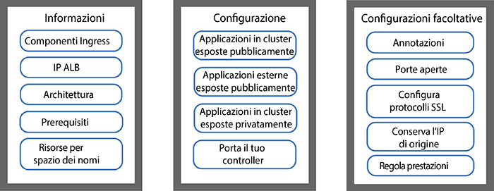
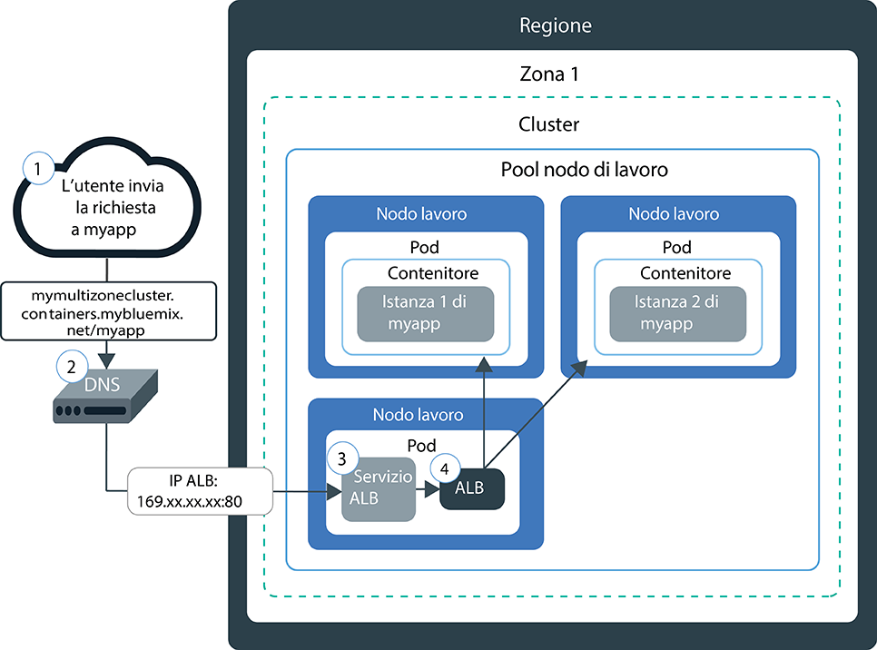
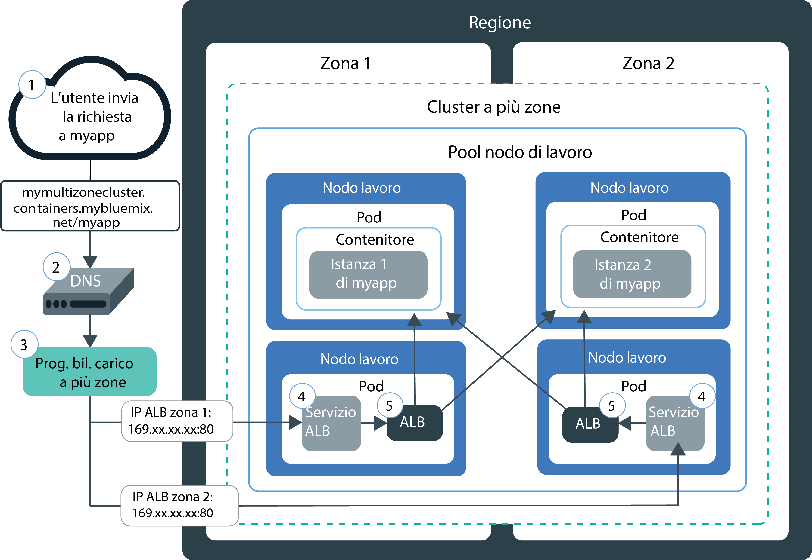
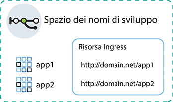
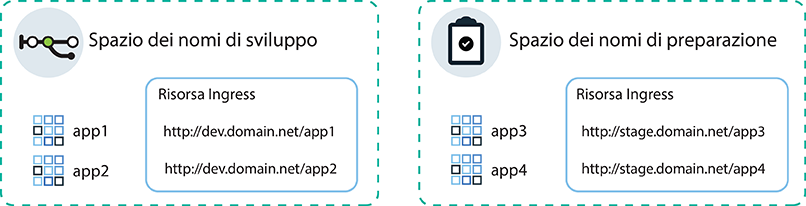
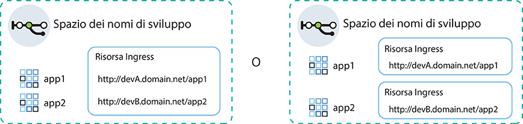

---

copyright:
  years: 2014, 2019
lastupdated: "2019-04-18"

keywords: kubernetes, iks, nginx, ingress controller

subcollection: containers

---

{:new_window: target="_blank"}
{:shortdesc: .shortdesc}
{:screen: .screen}
{:pre: .pre}
{:table: .aria-labeledby="caption"}
{:codeblock: .codeblock}
{:tip: .tip}
{:note: .note}
{:important: .important}
{:deprecated: .deprecated}
{:download: .download}


# Bilanciamento del carico HTTPS con gli ALB (application load balancer) Ingress
{: #ingress}

Esponi più applicazioni nel tuo cluster Kubernetes creando risorse Ingress che vengono gestite dall'ALB (application load balancer) fornito da IBM in {{site.data.keyword.containerlong}}.
{:shortdesc}



<map name="image-map">
    <area target="" alt="Componenti di Ingress" title="Componenti di Ingress" href="#components" coords="28,42,172,69" shape="rect">
    <area target="" alt="IP ALB" title="IP ALB" href="#ips" coords="27,79,171,104" shape="rect">
    <area target="" alt="Architettura" title="Architettura" href="#architecture-single" coords="31,114,171,140" shape="rect">
    <area target="" alt="Prerequisiti" title="Prerequisiti" href="#config_prereqs" coords="28,151,171,176" shape="rect">
    <area target="" alt="Pianificazione della rete per spazi dei nomi singoli o multipli" title="Pianificazione della rete per spazi dei nomi singoli o multipli" href="#multiple_namespaces" coords="31,191,172,229" shape="rect">
    <area target="" alt="Esposizione delle applicazioni all'interno del tuo cluster al pubblico" title="Esposizione delle applicazioni all'interno del tuo cluster al pubblico" href="#ingress_expose_public" coords="275,43,418,78" shape="rect">
    <area target="" alt="Esposizione delle applicazioni all'esterno del tuo cluster al pubblico" title="Esposizione delle applicazioni all'esterno del tuo cluster al pubblico" href="#external_endpoint" coords="275,94,419,128" shape="rect">
    <area target="" alt="Esposizione delle applicazioni su una rete privata" title="Esposizione delle applicazioni su una rete privata" href="#ingress_expose_private" coords="277,141,418,177" shape="rect">
    <area target="" alt="Utilizzo di un tuo controller Ingress" title="Utilizzo di un tuo controller Ingress" href="#user_managed" coords="278,192,416,228" shape="rect">
    <area target="" alt="Personalizzazione di una risorsa Ingress con le annotazioni" title="Personalizzazione di una risorsa Ingress con le annotazioni" href="#annotations" coords="523,44,670,73" shape="rect">
    <area target="" alt="Apertura delle porte nell'ALB Ingress" title="Apertura delle porte nell'ALB Ingress" href="#opening_ingress_ports" coords="521,83,669,105" shape="rect">
    <area target="" alt="Configurazione di protocolli SSL e cifrature SSL a livello di HTTP" title="Configurazione di protocolli SSL e cifrature SSL a livello di HTTP" href="#ssl_protocols_ciphers" coords="523,116,669,158" shape="rect">
    <area target="" alt="Conservazione dell'indirizzo IP di origine" title="Conservazione dell'indirizzo IP di origine" href="#preserve_source_ip" coords="522,167,671,202" shape="rect">
    <area target="" alt="Ottimizzazione delle prestazioni ALB" title="Ottimizzazione delle prestazioni ALB" href="#perf_tuning" coords="524,213,669,237" shape="rect">
</map>

## YAML di esempio
{: #sample_ingress}

Utilizza questi file YAML di esempio per iniziare rapidamente a specificare la tua risorsa Ingress.
{: shortdesc}

**Risorsa Ingress per esporre pubblicamente un'applicazione**</br>

Hai già completato le seguenti attività?
- Distribuisci l'applicazione
- Crea il servizio dell'applicazione
- Seleziona il nome di dominio e il segreto TLS

Puoi utilizzare il seguente YAML di distribuzione per creare una risorsa Ingress:

```
apiVersion: extensions/v1beta1
kind: Ingress
metadata:
  name: myingressresource
spec:
  tls:
  - hosts:
    - <domain>
    secretName: <tls_secret_name>
  rules:
  - host: <domain>
    http:
      paths:
      - path: /<app1_path>
        backend:
          serviceName: <app1_service>
          servicePort: 80
      - path: /<app2_path>
        backend:
          serviceName: <app2_service>
          servicePort: 80
```
{: codeblock}

</br>

**Risorsa Ingress per esporre privatamente un'applicazione**</br>

Hai già completato le seguenti attività?
- Abilita l'ALB privato
- Distribuisci l'applicazione
- Crea il servizio dell'applicazione
- Registra il nome di dominio personalizzato e il segreto TLS

Puoi utilizzare il seguente YAML di distribuzione per creare una risorsa Ingress:

```
apiVersion: extensions/v1beta1
kind: Ingress
metadata:
  name: myingressresource
  annotations:
    ingress.bluemix.net/ALB-ID: "<private_ALB_ID_1>;<private_ALB_ID_2>"
spec:
  tls:
  - hosts:
    - <domain>
    secretName: <tls_secret_name>
  rules:
  - host: <domain>
    http:
      paths:
      - path: /<app1_path>
        backend:
          serviceName: <app1_service>
          servicePort: 80
      - path: /<app2_path>
        backend:
          serviceName: <app2_service>
          servicePort: 80
```
{: codeblock}

<br />


## Cos'è Ingress?
{: #planning}

Ingress è un servizio Kubernetes che bilancia i carichi di lavoro del traffico di rete nel tuo cluster inoltrando le richieste pubbliche o private alle tue applicazioni. Puoi utilizzare Ingress per esporre più servizi dell'applicazione ad una rete pubblica o privata utilizzando una rotta pubblica o privata univoca.
{:shortdesc}

### Cosa viene fornito con Ingress?
{: #components}


Ingress è composto da tre componenti:
<dl>
<dt>Risorsa Ingress</dt>
<dd>Per esporre un'applicazione utilizzando Ingress, devi creare un servizio Kubernetes per la tua applicazione e registrare questo servizio con Ingress definendo una risorsa Ingress. La risorsa Ingress è una risorsa Kubernetes che definisce le regole su come instradare le richieste in entrata per le applicazioni. La risorsa Ingress specifica anche il percorso ai tuoi servizi dell'applicazione che vengono accodati alla rotta pubblica per formare un URL applicazione univoco come ad esempio `mycluster.us-south.containers.appdomain.cloud/myapp1`.<p class="note">A partire dal 24 maggio 2018, il formato del dominio secondario Ingress è cambiato per i nuovi cluster. Il nome della regione o della zona incluso nel nuovo formato del dominio secondario viene generato in base alla zona in cui è stato creato il cluster. Se hai dipendenze pipeline sui nomi dominio dell'applicazione coerenti, puoi usare il tuo dominio personalizzato invece del dominio secondario Ingress fornito da IBM.<ul><li>A tutti i cluster creati dopo il 24 maggio 2018 viene assegnato un dominio secondario nel nuovo formato, <code>&lt;cluster_name&gt;.&lt;region_or_zone&gt;.containers.appdomain.cloud</code>.</li><li>I cluster a zona singola creati dopo il 24 maggio 2018 continuano a usare il dominio secondario assegnato nel vecchio formato, <code>&lt;cluster_name&gt;.&lt;region&gt;.containers.mybluemix.net</code>.</li><li>Se modifichi un cluster a zona singola creato prima del 24 maggio 2018 in uno multizona [aggiungendo una zona al cluster](/docs/containers?topic=containers-clusters#add_zone) per la prima volta, il cluster continuerà a usare il dominio secondario assegnato nel vecchio formato,
<code>&lt;cluster_name&gt;.&lt;region&gt;.containers.mybluemix.net</code> e gli verrà assegnato anche un dominio secondario nel nuovo formato, <code>&lt;cluster_name&gt;.&lt;region_or_zone&gt;.containers.appdomain.cloud</code>. Possono essere utilizzati entrambi i domini secondari.</li></ul></p>**Cluster multizona**: la risorsa Ingress è globale ed è necessaria solo una risorsa Ingress per spazio dei nomi per un cluster multizona.</dd>
<dt>ALB (application load balancer)</dt>
<dd>L'ALB (application load balancer) è un programma di bilanciamento del carico esterno che ascolta le richieste di servizio HTTP, HTTPS o TCP in entrata. L'ALB inoltra quindi le richieste al pod dell'applicazione appropriato in base alle regole definire nella risorsa Ingress. Quando crei un cluster standard, {{site.data.keyword.containerlong_notm}} crea automaticamente un ALB altamente disponibile per il tuo cluster e gli assegna una rotta pubblica univoca. La rotta pubblica è collegata a un indirizzo IP pubblico portatile che viene fornito nel tuo account dell'infrastruttura IBM Cloud (SoftLayer) durante la creazione del cluster. Viene inoltre creato automaticamente un ALB privato predefinito, ma non viene automaticamente abilitato.<br></br>**Cluster multizona**: quando aggiungi una zona al tuo cluster, viene aggiunta una sottorete pubblica portatile e viene creato e abilitato automaticamente un nuovo ALB pubblico sulla sottorete in tale zona. Tutti gli ALB pubblici predefiniti nel tuo cluster condividono una rotta pubblica ma hanno indirizzi IP diversi. In ciascuna zona viene creato automaticamente anche un ALB privato predefinito, ma non viene abilitato automaticamente.</dd>
<dt>Programma di bilanciamento del carico multizona (o MZLB, multizone load balancer)</dt>
<dd><p>**Cluster multizona**: ogni volta che crei un cluster multizona o [aggiungi una zona a un cluster a zona singola,](/docs/containers?topic=containers-clusters#add_zone), viene automaticamente creato e distribuito un programma di bilanciamento del carico di lavoro (o MZLB, multizone load balancer) Cloudflare in modo che esista 1 MZLB per ciascuna regione. L'MZLB mette gli indirizzi IP dei tuoi ALB dietro lo stesso dominio secondario e abilita i controlli dell'integrità su tali indirizzi IP per determinare se sono disponibili o meno. Ad esempio, se hai dei nodi di lavoro in 3 zone nella regione Stati Uniti Est, il dominio secondario `yourcluster.us-east.containers.appdomain.cloud` ha 3 indirizzi IP ALB. L'MZLB controlla l'integrità dell'IP ALB pubblico in ciascuna zona di una regione e tiene i risultati della ricerca DNS aggiornati in base a tali controlli dell'integrità. Ad esempio, se i tuoi ALB hanno gli indirizzi IP `1.1.1.1`, `2.2.2.2` e `3.3.3.3`, una normale operazione di ricerca DNS del tuo dominio secondario Ingress restituisce tutti e 3 gli IP; il client accede a uno di essi in modo casuale. Se l'ALB con indirizzo IP `3.3.3.3` diventa per un qualsiasi motivo non disponibile, ad esempio a causa di un malfunzionamento di zona, il controllo dell'integrità per tale zona non riesce, l'MZLB rimuove l'IP non riuscito dal dominio secondario e la ricerca DNS restituisce solo gli IP ALB `1.1.1.1` e `2.2.2.2` integri. Il dominio secondario ha un TTL (time to live) di 30 secondi; pertanto, dopo 30 secondi, le nuove applicazioni client possono accedere solo a uno degli IP ALB integri disponibili.</p><p>In rari casi, alcune applicazioni client o alcuni resolver DNS potrebbero continuare a utilizzare l'IP ALB non integro dopo il TTL di 30 secondi. Tali applicazioni client potrebbero riscontrare un tempo di carico più lungo finché non abbandonano l'IP `3.3.3.3` e provano a connettersi a `1.1.1.1` o `2.2.2.2`. A seconda delle impostazioni del browser client o dell'applicazione client, il ritardo può andare dai pochi secondi a un timeout TCP completo.</p>
<p>I programmi di bilanciamento del carico MZLB per gli ALB pubblici usano solo il dominio secondario Ingress fornito da IBM. Se usi solo ALB privati, devi controllare manualmente l'integrità degli ALB e aggiornare i risultati di ricerca DNS. Se usi ALB pubblici che usano un dominio personalizzato, puoi includere gli ALB nel bilanciamento del carico di MZLB creando un CNAME nella tua voce DNS per inoltrare le richieste dal tuo dominio personalizzato al dominio secondario Ingress fornito da IBM per il tuo cluster.</p>
<p class="note">Se usi politiche di rete pre-DNAT di Calico per bloccare tutto il traffico in entrata ai servizi Ingress, devi anche inserire in whitelist gli <a href="https://www.cloudflare.com/ips/">IP IPv4 di Cloudflare </a> utilizzati per controllare l'integrità dei tuoi ALB. Per la procedura su come creare una politica Calico pre-DNAT per inserire in whitelist questi IP, vedi la Lezione 3 dell'<a href="/docs/containers?topic=containers-policy_tutorial#lesson3">esercitazione della politica di rete Calico</a>.</p></dd>
</dl>


### Come vengono assegnati gli IP agli ALB Ingress?
{: #ips}

Quando crei un cluster standard, {{site.data.keyword.containerlong_notm}} esegue automaticamente il provisioning di una sottorete pubblica portatile e di una sottorete privata portatile. Per impostazione predefinita, il cluster utilizza automaticamente:
* 1 indirizzo IP pubblico portatile dalla sottorete pubblica portatile per l'ALB Ingress pubblico predefinito.
* 1 indirizzo IP privato portatile dalla sottorete privata portatile per l'ALB Ingress privato predefinito.
{: shortdesc}

Se hai un cluster multizona, un ALB pubblico predefinito e un ALB privato predefinito vengono creati automaticamente in ogni zona. Gli indirizzi IP dei tuoi ALB pubblici predefiniti sono tutti dietro lo stesso dominio secondario fornito da IBM per il tuo cluster.

Gli indirizzi IP pubblici e privati portatili sono IP mobili statici e non cambiano quando viene rimosso un nodo di lavoro. Se il nodo di lavoro viene rimosso, un daemon `Keepalived`, che monitora costantemente l'IP, ripianifica automaticamente i pod ALB che si trovavano in quel nodo di lavoro su un altro nodo di lavoro in tale zona. I pod ALB ripianificati conservano lo stesso indirizzo IP statico. Per tutta la durata del cluster, l'indirizzo IP ALB in ciascuna zona non cambia. Se rimuovi una zona da un cluster, viene rimosso l'indirizzo IP ALB per quella zona.

Per vedere gli IP assegnati ai tuoi ALB, puoi eseguire il seguente comando.
```
ibmcloud ks albs --cluster <cluster_name_or_id>
```
{: pre}

Per ulteriori informazioni su cosa succede agli IP ALB in caso di malfunzionamento della zona, vedi la definizione per il [componente Programma di bilanciamento del carico multizona (o MZLB, multizone load balancer)](#components).


### In che modo viene effettuata una richiesta alla mia applicazione con Ingress in un cluster a zona singola?
{: #architecture-single}


Il seguente diagramma mostra in che modo Ingress indirizza le comunicazioni da Internet a un'applicazione in un cluster a zona singola:



1. Un utente invia una richiesta alla tua applicazione accedendo all'URL dell'applicazione. Questo URL è l'URL pubblico per la tua applicazione esposta a cui è aggiunto il percorso della risorsa Ingress, ad esempio `mycluster.us-south.containers.appdomain.cloud/myapp`.

2. Un servizio di sistema DNS risolve il dominio secondario nell'URL sull'indirizzo IP pubblico portatile del programma di bilanciamento del carico che espone l'ALB nel tuo cluster.

3. In base all'indirizzo IP risolto, il client invia la richiesta al servizio del programma di bilanciamento del carico che espone l'ALB.

4. Il servizio del programma di bilanciamento del carico instrada la richiesta all'ALB.

5. L'ALB verifica se esiste una regola di instradamento per il percorso `myapp` nel cluster. Se viene trovata una regola corrispondente, la richiesta viene inoltrata in base alle regole definite nella risorsa Ingress al pod in cui è distribuita l'applicazione. L'indirizzo IP di origine del pacchetto viene modificato con l'indirizzo IP dell'indirizzo IP pubblico del nodo di lavoro su cui è in esecuzione il pod dell'applicazione. Se nel cluster vengono distribuite più istanze dell'applicazione, l'ALB bilancia il carico delle richieste tra i pod dell'applicazione.

### In che modo viene effettuata una richiesta alla mia applicazione con Ingress in un cluster multizona?
{: #architecture-multi}

Il seguente diagramma mostra in che modo Ingress indirizza le comunicazioni da Internet a un'applicazione in un cluster multizona:



1. Un utente invia una richiesta alla tua applicazione accedendo all'URL dell'applicazione. Questo URL è l'URL pubblico per la tua applicazione esposta a cui è aggiunto il percorso della risorsa Ingress, ad esempio `mycluster.us-south.containers.appdomain.cloud/myapp`.

2. Un servizio di sistema DNS, che funge da programma di bilanciamento del carico globale, risolve il dominio secondario nell'URL in un indirizzo IP disponibile che è stato segnalato come integro da MZLB. L'MZLB controlla continuamente gli indirizzi IP pubblici portatili dei servizi di bilanciamento del carico che espongono gli ALB pubblici in ciascuna zona nel tuo cluster. Gli indirizzi IP vengono risolti in un ciclo round-robin, ciò garantisce che le richieste vengono bilanciate equamente tra gli ALB integri nelle varie zone.

3. Il client invia la richiesta all'indirizzo IP del servizio del programma di bilanciamento del carico che espone un ALB.

4. Il servizio del programma di bilanciamento del carico instrada la richiesta all'ALB.

5. L'ALB verifica se esiste una regola di instradamento per il percorso `myapp` nel cluster. Se viene trovata una regola corrispondente, la richiesta viene inoltrata in base alle regole definite nella risorsa Ingress al pod in cui è distribuita l'applicazione. L'indirizzo IP di origine del pacchetto viene modificato con l'indirizzo IP pubblico del nodo di lavoro su cui è in esecuzione il pod dell'applicazione. Se nel cluster vengono distribuite più istanze dell'applicazione, l'ALB bilancia il carico delle richieste tra i pod dell'applicazione tra tutte le zone.

<br />


## Prerequisiti
{: #config_prereqs}

Prima di iniziare ad utilizzare Ingress, controlla i seguenti prerequisiti.
{:shortdesc}

**Prerequisiti per tutte le configurazioni Ingress:**
- Ingress è disponibile solo per i cluster standard e richiede almeno due nodi di lavoro per zona per garantire l'alta disponibilità e l'applicazione di aggiornamenti periodici. Se hai un solo nodo di lavoro in una zona, l'ALB non può ricevere gli aggiornamenti automatici. Quando gli aggiornamenti automatici vengono distribuiti ai pod ALB, il pod viene ricaricato. Tuttavia, i pod ALB hanno regole di anti-affinità per garantire che solo un pod sia pianificato su ciascun nodo di lavoro per l'alta disponibilità. Poiché è presente un solo pod ALB su un nodo di lavoro, il pod non viene riavviato in modo che il traffico non venga interrotto. Il pod ALB viene aggiornato alla versione più recente solo quando elimini il vecchio pod manualmente, in modo che il nuovo pod aggiornato possa essere pianificato.
- La configurazione di Ingress richiede i seguenti [ruoli {{site.data.keyword.Bluemix_notm}} IAM](/docs/containers?topic=containers-users#platform):
    - Ruolo della piattaforma **Amministratore** per il cluster
    - Ruolo del servizio **Gestore** in tutti gli spazi dei nomi

**Prerequisiti per l'uso di Ingress in cluster multizona**:
 - Se limiti il traffico di rete a [nodo di lavoro edge](/docs/containers?topic=containers-edge), devi abilitare almeno 2 nodo di lavoro edge in ciascuna zona per l'alta disponibilità dei pod Ingress. [Crea un pool di nodi di lavoro del nodo edge](/docs/containers?topic=containers-clusters#add_pool) che si estenda tra tutte le zone del tuo cluster e che abbia almeno 2 nodi di lavoro per zona.
 - Se hai più VLAN per un cluster, più sottoreti sulla stessa VLAN o un cluster multizona, devi abilitare una [VRF (Virtual Router Function)](/docs/infrastructure/direct-link?topic=direct-link-overview-of-virtual-routing-and-forwarding-vrf-on-ibm-cloud#overview-of-virtual-routing-and-forwarding-vrf-on-ibm-cloud) per il tuo account dell'infrastruttura IBM Cloud (SoftLayer) in modo che i tuoi nodi di lavoro possano comunicare tra loro sulla rete privata. Per abilitare VRF, [contatta il tuo rappresentante dell'account dell'infrastruttura IBM Cloud (SoftLayer)](/docs/infrastructure/direct-link?topic=direct-link-overview-of-virtual-routing-and-forwarding-vrf-on-ibm-cloud#how-you-can-initiate-the-conversion). Se non puoi o non vuoi abilitare VRF, abilita lo [spanning della VLAN](/docs/infrastructure/vlans?topic=vlans-vlan-spanning#vlan-spanning). Per eseguire questa azione, ti serve l'[autorizzazione dell'infrastruttura](/docs/containers?topic=containers-users#infra_access) **Rete > Gestisci il VLAN Spanning di rete** oppure puoi richiedere al proprietario dell'account di abilitarlo. Per controllare se lo spanning della VLAN è già abilitato, utilizza il [comando](/docs/containers?topic=containers-cs_cli_reference#cs_vlan_spanning_get) `ibmcloud ks vlan-spanning-get`.
 - Se una zona presenta un malfunzionamento, potresti riscontrare malfunzionamenti intermittenti nelle richieste all'ALB Ingress in tale zona.

<br />


## Pianificazione della rete per spazi dei nomi singoli o multipli
{: #multiple_namespaces}

È richiesta una risorsa Ingress per ogni spazio dei nomi in cui hai le applicazioni che vuoi esporre.
{:shortdesc}

### Tutte le applicazioni sono in uno spazio dei nomi
{: #one-ns}

Se le applicazioni nel tuo cluster si trovano tutte nello stesso spazio dei nomi, è richiesta una risorsa Ingress per definire le regole di instradamento per le applicazioni che sono esposte lì. Ad esempio, se hai `app1` e `app2` esposte dai servizi in uno spazio dei nomi di sviluppo, puoi creare una risorsa Ingress nello spazio dei nomi. La risorsa specifica `domain.net` come host e registra i percorsi su cui è in ascolto ogni applicazione con `domain.net`.
{: shortdesc}



### Le applicazioni sono in più spazi dei nomi
{: #multi-ns}

Se le applicazioni nel tuo cluster si trovano in spazi dei nomi differenti, devi creare una risorsa per ogni spazio dei nomi per definire le regole per le applicazioni che sono esposte lì.
{: shortdesc}

Tuttavia, puoi definire un nome host in una sola risorsa. Non puoi definire lo stesso nome host in più risorse. Per registrare più risorse Ingress con lo stesso nome host, devi utilizzare un dominio jolly. Quando viene registrato un dominio jolly come `*.domain.net`, più domini secondari possono essere risolti tutti nello stesso host. Quindi, puoi creare una risorsa Ingress in ogni spazio dei nomi e specificare un dominio secondario diverso in ogni risorsa Ingress.

Ad esempio, considera il seguente scenario:
* Hai due versioni della stessa applicazione, `app1` e `app3`, per scopi di test.
* Distribuisci le applicazioni in due spazi dei nomi differenti all'interno dello stesso cluster: `app1` nello spazio dei nomi di sviluppo e `app3` in quello di preparazione.

Per utilizzare lo stesso ALB del cluster per gestire il traffico a queste applicazioni, crea i seguenti servizi e risorse:
* Un servizio Kubernetes nello spazio dei nomi di sviluppo per esporre `app1`.
* Una risorsa Ingress nello spazio dei nodi di sviluppo che specifica l'host come `dev.domain.net`.
* Un servizio Kubernetes nello spazio dei nomi di preparazione per esporre `app3`.
* Una risorsa Ingress nello spazio dei nomi di preparazione che specifica l'host come `stage.domain.net`.
</br>


Ora, entrambi gli URL risolvono lo stesso dominio e sono anche serviti dallo stesso ALB. Tuttavia, poiché la risorsa nello spazio dei nomi di preparazione viene registrata nel dominio secondario `stage`, l'ALB Ingress instrada correttamente le richieste dall'URL `stage.domain.net/app3` solo a `app3`.

{: #wildcard_tls}
Il dominio secondario jolly Ingress fornito da IBM, `*.<cluster_name>.<region>.containers.appdomain.cloud`, viene registrato per impostazione predefinita per il tuo cluster. Il certificato TLS fornito da IBM è un certificato jolly e può essere utilizzato per il dominio secondario jolly. Se vuoi utilizzare un dominio personalizzato, devi registrarlo come un dominio jolly come ad esempio `*.custom_domain.net`. Per utilizzare TLS, devi ottenere un certificato jolly.
{: note}

### Più domini all'interno di uno spazio dei nomi.
{: #multi-domains}

All'interno di uno spazio dei nomi individuale, puoi utilizzare un dominio per accedere a tutte le applicazioni nello spazio dei nomi. Se vuoi utilizzare domini differenti per le applicazioni all'interno di uno spazio dei nomi individuale, utilizza un dominio jolly. Quando viene registrato un dominio jolly come `*.mycluster.us-south.containers.appdomain.cloud`, tutti i domini multipli vengono risolti dallo stesso host. Quindi, puoi utilizzare una risorsa per specificare più host del dominio secondario in tale risorsa. In alternativa, puoi creare più risorse Ingress nello spazio dei nomi e specificare un dominio secondario diverso in ogni risorsa Ingress.
{: shortdesc}



Il dominio secondario jolly Ingress fornito da IBM, `*.<cluster_name>.<region>.containers.appdomain.cloud`, viene registrato per impostazione predefinita per il tuo cluster. Il certificato TLS fornito da IBM è un certificato jolly e può essere utilizzato per il dominio secondario jolly. Se vuoi utilizzare un dominio personalizzato, devi registrarlo come un dominio jolly come ad esempio `*.custom_domain.net`. Per utilizzare TLS, devi ottenere un certificato jolly.
{: note}

<br />


## Esposizione delle applicazioni all'interno del tuo cluster al pubblico
{: #ingress_expose_public}

Esponi le applicazioni all'interno del tuo cluster al pubblico utilizzando l'ALB Ingress pubblico.
{:shortdesc}

Prima di iniziare:

* Esamina i [prerequisiti](#config_prereqs) Ingress.
* [Accedi al tuo account. Specifica la regione appropriata e, se applicabile, il gruppo di risorse. Imposta il contesto per il tuo cluster.](/docs/containers?topic=containers-cs_cli_install#cs_cli_configure)

### Passo 1: Distribuisci le applicazioni e crea i servizi dell'applicazione.
{: #public_inside_1}

Inizia distribuendo le tue applicazioni e creando i servizi Kubernetes per esporle.
{: shortdesc}

1.  [Distribuisci la tua applicazione al cluster](/docs/containers?topic=containers-app#app_cli). Assicurati di aggiungere un'etichetta alla tua distribuzione nella sezione dei metadati del tuo file di configurazione, ad esempio `app: code`. Questa etichetta è necessaria per identificare tutti i pod in cui è in esecuzione la tua applicazione in modo che possano essere inclusi nel bilanciamento del carico Ingress.

2.   Crea un servizio Kubernetes per ogni applicazione che desideri esporre. La tua applicazione deve essere esposta da un servizio Kubernetes per poter essere inclusa dall'ALB cluster nel bilanciamento del carico Ingress.
      1.  Apri il tuo editor preferito e crea un file di configurazione del servizio denominato, ad esempio, `myappservice.yaml`.
      2.  Definisci un servizio per l'applicazione che l'ALB esporrà.

          ```
          apiVersion: v1
          kind: Service
          metadata:
            name: myappservice
          spec:
            selector:
              <selector_key>: <selector_value>
            ports:
             - protocol: TCP
               port: 8080
          ```
          {: codeblock}

          <table>
          <thead>
          <th colspan=2> Descrizione dei componenti del file YAML del servizio ALB</th>
          </thead>
          <tbody>
          <tr>
          <td><code>selector</code></td>
          <td>Immetti la coppia di chiave (<em>&lt;selector_key&gt;</em>) e valore (<em>&lt;selector_value&gt;</em>) dell'etichetta che vuoi utilizzare per indirizzare i pod in cui viene eseguita la tua applicazione. Per indirizzare i tuoi pod e includerli nel bilanciamento del carico di servizio, assicurati che i valori di <em>&lt;selector_key&gt;</em> e <em>&lt;selector_value&gt;</em> siano gli stessi della coppia chiave/valore nella sezione <code>spec.template.metadata.labels</code> del tuo YAML di distribuzione.</td>
           </tr>
           <tr>
           <td><code> port</code></td>
           <td>La porta su cui è in ascolto il servizio.</td>
           </tr>
           </tbody></table>
      3.  Salva le modifiche.
      4.  Crea il servizio nel tuo cluster. Se le applicazioni vengono distribuite in più spazi dei nomi nel tuo cluster, assicurati che il servizio venga distribuito nello stesso spazio dei nomi dell'applicazione che vuoi esporre.

          ```
          kubectl apply -f myappservice.yaml [-n <namespace>]
          ```
          {: pre}
      5.  Ripeti questi passi per ogni applicazione che vuoi esporre.


### Passo 2: Seleziona un dominio dell'applicazione
{: #public_inside_2}

Quando configuri l'ALB pubblico, scegli il dominio tramite il quale saranno accessibili le tue applicazioni.
{: shortdesc}

Puoi utilizzare il dominio fornito da IBM, come `mycluster-12345.us-south.containers.appdomain.cloud/myapp`, per accedere alla tua applicazione da Internet. Per utilizzare invece un dominio personalizzato, puoi impostare un record CNAME per associarlo al dominio fornito da IBM o impostare un record con il tuo provider DNS utilizzando l'indirizzo IP pubblico dell'ALB.

**Per utilizzare il dominio Ingress fornito da IBM:**

Ottieni il dominio fornito da IBM. Sostituisci `<cluster_name_or_ID>` con il nome del cluster in cui viene distribuita l'applicazione.
```
ibmcloud ks cluster-get --cluster <cluster_name_or_ID> | grep Ingress
```
{: pre}

Output di esempio:
```
Ingress Subdomain:      mycluster-12345.us-south.containers.appdomain.cloud
Ingress Secret:         <tls_secret>
```
{: screen}

**Per utilizzare un dominio personalizzato:**
1.    Crea un dominio personalizzato. Per registrare il tuo dominio personalizzato, utilizza il provider DNS (Domain Name Service) o il [DNS {{site.data.keyword.Bluemix_notm}}](/docs/infrastructure/dns?topic=dns-getting-started-with-dns#getting-started-with-dns).
      * Se le applicazioni che vuoi che Ingress esponga si trovano in spazi dei nomi diversi in un cluster, registra il dominio personalizzato come dominio jolly, ad esempio `*.custom_domain.net`.

2.  Configura il tuo dominio per instradare il traffico di rete in entrata all'ALB fornito da IBM. Scegli tra queste opzioni:
    -   Definisci un alias per il tuo dominio personalizzato specificando il dominio fornito da IBM come un record di nome canonico (CNAME). Per trovare il dominio Ingress fornito da IBM, esegui `ibmcloud ks cluster-get --cluster <cluster_name>` e cerca il campo **Dominio secondario Ingress**. L'utilizzo di un CNAME è preferito perché IBM fornisce dei controlli dell'integrità automatici sul dominio secondario IBM e rimuove gli eventuali IP malfunzionanti dalla risposta DNS.
    -   Associa il tuo dominio personalizzato all'indirizzo IP pubblico portatile dell'ALB fornito da IBM aggiungendo l'indirizzo IP come record. Per trovare l'indirizzo IP pubblico portatile dell'ALB, esegui `ibmcloud ks alb-get <public_alb_ID>`.

### Passo 3: Seleziona la terminazione TLS
{: #public_inside_3}

Dopo aver scelto il dominio dell'applicazione, scegli se utilizzare la terminazione TLS.
{: shortdesc}

L'ALB bilancia il carico del traffico di rete HTTP alle applicazioni nel tuo cluster. Per bilanciare anche il traffico delle connessioni HTTPS in entrata, puoi configurare l'ALB per decodificare il traffico di rete e inoltrare la richiesta decodificata alle applicazioni esposte nel tuo cluster.

* Se usi il dominio secondario Ingress fornito da IBM, puoi usare il certificato TLS fornito da IBM. I certificati TLS forniti da IBM vengono firmati da LetsEncrypt e vengono gestiti completamente da IBM. I certificati scadono ogni 90 giorni e vengono rinnovati automaticamente 37 giorni prima della scadenza. Per informazioni sulla certificazione TLS jolly, vedi [questa nota](#wildcard_tls).
* Se usi un dominio personalizzato, puoi usare il tuo certificato TLS per gestire la terminazione TLS. L'ALB verifica innanzitutto la presenza di un segreto nello spazio dei nomi in cui si trova l'applicazione, poi nello spazio dei nomi di `default` e infine in `ibm-cert-store`. Se hai applicazioni in un unico spazio dei nomi, puoi importare o creare un segreto TLS per il certificato in questo stesso spazio dei nomi. Se hai applicazioni in più spazi dei nomi, importa o crea un segreto TLS per il certificato nello spazio dei nomi `default` in modo tale che l'ALB possa accedere e usare il certificato in ogni spazio dei nomi. Nelle risorse Ingress che definisci per ogni spazio dei nomi, specifica il nome del segreto che si trova nello spazio dei nomi predefinito. Per informazioni sulla certificazione TLS jolly, vedi [questa nota](#wildcard_tls). **Nota**:i certificati TLS che contengono le chiavi precondivise (TLS-PSK) non sono supportati.

**Se utilizzi il dominio Ingress fornito da IBM:**

Ottieni il segreto TLS fornito da IBM per il tuo cluster.
```
ibmcloud ks cluster-get --cluster <cluster_name_or_ID> | grep Ingress
```
{: pre}

Output di esempio:
```
Ingress Subdomain:      mycluster-12345.us-south.containers.appdomain.cloud
Ingress Secret:         <tls_secret>
```
{: screen}
</br>

**Se utilizzi un dominio personalizzato:**

Se in {{site.data.keyword.cloudcerts_long_notm}} è memorizzato un certificato TLS che vuoi utilizzare, puoi importare il suo segreto associato nel tuo cluster immettendo il seguente comando:

```
ibmcloud ks alb-cert-deploy --secret-name <secret_name> --cluster <cluster_name_or_ID> --cert-crn <certificate_crn>
```
{: pre}

Assicurati di non creare il segreto con lo stesso nome del segreto Ingress fornito da IBM. Puoi ottenere il nome del segreto Ingress fornito da IBM eseguendo `ibmcloud ks cluster-get --cluster <cluster_name_or_ID> | grep Ingress`.
{: note}

Quando importi un certificato con questo comando, il segreto del certificato viene creato in uno spazio dei nomi chiamato `ibm-cert-store`. Un riferimento a questo segreto viene quindi creato nello spazio dei nomi `default`, a cui può accedere qualsiasi risorsa Ingress in qualsiasi spazio dei nomi. Quando l'ALB elabora le richieste, segue questo riferimento per raccogliere e utilizzare il segreto del certificato dallo spazio dei nomi `ibm-cert-store`.

</br>

Se non hai un certificato TLS pronto, segui questa procedura:
1. Genera un certificato e una chiave di autorità di certificazione (CA, certificate authority) dal tuo provider di certificati. Se disponi del tuo proprio dominio, acquista un certificato TLS ufficiale per il dominio. Assicurati che il [CN ](https://support.dnsimple.com/articles/what-is-common-name/) sia diverso per ciascun certificato.
2. Converti il certificato e la chiave in base64.
   1. Codifica il certificato e la chiave in base64 e salva il valore con codifica base64 in un nuovo file.
      ```
      openssl base64 -in tls.key -out tls.key.base64
      ```
      {: pre}

   2. Visualizza il valore con codifica base64 per il certificato e la chiave.
      ```
      cat tls.key.base64
      ```
      {: pre}

3. Crea un file YAML del segreto utilizzando il certificato e la chiave.
     ```
     apiVersion: v1
     kind: Secret
     metadata:
       name: ssl-my-test
     type: Opaque
     data:
       tls.crt: <client_certificate>
       tls.key: <client_key>
     ```
     {: codeblock}

4. Crea il certificato come segreto Kubernetes.
     ```
     kubectl create -f ssl-my-test
     ```
     {: pre}
     Assicurati di non creare il segreto con lo stesso nome del segreto Ingress fornito da IBM. Puoi ottenere il nome del segreto Ingress fornito da IBM eseguendo `ibmcloud ks cluster-get --cluster <cluster_name_or_ID> | grep Ingress`.
     {: note}


### Passo 4: Crea la risorsa Ingress
{: #public_inside_4}

Le risorse Ingress definiscono le regole di instradamento che l'ALB utilizza per instradare il traffico al tuo servizio dell'applicazione.
{: shortdesc}

Se il tuo cluster ha più spazi dei nomi in cui sono esposte le applicazioni, è richiesta una risorsa Ingress per ogni spazio dei nomi. Tuttavia, ogni spazio dei nomi deve utilizzare un host diverso. Devi registrare un dominio jolly e specificare un dominio secondario differente in ogni risorsa. Per ulteriori informazioni, vedi [Pianificazione della rete per spazi dei nomi singoli o multipli](#multiple_namespaces).
{: note}

1. Apri il tuo editor preferito e crea un file di configurazione Ingress denominato, ad esempio, `myingressresource.yaml`.

2. Definisci una risorsa Ingress nel tuo file di configurazione che utilizza il dominio fornito da IBM o il tuo dominio personalizzato per instradare il traffico di rete in entrata ai servizi che hai creato in precedenza.

    YAML di esempio che non utilizza TLS:
    ```
    apiVersion: extensions/v1beta1
    kind: Ingress
    metadata:
      name: myingressresource
    spec:
      rules:
      - host: <domain>
        http:
          paths:
          - path: /<app1_path>
            backend:
              serviceName: <app1_service>
              servicePort: 80
          - path: /<app2_path>
            backend:
              serviceName: <app2_service>
              servicePort: 80
    ```
    {: codeblock}

    YAML di esempio che utilizza TLS:
    ```
    apiVersion: extensions/v1beta1
    kind: Ingress
    metadata:
      name: myingressresource
    spec:
      tls:
      - hosts:
        - <domain>
        secretName: <tls_secret_name>
      rules:
      - host: <domain>
        http:
          paths:
          - path: /<app1_path>
            backend:
              serviceName: <app1_service>
              servicePort: 80
          - path: /<app2_path>
            backend:
              serviceName: <app2_service>
              servicePort: 80
    ```
    {: codeblock}

    <table>
    <thead>
    <th colspan=2> Descrizione dei componenti del file YAML</th>
    </thead>
    <tbody>
    <tr>
    <td><code>tls.hosts</code></td>
    <td>Per utilizzare TLS, sostituisci <em>&lt;domain&gt;</em> con il dominio secondario Ingress fornito da IBM o con il tuo dominio personalizzato.

    </br></br>
    <strong>Nota:</strong><ul><li>Se le tue applicazioni sono esposte dai servizi in spazi dei nomi differenti in un cluster, aggiungi un dominio secondario jolly all'inizio del dominio, ad esempio `subdomain1.custom_domain.net` o `subdomain1.mycluster.us-south.containers.appdomain.cloud`. Utilizza un dominio secondario univoco per ogni risorsa che crei nel cluster.</li><li>Non utilizzare &ast; per il tuo host o lascia vuota la proprietà host per evitare errori durante la creazione di Ingress.</li></ul></td>
    </tr>
    <tr>
    <td><code>tls.secretName</code></td>
    <td><ul><li>Se usi il dominio Ingress fornito da IBM, sostituisci <em>&lt;tls_secret_name&gt;</em> con il nome del segreto Ingress fornito da IBM.</li><li>Se usi un dominio personalizzato, sostituisci <em>&lt;tls_secret_name&gt;</em> con il segreto che hai creato precedentemente che contiene il tuo certificato TLS personalizzato e la tua chiave. Se hai importato un certificato da {{site.data.keyword.cloudcerts_short}}, puoi eseguire <code>ibmcloud ks alb-cert-get --cluster <cluster_name_or_ID> --cert-crn <certificate_crn></code> per vedere i segreti associati a un certificato TLS.</li><ul><td>
    </tr>
    <tr>
    <td><code>host</code></td>
    <td>Sostituisci <em>&lt;domain&gt;</em> con il dominio secondario Ingress fornito da IBM o con il tuo dominio personalizzato.

    </br></br>
    <strong>Nota:</strong><ul><li>Se le tue applicazioni sono esposte dai servizi in spazi dei nomi differenti in un cluster, aggiungi un dominio secondario jolly all'inizio del dominio, ad esempio `subdomain1.custom_domain.net` o `subdomain1.mycluster.us-south.containers.appdomain.cloud`. Utilizza un dominio secondario univoco per ogni risorsa che crei nel cluster.</li><li>Non utilizzare &ast; per il tuo host o lascia vuota la proprietà host per evitare errori durante la creazione di Ingress.</li></ul></td>
    </tr>
    <tr>
    <td><code>path</code></td>
    <td>Sostituisci <em>&lt;app_path&gt;</em> con una barra o il percorso su cui è in ascolto la tua applicazione. Il percorso viene aggiunto al dominio personalizzato o fornito da IBM per creare una rotta univoca alla tua applicazione. Quando immetti questa rotta in un browser web, il traffico di rete viene instradato all'ALB. L'ALB cerca il servizio associato e invia il traffico di rete al servizio. Il servizio inoltra quindi il traffico ai pod su cui è in esecuzione l'applicazione.
    </br></br>
    Molte applicazioni non sono in ascolto su uno specifico percorso, ma utilizzano il percorso root e una porta specificata. In questo caso, definisci il percorso root come <code>/</code> e non specificare un percorso individuale per la tua applicazione. Esempi: <ul><li>Per <code>http://domain/</code>, immetti <code>/</code> come percorso.</li><li>Per <code>http://domain/app1_path</code>, immetti <code>/app1_path</code> come percorso.</li></ul>
    </br>
    <strong>Suggerimento:</strong> per configurare Ingress affinché sia in ascolto su un percorso diverso da quello su cui è in ascolto la tua applicazione, puoi utilizzare l'[annotazione di riscrittura](/docs/containers?topic=containers-ingress_annotation#rewrite-path).</td>
    </tr>
    <tr>
    <td><code>serviceName</code></td>
    <td>Sostituisci <em>&lt;app1_service&gt;</em> e <em>&lt;app2_service&gt;</em> e così via, con il nome dei servizi che hai creato per esporre le tue applicazioni. Se le tue applicazioni sono esposte dai servizi in spazi dei nomi differenti nel cluster, includi solo i servizi dell'applicazione presenti nello stesso spazio dei nomi. Devi creare una risorsa Ingress per ogni spazio dei nomi in cui hai delle applicazioni da esporre.</td>
    </tr>
    <tr>
    <td><code>servicePort</code></td>
    <td>La porta su cui è in ascolto il tuo servizio. Utilizza la stessa porta che hai definito quando hai creato il servizio Kubernetes per la tua applicazione.</td>
    </tr>
    </tbody></table>

3.  Crea la risorsa Ingress per il tuo cluster. Assicurati che la risorsa venga distribuita nello stesso spazio dei nomi dei servizi dell'applicazione che hai specificato nella risorsa.

    ```
    kubectl apply -f myingressresource.yaml -n <namespace>
    ```
    {: pre}
4.   Verifica che la risorsa Ingress sia stata creata correttamente.

      ```
      kubectl describe ingress myingressresource
      ```
      {: pre}

      1. Se i messaggi negli eventi descrivono un errore nella configurazione della tua risorsa, modifica i valori nel file di risorse e riapplica il file per la risorsa.


La tua risorsa Ingress viene creata nello stesso spazio dei nomi dei tuoi servizi dell'applicazione. Le tue applicazioni in questo spazio dei nomi vengono registrate con l'ALB Ingress del cluster.

### Passo 5: Accedi alla tua applicazione da Internet
{: #public_inside_5}

In un browser web, immetti l'URL del servizio dell'applicazione a cui accedere.
{: shortdesc}

```
https://<domain>/<app1_path>
```
{: codeblock}

Se hai esposto più applicazioni, accedi a queste applicazioni modificando il percorso accodato all'URL.

```
https://<domain>/<app2_path>
```
{: codeblock}

Se utilizzi un dominio jolly per esporre le applicazioni in diversi spazi dei nomi, accedi a queste applicazioni con i relativi domini secondari.

```
http://<subdomain1>.<domain>/<app1_path>
```
{: codeblock}

```
http://<subdomain2>.<domain>/<app1_path>
```
{: codeblock}


Hai problemi a connetterti alla tua applicazione tramite Ingress? Prova ad eseguire il [debug di Ingress](/docs/containers?topic=containers-cs_troubleshoot_debug_ingress).
{: tip}

<br />


## Esposizione delle applicazioni all'esterno del tuo cluster al pubblico
{: #external_endpoint}

Esponi le applicazioni all'esterno del tuo cluster al pubblico includendole nel programma di bilanciamento del carico ALB Ingress pubblico. Le richieste pubbliche in entrata sul dominio fornito da IBM o sul tuo dominio personalizzato vengono inoltrate automaticamente all'applicazione esterna.
{: shortdesc}

Prima di iniziare:

* Esamina i [prerequisiti](#config_prereqs) Ingress.
* Assicurati che l'applicazione esterna che desideri includere nel bilanciamento del carico del cluster sia accessibile mediante un indirizzo IP pubblico.
* [Accedi al tuo account. Specifica la regione appropriata e, se applicabile, il gruppo di risorse. Imposta il contesto per il tuo cluster.](/docs/containers?topic=containers-cs_cli_install#cs_cli_configure)

Per esporre al pubblico le applicazioni che si trovano all'esterno del cluster:

1.  Crea un servizio Kubernetes per il tuo cluster che inoltrerà le richieste in entrata a un endpoint esterno che avrai già creato.
    1.  Apri il tuo editor preferito e crea un file di configurazione del servizio denominato, ad esempio, `myexternalservice.yaml`.
    2.  Definisci un servizio per l'applicazione che l'ALB esporrà.

        ```
        apiVersion: v1
        kind: Service
        metadata:
          name: myexternalservice
        spec:
          ports:
           - protocol: TCP
               port: 8080
        ```
        {: codeblock}

        <table>
        <caption>Descrizione dei componenti del file del servizio ALB</caption>
        <thead>
        <th colspan=2> Descrizione dei componenti del file YAML</th>
        </thead>
        <tbody>
        <tr>
        <td><code>metadata.name</code></td>
        <td>Sostituisci <em><code>&lt;myexternalservice&gt;</code></em> con un nome per il tuo servizio.<p>Ulteriori informazioni sulla [protezione delle tue informazioni personali](/docs/containers?topic=containers-security#pi) quando utilizzi le risorse Kubernetes.</p></td>
        </tr>
        <tr>
        <td><code> port</code></td>
        <td>La porta su cui è in ascolto il servizio.</td>
        </tr></tbody></table>

    3.  Salva le modifiche.
    4.  Crea il servizio Kubernetes per il tuo cluster.

        ```
        kubectl apply -f myexternalservice.yaml
        ```
        {: pre}
2.  Configura un endpoint Kubernetes che definisce la posizione esterna dell'applicazione che desideri includere nel bilanciamento del carico del cluster.
    1.  Apri il tuo editor preferito e crea un file di configurazione endpoint denominato, ad esempio, `myexternalendpoint.yaml`.
    2.  Definisci il tuo endpoint esterno. Includi tutti gli indirizzi IP pubblici e le porte che puoi utilizzare per accedere alla tua applicazione esterna.

        ```
        kind: Endpoints
        apiVersion: v1
        metadata:
          name: myexternalendpoint
        subsets:
          - addresses:
              - ip: <external_IP1>
              - ip: <external_IP2>
            ports:
              - port: <external_port>
        ```
        {: codeblock}

        <table>
        <thead>
        <th colspan=2> Descrizione dei componenti del file YAML</th>
        </thead>
        <tbody>
        <tr>
        <td><code>name</code></td>
        <td>Sostituisci <em><code>&lt;myexternalendpoint&gt;</code></em> con il nome del servizio Kubernetes che hai creato in precedenza.</td>
        </tr>
        <tr>
        <td><code>ip</code></td>
        <td>Sostituisci <em>&lt;external_IP&gt;</em> con gli indirizzi IP pubblici per la connessione alla tua applicazione esterna.</td>
         </tr>
         <td><code> port</code></td>
         <td>Sostituisci <em>&lt;external_port&gt;</em> con la porta su cui è in ascolto la tua applicazione esterna.</td>
         </tbody></table>

    3.  Salva le modifiche.
    4.  Crea l'endpoint Kubernetes per il tuo cluster.

        ```
        kubectl apply -f myexternalendpoint.yaml
        ```
        {: pre}

3. Continua con i passi indicati in "Esposizione delle applicazioni all'interno del tuo cluster al pubblico", [Passo 2: Seleziona un dominio dell'applicazione](#public_inside_2).

<br />


## Esposizione delle applicazioni su una rete privata
{: #ingress_expose_private}

Esponi le applicazioni a una rete privata utilizzando l'ALB Ingress privato.
{:shortdesc}

Per utilizzare un ALB privato, devi prima abilitarlo. Poiché ai cluster con solo VLAN private non viene assegnato un dominio secondario Ingress fornito da IBM, non viene creato alcun segreto Ingress durante la configurazione del cluster. Per esporre le tue applicazioni alla rete privata, devi registrare l'ALB con un dominio personalizzato e, facoltativamente, importare il tuo proprio certificato TLS.

Prima di iniziare:
* Esamina i [prerequisiti](#config_prereqs) Ingress.
* Esamina le opzioni per la pianificazione dell'accesso privato alle applicazioni quando i nodi di lavoro vengono connessi a [una VLAN pubblica e a una VLAN privata](/docs/containers?topic=containers-cs_network_planning#private_both_vlans) oppure [solo a una VLAN privata](/docs/containers?topic=containers-cs_network_planning#plan_private_vlan).
    * Se i tuoi nodi di lavoro sono connessi solo a una VLAN privata, devi configurare un [servizio DNS che sia disponibile sulla rete privata ](https://kubernetes.io/docs/tasks/administer-cluster/dns-custom-nameservers/).

### Passo 1: Distribuisci le applicazioni e crea i servizi dell'applicazione.
{: #private_1}

Inizia distribuendo le tue applicazioni e creando i servizi Kubernetes per esporle.
{: shortdesc}

1.  [Distribuisci la tua applicazione al cluster](/docs/containers?topic=containers-app#app_cli). Assicurati di aggiungere un'etichetta alla tua distribuzione nella sezione dei metadati del tuo file di configurazione, ad esempio `app: code`. Questa etichetta è necessaria per identificare tutti i pod in cui è in esecuzione la tua applicazione in modo che possano essere inclusi nel bilanciamento del carico Ingress.

2.   Crea un servizio Kubernetes per ogni applicazione che desideri esporre. La tua applicazione deve essere esposta da un servizio Kubernetes per poter essere inclusa dall'ALB cluster nel bilanciamento del carico Ingress.
      1.  Apri il tuo editor preferito e crea un file di configurazione del servizio denominato, ad esempio, `myappservice.yaml`.
      2.  Definisci un servizio per l'applicazione che l'ALB esporrà.

          ```
          apiVersion: v1
          kind: Service
          metadata:
            name: myappservice
          spec:
            selector:
              <selector_key>: <selector_value>
            ports:
             - protocol: TCP
               port: 8080
          ```
          {: codeblock}

          <table>
          <thead>
          <th colspan=2> Descrizione dei componenti del file YAML del servizio ALB</th>
          </thead>
          <tbody>
          <tr>
          <td><code>selector</code></td>
          <td>Immetti la coppia di chiave (<em>&lt;selector_key&gt;</em>) e valore (<em>&lt;selector_value&gt;</em>) dell'etichetta che vuoi utilizzare per indirizzare i pod in cui viene eseguita la tua applicazione. Per indirizzare i tuoi pod e includerli nel bilanciamento del carico di servizio, assicurati che i valori di <em>&lt;selector_key&gt;</em> e <em>&lt;selector_value&gt;</em> siano gli stessi della coppia chiave/valore nella sezione <code>spec.template.metadata.labels</code> del tuo YAML di distribuzione.</td>
           </tr>
           <tr>
           <td><code> port</code></td>
           <td>La porta su cui è in ascolto il servizio.</td>
           </tr>
           </tbody></table>
      3.  Salva le modifiche.
      4.  Crea il servizio nel tuo cluster. Se le applicazioni vengono distribuite in più spazi dei nomi nel tuo cluster, assicurati che il servizio venga distribuito nello stesso spazio dei nomi dell'applicazione che vuoi esporre.

          ```
          kubectl apply -f myappservice.yaml [-n <namespace>]
          ```
          {: pre}
      5.  Ripeti questi passi per ogni applicazione che vuoi esporre.


### Passo 2: Abilita l'ALB privato predefinito
{: #private_ingress}

Quando crei un cluster standard, in ogni zona in cui hai nodi di lavoro, viene creato un ALB fornito da IBM e viene assegnato un indirizzo IP privato portatile e una rotta privata. Tuttavia, l'ALB privato predefinito in ciascuna zona non viene abilitato automaticamente. Per usare l'ALB privato predefinito per bilanciare il carico del traffico di rete privato alle tue applicazioni, devi innanzitutto abilitarlo con l'indirizzo IP privato portatile fornito da IBM o con il tuo indirizzo IP privato portatile.
{:shortdesc}

Se quando hai creato il cluster hai utilizzato l'indicatore `--no-subnet`, devi aggiungere una sottorete privata portatile o una sottorete gestita dall'utente prima di poter abilitare l'ALB privato. Per ulteriori informazioni, vedi [Richiesta di più sottoreti per il tuo cluster](/docs/containers?topic=containers-subnets#request).
{: note}

**Per abilitare un ALB privato predefinito utilizzando l'indirizzo IP privato portatile fornito da IBM preassegnato:**

1. Ottieni l'ID dell'ALB privato predefinito che vuoi abilitare. Sostituisci <em>&lt;cluster_name&gt;</em> con il nome del cluster in cui viene distribuita l'applicazione che vuoi esporre.

    ```
    ibmcloud ks albs --cluster <cluster_name>
    ```
    {: pre}

    Il campo **Status** per gli ALB privati è _disabled_.
    ```
    ALB ID                                            Status     Type      ALB IP          Zone    Build
    private-cr6d779503319d419aa3b4ab171d12c3b8-alb1   disabled   private   -               dal10   ingress:350/ingress-auth:192
    private-crb2f60e9735254ac8b20b9c1e38b649a5-alb2   disabled   private   -               dal12   ingress:350/ingress-auth:192
    public-cr6d779503319d419aa3b4ab171d12c3b8-alb1    enabled    public    169.xx.xxx.xxx  dal10   ingress:350/ingress-auth:192
    public-crb2f60e9735254ac8b20b9c1e38b649a5-alb2    enabled    public    169.xx.xxx.xxx  dal12   ingress:350/ingress-auth:192
    ```
    {: screen}
    Nei cluster multizona, il suffisso numerato sull'ID ALB indica l'ordine in cui è stato aggiunto l'ALB.
    * Ad esempio, il suffisso `-alb1` sull'ALB `private-cr6d779503319d419aa3b4ab171d12c3b8-alb1` indica che è stato il primo ALB privato predefinito che è stato creato. È presente nella zona in cui hai creato il cluster. Nell'esempio sopra riportato, il cluster è stato creato in `dal10`.
    * Il suffisso `-alb2` nell'ALB `private-crb2f60e9735254ac8b20b9c1e38b649a5-alb2` indica che è stato il secondo ALB privato predefinito che è stato creato. È presente nella seconda zona che hai aggiunto al tuo cluster. Nell'esempio sopra riportato, la seconda zona è `dal12`.

2. Abilita l'ALB privato. Sostituisci <em>&lt;private_ALB_ID&gt;</em> con l'ID dell'ALB privato indicato nell'output nel passo precedente.

   ```
   ibmcloud ks alb-configure --albID <private_ALB_ID> --enable
   ```
   {: pre}

3. **Cluster multizona**: per l'alta disponibilità, ripeti la procedura su indicata per l'ALB privato in ciascuna zona.

<br>
**Per abilitare l'ALB privato utilizzando il tuo proprio indirizzo IP privato portatile:**

1. Configura la sottorete gestita dall'utente dell'indirizzo IP che hai scelto per instradare il traffico sulla VLAN privata del tuo cluster.

   ```
   ibmcloud ks cluster-user-subnet-add <cluster_name> <subnet_CIDR> <private_VLAN_ID>
   ```
   {: pre}

   <table>
   <thead>
   <th colspan=2> Descrizione dei componenti del comando</th>
   </thead>
   <tbody>
   <tr>
   <td><code>&lt;cluster_name&gt;</code></td>
   <td>Il nome o l'ID del cluster in cui l'applicazione che vuoi esporre viene distribuita.</td>
   </tr>
   <tr>
   <td><code>&lt;subnet_CIDR&gt;</code></td>
   <td>Il CIDR della tua sottorete gestita dall'utente.</td>
   </tr>
   <tr>
   <td><code>&lt;private_VLAN_ID&gt;</code></td>
   <td>Un ID della VLAN privata disponibile. Puoi trovare l'ID di una VLAN privata disponibile eseguendo `ibmcloud ks vlans`.</td>
   </tr>
   </tbody></table>

2. Elenca gli ALB disponibili nel tuo cluster per ottenere l'ID dell'ALB privato.

    ```
    ibmcloud ks albs --cluster <cluster_name>
    ```
    {: pre}

    Il campo **Status** per l'ALB privato è _disabled_.
    ```
    ALB ID                                            Status     Type      ALB IP          Zone    Build
    private-cr6d779503319d419ea3b4ab171d12c3b8-alb1   disabled   private   -               dal10   ingress:350/ingress-auth:192
    public-cr6d779503319d419ea3b4ab171d12c3b8-alb1    enabled    public    169.xx.xxx.xxx  dal10   ingress:350/ingress-auth:192
    ```
    {: screen}

3. Abilita l'ALB privato. Sostituisci <em>&lt;private_ALB_ID&gt;</em> con l'ID dell'ALB privato indicato nell'output nel passo precedente e <em>&lt;user_IP&gt;</em> con l'indirizzo IP dalla sottorete gestita dall'utente che vuoi utilizzare.

   ```
   ibmcloud ks alb-configure --albID <private_ALB_ID> --enable --user-ip <user_IP>
   ```
   {: pre}

4. **Cluster multizona**: per l'alta disponibilità, ripeti la procedura su indicata per l'ALB privato in ciascuna zona.

### Passo 3: Associa il tuo dominio personalizzato
{: #private_3}

Ai cluster con solo VLAN private non viene assegnato un dominio secondario Ingress fornito da IBM. Quando configuri l'ALB privato, esponi le tue applicazioni utilizzando un dominio personalizzato.
{: shortdesc}

**Cluster con solo VLAN private:**

1. Se i tuoi nodi di lavoro sono connessi solo a una VLAN privata, devi configurare il tuo proprio [servizio DNS disponibile sulla tua rete privata ](https://kubernetes.io/docs/tasks/administer-cluster/dns-custom-nameservers/).
2. Crea un dominio personalizzato tramite il tuo provider DNS. Se le applicazioni che vuoi che Ingress esponga si trovano in spazi dei nomi diversi in un cluster, registra il dominio personalizzato come dominio jolly, ad esempio *.custom_domain.net`.
3. Utilizzando il tuo servizio DNS privato, associa il tuo dominio personalizzato agli indirizzi IP privati portatili degli ALB aggiungendo gli indirizzi IP come record A. Per trovare gli indirizzi IP privati portatili degli ALB, esegui `ibmcloud ks alb-get <private_alb_ID>` per ciascun ALB.

**Cluster con VLAN private e pubbliche:**

1.    Crea un dominio personalizzato. Per registrare il tuo dominio personalizzato, utilizza il provider DNS (Domain Name Service) o il [DNS {{site.data.keyword.Bluemix_notm}}](/docs/infrastructure/dns?topic=dns-getting-started-with-dns#getting-started-with-dns).
      * Se le applicazioni che vuoi che Ingress esponga si trovano in spazi dei nomi diversi in un cluster, registra il dominio personalizzato come dominio jolly, ad esempio `*.custom_domain.net`.

2.  Associa il tuo dominio personalizzato agli indirizzi IP privati portatili degli ALB aggiungendo gli indirizzi IP come record A. Per trovare gli indirizzi IP privati portatili degli ALB, esegui `ibmcloud ks alb-get <private_alb_ID>` per ciascun ALB.

### Passo 4: Seleziona la terminazione TLS
{: #private_4}

Dopo aver associato il tuo dominio personalizzato, scegli se utilizzare la terminazione TLS.
{: shortdesc}

L'ALB bilancia il carico del traffico di rete HTTP alle applicazioni nel tuo cluster. Per bilanciare anche il traffico delle connessioni HTTPS in entrata, puoi configurare l'ALB per decodificare il traffico di rete e inoltrare la richiesta decodificata alle applicazioni esposte nel tuo cluster.

Poiché ai cluster con solo VLAN private non viene assegnato un dominio Ingress fornito da IBM, non viene creato alcun segreto Ingress durante la configurazione del cluster. Puoi utilizzare il tuo proprio certificato TLS per gestire la terminazione TLS.  L'ALB verifica innanzitutto la presenza di un segreto nello spazio dei nomi in cui si trova l'applicazione, poi nello spazio dei nomi di `default` e infine in `ibm-cert-store`. Se hai applicazioni in un unico spazio dei nomi, puoi importare o creare un segreto TLS per il certificato in questo stesso spazio dei nomi. Se hai applicazioni in più spazi dei nomi, importa o crea un segreto TLS per il certificato nello spazio dei nomi `default` in modo tale che l'ALB possa accedere e usare il certificato in ogni spazio dei nomi. Nelle risorse Ingress che definisci per ogni spazio dei nomi, specifica il nome del segreto che si trova nello spazio dei nomi predefinito. Per informazioni sulla certificazione TLS jolly, vedi [questa nota](#wildcard_tls). **Nota**:i certificati TLS che contengono le chiavi precondivise (TLS-PSK) non sono supportati.

Se in {{site.data.keyword.cloudcerts_long_notm}} è memorizzato un certificato TLS che vuoi utilizzare, puoi importare il suo segreto associato nel tuo cluster immettendo il seguente comando:

```
ibmcloud ks alb-cert-deploy --secret-name <secret_name> --cluster <cluster_name_or_ID> --cert-crn <certificate_crn>
```
{: pre}

Assicurati di non creare il segreto con lo stesso nome del segreto Ingress fornito da IBM. Puoi ottenere il nome del segreto Ingress fornito da IBM eseguendo `ibmcloud ks cluster-get --cluster <cluster_name_or_ID> | grep Ingress`.
{: note}

Quando importi un certificato con questo comando, il segreto del certificato viene creato in uno spazio dei nomi chiamato `ibm-cert-store`. Un riferimento a questo segreto viene quindi creato nello spazio dei nomi `default`, a cui può accedere qualsiasi risorsa Ingress in qualsiasi spazio dei nomi. Quando l'ALB elabora le richieste, segue questo riferimento per raccogliere e utilizzare il segreto del certificato dallo spazio dei nomi `ibm-cert-store`.

</br>

Se non hai un certificato TLS pronto, segui questa procedura:
1. Genera un certificato e una chiave di autorità di certificazione (CA, certificate authority) dal tuo provider di certificati. Se disponi del tuo proprio dominio, acquista un certificato TLS ufficiale per il dominio. Assicurati che il [CN ](https://support.dnsimple.com/articles/what-is-common-name/) sia diverso per ciascun certificato.
2. Converti il certificato e la chiave in base64.
   1. Codifica il certificato e la chiave in base64 e salva il valore con codifica base64 in un nuovo file.
      ```
      openssl base64 -in tls.key -out tls.key.base64
      ```
      {: pre}

   2. Visualizza il valore con codifica base64 per il certificato e la chiave.
      ```
      cat tls.key.base64
      ```
      {: pre}

3. Crea un file YAML del segreto utilizzando il certificato e la chiave.
     ```
     apiVersion: v1
     kind: Secret
     metadata:
       name: ssl-my-test
     type: Opaque
     data:
       tls.crt: <client_certificate>
       tls.key: <client_key>
     ```
     {: codeblock}

4. Crea il certificato come segreto Kubernetes.
     ```
     kubectl create -f ssl-my-test
     ```
     {: pre}
     Assicurati di non creare il segreto con lo stesso nome del segreto Ingress fornito da IBM. Puoi ottenere il nome del segreto Ingress fornito da IBM eseguendo `ibmcloud ks cluster-get --cluster <cluster_name_or_ID> | grep Ingress`.
     {: note}


### Passo 5: Crea la risorsa Ingress
{: #private_5}

Le risorse Ingress definiscono le regole di instradamento che l'ALB utilizza per instradare il traffico al tuo servizio dell'applicazione.
{: shortdesc}

Se il tuo cluster ha più spazi dei nomi in cui sono esposte le applicazioni, è richiesta una risorsa Ingress per ogni spazio dei nomi. Tuttavia, ogni spazio dei nomi deve utilizzare un host diverso. Devi registrare un dominio jolly e specificare un dominio secondario differente in ogni risorsa. Per ulteriori informazioni, vedi [Pianificazione della rete per spazi dei nomi singoli o multipli](#multiple_namespaces).
{: note}

1. Apri il tuo editor preferito e crea un file di configurazione Ingress denominato, ad esempio, `myingressresource.yaml`.

2.  Definisci una risorsa Ingress nel tuo file di configurazione che utilizza il tuo dominio personalizzato per instradare il traffico di rete in entrata ai servizi che hai creato in precedenza.

    YAML di esempio che non utilizza TLS:
    ```
    apiVersion: extensions/v1beta1
    kind: Ingress
    metadata:
      name: myingressresource
      annotations:
        ingress.bluemix.net/ALB-ID: "<private_ALB_ID_1>;<private_ALB_ID_2>"
    spec:
      rules:
      - host: <domain>
        http:
          paths:
          - path: /<app1_path>
            backend:
              serviceName: <app1_service>
              servicePort: 80
          - path: /<app2_path>
            backend:
              serviceName: <app2_service>
              servicePort: 80
    ```
    {: codeblock}

    YAML di esempio che utilizza TLS:
    ```
    apiVersion: extensions/v1beta1
    kind: Ingress
    metadata:
      name: myingressresource
      annotations:
        ingress.bluemix.net/ALB-ID: "<private_ALB_ID_1>;<private_ALB_ID_2>"
    spec:
      tls:
      - hosts:
        - <domain>
        secretName: <tls_secret_name>
      rules:
      - host: <domain>
        http:
          paths:
          - path: /<app1_path>
            backend:
              serviceName: <app1_service>
              servicePort: 80
          - path: /<app2_path>
            backend:
              serviceName: <app2_service>
              servicePort: 80
    ```
    {: codeblock}

    <table>
    <thead>
    <th colspan=2> Descrizione dei componenti del file YAML</th>
    </thead>
    <tbody>
    <tr>
    <td><code>ingress.bluemix.net/ALB-ID</code></td>
    <td>Sostituisci <em>&lt;private_ALB_ID&gt;</em> con l'ID del tuo ALB privato. Se hai un cluster multizona e hai abilitato più ALB privati, includi l'ID di ciascun ALB. Esegui <code>ibmcloud ks albs --cluster <my_cluster></code> per trovare gli ID ALB. Per ulteriori informazioni su questa annotazione Ingress, consulta [Instradamento dell'ALB (application load balancer) privato](/docs/containers?topic=containers-ingress_annotation#alb-id).</td>
    </tr>
    <tr>
    <td><code>tls.hosts</code></td>
    <td>Per utilizzare TLS, sostituisci <em>&lt;domain&gt;</em> con il tuo dominio personalizzato.</br></br><strong>Nota:</strong><ul><li>Se le tue applicazioni sono esposte dai servizi in spazi dei nomi differenti in un cluster, aggiungi un dominio secondario jolly all'inizio del dominio, ad esempio `subdomain1.custom_domain.net`. Utilizza un dominio secondario univoco per ogni risorsa che crei nel cluster.</li><li>Non utilizzare &ast; per il tuo host o lascia vuota la proprietà host per evitare errori durante la creazione di Ingress.</li></ul></td>
    </tr>
    <tr>
    <td><code>tls.secretName</code></td>
    <td>Sostituisci <em>&lt;tls_secret_name&gt;</em> con il nome del segreto che hai creato in precedenza e che contiene la tua chiave e il tuo certificato TLS personalizzati. Se hai importato un certificato da {{site.data.keyword.cloudcerts_short}}, puoi eseguire <code>ibmcloud ks alb-cert-get --cluster <cluster_name_or_ID> --cert-crn <certificate_crn></code> per vedere i segreti associati a un certificato TLS.
    </tr>
    <tr>
    <td><code>host</code></td>
    <td>Sostituisci <em>&lt;domain&gt;</em> con il tuo dominio personalizzato.
    </br></br>
    <strong>Nota:</strong><ul><li>Se le tue applicazioni sono esposte dai servizi in spazi dei nomi differenti in un cluster, aggiungi un dominio secondario jolly all'inizio del dominio, ad esempio `subdomain1.custom_domain.net`. Utilizza un dominio secondario univoco per ogni risorsa che crei nel cluster.</li><li>Non utilizzare &ast; per il tuo host o lascia vuota la proprietà host per evitare errori durante la creazione di Ingress.</li></ul></td>
    </td>
    </tr>
    <tr>
    <td><code>path</code></td>
    <td>Sostituisci <em>&lt;app_path&gt;</em> con una barra o il percorso su cui è in ascolto la tua applicazione. Il percorso viene aggiunto al dominio personalizzato per creare una rotta univoca alla tua applicazione. Quando immetti questa rotta in un browser web, il traffico di rete viene instradato all'ALB. L'ALB cerca il servizio associato e invia il traffico di rete al servizio. Il servizio inoltra quindi il traffico ai pod su cui è in esecuzione l'applicazione.
    </br></br>
    Molte applicazioni non sono in ascolto su uno specifico percorso, ma utilizzano il percorso root e una porta specificata. In questo caso, definisci il percorso root come <code>/</code> e non specificare un percorso individuale per la tua applicazione. Esempi: <ul><li>Per <code>http://domain/</code>, immetti <code>/</code> come percorso.</li><li>Per <code>http://domain/app1_path</code>, immetti <code>/app1_path</code> come percorso.</li></ul>
    </br>
    <strong>Suggerimento:</strong> per configurare Ingress affinché sia in ascolto su un percorso diverso da quello su cui è in ascolto la tua applicazione, puoi utilizzare l'[annotazione di riscrittura](/docs/containers?topic=containers-ingress_annotation#rewrite-path).</td>
    </tr>
    <tr>
    <td><code>serviceName</code></td>
    <td>Sostituisci <em>&lt;app1_service&gt;</em> e <em>&lt;app2_service&gt;</em> e così via, con il nome dei servizi che hai creato per esporre le tue applicazioni. Se le tue applicazioni sono esposte dai servizi in spazi dei nomi differenti nel cluster, includi solo i servizi dell'applicazione presenti nello stesso spazio dei nomi. Devi creare una risorsa Ingress per ogni spazio dei nomi in cui hai delle applicazioni da esporre.</td>
    </tr>
    <tr>
    <td><code>servicePort</code></td>
    <td>La porta su cui è in ascolto il tuo servizio. Utilizza la stessa porta che hai definito quando hai creato il servizio Kubernetes per la tua applicazione.</td>
    </tr>
    </tbody></table>

3.  Crea la risorsa Ingress per il tuo cluster. Assicurati che la risorsa venga distribuita nello stesso spazio dei nomi dei servizi dell'applicazione che hai specificato nella risorsa.

    ```
    kubectl apply -f myingressresource.yaml -n <namespace>
    ```
    {: pre}
4.   Verifica che la risorsa Ingress sia stata creata correttamente.

      ```
      kubectl describe ingress myingressresource
      ```
      {: pre}

      1. Se i messaggi negli eventi descrivono un errore nella configurazione della tua risorsa, modifica i valori nel file di risorse e riapplica il file per la risorsa.


La tua risorsa Ingress viene creata nello stesso spazio dei nomi dei tuoi servizi dell'applicazione. Le tue applicazioni in questo spazio dei nomi vengono registrate con l'ALB Ingress del cluster.

### Passo 6: Accedi alla tua applicazione dalla rete privata
{: #private_6}

1. Prima di poter accedere alla tua applicazione, assicurati di poter accedere a un servizio DNS.
  * VLAN pubblica e privata: per usare il provider DNS esterno predefinito, devi [configurare i nodi edge con l'accesso pubblico](/docs/containers?topic=containers-edge#edge) e [configurare una VRA (Virtual Router Appliance) ](https://www.ibm.com/blogs/bluemix/2017/07/kubernetes-and-bluemix-container-based-workloads-part4/).
  * Solo VLAN privata: devi configurare un [servizio DNS che sia disponibile sulla rete privata ](https://kubernetes.io/docs/tasks/administer-cluster/dns-custom-nameservers/).

2. Dall'interno del tuo firewall della rete privata, immetti l'URL del servizio dell'applicazione in un browser web.

```
https://<domain>/<app1_path>
```
{: codeblock}

Se hai esposto più applicazioni, accedi a queste applicazioni modificando il percorso accodato all'URL.

```
https://<domain>/<app2_path>
```
{: codeblock}

Se utilizzi un dominio jolly per esporre le applicazioni in diversi spazi dei nomi, accedi a queste applicazioni con i relativi domini secondari.

```
http://<subdomain1>.<domain>/<app1_path>
```
{: codeblock}

```
http://<subdomain2>.<domain>/<app1_path>
```
{: codeblock}


Per un'esercitazione completa su come proteggere le comunicazioni tra i microservizi nei tuoi cluster utilizzando l'ALB privato con TLS, consulta [questo post del blog ](https://medium.com/ibm-cloud/secure-microservice-to-microservice-communication-across-kubernetes-clusters-using-a-private-ecbe2a8d4fe2).
{: tip}

<br />


## Personalizzazione di una risorsa Ingress con le annotazioni
{: #annotations}

Per aggiungere funzionalità al tuo ALB Ingress, puoi aggiungere le annotazioni specifiche di IBM come metadati in una risorsa Ingress.
{: shortdesc}

Inizia con alcune delle annotazioni usate più comunemente.
* [redirect-to-https](/docs/containers?topic=containers-ingress_annotation#redirect-to-https): converte le richieste client HTTP non sicure in HTTPS.
* [rewrite-path](/docs/containers?topic=containers-ingress_annotation#rewrite-path): instrada il traffico di rete in entrata a un percorso diverso su cui è in ascolto la tua applicazione di back-end.
* [ssl-services](/docs/containers?topic=containers-ingress_annotation#ssl-services): usa TLS per crittografare il traffico verso le tue applicazioni upstream che richiedono HTTPS.
* [appid-auth](/docs/containers?topic=containers-ingress_annotation#appid-auth): usa {{site.data.keyword.appid_full_notm}} per eseguire l'autenticazione con la tua applicazione.
* [client-max-body-size](/docs/containers?topic=containers-ingress_annotation#client-max-body-size): imposta la dimensione massima del corpo che il client può inviare come parte di una richiesta.

Sono supportate solo le annotazioni in formato `ingress.bluemix.net/<annotation>`. Per un elenco completo delle annotazioni supportate, vedi [Personalizzazione di Ingress con le annotazioni](/docs/containers?topic=containers-ingress_annotation). Non sono supportate annotazioni nei formati `ingress.kubernetes.io/<annotation>`, `kubernetes.io/<annotation>` e `nginx.ingress.kubernetes.io/<annotation>`.
{: note}

<br />


## Apertura delle porte nell'ALB Ingress
{: #opening_ingress_ports}

Per impostazione predefinita, solo le porte 80 e 443 sono esposte nell'ALB Ingress. Per esporre altre porte, puoi modificare la risorsa della mappa di configurazione `ibm-cloud-provider-ingress-cm`.
{:shortdesc}

1. Modifica il file di configurazione per la risorsa della mappa di configurazione `ibm-cloud-provider-ingress-cm`.

    ```
    kubectl edit cm ibm-cloud-provider-ingress-cm -n kube-system
    ```
    {: pre}

2. Aggiungi una sezione <code>data</code> e specifica le porte pubbliche `80`, `443` e le altre porte che vuoi esporre separate da un punto e virgola (;).

    Per impostazione predefinita, sono aperte le porte 80 e 443. Se vuoi mantenere le porte 80 e 443 aperte, devi includerle in aggiunta a tutte le altre porte che specifichi nel campo `public-ports`. Qualsiasi porta che non sia specificata viene chiusa. Se hai abilitato un ALB privato, devi inoltre specificare tutte le porte che vuoi mantenere aperte nel campo `private-ports`.
    {: important}

    ```
    apiVersion: v1
    data:
      public-ports: "80;443;<port3>"
      private-ports: "80;443;<port4>"
    kind: ConfigMap
    metadata:
      name: ibm-cloud-provider-ingress-cm
      namespace: kube-system
    ```
    {: codeblock}

    Esempio che mantiene le porte `80`, `443` e `9443` aperte:
    ```
    apiVersion: v1
 data:
   public-ports: "80;443;9443"
 kind: ConfigMap
 metadata:
   name: ibm-cloud-provider-ingress-cm
   namespace: kube-system
    ```
    {: screen}

3. Salva il file di configurazione.

4. Verifica che le modifiche alla mappa di configurazione siano state applicate.
  ```
  kubectl get cm ibm-cloud-provider-ingress-cm -n kube-system -o yaml
  ```
  {: pre}

5. Facoltativo:
  * Accedi a un'applicazione tramite una porta TCP non standard che hai aperto utilizzando l'annotazione [`tcp-ports`](/docs/containers?topic=containers-ingress_annotation#tcp-ports).
  * Modifica le porte predefinite per il traffico di rete HTTP (porta 80) e HTTPS (porta 443) con una porta che hai aperto utilizzando l'annotazione [`custom-port`](/docs/containers?topic=containers-ingress_annotation#custom-port).

Per ulteriori informazioni sulle risorse della mappa di configurazione, consulta la [documentazione di Kubernetes](https://kubernetes.io/docs/tasks/configure-pod-container/configure-pod-configmap/).

<br />


## Conservazione dell'indirizzo IP di origine
{: #preserve_source_ip}

Per impostazione predefinita, l'indirizzo IP di origine della richiesta client non viene conservato. Quando una richiesta client alla tua applicazione viene inviata al tuo cluster, la richiesta viene instradata a un pod per il servizio di programma di bilanciamento del carico che espone l'ALB. Se sullo stesso nodo di lavoro del pod del servizio del programma di bilanciamento del carico non esiste un pod dell'applicazione, il programma di bilanciamento inoltra la richiesta a un pod dell'applicazione su un nodo di lavoro diverso. L'indirizzo IP di origine del pacchetto viene modificato con l'indirizzo IP pubblico del nodo di lavoro su cui è in esecuzione il pod dell'applicazione.
{: shortdesc}

Per conservare l'indirizzo IP di origine originale della richiesta client, puoi [abilitare la conservazione dell'IP di origine ](https://kubernetes.io/docs/tutorials/services/source-ip/#source-ip-for-services-with-typeloadbalancer). La conservazione dell'IP del client è utile quando, ad esempio, i server delle applicazioni devono applicare le politiche di sicurezza e di controllo dell'accesso.

Se [disabiliti un ALB](/docs/containers?topic=containers-cs_cli_reference#cs_alb_configure), eventuali modifiche all'IP di origine che apporti al servizio di bilanciamento del carico che espone l'ALB andranno perse. Quando riabiliti l'ALB, devi abilitare di nuovo l'IP di origine.
{: note}

Per abilitare la conservazione dell'IP di origine, modifica il servizio del programma di bilanciamento del carico che espone un ALB Ingress:

1. Abilita la conservazione dell'IP di origine per un singolo ALB o per tutti gli ALB nel tuo cluster.
    * Per impostare la conservazione dell'IP di origine per un singolo ALB:
        1. Ottieni l'ID dell'ALB per il quale vuoi abilitare l'IP di origine. I servizi ALB hanno un formato simile a `public-cr18e61e63c6e94b658596ca93d087eed9-alb1` per un ALB pubblico o `private-cr18e61e63c6e94b658596ca93d087eed9-alb1` per un ALB privato.
            ```
            kubectl get svc -n kube-system | grep alb
            ```
            {: pre}

        2. Apri il file YAML per il servizio del programma di bilanciamento del carico che espone l'ALB.
            ```
            kubectl edit svc <ALB_ID> -n kube-system
            ```
            {: pre}

        3. In **`spec`**, modifica il valore di **`externalTrafficPolicy`** da `Cluster` a `Local`.

        4. Salva e chiudi il file di configurazione. L'output è simile al seguente:

            ```
            service "public-cr18e61e63c6e94b658596ca93d087eed9-alb1" edited
            ```
            {: screen}
    * Per impostare la conservazione dell'IP di origine per tutti gli ALB pubblici nel tuo cluster, esegui questo comando:
        ```
        kubectl get svc -n kube-system | grep alb | awk '{print $1}' | grep "^public" | while read alb; do kubectl patch svc $alb -n kube-system -p '{"spec":{"externalTrafficPolicy":"Local"}}'; done
        ```
        {: pre}

        Output di esempio:
        ```
        "public-cr18e61e63c6e94b658596ca93d087eed9-alb1", "public-cr17e61e63c6e94b658596ca92d087eed9-alb2" patched
        ```
        {: screen}

    * Per impostare la conservazione dell'IP di origine per tutti gli ALB privati nel tuo cluster, esegui questo comando:
        ```
        kubectl get svc -n kube-system | grep alb | awk '{print $1}' | grep "^private" | while read alb; do kubectl patch svc $alb -n kube-system -p '{"spec":{"externalTrafficPolicy":"Local"}}'; done
        ```
        {: pre}

        Output di esempio:
        ```
        "private-cr18e61e63c6e94b658596ca93d087eed9-alb1", "private-cr17e61e63c6e94b658596ca92d087eed9-alb2" patched
        ```
        {: screen}

2. Verifica che l'IP di origine venga conservato nei log dei tuoi pod ALB.
    1. Ottieni l'ID di un pod per l'ALB che hai modificato.
        ```
        kubectl get pods -n kube-system | grep alb
        ```
        {: pre}

    2. Apri i log relativi a tale pod ALB. Verifica che l'indirizzo IP per il campo `client` sia l'indirizzo IP della richiesta client invece dell'indirizzo IP del servizio del programma di bilanciamento del carico.
        ```
        kubectl logs <ALB_pod_ID> nginx-ingress -n kube-system
        ```
        {: pre}

3. Ora, quando nelle intestazioni ricerchi le richieste inviate alla tua applicazione di back-end, puoi vedere l'indirizzo IP del client nell'intestazione `x-forwarded-for`.

4. Se non vuoi più conservare l'IP di origine, puoi ripristinare le modifiche apportate al servizio.
    * Per ripristinare la conservazione dell'IP di origine per i tuoi ALB pubblici:
        ```
        kubectl get svc -n kube-system | grep alb | awk '{print $1}' | grep "^public" | while read alb; do kubectl patch svc $alb -n kube-system -p '{"spec":{"externalTrafficPolicy":"Cluster"}}'; done
        ```
        {: pre}
    * Per ripristinare la conservazione dell'IP di origine per i tuoi ALB privati:
        ```
        kubectl get svc -n kube-system | grep alb | awk '{print $1}' | grep "^private" | while read alb; do kubectl patch svc $alb -n kube-system -p '{"spec":{"externalTrafficPolicy":"Cluster"}}'; done
        ```
        {: pre}

<br />


## Configurazione di protocolli SSL e cifrature SSL a livello di HTTP
{: #ssl_protocols_ciphers}

Abilita i protocolli e le cifrature SSL a livello globale HTTP modificando la mappa di configurazione `ibm-cloud-provider-ingress-cm`.
{:shortdesc}

Per rispettare il mandato del Consiglio per gli standard di sicurezza PCI, il servizio Ingress disabilita TLS 1.0 e 1.1 per impostazione predefinita con l'imminente aggiornamento della versione dei pod ALB Ingress in data 23 gennaio 2019. L'aggiornamento viene distribuito automaticamente a tutti i cluster {{site.data.keyword.containerlong_notm}} che non hanno disattivato gli aggiornamenti automatici ALB. Se i client che si connettono alle tue applicazioni supportano TLS 1.2, non è richiesta alcuna azione. Se hai ancora dei client legacy che richiedono il supporto TLS 1.0 o 1.1, devi abilitare manualmente le versioni TLS richieste. Puoi sovrascrivere l'impostazione predefinita per utilizzare i protocolli TLS 1.1 o 1.0 seguendo le procedure in questa sezione. Per ulteriori informazioni su come visualizzare le versioni TLS utilizzate dai tuoi client per accedere alle applicazioni, vedi questo [post del blog {{site.data.keyword.Bluemix_notm}}](https://www.ibm.com/blogs/bluemix/2018/11/ibm-cloud-kubernetes-service-alb-update-tls-1-0-and-1-1-disabled-by-default/).
{: important}

Quando specifichi i protocolli abilitati per tutti gli host, i parametri TLSv1.1 e TLSv1.2 (1.1.13, 1.0.12) funzionano solo se viene utilizzato OpenSSL 1.0.1 o superiore. Il parametro TLSv1.3 (1.13.0) funziona solo quando viene utilizzato OpenSSL 1.1.1 sviluppato con il supporto TLSv1.3.
{: note}

Per modificare la mappa di configurazione per l'abilitazione di protocolli e cifrature SSL:

1. Modifica il file di configurazione per la risorsa della mappa di configurazione `ibm-cloud-provider-ingress-cm`.

    ```
    kubectl edit cm ibm-cloud-provider-ingress-cm -n kube-system
    ```
    {: pre}

2. Aggiungi i protocolli e le cifrature SSL. Formatta le cifrature in base al [formato dell'elenco di cifrature della libreria OpenSSL ](https://www.openssl.org/docs/man1.0.2/apps/ciphers.html).

   ```
   apiVersion: v1
 data:
   ssl-protocols: "TLSv1 TLSv1.1 TLSv1.2"
   ssl-ciphers: "HIGH:!aNULL:!MD5"
 kind: ConfigMap
 metadata:
   name: ibm-cloud-provider-ingress-cm
   namespace: kube-system
   ```
   {: codeblock}

3. Salva il file di configurazione.

4. Verifica che le modifiche alla mappa di configurazione siano state applicate.

   ```
   kubectl get cm ibm-cloud-provider-ingress-cm -n kube-system -o yaml
   ```
   {: pre}

<br />


## Ottimizzazione delle prestazioni ALB
{: #perf_tuning}

Per ottimizzare le prestazioni dei tuoi ALB Ingress, puoi modificare le impostazioni predefinite in base alle tue necessità.
{: shortdesc}

### Abilitazione del buffering di log e del timeout di scarico
{: #access-log}

Per impostazione predefinita, l'ALB Ingress registra ogni richiesta appena arriva. Se hai un ambiente utilizzato in modo intensivo, la registrazione di ciascuna richiesta appena arriva può aumentare notevolmente l'utilizzo di I/O del disco. Per evitare un continuo I/O del disco, puoi abilitare il buffering di log e il timeout di scarico per l'ALB modificando la mappa di configurazione di Ingress `ibm-cloud-provider-ingress-cm`. Quando il buffering è abilitato, invece di eseguire un'operazione di scrittura separata per ciascuna voce di log, l'ALB memorizza in buffer una serie di voci e le scrive insieme nel file in una singola operazione.
{: shortdesc}

1. Crea e modifica il file di configurazione per la risorsa della mappa di configurazione `ibm-cloud-provider-ingress-cm`.

    ```
    kubectl edit cm ibm-cloud-provider-ingress-cm -n kube-system
    ```
    {: pre}

2. Modifica la mappa di configurazione.
    1. Abilita il buffering di log aggiungendo il campo `access-log-buffering` e impostandolo su `"true"`.

    2. Imposta la soglia per quando l'ALB deve scrivere il contenuto del buffer nel log.
        * Intervallo di tempo: aggiungi il campo `flush-interval` e impostalo su quanto spesso l'ALB deve scrivere nel log. Ad esempio, se viene utilizzato il valore predefinito di `5m`, l' ALB scrive il contenuto del buffer nel log una volta ogni 5 minuti.
        * Dimensione del buffer: aggiungi il campo `buffer-size` e impostalo su quanta memoria di log può essere contenuta nel buffer prima che l'ALB scriva il contenuto del buffer nel log. Ad esempio, se viene utilizzato il valore predefinito `100KB`, l'ALB scrive il contenuto del buffer nel log ogni volta che il buffer raggiunge i 100kb di contenuto di log.
        * Intervallo di tempo o dimensione del buffer: quando vengono impostati sia `flush-interval` che `buffer-size`, l'ALB scrive il contenuto del buffer nel log in base al parametro di soglia che viene soddisfatto per primo.

    ```
    apiVersion: v1
    kind: ConfigMap
    data:
      access-log-buffering: "true"
      flush-interval: "5m"
      buffer-size: "100KB"
    metadata:
      name: ibm-cloud-provider-ingress-cm
      ...
    ```
   {: codeblock}

3. Salva il file di configurazione.

4. Verifica che il tuo ALB sia configurato con le modifiche del log di accesso.

   ```
   kubectl logs -n kube-system <ALB_ID> -c nginx-ingress
   ```
   {: pre}

### Modifica del numero o della durata delle connessioni keepalive
{: #keepalive_time}

Le connessioni keepalive possono avere un impatto significativo sulle prestazioni riducendo l'utilizzo di CPU e rete necessario per aprire e chiudere le connessioni. Per ottimizzare le prestazioni dei tuoi ALB, puoi modificare il numero massimo di connessioni keepalive tra l'ALB e il client e la durata possibile delle connessioni keepalive.
{: shortdesc}

1. Modifica il file di configurazione per la risorsa della mappa di configurazione `ibm-cloud-provider-ingress-cm`.

    ```
    kubectl edit cm ibm-cloud-provider-ingress-cm -n kube-system
    ```
    {: pre}

2. Modifica i valori di `keep-alive-requests` e `keep-alive`.
    * `keep-alive-requests`: il numero di connessioni client keepalive che possono rimanere aperte all'ALB Ingress. Il valore predefinito è `4096`.
    * `keep-alive`: il timeout, in secondi, durante il quale la connessione client keepalive rimane aperta all'ALB Ingress. Il valore predefinito è `8s`.
   ```
   apiVersion: v1
   data:
     keep-alive-requests: "4096"
     keep-alive: "8s"
   kind: ConfigMap
   metadata:
     name: ibm-cloud-provider-ingress-cm
     namespace: kube-system
   ```
   {: codeblock}

3. Salva il file di configurazione.

4. Verifica che le modifiche alla mappa di configurazione siano state applicate.

   ```
   kubectl get cm ibm-cloud-provider-ingress-cm -n kube-system -o yaml
   ```
   {: pre}


### Modifica del backlog di connessioni in sospeso
{: #backlog}

Puoi ridurre l'impostazione di backlog predefinita relativa al numero di connessioni in sospeso che può attendere nella coda del server.
{: shortdesc}

Nella mappa di configurazione Ingress `ibm-cloud-provider-ingress-cm`, il campo `backlog` imposta il numero massimo di connessioni in sospeso che può attendere nella coda del server. Per impostazione predefinita, `backlog` è impostato su `32768`. Puoi sovrascrivere il valore predefinito modificando la mappa di configurazione Ingress.

1. Modifica il file di configurazione per la risorsa della mappa di configurazione `ibm-cloud-provider-ingress-cm`.

    ```
    kubectl edit cm ibm-cloud-provider-ingress-cm -n kube-system
    ```
    {: pre}

2. Modifica il valore di `backlog` da `32768` a un valore più basso. Il valore deve essere uguale o inferiore a 32768.

   ```
   apiVersion: v1
   data:
     backlog: "32768"
   kind: ConfigMap
   metadata:
     name: ibm-cloud-provider-ingress-cm
     namespace: kube-system
   ```
   {: codeblock}

3. Salva il file di configurazione.

4. Verifica che le modifiche alla mappa di configurazione siano state applicate.

   ```
   kubectl get cm ibm-cloud-provider-ingress-cm -n kube-system -o yaml
   ```
   {: pre}


### Ottimizzazione delle prestazioni del kernel
{: #ingress_kernel}

Per ottimizzare le prestazioni dei tuoi ALB Ingress, puoi anche [modificare i parametri `sysctl` del kernel Linux sui nodi di lavoro](/docs/containers?topic=containers-kernel). Dei nodi di lavoro viene eseguito automaticamente il provisioning con la regolazione del kernel ottimizzata; ti invitiamo pertanto a modificare queste impostazioni sono se hai degli specifici requisiti di ottimizzazione delle prestazioni.
{: shortdesc}

<br />


## Utilizzo di un tuo controller Ingress
{: #user_managed}

Utilizza un tuo controller Ingress ed eseguilo su {{site.data.keyword.Bluemix_notm}} avvalendoti al tempo stesso del dominio secondario Ingress fornito da IBM e del certificato TLS assegnato al tuo cluster.
{: shortdesc}

La configurazione del tuo controller Ingress personalizzato può essere utile quando hai requisiti Ingress specifici. Quando utilizzi un tuo controller Ingress invece di utilizzare l'ALB Ingress fornito IBM, sei responsabile della fornitura della sua immagine, della sua gestione e del suo aggiornamento.

**Nota**: l'inserimento del tuo controller Ingress è supportato solo per fornire un accesso esterno pubblico alle tue applicazioni e non per un accesso esterno privato.

1. Ottieni l'ID dell'ALB pubblico predefinito. L'ALB pubblico ha un formato simile a `public-cr18e61e63c6e94b658596ca93d087eed9-alb1`.
    ```
    kubectl get svc -n kube-system | grep alb
    ```
    {: pre}

2. Disabilita l'ALB pubblico predefinito. L'indicatore `--disable-deployment` disabilita la distribuzione ALB fornita da IBM, ma non rimuove la registrazione DNS per il dominio secondario Ingress fornito da IBM o il servizio del programma di bilanciamento del carico usato per esporre il controller Ingress.
    ```
    ibmcloud ks alb-configure --albID <ALB_ID> --disable-deployment
    ```
    {: pre}

3. Prepara il file di configurazione per il tuo controller Ingress. Ad esempio, puoi usare il file di configurazione YAML per il [controller Ingress della community NGINX ](https://github.com/kubernetes/ingress-nginx/blob/master/deploy/mandatory.yaml).

4. Distribuisci il tuo controller Ingress. **Importante**: per continuare a usare il servizio del programma di bilanciamento del carico che espone il controller e il dominio secondario Ingress fornito da IBM, il tuo controller deve essere distribuito nello spazio dei nomi `kube-system`.
    ```
    kubectl apply -f deployment/customingress.yaml -n kube-system
    ```
    {: pre}

5. Ottieni l'etichetta sulla tua distribuzione Ingress personalizzata.
    ```
    kubectl get deploy <ingress-controller-name> -n kube-system --show-labels
    ```
    {: pre}

    Nel seguente output di esempio, il valore dell'etichetta è `ingress-nginx`:
    ```
    NAME                       DESIRED   CURRENT   UP-TO-DATE   AVAILABLE   AGE       LABELS
    nginx-ingress-controller   1         1         1            1           1m        app=ingress-nginx
    ```
    {: screen}

5. Utilizzando l'ID ALB ottenuto nel passo 1, apri il servizio del programma di bilanciamento del carico che espone l'ALB IBM.
    ```
    kubectl edit svc <ALB_ID> -n kube-system
    ```
    {: pre}

6. Aggiorna il servizio del programma di bilanciamento del carico in modo che punti alla tua distribuzione Ingress personalizzata. In `spec/selector`, rimuovi l'ID ALB dall'etichetta `app` e aggiungi l'etichetta per il tuo controller Ingress che hai ottenuto nel passo 5.
    ```
    apiVersion: v1
    kind: Service
    metadata:
      ...
    spec:
      clusterIP: 172.21.xxx.xxx
      externalTrafficPolicy: Cluster
      loadBalancerIP: 169.xx.xxx.xxx
      ports:
      - name: http
        nodePort: 31070
        port: 80
        protocol: TCP
        targetPort: 80
      - name: https
        nodePort: 31854
        port: 443
        protocol: TCP
        targetPort: 443
      selector:
        app: <custom_controller_label>
      ...
    ```
    {: codeblock}
    1. Facoltativo: per impostazione predefinita, il servizio del programma di bilanciamento del carico consente il traffico sulla porta 80 e 443. Se il tuo controller Ingress personalizzato richiede una diversa serie di porte, aggiungi tali porte alla sezione `ports`.

7. Salva e chiudi il file di configurazione. L'output è simile al seguente:
    ```
    service "public-cr18e61e63c6e94b658596ca93d087eed9-alb1" edited
    ```
    {: screen}

8. Verifica che ora l'ALB `Selector` punti al tuo controller.
    ```
    kubectl describe svc <ALB_ID> -n kube-system
    ```
    {: pre}

    Output di esempio:
    ```
    Name:                     public-cre58bff97659a4f41bc927362d5a8ee7a-alb1
    Namespace:                kube-system
    Labels:                   app=public-cre58bff97659a4f41bc927362d5a8ee7a-alb1
    Annotations:              service.kubernetes.io/ibm-ingress-controller-public=169.xx.xxx.xxx
                              service.kubernetes.io/ibm-load-balancer-cloud-provider-zone=wdc07
    Selector:                 app=ingress-nginx
    Type:                     LoadBalancer
    IP:                       172.21.xxx.xxx
    IP:                       169.xx.xxx.xxx
    LoadBalancer Ingress:     169.xx.xxx.xxx
    Port:                     port-443  443/TCP
    TargetPort:               443/TCP
    NodePort:                 port-443  30087/TCP
    Endpoints:                172.30.xxx.xxx:443
    Port:                     port-80  80/TCP
    TargetPort:               80/TCP
    NodePort:                 port-80  31865/TCP
    Endpoints:                172.30.xxx.xxx:80
    Session Affinity:         None
    External Traffic Policy:  Cluster
    Events:                   <none>
    ```
    {: screen}

8. Distribuisci le altre risorse necessarie al tuo controller Ingress personalizzato, ad esempio la mappa di configurazione.

9. Se hai un cluster multizona, ripeti questi passi per ciascun ALB.

10. Crea le risorse Ingress per le tue applicazioni seguendo i passi presenti in [Esposizione delle applicazioni all'interno del tuo cluster al pubblico](#ingress_expose_public).

Ora le tue applicazioni sono esposte dal tuo controller Ingress personalizzato. Per ripristinare la distribuzione ALB fornita da IBM, abilita di nuovo l'ALB. L'ALB viene ridistribuito e il servizio del programma di bilanciamento del carico viene riconfigurato automaticamente per puntare all'ALB.

```
ibmcloud ks alb-configure --albID <alb ID> --enable
```
{: pre}

## Utilizzo di Istio con l'ALB Ingress
{: #istio_ingress}

Quando abiliti il [componente aggiuntivo gestito da Istio](/docs/containers?topic=containers-istio#istio_install) in {{site.data.keyword.containerlong_notm}}, puoi utilizzare Istio per gestire i tuoi microservizi dell'applicazione in una rete di servizi. Istio utilizza un programma di bilanciamento del carico del gateway per esporre i microservizi dell'applicazione. Tuttavia, puoi ancora utilizzare il dominio secondario Ingress fornito da IBM per il tuo cluster per esporre le applicazioni gestite da Istio connettendo il programma di bilanciamento del carico del gateway Istio e l'ALB Ingress IBM. Per iniziare, vedi [Esposizione delle applicazioni gestite da Istio utilizzando il dominio secondario Ingress fornito da IBM](/docs/containers?topic=containers-istio#istio_expose).
