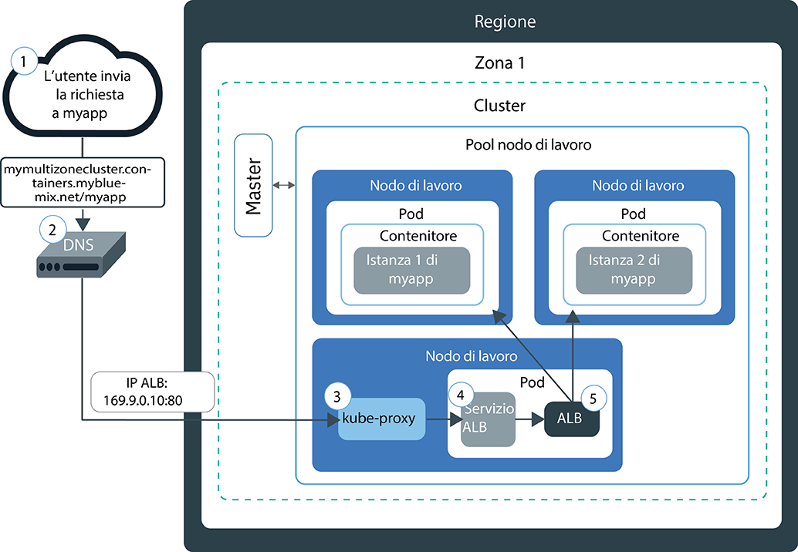
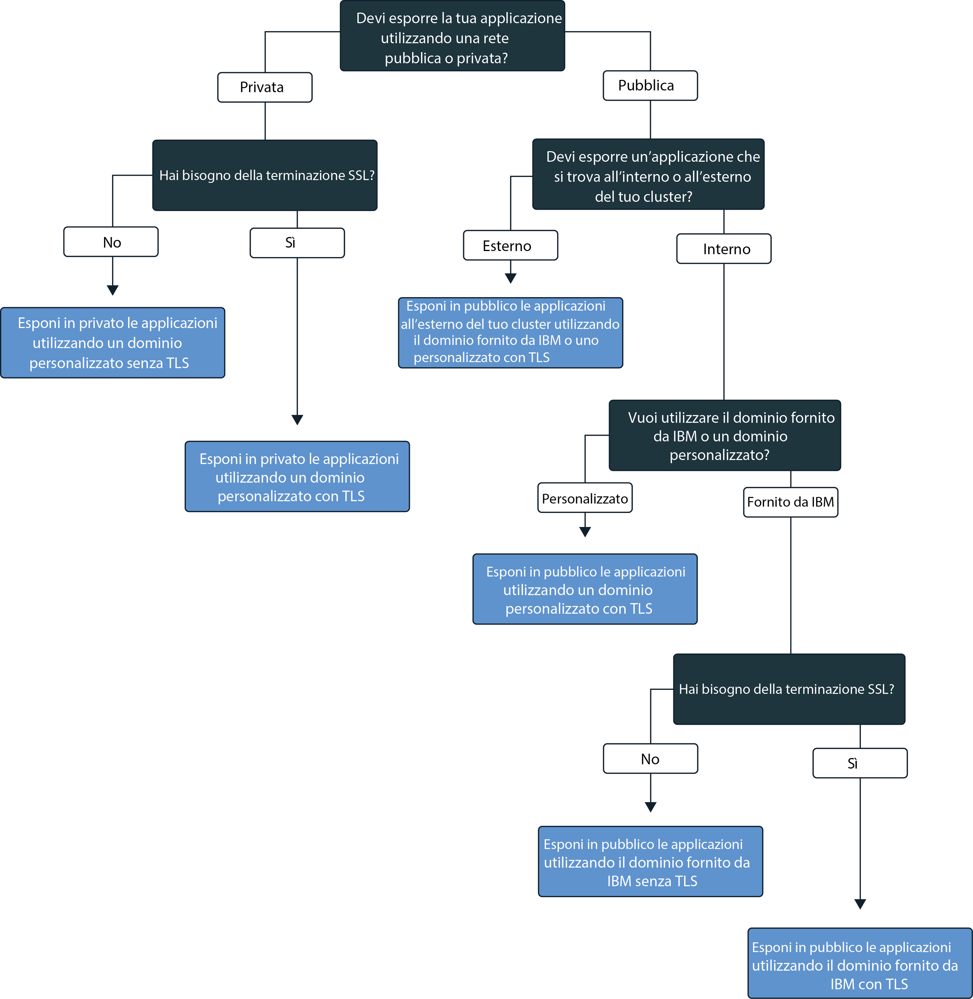

---

copyright:
  years: 2014, 2018
lastupdated: "2018-4-20"

---

{:new_window: target="_blank"}
{:shortdesc: .shortdesc}
{:screen: .screen}
{:pre: .pre}
{:table: .aria-labeledby="caption"}
{:codeblock: .codeblock}
{:tip: .tip}
{:download: .download}


# Esposizione delle applicazioni con Ingress
{: #ingress}

Esponi più applicazioni nel tuo cluster Kubernetes creando risorse Ingress che vengono gestite dal programma di bilanciamento del carico dell'applicazione fornito da IBM in {{site.data.keyword.containerlong}}.
{:shortdesc}

## Gestione del traffico di rete utilizzando Ingress
{: #planning}

Ingress è un servizio Kubernetes che bilancia i carichi di lavoro del traffico di rete nel tuo cluster inoltrando le richieste pubbliche o private alle tue applicazioni. Puoi utilizzare Ingress per esporre più servizi dell'applicazione ad una rete pubblica o privata utilizzando una rotta pubblica o privata univoca.
{:shortdesc}

Ingress è composto da due componenti:
<dl>
<dt>Programma di bilanciamento del carico (ALB - Application load balancer)</dt>
<dd>L'ALB è un programma di bilanciamento del carico esterno che ascolta le richieste di servizio HTTP, HTTPS, TCP o UDP in entrata e le inoltra al pod dell'applicazione appropriato. Quando crei un cluster standard, {{site.data.keyword.containershort_notm}} crea automaticamente un ALB altamente disponibile per il tuo cluster e gli assegna una rotta pubblica univoca. La rotta pubblica è collegata a un indirizzo IP pubblico portatile che viene fornito nel tuo account dell'infrastruttura IBM Cloud (SoftLayer) durante la creazione del cluster. Viene inoltre creato automaticamente un ALB privato predefinito, ma non viene automaticamente abilitato.</dd>
<dt>Risorsa Ingress</dt>
<dd>Per esporre un'applicazione utilizzando Ingress, devi creare un servizio Kubernetes per la tua applicazione e registrare questo servizio con l'ALB definendo una risorsa Ingress. La risorsa Ingress è una risorsa Kubernetes che definisce le regole su come instradare le richieste in entrata per un'applicazione. La risorsa Ingress specifica anche il percorso al tuo servizio dell'applicazione che viene aggiunto alla rotta pubblica per formare un URL univoco dell'applicazione, ad esempio `mycluster.us-south.containers.mybluemix.net/myapp`.</dd>
</dl>

Il seguente diagramma mostra come Ingress dirige la comunicazione da Internet a un'applicazione:



1. Un utente invia una richiesta alla tua applicazione accedendo all'URL dell'applicazione. Questo URL è l'URL pubblico per la tua applicazione esposta a cui è aggiunto il percorso della risorsa Ingress, ad esempio `mycluster.us-south.containers.mybluemix.net/myapp`.

2. Un servizio di sistema DNS che funge da programma di bilanciamento del carico globale risolve l'URL nell'indirizzo IP pubblico portatile dell'ALB pubblico predefinito nel cluster.

3. `kube-proxy` instrada la richiesta al servizio ALB Kubernetes per l'applicazione.

4. Il servizio Kubernetes instrada la richiesta all'ALB.

5. L'ALB verifica se esiste una regola di instradamento per il percorso `myapp` nel cluster. Se viene trovata una regola corrispondente, la richiesta viene inoltrata in base alle regole definite nella risorsa Ingress al pod in cui è distribuita l'applicazione. Se nel cluster vengono distribuite più istanze dell'applicazione, l'ALB bilancia il carico delle richieste tra i pod dell'applicazione.


**Nota:** Ingress è disponibile solo per i cluster standard e richiede almeno due nodi di lavoro nel cluster per garantire l'alta disponibilità e l'applicazione di aggiornamenti periodici. La configurazione di Ingress richiede una [politica di accesso Amministratore](cs_users.html#access_policies). Verifica la tua [politica di accesso](cs_users.html#infra_access) corrente.

Per scegliere la migliore configurazione per Ingress, segui questo albero delle decisioni:


<map name="ingress_map" id="ingress_map">
<area href="/docs/containers/cs_ingress.html#private_ingress_no_tls" alt="Esponi in privato le applicazioni utilizzando un dominio personalizzato senza TLS" shape="rect" coords="25, 246, 187, 294"/>
<area href="/docs/containers/cs_ingress.html#private_ingress_tls" alt="Esponi in privato le applicazioni utilizzando un dominio personalizzato con TLS" shape="rect" coords="161, 337, 309, 385"/>
<area href="/docs/containers/cs_ingress.html#external_endpoint" alt="Esposizione in privato delle applicazioni che si trovano all'esterno del tuo cluster utilizzando un dominio fornito da IBM o personalizzato con TLS" shape="rect" coords="313, 229, 466, 282"/>
<area href="/docs/containers/cs_ingress.html#custom_domain_cert" alt="Esposizione in pubblico delle applicazioni utilizzando un dominio personalizzato con TLS" shape="rect" coords="365, 415, 518, 468"/>
<area href="/docs/containers/cs_ingress.html#ibm_domain" alt="Esposizione in pubblico delle applicazioni utilizzando il dominio fornito da IBM senza TLS" shape="rect" coords="414, 629, 569, 679"/>
<area href="/docs/containers/cs_ingress.html#ibm_domain_cert" alt="Esposizione in pubblico delle applicazioni utilizzando il dominio fornito da IBM con TLS" shape="rect" coords="563, 711, 716, 764"/>
</map>

<br />


## Esposizione delle applicazioni in pubblico
{: #ingress_expose_public}

Quando crei un cluster standard, viene abilitato automaticamente un ALB (programma di bilanciamento del carico dell'applicazione) fornito da IBM a cui vengono assegnati un indirizzo IP pubblico portatile e una rotta pubblica.
{:shortdesc}

Ad ogni applicazione esposta alla rete pubblica tramite Ingress viene assegnato un percorso univoco che viene aggiunto alla rotta pubblica, in modo che tu possa utilizzare un URL univoco per accedere pubblicamente a un'applicazione nel tuo cluster. Per esporre la tua applicazione al pubblico, puoi configurare Ingress per i seguenti scenari.

-   [Esponi in pubblico le applicazioni utilizzando il dominio fornito da IBM senza TLS](#ibm_domain)
-   [Esponi in pubblico le applicazioni utilizzando il dominio fornito da IBM con TLS](#ibm_domain_cert)
-   [Esponi in pubblico le applicazioni utilizzando un dominio personalizzato con TLS](#custom_domain_cert)
-   [Esponi in pubblico le applicazioni che si trovano all'esterno del tuo cluster utilizzando il dominio fornito da IBM o un dominio personalizzato con TLS](#external_endpoint)

### Esponi in pubblico le applicazioni utilizzando il dominio fornito da IBM senza TLS
{: #ibm_domain}

Puoi configurare l'ALB per bilanciare il carico del traffico di rete HTTP in entrata per le applicazioni nel tuo cluster e utilizzare il dominio fornito da IBM per accedere alle tue applicazioni da Internet.
{:shortdesc}

Prima di iniziare:

-   Se non ne hai già uno, [crea un cluster standard](cs_clusters.html#clusters_ui).
-   [Indirizza la tua CLI](cs_cli_install.html#cs_cli_configure) al tuo cluster per eseguire i comandi `kubectl`.

Per esporre un'applicazione utilizzando il dominio fornito da IBM:

1.  [Distribuisci la tua applicazione al cluster](cs_app.html#app_cli). Assicurati di aggiungere un'etichetta alla tua distribuzione nella sezione dei metadati del tuo file di configurazione, ad esempio `app: code`. Questa etichetta è necessaria per identificare tutti i pod in cui è in esecuzione la tua applicazione in modo che possano essere inclusi nel bilanciamento del carico Ingress.

2.   Crea un servizio Kubernetes per l'applicazione che desideri esporre. La tua applicazione deve essere esposta da un servizio Kubernetes per poter essere inclusa dall'ALB cluster nel bilanciamento del carico Ingress.
      1.  Apri il tuo editor preferito e crea un file di configurazione del servizio denominato, ad esempio, `myalbservice.yaml`.
      2.  Definisci un servizio per l'applicazione che l'ALB esporrà al pubblico.

          ```
          apiVersion: v1
          kind: Service
          metadata:
            name: myalbservice
          spec:
            selector:
              <selector_key>: <selector_value>
            ports:
             - protocol: TCP
               port: 8080
          ```
          {: codeblock}

          <table>
          <caption>Descrizione dei componenti del file del servizio ALB</caption>
          <thead>
          <th colspan=2> Descrizione dei componenti del file YAML</th>
          </thead>
          <tbody>
          <tr>
          <td><code>selector</code></td>
          <td>Immetti la coppia di chiave (<em>&lt;selector_key&gt;</em>) e valore (<em>&lt;selector_value&gt;</em>) dell'etichetta che vuoi utilizzare per indirizzare i pod in cui viene eseguita la tua applicazione. Per indirizzare i tuoi pod e includerli nel bilanciamento del carico di servizio, assicurati che i valori di <em>&lt;selector_key&gt;</em> e <em>&lt;selector_value&gt;</em> siano gli stessi della coppia chiave/valore che hai utilizzato nella sezione <code>spec.template.metadata.labels</code> del tuo yaml di distribuzione.</td>
           </tr>
           <tr>
           <td><code> port</code></td>
           <td>La porta su cui è in ascolto il servizio.</td>
           </tr>
           </tbody></table>
      3.  Salva le modifiche.
      4.  Crea il servizio nel tuo cluster.

          ```
          kubectl apply -f myalbservice.yaml
          ```
          {: pre}
      5.  Ripeti questi passi per ogni applicazione che vuoi esporre al pubblico.

3. Richiama i dettagli del tuo cluster per visualizzare il dominio fornito da IBM. Sostituisci _&lt;cluster_name_or_ID&gt;_ con il nome del cluster in cui viene distribuita l'applicazione che vuoi esporre al pubblico.

    ```
    bx cs cluster-get <cluster_name_or_ID>
    ```
    {: pre}

    Output di esempio:

    ```
    Name:                   mycluster
    ID:                     18a61a63c6a94b658596ca93d087aad9
    State:                  normal
    Created:                2018-01-12T18:33:35+0000
    Location:               dal10
    Master URL:             https://169.xx.xxx.xxx:26268
    Ingress Subdomain:      mycluster-12345.us-south.containers.mybluemix.net
    Ingress Secret:         <tls_secret>
    Workers:                3
    Version:                1.8.11
    Owner Email:            owner@email.com
    Monitoring Dashboard:   <dashboard_URL>
    ```
    {: screen}

    Puoi visualizzare il dominio fornito da IBM nel campo **Ingress subdomain**.
4.  Crea una risorsa Ingress. Le risorse Ingress definiscono le regole di instradamento per il servizio Kubernetes che hai creato per la tua applicazione e sono utilizzate dall'ALB per instradare il traffico di rete in entrata al servizio. Devi utilizzare una risorsa Ingress per definire le regole di instradamento per più applicazioni se ogni applicazione viene esposta tramite un servizio Kubernetes all'interno del cluster.
    1.  Apri il tuo editor preferito e crea un file di configurazione Ingress denominato, ad esempio, `myingressresource.yaml`.
    2.  Definisci una risorsa Ingress nel tuo file di configurazione che utilizza il dominio fornito da IBM per instradare il traffico di rete in entrata ai servizi che hai creato in precedenza.

        ```
        apiVersion: extensions/v1beta1
        kind: Ingress
        metadata:
          name: myingressresource
        spec:
          rules:
          - host: <ibm_domain>
            http:
              paths:
              - path: /<service1_path>
                backend:
                  serviceName: <service1>
                  servicePort: 80
              - path: /<service2_path>
                backend:
                  serviceName: <service2>
                  servicePort: 80
        ```
        {: codeblock}

        <table>
        <thead>
        <th colspan=2> Descrizione dei componenti del file YAML</th>
        </thead>
        <tbody>
        <tr>
        <td><code>host</code></td>
        <td>Sostituisci <em>&lt;ibm_domain&gt;</em> con il nome del <strong>dominio secondario Ingress</strong> fornito da IBM dal passo precedente.

        </br></br>
        <strong>Nota:</strong> non utilizzare * per il tuo host o lascia vuota la proprietà host per evitare errori durante la creazione di Ingress.</td>
        </tr>
        <tr>
        <td><code>path</code></td>
        <td>Sostituisci <em>&lt;service1_path&gt;</em> con una barra o il percorso univoco su cui è in ascolto la tua applicazione in modo che il traffico di rete possa essere inoltrato all'applicazione.

        </br>
        Per ogni servizio Kubernetes, puoi definire un percorso individuale che viene aggiunto al dominio fornito da IBM per creare un percorso univoco alla tua applicazione; ad esempio <code>ibm_domain/service1_path</code>. Quando immetti questa rotta in un browser web, il traffico di rete viene instradato all'ALB. L'ALB cerca il servizio associato e invia il traffico di rete al servizio. Il servizio inoltra quindi il traffico ai pod su cui è in esecuzione l'applicazione. Per poter ricevere il traffico di rete in entrata, l'applicazione deve essere configurata per l'ascolto su questo percorso.

        </br></br>
        Molte applicazioni non sono in ascolto su uno specifico percorso, ma utilizzano il percorso root e una porta specificata. In questo caso, definisci il percorso root come <code>/</code> e non specificare un percorso individuale per la tua applicazione.
        </br>
        Esempi: <ul><li>Per <code>http://ibm_domain/</code>, immetti <code>/</code> come percorso.</li><li>Per <code>http://ibm_domain/service1_path</code>, immetti <code>/service1_path</code> come percorso.</li></ul>
        </br>
        <strong>Suggerimento:</strong> per configurare Ingress affinché sia in ascolto su un percorso diverso da quello su cui è in ascolto la tua applicazione, puoi utilizzare l'[annotazione di riscrittura](cs_annotations.html#rewrite-path) per stabilire l'instradamento appropriato alla tua applicazione.</td>
        </tr>
        <tr>
        <td><code>serviceName</code></td>
        <td>Sostituisci <em>&lt;service1&gt;</em> con il nome del servizio che hai utilizzato alla creazione del servizio Kubernetes per la tua applicazione.</td>
        </tr>
        <tr>
        <td><code>servicePort</code></td>
        <td>La porta su cui è in ascolto il tuo servizio. Utilizza la stessa porta che hai definito quando hai creato il servizio Kubernetes per la tua applicazione.</td>
        </tr>
        </tbody></table>

    3.  Crea la risorsa Ingress per il tuo cluster.

        ```
        kubectl apply -f myingressresource.yaml
        ```
        {: pre}
5.   Verifica che la risorsa Ingress sia stata creata correttamente.

      ```
      kubectl describe ingress myingressresource
      ```
      {: pre}

      1. Se i messaggi negli eventi descrivono un errore nella configurazione della tua risorsa, modifica i valori nel file di risorsa e riapplica il file per la risorsa.

6.   In un browser web, immetti l'URL del servizio dell'applicazione a cui accedere.

      ```
      https://<ibm_domain>/<service1_path>
      ```
      {: codeblock}


<br />


### Esponi in pubblico le applicazioni utilizzando il dominio fornito da IBM con TLS
{: #ibm_domain_cert}

Puoi configurare l'ALB Ingress per gestire le connessioni TLS in entrata per le tue applicazioni, decrittografare il traffico di rete utilizzando il certificato TLS fornito da IBM e inoltrare la richiesta decrittografata alle applicazioni esposte nel tue cluster.
{:shortdesc}

Prima di iniziare:

-   Se non ne hai già uno, [crea un cluster standard](cs_clusters.html#clusters_ui).
-   [Indirizza la tua CLI](cs_cli_install.html#cs_cli_configure) al tuo cluster per eseguire i comandi `kubectl`.

Per esporre un'applicazione utilizzando il dominio fornito da IBM con TLS:

1.  [Distribuisci la tua applicazione al cluster](cs_app.html#app_cli). Assicurati di aggiungere un'etichetta alla tua distribuzione nella sezione dei metadati del tuo file di configurazione, ad esempio `app: code`. Questa etichetta è necessaria per identificare tutti i pod in cui è in esecuzione la tua applicazione in modo che possano essere inclusi nel bilanciamento del carico Ingress.

2.   Crea un servizio Kubernetes per l'applicazione che desideri esporre. La tua applicazione deve essere esposta da un servizio Kubernetes per poter essere inclusa dall'ALB cluster nel bilanciamento del carico Ingress.
      1.  Apri il tuo editor preferito e crea un file di configurazione del servizio denominato, ad esempio, `myalbservice.yaml`.
      2.  Definisci un servizio per l'applicazione che l'ALB esporrà al pubblico.

          ```
          apiVersion: v1
          kind: Service
          metadata:
            name: myalbservice
          spec:
            selector:
              <selector_key>: <selector_value>
            ports:
             - protocol: TCP
               port: 8080
          ```
          {: codeblock}

          <table>
          <caption>Descrizione dei componenti del file del servizio ALB</caption>
          <thead>
          <th colspan=2> Descrizione dei componenti del file YAML</th>
          </thead>
          <tbody>
          <tr>
          <td><code>selector</code></td>
          <td>Immetti la coppia di chiave (<em>&lt;selector_key&gt;</em>) e valore (<em>&lt;selector_value&gt;</em>) dell'etichetta che vuoi utilizzare per indirizzare i pod in cui viene eseguita la tua applicazione. Per indirizzare i tuoi pod e includerli nel bilanciamento del carico di servizio, assicurati che i valori di <em>&lt;selector_key&gt;</em> e <em>&lt;selector_value&gt;</em> siano gli stessi della coppia chiave/valore che hai utilizzato nella sezione <code>spec.template.metadata.labels</code> del tuo yaml di distribuzione.</td>
           </tr>
           <tr>
           <td><code> port</code></td>
           <td>La porta su cui è in ascolto il servizio.</td>
           </tr>
           </tbody></table>
      3.  Salva le modifiche.
      4.  Crea il servizio nel tuo cluster.

          ```
          kubectl apply -f myalbservice.yaml
          ```
          {: pre}
      5.  Ripeti questi passi per ogni applicazione che vuoi esporre al pubblico.

3.   Visualizza il dominio e il certificato TLS forniti da IBM. Sostituisci _&lt;cluster_name_or_ID&gt;_ con il nome del cluster in cui viene distribuita l'applicazione.

      ```
      bx cs cluster-get <cluster_name_or_ID>
      ```
      {: pre}

      Output di esempio:

      ```
      Name:                   mycluster
      ID:                     18a61a63c6a94b658596ca93d087aad9
      State:                  normal
      Created:                2018-01-12T18:33:35+0000
      Location:               dal10
      Master URL:             https://169.xx.xxx.xxx:26268
      Ingress Subdomain:      mycluster-12345.us-south.containers.mybluemix.net
      Ingress Secret:         <ibm_tls_secret>
      Workers:                3
      Version:                1.8.11
      Owner Email:            owner@email.com
      Monitoring Dashboard:   <dashboard_URL>
      ```
      {: screen}

      Puoi visualizzare il dominio fornito da IBM nel **dominio secondario Ingress** e il certificato fornito da IBM nei campi **Segreto Ingress**.

4.  Crea una risorsa Ingress. Le risorse Ingress definiscono le regole di instradamento per il servizio Kubernetes che hai creato per la tua applicazione e sono utilizzate dall'ALB per instradare il traffico di rete in entrata al servizio. Devi utilizzare una risorsa Ingress per definire le regole di instradamento per più applicazioni se ogni applicazione viene esposta tramite un servizio Kubernetes all'interno del cluster.
    1.  Apri il tuo editor preferito e crea un file di configurazione Ingress denominato, ad esempio, `myingressresource.yaml`.
    2.  Definisci una risorsa Ingress nel tuo file di configurazione che utilizza il dominio fornito da IBM per instradare il traffico di rete in entrata ai servizi che hai creato in precedenza e il tuo certificato personalizzato per gestire la terminazione TLS.

        ```
        apiVersion: extensions/v1beta1
        kind: Ingress
        metadata:
          name: myingressresource
        spec:
          tls:
          - hosts:
            - <ibm_domain>
            secretName: <ibm_tls_secret>
          rules:
          - host: <ibm_domain>
            http:
              paths:
              - path: /<service1_path>
                backend:
                  serviceName: <service1>
                  servicePort: 80
              - path: /<service2_path>
                backend:
                  serviceName: <service2>
                  servicePort: 80
        ```
        {: codeblock}

        <table>
        <thead>
        <th colspan=2> Descrizione dei componenti del file YAML</th>
        </thead>
        <tbody>
        <tr>
        <td><code>tls/hosts</code></td>
        <td>Sostituisci <em>&lt;ibm_domain&gt;</em> con il nome del <strong>dominio secondario Ingress</strong> fornito da IBM dal passo precedente. Questo dominio è configurato per la terminazione TLS.

        </br></br>
        <strong>Nota:</strong> non utilizzare &ast; per il tuo host o lascia vuota la proprietà host per evitare errori durante la creazione di Ingress.</td>
        </tr>
        <tr>
        <td><code>tls/secretName</code></td>
        <td>Sostituisci <em>&lt;<ibm_tls_secret>&gt;</em> con il nome del <strong>segreto Ingress</strong> fornito da IBM dal passo precedente. Questo certificato gestisce la terminazione TLS.
        </tr>
        <tr>
        <td><code>host</code></td>
        <td>Sostituisci <em>&lt;ibm_domain&gt;</em> con il nome del <strong>dominio secondario Ingress</strong> fornito da IBM dal passo precedente. Questo dominio è configurato per la terminazione TLS.

        </br></br>
        <strong>Nota:</strong> non utilizzare &ast; per il tuo host o lascia vuota la proprietà host per evitare errori durante la creazione di Ingress.</td>
        </tr>
        <tr>
        <td><code>path</code></td>
        <td>Sostituisci <em>&lt;service1_path&gt;</em> con una barra o il percorso univoco su cui è in ascolto la tua applicazione in modo che il traffico di rete possa essere inoltrato all'applicazione.

        </br>
        Per ogni servizio Kubernetes, puoi definire un percorso individuale che viene aggiunto al dominio fornito da IBM per creare un percorso univoco alla tua applicazione. Quando immetti questa rotta in un browser web, il traffico di rete viene instradato all'ALB. L'ALB cerca il servizio associato e invia il traffico di rete al servizio. Il servizio inoltra quindi il traffico ai pod su cui è in esecuzione l'applicazione. Per poter ricevere il traffico di rete in entrata, l'applicazione deve essere configurata per l'ascolto su questo percorso.

        </br>
        Molte applicazioni non sono in ascolto su uno specifico percorso, ma utilizzano il percorso root e una porta specificata. In questo caso, definisci il percorso root come <code>/</code> e non specificare un percorso individuale per la tua applicazione.

        </br>
        Esempi: <ul><li>Per <code>http://ibm_domain/</code>, immetti <code>/</code> come percorso.</li><li>Per <code>http://ibm_domain/service1_path</code>, immetti <code>/service1_path</code> come percorso.</li></ul>
        <strong>Suggerimento:</strong> per configurare Ingress affinché sia in ascolto su un percorso diverso da quello su cui è in ascolto la tua applicazione, puoi utilizzare l'[annotazione di riscrittura](cs_annotations.html#rewrite-path) per stabilire l'instradamento appropriato alla tua applicazione.</td>
        </tr>
        <tr>
        <td><code>serviceName</code></td>
        <td>Sostituisci <em>&lt;service1&gt;</em> con il nome del servizio che hai utilizzato alla creazione del servizio Kubernetes per la tua applicazione.</td>
        </tr>
        <tr>
        <td><code>servicePort</code></td>
        <td>La porta su cui è in ascolto il tuo servizio. Utilizza la stessa porta che hai definito quando hai creato il servizio Kubernetes per la tua applicazione.</td>
        </tr>
        </tbody></table>

    3.  Crea la risorsa Ingress per il tuo cluster.

        ```
        kubectl apply -f myingressresource.yaml
        ```
        {: pre}
5.   Verifica che la risorsa Ingress sia stata creata correttamente.

      ```
      kubectl describe ingress myingressresource
      ```
      {: pre}

      1. Se i messaggi negli eventi descrivono un errore nella configurazione della tua risorsa, modifica i valori nel file di risorsa e riapplica il file per la risorsa.

6.   In un browser web, immetti l'URL del servizio dell'applicazione a cui accedere.

      ```
      https://<ibm_domain>/<service1_path>
      ```
      {: codeblock}


<br />


### Esponi in pubblico le applicazioni utilizzando un dominio personalizzato con TLS
{: #custom_domain_cert}

Puoi configurare l'ALB per instradare il traffico di rete in entrata alle applicazioni nel tuo cluster e utilizzare il tuo proprio certificato TLS per gestire la terminazione TLS, mentre utilizzi il tuo dominio personalizzato anziché il dominio fornito da IBM.
{:shortdesc}

Prima di iniziare:

-   Se non ne hai già uno, [crea un cluster standard](cs_clusters.html#clusters_ui).
-   [Indirizza la tua CLI](cs_cli_install.html#cs_cli_configure) al tuo cluster per eseguire i comandi `kubectl`.

Per esporre un'applicazione utilizzando un dominio personalizzato con TLS:

1.  Crea un dominio personalizzato. Per creare un dominio personalizzato, utilizza il provider DNS (Domain Name Service) o [{{site.data.keyword.Bluemix_notm}} ](/docs/infrastructure/dns/getting-started.html#getting-started-with-dns) per registrare il tuo dominio.
2.  Configura il tuo dominio per instradare il traffico di rete in entrata all'ALB fornito da IBM. Scegli tra queste opzioni:
    -   Definisci un alias per il tuo dominio personalizzato specificando il dominio fornito da IBM come un record di nome canonico (CNAME). Per trovare il dominio Ingress fornito da IBM, esegui `bx cs cluster-get <cluster_name>` e cerca il campo **Dominio secondario Ingress**.
    -   Associa il tuo dominio personalizzato all'indirizzo IP pubblico portatile dell'ALB fornito da IBM aggiungendo l'indirizzo IP come record. Per trovare l'indirizzo IP pubblico portatile dell'ALB, esegui `bx cs alb-get <public_alb_ID>`.
3.  Importa o crea un certificato TLS e il segreto della chiave:
    * Se in {{site.data.keyword.cloudcerts_long_notm}} è memorizzato un certificato TLS che vuoi utilizzare, puoi importare il suo segreto associato nel tuo cluster immettendo il seguente comando:

      ```
      bx cs alb-cert-deploy --secret-name <secret_name> --cluster <cluster_name_or_ID> --cert-crn <certificate_crn>
      ```
      {: pre}

    * Se non hai un certificato TLS pronto, segui questa procedura:
        1. Crea un certificato e una chiave TLS per il tuo dominio codificati in formato PEM.
        2. Crea un segreto che utilizza il certificato e la chiave TLS. Sostituisci <em>&lt;tls_secret_name&gt;</em> con un nome per il tuo segreto Kubernetes, <em>&lt;tls_key_filepath&gt;</em> con il percorso al tuo file della chiave TLS personalizzato e <em>&lt;tls_cert_filepath&gt;</em> con il percorso al tuo file del certificato TLS personalizzato.

            ```
            kubectl create secret tls <tls_secret_name> --key <tls_key_filepath> --cert <tls_cert_filepath>
            ```
            {: pre}
4.  [Distribuisci la tua applicazione al cluster](cs_app.html#app_cli). Assicurati di aggiungere un'etichetta alla tua distribuzione nella sezione dei metadati del tuo file di configurazione, ad esempio `app: code`. Questa etichetta è necessaria per identificare tutti i pod in cui è in esecuzione la tua applicazione in modo che possano essere inclusi nel bilanciamento del carico Ingress.

5.   Crea un servizio Kubernetes per l'applicazione che desideri esporre. La tua applicazione deve essere esposta da un servizio Kubernetes per poter essere inclusa dall'ALB cluster nel bilanciamento del carico Ingress.
      1.  Apri il tuo editor preferito e crea un file di configurazione del servizio denominato, ad esempio, `myalbservice.yaml`.
      2.  Definisci un servizio per l'applicazione che l'ALB esporrà al pubblico.

          ```
          apiVersion: v1
          kind: Service
          metadata:
            name: myalbservice
          spec:
            selector:
              <selector_key>: <selector_value>
            ports:
             - protocol: TCP
               port: 8080
          ```
          {: codeblock}

          <table>
          <caption>Descrizione dei componenti del file del servizio ALB</caption>
          <thead>
          <th colspan=2> Descrizione dei componenti del file YAML</th>
          </thead>
          <tbody>
          <tr>
          <td><code>selector</code></td>
          <td>Immetti la coppia di chiave (<em>&lt;selector_key&gt;</em>) e valore (<em>&lt;selector_value&gt;</em>) dell'etichetta che vuoi utilizzare per indirizzare i pod in cui viene eseguita la tua applicazione. Per indirizzare i tuoi pod e includerli nel bilanciamento del carico di servizio, assicurati che i valori di <em>&lt;selector_key&gt;</em> e <em>&lt;selector_value&gt;</em> siano gli stessi della coppia chiave/valore che hai utilizzato nella sezione <code>spec.template.metadata.labels</code> del tuo yaml di distribuzione.</td>
           </tr>
           <tr>
           <td><code> port</code></td>
           <td>La porta su cui è in ascolto il servizio.</td>
           </tr>
           </tbody></table>
      3.  Salva le modifiche.
      4.  Crea il servizio nel tuo cluster.

          ```
          kubectl apply -f myalbservice.yaml
          ```
          {: pre}
      5.  Ripeti questi passi per ogni applicazione che vuoi esporre al pubblico.

6.  Crea una risorsa Ingress. Le risorse Ingress definiscono le regole di instradamento per il servizio Kubernetes che hai creato per la tua applicazione e sono utilizzate dall'ALB per instradare il traffico di rete in entrata al servizio. Devi utilizzare una risorsa Ingress per definire le regole di instradamento per più applicazioni se ogni applicazione viene esposta tramite un servizio Kubernetes all'interno del cluster.
    1.  Apri il tuo editor preferito e crea un file di configurazione Ingress denominato, ad esempio, `myingressresource.yaml`.
    2.  Definisci una risorsa Ingress nel file di configurazione che utilizza il tuo dominio personalizzato per instradare il traffico di rete in entrata ai tuoi servizi e il tuo certificato personalizzato per gestire la terminazione TLS.

        ```
        apiVersion: extensions/v1beta1
        kind: Ingress
        metadata:
          name: myingressresource
        spec:
          tls:
          - hosts:
            - <custom_domain>
            secretName: <tls_secret_name>
          rules:
          - host: <custom_domain>
            http:
              paths:
              - path: /<service1_path>
                backend:
                  serviceName: <service1>
                  servicePort: 80
              - path: /<service2_path>
                backend:
                  serviceName: <service2>
                  servicePort: 80
        ```
        {: codeblock}

        <table>
        <thead>
        <th colspan=2> Descrizione dei componenti del file YAML</th>
        </thead>
        <tbody>
        <tr>
        <td><code>tls/hosts</code></td>
        <td>Sostituisci <em>&lt;custom_domain&gt;</em> con il tuo dominio personalizzato che vuoi configurare per la terminazione TLS.

        </br></br>
        <strong>Nota:</strong> non utilizzare &ast; per il tuo host o lascia vuota la proprietà host per evitare errori durante la creazione di Ingress.</td>
        </tr>
        <tr>
        <td><code>tls/secretName</code></td>
        <td>Sostituisci <em>&lt;tls_secret_name&gt;</em> con il nome del segreto che hai creato in precedenza che contiene il tuo certificato e la tua chiave TLS personalizzati. Se hai importato un certificato da {{site.data.keyword.cloudcerts_short}}, puoi eseguire <code>bx cs alb-cert-get --cluster <cluster_name_or_ID> --cert-crn <certificate_crn></code> per visualizzare i segreti associati a un certificato TLS.
        </tr>
        <tr>
        <td><code>host</code></td>
        <td>Sostituisci <em>&lt;custom_domain&gt;</em> con il tuo dominio personalizzato che vuoi configurare per la terminazione TLS.

        </br></br>
        <strong>Nota:</strong> non utilizzare &ast; per il tuo host o lascia vuota la proprietà host per evitare errori durante la creazione di Ingress.
        </td>
        </tr>
        <tr>
        <td><code>path</code></td>
        <td>Sostituisci <em>&lt;service1_path&gt;</em> con una barra o il percorso univoco su cui è in ascolto la tua applicazione in modo che il traffico di rete possa essere inoltrato all'applicazione.

        </br>
        Per ogni servizio, puoi definire un percorso individuale che viene aggiunto al tuo dominio personalizzato per creare un percorso univoco alla tua applicazione. Quando immetti questa rotta in un browser web, il traffico di rete viene instradato all'ALB. L'ALB cerca il servizio associato e invia il traffico di rete al servizio. Il servizio inoltra quindi il traffico ai pod su cui è in esecuzione l'applicazione. Per poter ricevere il traffico di rete in entrata, l'applicazione deve essere configurata per l'ascolto su questo percorso.

        </br>
        Molte applicazioni non sono in ascolto su uno specifico percorso, ma utilizzano il percorso root e una porta specificata. In questo caso, definisci il percorso root come <code>/</code> e non specificare un percorso individuale per la tua applicazione.

        </br></br>
        Esempi: <ul><li>Per <code>https://custom_domain/</code>, immetti <code>/</code> come percorso.</li><li>Per <code>https://custom_domain/service1_path</code>, immetti <code>/service1_path</code> come percorso.</li></ul>
        <strong>Suggerimento:</strong> per configurare Ingress affinché sia in ascolto su un percorso diverso da quello su cui è in ascolto la tua applicazione, puoi utilizzare l'[annotazione di riscrittura](cs_annotations.html#rewrite-path) per stabilire l'instradamento appropriato alla tua applicazione.
        </td>
        </tr>
        <tr>
        <td><code>serviceName</code></td>
        <td>Sostituisci <em>&lt;service1&gt;</em> con il nome del servizio che hai utilizzato alla creazione del servizio Kubernetes per la tua applicazione.</td>
        </tr>
        <tr>
        <td><code>servicePort</code></td>
        <td>La porta su cui è in ascolto il tuo servizio. Utilizza la stessa porta che hai definito quando hai creato il servizio Kubernetes per la tua applicazione.</td>
        </tr>
        </tbody></table>

    3.  Salva le modifiche.
    4.  Crea la risorsa Ingress per il tuo cluster.

        ```
        kubectl apply -f myingressresource.yaml
        ```
        {: pre}
7.   Verifica che la risorsa Ingress sia stata creata correttamente.

      ```
      kubectl describe ingress myingressresource
      ```
      {: pre}

      1. Se i messaggi negli eventi descrivono un errore nella configurazione della tua risorsa, modifica i valori nel file di risorsa e riapplica il file per la risorsa.

8.   In un browser web, immetti l'URL del servizio dell'applicazione a cui accedere.

      ```
      https://<custom_domain>/<service1_path>
      ```
      {: codeblock}


<br />


### Esponi in pubblico le applicazioni che si trovano all'esterno del tuo cluster utilizzando il dominio fornito da IBM o un dominio personalizzato con TLS
{: #external_endpoint}

Puoi configurare l'ALB per includere le applicazioni che si trovano all'esterno del cluster. Le richieste in entrata sul dominio fornito da IBM o sul tuo dominio personalizzato vengono inoltrate automaticamente all'applicazione esterna.
{:shortdesc}

Prima di iniziare:

-   Se non ne hai già uno, [crea un cluster standard](cs_clusters.html#clusters_ui).
-   [Indirizza la tua CLI](cs_cli_install.html#cs_cli_configure) al tuo cluster per eseguire i comandi `kubectl`.
-   Assicurati che l'applicazione esterna che desideri includere nel bilanciamento del carico del cluster sia accessibile mediante un indirizzo IP pubblico.

Puoi instradare il traffico di rete in entrata sul dominio fornito da IBM alle applicazioni che si trovano all'esterno del cluster. Se invece vuoi utilizzare un dominio e un certificato TLS personalizzati, sostituisci il dominio fornito da IBM e il certificato TLS con [il tuo dominio e il tuo certificato TLS personalizzati](#custom_domain_cert).

1.  Crea un servizio Kubernetes per il tuo cluster che inoltrerà le richieste in entrata a un endpoint esterno che avrai già creato.
    1.  Apri il tuo editor preferito e crea un file di configurazione del servizio denominato, ad esempio, `myexternalservice.yaml`.
    2.  Definisci il servizio ALB.

        ```
        apiVersion: v1
        kind: Service
        metadata:
          name: myexternalservice
        spec:
          ports:
           - protocol: TCP
             port: 8080
        ```
        {: codeblock}

        <table>
        <caption>Descrizione dei componenti del file del servizio ALB</caption>
        <thead>
        <th colspan=2> Descrizione dei componenti del file YAML</th>
        </thead>
        <tbody>
        <tr>
        <td><code>metadata/name</code></td>
        <td>Sostituisci <em>&lt;myexternalservice&gt;</em> con un nome per il tuo servizio.</td>
        </tr>
        <tr>
        <td><code> port</code></td>
        <td>La porta su cui è in ascolto il servizio.</td>
        </tr></tbody></table>

    3.  Salva le modifiche.
    4.  Crea il servizio Kubernetes per il tuo cluster.

        ```
        kubectl apply -f myexternalservice.yaml
        ```
        {: pre}
2.  Configura un endpoint Kubernetes che definisce la posizione esterna dell'applicazione che desideri includere nel bilanciamento del carico del cluster.
    1.  Apri il tuo editor preferito e crea un file di configurazione endpoint denominato, ad esempio, `myexternalendpoint.yaml`.
    2.  Definisci il tuo endpoint esterno. Includi tutti gli indirizzi IP pubblici e le porte che puoi utilizzare per accedere alla tua applicazione esterna.

        ```
        kind: Endpoints
        apiVersion: v1
        metadata:
          name: myexternalendpoint
        subsets:
          - addresses:
              - ip: <external_IP1>
              - ip: <external_IP2>
            ports:
              - port: <external_port>
        ```
        {: codeblock}

        <table>
        <thead>
        <th colspan=2> Descrizione dei componenti del file YAML</th>
        </thead>
        <tbody>
        <tr>
        <td><code>name</code></td>
        <td>Sostituisci <em>&lt;myexternalendpoint&gt;</em> con il nome del servizio Kubernetes che hai creato in precedenza.</td>
        </tr>
        <tr>
        <td><code>ip</code></td>
        <td>Sostituisci <em>&lt;external_IP&gt;</em> con gli indirizzi IP pubblici per la connessione alla tua applicazione esterna.</td>
         </tr>
         <td><code> port</code></td>
         <td>Sostituisci <em>&lt;external_port&gt;</em> con la porta su cui è in ascolto la tua applicazione esterna.</td>
         </tbody></table>

    3.  Salva le modifiche.
    4.  Crea l'endpoint Kubernetes per il tuo cluster.

        ```
        kubectl apply -f myexternalendpoint.yaml
        ```
        {: pre}
3.   Visualizza il dominio e il certificato TLS forniti da IBM. Sostituisci _&lt;cluster_name_or_ID&gt;_ con il nome del cluster in cui viene distribuita l'applicazione.

      ```
      bx cs cluster-get <cluster_name_or_ID>
      ```
      {: pre}

      Output di esempio:

      ```
      Name:                   mycluster
      ID:                     18a61a63c6a94b658596ca93d087aad9
      State:                  normal
      Created:                2018-01-12T18:33:35+0000
      Location:               dal10
      Master URL:             https://169.xx.xxx.xxx:26268
      Ingress Subdomain:      mycluster-12345.us-south.containers.mybluemix.net
      Ingress Secret:         <ibm_tls_secret>
      Workers:                3
      Version:                1.8.11
      Owner Email:            owner@email.com
      Monitoring Dashboard:   <dashboard_URL>
      ```
      {: screen}

      Puoi visualizzare il dominio fornito da IBM nel **dominio secondario Ingress** e il certificato fornito da IBM nei campi **Segreto Ingress**.

4.  Crea una risorsa Ingress. Le risorse Ingress definiscono le regole di instradamento per il servizio Kubernetes che hai creato per la tua applicazione e sono utilizzate dall'ALB per instradare il traffico di rete in entrata al servizio. Puoi utilizzare una risorsa Ingress per definire le regole di instradamento per più applicazioni esterne finché ogni applicazione è esposta con il proprio endpoint esterno tramite un servizio Kubernetes nel cluster.
    1.  Apri il tuo editor preferito e crea un file di configurazione Ingress denominato, ad esempio, `myexternalingress.yaml`.
    2.  Definisci una risorsa Ingress nel tuo file di configurazione che utilizza il dominio fornito da IBM e il certificato TLS per instradare il traffico di rete in entrata alla tua applicazione esterna utilizzando l'endpoint esterno che hai creato in precedenza.

        ```
        apiVersion: extensions/v1beta1
        kind: Ingress
        metadata:
          name: myexternalingress
        spec:
          tls:
          - hosts:
            - <ibm_domain>
            secretName: <ibm_tls_secret>
          rules:
          - host: <ibm_domain>
            http:
              paths:
              - path: /<external_service1_path>
                backend:
                  serviceName: <external_service1>
                  servicePort: 80
              - path: /<external_service2_path>
                backend:
                  serviceName: <external_service2>
                  servicePort: 80
        ```
        {: codeblock}

        <table>
        <thead>
        <th colspan=2> Descrizione dei componenti del file YAML</th>
        </thead>
        <tbody>
        <tr>
        <td><code>tls/hosts</code></td>
        <td>Sostituisci <em>&lt;ibm_domain&gt;</em> con il nome del <strong>dominio secondario Ingress</strong> fornito da IBM dal passo precedente. Questo dominio è configurato per la terminazione TLS.

        </br></br>
        <strong>Nota:</strong> non utilizzare &ast; per il tuo host o lascia vuota la proprietà host per evitare errori durante la creazione di Ingress.</td>
        </tr>
        <tr>
        <td><code>tls/secretName</code></td>
        <td>Sostituisci <em>&lt;ibm_tls_secret&gt;</em> con il <strong>Segreto Ingress</strong> fornito da IBM dal passo precedente. Questo certificato gestisce la terminazione TLS.</td>
        </tr>
        <tr>
        <td><code>rules/host</code></td>
        <td>Sostituisci <em>&lt;ibm_domain&gt;</em> con il nome del <strong>dominio secondario Ingress</strong> fornito da IBM dal passo precedente. Questo dominio è configurato per la terminazione TLS.

        </br></br>
        <strong>Nota:</strong> non utilizzare &ast; per il tuo host o lascia vuota la proprietà host per evitare errori durante la creazione di Ingress.</td>
        </tr>
        <tr>
        <td><code>path</code></td>
        <td>Sostituisci <em>&lt;external_service_path&gt;</em> con una barra o il percorso univoco su cui è in ascolto la tua applicazione esterna, in modo che il traffico di rete possa essere inoltrato all'applicazione.

        </br>
        Per ogni servizio, puoi definire un singolo percorso che viene aggiunto al dominio fornito da IBM o personalizzato per creare un percorso univoco per la tua applicazione, ad esempio <code>http://ibm_domain/external_service_path</code> o <code>http://custom_domain/</code>. Quando immetti questa rotta in un browser web, il traffico di rete viene instradato all'ALB. L'ALB cerca il servizio associato e invia il traffico di rete al servizio. Il servizio inoltra quindi il traffico all'applicazione esterna. Per poter ricevere il traffico di rete in entrata, l'applicazione deve essere configurata per l'ascolto su questo percorso.

        </br></br>
        Molte applicazioni non sono in ascolto su uno specifico percorso, ma utilizzano il percorso root e una porta specificata. In questo caso, definisci il percorso root come <code>/</code> e non specificare un percorso individuale per la tua applicazione.

        </br></br>
        <strong>Suggerimento:</strong> per configurare Ingress affinché sia in ascolto su un percorso diverso da quello su cui è in ascolto la tua applicazione, puoi utilizzare l'[annotazione di riscrittura](cs_annotations.html#rewrite-path) per stabilire l'instradamento appropriato alla tua applicazione.</td>
        </tr>
        <tr>
        <td><code>serviceName</code></td>
        <td>Sostituisci <em>&lt;external_service&gt;</em> con il nome del servizio che hai utilizzato alla creazione del servizio Kubernetes per la tua applicazione esterna.</td>
        </tr>
        <tr>
        <td><code>servicePort</code></td>
        <td>La porta su cui è in ascolto il tuo servizio.</td>
        </tr>
        </tbody></table>

    3.  Salva le modifiche.
    4.  Crea la risorsa Ingress per il tuo cluster.

        ```
        kubectl apply -f myexternalingress.yaml
        ```
        {: pre}
5.   Verifica che la risorsa Ingress sia stata creata correttamente.

      ```
      kubectl describe ingress myingressresource
      ```
      {: pre}

      1. Se i messaggi negli eventi descrivono un errore nella configurazione della tua risorsa, modifica i valori nel file di risorsa e riapplica il file per la risorsa.

6.   In un browser web, immetti l'URL del servizio dell'applicazione a cui accedere.

      ```
      https://<ibm_domain>/<service1_path>
      ```
      {: codeblock}


<br />


## Esposizione delle applicazioni su una rete privata
{: #ingress_expose_private}

Quando crei un cluster standard, viene creato un ALB (programma di bilanciamento del carico dell'applicazione) fornito da IBM a cui vengono assegnati un indirizzo IP privato portatile e una rotta privata. Tuttavia, l'ALB privato predefinito non viene abilitato automaticamente.
{:shortdesc}

Per esporre la tua applicazione alle reti private, per prima cosa [abilita il programma di bilanciamento del carico dell'applicazione privato predefinito](#private_ingress).

Puoi quindi configurare Ingress per i seguenti scenari.
-   [Esponi in privato le applicazioni utilizzando un dominio personalizzato senza TLS utilizzando un provider DNS esterno](#private_ingress_no_tls)
-   [Esponi in privato le applicazioni utilizzando un dominio personalizzato con TLS utilizzando un provider DNS esterno](#private_ingress_tls)
-   [Esponi in privato le applicazioni utilizzando un servizio DNS in loco](#private_ingress_onprem_dns)

### Abilitazione del programma di bilanciamento del carico dell'applicazione privato predefinito
{: #private_ingress}

Prima di poter utilizzare l'ALB privato predefinito, devi abilitarlo con l'indirizzo IP privato portatile fornito da IBM o con il tuo proprio indirizzo IP privato portatile.
{:shortdesc}

**Nota**: se quando hai creato il cluster hai utilizzato l'indicatore `--no-subnet`, devi aggiungere una sottorete privata portatile o una sottorete gestita dall'utente prima di poter abilitare l'ALB privato. Per ulteriori informazioni, vedi [Richiesta di più sottoreti per il tuo cluster](cs_subnets.html#request).

Prima di iniziare:

-   Se non ne hai già uno, [crea un cluster standard](cs_clusters.html#clusters_ui).
-   [Indirizza la tua CLI](cs_cli_install.html#cs_cli_configure) al tuo cluster.

Per abilitare l'ALB privato utilizzando l'indirizzo IP privato portatile pre-assegnato fornito da IBM:

1. Elenca gli ALB disponibili nel tuo cluster per ottenere l'ID dell'ALB privato. Sostituisci <em>&lt;cluser_name&gt;</em> con il nome del cluster in cui è distribuita l'applicazione che vuoi esporre.

    ```
    bx cs albs --cluster <cluser_name>
    ```
    {: pre}

    Il campo **Status** per l'ALB privato è _disabled_.
    ```
    ALB ID                                            Enabled   Status     Type      ALB IP
    private-cr6d779503319d419ea3b4ab171d12c3b8-alb1   false     disabled   private   -
    public-cr6d779503319d419ea3b4ab171d12c3b8-alb1    true      enabled    public    169.xx.xxx.xxx
    ```
    {: screen}

2. Abilita l'ALB privato. Sostituisci <em>&lt;private_ALB_ID&gt;</em> con l'ID dell'ALB privato indicato nell'output nel passo precedente.

   ```
   bx cs alb-configure --albID <private_ALB_ID> --enable
   ```
   {: pre}


Per abilitare l'ALB privato utilizzando il tuo proprio indirizzo IP privato portatile:

1. Configura la sottorete gestita dall'utente dell'indirizzo IP che hai scelto per instradare il traffico sulla VLAN privata del tuo cluster. Sostituisci <em>&lt;cluser_name&gt;</em> con il nome o l'ID del cluster in cui è distribuita l'applicazione che vuoi esporre, <em>&lt;subnet_CIDR&gt;</em> con il CIDR della tua sottorete gestita dall'utente e <em>&lt;private_VLAN_ID&gt;</em> con un ID VLAN privata disponibile. Puoi trovare l'ID di una VLAN privata disponibile eseguendo `bx cs vlans`.

   ```
   bx cs cluster-user-subnet-add <cluster_name> <subnet_CIDR> <private_VLAN_ID>
   ```
   {: pre}

2. Elenca gli ALB disponibili nel tuo cluster per ottenere l'ID dell'ALB privato.

    ```
    bx cs albs --cluster <cluster_name>
    ```
    {: pre}

    Il campo **Status** per l'ALB privato è _disabled_.
    ```
    ALB ID                                            Enabled   Status     Type      ALB IP
    private-cr6d779503319d419ea3b4ab171d12c3b8-alb1   false     disabled   private   -
    public-cr6d779503319d419ea3b4ab171d12c3b8-alb1    true      enabled    public    169.xx.xxx.xxx
    ```
    {: screen}

3. Abilita l'ALB privato. Sostituisci <em>&lt;private_ALB_ID&gt;</em> con l'ID dell'ALB privato indicato nell'output nel passo precedente e <em>&lt;user_IP&gt;</em> con l'indirizzo IP dalla sottorete gestita dall'utente che vuoi utilizzare.

   ```
   bx cs alb-configure --albID <private_ALB_ID> --enable --user-ip <user_IP>
   ```
   {: pre}

<br />


### Esponi in privato le applicazioni utilizzando un dominio personalizzato senza TLS utilizzando un provider DNS esterno
{: #private_ingress_no_tls}

Puoi configurare l'ALB privato per instradare il traffico di rete in entrata alle applicazioni nel tuo cluster utilizzando un dominio personalizzato.
{:shortdesc}

Prima di iniziare:
* [Abilita il programma di bilanciamento del carico dell'applicazione privato](#private_ingress).
* Se hai dei nodi di lavoro privati e desideri utilizzare un provider DNS esterno, devi [configurare i nodi edge con l'accesso pubblico](cs_edge.html#edge) e [configurare un'applicazione gateway Vyatta ](https://www.ibm.com/blogs/bluemix/2017/07/kubernetes-and-bluemix-container-based-workloads-part4/). Se desideri rimanere solo su una rete privata, vedi invece [Esponi in privato le applicazioni utilizzando un servizio DNS in loco](#private_ingress_onprem_dns).

Per esporre privatamente un'applicazione utilizzando un dominio personalizzato senza TLS utilizzando un provider DNS esterno:

1.  Crea un dominio personalizzato. Per creare un dominio personalizzato, utilizza il provider DNS (Domain Name Service) o [{{site.data.keyword.Bluemix_notm}} ](/docs/infrastructure/dns/getting-started.html#getting-started-with-dns) per registrare il tuo dominio.
2.  Associa il tuo dominio personalizzato all'indirizzo IP privato portatile dell'ALB privato fornito da IBM aggiungendo l'indirizzo IP come record. Per trovare l'indirizzo IP privato portatile dell'ALB privato, esegui `bx cs albs --cluster <cluster_name>`.
3.  [Distribuisci la tua applicazione al cluster](cs_app.html#app_cli). Assicurati di aggiungere un'etichetta alla tua distribuzione nella sezione dei metadati del tuo file di configurazione, ad esempio `app: code`. Questa etichetta è necessaria per identificare tutti i pod in cui è in esecuzione la tua applicazione in modo che possano essere inclusi nel bilanciamento del carico Ingress.

4.   Crea un servizio Kubernetes per l'applicazione che desideri esporre. La tua applicazione deve essere esposta da un servizio Kubernetes per poter essere inclusa dall'ALB cluster nel bilanciamento del carico Ingress.
      1.  Apri il tuo editor preferito e crea un file di configurazione del servizio denominato, ad esempio, `myalbservice.yaml`.
      2.  Definisci un servizio per l'applicazione che ALB esporrà alla rete privata.

          ```
          apiVersion: v1
          kind: Service
          metadata:
            name: myalbservice
          spec:
            selector:
              <selector_key>: <selector_value>
            ports:
             - protocol: TCP
               port: 8080
          ```
          {: codeblock}

          <table>
          <caption>Descrizione dei componenti del file del servizio ALB</caption>
          <thead>
          <th colspan=2> Descrizione dei componenti del file YAML</th>
          </thead>
          <tbody>
          <tr>
          <td><code>selector</code></td>
          <td>Immetti la coppia di chiave (<em>&lt;selector_key&gt;</em>) e valore (<em>&lt;selector_value&gt;</em>) dell'etichetta che vuoi utilizzare per indirizzare i pod in cui viene eseguita la tua applicazione. Per indirizzare i tuoi pod e includerli nel bilanciamento del carico di servizio, assicurati che i valori di <em>&lt;selector_key&gt;</em> e <em>&lt;selector_value&gt;</em> siano gli stessi della coppia chiave/valore che hai utilizzato nella sezione <code>spec.template.metadata.labels</code> del tuo yaml di distribuzione.</td>
           </tr>
           <tr>
           <td><code> port</code></td>
           <td>La porta su cui è in ascolto il servizio.</td>
           </tr>
           </tbody></table>
      3.  Salva le modifiche.
      4.  Crea il servizio nel tuo cluster.

          ```
          kubectl apply -f myalbservice.yaml
          ```
          {: pre}
      5.  Ripeti questi passi per ogni applicazione che vuoi esporre alla rete privata.

5.  Crea una risorsa Ingress. Le risorse Ingress definiscono le regole di instradamento per il servizio Kubernetes che hai creato per la tua applicazione e sono utilizzate dall'ALB per instradare il traffico di rete in entrata al servizio. Devi utilizzare una risorsa Ingress per definire le regole di instradamento per più applicazioni se ogni applicazione viene esposta tramite un servizio Kubernetes all'interno del cluster.
    1.  Apri il tuo editor preferito e crea un file di configurazione Ingress denominato, ad esempio, `myingressresource.yaml`.
    2.  Definisci una risorsa Ingress nel file di configurazione che utilizza il tuo dominio personalizzato per instradare il traffico di rete in entrata ai tuoi servizi.

        ```
        apiVersion: extensions/v1beta1
        kind: Ingress
        metadata:
          name: myingressresource
          annotations:
            ingress.bluemix.net/ALB-ID: "<private_ALB_ID>"
        spec:
          rules:
          - host: <custom_domain>
            http:
              paths:
              - path: /<service1_path>
                backend:
                  serviceName: <service1>
                  servicePort: 80
              - path: /<service2_path>
                backend:
                  serviceName: <service2>
                  servicePort: 80
        ```
        {: codeblock}

        <table>
        <thead>
        <th colspan=2> Descrizione dei componenti del file YAML</th>
        </thead>
        <tbody>
        <tr>
        <td><code>ingress.bluemix.net/ALB-ID</code></td>
        <td>Sostituisci <em>&lt;private_ALB_ID&gt;</em> con l'ID del tuo ALB privato. Per trovare l'ID ALB, esegui <code>bx cs albs --cluster <my_cluster></code>. Per ulteriori informazioni su questa annotazione Ingress, consulta [Instradamento del programma di bilanciamento del carico dell'applicazione privato](cs_annotations.html#alb-id).</td>
        </tr>
        <td><code>host</code></td>
        <td>Sostituisci <em>&lt;custom_domain&gt;</em> con il tuo dominio personalizzato.

        </br></br>
        <strong>Nota:</strong> non utilizzare &ast; per il tuo host o lascia vuota la proprietà host per evitare errori durante la creazione di Ingress.
        </td>
        </tr>
        <tr>
        <td><code>path</code></td>
        <td>Sostituisci <em>&lt;service1_path&gt;</em> con una barra o il percorso univoco su cui è in ascolto la tua applicazione in modo che il traffico di rete possa essere inoltrato all'applicazione.

        </br>

        Per ogni servizio, puoi definire un percorso individuale che viene aggiunto al tuo dominio personalizzato per creare un percorso univoco alla tua applicazione. Quando immetti questa rotta in un browser web, il traffico di rete viene instradato all'ALB. L'ALB cerca il servizio associato e invia il traffico di rete al servizio. Il servizio inoltra quindi il traffico ai pod su cui è in esecuzione l'applicazione. Per poter ricevere il traffico di rete in entrata, l'applicazione deve essere configurata per l'ascolto su questo percorso.

        </br>
        Molte applicazioni non sono in ascolto su uno specifico percorso, ma utilizzano il percorso root e una porta specificata. In questo caso, definisci il percorso root come <code>/</code> e non specificare un percorso individuale per la tua applicazione.

        </br></br>
        Esempi: <ul><li>Per <code>https://custom_domain/</code>, immetti <code>/</code> come percorso.</li><li>Per <code>https://custom_domain/service1_path</code>, immetti <code>/service1_path</code> come percorso.</li></ul>
        <strong>Suggerimento:</strong> per configurare Ingress affinché sia in ascolto su un percorso diverso da quello su cui è in ascolto la tua applicazione, puoi utilizzare l'[annotazione di riscrittura](cs_annotations.html#rewrite-path) per stabilire l'instradamento appropriato alla tua applicazione.
        </td>
        </tr>
        <tr>
        <td><code>serviceName</code></td>
        <td>Sostituisci <em>&lt;service1&gt;</em> con il nome del servizio che hai utilizzato alla creazione del servizio Kubernetes per la tua applicazione.</td>
        </tr>
        <tr>
        <td><code>servicePort</code></td>
        <td>La porta su cui è in ascolto il tuo servizio. Utilizza la stessa porta che hai definito quando hai creato il servizio Kubernetes per la tua applicazione.</td>
        </tr>
        </tbody></table>

    3.  Salva le modifiche.
    4.  Crea la risorsa Ingress per il tuo cluster.

        ```
        kubectl apply -f myingressresource.yaml
        ```
        {: pre}
6.   Verifica che la risorsa Ingress sia stata creata correttamente.

      ```
      kubectl describe ingress myingressresource
      ```
      {: pre}

      1. Se i messaggi negli eventi descrivono un errore nella configurazione della tua risorsa, modifica i valori nel file di risorsa e riapplica il file per la risorsa.

7.   In un browser web, immetti l'URL del servizio dell'applicazione a cui accedere.

      ```
      https://<custom_domain>/<service1_path>
      ```
      {: codeblock}


<br />


### Esponi in privato le applicazioni utilizzando un dominio personalizzato con TLS utilizzando un provider DNS esterno
{: #private_ingress_tls}

Puoi utilizzare gli ALB privati per instradare il traffico di rete in entrata alle applicazioni nel tuo cluster. Inoltre, utilizza il tuo certificato TLS per gestire la terminazione TLS mentre usi il tuo dominio personalizzato.
{:shortdesc}

Prima di iniziare:
* [Abilita il programma di bilanciamento del carico dell'applicazione privato](#private_ingress).
* Se hai dei nodi di lavoro privati e desideri utilizzare un provider DNS esterno, devi [configurare i nodi edge con l'accesso pubblico](cs_edge.html#edge) e [configurare un'applicazione gateway Vyatta ](https://www.ibm.com/blogs/bluemix/2017/07/kubernetes-and-bluemix-container-based-workloads-part4/). Se desideri rimanere solo su una rete privata, vedi invece [Esponi in privato le applicazioni utilizzando un servizio DNS in loco](#private_ingress_onprem_dns).

Per esporre privatamente un'applicazione utilizzando un dominio personalizzato con TLS utilizzando un provider DNS esterno:

1.  Crea un dominio personalizzato. Per creare un dominio personalizzato, utilizza il provider DNS (Domain Name Service) o [{{site.data.keyword.Bluemix_notm}} ](/docs/infrastructure/dns/getting-started.html#getting-started-with-dns) per registrare il tuo dominio.
2.  Associa il tuo dominio personalizzato all'indirizzo IP privato portatile dell'ALB privato fornito da IBM aggiungendo l'indirizzo IP come record. Per trovare l'indirizzo IP privato portatile dell'ALB privato, esegui `bx cs albs --cluster <cluster_name>`.
3.  Importa o crea un certificato TLS e il segreto della chiave:
    * Se in {{site.data.keyword.cloudcerts_long_notm}} è memorizzato un certificato TLS che vuoi utilizzare, puoi importare il suo segreto associato nel tuo cluster eseguendo `bx cs alb-cert-deploy --secret-name <secret_name> --cluster <cluster_name_or_ID> --cert-crn <certificate_crn>`.
    * Se non hai un certificato TLS pronto, segui questa procedura:
        1. Crea un certificato e una chiave TLS per il tuo dominio codificati in formato PEM.
        2. Crea un segreto che utilizza il certificato e la chiave TLS. Sostituisci <em>&lt;tls_secret_name&gt;</em> con un nome per il tuo segreto Kubernetes, <em>&lt;tls_key_filepath&gt;</em> con il percorso al tuo file della chiave TLS personalizzato e <em>&lt;tls_cert_filepath&gt;</em> con il percorso al tuo file del certificato TLS personalizzato.

            ```
            kubectl create secret tls <tls_secret_name> --key <tls_key_filepath> --cert <tls_cert_filepath>
            ```
            {: pre}
4.  [Distribuisci la tua applicazione al cluster](cs_app.html#app_cli). Assicurati di aggiungere un'etichetta alla tua distribuzione nella sezione dei metadati del tuo file di configurazione, ad esempio `app: code`. Questa etichetta è necessaria per identificare tutti i pod in cui è in esecuzione la tua applicazione in modo che possano essere inclusi nel bilanciamento del carico Ingress.

5.   Crea un servizio Kubernetes per l'applicazione che desideri esporre. La tua applicazione deve essere esposta da un servizio Kubernetes per poter essere inclusa dall'ALB cluster nel bilanciamento del carico Ingress.
      1.  Apri il tuo editor preferito e crea un file di configurazione del servizio denominato, ad esempio, `myalbservice.yaml`.
      2.  Definisci un servizio per l'applicazione che ALB esporrà alla rete privata.

          ```
          apiVersion: v1
          kind: Service
          metadata:
            name: myalbservice
          spec:
            selector:
              <selector_key>: <selector_value>
            ports:
             - protocol: TCP
               port: 8080
          ```
          {: codeblock}

          <table>
          <caption>Descrizione dei componenti del file del servizio ALB</caption>
          <thead>
          <th colspan=2> Descrizione dei componenti del file YAML</th>
          </thead>
          <tbody>
          <tr>
          <td><code>selector</code></td>
          <td>Immetti la coppia di chiave (<em>&lt;selector_key&gt;</em>) e valore (<em>&lt;selector_value&gt;</em>) dell'etichetta che vuoi utilizzare per indirizzare i pod in cui viene eseguita la tua applicazione. Per indirizzare i tuoi pod e includerli nel bilanciamento del carico di servizio, assicurati che i valori di <em>&lt;selector_key&gt;</em> e <em>&lt;selector_value&gt;</em> siano gli stessi della coppia chiave/valore che hai utilizzato nella sezione <code>spec.template.metadata.labels</code> del tuo yaml di distribuzione.</td>
           </tr>
           <tr>
           <td><code> port</code></td>
           <td>La porta su cui è in ascolto il servizio.</td>
           </tr>
           </tbody></table>
      3.  Salva le modifiche.
      4.  Crea il servizio nel tuo cluster.

          ```
          kubectl apply -f myalbservice.yaml
          ```
          {: pre}
      5.  Ripeti questi passi per ogni applicazione che vuoi esporre alla rete privata.

6.  Crea una risorsa Ingress. Le risorse Ingress definiscono le regole di instradamento per il servizio Kubernetes che hai creato per la tua applicazione e sono utilizzate dall'ALB per instradare il traffico di rete in entrata al servizio. Devi utilizzare una risorsa Ingress per definire le regole di instradamento per più applicazioni se ogni applicazione viene esposta tramite un servizio Kubernetes all'interno del cluster.
    1.  Apri il tuo editor preferito e crea un file di configurazione Ingress denominato, ad esempio, `myingressresource.yaml`.
    2.  Definisci una risorsa Ingress nel file di configurazione che utilizza il tuo dominio personalizzato per instradare il traffico di rete in entrata ai tuoi servizi e il tuo certificato personalizzato per gestire la terminazione TLS.

          ```
          apiVersion: extensions/v1beta1
          kind: Ingress
          metadata:
            name: myingressresource
            annotations:
              ingress.bluemix.net/ALB-ID: "<private_ALB_ID>"
          spec:
            tls:
            - hosts:
              - <custom_domain>
              secretName: <tls_secret_name>
            rules:
            - host: <custom_domain>
              http:
                paths:
                - path: /<service1_path>
                  backend:
                    serviceName: <service1>
                    servicePort: 80
                - path: /<service2_path>
                  backend:
                    serviceName: <service2>
                    servicePort: 80
           ```
           {: pre}

           <table>
          <thead>
          <th colspan=2> Descrizione dei componenti del file YAML</th>
          </thead>
          <tbody>
          <tr>
          <td><code>ingress.bluemix.net/ALB-ID</code></td>
          <td>Sostituisci <em>&lt;private_ALB_ID&gt;</em> con l'ID del tuo ALB privato. Per trovare l'ID ALB, esegui <code>bx cs albs --cluster <cluster_name></code>. Per ulteriori informazioni su questa annotazione Ingress, consulta [Instradamento del programma di bilanciamento del carico dell'applicazione privato (ALB-ID)](cs_annotations.html#alb-id).</td>
          </tr>
          <tr>
          <td><code>tls/hosts</code></td>
          <td>Sostituisci <em>&lt;custom_domain&gt;</em> con il tuo dominio personalizzato che vuoi configurare per la terminazione TLS.

          </br></br>
          <strong>Nota:</strong> non utilizzare &ast; per il tuo host o lascia vuota la proprietà host per evitare errori durante la creazione di Ingress.</td>
          </tr>
          <tr>
          <td><code>tls/secretName</code></td>
          <td>Sostituisci <em>&lt;tls_secret_name&gt;</em> con il nome del segreto che hai creato in precedenza e che contiene la tua chiave e il tuo certificato TLS personalizzati. Se hai importato un certificato da {{site.data.keyword.cloudcerts_short}}, puoi eseguire <code>bx cs alb-cert-get --cluster <cluster_name_or_ID> --cert-crn <certificate_crn></code> per visualizzare i segreti associati a un certificato TLS.
          </tr>
          <tr>
          <td><code>host</code></td>
          <td>Sostituisci <em>&lt;custom_domain&gt;</em> con il tuo dominio personalizzato che vuoi configurare per la terminazione TLS.

          </br></br>
          <strong>Nota:</strong> non utilizzare &ast; per il tuo host o lascia vuota la proprietà host per evitare errori durante la creazione di Ingress.
          </td>
          </tr>
          <tr>
          <td><code>path</code></td>
          <td>Sostituisci <em>&lt;service1_path&gt;</em> con una barra o il percorso univoco su cui è in ascolto la tua applicazione in modo che il traffico di rete possa essere inoltrato all'applicazione.

          </br>
          Per ogni servizio, puoi definire un percorso individuale che viene aggiunto al tuo dominio personalizzato per creare un percorso univoco alla tua applicazione. Quando immetti questa rotta in un browser web, il traffico di rete viene instradato all'ALB. L'ALB cerca il servizio associato e invia il traffico di rete al servizio e ai pod in cui è in esecuzione l'applicazione utilizzando lo stesso percorso. Per poter ricevere il traffico di rete in entrata, l'applicazione deve essere configurata per l'ascolto su questo percorso.

          </br>
          Molte applicazioni non sono in ascolto su uno specifico percorso, ma utilizzano il percorso root e una porta specificata. In questo caso, definisci il percorso root come <code>/</code> e non specificare un percorso individuale per la tua applicazione.

          </br></br>
          Esempi: <ul><li>Per <code>https://custom_domain/</code>, immetti <code>/</code> come percorso.</li><li>Per <code>https://custom_domain/service1_path</code>, immetti <code>/service1_path</code> come percorso.</li></ul>
          <strong>Suggerimento:</strong> per configurare Ingress affinché sia in ascolto su un percorso diverso da quello su cui è in ascolto la tua applicazione, puoi utilizzare l'[annotazione di riscrittura](cs_annotations.html#rewrite-path) per stabilire l'instradamento appropriato alla tua applicazione.
          </td>
          </tr>
          <tr>
          <td><code>serviceName</code></td>
          <td>Sostituisci <em>&lt;service1&gt;</em> con il nome del servizio che hai utilizzato alla creazione del servizio Kubernetes per la tua applicazione.</td>
          </tr>
          <tr>
          <td><code>servicePort</code></td>
          <td>La porta su cui è in ascolto il tuo servizio. Utilizza la stessa porta che hai definito quando hai creato il servizio Kubernetes per la tua applicazione.</td>
          </tr>
           </tbody></table>

    3.  Salva le modifiche.
    4.  Crea la risorsa Ingress per il tuo cluster.

        ```
        kubectl apply -f myingressresource.yaml
        ```
        {: pre}
7.   Verifica che la risorsa Ingress sia stata creata correttamente.

      ```
      kubectl describe ingress myingressresource
      ```
      {: pre}

      1. Se i messaggi negli eventi descrivono un errore nella configurazione della tua risorsa, modifica i valori nel file di risorsa e riapplica il file per la risorsa.

8.   In un browser web, immetti l'URL del servizio dell'applicazione a cui accedere.

      ```
      https://<custom_domain>/<service1_path>
      ```
      {: codeblock}


Per un'esercitazione completa su come proteggere le comunicazioni tra i microservizi nei tuoi cluster utilizzando l'ALB privato con TLS, consulta [questo post del blog ]](https://medium.com/ibm-cloud/secure-microservice-to-microservice-communication-across-kubernetes-clusters-using-a-private-ecbe2a8d4fe2).

<br />


### Esponi in privato le applicazioni utilizzando un servizio DNS in loco
{: #private_ingress_onprem_dns}

Puoi configurare l'ALB privato per instradare il traffico di rete in entrata alle applicazioni nel tuo cluster utilizzando un dominio personalizzato. Quando hai nodi di lavoro privati e desideri rimanere solo su una rete privata, puoi utilizzare un DNS in loco privato per risolvere le richieste URL nelle tue applicazioni.
{:shortdesc}

1. [Abilita il programma di bilanciamento del carico dell'applicazione privato](#private_ingress).
2. Per consentire ai tuoi nodi di lavoro privati di comunicare con il master Kubernetes, [imposta la connettività VPN](cs_vpn.html).
3. [Configura il tuo servizio DNS ](https://kubernetes.io/docs/tasks/administer-cluster/dns-custom-nameservers/).
4. Crea un dominio personalizzato e registralo con il tuo servizio DNS.
5.  Associa il tuo dominio personalizzato all'indirizzo IP privato portatile dell'ALB privato fornito da IBM aggiungendo l'indirizzo IP come record. Per trovare l'indirizzo IP privato portatile dell'ALB privato, esegui `bx cs albs --cluster <cluster_name>`.
6.  [Distribuisci la tua applicazione al cluster](cs_app.html#app_cli). Assicurati di aggiungere un'etichetta alla tua distribuzione nella sezione dei metadati del tuo file di configurazione, ad esempio `app: code`. Questa etichetta è necessaria per identificare tutti i pod in cui è in esecuzione la tua applicazione in modo che possano essere inclusi nel bilanciamento del carico Ingress.

7.   Crea un servizio Kubernetes per l'applicazione che desideri esporre. La tua applicazione deve essere esposta da un servizio Kubernetes per poter essere inclusa dall'ALB cluster nel bilanciamento del carico Ingress.
      1.  Apri il tuo editor preferito e crea un file di configurazione del servizio denominato, ad esempio, `myalbservice.yaml`.
      2.  Definisci un servizio per l'applicazione che ALB esporrà alla rete privata.

          ```
          apiVersion: v1
          kind: Service
          metadata:
            name: myalbservice
          spec:
            selector:
              <selector_key>: <selector_value>
            ports:
             - protocol: TCP
               port: 8080
          ```
          {: codeblock}

          <table>
          <caption>Descrizione dei componenti del file del servizio ALB</caption>
          <thead>
          <th colspan=2> Descrizione dei componenti del file YAML</th>
          </thead>
          <tbody>
          <tr>
          <td><code>selector</code></td>
          <td>Immetti la coppia di chiave (<em>&lt;selector_key&gt;</em>) e valore (<em>&lt;selector_value&gt;</em>) dell'etichetta che vuoi utilizzare per indirizzare i pod in cui viene eseguita la tua applicazione. Per indirizzare i tuoi pod e includerli nel bilanciamento del carico di servizio, assicurati che i valori di <em>&lt;selector_key&gt;</em> e <em>&lt;selector_value&gt;</em> siano gli stessi della coppia chiave/valore che hai utilizzato nella sezione <code>spec.template.metadata.labels</code> del tuo yaml di distribuzione.</td>
           </tr>
           <tr>
           <td><code> port</code></td>
           <td>La porta su cui è in ascolto il servizio.</td>
           </tr>
           </tbody></table>
      3.  Salva le modifiche.
      4.  Crea il servizio nel tuo cluster.

          ```
          kubectl apply -f myalbservice.yaml
          ```
          {: pre}
      5.  Ripeti questi passi per ogni applicazione che vuoi esporre alla rete privata.

8.  Crea una risorsa Ingress. Le risorse Ingress definiscono le regole di instradamento per il servizio Kubernetes che hai creato per la tua applicazione e sono utilizzate dall'ALB per instradare il traffico di rete in entrata al servizio. Devi utilizzare una risorsa Ingress per definire le regole di instradamento per più applicazioni se ogni applicazione viene esposta tramite un servizio Kubernetes all'interno del cluster.
  1.  Apri il tuo editor preferito e crea un file di configurazione Ingress denominato, ad esempio, `myingressresource.yaml`.
  2.  Definisci una risorsa Ingress nel file di configurazione che utilizza il tuo dominio personalizzato per instradare il traffico di rete in entrata ai tuoi servizi.

    **Nota**: se non desideri utilizzare TLS, rimuovere la sezione `tls` dal seguente esempio.

    ```
    apiVersion: extensions/v1beta1
    kind: Ingress
    metadata:
      name: myingressresource
      annotations:
        ingress.bluemix.net/ALB-ID: "<private_ALB_ID>"
    spec:
      tls:
      - hosts:
        - <custom_domain>
        secretName: <tls_secret_name>
      rules:
      - host: <custom_domain>
        http:
          paths:
          - path: /<service1_path>
            backend:
              serviceName: <service1>
              servicePort: 80
          - path: /<service2_path>
            backend:
              serviceName: <service2>
              servicePort: 80
     ```
     {: codeblock}

    <table>
    <thead>
    <th colspan=2> Descrizione dei componenti del file YAML</th>
    </thead>
    <tbody>
    <tr>
    <td><code>ingress.bluemix.net/ALB-ID</code></td>
    <td>Sostituisci <em>&lt;private_ALB_ID&gt;</em> con l'ID del tuo ALB privato. Per trovare l'ID ALB, esegui <code>bx cs albs --cluster <my_cluster></code>. Per ulteriori informazioni su questa annotazione Ingress, consulta [Instradamento del programma di bilanciamento del carico dell'applicazione privato (ALB-ID)](cs_annotations.html#alb-id).</td>
    </tr>
    <tr>
    <td><code>tls/hosts</code></td>
    <td>Se stai utilizzando la sezione `tls`, sostituisci <em>&lt;custom_domain&gt;</em> con il tuo dominio personalizzati che desideri configurare per la terminazione TLS.
    </br></br>
    <strong>Nota:</strong> non utilizzare &ast; per il tuo host o lascia vuota la proprietà host per evitare errori durante la creazione di Ingress. </td>
    </tr>
    <tr>
    <td><code>tls/secretName</code></td>
    <td>Se stai utilizzando la sezione `tls`, sostituisci <em>&lt;tls_secret_name&gt;</em> con il nome del segreto che hai creato in precedenza e che contiene la tua chiave e il tuo certificato TLS personalizzati. Se hai importato un certificato da {{site.data.keyword.cloudcerts_short}}, puoi eseguire <code>bx cs alb-cert-get --cluster <cluster_name_or_ID> --cert-crn <certificate_crn></code> per visualizzare i segreti associati a un certificato TLS.
    </tr>
    <tr>
    <td><code>host</code></td>
    <td>Sostituisci <em>&lt;custom_domain&gt;</em> con il tuo dominio personalizzato che vuoi configurare per la terminazione TLS.
    </br></br>
    <strong>Nota:</strong> non utilizzare &ast; per il tuo host o lascia vuota la proprietà host per evitare errori durante la creazione di Ingress.
    </td>
    </tr>
    <tr>
    <td><code>path</code></td>
    <td>Sostituisci <em>&lt;service1_path&gt;</em> con una barra o il percorso univoco su cui è in ascolto la tua applicazione in modo che il traffico di rete possa essere inoltrato all'applicazione.
    </br>
    Per ogni servizio, puoi definire un percorso individuale che viene aggiunto al tuo dominio personalizzato per creare un percorso univoco alla tua applicazione. Quando immetti questa rotta in un browser web, il traffico di rete viene instradato all'ALB. L'ALB cerca il servizio associato e invia il traffico di rete al servizio e ai pod in cui è in esecuzione l'applicazione utilizzando lo stesso percorso. Per poter ricevere il traffico di rete in entrata, l'applicazione deve essere configurata per l'ascolto su questo percorso.
    </br>
    Molte applicazioni non sono in ascolto su uno specifico percorso, ma utilizzano il percorso root e una porta specificata. In questo caso, definisci il percorso root come <code>/</code> e non specificare un percorso individuale per la tua applicazione.
    </br></br>
    Esempi: <ul><li>Per <code>https://custom_domain/</code>, immetti <code>/</code> come percorso.</li><li>Per <code>https://custom_domain/service1_path</code>, immetti <code>/service1_path</code> come percorso.</li></ul>
    <strong>Suggerimento:</strong> per configurare Ingress affinché sia in ascolto su un percorso diverso da quello su cui è in ascolto la tua applicazione, puoi utilizzare l'[annotazione di riscrittura](cs_annotations.html#rewrite-path) per stabilire l'instradamento appropriato alla tua applicazione.
    </td>
    </tr>
    <tr>
    <td><code>serviceName</code></td>
    <td>Sostituisci <em>&lt;service1&gt;</em> con il nome del servizio che hai utilizzato alla creazione del servizio Kubernetes per la tua applicazione.</td>
    </tr>
    <tr>
    <td><code>servicePort</code></td>
    <td>La porta su cui è in ascolto il tuo servizio. Utilizza la stessa porta che hai definito quando hai creato il servizio Kubernetes per la tua applicazione.</td>
    </tr>
    </tbody></table>

  3.  Salva le modifiche.
  4.  Crea la risorsa Ingress per il tuo cluster.

      ```
      kubectl apply -f myingressresource.yaml
      ```
      {: pre}
9.   Verifica che la risorsa Ingress sia stata creata correttamente.

      ```
      kubectl describe ingress myingressresource
      ```
      {: pre}

      1. Se i messaggi negli eventi descrivono un errore nella configurazione della tua risorsa, modifica i valori nel file di risorsa e riapplica il file per la risorsa.

10.   In un browser web, immetti l'URL del servizio dell'applicazione a cui accedere.

      ```
      https://<custom_domain>/<service1_path>
      ```
      {: codeblock}


<br />


## Configurazioni facoltative per i programmi di bilanciamento del carico dell'applicazione
{: #configure_alb}

Puoi ulteriormente configurare un programma di bilanciamento del carico dell'applicazione con le seguenti opzioni.

-   [Apertura di porte nel programma di bilanciamento del carico dell'applicazione Ingress](#opening_ingress_ports)
-   [Configurazione di protocolli SSL e cifrature SSL a livello di HTTP](#ssl_protocols_ciphers)
-   [Personalizzazione del formato di log Ingress](#ingress_log_format)
-   [Personalizzazione del tuo programma di bilanciamento del carico dell'applicazione con le annotazioni](cs_annotations.html)
{: #ingress_annotation}


### Apertura di porte nel programma di bilanciamento del carico dell'applicazione Ingress
{: #opening_ingress_ports}

Per impostazione predefinita, solo le porte 80 e 443 sono esposte nell'ALB Ingress. Per esporre altre porte, puoi modificare la risorsa della mappa di configurazione `ibm-cloud-provider-ingress-cm`.
{:shortdesc}

1. Crea e apri una versione locale del file di configurazione per la risorsa della mappa di configurazione `ibm-cloud-provider-ingress-cm`.

    ```
    kubectl edit cm ibm-cloud-provider-ingress-cm -n kube-system
    ```
    {: pre}

2. Aggiungi una sezione <code>data</code> e specifica le porte pubbliche `80`, `443` e le altre porte che vuoi esporre separate da un punto e virgola (;).

    **Nota**: quando specifichi le porte, devi includere anche 80 e 443 per mantenere queste porte aperte. Qualsiasi porta che non sia specificata viene chiusa.

    ```
    apiVersion: v1
 data:
   public-ports: "80;443;<port3>"
 kind: ConfigMap
 metadata:
   name: ibm-cloud-provider-ingress-cm
   namespace: kube-system
    ```
    {: codeblock}

    Esempio:
    ```
    apiVersion: v1
 data:
   public-ports: "80;443;9443"
 kind: ConfigMap
 metadata:
   name: ibm-cloud-provider-ingress-cm
   namespace: kube-system
    ```
    {: screen}

3. Salva il file di configurazione.

4. Verifica che le modifiche alla mappa di configurazione siano state applicate. 

 ```
 kubectl get cm ibm-cloud-provider-ingress-cm -n kube-system -o yaml
 ```
 {: pre}

 Output:
 ```
 Name:        ibm-cloud-provider-ingress-cm
 Namespace:    kube-system
 Labels:        <none>
 Annotations:    <none>

 Data
 ====

  public-ports: "80;443;9443"
 ```
 {: screen}

Per ulteriori informazioni sulle risorse della mappa di configurazione, consulta la [documentazione di Kubernetes](https://kubernetes-v1-4.github.io/docs/user-guide/configmap/).

### Configurazione di protocolli SSL e cifrature SSL a livello di HTTP
{: #ssl_protocols_ciphers}

Abilita i protocolli e le cifrature SSL a livello globale HTTP modificando la mappa di configurazione `ibm-cloud-provider-ingress-cm`.
{:shortdesc}


**Nota**: quando specifichi i protocolli abilitati per tutti gli host, i parametri TLSv1.1 e TLSv1.2 (1.1.13, 1.0.12) funzionano solo quando viene utilizzato OpenSSL 1.0.1 o superiore. Il parametro TLSv1.3 (1.13.0) funziona solo quando viene utilizzato OpenSSL 1.1.1 sviluppato con il supporto TLSv1.3.

Per modificare la mappa di configurazione per l'abilitazione di protocolli e cifrature SSL:

1. Crea e apri una versione locale del file di configurazione per la risorsa della mappa di configurazione `ibm-cloud-provider-ingress-cm`.

    ```
    kubectl edit cm ibm-cloud-provider-ingress-cm -n kube-system
    ```
    {: pre}

2. Aggiungi i protocolli e le cifrature SSL. Formatta le cifrature in base al [formato dell'elenco di cifrature della libreria OpenSSL ](https://www.openssl.org/docs/man1.0.2/apps/ciphers.html).

   ```
   apiVersion: v1
 data:
   ssl-protocols: "TLSv1 TLSv1.1 TLSv1.2"
   ssl-ciphers: "HIGH:!aNULL:!MD5"
 kind: ConfigMap
 metadata:
   name: ibm-cloud-provider-ingress-cm
   namespace: kube-system
   ```
   {: codeblock}

3. Salva il file di configurazione.

4. Verifica che le modifiche alla mappa di configurazione siano state applicate. 

   ```
   kubectl get cm ibm-cloud-provider-ingress-cm -n kube-system -o yaml
   ```
   {: pre}

   Output:
   ```
   Name:        ibm-cloud-provider-ingress-cm
 Namespace:    kube-system
 Labels:        <none>
 Annotations:    <none>

   Data
 ====

    ssl-protocols: "TLSv1 TLSv1.1 TLSv1.2"
  ssl-ciphers: "HIGH:!aNULL:!MD5"
   ```
   {: screen}

### Personalizzazione del formato e del contenuto del log Ingress
{: #ingress_log_format}

Puoi personalizzare il contenuto e il formato dei log raccolti per l'ALB Ingress.
{:shortdesc}

Per impostazione predefinita, il formato dei log Ingress è JSON e mostrano i campi log comuni. Tuttavia, puoi anche creare un formato di log personalizzato. Per scegliere quali componenti di log verranno inoltrati e come verranno organizzati nell'output del log:

1. Crea e apri una versione locale del file di configurazione per la risorsa della mappa di configurazione `ibm-cloud-provider-ingress-cm`.

    ```
    kubectl edit cm ibm-cloud-provider-ingress-cm -n kube-system
    ```
    {: pre}

2. Aggiungi una sezione <code>data</code>. Aggiungi il campo `log-format` e, facoltativamente, il campo `log-format-escape-json`.

    ```
    apiVersion: v1
    data:
      log-format: '{<key1>: <log_variable1>, <key2>: <log_variable2>, <key3>: <log_variable3>}'
      log-format-escape-json: "true"
    kind: ConfigMap
    metadata:
      name: ibm-cloud-provider-ingress-cm
      namespace: kube-system
    ```
    {: pre}

    <table>
    <thead>
    <th colspan=2> Descrizione della configurazione del formato di log</th>
    </thead>
    <tbody>
    <tr>
    <td><code>log-format</code></td>
    <td>Sostituisci <code>&lt;key&gt;</code> con il nome del componente di log e <code>&lt;log_variable&gt;</code> con una variabile per il componente di cui desideri raccogliere le voci di log. Puoi includere il testo e la punteggiatura che desideri nella voce di log, ad esempio le virgolette nei valori stringa e le virgole per separare i componenti di log. Ad esempio, se formatti un componente utilizzando <code>request: "$request"</code>, generi quanto segue in una voce del log: <code>request: "GET / HTTP/1.1",</code> . Per un elenco di tutte le variabili che puoi utilizzare, vedi l'<a href="http://nginx.org/en/docs/varindex.html">elenco di variabili Nginx</a>.<br><br>Per registrare un'intestazione aggiuntiva come ad esempio <em>x-custom-ID</em>, aggiungi la seguente coppia chiave-valore al contenuto del log personalizzato: <br><pre class="pre"><code>customID: $http_x_custom_id</code></pre> <br>Nota: i trattini (<code>-</code>) vengono convertiti in caratteri di sottolineatura (<code>_</code>) e <code>$http_</code> deve essere aggiunto come prefisso al nome intestazione personalizzato.</td>
    </tr>
    <tr>
    <td><code>log-format-escape-json</code></td>
    <td>Facoltativo: per impostazione predefinita, i log vengono generati in formato testo. Per generare i log in formato JSON, aggiungi il campo <code>log-format-escape-json</code> e utilizza il valore <code>true</code>.</td>
    </tr>
    </tbody></table>
    </dd>
    </dl>

    Ad esempio, il tuo formato di log potrebbe contenere le seguenti variabili:
    ```
    apiVersion: v1
    data:
      log-format: '{remote_address: $remote_addr, remote_user: "$remote_user",
                    time_date: [$time_local], request: "$request",
                    status: $status, http_referer: "$http_referer",
                    http_user_agent: "$http_user_agent",
                    request_id: $request_id}'
    kind: ConfigMap
    metadata:
      name: ibm-cloud-provider-ingress-cm
      namespace: kube-system
    ```
    {: screen}

    Una voce di log basata su questo formato sarà simile a quanto segue: 
    ```
    remote_address: 127.0.0.1, remote_user: "dbmanager", time_date: [30/Mar/2018:18:52:17 +0000], request: "GET / HTTP/1.1", status: 401, http_referer: "-", http_user_agent: "Mozilla/5.0 (X11; Ubuntu; Linux x86_64; rv:47.0) Gecko/20100101 Firefox/47.0", request_id: a02b2dea9cf06344a25611c1d7ad72db
    ```
    {: screen}

    Se desideri creare un formato di log personalizzato basato sul formato predefinito per i log ALB, puoi aggiungere la seguente sezione alla tua mappa di configurazione e modificarla in base alle tue necessità:
    ```
    apiVersion: v1
    data:
      log-format: '{"time_date": "$time_iso8601", "client": "$remote_addr",
                    "host": "$http_host", "scheme": "$scheme",
                    "request_method": "$request_method", "request_uri": "$uri",
                    "request_id": "$request_id", "status": $status,
                    "upstream_addr": "$upstream_addr", "upstream_status":
                    $upstream_status, "request_time": $request_time,
                    "upstream_response_time": $upstream_response_time,
                    "upstream_connect_time": $upstream_connect_time,
                    "upstream_header_time": $upstream_header_time}'
      log-format-escape-json: "true"
    kind: ConfigMap
    metadata:
      name: ibm-cloud-provider-ingress-cm
      namespace: kube-system
    ```
    {: codeblock}

4. Salva il file di configurazione.

5. Verifica che le modifiche alla mappa di configurazione siano state applicate. 

 ```
 kubectl get cm ibm-cloud-provider-ingress-cm -n kube-system -o yaml
 ```
 {: pre}

 Output di esempio:
 ```
 Name:        ibm-cloud-provider-ingress-cm
 Namespace:    kube-system
 Labels:        <none>
 Annotations:    <none>

 Data
 ====

  log-format: '{remote_address: $remote_addr, remote_user: "$remote_user", time_date: [$time_local], request: "$request", status: $status, http_referer: "$http_referer", http_user_agent: "$http_user_agent", request_id: $request_id}'
  log-format-escape-json: "true"
 ```
 {: screen}

4. Per visualizzare i log ALB Ingress, [crea una configurazione di registrazione per il servizio Ingress](cs_health.html#logging) nel tuo cluster.

<br />


