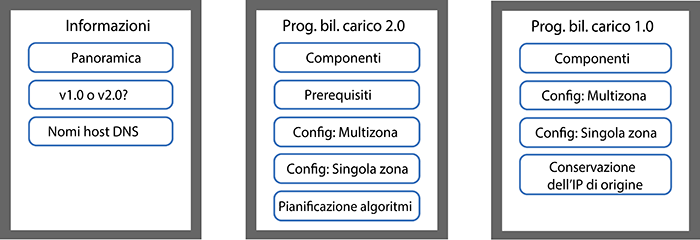
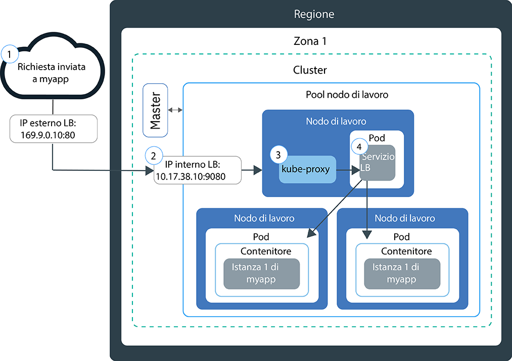
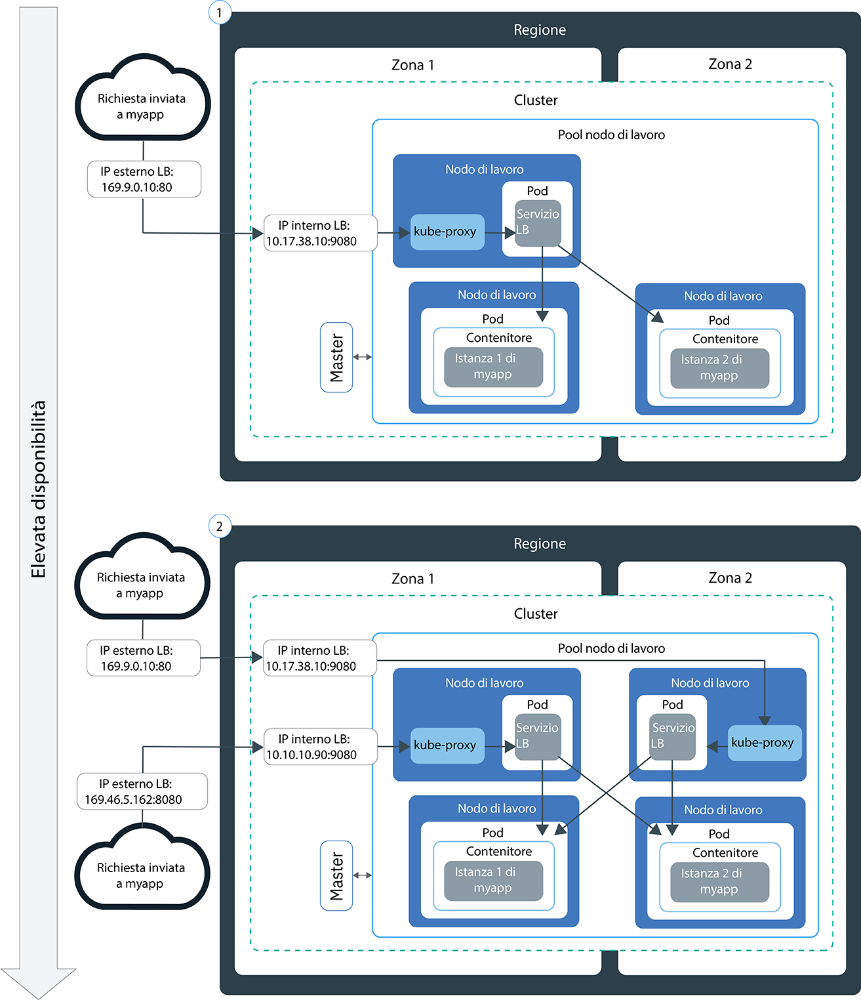
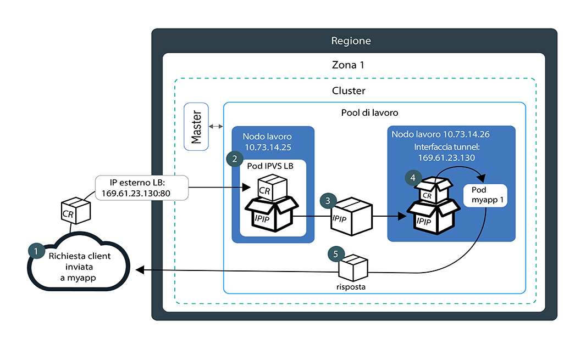
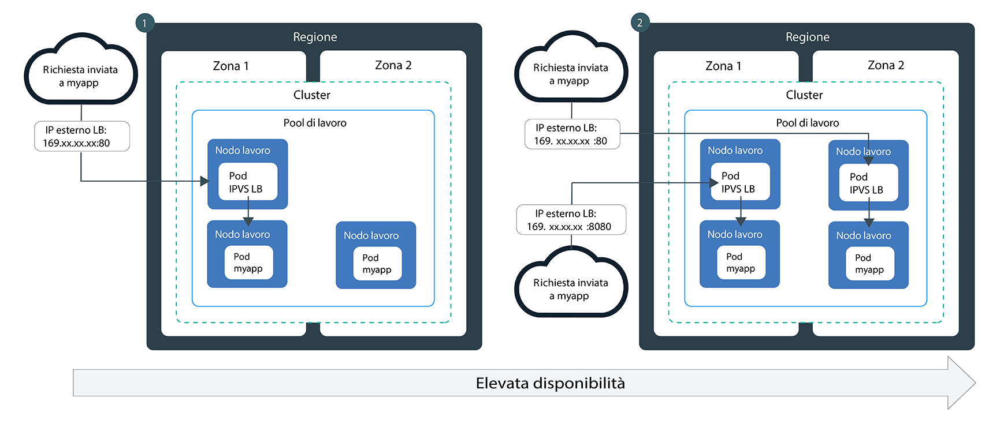

---

copyright:
  years: 2014, 2019
lastupdated: "2019-06-05"

keywords: kubernetes, iks, lb2.0, nlb, health check

subcollection: containers

---

{:new_window: target="_blank"}
{:shortdesc: .shortdesc}
{:screen: .screen}
{:pre: .pre}
{:table: .aria-labeledby="caption"}
{:codeblock: .codeblock}
{:tip: .tip}
{:note: .note}
{:important: .important}
{:deprecated: .deprecated}
{:download: .download}
{:preview: .preview}


# Bilanciamento del carico DSR e di base con gli NLB (network load balancer)
{: #loadbalancer}

Esponi una porta e utilizza un indirizzo IP portatile per un NLB (network load balancer) di livello 4 per accedere a un'applicazione inserita in un contenitore.
{:shortdesc}

Scegli una delle seguenti opzioni per iniziare:


<map name="image-map">
    <area target="" alt="Panoramica" title="Panoramica" href="#lb_overview" coords="35,44,175,72" shape="rect">
    <area target="" alt="Confronto tra i programmi di bilanciamento del carico versione 1.0 e 2.0" title="Confronto tra i programmi di bilanciamento del carico versione 1.0 e 2.0" href="#comparison" coords="34,83,173,108" shape="rect">
    <area target="" alt="Registrazione di un nome host di bilanciamento del carico" title="Registrazione di un nome host di bilanciamento del carico" href="#loadbalancer_hostname" coords="33,119,174,146" shape="rect">
    <area target="" alt="v2.0: Componenti e architettura (Beta)" title="v2.0: Componenti e architettura (Beta)" href="#planning_ipvs" coords="273,45,420,72" shape="rect">
    <area target="" alt="v2.0: Prerequisiti" title="v2.0: Prerequisiti" href="#ipvs_provision" coords="277,85,417,108" shape="rect">
    <area target="" alt="v2.0: Configurazione di un programma di bilanciamento del carico 2.0 in un cluster multizona" title="v2.0: Configurazione di un programma di bilanciamento del carico 2.0 in un cluster multizona" href="#ipvs_multi_zone_config" coords="276,122,417,147" shape="rect">
    <area target="" alt="v2.0: Configurazione di un programma di bilanciamento del carico 2.0 in un cluster a zona singola" title="v2.0: Configurazione di un programma di bilanciamento del carico 2.0 in un cluster a zona singola" href="#ipvs_single_zone_config" coords="277,156,419,184" shape="rect">
    <area target="" alt="v2.0: Algoritmi di pianificazione" title="v2.0: Algoritmi di pianificazione" href="#scheduling" coords="276,196,419,220" shape="rect">
    <area target="" alt="v1.0: Componenti e architettura" title="v1.0: Componenti e architettura" href="#v1_planning" coords="519,47,668,74" shape="rect">
    <area target="" alt="v1.0: Configurazione di un programma di bilanciamento del carico 1.0 in un cluster multizona" title="v1.0: Configurazione di un programma di bilanciamento del carico 1.0 in un cluster multizona" href="#multi_zone_config" coords="520,85,667,110" shape="rect">
    <area target="" alt="v1.0: Configurazione di un programma di bilanciamento del carico 1.0 in cluster a zona singola" title="v1.0: Configurazione di un programma di bilanciamento del carico 1.0 in un cluster a zona singola" href="#lb_config" coords="520,122,667,146" shape="rect">
    <area target="" alt="v1.0: Abilitazione della conservazione dell'IP di origine" title="v1.0: Abilitazione della conservazione dell'IP di origine" href="#node_affinity_tolerations" coords="519,157,667,194" shape="rect">
</map>
</br>

Per iniziare subito, puoi eseguire il seguente comando per creare un programma di bilanciamento del carico 1.0:
```
kubectl expose deploy my-app --port=80 --target-port=8080 --type=LoadBalancer --name my-lb-svc
```
{: pre}

## Panoramica
{: #lb_overview}

Quando crei un cluster standard, {{site.data.keyword.containerlong}} esegue automaticamente il provisioning di una sottorete pubblica portatile e di una sottorete privata portatile.
{: shortdesc}

* La sottorete pubblica portatile fornisce 5 indirizzi IP utilizzabili. 1 indirizzo IP pubblico portatile è utilizzato dall'[ALB Ingress pubblico](/docs/containers?topic=containers-ingress) predefinito. I restanti 4 indirizzi IP pubblici portatili possono essere usati per esporre singole applicazioni su Internet creando servizi NLB (network load balancer).
* La sottorete privata portatile fornisce 5 indirizzi IP utilizzabili. 1 indirizzo IP privato portatile è utilizzato dall'[ALB Ingress privato](/docs/containers?topic=containers-ingress#private_ingress). I restanti 4 indirizzi IP privati portatili possono essere usati per esporre le singole applicazioni su una rete privata creando servizi NLB (network load balancer) privati.

Gli indirizzi IP pubblici e privati portatili sono IP mobili statici e non cambiano quando viene rimosso un nodo di lavoro. Se il nodo di lavoro su cui si trova l'indirizzo IP NLB viene rimosso, un daemon Keepalive, che monitora costantemente l'IP, sposta automaticamente l'IP in un altro nodo di lavoro. Puoi assegnare qualsiasi porta al tuo NLB. Il servizio NLB funge da punto di ingresso esterno per le richieste in entrata per l'applicazione. Per accedere all'NLB da Internet, puoi utilizzare l'indirizzo IP pubblico del tuo NLB e la porta assegnata nel formato `<IP_address>:<port>`. È anche possibile creare delle voci DNS per gli NLB registrando gli indirizzi IP NLB con i nomi host.

Quando esponi un'applicazione con un servizio NLB, la tua applicazione viene automaticamente resa disponibile anche sulle NodePort del servizio. Le [NodePort](/docs/containers?topic=containers-nodeport) sono accessibili su ogni indirizzo IP pubblico e privato di ogni nodo di lavoro all'interno del cluster. Per bloccare il traffico alle NodePort mentre stai usando un NLB, vedi [Controllo del traffico in entrata nei servizi NLB (network load balancer) o NodePort](/docs/containers?topic=containers-network_policies#block_ingress).

<br />


## Confronto del bilanciamento del carico di base e DSR negli NLB versione 1.0 e 2.0
{: #comparison}

Quando crei un NLB, puoi scegliere un NLB versione 1.0, che esegue un bilanciamento del carico di base, oppure un NLB versione 2.0, che esegue un bilanciamento del carico DSR (direct server return). Nota che gli NLB versione 2.0 sono beta.
{: shortdesc}

**In cosa gli NLB versione 1.0 e 2.0 sono simili?**

Gli NLB versione 1.0 e 2.0 sono entrambi programmi di bilanciamento del carico di livello 4 che vivono solo nello spazio del kernel Linux. Entrambe le versioni vengono eseguite all'interno del cluster e utilizzano le risorse del nodo di lavoro. Pertanto, la capacità disponibile degli NLB è sempre dedicata al tuo cluster. Inoltre, entrambe le versioni degli NLB non terminano la connessione. Al contrario, inoltrano le connessioni a un pod dell'applicazione.

**In cosa gli NLB versione 1.0 e 2.0 sono diversi?**

Quando un client invia una richiesta alla tua applicazione, l'NLB instrada i pacchetti della richiesta all'indirizzo IP del nodo di lavoro in cui è presente un pod dell'applicazione. Gli NLB versione 1.0 utilizzano la NAT (Network Address Translation) per riscrivere l'indirizzo IP di origine del pacchetto della richiesta sull'IP del nodo di lavoro in cui è presente un pod del programma di bilanciamento del carico. Quando il nodo di lavoro restituisce il pacchetto di risposta dell'applicazione, utilizza l'IP del nodo di lavoro in cui è presente l'NLB. L'NLB deve quindi inviare il pacchetto di risposta al client. Per evitare che l'indirizzo IP venga riscritto, puoi [abilitare la conservazione dell'IP di origine](#node_affinity_tolerations). Tuttavia, la conservazione dell'IP di origine richiede che i pod del programma di bilanciamento del carico e i pod dell'applicazione vengano eseguiti sullo stesso nodo di lavoro in modo che la richiesta non debba essere inoltrata a un altro nodo di lavoro. Devi aggiungere l'affinità e le tolleranze del nodo ai pod dell'applicazione. Per ulteriori informazioni sul bilanciamento del carico di base con gli NLB versione 1.0, vedi [v1.0: Componenti e architettura del bilanciamento del carico di base](#v1_planning).

A differenza degli NLB versione 1.0, gli NLB versione 2.0 non utilizzano NAT durante l'inoltro delle richieste ai pod dell'applicazione su altri nodi di lavoro. Quando un
NLB 2.0 instrada una richiesta del client, utilizza l'IPIP (IP over IP) per incapsulare il pacchetto della richiesta originale in un altro pacchetto nuovo. Questo pacchetto IPIP di incapsulamento ha un IP di origine del nodo di lavoro in cui si trova il pod del programma di bilanciamento del carico, che consente al pacchetto di richiesta originale di conservare l'IP del client come proprio indirizzo IP di origine. Il nodo di lavoro utilizza quindi il DSR (direct server return) per inviare il pacchetto di risposta dell'applicazione all'IP del client. Il pacchetto di risposta ignora l'NLB e viene inviato direttamente al client, riducendo la quantità di traffico che deve essere gestita dall'NLB. Per ulteriori informazioni sul bilanciamento del carico DSR con gli NLB versione 2.0, vedi [v2.0: Componenti e architettura del bilanciamento del carico DSR](#planning_ipvs).

<br />


## v1.0: Componenti e architettura del bilanciamento del carico di base
{: #v1_planning}

L'NLB (network load balancer) TCP/UDP 1.0 utilizza Iptables, una funzione del kernel Linux, per bilanciare il carico delle richieste tra i pod di un'applicazione.
{: shortdesc}

### Flusso del traffico in un cluster a zona singola
{: #v1_single}

Il seguente diagramma mostra in che modo un NLB 1.0 indirizza le comunicazioni da Internet a un'applicazione in un cluster a zona singola.
{: shortdesc}



1. Una richiesta alla tua applicazione usa l'indirizzo IP pubblico del tuo NLB e la porta assegnata sul nodo di lavoro.

2. La richiesta viene inoltrata automaticamente alla porta e all'indirizzo IP del cluster interno del servizio NLB. L'indirizzo IP del cluster interno è accessibile solo all'interno del cluster.

3. `kube-proxy` instrada la richiesta al servizio NLB per l'applicazione.

4. La richiesta viene inoltrata all'indirizzo IP privato del pod dell'applicazione. L'indirizzo IP di origine del pacchetto di richieste viene modificato con l'indirizzo IP pubblico del nodo di lavoro su cui è in esecuzione il pod dell'applicazione. Se nel cluster vengono distribuite più istanze dell'applicazione, il servizio NLB instrada le richieste tra i pod dell'applicazione.

### Flusso del traffico in un cluster multizona
{: #v1_multi}

Il seguente diagramma mostra in che modo un NLB (Network load balancer) 1.0 indirizza le comunicazioni da Internet a un'applicazione in un cluster multizona.
{: shortdesc}



Per impostazione predefinita, ogni NLB 1.0 è configurato in una sola zona. Per ottenere l'alta disponibilità, devi distribuire un NLB 1.0 in ciascuna zona in cui hai istanze dell'applicazione. Le richieste vengono gestite dagli NLB in varie zone in un ciclo round-robin. Inoltre, ciascun NLB instrada le richieste alle istanze dell'applicazione nella propria zona e quelle delle altre zone.

<br />


## v1.0:configurazione di un NLB 1.0 in un cluster multizona
{: #multi_zone_config}

**Prima di iniziare**:
* Per creare NLB (network load balancer) pubblici in più zone, almeno una VLAN pubblica deve avere delle sottoreti portatili disponibili in ciascuna zona. Per creare NLB privati in più zone, almeno una VLAN privata deve avere delle sottoreti portatili disponibili in ciascuna zona. Puoi aggiungere sottoreti seguendo la procedura in [Configurazione delle sottoreti per i cluster](/docs/containers?topic=containers-subnets).
* Se limiti il traffico di rete ai nodi di lavoro edge, assicurati che almeno 2 [nodi di lavoro edge](/docs/containers?topic=containers-edge#edge) siano abilitati in ogni zona in modo che gli NLB vengano distribuiti in modo uniforme.
* Abilita lo [spanning della VLAN](/docs/infrastructure/vlans?topic=vlans-vlan-spanning#vlan-spanning) per il tuo account dell'infrastruttura IBM Cloud (SoftLayer) in modo che i tuoi nodi di lavoro possano comunicare tra loro sulla rete privata. Per eseguire questa azione, ti serve l'[autorizzazione dell'infrastruttura](/docs/containers?topic=containers-users#infra_access) **Rete > Gestisci il VLAN Spanning di rete** oppure puoi richiedere al proprietario dell'account di abilitarlo. Per controllare se lo spanning della VLAN è già abilitato, usa il [comando](/docs/containers?topic=containers-cli-plugin-kubernetes-service-cli#cs_vlan_spanning_get) `ibmcloud ks vlan-spanning-get --region <region>`.
* Assicurati di disporre del [ruolo del servizio {{site.data.keyword.Bluemix_notm}} IAM **Scrittore** o **Gestore**](/docs/containers?topic=containers-users#platform) per lo spazio dei nomi `default`.


Per configurare un servizio NLB 1.0 in un cluster multizona:
1.  [Distribuisci la tua applicazione al cluster](/docs/containers?topic=containers-app#app_cli). Assicurati di aggiungere un'etichetta alla tua distribuzione nella sezione dei metadati del tuo file
di configurazione. Questa etichetta è necessaria per identificare tutti i pod in cui è in esecuzione la tua applicazione in modo che possano essere inclusi nel bilanciamento del carico.

2.  Crea un servizio del programma di bilanciamento del carico per l'applicazione che vuoi esporre all'Internet pubblico o a una rete privata.
  1. Crea uno file di configurazione del servizio denominato, ad esempio, `myloadbalancer.yaml`.
  2. Definisci un servizio del programma di bilanciamento del carico per l'applicazione che vuoi esporre. Puoi specificare una zona, una VLAN e un indirizzo IP.

      ```
      apiVersion: v1
      kind: Service
      metadata:
        name: myloadbalancer
        annotations:
          service.kubernetes.io/ibm-load-balancer-cloud-provider-ip-type: <public_or_private>
          service.kubernetes.io/ibm-load-balancer-cloud-provider-zone: "<zone>"
          service.kubernetes.io/ibm-load-balancer-cloud-provider-vlan: "<vlan_id>"
      spec:
        type: LoadBalancer
        selector:
          <selector_key>: <selector_value>
        ports:
         - protocol: TCP
             port: 8080
          loadBalancerIP: <IP_address>
      ```
      {: codeblock}

      <table>
      <caption>Descrizione dei componenti del file YAML</caption>
      <thead>
      <th colspan=2> Descrizione dei componenti del file YAML</th>
      </thead>
      <tbody>
      <tr>
        <td><code>service.kubernetes.io/ibm-load-balancer-cloud-provider-ip-type:</code>
        <td>Annotazione per specificare un programma di bilanciamento del carico <code>private</code> o <code>public</code>.</td>
      </tr>
      <tr>
        <td><code>service.kubernetes.io/ibm-load-balancer-cloud-provider-zone:</code>
        <td>Annotazione per specificare la zona in cui viene distribuito il servizio del programma di bilanciamento del carico. Per vedere le zone, esegui <code>ibmcloud ks zones</code>.</td>
      </tr>
      <tr>
        <td>`service.kubernetes.io/ibm-load-balancer-cloud-provider-vlan:`
        <td>Annotazione per specificare una VLAN in cui viene distribuito il servizio del programma di bilanciamento del carico. Per vedere le VLAN, esegui <code>ibmcloud ks vlans --zone <zone></code>.</td>
      </tr>
      <tr>
        <td><code>selector</code></td>
        <td>La chiave (<em>&lt;selector_key&gt;</em>) e il valore (<em>&lt;selector_value&gt;</em>) dell'etichetta che hai utilizzato nella sezione <code>spec.template.metadata.labels</code> dello YAML di distribuzione della tua applicazione.</td>
      </tr>
      <tr>
        <td><code> port</code></td>
        <td>La porta su cui è in ascolto il servizio.</td>
      </tr>
      <tr>
        <td><code>loadBalancerIP</code></td>
        <td>Facoltativo: per creare un programma di bilanciamento del carico privato o per utilizzare uno specifico indirizzo IP portatile per un programma di bilanciamento del carico pubblico, specifica l'indirizzo IP che vuoi utilizzare. L'indirizzo IP deve essere sulla VLAN e sulla zona che specifichi nelle annotazioni. Se non specifichi un indirizzo IP:<ul><li>Se il tuo cluster è su una VLAN pubblica, viene utilizzato un indirizzo IP pubblico portatile. Molti cluster sono su una VLAN pubblica.</li><li>Se il tuo cluster è solo su una VLAN privata, viene utilizzato un indirizzo IP privato portatile.</li></ul></td>
      </tr>
      </tbody></table>

      File di configurazione di esempio per creare un servizio NLB privato 1.0 che utilizza un indirizzo IP specificato sulla VLAN privata `2234945` in `dal12`:

      ```
      apiVersion: v1
      kind: Service
      metadata:
        name: myloadbalancer
        annotations:
          service.kubernetes.io/ibm-load-balancer-cloud-provider-ip-type: private
          service.kubernetes.io/ibm-load-balancer-cloud-provider-zone: "dal12"
          service.kubernetes.io/ibm-load-balancer-cloud-provider-vlan: "2234945"
      spec:
        type: LoadBalancer
        selector:
          app: nginx
        ports:
         - protocol: TCP
           port: 8080
        loadBalancerIP: 172.21.xxx.xxx
      ```
      {: codeblock}

  3. Facoltativo: rendi disponibile il tuo servizio NLB solo per un intervallo limitato di indirizzi IP, specificando gli IP nel campo `spec.loadBalancerSourceRanges`. `loadBalancerSourceRanges` è implementato da `kube-proxy` nel tuo cluster tramite regole Iptables sui nodi di lavoro. Per ulteriori informazioni, consulta la [documentazione Kubernetes ](https://kubernetes.io/docs/tasks/access-application-cluster/configure-cloud-provider-firewall/).

  4. Crea il servizio nel tuo cluster.

      ```
      kubectl apply -f myloadbalancer.yaml
      ```
      {: pre}

3. Verifica che il servizio NLB sia stato creato correttamente. Perché il servizio venga creato e l'applicazione sia disponibile potrebbero essere richiesti alcuni minuti.

    ```
    kubectl describe service myloadbalancer
    ```
    {: pre}

    Output CLI di esempio:

    ```
    Name:                   myloadbalancer
    Namespace:              default
    Labels:                 <none>
    Selector:               app=liberty
    Type:                   LoadBalancer
    Zone:                   dal10
    IP:                     172.21.xxx.xxx
    LoadBalancer Ingress:   169.xx.xxx.xxx
    Port:                   <unset> 8080/TCP
    NodePort:               <unset> 32040/TCP
    Endpoints:              172.30.xxx.xxx:8080
    Session Affinity:       None
    Events:
      FirstSeen	LastSeen	Count	From			SubObjectPath	Type	 Reason			          Message
      ---------	--------	-----	----			-------------	----	 ------			          -------
      10s		    10s		    1	    {service-controller }	  Normal CreatingLoadBalancer	Creating load balancer
      10s		    10s		    1	    {service-controller }		Normal CreatedLoadBalancer	Created load balancer
    ```
    {: screen}

    L'indirizzo IP **LoadBalancer Ingress** è l'indirizzo IP portatile assegnato al tuo servizio NLB.

4.  Se hai creato un NLB pubblico, accedi alla tua applicazione da Internet.
    1.  Apri il tuo browser web preferito.
    2.  Immetti l'indirizzo IP pubblico portatile dell'NLB e la porta.

        ```
        http://169.xx.xxx.xxx:8080
        ```
        {: codeblock}    

5. Ripeti i passi da 2 a 4 per aggiungere un NLB versione 1.0 in ciascuna zona.    

6. Se scegli di [abilitare la conservazione dell'IP di origine per un NLB 1.0](#node_affinity_tolerations), assicurati che i pod dell'applicazione vengano pianificati sui nodi di lavoro edge [aggiungendo l'affinità del nodo edge ai pod dell'applicazione](#lb_edge_nodes). I pod dell'applicazione devono essere pianificati nei nodi edge per ricevere le richieste in entrata.

7. Facoltativo: un servizio del programma di bilanciamento del carico rende anche disponibile la tua applicazione sulle NodePort del servizio. Puoi accedere alle [NodePort](/docs/containers?topic=containers-nodeport) da ogni indirizzo IP pubblico e privato per ogni nodo all'interno del cluster. Per bloccare il traffico alle NodePort mentre stai usando un servizio NLB, vedi [Controllo del traffico in entrata nei servizi NLB (network load balancer) o NodePort](/docs/containers?topic=containers-network_policies#block_ingress).

Successivamente, puoi [registrare un nome host NLB](#loadbalancer_hostname).

<br />


## v1.0: configurazione di un NLB 1.0 in un cluster multizona
{: #lb_config}

**Prima di iniziare**:
* Devi avere un indirizzo IP pubblico o privato portatile disponibile da assegnare al servizio NLB (network load balancer). Per ulteriori informazioni, vedi [Configurazione delle sottoreti per i cluster](/docs/containers?topic=containers-subnets).
* Assicurati di disporre del [ruolo del servizio {{site.data.keyword.Bluemix_notm}} IAM **Scrittore** o **Gestore**](/docs/containers?topic=containers-users#platform) per lo spazio dei nomi `default`.

Per creare un servizio NLB 1.0 in un cluster a zona singola:

1.  [Distribuisci la tua applicazione al cluster](/docs/containers?topic=containers-app#app_cli). Assicurati di aggiungere un'etichetta alla tua distribuzione nella sezione dei metadati del tuo file
di configurazione. Questa etichetta è necessaria per identificare tutti i pod in cui è in esecuzione la tua applicazione, in modo che
possano essere inclusi nel bilanciamento del carico.
2.  Crea un servizio del programma di bilanciamento del carico per l'applicazione che vuoi esporre all'Internet pubblico o a una rete privata.
    1.  Crea uno file di configurazione del servizio denominato, ad esempio, `myloadbalancer.yaml`.

    2.  Definisci un servizio del programma di bilanciamento del carico per l'applicazione che vuoi esporre.
        ```
        apiVersion: v1
        kind: Service
        metadata:
          name: myloadbalancer
          annotations:
            service.kubernetes.io/ibm-load-balancer-cloud-provider-ip-type: <public_or_private>
            service.kubernetes.io/ibm-load-balancer-cloud-provider-vlan: "<vlan_id>"
        spec:
          type: LoadBalancer
          selector:
            <selector_key>: <selector_value>
          ports:
           - protocol: TCP
             port: 8080
          loadBalancerIP: <IP_address>
          externalTrafficPolicy: Local
        ```
        {: codeblock}

        <table>
        <caption>Descrizione dei componenti del file YAML</caption>
        <thead>
        <th colspan=2> Descrizione dei componenti del file YAML</th>
        </thead>
        <tbody>
        <tr>
          <td>`service.kubernetes.io/ibm-load-balancer-cloud-provider-ip-type:`
          <td>Annotazione per specificare un programma di bilanciamento del carico <code>private</code> o <code>public</code>.</td>
        </tr>
        <tr>
          <td>`service.kubernetes.io/ibm-load-balancer-cloud-provider-vlan:`
          <td>Annotazione per specificare una VLAN in cui viene distribuito il servizio del programma di bilanciamento del carico. Per vedere le VLAN, esegui <code>ibmcloud ks vlans --zone <zone></code>.</td>
        </tr>
        <tr>
          <td><code>selector</code></td>
          <td>La chiave (<em>&lt;selector_key&gt;</em>) e il valore (<em>&lt;selector_value&gt;</em>) dell'etichetta che hai utilizzato nella sezione <code>spec.template.metadata.labels</code> dello YAML di distribuzione della tua applicazione.</td>
        </tr>
        <tr>
          <td><code> port</code></td>
          <td>La porta su cui è in ascolto il servizio.</td>
        </tr>
        <tr>
          <td><code>loadBalancerIP</code></td>
          <td>Facoltativo: per creare un programma di bilanciamento del carico privato o per utilizzare uno specifico indirizzo IP portatile per un programma di bilanciamento del carico pubblico, specifica l'indirizzo IP che vuoi utilizzare. L'indirizzo IP deve essere sulla VLAN che specifichi nelle annotazioni. Se non specifichi un indirizzo IP:<ul><li>Se il tuo cluster è su una VLAN pubblica, viene utilizzato un indirizzo IP pubblico portatile. Molti cluster sono su una VLAN pubblica.</li><li>Se il tuo cluster è solo su una VLAN privata, viene utilizzato un indirizzo IP privato portatile.</li></ul></td>
        </tr>
        </tbody></table>

        File di configurazione di esempio per creare un servizio NLB 1.0 privato che utilizza un indirizzo IP specificato sulla VLAN privata `2234945`:

        ```
        apiVersion: v1
        kind: Service
        metadata:
          name: myloadbalancer
          annotations:
            service.kubernetes.io/ibm-load-balancer-cloud-provider-ip-type: private
            service.kubernetes.io/ibm-load-balancer-cloud-provider-vlan: "2234945"
        spec:
          type: LoadBalancer
          selector:
            app: nginx
          ports:
           - protocol: TCP
             port: 8080
          loadBalancerIP: 172.21.xxx.xxx
        ```
        {: codeblock}

    3. Facoltativo: rendi disponibile il tuo servizio NLB solo per un intervallo limitato di indirizzi IP, specificando gli IP nel campo `spec.loadBalancerSourceRanges`. `loadBalancerSourceRanges` è implementato da `kube-proxy` nel tuo cluster tramite regole Iptables sui nodi di lavoro. Per ulteriori informazioni, consulta la [documentazione Kubernetes ](https://kubernetes.io/docs/tasks/access-application-cluster/configure-cloud-provider-firewall/).

    4.  Crea il servizio nel tuo cluster.

        ```
        kubectl apply -f myloadbalancer.yaml
        ```
        {: pre}

3.  Verifica che il servizio NLB sia stato creato correttamente. Perché il servizio venga creato e l'applicazione sia disponibile potrebbero essere richiesti alcuni minuti.

    ```
    kubectl describe service myloadbalancer
    ```
    {: pre}

    Output CLI di esempio:

    ```
    Name:                   myloadbalancer
    Namespace:              default
    Labels:                 <none>
    Selector:               app=liberty
    Type:                   LoadBalancer
    Location:               dal10
    IP:                     172.21.xxx.xxx
    LoadBalancer Ingress:   169.xx.xxx.xxx
    Port:                   <unset> 8080/TCP
    NodePort:               <unset> 32040/TCP
    Endpoints:              172.30.xxx.xxx:8080
    Session Affinity:       None
    Events:
      FirstSeen	LastSeen	Count	From			SubObjectPath	Type	 Reason			          Message
      ---------	--------	-----	----			-------------	----	 ------			          -------
      10s		    10s		    1	    {service-controller }	  Normal CreatingLoadBalancer	Creating load balancer
      10s		    10s		    1	    {service-controller }		Normal CreatedLoadBalancer	Created load balancer
    ```
    {: screen}

    L'indirizzo IP **LoadBalancer Ingress** è l'indirizzo IP portatile assegnato al tuo servizio NLB.

4.  Se hai creato un NLB pubblico, accedi alla tua applicazione da Internet.
    1.  Apri il tuo browser web preferito.
    2.  Immetti l'indirizzo IP pubblico portatile dell'NLB e la porta.

        ```
        http://169.xx.xxx.xxx:8080
        ```
        {: codeblock}

5. Se scegli di [abilitare la conservazione dell'IP di origine per un NLB 1.0](#node_affinity_tolerations), assicurati che i pod dell'applicazione vengano pianificati sui nodi di lavoro edge [aggiungendo l'affinità del nodo edge ai pod dell'applicazione](#lb_edge_nodes). I pod dell'applicazione devono essere pianificati nei nodi edge per ricevere le richieste in entrata.

6. Facoltativo: un servizio del programma di bilanciamento del carico rende anche disponibile la tua applicazione sulle NodePort del servizio. Puoi accedere alle [NodePort](/docs/containers?topic=containers-nodeport) da ogni indirizzo IP pubblico e privato per ogni nodo all'interno del cluster. Per bloccare il traffico alle NodePort mentre stai usando un servizio NLB, vedi [Controllo del traffico in entrata nei servizi NLB (network load balancer) o NodePort](/docs/containers?topic=containers-network_policies#block_ingress).

Successivamente, puoi [registrare un nome host NLB](#loadbalancer_hostname).

<br />


## v1.0: Abilitazione della conservazione dell'IP di origine
{: #node_affinity_tolerations}

Questa funzione è disponibile solo per gli NLB versione 1.0. L'indirizzo IP di origine delle richieste del client viene conservato per impostazione predefinita negli NLB versione 2.0.
{: note}

Quando una richiesta del client alla tua applicazione viene inviata al tuo cluster, un pod del servizio del programma di bilanciamento del carico riceve la richiesta. Se sullo stesso nodo di lavoro del pod del servizio del programma di bilanciamento del carico non esiste un pod dell'applicazione, l'NLB inoltra la richiesta a un pod dell'applicazione su un nodo di lavoro diverso. L'indirizzo IP di origine del pacchetto viene modificato con l'indirizzo IP pubblico del nodo di lavoro su cui è in esecuzione il pod del servizio del programma di bilanciamento del carico.
{: shortdesc}

Per conservare l'indirizzo IP di origine originale della richiesta client, puoi [abilitare l'IP di origine ](https://kubernetes.io/docs/tasks/access-application-cluster/create-external-load-balancer/#preserving-the-client-source-ip) per i servizi del programma di bilanciamento del carico. La connessione TCP continua fino ai pod dell'applicazione in modo che l'applicazione possa vedere l'indirizzo IP di origine effettivo dell'initiator. La conservazione dell'IP del client è utile quando, ad esempio, i server delle applicazioni devono applicare le politiche di sicurezza e di controllo dell'accesso.

Una volta abilitato l'IP di origine, i pod del servizio di bilanciamento del carico devono inoltrare le richieste solo ai pod dell'applicazione che sono distribuiti nello stesso nodo di lavoro Di norma, i pod del servizio del programma di bilanciamento del carico vengono distribuiti anche ai nodi di lavoro a cui vengono distribuiti i pod dell'applicazione. Tuttavia, ci sono alcune situazioni in cui i pod del bilanciamento del carico e quelli dell'applicazione potrebbero non essere pianificati sullo stesso nodo di lavoro:

* Hai nodi edge contaminati in cui puoi distribuire solo i pod del servizio di bilanciamento del carico. I pod dell'applicazione non possono essere distribuiti in questi nodi.
* Il tuo cluster è connesso a più VLAN pubbliche o private e i tuoi pod dell'applicazione possono essere distribuiti ai nodi di lavoro che sono connessi solo ad una VLAN. I pod del servizio di bilanciamento del carico non possono essere distribuiti in tali nodi di lavoro in quanto l'indirizzo IP dell'NLB è connesso a una VLAN diversa da quella dei nodi di lavoro.

Per forzare la tua applicazione alla distribuzione in specifici nodi di lavoro in cui possono essere distribuiti anche i pod del servizio di bilanciamento del carico, devi aggiungere le regole di affinità e le tolleranze alla tua distribuzione dell'applicazione.

### Aggiunta delle regole di affinità e delle tolleranze del nodo edge
{: #lb_edge_nodes}

Quando [etichetti i nodi di lavoro come nodi edge](/docs/containers?topic=containers-edge#edge_nodes) e inoltre [danneggi i nodi edge](/docs/containers?topic=containers-edge#edge_workloads), i pod del servizio del programma di bilanciamento del carico vengono distribuiti solo in tali nodi edge e i pod dell'applicazione non possono essere distribuiti nei nodi edge. Quando l'IP di origine viene abilitato per il servizio NLB, i pod del programma di bilanciamento del carico nei nodi edge non possono inoltrare le richieste in entrata ai pod della tua applicazione su altri nodi di lavoro.
{:shortdesc}

Per forzare la distribuzione dei tuoi pod dell'applicazione nei nodi edge, aggiungi la [regola di affinità ](https://kubernetes.io/docs/concepts/configuration/assign-pod-node/#node-affinity-beta-feature) e la [tolleranza ](https://kubernetes.io/docs/concepts/configuration/taint-and-toleration/#concepts) del nodo edge alla distribuzione dell'applicazione.

Esempio di file YAML di distribuzione con affinità e tolleranza del nodo edge:

```
apiVersion: apps/v1
kind: Deployment
metadata:
  name: with-node-affinity
spec:
  selector:
    matchLabels:
      <label_name>: <label_value>
  template:
    spec:
      affinity:
        nodeAffinity:
          requiredDuringSchedulingIgnoredDuringExecution:
            nodeSelectorTerms:
            - matchExpressions:
              - key: dedicated
                operator: In
                values:
                - edge
      tolerations:
        - key: dedicated
          value: edge
...
```
{: codeblock}

Entrambe le sezioni **affinity** e **tolerations** hanno `dedicated` come `key` e `edge` come `value`.

### Aggiunta di regole di affinità per più VLAN pubbliche o private
{: #edge_nodes_multiple_vlans}

Quando il tuo cluster è connesso a più VLAN pubbliche o private, i tuoi pod dell'applicazione possono essere distribuiti solo nei nodi di lavoro connessi ad una VLAN. Se l'indirizzo IP dell'NLB è connesso a una VLAN diversa da quella di questi nodi di lavoro, i pod del servizio di bilanciamento del carico non vengono distribuiti in questi nodi.
{:shortdesc}

Quando l'IP di origine è abilitato, pianifica i pod dell'applicazione sui nodi di lavoro che si trovano nella stessa VLAN dell'indirizzo IP dell'NLB aggiungendo una regola di affinità alla distribuzione dell'applicazione.

Prima di iniziare: [accedi al tuo account. Se applicabile, specifica il gruppo di risorse appropriato. Imposta il contesto per il tuo cluster.](/docs/containers?topic=containers-cs_cli_install#cs_cli_configure)

1. Ottieni l'indirizzo IP del servizio NLB. Ricerca l'indirizzo IP nel campo **LoadBalancer Ingress**.
    ```
    kubectl describe service <loadbalancer_service_name>
    ```
    {: pre}

2. Richiama l'ID VLAN a cui è connesso il tuo servizio NLB.

    1. Elenca le VLAN pubbliche portatili per il tuo cluster.
        ```
        ibmcloud ks cluster-get --cluster <cluster_name_or_ID> --showResources
        ```
        {: pre}

        Output di esempio:
        ```
        ...

        Subnet VLANs
        VLAN ID   Subnet CIDR       Public   User-managed
        2234947   10.xxx.xx.xxx/29  false    false
        2234945   169.36.5.xxx/29   true     false
        ```
        {: screen}

    2. Nell'output, sotto **Subnet VLANs**, ricerca il CIDR di sottorete che corrisponde all'indirizzo IP NLB che hai recuperato in precedenza e prendi nota dell'ID VLAN.

        Ad esempio, se l'indirizzo IP del servizio NLB è `169.36.5.xxx`, la sottorete corrispondente nell'output di esempio del precedente passo è `169.36.5.xxx/29`. L'ID VLAN a cui è connessa la sottorete è `2234945`.

3. [Aggiungi una regola di affinità ](https://kubernetes.io/docs/concepts/configuration/assign-pod-node/#node-affinity-beta-feature) alla distribuzione dell'applicazione per l'ID VLAN di cui hai preso nota nel passo precedente.

    Ad esempio, se hai più VLAN ma desideri che i tuoi pod dell'applicazione vengano distribuiti solo nei nodi di lavoro presenti sulla VLAN pubblica `2234945`:

    ```
    apiVersion: apps/v1
    kind: Deployment
    metadata:
      name: with-node-affinity
    spec:
      selector:
        matchLabels:
          <label_name>: <label_value>
      template:
        spec:
          affinity:
            nodeAffinity:
              requiredDuringSchedulingIgnoredDuringExecution:
                nodeSelectorTerms:
                - matchExpressions:
                  - key: publicVLAN
                    operator: In
                    values:
                    - "2234945"
    ...
    ```
    {: codeblock}

    Nel file YAML di esempio, la sezione **affinity** ha `publicVLAN` come `key` e `"2234945"` come `value`.

4. Applica il file di configurazione della distribuzione aggiornato.
    ```
    kubectl apply -f with-node-affinity.yaml
    ```
    {: pre}

5. Verifica che i pod dell'applicazione vengano distribuiti nei nodi di lavoro connessi alla VLAN designata.

    1. Elenca i pod nel tuo cluster. Sostituisci `<selector>` con l'etichetta che hai utilizzato per l'applicazione.
        ```
        kubectl get pods -o wide app=<selector>
        ```
        {: pre}

        Output di esempio:
        ```
        NAME                   READY     STATUS              RESTARTS   AGE       IP               NODE
        cf-py-d7b7d94db-vp8pq  1/1       Running             0          15d       172.30.xxx.xxx   10.176.48.78
        ```
        {: screen}

    2. Nell'output, identifica un pod per la tua applicazione. Prendi nota dell'ID **NODE** del nodo di lavoro in cui il pod è attivo.

        Nell'output di esempio del passo precedente, il pod dell'applicazione `cf-py-d7b7d94db-vp8pq` si trova sul nodo di lavoro `10.176.48.78`.

    3. Elenca i dettagli del nodo di lavoro.

        ```
        kubectl describe node <worker_node_ID>
        ```
        {: pre}

        Output di esempio:

        ```
        Name:                   10.xxx.xx.xxx
        Role:
        Labels:                 arch=amd64
                                beta.kubernetes.io/arch=amd64
                                beta.kubernetes.io/os=linux
                                failure-domain.beta.kubernetes.io/region=us-south
                                failure-domain.beta.kubernetes.io/zone=dal10
                                ibm-cloud.kubernetes.io/encrypted-docker-data=true
                                kubernetes.io/hostname=10.xxx.xx.xxx
                                privateVLAN=2234945
                                publicVLAN=2234967
        ...
        ```
        {: screen}

    4. Nella sezione **Labels** dell'output, verifica che la VLAN pubblica o privata sia la VLAN che hai designato nei passi precedenti.

<br />


## v2.0: Componenti e architettura (beta)
{: #planning_ipvs}

Le funzionalità NLB (network load balancer) 2.0 sono in versione beta. Per utilizzare un NLB versione 2.0, devi [aggiornare i nodi master e di lavoro del tuo cluster](/docs/containers?topic=containers-update) a Kubernetes versione 1.12 o successive.
{: note}

L'NLB 2.0 è un programma di bilanciamento del carico di livello 4 che utilizza l'IPVS (IP Virtual Server) del kernel Linux. L'NLB 2.0 supporta TCP e UDP, viene eseguito per più nodi di lavoro e utilizza il tunneling IPIP (IP over IP) per distribuire il traffico che arriva a un singolo indirizzo IP
dell'NLB tra quei nodi di lavoro.

Vuoi maggiori dettagli sui modelli di distribuzione del bilanciamento del carico disponibili in {{site.data.keyword.containerlong_notm}}? Consulta questo [post del blog ](https://www.ibm.com/blogs/bluemix/2018/10/ibm-cloud-kubernetes-service-deployment-patterns-for-maximizing-throughput-and-availability/).
{: tip}

### Flusso del traffico in un cluster a zona singola
{: #ipvs_single}

Il seguente diagramma mostra in che modo un NLB 2.0 indirizza le comunicazioni da Internet a un'applicazione in un cluster a zona singola.
{: shortdesc}



1. Una richiesta client alla tua applicazione usa l'indirizzo IP pubblico del tuo NLB e la porta assegnata sul nodo di lavoro. In questo esempio, l'NLB ha l'indirizzo IP virtuale 169.61.23.130, che attualmente si trova sul nodo di lavoro 10.73.14.25.

2. L'NLB incapsula il pacchetto della richiesta del client (etichettato come "CR" nell'immagine) all'interno di un pacchetto IPIP (etichettato come "IPIP"). Il pacchetto di richiesta del client mantiene l'IP del client come proprio indirizzo IP di origine. Il pacchetto di incapsulamento IPIP utilizza l'IP 10.73.14.25 del nodo di lavoro come proprio indirizzo IP di origine.

3. L'NLB instrada il pacchetto IPIP a un nodo di lavoro su cui si trova un pod dell'applicazione, 10.73.14.26. Se nel cluster vengono distribuite più istanze dell'applicazione, l'NLB instrada le richieste tra i nodi di lavoro in cui sono distribuiti i pod dell'applicazione.

4. Il nodo di lavoro 10.73.14.26 decomprime il pacchetto di incapsulamento IPIP e quindi decomprime il pacchetto di richiesta del client. Il pacchetto di richiesta del client viene inoltrato al pod dell'applicazione su quel nodo di lavoro.

5. Il nodo di lavoro 10.73.14.26 utilizza quindi l'indirizzo IP di origine dal pacchetto di richiesta originale, l'IP del client, per restituire il pacchetto di risposta del pod dell'applicazione direttamente al client.

### Flusso del traffico in un cluster multizona
{: #ipvs_multi}

Il flusso del traffico attraverso un cluster multizona segue lo stesso percorso del [traffico attraverso un cluster a zona singola](#ipvs_single). In un cluster multizona, l'NLB instrada le richieste alle istanze dell'applicazione nella propria zona e in altre zone. Il seguente diagramma mostra in che modo gli NLB versione 2.0 indirizzano in ciascuna zona il traffico da Internet a un'applicazione in un cluster multizona.
{: shortdesc}



Per impostazione predefinita, ciascun NLB versione 2.0 viene configurato solo in una zona. Puoi ottenere una maggiore disponibilità distribuendo un NLB versione 2.0 in ciascuna zona in cui hai istanze dell'applicazione.

<br />


## v2.0: Prerequisiti
{: #ipvs_provision}

Non puoi aggiornare un NLB versione 1.0 esistente alla versione 2.0. Devi creare un nuovo NLB 2.0. Nota che in un cluster puoi eseguire contemporaneamente NLB versione 1.0 e 2.0.
{: shortdesc}

Prima di creare un NLB 2.0, devi completare la seguente procedura prerequisita.

1. [Aggiorna i nodi master e di lavoro del tuo cluster](/docs/containers?topic=containers-update) a Kubernetes versione 1.12 o successive.

2. Per consentire al tuo NLB 2.0 di inoltrare le richieste ai pod dell'applicazione in più zone, apri un caso di supporto per richiedere l'aggregazione di capacità per le tue VLAN. Questa impostazione di configurazione non causa interferenze o interruzioni di rete.
    1. Accedi alla [console {{site.data.keyword.Bluemix_notm}}](https://cloud.ibm.com/).
    2. Dalla barra dei menu, fai clic su **Supporto**, fai clic sulla scheda **Gestisci casi** e quindi su **Crea nuovo caso**.
    3. Nei campi del caso, immetti quanto segue:
       * Per il tipo di supporto, seleziona **Supporto tecnico**.
       * Per la categoria, seleziona **VLAN Spanning**.
       * Per l'oggetto, immetti **Public VLAN Network Question.**
    4. Aggiungi le seguenti informazioni alla descrizione: "Please set up the network to allow capacity aggregation on the public VLANs associated with my account. The reference ticket for this request is: https://control.softlayer.com/support/tickets/63859145". Nota: se vuoi consentire l'aggregazione di capacità su VLAN specifiche, come ad esempio le VLAN pubbliche solo per un singolo cluster, puoi specificare questi ID VLAN nella descrizione.
    5. Fai clic su **Invia**.

3. Abilita una[VRF (Virtual Router Function)](/docs/infrastructure/direct-link?topic=direct-link-overview-of-virtual-routing-and-forwarding-vrf-on-ibm-cloud#overview-of-virtual-routing-and-forwarding-vrf-on-ibm-cloud) per il tuo account dell'infrastruttura IBM Cloud (SoftLayer). Per abilitare VRF, [contatta il tuo rappresentante dell'account dell'infrastruttura IBM Cloud (SoftLayer)](/docs/infrastructure/direct-link?topic=direct-link-overview-of-virtual-routing-and-forwarding-vrf-on-ibm-cloud#how-you-can-initiate-the-conversion). Se non puoi o non vuoi abilitare VRF, abilita lo [spanning della VLAN](/docs/infrastructure/vlans?topic=vlans-vlan-spanning#vlan-spanning). Quando lo spanning della VRF o della VLAN viene abilitato, l'NLB 2.0 può instradare i pacchetti alle varie sottoreti dell'account.

4. Se utilizzi le [politiche di rete pre-DNAT di Calico](/docs/containers?topic=containers-network_policies#block_ingress) per gestire il traffico verso l'indirizzo IP di un NLB 2.0, devi aggiungere i campi `applyOnForward: true` e `doNotTrack: true` e rimuovere il campo `preDNAT: true` dalla sezione `spec` delle politiche. `applyOnForward: true` assicura che la politica Calico venga applicata al traffico quando viene incapsulato e inoltrato. `doNotTrack: true` garantisce che i nodi di lavoro possano utilizzare DSR per restituire un pacchetto di risposta direttamente al client senza che sia necessario tenere traccia della connessione. Ad esempio, se utilizzi una politica Calico per inserire in whitelist il traffico solo da specifici indirizzi IP all'indirizzo IP del tuo NLB, la politica è simile alla seguente:
    ```
    apiVersion: projectcalico.org/v3
    kind: GlobalNetworkPolicy
    metadata:
      name: whitelist
    spec:
      applyOnForward: true
      doNotTrack: true
      ingress:
      - action: Allow
        destination:
          nets:
          - <loadbalancer_IP>/32
          ports:
          - 80
        protocol: TCP
        source:
          nets:
          - <client_address>/32
      selector: ibm.role=='worker_public'
      order: 500
      types:
      - Ingress
    ```
    {: screen}

Successivamente, puoi seguire la procedura indicata in [Configurazione di un NLB 2.0 in un cluster multizona](#ipvs_multi_zone_config) o [in un cluster a zona singola](#ipvs_single_zone_config).

<br />


## v2.0: Configurazione di un NLB 2.0 in un cluster multizona
{: #ipvs_multi_zone_config}

**Prima di iniziare**:

* **Importante**: completa i [prerequisiti di NLB 2.0](#ipvs_provision).
* Per creare NLB pubblici in più zone, almeno una VLAN pubblica deve avere delle sottoreti portatili disponibili in ciascuna zona. Per creare NLB privati in più zone, almeno una VLAN privata deve avere delle sottoreti portatili disponibili in ciascuna zona. Puoi aggiungere sottoreti seguendo la procedura in [Configurazione delle sottoreti per i cluster](/docs/containers?topic=containers-subnets).
* Se limiti il traffico di rete ai nodi di lavoro edge, assicurati che almeno 2 [nodi di lavoro edge](/docs/containers?topic=containers-edge#edge) siano abilitati in ogni zona in modo che gli NLB vengano distribuiti in modo uniforme.
* Assicurati di disporre del [ruolo del servizio {{site.data.keyword.Bluemix_notm}} IAM **Scrittore** o **Gestore**](/docs/containers?topic=containers-users#platform) per lo spazio dei nomi `default`.


Per configurare un NLB 2.0 in un cluster multizona:
1.  [Distribuisci la tua applicazione al cluster](/docs/containers?topic=containers-app#app_cli). Assicurati di aggiungere un'etichetta alla tua distribuzione nella sezione dei metadati del tuo file
di configurazione. Questa etichetta è necessaria per identificare tutti i pod in cui è in esecuzione la tua applicazione in modo che possano essere inclusi nel bilanciamento del carico.

2.  Crea un servizio del programma di bilanciamento del carico per l'applicazione che vuoi esporre all'Internet pubblico o a una rete privata.
  1. Crea uno file di configurazione del servizio denominato, ad esempio, `myloadbalancer.yaml`.
  2. Definisci un servizio del programma di bilanciamento del carico per l'applicazione che vuoi esporre. Puoi specificare una zona, una VLAN e un indirizzo IP.

      ```
      apiVersion: v1
      kind: Service
      metadata:
        name: myloadbalancer
        annotations:
          service.kubernetes.io/ibm-load-balancer-cloud-provider-ip-type: <public_or_private>
          service.kubernetes.io/ibm-load-balancer-cloud-provider-zone: "<zone>"
          service.kubernetes.io/ibm-load-balancer-cloud-provider-vlan: "<vlan_id>"
          service.kubernetes.io/ibm-load-balancer-cloud-provider-enable-features: "ipvs"
          service.kubernetes.io/ibm-load-balancer-cloud-provider-scheduler: "<algorithm>"
      spec:
        type: LoadBalancer
        selector:
          <selector_key>: <selector_value>
        ports:
         - protocol: TCP
           port: 8080
        loadBalancerIP: <IP_address>
        externalTrafficPolicy: Local
      ```
      {: codeblock}

      <table>
      <caption>Descrizione dei componenti del file YAML</caption>
      <thead>
      <th colspan=2> Descrizione dei componenti del file YAML</th>
      </thead>
      <tbody>
      <tr>
        <td><code>service.kubernetes.io/ibm-load-balancer-cloud-provider-ip-type:</code>
        <td>Annotazione per specificare un programma di bilanciamento del carico <code>private</code> o <code>public</code>.</td>
      </tr>
      <tr>
        <td><code>service.kubernetes.io/ibm-load-balancer-cloud-provider-zone:</code>
        <td>Annotazione per specificare la zona in cui viene distribuito il servizio del programma di bilanciamento del carico. Per vedere le zone, esegui <code>ibmcloud ks zones</code>.</td>
      </tr>
      <tr>
        <td>`service.kubernetes.io/ibm-load-balancer-cloud-provider-vlan:`
        <td>Annotazione per specificare una VLAN in cui viene distribuito il servizio del programma di bilanciamento del carico. Per vedere le VLAN, esegui <code>ibmcloud ks vlans --zone <zone></code>.</td>
      </tr>
      <tr>
        <td><code>service.kubernetes.io/ibm-load-balancer-cloud-provider-enable-features: "ipvs"</code>
        <td>Annotazione per specificare un programma di bilanciamento del carico versione 2.0.</td>
      </tr>
      <tr>
        <td><code>service.kubernetes.io/ibm-load-balancer-cloud-provider-scheduler:</code>
        <td>Facoltativo: annotazione per specificare l'algoritmo di pianificazione. I valori accettati sono <code>"rr"</code> per Round Robin (predefinito) o <code>"sh"</code> per Source Hashing. Per ulteriori informazioni, vedi [2.0: Algoritmi di pianificazione](#scheduling).</td>
      </tr>
      <tr>
        <td><code>selector</code></td>
        <td>La chiave (<em>&lt;selector_key&gt;</em>) e il valore (<em>&lt;selector_value&gt;</em>) dell'etichetta che hai utilizzato nella sezione <code>spec.template.metadata.labels</code> dello YAML di distribuzione della tua applicazione.</td>
      </tr>
      <tr>
        <td><code> port</code></td>
        <td>La porta su cui è in ascolto il servizio.</td>
      </tr>
      <tr>
        <td><code>loadBalancerIP</code></td>
        <td>Facoltativo: per creare un NLB privato o utilizzare un indirizzo IP portatile specifico per un NLB pubblico, specifica l'indirizzo IP che vuoi utilizzare. L'indirizzo IP deve essere nella zona e nella VLAN che specifichi nelle annotazioni. Se non specifichi un indirizzo IP:<ul><li>Se il tuo cluster è su una VLAN pubblica, viene utilizzato un indirizzo IP pubblico portatile. Molti cluster sono su una VLAN pubblica.</li><li>Se il tuo cluster è solo su una VLAN privata, viene utilizzato un indirizzo IP privato portatile.</li></ul></td>
      </tr>
      <tr>
        <td><code>externalTrafficPolicy: Local</code></td>
        <td>Imposta su <code>Local</code>.</td>
      </tr>
      </tbody></table>

      File di configurazione di esempio per creare un servizio NLB 2.0 in `dal12` che utilizza l'algoritmo di pianificazione Round Robin:

      ```
      apiVersion: v1
      kind: Service
      metadata:
        name: myloadbalancer
        annotations:
          service.kubernetes.io/ibm-load-balancer-cloud-provider-zone: "dal12"
          service.kubernetes.io/ibm-load-balancer-cloud-provider-enable-features: "ipvs"
          service.kubernetes.io/ibm-load-balancer-cloud-provider-scheduler: "rr"
      spec:
        type: LoadBalancer
        selector:
          app: nginx
        ports:
         - protocol: TCP
           port: 8080
        externalTrafficPolicy: Local
      ```
      {: codeblock}

  3. Facoltativo: rendi disponibile il tuo servizio NLB solo per un intervallo limitato di indirizzi IP, specificando gli IP nel campo `spec.loadBalancerSourceRanges`.  `loadBalancerSourceRanges` è implementato da `kube-proxy` nel tuo cluster tramite regole Iptables sui nodi di lavoro. Per ulteriori informazioni, consulta la [documentazione Kubernetes ](https://kubernetes.io/docs/tasks/access-application-cluster/configure-cloud-provider-firewall/).

  4. Crea il servizio nel tuo cluster.

      ```
      kubectl apply -f myloadbalancer.yaml
      ```
      {: pre}

3. Verifica che il servizio NLB sia stato creato correttamente. Affinché il servizio NLB venga creato correttamente e l'applicazione sia disponibile potrebbero essere necessari alcuni minuti.

    ```
    kubectl describe service myloadbalancer
    ```
    {: pre}

    Output CLI di esempio:

    ```
    Name:                   myloadbalancer
    Namespace:              default
    Labels:                 <none>
    Selector:               app=liberty
    Type:                   LoadBalancer
    Zone:                   dal10
    IP:                     172.21.xxx.xxx
    LoadBalancer Ingress:   169.xx.xxx.xxx
    Port:                   <unset> 8080/TCP
    NodePort:               <unset> 32040/TCP
    Endpoints:              172.30.xxx.xxx:8080
    Session Affinity:       None
    Events:
      FirstSeen	LastSeen	Count	From			SubObjectPath	Type	 Reason			          Message
      ---------	--------	-----	----			-------------	----	 ------			          -------
      10s		    10s		    1	    {service-controller }	  Normal CreatingLoadBalancer	Creating load balancer
      10s		    10s		    1	    {service-controller }		Normal CreatedLoadBalancer	Created load balancer
    ```
    {: screen}

    L'indirizzo IP **LoadBalancer Ingress** è l'indirizzo IP portatile assegnato al tuo servizio NLB.

4.  Se hai creato un NLB pubblico, accedi alla tua applicazione da Internet.
    1.  Apri il tuo browser web preferito.
    2.  Immetti l'indirizzo IP pubblico portatile dell'NLB e la porta.

        ```
        http://169.xx.xxx.xxx:8080
        ```
        {: codeblock}

5. Per ottenere l'alta disponibilità, ripeti i passi da 2 a 4 per aggiungere un NLB 2.0 in ciascuna zona in cui hai istanze dell'applicazione.

6. Facoltativo: un servizio NLB rende anche disponibile la tua applicazione anche sulle NodePort del servizio. Puoi accedere alle [NodePort](/docs/containers?topic=containers-nodeport) da ogni indirizzo IP pubblico e privato per ogni nodo all'interno del cluster. Per bloccare il traffico alle NodePort mentre stai usando un servizio NLB, vedi [Controllo del traffico in entrata nei servizi NLB (network load balancer) o NodePort](/docs/containers?topic=containers-network_policies#block_ingress).

Successivamente, puoi [registrare un nome host NLB](#loadbalancer_hostname).

<br />


## v2.0: Configurazione di un NLB 2.0 in un cluster a zona singola
{: #ipvs_single_zone_config}

**Prima di iniziare**:

* **Importante**: completa i [prerequisiti di NLB 2.0](#ipvs_provision).
* Devi avere un indirizzo IP pubblico o privato portatile disponibile da assegnare al servizio NLB. Per ulteriori informazioni, vedi [Configurazione delle sottoreti per i cluster](/docs/containers?topic=containers-subnets).
* Assicurati di disporre del [ruolo del servizio {{site.data.keyword.Bluemix_notm}} IAM **Scrittore** o **Gestore**](/docs/containers?topic=containers-users#platform) per lo spazio dei nomi `default`.

Per creare un servizio NLB 2.0 in un cluster a zona singola:

1.  [Distribuisci la tua applicazione al cluster](/docs/containers?topic=containers-app#app_cli). Assicurati di aggiungere un'etichetta alla tua distribuzione nella sezione dei metadati del tuo file
di configurazione. Questa etichetta è necessaria per identificare tutti i pod in cui è in esecuzione la tua applicazione, in modo che
possano essere inclusi nel bilanciamento del carico.
2.  Crea un servizio del programma di bilanciamento del carico per l'applicazione che vuoi esporre all'Internet pubblico o a una rete privata.
    1.  Crea uno file di configurazione del servizio denominato, ad esempio, `myloadbalancer.yaml`.

    2.  Definisci un servizio del programma di bilanciamento del carico 2.0 per l'applicazione che vuoi esporre.
        ```
        apiVersion: v1
        kind: Service
        metadata:
          name: myloadbalancer
          annotations:
            service.kubernetes.io/ibm-load-balancer-cloud-provider-ip-type: <public_or_private>
            service.kubernetes.io/ibm-load-balancer-cloud-provider-vlan: "<vlan_id>"
            service.kubernetes.io/ibm-load-balancer-cloud-provider-enable-features: "ipvs"
            service.kubernetes.io/ibm-load-balancer-cloud-provider-scheduler: "<algorithm>"
        spec:
          type: LoadBalancer
          selector:
            <selector_key>: <selector_value>
          ports:
           - protocol: TCP
             port: 8080
          loadBalancerIP: <IP_address>
          externalTrafficPolicy: Local
        ```
        {: codeblock}

        <table>
        <caption>Descrizione dei componenti del file YAML</caption>
        <thead>
        <th colspan=2> Descrizione dei componenti del file YAML</th>
        </thead>
        <tbody>
        <tr>
          <td>`service.kubernetes.io/ibm-load-balancer-cloud-provider-ip-type:`
          <td>Annotazione per specificare un programma di bilanciamento del carico <code>private</code> o <code>public</code>.</td>
        </tr>
        <tr>
          <td>`service.kubernetes.io/ibm-load-balancer-cloud-provider-vlan:`
          <td>Facoltativo: annotazione per specificare una VLAN in cui viene distribuito il servizio del programma di bilanciamento del carico. Per vedere le VLAN, esegui <code>ibmcloud ks vlans --zone <zone></code>.</td>
        </tr>
        <tr>
          <td><code>service.kubernetes.io/ibm-load-balancer-cloud-provider-enable-features: "ipvs"</code>
          <td>Annotazione per specificare un programma di bilanciamento del carico 2.0.</td>
        </tr>
        <tr>
          <td><code>service.kubernetes.io/ibm-load-balancer-cloud-provider-scheduler:</code>
          <td>Facoltativo: annotazione per specificare un algoritmo di pianificazione. I valori accettati sono <code>"rr"</code> per Round Robin (predefinito) o <code>"sh"</code> per Source Hashing. Per ulteriori informazioni, vedi [2.0: Algoritmi di pianificazione](#scheduling).</td>
        </tr>
        <tr>
          <td><code>selector</code></td>
          <td>La chiave (<em>&lt;selector_key&gt;</em>) e il valore (<em>&lt;selector_value&gt;</em>) dell'etichetta che hai utilizzato nella sezione <code>spec.template.metadata.labels</code> dello YAML di distribuzione della tua applicazione.</td>
        </tr>
        <tr>
          <td><code> port</code></td>
          <td>La porta su cui è in ascolto il servizio.</td>
        </tr>
        <tr>
          <td><code>loadBalancerIP</code></td>
          <td>Facoltativo: per creare un NLB privato o utilizzare un indirizzo IP portatile specifico per un NLB pubblico, specifica l'indirizzo IP che vuoi utilizzare. L'indirizzo IP deve essere sulla VLAN che specifichi nelle annotazioni. Se non specifichi un indirizzo IP:<ul><li>Se il tuo cluster è su una VLAN pubblica, viene utilizzato un indirizzo IP pubblico portatile. Molti cluster sono su una VLAN pubblica.</li><li>Se il tuo cluster è solo su una VLAN privata, viene utilizzato un indirizzo IP privato portatile.</li></ul></td>
        </tr>
        <tr>
          <td><code>externalTrafficPolicy: Local</code></td>
          <td>Imposta su <code>Local</code>.</td>
        </tr>
        </tbody></table>

    3.  Facoltativo: rendi disponibile il tuo servizio NLB solo per un intervallo limitato di indirizzi IP, specificando gli IP nel campo `spec.loadBalancerSourceRanges`. `loadBalancerSourceRanges` è implementato da `kube-proxy` nel tuo cluster tramite regole Iptables sui nodi di lavoro. Per ulteriori informazioni, consulta la [documentazione Kubernetes ](https://kubernetes.io/docs/tasks/access-application-cluster/configure-cloud-provider-firewall/).

    4.  Crea il servizio nel tuo cluster.

        ```
        kubectl apply -f myloadbalancer.yaml
        ```
        {: pre}

3.  Verifica che il servizio NLB sia stato creato correttamente. Perché il servizio venga creato e l'applicazione sia disponibile potrebbero essere richiesti alcuni minuti.

    ```
    kubectl describe service myloadbalancer
    ```
    {: pre}

    Output CLI di esempio:

    ```
    Name:                   myloadbalancer
    Namespace:              default
    Labels:                 <none>
    Selector:               app=liberty
    Type:                   LoadBalancer
    Location:               dal10
    IP:                     172.21.xxx.xxx
    LoadBalancer Ingress:   169.xx.xxx.xxx
    Port:                   <unset> 8080/TCP
    NodePort:               <unset> 32040/TCP
    Endpoints:              172.30.xxx.xxx:8080
    Session Affinity:       None
    Events:
      FirstSeen	LastSeen	Count	From			SubObjectPath	Type	 Reason			          Message
      ---------	--------	-----	----			-------------	----	 ------			          -------
      10s		    10s		    1	    {service-controller }	  Normal CreatingLoadBalancer	Creating load balancer
      10s		    10s		    1	    {service-controller }		Normal CreatedLoadBalancer	Created load balancer
    ```
    {: screen}

    L'indirizzo IP **LoadBalancer Ingress** è l'indirizzo IP portatile assegnato al tuo servizio NLB.

4.  Se hai creato un NLB pubblico, accedi alla tua applicazione da Internet.
    1.  Apri il tuo browser web preferito.
    2.  Immetti l'indirizzo IP pubblico portatile dell'NLB e la porta.

        ```
        http://169.xx.xxx.xxx:8080
        ```
        {: codeblock}

5. Facoltativo: un servizio NLB rende anche disponibile la tua applicazione anche sulle NodePort del servizio. Puoi accedere alle [NodePort](/docs/containers?topic=containers-nodeport) da ogni indirizzo IP pubblico e privato per ogni nodo all'interno del cluster. Per bloccare il traffico alle NodePort mentre stai usando un servizio NLB, vedi [Controllo del traffico in entrata nei servizi NLB (network load balancer) o NodePort](/docs/containers?topic=containers-network_policies#block_ingress).

Successivamente, puoi [registrare un nome host NLB](#loadbalancer_hostname).

<br />


## v2.0: Algoritmi di pianificazione
{: #scheduling}

Gli algoritmi di pianificazione determinano il modo in cui NLB 2.0 assegna le connessioni di rete ai pod della tua applicazione. Quando le richieste del client arrivano al tuo cluster, il servizio NLB instrada i pacchetti di richiesta ai nodi di lavoro in base all'algoritmo di pianificazione. Per utilizzare un algoritmo di pianificazione, specifica il suo nome breve Keepalived nell'annotazione del programma di pianificazione (scheduler) del tuo file di configurazione del servizio NLB: `service.kubernetes.io/ibm-load-balancer-cloud-provider-scheduler: "rr"`. Controlla i seguenti elenchi per vedere quali algoritmi di pianificazione sono supportati in {{site.data.keyword.containerlong_notm}}. Se non specifichi un algoritmo di pianificazione, viene utilizzato l'algoritmo Round Robin per impostazione predefinita. Per ulteriori informazioni, vedi la [documentazione Keepalived ](http://www.Keepalived.org/doc/scheduling_algorithms.html).
{: shortdesc}

### Algoritmi di pianificazione supportati
{: #scheduling_supported}

<dl>
<dt>Round Robin (<code>rr</code>)</dt>
<dd>L'NLB scorre l'elenco dei pod dell'applicazione durante l'instradamento delle connessioni ai nodi di lavoro, trattando allo stesso modo ciascun pod dell'applicazione. Round Robin è l'algoritmo di pianificazione predefinito per gli NLB versione 2.0.</dd>
<dt>Source Hashing (<code>sh</code>)</dt>
<dd>L'NLB genera una chiave di hash in base all'indirizzo IP di origine del pacchetto di richieste del client. Quindi, l'NLB cerca la chiave di hash in una tabella hash assegnata staticamente e inoltra la richiesta al pod dell'applicazione che gestisce gli hash di tale intervallo. Questo algoritmo garantisce che le richieste provenienti da un determinato client siano sempre indirizzate allo stesso pod dell'applicazione.</br>**Nota**: Kubernetes utilizza le regole Iptables, che comportano l'invio di richieste a un pod casuale sul nodo di lavoro. Per utilizzare questo algoritmo di pianificazione, devi assicurarti che non venga distribuito più di un pod della tua applicazione per ciascun nodo di lavoro. Ad esempio, se ogni pod ha l'etichetta <code>run=&lt;app_name&gt;</code>, aggiungi la seguente regola di anti-affinità alla sezione <code>spec</code> della tua distribuzione dell'applicazione:</br>
<pre class="codeblock">
<code>
    spec:
      affinity:
        podAntiAffinity:
          preferredDuringSchedulingIgnoredDuringExecution:
          - weight: 100
            podAffinityTerm:
              labelSelector:
                matchExpressions:
                - key: run
                  operator: In
                  values:
                  - <APP_NAME>
              topologyKey: kubernetes.io/hostname</code></pre>

Puoi trovare l'esempio completo in [questo blog sui modelli di distribuzione IBM Cloud ](https://www.ibm.com/blogs/bluemix/2018/10/ibm-cloud-kubernetes-service-deployment-patterns-4-multi-zone-cluster-app-exposed-via-loadbalancer-aggregating-whole-region-capacity/).</dd>
</dl>

### Algoritmi di pianificazione non supportati
{: #scheduling_unsupported}

<dl>
<dt>Destination Hashing (<code>dh</code>)</dt>
<dd>La destinazione del pacchetto, che è composta dall'indirizzo IP dell'NLB e dalla porta, viene utilizzata per determinare quale nodo di lavoro gestisce la richiesta in entrata. Tuttavia, l'indirizzo IP e la porta degli NLB in {{site.data.keyword.containerlong_notm}} non cambiano. All'NLB viene imposto di mantenere la richiesta nello stesso nodo di lavoro in cui si trova, quindi i pod dell'applicazione di un unico nodo di lavoro gestiscono tutte le richieste in entrata.</dd>
<dt>Algoritmi di conteggio dinamico delle connessioni</dt>
<dd>I seguenti algoritmi dipendono dal conteggio dinamico delle connessioni tra client e NLB. Tuttavia, poiché il DSR (direct service return) impedisce ai pod NLB 2.0 di trovarsi nel percorso del pacchetto restituito, gli NLB o non tengono traccia delle connessioni stabilite.<ul>
<li>Least Connection (<code>lc</code>)</li>
<li>Locality-Based Least Connection (<code>lblc</code>)</li>
<li>Locality-Based Least Connection with Replication (<code>lblcr</code>)</li>
<li>Never Queue (<code>nq</code>)</li>
<li>Shortest Expected Delay (<code>seq</code>)</li></ul></dd>
<dt>Algoritmi di pod ponderati</dt>
<dd>I seguenti algoritmi dipendono dai pod dell'applicazione ponderati. Tuttavia, in {{site.data.keyword.containerlong_notm}}, a tutti i pod dell'applicazione viene assegnato lo stesso peso per il bilanciamento del carico.<ul>
<li>Weighted Least Connection (<code>wlc</code>)</li>
<li>Weighted Round Robin (<code>wrr</code>)</li></ul></dd></dl>

<br />


## Registrazione di un nome host NLB
{: #loadbalancer_hostname}

Dopo aver configurato gli NLB (network load balancer), puoi creare le voci DNS per gli IP NLB creando dei nomi host. Puoi anche configurare i monitoraggi TCP/HTTP(S) per controllare l'integrità degli indirizzi IP NLB dietro ciascun nome host.
{: shortdesc}

<dl>
<dt>Nome host</dt>
<dd>Quando crei un NLB pubblico in un cluster a zona singola o multizona, puoi esporre la tua applicazione a Internet creando un nome host per l'indirizzo IP NLB. Inoltre, {{site.data.keyword.Bluemix_notm}} genera e aggiorna automaticamente il certificato SSL jolly per il nome host.
<p>Nei cluster multizona, puoi creare un nome host e aggiungere l'indirizzo IP NLB in ciascuna zona a quella voce DNS del nome host. Ad esempio, se hai distribuito gli NLB per la tua applicazione in 3 zone negli Stati Uniti Sud, puoi creare il nome host `mycluster-a1b2cdef345678g9hi012j3kl4567890-0001.us-south.containers.appdomain.cloud` per i 3 indirizzi IP NLB. Quando un utente accede al nome host della tua applicazione, il client accede a uno di questi IP a caso e la richiesta viene inviata a tale NLB.</p>
Nota che attualmente non è possibile creare nomi host per NLB privati.</dd>
<dt>Monitoraggio del controllo di integrità</dt>
<dd>Abilita i controlli di integrità sugli indirizzi IP NLB dietro un unico nome host per determinare se sono disponibili o meno. Quando abiliti un monitoraggio per il tuo nome host, esso controlla lo stato di integrità di ciascun IP NLB e mantiene aggiornati i risultati della ricerca DNS sulla base dei controlli di integrità effettuati. Ad esempio, se i tuoi NLB hanno gli indirizzi IP `1.1.1.1`, `2.2.2.2` e `3.3.3.3`, una normale operazione di ricerca DNS del tuo nome host restituisce tutti e 3 gli IP e il client accede a uno di essi in modo casuale. Se l'NLB con indirizzo IP `3.3.3.3` diventa per un qualsiasi motivo non disponibile, ad esempio a causa di un malfunzionamento di zona, il controllo dell'integrità per tale IP non riesce, il monitoraggio rimuove l'IP non riuscito dal nome host e la ricerca DNS restituisce solo gli IP `1.1.1.1` e `2.2.2.2` integri.</dd>
</dl>

Puoi visualizzare tutti i nomi host registrati per i IP NLB nel tuo cluster, eseguendo il seguente comando.
```
ibmcloud ks nlb-dnss --cluster <cluster_name_or_id>
```
{: pre}

</br>

### Registrazione degli IP NLB con un nome host DNS
{: #loadbalancer_hostname_dns}

Esponi la tua applicazione all'Internet pubblico creando un nome host per l'indirizzo IP NLB (network load balancer).
{: shortdesc}

Prima di iniziare:
* Esamina le seguenti considerazioni e limitazioni.
  * Puoi creare nomi host per NLB pubblici, versione 1.0 e 2.0.
  * Al momento non puoi creare i nomi host per NLB privati.
  * Puoi registrare fino a 128 nomi host. Questo limite può essere innalzato su richiesta, aprendo un [caso
di supporto](/docs/get-support?topic=get-support-getting-customer-support).
* [Crea un NLB per la tua applicazione in un cluster a zona singola](#lb_config) o [crea NLB in ciascuna zona di un cluster multizona](#multi_zone_config).

Per creare un nome host per uno o più indirizzi IP NLB:

1. Ottieni l'indirizzo **EXTERNAL-IP** per il tuo NLB. Se hai NLB in ciascuna zona di un cluster multizona e tali NLB espongono una sola applicazione, ottieni gli IP per ciascun NLB.
  ```
  kubectl get svc
  ```
  {: pre}

  Nel seguente output di esempio, gli **EXTERNAL-IP** dell'NLB sono `168.2.4.5` e `88.2.4.5`.
  ```
  NAME             TYPE           CLUSTER-IP       EXTERNAL-IP       PORT(S)                AGE
  lb-myapp-dal10   LoadBalancer   172.21.xxx.xxx   168.2.4.5         1883:30303/TCP         6d
  lb-myapp-dal12   LoadBalancer   172.21.xxx.xxx   88.2.4.5          1883:31303/TCP         6d
  ```
  {: screen}

2. Registra l'IP creando un nome host DNS. Nota che inizialmente puoi creare il nome host con un solo indirizzo IP.
  ```
  ibmcloud ks nlb-dns-create --cluster <cluster_name_or_id> --ip <NLB_IP>
  ```
  {: pre}

3. Verifica che il nome host sia stato creato.
  ```
  ibmcloud ks nlb-dnss --cluster <cluster_name_or_id>
  ```
  {: pre}

  Output di esempio:
  ```
  Hostname                                                                                IP(s)              Health Monitor   SSL Cert Status           SSL Cert Secret Name
  mycluster-a1b2cdef345678g9hi012j3kl4567890-0001.us-south.containers.appdomain.cloud     ["168.2.4.5"]      None             created                   <certificate>
  ```
  {: screen}

4. Se hai NLB in ciascuna zona di un cluster multizona e tali NLB espongono una sola applicazione, aggiungi gli IP degli altri NLB al nome host. Nota che devi eseguire
il seguente comando per ciascun indirizzo IP che desideri aggiungere.
  ```
  ibmcloud ks nlb-dns-add --cluster <cluster_name_or_id> --ip <IP_address> --nlb-host <host_name>
  ```
  {: pre}

5. Facoltativo: verificare che gli IP siano registrati con il tuo nome host eseguendo un `host` o `ns lookup`.
  Comando di esempio:
  ```
  host mycluster-a1b2cdef345678g9hi012j3kl4567890-0001.us-south.containers.appdomain.cloud
  ```
  {: pre}

  Output di esempio:
  ```
  mycluster-a1b2cdef345678g9hi012j3kl4567890-0001.us-south.containers.appdomain.cloud has address 88.2.4.5  
  mycluster-a1b2cdef345678g9hi012j3kl4567890-0001.us-south.containers.appdomain.cloud has address 168.2.4.5
  ```
  {: screen}

6. In un browser Web, immetti l'URL per accedere alla tua applicazione attraverso il nome host che hai creato.

In seguito, puoi [abilitare i controlli di integrità sul nome host creando un monitoraggio dell'integrità](#loadbalancer_hostname_monitor).

</br>

### Descrizione del formato del nome host
{: #loadbalancer_hostname_format}

I nomi host per l'NLB utilizzano il formato `<cluster_name>-<globally_unique_account_HASH>-<globally_unique_account_HASH>-0001.<region>.containers.appdomain.cloud`.
{: shortdesc}

Ad esempio, se crei un nome host per un NLB potrebbe essere simile al seguente:
`mycluster-a1b2cdef345678g9hi012j3kl4567890-0001.us-south.containers.appdomain.cloud`. La seguente tabella descrive ciascun componente del nome host.

<table>
<thead>
<th colspan=2> Descrizione del formato del nome host di bilanciamento del carico</th>
</thead>
<tbody>
<tr>
<td><code>&lt;cluster_name&gt;</code></td>
<td>Il nome del tuo cluster.
<ul><li>Se la lunghezza del nome del cluster è minore o uguale a 26 caratteri, il nome del cluster viene incluso per intero senza modifiche: <code>myclustername</code>.</li>
<li>Se la lunghezza del nome del cluster è uguale o maggiore di 26 caratteri e il nome del cluster è univoco all'interno della regione, vengono utilizzati solo i suoi primi 24 caratteri: <code>myveryverylongclusternam</code>.</li>
<li>Se la lunghezza del nome del cluster è uguale o maggiore di 26 caratteri ed esiste già un altro cluster con lo stesso nome all'interno della regione, vengono utilizzati solo i primi 17 caratteri del nome del cluster e viene aggiunto un trattino seguito da 6 caratteri casuali: <code>myveryverylongclu-ABC123</code>.</li></ul>
</td>
</tr>
<tr>
<td><code>&lt;globally_unique_account_HASH&gt;</code></td>
<td>Viene creato un HASH univoco a livello globale per il tuo account {{site.data.keyword.Bluemix_notm}}, che viene utilizzato da tutti i nomi host che crei per gli NLB nei cluster del tuo account.</td>
</tr>
<tr>
<td><code>0001</code></td>
<td>
Il primo e il secondo carattere, <code>00</code>, indicano un nome host pubblico. Il terzo e il quarto carattere, quali <code>01</code> o un altro numero, fungono da contatore per ognuno dei nomi host che crei.</td>
</tr>
<tr>
<td><code>&lt;region&gt;</code></td>
<td>La regione in cui viene creato il cluster.</td>
</tr>
<tr>
<td><code>containers.appdomain.cloud</code></td>
<td>Il dominio secondario per i nomi host {{site.data.keyword.containerlong_notm}}.</td>
</tr>
</tbody>
</table>

</br>

### Abilita i controlli di integrità su un nome host creando un monitoraggio dell'integrità
{: #loadbalancer_hostname_monitor}

Abilita i controlli di integrità sugli indirizzi IP NLB dietro un unico nome host per determinare se sono disponibili o meno.
{: shortdesc}

Prima di iniziare, [registra gli IP NLB con un nome host DNS](#loadbalancer_hostname_dns).

1. Ottieni il nome del tuo nome host. Nell'output, osserva che lo **Stato** di monitoraggio dell'host è `Unconfigured`.
  ```
  ibmcloud ks nlb-dns-monitor-ls --cluster <cluster_name_or_id>
  ```
  {: pre}

  Output di esempio:
  ```
  Hostname                                                                                   Status         Type    Port   Path
  mycluster-a1b2cdef345678g9hi012j3kl4567890-0001.us-south.containers.appdomain.cloud        Unconfigured   N/A     0      N/A
  ```
  {: screen}

2. Crea un monitoraggio del controllo di integrità per il nome host. Se non includi un parametro di configurazione, viene utilizzato il valore predefinito.
  ```
  ibmcloud ks nlb-dns-monitor-configure --cluster <cluster_name_or_id> --nlb-host <host_name> --enable --desc <description> --type <type> --method <method> --path <path> --timeout <timeout> --retries <retries> --interval <interval> --port <port> --expected-body <expected-body> --expected-codes <expected-codes> --follows-redirects <true> --allows-insecure <true>
  ```
  {: pre}

  <table>
  <caption>Descrizione dei componenti di questo comando</caption>
  <thead>
  <th colspan=2> Descrizione dei componenti di questo comando</th>
  </thead>
  <tbody>
  <tr>
  <td><code>--cluster &lt;cluster_name_or_ID&gt;</code></td>
  <td>Obbligatorio: il nome o l'ID del cluster in cui è registrato il nome host.</td>
  </tr>
  <tr>
  <td><code>--nlb-host &lt;host_name&gt;</code></td>
  <td>Obbligatorio: il nome host per cui abilitare un monitoraggio di controllo dell'integrità.</td>
  </tr>
  <tr>
  <td><code>--enable</code></td>
  <td>Obbligatorio: abilita il monitoraggio del controllo di integrità per il nome host.</td>
  </tr>
  <tr>
  <td><code>--description &lt;description&gt;</code></td>
  <td>Descrizione del monitoraggio dell'integrità.</td>
  </tr>
  <tr>
  <td><code>--type &lt;type&gt;</code></td>
  <td>Il protocollo da utilizzare per il controllo di integrità: <code>HTTP</code>, <code>HTTPS</code> o <code>TCP</code>. Impostazione predefinita: <code>HTTP</code></td>
  </tr>
  <tr>
  <td><code>--method &lt;method&gt;</code></td>
  <td>Metodo da utilizzare per il controllo di integrità. Impostazione predefinita per il <code>type</code> <code>HTTP</code> e <code>HTTPS</code>: <code>GET</code>. Impostazione predefinita per il <code>type</code> <code>TCP</code>: <code>connection_established</code>.</td>
  </tr>
  <tr>
  <td><code>--path &lt;path&gt;</code></td>
  <td>Quando il <code>type</code> è <code>HTTPS</code>: il percorso dell'endpoint per cui viene eseguito il controllo di integrità. Impostazione predefinita: <code>/</code></td>
  </tr>
  <tr>
  <td><code>--timeout &lt;timeout&gt;</code></td>
  <td>Timeout, in secondi, prima che l'IP venga considerato non integro. Impostazione predefinita: <code>5</code></td>
  </tr>
  <tr>
  <td><code>--retries &lt;retries&gt;</code></td>
  <td>Quando si verifica un timeout, il numero di tentativi da eseguire prima che l'IP venga considerato non integro. I nuovi tentativi vengono effettuati immediatamente. Impostazione predefinita: <code>2</code></td>
  </tr>
  <tr>
  <td><code>--interval &lt;interval&gt;</code></td>
  <td>Intervallo, in secondi, tra ogni controllo di integrità. L'uso di intervalli brevi potrebbe diminuire il tempo di failover, ma aumentare il carico sugli IP. Impostazione predefinita: <code>60</code></td>
  </tr>
  <tr>
  <td><code>--port &lt;port&gt;</code></td>
  <td>Il numero di porta a cui connettersi per il controllo di integrità. Se <code>type</code> è <code>TCP</code>, questo parametro è obbligatorio. Se <code>type</code> è <code>HTTP</code> o <code>HTTPS</code>, definisci la porta solo se utilizzi una porta diversa da 80 per HTTP o 443 per HTTPS. Valore predefinito per il TCP: <code>0</code>. Valore predefinito per l'HTTP: <code>80</code>. Valore predefinito per l'HTTPS: <code>443</code>.</td>
  </tr>
  <tr>
  <td><code>--expected-body &lt;expected-body&gt;</code></td>
  <td>Se il <code>type</code> è <code>HTTP</code> o <code>HTTPS</code>: una stringa secondaria senza distinzione di maiuscole/minuscole che il controllo di integrità ricerca nel corpo della risposta. Se
questa stringa non viene trovata, l'IP viene considerato non integro.</td>
  </tr>
  <tr>
  <td><code>--expected-codes &lt;expected-codes&gt;</code></td>
  <td>Se il <code>type</code> è <code>HTTP</code> o <code>HTTPS</code>: codici HTTP che il controllo di integrità ricerca nella risposta. Se il codice HTTP non viene trovato, l'IP viene considerato non integro. Impostazione predefinita: <code>2xx</code></td>
  </tr>
  <tr>
  <td><code>--allows-insecure &lt;true&gt;</code></td>
  <td>Se il <code>type</code> è <code>HTTP</code> o <code>HTTPS</code>: impostalo su <code>true</code> per non convalidare il certificato.</td>
  </tr>
  <tr>
  <td><code>--follows-redirects &lt;true&gt;</code></td>
  <td>Se il <code>type</code> è <code>HTTP</code> o <code>HTTPS</code>: impostalo su <code>true</code> per seguire i reindirizzamenti restituiti dall'IP.</td>
  </tr>
  </tbody>
  </table>

  Comando di esempio:
  ```
  ibmcloud ks nlb-dns-monitor-configure --cluster mycluster --nlb-host mycluster-a1b2cdef345678g9hi012j3kl4567890-0001.us-south.containers.appdomain.cloud --enable --desc "Login page monitor" --type HTTPS --method GET --path / --timeout 5 --retries 2 --interval 60 --expected-body "healthy" --expected-codes 2xx --follows-redirects true
  ```
  {: pre}

3. Verifica che il monitoraggio del controllo di integrità sia configurato con le impostazioni corrette.
  ```
  ibmcloud ks nlb-dns-monitor-get --cluster <cluster_name_or_id> --nlb-host <host_name>
  ```
  {: pre}

  Output di esempio:
  ```
  <placeholder - still want to test this one>
  ```
  {: screen}

4. Visualizza lo stato di controllo di integrità degli IP NLB che stanno dietro il tuo nome host.
  ```
  ibmcloud ks nlb-dns-monitor-status --cluster <cluster_name_or_id> --nlb-host <host_name>
  ```
  {: pre}

  Output di esempio:
  ```
  Hostname                                                                                IP          Health Monitor   H.Monitor Status
  mycluster-a1b2cdef345678g9hi012j3kl4567890-0001.us-south.containers.appdomain.cloud     168.2.4.5   Enabled          Healthy
  mycluster-a1b2cdef345678g9hi012j3kl4567890-0001.us-south.containers.appdomain.cloud     88.2.4.5    Enabled          Healthy
  ```
  {: screen}

</br>

### Aggiornamento e rimozione di IP e monitoraggi dai nomi host
{: #loadbalancer_hostname_delete}

Puoi aggiungere e rimuovere gli indirizzi IP NLB dai nomi host che hai generato. Puoi anche disabilitare e abilitare i monitoraggi del controllo di integrità per i nomi host in base alle necessità.
{: shortdesc}

**IP NLB**

Se successivamente aggiungi ulteriori NLB in altre zone del tuo cluster per esporre la stessa applicazione, puoi aggiungere gli IP NLB al nome host esistente. Nota che devi eseguire
il seguente comando per ciascun indirizzo IP che desideri aggiungere.
```
ibmcloud ks nlb-dns-add --cluster <cluster_name_or_id> --ip <IP_address> --nlb-host <host_name>
```
{: pre}

Puoi anche rimuovere gli indirizzi IP degli NLB che non desideri più siano registrati con un nome host. Nota che devi eseguire
il seguente comando per ciascun indirizzo IP che desideri rimuovere. Se rimuovi tutti gli IP da un nome host, il nome host esiste ancora, ma non è associato ad alcun IP.
```
ibmcloud ks nlb-dns-rm --cluster <cluster_name_or_id> --ip <ip1,ip2> --nlb-host <host_name>
```
{: pre}

</br>

**Monitoraggi del controllo di integrità**

Se devi modificare la configurazione del tuo monitoraggio dell'integrità, puoi modificare le impostazioni specifiche. Includi solo gli indicatori per le impostazioni che desideri modificare.
```
ibmcloud ks nlb-dns-monitor-configure --cluster <cluster_name_or_id> --nlb-host <host_name> --desc <description> --type <type> --method <method> --path <path> --timeout <timeout> --retries <retries> --interval <interval> --port <port> --expected-body <expected-body> --expected-codes <expected-codes> --follows-redirects <true> --allows-insecure <true>
```
{: pre}

Puoi disabilitare il monitoraggio del controllo di integrità per un nome host in qualsiasi momento, eseguendo il seguente comando:
```
ibmcloud ks nlb-dns-monitor-disable --cluster <cluster_name_or_id> --nlb-host <host_name>
```
{: pre}

Per riabilitare un monitoraggio per un nome host, esegui il seguente comando:
```
ibmcloud ks nlb-dns-monitor-enable --cluster <cluster_name_or_id> --nlb-host <host_name>
```
{: pre}
