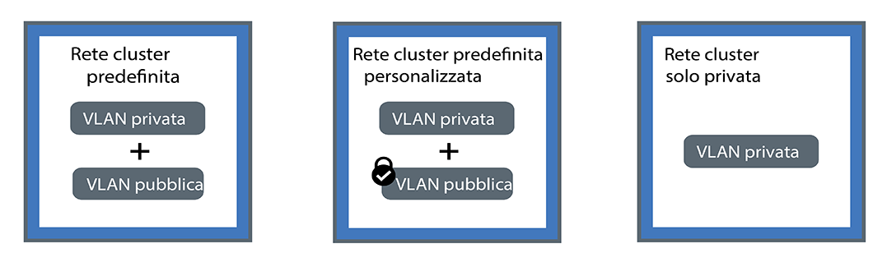

---

copyright:
  years: 2014, 2018
lastupdated: "2018-12-05"

---

{:new_window: target="_blank"}
{:shortdesc: .shortdesc}
{:screen: .screen}
{:pre: .pre}
{:table: .aria-labeledby="caption"}
{:codeblock: .codeblock}
{:tip: .tip}
{:note: .note}
{:important: .important}
{:deprecated: .deprecated}
{:download: .download}

# Pianificazione della rete in cluster e privata
{: #planning}

Pianifica una configurazione di rete per il tuo cluster {{site.data.keyword.containerlong}}.
{: shortdesc}

## Descrizione della rete in cluster
{: #in-cluster}

A tutti i pod che vengono distribuiti in un nodo di lavoro viene assegnato un indirizzo IP privato nell'intervallo 172.30.0.0/16 e vengono instradati solo tra i nodi di lavoro. Per evitare conflitti, non utilizzare questo intervallo di IP sui nodi che comunicano con i tuoi nodi di lavoro. I nodi di lavoro e i pod possono comunicare in modo sicuro sulla rete privata utilizzando indirizzi IP privati. Tuttavia, quando un pod ha un arresto anomalo o un nodo di lavoro deve essere ricreato, viene assegnato un nuovo
indirizzo IP.

Per impostazione predefinita, è difficile tenere traccia degli indirizzi IP privati mutevoli per le applicazioni che devono essere ad alta disponibilità. Puoi invece utilizzare le funzioni di rilevamento integrate del servizio Kubernetes per esporre le applicazioni come servizi IP cluster sulla rete privata. Un servizio Kubernetes raggruppa un insieme di pod e fornisce una connessione di rete a questi pod. Questa connessione fornisce la connettività ad altri servizi nel cluster senza esporre l'effettivo indirizzo IP privato di ciascun pod. Ai servizi viene assegnato un indirizzo IP in cluster accessibile solo all'interno del cluster.
* Cluster più vecchi: nei cluster creati prima del febbraio 2018 nella zona dal13 o prima dell'ottobre 2017 in qualsiasi altra zona, ai servizi viene assegnato un IP tra i 254 IP nell'intervallo 10.10.10.0/24. Se hai raggiunto il limite di 254 e hai bisogno di altri servizi, devi creare un nuovo cluster.
* Cluster più recenti: nei cluster creati dopo il febbraio 2018 nella zona dal13 o dopo l'ottobre 2017 in qualsiasi altra zona, ai servizi viene assegnato un IP tra i 65.000 IP nell'intervallo 172.21.0.0/16.

Per evitare conflitti, non utilizzare questo intervallo di IP sui nodi che comunicano con i tuoi nodi di lavoro. Viene creata anche una voce di ricerca DNS per il servizio e viene memorizzata nel componente `kube-dns` del cluster. La voce DNS contiene il nome del servizio, lo spazio dei nomi in cui è stato creato il servizio e il link all'indirizzo IP in cluster assegnato.

Per accedere a un pod che si trova dietro un servizio cluster, le applicazioni possono usare l'indirizzo IP in cluster del servizio o inviare una richiesta utilizzando il nome del servizio. Quando usi il nome del servizio, il nome viene ricercato nel componente `kube-dns` e instradato all'indirizzo IP in cluster del servizio. Quando viene raggiunto da richieste, il servizio ne esegue l'inoltro ai pod in misura uguale, indipendentemente dagli indirizzi IP in cluster dei pod e dal nodo di lavoro su cui sono distribuiti.

 

## Descrizione delle connessioni VLAN e delle interfacce di rete
{: #interfaces}

{{site.data.keyword.containerlong_notm}} fornisce delle VLAN dell'infrastruttura IBM Cloud (SoftLayer) che garantiscono delle prestazioni di rete di qualità e un isolamento della rete per i nodi di lavoro. Una VLAN configura un gruppo di nodi di lavoro come se fossero collegati con lo stesso cavo fisico. Le VLAN sono dedicate al tuo account {{site.data.keyword.Bluemix_notm}} e non sono condivise tra i clienti IBM.

Per impostazione predefinita, tutti i cluster sono connessi a una VLAN privata. La VLAN privata determina l'indirizzo IP privato che viene assegnato a ciascun nodo di lavoro. I tuoi nodi di lavoro hanno un'interfaccia di rete privata e sono accessibili sulla rete privata. Quando crei un cluster che è anche connesso a una VLAN pubblica, il tuo cluster ha anche un'interfaccia di rete pubblica. La VLAN pubblica consente ai nodi di lavoro di connettersi automaticamente e in modo protetto al master. Per ulteriori informazioni sulle VLAN predefinite per il tuo cluster, vedi [VLAN, sottoreti e IP predefiniti per i cluster](cs_subnets.html#default_vlans_subnets).

Delle impostazioni di rete cluster possono essere definite dalle interfacce di rete del cluster:

* **Rete cluster predefinita**: un cluster con sia un'interfaccia di rete privata che una pubblica
* **Rete cluster predefinita personalizzata**: un cluster con sia un'interfaccia di rete privata che una pubblica e delle politiche di rete Calico per bloccare il traffico pubblico in entrata
* **Rete cluster solo privata**: un cluster con solo un'interfaccia di rete privata

Fai clic su una delle seguenti impostazioni per pianificare la rete per il tuo cluster:

<map name="home_map" id="home_map">
<area href="#both_vlans" alt="Pianificazione della rete cluster predefinita" title="Pianificazione della rete cluster predefinita" shape="rect" coords="-7, -8, 149, 211" />
<area href="#both_vlans_private" alt="Pianificazione della rete cluster predefinita personalizzata" title="Pianificazione della rete cluster predefinita personalizzata" shape="rect" coords="196, -1, 362, 210" />
<area href="#private_vlan" alt="Pianificazione della rete cluster solo privata" title="Pianificazione della rete cluster solo privata" shape="rect" coords="409, -10, 572, 218" />
</map>

 

## Pianificazione della rete cluster predefinita
{: #both_vlans}

Per impostazione predefinita, {{site.data.keyword.containerlong_notm}} configura il tuo cluster con l'accesso a una VLAN pubblica e a una VLAN privata.
{:shortdesc}

**Cosa ottiene il mio cluster con questa impostazione?**
* Un indirizzo IP pubblico per ciascun nodo di lavoro, che fornisce ai nodi di lavoro un'interfaccia di rete pubblica
* Un indirizzo IP privato per ciascun nodo di lavoro, che fornisce ai nodi di lavoro un'interfaccia di rete privata
* Una connessione automatica OpenVPN protetta tra tutti i nodi di lavoro e il master

**Perché potrei utilizzare questa impostazione?**

* Hai un'applicazione che deve essere accessibile a Internet pubblico in un cluster a zona singola.
* Hai un'applicazione che deve essere accessibile a Internet pubblico in un cluster multizona. Poiché devi abilitare lo [spanning della VLAN](cs_subnets.html#subnet-routing) per creare un cluster multizona, il cluster può comunicare con altri sistemi che sono connessi a qualsiasi VLAN privata nello stesso account IBM Cloud. Per isolare il tuo cluster multizona sulla rete privata, puoi utilizzare le [Politiche di rete Calico](cs_network_policy.html#isolate_workers).

**Quali sono le mie opzioni per gestire l'accesso pubblico e privato al mio cluster?**
 Le seguenti sezioni descrivono le funzionalità tra {{site.data.keyword.containerlong_notm}} che puoi utilizzare per configurare la rete per i cluster connessi a una VLAN pubblica e a una VLAN privata.

### Esponi le tue applicazioni con i servizi di rete
{: #both_vlans_services}

L'interfaccia di rete pubblica per i nodi di rete è protetta dalle [impostazioni della politica di rete Calico predefinite](cs_network_policy.html#default_policy) configurate su ogni nodo di lavoro durante la creazione del cluster. Per impostazione predefinita, tutto il traffico di rete in uscita è consentito per tutti i nodi di lavoro. Il traffico di rete in entrata è bloccato, fatta eccezione per alcune porte. Queste porte sono aperte in modo che IBM possa monitorare il traffico di rete e installare automaticamente gli aggiornamenti di sicurezza per il master Kubernetes.

Se vuoi esporre le tue applicazioni al pubblico oppure a una rete privata, puoi creare dei servizi NodePort, LoadBalancer o Ingress pubblici o privati. Per ulteriori informazioni su ciascun servizio, vedi [Scelta di un servizio NodePort, LoadBalancer o Ingress](cs_network_planning.html#external).

### Facoltativo: isolamento dei carichi di lavoro di rete nei nodi di lavoro edge
{: #both_vlans_edge}

I nodi di lavoro edge possono migliorare la sicurezza del tuo cluster consentendo a un minor numero di nodi di lavoro di essere accessibili esternamente e isolando il carico di lavoro della rete. Per assicurarti che i pod Ingress e del programma di bilanciamento del carico vengano distribuiti solo ai nodi di lavoro specificati, [etichetta i nodi di lavoro come nodi edge](cs_edge.html#edge_nodes). Per impedire anche l'esecuzione di altri carichi di lavoro sui nodi edge, [danneggia i nodi edge](cs_edge.html#edge_workloads).

### Facoltativo: connettiti a una rete in loco o IBM Cloud privato utilizzando la VPN strongSwan
{: #both_vlans_vpn}

Per connettere in modo sicuro i tuoi nodi di lavoro e le applicazioni a una rete in loco, puoi impostare un [servizio VPN IPSec strongSwan ](https://www.strongswan.org/about.html). Il servizio VPN IPSec strongSwan fornisce un canale di comunicazione end-to-end protetto su Internet basato sulla suite di protocolli IPSec (Internet Protocol Security) standard del settore.
* Per configurare una connessione protetta tra il tuo cluster e una rete in loco, [configura e distribuisci il servizio VPN IPSec strongSwan](cs_vpn.html#vpn-setup) direttamente in un pod nel tuo cluster.
* Per configurare una connessione protetta tra il tuo cluster e un'istanza IBM Cloud privato, vedi [Connessione del tuo cloud pubblico e privato con la VPN strongSwan](cs_hybrid.html#hybrid_vpn).

 

## Pianificazione della rete cluster predefinita personalizzata
{: #both_vlans_private}

Per impostazione predefinita, {{site.data.keyword.containerlong_notm}} configura il tuo cluster con l'accesso a una VLAN pubblica e a una VLAN privata. Tuttavia, puoi personalizzare l'impostazione di rete predefinita utilizzando le politiche di rete per bloccare l'accesso pubblico.
{:shortdesc}

**Cosa ottiene il mio cluster con questa impostazione?**
* Un indirizzo IP pubblico per ciascun nodo di lavoro, che fornisce ai nodi di lavoro un'interfaccia di rete pubblica
* Un indirizzo IP privato per ciascun nodo di lavoro, che fornisce ai nodi di lavoro un'interfaccia di rete privata
* Una connessione automatica OpenVPN protetta tra tutti i nodi di lavoro e il master

**Perché potrei utilizzare questa impostazione?**

* Hai un'applicazione in un cluster a zona singola. Vuoi esporre l'applicazione solo ai pod all'interno del cluster o in altri cluster collegati alla stessa VLAN privata.
* Hai un'applicazione in un cluster multizona. Vuoi esporre l'applicazione solo ai pod all'interno del cluster o in altri cluster collegati alle stesse VLAN private del tuo cluster. Tuttavia, poiché è necessario abilitare lo [spanning della VLAN](cs_subnets.html#subnet-routing) per i cluster multizona, gli altri sistemi connessi a una VLAN privata nello stesso account IBM Cloud possono accedere al cluster. Vuoi isolare il tuo cluster multizona dagli altri sistemi.

**Quali sono le mie opzioni per gestire l'accesso pubblico e privato al mio cluster?** Le seguenti sezioni descrivono le funzionalità tra {{site.data.keyword.containerlong_notm}} che puoi utilizzare per configurare la rete solo privata e bloccare la rete pubblica per i cluster connessi a una VLAN pubblica e a una VLAN privata.

### Esponi le tue applicazioni con i servizi di rete privata e proteggi il tuo cluster dall'accesso pubblico con le politiche di rete Calico
{: #both_vlans_private_services}

L'interfaccia di rete pubblica per i nodi di rete è protetta dalle [impostazioni della politica di rete Calico predefinite](cs_network_policy.html#default_policy) configurate su ogni nodo di lavoro durante la creazione del cluster. Per impostazione predefinita, tutto il traffico di rete in uscita è consentito per tutti i nodi di lavoro. Il traffico di rete in entrata è bloccato, fatta eccezione per alcune porte. Queste porte sono aperte in modo che IBM possa monitorare il traffico di rete e installare automaticamente gli aggiornamenti di sicurezza per il master Kubernetes.

Se vuoi esporre le tue applicazioni solo su una rete privata, puoi creare dei servizi NodePort, a LoadBalancer o Ingress privati. Per ulteriori informazioni sulla pianificazione di rete esterna privata, vedi [Pianificazione di una rete esterna privata per la configurazione di una VLAN pubblica e privata](cs_network_planning.html#private_both_vlans).

Tuttavia, le politiche di rete Calico predefinite consentono anche il traffico di rete pubblica in entrata da Internet a questi servizi. Puoi creare politiche Calico per bloccare invece tutto il traffico pubblico verso i servizi. Ad esempio, un servizio NodePort apre una porta su un nodo di lavoro sia sull'indirizzo IP privato che su quello pubblico del nodo di lavoro. Un servizio del programma di bilanciamento del carico con un indirizzo IP privato portatile apre un NodePort pubblico su ogni nodo di lavoro. Devi creare una [politica di rete preDNAT Calico](cs_network_policy.html#block_ingress) per bloccare le NodePort pubbliche.

Per fare un esempio, supponiamo che hai creato un servizio di programma di bilanciamento del carico privato. Hai anche creato una politica preDNAT Calico per impedire al traffico pubblico di raggiungere le NodePort pubbliche aperte dal programma di bilanciamento del carico. A questo programma di bilanciamento del carico privato possono accedere:
* [Qualsiasi pod in quello stesso cluster](#in-cluster)
* Qualsiasi pod in qualsiasi cluster connesso alla stessa VLAN privata
* Se hai lo [spanning VLAN abilitato](cs_subnets.html#subnet-routing), qualsiasi sistema connesso a una qualsiasi delle VLAN private nello stesso account IBM Cloud
* Se non sei nell'account IBM Cloud ma ancora dietro il firewall aziendale, qualsiasi sistema tramite una connessione VPN alla sottorete su cui si trova l'IP del programma di bilanciamento del carico
* Se sei in un account IBM Cloud differente, qualsiasi sistema tramite una connessione VPN alla sottorete su cui si trova l'IP del programma di bilanciamento del carico

### Isola il tuo cluster sulla rete privata
{: #isolate}

Se hai un cluster multizona, più VLAN per un cluster a zona singola o più sottoreti sulla stessa VLAN, devi [abilitare lo spanning della VLAN](/docs/infrastructure/vlans/vlan-spanning.html#vlan-spanning) in modo che i tuoi nodi di lavoro possano comunicare tra loro sulla rete privata. Tuttavia, quando lo spanning della VLAN è abilitato, qualsiasi sistema connesso a qualsiasi VLAN privata nello stesso account IBM Cloud può accedere ai tuoi nodi di lavoro. Puoi isolare il tuo cluster multizona da altri sistemi sulla rete privata utilizzando le [politiche di rete Calico](cs_network_policy.html#isolate_workers). Queste politiche consentono anche in traffico in entrata (ingress) e in uscita (egress) per gli intervalli IP privati e le porte che hai aperto nel tuo firewall privato.

### Facoltativo: isolamento dei carichi di lavoro di rete nei nodi di lavoro edge
{: #both_vlans_private_edge}

I nodi di lavoro edge possono migliorare la sicurezza del tuo cluster consentendo a un minor numero di nodi di lavoro di essere accessibili esternamente e isolando il carico di lavoro della rete. Per assicurarti che i pod Ingress e del programma di bilanciamento del carico vengano distribuiti solo ai nodi di lavoro specificati, [etichetta i nodi di lavoro come nodi edge](cs_edge.html#edge_nodes). Per impedire anche l'esecuzione di altri carichi di lavoro sui nodi edge, [danneggia i nodi edge](cs_edge.html#edge_workloads).

Quindi, usa una [politica di rete preDNAT Calico](cs_network_policy.html#block_ingress) per bloccare il traffico verso le porte del nodo pubblico sui cluster che stanno eseguendo i nodi di lavoro edge. Il blocco delle porte del nodo assicura che i nodi di lavoro edge siano gli unici nodi di lavoro a gestire il traffico in entrata.

### Facoltativo: connettiti a una rete in loco o IBM Cloud privato utilizzando la VPN strongSwan
{: #both_vlans_private_vpn}

Per connettere in modo sicuro i tuoi nodi di lavoro e le applicazioni a una rete in loco, puoi impostare un [servizio VPN IPSec strongSwan ](https://www.strongswan.org/about.html). Il servizio VPN IPSec strongSwan fornisce un canale di comunicazione end-to-end protetto su Internet basato sulla suite di protocolli IPSec (Internet Protocol Security) standard del settore.
* Per configurare una connessione protetta tra il tuo cluster e una rete in loco, [configura e distribuisci il servizio VPN IPSec strongSwan](cs_vpn.html#vpn-setup) direttamente in un pod nel tuo cluster.
* Per configurare una connessione protetta tra il tuo cluster e un'istanza IBM Cloud privato, vedi [Connessione del tuo cloud pubblico e privato con la VPN strongSwan](cs_hybrid.html#hybrid_vpn).

 

## Pianificazione della rete cluster solo privata
{: #private_vlan}

Puoi scegliere di [creare un cluster solo VLAN privata](cs_clusters.html#clusters_cli) includendo l'indicatore `--private-only` nella CLI. Quando sono connessi solo a una VLAN privata, i tuoi nodi di lavoro non possono connettersi automaticamente al master. Devi utilizzare un'applicazione gateway per connettere i nodi di lavoro al master. Puoi anche utilizzare l'applicazione gateway come firewall per proteggere il tuo cluster da accessi indesiderati.
{:shortdesc}

**Cosa ottiene il mio cluster con questa impostazione?**
* Un indirizzo IP privato per ciascun nodo di lavoro, che fornisce ai nodi di lavoro un'interfaccia di rete privata

**Cosa non ottiene il mio cluster con questa impostazione?**
* Un indirizzo IP pubblico per ogni nodo di lavoro, che fornisce ai nodi di lavoro un'interfaccia di rete pubblica. Il cluster non è mai disponibile al pubblico.
* Una connessione automatica tra tutti i nodi di lavoro e il master. Devi fornire questa connessione [ configurando un'applicazione gateway](#private_vlan_gateway).

**Perché potrei utilizzare questa impostazione?**
 Hai dei requisiti di sicurezza specifici oppure hai bisogno di creare delle politiche di rete personalizzate e delle regole di instradamento per fornire una sicurezza di rete dedicata. Nota che l'utilizzo di un'applicazione gateway comporta dei costi separati. Per i dettagli, vedi la [documentazione](/docs/infrastructure/fortigate-10g/explore-firewalls.html).

**Quali sono le mie opzioni per gestire l'accesso pubblico e privato al mio cluster?**
 Le seguenti sezioni descrivono le funzionalità tra {{site.data.keyword.containerlong_notm}} che puoi utilizzare per configurare la rete per i cluster connessi solo a una VLAN privata.

### Configurazione di un'applicazione gateway
{: #private_vlan_gateway}

Se i nodi di lavoro sono configurati solo con una VLAN privata, devi configurare una soluzione alternativa per la connettività di rete tra i tuoi nodi di lavoro e il master. Puoi configurare un firewall con politiche di rete personalizzate per fornire una sicurezza di rete dedicata per il tuo cluster standard e per rilevare e risolvere intrusioni di rete. Ad esempio, puoi scegliere di configurare un [Virtual Router Appliance](/docs/infrastructure/virtual-router-appliance/about.html) o un [Fortigate Security Appliance](/docs/infrastructure/fortigate-10g/about.html) in modo che funga da firewall e blocchi il traffico non desiderato. Quando configuri un firewall, devi anche [aprire le porte e gli indirizzi IP necessari](cs_firewall.html#firewall_outbound) per ogni regione in modo che il master e i nodi di lavoro possano comunicare.

Se hai un'applicazione router esistente e aggiungi quindi un cluster, le nuove sottoreti portatili ordinate per il cluster non sono configurate sull'applicazione router. Per utilizzare i servizi di rete, devi abilitare l'instradamento tra le sottoreti sulla stessa VLAN [abilitando lo spanning delle VLAN](cs_subnets.html#vra-routing).
{: important}

### Esposizione delle tue applicazioni con i servizi di rete privati
{: #private_vlan_services}

Per rendere accessibile la tua applicazione solo da una rete privata, puoi usare i servizi NodePort, LoadBalancer o Ingress privati. Poiché i tuoi nodi di lavoro non sono connessi a una VLAN pubblica, a questi servizi non viene instradato alcun traffico pubblico. Devi anche [aprire le porte e gli indirizzi IP richiesti](cs_firewall.html#firewall_inbound) per consentire il traffico in entrata a questi servizi.

Per ulteriori informazioni su ciascun servizio, vedi [Scelta di un servizio NodePort, LoadBalancer o Ingress](cs_network_planning.html#external).

### Facoltativo: connessione a un database in loco utilizzando l'applicazione gateway
{: #private_vlan_vpn}

Per connettere in modo sicuro i tuoi nodi di lavoro e le applicazioni a una rete in loco, devi configurare un gateway VPN. Puoi utilizzare la VRA o la FSA che hai configurato precedentemente per configurare anche un endpoint VPN IPSec. Per configurare una VRA, vedi [Configurazione della connettività VPN con una VRA](cs_vpn.html#vyatta).
